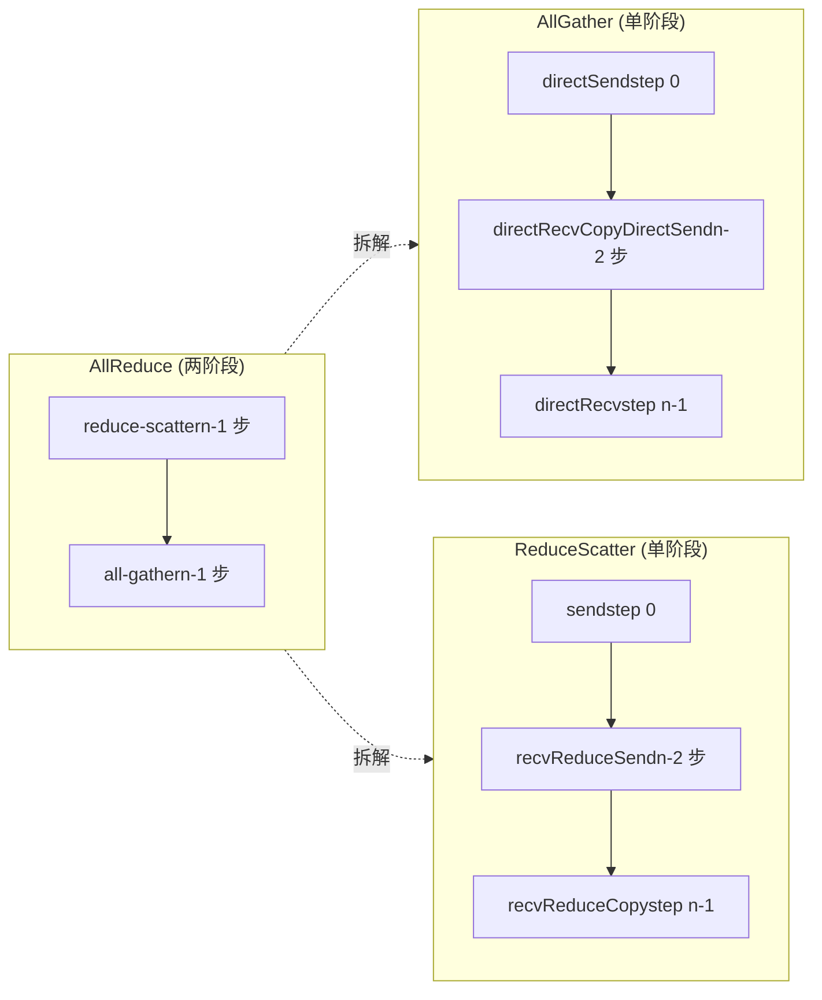
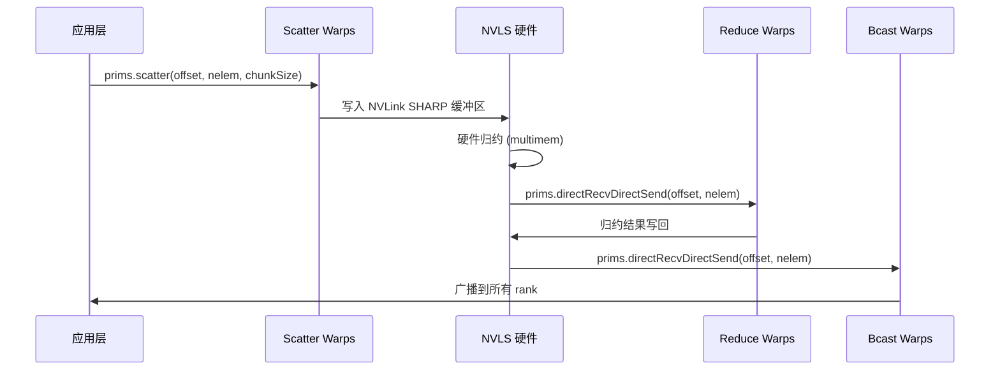

# 第 10 章：集団通信アルゴリズムカーネル：AllReduce、AllGather、ReduceScatter のデバイス側実装

前の章では LL、LL128、Simple の三つのプロトコルプリミティブを分解した。これらはデータ転送の「エンジン」であるが、エンジン自体は何を運ぶか、どこへ運ぶか、どの順序で運ぶかを知らない。本章で見る src/device 下のこのアルゴリズムカーネルファイル群は「トランスミッション」である——これらは AllReduce、AllGather、ReduceScatter といった集合通信セマンティクスを、prims.directSend、prims.directRecvReduceDirectSend のようなプリミティブ呼び出しの連続に翻訳する。本章の核心的な矛盾を一言でまとめると：同じ AllReduce に対して、なぜ Ring、Tree、CollNet、NVLS の四つの完全に異なるデバイス側実装が必要なのか？答えは「データフロートポロジ」と「ハードウェア能力」のマッチングに隠されている。Ring は最小のネットワーク帯域で二段階パイプラインを行い、Tree は木形帰約でレイテンシを log(n) に圧縮し、CollNet/NVLS は帰約を NIC や NVLink スイッチにオフロードする。本章では一つずつ分解して見ていく。

# 10.1 Ring AllReduce：二段階パイプラインが kernel 内でどのように実現されるか

## 直感モデル：リング状パイプライン上の「リレー競走」

n 人の作業員が円形に立ち、各人が一箱の原料を持っていると想像しよう。AllReduce の目標は、最終的に全員が「すべての原料を混合した完成品」を手に入れることである。Ring アルゴリズムの方法は二段階に分かれる：第一段階（reduce-scatter）では各人が箱をリングに沿って渡し、一站ごとに自分の原料を混ぜ込み、n-1 站回った後、各人の手にはちょうど「完全混合」の完成品が一つあるが、それは 1/n の割合に過ぎない；第二段階（all-gather）ではこれらの完成品の割合が再びリングに沿って一周し、各人がすべての割合を補完する。

もし Ring がなければ、最も素朴な方法は各 rank がデータを root に送り、root が帰約してからブロードキャストする——root のネットワーク帯域がボトルネックとなり、n が大きいほど遅くなる。Ring の巧妙さは：**各ランクの送信量と受信量は2(n-1)/n倍のデータ量で、nに依存せず全リンクに均等に分散される**。

## データ構造とメモリレイアウト

Ringアルゴリズムの中核状態は`ncclRing`構造体内にあり（device.hで定義、本章では展開しない）、`runRing`そのうち2つのフィールドのみを取り出す：

- `ring->index`：環内での本ランクの論理位置。「第jステップでどのchunkを処理すべきか」の計算に使用。
- `ring->prev` / `ring->next`：前駆と後続のランク番号。`Primitives`コンストラクタのrecv/send peer引数として使用。

重要な分割パラメータは`ncclCollCbdPart`で計算される（[FACT:src/device/all_reduce.h:21-22]）：

```
ncclCollCbdPart(work, ncclShmem.channelId, Proto::Id, sizeof(T), (ssize_t*)nullptr, &gridOffset, &channelCount, &chunkCount);
```

この関数は通信ドメイン全体のデータをchannelで分割し、3つの値を出力する：`gridOffset`（本channelが担当するデータのバッファ全体における開始オフセット）、`channelCount`（本channelが担当する要素の総数）、`chunkCount`（各ランクに割り当てられるchunkの要素数）。`chunkCount`はRingアルゴリズムの粒度——各ステップで1つのchunkを転送する。

`loopCount = nranks * chunkCount`（[FACT:src/device/all_reduce.h:23]）は「一周分」で処理されるデータ量を表す。外側ループ`for (elemOffset = 0; elemOffset < channelCount; elemOffset += loopCount)`（[FACT:src/device/all_reduce.h:34]）は：channelのデータ量が一周で処理できる量を超える場合、複数周に分けて実行することを意味する。

## Step-by-Step Walkthrough：1回のRing AllReduceの完全な呼び出しフロー

シナリオ：4ランク（nranks=4）、本ランクの`ringIx=0`，`chunkCount=100`，`channelCount=400`（ちょうど一周）。

**第0ステップ：「自分のchunk」を次のGPUに送る**（[FACT:src/device/all_reduce.h:42-47]）

```
chunk = modRanks(ringIx + nranks - 1);   // = 3
chunkOffset = chunk * chunkCount;         // = 300
offset = gridOffset + elemOffset + chunkOffset;
nelem = min(chunkCount, remCount - chunkOffset);
prims.directSend(offset, offset, nelem);
```

`modRanks`はlambdaで、nranksの剰余減算を行う（[FACT:src/device/all_reduce.h:40]）。`ringIx + nranks - 1`は「本ランクの前のchunk番号」を表す。なぜ第0ステップでchunk 3を送るのか？Ringのreduce-scatter段階では、各ランクはまず自分が「保持すべきでない」データ（つまり前駆ランクのchunk）を送信するからである。`directSend`送信のみで受信しない。この時点ではまだデータを受信していないため。

**第1からnranks-2ステップ：受信しながら帰約しながら転送**（[FACT:src/device/all_reduce.h:50-56]）

```
for (int j = 2; j 计算 chunkCount/loopCount"] --> loop{"elemOffset |否| done["返回"]
    loop -->|是| s0["step 0: directSendchunk = ringIx-1"]
    s0 --> mid{"j 从 2 到 nranks-1?"}
    mid -->|是| s1["directRecvReduceDirectSendchunk = ringIx-j"]
    s1 --> mid
    mid -->|否| s2["step nranks-1directRecvReduceCopyDirectSendpostOp=true"]
    s2 --> ag{"j 从 1 到 nranks-2?"}
    ag -->|是| s3["directRecvCopyDirectSend纯转发"]
    s3 --> ag
    ag -->|否| s4["directRecv收最后一块"]
    s4 --> loop
```

## 設計思考：なぜRingのchunk順序は「逆走り」なのか

chunk番号の規則に注意：第0ステップで`ringIx-1`を送信、第jステップで`ringIx-j`を処理、最終ステップで`ringIx+0`を処理。これは**反時計回り**で進む。なぜか？Ringの各ランクは「自分が帰約を担当するchunk」（つまり`ringIx+0`）のみを保持し、他のchunkは通過するだけだからである。反時計回りの進行により：あるchunkが一周して起点に戻った時、ちょうどnranks回の帰約が完了し、最終結果が生成される。時計回りに進むと、chunkは誤ったランクで帰約が完了してしまう。

## 本番の落とし穴：`remCount < loopCount`時のアライメントトラップ

[FACT:src/device/all_reduce.h:38]見落とされやすいコードが1行ある：

```
if (remCount = 256) nthreadsSplit += 64;
} else {
  nthreadsSplit = (nthreads * 7 / (10 * WARP_SIZE)) * WARP_SIZE;
}
```

Simpleプロトコルは半分に分割；LL/LL128プロトコルは7:3に分割する。なぜなら「3つのソースからデータを受信して帰約する」方が「3つのターゲットに送信する」よりも計算集約的であるため、帰約グループにより多くのスレッドを割り当てる。

そして`tid < nthreadsSplit`のスレッドが帰約上昇（[FACT:src/device/all_reduce.h:175-202]）を行い、残りのスレッドがブロードキャスト下降（[FACT:src/device/all_reduce.h:203-224]）を行う。2つのグループは`Proto::MaxGroupWidth`オフセットで各自の通信グループを区別する（[FACT:src/device/all_reduce.h:189]の`0 * Proto::MaxGroupWidth`と[FACT:src/device/all_reduce.h:210]の`1 * Proto::MaxGroupWidth`）。

## 設計思考：なぜTreeのルートノードを特別扱いするのか

ツリー帰約のルートノードは「集約点」であり、その受信量は子ノード数の倍数で、送信量はゼロである（帰約フェーズ）。もしルートノードも汎用の`directRecvReduceDirectSend`を使うと、`tree->up`（-1）に送信しようとして範囲外アクセスが発生する。そのため`if (tree->up == -1)`分岐で個別に処理する必要がある。同様にリーフノードの`tree->down[0] == -1`判定も同様である。

## 本番の落とし穴：Treeアルゴリズムの「ホットルート」問題

Treeのルートノードは全ての帰約トラフィックを担うため、ルートノードのGPUがたまたま遅いノード（例えばPCIe帯域が制限されている）である場合、AllReduce全体が遅くなる。NCCLの対策は：**各channelで異なるルートを選ぶ**ことで、ルートノードの負荷を複数のrankに分散させる。これが`runTreeSplit`でルートノード分岐が`FanSymmetric<NCCL_MAX_TREE_ARITY_TOP>`（[FACT:src/device/all_reduce.h:168]）を使う理由である——複数の子ノードの帰約を同時に処理する必要がある。本番環境でTree AllReduceの性能が不均一な場合、channelのルートノード分布が均等か確認する。

# 10.3 AllGatherとReduceScatter：Ringの「半行程」変種

## 直感モデル：AllReduceを2つに分割

AllGatherとReduceScatterは本質的にAllReduceの2つのフェーズをそれぞれ独立したAPIにしたものである。AllGatherは「収集」のみを行う——各rankが1份のデータを提供し、最終的に全員が全データを取得する。ReduceScatterは「帰約+分散」のみを行う——全員がデータを提供し、帰約後に各人が1份を取得する。

これら2つの独立したAPIがなければ、ユーザーが「先に帰約してから収集」または「先に収集してから帰約」を行う場合、AllReduceを呼んで手動でスライスするしかなく、帯域の半分を浪費する。

## AllGatherのRing実装

`all_gather.h`の`runRing`（[FACT:src/device/all_gather.h:14-88]）はAllReduceより簡単：帰約がなく、コピー転送のみ。

**第0ステップ：自身のデータを次のGPUにプッシュ**（[FACT:src/device/all_gather.h:51-60]）

```
rankDest = ringRanks[0];
offset = dataOffset + rankDest * count;
if ((inputBuf + dataOffset == outputBuf + offset) || isNetOffload) {
  prims.directSend(dataOffset, offset, nelem);
} else {
  prims.directCopySend(dataOffset, offset, nelem);
}
```

ここにin-place判定がある：もし`inputBuf + dataOffset == outputBuf + offset`なら、入力と出力が同じメモリ（in-place AllGather）であり、直接`directSend`；そうでなければ`directCopySend`（先に出力にコピーしてから送信）。

**中間のnranks-2ステップ：純粋な転送**（[FACT:src/device/all_gather.h:62-67]）

```
prims.directRecvCopyDirectSend(offset, offset, nelem);
```

**最終ステップ：最後のブロックを受信**（[FACT:src/device/all_gather.h:69-74]）

```
prims.directRecv(offset, nelem);
```

## isNetOffload：単一warpでネットワーク駆動 + 複数warpで並列コピー

[FACT:src/device/all_gather.h:28-36]には特殊な分岐がある：

```
if (isNetOffload) {
  workNthreads = WARP_SIZE;
  chunkCount = NCCL_MAX_NET_SIZE;
} else {
  workNthreads = nthreads;
}
```

のとき`isNetOffload=true`（単一RPN + ネットワーク登録モード）、1つのwarpのみでRing通信を駆動し、残りのwarpは並列で「ソースデータをターゲットバッファにコピー」（[FACT:src/device/all_gather.h:76-82]）を行う。これは非in-place AllGather時に、コピーオーバーヘッドと通信オーバーヘッドをオーバーラップさせるためである。

最後に`barrier_sync(14, nthreads)`（[FACT:src/device/all_gather.h:87]）があり、コメントで明確に説明されている：全warpが完了するまで待つ必要がある。そうでなければ次のworkがoutputBufを再利用して競合が発生する可能性がある。barrier 14を使うのはprims自身のbarrierと`__syncthreads()`。

## を避けるためである。

`reduce_scatter.h`ReduceScatterのRing実装`runRing`（[FACT:src/device/reduce_scatter.h:14-56]の

**）はAllReduceのreduce-scatterフェーズを単独で抽出したものである：**（[FACT:src/device/reduce_scatter.h:39-42]）

```
rankDest = ringRanks[nranks - 1];
offset = dataOffset + rankDest * count;
prims.send(offset, nelem);
```

**コピー**（[FACT:src/device/reduce_scatter.h:44-49]）

```
prims.recvReduceSend(offset, nelem);
```

**コピー**（[FACT:src/device/reduce_scatter.h:61-64]）

```
prims.recvReduceCopy(offset, dataOffset, nelem, /*postOp=*/true);
```

最後のステップに注意`recvReduceCopy`には2つの offset がある：`offset`（受信元）と`dataOffset`（ローカル入力）、帰約結果は`dataOffset`。

## データフロー比較図



## 本番の落とし穴：in-place 判定の境界

[FACT:src/device/all_gather.h:55]の in-place 判定`inputBuf + dataOffset == outputBuf + offset`はポインタの完全一致に依存する。ユーザーが渡した sendbuff と recvbuff にオフセットがあるが論理的には同じメモリブロックの場合、この判定は無効になり、`directCopySend`パスを通る——正しいがコピーが1回余分に発生する。本番環境では in-place AllGather 時に sendbuff と recvbuff が完全に一致することを確認することを推奨。

# 10.4 CollNet と NVLS：帰約をハードウェアにオフロード

## 直感的モデル：「スイッチ」に計算を手伝ってもらう

Ring と Tree はどちらも「GPU 自身が帰約を計算する」。CollNet と NVLS は発想を変えた：帰約操作をネットワークカード（CollNet）または NVLink スイッチ（NVLS）にオフロードする。GPU はデータを送信するだけで、ハードウェアが帰約を完了してからブロードキャストで戻す。これは「各作業員が自分で原料を混合する」から「原料を中央ミキサーに送り、ミキサーが混ぜてから配布する」への変化に似ている。

ハードウェアオフロードがなければ、帰約操作は GPU の SM リソースを占有し、帰約レイテンシを隠蔽できない。

## CollNet Direct のスレッド分担

`RunWorkColl<ncclFuncAllReduce, ..., NCCL_ALGO_COLLNET_DIRECT, ...>`の`run`（[FACT:src/device/all_reduce.h:249-386]）はスレッドを4つのグループに分ける：

```
const int nThreadsScatter = WARP_SIZE + ((hasUp && hasDn) ? COLLNET_COPY_THREADS : ...);
const int nThreadsGather = ((hasUp && hasDn) ? COLLNET_COPY_THREADS : ...);
const int nThreadsBcast = WARP_SIZE + ((hasUp && hasDn) ? COLLNET_COPY_THREADS : ...);
const int nThreadsReduce = work->nWarps * WARP_SIZE - nThreadsScatter - nThreadsGather - nThreadsBcast;
```

4つのスレッドグループがそれぞれ担当：Scatter（データを各 rail に分散）、Reduce（帰約後にネットワークへ送信）、Gather（各 rail から収集）、Bcast（ネットワークから受信後にブロードキャスト）。`COLLNET_COPY_THREADS = 96`（[FACT:src/device/all_reduce.h:250]）は固定のコピースレッド数。

## netRegUsed：ネットワーク登録モードでのバッファレイアウト

[FACT:src/device/all_reduce.h:280-288]には重要な分岐がある：

```
if (work->netRegUsed) {
  offsetBase = bid * chunkSize;
  maxNelems = size;
  peerOffset = nChannels * chunkSize;
} else {
  offsetBase = bid * direct->nHeads * chunkSize;
  maxNelems = direct->nHeads * chunkSize;
  peerOffset = chunkSize;
}
```

`netRegUsed`モードでは、バッファは channel ごとに連続配置され（`bid * chunkSize`）、peer オフセットは`nChannels * chunkSize`；非登録モードでは、head ごとに配置され（`bid * nHeads * chunkSize`）、peer オフセットは`chunkSize`。この差異は、ネットワーク登録モードがネットワークカードの DMA のためにバッファの連続性を要求することに起因する。

## NVLS の warp 割り当て

`RunWorkColl<ncclFuncAllReduce, ..., NCCL_ALGO_NVLS, ...>`の`run`（[FACT:src/device/all_reduce.h:391-523]）はより精细な warp 割り当てを使用：

```
const int bcastWarps = hasOut ? (work->regUsed ? ((totalWarps - 2) >> 1) - 1 : 2) : 0;
const int reduceWarps = work->regUsed ? (totalWarps - bcastWarps - 2) : (hasOut ? 3 : nranks regUsed ? 1 : (totalWarps - reduceWarps - bcastWarps + 1) >> 1;
const int gatherWarps = work->regUsed ? 1 : (totalWarps - reduceWarps - bcastWarps) >> 1;
```

`regUsed`モードでは、scatter/gather はそれぞれ 1 warp のみ（NVLS ハードウェアが登録メモリを直接操作するため）、reduce が大部分を占める；非登録モードでは、scatter/gather がそれぞれ約半分を占め、reduce は rank 数に応じて調整（≤6 なら 7 warp、それ以外は 5 warp）。

## タイミング交互図



## 本番の落とし穴：CollNet の`direct->out == -1`トラップ

[FACT:src/device/reduce_scatter.h:521]に一行ある：

```
if (direct->out == -1) __trap();
```

CollNet の out 接続が未確立（-1）の場合、直接`__trap()`すると kernel がクラッシュする。これは防御的プログラミング——CollNet はネットワークカードに依存し、ネットワークカードの初期化に失敗すると out が -1 になり、そのまま実行を続けると未定義動作を引き起こす。本番環境で kernel trap が見られたら、CollNet ネットワークカードが正常に初期化されているか確認する。

# 10.5 Broadcast と Reduce：最も単純な2つの集合操作

## Broadcast：root からのファンアウト

`broadcast.h`の`runRing`（[FACT:src/device/broadcast.h:14-64]）ロジックは非常に直接的：root ノードがデータを送信し、他のノードが転送し、最後のノードは受信のみ。

```
if (rank == root) {
  if (inputBuf == outputBuf || isNetOffload) {
    prims.directSend(offset, offset, nelem);
  } else {
    prims.directCopySend(offset, offset, nelem);
  }
} else if (nextRank == root) {
  prims.directRecv(offset, nelem);
} else {
  prims.directRecvCopyDirectSend(offset, offset, nelem);
}
```

3つの分岐：root が送信、root の前駆が受信、中間ノードが転送。注意`nextRank == root`が判定するのは「本ノードの次が root」、つまり本ノードがリング上の最後——受信のみで送信しない。

## Reduce：root への集約

`reduce.h`の`runRing`（[FACT:src/device/reduce.h:14-53]）は Broadcast の逆操作：

```
if (prevRank == root) {
  prims.send(offset, nelem);
} else if (rank == root) {
  prims.recvReduceCopy(offset, offset, nelem, /*postOp=*/true);
} else {
  prims.recvReduceSend(offset, nelem);
}
```

`prevRank == root`のノードは送信のみ（root の前駆）、root は受信と帰約のみ、中間ノードは受信しながら帰約し転送する。

## 設計思想：なぜ Broadcast/Reduce も Ring を使うのか

Broadcast と Reduce は理論上 Tree でより低レイテンシに実装できるが、NCCL が Ring を選ぶ理由は：**これら2つの操作のデータ量は通常小さく、Ring の実装がより単純で、AllReduce の Ring コードパスを再利用できる**。Tree の複雑さ（ルートノード選択、スレッド分割）は小メッセージシナリオでは利益が不明瞭。

## 本番の落とし穴：Broadcast の root ノード帯域幅ボトルネック

Broadcast の root ノードは全データを送信する必要があり、root が遅いノードだと Broadcast 全体が遅くなる。NCCL の対応は：**Broadcast もマルチ channel をサポートし、各 channel の root は異なってもよい**。ただし注意`work->root`はグローバルであり、全 channel が同じ root を共有する——これは Broadcast のセマンティクスによる（ソースは1つだけ）。本番環境で Broadcast が遅い場合、root ノードのネットワーク帯域幅を確認する。

# 10.6 アルゴリズム選択マトリクス：RunWorkColl テンプレート特殊化

すべてのアルゴリズムカーネルは`RunWorkColl`テンプレート特殊化で登録される（[FACT:src/device/all_reduce.h:228-788]）。各特殊化は「関数 × アルゴリズム × プロトコル」の組み合わせに対応：

| 関数 | アルゴリズム | プロトコル | 特殊化位置 |
| --- | --- | --- | --- |
| AllReduce | RING | SIMPLE | [FACT:src/device/all_reduce.h:230-233] |
| AllReduce | TREE | SIMPLE | [FACT:src/device/all_reduce.h:238-244] |
| AllReduce | COLLNET_DIRECT | SIMPLE | [FACT:src/device/all_reduce.h:249-386] |
| AllReduce | NVLS | SIMPLE | [FACT:src/device/all_reduce.h:391-523] |
| AllReduce | NVLS_TREE | SIMPLE | [FACT:src/device/all_reduce.h:528-634] |
| AllReduce | COLLNET_CHAIN | SIMPLE | [FACT:src/device/all_reduce.h:639-759] |
| AllReduce | RING | LL | [FACT:src/device/all_reduce.h:764-766] |
| AllReduce | TREE | LL | [FACT:src/device/all_reduce.h:771-773] |
| AllReduce | RING | LL128 | [FACT:src/device/all_reduce.h:778-780] |
| AllReduce | TREE | LL128 | [FACT:src/device/all_reduce.h:785-787] |

注意：**CollNet と NVLS は SIMPLE プロトコルのみをサポートする**。なぜなら、これら2つのアルゴリズムはハードウェアオフロードに依存しており、LL/LL128 の低遅延同期メカニズムはハードウェアオフロードと互換性がない——ハードウェアリダクションの遅延は LL のフラグポーリングよりもはるかに大きいため、LL を使うとかえってオーバーヘッドが増加する。

## プロトコル選択の内在的ロジック

- **LL**：小メッセージ（< 8KB）、低遅延優先。Ring と Tree の両方がサポート。
- **LL128**：中メッセージ（8KB - 1MB）、128 バイトアライメント。Ring と Tree の両方がサポート。
- **SIMPLE**：大メッセージ（> 1MB）、帯域幅優先。すべてのアルゴリズムがサポート。

## 本番環境の落とし穴：プロトコルとアルゴリズムの組み合わせ制限

ユーザーが強制的に`NCCL_PROTO=LL`を指定したが、アルゴリズムが CollNet の場合、NCCL はチューニング段階で SIMPLE にフォールバックする。本番環境でプロトコル設定が反映されない場合は、アルゴリズムがそのプロトコルをサポートしているか確認すること。

# 設計上の考察：なぜ同じ AllReduce ロジックにこれほど多くの実装が必要なのか

本章を振り返ると、AllReduce には Ring、Tree、CollNet Direct、CollNet Chain、NVLS、NVLS Tree の6つのアルゴリズム実装がある。これは冗長ではなく、**異なるハードウェアトポロジとメッセージサイズに対する最適解**：

- **Ring**：汎用、大メッセージに適し、帯域幅利用率が最高。
- **Tree**：大規模クラスタに適し、遅延 O(log n)。
- **CollNet**：リダクション対応 NIC を備えたクラスタに適し、GPU 計算をオフロード。
- **NVLS**：単一ノードの NVLink 全結合に適し、ハードウェアマルチキャストリダクション。

NCCL のチューニングモジュール（第5章）は、メッセージサイズ、rank 数、トポロジに基づいて自動選択する。デバイス側の実装は「各組み合わせが正しいこと」を保証するだけでよく、選択ロジックは host 側にある。

# 本章のまとめ

本章では`src/device`以下の6つのアルゴリズムカーネルファイルを分解した：

1. **Ring AllReduce**（[FACT:src/device/all_reduce.h:14-83]）：2段階パイプライン、reduce-scatter + all-gather、各段階 n-1 ステップ。

2. **Tree AllReduce**（[FACT:src/device/all_reduce.h:86-225]）：ツリー型リダクション、遅延 O(log n)、`runTreeSplit`スレッド分割でリダクション-ブロードキャストパイプラインを実現。

3. **AllGather**（[FACT:src/device/all_gather.h:14-88]）：Ring 単一段階、in-place と netOffload をサポート。

4. **ReduceScatter**（[FACT:src/device/reduce_scatter.h:14-56]）：Ring 単一段階、AllReduce の reduce-scatter 段階。

5. **Broadcast/Reduce**（[FACT:src/device/broadcast.h:14-64]、[FACT:src/device/reduce.h:14-53]）：最もシンプルな Ring 変種。

6. **CollNet/NVLS**（[FACT:src/device/all_reduce.h:247-635]）：ハードウェアオフロード、SIMPLE プロトコルのみサポート。

# 本章の考察とセルフチェック

Q1: Ring AllReduce の reduce-scatter 段階では、第0ステップで`directSend`を使用し、中間ステップで`directRecvReduceDirectSend`を使用し、最終ステップで`directRecvReduceCopyDirectSend`を使用する。最終ステップの`postOp=true`を除去した場合、どのようなシナリオで誤った結果が生じるか？

**参考解析**：`postOp=true`が後置操作（例えば平均を求める際の除算）をトリガーする。`ncclAvg`を例にとると、リダクションは総和、postOp は nranks で割る。`postOp`を除去すると、最終ステップはリダクションのみで除算を行わず、recvbuff には「平均」ではなく「総和」が格納される。reduce-scatter 段階では、各 rank は1つのチャンクの最終結果のみを保持し、このチャンクはまさに`ringIx+0`（[FACT:src/device/all_reduce.h:60]）。postOp が欠落している場合、このチャンクの総和は nranks で割られておらず、後続の all-gather 段階でこの誤った「総和」がすべての rank に伝播する。注意：postOp が必要なのは最終ステップのみである。なぜなら、このステップだけが「完全なリダクション」の結果を生成するからである。中間ステップのリダクションは部分和であり、postOp は不要。本番環境で AllReduce の結果が nranks 倍大きい場合は、postOp が正しく伝達されているか確認すること。

Q2: `runTreeSplit`LL/LL128 プロトコル下でスレッドを 7:3 に分割し（[FACT:src/device/all_reduce.h:163]）、Simple プロトコル下では 1:1 に分割する（[FACT:src/device/all_reduce.h:157]）。LL プロトコルも強制的に 1:1 に変更した場合、何が起こるか？

**参考解析**：LL/LL128 のリダクショングループは最大3つの子ノードからデータを受信してリダクションを行う（[FACT:src/device/all_reduce.h:187]の`FanAsymmetric<NCCL_MAX_TREE_ARITY, 1>`）、計算集約的。ブロードキャストグループはコピー転送のみを行う（[FACT:src/device/all_reduce.h:208]の`FanAsymmetric<1, NCCL_MAX_TREE_ARITY>`）、計算は軽い。7:3 分割によりリダクショングループは3路リダクションを処理するのに十分なスレッドを持ち、ブロードキャストグループはスレッドが少ないが十分である。1:1 に変更すると、リダクショングループのスレッドが不足し、リダクションがボトルネックになる。ブロードキャストグループのスレッドは過剰で無駄になる。さらに深刻なのは、LL プロトコルのフラグポーリングはビジーウェイトであり、スレッドが増えるとフラグ競合が増加する。本番環境で Tree AllReduce が LL プロトコル下で性能異常を示す場合は、`nthreadsSplit`の計算が変更されていないか確認すること。

Q3: AllGather の`isNetOffload`モードでは、1つの warp のみで Ring 通信を駆動し（[FACT:src/device/all_gather.h:32]）、残りの warp は並列コピーを行う（[FACT:src/device/all_gather.h:76-82]）。最後の`barrier_sync(14, nthreads)`（[FACT:src/device/all_gather.h:87]）を除去した場合、どのようなシナリオでデータ競合が発生するか？

**参考解析**：`barrier_sync`すべての warp（通信 warp とコピー warp を含む）が本 work を完了してから次の work に進むことを保証する。これを削除すると、コピー warp がまだ outputBuf を書き終えていないうちに通信 warp が次の work の通信を開始する可能性があり、次の work が同じ outputBuf を再利用するかもしれない。具体的なシナリオ：連続する2回の AllGather で、1回目のコピー warp がまだ outputBuf の末尾を書いている最中に、2回目の通信 warp がすでに outputBuf へ新しいデータを書き始め、1回目のデータが上書きされてしまう。コメントにも明確に書かれている：「otherwise, we can have contention if next work will use the outputBuf in this work」。デフォルトの barrier ではなく barrier 14 を使うのは、prims 内部の barrier と`__syncthreads()`を避け、デッドロックを防ぐためである。本番環境で AllGather の結果に偶発的な誤りが見つかった場合、`isNetOffload`パスの barrier が最適化で削除されていないか確認すること。

ここまでで、デバイス側のアルゴリズムカーネルがどのようにデータフローを組織するかを見てきた。各アルゴリズムは`Primitives`を通じて前章のプリミティブを呼び出し、アルゴリズム層は「誰が誰に送るか、どの chunk を送るか、リダクションかコピーか」だけを関心ごととする。次章では転送層の抽象化に踏み込み、P2P、SHM、NET、NVLS がどのように一つのインターフェースに統一されるか、そして host 側の proxy スレッドがデバイス側 kernel と協調してクロスマシン通信を完了する仕組みを見ていく。

核心的な法則：すべてのアルゴリズムは Primitives テンプレートクラスを通じてプリミティブを呼び出し、アルゴリズムは「データフローのトポロジー」のみを担当し、プリミティブは「データの移動」を担当する。この階層化により、新しいアルゴリズムを追加する際はトポロジーロジックを実装するだけでよく、低レベルの同期を気にする必要がない。しかしトポロジーがどう変わろうと、データは最終的に物理リンクを通じて転送される。次章では src/transport ディレクトリに踏み込み、NCCL が統一された transport インターフェースで P2P、SHM、NET、NVLS の差異をどのように隠蔽するか、そして各 transport の setup/connect/send/recv のセマンティクスを見ていく。これはクロスマシン通信を理解する基礎である。
