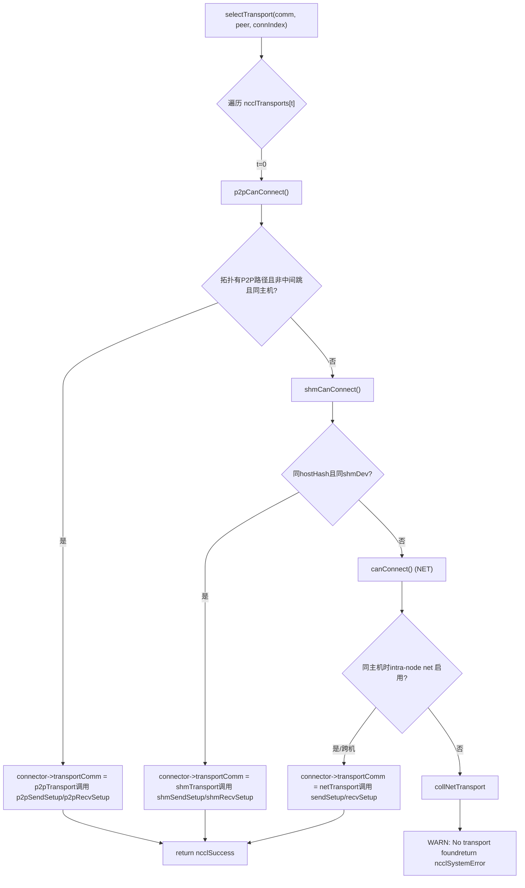
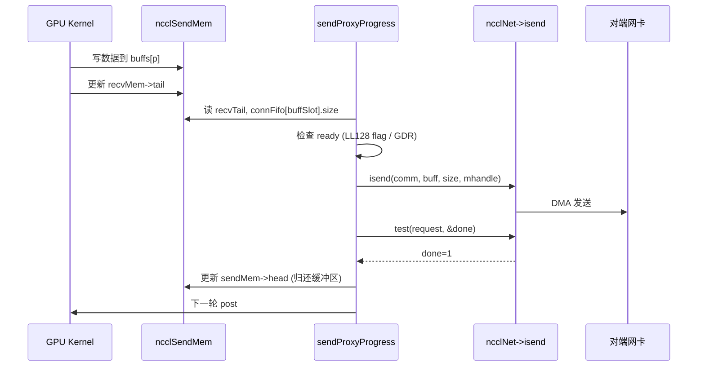

# 第 11 章：転送層の抽象化：P2P、SHM、NET、NVLS をいかに同一インターフェース下に統一するか

# 第11章：転送層の抽象化：P2P、SHM、NET、NVLS をいかに同一インターフェース下に統一するか

前章ではアルゴリズムカーネルを深く掘り下げ、Ring AllReduce がデータを分割して二段階でリダクションする方法、Tree AllReduce が木構造によってレイテンシを抑える方法を見てきた——しかしこれらのアルゴリズムは「誰が誰に送るか、どの chunk を送るか」という論理的なビューを定義するにすぎない。データは最終的に実際の物理リンク——NVLink、PCIe、共有メモリ、またはネットワークカード——を通過しなければならない。本章では src/transport ディレクトリを分解し、NCCL が統一された ncclTransport インターフェースで P2P、SHM、NET、NVLS という4つの物理チャネルを同一の顔として隠蔽し、アルゴリズムトポロジーから物理転送までのラストワンマイルを完成させる仕組みを見ていく。

# 一、統一インターフェース：ncclTransport がいかに4つの物理チャネルを隠蔽するか

## 直感的モデル

物流会社を想像してみよう：顧客が送るのが市内速達（P2P）、建物内伝達（SHM）、県をまたぐ輸送（NET）、専用線直通（NVLS）のいずれであっても、フロントでは一枚の「送り状」を記入するだけである。この送り状が`ncclTransport`構造体である——これは各輸送方式が`canConnect`、`setup`、`connect`、`free`などの固定アクションを提供しなければならないことを規定している。この抽象化層がなければ、上位のアルゴリズムは4セットの`if-else`を書いてどのリンクを通るか判断しなければならず、新しいハードウェアを追加するたびにすべてのアルゴリズムを修正する必要がある。

## データ構造とメモリレイアウト

NCCL はグローバル配列で全 transport を登録し、その順序がそのまま優先度となる：

[FACT:src/transport.cc:15-20]

```c
struct ncclTransport* ncclTransports[NTRANSPORTS] = {
  &p2pTransport,
  &shmTransport,
  &netTransport,
  &collNetTransport,
};
```

配列の順序が選択順序を決定する：P2P が優先、次に SHM、さらに NET、最後に CollNet。各 transport は`ncclTransport`構造体で記述され、これには`canConnect`関数ポインタ1つと2つの`ncclTransportComm`（send/recv それぞれ1つ）が含まれる。P2P を例にすると：

[FACT:src/transport/p2p.cc:1493-1498]

```c
struct ncclTransport p2pTransport = {"P2P",
                                     p2pCanConnect,
                                     {p2pSendSetup, p2pSendConnect, p2pSendFree, NULL, p2pSendProxySetup, NULL,
                                      p2pSendProxyFree, NULL, p2pProxyRegister, p2pProxyDeregister},
                                     {p2pRecvSetup, p2pRecvConnect, p2pRecvFree, NULL, p2pRecvProxySetup, NULL,
                                      p2pRecvProxyFree, NULL, p2pProxyRegister, p2pProxyDeregister}};
```

`ncclTransportComm`のフィールド順序は固定の「ライフサイクルスロット」である：`setup`（リソース準備）、`connect`（接続情報交換）、`free`（解放）、`proxySharedInit`（プロキシ共有初期化）、`proxySetup`、`proxyConnect`、`proxyFree`、`proxyProgress`、`proxyRegister`、`proxyDeregister`。P2P の`proxyProgress`スロットは`NULL`であることに注意——P2P は GPU が直接相手のメモリを読み書きするため、host プロキシスレッドがデータを運ぶ必要がない；一方 NET の`proxyProgress`は`sendProxyProgress`/`recvProxyProgress`である。ネットワークカード I/O は host スレッドが駆動しなければならないからである。

## シナリオ駆動 Walkthrough：1回の接続がいかに transport を選択するか

NCCL がある channel のある peer のために接続を確立する必要があるとき、`selectTransport`：

[FACT:src/transport.cc:23-44]

```c
template 
static ncclResult_t selectTransport(struct ncclComm* comm, struct ncclTopoGraph* graph, struct ncclConnect* connect,
                                    int channelId, int peer, int connIndex, int* transportType) {
  struct ncclPeerInfo* myInfo = comm->peerInfo + comm->rank;
  struct ncclPeerInfo* peerInfo = comm->peerInfo + peer;
  struct ncclConnector* connector = (type == 1) ? comm->channels[channelId].peers[peer]->send + connIndex :
                                                  comm->channels[channelId].peers[peer]->recv + connIndex;
  for (int t = 0; t send : &transport->recv;
    int ret = 0;
    NCCLCHECK(transport->canConnect(&ret, comm, graph, myInfo, peerInfo));
    if (ret) {
      connector->transportComm = transportComm;
      NCCLCHECK(transportComm->setup(comm, graph, myInfo, peerInfo, connect, connector, channelId, connIndex));
      if (transportType) *transportType = t;
      return ncclSuccess;
    }
  }
  WARN("No transport found for rank %d[%lx] -> rank %d[%lx]", myInfo->rank, myInfo->busId, peerInfo->rank,
       peerInfo->busId);
  return ncclSystemError;
}
```

`type==1`send 方向を表し、`type==0`recv 方向を表す。ループで順番に各 transport の`canConnect`を問い合わせる：戻り値`ret=1`は「この処理を実行できる」を意味し、直ちに`connector->transportComm`を該当 transport の対応方向に設定し、その`setup`を呼び出す。すべての transport が 0 を返した場合、警告を出力して`ncclSystemError`。

`canConnect`を返す。判定ロジックは各 transport の「領土境界」を体現している。P2P を例にすると：

[FACT:src/transport/p2p.cc:129-157]

```c
ncclResult_t p2pCanConnect(int* ret, struct ncclComm* comm, struct ncclTopoGraph* graph, struct ncclPeerInfo* info1,
                           struct ncclPeerInfo* info2) {
  initCeOperation();
  int intermediateRank;
  int isCrossClique;
  NCCLCHECK(ncclTopoCheckP2p(comm, comm->topo, info1->rank, info2->rank, ret, NULL, &intermediateRank, NULL,
                             &isCrossClique));
  if (*ret == 0) return ncclSuccess;
  if (intermediateRank != -1) {
    if (useMemcpy) *ret = 0;
    return ncclSuccess;
  }
  if (!isCrossClique) {
    int useNet = 0;
    NCCLCHECK(ncclTopoCheckNet(comm->topo, info1->rank, info2->rank, &useNet));
    if (useNet) {
      *ret = 0;
      return ncclSuccess;
    }
  }
  if (info1->hostHash != comm->peerInfo[comm->rank].hostHash || info1->hostHash != info2->hostHash) {
    return ncclSuccess;
  }
  ...
```

P2P の判定チェーン：まずトポロジに「2つの rank 間に P2P パスがあるか」を問い合わせる。中間ホップ（`intermediateRank != -1`）があり、かつ CE memcpy が有効な場合は P2P を諦めて SHM/NET に譲る。トポロジがネットワーク経由を推奨する場合（`useNet`）も諦める。最後に同一ホストかどうかを確認する。SHM の判定はより単純：

[FACT:src/transport/shm.cc:61-83]

```c
static ncclResult_t shmCanConnect(int* ret, struct ncclComm* comm, struct ncclTopoGraph* graph,
                                  struct ncclPeerInfo* info1, struct ncclPeerInfo* info2) {
  *ret = 0;
  initShmLocality();
  if (ncclParamShmDisable() == 1) return ncclSuccess;
  int useNet = 0;
  NCCLCHECK(ncclTopoCheckNet(comm->topo, info1->rank, info2->rank, &useNet));
  if (useNet) return ncclSuccess;
  if (info1->hostHash != info2->hostHash) return ncclSuccess;
  if (info1->shmDev != info2->shmDev) return ncclSuccess;
  *ret = 1;
  return ncclSuccess;
}
```

SHM は同一ホスト（`hostHash`が同一）かつ同じ`/dev/shm`（`shmDev`を共有していること（同一であればコンテナ間通信に使用）を要求する。NET はほぼ常に 1 を返し、同一ホストの場合のみ intra-node net が無効化されていないか確認する：

[FACT:src/transport/net.cc:160-168]

```c
static ncclResult_t canConnect(int* ret, struct ncclComm* comm, struct ncclTopoGraph* graph, struct ncclPeerInfo* info1,
                               struct ncclPeerInfo* info2) {
  *ret = 1;
  if (info1->hostHash == info2->hostHash) {
    NCCLCHECK(ncclTopoCheckNet(comm->topo, info1->rank, info2->rank, ret));
  }
  return ncclSuccess;
}
```

NET は「フォールバック」——前の誰も引き受けなければ、これが引き受ける。NVLS の`canConnect`は直接 0 を返す：

[FACT:src/transport/nvls.cc:21-26]

```c
ncclResult_t nvlsCanConnect(int* ret, struct ncclComm* comm, struct ncclTopoGraph* graph, struct ncclPeerInfo* info1,
                            struct ncclPeerInfo* info2) {
  // This transport cannot be used for p2p
  *ret = 0;
  return ncclSuccess;
}
```

NVLS は通常の peer-to-peer 接続パスを通らず、`ncclNvlsSetup`を介して個別にマルチキャストグループを確立するため、`canConnect`は常に 0 を返す。



## 設計上の考察

> **[Design Inference & Architectural Trade-offs]**
> なぜ「配列順序 + canConnect 投票」を明示的なルーティングテーブルではなく使用するのか？ トポロジは動的であるため：同一マシンでも`NCCL_P2P_DISABLE`、コンテナ分離、CUDA IPC の可用性などの要因により P2P が利用不可となる場合があり、その際は自動的に SHM または NET に降格する。投票メカニズムにより各 transport が自ら「自分が実行できるか」を判断し、新しい transport の追加は配列に1項目追加するだけで、選択ロジックを変更する必要がない。これはまさにシステムプログラミングにおける開閉原則の具現化である。

# 二、P2P：同一マシン GPU 直結の4形態

## 直感モデル

P2P は「隣人間で直接物を渡す」——GPU 0 が GPU 1 のメモリを直接読み書きし、CPU やネットワークカードを経由しない。P2P がなければ、同一マシンのマルチ GPU 通信はホストメモリを迂回する必要があり、レイテンシは倍増し、帯域幅は半減する。

## データ構造とメモリレイアウト

P2P 内部には4つの形態があり、`enum p2pType`によって区別される：

[FACT:src/transport/p2p.cc:19-24]

```c
enum p2pType {
  P2P_DIRECT,
  P2P_INTERMEDIATE,
  P2P_IPC,
  P2P_CUMEM
};
```

- `P2P_DIRECT`：同一プロセス内の異なる GPU、ポインタで直接アクセス（最速）。
- `P2P_INTERMEDIATE`：2つの GPU 間に直結がなく、中間 GPU を経由して転送が必要。
- `P2P_IPC`：プロセス間で、従来の`cudaIpcOpenMemHandle`を使用して相手側メモリをインポート。
- `P2P_CUMEM`：プロセス間で、cuMem API（`cuMemExportToShareableHandle`）を使用してインポートし、より細かい粒度のメモリ管理をサポート。

コアリソース構造体：

[FACT:src/transport/p2p.cc:79-94]

```c
struct p2pResources {
  enum p2pType type;
  union {
    struct ncclSendMem* sendDevMem;
    struct ncclRecvMem* recvDevMem;
  };
  void* sendMemIpc;
  int sendMemSameProc;
  void* recvMemIpc;
  int recvMemSameProc;
  // CE memcpy support
  struct p2pShmProxyInfo proxyInfo;
  struct p2pShm* shm;
  struct p2pShm* devShm;
  ncclShmIpcDesc_t desc;
};
```

`sendDevMem`/`recvDevMem`は union——送信側は`sendDevMem`のみを気にし、受信側は`recvDevMem`のみを気にし、メモリを共有する。`sendMemIpc`/`recvMemIpc`はインポートされた相手側メモリハンドルを保持し、`sendMemSameProc`/`recvMemSameProc`は同一プロセスかどうかを示す（解放時に`ncclCuMemFreeAddr`か`cudaIpcCloseMemHandle`）。

を使うかを決定）。接続情報構造体`p2pConnectInfo`は bootstrap を介して交換される：

[FACT:src/transport/p2p.cc:38-44]

```c
struct p2pConnectInfo {
  int rank;
  int read;
  struct ncclP2pBuff p2pBuff;
  // Used by CE memcpy
  ncclShmIpcDesc_t desc;
};
static_assert(sizeof(struct p2pConnectInfo) transportResources = resources;
  int useRead, intermediateRank;
  NCCLCHECK(p2pGetInfo(comm, myInfo, peerInfo, &useRead, &intermediateRank));
  if (useMemcpy) useRead = 0;
  ...
  int sendSize = sizeof(struct ncclSendMem);
  if (info->read) sendSize += comm->buffSizes[NCCL_PROTO_SIMPLE];
  ALIGN_SIZE(sendSize, CUDA_IPC_MIN);
  ...
```

重要ポイント：`sendSize`は P2P Read モードで SIMPLE プロトコルバッファサイズを追加で加算する必要がある——読み取りモードでは送信側の SIMPLE buffer が受信側に直接読み取られるため、`ncclSendMem`と一緒に同じ共有可能メモリに割り当てる必要がある。`ALIGN_SIZE(sendSize, CUDA_IPC_MIN)`はサイズを CUDA IPC の最小粒度にアラインすることを保証する。

次に`intermediateRank`とプロセス関係に基づいて形態を選択する：

[FACT:src/transport/p2p.cc:416-437]

```c
  if (intermediateRank == -1) {
    info->rank = myInfo->rank;
    if (P2P_SAME_PID(myInfo, peerInfo) && ncclParamP2pDirectDisable() == 0 && useMemcpy == 0) {
      resources->type = P2P_DIRECT;
      ...
    } else {
      if (ncclCuMemEnable()) {
        resources->type = P2P_CUMEM;
        ...
      } else {
        resources->type = P2P_IPC;
        ...
      }
    }
    send->conn.flags |= info->read ? NCCL_P2P_READ : NCCL_P2P_WRITE;
  } else {
    resources->type = P2P_INTERMEDIATE;
    info->rank = intermediateRank;
    ...
  }
```

`P2P_SAME_PID`マクロは同一ホスト同一プロセスを判定する：

[FACT:src/transport/p2p.cc:334-335]

```c
#define P2P_SAME_PID(MYINFO, PEERINFO) \
  ((MYINFO->hostHash == PEERINFO->hostHash) && (MYINFO->pidHash == PEERINFO->pidHash))
```

同一プロセスかつ direct が無効化されておらず memcpy が有効でなければ、最速の`P2P_DIRECT`——相手側ポインタを直接取得。そうでなければ IPC/CUMEM を使用。

その後、プロキシスレッドを介して共有可能バッファを割り当てる：

[FACT:src/transport/p2p.cc:457-468]

```c
  NCCLCHECK(ncclProxyConnect(comm, TRANSPORT_P2P, 1, info->rank, &send->proxyConn));
  if (useMemcpy) {
    NCCLCHECK(ncclProxyCallBlocking(comm, &send->proxyConn, ncclProxyMsgSetup, NULL, 0, &resources->proxyInfo,
                                    sizeof(struct p2pShmProxyInfo)));
    memcpy(&info->desc, &resources->proxyInfo.desc, sizeof(ncclShmIpcDesc_t));
  } else {
    NCCLCHECK(ncclProxyCallBlocking(comm, &send->proxyConn, ncclProxyMsgSetup, &req, sizeof(struct ncclP2pRequest),
                                    &info->p2pBuff, sizeof(struct ncclP2pBuff)));
    NCCLCHECK(p2pMap(comm, &send->proxyConn, myInfo, comm->peerInfo + info->rank, &info->p2pBuff,
                     (void**)&resources->sendDevMem, &resources->sendMemIpc));
    resources->sendMemSameProc = P2P_SAME_PID(myInfo, (comm->peerInfo + info->rank));
  }
```

`ncclProxyCallBlocking`は同期 RPC：host スレッドがプロキシスレッドにメッセージを送り、プロキシスレッドが`p2pSendProxySetup`を呼び出して共有可能バッファを割り当て、`ncclP2pBuff`（IPC ハンドルを含む）を返送する。次に`p2pMap`が相手側バッファをローカルアドレス空間にマッピングする。

`p2pMap`はコアマッピング関数：

[FACT:src/transport/p2p.cc:349-390]

```c
static ncclResult_t p2pMap(struct ncclComm* comm, struct ncclProxyConnector* proxyConn, struct ncclPeerInfo* myInfo,
                           struct ncclPeerInfo* peerInfo, struct ncclP2pBuff* p2pBuff, void** devMem, void** ipcPtr) {
  if (P2P_SAME_PID(myInfo, peerInfo)) {
    if (peerInfo->cudaDev != myInfo->cudaDev) {
      cudaError_t err = cudaDeviceEnablePeerAccess(peerInfo->cudaDev, 0);
      ...
      if (ncclCuMemEnable()) {
        NCCLCHECK(ncclCuMemAllocAddr(devMem, &p2pBuff->ipcDesc.memHandle, p2pBuff->size));
        CUCHECK(cuMemRelease(p2pBuff->ipcDesc.memHandle));
        *ipcPtr = *devMem;
        ...
      } else {
        *devMem = p2pBuff->directPtr;
        *ipcPtr = NULL;
      }
    } else {
      *devMem = p2pBuff->directPtr;
      *ipcPtr = NULL;
    }
  } else {
    NCCLCHECK(ncclP2pImportShareableBuffer(comm, peerInfo->rank, p2pBuff->size, &p2pBuff->ipcDesc, devMem,
                                           p2pBuff->directPtr, ncclMemOffload));
    *ipcPtr = *devMem;
  }
  return ncclSuccess;
}
```

同一プロセス異なる GPU：まず`cudaDeviceEnablePeerAccess`で P2P チャネルを開き、次に`directPtr`を直接使用（同一プロセスはアドレス空間を共有するため）。プロセス間：`ncclP2pImportShareableBuffer`を呼び出して相手側メモリハンドルをインポート。

## 並行制御とハードウェア相互作用

P2P の同期は`ncclSendMem`/`ncclRecvMem`内の`head`/`tail`ポインタに依存する。送信側は`head`を書いて受信側に「どこまで書いたか」を伝え、受信側は`tail`を書いて送信側に「どこまで読んだか」を伝える。これは典型的なロックフリー生産者-消費者：

[FACT:src/transport/p2p.cc:571-576]

```c
  } else {
    send->conn.tail = &remDevMem->tail;
    send->conn.head = &resources->sendDevMem->head;
    send->conn.ptrExchange = &resources->sendDevMem->ptrExchange;
    send->conn.redOpArgExchange = resources->sendDevMem->redOpArgExchange;
  }
```

`head`はローカル`sendDevMem`，`tail`を指し、`remDevMem`は相手側

## を指す。GPU kernel はこれら2つのポインタを読み書きすることで CPU を介さずにクロス GPU 同期を実現する。

**本番環境の落とし穴回避ガイド**落とし穴 1：P2P Read と memcpy は相互排他。`p2pSendConnect`：

[FACT:src/transport/p2p.cc:551-559]

```c
  for (int p = 0; p read && p == NCCL_PROTO_SIMPLE) {
      /* For P2P Read the SIMPLE buffer is local (ncclSendMem) */
      if (resources->sendDevMem == NULL) return ncclInternalError; // We should not use read + memcpy
      send->conn.buffs[p] = (char*)(resources->sendDevMem + 1);
    } else {
      send->conn.buffs[p] = buff;
      buff += comm->buffSizes[p];
    }
  }
```

もし`read=1`だが`sendDevMem==NULL`なら、直接`ncclInternalError`を返す。本番環境でこのエラーが出た場合、`NCCL_P2P_READ_ENABLE=1`と`NCCL_P2P_USE_CUDA_MEMCPY=1`を同時に設定していないか確認する——これらは意味的に衝突する。

**落とし穴 2：プロセス間の解放順序。** `p2pSendFree`は`sendMemSameProc`に基づいて解放方法を決定する：

[FACT:src/transport/p2p.cc:624-651]

```c
ncclResult_t p2pSendFree(struct ncclComm* comm, struct ncclConnector* send) {
  struct p2pResources* resources = (struct p2pResources*)send->transportResources;
  if (resources) {
    if (ncclCuMemEnable()) {
      if (resources->sendMemIpc) {
        if (resources->sendMemSameProc) {
          NCCLCHECK(ncclCuMemFreeAddr(resources->sendMemIpc, comm->memManager));
        } else {
          NCCLCHECK(ncclCudaFree(resources->sendMemIpc, comm->memManager));
        }
      }
      ...
```

同一プロセスでは`ncclCuMemFreeAddr`を使用（アドレスマッピングのみ解放し、物理メモリは解放しない）、プロセス間では`ncclCudaFree`（物理メモリを解放）。逆にするとメモリリークや use-after-free が発生します。

# 三、SHM：共有メモリの「誰がメモリを出すか」の争い

## 直感的モデル

SHM は「2つのプロセスが1枚のホワイトボードを共有する」ようなもの——送信側が書き、受信側が読む。しかしホワイトボードを誰の家に置くのか？送信側の家（sender-side）に置いて受信側が読みに来るのか、それとも受信側の家（receiver-side）に置いて送信側が書きに行くのか？これが`NCCL_SHM_LOCALITY`パラメータで解決すべき問題です。

## データ構造とメモリレイアウト

[FACT:src/transport/shm.cc:28-34]

```c
struct shmSendResources {
  struct ncclRecvMem* remHostMem;
  struct ncclRecvMem* devRemHostMem;
  ncclShmIpcDesc_t remDesc;
  struct ncclSendMem* hostMem;
  struct ncclSendMem* devHostMem;
};

struct shmRecvResources {
  struct ncclSendMem* remHostMem;
  struct ncclSendMem* devRemHostMem;
  ncclShmIpcDesc_t remDesc;
  struct ncclRecvMem* hostMem;
  struct ncclRecvMem* devHostMem;
};
```

注意`hostMem`と`devHostMem`はペアで出現します：`hostMem`は host 側ポインタ、`devHostMem`はデバイス側ポインタ（UVA または cuMem マッピング経由）。`remHostMem`/`devRemHostMem`は対端共有メモリのローカルマッピングです。

## シナリオ駆動 Walkthrough：SHM の locality 選択

`shmSendSetup`locality に応じてどれだけメモリを確保するかを決定します：

[FACT:src/transport/shm.cc:88-119]

```c
static ncclResult_t shmSendSetup(struct ncclComm* comm, struct ncclTopoGraph* graph, struct ncclPeerInfo* myInfo,
                                 struct ncclPeerInfo* peerInfo, struct ncclConnect* connectInfo,
                                 struct ncclConnector* send, int channelId, int connIndex) {
  struct shmSendResources* resources;
  struct shmConnectInfo* info = (struct shmConnectInfo*)connectInfo;
  size_t shmSize = sizeof(struct ncclSendMem);
  struct shmRequest req;

  NCCLCHECK(ncclCalloc(&resources, 1));
  send->transportResources = resources;

  if (shmLocality == SHM_SEND_SIDE) {
    for (int p = 0; p buffSizes[p];
  }
  req.size = shmSize;
  if (myInfo->hostHash == peerInfo->hostHash && myInfo->pidHash == peerInfo->pidHash) req.legacy = true;
  else req.legacy = false;

  NCCLCHECK(ncclProxyConnect(comm, TRANSPORT_SHM, 1, myInfo->rank, &send->proxyConn));
  NCCLCHECK(ncclProxyCallBlocking(comm, &send->proxyConn, ncclProxyMsgSetup, (void*)&req, sizeof(struct shmRequest),
                                  (void*)info, sizeof(struct shmConnectInfo)));

  info->rank = comm->rank;
  resources->hostMem = (struct ncclSendMem*)info->buf.hptr;
  resources->devHostMem = (struct ncclSendMem*)info->buf.dptr;
  ...
```

`shmLocality == SHM_SEND_SIDE`時、送信側はデータバッファ（`shmSize`にすべてのプロトコルバッファを加えたもの）を確保します。そうでなければ`ncclSendMem`制御構造のみを確保します。`req.legacy`同一プロセスかどうかをマーク——同一プロセスなら従来の`mmap`が使え、クロスプロセスなら cuMem または`/dev/shm`ファイルが必要です。

`shmSendConnect`内で locality に応じて`buffs`がローカルを指すか対端を指すかを決定します：

[FACT:src/transport/shm.cc:153-176]

```c
static ncclResult_t shmSendConnect(struct ncclComm* comm, struct ncclConnect* connectInfo, int nranks, int rank,
                                   struct ncclConnector* send) {
  struct shmConnectInfo* info = (struct shmConnectInfo*)connectInfo;
  struct shmSendResources* resources = (struct shmSendResources*)send->transportResources;
  char* buff;

  NCCLCHECK(ncclShmImportShareableBuffer(comm, info->rank, &info->desc, (void**)&resources->remHostMem,
                                         (void**)&resources->devRemHostMem, &resources->remDesc));

  buff = shmLocality == SHM_SEND_SIDE ? (char*)(resources->devHostMem + 1) : (char*)(resources->devRemHostMem + 1);
  for (int p = 0; p conn.buffs[p] = buff;
    buff += comm->buffSizes[p];
  }
  send->conn.tail = &resources->devRemHostMem->tail;
  send->conn.head = &resources->devHostMem->head;
  send->conn.stepSize = comm->buffSizes[NCCL_PROTO_SIMPLE] / NCCL_STEPS;
  ...
```

`SHM_SEND_SIDE`：`buffs`はローカル`devHostMem`を指す（送信側が自分のメモリに書き込む）；`SHM_RECV_SIDE`：`buffs`は対端`devRemHostMem`を指す（送信側が受信側のメモリに書き込む）。`head`は常にローカルを指し、`tail`は常に対端を指す——送信側が`head`を更新し、受信側が`tail`。

## を更新するためです。

> **[Design Inference & Architectural Trade-offs]**
> 〔設計推論とアーキテクチャのトレードオフ〕`SHM_RECV_SIDE`なぜデフォルトで

## なのか？ 受信側は通常、共有メモリから自分の GPU メモリへデータをコピーする必要があり、共有メモリが受信側ローカルにあればコピーパスが短くなり（ローカルメモリ → ローカル GPU）、NUMA を跨ぐアクセスを避けられるからです。送信側がリモートメモリに書き込むとノードを跨ぐ書き込みが1回増えますが、送信側は通常計算集約型の GPU であり、書き込み操作は非同期で行えます。

**本番環境の落とし穴回避ガイド`/dev/shm`落とし穴：コンテナ間で** `shmCanConnect`が共有されない。`info1->shmDev != info2->shmDev`：

[FACT:src/transport/shm.cc:76-78]

```c
  TRACE(NCCL_INIT | NCCL_SHM, "peer1 shmDev %lx peer2 shmDev %lx", info1->shmDev, info2->shmDev);
  if (info1->shmDev != info2->shmDev) return ncclSuccess;
```

コピー`/dev/shm`，`shmDev`2つのコンテナが異なる`/dev/shm`をマウントしている場合、異なるため、SHM は自動的に NET に降格します。本番環境で同一ホスト通信なのにネットワークを経由している場合、コンテナの

# マウントが一致しているか確認してください。

## 四、NET：ネットワーク伝送のマッピングテーブルとプロキシ進捗

直感的モデル`connectMap`。

## NET は「都市間宅配便」——データをパッケージ化して NIC に渡し、NIC が光ファイバーを通じて対端へ送ります。しかし NIC は GPU メモリアドレスを認識できないため、「アドレスマッピングテーブル」で GPU 仮想アドレスを NIC が理解できる物理アドレスに変換する必要があります。このテーブルが

[FACT:src/transport/net.cc:73-86]

```c
struct connectMapMem {
  char* gpuPtr;
  char* cpuPtr;
  ssize_t size;
  ncclIpcDesc ipcDesc;
  ncclShmIpcDesc_t attachDesc;
  ncclShmIpcDesc_t createDesc;
};

struct connectMap {
  int sameProcess;
  int shared;
  int cudaDev;
  // First 3 bits of offsets determine the mem bank. 001 is host mem, 011 is dev mem, 101 is shared host mem and 111
  // is shared dev mem.
  struct connectMapMem mems[NCCL_NET_MAP_MEMS];
  // Offsets. 3 MSBs indicate mem bank, 111 indicates NULL.
  struct {
    uint32_t sendMem;
    uint32_t recvMem;
    uint32_t buffs[NCCL_NUM_PROTOCOLS];
  } offsets;
};
```

`connectMap`コピー`mems`は「メモリバンク」システムです：`NCCL_NET_MAP_MEMS=5`配列には5つのスロット（`offsets`）があり、それぞれ host mem、dev mem、shared host mem、shared dev mem、GDC mem に対応します。

内の各フィールドは32ビット整数で、上位3ビットが「どのバンクか」をエンコードし、下位29ビットが「バンク内オフセット」をエンコードします。

[FACT:src/transport/net.cc:36-46]

```c
#define NCCL_NET_MAP_OFFSET_BANK(mapStruct, offsetName) ((mapStruct)->offsets.offsetName >> 30)

#define NCCL_NET_MAP_OFFSET_NULL(mapStruct, offsetName) (((mapStruct)->offsets.offsetName >> 29) == 0)

#define NCCL_NET_MAP_GET_POINTER(mapStruct, cpuOrGpu, offsetName) \
  (NCCL_NET_MAP_OFFSET_NULL(mapStruct, offsetName) ? \
     NULL : \
     (mapStruct)->mems[NCCL_NET_MAP_OFFSET_BANK(mapStruct, offsetName)].cpuOrGpu##Ptr + \
       ((mapStruct)->offsets.offsetName & NCCL_NET_MAP_MASK_OFFSET))

#define NCCL_NET_MAP_DEV_MEM(mapStruct, offsetName) (((mapStruct)->offsets.offsetName & NCCL_NET_MAP_MASK_DEVMEM) != 0)
```

`NCCL_NET_MAP_GET_POINTER(map, gpu, sendMem)`コピー`offsets.sendMem`展開後：`mems[bank].gpuPtr`の上位2ビットを bank インデックスとして取り、`connectMap`に下位29ビットのオフセットを加えて実際のポインタを得ます。このエンコード方式は「どのメモリ領域 + 領域内オフセット」を1つの32ビット整数に圧縮し、

## の転送サイズを節約します。

`sendProxyConnect`シナリオ駆動 Walkthrough：sendProxyConnect のマッピング確立

[FACT:src/transport/net.cc:858-1041]

```c
static ncclResult_t sendProxyConnect(struct ncclProxyConnection* connection, struct ncclProxyState* proxyState,
                                     void* reqBuff, int reqSize, void* respBuff, int respSize, int* done) {
  struct sendNetResources* resources = (struct sendNetResources*)(connection->transportResources);
  ...
  if (resources->shared) {
    // Shared buffers
    ...
    if (resources->maxRecvs > 1 && ncclParamNetSharedComms()) {
      // Connect or reuse connection for a netdev/remote rank.
      ...
      if (comms->sendComm[resources->channelId] == NULL &&
          comms->activeConnect[resources->channelId] == (resources->tpLocalRank + 1)) {
        ret = proxyState->ncclNet->connect(proxyState->netContext, resources->netDev, req->handle,
                                           comms->sendComm + resources->channelId, &resources->netDeviceHandle);
      }
      ...
```

`maxRecvs > 1`コピー`activeConnect`時に「共有接続」を有効化：複数の channel が同じ NIC 接続を再利用し、接続数を削減します。

配列は1つの local rank だけが接続を開始することを保証し、重複を避けます。

[FACT:src/transport/net.cc:933-956]

```c
  if (resources->shared == 0) {
    // Only allocate dedicated buffers for ring/tree, not for p2p
    for (int p = 0; p useGdr ? 1 : 0, proxyState->buffSizes[p],
                               buffs[p]);
      resources->buffSizes[p] = proxyState->buffSizes[p];
    }
  } else {
    // Get shared buffers
    int bank = resources->useGdr ? NCCL_NET_MAP_SHARED_DEVMEM : NCCL_NET_MAP_SHARED_HOSTMEM;
    struct connectMapMem* mapMem = map->mems + bank;
    NCCLCHECK(sharedNetBuffersInit(proxyState, resources->useGdr, resources->tpLocalRank, 0, map->sameProcess,
                                   proxyState->p2pnChannels, &mapMem->gpuPtr, &mapMem->cpuPtr, &mapMem->size,
                                   &mapMem->ipcDesc));
    resources->buffSizes[NCCL_PROTO_SIMPLE] = mapMem->size;
    ...
```

`NCCL_NET_MAP_ADD_POINTER`コピー`connectMap`：

[FACT:src/transport/net.cc:48-62]

```c
#define NCCL_NET_MAP_ADD_POINTER(mapStruct, shared, dev, memSize, offsetName) \
  do { \
    int bank = NCCL_NET_MAP_MASK_USED + (dev) * NCCL_NET_MAP_MASK_DEVMEM + (shared) * NCCL_NET_MAP_MASK_SHARED; \
    if ((shared) == 0) { \
      if (dev) { \
        (mapStruct)->offsets.offsetName = bank + (mapStruct)->mems[NCCL_NET_MAP_DEVMEM].size; \
        (mapStruct)->mems[NCCL_NET_MAP_DEVMEM].size += memSize; \
      } else { \
        (mapStruct)->offsets.offsetName = bank + (mapStruct)->mems[NCCL_NET_MAP_HOSTMEM].size; \
        (mapStruct)->mems[NCCL_NET_MAP_HOSTMEM].size += memSize; \
      } \
    } else { \
      (mapStruct)->offsets.offsetName = bank; \
    } \
  } while (0);
```

に登録します`size`コピー`offsets`非共有バッファ：現在の bank の`size += memSize`をオフセットとして

に書き込み、次に

[FACT:src/transport/net.cc:1004-1035]

```c
  for (int p = 0; p buffers[p] = NCCL_NET_MAP_GET_POINTER(map, cpu, buffs[p]);
    if (resources->buffers[p]) {
#if CUDA_VERSION >= 11070
      int type = NCCL_NET_MAP_DEV_MEM(map, buffs[p]) ? NCCL_PTR_CUDA : NCCL_PTR_HOST;
      if (type == NCCL_PTR_CUDA && resources->useDmaBuf) {
        int dmabuf_fd;
        size_t dmaBufSize = resources->buffSizes[p];
        ALIGN_SIZE(dmaBufSize, ncclOsGetPageSize());
        CUCHECK(cuMemGetHandleForAddressRange((void*)&dmabuf_fd, (CUdeviceptr)resources->buffers[p], dmaBufSize,
                                              CU_MEM_RANGE_HANDLE_TYPE_DMA_BUF_FD,
                                              getHandleForAddressRangeFlags(resources->useGdr)));
        NCCLCHECK(proxyState->ncclNet->regMrDmaBuf(resources->netSendComm, resources->buffers[p],
                                                   resources->buffSizes[p], type, 0ULL, dmabuf_fd,
                                                   &resources->mhandles[p]));
        (void)close(dmabuf_fd);
      } else
#endif
      {
        NCCLCHECK(proxyState->ncclNet->regMr(resources->netSendComm, resources->buffers[p], resources->buffSizes[p],
                                             NCCL_NET_MAP_DEV_MEM(map, buffs[p]) ? NCCL_PTR_CUDA : NCCL_PTR_HOST,
                                             &resources->mhandles[p]));
      }
      ...
```

最後にメモリを NIC に登録します：`cuMemGetHandleForAddressRange`コピー`regMr`優先的に DMA-BUF パスを経由（

## で fd を取得し、NIC プラグインに渡す）、失敗した場合は

`sendProxyProgress`（従来の nv_peermem GDR）にフォールバックします。

[FACT:src/transport/net.cc:1324-1491]

```c
static ncclResult_t sendProxyProgress(struct ncclProxyState* proxyState, struct ncclProxyArgs* args) {
  ...
  if (args->state == ncclProxyOpProgress) {
    int p = args->protocol;
    int maxDepth = std::min(NCCL_STEPS, NCCL_SHARED_STEPS / args->nsubs);
    for (int s = 0; s nsubs; s++) {
      struct ncclProxySubArgs* sub = args->subs + s;
      ...
      // Post buffers to the GPU
      if (sub->posted nsteps && sub->posted done + maxDepth) {
        ...
        if (resources->shared) {
          ...
          volatile uint64_t* sendHead = resources->gdcSync ? resources->gdcSync : &resources->sendMem->head;
          sub->posted += args->sliceSteps;
          *sendHead = sub->base + sub->posted - NCCL_STEPS;
          if (resources->gdcSync) wc_store_fence(); // Flush out WC write
        } else {
          sub->posted += args->sliceSteps;
        }
        ...
        continue;
      }
      // Check whether we received data from the GPU and send it to the network
      if (sub->transmitted posted && sub->transmitted done + NCCL_STEPS) {
        ...
        if (connFifo[buffSlot].size != -1 && (*recvTail > tail || p == NCCL_PROTO_LL)) {
          ...
          if (ready) {
            ...
            NCCLCHECK(proxyState->ncclNet->isend(resources->netSendComm, buff, size, resources->tpRank,
                                                 sub->sendMhandle, phandle, sub->requests + buffSlot));
            ...
```

- **post**は NET のデータ転送エンジンで、「post → transmit → done」の三段式を採用しています：`sendMem->head`コピー
- **transmit**：プロキシスレッドが`recvMem->tail`を更新し、GPU に「バッファの準備ができた、データを書き込んでよい」と伝えます。`connFifo[buffSlot].size != -1`：`ncclNet->isend`が進んだか（GPU が書き終えたか）を確認し、
- **done**（データサイズが記入済みか）を確認し、次に`ncclNet->test`を呼び出して非同期送信を開始します。`sendMem->head`：

`wc_store_fence()`を呼び出して送信完了を確認し、`gdcSync`を更新してバッファを返却します。

## は書き込み結合バリア——GDRCopy シナリオでは、CPU が

**を書き込んだ後に書き込み結合バッファをフラッシュしなければ、GPU は更新を認識できません。**本番環境の落とし穴回避ガイド

[FACT:src/transport/net.cc:1388-1403]

```c
          if (p == NCCL_PROTO_LL128) {
            ready = resources->useGdr;
            if (!ready) {
              uint64_t flag = sub->base + sub->transmitted + 1;
              int nFifoLines = DIVUP(connFifo[buffSlot].size, sizeof(uint64_t) * NCCL_LL128_LINEELEMS);
              volatile uint64_t* lines = (volatile uint64_t*)buff;
              ready = 1;
              for (int i = 0; i  0 && p == NCCL_PROTO_SIMPLE && needFlush) {
            struct recvNetResources* resources = (struct recvNetResources*)(subGroup->connection->transportResources);
            if (resources->gdcFlush) {
#if defined(__x86_64__)
              asm volatile("mfence" ::: "memory");
              asm volatile("mov (%0), %%eax" ::"l"(resources->gdcFlush) : "%eax", "memory");
#else
              std::atomic_thread_fence(std::memory_order_seq_cst);
              uint64_t dummy;
              NCCLCHECK(ncclGdrCudaRead(resources->gdrDesc, &dummy, resources->gdcFlush, sizeof(dummy)));
#endif
            }
```

`mfence`CQE poll の読み取りが flush の読み取りより前にリオーダーされないことを保証する；`mov (%0), %%eax`PCIe 読み取りを強制的に 1 回発行し、CPU をストールさせて、先行するすべての PCIe posted write（NIC DMA を含む）がコミットされるまで待つ。これは GDRCopy シナリオにおいて「NIC は書き込み完了と言ったがデータはまだ PCIe バッファにある」ことを防ぐ鍵である。この部分を削除すると、受信側は古いデータを読む可能性がある。



# 五、NVLS：マルチキャストグループと UC/MC メモリバインディング

## 直感的モデル

NVLS は「放送局」である——1 つの rank がマルチキャストグループにデータを書き込むと、ハードウェアが自動的にすべての購読者にコピーする。従来の AllReduce は N-1 回のポイントツーポイント転送が必要だが、NVLS は 1 回のマルチキャスト書き込み + 1 回のマルチキャスト読み取りで済む。NVLS がなければ、大規模 AllReduce のレイテンシは rank 数に比例して線形に増加する。

## データ構造とメモリレイアウト

NVLS の核心は「UC（ユニキャスト）メモリ」と「MC（マルチキャスト）メモリ」のバインディングである。`nvlsAllocBindUc`UC メモリを割り当てて MC グループにバインドする：

[FACT:src/transport/nvls.cc:225-277]

```c
static ncclResult_t nvlsAllocBindUc(struct ncclComm* comm, const struct ncclMcPartition* partition, size_t size,
                                    struct ncclNvlsUcSegment* outUc) {
  CUmemAllocationProp ucprop;
  ...
  ucprop.type = CU_MEM_ALLOCATION_TYPE_PINNED;
  ucprop.location.type = CU_MEM_LOCATION_TYPE_DEVICE;
  ucprop.location.id = comm->cudaDev;
  ucprop.requestedHandleTypes = ncclCuMemHandleType;
  CUCHECKGOTO(cuMemGetAllocationGranularity(&ucgran, &ucprop, CU_MEM_ALLOC_GRANULARITY_RECOMMENDED), ret, fail);
  ALIGN_SIZE(ucsize, ucgran);
  CUCHECKGOTO(cuMemAddressReserve((CUdeviceptr*)&ucptr, ucsize, ucgran, 0U, 0), ret, fail);
  CUCHECKGOTO(cuMemCreate(&ucHandle, ucsize, &ucprop, 0), ret, fail1);
  CUCHECKGOTO(cuMemMap((CUdeviceptr)ucptr, ucsize, 0, ucHandle, 0), ret, fail2);
  CUCHECKGOTO(cuMemSetAccess((CUdeviceptr)ucptr, ucsize, &comm->nvlsResources->accessDesc, 1), ret, fail3);
  CUDACHECKGOTO(cudaMemset(ucptr, 0, ucsize), ret, fail3);
  NCCLCHECKGOTO(ncclMemTrack(comm->memManager, ucptr, ucsize, ucHandle, ncclCuMemHandleType, ncclMemPersist), ret,
                fail3);
  NCCLCHECKGOTO(bootstrapIntraNodeBarrier(comm->bootstrap, comm->localRankToRank, comm->localRank, comm->localRanks,
                                          comm->localRankToRank[0]),
                ret, fail3);
  NCCLCHECKGOTO(ncclMcPartitionBindMem(partition, 0 /*offsetInPartition*/, ucHandle, 0 /*memOffset*/, ucsize), ret,
                fail3);
  ...
```

フロー：`cuMemCreate`物理メモリを割り当て →`cuMemMap`仮想アドレスにマッピング →`cuMemSetAccess`GPU アクセス権限を設定 →`ncclMcPartitionBindMem`UC 物理メモリを MC グループの指定オフセットにバインドする。バインド後、任意の rank が MC アドレスに書き込むと、ハードウェアはデータをすべてのバインドされた UC メモリにコピーする。

注意`bootstrapIntraNodeBarrier`は`cuMulticastBindMem`より前——コメントによればこれは「mitigate the possible hang in cuMulticastBindMem during abort」のためである。これはハードウェアレベルの防御である：ある rank がバインド中に abort すると、他の rank が`cuMulticastBindMem`でハングする可能性がある。

## シナリオ駆動 Walkthrough：ncclNvlsBufferSetup のバッファレイアウト

[FACT:src/transport/nvls.cc:279-368]

```c
ncclResult_t ncclNvlsBufferSetup(struct ncclComm* comm) {
  ...
  nvlsStepSize = comm->nvlsChunkSize;
  buffSize = nvlsStepSize * NCCL_STEPS;
  nvlsPerRankSize = nChannels * 2 * buffSize;
  nvlsTotalSize = nvlsPerRankSize * nHeads;
  ...
  if (resources->dataUc.ptr == NULL) {
    NCCLCHECKGOTO(nvlsAllocBindUc(comm, &resources->dataPartition, nvlsTotalSize, &resources->dataUc), res, fail);
  }
  ...
  for (int h = 0; h nRanks + 1 + h;
    for (int c = 0; c channels + c;
      struct ncclChannelPeer* peer = channel->peers[nvlsPeer];

      // Reduce UC -> MC
      peer->send[1].conn.buffs[NCCL_PROTO_SIMPLE] = (char*)resources->dataUc.ptr + (h * 2 * nChannels + c) * buffSize;
      peer->recv[0].conn.buffs[NCCL_PROTO_SIMPLE] =
        (char*)resources->dataPartition.ptr + (h * 2 * nChannels + c) * buffSize;

      // Broadcast MC -> UC
      peer->recv[1].conn.buffs[NCCL_PROTO_SIMPLE] =
        (char*)resources->dataUc.ptr + ((h * 2 + 1) * nChannels + c) * buffSize;
      peer->send[0].conn.buffs[NCCL_PROTO_SIMPLE] =
        (char*)resources->dataPartition.ptr + ((h * 2 + 1) * nChannels + c) * buffSize;
      ...
```

バッファレイアウト：各 head は`2 * nChannels`個のバッファを持つ（半分は reduce 用、半分は broadcast 用）。`send[1]`と`recv[0]`は reduce 方向（UC → MC）、`recv[1]`と`send[0]`は broadcast 方向（MC → UC）。`dataUc.ptr`はローカル UC メモリ、`dataPartition.ptr`は MC グループマッピングアドレス。

## 設計上の考察

> **[Design Inference & Architectural Trade-offs]**
> なぜ NVLS の`canConnect`は 0 を返すのか？ なぜなら NVLS はポイントツーポイント転送ではない——「1 対多」のマルチキャストモデルである。`selectTransport`のループはポイントツーポイント接続用に設計されており、NVLS の接続確立は`ncclNvlsSetup`の独立パスを通る。NVLS を`ncclTransports`配列に入れるのは`free`インターフェース（`nvlsSendFree`/`nvlsRecvFree`）を統一するためだけで、実際の接続ロジックは完全に独立している。

## 本番環境の落とし穴回避ガイド

**落とし穴：MNNVL は NVLS buffer 登録をサポートしない。**参照`ncclNvlsSetup`：

ここまでで、NCCL は ncclTransport 抽象層を通じて、P2P、SHM、NET、NVLS の 4 つの異種チャネルを一貫したインターフェースに統一することに成功し、アルゴリズムカーネルは基盤が NVLink か NIC かを気にする必要がなくなった。しかし転送層は「チャネルをどう抽象化するか」を解決しただけで、「データがどう非同期に駆動されるか」にはまだ答えていない。次章では src/proxy.cc と src/include/proxy.h に焦点を当て、proxy スレッドがホスト側でどのようにネットワーク送受信を非同期に進め、GPU カーネルとプロデューサー・コンシューマー関係を形成するかを見て、NCCL の非同期性の鍵となるメカニズムを明らかにする。
