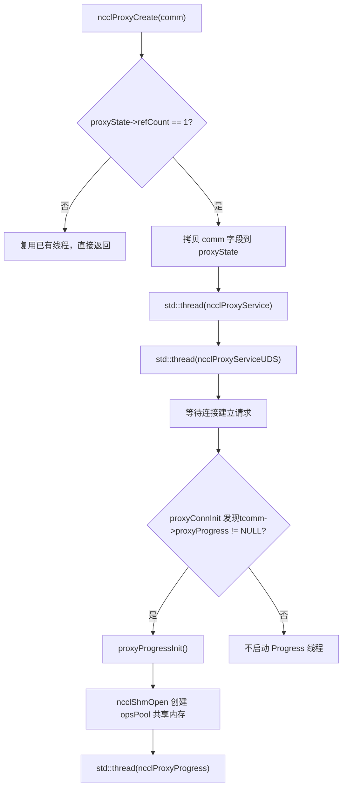
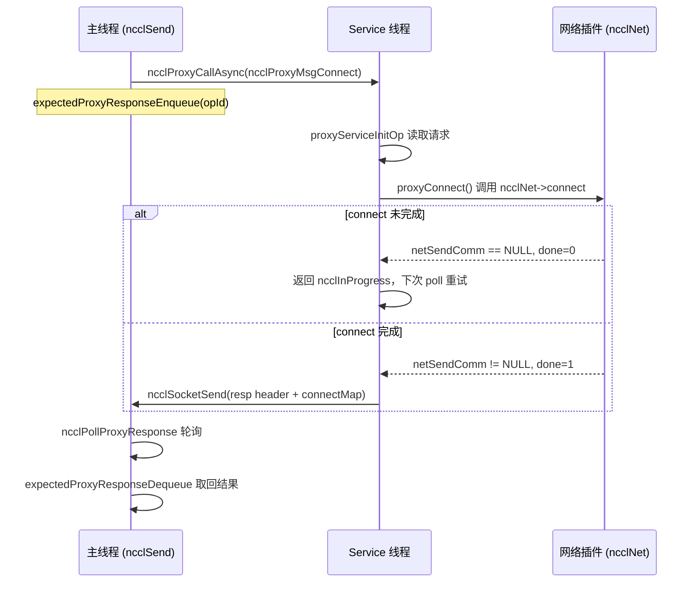
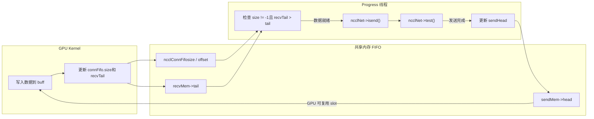

# 第 12 章：プロキシスレッドの非同期スケジューリング：proxy.cc が I/O とカーネル実行をどう分離するか

前章では transport 抽象層を分解し、NCCL がどのように統一インターフェースで P2P/SHM/NET/NVLS の差異を隠蔽するかを見た。しかし転送層は「データがどのチャネルを通るか」に答えただけで、「データがどう非同期に駆動されるか」にはまだ答えていない。GPU カーネルが直接ネットワーク待ちでブロックすると、計算ユニットは I/O に引きずられてしまう。本章では`src/proxy.cc`と`src/include/proxy.h`に焦点を当て、NCCL がどのように独立した host スレッドでネットワーク I/O をカーネル実行パスから切り離し、GPU とプロデューサー・コンシューマー関係を形成するかを見る。

# 12.1 なぜプロキシスレッドが必要か：「誰がネットワークを待つか」から始める

## 直感的モデル

レストランを想像してほしい。厨房（GPU kernel）は料理を作るだけを担当し、配膳係（proxy スレッド）が料理をお客さん（ネットワークの対端）に運ぶ。もし料理人自身が配膳をしたら、運ぶたびに調理を止めなければならず、提供速度が急落する。NCCL の proxy はまさにその専任の配膳係である——kernel は共有バッファにデータを書き込み、バッファからデータを読むだけであり、ネットワーク送受信の面倒な作業はすべて host 側の proxy スレッドに任される。

> **[Design Inference & Architectural Trade-offs]**
> もし proxy がなければ、システムはどのような災難に直面するだろうか？ GPU kernel は SIMT の大規模並列であり、1 つの warp がネットワークポーリングでブロックされると、SM 全体の計算能力を無駄にしてしまう。さらに致命的なのは、ネットワーク送受信が socket システムコール、verbs ポーリング、DMA ディスクリプタの投入を伴い、これらの操作は device コード内では実行できないことである。したがって NCCL はネットワーク I/O を host に移し、kernel と proxy が共有メモリ内の FIFO を通じて「データ準備完了」シグナルを交換する必要がある。

## 2 種類のスレッドの役割分担

NCCL は host 側で 2 種類の proxy スレッドを起動し、その責務はまったく異なる：

- **Service スレッド**（`ncclProxyService`）：制御プレーンのリクエストを処理する——接続確立、メモリ登録、FD クエリ。これは 1 つの socket をリッスンし、ローカル rank からの RPC リクエストを受信し、setup/connect などの操作を非同期に進める。
- **Progress スレッド**（`ncclProxyProgress`）：データプレーンを処理する——実際にネットワーク送受信を駆動する。共有メモリプールから proxy op を取り出し、transport の`proxyProgress`コールバックを呼び出してデータ転送を進める。

[FACT:src/include/proxy.h:343-345]表示`ncclProxyState`同時に保持する`thread`（Service）と`threadUDS`（UDS サービス）、そして Progress スレッドのハンドルは`progressState.thread`の中に隠れている[FACT:src/include/proxy.h:261-261]。

## プロデューサー・コンシューマー関係の確立

[FACT:src/proxy.cc:2130-2166]の`ncclProxyCreate`はスレッドが誕生する場所である：`refCount == 1`（最初の comm 作成）のとき、comm の重要なフィールドを`proxyState`にコピーし、その後 Service スレッドと UDS スレッドを起動する。Progress スレッドはここでは起動されないことに注意——それは`proxyProgressInit`が最初に proxy progress を必要とする接続確立時に遅延起動する[FACT:src/proxy.cc:1523-1524]。



この図はスレッド起動の実際の分岐を固定している：`tcomm->proxyProgress`が非 NULL（つまりその transport がデータプレーンの推進を必要とする）の場合にのみ、Progress スレッドが作成される。

# 12.2 データ構造とメモリレイアウト：共有メモリプールと op プール

## 中核構造体の全体像

proxy の並行モデルは 2 つの共有メモリ上に成り立っており、それらのメモリレイアウトを理解することがメカニズム全体を理解する前提である。

**第一のもの：`ncclProxyOpsPool`**（[FACT:src/include/proxy.h:218-226]）。これはメインスレッドと Progress スレッドの間の「タスク投入箱」であり、`/dev/shm`を通じてプロセス間共有される。

| フィールド | 型 | 役割 |
| --- | --- | --- |
| `ops[]` | `ncclProxyOp[]` | 事前確保された op 配列、サイズ`MAX_OPS_PER_PEER * NCCL_MAX_LOCAL_RANKS` |
| `nextOps` | `volatile int` | 処理待ち op リンクリストの先頭インデックス、-1 は空を表す |
| `nextOpsEnd` | `volatile int` | 処理待ち op リンクリストの末尾インデックス |
| `freeOps[]` | `volatile int[]` | 各 local rank の空き op リンクリスト先頭 |
| `syncObjectsInitialized` | `int` | mutex/cond が初期化済みかどうかを示す |
| `mutex` / `cond` | `std::mutex` / `std::condition_variable` | プロセス間同期プリミティブ |

`MAX_OPS_PER_PEER`の定義[FACT:src/include/proxy.h:218-226]は`2 * MAXCHANNELS * 2 * NCCL_MAX_DEV_WORK_P2P_PER_BATCH`。コメントはなぜ 2 倍なのかを説明している：各 p2p work は 1 つの send と 1 つの recv proxy op を含むため 2 を掛ける。さらに 2 を掛けるのは 2 ラウンド分の完全な操作を保存できるようにするためであり、そうでなければ「半分投入して半分解放する」ことができない。

**第二のもの：`ncclProxyArgs`**（[FACT:src/include/proxy.h:174-209]）。これは Progress スレッド内部で使用される「実行時 op 記述」であり、`ncclProxyPool`から割り当てられ、プロセス間共有されない。

重要なフィールド：

- `subs[NCCL_PROXY_MAX_SUBS]`：サブ操作配列、`NCCL_PROXY_MAX_SUBS = MAXCHANNELS` [FACT:src/include/proxy.h:55-55]。複数 channel の同種操作は 1 つの args の複数の sub に集約される。
- `progress`：関数ポインタ、transport の`proxyProgress`コールバックを指す[FACT:src/include/proxy.h:176-176]。
- `next` / `nextPeer` / `proxyAppendPtr`：3 本のリンクリストポインタで、複雑な op 組織関係を構成する。
- `state`：`ncclProxyOpNone` / `ncclProxyOpReady` / `ncclProxyOpProgress`3 状態[FACT:src/include/proxy.h:48-52]。

## メモリプールの階層設計

`ncclProxyPool` [FACT:src/proxy.cc:50-53]はバッチ割り当て単位であり、各 pool は`PROXYARGS_ALLOCATE_SIZE`（すなわち`NCCL_MAX_OPS`）個の`ncclProxyArgs`。`allocateArgs` [FACT:src/proxy.cc:207-231]の割り当てロジックは詳しく見る価値がある：

```c
if (state->pool == NULL) {
    struct ncclProxyPool* newPool;
    NCCLCHECK(ncclCalloc(&newPool, 1));
    struct ncclProxyArgs* newElems = newPool->elems;
    for (int i = 0; i pool = newElems;
    newPool->next = state->pools;
    state->pools = newPool;
}
elem = state->pool;
state->pool = state->pool->next;
```

[FACT:src/proxy.cc:207-231]

> **[Design Inference & Architectural Trade-offs]**
> ここでの設計動機は：`ncclProxyArgs`構造体が非常に大きい（`subs[MAXCHANNELS]`配列を含み、各 sub にはさらに`requests[NCCL_STEPS]`がある）。もし各 op を個別に malloc すると、深刻なメモリ断片化と割り当てオーバーヘッドを引き起こす。バッチ割り当て + 空きリンクリスト再利用により、割り当てコストをほぼゼロまで薄める。コメント「Make sure we allocate the memory close to the network thread」は、これが NUMA 親和性のためであることを示唆している——pool は Progress スレッドの初回割り当て時に作成され、そのスレッドが動作する CPU に自然に近くなる。

## 偽共有と原子変数

`ncclProxyOpsPool`の中の`nextOps`、`nextOpsEnd`、`freeOps[]`はすべて`volatile int`。それらはメインスレッドと Progress スレッドによって同時に読み書きされるが、NCCL はすべてのアクセスをロックで保護していない——代わりに原子操作 + メモリオーダーで正しさを保証する。

を見る`ncclLocalOpAppend`の中で freeOps から空き op を取るロジック[FACT:src/proxy.cc:503-513]：

```c
int freeOp = -1;
while (freeOp == -1) {
  freeOp = COMPILER_ATOMIC_EXCHANGE(&pool->freeOps[tpLocalRank], -1, std::memory_order_acquire);
  if (freeOp == -1) std::this_thread::yield();
}
```

メインスレッドは`atomic_exchange`を使って`freeOps[tpLocalRank]`-1 に設定して古い値を取得する——これは「プリエンプティブな取得」である：先に exchange が成功した者が空きリスト全体を手に入れる。Progress スレッドが op を返却する際は CAS ループを使う[FACT:src/proxy.cc:898-907]：

```c
oldFree = COMPILER_ATOMIC_LOAD(&pool->freeOps[i], std::memory_order_acquire);
do {
  pool->ops[freeOpEnd[i]].next = oldFree;
} while (!COMPILER_ATOMIC_COMPARE_EXCHANGE(&pool->freeOps[i], &oldFree, newFree,
                                           std::memory_order_release,
                                           std::memory_order_acquire));
```

> **[Design Inference & Architectural Trade-offs]**
> ここで seq_cst ではなく acquire/release を使うのは、「リストノードの next ポインタの書き込み」が取得側に可視であることだけを保証すればよく、グローバルな順序は不要だからである。`freeOps[]`配列の各要素は1つの local rank に対応し、自然に異なるキャッシュライン付近に分散するため、偽共有が減少する。

# 12.3 制御プレーン：接続確立と RPC メカニズム

## 直感的モデル

> **[Design Inference & Architectural Trade-offs]**
> Service スレッドは「フロント受付」のようなものである：ローカル rank がネットワーク接続を確立する際、自分で直接接続するのではなく、RPC リクエストを Service スレッドに送り、それに代わって setup/connect を実行してもらう。なぜこうするのか？ ネットワーク接続の確立（特に verbs の QP 作成、メモリ登録）はブロックする可能性があり、また一部のリソース（listen socket など）は単一のスレッドが保持しなければならないからである。制御プレーンを Service スレッドに集中させることで、メインスレッドはノンブロッキングで他の作業を続けられる。

## RPC リクエストのエンコーディング

`ncclProxyCallAsync` [FACT:src/proxy.cc:1369-1394]は RPC の送信側である。socket を通じて順に送信する：type、connection ポインタ、reqSize、respSize、reqBuff、opId。

```c
NCCLCHECKGOTO(ncclSocketSend(sock, &type, sizeof(int)), ret, error);
NCCLCHECKGOTO(ncclSocketSend(sock, &proxyConn->connection, sizeof(void*)), ret, error);
NCCLCHECKGOTO(ncclSocketSend(sock, &reqSize, sizeof(int)), ret, error);
NCCLCHECKGOTO(ncclSocketSend(sock, &respSize, sizeof(int)), ret, error);
if (reqSize) NCCLCHECKGOTO(ncclSocketSend(sock, reqBuff, reqSize), ret, error);
NCCLCHECKGOTO(ncclSocketSend(sock, &opId, sizeof(opId)), ret, error);
NCCLCHECK(expectedProxyResponseEnqueue(sharedProxyState, opId, respSize));
```

[FACT:src/proxy.cc:1369-1394]

最後のステップに注意：リクエスト送信後、直ちに opId を`expectedResponses`キューに登録する。これが非同期 RPC の鍵である——呼び出し側は返信を待たず、まず「この opId の応答を期待している」と登録し、その後`ncclPollProxyResponse`でポーリングする。

## 応答キューの連結リスト実装

`expectedProxyResponseEnqueue` [FACT:src/proxy.cc:97-117]は単方向連結リストで応答待ちの op を格納する。`expectedProxyResponseStore` [FACT:src/proxy.cc:67-95]は応答受信時に opId でマッチングし、応答データを事前割り当てされた`respBuff`に memcpy し、マークする`done = true`。`expectedProxyResponseDequeue` [FACT:src/proxy.cc:119-141]はポーリング時に完了した応答を検索して取り除く。

ここに細かい点がある：`expectedProxyResponseStore`は`respSize`が[FACT:src/proxy.cc:72-75]と一致するかチェックし、一致しなければ`ncclInternalError`を報告する。これは防御的プログラミングである——リクエスト側と応答側で応答サイズの理解が異なる場合、プロトコルの混乱を意味するため、静かに続行するのではなく即座に失敗しなければならない。

## Service スレッドのメインループ

`ncclProxyService` [FACT:src/proxy.cc:1789-2016]の核心は poll ループである。それは`pollfds`配列で全ての接続を管理する。listen socket と各 peer の socket を含む。

```c
while (stop == PROXY_RUNNING || npeers > 0) {
    if (COMPILER_ATOMIC_LOAD(proxyState->abortFlag, std::memory_order_acquire) != 0) stop = PROXY_ABORT;
    int ret = 0;
    const int timeout = asyncOpCount ? 0 : 500;
    ...
    ret = poll(activePollfds, nfds_to_poll, timeout);
```

[FACT:src/proxy.cc:1842-1863]

`timeout`の選択は慎重である：非同期 op が進行中の場合（`asyncOpCount > 0`）、timeout を 0（ノンブロッキングポーリング）に設定する。頻繁に`proxyProgressAsync`を呼び出してそれらを進める必要があるからである；そうでなければ 500ms に設定し、空回りで CPU を焼くのを避ける。コメント「never let proxy service thread blocks in poll, or it cannot receive abortFlag」[FACT:src/proxy.cc:1847-1847]は、なぜ無限にブロックしてはいけないかを明確にしている——周期的に目覚めて abortFlag をチェックしなければならない。

## 非同期 op の進行

`proxyProgressAsync` [FACT:src/proxy.cc:1626-1700]は Service スレッドが非同期操作を進める核心である。op タイプに応じて異なる transport コールバックにディスパッチする：

```c
if (op->type == ncclProxyMsgSetup) {
    res = op->connection->tcomm->proxySetup(op->connection, proxyState, op->reqBuff, op->reqSize, op->respBuff,
                                            op->respSize, &done);
} else if (op->type == ncclProxyMsgConnect) {
    res = op->connection->tcomm->proxyConnect(...);
} else if (op->type == ncclProxyMsgInit) {
    res = proxyConnInit(peer, connectionPool, proxyState, ...);
}
```

[FACT:src/proxy.cc:1631-1664]

各コールバックは`done`出力パラメータを持つ。もし`done == 0`なら、操作がまだ完了していない（例えばネットワーク接続がまだ三次ハンドシェイク中）ことを意味し、`ncclInProgress`を返し、次のループで進行を続ける。もし`done == 1`なら、応答ヘッダ＋応答ボディをリクエスト側に送信する[FACT:src/proxy.cc:1681-1689]。



このシーケンス図は`sendProxyConnect`内の`*done = 0; return ncclInProgress`の実際の分岐を固定する[FACT:src/transport/net.cc:913-916]。

# 12.4 データプレーン：Progress スレッドがネットワーク送受信をどう駆動するか

## 直感的モデル

Progress スレッドは「ベルトコンベアのオペレーター」である：共有バッファ内の FIFO を監視し、GPU がデータを書き込むと（FIFO 内の size != -1）、直ちに`isend`を呼び出してデータを送信する；ネットワークがデータを受信し終えると、recvTail を更新して GPU に読み取り可能を通知する。プロセス全体で GPU と proxy は FIFO 内の head/tail ポインタを通じて同期し、ロックは一切不要である。

## op の投入：メインスレッドから Progress スレッドへ

メインスレッドは`ncclProxySaveOp` [FACT:src/proxy.cc:591-761]内で pattern に基づいて必要な proxy op を決定し、その後`SaveProxy` → `ncclLocalOpAppend`を通じて op を共有メモリプールに書き込む。

`ncclLocalOpAppend` [FACT:src/proxy.cc:488-554]のフロー：

1.`proxyOps->freeOp`または`pool->freeOps[tpLocalRank]`から空き op スロットを取得する。

2. `memcpy(op, proxyOp, sizeof(struct ncclProxyOp))`op の内容を共有メモリ[FACT:src/proxy.cc:515-515]。

にコピーする 3. op を`proxyOps->nextOps`連結リストの末尾に繋ぐ。

4. 累積した op 数が`MAX_OPS_PER_PEER`に達したら、バッチ投入[FACT:src/proxy.cc:525-551]。

をトリガーする バッチ投入のロジックは非常に微妙である：単純に全ての op を送信することはできない。なぜなら「同じ opCount の複数の op は一緒に投入しなければならない。そうでなければ proxyArgs の sub 集約が壊れる」からである。そこで最後の opCount 変化の境界を見つけ、そこまでだけ投入する[FACT:src/proxy.cc:529-548]。

投入は`ncclProxyPost` [FACT:src/proxy.cc:476-486]で完了する。それはロックを取得し、`pool->nextOps`、`notify_one`を更新し、Progress スレッドを起床させる。

## Progress スレッドのメインループ

`ncclProxyProgress` [FACT:src/proxy.cc:951-1011]の構造：

```c
do {
    int idle = 1;
    ncclResult_t ret = progressOps(proxyState, state, state->active, &idle);
    ...
    if (idle || !state->active || (++proxyOpAppendCounter == ncclParamProgressAppendOpFreq())) {
      int added = 0;
      proxyOpAppendCounter = 0;
      ret = ncclProxyGetPostedOps(proxyState, &added);
      ...
    }
    lastIdle = idle;
    stopv = state->stop.load(std::memory_order_acquire);
} while ((stopv == 0 || (stopv == 1 && state->active)) &&
         COMPILER_ATOMIC_LOAD(proxyState->abortFlag, std::memory_order_acquire) == 0);
```

[FACT:src/proxy.cc:976-1009]

ここに注目すべき性能最適化がある：`proxyOpAppendCounter`カウンタ[FACT:src/proxy.cc:974-974]。コメントは[FACT:src/proxy.cc:969-973]を説明する：`ncclProxyGetPostedOps`を頻繁に呼び出すと小メッセージ通信の性能が後退するため、`ProgressAppendOpFreq`（デフォルト 8）回ごとに新しい op を取得しに行く。

## op の集約：ProxyAppend

`ProxyAppend` [FACT:src/proxy.cc:437-474]ある op が「既存の args の sub に追加する」のか「新しい args を作成する」のかを決定する。判断基準は`connection->shared && args->opCount == op->opCount` [FACT:src/proxy.cc:443-443]——同一接続、同一 opCount の複数の channel 操作が集約される。

> **[Design Inference & Architectural Trade-offs]**
> 集約の価値：複数 channel の同種操作を一つの args に統合することで、Progress スレッドが1回のループで全 channel を進められ、関数呼び出しのオーバーヘッドとキャッシュ無効化を削減できる。`ncclProxyOpToArgs` [FACT:src/proxy.cc:368-435]sub を追加する際に`sliceSteps`、`chunkSteps`、`protocol`、`dtype`、`redOp`、`coll`が一致するかを検証し[FACT:src/proxy.cc:401-406]、一致しなければエラーを報告する——これは誤った集約を防ぐ防衛線である。

## sendProxyProgress：送信側の4段階ステートマシン

`sendProxyProgress` [FACT:src/transport/net.cc:1324-1491]は送信側の中核である。sub ごとに順に進め、各 sub には4つのカウンタがある：`posted`、`transmitted`、`done`。

**段階1：Ready の初期化** [FACT:src/transport/net.cc:1326-1339]

```c
sub->base = ROUNDUP(resources->step, args->chunkSteps);
resources->step = sub->base + sub->nsteps;
sub->posted = sub->transmitted = sub->done = 0;
```

`base`は step の開始番号であり、`ROUNDUP`が`chunkSteps`。`resources->step`に整列することを保証し、累加して次の op のために領域を確保する。

**段階2：バッファを GPU に Post する** [FACT:src/transport/net.cc:1355-1376]

```c
if (sub->posted nsteps && sub->posted done + maxDepth) {
    int buffSlot = (sub->base + sub->posted) % NCCL_STEPS;
    if (resources->shared) {
        ...
        *sendHead = sub->base + sub->posted - NCCL_STEPS;
    } else {
        sub->posted += args->sliceSteps;
    }
}
```

`maxDepth`はパイプライン深度[FACT:src/transport/net.cc:1343-1343]であり、同時に in-flight となる step 数を制限する。shared モードでは、proxy が`sendHead`を更新することで GPU に「この slot は書き込み可能」と伝える。

**段階3：GPU が書き込み完了したか確認し、isend を発行する** [FACT:src/transport/net.cc:1378-1452]

```c
if (sub->transmitted posted && sub->transmitted done + NCCL_STEPS) {
    int buffSlot = (sub->base + sub->transmitted) % NCCL_STEPS;
    volatile uint64_t* recvTail = &resources->recvMem->tail;
    uint64_t tail = sub->base + sub->transmitted;
    if (connFifo[buffSlot].size != -1 && (*recvTail > tail || p == NCCL_PROTO_LL)) {
        int size = connFifo[buffSlot].size;
        ...
        NCCLCHECK(proxyState->ncclNet->isend(resources->netSendComm, buff, size, resources->tpRank,
                                             sub->sendMhandle, phandle, sub->requests + buffSlot));
        if (sub->requests[buffSlot] != NULL) {
            sub->transmitted += args->sliceSteps;
        }
    }
}
```

ここでの重要な判断は`connFifo[buffSlot].size != -1 && *recvTail > tail`——GPU がデータを書き終えると FIFO の size と recvTail を更新し、proxy はこの2つの条件が満たされたのを確認してから isend を発行する。LL プロトコルの場合、「ゼロコピー」セマンティクスであるため、recvTail を待つ必要はない。

**段階4：送信完了を確認し、sendHead を更新する** [FACT:src/transport/net.cc:1455-1481]

```c
if (sub->done transmitted) {
    int buffSlot = (sub->base + sub->done) % NCCL_STEPS;
    NCCLCHECK(proxyState->ncclNet->test(sub->requests[buffSlot], &done, &size));
    if (done) {
        connFifo[buffSlot].size = -1;
        std::atomic_thread_fence(std::memory_order_seq_cst);
        sub->done += args->sliceSteps;
        if (resources->shared == 0) {
            volatile uint64_t* sendHead = resources->gdcSync ? resources->gdcSync : &resources->sendMem->head;
            *sendHead = sub->base + sub->done;
        }
    }
}
```

`test`が done を返したら、まず FIFO size を -1 にリセットし、seq_cst fence を挿入してから、sendHead を更新して GPU に「この slot は再利用可能」と通知する。fence の役割は size のリセットと head の更新の順序逆転を防ぐこと——もし head が先に更新されると、GPU が size の古い値のまま書き込みを開始する可能性がある。

## recvProxyProgress：受信側の4段階

`recvProxyProgress` [FACT:src/transport/net.cc:1493-1788]はより複雑である。なぜなら sub のグループ化（複数の sub が同一の recvComm を共有する場合に multirecv を使用）が関わるからである。

**段階1：Ready 時に recvComm でグループ化する** [FACT:src/transport/net.cc:1495-1538]

```c
for (int s = 0; s nsubs; s++) {
    ...
    if (groupSize == maxRecvs) {
        groupSize = 0;
    } else if (s > 0) {
        int next;
        for (next = s; next nsubs; next++) {
            struct recvNetResources* nextRes = ...;
            if (nextRes->netRecvComm == recvComm) break;
        }
        if (next == args->nsubs) {
            groupSize = 0;
        } else if (s != next) {
            // swap subs
        }
    }
    groupSize++;
    ...
    for (int i = 0; i  **[Design Inference & Architectural Trade-offs]**
> このコードは同一の`recvComm`を使用する sub を隣り合わせに並べ、`groupSize`を記録する。なぜグループ化するのか？ それは`irecv`が一度に複数の buffer を受信（multirecv）でき、同一 comm のリクエストを1回の呼び出しに統合することでプラグインのオーバーヘッドを大幅に削減できるからである。

**段階2：irecv を発行する** [FACT:src/transport/net.cc:1543-1631]

```c
if (subCount) {
    uint64_t step = subGroup->posted;
    void** requestPtr = subGroup->requests + (step % NCCL_STEPS);
    bool ignoreCompletion = ncclParamNetOptionalRecvCompletion() &&
                            ((args->protocol == NCCL_PROTO_LL128) || (args->protocol == NCCL_PROTO_LL)) &&
                            (subCount == 1);
    if (ignoreCompletion) *requestPtr = (void*)NCCL_NET_OPTIONAL_RECV_COMPLETION;
    NCCLCHECK(proxyState->ncclNet->irecv(resources->netRecvComm, subCount, ptrs, sizes, tags, mhandles, phandles,
                                         requestPtr));
    if (*requestPtr) {
        subGroup->recvRequestsCache[step % NCCL_STEPS] = *requestPtr;
        subGroup->recvRequestsSubCount = subCount;
        for (int i = 0; i groupSize; i++) {
            sub->posted += args->sliceSteps;
        }
    }
}
```

`ignoreCompletion`の最適化[FACT:src/transport/net.cc:1608-1610]：LL/LL128 プロトコルの単一 buffer 受信では、完了通知はオプションである（データ自体に flag が付いているため）。completion チェックをスキップできる。

**段階3：受信完了を確認し、recvTail を更新する** [FACT:src/transport/net.cc:1634-1743]

```c
NCCLCHECK(proxyState->ncclNet->test(subGroup->requests[step % NCCL_STEPS], &done, sizes));
if (done) {
    for (int i = 0; i groupSize; i++) {
        struct ncclProxySubArgs* sub = subGroup + i;
        int buffSlot = (sub->base + sub->received) % NCCL_STEPS;
        connFifo[buffSlot].size = -1;
        sub->received += args->sliceSteps;
    }
    ...
}
```

受信完了後、FIFO size をリセットし、flush 段階に入る（GDRDMA シナリオではデータの可視性を保証するために flush が必要）。

**段階4：GPU の消費を待ち、done を更新する** [FACT:src/transport/net.cc:1745-1779]

```c
if (sub->transmitted > sub->done) {
    volatile uint64_t* sendHead = &resources->sendMem->head;
    uint64_t done = *sendHead;
    while (done > sub->base + sub->done && sub->transmitted > sub->done) {
        if (subGroup->recvRequestsCache[sub->done % NCCL_STEPS]) {
            if (proxyState->ncclNet->irecvConsumed) {
                NCCLCHECK(proxyState->ncclNet->irecvConsumed(resources->netRecvComm, subGroup->recvRequestsSubCount,
                                                             subGroup->recvRequestsCache[sub->done % NCCL_STEPS]));
            }
            subGroup->recvRequestsCache[sub->done % NCCL_STEPS] = NULL;
        }
        sub->done += args->sliceSteps;
    }
}
```

ここでは`sendHead`を読むことで GPU がデータを消費したかどうかを判断する。`irecvConsumed`はプラグインへのコールバックであり、「この受信リクエストの buffer は消費済みで再利用可能」と伝える。

## データフロー全景



このデータフロー図は、GPU と proxy が FIFO と head/tail ポインタを介して形成する閉ループを示している：GPU がデータを書き込む → tail を更新 → proxy が検出して isend を発行 → test で完了を確認 → head を更新 → GPU が slot を再利用。

# 12.5 並行制御、メモリバリア、ハードウェアとの相互作用

## ロックフリー FIFO のメモリオーダー

proxy と GPU 間の同期は完全に`ncclConnFifo`と head/tail ポインタに依存しており、ロックは一切ない。これは極めて慎重なメモリオーダー制御を要求する。

送信側では、proxy は`test`が done を返した後に[FACT:src/transport/net.cc:1460-1473]：

```c
connFifo[buffSlot].size = -1;
std::atomic_thread_fence(std::memory_order_seq_cst);
...
*sendHead = sub->base + sub->done;
```

seq_cst fence は size のリセットが GPU に可視になった後で初めて head の更新が可視になることを保証する。もし順序が逆になると、GPU は新しい head を見るが古い size を見てしまい、slot にデータがあると誤認する可能性がある。

受信側では、proxy は recvTail を更新する前に[FACT:src/transport/net.cc:1731-1736]：

```c
if (step nsteps) {
    std::atomic_thread_fence(std::memory_order_seq_cst);
    volatile uint64_t* recvTail = resources->gdcSync ? resources->gdcSync : &resources->recvMem->tail;
    *recvTail = sub->base + sub->transmitted;
}
```

同じ理屈である：まず fence でデータ書き込みの可視性を保証し、次に tail を更新して GPU に読み取り可能と通知する。

## GDRCOPY の flush メカニズム

GDRDMA を使用する場合、NIC は GPU メモリに直接書き込むが、書き込み操作はまだ PCIe バス上でコミットされていない可能性がある。proxy が能動的に flush しなければデータの可視性は保証されない。`recvProxyProgress`内の flush ロジックを見る[FACT:src/transport/net.cc:1664-1709]：

```c
if (totalSize > 0 && p == NCCL_PROTO_SIMPLE && needFlush) {
    if (resources->gdcFlush) {
#if defined(__x86_64__)
        asm volatile("mfence" ::: "memory");
        asm volatile("mov (%0), %%eax" ::"l"(resources->gdcFlush) : "%eax", "memory");
#else
        std::atomic_thread_fence(std::memory_order_seq_cst);
        uint64_t dummy;
        NCCLCHECK(ncclGdrCudaRead(resources->gdrDesc, &dummy, resources->gdcFlush, sizeof(dummy)));
#endif
    } else {
        // iflush 路径
        NCCLCHECK(proxyState->ncclNet->iflush(resources->netRecvComm, subCount, ptrs, sizes, mhandles,
                                              subGroup->requests + (step % NCCL_STEPS)));
    }
}
```

x86 パスのコメントは非常に見事である[FACT:src/transport/net.cc:1668-1674]：`mfence`CQE-poll の load が flush load より前にリオーダーされるのを防ぐ；`mov (%0), %%eax`PCIe 読み取りを強制し、CPU を停止させて、以前のすべての PCIe posted write（NIC DMA を含む）がエンドポイントにコミットされるまで待つ。これはハードウェアレベルのメモリオーダー制御であり、どのソフトウェアフェンスよりもハードコアである。

## アトミック変数と stop/abort の協調

Progress スレッドの終了条件[FACT:src/proxy.cc:1007-1009]：

```c
stopv = state->stop.load(std::memory_order_acquire);
} while ((stopv == 0 || (stopv == 1 && state->active)) &&
         COMPILER_ATOMIC_LOAD(proxyState->abortFlag, std::memory_order_acquire) == 0);
```

`stop == 1`しかし`state->active != NULL`時に実行を継続——これは「優雅な停止」のためである：すでに投入された op は必ず完了まで進めなければならない。そうでなければ GPU は永遠にデータを待つことになる。のみ`stop == 2`（abort）または`abortFlag != 0`のみ強制終了する。

`ncclProxyProgressDestroy` [FACT:src/proxy.cc:1039-1065]の停止フロー：

```c
std::lock_guard lock(state->opsPool->mutex);
state->stop.store(1, std::memory_order_release);
state->opsPool->cond.notify_one();
state->thread.join();
```

まずロックを取得してから stop を store し、その後 notify——これは lost wakeup を防ぐ標準パターンである。Progress スレッドは`pool->cond.wait`時にロックを保持し、述語[FACT:src/proxy.cc:850-851]をチェックすることで、ウェイクアップを見逃さないことを保証する。

# 12.6 本番環境の落とし穴ガイドと障害復旧チェーン

## 落とし穴1：接続リークにより Service スレッドが終了できない

`ncclProxyService`のメインループ条件は`stop == PROXY_RUNNING || npeers > 0` [FACT:src/proxy.cc:1842-1842]である。コメントは[FACT:src/proxy.cc:1843-1845]を説明している：ローカルの comm が abort しても、ピア接続がまだ存在する限り、proxy スレッドは終了してはならない。そうでなければセグメンテーションフォルトが発生する可能性がある。

**調査シナリオ**：ある rank がクラッシュしたが対端に通知しなかった場合、対端の Service スレッドは`npeers > 0`のループでずっとスタックする。この場合、`abortFlag`またはタイムアウト機構に依存する必要がある。本番環境でプロセスが`ncclProxyService`でハングしているのを見かけたら、まず対端の rank が異常終了していないか確認せよ。

## 落とし穴2：応答キューが不一致でメモリリークが発生

`expectedProxyResponseStore`は opId が一致しない場合に`ncclInternalError` [FACT:src/proxy.cc:93-94]を返す。しかし、応答が到着したときに要求側がすでに放棄している場合（例えばタイムアウト）、この応答は永遠にキューに残り、`respBuff`リークする。

**防御策**：`expectedProxyResponseFree` [FACT:src/proxy.cc:55-65]は`ncclProxyDestroy`時にキュー全体をクリーンアップする[FACT:src/proxy.cc:2226-2226]。ただしこれは最後のフォールバックであり、正常動作中に残留があってはならない。

## 落とし穴3：shared モードで head が負の値に初期化される

`sendProxyConnect`内の[FACT:src/transport/net.cc:999-1000]：

```c
// Don't give credits yet in shared mode.
(resources->gdcSync ? *resources->gdcSync : resources->sendMem->head) = (map->shared ? -NCCL_STEPS : 0);
```

shared モードでは head が`-NCCL_STEPS`に初期化される。これは GPU が最初は書き込み可能な credit を持たないことを意味する。proxy は post 段階で徐々に head を増やして「credit を発行」する必要がある。この初期化を忘れると、GPU は credit があると誤認して未準備の slot に書き込み、データが破損する。

## 落とし穴4：LL128 プロトコルの flag 検証

`sendProxyProgress`内の LL128 の ready 判定[FACT:src/transport/net.cc:1388-1403]：

```c
if (p == NCCL_PROTO_LL128) {
    ready = resources->useGdr;
    if (!ready) {
        uint64_t flag = sub->base + sub->transmitted + 1;
        int nFifoLines = DIVUP(connFifo[buffSlot].size, sizeof(uint64_t) * NCCL_LL128_LINEELEMS);
        volatile uint64_t* lines = (volatile uint64_t*)buff;
        ready = 1;
        for (int i = 0; i Q1: もし`sendProxyProgress`内の`sub->done == sub->nsteps`時に`sendHead`を更新するロジックを削除した場合（つまり GPU slot が解放されたことを通知しない場合）、どのようなシナリオでデッドロックが発生するか？なぜか？

**参考解析**：`sendHead`は GPU が「どの slot が再利用可能か」を判断する唯一の根拠である。参照[FACT:src/transport/net.cc:1469-1473]：

```c
if (resources->shared == 0) {
    volatile uint64_t* sendHead = resources->gdcSync ? resources->gdcSync : &resources->sendMem->head;
    *sendHead = sub->base + sub->done;
}
```

この部分を削除すると、GPU の head は永遠に初期値（shared モードでは`-NCCL_STEPS`、非 shared では 0）に留まる。GPU カーネルは`waitSend`時に`head + NCCL_STEPS > step`をチェックして初めて書き込み可能な credit があると判断する。head が進まないと、GPU は`NCCL_STEPS`個の slot を書き終えた後、永遠に credit 待ちでブロックされ、proxy は GPU が新しいデータを書くのを待って初めて isend できる——典型的な生産者-消費者デッドロックである。shared モードではさらに深刻で、初期 head が負の値であるため、GPU は最初から credit を持たない。

Q2: `ncclLocalOpAppend`累積opが`MAX_OPS_PER_PEER`に達するとバッチ投入がトリガーされるが、コードは意図的に「最後のopCountのすべてのopを投入しない」。もし単純にすべてのopを投入するように変更した場合、どのようなメカニズムが壊れるか？

**参考解析**：見る[FACT:src/proxy.cc:525-548]のコメントとロジック：

```c
// Do not post last operations as we could have more coming with the same opCount, and posting
// them in different batches would break proxyArgs aggregation with subs.
uint64_t lastOpCount = pool->ops[proxyOps->nextOpsEnd].opCount;
int lastOp = -1;
...
for (int op = proxyOps->nextOps; op != proxyOps->nextOpsEnd; op = pool->ops[op].next) {
    ops++;
    if (pool->ops[op].opCount != lastOpCount) {
        lastOp = op;
        toSend = ops;
    }
}
```

`ProxyAppend`の集約ロジック[FACT:src/proxy.cc:443-443]は`args->opCount == op->opCount`に依存してsubを追加するかどうかを判断する。もし同じopCountの複数のchannel opが2つのバッチに分割されて投入されると、最初のバッチがargsを作成し、2番目のバッチが到着したとき`args->opCount`はすでに新しいopのopCountと等しくない（argsがすでに進められている可能性があるため）、本来集約されるべきsubが独立したargsに分割される。これはパフォーマンスを低下させるだけでなく、`ncclProxyOpToArgs`内の`nChannels`/`nPeers`minを取るロジック[FACT:src/proxy.cc:399-400]を壊し、誤ったチャネル数計算を引き起こす可能性がある。

Q3: `recvProxyProgress`のReady段階は`recvComm`に従ってsubを再ソート・グループ化する。もしこのグループ化ロジックを削除し、各subが独立して`irecv`を呼び出すようにした場合、`maxRecvs > 1`のNICでどのような結果が生じるか？

**参考解析**：見る[FACT:src/transport/net.cc:1495-1538]のグループ化ロジックと[FACT:src/transport/net.cc:1613-1614]のmultirecv呼び出し：

```c
NCCLCHECK(proxyState->ncclNet->irecv(resources->netRecvComm, subCount, ptrs, sizes, tags, mhandles, phandles,
                                     requestPtr));
```

`maxRecvs`はNICプラグインが宣言する「1回のirecvで受信できる最大バッファ数」[FACT:src/transport/net.cc:1525-1525]。`maxRecvs > 1`のとき、プラグイン（例：IB）は1つのWQEで複数のバッファを受信でき、doorbellオーバーヘッドとCQE処理コストを大幅に削減できる。もしグループ化を削除し、各subが個別にirecvすると、`subCount`は常に1となり、プラグインは単一バッファモードに退化し、スループットが低下する。さらに重要なのは、`recvRequestsCache`と`irecvConsumed`メカニズム[FACT:src/transport/net.cc:1616-1617]がmultirecv用に設計されていること——単一バッファモードではこれらのキャッシュロジックが無効になり、リクエストリークが発生する可能性がある。

ここまでで、proxyスレッドがネットワークI/Oとkernel実行をどのように分離し、GPU計算と通信を真に並行させるかを理解した。しかしproxyは単なる駆動者であり、基盤となるネットワーク転送の具体的な実装はまだ明らかにされていない。次の章では`net_ib`を深掘りし、NCCLがverbs APIをどのようにラップしてInfiniBand転送を実装しているか、そしてGPUDirect RDMAがどのようにNICにGPUメモリを直接読み書きさせるかを見ていく。
