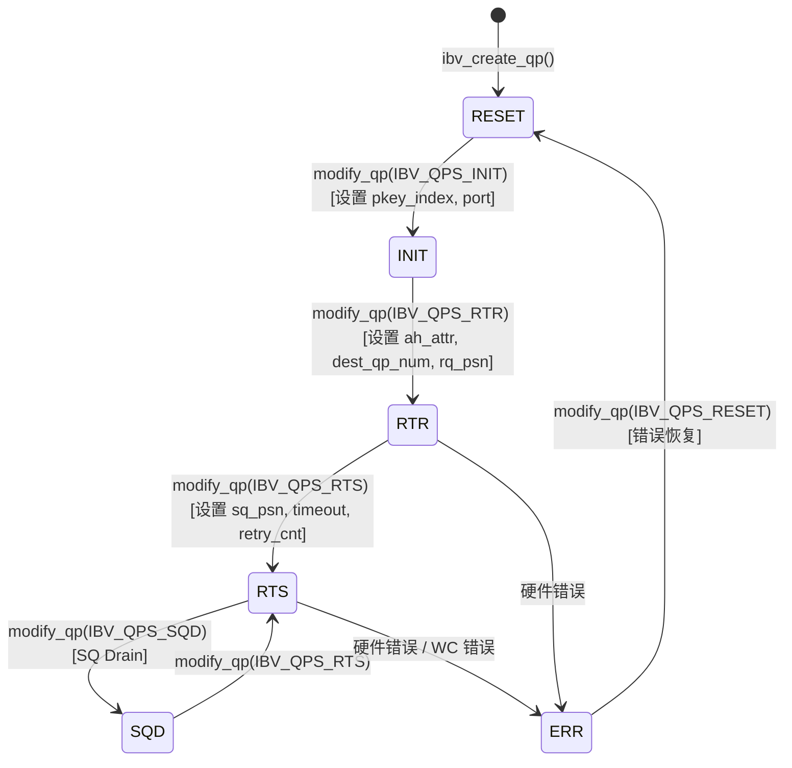

# 第 13 章：InfiniBandネットワーク転送：net_ibがverbsとGPUDirect RDMAをどのようにラップするか

# 第13章：InfiniBandネットワーク転送：net_ibがverbsとGPUDirect RDMAをどのようにラップするか

前の章では、proxyスレッドがネットワークI/OをGPU kernelからどのように切り離し、計算と通信を真に並行させるかを見た。しかしproxyは単なる「駆動者」であり、ncclNet->isend/irecvといった抽象インターフェースを呼び出すが、その下がTCPなのかInfiniBandなのか、それとも別のものなのかは知らない。本章ではこの抽象の層を開き、src/transport/net_ibとsrc/misc/ibvwrap.ccに入り、NCCLがlibibverbsというCライブラリをどのようにプラグイン可能なシンボルテーブルにラップするか、Queue Pair（QP）をどのように確立するか、そしてGPUDirect RDMAがどのようにNICにhostメモリをバイパスしてGPUメモリを直接読み書きさせるかを見ていく。

# 13.1 なぜNCCLはlibibverbsを直接呼び出さないのか

## 直感モデル：シンボルテーブルは「プラグイン可能な電源コンセント」

輸入電化製品を買ったが、プラグの形状が家のコンセントと合わないと想像してほしい。選択肢は2つ：電化製品を分解して配線を変える（直接`#include <infiniband/verbs.h>`して`-libverbs`をリンクする）か、万能変換プラグを買う（実行時に動的にシンボルをロードする）か。NCCLは後者を選んだ。

> **[Design Inference & Architectural Trade-offs]**
> この選択の核心的な動機は**デプロイの柔軟性**：NCCLはPyTorch、TensorFlowなどの上位フレームワークにライブラリとしてロードされるため、実行環境に必ず`libibverbs.so`がインストールされていると仮定できない。もしコンパイル時にハードリンクすると、InfiniBandドライバがないマシンでは、NCCLライブラリ全体がロードできなくなる——たとえNVLinkで単機通信をしたいだけでも。実行時の`dlopen`+ シンボル解決により、NCCLはIBのないマシンで優雅にデグレードできる。

もしこのラッピング層が欠けていたら、システムが直面する災難は：**純粋なNVLinkの単機トレーニングタスクが、マシンにIBドライバがインストールされていないために直接クラッシュする**。これはクラウド環境や開発機で極めて一般的である。

## データ構造とメモリレイアウト：シンボルテーブルコンテナ

核心的なデータ構造は`ncclIbvSymbols`であり、`ibvsymbols.h`で定義されている（本章の資料にはこのファイルは含まれていないが、使用法からその構造を推論できる）。これは純粋な関数ポインタコンテナであり、各フィールドが1つのlibibverbs関数に対応する：

```c
struct ncclIbvSymbols {
  int (*ibv_internal_fork_init)(void);
  struct ibv_device** (*ibv_internal_get_device_list)(int* num_devices);
  int (*ibv_internal_modify_qp)(struct ibv_qp*, struct ibv_qp_attr*, int);
  // ... 数十个函数指针
};
```

グローバルに1つのインスタンスのみで、`std::once_flag`と組み合わせてスレッドセーフな初期化を保証する：

[FACT:src/misc/ibvwrap.cc:26-29]

```c
static std::once_flag initOnceFlag;
static ncclResult_t initResult;
struct ncclIbvSymbols ibvSymbols;
```

ここでの設計は非常に抑制が効いている：`initOnceFlag`は`std::once_flag`，`initResult`キャッシュ初期化結果、`ibvSymbols`はグローバルシンボルテーブルです。三者はすべて静的記憶域期間を持ち、ライフサイクルはプロセス全体に及びます。

> **[Design Inference & Architectural Trade-offs]**
> なぜ`std::once_flag`ではなく`pthread_once`を使うのか？NCCL の C++ コードはすでに`<mutex>`と`<thread>`に依存しているため、標準ライブラリを使う方が一貫性があるからです。`call_once`のセマンティクスは：何個のスレッドが同時に`wrap_ibv_symbols()`を呼び出しても、lambda は一度だけ実行され、残りのスレッドはブロックして待機し、その後すべてが同じ`initResult`を取得します。これは手書きのダブルチェックロッキング（DCLP）よりもはるかに安全です——DCLP には C++ メモリモデルにおける有名なリオーダーの落とし穴があります。

## Step-by-Step：シンボル解決の完全なフロー

NCCL が初めて IB トランスポートを必要とするとき、`wrap_ibv_symbols()`：

[FACT:src/misc/ibvwrap.cc:26-29]

```c
ncclResult_t wrap_ibv_symbols(void) {
  std::call_once(initOnceFlag, []() { initResult = buildIbvSymbols(&ibvSymbols); });
  return initResult;
}
```

`buildIbvSymbols`は`ibvsymbols.cc`（本章には含まれていません）で定義されており、その役割は`dlopen("libibverbs.so")`でライブラリを開き、各関数名に対して`dlsym`を呼び出してポインタを埋めることです。シンボルが見つからない場合、対応するフィールドは NULL のままです。

この「NULL を許容する」設計はラッパー層全体に貫かれています。`CHECK_NOT_NULL`マクロを見てください：

[FACT:src/misc/ibvwrap.cc:26-29]

```c
#define CHECK_NOT_NULL(container, internal_name) \
  if (container.internal_name == NULL) { \
    WARN("lib wrapper not initialized."); \
    return ncclInternalError; \
  }
```

各ラッパー関数は呼び出し前に対応するシンボルが非 NULL かどうかをチェックします。これはつまり：**古いバージョンの libibverbs に新しい関数が欠けている場合、NCCL はロード時にクラッシュせず、その関数が実際に使われるときに初めてエラーを報告します**。これが段階的デグラデーションの鍵です。

## 設計思考：マクロラッパーの三重の責務

`ibvwrap.cc`には 7 つのマクロが定義されており、それらは単なる構文糖ではなく、三重の責務を担っています：

1. **ヌルポインタ保護**：`CHECK_NOT_NULL`は未初期化を傍受します

2. **エラーコードの正規化**：libibverbs の多様なエラー規約（-1 を返す、errno を返す、NULL ポインタを返す）を統一的に`ncclResult_t`

3. **に翻訳します**ログ埋め込み`WARN`：失敗時に

が関数名と errno を出力します`IBV_PTR_CHECK_ERRNO`最も複雑なマクロである

[FACT:src/misc/ibvwrap.cc:38-45]

```c
#define IBV_PTR_CHECK_ERRNO(container, internal_name, call, retval, error_retval, name) \
  CHECK_NOT_NULL(container, internal_name); \
  retval = container.call; \
  if (retval == error_retval) { \
    WARN("Call to " name " failed with error %s", strerror(errno)); \
    return ncclSystemError; \
  } \
  return ncclSuccess;
```

コピー`retval`展開後は 4 つのことを行います：シンボルが非 NULL かチェック、呼び出しを実行、戻り値を`ibv_pd*`に書き込む（通常はポインタ引数を通じて返される`strerror(errno)`など）、エラー値と等しいか判定。注意すべきは`ibv_alloc_pd`——libibverbs のポインタ返却型関数（`errno`など）は失敗時に NULL を返し`errno`を設定するので、ここで

を読むのが正しいのです。`IBV_INT_CHECK`一方、

[FACT:src/misc/ibvwrap.cc:84-91]

```c
#define IBV_INT_CHECK(container, internal_name, call, error_retval, name) \
  CHECK_NOT_NULL(container, internal_name); \
  int ret = container.call; \
  if (ret == error_retval) { \
    WARN("Call to " name " failed"); \
    return ncclSystemError; \
  } \
  return ncclSuccess;
```

コピー`errno`ここでは`ibv_fork_init`を読みません。なぜならこの種の関数（

> **[Design Inference & Architectural Trade-offs]**
> 〔設計推論とアーキテクチャトレードオフ〕`net_ib.cc`この「関数ごとに異なるマクロを使う」アプローチは煩雑に見えますが、必要不可欠です：libibverbs の API エラー規約は極めて不統一で、0/-1 を返すもの、errno 値を返すもの、ポインタを返すものがあります。無理に統一すると、かえってエラー情報が失われます。NCCL は「忠実に翻訳する」ことを選び、複雑さをラッパー層に留め、上位の`ncclSuccess`。

# は

## を判定するだけで済みます

`ibvcore.h`13.2 ibvcore.h：ヘッダファイルに依存しない ABI 契約**直感モデル：自前の辞書を持つ翻訳者**は特異なファイルです——libibverbs の核心的な構造体、列挙型、定数を`#include <infiniband/verbs.h>`再定義しています

> **[Design Inference & Architectural Trade-offs]**
> なしでこれらの型を使用する必要があるからです。`infiniband/verbs.h`〔設計推論とアーキテクチャトレードオフ〕`dlopen`これは実際のエンジニアリング問題を解決します：

はディストリビューションやドライバのバージョンによって内容が異なります。NCCL がそれを直接インクルードすると、コンパイル時に特定のバージョンに束縛されます。しかし「最小必要サブセット」を自前で定義することで、NCCL はコンパイル時に IB ヘッダファイルを必要とせず、実行時に**を通じて任意のバージョンのライブラリをロードできます。`libibverbs-dev`この層が欠けていると、災難です：**がインストールされていないマシンでは NCCL をコンパイルできません`rdma-core`。実際には実行時に

## を通じてライブラリファイルが提供される可能性があるのにです。

主要構造体のメモリレイアウト

**`ibv_gid`RDMA の理解に最も重要な構造体をいくつか選んで剖析します。**

[FACT:src/include/ibvcore.h:58-64]

```c
union ibv_gid {
	uint8_t			raw[16];
	struct {
		uint64_t	subnet_prefix;
		uint64_t	interface_id;
	} global;
};
```

コピー`ibvGetGidStr`GID は InfiniBand の「IP アドレス」で、16 バイトです。16 バイト配列としても、2 つの 64 ビット整数としてもアクセスできます。RoCE（RDMA over Converged Ethernet）のシナリオでは、GID は実際には IPv6 アドレスです——これが`inet_ntop(AF_INET6, ...)`が

[FACT:src/include/ibvwrap.h:102-108]

```c
static inline const char* ibvGetGidStr(union ibv_gid* gid, char* gidStr, size_t strLen) {
  static_assert(sizeof(union ibv_gid) == sizeof(struct in6_addr),
                "the sizeof struct ibv_gid must be the size of struct in6_addr");
  return inet_ntop(AF_INET6, gid->raw, gidStr, strLen);
}
```

`static_assert`コピー`ibv_gid`はコンパイル時に`in6_addr`と`inet_ntop`のサイズが一致することを保証し、これにより

**`ibv_mr`がこの 16 バイトを正しく解釈できます。**

[FACT:src/include/ibvcore.h:402-410]

```c
struct ibv_mr {
	struct ibv_context     *context;
	struct ibv_pd	       *pd;
	void		       *addr;
	size_t			length;
	uint32_t		handle;
	uint32_t		lkey;
	uint32_t		rkey;
};
```

コピー`addr`これは GPUDirect RDMA の核心です。`length`は登録されたメモリの開始アドレス（ホストメモリ、または GPU メモリがホストにマップされたアドレス）で、`lkey`は長さです。`rkey`（local key）と`lkey`（remote key）は、ネットワークカードがアクセス権限を検証するための「鍵」です——送信側は WQE に`rkey`を含め、受信側は

> **[Design Inference & Architectural Trade-offs]**
> 〔設計推論とアーキテクチャトレードオフ〕`addr`なぜ登録が必要か？ネットワークカードが DMA を行うときは物理アドレスを使用しますが、`lkey/rkey`は仮想アドレスです。登録プロセスにより、ドライバはこの仮想アドレスのページテーブルを「ピン留め」し、IOMMU マッピングを確立し、以降の参照用ハンドルとして

**`ibv_send_wr`を返します。登録は高コスト（ページテーブル走査と IOMMU プログラミングを伴う）なので、NCCL は MR をキャッシュし、転送ごとの登録を避けます。**

[FACT:src/include/ibvcore.h:704-738]

```c
struct ibv_send_wr {
	uint64_t		wr_id;
	struct ibv_send_wr     *next;
	struct ibv_sge	       *sg_list;
	int			num_sge;
	enum ibv_wr_opcode	opcode;
	int			send_flags;
	uint32_t		imm_data;
	union {
		struct {
			uint64_t	remote_addr;
			uint32_t	rkey;
		} rdma;
		// ...
	} wr;
};
```

コピー`wr_id`これは「ネットワークカードに何をしてほしいか」の記述です。`sg_list`はユーザー定義のタグ（完了時にそのまま返される）、`opcode`は散列表（scatter-gather list）、`wr.rdma.remote_addr`と`wr.rdma.rkey`対向先のターゲットアドレスとアクセスキーを指定します。

`ibv_sge`ローカルメモリの一部を記述します：

[FACT:src/include/ibvcore.h:698-702]

```c
struct ibv_sge {
	uint64_t		addr;
	uint32_t		length;
	uint32_t		lkey;
};
```

注意`addr`は`uint64_t`であり、ポインタではありません——WQE は NIC ハードウェアに読み取られるため、固定の 64 ビット形式でなければなりません。

## インライン関数：シンボルテーブルをバイパスする高速パス

NCCL がインライン実装を選択する関数もあります。シンボルテーブルを経由しません。例えば`ibv_post_send`：

[FACT:src/include/ibvcore.h:1099-1101]

```c
static inline int ibv_post_send(struct ibv_qp *qp, struct ibv_send_wr *wr, struct ibv_send_wr **bad_wr) {
  return qp->context->ops.post_send(qp, wr, bad_wr);
}
```

これは直接`qp->context->ops.post_send`関数ポインタを通じて呼び出されます。これは libibverbs の古典的な設計です：`ibv_context`の中に`ops`構造体があり、すべての操作関数ポインタを含み、具体的なドライバによって埋められます。

> **[Design Inference & Architectural Trade-offs]**
> なぜ`post_send`は`ops`を通り、シンボルテーブルを通らないのか？なぜなら`post_send`は**データパス**上のホット関数であり、送信のたびに呼び出されるからです。もし`dlsym`で解決されるグローバルシンボルテーブルを通ると、間接参照が一回増えます。一方`qp->context->ops`を通じれば、コンパイラはより良い最適化ができ、このポインタは QP 作成時に固定されます。対照的に、`ibv_modify_qp`は制御パス関数であり、呼び出し頻度が低いため、シンボルテーブルを通っても問題ありません。

NCCL のラッパー`wrap_ibv_post_send`もインラインです：

[FACT:src/include/ibvwrap.h:77-85]

```c
static inline ncclResult_t wrap_ibv_post_send(struct ibv_qp* qp, struct ibv_send_wr* wr, struct ibv_send_wr** bad_wr) {
  int ret = qp->context->ops.post_send(
    qp, wr, bad_wr);
  if (ret != IBV_SUCCESS) {
    WARN("ibv_post_send() failed with error %s, Bad WR %p, First WR %p", strerror(ret), wr, *bad_wr);
    return ncclSystemError;
  }
  return ncclSuccess;
}
```

注意`IBV_SUCCESS`は 0 と定義されています：

[FACT:src/include/ibvwrap.h:23-25]

```c
typedef enum ibv_return_enum {
  IBV_SUCCESS = 0,
} ibv_return_t;
```

## 設計思考：ABI 互換性の「バージョン検出」

`ibvcore.h`の中に巧妙な ABI バージョン検出コードがあります：

[FACT:src/include/ibvcore.h:81]

```c
static void *__VERBS_ABI_IS_EXTENDED = ((uint8_t *)NULL) - 1;
```

これは「マジックポインタ」です——値は`(uint8_t*)0 - 1`、つまり`0xFFFFFFFFFFFFFFFF`です。これは`ibv_context.abi_compat`フィールドのマーカー値として使用されます：

[FACT:src/include/ibvcore.h:1072-1081]

```c
static inline struct verbs_context *verbs_get_ctx(struct ibv_context *ctx)
{
	if (ctx->abi_compat != __VERBS_ABI_IS_EXTENDED)
		return NULL;
	return (struct verbs_context *)(((uintptr_t)ctx) -
					offsetof(struct verbs_context,
						 context));
}
```

もし`abi_compat`がこのマジック値と等しければ、基盤ライブラリが拡張 ABI をサポートしていることを示し、このとき`container_of`テクニックを通じて`ibv_context`から逆算して外側の`verbs_context`。`verbs_context`の最後のフィールドが`ibv_context`：

[FACT:src/include/ibvcore.h:1068-1069]

```c
	size_t   sz;			/* Must be immediately before struct ibv_context */
	struct ibv_context context;	/* Must be last field in the struct */
```

> **[Design Inference & Architectural Trade-offs]**
> これは C 言語で「継承」を実装する古典的な手法です：`verbs_context`は`ibv_context`を「継承」し、基底クラスを末尾に置くことで、`container_of`を使って基底クラスポインタから派生クラスポインタを逆算できます。`sz`フィールドは構造体サイズを記録し、バージョン互換性に使用されます——新しいバージョンのライブラリは構造体を拡張でき、古いバージョンのコードは`sz`をチェックしてあるフィールドが存在するか判断します。

`verbs_get_ctx_op`マクロはこのチェックをさらにカプセル化します：

[FACT:src/include/ibvcore.h:1083-1086]

```c
#define verbs_get_ctx_op(ctx, op) ({ \
	struct verbs_context *__vctx = verbs_get_ctx(ctx); \
	(!__vctx || (__vctx->sz op) ? NULL : __vctx; })
```

これは三つのことをチェックします：拡張 ABI かどうか、構造体がそのフィールドを含むのに十分な大きさか、そのフィールドが非 NULL か。すべて満たされた場合のみ有効なポインタを返します。これが`ibv_query_port_ex`が安全に呼び出せる基礎です：

[FACT:src/include/ibvcore.h:1121-1132]

```c
static inline int ibv_query_port_ex(struct ibv_context *context,
				    uint8_t port_num,
				    struct ibv_port_attr *port_attr)
{
	struct verbs_context *vctx = verbs_get_ctx_op(context, query_port);
        if (vctx) {
          return vctx->query_port(context, port_num, port_attr, sizeof(*port_attr));
        }
        return -1;
}
```

もし基盤ライブラリが拡張`query_port`をサポートしていなければ、-1 を返し、呼び出し側の`wrap_ibv_query_port`は古い API にフォールバックします：

[FACT:src/misc/ibvwrap.cc:156-171]

```c
ncclResult_t wrap_ibv_query_port(struct ibv_context* context, uint8_t port_num, struct ibv_port_attr* port_attr) {
#ifndef NCCL_BUILD_RDMA_CORE
  // First try and query the extended port attributes (e.g. active_speed_ex)
  if (ibv_query_port_ex(context, port_num, port_attr) != 0) {
    // Fall back to the original attribute API call, but zero all members first
    memset(port_attr, 0, sizeof(*port_attr));
    IBV_INT_CHECK_RET_ERRNO(ibvSymbols, ibv_internal_query_port, ibv_internal_query_port(context, port_num, port_attr),
                            0, "ibv_query_port");
  }
#else
  IBV_INT_CHECK_RET_ERRNO(ibvSymbols, ibv_internal_query_port, ibv_internal_query_port(context, port_num, port_attr), 0,
                          "ibv_query_port");
#endif
  return ncclSuccess;
}
```

注意`memset(port_attr, 0, sizeof(*port_attr))`——フォールバック前にゼロクリアします。古い API は`active_speed_ex`などの新しいフィールドを埋めないため、ゼロクリアしないとスタック上のゴミ値を読んでしまいます。

# 13.3 QP ステートマシンと modify_qp のリトライ芸術

## 直感モデル：QP は「電話をかける」完全なプロセス

Queue Pair（QP）は RDMA 通信の基本単位であり、送信キュー（SQ）と受信キュー（RQ）を含みます。QP を確立することは電話をかけるようなものです：まずダイヤルし（RESET→INIT）、相手が応答するのを待ち（INIT→RTR）、双方が聞こえることを確認し（RTR→RTS）、それから通話できます。

もし QP ステートマシンがエラーになると、災難は：**NIC が接続を確立できず、すべてのクロスマシン通信が失敗し、トレーニングタスクがスタックまたはクラッシュします**。そして QP 状態遷移はまさに最も問題が起きやすい場所です——ネットワークジッタ、GID 変化、クロスレール接続エラーがすべて`ibv_modify_qp`の失敗を引き起こします。

## 状態列挙と遷移

[FACT:src/include/ibvcore.h:636-645]

```c
enum ibv_qp_state {
	IBV_QPS_RESET,
	IBV_QPS_INIT,
	IBV_QPS_RTR,
	IBV_QPS_RTS,
	IBV_QPS_SQD,
	IBV_QPS_SQE,
	IBV_QPS_ERR,
	IBV_QPS_UNKNOWN
};
```

これは標準的な RDMA QP ステートマシンです。NCCL の`ibvQpStateName`は列挙を可読文字列に翻訳してログに使用します：

[FACT:src/misc/ibvwrap.cc:263-293]

```c
static void ibvQpStateName(enum ibv_qp_state state, char* msg, const size_t len) {
  switch (state) {
  case (IBV_QPS_RESET):
    snprintf(msg, len, "RESET");
    break;
  case (IBV_QPS_INIT):
    snprintf(msg, len, "INIT");
    break;
  // ...
  }
}
```

以下の状態図はソースコードの列挙と遷移セマンティクスに正確に対応しています：



> **[Design Inference & Architectural Trade-offs]**
> 注意`IBV_QPS_SQD`（SQ Drained）と`IBV_QPS_SQE`（SQ Error）の二つの状態。SQD は優雅なシャットダウンに使用されます——送信キューを排出してから遷移します。SQE は送信キューにエラーがあることを示します。NCCL は正常パスではこれらの状態に自発的に入りませんが、エラー処理時にそれらを識別する必要があります。

## Step-by-Step：modify_qp のリトライロジック

`wrap_ibv_modify_qp`は本章で最も複雑な関数であり、完全なリトライメカニズムを実装しています：

[FACT:src/misc/ibvwrap.cc:360-385]

```c
ncclResult_t wrap_ibv_modify_qp(struct ibv_qp* qp, struct ibv_qp_attr* attr, int attr_mask) {
  char qpMsg[1024];
  int ret = 0, attempts = 0;
  int maxCnt = (int)ncclParamIbMQpRetryCnt() + 1; // number of attempts = number of retry + 1
  int timeOut = (int)ncclParamIbMQpRetryTimeout();
  CHECK_NOT_NULL(ibvSymbols, ibv_internal_modify_qp);
  do {
    if (attempts > 0) {
      unsigned int sleepTime = timeOut * attempts;
      ibvModifyQpLog(qp, attr->qp_state, attr, attr_mask, qpMsg, sizeof(qpMsg));
      INFO(NCCL_NET, "Call to ibv_modify_qp failed with %d %s, %s, retrying %d/%d after %u msec of sleep", ret,
           strerror(ret), qpMsg, attempts, maxCnt, sleepTime);
      // sleep before retrying
      std::this_thread::sleep_for(std::chrono::milliseconds(sleepTime));
    }
    ret = ibvSymbols.ibv_internal_modify_qp(qp, attr, attr_mask);
    attempts++;
  } while (IBV_MQP_RETRY_ERRNO_ALL(ret) && attempts qp_state, attr, attr_mask, qpMsg, sizeof(qpMsg));
    WARN("Call to ibv_modify_qp failed with %d %s, %s", ret, strerror(ret), qpMsg);
    printIbModifyQpHint(ret);
    return ncclSystemError;
  }
  return ncclSuccess;
}
```

段階的に分解：

**第一步：パラメータの読み取り**。`maxCnt = IbMQpRetryCnt() + 1`、デフォルトで 34 回リトライするため、最大 35 回試行します。`timeOut`デフォルトは 100 ミリ秒。

**第二步：リトライループに入る**。最初の`attempts == 0`では sleep せず、直接呼び出します。その後失敗するたびに、`sleepTime = timeOut * attempts`——これは**線形バックオフ**であり、1 回目のリトライは 100ms 待ち、2 回目は 200ms 待ち、34 回目は 3400ms 待ちます。

**第三步：リトライするか判断**。`IBV_MQP_RETRY_ERRNO_ALL(ret)`が続行するか決定します：

[FACT:src/misc/ibvwrap.cc:107-109]

```c
#define IBV_ERR_EQ(e, code) (e == code || e == (-code))
#define IBV_MQP_RETRY_ERRNO(e) (IBV_ERR_EQ(e, ETIMEDOUT))
#define IBV_MQP_RETRY_ERRNO_ALL(e) (ncclParamIbMQpRetryAll() ? (e != 0) : IBV_MQP_RETRY_ERRNO(e))
```

デフォルトでは`ETIMEDOUT`のみリトライします。`IBV_ERR_EQ`は正負の値を同時にマッチします。ドライバによって`ETIMEDOUT`または`-ETIMEDOUT`を返す可能性があるためです。もし`NCCL_IB_MQP_RETRY_ALL=1`が設定されていれば、任意の非ゼロエラーに対してリトライします。

**第四步：失敗時に診断情報を出力**。`ibvModifyQpLog`はデバイス名、ポート番号、現在の状態、ターゲット状態、ローカル/リモート GID を収集します：

[FACT:src/misc/ibvwrap.cc:297-339]

```c
static void ibvModifyQpLog(struct ibv_qp* qp, enum ibv_qp_state qpState, struct ibv_qp_attr* userAttr, int userFlag,
                           char* msg, size_t msgLen) {
  // ...
  char nextState[32], currState[32];
  ibvQpStateName(qp->state, currState, sizeof(currState));
  ibvQpStateName(qpState, nextState, sizeof(nextState));
  char devName[IBV_SYSFS_NAME_MAX] = "";
  snprintf(devName, sizeof(devName), "%s",
           (qp->pd->context) ? wrap_ibv_get_device_name(qp->pd->context->device) : "N/A");
  // ...
}
```

注意`QP_ATTR`マクロの巧妙な設計：

[FACT:src/misc/ibvwrap.cc:295]

```c
#define QP_ATTR(attr, userAttr, userFlag, mask) ((userFlag & mask) ? (userAttr) : (attr))
```

これは優先的にユーザーが渡した属性を使用し（もし`attr_mask`に対応するビットが設定されていれば）、そうでなければ`query_qp`で取得した現在の属性にフォールバックします。これにより`query_qp`が失敗しても、ユーザーパラメータから部分的な情報を取得できます。

**第五步：失敗時にヒントを提供**。`printIbModifyQpHint`は一般的なエラーコードに対してトラブルシューティングの提案を提供します：

[FACT:src/misc/ibvwrap.cc:341-358]

```c
static void printIbModifyQpHint(int status) {
  switch (status) {
  case ETIMEDOUT:
    INFO(NCCL_NET, "HINT: In many cases this error indicates that the NICs are not cross-rail connected.");
    INFO(NCCL_NET, "HINT: To confirm, set NCCL_CROSS_NIC=0 to disable cross-rail communication ...");
    return;
  case EINVAL:
    INFO(NCCL_NET, "HINT: In many cases this error indicates that an incorrect GID index is forced by "
                   "NCCL_IB_GID_INDEX, or that a NIC's GID changed mid-run.");
    // ...
  }
}
```

> **[Design Inference & Architectural Trade-offs]**
> このヒントは生産経験の結晶です。`ETIMEDOUT`の最も一般的な原因はクロスレール接続問題です——マルチレールネットワークで、rank A の NIC 0 が rank B の NIC 1 に接続しようとし、それらが同じレールにない場合、タイムアウトします。`EINVAL`は通常 GID インデックスの設定ミス、または実行中に GID が変化した場合（例えば NIC のリセット）です。

## 並行制御とハードウェア相互作用

`wrap_ibv_modify_qp`自体にはロックがない——呼び出し側が同じ QP を複数スレッドで同時に変更しないことを保証する前提である。これは NCCL では成立する：QP の確立は初期化段階で単一スレッドによって行われる。

> **[Design Inference & Architectural Trade-offs]**
> しかしリトライループ内の`std::this_thread::sleep_for`は注目に値する。CPU を譲渡するが、ロックは一切解放しない（そもそもロックを保持していないため）。proxy スレッド内でこの関数を呼び出すと、sleep が proxy の進行をブロックする——QP 確立がスタックすると、通信全体が停滞する。これがデフォルトのリトライ回数が 34 回、合計約 60 秒である理由である——短いネットワークジッターをカバーするには十分だが、無限に待つことはない。

# 13.4 メモリ登録：GPUDirect RDMA の入口

## 直感的モデル：NIC に「入館カード」を発行する

NIC がメモリを直接読み書きするには、まずそのメモリを「認識」する必要がある。メモリ登録（`ibv_reg_mr`）は NIC に入館カードを発行するようなものである——そのメモリの物理アドレス範囲を伝え、`lkey`（ローカルキー）と`rkey`（リモートキー）を返す。その後 NIC が DMA を行う際、このキーでアクセスする。

メモリ登録が欠けている場合の災難は：**NIC がいかなるメモリにもアクセスできず、RDMA が完全に機能しない**。さらに隠れた問題は：host メモリを登録したのに GPU メモリにアクセスしようとすると、NIC が誤ったデータを読むか、保護エラーを引き起こす。

## 3 つの登録パス

NCCL は 3 つのメモリ登録関数をラップしており、それぞれ異なる使用シナリオに対応する：

**パス 1：通常登録**

[FACT:src/misc/ibvwrap.cc:198-201]

```c
ncclResult_t wrap_ibv_reg_mr(struct ibv_mr** ret, struct ibv_pd* pd, void* addr, size_t length, int access) {
  IBV_PTR_CHECK_ERRNO(ibvSymbols, ibv_internal_reg_mr, ibv_internal_reg_mr(pd, addr, length, access), *ret, NULL,
                      "ibv_reg_mr");
}
```

これは標準パスであり、`addr`は仮想アドレス、`access`はアクセス権限フラグ（`IBV_ACCESS_LOCAL_WRITE | IBV_ACCESS_REMOTE_WRITE`など）。

**パス 2：IOVA 指定登録**

[FACT:src/misc/ibvwrap.cc:211-219]

```c
ncclResult_t wrap_ibv_reg_mr_iova2(struct ibv_mr** ret, struct ibv_pd* pd, void* addr, size_t length, uint64_t iova,
                                   int access) {
  if (ibvSymbols.ibv_internal_reg_mr_iova2 == NULL) {
    return ncclInternalError;
  }
  if (ret == NULL) return ncclSuccess; // Assume dummy call
  IBV_PTR_CHECK_ERRNO(ibvSymbols, ibv_internal_reg_mr_iova2, ibv_internal_reg_mr_iova2(pd, addr, length, iova, access),
                      *ret, NULL, "ibv_reg_mr_iova2");
}
```

`iova`（I/O Virtual Address）は NIC が見るアドレスを指定できる。固定アドレスマッピングが必要なシナリオで有用である。注意：`ret == NULL`のときは直接成功を返す——これは「プローブ呼び出し」であり、関数の存在を確認するだけで、実際には登録しない。

**パス 3：DMA-BUF 登録（GPUDirect RDMA の鍵）**

[FACT:src/misc/ibvwrap.cc:222-227]

```c
ncclResult_t wrap_ibv_reg_dmabuf_mr(struct ibv_mr** ret, struct ibv_pd* pd, uint64_t offset, size_t length,
                                    uint64_t iova, int fd, int access) {
  IBV_PTR_CHECK_ERRNO(ibvSymbols, ibv_internal_reg_dmabuf_mr,
                      ibv_internal_reg_dmabuf_mr(pd, offset, length, iova, fd, access), *ret, NULL,
                      "ibv_reg_dmabuf_mr");
}
```

これが GPUDirect RDMA の核心である。`fd`は DMA-BUF ファイルディスクリプタ——GPU メモリの一部を表す。NCCL は`cuMemGetHandleForAddressRange`のような CUDA API でこの fd を取得し、それを`ibv_reg_dmabuf_mr`に渡す。NIC ドライバは DMA-BUF メカニズムを通じて GPU メモリを直接マッピングし、host メモリのコピーを経由しない。

> **[Design Inference & Architectural Trade-offs]**
> DMA-BUF は Linux カーネルのバッファ共有フレームワークである。GPU ドライバ（NVIDIA の nvidia.ko など）がメモリを DMA-BUF としてエクスポートし、NIC ドライバ（mlx5 など）がそれをインポートして IOMMU マッピングを確立する。プロセス全体がカーネル内で完了し、ユーザー空間は fd を 1 つ渡すだけである。これが「NIC が GPU メモリを直接読み書きする」ための基盤メカニズムである。

## 直接登録 vs ラップ登録

2 つの「direct」バージョンがあることに注意：

[FACT:src/misc/ibvwrap.cc:203-209]

```c
struct ibv_mr* wrap_direct_ibv_reg_mr(struct ibv_pd* pd, void* addr, size_t length, int access) {
  if (ibvSymbols.ibv_internal_reg_mr == NULL) {
    WARN("lib wrapper not initialized.");
    return NULL;
  }
  return ibvSymbols.ibv_internal_reg_mr(pd, addr, length, access);
}
```

[FACT:src/misc/ibvwrap.cc:229-236]

```c
struct ibv_mr* wrap_direct_ibv_reg_dmabuf_mr(struct ibv_pd* pd, uint64_t offset, size_t length, uint64_t iova, int fd,
                                             int access) {
  if (ibvSymbols.ibv_internal_reg_dmabuf_mr == NULL) {
    errno = EOPNOTSUPP; // ncclIbDmaBufSupport() requires this errno being set
    return NULL;
  }
  return ibvSymbols.ibv_internal_reg_dmabuf_mr(pd, offset, length, iova, fd, access);
}
```

これらは`ibv_mr*`ではなく`ncclResult_t`を直接返し、WARN ログも出力しない。なぜか？

> **[Design Inference & Architectural Trade-offs]**
> これら 2 つの関数は**能力プローブ**。`ncclIbDmaBufSupport()`が`wrap_direct_ibv_reg_dmabuf_mr`を呼び出して NIC が DMA-BUF をサポートするか探るために使われるためである。失敗した場合、「エラー」ではなく「非サポート」を判断するために`errno == EOPNOTSUPP`を取得することを期待する。ここで WARN を出力すると、DMA-BUF 非サポートのマシンでログが溢れる。そのため direct バージョンはエラー処理の責任を呼び出し側に委ねる。

## アクセス権限フラグ

[FACT:src/include/ibvcore.h:365-372]

```c
enum ibv_access_flags {
	IBV_ACCESS_LOCAL_WRITE		= 1,
	IBV_ACCESS_REMOTE_WRITE		= (1(device ptr)"]
    end
    subgraph Host["Host 进程"]
        dmabuf["DMA-BUF fd(cuMemGetHandleForAddressRange)"]
        mr["ibv_mr{addr, lkey, rkey}"]
        wr["ibv_send_wr{opcode=RDMA_WRITE,sg_list, wr.rdma.remote_addr, rkey}"]
    end
    subgraph NIC["网卡 mlx5"]
        qp["ibv_qp(SQ + RQ)"]
        wqe["WQE(硬件工作队列元素)"]
    end
    buf -->|导出| dmabuf
    dmabuf -->|ibv_reg_dmabuf_mr| mr
    mr -->|填充 sge.lkey| wr
    wr -->|ibv_post_send| qp
    qp -->|DMA 读取| wqe
    wqe -->|PCIe P2P| buf
    wqe -->|网络| remote["对端 GPU 显存(remote_addr + rkey)"]
```

図中の各ノードはソースコード内の実際の型に対応する：`ibv_mr`は[FACT:src/include/ibvcore.h:402-410]，`ibv_send_wr`から[FACT:src/include/ibvcore.h:704-738]，`ibv_qp`は[FACT:src/include/ibvcore.h:787-802]。

# から

## 13.5 作業完了とエラー診断

直感的モデル：宅配の受領書`post_send`RDMA は非同期である——`poll_cq`した後、結果はすぐにはわからない。NIC が操作を完了すると、Completion Queue（CQ）に Work Completion（WC）を置く。ちょうど宅配業者が受領書をあなたのポストに入れるように。あなたは能動的に

して取りに行く必要がある。**WC 診断が欠けている場合の災難は：**通信失敗時に「失敗した」ということだけわかり、「なぜ失敗したか」がわからない

## 。RDMA のエラーコードは 20 種類以上あり、それぞれ異なる根本原因に対応する。

[FACT:src/include/ibvcore.h:349-363]

```c
struct ibv_wc {
	uint64_t		wr_id;
	enum ibv_wc_status	status;
	enum ibv_wc_opcode	opcode;
	uint32_t		vendor_err;
	uint32_t		byte_len;
	uint32_t		imm_data;	/* in network byte order */
	uint32_t		qp_num;
	uint32_t		src_qp;
	int			wc_flags;
	uint16_t		pkey_index;
	uint16_t		slid;
	uint8_t			sl;
	uint8_t			dlid_path_bits;
};
```

`wr_id`コピー`status`は post 時に記入したタグ、`opcode`は完了ステータス、`byte_len`は操作タイプ、`qp_num`は実際の転送バイト数。`src_qp`と

## はマルチ QP シナリオでどの QP が完了したかを識別するために使われる。

`ibvWcStatusStr`ステータスコードの翻訳

[FACT:src/misc/ibvwrap.cc:415-464]

```c
const char* ibvWcStatusStr(enum ibv_wc_status status) {
  switch (status) {
  case IBV_WC_SUCCESS:
    return "IBV_WC_SUCCESS";
  case IBV_WC_LOC_LEN_ERR:
    return "IBV_WC_LOC_LEN_ERR";
  // ... 20 多个 case
  default:
    return "UNKNOWN_STATUS";
  }
}
```

コピー

| これらのステータスコードの意味： | ステータスコード | 意味 |
| --- | --- | --- |
| `IBV_WC_SUCCESS` | 一般的な根本原因 | — |
| `IBV_WC_LOC_LEN_ERR` | 成功 | ローカル長エラー |
| `IBV_WC_LOC_ACCESS_ERR` | SGE 長が MR 範囲を超過 | ローカルアクセスエラー |
| `IBV_WC_REM_ACCESS_ERR` | lkey が無効または権限不足 | リモートアクセスエラー |
| `IBV_WC_RETRY_EXC_ERR` | rkey が無効または対端の MR が登録解除済み | リトライ枯渇 |
| `IBV_WC_RNR_RETRY_EXC_ERR` | ネットワーク不通または対端 QP が未準備 | 対向側が recv を post していない |
| `IBV_WC_RESP_TIMEOUT_ERR` | 応答タイムアウト | 対向側が無応答 |

> **[Design Inference & Architectural Trade-offs]**
> `IBV_WC_RNR_RETRY_EXC_ERR`（Receiver Not Ready）は本番環境で最もよくある問題の一つです。これは送信側がデータを送信したが、受信側が事前に十分な recv buffer を post していないことを意味します。NCCL では、これは通常コネクション確立段階で発生します——両者の QP 状態が同期しておらず、一方が既に送信を開始しているのに、もう一方がまだ受信準備できていないのです。

## opcode の翻訳

`ibvWcOpcodeStr`と`ibvWrOpcodeStr`はそれぞれ完了 opcode とリクエスト opcode を翻訳します：

[FACT:src/misc/ibvwrap.cc:467-488]

```c
const char* ibvWcOpcodeStr(enum ibv_wc_opcode opcode) {
  switch (opcode) {
  case IBV_WC_SEND:
    return "IBV_WC_SEND";
  case IBV_WC_RDMA_WRITE:
    return "IBV_WC_RDMA_WRITE";
  case IBV_WC_RDMA_READ:
    return "IBV_WC_RDMA_READ";
  // ...
  }
}
```

注意`IBV_WC_RECV`の値は`1 << 7`：

[FACT:src/include/ibvcore.h:329-342]

```c
enum ibv_wc_opcode {
	IBV_WC_SEND,
	IBV_WC_RDMA_WRITE,
	IBV_WC_RDMA_READ,
	IBV_WC_COMP_SWAP,
	IBV_WC_FETCH_ADD,
	IBV_WC_BIND_MW,
	IBV_WC_RECV			= 1  **[Design Inference & Architectural Trade-offs]**
> なぜ`IBV_WC_RECV`は`1 << 7`であって、順序値ではないのか？受信完了と送信完了は二つの異なる種類の操作であり、上位ビットで区別することでコードが`opcode & IBV_WC_RECV`で「これが受信完了かどうか」を素早く判断できるからです。これは libibverbs の API 設計上の約束事です。

## CQ のポーリング

`wrap_ibv_poll_cq`はインラインです：

[FACT:src/include/ibvwrap.h:60-69]

```c
static inline ncclResult_t wrap_ibv_poll_cq(struct ibv_cq* cq, int num_entries, struct ibv_wc* wc, int* num_done) {
  int done = cq->context->ops.poll_cq(cq, num_entries,
                                      wc);
  if (done  **[Design Inference & Architectural Trade-offs]**
> `poll_cq`は**ビジーポーリング**——ブロックせず、即座に戻ります。NCCL の proxy スレッドはループ内でこれを繰り返し呼び出し、完了イベントを取得するまで続けます。これが低遅延の鍵です：割り込み駆動と比べて、ビジーポーリングは割り込みコンテキストスイッチのオーバーヘッドを回避します。代償は CPU 使用率の高さですが、高性能計算のシナリオではこれは許容できます。

# 13.6 本番環境の落とし穴ガイド

## 落とし穴一：クロス rail 接続タイムアウト

**現象**：`ibv_modify_qp`が`ETIMEDOUT`を返し、34 回リトライ後に失敗。

**根本原因**：マルチ rail ネットワークでは、各 GPU は通常特定の NIC にバインドされます。rank A の GPU 0 が NIC 0 にバインドされ、rank B の GPU 0 が NIC 1 にバインドされ、NIC 0 と NIC 1 が同じ rail にない場合（つまり異なるスイッチに接続されている場合）、QP 確立がタイムアウトします。

**調査**：ソースコードが既にヒントを与えています：

[FACT:src/misc/ibvwrap.cc:343-347]

```c
  case ETIMEDOUT:
    INFO(NCCL_NET, "HINT: In many cases this error indicates that the NICs are not cross-rail connected.");
    INFO(NCCL_NET, "HINT: To confirm, set NCCL_CROSS_NIC=0 to disable cross-rail communication ...");
    return;
```

を設定すると同 rail 通信を強制できます。これで解決するなら、確かにクロス rail 問題です。`NCCL_CROSS_NIC=0`復旧チェーン

**：NCCL のリトライ機構（34 回、線形バックオフ）はネットワークに十分な復旧時間を与えます。しかし根本原因がトポロジ設定ミスなら、リトライは無意味で、**または`NCCL_IB_HCA`設定を修正する必要があります。`NCCL_CROSS_NIC`落とし穴二：GID インデックスエラー

## 現象

**が**：`ibv_modify_qp`を返す`EINVAL`。

**根本原因**：`NCCL_IB_GID_INDEX`が存在しない GID インデックスを強制指定したか、実行中に NIC の GID が変化した（例えば RoCE 網卡が IP を再取得した）ためです。

**調査**：

[FACT:src/misc/ibvwrap.cc:341-358]

```c
  case EINVAL:
    INFO(NCCL_NET, "HINT: In many cases this error indicates an incorrect GID index is forced by "
                   "NCCL_IB_GID_INDEX, or that a NIC's GID changed mid-run.");
    INFO(NCCL_NET, "HINT: To confirm, set NCCL_IB_GID_INDEX=-1 to enable automatic detection and check "
                   "'dmesg | grep -i gid' for GID changes ...");
    return;
```

を設定して`NCCL_IB_GID_INDEX=-1`自動検出を有効にします。同時に`dmesg`に GID 変化イベントがないか確認します。

## 落とし穴三：DMA-BUF 非対応による host コピーへのフォールバック

**現象**：GPUDirect RDMA が有効にならず、性能が期待を下回る。

**根本原因**：NIC ドライバまたはカーネルが DMA-BUF をサポートしておらず、`wrap_direct_ibv_reg_dmabuf_mr`が NULL を返し`errno = EOPNOTSUPP`：

[FACT:src/misc/ibvwrap.cc:229-236]

```c
struct ibv_mr* wrap_direct_ibv_reg_dmabuf_mr(struct ibv_pd* pd, uint64_t offset, size_t length, uint64_t iova, int fd,
                                             int access) {
  if (ibvSymbols.ibv_internal_reg_dmabuf_mr == NULL) {
    errno = EOPNOTSUPP; // ncclIbDmaBufSupport() requires this errno being set
    return NULL;
  }
  return ibvSymbols.ibv_internal_reg_dmabuf_mr(pd, offset, length, iova, fd, access);
}
```

コメントに注意：`ncclIbDmaBufSupport()`はこの`errno`に依存してサポートの有無を判断します。ここで`EOPNOTSUPP`を設定しないと、上位層は「エラー」と誤判定し「非対応」とは判断しません。

**調査**：カーネルバージョン（5.12+ が必要）、NIC ドライババージョン、および`nvidia-peermem`モジュールがロードされているか確認します。本当に非対応の場合、NCCL は host メモリ経由にフォールバックし、性能は低下しますが機能は正常です。

## 落とし穴四：MR キャッシュとメモリリーク

> **[Design Inference & Architectural Trade-offs]**
> メモリ登録は高コストな操作（IOMMU プログラミングを伴う）であり、NCCL は`ibv_mr`をキャッシュします。しかしキャッシュ戦略が不適切だと二つの問題が生じます：一つはメモリリーク（MR がずっと解除されない）、もう一つはキャッシュ無効化（メモリが解放されたのに MR が古いアドレスを指したまま）です。

`wrap_ibv_dereg_mr`は解除のエントリポイントです：

[FACT:src/misc/ibvwrap.cc:238-241]

```c
ncclResult_t wrap_ibv_dereg_mr(
  struct ibv_mr* mr) {
  IBV_INT_CHECK_RET_ERRNO(ibvSymbols, ibv_internal_dereg_mr, ibv_internal_dereg_mr(mr), 0, "ibv_dereg_mr");
}
```

> **[Design Inference & Architectural Trade-offs]**
> 本番環境で、学習タスクが通信ドメインを頻繁に作成/破棄し、MR が正しく解除されないと、IOMMU マッピングテーブルが膨張し、最終的に`ibv_reg_mr`失敗（`ENOMEM`を返す）を引き起こします。調査方法は`/sys/kernel/debug/iommu`下のマッピング数を監視することです。

# 設計上の考察：なぜラッパー層はこれほど「厚い」のか

本章を振り返ると、`ibvwrap.cc`は 509 行、`ibvcore.h`は 1134 行あります。「単に libibverbs を呼ぶだけ」のラッパー層としては、この規模はかなり大きいです。なぜでしょうか？

> **[Design Inference & Architectural Trade-offs]**
> 三つの理由：

**第一に、エラー処理の複雑さ**。libibverbs の API エラー規約は極めて不統一で、NCCL は各規約ごとにマクロを書き、各関数で正しく使う必要があります。これは過剰設計ではなく、「忠実な翻訳」に必要なコストです。

**第二に、ABI 互換性の負担**。`ibvcore.h`はすべての構造体を再定義し、`verbs_context`のバージョン検出も処理します。これはコンパイル時に IB ヘッダファイルに依存せず、実行時に任意のバージョンと互換にするためです。

**第三に、診断情報の価値**。`ibvModifyQpLog`、`printIbModifyQpHint`、`ibvWcStatusStr`これらの関数は正常パスでは呼ばれませんが、障害調査時には計り知れない価値があります。NCCL は診断情報をラッパー層に「予め埋め込む」ことを選び、エラー発生時にその場で収集するのを避けています。

この「厚いラッパー」の代償はコード量の多さと保守コストの高さです。しかし利点は：上位の`net_ib.cc`が統一された`ncclResult_t`インターフェースで書け、libibverbs の様々な癖を気にしなくてよいことです。これは典型的な「複雑性の隔離」設計です。

# 本章のまとめ

本章では、NCCL の InfiniBand トランスポートカプセル化層を深く掘り下げました。核心的なポイントは以下の通りです：

1. **シンボルテーブルカプセル化**：`ncclIbvSymbols`を通じて`dlopen` + `dlsym`実行時に libibverbs をロードし、`std::once_flag`と組み合わせてスレッドセーフな初期化を保証します。これにより、NCCL は IB ドライバのないマシンでもロードできます。

2. **ABI 契約**：`ibvcore.h`libibverbs の核心的な型を再定義し、`__VERBS_ABI_IS_EXTENDED`マジックポインタと`verbs_context`の`container_of`テクニックによってバージョン検出を実現します。

3. **QP ステートマシン**：`wrap_ibv_modify_qp`34 回の線形バックオフリトライを実装し、`ETIMEDOUT`と`EINVAL`に対して診断ヒントを提供します。

4. **GPUDirect RDMA**：`wrap_ibv_reg_dmabuf_mr`DMA-BUF メカニズムを通じて、ネットワークカードが GPU メモリを直接マッピングできるようにし、`wrap_direct_ibv_reg_dmabuf_mr`は能力検出に使用されます。

5. **エラー診断**：`ibvWcStatusStr`、`ibvWcOpcodeStr`、`ibvWrOpcodeStr`ハードウェアエラーコードを可読な文字列に変換することは、本番環境でのトラブルシューティングにおける重要なツールです。

# 本章の考察とセルフチェック

Q1: もし`wrap_ibv_symbols`内の`std::call_once`を通常の`if (initResult == ncclSuccess) return initResult;`ダブルチェックロックに置き換えた場合、どのような並行シナリオで問題が発生するでしょうか？

**参考解析**：[FACT:src/misc/ibvwrap.cc:26-29]：

```c
ncclResult_t wrap_ibv_symbols(void) {
  std::call_once(initOnceFlag, []() { initResult = buildIbvSymbols(&ibvSymbols); });
  return initResult;
}
```

もし素朴なダブルチェックロックに置き換えた場合、問題は**メモリリオーダリング**。`buildIbvSymbols`が`ibvSymbols`の各フィールドを埋め、その後`initResult`に書き込みます。メモリバリアがない場合、CPU またはコンパイラが`initResult = ncclSuccess`を `

ここまでで、NCCL が net_ib を通じて libibverbs をプラグイン可能なトランスポート層としてカプセル化し、GPUDirect RDMA を利用してネットワークカードが GPU メモリに直接アクセスする仕組みを明らかにしました。このメカニズムは、マシン間通信のレイテンシと帯域幅のボトルネックを解決します。しかし、マシン内通信も同様に重要です——次章では対称メモリと NVLS に入り、NCCL が NVLink マルチキャストを利用してハードウェアアクセラレーションされた集合通信を実現する方法を見ていきます。その時、本章の RDMA メカニズムと NVLS が補完関係にあることがわかるでしょう：前者はマシン間を担当し、後者はマシン内を担当します。
