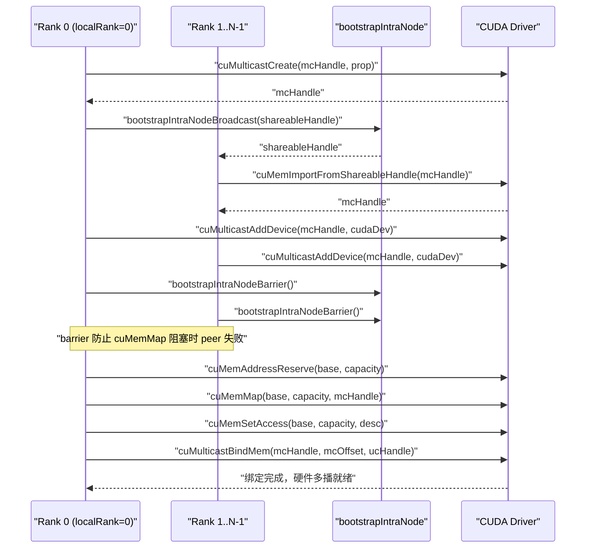
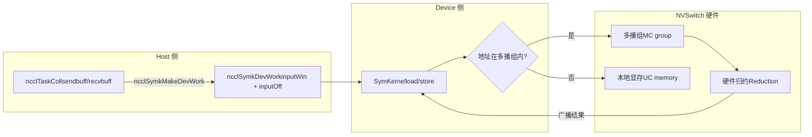

# 第 14 章：対称メモリと NVLS：マルチキャスト加速と LSA デバイス側直接アドレッシング

前章では、マシン間の AllReduce を追い、データが GPU メモリからネットワークカードを経由して対向 GPU に到達する様子を見ました。そのパスが解決するのはマシン間の通信です。しかし、現代の AI クラスタでは、同一マシン内、さらには同一 NVLink ドメイン内の GPU 間通信量も同様に膨大です——データ並列トレーニングにおける勾配同期、テンソル並列における活性値交換のほとんどがマシン内で発生します。もしマシン内通信が依然として GPU→メモリ→ネットワークカード→対向ネットワークカード→メモリ→GPU というマシン間フローを通るなら、市内の宅配便をわざわざ航空便で送るようなもので、レイテンシが無駄に消費されます。本章で解き明かすのは、NCCL がマシン内通信のために用意した二つの強力なツール：対称メモリと NVLS です。前者は各 rank が同一の仮想アドレスで全 rank のバッファにアクセスできるようにし、後者は NVSwitch ハードウェアのマルチキャスト機能を利用してリダクションを行います。両者を組み合わせることで、小メッセージ集合通信のレイテンシをハードウェア限界に近づけることができます。

# 14.1 対称メモリ：「3 列目 5 番目の席」を誰の家でも同じ位置として指す

## 直感的モデル

クラスで宿題のノートを交換することを想像してください。従来の方法では、各自が自分のノートに番号を振り、「張三、私の 5 冊目を君に；李四、私の 8 冊目を君に」と叫びます——各自が「誰のノートがどこにあり、何冊目か」を覚えなければなりません。これが通常の通信です：アドレスは**相対的で、私的なもの**であり、対向のデータにアクセスするには、まず対向のアドレスマッピングを知る必要があります。

対称メモリは別のアプローチを取ります：クラス全員で「3 列目 5 番目の席」という座標を約束し、それが誰の家でも同じ物理位置を指すようにします。すると張三が李四の 5 冊目を取るには、「李四の家の 3 列目 5 番目の席」と言うだけでよく、アドレス変換は一切不要です。これが対称メモリの核心です：**各 rank のバッファが、全 rank のアドレス空間で同じ仮想アドレスにマッピングされる**。

> **[Design Inference & Architectural Trade-offs]**
> もし対称メモリがなければ、マシン内集合通信はどのような災難に直面するでしょうか？ 各 rank が対向バッファにアクセスするたびに、「アドレス変換」——テーブル検索、オフセット計算、場合によってはマッピング関係を確認するためのプロセス間通信——を経なければなりません。小メッセージ（数 KB）では、この変換のオーバーヘッドがデータ自体の転送よりも大きくなる可能性があります。対称メモリはこのオーバーヘッドを完全に排除します。これこそが「小メッセージのレイテンシを大幅に削減する」根本的な理由です。

## データ構造とメモリレイアウト

対称メモリの登録タイプは`ncclSymRegType_t`によって記述され、`ncclGetSymRegType`は send/recv ウィンドウに`NCCL_WIN_COLL_SYMMETRIC`フラグが付いているかどうかに基づいて、登録状態を四つに分類します。

[FACT:src/sym_kernels.cc:395-412]

```c
ncclResult_t ncclGetSymRegType(struct ncclDevrWindow* sendWin, struct ncclDevrWindow* recvWin,
                               ncclSymRegType_t* winRegType) {
  bool isSendSymmReg = false;
  bool isRecvSymmReg = false;
  if (sendWin && (sendWin->winFlags & NCCL_WIN_COLL_SYMMETRIC)) isSendSymmReg = true;
  if (recvWin && (recvWin->winFlags & NCCL_WIN_COLL_SYMMETRIC)) isRecvSymmReg = true;
  // determine the registration type
  if (!isSendSymmReg && !isRecvSymmReg) {
    *winRegType = ncclSymSendNonregRecvNonreg;
  } else if (isSendSymmReg && !isRecvSymmReg) {
    *winRegType = ncclSymSendRegRecvNonreg;
  } else if (!isSendSymmReg && isRecvSymmReg) {
    *winRegType = ncclSymSendNonregRecvReg;
  } else if (isSendSymmReg && is isRecvSymmReg) {
    *winRegType = ncclSymSendRegRecvReg;
  }
  return ncclSuccess;
}
```

これら四つの状態が、後続の kernel がどのパスを通るかを決定します：完全対称登録（`SendRegRecvReg`）は最速の LSA パスを通り、完全非登録（`SendNonregRecvNonreg`）は通常パスを通り、混合状態は特別な処理が必要です。`winFlags`内の`NCCL_WIN_COLL_SYMMETRIC`ビットが「このウィンドウが対称登録済みかどうか」のマークです。

対称メモリの初期化エントリポイントは`ncclSymkInitOnce`であり、これが行う重要なことの一つは：現在の通信ドメインが LSA マルチキャストをサポートしているかどうかの判定です（`hasLsaMultimem`）。

[FACT:src/sym_kernels.cc:185-196]

```c
ncclResult_t ncclSymkInitOnce(struct ncclComm* comm) {
  // ncclTeamLsa() below calls this internally but drops the error code so we do it here.
  NCCLCHECK(ncclDevrInitOnce(comm));

  struct ncclSymkState* symk = &comm->symkState;
  if (!symk->initialized) {
    symk->initialized = true;
    struct ncclDevCommRequirements reqs = NCCL_DEV_COMM_REQUIREMENTS_INITIALIZER;
    // Disable LSA multicast for cross-clique since NVLS isn't available across cliques
    symk->hasLsaMultimem =
      ncclNvlsSymmetricMultimemEnabled(comm) && ncclTeamLsa(comm).nRanks > 2 && !comm->p2pCrossClique;
    reqs.lsaMultimem = symk->hasLsaMultimem;
```

`hasLsaMultimem`の3つの条件はすべて揃わなければならない：NVLS対称マルチキャストが有効、LSAチームのrank数が2より大きい（2つのrankなら直接ポイントツーポイントの方が速く、マルチキャストは不要）、かつcliqueを跨がない（cliqueを跨ぐとNVSwitchマルチキャストが使用不可）。この判定が直接`reqs.lsaMultimem`をセットするかどうかを決め、ひいてはデバイス側コミュニケータのリソース割り当てに影響する。

## シナリオ駆動のステップバイステップ・ウォークスルー

AllReduceを1回発起し、メッセージサイズ4KB、8つのrankが同一NVLinkドメイン内にあると仮定する。`ncclSymkMask`がどのkernelが利用可能かを決定する。

[FACT:src/sym_kernels.cc:304-352]

```c
uint32_t ncclSymkMask(struct ncclComm* comm, ncclFunc_t coll, int /*ncclDevRedOp_t*/ red, ncclDataType_t ty,
                      size_t nElts, bool symAligned16B) {
  uint32_t kmask = kernelMask_coll(coll);

  bool hasSTMC = comm->symkState.hasLsaMultimem;
  bool hasLDMC = false;
  if (comm->symkState.hasLsaMultimem) {
    switch (ty) {
    case ncclInt32:
    ...
      hasLDMC = red == ncclDevSum || red == ncclDevMinMax || red == ncclDevSumPostDiv;
      break;
    ...
    }
  }
  if (!hasSTMC) kmask &= ~kernelMask_STMC;
  if (!hasLDMC) kmask &= ~kernelMask_LDMC;
```

第一步：`kernelMask_coll`集合タイプ（AllReduce）に基づいて候補kernel集合`kernelMask_AR`を取り出す。第二步：`hasLsaMultimem`をチェックし、マルチキャストがサポートされていれば、さらにデータ型とリダクション操作がLDMC（Load-Multicast）をサポートするかを判定する。第三步：ビットマスクでサポートされない機能をクリア——`kmask &= ~kernelMask_STMC`STMCをサポートしないkernelをすべて除外する。

次にサイズ制限：

[FACT:src/sym_kernels.cc:336-342]

```c
  size_t nBytes = alignUp(nElts * ncclTypeSize(ty), NCCL_SYM_KERNEL_CELL_SIZE);
  size_t nBusBytes = (coll == ncclFuncAllReduce ? 1 : comm->nRanks) * nBytes;
  // LL kernels use 32-bit ints to track element counts and indices.
  if (nBusBytes >= (size_t(2) = 32 * (size_t(2) nRanks;
  kmask &= needGin ? kernelMask_Gin : ~kernelMask_Gin;
  return kmask;
```

TMAはSMEM容量が基準を満たす（`ncclSymkTmaAvailable`が`maxSharedMemOptin`をチェック）かつ16バイトアラインメントが必要。GINは「LSAチームのrank数が総rank数より小さい」場合にのみ必要——つまり、通信ドメインがLSA境界を越える（ネットワーク経由が必要）場合にのみGINが意味を持つ。通信ドメイン全体がLSA内にあれば、GIN kernelは除外される。

## 並行制御とハードウェア相互作用

対称メモリのアドレス解決は最終的にデバイス側に落ちる。`ncclSymkMakeDevWork`host側のタスク記述をデバイス側が読める作業項目に変換する。

[FACT:src/sym_kernels.cc:380-393]

```c
ncclResult_t ncclSymkMakeDevWork(struct ncclComm* comm, struct ncclTaskColl* task, struct ncclSymkDevWork* outDevWork) {
  outDevWork->rootRank = task->root;
  outDevWork->redOpArg = task->opDev.scalarArg;
  outDevWork->nElts = task->count;
  outDevWork->inputWin = task->sendWin ? task->sendWin->vidmem : nullptr;
  outDevWork->inputOff =
    task->sendWin ? (uint8_t*)task->sendbuff - (uint8_t*)task->sendWin->userPtr : (size_t)task->sendbuff;
  outDevWork->outputWin = task->recvWin ? task->recvWin->vidmem : nullptr;
  outDevWork->outputOff =
    task->recvWin ? (uint8_t*)task->recvbuff - (uint8_t*)task->recvWin->userPtr : (size_t)task->recvbuff;
  outDevWork->sChannelId = 0xffff;
  outDevWork->nChannels = 0;
  return ncclSuccess;
}
```

注意すべきは`inputOff`の計算：sendWinが存在する場合（対称登録ウィンドウ）、オフセットは`sendbuff - sendWin->userPtr`——これは**ウィンドウ内オフセット**であり、デバイス側は`inputWin`（ウィンドウベースアドレス）に`inputOff`を加えて実アドレスを算出できる。sendWinが存在しない場合、オフセットは直接`sendbuff`の絶対アドレスとなる。この設計により、デバイス側kernelは同一のロジックで登録済みバッファと未登録バッファを処理できる。

`ncclSymkInitOnce`ではGIN関連のリソース要件も初期化される。inbox、outbox、accumulation buffer、rail signalを含む。

[FACT:src/sym_kernels.cc:208-251]

```c
    struct ncclDevResourceRequirements ginInboxRailReq = {};
    struct ncclDevResourceRequirements ginOutboxReq = {};
    struct ncclDevResourceRequirements rsGinAccumReq = {};
    struct ncclDevResourceRequirements railSignalReq = {};
    if (ncclParamSymGinKernelsEnable() && ncclTeamLsa(comm).nRanks nRanks) {
      int maxBlocks;
      size_t bufSize;
      getRequirements_gin(comm, &maxBlocks, &bufSize);

      maxBlocks = std::max(maxBlocks, comm->config.minCTAs);
      maxBlocks = std::min(maxBlocks, comm->config.maxCTAs);
      if (ncclParamSymCTAs() >= 1) maxBlocks = ncclParamSymCTAs();
      maxBlocks = std::min(maxBlocks, ncclSymkMaxBlocks);
      symk->maxGinInboxBlocks = maxBlocks;
      symk->kcomm.rsGinAccumBytesPerBlock = ncclSymkRsGinAccumBytesPerBlock();

      rsGinAccumReq.bufferSize = (size_t)maxBlocks * symk->kcomm.rsGinAccumBytesPerBlock;
      rsGinAccumReq.bufferAlign = 128;
      rsGinAccumReq.outBufferHandle = &symk->kcomm.rsGinAccumBuf;
      ...
      uint32_t railSignalCount = ncclTeamRail(comm).nRanks * ncclSymkMaxBlocks;
      ...
      reqs.barrierCount = ncclSymkMaxBlocks;
      reqs.ginConnectionType = NCCL_GIN_CONNECTION_RAIL;
      reqs.ginStrongSignalsRequired = true;
      reqs.ginVaSignalsRequired = true;
    }
```

`getRequirements_gin`はチューニングモデルで必要なblock数とバッファサイズを算出し、その後`[minCTAs, maxCTAs]`区間にclampされる。`rsGinAccumBytesPerBlock`は各blockの累加バッファサイズで、128バイトにアラインされる——これはキャッシュラインサイズであり、偽共有を避けるため。

```mermaid
flowchart TD
    start["ncclSymkMask(comm, coll, red, ty, nElts)"] --> coll{"集合类型?"}
    coll -->|AllGather| mask_ag["kmask = kernelMask_AG"]
    coll -->|AllReduce| mask_ar["kmask = kernelMask_AR"]
    coll -->|ReduceScatter| mask_rs["kmask = kernelMask_RS"]
    mask_ag --> check_stmc{"hasLsaMultimem?"}
    mask_ar --> check_stmc
    mask_rs --> check_stmc
    check_stmc -->|否| clear_stmc["kmask &= ~kernelMask_STMC"]
    check_stmc -->|是| check_ldmc{"数据类型+归约支持LDMC?"}
    clear_stmc --> size_check
    check_ldmc -->|否| clear_ldmc["kmask &= ~kernelMask_LDMC"]
    check_ldmc -->|是| size_check
    clear_ldmc --> size_check
    size_check{"nBusBytes >= 2GB?"} -->|是| clear_ll["kmask &= ~kernelMask_LL"]
    size_check -->|否| tma_check
    clear_ll --> tma_check{"TMA可用且16B对齐?"}
    tma_check -->|否| clear_tma["kmask &= ~kernelMask_Tma"]
    tma_check -->|是| gin_check
    clear_tma --> gin_check{"需要GIN? LSA rank |否| clear_gin["kmask &= ~kernelMask_Gin"]
    gin_check -->|是| done
    clear_gin --> done["返回 kmask"]
```

この図は`ncclSymkMask`の決定チェーンを完全に描き出している：集合タイプから出発し、マルチキャストサポート、データ型、サイズ境界、TMA可用性、GIN要件の5つのフィルタを順に通過し、最終的にビットマスクを返す。各フィルタはkernelの一群を除外する可能性があり、これこそNCCLの「シナリオごとに最適なkernelを選ぶ」ことの表れである。

## 本番環境の落とし穴回避ガイド

**落とし穴1：cliqueを跨ぐとマルチキャストが静かに無効化される。** `hasLsaMultimem`の3番目の条件は`!comm->p2pCrossClique`である。クラスタがMNNVL（Multi-Node NVLink）を構成していても、一部のrankがcliqueを跨ぐとマルチキャストが無効化され、性能は静かに通常パスへ退化する。調査時は`ncclNvlsSymmetricMultimemEnabled`のログ出力を見る。

**落とし穴2：16バイトアラインメントの暗黙の要件。** `ncclSymkMask`では`if (!symAligned16B) kmask &= ~kernelMask_Tma;`——ユーザーバッファが16バイトアラインでない場合、TMA kernelが除外される。TMAはHopper/Blackwell上で最速のコピーエンジンであり、これを失うことは性能低下を意味する。本番環境では、ユーザーが渡すバッファはしばしば`cudaMalloc`に由来し、自然にアラインされる。しかしカスタムアロケータやスライスに由来する場合は落とし穴にはまる可能性がある。

**落とし穴3：2GB境界。**LL kernelは32ビットインデックスを使用し、2GBバスバイト数を超えると除外される。大規模モデル訓練では、1回のAllReduceの勾配がこの値を超えることがあり、その場合NCCLは自動的にSTMCまたはSimpleプロトコルに切り替える。これはバグではないが、手動でLLプロトコルを指定すると`ncclInvalidArgument`。

---

# 14.2 NVLS：NVSwitchハードウェアにリダクションを任せる

## 直感モデル

従来のAllReduceは「ソフトウェアリダクション」である：各GPUがデータを隣接GPUに送り、隣接GPUが加算して転送する——データはGPU間を行き来し、加算はSM上で実行される。これは8人が紙を回して合計を計算するようなもので、各人が読んで、加算して、また回す必要がある。

NVLSは発想を変えた：NVSwitchチップに内蔵された**マルチキャスト（multicast）とリダクション（reduction）機能**。データをマルチキャストアドレスに書き込むと、NVSwitchが自動的にすべてのメンバーにブロードキャストし、ハードウェア内で加算を完了します。これは8人が同じホワイトボードに数字を書き、ホワイトボードが自動的に合計を表示するようなものです——GPUは一度書いて一度読むだけで、中間の転送と加算はすべてスイッチハードウェアが行います。

NVLSがなければ、ノード内AllReduceの帯域幅はGPU間のポイントツーポイントリンクによって制限され、SMは加算に大量のサイクルを費やす必要があります。NVLSはこの2つをハードウェアにオフロードし、SMは他の計算を行うことができます。

## データ構造とメモリレイアウト

NVLSの核心は**マルチキャストグループ（MC group）**。`ncclMcGroup`構造体はマルチキャストグループの全状態を記述します。

[FACT:src/transport/multicast.cc:72-77]

```c
struct ncclMcGroup {
  CUmemGenericAllocationHandle handle;  // the MC object
  char* base;                          // mapped MC VA base
  size_t capacity;                      // total mapped VA size
  int dev;                           // local device, for unbind
};
```

4つのフィールド：`handle`はCUDAマルチキャストオブジェクトのハンドル、`base`はマルチキャスト仮想アドレスのベースアドレス、`capacity`は総マッピングサイズ、`dev`はローカルデバイス番号（バインド解除用）。ここにはロックがないことに注意——マルチキャストグループの作成と破棄は初期化/破棄フェーズで行われ、ホットパス上にはありません。

マルチキャストグループは複数の**パーティション（partition）**に分割され、各パーティションは不変のスライスです。`ncclMcPartition`は1つのパーティションを記述します。

[FACT:src/transport/multicast.cc:162-170]

```c
  // A partition is self-sufficient for binds: it carries the group's handle, device and
  // bind granularity alongside its own extent.
  for (int i = 0; i base + outPartitions[i].offset;
    outPartitions[i].mcHandle = mcHandle;
    outPartitions[i].minGranularity = minGran;
    outPartitions[i].dev = comm->cudaDev;
  }
```

各パーティションは自身の`offset`、`size`、`ptr`を保持し、所属グループの`mcHandle`、`minGranularity`、`dev`も持ちます。この「自己完結型」の設計により、パーティションはグループ情報を再検索することなく独立してバインド関数に渡すことができます。

## シナリオ駆動のステップバイステップウォークスルー

8つのrankがNVLSドメインを確立するとします。`ncclMcGroupBuildPartitions`がマルチキャストグループの作成とパーティションの分割を担当します。

[FACT:src/transport/multicast.cc:79-121]

```c
ncclResult_t ncclMcGroupBuildPartitions(struct ncclComm* comm, const struct ncclMcRequest* requests, int nRequests,
                                        struct ncclMcGroup** outGroup, struct ncclMcPartition* outPartitions) {
  ...
  mcprop.numDevices = comm->localRanks;
  mcprop.handleTypes = ncclCuMemHandleType;
  mcprop.flags = 0;
  mcprop.size = 0;
  for (int i = 0; i  recGran ? requests[i].alignment : recGran;
    ALIGN_SIZE(capacity, align);
    size_t slice = requests[i].size;
    ALIGN_SIZE(slice, recGran);
    outPartitions[i].offset = capacity;
    outPartitions[i].size = slice;
    capacity += slice;
  }
```

ステップ1：すべてのリクエストのサイズを累積し、マルチキャストグループの総サイズを取得。ステップ2：CUDAの推奨粒度と最小粒度を照会——これはハードウェア制約であり、マルチキャストオブジェクトのアドレスとサイズは粒度の整数倍でなければなりません。ステップ3：bumpアロケーション——各リクエストに1ブロックを割り当て、オフセットとサイズを推奨粒度にアライン。`ALIGN_SIZE(capacity, align)`は各スライスの開始オフセットが有効なバインドオフセットであることを保証します。

次はrank間の作成とインポートです：

[FACT:src/transport/multicast.cc:125-146]

```c
  if (comm->localRank == 0) {
    NCCLCHECKGOTO(ncclMcCreate(comm, &mcprop, comm->localRank, comm->localRanks, &mcHandle, shareableHandle), ret,
                  fail);
    mcCreated = 1;
    NCCLCHECKGOTO(bootstrapIntraNodeBroadcast(comm->bootstrap, comm->localRankToRank, comm->localRank, comm->localRanks,
                                              0, shareableHandle, NVLS_HANDLE_SIZE),
                  ret, fail);
  } else {
    NCCLCHECKGOTO(bootstrapIntraNodeBroadcast(comm->bootstrap, comm->localRankToRank, comm->localRank, comm->localRanks,
                                              0, shareableHandle, NVLS_HANDLE_SIZE),
                  ret, fail);
    NCCLCHECKGOTO(ncclMcImport(comm, shareableHandle, comm->localRankToRank[0], &mcHandle), ret, fail);
    mcCreated = 1;
  }
  CUCHECKGOTO(cuMulticastAddDevice(mcHandle, comm->cudaDev), ret, fail);

  // cuMemMap of an MC object blocks until every device has been added. This
  // abort-aware barrier makes a peer failing before cuMulticastAddDevice trip the
  // abort flag here instead of stranding survivors in the blocking cuMemMap.
  NCCLCHECKGOTO(bootstrapIntraNodeBarrier(comm->bootstrap, comm->localRankToRank, comm->localRank, comm->localRanks,
                                          comm->localRankToRank[0]),
                ret, fail);
```

localRank 0がマルチキャストオブジェクトを作成し、bootstrap経由でshareable handleをブロードキャスト；他のrankはhandleを受信してインポートします。`cuMulticastAddDevice`はローカルデバイスをマルチキャストグループに追加します。あのbarrierに注意——コメントが明確に述べています：`cuMemMap`はすべてのデバイスが参加するまでブロックし、あるpeerが`cuMulticastAddDevice`の前に失敗した場合、生存者は`cuMemMap`でスタックします。このbarrierにより、失敗はブロック前にabortフラグで捕捉されます。

最後にマッピングとアクセス権限の設定です：

[FACT:src/transport/multicast.cc:148-155]

```c
  // Reserve and map the whole MC VA once; each consumer slice is a view into it.
  CUCHECKGOTO(cuMemAddressReserve(&base, capacity, recGran, 0U, 0), ret, fail);
  CUCHECKGOTO(cuMemMap(base, capacity, 0, mcHandle, 0), ret, fail);
  mapped = 1;
  desc.flags = CU_MEM_ACCESS_FLAGS_PROT_READWRITE;
  desc.location.type = CU_MEM_LOCATION_TYPE_DEVICE;
  desc.location.id = comm->cudaDev;
  CUCHECKGOTO(cuMemSetAccess(base, capacity, &desc, 1), ret, fail);
```

マルチキャストVA全体は一度だけ予約およびマッピングされ、各コンシューマスライスはこのVAのビューです。これは「一度マッピング、複数回スライス」の設計——各コンシューマが個別にマルチキャストオブジェクトを作成するよりもリソースを節約します。

## 並行制御とハードウェア相互作用

バインドはNVLSの最も重要な操作です。`ncclMcPartitionBindMem`UC（ユニキャスト）メモリハンドルをマルチキャストグループの特定のオフセットにバインドします。

[FACT:src/transport/multicast.cc:200-225]

```c
ncclResult_t ncclMcPartitionBindMem(const struct ncclMcPartition* partition, size_t offsetInPartition,
                                    CUmemGenericAllocationHandle mem, size_t memOffset, size_t bindSize) {
  // A bind overrunning its partition would corrupt the next consumer's partition; fail
  // cleanly instead (possible when UC rounding exceeds the MC-rounded partition).
  if (offsetInPartition + bindSize > partition->size) {
    WARN("NVLS MC bind of size %zu at slice offset %zu exceeds slice size %zu (UC/MC granularity mismatch)", bindSize,
         offsetInPartition, partition->size);
    return ncclInternalError;
  }
  size_t mcOffset = partition->offset + offsetInPartition;
  ...
  CUresult err = CUPFN(cuMulticastBindMem(partition->mcHandle, mcOffset, mem, memOffset, bindSize, 0 /*flags*/));
  if (err != CUDA_SUCCESS) {
    ...
    WARN("Failed to bind NVLink SHARP (NVLS) Multicast memory of size %zu at MC group %llx offset %zu : CUDA error %d "
         "'%s'.\nThis is usually caused by a system or configuration error in the Fabric Manager or NVSwitches.\n"
         "Disable NVLS (NCCL_NVLS_ENABLE=0) if you wish to avoid this error in the future.",
         bindSize, partition->mcHandle, mcOffset, err, errStr);
    return ncclUnhandledCudaError;
  }
  return ncclSuccess;
}
```

第一の防御線は境界チェックです：`offsetInPartition + bindSize > partition->size`でエラーを報告します。コメントが理由を説明しています——UCメモリの粒度はMCパーティションより大きい可能性があり、UCがアライン後にMCパーティションの境界を超えると、次のコンシューマのパーティションを踏んでしまいます。これは典型的な「2つの粒度の不一致」の罠です。

`cuMulticastBindMem`はハードウェア呼び出しで、コメントには「blocks until all ranks have been added to the group」とあり——これはNVLSで最も問題が発生しやすい箇所です。Fabric Managerの設定ミスやNVSwitchファームウェアの問題がある場合、ここでハングするかエラーを返します。エラーメッセージには直接ユーザーに`NCCL_NVLS_ENABLE=0`を推奨しており、これは本番環境の標準的な脱出ハッチです。

また、ユーザーバッファ登録用の「バインド試行」バリアントもあります：

[FACT:src/transport/multicast.cc:237-268]

```c
ncclResult_t ncclMcPartitionTryBindAddr(const struct ncclMcPartition* partition, size_t offsetInPartition,
                                        CUdeviceptr address, size_t bindSize, enum ncclMcBindStatus* outStatus) {
  const char* errStr = NULL;

  *outStatus = ncclMcBindStatusTransient;
  if (offsetInPartition + bindSize > partition->size) {
    ...
    return ncclInternalError;
  }
  size_t mcOffset = partition->offset + offsetInPartition;
  CUresult err = CUPFN(cuMulticastBindAddr(partition->mcHandle, mcOffset, address, bindSize, 0 /*flags*/));
  if (err == CUDA_SUCCESS) {
    *outStatus = ncclMcBindStatusOk;
    return ncclSuccess;
  }

  (void)pfn_cuGetErrorString(err, &errStr);
  // Only an outright rejection of the input is a property of the buffer. Anything else,
  // notably OUT_OF_MEMORY, may succeed later, so it must not be reported as permanent.
  if (err == CUDA_ERROR_INVALID_VALUE || err == CUDA_ERROR_NOT_SUPPORTED || err == CUDA_ERROR_NOT_PERMITTED) {
    *outStatus = ncclMcBindStatusNoSupport;
    ...
  } else {
    WARN("NVLS Multicast bind of size %zu at MC group %llx offset %zu dev %d failed transiently: CUDA error %d '%s'.\n"
         "The buffer is left unregistered for this operation and will be retried; repeated occurrences indicate "
         "sustained resource pressure.",
         bindSize, partition->mcHandle, mcOffset, partition->dev, err, errStr);
  }
  return ncclSuccess;
}
```

ここには巧妙なエラー分類があります：`CUDA_ERROR_INVALID_VALUE`、`NOT_SUPPORTED`、`NOT_PERMITTED`は`ncclMcBindStatusNoSupport`に分類されます——これは**永続的失敗**であり、このバッファ自体がマルチキャストバインドをサポートしていないことを示します。一方、他のエラー（特に`OUT_OF_MEMORY`）は`ncclMcBindStatusTransient`に分類されます——これは**一時的失敗**であり、リトライ可能です。この区別は極めて重要です：OOMを永続的失敗として扱うと、成功し得た登録を誤って諦めてしまいます；パラメータエラーを一時的失敗として扱うと、無限にリトライしてしまいます。

## 本番環境の落とし穴回避ガイド

**落とし穴1：Fabric Managerの設定ミスによる`cuMulticastBindMem`のハング。**これはNVLSの最も古典的な本番障害です。エラーメッセージはFabric ManagerまたはNVSwitchを明確に指摘しています。トラブルシューティング手順：まず`NCCL_NVLS_ENABLE=0`で問題が消えることを確認し、次にFabric ManagerのログとNVSwitchファームウェアバージョンを確認します。

**落とし穴2：UC/MC粒度の不一致。** `ncclMcPartitionBindMem`の境界チェックがこの問題を捕捉しますが、「UC/MC granularity mismatch」警告が表示された場合、あるリクエストのUCサイズがアライン後にMCパーティションを超えていることを示します。これは通常、リクエストサイズが粒度境界に近い場合に発生します。

**落とし穴3：マルチキャストグループ作成失敗後のリソースリーク。** `ncclMcGroupBuildPartitions`のfailパスは`CUCALL`（best-effort）を使用しており、`CUCHECK`：

[FACT:src/transport/multicast.cc:179-184]

```c
fail:
  // Best-effort (CUCALL) so a failing cleanup op cannot skip releasing the MC handle.
  if (mapped) CUCALL(cuMemUnmap(base, capacity));
  if (base) CUCALL(cuMemAddressFree(base, capacity));
  if (mcCreated) CUCALL(cuMemRelease(mcHandle));
  return ret;
```

コメントは理由を説明している：cleanup 操作自体が失敗しても、それを理由に MC ハンドルの解放をスキップしてはならない——MC スロットは希少なリソースであり、リークすると後続の作成が失敗する。これは「クリーンアップ経路はベストエフォートでなければならない」という典型的な設計である。



このシーケンス図は、マルチキャストグループが作成からバインドまでの完全なフローを描いている。鍵となるのはあの barrier である——それは「peer 失敗」と「cuMemMap ブロッキング」を分離し、生存者がデッドロックするのを防ぐ。

---

# 14.3 対称メモリと NVLS の合体：LSA ポインタがデバイス側でどのように解決されるか

## 直感的モデル

対称メモリは「アドレス一致」問題を解決し、NVLS は「ハードウェアリダクション」問題を解決する。しかし両者が真に協調するには、もう一つ鍵となるメカニズムが必要である：**デバイス側は、あるアドレスが対称であり、マルチキャスト経路を通れることをどのように知るのか？**

答えは LSA（Load-Store Accessible）ポインタにある。LSA は「ロード・ストアアクセス可能」の略で、このポインタが指すメモリに GPU が通常の load/store 命令で直接アクセスできることを意味する——それが物理的にローカルにあろうとリモートにあろうと関係ない。アドレスがマルチキャストグループ内にあれば、load/store は NVSwitch ハードウェアにインターセプトされブロードキャストされる。

## データ構造とメモリレイアウト

`ncclSymkDevWork`はデバイス側のワークディスクリプタであり、対称メモリの鍵となる情報を運んでいる。

[FACT:src/sym_kernels.cc:380-393]

```c
ncclResult_t ncclSymkMakeDevWork(struct ncclComm* comm, struct ncclTaskColl* task, struct ncclSymkDevWork* outDevWork) {
  outDevWork->rootRank = task->root;
  outDevWork->redOpArg = task->opDev.scalarArg;
  outDevWork->nElts = task->count;
  outDevWork->inputWin = task->sendWin ? task->sendWin->vidmem : nullptr;
  outDevWork->inputOff =
    task->sendWin ? (uint8_t*)task->sendbuff - (uint8_t*)task->sendWin->userPtr : (size_t)task->sendbuff;
  outDevWork->outputWin = task->recvWin ? task->recvWin->vidmem : nullptr;
  outDevWork->outputOff =
    task->recvWin ? (uint8_t*)task->recvbuff - (uint8_t*)task->recvWin->userPtr : (size_t)task->recvbuff;
  outDevWork->sChannelId = 0xffff;
  outDevWork->nChannels = 0;
  return ncclSuccess;
}
```

`inputWin`はウィンドウのデバイス側仮想アドレス（`vidmem`），`inputOff`はウィンドウ内のバッファのオフセットである。デバイス側 kernel はこれら二つの値を取得した後、`inputWin + inputOff`を計算して実際のアドレスを得る。このアドレスがマルチキャストグループ内にあれば、ハードウェアが自動的にブロードキャストを処理する。

`ncclSymkInitOnce`には LSA barrier と LLA2A（Low-Latency All-to-All）リソースも設定されている。

[FACT:src/sym_kernels.cc:197-206]

```c
    reqs.lsaBarrierCount = ncclSymkMaxBlocks;
    reqs.ginStrongSignalsRequired = false;
    reqs.ginVaSignalsRequired = false;

    struct ncclDevResourceRequirements lla2aReq;
    ncclLLA2ACreateRequirement(ncclSymkMaxBlocks,
                               ncclLLA2ACalcSlots(ncclTeamLsa(comm).nRanks * ncclSymkMaxThreads, ncclSymkLLMaxEltSize),
                               &symk->kcomm.lsaLLA2A, &lla2aReq);
    lla2aReq.next = reqs.resourceRequirementsList;
    reqs.resourceRequirementsList = &lla2aReq;
```

`lsaBarrierCount`は`ncclSymkMaxBlocks`に設定される——各 block に一つの barrier スロット。LLA2A は低遅延 all-to-all の略で、LSA ドメイン内で高速なデータ交換を行うために用いられる。`ncclLLA2ACalcSlots`は rank 数、スレッド数、最大要素サイズに基づいて必要なスロット数を算出する。

## シナリオ駆動のステップバイステップウォークスルー

ある AllReduce が`AllReduce_AGxLLMC_R`kernel（AllGather + LL + MC + Reduce）を使用すると仮定する。この kernel のワークフローは：

1. **AllGather フェーズ**：各 rank が自分のデータをマルチキャストグループに書き込み、NVSwitch ハードウェアがすべての rank にブロードキャストする。

2. **Reduce フェーズ**：各 rank がマルチキャストグループからすべての rank のデータを読み取り、ローカルでリダクションを行う。

`ncclSymkMask`はこの kernel が利用可能かどうかをチェックする。`kernelMask_LL`は`AllReduce_AGxLLMC_R`を含むが、それは`hasLsaMultimem`が真であることが前提である（そうでなければ`kernelMask_STMC`がクリアされ、`AllReduce_AGxLLMC_R`は STMC 集合に属する）。

待って、ここに細かい点がある：`kernelMask_STMC`は`AllReduce_AGxLLMC_R`を含むか？ソースコードを見てみよう：

[FACT:src/sym_kernels.cc:17-21]

```c
constexpr uint32_t kernelMask_STMC =
  1 nvlsChannels;
    size_t creditSize = nChannels * 2 * memSize * nHeads;
    int nvlsStepSize = comm->nvlsChunkSize;

    NCCLCHECKGOTO(ncclCalloc(&comm->nvlsResources, 1), res, fail);
    comm->nvlsResources->inited = false;
    comm->nvlsResources->refCount = 1;
    comm->nvlsResources->nChannels = nChannels;
    comm->nvlsResources->nHeads = nHeads;
    comm->nvlsResources->chunkSize = comm->nvlsChunkSize;
    comm->nvlsResources->treeMaxChunkSize = comm->nvlsTreeMaxChunkSize;
    resources = comm->nvlsResources;

    for (int c = 0; c accessDesc, 0, sizeof(resources->accessDesc));
    resources->accessDesc.flags = CU_MEM_ACCESS_FLAGS_PROT_READWRITE;
    resources->accessDesc.location.type = CU_MEM_LOCATION_TYPE_DEVICE;
    resources->accessDesc.location.id = comm->cudaDev;
    resources->dev = comm->cudaDev;

    // Build the single shared MC group for this NVLS domain. The data slice is
    // reserved here but bound later by ncclNvlsBufferSetup.
    {
      size_t buffSize = nvlsStepSize * NCCL_STEPS;
      size_t dataSize = nChannels * 2 * buffSize * nHeads;
      size_t ubSize = ncclNvlsUbSize(comm);
      struct ncclMcRequest requests[3] = {{creditSize, 0}, {dataSize, 0}, {ubSize, 0}};
      struct ncclMcPartition partitions[3];
      NCCLCHECKGOTO(ncclMcGroupBuildPartitions(comm, requests, 3, &resources->mcGroup, partitions), res, fail);
      resources->creditPartition = partitions[0];
      resources->dataPartition = partitions[1];
      if (ubSize) {
        resources->ubPartition = partitions[2];
        NCCLCHECKGOTO(ncclMcArenaInit(comm, &resources->ubArena, &resources->ubPartition), res, fail);
        resources->ubEnabled = true;
      }
      NCCLCHECKGOTO(nvlsAllocBindUc(comm, &resources->creditPartition, creditSize, &resources->creditUc), res, fail);
    }
```

マルチキャストグループは三つのパーティションに分割される：`creditPartition`（クレジット）、`dataPartition`（データ）、`ubPartition`（ユーザーバッファ）。credit パーティションは同期に用いられる——各 channel は独立した head/tail ポインタを持ち、マルチキャストグループを通じて共有される。

credit の初期化は後続のループで行われる：

[FACT:src/transport/nvls.cc:456-491]

```c
    for (int h = 0; h nRanks + 1 + h;
      for (int c = 0; c channels + c;
        char* mem = NULL;
        struct ncclChannelPeer* peer = channel->peers[nvlsPeer];

        // Reduce UC -> MC
        mem = (char*)resources->creditUc.ptr + (h * 2 * nChannels + c) * memSize;
        peer->send[1].transportComm = &nvlsTransport.send;
        peer->send[1].conn.buffs[NCCL_PROTO_SIMPLE] = NULL;
        peer->send[1].conn.head = (uint64_t*)mem;
        peer->send[1].conn.tail = (uint64_t*)(mem + memSize / 2);
        peer->send[1].conn.stepSize = nvlsStepSize;
        mem = (char*)resources->creditPartition.ptr + (h * 2 * nChannels + c) * memSize;
        peer->recv[0].transportComm = &nvlsTransport.recv;
        peer->recv[0].conn.buffs[NCCL_PROTO_SIMPLE] = NULL;
        peer->recv[0].conn.head = (uint64_t*)mem;
        peer->recv[0].conn.tail = (uint64_t*)(mem + memSize / 2);
        peer->recv[0].conn.stepSize = nvlsStepSize;
        peer->recv[0].conn.flags |= NCCL_NVLS_MIN_POLL;
```

各 head と channel の組み合わせが独立した credit 領域を持つ。`head`と`tail`は 64 ビットポインタであり、`memSize`は 64 バイト（`size_t memSize = 64;`）なので、head と tail がそれぞれ 32 バイトを占める——ちょうどキャッシュラインの半分である。`NCCL_NVLS_MIN_POLL`フラグは受信側に最小ポーリングモードを使わせ、CPU オーバーヘッドを削減する。

## 本番環境の落とし穴回避ガイド

**落とし穴 1：credit パーティションの head/tail 競合。**複数の channel が同じマルチキャストグループを共有するが、各 channel は独立した credit 領域を持つ。channel 数が不適切に設定されると（例えば`nvlsCTAs`を大きくしすぎると）、credit 領域が膨張し、貴重なマルチキャストアドレス空間を占有する。`ncclNvlsChannels`は GPU アーキテクチャとノード数に基づいて channel 数を自動調整する：

[FACT:src/transport/nvls.cc:100-133]

```c
  if (comm->config.nvlsCTAs != NCCL_CONFIG_UNDEF_INT) {
    channels = comm->config.nvlsCTAs;
  } else if (channels == 0 && comm->compCap >= 100) {
    // Use a reduced number of channels for single node/MNNVL domain on Blackwell and above.
    // comm->nNodes is not yet initialized at this point so we need to use local information.
    bool multiNode = false;
    if (comm->MNNVL) {
      multiNode = (comm->clique.size nRanks);
    } else {
      int i;
      for (i = 1; i nRanks; i++) {
        if (comm->peerInfo[i].hostHash != comm->peerInfo[0].hostHash) break;
      }
      multiNode = (i nRanks);
    }
    if (multiNode) {
      channels = RUBIN_AND_LATER(comm->compCap) ? /*RUBIN=*/64 : /*SM100=*/32;
    } else {
      channels = RUBIN_AND_LATER(comm->compCap) ? /*RUBIN=*/48 : /*SM100=*/24;
    }
  } else if (channels == 0) {
    channels = /*SM90=*/16;
  }
```

注意`comm->nNodes`はこの段階ではまだ初期化されていないため、コードは`peerInfo[i].hostHash`を手動で使ってマルチノードかどうかを判断している。これは初期化順序の典型的な罠である——まだ計算されていないフィールドに依存してはならない。

**落とし穴 2：MNNVL は NVLS buffer 登録をサポートしない。** [FACT:src/transport/nvls.cc:516-517]

```c
  // MNNVL does not support NVLS buffer registration
  if (!comm->MNNVL && comm->nvlsResources->nvlsShmemHandle == NULL) {
```

MNNVL（Multi-Node NVLink）環境では、ユーザーバッファ登録がスキップされる。あなたのクラスタが MNNVL で、UB 登録による性能向上に依存しているなら、登録が効いていないことに気づくだろう。これはハードウェアの制限であり、バグではない。

**落とし穴3：共有リソースの参照カウント。** `ncclNvlsSetup`親子通信ドメイン間でNVLSリソースの共有をサポート：

[FACT:src/transport/nvls.cc:380-392]

```c
  if (nvlsShare) {
    /* reuse NVLS resources */
    comm->nvlsChannels = std::min(comm->nvlsChannels, parent->nvlsResources->nChannels);
    /* Inherit chunk sizes from the shared resource since we're reusing the parent's
     * NVLS buffers, which were allocated and laid out based on these values. */
    comm->nvlsChunkSize = parent->nvlsResources->chunkSize;
    comm->nvlsTreeMaxChunkSize = parent->nvlsResources->treeMaxChunkSize;
    for (int c = 0; c nvlsChannels; c++) {
      NCCLCHECKGOTO(initNvlsChannel(comm, c, parent, true), res, fail);
    }

    comm->nvlsResources = parent->nvlsResources;
    ncclAtomicRefCountIncrement(&parent->nvlsResources->refCount);
  }
```

子通信ドメインは親通信ドメインのリソースを再利用し、参照カウントが1増える。`ncclNvlsFree`内で参照カウントがゼロになるまで実際には解放されない。参照カウントの管理に誤りがあると、リソースの早期解放やリークが発生する。注意`nvlsChunkSize`と`nvlsTreeMaxChunkSize`は親通信ドメインの値を継承しなければならない——バッファはこれらの値に基づいてレイアウトされるため、変更するとアドレス計算が誤る。



このデータフロー図は、host側のタスクからデバイス側の実行までの完全な経路を示している。重要な分岐は`lsa{"地址在多播组内?"}`——もし真なら、NVSwitchハードウェアマルチキャストとリダクションを通る。もし偽なら、ローカルVRAMを通る。この判定はハードウェアがアドレス範囲に基づいて自動的に行い、ソフトウェアの介入は不要である。

---

# 14.4 設計考察：なぜ対称メモリは小メッセージのレイテンシを低減できるのか

本章冒頭の核心的な問いに戻る：なぜ対称メモリは小メッセージのレイテンシを大幅に低減できるのか？

**第一に、アドレス変換のオーバーヘッドを排除する。**従来の通信では、各rankが対端のバッファにアクセスするたびにテーブル参照とオフセット計算が必要だった。対称メモリでは全rankが同一のアドレスセットを使うため、デバイス側カーネルは直接`base + offset`を計算すればよい。小メッセージでは、この変換のオーバーヘッドが占める割合が非常に高い。

**第二に、制御メッセージの往復を排除する。**従来の通信では「あなたのどのバッファに書き込むか」といった制御情報を交換する必要があった。対称メモリではアドレスが事前に取り決められているため、実行時のネゴシエーションが不要である。

**第三に、ハードウェアマルチキャストを可能にする。**アドレスが対称である場合にのみ、NVSwitchは同一のアドレスセットでマルチキャストできる。各rankのアドレスが異なれば、ハードウェアはどこにブロードキャストすべきか知ることができない。

**第四に、SMのリダクション負担を軽減する。**NVLSは加算をNVSwitchにオフロードし、SMは一度の書き込みと一度の読み取りを発行するだけでよい。小メッセージでは、SMの命令オーバーヘッドがレイテンシの主要な要因である。

これら4つの要因が重なり、小メッセージのレイテンシを「マイクロ秒級」から「サブマイクロ秒級」へと引き下げる。

> **[Design Inference & Architectural Trade-offs]**
> エンジニアリングの観点から見ると、対称メモリの設計はNCCLの核心的な哲学を体現している：**複雑さを初期化段階に押しやり、ホットパスを可能な限りシンプルに保つ**。アドレスネゴシエーション、マルチキャストグループの作成、creditの割り当てはすべて初期化時に行われ、実行時カーネルは最も単純なアドレス計算とload/storeのみを行う。この「初期化は重く、実行時は軽く」という設計は、高性能通信ライブラリの共通パターンである。

---

# 本章のまとめ

本章ではNCCLの機内通信の2大支柱を分解した：

1. **対称メモリ**：`ncclSymkInitOnce`と`ncclSymkMask`を通じてアドレスが一致したバッファを確立し、各rankが同一のアドレスセットで全rankのデータにアクセスできるようにする。`ncclSymkMakeDevWork`host側のタスクをデバイス側のワークアイテムに変換し、`inputWin + inputOff`はアドレス解決の核心的な公式である。

2. **NVLSマルチキャスト**：`ncclMcGroupBuildPartitions`でマルチキャストグループを作成し、`ncclMcPartitionBindMem`UCメモリをマルチキャストグループにバインドし、`cuMulticastBindMem`はハードウェア呼び出しである。マルチキャストグループはcredit、data、ubの3つのパーティションに分割され、それぞれ同期、データ転送、ユーザーバッファ登録に使用される。

3. **LSAポインタ解決**：デバイス側がアドレス範囲に基づいてマルチキャストパスを通るかどうかを自動判定し、ソフトウェア変換は不要である。`NCCL_NVLS_MIN_POLL`フラグはポーリングのオーバーヘッドを最適化する。

4. **エラー処理**：`ncclMcPartitionTryBindAddr`は永続的失敗と一時的失敗を区別し、`ncclMcGroupBuildPartitions`のfailパスは`CUCALL`でリソースの解放を保証する。

# 本章の考察とセルフチェック

Q1: もし`ncclMcPartitionBindMem`内の境界チェック`if (offsetInPartition + bindSize > partition->size)`を削除した場合、どのようなシナリオでメモリ境界違反が発生するか？なぜこのチェックを「UCとMCの粒度が同じ」で代替できないのか？

**参考解説**：[FACT:src/transport/multicast.cc:200-208]：
