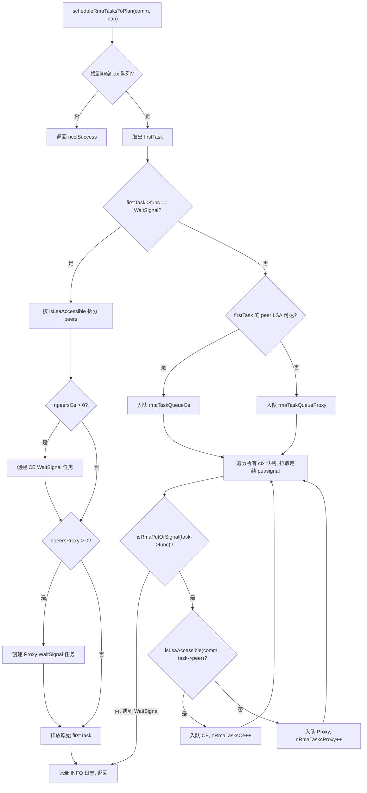
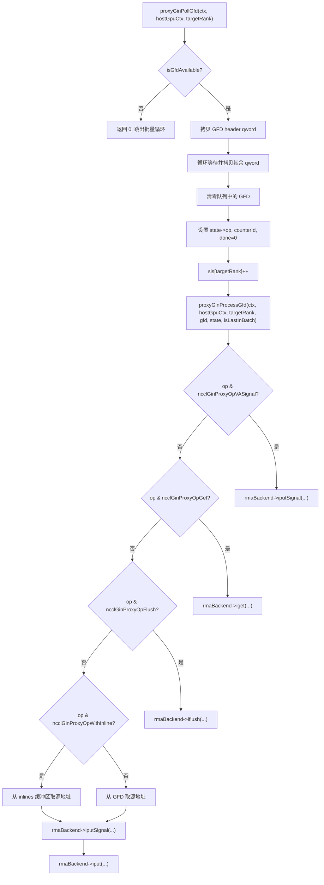

# 第 15 章：RMAとGIN：リモートメモリアクセスとGPU直結通信の進化

# 第15章：RMAとGIN：リモートメモリアクセスとGPU直結通信の進化

前章では、対称メモリによって各rankが同一のアドレスセットで全rankのバッファにアクセスでき、NVLSがNVSwitchのマルチキャスト能力を活用してハードウェア加速リダクションを極限まで推し進めることを見た。しかし集合通信がすべてではない——アプリケーションがポイントツーポイントのリモートメモリ操作を必要としたり、GPUカーネルが直接ネットワークリクエストを発行したい場合には、RMAとGINの出番となる。RMAはput/getセマンティクスのリモートメモリアクセスを提供し、GINはGPUがhost proxyスレッドをバイパスして直接ネットワークと対話できるようにする。本章は「まずRMA、次にGIN」の順で、これら2つのメカニズムのデータ構造、スケジューリングロジック、並行制御、本番環境の落とし穴を段階的に分解する。

# RMAのデュアルチャネルモデル：CEとProxyの役割分担

## 直感的モデル

多国籍宅配システムを想像してみよう。同一市内の宅配（LSA到達可能なrank）は地元の配送車で直接届けられるが、市をまたぐ宅配（LSA到達不可能なrank）は航空貨物代理店に引き渡さなければならない。NCCLのRMAはまさにこのモデルである。同じput操作が、対象rankがLSA（Load-Store Accessible）チーム内にあるかどうかによって、まったく異なる2つの実行パス、すなわちCE（Copy Engine、コピーエンジン）パスとProxy（プロキシスレッド）パスにルーティングされる。

この振り分けメカニズムがなければ、すべてのRMA操作がproxyスレッドを通ることになり、同一マシン内のputもhostスレッドを経由することになり、host-device間の往復遅延が無駄に1回増える。逆に、すべての操作がCEを通れば、マシン間操作はネットワークプラグインの非同期能力を活用できなくなる。

## データ構造とメモリレイアウト

RMAの中核となるスケジューリング構造は`ncclRmaArgs`であり、これは1つのplanにおけるRMAタスクの振り分け結果を記録する。主要なフィールドは以下の通り：

| フィールド | 意味 |
| --- | --- |
| `func` | 操作タイプ（PutSignal / Signal / WaitSignal） |
| `nRmaTasks` | 総タスク数 |
| `nRmaTasksProxy` | proxyパスを通るタスク数 |
| `nRmaTasksCe` | CEパスを通るタスク数 |

各plan内部には2つの侵入型キューを維持する：`rmaTaskQueueCe`および`rmaTaskQueueProxy`であり、それぞれ2つのパスのタスクを格納する。[FACT:src/rma/rma.cc:166-171]

あるrankがLSA到達可能かどうかを判定するロジックは非常に直接的で、`lsaRankList`配列を走査して線形探索を行う。[FACT:src/rma/rma.cc:34-41]この探索はタスクスケジューリング時に各peerに対して1回実行され、計算量はO(lsaSize)であり、典型的な小規模LSAチーム（通常2〜8個のrank）ではオーバーヘッドは無視できる。

## ステップバイステップのスケジューリングフロー

アプリケーションが1回のRMA put操作を呼び出すと、タスクは`planner->rmaTaskQueues[ctx]`。`scheduleRmaTasksToPlan`に入り、キューのタスクをplanに割り当てる役割を担う。[FACT:src/rma/rma.cc:141-296]

第一步：最初の非空のcontextキューを見つける。NCCLは複数のRMA context（`numRmaCtx`で設定）をサポートし、各contextは独立したキューを持つ。[FACT:src/rma/rma.cc:148-155]

第二步：最初のタスクを取り出し、操作タイプを判定する。WaitSignalであれば特殊な分割ロジックを通り、Put/Signalであればバッチマージロジックを通る。[FACT:src/rma/rma.cc:163-168]

WaitSignalタスクの場合、スケジューラはpeersリストをLSA到達可能性に基づいて2つのグループ、CEグループとProxyグループに分割する必要がある。[FACT:src/rma/rma.cc:187-204]分割後、それぞれ2つの新しい`ncclTaskRma`構造を作成し、それぞれが対応するグループのpeers配列を保持する。[FACT:src/rma/rma.cc:207-246]元のタスクは解放される。[FACT:src/rma/rma.cc:251]

Put/Signalタスクの場合、ロジックはより複雑である。スケジューラはすべてのcontextのキューを走査し、連続するput/signalタスクをすべて同じplanに引き込み、WaitSignalに遭遇するまで停止する。[FACT:src/rma/rma.cc:279-295]この設計の目的はコメントに明確に書かれている：1回のkernel launchで全contextのput/signalをカバーし、proxyは任意のブロッキング操作の前にすべての非同期リクエストを一括で発行でき、CEパスは全contextのコピーとシグナルをバッチで投入する。[FACT:src/rma/rma.cc:270-278]

## 並列実行とストリーム同期

スケジューリング完了後、`ncclLaunchRma`は`func`フィールドに基づいて`ncclRmaPut`または`ncclRmaWaitSignal`。[FACT:src/rma/rma.cc:109-131]

にディスパッチする。`ncclRmaPut`を例にとると、plan内にproxyとCEタスクが同時に存在する場合、2つのパスを並列実行する必要がある。NCCLの手法は：入力ストリーム上でeventを記録し、CEストリームにこのeventを待機させ、その後両方のストリームで同時に操作を起動し、最後にCEストリーム上で再度eventを記録し、入力ストリームにそれを待機させる。[FACT:src/rma/rma.cc:80-96]このeventチェーンは次を保証する：CE操作は入力ストリームの依存関係が準備できる前に開始されず、入力ストリームの後続操作もCE完了前に開始されない。

proxyタスクのみ、またはCEタスクのみの場合は、入力ストリーム上で直接対応する操作を起動し、追加のストリーム同期は不要である。[FACT:src/rma/rma.cc:97-101]

## 設計上の考察と本番環境の落とし穴

**落とし穴1：LSA到達可能性判定の静的性。** `isLsaAccessible`スケジューリング時に`comm->devrState.lsaRankList`をクエリするが、このリストは通信ドメインの初期化後は変化しない。実行中にトポロジが変化した場合（例えばNVLink障害による降格）、LSAリストは自動更新されず、本来proxyを通るべき操作がCEパスを通り続け、回復不能なエラーを引き起こす可能性がある。

**落とし穴2：バッチマージのFIFO保証。**バッチマージロジックは連続するput/signalタスクのみを引き出し、WaitSignalに遭遇すると停止する。[FACT:src/rma/rma.cc:283]これは各context内のFIFO順序を保証するが、contextをまたぐタスクは同じplanにマージされる可能性がある。アプリケーションがcontextをまたぐ操作順序に依存する場合、WaitSignalを明示的に使用してバリアを確立する必要がある。

**落とし穴3：メモリリークパス。**WaitSignal分岐において、`npeersProxy == 0`の場合、コードは`peersProxy`、`nsignalsProxy`、`signalIdxsProxy`の3つの配列を解放する。[FACT:src/rma/rma.cc:239-244]しかし`npeersCe == 0`かつ`npeersProxy > 0`，`peersCe`などの配列が`ncclMemoryStackAlloc`で割り当てられている場合、手動で解放する必要はない（スタック型アロケータが一括回収する）。[FACT:src/rma/rma.cc:176-178]この非対称性は読者を混乱させやすいが、実際には正しい——スタックに割り当てられたメモリは`comm->memScoped`によって統一的に管理される。

# RMA Proxy コンテキスト：シグナル、キュー、ロックフリーリングバッファ

## 直感的モデル

Proxy コンテキストは「郵便局の仕分けセンター」のようなものだ：GPU は送信したい荷物（put リクエスト）を受信箱（リングバッファ）に入れ、proxy スレッドが受信箱から荷物を取り出し、宅配業者（ネットワークプラグイン）に渡し、宅配業者が配達後に受領書（シグナル）に捺印する。このプロセス全体を通じて、GPU と proxy スレッドはロックフリーデータ構造を介して通信し、高コストなロック競合を回避する。

## データ構造とメモリレイアウト

`ncclRmaProxyCtx`は proxy コンテキストのホスト構造体であり、その主要なフィールドは以下の通り：

**シグナル領域（signalsDev）**：GPU 上に割り当てられたメモリで、サイズは`nRanks * numRmaSig * sizeof(uint64_t)`。[FACT:src/rma/rma_proxy.cc:120-123]各 rank は`numRmaSig`個のシグナルスロットを持ち、その rank からのシグナルを受信するために使用される。このメモリはネットワークプラグインに登録される際に`NCCL_NET_MR_FLAG_FORCE_SO`（強制強順序）と`NCCL_NET_MR_FLAG_SIGNAL_NEVER_RESET`（シグナルは決してリセットされない）フラグが付与される。[FACT:src/rma/rma_proxy.cc:125-127]強順序フラグは put と signal の間の順序関係を保証する——put が signal より先に発行された場合、ネットワークは put データが到達した後にのみ signal が書き込まれることを保証しなければならない。

**シーケンス番号領域（opSeqs/readySeqs/doneSeqs）**：各 rank に1組、`allocMemCPUAccessible`によって割り当てられ、GDR（GPU Direct RDMA）メモリまたは通常の host メモリの可能性がある。[FACT:src/rma/rma_proxy.cc:132-137]これら3つのシーケンス番号はそれぞれ追跡する：コミット済みの操作番号、準備完了の操作番号、完了済みの操作番号。

**ロックフリーリングバッファ（circularBuffers）**：サイズ`nRanks * queueSize`のポインタ配列で、各 rank に独立したリングキューがある。[FACT:src/rma/rma_proxy.cc:163-164]付随する`pis`（Producer Index）と`cis`（Consumer Index）配列はそれぞれ`nRanks`個の要素を持つ。[FACT:src/rma/rma_proxy.cc:165-166]キューサイズは2の冪でなければならず、これによりインデックスのラップアラウンドはビット AND 演算`& (queueSize - 1)`でモジュロ演算を置き換えられる。[FACT:src/rma/rma_proxy.cc:156-160]

**InProgress キュー**：各 peer に1つの侵入型リンクリストがあり、ネットワークプラグインにコミット済みだが未完了のディスクリプタを格納する。[FACT:src/rma/rma_proxy.cc:170-175]これは単一消費者キューであり、proxy スレッドのみがアクセスするため、アトミック操作は不要。

## Step-by-Step：コンテキスト作成から進捗推進まで

**コンテキスト作成**：`ncclRmaProxyCreateContext`まず RMA プラグインを介してネットワークコンテキストを作成する。[FACT:src/rma/rma_proxy.cc:229]次に`ncclRmaProxyCtxAlloc`を呼び出してシグナル、シーケンス番号、リングバッファなどのリソースを割り当てる。[FACT:src/rma/rma_proxy.cc:231]続いて`ncclRmaProxyCtxAllocGraph`を呼び出してグラフキャプチャモードに必要なリソース——CPU アクセス可能なシグナル、flush バッファ、永続化キュー——を割り当てる。[FACT:src/rma/rma_proxy.cc:232]

グラフキャプチャモードが存在するのは、CUDA Graph がすべての操作のリプレイを要求するためである。通常モードでは、シグナルは GPU メモリ上にあり、proxy は GDR を介して読み取る；グラフキャプチャモードでは、シグナルは CPU アクセス可能なメモリ上にあり、proxy が直接読み書きでき、GDR の不確実性を回避する。[FACT:src/rma/rma_proxy.cc:184-190]

**進捗スレッド**：`ncclRmaProxyProgressThread`は proxy のメインループである。[FACT:src/rma/rma_proxy.cc:354-389]それは`rmaProgress`状態ワードに基づいて動作を決定する：

- `rmaProgress == 1`：通常推進モード、すべての proxy コンテキストを走査して`ncclRmaProxyProgress`。[FACT:src/rma/rma_proxy.cc:361-372]
- `rmaProgress == 2`を呼び出す[FACT:src/rma/rma_proxy.cc:373-378]
- `rmaProgress == -1`：一時停止モード、リソース回収に使用。スレッドは一時停止を確認した後、条件変数を待機する。[FACT:src/rma/rma_proxy.cc:379-380]
- `rmaProgress == 0`：終了シグナル、スレッドはリターンする。[FACT:src/rma/rma_proxy.cc:381-382]

：アイドル待機。`ncclRmaProxyProgress`もし`asyncResult`がエラーを返した場合、スレッドはエラーコードを`rmaProgress = -2`に書き込み、[FACT:src/rma/rma_proxy.cc:365-369]を設定してから終了する。`ncclCommGetAsyncError`このエラーコードはメインスレッドが後続の

## 呼び出しで読み取る。

並行制御とメモリオーダー

RMA proxy の並行モデルは「単一生産者-単一消費者」である：GPU カーネルが生産者、proxy スレッドが消費者。リングバッファの PI は GPU が更新し、CI は proxy が更新する。単一生産者単一消費者であるため、CAS 操作は不要で、正しいメモリオーダーのみが必要。`NCCL_NET_MR_FLAG_FORCE_SO`シグナル領域の強順序フラグ[FACT:src/rma/rma_proxy.cc:127]が鍵である。

`NCCL_NET_MR_FLAG_SIGNAL_NEVER_RESET`このフラグがなければ、ネットワークプラグインが put と signal の順序を並べ替え、受信側がデータ到達前にシグナルを認識し、ダーティデータを読み取る可能性がある。[FACT:src/rma/rma_proxy.cc:127]フラグはネットワークプラグインに伝える：シグナルは一度書き込まれるとリセットされない。

## これによりプラグインはシグナルの書き込みパスを最適化できる——毎回の書き込み前にゼロクリアする必要がない。

**本番環境の落とし穴**落とし穴1：キューサイズが2の冪でない。`NCCL_RMA_PROXY_QUEUE_SIZE`もしユーザーが[FACT:src/rma/rma_proxy.cc:156-159]を介して2の冪でない値を設定した場合、コードはデフォルト値にフォールバックし、INFO ログを出力する。

**このフォールバックはサイレント（INFO レベルのみ）であり、本番環境では見落とされやすい。ユーザーがバーストトラフィックを吸収するためにより大きなキューを期待していても、実際にはデフォルト値が使用され、バックプレッシャーが発生する可能性がある。** `ncclRmaProxyRegMrSym`落とし穴2：DMA-BUF 登録失敗のフォールバックチェーン。`regMrSym`。[FACT:src/rma/rma_proxy.cc:76-108]CUDA メモリの登録には3層のフォールバックがある：まず DataDirect モードの DMA-BUF を試み、失敗したら非 DataDirect の DMA-BUF を試み、さらに失敗したら通常の[FACT:src/gin/gin_host_proxy.cc:429-430]コメントで特に警告されている：ある MR が非 DataDirect パスに入った場合、他のすべての MR もそうしなければならず、混在使用は GIN の順序保証を破壊する。

**この制約は RMA パスでは明示的にチェックされておらず、潜在的な危険性がある。**落とし穴3：進捗スレッドのエラー伝播遅延。`ncclRmaProxyProgress`もし`asyncResult`がエラーを返した場合、スレッドは[FACT:src/rma/rma_proxy.cc:366-369]ただし、メインスレッドは長時間実行されるカーネルを実行している可能性があり、すぐにはチェックしない`asyncResult`。この間、後続の RMA 操作はキューに入り続けるが処理されず、メインスレッドがエラーを検出するまで続く。これは非同期エラー伝播に固有の遅延であり、アプリケーションは定期的に`ncclCommGetAsyncError`を呼び出してこのウィンドウを短縮する必要がある。

# GIN アーキテクチャ：GPU が直接ネットワークリクエストを発行

## 直感的モデル

従来のモードでは、GPU がネットワークデータを送信するには「GPU → ホストメモリ → プロキシスレッド → ネットワークカード」の経路を経由する必要があった。GIN（GPU-Initiated Networking）の目標は、CPU がネットワークカードの MMIO レジスタに直接書き込むように、GPU がネットワークカードの送信キューに直接書き込めるようにすることである。これには、ネットワークカードが GPU 発行の doorbell 書き込みをサポートすること、および GPU とプロキシスレッド間の通信プロトコルが必要である。

## データ構造とメモリレイアウト

GIN の核心的なデータ構造は`ginProxyHostGpuCtx`であり、これは GPU-ホスト通信コンテキストを表す：

| フィールド | 型 | 意味 |
| --- | --- | --- |
| `queues` | `ncclGinProxyGfd_t*` | GFD キュー、サイズ`nRanks * queueSize` |
| `pis` | `uint32_t*` | プロデューサーインデックス（GPU が書き込み） |
| `cis` | `uint32_t*` | コンシューマーインデックス（プロキシが書き込み） |
| `cisShadow` | `uint32_t*` | CI のシャドウコピー（プロキシローカル） |
| `sis` | `uint32_t*` | 既見インデックス（プロキシローカル） |
| `states` | `ginProxyGfdState*` | 各 GFD スロットの状態 |
| `inlines` | `uint64_t*` | インラインデータバッファ |

GFD（GIN Forwarding Descriptor）は GPU がプロキシに書き込むリクエスト記述子である。各 GFD は複数の qword で構成され、操作タイプ、ソースアドレス、宛先アドレス、サイズ、シグナル情報などを含む。[FACT:src/gin/gin_host_proxy.cc:158-163]

`queues`配列のメモリ割り当てには重要な詳細がある：それは`allocMemCPUAccessible`によって割り当てられるが、`forceHost=true`パラメータが渡される。[FACT:src/gin/gin_host_proxy.cc:564]これは、キュー自体がホストメモリにあり、GPU が PCIe 経由で書き込むことを意味する。一方、`cis`配列は GPU アクセス可能メモリ（おそらく GDR）に割り当てられる。プロキシが頻繁に更新する必要があるためである。[FACT:src/gin/gin_host_proxy.cc:565-566]

`cisShadow`と`sis`はプロキシスレッドのローカルコピーであり、GPU メモリに存在する可能性がある`cis`。[FACT:src/gin/gin_host_proxy.cc:44-47]を毎回読み取ることを避ける。`cisShadow`が前進した場合にのみ、`cis`。

## Step-by-Step：GFD のポーリングと処理

`ncclGinProxyProgress`は GIN プロキシのメインループである。[FACT:src/gin/gin_host_proxy.cc:648-669]

第一步：各コンテキストに対して、まず`proxyGinPollCompletions`を呼び出して、送信済みリクエストの完了状態をチェックする。[FACT:src/gin/gin_host_proxy.cc:653]

第二步：各ターゲットランクに対して、GFD をバッチポーリングする。`pollBatch`は一度に処理する GFD の最大数を制御する。[FACT:src/gin/gin_host_proxy.cc:654-655]

第三步：`proxyGinPollGfd`キューの先頭に新しい GFD があるかチェックする。判断基準は GFD ヘッダのフラグビットが非ゼロかどうかである。[FACT:src/gin/gin_host_proxy.cc:176-182]もしあれば、まず最初の qword（ヘッダ）をコピーし、残りの qword が準備完了するのを待つ。[FACT:src/gin/gin_host_proxy.cc:194-202]コピー完了後、キュー内の GFD をゼロクリアして、重複処理を防ぐ。[FACT:src/gin/gin_host_proxy.cc:206-208]

第四步：`proxyGinProcessGfd`操作タイプに応じて異なる処理パスにディスパッチする。[FACT:src/gin/gin_host_proxy.cc:246-340]

## ポーリングとカウンタ更新の完了

`proxyGinPollCompletions`は送信済みリクエストの完了状態をチェックする責務を負う。[FACT:src/gin/gin_host_proxy.cc:113-156]

各ターゲットランクに対して、`cisShadow`から`sis`まで、既見だが未消費のすべての GFD 状態を走査する。[FACT:src/gin/gin_host_proxy.cc:117]状態が未完了の場合、`rmaBackend->test`を呼び出してチェックする。[FACT:src/gin/gin_host_proxy.cc:122]完了しており、操作にカウンタフラグが付いている場合、カウンタ値を更新する。[FACT:src/gin/gin_host_proxy.cc:132-141]

カウンタ更新はアトミックロードとアトミックストアを使用するが、コメントではアトミック加算が不要な理由が説明されている：GPU カーネルは未完了操作がある状態でカウンタをリセットできないため、競合は存在しない。[FACT:src/gin/gin_host_proxy.cc:133-135]

CI の更新には「ホールを許容する」メカニズムがある：`state->done && i == cisShadow[targetRank]`の場合にのみ CI を進める。[FACT:src/gin/gin_host_proxy.cc:145-151]これにより CI が単調増加することが保証され、一部の GFD が先に完了しても、未完了の GFD をスキップしない。

## 並行制御とメモリバリア

GIN プロキシの並行モデルは RMA プロキシよりも複雑である。複数のプロキシスレッドが存在するためである（`GIN_PROXY_NTHREADS`によって制御される）。[FACT:src/gin/gin_host.cc:90]

`ncclGinProgress`では、各スレッドが接続のグループを担当する：スレッド t は接続 t, t+proxyNthreads, t+2*proxyNthreads, ... を処理する。[FACT:src/gin/gin_host.cc:72]この割り当て方式により、各接続が1つのスレッドのみによって処理されることが保証され、接続レベルの競合を回避する。

devComms リンクリストの変更には書き込みロックによる保護が必要である。`ginProgressWriteLock`まず`writePending`フラグを設定し、次に書き込みロックを取得する。[FACT:src/gin/gin_host.cc:43-47]進捗スレッドは各ループの開始時に`writePending`をチェックし、真であれば CPU を譲る。[FACT:src/gin/gin_host.cc:63-66]この設計により、進捗スレッドが読み取りロックを保持している間に書き込みロックによってブロックされることを回避する。

`writePending`を使用するが、コメントではこのロジックが単一の書き手のみを仮定していることが指摘されている。`std::atomic<bool>`NCCL の使用シナリオでは、メインスレッドのみが devComms リンクリストを変更するため、この仮定は成立する。[FACT:src/gin/gin_host.cc:43-47]本番環境の落とし穴

## 落とし穴1：GFD キューのメモリ位置。

**は強制的にホストメモリに割り当てられる（** `queues`これは、GPU が GFD に書き込むには PCIe バスを経由する必要があることを意味する。GFD 書き込み頻度が高い場合（小メッセージシナリオ）、PCIe 帯域幅がボトルネックになる可能性がある。対照的に、`forceHost=true`），[FACT:src/gin/gin_host_proxy.cc:564]は GPU アクセス可能メモリに割り当てられる。プロキシが頻繁に更新する必要があるためである。`cis`落とし穴2：インラインデータの再構築。[FACT:src/gin/gin_host_proxy.cc:565-566]

**GFD にインラインデータが含まれる場合、プロキシは複数の qword からインライン値を再構築する必要がある。** 当 GFD 带有内联数据时，proxy 需要从多个 qword 中重建内联值。[FACT:src/gin/gin_host_proxy.cc:298-305]再構築ロジックは size に基づいてどの qword を読み取るかを決定する：size ≤ 4 の場合は下位 32 ビットのみ読み取り、size > 4 の場合は下位 64 ビットを読み取り、size > 6 の場合はさらに上位 16 ビットを読み取る。この分割ロジックは GPU 側の書き込みロジックと厳密に対応している必要があり、不一致があるとデータ破損を引き起こす。

**落とし穴 3：マルチスレッドの進捗と接続の割り当て。**異なる rank が異なる`GIN_PROXY_NTHREADS`を設定した場合、AllGather で最小値を取った後、一部のスレッドに接続が割り当てられない可能性がある。[FACT:src/gin/gin_host.cc:181-183]コメントによると、これらのスレッドは stride ループ内で空回りし、正確性の問題は発生しないが、CPU リソースを浪費する。

# GIN バックエンドの選択とバージョン互換性

## 直感的モデル

GIN は複数のバックエンドをサポートする：Proxy（RMA プラグインベースのソフトウェアシミュレーション）、GDAKI（GPU Direct Async Kernel Initiated）、GPI（GPU-Initiated）、EFA GDA（AWS EFA の GPU Direct Async）。これは同じ API に複数の実装があり得るようなもの——ソフトウェアシミュレーション版は互換性が最も高いが性能は普通、ハードウェアオフロード版は性能が最も高いが特定の NIC サポートが必要。

## バックエンドバージョンマトリクス

各バックエンドにはバージョン互換性配列があり、インデックスはバックエンドバージョン番号、値はそのバージョンが要求する最低 NCCL バージョン。[FACT:src/gin/gin_host.cc:27-33]

| バックエンド | バージョン 0 | バージョン 1 | バージョン 2 | バージョン 3 |
| --- | --- | --- | --- | --- |
| Proxy | 0 | 2.30.3 | 2.30.5 | 2.32.0 |
| GDAKI | 0 | 2.30.3 | 2.30.5 | - |
| GPI | 0 | 2.30.5 | - | - |
| EFA GDA | 0 | 2.31.0 | 2.32.0 | - |

バージョン選択ロジック：バージョン配列を走査し、要求バージョンが現在のデバイスコードバージョンより高い最初のエントリを見つけ、その前のバージョンが利用可能バージョンとなる。[FACT:src/gin/gin_host.cc:300-304]

## バックエンド選択フロー

`ncclGinDevCommSetup`すべてのアクティブなバックエンドを走査し、各バックエンドで DevComm の作成を試みる。[FACT:src/gin/gin_host.cc:427-442]選択条件には以下が含まれる：要求された GIN タイプが一致する（または未指定）、シグナル能力が要件を満たす。[FACT:src/gin/gin_host.cc:430-435]

`ncclGinValidateSignalRequest`2 つの能力をチェックする：強シグナル（`supportsStrongSignals`）と VA シグナル（`supportsVASignals`）。[FACT:src/gin/gin_host.cc:230-243]リクエストが強シグナルを要求しているがバックエンドがサポートしていない場合、そのバックエンドをスキップする。

## 接続確立と stride 計算

`ncclGinConnectOnce`GIN 接続を確立する。[FACT:src/gin/gin_host.cc:92-228]

接続タイプが stride を決定する：FULL モードでは stride は 1（すべての rank に接続）、RAIL モードでは stride は`contiguousRanksPerHost`（同じ rail の rank のみに接続）。[FACT:src/gin/gin_host.cc:139-145]

において、`ginDevCommSetupWithBackend`での stride の検証ロジックは非常に厳格である：

- 要求された stride は 0 であってはならない。[FACT:src/gin/gin_host.cc:318-323]
- 要求された stride は rail team の stride より大きくてはならない。[FACT:src/gin/gin_host.cc:324-330]
- 要求された stride は接続済み stride の倍数でなければならない。[FACT:src/gin/gin_host.cc:331-337]

これらの制約の動機は：階層バリアが GIN を少なくとも RAIL 接続と仮定していること。[FACT:src/gin/gin_host.cc:325]stride がこれらの条件を満たさない場合、一部の rank 間の通信パスが存在しない可能性がある。

## 本番環境の落とし穴

**落とし穴 1：バックエンドバージョンの不一致。**デバイスコードバージョンがバックエンドの要求する最低バージョンより低い場合、`backendVersion`はより低い値に留まる。[FACT:src/gin/gin_host.cc:301-303]これにより一部の新機能が利用不可になる可能性がある（例えばシグナルが永久にリセットされない）が、エラーにはならない。しかし、デバイスコードバージョンがすべての既知バージョンより高い場合、`backendVersion`は最大値を取り、未定義動作を引き起こす可能性がある。

**落とし穴 2：stride 検証の境界。**もし`requestedStride % connectedStride != 0`なら、作成は失敗する。[FACT:src/gin/gin_host.cc:331-337]このチェックは connectedStride が 2 の冪であると仮定している（FULL モードでは 1、RAIL モードでは`contiguousRanksPerHost`）。もし`contiguousRanksPerHost`が 2 の冪でない場合（例えば 3）、倍数チェックが正当な stride を拒否する可能性がある。

# 本章の考察とセルフチェック

Q1：`scheduleRmaTasksToPlan`の WaitSignal 分岐において、`plan->rmaArgs->nRmaTasks = (npeersCe > 0 ? 1 : 0) + (npeersProxy > 0 ? 1 : 0)`の行を削除し、直接 1 に設定した場合、どのようなシナリオで問題が発生するか？

**参考解析**：[FACT:src/rma/rma.cc:248]。`nRmaTasks`が記録するのは実際にエンキューされたタスク数である。すべての peer が LSA 到達可能（`npeersProxy == 0`）の場合、実際には 1 つの CE タスクのみがエンキューされ、`nRmaTasks`は 1 であるべき。すべての peer が到達不可（`npeersCe == 0`）の場合、実際には 1 つの Proxy タスクのみがエンキューされ、`nRmaTasks`も 1 であるべき。しかし peer が混在分布の場合、両方のタスクがエンキューされ、`nRmaTasks`は 2 であるべき。

この行を`plan->rmaArgs->nRmaTasks = 1`に変更した場合、混在分布シナリオでは、`nRmaTasks`は実際のタスク数を過小評価する。後続の`ncclRmaWaitSignal`での判断`plan->rmaArgs->nRmaTasksProxy > 0 && plan->rmaArgs->nRmaTasksCe > 0`は依然として正しく動作する（`nRmaTasksProxy`と`nRmaTasksCe`），[FACT:src/rma/rma.cc:47]を使用しているため）が、`nRmaTasks`に依存してリソース見積もりやログ統計を行うコードは誤った結果を得る。さらに深刻なのは、後続のコードが`nRmaTasks`を使用して配列を割り当てたりループ回数を計算したりする場合、バッファオーバーフローやタスクの欠落を引き起こす可能性がある。

Q2：`proxyGinPollGfd`において、`hostGpuCtx->sis[targetRank]++`を`proxyGinProcessGfd`呼び出しの後に移動した場合、どのような並行シナリオで GFD が重複処理されるか？

**参考解析**：[FACT:src/gin/gin_host_proxy.cc:228]。`sis`は「既見インデックス」であり、proxy が既に確認して処理を開始した GFD の数を表す。`proxyGinPollGfd`は GFD のコピー完了後すぐにインクリメントされ、`sis`その後 1 を返して成功を示す。呼び出し元の`ncclGinProxyProgress`はループ内で`proxyGinPollGfd`を呼び出し、1 が返れば次の GFD の処理を続ける。[FACT:src/gin/gin_host_proxy.cc:648-669]

もし`sis++`を`proxyGinProcessGfd`の後に移動した場合、`proxyGinProcessGfd`の実行中（ネットワークプラグインの非同期呼び出しを含む可能性がある）に、`sis`は依然として現在の GFD を指している。このとき GPU が同じスロットに新しい GFD を書き込んだ場合（キューはリング状であるため、`pis`が既にラップアラウンドしている可能性がある）、`proxyGinPollGfd`はこのスロットを再び認識するが、`sis`は進んでいないため、同じスロットを重複処理することになる。

さらに危険なのは、`proxyGinPollGfd`GFD をコピーした後、キュー内の GFD はクリアされます。[FACT:src/gin/gin_host_proxy.cc:206-208]もし`sis`が進まない場合、次のポーリングでクリア後の GFD（flag が 0）が見え、`isGfdAvailable`false を返し、GFD が失われます。これにより GPU 側が永遠に処理されないリクエストを待ち続け、最終的にデッドロックします。

Q3:`ncclRmaProxyProgressThread`において、もし`rmaProgress == 2`分岐で`rmaProxyState->cond.notify_one()`の呼び出しを忘れた場合、どのようなシナリオでメインスレッドが永久にブロックされますか？

**参考解析**：[FACT:src/rma/rma_proxy.cc:373-378]。`rmaProgress == 2`は「一時停止リクエスト」状態であり、リソース回収に使用されます。メインスレッドが`rmaProgress = 2`を設定した後、進捗スレッドが一時停止を確認するのを待ちます。進捗スレッドは`cond.wait(lock)`で待機しており、メインスレッドは`cond.notify_one()`を呼び出してそれを起こす必要があります。[FACT:src/rma/rma_proxy.cc:377]

もし進捗スレッドが`rmaProgress = 0`を設定した後`notify_one()`を忘れた場合、メインスレッドは条件変数を永遠に待ち続けます。しかしさらに重要なのは、進捗スレッドが`cond.wait(lock)`で待機しているとき、メインスレッドは`rmaProgress = 2`を設定するためにまずロックを取得する必要があることです。もし進捗スレッドが`wait`の前にロックを解放しなかった場合、メインスレッドはロックを取得できず、デッドロックが発生します。

正しい順序は：進捗スレッドが`rmaProgress = 0`を設定し、`notify_one()`を呼び出してメインスレッドを起こし、次に`cond.wait(lock)`を呼び出してロックを解放し待機します。メインスレッドが起こされた後ロックを取得し、`rmaProgress = 2`を設定し、`notify_one()`を呼び出して進捗スレッドを起こし、次に進捗スレッドの確認を待ちます。進捗スレッドが起こされた後、`rmaProgress = 0`を設定し、再度`notify_one()`を呼び出し、次に`wait`を呼び出します。このハンドシェイクプロトコルにおいて、いずれかのステップで`notify_one()`が欠けると永久ブロックが発生します。

RMA の put/get セマンティクスから GIN の GPU 発起ネットワーク通信まで、私たちは NCCL が汎用リモートメモリアクセスエンジンへと進化する重要な一歩を歩み終えました。しかし、どんなに精巧なメカニズムであっても、最終的にはプラグイン体系を通じて外部ネットワークバックエンド、チューニング戦略、パフォーマンスコレクタと接続する必要があります。次の章ではプラグインの世界に入り、NCCL がコアコードを変更することなく、net、tuner、profiler、env などの拡張を動的にロードする方法を見て、google-fastsocket と google-CoMMA を例にエコシステム拡張性の実装要点を明らかにします。
