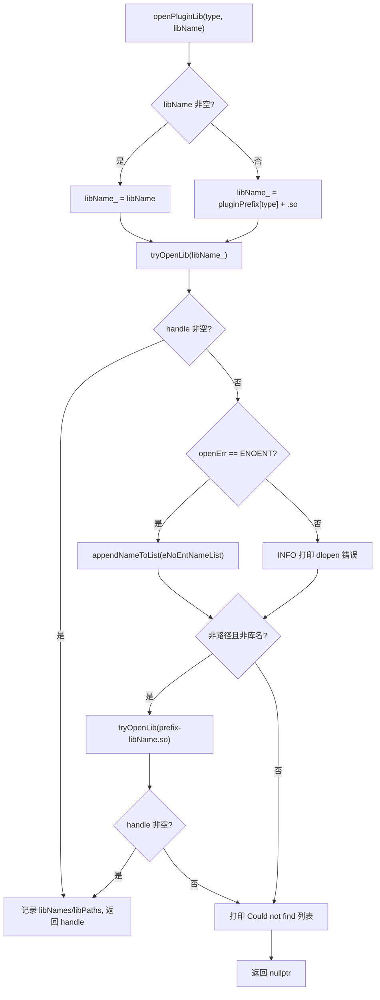
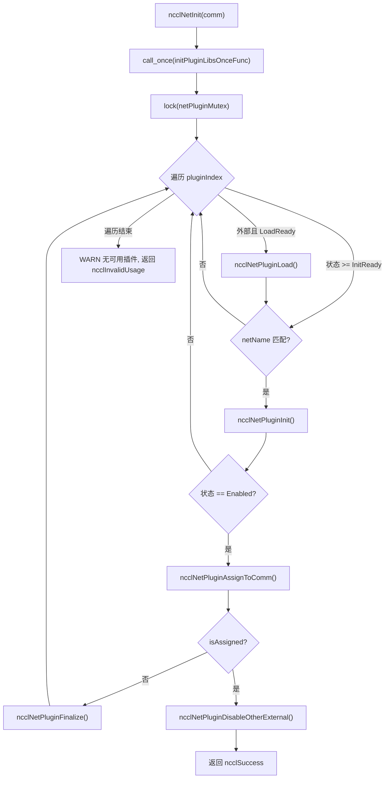
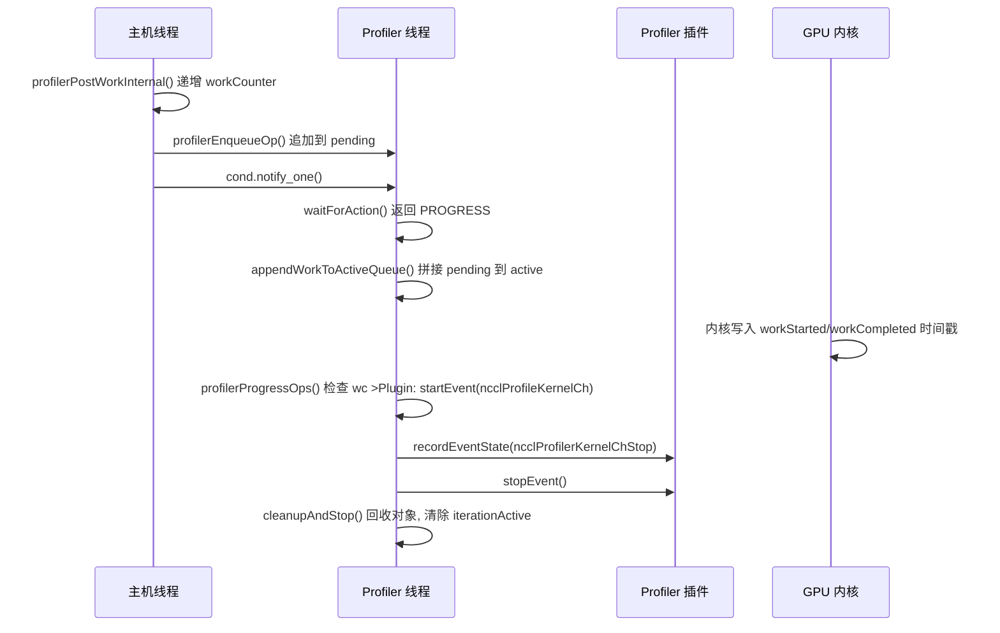

# 第 16 章：プラグインエコシステムと環境変数：net、tuner、profiler、env が NCCL の動作をどのように拡張するか

前の章では、NCCL が RMA と GIN を通じて通信能力を集合操作からポイントツーポイントのリモートアクセスに拡張し、さらには GPU が直接ネットワークリクエストを発起できるようにする方法を見ました。このような新ハードウェアと低遅延シナリオへの進化は、通信エンジンの柔軟性により高い要求を課します：新しいネットワーク、新しいチューニング戦略、新しい収集ツールを適応させるたびにコアコードを再コンパイルする必要があるなら、NCCL はエコシステムの変化に追いつくのが難しくなります。本章では src/plugin と plugins ディレクトリを分解し、一つの核心的な問いに答えます：NCCL はコアコードを再コンパイルすることなく、ネットワークバックエンド、チューニング戦略、パフォーマンスコレクタ、設定ソースをどのように置き換えるのか。

# 16.1 プラグインローダー：plugin_open.cc が .so をどのように使用可能なバックエンドに変えるか

## 直感的モデル

`plugin_open.cc`を NCCL の「採用エージェント」と想像してください：それは求人リスト（NET、GIN、RMA、TUNER、PROFILER、ENV）を持ち、各求人は候補ライブラリ名に対応します。NCCL が特定の求人の人材を必要とするとき、エージェントは固定順序で人材市場（動的リンカ）に行き人を探し、見つかれば契約を結び（`dlopen`）、見つからなければ「この人は存在しない」と記録し、最後にハンドルを返します。このエージェント層がなければ、NCCL はネットワークバックエンドをバイナリにハードコードするしかなく、どの NIC ベンダーも接続するには NCCL ソースコードを変更する必要があります——これこそプラグイン体系が撲滅しようとする災難です。

## データ構造とメモリレイアウト

ローダーの全状態は六つの並列配列であり、インデックスはプラグインタイプ列挙です：

```
static char* libNames[NUM_LIBS];              // 已加载库的名字
char* ncclPluginLibPaths[NUM_LIBS];           // 库的绝对路径
static void* libHandles[NUM_LIBS];            // dlopen 返回的句柄
static const char* pluginNames[NUM_LIBS];     // 日志用的人类可读名
static const char* pluginPrefix[NUM_LIBS];    // 库名前缀
static const char* pluginFallback[NUM_LIBS];  // 找不到时的提示
static unsigned long subsys[NUM_LIBS];        // 日志子系统位掩码
```

これら七つの配列の添字は厳密に整列する必要があり、`pluginNames[type]`、`pluginPrefix[type]`、`subsys[type]`は同じプラグインタイプを記述します。[FACT:src/plugin/plugin_open.cc:18-29]は`NUM_LIBS = 6`を定義し、タイプ順序は`{"NET", "GIN", "RMA", "TUNER", "PROFILER", "ENV"}`、プレフィックスは`{"libnccl-net", "libnccl-gin", "libnccl-rma", "libnccl-tuner", "libnccl-profiler", "libnccl-env"}`。

> **[Design Inference & Architectural Trade-offs]**
> ここで構造体配列ではなく並列配列を使用するのは、`openPluginLib`という単一関数が六種類のプラグインを同時にサービスできるようにするためです——タイプは単なる添字であり、ロジックは完全に再利用されます。代償は、新しいプラグインタイプを追加する際に六つの配列を同期的に変更する必要があり、コンパイラが変更漏れをチェックできないことです。

`subsys`配列はログの帰属を決定します：NET/GIN/RMA はすべて`NCCL_INIT | NCCL_NET`に属し、TUNER は`NCCL_INIT | NCCL_TUNING`に属し、PROFILER は`NCCL_INIT`のみに属し、ENV は`NCCL_INIT | NCCL_ENV`。[FACT:src/plugin/plugin_open.cc:26-29]に属します。これにより`NCCL_DEBUG_SUBSYS=NET`時にネットワークプラグインのログのみが見え、チューニングログに埋もれることがありません。

## Step-by-Step Walkthrough：一度の`ncclOpenNetPluginLib("mlx5")`の完全な旅

ユーザーが`NCCL_NET_PLUGIN=mlx5`を設定し、NCCL 初期化時に`ncclOpenNetPluginLib("mlx5")`を呼び出すと仮定します。それは直接`openPluginLib(ncclPluginTypeNet, "mlx5")`。[FACT:src/plugin/plugin_open.cc:132-134]

**に転送されます。**第一步：候補ライブラリ名を構築。`libName`空でない`snprintf(libName_, MAX_STR_LEN, "%s", libName)`が渡されたため、`libName_`分岐を通り、`"mlx5"`。[FACT:src/plugin/plugin_open.cc:85-89]は`.so`になります。この時点ではまだ合法的なライブラリファイル名ではないことに注意——プレフィックスも

**サフィックスもありません。** `tryOpenLib("mlx5", ...)`第二步：最初のオープン試行。[FACT:src/plugin/plugin_open.cc:91]が呼び出されます。`tryOpenLib`に入った後、まず`name`が空か長さゼロかをチェックし、次に特別な分岐があります：名前が`STATIC_PLUGIN`で始まる場合、`name`を`nullptr`。[FACT:src/plugin/plugin_open.cc:37-39]これは NCCL に静的リンクされたプラグイン用のセンチネルです——`dlopen(nullptr)`Linux 上ではメインプログラムのハンドルを返し、それによって`dlsym`がメインプログラムのシンボルテーブルからプラグインシンボルを見つけられるようにします。

次に`ncclOsDlopen(name)`。[FACT:src/plugin/plugin_open.cc:41]を呼び出します。`"mlx5"`はパスでも有効なライブラリ名でもないため、`dlopen`は失敗します。失敗後、コードは`ncclOsDlerror()`のエラー文字列を取得し、精密な判定を行います：エラー文字列に`name`と`"No such file or directory"`の両方が含まれている場合、`*err`を`ENOENT`。[FACT:src/plugin/plugin_open.cc:42-55]に設定します。この判定の意義は「ファイルが根本的に存在しない」と「ファイルは存在するがロードに失敗した」を区別することです——前者は単に候補名が間違っているだけなので、静かに次の候補名を試すべきです；後者は実際のエラーなので、ログを出力すべきです。

**第三步：最初の失敗後の処理。**に戻り、`openPluginLib`，`libHandles[type]`が空で、かつ`openErr == ENOENT`であるため、`"mlx5"`を`eNoEntNameList`。[FACT:src/plugin/plugin_open.cc:97-101]に追加します。このリストは最終的に「Could not find: mlx5 libnccl-net-mlx5.so」というログに組み立てられます。

**第四步：二回目の試行——プレフィックスを付ける。**コードは`libName`がパスでなく（`/`を含まない）、ライブラリ名でもない（`lib`で始まらず、`.so`で終わらない）かどうかをチェックします。[FACT:src/plugin/plugin_open.cc:105-107] `"mlx5"`条件を満たすため、`"libnccl-net-mlx5.so"`を組み立てて再度試行します。[FACT:src/plugin/plugin_open.cc:108]今回は`dlopen`が成功し、`libHandles[type]`が代入され、`libNames[type]`がライブラリ名を記録し、`ncclPluginLibPaths[type]`を通じて`getLibPath`絶対パスを取得し、関数はハンドルを返します。[FACT:src/plugin/plugin_open.cc:110-115]

**第五步：絶対パスを取得する。** `getLibPath`Linux 上で`dlinfo(handle, RTLD_DI_LINKMAP, &lm)`を使って`link_map`を取り出し、さらに`strdup(lm->l_name)`。[FACT:src/plugin/plugin_open.cc:65-69]します。このパスは以降のすべてのログに現れ、ユーザーがどのファイルがロードされたかを一目で分かるようにします——本番環境で「なぜ間違ったプラグインがロードされたか」を調査する際、このログ行が第一現場です。

全体の決定フローは以下の通りです：



## 設計上の考察と本番環境での落とし穴

> **[Design Inference & Architectural Trade-offs]**
> **候補名の順序がすなわち優先度です。**まずユーザーが指定した裸の名前を試し、次にプレフィックスを付けた名前を試します。これは、カレントディレクトリにたまたま`mlx5`という名前のファイルがある場合、それが優先的にロードされることを意味します——これは潜在的なセキュリティ面であり、本番環境では`LD_LIBRARY_PATH`にプラグインと同名の実行ファイルを置くことを避けるべきです。

**`STATIC_PLUGIN`のセマンティクス。**のとき、`NCCL_NET_PLUGIN=STATIC_PLUGIN`は名前を空にし、`tryOpenLib`メインプログラムを開き、`dlopen(nullptr)`メインプログラムのシンボルテーブルから`dlsym`などのシンボルを探します。`ncclNet_v12`これによりプラグインを NCCL バイナリに静的リンクでき、[FACT:src/plugin/plugin_open.cc:37-39]のデプロイの手間を省けますが、代償として実行時の差し替え能力を失います。`.so`参照カウントとアンロード。

**は** `ncclClosePluginLib`のときのみ実際に`libHandles[type] == handle`を行い、パスと名前をクリアします。`dlclose`この等値判定は、すでに差し替えられたハンドルを誤って閉じることを防ぎます。GIN と RMA プラグインは[FACT:src/plugin/plugin_open.cc:176-186]を通じて NET ライブラリのハンドルを再利用し、その実現方法は同じライブラリ名を再度`ncclGetGinPluginLib`/`ncclGetNetPluginLib`して参照カウントを増やすことです。`dlopen`これは[FACT:src/plugin/plugin_open.cc:156-164]の参照カウントセマンティクスです——同じライブラリが二回開かれた場合、実際にアンロードするには`dlopen`を二回行う必要があります。`dlclose`16.2 net.cc：ネットワークプラグインのステートマシンとライフサイクル

# 直感的モデル

## はネットワークプラグインの「スケジューリングセンター」です。それはプラグインライブラリの配列を維持し、各ライブラリは独自の状態（未ロード、ロード失敗、ロード待ち、初期化待ち、有効化済み）を持ちます。新しい通信ドメイン（communicator）が誕生すると、スケジューリングセンターはすべての候補プラグインを走査し、一つずつ初期化を試み、最初に成功したものがその通信ドメインに「割り当て」られ、残りの外部プラグインはすべて無効化されます。このステートマシン層がなければ、NCCL は「プラグインはロードされたがデバイスが利用不可」「複数のプラグインが共存する場合どれを選ぶか」「通信ドメイン破棄時に安全にアンロードする方法」といった現実的な問題を処理できません。

`net.cc`データ構造とメモリレイアウト

## 核心となる構造は

フィールド`netPluginLib_t`：

| 型 | 意味 | プラグインライブラリ名 |
| --- | --- | --- |
| `name` | `char[255]` | dlopen ハンドル |
| `dlHandle` | `void*` | ネットワーク関数テーブル |
| `ncclNet` | `ncclNet_t*` | ネットワーク API バージョン番号 |
| `ncclNetVer` | `int` | 集合通信オフロード関数テーブル |
| `ncclCollNet` | `ncclCollNet_t*` | 列挙型 |
| `ncclNetPluginState` | ネットワークプラグイン状態 | 列挙型 |
| `ncclCollNetPluginState` | CollNet プラグイン状態 | 参照カウント |
| `ncclNetPluginRefCount` | `int` | 物理/仮想デバイス数 |
| `netPhysDevs`/`netVirtDevs` | `int` | CollNet デバイス数 |
| `collNetPhysDevs`/`collNetVirtDevs` | `int` | がこれらのフィールドを定義しています。注意すべきは、 |

[FACT:src/plugin/net.cc:63-76]と`ncclNet`は別々の二つの関数テーブルであり、状態も別々の二つの列挙型であることです——一つのプラグインがネットワーク機能を提供しても CollNet オフロードを提供しない場合があります。`ncclCollNet`状態列挙型には五つの値があります：

（初期化失敗）、`Disabled = -2`（ロード失敗）、`LoadFailed = -1`（ロード待ち）、`LoadReady = 0`（ロード済み初期化待ち）、`InitReady = 1`（有効化済み）。`Enabled = 2`は負数で失敗状態を表し、「状態 >= InitReady」のような比較が自然に「少なくともロード済み」を表現できるようにします。[FACT:src/plugin/net.cc:54-60]グローバル状態は三つの変数です：

はプラグイン総数を記録し、`pluginCount`はプラグイン配列であり、`netPluginLibs[NCCL_NET_MAX_PLUGINS]`は並行アクセスを保護し、`netPluginMutex`は初期化が一度だけ行われることを保証します。`initPluginLibsOnceFlag`Step-by-Step Walkthrough：ある[FACT:src/plugin/net.cc:78-81]

## の完全な旅`ncclNetInit(comm)`第一步：一回限りの初期化。

**はプラグインリストが一度だけ構築されることを保証します。** `std::call_once(initPluginLibsOnceFlag, initPluginLibsOnceFunc)`は[FACT:src/plugin/net.cc:360] `initPluginLibsOnceFunc`環境変数を読み取り、設定されていなければデフォルトで`NCCL_NET_PLUGIN`を追加し、その後二つの組み込みプラグイン`"libnccl-net.so"`と`ncclNetIb`を登録します。環境変数の解析は`ncclNetSocket`。[FACT:src/plugin/net.cc:288-340]

でカンマ区切りし、複数のプラグイン名をサポートします。`strtok_r`には容量チェックがあります：外部プラグインの数は[FACT:src/plugin/net.cc:303-324]を超えることはできず、超過分は無視されログに記録されます。`NCCL_NET_MAX_PLUGINS - NCCL_NET_NUM_INTERNAL_PLUGINS`組み込みプラグインは固定で 2 つ（IB と Socket）なので、外部プラグインは最大[FACT:src/plugin/net.cc:307-311]個です。`NCCL_NET_MAX_PLUGINS - 2`第二步：ロックして走査。

**は走査プロセス全体を保護します。** `std::lock_guard<std::mutex> lock(netPluginMutex)`各プラグインインデックスについて、まずそれが外部プラグインであり[FACT:src/plugin/net.cc:361]状態にあるかどうかを判定し、そうであれば`LoadReady`を呼び出します。`ncclNetPluginLoad`。[FACT:src/plugin/net.cc:364-367]

**第三步：プラグインをロード。** `ncclNetPluginLoad`は`ncclOpenNetPluginLib`を呼び出してハンドルを取得し、その後高バージョンから低バージョンへ順に`getNcclNet_v12`から`getNcclNet_v6`まで試行し、最初に非空を返したバージョンが採用されます。[FACT:src/plugin/net.cc:103-112]バージョン配列`ncclNetVersion`と関数ポインタ配列`getNcclNet`は降順に並べられ、最新 API が優先的に使用されることを保証します。[FACT:src/plugin/net.cc:41-43]

すべてのバージョンで`ncclNet`が取得できない場合、そのライブラリは正当なネットワークプラグインではないことを示します。このとき`NCCL_NET_PLUGIN`が明示的に設定されているかチェックします：設定されている場合は`ATTN`レベルで警告します（ユーザーが明確に要求したのに失敗したため）；設定されていない場合は`INFO`レベル（単なるデフォルトの試行失敗）。[FACT:src/plugin/net.cc:115-125]この区別は重要です——ユーザーが明示的に設定した失敗は必ず見せる必要があります。

**第四步：プラグインを初期化する。**に戻り、`ncclNetInit`に対して、状態が`>= InitReady`かつ名前が一致する`comm->config.netName`のプラグインの`ncclNetPluginInit`。[FACT:src/plugin/net.cc:369-372] `ncclNetPluginInit`を呼び出して二つのことを行う：プラグインの`init`関数を呼び出して通信ドメインコンテキストを確立し、初回初期化時に`devices`を呼び出してデバイス数を検出する。[FACT:src/plugin/net.cc:186-236]

注意`init`の呼び出し条件：`pluginLib->ncclNetPluginState >= ncclNetPluginStateInitReady`。[FACT:src/plugin/net.cc:190]コメントには「新しい通信ドメインごとに init を呼び出して正しいコンテキストを設定する必要がある」と明記されている。[FACT:src/plugin/net.cc:189]しかしデバイス検出は`== InitReady`時に一度だけ行われる。[FACT:src/plugin/net.cc:201]この「init は毎回呼び出し、devices は一度だけ呼び出し」という区別はパフォーマンス最適化である——デバイス検出は遅い可能性があるが、コンテキストは通信ドメインごとに独立している必要がある。

**第五步：割り当てと無効化。**初期化成功後に`ncclNetPluginAssignToComm`を呼び出し、これはプラグインの`ncclNet`を`comm->ncclNet`に割り当て、参照カウントをインクリメントし、`comm->netPluginIndex`。[FACT:src/plugin/net.cc:238-255]を設定する。割り当て成功後すぐに`ncclNetPluginDisableOtherExternal`を呼び出して他のすべての外部プラグインを無効化する。[FACT:src/plugin/net.cc:377-380]

> **[Design Inference & Architectural Trade-offs]**
> 無効化ロジックには重要な判断がある：割り当てられたプラグインが外部プラグイン（`pluginIndex >= pluginCount - NCCL_NET_NUM_INTERNAL_PLUGINS`）である場合にのみ、他の外部プラグインを無効化する。[FACT:src/plugin/net.cc:257-259]割り当てられたのが組み込み IB プラグインの場合、外部プラグインはそのまま維持される——これにより後続の通信ドメインに選択の余地が残される。



## 並行制御とハードウェア相互作用

`netPluginMutex`すべての`netPluginLibs`への読み書きを保護する。`ncclNetInit`、`ncclNetFinalize`すべてロックを取得する。[FACT:src/plugin/net.cc:361][FACT:src/plugin/net.cc:411-416]しかし`ncclNetGetDevCount`などの関数のコメントには「ロックは不要、呼び出し元が既に`ncclTopoGetSystem`のロック内にいるため」とある。[FACT:src/plugin/net.cc:418-429]これは「ロックは上位層が保持する」という規約であり、ネストロックのオーバーヘッドを削減するが、代償として呼び出し元が規約を守る必要がある。

`ncclGpuGdrSupport`プラグインとハードウェアの直接的な相互作用を示す：2MB の GPU バッファを割り当て、プラグインの`listen`/`connect`/`accept`を通じてループバック接続を確立し、次に`regMr`を試みて GPU メモリを登録する。[FACT:src/plugin/net.cc:464-535]登録が成功すれば、NIC が GPUDirect RDMA をサポートしていることを示す。この検出結果は`gdrSupportMatrix[32]`にキャッシュされ、CUDA デバイス番号でインデックスされる。[FACT:src/plugin/net.cc:478-480]

> **[Design Inference & Architectural Trade-offs]**
> 注意`gdrSupportMatrix`は`static`のものであり、通信ドメイン間で共有される。[FACT:src/plugin/net.cc:478]これは同一プロセス内の複数の通信ドメインが検出結果を再利用し、重複する高コストな検出を避けることを意味する。しかし配列サイズは 32 にハードコードされており、32 個を超える GPU を持つマシンでは範囲外アクセスが発生する——これは暗黙の上限仮定である。

## 本番環境の落とし穴ガイド

**落とし穴一：プラグインのロードは成功したがデバイス数がゼロ。** `ncclNetPluginInit`チェック`devices(&ndev) != ncclSuccess || ndev <= 0`で失敗分岐にジャンプする。[FACT:src/plugin/net.cc:202]失敗後に`finalize`を呼び出して確立済みのコンテキストをクリーンアップし、デバイス数を`NCCL_UNDEF_DEV_COUNT`にリセットし、状態を`Disabled`。[FACT:src/plugin/net.cc:229-234]に設定する。このクリーンアップを行わないと、後続の通信ドメインが「初期化済みだがデバイスなし」のプラグインを目にし、診断困難なエラーを引き起こす。

> **[Design Inference & Architectural Trade-offs]**
> **落とし穴二：`init`は成功したが`devices`が失敗。**コードは`initCompleted`フラグで`init`の成功を追跡する。[FACT:src/plugin/net.cc:178-184][FACT:src/plugin/net.cc:198]失敗分岐では`initCompleted`が真の場合にのみ`finalize`。[FACT:src/plugin/net.cc:230]を呼び出す。これにより未初期化のコンテキストに対して`finalize`を呼び出すことを防ぐ——多くのプラグインの`finalize`は NULL ポインタをチェックしないため、誤って呼び出すとクラッシュする。

**落とし穴三：通信ドメイン破棄時の参照カウント。** `ncclNetPluginFinalize`まずプラグインの`finalize`を呼び出し、次に参照カウントをデクリメントし、最後に参照カウントがゼロになりかつ外部プラグインの場合にライブラリをアンロードする。[FACT:src/plugin/net.cc:342-355] `ncclNetPluginUnload`チェック`dlHandle`が非 NULL かつ参照カウントがゼロの場合にのみ実際に`dlclose`。[FACT:src/plugin/net.cc:84-101]アンロード後にフィールドをリセットするが`name`は保持し、再ロード時に再利用できるようにする。[FACT:src/plugin/net.cc:84-101]

# 16.3 tuner.cc と profiler.cc：戦略プラグインと観測プラグインの異なる契約

## 直感的モデル

Tuner プラグインは「ナビソフトのルート選好設定」のようなもの——車の運転方法は変えず、どの道を選ぶかだけを変える。Profiler プラグインは「ドライブレコーダー」のようなもの——運転には介入せず、何が起きたかを記録するだけである。両者の共通点はどちらも関数テーブルを通じて接続されることだが、違いは Tuner が「通信ドメインごとに一つのインスタンス」の軽量な戦略オブジェクトであるのに対し、Profiler は GPU が生成するイベントを非同期に消費するための独立したスレッドを必要とすることである。

## tuner.cc：極めてシンプルなグローバルシングルトン

Tuner の状態は極めて単純：一つのミューテックス、一つの参照カウント、一つのライブラリハンドル、一つのシンボルポインタ、一つの状態変数。[FACT:src/plugin/tuner.cc:24-37]プラグイン配列はなく、複数プラグインの共存もない——グローバルに一つの tuner のみ。

`ncclTunerPluginLoad`のロジックは「初回ロード、以降再利用」：状態が`LoadSuccess`の場合、直接シンボルを`comm->tuner`に割り当てて参照カウントをインクリメントする。[FACT:src/plugin/tuner.cc:53-57]そうでなければ`NCCL_TUNER_PLUGIN`環境変数を読み取り、`"none"`の場合は直接失敗する。[FACT:src/plugin/tuner.cc:59-63]

> **[Design Inference & Architectural Trade-offs]**
> バージョン交渉は v6 から v2 に降順で、一つずつ試行する。[FACT:src/plugin/tuner.cc:75-87]ここには v1 がないことに注意——tuner API は v2 から初めて安定した関数テーブル構造を持つ。

> **[Design Inference & Architectural Trade-offs]**
> 興味深い詳細：もし`ncclOpenTunerPluginLib`が空を返した場合、コードは`ncclGetNetPluginLib(ncclPluginTypeTuner)`。[FACT:src/plugin/tuner.cc:65-70]を試みる。これは tuner が net プラグインライブラリにパッケージできることを意味する——これによりデプロイの複雑さが軽減され、一つの`.so`がネットワークとチューニング機能を同時に提供する。

## profiler.cc：非同期イベント消費スレッド

Profiler は本章で最も複雑なプラグインである。なぜなら GPU が非同期に生成するイベントを処理する必要があるからである。核心構造は`ncclProfilerThread`：

| フィールド | 型 | 役割 |
| --- | --- | --- |
| `thread` | `std::thread` | 消費スレッド |
| `mutex` | `std::mutex` | キューを保護 |
| `cond` | `condition_variable` | 新しい作業があると起床 |
| `condIterationInactive` | `condition_variable` | イテレーション終了を待機 |
| `stop` | `int` | 停止フラグ |
| `refCount` | `int` | 通信ドメイン参照カウント |
| `cudaDev` | `int` | バインドされた CUDA デバイス |
| `abortFlag` | `volatile uint32_t*` | 中止フラグ |
| `iterationActive` | `bool` | イテレーション中かどうか |
| `pending`/`pendingTail` | 連結リスト | 保留中の作業 |
| `active`/`activeTail` | 連結リスト | 処理中の作業 |
| `opStack`/`opPool` | メモリプール | 作業オブジェクトの割り当て |
| `inflight`/`maxInflightSeen`/`maxInflight` | `size_t` | バックプレッシャー観測 |
| `droppedOps` | `uint64_t` | 割り当て失敗カウント |

[FACT:src/plugin/profiler.cc:38-69]がこの構造を定義する。注意`pending`と`active`は二つの独立した連結リストである：プロデューサは`pending`に追加し、消費スレッドはロック内で`pending`を`active`に連結し、その後ロック外で`active`。[FACT:src/plugin/profiler.cc:56-59]

`iterationActive`を走査する。`true`フラグは並行正確性の鍵である：消費スレッドはロック内で`false`通信ドメイン状態を破棄できる。[FACT:src/plugin/profiler.cc:52-55]

## Step-by-Step Walkthrough：1回の KernelCh イベントの生成と消費

**第一步：ホスト側のエンキュー。**カーネルプラン（kernel plan）が投入されると、`ncclProfilerPostPlanWork`プラン内の集合タスクを走査し、各タスクで有効化された`ncclProfileKernelCh`に対して、チャネル範囲ごとに`profilerPostWorkInternal`。[FACT:src/plugin/profiler.cc:1315-1331]

`profilerPostWorkInternal`を呼び出す。まず`comm->profiler.workCounter[channelId]`をインクリメントし、次に`profilerEnqueueOp`。[FACT:src/plugin/profiler.cc:1259-1266]を呼び出す。コメントはこのインクリメントが「割り当てが失敗しても、呼び出しごとに必ず1回」でなければならないと強調しており、デバイスカーネルとの同期を保つ。[FACT:src/plugin/profiler.cc:1259-1266]

**第二步：ワークオブジェクトの割り当て。** `profilerEnqueueOp`ロック内でメモリプールから`ncclProfilerWorkOp`を割り当て、チャネル番号、ワークカウンタ、アクティブマスク、タスクイベントハンドル、通信ドメインコンテキストなどのフィールドを埋める。[FACT:src/plugin/profiler.cc:1199-1223]割り当て失敗時は`droppedOps`をインクリメントしてログを記録するが、**ロールバック**しない`workCounter`——これがデバイスとの同期を保つ鍵である。[FACT:src/plugin/profiler.cc:1202-1207]

割り当て成功後はオブジェクトを`pending`リンクリストの末尾に追加し、`inflight`をインクリメントし、`maxInflightSeen`を更新し、消費スレッドを起床させる。[FACT:src/plugin/profiler.cc:1225-1239]

**第三步：消費スレッドの待機。** `ncclProfilerThreadFunc`ループで`waitForAction`。[FACT:src/plugin/profiler.cc:1074-1077] `waitForAction`を呼び出し、ロック内で条件変数を待機する。`pending`または`active`が非空になるか、停止/中止シグナルを受信するまで。[FACT:src/plugin/profiler.cc:1017-1031]

起床後は`appendWorkToActiveQueue`を呼び出して`pending`を`active`の末尾に連結し、`iterationActive = true`を設定して`NCCL_PROFILER_THREAD_PROGRESS`。[FACT:src/plugin/profiler.cc:1017-1031]

**を返す。第四步：ワークの処理。** `profilerProgressOps`**ロック外**で`active`リンクリストを走査する。[FACT:src/plugin/profiler.cc:958-999]各ワークオブジェクトについて、デバイスが起動タイムスタンプを書き込んだかどうかを確認する：`wc <= op->workStarted[ch].data[slot].counter`。[FACT:src/plugin/profiler.cc:972]ここで`<=`ではなく`==`を使用していることに注意。デバイスは`MAX_PROFILER_EVENTS_PER_CHANNEL`個のスロットをラップアラウンドするため、ホストが遅れるとデバイスがそのスロットを上書きしている可能性がある。[FACT:src/plugin/profiler.cc:969-971]

起動条件が満たされれば、`ncclProfilerStartKernelChEvent`を呼び出してプラグインに通知する。[FACT:src/plugin/profiler.cc:973]次に完了条件を確認し、満たされていればまずフェーズイベントを発火し、その後`ncclProfilerStopKernelChEvent`。[FACT:src/plugin/profiler.cc:978-985]

を呼び出す。完了したワークオブジェクトはリンクリストから取り出され、`recycled`リストに収集される。[FACT:src/plugin/profiler.cc:987-991]

**第五步：回収と公開。** `cleanupAndStop`ロック内で`recycled`リストを回収し、新しい`activeTail`を公開し、`iterationActive`をクリアして待機者に通知する。[FACT:src/plugin/profiler.cc:1036-1050]



## 並行制御とバックプレッシャ

`NCCL_PROFILER_DEFAULT_MAX_INFLIGHT`は`MAXCHANNELS * MAX_PROFILER_EVENTS_PER_CHANNEL * 4`。[FACT:src/plugin/profiler.cc:32-32]と定義される。これは「ソフト上限」であり——超過してもエンキューは阻止されず、ログが記録されるだけである。[FACT:src/plugin/profiler.cc:1233-1238]コメントは、KernelCh イベントをその親タスクイベントとペアにするためにエンキューを維持すると説明している。[FACT:src/plugin/profiler.cc:32-32]

ログは2の冪でトリガーされる：`(pt->inflight & (pt->inflight - 1)) == 0`。[FACT:src/plugin/profiler.cc:1233]これにより inflight が 1、2、4、8... のときのみログが記録され、ログの氾濫を避ける。

消費スレッドのバックオフ戦略は`updateProgressInterval`にある：進展があれば即座にリトライし、進展がなければ1マイクロ秒から倍々に増やし、上限は10マイクロ秒。[FACT:src/plugin/profiler.cc:1054-1057]この設計はレイテンシと CPU 使用率のバランスを取っている。

## 本番運用の落とし穴ガイド

**落とし穴1：破棄時のワークリーク。** `ncclProfilerThreadDestroy`まず`iterationActive`が偽になるのを待ち、次に`profilerPurgeByContext`を呼び出して、その通信ドメインコンテキストを参照するすべての保留中ワークをクリアする。[FACT:src/plugin/profiler.cc:1162-1169]このクリアを行わないと、プラグインコールバックが破棄済みのコンテキストポインタを受け取り、use-after-free を引き起こす。

**落とし穴2：停止時のドレイン。**停止シグナルを受信したが`active`が非空の場合、`NCCL_PROFILER_THREAD_CLEANUP_AND_STOP`，`cleanupAndStop`を返す。`drainStuck`のパラメータが真であり、残りのすべてのワークを直接回収する。[FACT:src/plugin/profiler.cc:1029][FACT:src/plugin/profiler.cc:1036-1050]コメントによれば、これらのワークのカーネルは決して実行されないため、直接破棄する。[FACT:src/plugin/profiler.cc:1034-1035]

**落とし穴3：CUDA デバイスバインディング。**消費スレッドの起動時に`cudaSetDevice(pt->cudaDev)`。[FACT:src/plugin/profiler.cc:1054-1057]を呼び出す。コメントの説明：スレッド自体はホストの固定メモリのみを読み取るが、プラグインがコンテキスト依存のドライバ呼び出しを行う可能性があるため、防御的にバインディングする。[FACT:src/plugin/profiler.cc:1054-1057]バインディング失敗時はログのみ記録し中止しない。スレッド自体は CUDA に依存しないためである。[FACT:src/plugin/profiler.cc:1065-1070]

# 16.4 公式サンプル：google-fastsocket と google-CoMMA の実装ポイント

## 直感モデル

公式サンプルはプラグイン API の「リファレンス実装」である。`google-fastsocket`ユーザー空間ネットワークスタックでカーネル TCP を置き換える方法を示す；`google-CoMMA`通信性能を収集する profiler プラグインの実装方法を示す。これらの存在は、プラグイン API が実際の要件を十分に表現できることを証明している。

## google-fastsocket：ネットワークバックエンドの置き換え

> **[Design Inference & Architectural Trade-offs]**
> FastSocket は Google がオープンソース化したユーザー空間ネットワークスタックであり、`AF_FABRIC`アドレスファミリを通じてカーネル TCP/IP スタックをバイパスする。NCCL net プラグインとして、`ncclNet_t`のすべての関数を実装する必要がある：`init`、`devices`、`getProperties`、`listen`、`connect`、`accept`、`regMr`、`isend`、`irecv`、`test`、`closeSend`など。

重要な実装ポイントは`getProperties`が返す`ptrSupport`である：FastSocket が GPUDirect RDMA をサポートする場合は`NCCL_PTR_HOST|NCCL_PTR_CUDA`に設定すべき；そうでなければ`NCCL_PTR_HOST`にしか設定できず、NCCL は送信前に GPU データをホストメモリにコピーする。[FACT:plugins/net/README.md:245-245]

`connect`と`accept`の「非ブロッキング」契約はプラグイン実装の核心的な難点である：これらは即座に戻り、`sendComm`/`recvComm`を`NULL`に設定し、NCCL が成功するまで繰り返し呼び出すようにしなければならない。[FACT:plugins/net/README.md:299-311]これにはプラグイン内部で接続状態マシンを維持し、時間のかかるハンドシェイクをバックグラウンドに置くことが要求される。

## google-CoMMA：profiler プラグインの実装

> **[Design Inference & Architectural Trade-offs]**
> CoMMA（Collective Memory Monitoring Agent）は Google の通信性能コレクタである。profiler プラグインとして、`ncclProfiler_t`関数テーブルを実装する：`init`、`finalize`、`startEvent`、`stopEvent`、`recordEventState`。

`init`は`ncclProfilerEventMask`ポインタを受け取り、プラグインはこのマスクに書き込むことでどのイベントを購読するかを選択する。[FACT:src/plugin/profiler.cc:341]NCCL がサポートするイベントタイプには Group、Coll、P2p、ProxyOp、ProxyStep、ProxyCtrl、KernelCh、KernelPhase、NetPlugin などがある。[FACT:src/plugin/profiler.cc:285-307]

`startEvent`はイベントハンドルを返し、後続の`stopEvent`と`recordEventState`がこのハンドルでイベントを関連付ける。[FACT:src/plugin/profiler.cc:392][FACT:src/plugin/profiler.cc:400-407]プラグインはハンドルを使って自身の状態を保存し、イベントのペアリングと所要時間の統計を実装できる。

## 設計上の考察

**なぜ net プラグインにはバージョン交渉があり、tuner/profiler にはないのか？**net API はデバイス側のコード（`ncclNetDeviceHandle`）に関わるため、バージョンの不一致はカーネルクラッシュを引き起こします。一方、tuner/profiler は純粋にホスト側であるため、バージョンの不一致はせいぜい機能の欠落にとどまります。[FACT:src/plugin/net.cc:153-176]は以下を示しています：`ncclNetCheckDeviceVersion`デバイスタイプとバージョンを確認する方法、不一致の場合は`ncclInternalError`。

**なぜ profiler には独立したスレッドが必要なのか？**profiler コールバックはブロックする可能性があるためです（例えばファイル書き込みやネットワークリクエストの送信）。ホストスレッドで呼び出すと通信が遅くなります。[FACT:src/plugin/profiler.cc:950-952]コメントには「プラグインコールバックはブロックする可能性があるため、ロックを保持したまま呼び出してはならない」と明記されています。

# 16.5 本番環境の落とし穴回避ガイドと障害復旧チェーン

## 落とし穴1：プラグインバージョンの不一致によるカーネルクラッシュ

`ncclNetCheckDeviceVersion`以下を確認します：`props.netDeviceType`および`props.netDeviceVersion`。[FACT:src/plugin/net.cc:153-176]プラグインが報告する`NCCL_NET_DEVICE_UNPACK`バージョンが NCCL コンパイル時の`NCCL_NET_DEVICE_UNPACK_VERSION`と一致しない場合、`ncclInternalError`を返して警告を発します。[FACT:src/plugin/net.cc:153-176]このチェックは`ncclNetPluginAssignToComm`内で呼び出され、失敗した場合プラグインは通信ドメインに割り当てられません。[FACT:src/plugin/net.cc:241]

**復旧チェーン**：バージョン不一致 →`ncclNetCheckDeviceVersion`がエラーを返す →`ncclNetPluginAssignToComm`が`isAssigned = false` → `ncclNetInit`を返して次のプラグインを試行 → 最終的に組み込み Socket プラグインにフォールバックする可能性があります。

## 落とし穴2：profiler スレッドが終了できない

profiler プラグインが`stopEvent`内でブロックすると、消費スレッドは`profilerProgressOps`内でスタックし、`iterationActive`が永遠に真となり、`ncclProfilerThreadDestroy`が永久に待機します。[FACT:src/plugin/profiler.cc:1166]これは実際のデッドロックリスクです。

> **[Design Inference & Architectural Trade-offs]**
> **復旧チェーン**：`comm->abortFlag`が設定される →`waitForAction`が中止を検出 →`CLEANUP_AND_STOP` → `cleanupAndStop`を返してキューを排出。[FACT:src/plugin/profiler.cc:1017-1031]しかしスレッドがすでにプラグインコールバック内でスタックしている場合、中止フラグはそれを中断できません——これはプラグイン実装者の責任であり、コールバックにはタイムアウトが必要です。

## 落とし穴3：tuner プラグインの参照カウントリーク

`ncclTunerPluginLoad`成功時に`tunerPluginRefCount`。[FACT:src/plugin/tuner.cc:98] `ncclTunerPluginUnload`をインクリメントし、`comm->tunerPluginLoaded`が真のときにデクリメントします。[FACT:src/plugin/tuner.cc:111-123]ある通信ドメインが tuner をロードしたが、破棄時に`tunerPluginLoaded`が予期せずゼロクリアされた場合、参照カウントは永遠にゼロにならず、プラグインライブラリは永遠にアンロードされません。

# 本章の考察とセルフチェック

Q1: もし`ncclNetPluginLoad`内の「高バージョンから低バージョンへ試行する」ループを「最高バージョンのみ試行する」に変更した場合、どのようなシナリオで本来利用可能なプラグインがロードできなくなりますか？

**参考解析**：以下を参照してください：[FACT:src/plugin/net.cc:108-112]。ループは`NCCL_NET_VERSION_COUNT`個のバージョンを v12 から v6 まで走査し、最初に非 null を返したものが採用されます。v12 のみを試行した場合、v11 のみを実装した古いプラグインはロードに失敗します。

> **[Design Inference & Architectural Trade-offs]**
> この設計は後方互換性のためです：NCCL コアが v12 をサポートするようにアップグレードされた後も、v11 のみを提供するプラグインをロードできます。プラグイン作者は複数バージョンのシンボルを提供することが推奨されています（[FACT:plugins/net/README.md:35-37]参照）。これにより同じ`.so`が複数の NCCL バージョンに対応できます。

降格試行を削除すると、ユーザーが NCCL をアップグレードした後に古いプラグインが突然利用できなくなり、組み込み Socket プラグインにフォールバックするしかなくなり、性能が大幅に低下します。これこそがバージョン交渉が存在する意義です。

Q2:`profilerProgressOps`内で、もし`wc <= op->workStarted[ch].data[slot].counter`を`wc == op->workStarted[ch].data[slot].counter`に変更した場合、どのような高並行シナリオでイベントが永遠に発火しなくなりますか？

**参考解析**：以下を参照してください：[FACT:src/plugin/profiler.cc:969-972]。コメントにはデバイスが`MAX_PROFILER_EVENTS_PER_CHANNEL`個のスロットをラップアラウンドすることが明記されています。ホストの消費速度がデバイスの生産速度に追いつかない場合、デバイスはすでにカウンタ`wc + N`でスロット`wc % MAX_PROFILER_EVENTS_PER_CHANNEL`。

を上書きしている可能性があります。このとき`op->workStarted[ch].data[slot].counter`の値は`wc + N`であり、`op->workCounter`は`wc`です。`==`で判定すると失敗し、イベントは永遠に発火せず、ワークオブジェクトは永遠に`active`リンクリストに留まり、`inflight`は増える一方で減らず、最終的にメモリプールを枯渇させます。

`<=`であればこの状況を正しく処理できます：デバイスが書き込んだカウンタが期待値以上であれば、イベントは準備完了と見なします。これは典型的な「プロデューサー-コンシューマーラップアラウンドバッファ」の正確性条件です。

Q3: もし`ncclProfilerThreadDestroy`内で`iterationActive`が偽になるのを待つループを削除した場合、どのようなタイミングで profiler プラグインが解放済みの通信ドメインコンテキストにアクセスしますか？

**参考解析**：以下を参照してください：[FACT:src/plugin/profiler.cc:1162-1166]。コメントには`ncclProfilerPluginFinalize`が`ncclProfilerThreadDestroy`の返却後すぐに通信ドメインの`profilerContext`。

を破棄することが説明されています。消費スレッドが`profilerProgressOps`内でプラグインコールバックを呼び出すとき、渡されるのは`op->profilerContext`。[FACT:src/plugin/profiler.cc:938]です。破棄スレッドが`iterationActive`が偽になるのを待たずに返ると、`ncclProfilerPluginFinalize`がコンテキストを解放し、消費スレッドがそのコンテキストを使ってプラグインを呼び出している可能性があります——use-after-free です。

`iterationActive`のハンドシェイクプロトコルは：消費スレッドがロック内で`true`を設定した後ロックを解放してプラグインを呼び出し、破棄スレッドはロック内でそれが`false`。[FACT:src/plugin/profiler.cc:1028][FACT:src/plugin/profiler.cc:1054-1057]に戻るのを待ちます。このプロトコルによりプラグインコールバック中はコンテキストが常に有効であることが保証されます。

待機を削除すると、破棄スレッドが消費スレッドのプラグインコールバック進入直後に返る可能性があり、プラグインがダングリングポインタを取得します。これは典型的な「ライフサイクルと並行アクセス」の競合状態です。

プラグイン体系により NCCL は閉鎖的から開放的へと移行しました：ネットワークバックエンド、チューニング戦略、性能コレクタ、設定ソースをコアコードを変更せずに置き換えられます。しかしプラグインは新たな故障面も導入します——バージョン不一致、ライフサイクル競合、参照カウントリーク。次章では RAS と診断サブシステムに入り、NCCL がどのように故障を検出し、進捗を監視し、長時間のトレーニングタスクで自己修復を実現するかを見ていきます。

プラグイン体系は NCCL のコア通信パスと交換可能なコンポーネントの間に明確な境界を引き、net、tuner、profiler、env の4種類のプラグインがそれぞれ登録と参照カウントの仕組みを通じて安全にランタイム動作に介入します。しかし拡張可能な通信エンジンは、コンポーネントを柔軟に交換できるだけでなく、長時間のトレーニングで安定して動作する必要があります——ネットワークカードや GPU に故障が発生したとき、NCCL はどのように検出し、監視し、復旧をトリガーするのか？次章では RAS と診断メカニズムに入り、本番環境での信頼性がどのように体系的に保証されるかを見ていきます。
