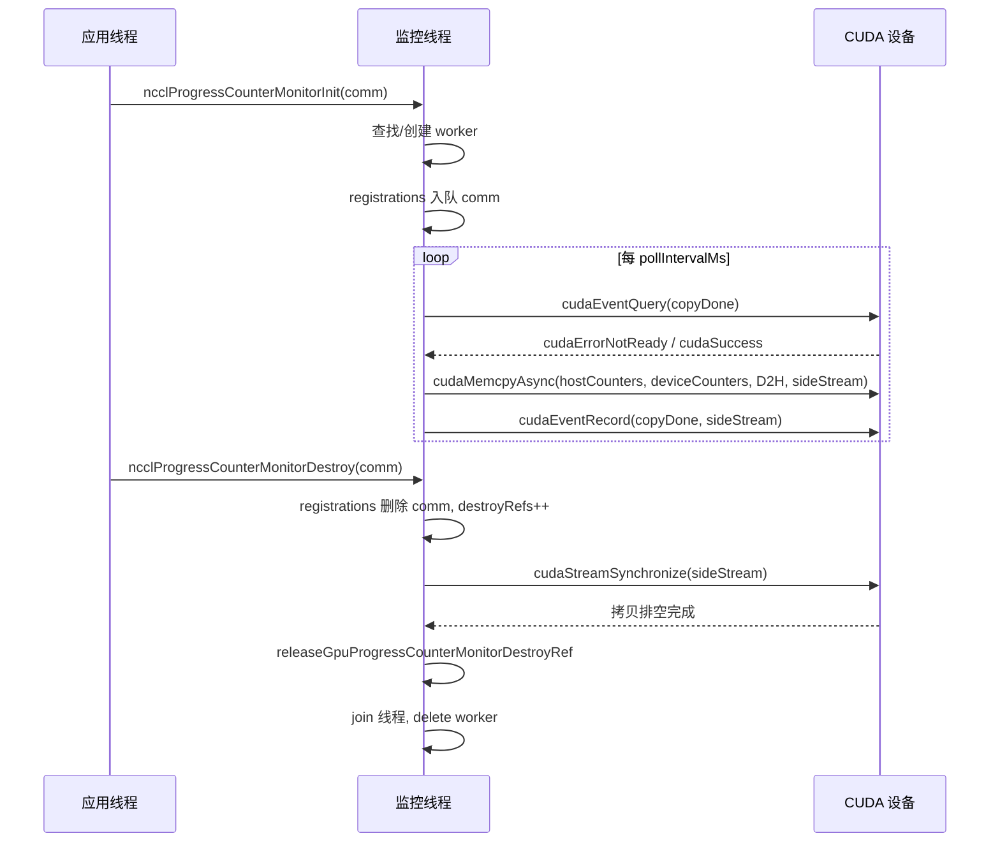
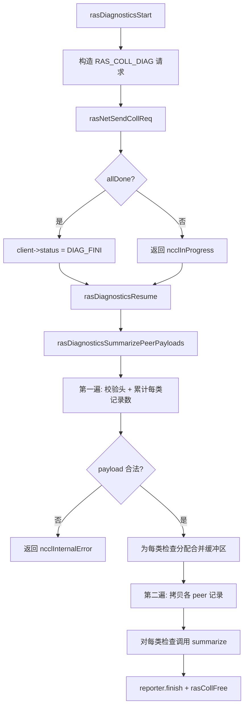

# 第 17 章：RASメカニズムとフォールトトレランス：リンク障害検出、ハートビート、グレースフルデグラデーション

# 第17章：RASメカニズムとフォールトトレランス：リンク障害検出、ハートビート、グレースフルデグラデーション

前章では、プラグイン体系がどのようにコア通信パスと交換可能なコンポーネントの境界を明確にし、コアコードを変更せずにネットワークバックエンド、チューニング戦略、パフォーマンスコレクタを差し替えられるようにするかを確認した。しかし拡張性は本番運用の一側面に過ぎず、もう一つの同様に困難な問題がある：あるAllReduceが既に72時間実行されているとき、あるマシンのNICが静かに故障した場合、NCCLはなぜそれを発見し、隔離し、継続できるのか？RASサブシステムこそが、NCCLが「動く」から「本番運用可能」へと進む分水嶺であり、本章では障害検出、進捗監視、自己修復メカニズムの背後にある設計を分解する。

# 17.1 RAS総合制御：プロセスごとに1つのRASスレッドを持つグローバルコーディネータ

## 直感的モデル

RASをジョブ全体の「当直室」と想像してほしい。各NCCLプロセス（各rank）は初期化時に当直室を開設し、そこに専任スレッドが座っている。すべての通信ドメイン（communicator）の確立、破棄、診断リクエストはまず当直室に登録する必要があり、当直室同士は独立したRASネットワークを通じて「誰が生きているか、誰が死んだか」を相互に通報する。

もしこの当直室がなければ、NCCLは通信パス自体のタイムアウトによってのみ障害を感知できる——しかし通信パス上のタイムアウトは遅く、誤判定しやすい（一度のネットワークジッタがノード死亡と見なされる可能性がある）。RASは「障害感知」をデータプレーンから制御プレーンに分離し、独立した軽量ハートビートと診断チャネルで健全性状態を判定する。

## データ構造とメモリレイアウト

RASのコア状態は`ras.cc`のグローバル変数に散在しており、一つずつ分解する：

| 変数 | 型 | 役割 |
| --- | --- | --- |
| `rasInitMutex` | `std::mutex` | RASシングルトン初期化を保護 |
| `rasInitialized` | `bool` | 初期化済みかどうか |
| `rasInitRefCount` | `int` | 参照カウント、アクティブなcomm数に等しい |
| `rasNetListeningSocket` | `struct ncclSocket` | RASネットワークリスニングソケット |
| `rasNotificationPipe[2]` | `ncclSocketPairDescriptor` | ローカルスレッド → RASスレッドへの通知パイプ |
| `rasPfds` | `struct pollfd*` | メインイベントループのpoll配列 |
| `ncclComms` | `struct ncclComm**` | すべての通信ドメインポインタ配列 |

[FACT:src/ras/ras.cc:49-61]これらのグローバル状態を定義する。注意すべきは`rasInitRefCount`が`ncclAtomicRefCountIncrement`で[FACT:src/ras/ras.cc:129]を増減し、`rasInitialized`が通常のboolと二重チェックロックで[FACT:src/ras/ras.cc:103-105]を保護すること——これは典型的な「一度初期化、その後読み取り専用」パターンである。

`ncclComms`配列の割り当て戦略は注目に値する：オンデマンドで成長するのではなく、毎回`RAS_INCREMENT * 8`（すなわち32スロット）ずつ拡張する[FACT:src/ras/ras.cc:139-140]。配列内には`nullptr`の空洞（comm破棄時に空にする）が許容され、新しいcommは最初の空洞を再利用する[FACT:src/ras/ras.cc:135-137]。

## シナリオ駆動Walkthrough：comm初期化からRASスレッド起動まで

**ステップ1：`ncclRasCommInit`が呼び出される。**これは各comm初期化時に最初に呼び出されるRAS関数である[FACT:src/ras/ras.cc:101]。まず`rasInitialized`をチェックし、未初期化ならクリティカルセクションに入る：

1. bootstrapネットワークインターフェースアドレスで`rasNetListeningSocket`を初期化し、ポートを0に設定してカーネルにランダム割り当てさせる[FACT:src/ras/ras.cc:108-109]

2. そのソケットをリッスンする[FACT:src/ras/ras.cc:113]

3. ローカル通知パイプを作成する[FACT:src/ras/ras.cc:118]

4. 診断サブシステムを初期化する[FACT:src/ras/ras.cc:120]

5.`rasThreadMain`スレッドを起動する[FACT:src/ras/ras.cc:121]

6.`atexit(rasTerminate)`を登録し、プロセス終了時のクリーンアップを保証する[FACT:src/ras/ras.cc:126]

**ステップ2：commを登録する。**初回初期化かどうかに関わらず、`comm`ポインタを`ncclComms`配列に書き込み[FACT:src/ras/ras.cc:142]、`ncclCommsSorted`をfalseに設定する[FACT:src/ras/ras.cc:143]——配列順序が変わったため、以前のソートが無効になったからである。

**ステップ3：ポートを書き戻す。**関数は最後に`rasNetListeningSocket.addr`（カーネル割り当てポートを含む）を`myRank->addr` [FACT:src/ras/ras.cc:146]にコピーし、呼び出し側がRASネットワークがどのポートでリッスンしているかを知れるようにする。

## メインイベントループ：poll駆動の多重化

`rasThreadMain`はRASスレッドの心臓である[FACT:src/ras/ras.cc:633]。まず3つの固定fdを登録する：通知パイプ、RASネットワークリスニングソケット、クライアントリスニングソケット[FACT:src/ras/ras.cc:641-652]。その後無限ループに入る：

```
for (int64_t nextWakeup = 0;;) {
  // 计算超时
  timeoutMs = min(..., 1000);
  nEvents = poll(rasPfds, nRasPfds, timeoutMs);
  // 处理事件
  for (pollIdx...) { ... }
  // 处理各类超时
  rasSocksHandleTimeouts(now, &nextWakeup);
  rasConnsHandleTimeouts(now, &nextWakeup);
  rasNetHandleTimeouts(now, &nextWakeup);
  rasCollsHandleTimeouts(now, &nextWakeup);
}
```

[FACT:src/ras/ras.cc:655-728]このループを示す。注意すべきは`timeoutMs`が1000ms以内にハード制限されていること[FACT:src/ras/ras.cc:664]——たとえ`nextWakeup`が遠くても、毎秒一度は目覚め、タイムアウトチェックの適時性を保証する。

イベントディスパッチロジックはfd値でルーティングする[FACT:src/ras/ras.cc:684-715]：通知パイプなら`rasLocalHandle`を呼ぶ；リスニングソケットならaccept；そうでなければ`rasSocketsHead`と`rasClientsHead`リンクリストを走査して対応するsocketを処理する。

## ローカル通知メカニズム：パイプ + 固定長構造

ローカルNCCLスレッドとRASスレッドはsocketpairで通信する。通知構造`rasNotification`は固定長の[FACT:src/ras/ras.cc:35-46]であり、`static_assert`で`PIPE_BUF` [FACT:src/ras/ras.cc:47]を超えないことを保証する——これは書き込みの原子性を確保するためである（POSIXはPIPE_BUF未満の書き込みが原子的であることを保証する）。

送信側`rasLocalNotify`は`rasNotificationMutex`で複数ユーザースレッドの書き込みを直列化し[FACT:src/ras/ras.cc:224-237]、その後すべて書き終わるまでループで書き込む[FACT:src/ras/ras.cc:224-237]。受信側`rasLocalHandle`も同様に構造全体を読み切るまでループで読み[FACT:src/ras/ras.cc:247-256]、EOFを読むと`ncclSystemError` [FACT:src/ras/ras.cc:251-253]。

を返す`RAS_ADD_RANKS`3種類の通知タイプ：`RAS_RUN_DIAG`（新rank参加）、`RAS_TERMINATE`（診断実行）、[FACT:src/ras/ras.cc:28-32]。

## （終了）

メッセージ送受信：長さプレフィックス + 増分進捗[FACT:src/ras/ras_internal.h:110-117]RASメッセージのワイヤフォーマットは「4バイト長 + メッセージ本体」である`rasConnSendMsg`。送信時[FACT:src/ras/ras.cc:362-390]はまず長さを送り、次にメッセージ本体を送る`meta->offset`、`rasMsgRecv`で進捗を記録し、部分送信後の次回継続をサポートする。受信時[FACT:src/ras/ras.cc:393-412]。

はまず長さを受信し、長さに応じてバッファを割り当て、次にメッセージ本体を受信する`rasMsgAlloc`ここに細部がある：`rasMsgMeta`が割り当てるのは`msg`構造であり、`offsetof`フィールドは構造の末尾にあり、[FACT:src/ras/ras.cc:313-319]でオフセットを計算する[FACT:src/ras/ras.cc:323-328]。この「メタデータ前置」レイアウトにより、メッセージは送信進捗やキュー投入時刻などのローカル情報を、ワイヤフォーマットを占有せずに運ぶことができる。

## 設計上の考察

> **[Design Inference & Architectural Trade-offs]**
> **なぜ epoll ではなく poll を使うのか？**poll の O(n) 複雑度は RAS シナリオでは許容できる——RAS の接続数はデータプレーンの接続数よりはるかに少なく、RAS スレッド自体が性能クリティカルパスではない。poll はクロスプラットフォーム性も高い（Windows 互換）。

> **[Design Inference & Architectural Trade-offs]**
> **なぜ通知に条件変数ではなくパイプを使うのか？**パイプは poll ループにシームレスに統合でき、RAS スレッドが統一された`poll`すべてのイベントソースを待機できる。条件変数を使う場合、poll を起床させる追加の仕組みが必要になる。

```mermaid
flowchart TD
    start["rasThreadMain 启动"] --> reg_pipe["注册通知管道 fd"]
    reg_pipe --> reg_net["注册 RAS 网络监听 fd"]
    reg_net --> reg_client["注册客户端监听 fd"]
    reg_client --> poll["poll(rasPfds, timeout check{"nEvents == -1?"}
    check -->|"是且非 EINTR"| log_err["记录 poll 错误并继续"]
    check -->|"否"| dispatch["遍历 revents 分发事件"]
    log_err --> dispatch
    dispatch --> is_pipe{"fd == 通知管道?"}
    is_pipe -->|"是"| local_handle["rasLocalHandle()"]
    is_pipe -->|"否"| is_net{"fd == RAS 监听?"}
    is_net -->|"是"| accept_net["rasNetAcceptNewSocket()"]
    is_net -->|"否"| is_client{"fd == 客户端监听?"}
    is_client -->|"是"| accept_client["rasClientAcceptNewSocket()"]
    is_client -->|"否"| find_sock["遍历 rasSocketsHead 找匹配 socket"]
    find_sock --> sock_loop["rasSockEventLoop(sock, pollIdx)"]
    local_handle --> terminate{"terminate?"}
    terminate -->|"是"| cleanup["rasThreadCleanup() 并退出"]
    terminate -->|"否"| timeouts
    sock_loop --> timeouts["rasSocksHandleTimeouts / rasConnsHandleTimeouts / rasNetHandleTimeouts / rasCollsHandleTimeouts"]
    accept_net --> timeouts
    accept_client --> timeouts
    timeouts --> poll
```

# 17.2 進捗監視：DMA で GPU カウンタをホストへ転送

## 直感モデル

進捗監視は車のダッシュボードの「エンジン回転計」のようなものだ。運転（通信）には関与しないが、GPU 内部の進捗カウンタを継続的にホストメモリへコピーし、ホストが「この通信ドメインが固まっていないか」を判断できるようにする。これがなければ、AllReduce がハングしたとき「プログラムが戻らない」ことしか分からず、GPU が計算中なのか、ネットワーク待ちなのか、完全にデッドロックしているのか分からない。

## データ構造とメモリレイアウト

各 CUDA デバイスに対応する`ncclGpuProgressCounterMonitor`ワーカースレッド[FACT:src/ras/progress_monitor.cc:35-52]：

| フィールド | 型 | 役割 |
| --- | --- | --- |
| `cudaDev` | `int` | バインドされた CUDA デバイス番号 |
| `thread` | `std::thread` | ワーカースレッド |
| `mutex` / `cv` | `std::mutex` / `condition_variable` | 可変状態の保護と起床 |
| `running` / `shouldStop` | `bool` | スレッドライフサイクルフラグ |
| `copyInFlight` | `bool` | DMA コピーが進行中かどうか |
| `copyStallWarned` | `bool` | 今回のスタールについて既に警告済みかどうか |
| `copyStartNs` | `uint64_t` | 今回のコピー開始時刻 |
| `sideStream` | `cudaStream_t` | 専用ノンブロッキングストリーム |
| `copyDone` | `cudaEvent_t` | コピー完了イベント |
| `warningMutex` | `std::mutex` | 警告タイムスタンプの保護 |
| `lastStaleWarnNs` / `lastErrorWarnNs` | `uint64_t` | レート制限タイムスタンプ |
| `destroyRefs` | `int` | 破棄参照カウント |
| `registrations` | 侵入型キュー | 本デバイスに登録された comm リスト |

[FACT:src/ras/progress_monitor.cc:59-62]ロック順序を明確化：`gpuProgressCounterMonitorsMu`より先に`ncclGpuProgressCounterMonitor::mutex`。これはデッドロックを避けるための重要な約束である。

グローバル配列`gpuProgressCounterMonitors[kRasMaxCudaDevices]`デバイス番号でインデックス[FACT:src/ras/progress_monitor.cc:59-62]。

## シナリオ駆動ウォークスルー：1 回のカウンタコピー

**ステップ 1：登録。** `ncclProgressCounterMonitorInit`が呼び出される[FACT:src/ras/progress_monitor.cc:319]。もし`deviceCountersBlock`が空なら直接 return（その comm は監視に参加しない）[FACT:src/ras/progress_monitor.cc:323]。そうでなければグローバルロック内でそのデバイスの worker を検索または作成[FACT:src/ras/progress_monitor.cc:328-335]、そして comm をキューに投入`registrations` [FACT:src/ras/progress_monitor.cc:339]。

**ステップ 2：ワーカースレッド起動。** `createGpuProgressCounterMonitor`が worker を作成し、`cudaSetDevice`を設定、`sideStream`（`cudaStreamNonBlocking`）と`copyDone`イベント[FACT:src/ras/progress_monitor.cc:280-282]を作成し、スレッド起動後最大 2000ms 待機して`running`が true になるのを確認[FACT:src/ras/progress_monitor.cc:287-303]。

**ステップ 3：ループコピー。** `progressCounterMonitorLoop`まずデバイスをバインドし、relaxed ストリームキャプチャモードを設定（アプリケーションの graph capture を妨げないため）[FACT:src/ras/progress_monitor.cc:97-121]、その後メインループへ：

1. 待機`pollIntervalMs`（デフォルト 1000ms）[FACT:src/ras/progress_monitor.cc:132-136]

2. 前回のコピーがまだ進行中なら、`cudaEventQuery`で[FACT:src/ras/progress_monitor.cc:140]をチェック。もし`cudaErrorNotReady`かつ stale 閾値（デフォルト 5000ms）を超えていれば、レート制限警告を発出[FACT:src/ras/progress_monitor.cc:141-154]

3. 登録されたすべての comm を走査し、各々に対して`cudaMemcpyAsync`を呼び出して`deviceCountersBlock`を`hostCountersBlock` [FACT:src/ras/progress_monitor.cc:170-185]

へコピー`copyDone`4. いずれかのコピーが成功したら、`copyInFlight` [FACT:src/ras/progress_monitor.cc:194-202]

## イベントを記録し

を設定`progressCounterMonitorShouldWarn`並行制御とレート制限[FACT:src/ras/progress_monitor.cc:78-87]警告レート制限は`warningMutex`で実装`warnIntervalNs`：`staleWarnSec`の保護下で前回警告からの経過が[FACT:src/ras/progress_monitor.cc:27]を超えているかチェックし、超えていれば更新して true を返す。デフォルトの

は 600 秒[FACT:src/ras/progress_monitor.cc:29]、つまり同一種別の警告は最大 10 分に 1 回。[FACT:src/ras/progress_monitor.cc:30]パラメータには下限クランプがある：poll 間隔は最小 50ms

## 、stale 閾値は最小 1000ms

`ncclProgressCounterMonitorDestroy`。これによりユーザー設定が過激になり CPU が空回りするのを防ぐ。[FACT:src/ras/progress_monitor.cc:352-354]：

破棄：参照カウント + ストリーム同期`registrations`の破棄ロジックは本章で最も精妙な並行設計の一つ[FACT:src/ras/progress_monitor.cc:368]

1. グローバルロック + worker ロック内で`destroyRefs++`から comm を削除`haveDestroyRef` [FACT:src/ras/progress_monitor.cc:371-372]

2. 削除に成功したら、`shouldStop` [FACT:src/ras/progress_monitor.cc:373-376]

を設定`cudaStreamSynchronize(g->sideStream)`3. 登録リストが空になったら、グローバル配列から取り外し[FACT:src/ras/progress_monitor.cc:393]

を設定`releaseGpuProgressCounterMonitorDestroyRef`4. ロック解放後、[FACT:src/ras/progress_monitor.cc:219-246]

> **[Design Inference & Architectural Trade-offs]**
> **5. 最後に`destroyRefs`？**で参照カウントをデクリメントし、ゼロかつキューが空になったらスレッドを join して削除`cudaStreamSynchronize`〔設計推論とアーキテクチャのトレードオフ〕



## が必要か

**なぜなら`cudaSetDevice`はロック外で実行され、その間に別のスレッドが同じ worker を破棄している可能性があるから。参照カウントにより最後の破棄者だけが実際に join と delete を行うことが保証される。**コピー`cudaSetDevice`本番環境の落とし穴回避`shouldStop`落とし穴 1：[FACT:src/ras/progress_monitor.cc:97-107]の失敗により監視が静かに無効化。`NCCL_RAS`スレッド起動時に

**が失敗すると、worker は**を設定して`cudaThreadExchangeStreamCaptureMode(cudaStreamCaptureModeRelaxed)`を終了する[FACT:src/ras/progress_monitor.cc:110-111]が、それを登録した comm は依然として監視が動作中だと考えている。このときカウンタミラーは Init 段階で失敗が露呈するまで古いままとなる。調査時は

# ログに "progress-counter mirrors will remain stale" があるか確認する。

## 落とし穴 2：graph capture の衝突。

監視スレッドが CUDA API を呼び出す際、アプリケーションが stream capture 中だとキャプチャグラフを汚染する。コードは`nvidia-smi`で回避しており

## 、これは必須の防御である。

17.3 診断フレームワーク：テーブル駆動のチェックディスパッチ`rasDiagnosticsChecks` [FACT:src/ras/diagnostics.cc:63-77]直感モデル`collectLocal`（ローカル収集）と`summarize`（集約）。計11項目のチェック：GPU モデル、CUDA ドライババージョン、ECC、NVLink、NCCL 環境、RDMA トポロジ、IOMMU モード、ATS、XID/SXID、NVIDIA ドライババージョン、パス。

`rasDiagnosticsGetCheck`三重検証を行う：ID 範囲、テーブルエントリ ID の一致、コールバックの非 NULL[FACT:src/ras/diagnostics.cc:104-128]。これは防御的プログラミングである——テーブルエントリが誤って変更され、NULL ポインタを呼び出すことを防ぐ。

## シナリオ駆動ウォークスルー：1回の診断の完全なライフサイクル

**ステップ1：ローカル payload を構築する。** `rasDiagnosticsCollectLocalPeerPayload`まず peer ヘッダを書き込み[FACT:src/ras/diagnostics.cc:226-227]、次にディスパッチテーブルを走査し、各項目に対して`rasDiagnosticsAppendCheckPayload` [FACT:src/ras/diagnostics.cc:229-231]。

`rasDiagnosticsAppendCheckPayload`を呼び出す`collectLocal`を呼び出して`rasDiagnosticsLocalData`を取得し、`ncclUniquePtr`で records の所有権を引き継ぎ[FACT:src/ras/diagnostics.cc:191-192]、メタデータを検証し[FACT:src/ras/diagnostics.cc:193]、レコード数が 0 ならスキップし[FACT:src/ras/diagnostics.cc:194]、そうでなければチェックヘッダ + レコードデータを書き込む[FACT:src/ras/diagnostics.cc:196-201]。

**ステップ2：集合通信を開始する。** `rasDiagnosticsStart`を構築し`RAS_COLL_DIAG`リクエスト[FACT:src/ras/diagnostics.cc:532-537]を`rasNetSendCollReq`を通じて送信し[FACT:src/ras/diagnostics.cc:539]、クライアント状態を`RAS_CLIENT_DIAG_FINI` [FACT:src/ras/diagnostics.cc:541]。

**に設定する** `rasCollDiagMerge`ステップ3：レスポンスをマージする。[FACT:src/ras/diagnostics.cc:310-337]各 peer の payload を集合バッファに追加する[FACT:src/ras/diagnostics.cc:320-324]。ここでは大量のオーバーフローチェックが行われている：peer 数の上限[FACT:src/ras/diagnostics.cc:325-328]。

**、総サイズの上限** `rasDiagnosticsSummarizePeerPayloads`ステップ4：集約。[FACT:src/ras/diagnostics.cc:399]：

- は2回スキャン[FACT:src/ras/diagnostics.cc:418-470]
- 1回目：各 peer ヘッダとチェックヘッダを検証し、各チェック種別のレコード数とバイト数を累計する[FACT:src/ras/diagnostics.cc:472-476]
- 各チェック種別のマージバッファを割り当てる[FACT:src/ras/diagnostics.cc:479-497]
- 2回目：各 peer のレコードを対応するバッファにコピーする`summarize` [FACT:src/ras/diagnostics.cc:499-506]

## 最後に各チェック種別に対して

を呼び出す`rasDiagnosticsClientState`クライアント状態とキャンセル[FACT:src/ras/diagnostics.cc:242-245]診断状態は`rasClient->diagnostics`に存在し`rasDiagnosticsCancelTarget`、[FACT:src/ras/diagnostics.cc:286-293]に紐づいている。[FACT:src/ras/diagnostics.cc:48-52]。

## はクライアント socket のクローズ時に reporter を noop に差し替え

> **[Design Inference & Architectural Trade-offs]**
> **設計上の考察**〔設計推論とアーキテクチャのトレードオフ〕

**なぜ2回スキャンするのか？`recordStride`？** [FACT:src/ras/diagnostics.cc:197]payload が可変長であるため、1回目のスキャンでなければ各チェック種別に必要なバッファサイズを算出できないからである。1回スキャンでは、動的拡張（複数回の realloc）か、過大な事前確保のいずれかになる。2回スキャンは、1回の正確な確保で決定性を得る。`rasDiagnosticsAccountCheckRecords`なぜチェックヘッダに[FACT:src/ras/diagnostics.cc:381-385]。



# チェックごとにレコード構造のサイズが異なるため、集約時にストライドを知らないと正しくコピーおよび検証できないからである。

## は同一チェックの stride を一致させることを強制する

`peers.cc`コピー

## 17.4 ピア管理：ソート済み配列 + ハッシュ同期

直感的モデル

- `rasPeers`が維持しているのは「クラス全員の名簿」である。各 RAS スレッドは完全に同一の名簿を保持し、各 NCCL プロセスのアドレス、PID、管理する GPU を記録する。新しいメンバーが加わったり、誰かが「消息不明」になったりすると、RAS ネットワークを通じて変更をブロードキャストする。名簿はハッシュ値をバージョン番号として使い、毎回の全量同期を避ける。[FACT:src/ras/peers.cc:18-19]データ構造とメモリレイアウト
- `rasDeadPeers`2つのコア配列：[FACT:src/ras/peers.cc:37-38]。

**：既知の全 peer をアドレス順にソート** [FACT:src/ras/peers.cc:25-28]。死亡した peer も含む。`rasPeers`：死亡した peer のアドレスを別途格納`rasDeadPeers`なぜ死んだ peer を別に格納するのか？`rasPeers`のコメントが明確に説明している：

`rasPeerInfo`は大規模下ではほぼ静的で非常に大きいが、[FACT:src/ras/ras_internal.h:110-117]：

| は動的でずっと小さい。別々に格納することで、毎回の同期で巨大な | 配列を転送することを避ける。 | 構造 |
| --- | --- | --- |
| `addr` | `ncclSocketAddress` | フィールド |
| `pid` | `ncclPid_t` | 型 |
| `cudaDevs` | `uint64_t` | 説明 |
| `nvmlDevs` | `uint64_t` | ネットワークアドレス（ソートキー） |
| `hostHash` / `pidHash` | `uint64_t` | プロセス ID |

CUDA デバイスビットマスク（CUDA_VISIBLE_DEVICES の影響を受ける）`rasPeersHash`NVML デバイスビットマスク（影響を受けない）`rasDeadPeersHash`comm から抽出し、commHash を減算して通信ドメイン非依存にする[FACT:src/ras/peers.cc:21][FACT:src/ras/peers.cc:37-38]。

## 2つのハッシュ

**と** `rasRanksConvertToPeers`が同期の核心である`rasRankInit`シナリオ駆動ウォークスルー：新しい rank の参加`rasPeerInfo` [FACT:src/ras/peers.cc:104]ステップ1：変換。[FACT:src/ras/peers.cc:114]が[FACT:src/ras/peers.cc:127-130]配列を[FACT:src/ras/peers.cc:134-139]。

**に変換する。まずアドレス + cudaDev でソートし** `rasPeersUpdate`、空アドレスをスキップし[FACT:src/ras/peers.cc:197]、同一アドレスの複数 GPU プロセスをマージする（ビットマスク OR）[FACT:src/ras/peers.cc:202-229]ステップ2：ローカル配列を更新する。[FACT:src/ras/peers.cc:244-361]は本章で最も複雑なマージアルゴリズムである`rankPeers`。まず新しい配列サイズを計算し[FACT:src/ras/peers.cc:301-308]、次に2つのソート済み配列をマージする[FACT:src/ras/peers.cc:393-402]。重要な点：マージ過程で

**を「差分」に作り変える——実際に新規追加された GPU ビットのみを保持し** `rasNetUpdatePeers`、最後に寄与のないエントリを削除する`rasNextLink`。これによりブロードキャストするデータ量が最小になる。`rasPrevLink`ステップ3：伝播。[FACT:src/ras/peers.cc:430-450]が[FACT:src/ras/peers.cc:443-444]。

**と** `rasConnSendPeersUpdate`の2方向に沿って伝播し[FACT:src/ras/peers.cc:500-508]、その後接続を再構築する`peersHash`ステップ4：更新を送信する。`deadPeersHash` [FACT:src/ras/peers.cc:521-524]まずハッシュをチェックし[FACT:src/ras/peers.cc:608-653]。

## ：相手が現在のハッシュを既知ならスキップする。メッセージに

`rasPeerDeclareDead`と`rasDeadPeers`を含め、受信側がマージ後もハッシュが一致しなければ[FACT:src/ras/peers.cc:793-812]。`rasMsgHandleBCDeadPeer`を返送する[FACT:src/ras/ras.cc:578-591]死んだ peer の宣言と伝播`*pDone = true`がアドレスを

`rasDeadPeersUpdate`に追加し、ソート後にハッシュを再計算する[FACT:src/ras/peers.cc:838-893]がブロードキャストされた死んだ peer メッセージを処理する`memmove`：ローカルで未知なら接続を切断し死亡を宣言し、そうでなければ`memcpy` [FACT:src/ras/peers.cc:855]をマークする

## 再ブロードキャストを停止する。

`rasLinkReinitConns`がマージソートで新旧の死んだ peer リストをマージする[FACT:src/ras/peers.cc:680]。ここでは[FACT:src/ras/peers.cc:706-711]ではなく

`rasLinkCalculatePeer`を使うことに注意。送信元と送信先が重複する可能性があるためである。[FACT:src/ras/peers.cc:743-785]接続再構築：重複接続競合の回避[FACT:src/ras/peers.cc:743-785]が peer 更新後にリンク接続を再構築する

## 。核心戦略：アドレスが小さい側から接続を開始し

**、双方が同時に開始して重複することを避ける。** `ncclSocketsCompare`が次の peer インデックスを計算し、死んだ peer をスキップする[FACT:src/ras/peers.cc:960-990]。fallback には追加の最適化もある：前の fallback と同一ノードの peer をスキップし`memcmp`、ノード全体のダウン時に1つずつ待つことを避ける。[FACT:src/ras/peers.cc:957-959]本番環境の落とし穴

**落とし穴2：`myPeerIdx`無効化。**配列が拡張されると`myPeerIdx`が変わる[FACT:src/ras/peers.cc:22-23]。`rasPeersUpdate`マージ処理中に同期的に更新する[FACT:src/ras/peers.cc:312][FACT:src/ras/peers.cc:358]、更新に失敗した場合は二分探索にフォールバックする[FACT:src/ras/peers.cc:374-388]。

> **[Design Inference & Architectural Trade-offs]**
> **落とし穴3：ハッシュ衝突による同期漏れ。**ハッシュは「同期が必要かどうか」の判断にのみ使用され、正確性には使用されない 。たとえハッシュ衝突で同期がスキップされても、後続のkeep-alive交換にはハッシュが含まれるため、最終的に収束する。

```mermaid
flowchart LR
    subgraph 输入
        ranks["rasRankInit[]"]
    end
    subgraph 转换
        convert["rasRanksConvertToPeers: 排序+合并同地址"]
        rankPeers["rasPeerInfo[] (rankPeers)"]
    end
    subgraph 合并
        update["rasPeersUpdate: 归并到 rasPeers"]
        diff["rankPeers 改造为差异"]
        hash["重算 rasPeersHash"]
    end
    subgraph 传播
        send["rasConnSendPeersUpdate: 带哈希"]
        recv["rasMsgHandlePeersUpdate: 合并+回发"]
        reinit["rasLinkReinitConns: 重建连接"]
    end
    ranks --> convert --> rankPeers --> update
    update --> diff --> hash
    hash --> send --> recv --> reinit
```



# 17.5 設計思考：RASとメイン通信パスの境界

RASサブシステムの最も核心的な設計判断は**データプレーンとの完全な分離**。RASスレッドは集合通信のデータ転送に一切関与せず、三つのことだけを行う：peerリストの維持、接続ヘルスの検出、診断の実行。この分離によりいくつかの利点が得られる：

1. **障害の分離**：RASスレッドがクラッシュしても通信失敗には直結しない（ただし障害感知能力は失われる）

2. **性能への影響なし**：RASのハートビートと同期トラフィックは独立したネットワークを経由し、データプレーンの帯域を消費しない

3. **可観測性**：診断と監視を通信の進行と並行して実行できる

代償は**状態の一貫性**の課題である：RASが見るcomm状態はデータプレーンより遅延する可能性がある。`ncclRasCommInit`と`ncclRasCommFini`は`ncclCommsMutex`を通じて[FACT:src/ras/ras.cc:77-77]を保護するが、RASスレッドが読み取る際はスナップショットのみで、強い一貫性は保証しない。

もう一つの重要な設計は**タイムアウトの階層化**。`ras_internal.h`は一連のタイムアウト定数[FACT:src/ras/ras_internal.h:214-249]を定義している：keep-alive間隔1秒、警告閾値5秒、エラー閾値20秒、peer死亡閾値60秒。この階層化により、システムは異なる深刻度に応じて異なるアクションを取れる——まず警告、次に予備接続を試み、最後に死亡を宣告する。

# 17.6 本章のまとめ

本章ではNCCL RASサブシステムの四つの核心モジュールを分解した：

- **`ras.cc`**：シングルトンRASスレッド＋pollイベントループ、パイプ経由でローカル通知を受信し、独立ネットワーク経由で他のrankとメッセージを交換する
- **`progress_monitor.cc`**：デバイスごとに1つのワーカースレッド、DMAでGPU進捗カウンタをホストに転送、レート制限警告と参照カウントによる破棄を備える
- **`diagnostics.cc`**：テーブル駆動の検査ディスパッチフレームワーク、2パススキャンで各rankの診断payloadを集約する
- **`peers.cc`**：ソート済み配列＋ハッシュ同期によるpeerリスト管理、死んだpeerは別途格納して帯域を節約する

# 本章の思考とセルフチェック

Q1：`rasLocalNotify`は`rasNotificationMutex`で直列化して書き込むが、`rasLocalHandle`の読み取り時には対応するロックがない。なぜこれが安全なのか？もし`static_assert(sizeof(struct rasNotification) <= PIPE_BUF)`を削除した場合、どのようなシナリオで問題が発生するか？

**参考解析**：安全性はPOSIXのパイプ書き込みの原子性保証に由来する——`PIPE_BUF`未満の書き込みは原子的である[FACT:src/ras/ras.cc:47]。`rasLocalNotify`のループ書き込み[FACT:src/ras/ras.cc:224-237]は単一の書き込みで完了する場合、他の書き込みと交錯しない。`rasLocalHandle`のループ読み取り[FACT:src/ras/ras.cc:247-256]は部分的なデータを読む可能性があるが、書き込みが原子的であるため、読み取るのは必ず完全なメッセージのプレフィックスであり、次回の読み取りで補完すればよい。

を削除すると、もし`static_assert`が`rasNotification`を超える場合`PIPE_BUF`、書き込みが複数の非原子的な書き込みに分割される可能性がある。2つのスレッドが並行して書き込むと、それらのバイトが交錯し、RASスレッドが2回の通知が結合された不正なデータを読む可能性がある。`msg.type`はスレッドAから来て`msg.addRanks.ranks`はスレッドBから来る可能性があり、`rasLocalHandle`の未知の型分岐[FACT:src/ras/ras.cc:267-269]またはさらに悪い場合は野ポインタのデリファレンスを引き起こす。

Q2：`ncclProgressCounterMonitorDestroy`はロックを解放した後に`cudaStreamSynchronize` [FACT:src/ras/progress_monitor.cc:381-400]を実行する。もし同期中に別のスレッドもDestroyを呼び出して同じcommを破棄した場合、何が起こるか？`destroyRefs`はどのように問題を防ぐか？

**参考解析**：`destroyRefs`はworkerが早期に削除されるのを防ぐ参照カウントである。最初のスレッドがcommを削除した後`destroyRefs++` [FACT:src/ras/progress_monitor.cc:371]、この時点で`haveDestroyRef = true`。2番目のスレッドが同じcommを削除しようとすると、`ncclIntruQueueDelete`はnullptrを返し（既に削除済み）、`haveDestroyRef`はfalseのまま[FACT:src/ras/progress_monitor.cc:368]、同期と解放を直接スキップする。

最初のスレッドが`cudaStreamSynchronize`を完了した後`releaseGpuProgressCounterMonitorDestroyRef` [FACT:src/ras/progress_monitor.cc:402]を呼び出し、`destroyRefs`を0までデクリメントし、かつ登録キューが空であれば、初めてスレッドをjoinして[FACT:src/ras/progress_monitor.cc:225]。

をdeleteする`destroyRefs`もし`delete g`がなければ、最初のスレッドが同期中に2番目のスレッドの`releaseGpuProgressCounterMonitorDestroyRef`によってworkerを解放され、use-after-freeを引き起こす可能性がある。なお[FACT:src/ras/progress_monitor.cc:222-225]はグローバルロック＋workerロック内で`registrations`をデクリメントし、`destroyRefs == 0`が空であることと

Q3：`rasDiagnosticsSummarizePeerPayloads`の原子性を保証する。`checkHeader->payloadBytes != checkHeader->nRecords * checkHeader->recordStride` [FACT:src/ras/diagnostics.cc:451-454]は最初のパススキャン時に`recordStride = 0`を検証する。もし悪意のあるまたは破損したpeerが`nRecords = 0`を送信し、かつ

**の場合、この検証は通過するか？その後何が起こるか？**：`recordStride <= 0`参考解析[FACT:src/ras/diagnostics.cc:451]は最初の条件でブロックされ`ncclInternalError`、`recordStride = 0`を返す。したがって

は通過しない。`recordStride > 0`しかしもし`nRecords = 0`かつ`payloadBytes = 0`の場合、`rasDiagnosticsAccountCheckRecords`となり、検証は通過する。`nRecords == 0`は[FACT:src/ras/diagnostics.cc:378]に対して直接成功を返し`combined`、`recordsBytes == 0`を更新しない。後続の割り当て時に[FACT:src/ras/diagnostics.cc:473]は`payloadBytes > 0`を割り当てず、コピー時に[FACT:src/ras/diagnostics.cc:490]が偽でスキップする`summarize`。最終的に`records = nullptr, recordsBytes = 0`は

を受け取り、各検査のsummarize実装は空の入力を処理する必要がある。`nRecords > INT_MAX / recordStride`真のリスクは[FACT:src/ras/diagnostics.cc:453]の検査`nRecords * recordStride`にある——これは`nRecords = 2^31, recordStride = 2`の整数オーバーフローが等価検証を回避するのを防ぐ。もしこの検査を削除すると、攻撃者は`payloadBytes = 0`を構築でき、積がオーバーフローして0となり、`rasDiagnosticsAccountCheckRecords`と等しくなり、検証を通過した後`nRecords`は巨大な

を累積し、後続の割り当てやコピーで範囲外アクセスを引き起こす。

全章を貫く設計原則は、制御プレーンとデータプレーンの分離、状態のハッシュによるバージョン管理、タイムアウトの階層処理、並行処理における参照カウントによるライフサイクル保護である。これらの原則により、RAS は通信性能を損なうことなく障害検出と自己修復を実現できる。そして通信性能のもう一つの重要な支えであるメモリ管理もまた、精密なエンジニアリング上のトレードオフを必要とする。なぜ NCCL は通信前にメモリを登録する必要があるのか？登録キャッシュは性能にどう影響するのか？次章では allocator、登録キャッシュ、ユーザーバッファ登録を深掘りし、これらの疑問の答えを明らかにする。
