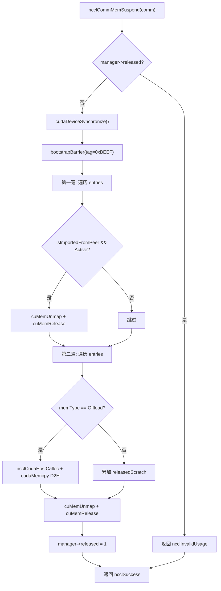
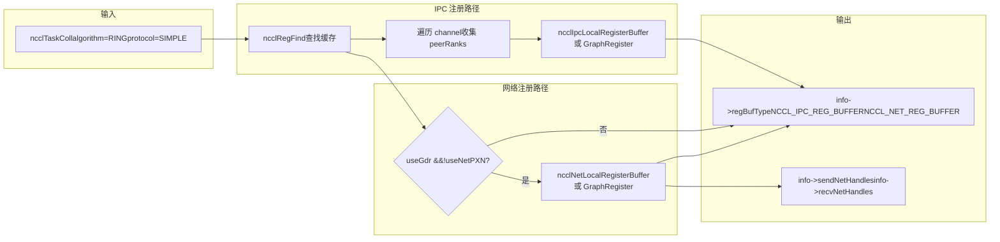
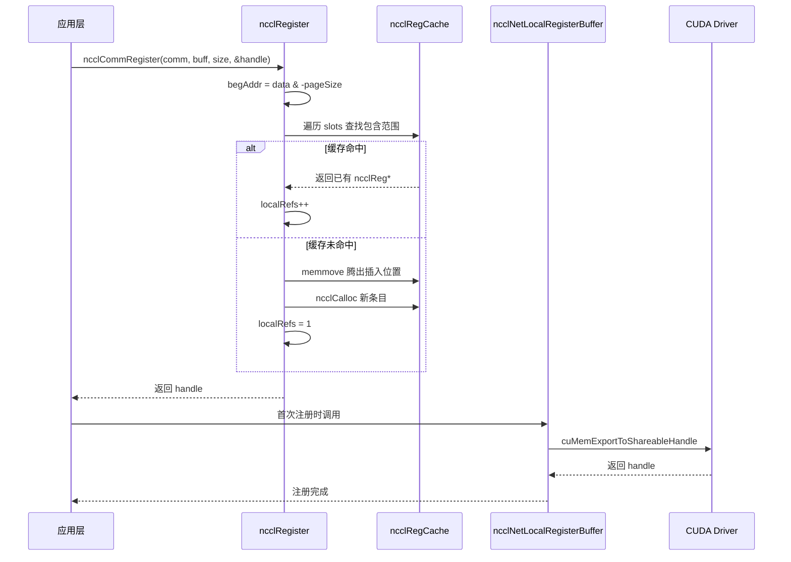

# 第 18 章：メモリ割り当てとデバイスメモリ管理：allocator、登録キャッシュ、ユーザー登録メモリの最適化

# 第18章：メモリ割り当てとデバイスメモリ管理：allocator、登録キャッシュ、ユーザー登録メモリの最適化

前章では、RAS サブシステムが制御プレーン上でデータプレーンから独立して動作し、ハッシュでバージョン管理し、参照カウントでライフサイクルを保護する方法を見た。本章では NCCL の第三の柱であるメモリ管理に入る。通信性能の上限は、しばしばアルゴリズムそのものではなく、「データを NIC が直接読み書きできるかどうか」に依存する。NCCL はこのために三層のメカニズムを構築している。最下層では`ncclSpace`と`ncclShadowPool`がアドレス空間とシャドウオブジェクトを管理し、中間層では`ncclMemManager`が動的メモリのインポート・エクスポートとサスペンド・レジュームを追跡し、最上層では`ncclCommRegister`がユーザーバッファをキャッシュに登録し、通信のたびにメモリを繰り返し pin することを避ける。本章ではこれら三つのメカニズムを層ごとに分解し、「なぜ NCCL は通信前にメモリを登録する必要があるのか」「登録キャッシュは性能にどう影響するのか」に答える。

# 18.1 ncclSpace：アドレス空間を満/空交互のセグメントに分割する

## 直感的モデル

0 から右に無限に伸びる駐車スペースの番号線を想像してほしい。いくつかのスペースには車が停まっており（割り当て済み）、いくつかは空いている（未割り当て）。`ncclSpace`はこの番号線の「スペース状態記録帳」である——各スペースを記録するのではなく、「状態が反転する境界点」だけを記録する。これがなければ、NCCL が対称メモリの仮想アドレス区間を管理する際、各バイトにマークビットを維持する必要があり、メモリオーバーヘッドがアドレス空間に比例し、全く受け入れられない。

## データ構造とメモリレイアウト

`ncclSpace`の定義は極めて簡潔[FACT:src/include/allocator.h:20-24]：

```c
struct ncclSpace {
  int count;        // cuts[] 中有效元素个数
  int capacity;     // cuts[] 已分配容量
  int64_t* cuts;    // 升序排列的边界点数组
};
```

核心的な洞察はソースコードのコメントに明確に書かれている[FACT:src/allocator.cc:151-153]：`cuts[]`は非負整数軸を「満」と「空」が交互に現れるセグメントに分割し、分割点は昇順に並び、最後の分割点以降のセグメントは必ず空である（未割り当てフロンティア）。これから第`i`セグメントが満かどうかを判定する公式を導出できる：

```
isFull(i) = (i%2 != ncuts%2)
```

この公式の意味は、セグメントの満/空状態が「セグメントインデックスの偶奇性」と「分割点総数の偶奇性」の両方で決まるということである。`ncuts`が偶数のとき、第0セグメント（`cuts[0]`の前）は空であり、`ncuts`が奇数のとき、第0セグメントは満である。この不変条件はモジュール全体を貫いている。

## Step-by-Step Walkthrough：一回の割り当てが cuts[] をどう変えるか

シナリオ：初期`ncclSpace`が空（`count=0`）、`ncclSpaceTryAlloc(a, limit=1000, size=100, align=1, &outOffset)`。

**を呼び出す** [FACT:src/allocator.cc:209]。`i = a->count % 2`ステップ1：最初の空セグメントを特定する`count=0`、このとき`i=0`、したがって

**、第0セグメントからスキャン開始。** [FACT:src/allocator.cc:212-213]。`i==0`ステップ2：セグメント境界を計算する`lo=0`；`i==a->count`のとき`hi=limit=1000`のとき`[0, 1000)`。

**。したがって空セグメントは** [FACT:src/allocator.cc:214-215]。`off = alignUp(0, 1) = 0`，`0 + 100 <= 1000`ステップ3：アラインメントと容量チェック

**が成立、割り当て成功。** [FACT:src/allocator.cc:217-223]ステップ4：分割点を挿入する`i==0`。なぜなら`insertSegment(a, 0, 0, 100)`。`insertSegment`（先頭に挿入）なので、スローパス`index=0`で`lo=0, hi=100` [FACT:src/allocator.cc:172-174]の位置に二つの分割点[FACT:src/allocator.cc:185-203]を挿入し、その後「隣接重複値フィルタリング」[FACT:src/allocator.cc:182-184]。

を実行する。フィルタリングロジックは非常に巧妙である：読み書き二つのカーソルでスキャンし、重複値に遭遇すると書き込みカーソルを戻し、ペアの重複値を削除する——ペアの重複は空セグメントが二つの満セグメントに挟まれていることを意味し、マージできるからである。ただし先頭のゼロは特殊ケースで、単独で削除できる`cuts = [0, 100]`，`count=2`割り当て後`isFull(0) = (0%2 != 2%2) = false`。このとき`[0,0)`、第0セグメント（`[0,100)`、空）は空；第1セグメント（

**）は満。正しい。** [FACT:src/allocator.cc:239-267]ステップ5：解放`ncclSpaceFree(a, 0, 100)`。`cuts[count-1] <= offset`を呼び出す。まず[FACT:src/allocator.cc:231-237]が成立するかチェック`100 <= 0`、すなわち`i = 1 - count%2 = 1 - 0 = 1` [FACT:src/allocator.cc:246]，`cuts[1]=100 > 0`が偽、続行。最初の満セグメントを特定`i=1`。`lo = cuts[0] = 0`，`hi = cuts[1] = 100`、したがって`offset < lo || hi < offset+size` [FACT:src/allocator.cc:252]，`0<0`。チェック`100<100`偽、`lo==offset`偽、通過。なぜなら`offset+size==hi`かつ`offset+size != hi`、二つの高速パスはどちらも満たさない（一つ目は`lo != offset`を要求、二つ目は`insertSegment(a, 1, 0, 100)` [FACT:src/allocator.cc:264]を要求）、スローパス`cuts = [0, 0, 100, 100]`。挿入後`[]`，`count=0`、フィルタリング後

。初期状態に戻る。`insertSegment`この「挿入後フィルタリング」の設計により、割り当て/解放時に複雑なセグメントマージロジックを行うことを避け、複雑さを

## の一箇所に集中させている。

**設計上の考察と本番での落とし穴**なぜ size_t ではなく int64_t を使うのか？`ncclSpace`なぜなら`CUdeviceptr`が管理するのは「ポインタ」ではなく「オフセット」であり、オフセットは負になり得る（実際の使用ではならないが）、また CUDA の

**幅と一致させる必要があるからである。符号付き型を使うことでデバッグ時に範囲外を発見しやすくなる。**：`ncclSpaceFree`性能の罠[FACT:src/allocator.cc:245]のコメントは「This could be binary search, but since allocate is linear there's no point」と直言している`cuts[]`。これは割り当てと解放がどちらも O(n) スキャンであることを意味する。ある通信ドメインが大量の小さなセグメントを頻繁に割り当て・解放すると、

**が膨張し、各操作が遅くなる。本番環境では登録済みバッファをできるだけ再利用し、登録/解除を繰り返さないようにすべきである。**：`alignUp(lo, align)`アラインメントオーバーフローのリスク`lo`は`INT64_MAX`が`align`に近く、かつ`limit`が大きいときにオーバーフローする可能性がある。ソースコードには明示的なチェックがない。なぜなら

# 18.2 ncclShadowPool：デバイスオブジェクトとホストシャドウのペア管理

## 直感的モデル

GPU kernel はデバイス上で動作し、ホストメモリ内の C++ オブジェクト（例えば`ncclDevComm`内のメタデータ）に直接アクセスできない。`ncclShadowPool`は「翻訳者」のようなものである：各デバイス側オブジェクトにデバイスメモリのブロックを割り当て、同時にホスト側に対応する「シャドウ」メモリを割り当て、「デバイスアドレス → ホストアドレス」のマッピングテーブルを維持する。ホストがデバイスオブジェクトの設定を変更する必要がある場合、まずホストシャドウを変更し、次にデバイスにコピーする。これがなければ、kernel がメタデータを読むたびに`cudaMemcpy`を介してホストから取得する必要があり、遅延が許容できないほど高くなる。

## データ構造とメモリレイアウト

2つのコア構造体[FACT:src/allocator.cc:272-277]：

```c
struct ncclShadowPage {   // 最多 64 个对象的连续块
  struct ncclShadowPage* next;
  int objSize;
  uint64_t freeMask;      // 位图，1=空闲，0=已占用
  void* devObjs;
};
struct ncclShadowObject {
  struct ncclShadowObject* next;
  void* devObj;
  void* hostObj;
  struct ncclShadowPage* page;  // null 表示直接分配在 CUDA mempool
};
```

`ncclShadowPool`自体[FACT:src/include/allocator.h:42-47]：

```c
struct ncclShadowPool {
  int count, hbits;                       // 对象数、哈希位数
  struct ncclShadowObject** table;        // 哈希桶数组
  cudaMemPool_t memPool;                  // 可选的 CUDA 内存池
  struct ncclShadowPage* pages;           // 页链表
};
```

**重要な設計ポイント：`freeMask`は uint64_t**であるため、1ページあたり最大64個のオブジェクトとなる。これは恣意的に選ばれたものではない——64ビットはちょうど1つのキャッシュラインの幅であり、`popFirstOneBit`は単一の`__builtin_ctzll`命令で最初の空きスロットを見つけることができ、ループが不要である。

**ハッシュテーブルの成長戦略**：ソースコードのコメント「Maintain 2:1 object:bucket ratio」[FACT:src/allocator.cc:368]、つまりオブジェクト数がバケット数の2倍を超えると拡張する。初期`hbits=4`（16バケット）[FACT:src/allocator.cc:363]、毎回倍増する。

## Step-by-Step Walkthrough：1回の割り当てがページまたは直接接続を選択する方法

シナリオ：`ncclShadowPoolAlloc(pool, size=1024, &devObj, &hostObj, stream)`。

**ステップ1：遅延初期化** [FACT:src/allocator.cc:347-366]。もし`hbits==0`なら、まずデバイスがメモリプール[FACT:src/allocator.cc:352]をサポートしているか確認し、サポートしていれば`cudaMemPool_t`を作成し、`maxSize`をパラメータ`SHADOW_MEMPOOL_MAX_SIZE`（デフォルト1GB）に設定する。次に16バケットのハッシュテーブルを割り当てる。[FACT:src/allocator.cc:359]ステップ2：拡張が必要か確認

**。もし** [FACT:src/allocator.cc:369-386]なら、倍のバケット配列を割り当て、古いテーブルを走査して再挿入し（`count+1 > 2<<hbits`は`hashInsert`を使用してバケットインデックス`ncclHashPointer`を計算）、古いテーブルを解放する。[FACT:src/allocator.cc:333-337]ステップ3：ページパスか直接接続パスかを決定

**。判定条件** [FACT:src/allocator.cc:390]、つまり`(64<<10)/size >= 3`のときページパスを取る。`size <= 21845`に対して、ページパスを取る。`size=1024`，`65536/1024=64 >= 3`ステップ4：ページ内オブジェクトサイズを計算

**。つまりページ内オブジェクトサイズは2のべき乗で128バイトの倍数にアラインされる。** [FACT:src/allocator.cc:391-392]。`shift = max(0, log2Down(1024)+1-4) = max(0, 10+1-4) = 7`。`pageObjSize = ((1024 + 127) >> 7) << 7 = 1024`ステップ5：ページを検索または作成

**。** [FACT:src/allocator.cc:393-415]リンクリストを走査し、`pool->pages`のページを探す。なければ新しいページを作成：`objSize == pageObjSize`（64スロットすべて空）`pageSize = min(65536, 64*1024) = 65536`，`freeMask = uint64_t(-1) >> (64 - 65536/1024) = uint64_t(-1) >> 0 = 全 1`。[FACT:src/allocator.cc:400]または`cudaMallocFromPoolAsync`でデバイスメモリ`cudaMalloc`を割り当て、[FACT:src/allocator.cc:403-404]をゼロクリア`cudaMemsetAsync`ステップ6：ページからスロットを取得[FACT:src/allocator.cc:405]。

**最初の空きビットを見つけ、** [FACT:src/allocator.cc:408-412]。`popFirstOneBit(&page->freeMask)`。もし`devObj = page->devObjs + slot * pageObjSize`が0になったら（ページ満杯）、ページを空きリンクリストから削除`freeMask`ステップ7：ホストシャドウオブジェクトを割り当て[FACT:src/allocator.cc:411]。

**、ここで** [FACT:src/allocator.cc:423-428]。`malloc(sizeof(ncclShadowObject) + alignof(max_align_t)-1 + size)`バイトを余分に割り当ててアライメントパディングに使用することに注意。`alignof(max_align_t)-1`、つまりオブジェクトヘッダの後を最大アライメント境界にアラインする。次に`hostObj = alignUp((char*)(obj+1), alignof(max_align_t))`をゼロクリア。`memset(hostObj, 0, size)`ステップ8：ハッシュテーブルに挿入しカウントを更新

**並行制御とハードウェア相互作用** [FACT:src/allocator.cc:429-430]。

## 自体

`ncclShadowPool`にはロックがない**。これはシングルスレッドコンテキストでのみ使用できるか、呼び出し側が相互排他を保証する必要があることを意味する。NCCLの実際の使用から見ると、主に通信ドメインの初期化段階で呼び出され、この時点ではシングルスレッドである。**と

`cudaMallocFromPoolAsync`は非同期操作であり、`cudaFreeAsync`パラメータに依存して順序を保証する`stream`はすべてのリソースを解放した後に呼び出され[FACT:src/allocator.cc:403,459]。`ncclShadowPoolDestruct`、すべての非同期解放が完了してからメモリプールを破棄することを保証する。`cudaStreamSynchronize(stream)` [FACT:src/allocator.cc:333-337]本番環境の落とし穴回避ガイド

## 落とし穴1：ページ内オブジェクトサイズのアライメントによるメモリ浪費

**は2のべき乗でアラインされ、もし**。`pageObjSize`。各オブジェクトで24バイト浪費し、ページ内64オブジェクトで1536バイト浪費する。多数の小さなオブジェクトに対して、このオーバーヘッドは無視できない。`size=1000`，`shift = log2Down(1000)+1-4 = 9+1-4 = 6`，`pageObjSize = ((1000+63)>>6)<<6 = 1024`落とし穴2：

**がオブジェクトを見つけられない場合の動作`ncclShadowPoolFree`。それは** [FACT:src/allocator.cc:442-445]を返し警告を出力するが、`ncclInternalError`いかなるリソースも解放しない**。呼び出し側が戻り値を無視すると、メモリリークが発生する。本番コードは戻り値を必ずチェックする必要がある。**落とし穴3：

**内の`ncclShadowPoolDestruct`のページが回収される`freeMask==0`。ここで** [FACT:src/allocator.cc:301-306]を1に設定する（すべて1ではなく）ことに注意。これは最初のスロットのみを空きとしてマークすることを意味する。これは「満杯ページ」を`freeMask`リンクリストに戻すためだが、ページ内の他のスロットは依然として占有されている——実際にはこれらのオブジェクトはまもなく解放されるため、この操作は安全である。しかしデストラクタ処理中に並行アクセスがあると、不整合な状態を読み取る可能性がある。`pool->pages`18.3 ncclMemManager：動的メモリの参照カウントとサスペンド/レジューム

# 直感的モデル

## トレーニングタスクは数日間実行される可能性があり、その間 GPU が他のタスクにプリエンプトされたり、チェックポイントが必要になることがある。

は「メモリ管理人」のようなものである：すべての動的割り当てメモリ（scratch/offload）を記録し、必要に応じて GPU メモリを「サスペンド」（物理ページをアンマップし、仮想アドレスを保持）し、データを CPU にバックアップし、復元時に物理ページを再割り当て、再マップし、データを復元する。これがなければ、タスクがプリエンプトされた後は最初からやり直すしかなく、数時間のトレーニング進捗を無駄にする。`ncclMemManager`データ構造とメモリレイアウト

## のコアフィールド（初期化コードから推測）

`ncclMemManager`フィールド[FACT:src/mem_manager.cc:32-60]：

| 型 | 意味 | 動的メモリエントリリンクリストの先頭 |
| --- | --- | --- |
| `entries` | `ncclDynMemEntry*` | リンクリストの長さ |
| `numEntries` | `int` | 0=アクティブ、1=サスペンド済み |
| `released` | `int` | 参照カウント（複数の comm が共有可能） |
| `refCount` | `int` | 永続メモリ総量（アトミック） |
| `totalPersist` | `size_t` | scratch メモリ総量（アトミック） |
| `totalScratch` | `size_t` | offload メモリ総量（アトミック） |
| `totalOffload` | `size_t` | CPU バックアップメモリ総量 |
| `cpuBackupUsage` | `size_t` | entries リンクリストを保護 |
| `lock` | `std::mutex` | アトミックフラグ、破棄された mutex へのアクセスを防止 |
| `initialized` | `int` | メモリレイアウトの重要な設計 |

**は**：`lock`であるが、`std::mutex`は`ncclMemManager`で割り当てられる（C スタイル）ため、placement new で明示的に`ncclCalloc`を構築し、デストラクタで明示的に[FACT:src/mem_manager.cc:39]を呼び出す必要がある。これは C/C++ 混在プログラミングの古典的な落とし穴である。`~mutex()` [FACT:src/mem_manager.cc:120]アトミック変数とロックの役割分担

**：統計フィールド（**など）はアトミック操作で更新され、ロック不要；`totalPersist`リンクリストは`entries`で保護される。これにより統計クエリ（`lock`）はロックなしで`ncclCommMemStats`を読み取ることができ、リンクリスト操作はロックを保持する必要がある。[FACT:src/mem_manager.cc:1117-1130]，而链表操作必须持锁。

## ステップバイステップのウォークスルー：サスペンドとレジュームの完全なフロー

**サスペンドフロー** `ncclCommMemSuspend` [FACT:src/mem_manager.cc:418-540]：

**ステップ1：事前チェック** [FACT:src/mem_manager.cc:419-430]。メモリマネージャが無効化されているか、comm が空か、すでにサスペンドされているかを確認する。

**ステップ2：デバイス同期と barrier** [FACT:src/mem_manager.cc:440-441]。`cudaDeviceSynchronize()`すべての GPU 操作が完了することを確認し、その後`bootstrapBarrier`すべての rank が同期することを確認する。barrier tag は`0xBEEF`。

**ステップ3：第1回スキャン——peer がインポートしたすべてのバッファを unmap** [FACT:src/mem_manager.cc:444-465]。各`isImportedFromPeer && state==Active`のエントリに対して、`cuMemUnmap`を呼び出してマッピングを解除し[FACT:src/mem_manager.cc:451]、handle を解放し[FACT:src/mem_manager.cc:456]、状態を`Released`。

**に変更する。ステップ4：第2回スキャン——ローカルメモリを offload** [FACT:src/mem_manager.cc:468-526]。peer インポートおよび解放済みのエントリをスキップする。`ncclMemOffload`タイプに対して、まず CPU バックアップを割り当て[FACT:src/mem_manager.cc:484]、その後`cudaMemcpy`で GPU から CPU にコピーする。[FACT:src/mem_manager.cc:492]タイプに対しては、統計を累積するのみ。その後 shareable FD を閉じ`ncclMemScratch`、状態を[FACT:src/mem_manager.cc:508-513]，`cuMemUnmap` [FACT:src/mem_manager.cc:516]，`cuMemRelease` [FACT:src/mem_manager.cc:519]に変更する。ステップ5：サスペンド済みとしてマーク`Released`。

**レジュームフロー** [FACT:src/mem_manager.cc:528]。

**ステップ1：ローカルメモリを復元** `ncclCommMemResume` [FACT:src/mem_manager.cc:550-942]：

**。各** [FACT:src/mem_manager.cc:577-668]のエントリに対して、再度`!isImportedFromPeer && state==Released`を同じ仮想アドレスにマッピングし`cuMemCreate` [FACT:src/mem_manager.cc:599]，`ncclCuMemMapAndSetAccess`、peer アクセス権限を復元し[FACT:src/mem_manager.cc:602]、offload タイプに対しては CPU バックアップからデータを復元し[FACT:src/mem_manager.cc:610-626]、FABRIC handle を再エクスポートする[FACT:src/mem_manager.cc:632-643]ステップ2：barrier 同期[FACT:src/mem_manager.cc:646-658]。

**。tag は依然として** [FACT:src/mem_manager.cc:671-679]ステップ3：新しい handle 情報を交換`0xBEEF`。

**。各 rank がブロードキャストする必要があるローカルバッファの数を集計し** [FACT:src/mem_manager.cc:688-816]、[FACT:src/mem_manager.cc:689-696]でカウントを交換し`bootstrapAllGather`、オフセットを計算し[FACT:src/mem_manager.cc:710]、その後まず[FACT:src/mem_manager.cc:724-728]してから`bootstrapSend`（コメントに明記「send first, then receive to avoid deadlock」`bootstrapRecv`ステップ4：peer バッファを再インポート[FACT:src/mem_manager.cc:783]）。

**。各** [FACT:src/mem_manager.cc:822-911]のエントリに対して、交換結果の中から一致する handle 情報を検索する`isImportedFromPeer && state==Released`。POSIX FD タイプは hostHash が同じかどうかを確認する必要があり[FACT:src/mem_manager.cc:829-835]、その後 proxy 経由で FD を取得し[FACT:src/mem_manager.cc:853-859]インポートする[FACT:src/mem_manager.cc:866]，`cuMemImportFromShareableHandle`。FABRIC タイプは直接インポートする[FACT:src/mem_manager.cc:873]。その後[FACT:src/mem_manager.cc:878]再マッピングする`ncclCuMemMapAndSetAccess`ステップ5：最終 barrier[FACT:src/mem_manager.cc:893]。

**。tag は** [FACT:src/mem_manager.cc:916-928]であり、前述の`0xCAFE`と区別する。`0xBEEF`並行制御とハードウェア連携

## 参照カウントによるライフサイクル保護

**まず**：`ncclMemManagerDestroy`をデクリメントし、まだ 0 より大きければ現在の comm のポインタのみをクリアし`refCount` [FACT:src/mem_manager.cc:76]、リソースは解放しない。これにより複数の comm が同じメモリマネージャを共有できる（例えば split_share のシナリオ）。[FACT:src/mem_manager.cc:81]アトミックな initialized フラグ

**：すべての操作の前に**をチェックし、破棄済みの mutex へのアクセスを防ぐ。破棄時には`COMPILER_ATOMIC_LOAD(&manager->initialized, memory_order_acquire)` [FACT:src/mem_manager.cc:136,242,338,358]で 0 をストアし`memory_order_release`、以前の書き込み操作が他のスレッドから可視であることを保証する。[FACT:src/mem_manager.cc:87]CUDA VMM API の使用

**は CUDA 仮想メモリ管理 API であり、物理メモリと仮想アドレスの分離を可能にする。これがサスペンド/レジュームの基盤である——サスペンド時には物理ページを unmap するが仮想アドレスは保持し、レジューム時には同じ仮想アドレスに再マッピングするため、確立済みのすべてのポインタ関係を変更する必要がない。**：`cuMemCreate`/`cuMemMap`/`cuMemUnmap`/`cuMemRelease`本番環境の落とし穴ガイド

## 落とし穴1：split_share 通信ドメインはサスペンドをサポートしない

**。もし** [FACT:src/mem_manager.cc:1014-1018]なら、直接`refCount > 1`を返す。複数の comm がメモリマネージャを共有している場合、1つの comm をサスペンドすると他の comm のメモリに影響を与えるため。`ncclInvalidUsage`落とし穴2：POSIX FD のクロスノード無効化

**。POSIX ファイルディスクリプタは同一ノード内でのみ有効であり、クロスノードレジューム時にはスキップする必要がある。ソースコードでは** [FACT:src/mem_manager.cc:853-859]比較で同一ノードかどうかを判定している。`hostHash`落とし穴3：offload データ復元失敗時にバックアップを保持

**。もし** [FACT:src/mem_manager.cc:635]で CPU から GPU への復元が失敗した場合、ソースコードは警告を出力し`cudaMemcpy`を保持し、解放しない。これは呼び出し元にリトライの機会を与えるためだが、リトライしなければ CPU メモリがリークする。`cpuBackup`落とし穴4：

**における use-after-free リスク`ncclMemUntrackDynamic`。ソースコードはロック保持状態でエントリを見つけ、必要な情報を保存し、エントリを解放し**、その後ロック外で統計を更新する[FACT:src/mem_manager.cc:302]。この順序は正しいが、もし[FACT:src/mem_manager.cc:311-327]ポインタが呼び出し元のスタックメモリを指しており、呼び出し元がロック外で読み取る場合、`info`のライフサイクルが関数全体をカバーすることを保証する必要がある。`info`コピー



18.4 登録キャッシュ：ncclRegister が重複 pin を回避する方法

# 直感的モデル

## ネットワークカードが GPU メモリを直接読み書きする（GPUDirect RDMA）には、まずこのメモリを「登録」する必要がある——ネットワークカードに「このアドレスに直接アクセスしてよい」と伝える。登録プロセスはページの pin、IOMMU マッピングの確立を伴い、オーバーヘッドが大きい（ミリ秒単位）。毎回の AllReduce で再登録すると、小メッセージ通信のレイテンシは登録オーバーヘッドに完全に埋もれてしまう。

はまさに「登録キャッシュ」である：登録済みのアドレス範囲を順序付き配列に記録し、次回同じまたは包含するバッファに遭遇した場合、直接再利用し、再登録しない。`ncclRegister`データ構造とメモリレイアウト

## の核心は順序付き配列

`ncclRegCache`であり、各要素は`slots`の主要フィールド（使用状況から推測）：`ncclReg*`。`ncclReg`フィールド

| 型 | 意味 | ページアラインされた開始アドレス |
| --- | --- | --- |
| `begAddr` | `uintptr_t` | ページアラインされた終了アドレス |
| `endAddr` | `uintptr_t` | ローカル参照カウント |
| `localRefs` | `int` | グラフ参照カウント |
| `graphRefs` | `int` | 登録状態ビット（NET/NVLS/COLLNET/IPC） |
| `state` | `int` | ネットワーク handle リンクリスト |
| `netHandleHead` | `ncclRegNetHandles*` | 网络 handle 链表 |
| `ipcInfos` | `ncclIpcInfo**` | IPC 情報配列 |

**ページアラインメント**：`begAddr = (uintptr_t)data & -pageSize` [FACT:src/register/register.cc:31]，`endAddr = ((uintptr_t)data + size + pageSize - 1) & -pageSize` [FACT:src/register/register.cc:32]。`-pageSize`は`pageSize`の2の補数であり、「pageSize の倍数に切り下げる」ことと等価です。この理由は、登録の最小粒度がページであり、たとえ1バイトだけ登録してもページ全体を登録する必要があるためです。

## Step-by-Step Walkthrough：1回の登録がどのようにキャッシュにヒットするか

シナリオ：`ncclCommRegister(comm, buff=0x7f0000001000, size=4096, &handle)`。

**ステップ1：パラメータチェックとページアラインメント** [FACT:src/register/register.cc:18-24]。`CommCheck`comm の有効性を検証します。仮に`pageSize=4096`，`begAddr = 0x7f0000001000 & -4096 = 0x7f0000001000`，`endAddr = (0x7f0000001000 + 4096 + 4095) & -4096 = 0x7f0000002000`。

**ステップ2：システムメモリチェック** [FACT:src/register/register.cc:36-64]。もし`ncclCuMemEnable()`なら、アドレス範囲とメモリタイプを照会します。もし`memType == CU_MEMORYTYPE_HOST`なら、CPU メモリであることを示し、登録をスキップします[FACT:src/register/register.cc:58-61]。そうでなければ Sysmem セグメントがあるか確認します[FACT:src/register/register.cc:50-55]。

**ステップ3：キャッシュを走査して挿入位置を探す** [FACT:src/register/register.cc:66-89]。ループ`slot`は 0 から開始：

- もし`slot == population`（末尾に到達）または`begAddr < slots[slot]->begAddr`（現在のアドレスがキャッシュエントリより前）なら、新しいエントリを作成する必要があることを示します[FACT:src/register/register.cc:67]。
- もし`slots[slot]->begAddr <= begAddr && slots[slot]->endAddr >= endAddr`なら、現在のバッファが既存のエントリに完全に含まれていることを示し、参照カウントを直接増やします[FACT:src/register/register.cc:83-87]。

**ステップ4：新しいエントリを作成** [FACT:src/register/register.cc:68-82]。キャッシュが満杯なら、拡張します（初期 32、その後倍々）[FACT:src/register/register.cc:70]。`memmove`を`slot`位置で空間を空けるために使用します[FACT:src/register/register.cc:73]，`ncclCalloc`新しいエントリを割り当てます[FACT:src/register/register.cc:74]、`begAddr`/`endAddr`を設定し、`isGraph`に基づいて`graphRefs`または`localRefs`を 1 に設定します[FACT:src/register/register.cc:78-79]，`population++`、handle を返します。

**ステップ5：登録解除** [FACT:src/register/register.cc:172-195]。`commDeregister`まず handle に対応する slot を見つけます[FACT:src/register/register.cc:180]、参照カウントを減らします[FACT:src/register/register.cc:185-186]。まだ参照があれば、直接返します[FACT:src/register/register.cc:187]。そうでなければ`regCleanup`を呼び出してすべての下位登録をクリーンアップします[FACT:src/register/register.cc:188]、エントリを解放し、`memmove`で穴を埋めます[FACT:src/register/register.cc:190]，`population--`。

## 設計上の考察と本番での落とし穴

**なぜハッシュテーブルではなく整列配列を使うのか？**登録クエリは「範囲包含」クエリであり、完全一致ではないためです。整列配列は二分探索をサポートし（ソースコードは線形スキャンを使用していますが）、メモリ局所性も良好です。ハッシュテーブルは「このアドレスがより大きな範囲に含まれているか」といったクエリを効率的に処理できません。

**`regCleanup`の状態ビット設計** [FACT:src/register/register.cc:95-134]。`state`はビットマスクであり、各ビットが1つの登録タイプ（NET/NVLS/COLLNET/IPC）に対応します。クリーンアップ時にはビットごとにチェックし、完了した登録のみをクリーンアップします。この設計により、一部の登録が成功し一部が失敗する状況が可能になります——例えばネットワーク登録は成功したが IPC 登録が失敗した場合、クリーンアップ時にはネットワーク部分のみをクリーンアップします。

**本番の罠：登録キャッシュはメモリ解放を感知しない**。ユーザーがあるバッファを登録し、その後登録解除せずに`cudaFree`した場合、キャッシュには依然としてこのエントリが残っています。次回の割り当てで同じアドレスが再利用される可能性があり、キャッシュヒットするが実際のメモリは無効になっているという事態が発生します。NCCL の規約では、登録と登録解除はペアで行う必要があり、登録期間中にメモリが解放されないことをユーザーが保証する責任があります。

**`ncclCommRegister`のスキップ条件** [FACT:src/register/register.cc:150-159]。もし`LocalRegister=0`または`P2pUsesMemcpy=1`なら、直接`NULL`handle を返します。これは、特定の構成（例えば P2P が RDMA ではなく memcpy を使用する場合）では、登録が完全にスキップされることを意味します。呼び出し側は handle が NULL かどうかを確認する必要があります。

# 18.5 集合通信登録：coll_reg が異なるアルゴリズムに対して登録戦略をどのように選択するか

## 直感的モデル

異なる集合通信アルゴリズムは異なる転送パスを通ります：NVLS は NVLink SHARP、Ring は P2P またはネットワーク、Tree はツリートポロジです。各パスには異なる登録方法が必要です：NVLS は NVLS ハードウェアに登録する必要があり、ネットワークは NIC に登録する必要があり、IPC は対向 GPU に登録する必要があります。`coll_reg.cc`はまさに「登録戦略ルーター」です：アルゴリズム、プロトコル、バッファタイプに基づいて、どの登録関数を呼び出すかを決定します。これがなければ、各アルゴリズムが独自に登録ロジックを実装する必要があり、コードが重複しエラーが発生しやすくなります。

## Step-by-Step Walkthrough：Ring アルゴリズムの登録判断

シナリオ：`ncclRegisterCollBuffers(comm, info, outRegBufSend, outRegBufRecv, cleanupQueue, regNeedConnect)`、ここで`info->algorithm == NCCL_ALGO_RING`，`info->protocol == NCCL_PROTO_SIMPLE`。

**ステップ1：事前チェック** [FACT:src/register/coll_reg.cc:155-157]。`regBufType = NCCL_REGULAR_BUFFER`，`regNeedConnect = true`を設定します。もし`LocalRegister=0`かつ永続グラフ登録でなければ、直接終了します。

**ステップ2：Ring ブランチに入る** [FACT:src/register/coll_reg.cc:338]。`recvRegRecord`/`sendRegRecord`を NULL に初期化し、`sendNetConns`/`sendNetHandles`/`recvNetConns`/`recvNetHandles`/`srecvNetHandles`配列を割り当てます[FACT:src/register/coll_reg.cc:356-360]。

**ステップ3：既存の登録レコードを探す** [FACT:src/register/coll_reg.cc:351-355]。`ncclRegFind`キャッシュ内で recv/send バッファを探します。recv が見つからず永続グラフ登録でなければ、終了します[FACT:src/register/coll_reg.cc:352]。クロスノードかつ send が見つからず永続グラフ登録でなければ、終了します[FACT:src/register/coll_reg.cc:354]。

**ステップ4：すべての channel を走査して peer を収集** [FACT:src/register/coll_reg.cc:362-393]。各 channel について、`ring.prev`と`ring.next`を確認します。接続フラグに`NCCL_DIRECT_NIC`が含まれていれば、`recvNetConns`/`sendNetConns` [FACT:src/register/coll_reg.cc:370-379]に記録します。もし`NCCL_P2P_READ | NCCL_P2P_WRITE`が含まれていれば、peer を`peerRanks`配列に追加します[FACT:src/register/coll_reg.cc:382-391]。

**ステップ5：IPC 登録** [FACT:src/register/coll_reg.cc:394-407]。もし`nPeers > 0 && comm->isAllDirectP2p`なら、まずグラフ登録を試みます[FACT:src/register/coll_reg.cc:395-399]、失敗したらローカル登録を試みます[FACT:src/register/coll_reg.cc:400-403]。成功したら、`regBufType = NCCL_IPC_REG_BUFFER` [FACT:src/register/coll_reg.cc:406]。

**を設定します** [FACT:src/register/coll_reg.cc:409-457]ステップ6：ネットワーク登録`!comm->useNetPXN && comm->useGdr && netDeviceType != UNPACK`。[FACT:src/register/coll_reg.cc:415-418]かつ AllReduce 以外の PreMulSum/SumPostDiv を確認します[FACT:src/register/coll_reg.cc:419-430]。まずグラフ登録を試みます[FACT:src/register/coll_reg.cc:431-442]、失敗したらローカル登録`regBufType |= NCCL_NET_REG_BUFFER`。成功したら、[FACT:src/register/coll_reg.cc:445-452]。

**を設定し、handle 配列を保存します** [FACT:src/register/coll_reg.cc:551-554]ステップ7：チャネル数の調整

## 。IPC 登録のみでシングルノードかつチャネル数が 17-24 の間であれば、16 に下げます。これは IPC 登録後の帯域特性に合わせるためです。

**設計上の考察と本番での落とし穴**なぜ NVLS と Ring の登録順序は逆なのか？[FACT:src/register/coll_reg.cc:86-94]NVLS ブランチはまずグラフ登録を試みてからローカル登録[FACT:src/register/coll_reg.cc:395-403]、一方 Ring ブランチはまずローカルを試みてからグラフ

**`isMloPartBufRdmaCapable`。これは NVLS のグラフ登録の方が成功しやすく（NVLS ハードウェアは永続バッファに対して最適化されている）、Ring のローカル登録の方が軽量であるためです。** [FACT:src/register/coll_reg.cc:14-37]。コメントは「登録判断はグローバルでなければならず、communicator 全体の保証を使用する」ことを強調している[FACT:src/register/coll_reg.cc:20]。これは、ある rank のバッファが RDMA をサポートしていても、通信ドメイン内にサポートしない rank が1つでもあれば、通信ドメイン全体で登録されないことを意味する。これは一部の rank が登録し、一部が登録しないことによる不整合を避けるためである。

**本番環境の落とし穴：登録失敗時のサイレントデグラデーション**。`ncclRegisterCollBuffers`登録失敗時にはエラーを報告せず、`regBufType`の対応するビットを設定しないだけである。これは通信が依然として動作するが、性能が低下することを意味する。本番環境で性能が期待に達しない場合、`NCCL_REG`ログを確認して登録が成功したかどうかを確認すべきである。



上の図は Ring アルゴリズム下の2つの並行する登録パスを示している：IPC パスは同一ノードの P2P 接続を処理し、ネットワークパスはノード間の RDMA 接続を処理する。2つのパスは独立して実行され、最終的に両方とも`info->regBufType`。

# 18.6 本番環境の落とし穴回避と障害復旧チェーン

## 落とし穴1：登録キャッシュとメモリプールの相互作用

`ncclMemAlloc`でメモリを割り当てる場合、内部的に CUDA VMM API[FACT:src/allocator.cc:38-94]を使用する。この割り当て方法で作成された物理メモリには`gpuDirectRDMACapable`フラグが付いており[FACT:src/allocator.cc:54]、RDMA をネイティブにサポートすることを意味する。しかし`ncclMemFree`で解放する際、メモリマネージャが既に破棄されている場合、`cudaFree`フォールバックパス[FACT:src/allocator.cc:130-132]を通る。これにより VMM で割り当てられたメモリが誤って`cudaFree`で解放される可能性がある。本番環境では`ncclMemAlloc`/`ncclMemFree`のペア使用を確保し、メモリマネージャ破棄後に解放しないようにしなければならない。

## 落とし穴2：サスペンド中の通信リクエスト

`ncclCommMemSuspend`実行中に新しい通信リクエストが到着した場合、どうなるか？ソースコードはサスペンド前に`cudaDeviceSynchronize()` [FACT:src/mem_manager.cc:440]を呼び出し、キューに入れられたすべての GPU 操作が完了することを保証する。しかし host 側の通信リクエストがキューに投入されている場合、明示的な保護はない。本番環境ではサスペンド前にすべての通信スレッドを停止するか、group セマンティクスを使用してサスペンド操作と他の操作が直列化されることを保証すべきである。

## 落とし穴3：FABRIC handle の互換性

`ncclMemAlloc`CUDA 12.3+ では FABRIC handle[FACT:src/allocator.cc:60-71]の使用を試みる。もし`cuMemCreate`が`CUDA_ERROR_NOT_PERMITTED`または`CUDA_ERROR_NOT_SUPPORTED`を返した場合、POSIX FD[FACT:src/allocator.cc:63-65]にフォールバックする。しかし復元時に handle タイプが FABRIC であるがエクスポートに失敗した場合、直接エラーを報告し unmap[FACT:src/mem_manager.cc:649-655]する。これは混合環境（一部の GPU が FABRIC をサポートし、一部がサポートしない）では、サスペンド/レジュームが失敗する可能性があることを意味する。

## 落とし穴4：参照カウントリーク

`ncclRegister`キャッシュヒットするたびに参照カウント[FACT:src/register/register.cc:84-85]が増加する。呼び出し元が N 回登録したが M 回しか登録解除しなかった場合（M < N）、参照カウントは永遠にゼロにならず、`regCleanup`は永遠に呼び出されず、基盤の登録リソースがリークする。本番コードでは厳密にペアにする必要がある`ncclCommRegister`/`ncclCommDeregister`。



# 本章の考察とセルフチェック

Q1: もし`ncclSpaceFree`の`if (a->count == 0 || a->cuts[a->count - 1] <= offset)`チェック[FACT:src/allocator.cc:231-237]を削除した場合、どのようなシナリオで範囲外アクセスが発生するか？

**参考解析**：このチェックには2つの役割がある。第一に、`a->count == 0`空配列アクセス`cuts[-1]`を防ぐ。第二に、`a->cuts[a->count-1] <= offset``offset`が割り当て済み範囲を超えるのを防ぐ。削除した場合、`count == 0`のとき、`a->cuts[a->count - 1]`は`cuts[-1]`を読み取り、これは未定義動作であり、ヒープメタデータを読んだりセグメンテーションフォルトを引き起こす可能性がある。さらに隠蔽的なのは、`count > 0`であっても、`offset`が最後のカットポイントより大きい場合、後続の`while (a->cuts[i] <= offset) i += 2`ループ[FACT:src/allocator.cc:247]が`i`を増加し続けて範囲外になるまで続く。なぜなら`cuts[]`内に`offset`より大きい要素が存在しないからである。本番環境でのトリガーシナリオは：呼び出し元が一度も割り当てられていないオフセットを渡した場合（例えばバッファが外部で解放された後に再度 free を呼び出す）、または`ncclSpace`が並行変更されて状態が不整合になった場合。修正方法はこのチェックを保持し、エラー返却時に`offset`と`count`を出力して調査を容易にすることである。

Q2: `ncclMemManagerDestroy`において、もし`refCount`がデクリメント後も0より大きい場合、現在の comm のポインタのみをクリアしリソースは解放しない[FACT:src/mem_manager.cc:78-83]。このとき別の comm が`ncclMemTrack`を呼び出している場合、何が起こるか？

**参考解析**：`ncclMemTrack`まず`manager->initialized` [FACT:src/mem_manager.cc:136]をチェックする。`refCount > 0`のとき`initialized = 0`は設定されないため、チェックは通過する。次に`manager->lock`を取得し`entries`リンクリスト[FACT:src/mem_manager.cc:188-192]を変更する。これは安全である。なぜなら`refCount > 0`は少なくとも1つの comm が参照を保持していることを意味し、メモリマネージャは破棄されないからである。真のリスクは：最後の comm が`ncclMemManagerDestroy`を呼び出すとき、`refCount`が0にデクリメントされ、`initialized = 0` [FACT:src/mem_manager.cc:87]を設定しすべてのリソースを解放する。このとき別のスレッドが`ncclMemTrack`内で既に`initialized`チェックを通過しているがまだロックを取得していない場合、解放済みの`manager->lock`にアクセスし、use-after-free が発生する。ソースコードは`memory_order_acquire`/`release`のペアリングでこの問題を緩和しているが、厳密にはまだ競合ウィンドウが存在する。本番環境ではメモリマネージャを破棄する前にすべての通信スレッドが停止していることを保証すべきである。

Q3:`ncclCommMemResume`において、POSIX FD タイプの peer バッファはノード間でスキップされる[FACT:src/mem_manager.cc:853-859]。もしすべての peer バッファがスキップされた場合、`restoredPeerCount`は0であるが、`manager->released`は依然として0に設定される[FACT:src/mem_manager.cc:913]。これによりどのような結果が生じるか？

**参考解析**：`manager->released = 0`はメモリマネージャが復元完了と見なすことを意味する。しかしスキップされた peer バッファがある場合、それらの`state`は依然として`ncclDynMemStateReleased`，`handle`であり、依然として0である。後続の通信がこれらのバッファにアクセスすると、CUDA エラー（未マップの仮想アドレスへのアクセス）が発生する。さらに深刻なのは、`ncclCommMemStats`が`ncclStatGpuMemSuspended`をクエリすると0（アクティブ）[FACT:src/mem_manager.cc:1130]を返すが、実際には一部のメモリが復元されていないことである。この問題の根本原因は：ノード間 POSIX FD はそもそもインポートされるべきではない——サスペンド前に、これらのバッファは存在すべきでない`entries`中。正しい方法は、サスペンド時にクロスノードの POSIX FD エントリを回復不能としてマークするか、レジューム時にエラーを返して暗黙的にスキップしないことです。本番環境では、POSIX FD を使用しクロスノードである場合、FABRIC ハンドルに切り替えるか、サスペンド/レジュームが単一ノード内でのみ行われることを保証すべきです。

メモリ管理は NCCL パフォーマンスの見えない支柱です：`ncclSpace`極めて簡潔なカットポイント配列でアドレス空間を管理し、`ncclShadowPool`64 ビットビットマップとハッシュテーブルでデバイス/ホストオブジェクトのペアリングを管理し、`ncclMemManager`参照カウントと CUDA VMM API でサスペンド・レジュームを実現し、`ncclRegister`順序付き配列で登録結果をキャッシュして重複 pin を回避します。これら 4 層のメカニズムが共に「通信前にメモリを再登録する必要がない」という重要なパフォーマンス保証を支えています。次の章ではデバイス側コミュニケータと ABI 互換性に入り、`devcomm`がこれらの host 側のメモリレイアウトを GPU kernel からアクセス可能な構造にどのようにマッピングするかを見ていきます。

上の図は登録のタイミングを示しています：キャッシュヒット時は参照カウントを増やすだけで、下位層の登録は呼び出しません。キャッシュミス時にのみ新しいエントリを作成し、下位層の登録をトリガーします。ここまでで、host 側のメモリ管理メカニズムは明確になりました。しかし通信は最終的に GPU 上で発生し、kernel は対向 rank のアドレスと接続状態に直接アクセスする必要があります。次の章ではデバイス側コミュニケータと ABI 互換性に入り、devcomm が host 側 ncclComm のメタデータをデバイス側からアクセス可能な構造にどのようにマッピングするか、そしてバージョン化された ABI が新旧 kernel とライブラリの互換性をどのように保証するかを見ていきます。
