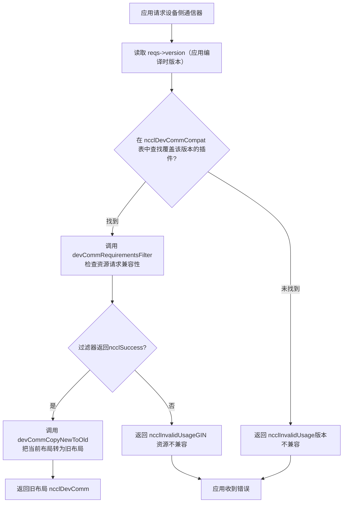
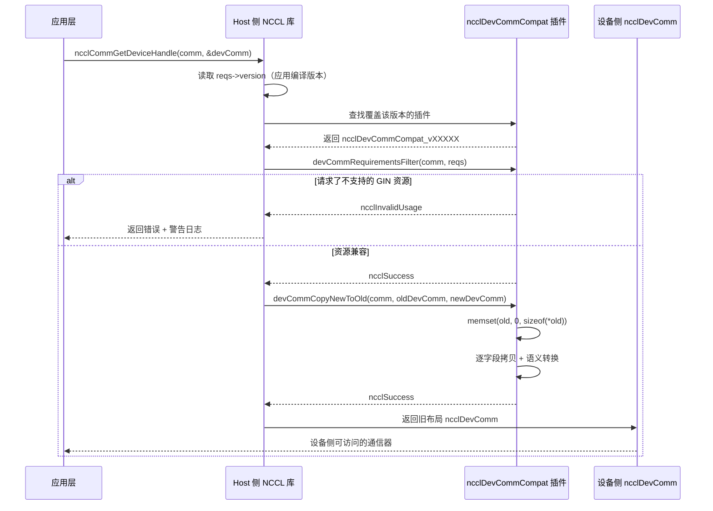

# 第 19 章：デバイス側通信ドメインと ABI 互換性：devcomm と kernel の通信契約

前の章では、host 側の ncclMemManager が参照カウントと CUDA VMM API で通信バッファのライフサイクルを管理しているのを見ました。しかし通信が実際に発生する場所は GPU kernel です——kernel 内のスレッドは知る必要があります：自分はどの rank か？対向 rank のバッファはどの仮想アドレスにあるか？接続は準備できているか？これらの情報は host 側の ncclComm 構造体にありますが、kernel は host ポインタを直接デリファレンスできません。もし NCCL が kernel に毎回パラメータ渡しやグローバルメモリクエリでこれらのメタデータを取得させると、毎回の通信で余分なレイテンシと帯域オーバーヘッドが発生します。さらに悪いことに、kernel コードが一度コンパイルされると、アクセスするフィールドのオフセットは固定されます——ライブラリのアップグレードで ncclComm のレイアウトが変わると、古い kernel は誤ったデータを読み取ってしまいます。これが devcomm が解決すべき核心的な問題です：host 側通信ドメインの重要なメタデータを、安定したバージョン化されたメモリレイアウトで、デバイス側からアクセス可能な構造にマッピングすることです。src/devcomm ディレクトリ下の devcomm_v22902.cc、devcomm_v22907.cc、devcomm_v23000.cc、devcomm_v23100.cc がこのバージョン化 ABI の具体的な実装です。各ファイルは 1 つの NCCL バージョン区間に対応し、その区間内の ncclDevComm の正確なメモリレイアウト、および新旧バージョン間のフィールドコピーロジックを定義しています。本章では順に分解していきます：デバイス側コミュニケータの核心データ構造はどのようなものか、バージョン化 ABI の登録とマッチングメカニズムはどのように動作するか、新旧バージョン間でどのようにフィールドレベルの変換を行うか、そしてこのメカニズムの本番環境における境界と落とし穴について。

# 一、デバイス側コミュニケータの核心構造：ncclDevComm のメモリレイアウト

## 直感的モデル

`ncclDevComm`を「工位カード」と想像してください：各 GPU kernel が起動するとき、1 枚のカードを受け取ります。そこには「あなたは 3 番 rank、全体で 8 rank、あなたの LSA グループには 4 rank、対向バッファのベースアドレスは 0x7f...」と書かれています。このカードは十分小さく（kernel パラメータに収まる）かつ、すべての重要情報を含む必要があります。もしこのカードが存在しなければ、kernel は host 側から繰り返しパラメータを渡すしかなく、毎回の通信で再組み立てが必要になります——レイテンシが高く、エラーが発生しやすくなります。

## データ構造とメモリレイアウト

`ncclDevComm_v23000`を例にとると、その完全な定義は[FACT:src/devcomm/devcomm_v23000.cc:25-62]：

```c
struct ncclDevComm_v23000 {
  unsigned int magic;          // 偏移 0，魔数校验
  unsigned int version;        // 偏移 4，版本号

  int rank, nRanks;            // 偏移 8, 12
  uint32_t nRanks_rcp32;       // 偏移 16，nRanks 的倒数（定点数）
  int lsaRank, lsaSize;        // 偏移 20, 24
  uint32_t lsaSize_rcp32;      // 偏移 28

  ncclDevCommWindowTable_t windowTable;  // 偏移 32
  ncclWindow_t resourceWindow;           // 偏移 40
  ncclResourceWindow_vidmem_v23000_t resourceWindow_inlined;  // 偏移 48
  ncclGinBarrierHandle_t hybridWorldGinBarrier;  // 偏移 112
  ...
};
```

[FACT:src/devcomm/devcomm_v23000.cc:64-93]一連の`static_assert`で各フィールドのオフセットを固定しています。これは装飾ではありません——ABI 互換性のコンパイル時契約です。もしあるフィールドのオフセットがコンパイラのアライメント戦略の変化で移動すると、コンパイルが失敗し、実行時にデバッグ困難なメモリのずれが発生することはありません。

いくつかの重要なフィールドの設計動機：

> **[Design Inference & Architectural Trade-offs]**
> **`nRanks_rcp32`と`lsaSize_rcp32`**：これは`nRanks`と`lsaSize`の逆数であり、32ビット固定小数点数で表現される。カーネル内でrankからバッファオフセットへの除算を行う際、GPUの整数除算は非常に遅いため、逆数を掛けてシフトする方式で大幅に高速化できる。これは典型的な「空間と引き換えに時間を節約する」手法であり、4バイト多く保存することで、毎回の除算にかかる数十クロックサイクルを節約する。

**`resourceWindow_inlined`**：これはインラインのウィンドウ記述子であり、型は`ncclResourceWindow_vidmem_v23000_t`である。注意[FACT:src/devcomm/devcomm_v23000.cc:11-18]におけるその定義：

```c
typedef struct ncclResourceWindow_vidmem_v23000 {
  char reserved1[8];
  char* lsaFlatBase;
  char reserved2[8];
  uint32_t stride4G;
  uint32_t mcOffset4K;
  char reserved3[32];  // NOTE: shrunk from 40 in 2.30u1 to reclaim 8 bytes
} ncclResourceWindow_vidmem_v23000_t;
```

ここでの`reserved1`、`reserved2`、`reserved3`は**パディングフィールド**であり、プレースホルダーとして使用される。なぜパディングが必要か？それは`ncclDevComm_v23000`のレイアウトが「基準バージョン」とオフセットを一致させなければならず、たとえ一部のフィールドが現在のバージョンで使われなくなっても、後続フィールドのオフセットを不変に保つためにプレースホルダーを保持する必要があるからである。[FACT:src/devcomm/devcomm_v23000.cc:11-18]のコメントは明確に説明している：2.30u1は`reserved3`を40バイトから32バイトに縮小し、8バイトを`hybridWorldGinBarrier`のために空けた。これは**レイアウト再配置**である——パディング領域を縮小することで、全体サイズを変えずに新しいフィールドを詰め込んだ。

[FACT:src/devcomm/devcomm_v23000.cc:11-18]の`static_assert`がさらに検証する：`lsaFlatBase`、`stride4G`、`mcOffset4K`の3つのフィールドのオフセットは「現在のバージョン」の`ncclWindow_vidmem`と一致しなければならず、構造体全体のサイズは64バイトである。これは`resourceWindow_inlined`がv23000と現在のバージョンの間で**バイナリ互換**であることを意味する——直接memcpyできる。

## バージョン化構造体のファミリー

比較`ncclDevComm_v22902` [FACT:src/devcomm/devcomm_v22902.cc:38-62]と`ncclDevComm_v22907` [FACT:src/devcomm/devcomm_v22907.cc:13-41]により、フィールドの進化が見える：

| フィールド | v22902 | v22907 | v23000 |
| --- | --- | --- | --- |
| `magic`/`version` | なし | なし | あり（オフセット0/4） |
| `ginContextCount` | uint8_t | uint32_t | uint32_t |
| `ginNetDeviceTypes` | `[4]` | `[NCCL_GIN_MAX_CONNECTIONS]` | `[NCCL_GIN_MAX_CONNECTIONS]` |
| `ginIsRailed` | なし | bool | に分割`ginConnectionsRailed` + `ginContextsRailed` |
| `hybridWorldGinBarrier` | なし | なし | あり（オフセット112） |
| 構造体サイズ | 200 | 224 | 240 |

> **[Design Inference & Architectural Trade-offs]**
> この進化の道筋はNCCLのバージョン戦略を明らかにしている：**必要な時にのみフィールドを追加し、できるだけパディング領域を活用する**。v22902からv22907では`ginSignalBase`、`ginCounterBase`、`ginContextBase`、`ginIsRailed`などのGIN関連フィールドが追加された；v22907からv23000では`magic`/`version`検証フィールドと`hybridWorldGinBarrier`が追加され、同時に`ginIsRailed`が2つのより精密なフラグビットに分割された。

---

# 二、バージョン化ABIの登録とマッチング：ncclDevCommCompat構造

## 直感的モデル

バージョン化ABIを「翻訳プラグイン」のセットとして想像しよう：アプリケーションがNCCL 2.29.2でコンパイルされたが、実行時にリンクされるのは2.31.0のライブラリである場合、ライブラリは「2.29.2のカーネルがどのような`ncclDevComm`レイアウトを期待するか」を知り、現在のバージョンの`ncclDevComm`を古いレイアウトに翻訳する必要がある。各バージョン区間は1つの翻訳プラグインに対応し、グローバルテーブルに登録される。

## 中核構造：ncclDevCommCompat

各`devcomm_vXXXXX.cc`ファイルの末尾に`ncclDevCommCompat`構造体が定義されている。v23000を例にすると[FACT:src/devcomm/devcomm_v23000.cc:192-199]：

```c
struct ncclDevCommCompat ncclDevCommCompat_v23000 = {
  NCCL_VERSION(2, 30, 0),               // minVersion
  NCCL_VERSION(2, 30, 7),               // maxVersion
  nullptr,                              // commPropertiesFilter
  ncclDevCommRequirementsFilter_v23000, // devCommRequirementsFilter
  ncclDevCommCopyNewToOld_v23000,       // devCommCopyNewToOld
  ncclDevCommCopyOldToNew_v23000,       // devCommCopyOldToNew
};
```

6つのフィールドの意味：

1. **`minVersion` / `maxVersion`**：このプラグインが担当するバージョン区間。v23000は2.30.0から2.30.7をカバーする。

2. **`commPropertiesFilter`**：オプションのフィルターであり、`ncclCommProperties`において旧バージョンに公開される機能フラグを調整するために使用される。v23000では`nullptr`に設定され、フィルタリングが不要であることを示す。

3. **`devCommRequirementsFilter`**：アプリケーションが要求するデバイス側リソースが旧バージョンと互換性があるかどうかをチェックする。v23000の実装[FACT:src/devcomm/devcomm_v23000.cc:95-98]は単に`ginType`を`comm->sharedRes`から`reqs`。

4. **`devCommCopyNewToOld`**にコピーする：`ncclDevComm`：現在のバージョンの

5. **`devCommCopyOldToNew`**を旧バージョンのレイアウトにコピーする。

## ：旧バージョンのレイアウトを現在のバージョンにコピーし戻す。

バージョン区間の分割

| 4つのファイルのバージョン区間： | minVersion | maxVersion | ファイル |
| --- | --- | --- | --- |
| `devcomm_v22902.cc` | 2.29.2 | 2.29.3 | 備考 |
| `devcomm_v22907.cc` | 2.29.5 | 2.29.7 | 最も初期のバージョン化実装 |
| `devcomm_v23000.cc` | 2.30.0 | 2.30.7 | GINフィールドを追加するが、GINの後方互換性は提供しない |
| `devcomm_v23100.cc` | 2.31.0 | magic/version検証を追加 | 現在のバージョン |

[FACT:src/devcomm/devcomm_v23100.cc:10-17]すべてのフィルターがnullptrであり、完全互換を示す`nullptr`のv23100プラグインはすべてのコールバックが`ncclDevComm`であり、これは2.31.0以降、

> **[Design Inference & Architectural Trade-offs]**
> 〔設計上の推論とアーキテクチャのトレードオフ〕

## v22902とv22907の間のバージョン区間に「隙間」があることに注意（2.29.4と2.29.6には対応するプラグインがない）。これはこれらのバージョンがリリースされなかったか、それらのレイアウトが隣接バージョンと完全に一致し再利用可能であるためかもしれない。

マッチングフロー`ncclCommGetDeviceHandle`アプリケーションが

または類似のAPIを呼び出すとき、NCCLは以下を行う必要がある：`reqs->version`）。

1. アプリケーションのコンパイル時に埋め込まれたNCCLバージョン番号を読み取る（`ncclDevCommCompat`2. グローバルな

テーブルでそのバージョンをカバーするプラグインを探す。`devCommCopyNewToOld`3. 見つかった場合、プラグインの

を呼び出して現在のレイアウトを旧レイアウトに変換する。

4. 見つからない場合、エラーを返すかデフォルトの動作を使用する。



---

# コピー

## 三、フィールドレベルの変換：新旧レイアウトの相互変換方法

直感的モデル`ncclDevComm`バージョン変換は「翻訳」のようなもの：新バージョンの`rank`は現代中国語の文章であり、旧バージョンのレイアウトは漢文である。翻訳器はフィールドごとに対応させる必要がある——直接対応するフィールドもあれば（`rank`対`ginConnectionStride > 1`）、「意訳」が必要なフィールドもあり（`ginConnectionsRailed = true`を

## に翻訳）、旧バージョンに存在しないフィールドもある（直接破棄）。

NewToOld変換：現在のバージョンから旧バージョンへ`ncclDevCommCopyNewToOld_v23000`を例にすると[FACT:src/devcomm/devcomm_v23000.cc:114-152]：

```c
static ncclResult_t ncclDevCommCopyNewToOld_v23000(ncclComm_t comm, void* oldDevComm,
                                                   struct ncclDevComm const* newDevComm) {
  struct ncclDevComm_v23000* old = (struct ncclDevComm_v23000*)oldDevComm;

  memset(old, '\0', sizeof(*old));  // 先清零，防止未初始化字段泄露
  old->magic = newDevComm->magic;
  old->version = newDevComm->version;
  old->rank = newDevComm->rank;
  ...
  old->ginConnectionsRailed = (newDevComm->ginConnectionStride > 1);
  old->ginStrongLegacySignals = newDevComm->ginStrongLegacySignals;
  old->ginContextsRailed = (newDevComm->ginContextStride > 1);
  ...
}
```

重要なステップ：

1. **`memset`ゼロクリア** [FACT:src/devcomm/devcomm_v23000.cc:118]：これは安全対策である——旧構造体には新バージョンに存在しないフィールドがある可能性があり、ゼロクリアにより未初期化メモリがデバイス側に漏れるのを防ぐ。

2. **直接フィールドコピー**：`rank`、`nRanks`、`lsaRank`などを直接代入。

3. **インラインウィンドウ変換**：呼び出し`ncclDevCommCopyResourceWindowNewToOld_v23000` [FACT:src/devcomm/devcomm_v23000.cc:100-105]、フィールドごとにコピー`lsaFlatBase`、`stride4G`、`mcOffset4K`。

4. **セマンティック変換**：`ginConnectionsRailed = (newDevComm->ginConnectionStride > 1)` [FACT:src/devcomm/devcomm_v23000.cc:142]。新バージョンでは`ginConnectionStride`（整数ステップ）でrailedかどうかを表し、旧バージョンではブール値を使用する。ステップが1より大きい場合、接続がrailedであることを示す。

5. **配列コピー**：`memcpy`コピー`ginNetDeviceTypes`と`ginHandles`配列[FACT:src/devcomm/devcomm_v23000.cc:135-136]。

## OldToNew変換：旧バージョンから現在のバージョンへ

逆変換は[FACT:src/devcomm/devcomm_v23000.cc:154-190]：

```c
static ncclResult_t ncclDevCommCopyOldToNew_v23000(ncclComm_t comm, struct ncclDevComm* newDevComm,
                                                   void const* oldDevComm) {
  struct ncclDevComm_v23000 const* old = (struct ncclDevComm_v23000 const*)oldDevComm;

  newDevComm->magic = old->magic;
  ...
  newDevComm->ginConnectionStride = old->ginConnectionsRailed ? old->lsaSize : 1;
  newDevComm->ginContextStride = old->ginContextsRailed ? old->lsaSize : 1;
  ...
}
```

> **[Design Inference & Architectural Trade-offs]**
> 注意[FACT:src/devcomm/devcomm_v23000.cc:180-181]のセマンティック変換：旧バージョンで`ginConnectionsRailed`が真であれば、新バージョンの`ginConnectionStride`は`lsaSize`；そうでなければ 1 に設定する。ここでは`lsaSize`をステップ幅として使用している。これは railed モードでは各 LSA グループ内の rank が 1 つの GIN 接続を共有しており、ステップ幅が LSA グループのサイズに等しいためである。

## v22902 の特別処理

`ncclDevCommCopyOldToNew_v22902` [FACT:src/devcomm/devcomm_v22902.cc:149-167]には重要なコメントがある：

```c
// Note: this callback will be used with v22907 as well because, prior to 2.30.0, ncclDevComm was unversioned,
// so v22902 and v22907 variants are indistinguishable.
```

> **[Design Inference & Architectural Trade-offs]**
> これは、2.30.0 より前では`ncclDevComm`に`magic`/`version`フィールドが存在しないため、ライブラリが古い構造体を v22902 なのか v22907 なのか区別できないことを意味する。したがって、v22907 の`devCommCopyOldToNew`は`nullptr` [FACT:src/devcomm/devcomm_v22907.cc:128]に設定され、実際には v22902 のバージョンが使用される。両方とも GIN の後方互換性をサポートしていないため、GIN 関連フィールドの差異は正確性に影響しない。

## リソースウィンドウのバージョン管理

`ncclWindow_vidmem_v22902`の定義は`devcomm_v22902.h`内にあり（本章ではそのファイルの内容は提供されていない）が、[FACT:src/devcomm/devcomm_v22902.cc:141]と[FACT:src/devcomm/devcomm_v22902.cc:164]から、v22902 が`ncclDevCommCopyResourceWindow_v22902`を使用してウィンドウ変換を行うことがわかる。この関数は`devcomm_v22902.h`で宣言されており、具体的な実装は本章のソースコードには示されていない。

[FACT:src/devcomm/devcomm_v23000.cc:11-18]の`static_assert`は、v23000 のウィンドウレイアウトが現在のバージョンと一致することを検証しているため、v23000 の変換関数はフィールドごとにそのままコピーできる。

---

# 四、能力フィルタリングとリソースチェック：古い kernel がサポートされていない機能にアクセスするのを防ぐ

## 直感的モデル

バージョン変換は単なる「フィールドの引っ越し」ではない——古いバージョンがアプリケーションの要求する機能をサポートしているかもチェックする必要がある。例えば、2.29.2 でコンパイルされた kernel が GIN リソースを要求しても、2.29.2 の`ncclDevComm`レイアウトでは GIN フィールドが不完全であり、直接変換すると kernel がゴミデータを読んでしまう。そのため、変換前にこのような要求を遮断する「フィルター」が必要となる。

## commPropertiesFilter：能力フラグのフィルタリング

`ncclCommPropertiesFilter_v22907` [FACT:src/devcomm/devcomm_v22907.cc:69-77]：

```c
static ncclResult_t ncclCommPropertiesFilter_v22907(ncclComm_t comm, struct ncclCommProperties* props) {
  // We don't provide backwards compatibility for GIN with 2.29.7.  If a communicator needs it, we indicate that
  // the Device API is not available.
  props->deviceApiSupport = (props->deviceApiSupport && ncclTeamLsa(comm).nRanks == comm->nRanks);
  props->ginType = NCCL_GIN_TYPE_NONE;
  props->railedGinType = NCCL_GIN_TYPE_NONE;
  return ncclSuccess;
}
```

3 つの操作：

1. **`deviceApiSupport`を降格**：LSA グループの rank 数が総 rank 数と等しくない場合（つまりノード間通信が存在する場合）、デバイス API を無効化する。これは 2.29.7 の GIN がノード間通信をサポートしていないためである。

2. **`ginType`を NONE に設定**：アプリケーションに「このバージョンは GIN をサポートしていない」ことを明示的に伝える。

3. **`railedGinType`を NONE に設定**：同上。

`ncclCommPropertiesFilter_v22902` [FACT:src/devcomm/devcomm_v22902.cc:86-96]も同様だが、1 つ細かい点が追加されている：

```c
// v22902 ncclCommProperties is _almost_ compatible with newer ones, with the exception of ginType, which in that
// version was based on uint_8, not an int.
((struct ncclCommProperties_v22902*)props)->ginType = NCCL_GIN_TYPE_NONE_v22902;
```

[FACT:src/devcomm/devcomm_v22902.cc:13-17]v22902 の GIN 型列挙を定義している：

```c
typedef enum : uint8_t {
  NCCL_GIN_TYPE_NONE_v22902 = 0,
  NCCL_GIN_TYPE_PROXY_v22902 = 2,
  NCCL_GIN_TYPE_GDAKI_v22902 = 3,
} ncclGinType_t_v22902;
```

これは`uint8_t`型であることに注意。一方、新しいバージョンでは`ginType`は`int`である。したがって v22902 のフィルターは`props`を`ncclCommProperties_v22902*`に強制キャストしてから、`uint8_t`型の`ginType`。[FACT:src/devcomm/devcomm_v22902.cc:35-36]の`static_assert`に書き込む必要がある。`ginType`は

## devCommRequirementsFilter：リソース要求のチェック

`ncclDevCommRequirementsFilter_v22907` [FACT:src/devcomm/devcomm_v22907.cc:79-98]はアプリケーションが GIN リソースを要求したかどうかをチェックする：

```c
static ncclResult_t ncclDevCommRequirementsFilter_v22907(ncclComm_t comm, ncclDevCommRequirements_t* reqs) {
  bool requestedGinResources =
    reqs->ginSignalCount > 0 || reqs->ginCounterCount > 0 || reqs->barrierCount > 0 || reqs->railGinBarrierCount > 0;
  struct ncclDevResourceRequirements* node = reqs->resourceRequirementsList;
  while (!requestedGinResources && node != nullptr) {
    requestedGinResources = node->ginSignalCount > 0 || node->ginCounterCount > 0;
    node = node->next;
  }
  if (requestedGinResources && (reqs->ginConnectionType != NCCL_GIN_CONNECTION_NONE || reqs->ginForceEnable)) {
    // 打印警告并返回错误
    return ncclInvalidUsage;
  }
  return ncclSuccess;
}
```

ロジックは 2 ステップに分かれる：

1. **トップレベルの要求をチェック**：`reqs->ginSignalCount`、`ginCounterCount`、`barrierCount`、`railGinBarrierCount`のいずれかが 0 より大きければ、GIN リソースが要求されたことを示す。

2. **リソース要求リンクリストを走査**：トップレベルで要求がなければ、`resourceRequirementsList`リンクリストを走査し続け、各ノードの`ginSignalCount`と`ginCounterCount`。

をチェックする。`ginConnectionType`もし実際に GIN リソースが要求されており、かつ`NONE`が`ginForceEnable`でない、または`ncclInvalidUsage`が真であれば、

`ncclDevCommRequirementsFilter_v22902` [FACT:src/devcomm/devcomm_v22902.cc:98-126]を返して警告を出力し、アプリケーションの再コンパイルが必要であることを通知する。`barrierCount`はより複雑で、GIN チェックに加えて

```c
// Prior to 2.29.4, a non-zero barrierCount did not imply GIN, but it does since.
if (reqs->barrierCount) {
  reqs->lsaBarrierCount = std::max(reqs->lsaBarrierCount, reqs->barrierCount);
  reqs->barrierCount = 0;
}
// Strangely, neither did railGinBarrierCount.
reqs->railGinBarrierCount = 0;
```

> **[Design Inference & Architectural Trade-offs]**
> 〔設計上の推論とアーキテクチャのトレードオフ〕`barrierCount`2.29.4 より前では、`barrierCount`は LSA barrier のみを表し、GIN の要求を暗黙的に含まなかった。2.29.4 以降、`barrierCount`は GIN の要求を暗黙的に含む。古いバージョンとの互換性のため、フィルターは`lsaBarrierCount`を`barrierCount`に変換し、`railGinBarrierCount`。

と



---

# 以下のシーケンス図は、アプリケーション要求からバージョン変換までの完全なインタラクションを示している：

## コピー

**五、本番環境の落とし穴ガイドと障害復旧チェーン**落とし穴 1：GIN リソース要求と古いバージョン kernel の衝突`ncclGinPut`）。

**シナリオ**：`ncclDevCommRequirementsFilter_v22902` [FACT:src/devcomm/devcomm_v22902.cc:98-126]：アプリケーションは NCCL 2.29.2 でコンパイルされたが、実行時に 2.31.0 のライブラリにリンクされた。アプリケーションは kernel 内で GIN 関連のデバイス側 API（`ginForceEnable`何が起こるか`ginSignalCount > 0`が`ncclInvalidUsage`または

```
The application was compiled with too old version of NCCL. It was compiled with NCCL version 2.29.2, but is
running with NCCL library version 2.31.0. Because of its use of GIN device kernels, it needs to be recompiled,
preferably with the same NCCL version that it will be running with.
```

**を返して警告を出力する：**コピー`ncclDevComm_v22902`根本原因`ginContextCount`、`ginNetDeviceTypes`、`ginHandles`：2.29.2 の

**レイアウトでは、GIN フィールド（**など）が 2.31.0 のレイアウトと互換性がない。強制的に変換すると、kernel が誤ったオフセットを読み、未定義動作を引き起こす。

## 正しい対処法

**：アプリケーションは実行時ライブラリと同じ（または互換性のある）NCCL バージョンで再コンパイルしなければならない。再コンパイルできない場合は、kernel 内で GIN API を使用するのを避けるべきである。**落とし穴 2：ノード間通信時にデバイス API がサイレントに無効化される`ncclTeamLsa(comm).nRanks != comm->nRanks`）。

**シナリオ**：`ncclCommPropertiesFilter_v22907` [FACT:src/devcomm/devcomm_v22907.cc:69-77]：アプリケーションは 2.29.7 でコンパイルされ、通信ドメインにノード間 rank が含まれる（`props->deviceApiSupport`何が起こるか`false`が

**を**に設定する。アプリケーションがこのフラグをチェックしていれば、デバイス API が利用不可であることがわかるが、チェックせずに直接デバイス側 API を呼び出すと未定義動作になる。

**根本原因**：2.29.7 の GIN はノード間通信をサポートしていない。LSA（Local SHARP Aggregation）グループ内の rank のみがデバイス側 API を使用できる。`ncclCommProperties.deviceApiSupport`正しい対処法`false`：アプリケーションは初期化後に

## をチェックし、

**であれば host 側 API にフォールバックすべきである。**：`ncclDevCommCopyNewToOld_v23000` [FACT:src/devcomm/devcomm_v23000.cc:118]落とし穴 3：memset によるゼロクリアと未初期化フィールドの漏洩`memset(old, '\0', sizeof(*old))`。

**シナリオ**がコピー前に`ginSignalBase`、`ginCounterBase`なぜ必要か

**：古い構造体には新しいバージョンに存在しないフィールド（v22902 の**：開発者が手動でバージョン変換を実装し、ゼロクリアを忘れた場合、kernel がランダムな値を読み取り、間欠的なエラーとして現れる可能性があります——再現とデバッグが困難です。

**正しい方法**：変換前に常にターゲット構造体全体をゼロクリアします。NCCL のすべての`CopyNewToOld`実装はこのパターンに従っています[FACT:src/devcomm/devcomm_v22902.cc:132] [FACT:src/devcomm/devcomm_v22907.cc:104] [FACT:src/devcomm/devcomm_v23000.cc:118]。

## 落とし穴4：バージョン区間の隙間によるマッチング失敗

**シナリオ**：アプリケーションが NCCL 2.29.4 でコンパイルされています。バージョン区間テーブルを確認：

| ファイル | minVersion | maxVersion |
| --- | --- | --- |
| v22902 | 2.29.2 | 2.29.3 |
| v22907 | 2.29.5 | 2.29.7 |

2.29.4 に対応するプラグインがありません。

> **[Design Inference & Architectural Trade-offs]**
> **何が起こるか**： マッチングロジックが厳密に区間で検索する場合、2.29.4 はマッチングに失敗し、エラーを返します。しかし実際の実装では、「最近傍マッチ」戦略が存在する可能性があります——2.29.4 は v22902 または v22907 のプラグインにルーティングされるかもしれません。

**正しい方法**：アプリケーションはできるだけランタイムライブラリと同じメジャーバージョン番号を使用すべきです。バージョンを跨ぐ必要がある場合は、ターゲットバージョン区間に対応する互換プラグインがあるかテストすべきです。

## 障害回復チェーン

バージョン変換が失敗した場合、NCCL のエラー回復チェーン：

1. **フィルターがエラーを返す**：`devCommRequirementsFilter`が返す`ncclInvalidUsage`。

2. **上位 API がエラーをキャッチ**：`ncclCommGetDeviceHandle`戻り値をチェックし、非`ncclSuccess`の場合、`devComm`構造体を埋めません。

3. **アプリケーションの処理**：アプリケーションは戻り値をチェックし、失敗した場合は host 側 API にフォールバックするか通信を終了すべきです。

4. **ログ記録**：NCCL は`WARN`レベルのログを出力し、コンパイルバージョンとランタイムバージョンを含めて問題の特定を支援します。

> **[Design Inference & Architectural Trade-offs]**
> 現在 NCCL は「自動降格」メカニズムを提供していません——バージョン変換が失敗した場合、自動的に host 側 API にフォールバックしません。アプリケーションが自分でフォールバックロジックを実装する必要があります。

---

# 設計上の考察

**なぜ「安定 ABI」ではなくバージョン化構造体を使うのか？**

> **[Design Inference & Architectural Trade-offs]**
> 代替案は「決して変わらない」`ncclDevComm`レイアウトを設計し、すべての新フィールドを間接ポインタ経由でアクセスすることです。しかしこれには2つの問題があります：第一に間接アクセスはレイテンシを増加させ（kernel は追加のデリファレンスが必要）、第二にパディング領域を活用したレイアウト最適化ができません。NCCL がバージョン化構造体を選択したのは、「性能」と「互換性」の間のトレードオフです——各バージョン区間内の kernel は最適なレイアウトを得て、バージョンを跨ぐ場合は変換層を通じて互換性を保証します。

**なぜ v22907 の`devCommCopyOldToNew`は nullptr に設定されているのか？**

[FACT:src/devcomm/devcomm_v22902.cc:153-155]のコメントが理由を説明しています：2.30.0 以前は`ncclDevComm`にバージョンフィールドがなかったため、v22902 と v22907 の旧レイアウトを区別できません。両方とも GIN 後方互換性をサポートしていないため、GIN フィールドの差異は正確性に影響せず、v22902 の変換関数を再利用しています。

**なぜ`nRanks_rcp32`は浮動小数点数ではなく固定小数点数を使うのか？**

> **[Design Inference & Architectural Trade-offs]**
> GPU の浮動小数点除算の精度は`1/nRanks`を正確に表現するのに不十分な場合があります。特に`nRanks`が2の冪でない場合。固定小数点数（32ビット整数で表される小数）は十分な精度を提供でき、整数乗算は浮動小数点乗算より高速です。

---

# 本章のまとめ

本章では`src/devcomm`ディレクトリ下のバージョン化 ABI 実装を分解しました：

1. **`ncclDevComm`のメモリレイアウト**：各バージョンは正確なフィールドオフセットを持ち、`static_assert`でコンパイル時に検証されます。主要フィールドには`rank`、`nRanks`、`nRanks_rcp32`、`lsaRank`、`lsaSize`、`windowTable`、`resourceWindow`などがあります。

2. **バージョン化 ABI の登録**：各バージョン区間は1つの`ncclDevCommCompat`構造体に対応し、`minVersion`、`maxVersion`、フィルター関数、変換関数を含みます。

3. **フィールドレベルの変換**：`CopyNewToOld`と`CopyOldToNew`はフィールドごとにコピーし、意味の変化を処理します（例：`ginConnectionStride > 1`を`ginConnectionsRailed = true`）。

4. **に変換）**：`commPropertiesFilter`能力フィルタリング`devCommRequirementsFilter`は旧バージョンに公開する能力フラグを調整し、

5. **はリソース要求が旧バージョンと互換性があるかチェックします。**本番の落とし穴

：GIN リソース要求と旧バージョン kernel の衝突、クロスノード通信時のデバイス API の無効化、memset ゼロクリアの必要性、バージョン区間の隙間によるマッチング失敗。`nccl_device`次章ではデバイス側 API とカーネル融合に入り、

# ヘッダーファイルがデバイス側関数をどのように組織するか、および kernel fusion が複数の集合通信操作を1つの kernel に統合して実行する方法を見ていきます。

本章の考察とセルフチェック`ncclDevCommCopyNewToOld_v23000`Q1: もし`memset(old, '\0', sizeof(*old))`の

**を削除した場合、どのようなシナリオで kernel が誤ったデータを読み取るでしょうか？v22902 と v23000 のフィールド差異を踏まえて分析してください。**：

`ncclDevComm_v22902`参考解析[FACT:src/devcomm/devcomm_v22902.cc:84]の構造体サイズは200バイト`ncclDevComm_v23000`、一方[FACT:src/devcomm/devcomm_v23000.cc:95-98]は240バイト`ginSignalBase`。v22902 には`ginCounterBase`（オフセット176）、`ginContextBase`（オフセット184）、

（オフセット204）などのフィールドがあり、これらは v23000 に存在しないか意味が異なります。`memset`もし`old`を削除した場合、v23000 から v22902 に変換する際、`ginSignalBase`、`ginCounterBase`構造体の中で v23000 に存在しないフィールド（例：

- ）はスタック上のゴミ値を保持します。もし kernel がたまたまこれらのフィールドを読み取った場合（例えば旧 kernel の GIN コードパス）、ランダムな値を得て、以下を引き起こします：
- シグナルベースアドレスが誤り、GIN 操作が誤ったメモリ位置に書き込む。
- カウンタベースアドレスが誤り、カウンタのオーバーフローまたはアンダーフローを引き起こす。

`memset`極端な場合、不正なメモリアクセスを引き起こし、kernel がクラッシュする可能性があります。`CopyNewToOld`のゼロクリアは、明示的に代入されていないすべてのフィールドが0であることを保証し、これは安全なデフォルト値です。NCCL のすべての[FACT:src/devcomm/devcomm_v22902.cc:132] [FACT:src/devcomm/devcomm_v22907.cc:104] [FACT:src/devcomm/devcomm_v23000.cc:118]。

実装はこのステップを含んでいます`ncclDevCommCompat`プラグイン。NCCL がこの状況をどのように処理する可能性があるか、またアプリケーションがどのように回避すべきかを分析してください。

**参考解析**：

バージョン区間表：

- v22902：2.29.2 - 2.29.3
- v22907：2.29.5 - 2.29.7
- v23000：2.30.0 - 2.30.7
- v23100：2.31.0 - 現在

2.29.4 は v22902 と v22907 の間の隙間に該当します。考えられる処理方法：

1. **最近傍マッチ**：NCCL は要求バージョン以下の最大区間、すなわち v22902 を選択する可能性があります。しかし v22902 の`maxVersion`は 2.29.3 であり、厳密には 2.29.4 をカバーしていません。

2. **エラーを返す**：マッチングロジックが厳密に区間に従う場合、2.29.4 はマッチに失敗し、`ncclInvalidUsage`。

3. **上方マッチ**：要求バージョン以上の最小区間、すなわち v22907 を選択します。しかし v22907 の`minVersion`は 2.29.5 であり、これも 2.29.4 をカバーしていません。

> **[Design Inference & Architectural Trade-offs]**
> 実際の実装では、NCCL には「フォールトトレランス」戦略がある可能性があります——正確なマッチが見つからない場合、隣接する区間のプラグインを使用しようとします。しかしこれは信頼できる保証ではありません。

アプリケーションの回避方法：

- ランタイムライブラリと同じメジャーバージョン番号（例：2.31.x）を使用する。
- バージョンを跨ぐ必要がある場合、対象バージョン区間に対応する互換プラグインがあるかテストする。
- 初期化後に`ncclCommProperties.deviceApiSupport`を確認し、もし`false`であれば、host 側 API にフォールバックする。

Q3: `ncclDevCommRequirementsFilter_v22902`の中に次のようなロジックがあります：`if (reqs->barrierCount) { reqs->lsaBarrierCount = std::max(reqs->lsaBarrierCount, reqs->barrierCount); reqs->barrierCount = 0; }`。この変換が必要な理由、および変換しない場合に何が起こるかを説明してください。

**参考解析**：

[FACT:src/devcomm/devcomm_v22902.cc:117-121]のコメントには次のように記されています：「Prior to 2.29.4, a non-zero barrierCount did not imply GIN, but it does since.」

2.29.4 より前では、`barrierCount`は LSA barrier の数のみを表し、GIN 要件を暗黙的に示すことはありませんでした。2.29.4 以降、`barrierCount`は GIN 要件を暗黙的に示します（つまり barrier を要求することは GIN リソースが必要であることを意味します）。

アプリケーションが 2.29.2 でコンパイルされた場合、`barrierCount > 0`を設定して LSA barrier 要件を表しているかもしれませんが、これが GIN 要件を暗黙的に示すことは認識していません。もし NCCL ライブラリ（2.31.0）が新しいセマンティクスに従って直接処理すると、アプリケーションが GIN リソースを要求したと見なし、その後`ncclDevCommRequirementsFilter_v22902`が GIN リクエストを検出して`ncclInvalidUsage`を返します——これは誤検出です。

変換ロジックは`barrierCount`を`lsaBarrierCount`（両者の最大値を取る）に変換し、`barrierCount`をクリアします。これにより：

- `lsaBarrierCount`アプリケーションの barrier 要件が保持されます。
- `barrierCount = 0`GIN 要件の誤検出が回避されます。
- `railGinBarrierCount = 0`同様に、旧バージョンではこれも GIN 要件を暗黙的に示さないためです。

変換しない場合、アプリケーションが 2.29.2 でコンパイルされ`barrierCount > 0`を設定していると、誤って拒否され、デバイス API を使用できなくなります。

ここまでで、devcomm がバージョン化された ABI を通じて host 側通信ドメインの重要なメタデータをデバイス側に安全にマッピングし、kernel が host ポインタなしで rank、アドレス、接続状態を取得できる仕組みが明らかになりました。このメカニズムは kernel が通信ドメインにアクセスする基本的な問題を解決しましたが、デバイス側の能力はこれにとどまりません。ユーザーが自身の kernel 内で通信プリミティブを直接呼び出したり、通信と計算を同一 kernel に融合させたい場合には、より上位のデバイス側 API とカーネル融合技術が必要です。次の章では nccl_device ディレクトリと関連するサンプルを深掘りし、ncclBarrier、ncclLsaBarrier、ncclGinBarrier などのデバイス側 API がどのようにユーザー kernel の通信参加を可能にし、カーネル融合がどのように起動オーバーヘッドを削減するかを探求し、NCCL をライブラリからプログラミングモデルへと押し進めます。
