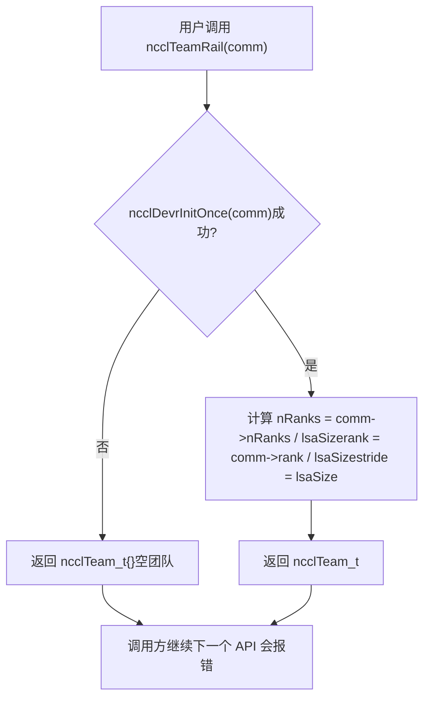
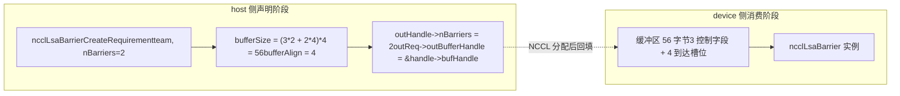
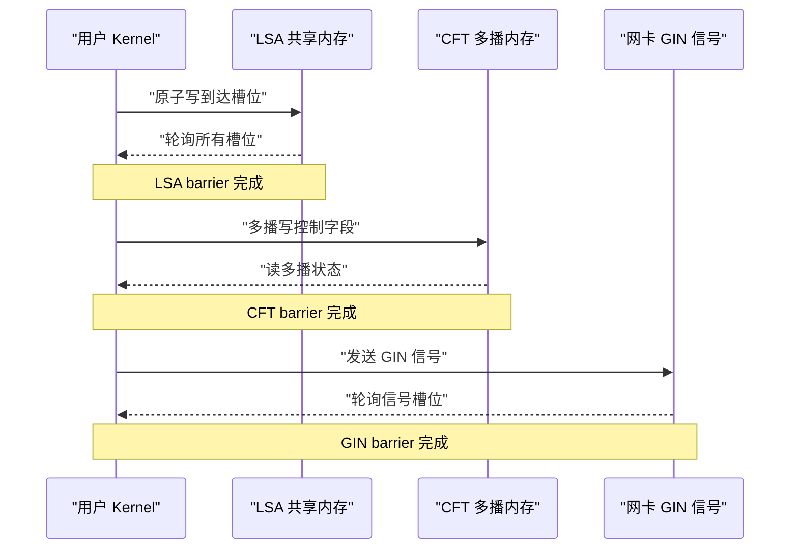
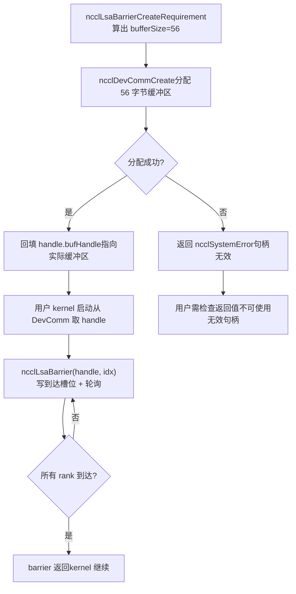
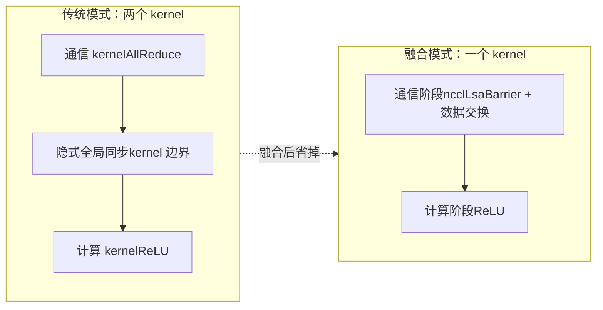

# 第 20 章：デバイス側ネイティブ API とオペレータ融合：nccl_device と kernel fusion の実践

前章では、devcommがhost側のncclCommのメタデータをどのようにバージョン管理しながらデバイス側にマッピングし、カーネルがrank、アドレス、接続状態を読み取れるようにするかを明らかにしました。しかし「メタデータを読める」ことと「通信を開始できる」ことは別問題です。メタデータだけでは、ユーザーカーネルはせいぜい自分でアドレスを計算し、自分でフラグを書き込む程度しかできません。rank間の同期やマシン間のシグナル伝達が必要になれば、やはりhost側でncclAllReduceなどの集合APIを呼び出す必要があり、そのような呼び出しのたびにカーネル起動とhost-device間の往復が発生します。本章で解き明かすsrc/nccl_deviceディレクトリこそ、NCCLが「呼び出されるライブラリ」から「プログラミング可能なモデル」へと進む鍵です。ここで提供されるのは新しい集合通信アルゴリズムではなく、デバイス側プリミティブのセットです。ユーザー自身のカーネル内部でncclBarrier、ncclLsaBarrier、ncclGinBarrierといった同期操作を呼び出せるようにし、「通信」と「計算」を同一カーネルに詰め込み、中間の起動オーバーヘッドを省きます。本章のソース資料は、このプリミティブ群のhost側における要件宣言（CreateRequirement）とチーム（Team）抽象に焦点を当てており、これがデバイス側APIの入口です。本章を理解する上での重要な前提：デバイス側APIの設計哲学は「host側でリソース要件を宣言し、device側でリソースを消費する」ことです。host側はbarrierを直接作成せず、NCCLに「nBarriers個のbarrierが必要で、チームにはteam.nRanks人のメンバーがいる」と伝え、NCCLはそれに基づいて必要なバッファ数とGINシグナル数を計算し、device側でこれらのリソースをインスタンス化します。この「宣言-消費」の分離が、デバイス側コードがhostポインタなしで動作できる根本的な理由です。

# 一、Team抽象：デバイス側APIの座標系

## 直感的モデル

多国籍企業の組織構造を想像してください。メールを送るには、まず「誰に送るか」を知る必要があります——全社（World）に送るのか、同じオフィスの同僚（LSA）に送るのか、それとも同じ事業ラインのクロスオフィスチーム（Rail）に送るのか。`ncclTeam_t`これが「受信者範囲」の記述子です。Team抽象がなければ、各デバイス側APIが「自分はこの通信ドメインで何番目か、全部で何人いるか」を毎回再計算しなければならず、コードは重複しエラーが起きやすくなります。

## データ構造とメモリレイアウト

`ncclTeam_t`はデバイス側APIの座標系であり、その3つのフィールドが定義するのは**等差数列**：

| フィールド | 意味 | 類推 |
| --- | --- | --- |
| `nRanks` | チーム内のメンバー総数 | グループに何人いるか |
| `rank` | 現在のrankのチーム内番号 | グループ内での自分の番号 |
| `stride` | チーム内の隣接メンバーのworldにおける歩長 | グループ内の隣り合う2人の学籍番号の差 |

`stride`は最も見落とされやすいが最も重要なフィールドです。Worldチームでは`stride = 1`、すべてのrankが連続して並んでいるためです。しかしRailチームでは`stride = lsaSize`、同じrail上のrankはworld内で`lsaSize`個ごとにしか現れないためです。

[FACT:src/nccl_device/core.cc:13-19]はWorldチームの構築を示しています：直接`comm->nRanks`と`comm->rank`，`stride`を1に固定します。これは`ncclDevrInitOnce`を必要としない唯一のチームです。その情報はすべてhost側の`comm`にあるためです。

[FACT:src/nccl_device/core.cc:22-33]はLSAチームです。L26の`ncclDevrInitOnce(comm)`に注意——これはデバイス側リソース初期化の冪等な入口です。L23-25のコメントは非常に重要です：**ここでは意図的にエラーを無視する**。初期化に失敗した場合、返されるteamは「ゴミ値」ですが、次に本当にリソースを必要とするAPI呼び出しが再び`ncclDevrInitOnce`をトリガーし、エラーを報告します。これは「遅延エラー報告」戦略であり、チーム照会のような軽量操作で重いエラーを投げるのを避けます。

## シナリオ駆動Walkthrough：WorldからRailへの座標変換

8カードマシンを仮定し、`lsaSize = 4`（4カードごとに1つのLSAドメイン）、`nRanks = 8`。次に`ncclTeamRail`がどのように構築されるかを見てみましょう：

[FACT:src/nccl_device/core.cc:70-79]において、`nRanks = 8 / 4 = 2`，`rank = comm->rank / 4`，`stride = 4`。現在のrankが5なら、Railチーム内での`rank = 5 / 4 = 1`，`stride = 4`、つまりRailチームのメンバーはworld内のrank 1とrank 5です。

次に`ncclTeamRankToWorld`の換算公式を見てみましょう：

[FACT:src/nccl_device/core.cc:82-84]の`comm->rank + (rank - team.rank) * team.stride`は**相対オフセット**計算です：まず目標rankの現在rankに対するチーム内オフセット`(rank - team.rank)`を算出し、次に歩長`stride`を掛け、現在rankのworld番号を加えます。この公式はすべてのチームに通用します。なぜなら`stride`がすでにチームの配列規則をエンコードしているからです。

`ncclTeamRankToLsa`は異なります：

[FACT:src/nccl_device/core.cc:87-92]は`comm->devrState.lsaSelf + (rank - team.rank) * team.stride`を使います。ここで`lsaSelf`ではなく`comm->rank`を使っていることに注意——LSA番号はデバイス側リソース初期化後に初めてわかるもので、world rankと異なる可能性があるためです。

この図は「遅延エラー報告」戦略の実行パスを明らかにしています：初期化失敗時は空のチームを返しますが、呼び出し元を中断しません。エラーは次に本当にリソースを必要とするAPI（`ncclLsaBarrierCreateRequirement`など）で露呈します。

## 設計上の考察と落とし穴

**なぜ`ncclTeamWorld`は`ncclDevrInitOnce`？**を呼び出さないのか？Worldチームの情報は完全にhost側から来るためです`comm`デバイス側リソースは一切不要です。無理に呼び出すと、純粋なhostクエリ操作がデバイス側の初期化に依存することになり、不要な失敗ポイントが増えます。

**ハマりポイント**：`ncclTeamRankToLsa`初期化失敗時に返す`-1`（[FACT:src/nccl_device/core.cc:87-92]）、一方で`ncclTeamRankToWorld`は決して失敗しません。呼び出し側がこれら2つの関数を混用し、戻り値をチェックしない場合、LSA初期化失敗時に`-1`を正当なrankとして使用し、範囲外アクセスを引き起こす可能性があります。本番コードでは`ncclTeamRankToLsa`の戻り値を失敗しうる操作として扱うべきです。

---

# 二、Barrier要件宣言：host側がデバイスリソースを「予約」する方法

## 直感的モデル

デバイス側APIのリソース割り当ては**会議室の予約**のようなものです：会議室に直接飛び込んで会議を始めることはできず、まず受付（host側の`CreateRequirement`）に申請を提出する必要があります——「会議を3回、各8名で開催したい」。受付はそれに基づいて必要な広さ（`bufferSize`）、必要な椅子の数（`ginSignalCount`）を計算し、会場番号（`outBufferHandle`）を渡します。この予約メカニズムがなければ、デバイス側kernelは自分のbarrierバッファがどこにあり、どれくらいの大きさかを知ることができず、安全に読み書きできません。

## データ構造とメモリレイアウト

3つのbarrierの`CreateRequirement`関数は同じパターンを共有しています：**要件構造体をゼロクリア → バッファサイズ/アラインメントを設定 → 出力ハンドルポインタを設定**。ただし、リソースタイプは異なります：

| Barrierタイプ | リソースタイプ | サイズ計算式 | アラインメント |
| --- | --- | --- | --- |
| LSA Barrier | バッファ | `(3*n + n*team.nRanks) * sizeof(uint32_t)` | `alignof(uint32_t)` |
| CFT Barrier | バッファ | `(3*n + n*team.nRanks) * NCCL_CFT_BARRIER_GRAN` | `NCCL_CFT_BARRIER_ALIGN` |
| GIN Barrier | GINシグナル | `n * team.nRanks`個のシグナル | バッファは関与しない |

まずLSA Barrierのサイズ計算式を見てみましょう：

[FACT:src/nccl_device/lsa_barrier.cc:14-22]の`(3 * nBarriers + nBarriers * team.nRanks) * sizeof(uint32_t)`は2つの部分に分解できます：

- `3 * nBarriers`：各barrierには3つの`uint32_t`の制御フィールドが必要です（[INFERENCE] 通常は「到達カウント」「ラウンド」「状態フラグ」）。
- `nBarriers * team.nRanks`：各barrierにはチーム内の各メンバー用に1つの`uint32_t`の到達スロットを確保する必要があります。

したがって、単一barrierの総サイズは`3 + team.nRanks`個の`uint32_t`です。この計算式はLSAとCFTで完全に一致していますが、CFTは`NCCL_CFT_BARRIER_GRAN`を粒度単位として使用しています（より大きな境界にアラインするためと思われます）。

GIN Barrierはまったく異なります：

[FACT:src/nccl_device/gin_barrier.cc:14-20]はバッファを割り当てず、`ginSignalCount = nBarriers * team.nRanks`を設定し、`outGinSignalStart`をハンドル内の`signal0`にポイントします。これはGIN barrierがネットワークシグナルパスを通るため、共有メモリバッファは不要で、NICが認識できるシグナルスロットが必要だからです。

## シナリオ駆動Walkthrough：1回のLSA Barrierの完全な予約

ユーザーが4カードのLSAチーム上に2つのbarrierを作成するとします：

1. **呼び出し** `ncclLsaBarrierCreateRequirement(team, 2, &handle, &req)`。

2. **ゼロクリア**：`memset(outReq, 0, sizeof(*outReq))`（[FACT:src/nccl_device/lsa_barrier.cc:14-22]）——未設定のフィールドが確定値であることを保証し、呼び出し側がスタック上のゴミを読むのを防ぎます。

3. **barrier数を記録**：`outHandle->nBarriers = 2`（[FACT:src/nccl_device/lsa_barrier.cc:14-22]）。

4. **バッファサイズを計算**：`(3*2 + 2*4) * 4 = (6 + 8) * 4 = 56`バイト（[FACT:src/nccl_device/lsa_barrier.cc:14-22]）。

5. **アラインメントを設定**：`alignof(uint32_t) = 4`（[FACT:src/nccl_device/lsa_barrier.cc:14-22]）。

6. **ハンドルポインタを書き戻し**：`outReq->outBufferHandle = &outHandle->bufHandle`（[FACT:src/nccl_device/lsa_barrier.cc:14-22]）——NCCLが実際にバッファを割り当てた後、アドレスをハンドルに書き戻せるようにします。

このデータフロー図は「宣言」と「消費」の分離を示しています：host側はサイズとポインタを計算するだけで、実際のバッファ割り当てとインスタンス化はNCCL内部で行われ、device側kernelが受け取るのはすでに埋められたハンドルです。

## 設計上の考察とハマりポイント

**なぜ`memset`で`outReq`？**全体をゼロクリアするのか`ncclDevResourceRequirements_t`は複数フィールドの構造体であり、barrierタイプごとに一部のフィールドしか埋めないからです。ゼロクリアにより未使用フィールド（LSA barrierでは使わない`ginSignalCount`など）が0になり、NCCL内部はそれに基づいて「このリソースは不要」と判断します。ゼロクリアしないと、スタック上のランダムな値が「GINリソースが必要」と誤認され、前章で述べた誤検出問題を引き起こす可能性があります。

**ハマりポイント**：`outReq->outBufferHandle = &outHandle->bufHandle`はハンドル内部フィールドのアドレスをNCCLに渡しました。これは`outHandle`がNCCLのバッファ割り当て完了まで有効でなければならない（スタックに回収されたり移動されたりしてはいけない）ことを意味します。ユーザーが`outHandle`を早期に解放されるスコープに置くと、NCCLの書き戻し時にダングリングポインタに書き込むことになります。

> **[Design Inference & Architectural Trade-offs]**
> **CFT Barrierの粒度の違い**：[FACT:src/nccl_device/cft_barrier.cc:13-21]は`NCCL_CFT_BARRIER_GRAN`と`NCCL_CFT_BARRIER_ALIGN`でLSAの`sizeof(uint32_t)`と`alignof(uint32_t)`を置き換えています。これはCFT（Cross-Fabric Teamまたは同様のクロスドメインチームと思われる）のbarrierがより大きなアラインメント粒度を必要とすることを示しており、マルチキャストメモリ領域を跨ぐため、ハードウェアがアドレスアラインメントに対してより厳格な要件を持つためと思われます。

---

# 三、3つのBarrierのセマンティックな役割分担：LSA、CFT、GINがそれぞれ何を担うか

## 直感的モデル

3つのbarrierは3つの異なる範囲の「集合ラッパ」のようなものです：

- **LSA Barrier**：同じオフィス内の同僚の集合、共有メモリを通り、最速。
- **CFT Barrier**：オフィスを跨ぐが同じ建物内の集合、マルチキャストメモリを通り、中速。
- **GIN Barrier**：都市を跨ぐ、あるいは国を跨ぐ集合、ネットワークシグナルを通り、最遅だがカバレッジは最も広い。

barrierタイプを間違えてもエラーにはなりませんが、巨大な性能損失をもたらします——GIN barrierで同じオフィスの同期を行うのは、隣の席のファイルを国際宅配便で送るようなものです。

## データ構造とメモリレイアウトの比較

host側の要件宣言から見ると、3つのリソース要件はまったく異なります：

| 次元 | LSA Barrier | CFT Barrier | GIN Barrier |
| --- | --- | --- | --- |
| 必要`comm`パラメータ | いいえ | いいえ | はい |
| バッファ | あり | あり | なし |
| GINシグナル | なし | なし | あり |
| サイズ単位 | `uint32_t` | `NCCL_CFT_BARRIER_GRAN` | シグナル数 |
| 出力ハンドルフィールド | `bufHandle` | `bufHandle` | `signal0` |

GIN Barrierだけが`comm`パラメータを必要とすることに注意してください：

[FACT:src/nccl_device/gin_barrier.cc:14-20]の関数シグネチャには`ncclComm_t comm`が含まれますが、LSAとCFTのシグネチャには`ncclTeam_t team`。これは GIN シグナルが特定のネットワーク接続にバインドされる必要があり、ネットワーク接続情報が`comm`にあるためです。

## シナリオ駆動 Walkthrough：GIN Barrier のシグナル割り当て

[FACT:src/nccl_device/gin_barrier.cc:14-20]のロジックは LSA より単純ですが、セマンティクスはより微妙です：

1. **クリア**：`memset(outReq, 0, sizeof(*outReq))`（L16）。

2. **シグナル数の設定**：`outReq->ginSignalCount = nBarriers * team.nRanks`（L17）——各 barrier はチーム内の各メンバーにシグナルスロットを1つ割り当てる必要があります。

3. **シグナル開始ポインタの書き戻し**：`outReq->outGinSignalStart = &outHandle->signal0`（L18）——ここでは`bufferSize`が設定されていないことに注意してください。GIN barrier は共有メモリバッファを使用しないためです。

> **[Design Inference & Architectural Trade-offs]**
> `signal0`この名前は、ハンドル内に連続したシグナルフィールドのグループがあることを示唆しています（`signal0`, `signal1`, ...），`outGinSignalStart`が最初のものを指し、NCCL はこれに基づいて`nBarriers * team.nRanks`個のシグナルの割り当てをどこから開始するかを知ります。

## 並行制御とハードウェア相互作用

3種類の barrier の並行制御メカニズムは完全に異なります：

- **LSA Barrier**：共有メモリベースのアトミック操作。`3 + team.nRanks`個の`uint32_t`において、到達スロットはアトミック加算またはアトミック書き込みで「到着した」ことをマークし、制御フィールドはアトミック読み取りで「全員が到着したか」をチェックします。これは純粋な GPU 内同期であり、ネットワークは関与しません。
- **CFT Barrier**：マルチキャストメモリ（multimem）ベース。[INFERENCE] マルチキャストメモリは1回の書き込み操作で複数の rank のビューを同時に更新できるため、CFT barrier はより少ない制御フィールドでより広範な同期を実現できる可能性があります。
- **GIN Barrier**：ネットワークシグナルベース。`ginSignalCount`個のシグナルが NIC を通じて送信され、受信側はシグナルスロットをポーリングします。これはクロスマシンハードウェアが関与する唯一の barrier です。

このシーケンス図は、3種類の barrier のハードウェア相互作用階層を示しています：純粋な GPU 内同期から、マルチキャストメモリ、そして NIC シグナルへと、レイテンシは順に増加し、カバレッジ範囲も順に拡大します。

## 設計上の考察と落とし穴

**なぜ LSA と CFT は`comm`パラメータを必要としないのか？**それは、それらのリソース（共有メモリ、マルチキャストメモリ）が既に`ncclDevrInitOnce`段階でチームにバインドされており、`team`自体がリソース位置情報を暗黙的に含んでいるためです。一方、GIN シグナルはネットワークリソースを動的に割り当てる必要があり、`comm`を通じてネットワーク接続状態にアクセスする必要があります。

**落とし穴**：GIN Barrier の`ginSignalCount`は`nBarriers * team.nRanks`です。チームが非常に大きく（例：1024 rank）、barrier が多い（例：100個）場合、シグナルの総数は102400に達します。NIC のシグナルスロットは限られたリソースであり、過剰な要求は`ncclDevrInitOnce`の失敗を引き起こす可能性があります。本番コードは、大量の予備を一度に要求するのではなく、実際に必要な最小限の barrier 数に基づいて要求すべきです。

---

# 四、要件宣言からデバイス側消費まで：完全なライフサイクル

## 直感モデル

`CreateRequirement`は単なる「注文」であり、実際の「発送」と「受領」は NCCL 内部とデバイス側 kernel で発生します。ライフサイクル全体は**オンラインショッピング**のようです：あなたが注文（CreateRequirement）→ 商家が在庫準備（NCCL がリソース割り当て）→ 宅配便が配達（リソースが DevComm にバインド）→ あなたが受け取って使用（デバイス側 kernel が barrier を呼び出し）。

## データ構造とメモリレイアウト：ハンドルのフィールド進化

を例にとると、ライフサイクル中に3つの段階を経ます：`ncclLsaBarrierHandle_t`段階

| その他のフィールド | `nBarriers` | `bufHandle` | CreateRequirement 後 |
| --- | --- | --- | --- |
| 設定済み | アドレスは書き戻し済みだが、内容は未割り当て | 未設定 | NCCL 割り当て後 |
| 設定済み | 実際のバッファを指す | 設定済み | デバイス側使用 |
| 読み取り専用 | 読み取り専用 | 読み取り専用 | が |

[FACT:src/nccl_device/lsa_barrier.cc:14-22]を設定し、`nBarriers`，[FACT:src/nccl_device/lsa_barrier.cc:14-22]が`bufHandle`のアドレスを書き戻します。これら2つの操作の間で、NCCL 内部がバッファの実際の割り当てを完了します。

## シナリオ駆動 Walkthrough：1回の完全な barrier 使用

1. **Host 側宣言**：ユーザーが`ncclLsaBarrierCreateRequirement(team, 2, &handle, &req)`を呼び出し、`req.bufferSize = 56`。

2. **を取得**Host 側提出`req`：ユーザーが`ncclDevCommCreate`を`handle.bufHandle`。

3. **に渡し（前章の内容）、NCCL が56バイトのバッファを割り当て、アドレスを**に書き込みます`handle`デバイス側初期化`bufHandle`：ユーザー kernel 起動時に、DevComm から

4. **を取り出し、**でバッファを特定します。`ncclLsaBarrier(handle, barrierIndex)`デバイス側同期

5. **：kernel が**を呼び出し、バッファの対応するスロットに到達マークを書き込み、他のスロットをポーリングします。

：全 rank が到達すると、barrier が戻り、kernel が実行を継続します。`ncclLsaBarrierCreateRequirement`コピー`ncclSuccess`（[FACT:src/nccl_device/lsa_barrier.cc:14-22]この決定図は、宣言から使用までの完全なパスと、割り当て失敗時のエラーブランチを示しています。注意：

## 自体は常に

を返し）、実際の失敗は後続のリソース割り当て段階で発生します。**並行制御とハードウェア相互作用**デバイス側 barrier の並行制御の核心は

- **アトミック操作 + メモリバリア**です。LSA barrier を例にとると：
- **到達段階**：各 rank はアトミック書き込み（またはアトミック加算）で自身の到達スロットを更新します。このステップは release セマンティクスを使用する必要があり、barrier 前のすべてのメモリ操作が他の rank に可視であることを保証します。
- **ポーリング段階**：各 rank はアトミック読み取り（または volatile 読み取り）ですべてのスロットをチェックします。このステップは acquire セマンティクスを使用する必要があり、「全員が到着した」ことを確認した後、他の人々が barrier 前に書き込んだデータを読み取れることを保証します。

> **[Design Inference & Architectural Trade-offs]**
> `3 * nBarriers`個の制御フィールドは、まさにこのような「ラウンド」問題を処理するために使われる可能性が高い。1つのフィールドは現在のラウンドを記録し、1つのフィールドは到達カウントを記録し、1つのフィールドはリセットフラグとして機能する。これにより、複数のbarrierが同じスロット群を再利用してもラウンドが混同されない。

## 本番環境の落とし穴回避ガイド

**落とし穴1：ハンドルのライフサイクル管理**。`outReq->outBufferHandle = &outHandle->bufHandle`ハンドル内部フィールドのアドレスをNCCLに渡している。もしユーザーが`ncclDevCommCreate`が返る前に`outHandle`を破棄すると、NCCLが書き戻す際に解放済みメモリへ書き込むことになる。正しい方法は、`outHandle`のライフサイクルを、それを生成した関数スコープではなくDevCommにバインドすることである。

**落とし穴2：barrier数とチームサイズの積**。`bufferSize = (3*n + n*team.nRanks) * sizeof(uint32_t)`において、`n*team.nRanks`項は大規模チームでサイズを支配する。1024ランク、100barrierでは`100*1024*4 = 409600`バイト、約400KBが必要となる。各ランクがこれだけを要求すると、VRAMプレッシャーは無視できない。総barrier数ではなく、実際に同時使用するbarrier数に応じて要求すべきである。

**落とし穴3：GIN barrierのシグナル枯渇**。GINシグナルはNICリソースであり、数には限りがある。複数のDevCommが同時に大量のGINシグナルを要求すると、NICスロットが枯渇する可能性がある。本番コードでは、DevComm作成失敗時にGINシグナル不足かどうかを確認し、`nBarriers`を減らすかLSA barrierへの切り替えを検討すべきである。

**落とし穴4：初期化失敗の遅延露呈**。`ncclTeamLsa`などの関数は`ncclDevrInitOnce`失敗時に空チーム（[FACT:src/nccl_device/core.cc:22-33]）を返し、エラーを報告しない。ユーザーコードが後続APIの戻り値をチェックしない場合、空チーム上で操作を続行し、特定が困難なエラーを引き起こす可能性がある。デバイス側APIを初めて使用する際に、チームの有効性を明示的にチェックすることを推奨する（例：`team.nRanks > 0`）。

---

# 五、カーネル融合：なぜ通信と計算を1つのkernelに詰め込むのか

## 直感的モデル

従来のモードでは、1回の「AllReduce + 活性化関数」に2つのkernelが必要である。1つは通信、1つは計算を行う。2つのkernel間には暗黙的なグローバル同期がある——通信kernelが完全に終了しないと、計算kernelは開始できない。これはまるで**リレー競走**のようだ：第1走者が走り終えたらバトンを第2走者に渡さなければならず、受け渡しの瞬間は両者とも待っている。カーネル融合は、同じkernelで通信と計算の両方を実行させることで、**走りながら靴を履き替える**ように、受け渡しの待ち時間を省く。

## データ構造とメモリレイアウト

カーネル融合の鍵は、通信プリミティブ（barrierなど）と計算ロジックが同じkernelのレジスタと共有メモリを共有することにある。これは以下を意味する：

- **レジスタプレッシャー**：通信プリミティブのアトミック操作とポーリングループがレジスタを消費し、計算ロジックのレジスタ予算を圧迫する。
- **共有メモリ競合**：LSA barrierのバッファを共有メモリに置くと、計算ロジックの共有メモリ需要と競合する。
- **Occupancyへの影響**：融合kernelのoccupancyは通常、純粋な計算kernelより低い。通信プリミティブが追加リソースを必要とするためである。

> **[Design Inference & Architectural Trade-offs]**
> デバイス側APIの設計（host側でリソースを宣言し、device側で消費する）は、まさにこれらのプレッシャーを緩和するためである：リソースはhost側で事前に割り当てられ、device側kernelは読み書きするだけでよく、動的確保が不要なため、レジスタ占有が減少する。

## シナリオ駆動Walkthrough：融合kernelの実行フロー

ユーザーが「AllReduce + ReLU」の融合kernelを書くと仮定する：

1. **Host側の準備**：`ncclLsaBarrierCreateRequirement`を呼び出してbarrierを要求し、`ncclDevCommCreate`を呼び出してリソースを割り当てる。

2. **Kernel起動**：ユーザーkernelはDevCommとbarrierハンドルを引数として受け取る。

3. **通信フェーズ**：kernel内で`ncclLsaBarrier`を呼び出して全ランクを同期し、その後各ランクがデータを交換する（対称メモリを介した直接読み書き）。

4. **計算フェーズ**：同期完了後、kernelはローカルデータに対して直接ReLUを実行し、追加のkernel起動は不要である。

5. **完了**：kernelが終了し、host側は追加の通信kernelを待つ必要がない。

この比較図は融合の核心的メリットを示している：kernel境界での暗黙的なグローバル同期を省くことである。従来のモードでは、この同期のコストは2回のkernel起動のレイテンシにGPUパイプラインの排出を加えたものである。

## 設計上の考察と落とし穴

**なぜデバイス側APIは「融合AllReduce」を直接提供しないのか？**融合の具体的な形式はユーザーの計算ロジックに依存するためである。NCCLが提供するのは**プリミティブ**（barrier、シグナル、対称メモリアクセス）であり、**完成品**（融合AllReduce+ReLU）ではない。ユーザーはこれらのプリミティブを自分で組み合わせて、自身のニーズに合った融合kernelを実装する必要がある。これが「プログラミングモデル」と「ライブラリ」の本質的な違いである。

**落とし穴ポイント**：融合カーネルのデバッグ難易度は分離カーネルよりはるかに高い。barrier ロジックにバグがあると、カーネルがハング（デッドロック）する可能性があり、GPU カーネルのハングはホストプロセスのハングのように簡単には診断できない。融合カーネルにタイムアウト機構を追加するか、まず小規模なチームで barrier ロジックを検証することを推奨する。

**落とし穴ポイント**：融合カーネルの occupancy 低下により、計算性能の損失が通信節約の利益を上回る可能性がある。融合を決定する前に、通信レイテンシの低減だけを見るのではなく、融合前後のエンドツーエンド時間を測定すべきである。

# 本章の考察とセルフチェック

Q1：もし`ncclTeamLsa`の L26 の`ncclDevrInitOnce`呼び出しを削除し、直接`comm->devrState.lsaSize`と`lsaSelf`を返した場合、どのようなシナリオでデバイス側カーネルが誤ったチーム情報を読み取るか？

**参考解析**：`ncclDevrInitOnce`はデバイス側リソース初期化の冪等エントリポイントである。これを削除すると、`comm->devrState.lsaSize`と`lsaSelf`はまだ初期値（通常は 0 または未定義）のままである可能性がある。デバイス側 API を初めて使用するシナリオでは、ユーザーが`ncclTeamLsa`を呼び出すと`nRanks = 0`の空チームを取得する。その後、ユーザーがチームの有効性をチェックせずに、このチームで直接`ncclLsaBarrierCreateRequirement`を呼び出すと、`bufferSize = (3*n + n*0) * 4 = 12n`バイトを計算する——実際に必要な量より少ない。なぜなら`n*team.nRanks`項が 0 になるからである。これによりバッファオーバーフローが発生する：barrier ランタイムは`team.nRanks`個の到達スロットに書き込もうとするが、バッファには`3n`個の`uint32_t`の空間しか割り当てられていない。さらに隠蔽的なのは、もし`lsaSelf`も 0 の場合、`ncclTeamRankToLsa`は誤った rank 番号を返し、barrier の到達スロットが誤った位置に書き込まれ、すべての rank が到達するのを永遠に待てなくなり、カーネルがハングする可能性がある。これはまさに L23-25 のコメントにある「ゴミ値を返し、次の API がエラーを報告する」戦略が防ごうとしている状況である——ただし、次の API が実際にエラーを報告し、誤ったサイズを黙って使用しないことが前提である。

Q2：`ncclLsaBarrierCreateRequirement`のサイズ公式は`(3*nBarriers + nBarriers*team.nRanks) * sizeof(uint32_t)`である。チームに 8 つの rank があり、ユーザーが 1 つの barrier を申請すると、バッファは 44 バイトである。barrier 実装における「3 つの制御フィールド」がそれぞれ「到達カウント」「ラウンド」「リセットフラグ」であると仮定して、推論せよ：8 つの rank が同時に到達したとき、もし「到達カウント」が非アトミックな`++`操作を使用した場合、何が起こるか？

**参考解析**：非アトミックな`++`は GPU 上では「読み取り-変更-書き込み」の 3 ステップであり、アトミック操作ではない。8 つの rank が同時に`count++`を実行すると、複数の rank が同じ古い値（例えばすべて 0）を読み取り、その後すべてが 1 を書き戻す可能性がある。最終的に`count`は 8 ではなく 1 しか増加せず、barrier は永遠に「まだ全員揃っていない」と認識し、すべての rank がポーリング段階で無限ループに陥る。これが、LSA barrier の到達スロットがアトミック操作（例えば`atomicAdd`）または各 rank が独自の独立したスロットに書き込む（`nBarriers * team.nRanks`項はまさに各 rank に独立したスロットを予約するためのもの）必要がある理由である。もし「各 rank が独自のスロットに書き込む」方式を採用すれば、アトミック加算は不要で、アトミック書き込み + メモリバリアのみが必要である。なぜなら各スロットには書き込み者が 1 人だけだからである。これはまた、サイズ公式に`nBarriers * team.nRanks`項がある理由も説明する——空間と引き換えにアトミック性を得て、複数書き込み者の競合を避けるのである。

Q3：`ncclGinBarrierCreateRequirement`は`comm`パラメータを必要とするが`ncclLsaBarrierCreateRequirement`は必要としない。もし無理に LSA barrier にも`comm`パラメータを追加した場合（インターフェース統一のためと仮定）、どのような設計問題が生じるか？逆に、GIN barrier から`comm`パラメータを削除した場合、どのようなシナリオで失敗するか？

**参考解析**：LSA barrier に`comm`パラメータを追加する問題は、不必要な依存関係を導入することである。LSA barrier のリソース（共有メモリ）はすでに`ncclDevrInitOnce`段階でチームにバインドされており、`team`自体がリソースの位置を暗黙的に示している。`comm`を追加すると、純粋なチーム操作が通信ドメインの状態に依存し、失敗点が増える（例えば`comm`が無効な場合 LSA barrier も作成できない）。また「最小権限」の原則に違反する。逆に、GIN barrier から`comm`パラメータを削除すると失敗する。なぜなら GIN シグナルは特定のネットワーク接続にバインドされる必要があるからである。`ncclGinBarrierCreateRequirement`の`ginSignalCount`は、どの NIC、どの QP（Queue Pair）にシグナルを送信するかを知る必要があり、これらの情報は`comm`のネットワーク伝送層の状態にある。`comm`がなければ、NCCL はシグナルをどの NIC のスロットに割り当てるべきか決定できず、シグナルがターゲット rank に正しくルーティングされることも保証できない。これはデバイス側 API の設計原則を体現している：**リソース需要の宣言は、それが本当に必要とするコンテキストにのみ依存する**——LSA はチームトポロジのみを必要とし、GIN はネットワーク接続を必要とする。

---

デバイス側 API とカーネル融合は、NCCL を「呼び出すライブラリ」から「プログラミングするモデル」へと変えた。`ncclTeam_t`は座標系を提供し、`CreateRequirement`はリソース予約機構を提供し、3 種類の barrier は共有メモリからネットワークシグナルまでのすべての同期範囲をカバーする。しかし、リソースを宣言し、融合カーネルを書いたからといって、性能が良いとは限らない——barrier の数、チームのサイズ、融合の粒度、その一つ一つの選択がエンドツーエンド性能に影響する。次章では性能チューニングの実践に入り、チューニングパラメータがアルゴリズム選択にどう影響するか、そして実際のベンチマークでチューニング効果をどう検証するかを見ていく。

ここまでで、私たちはdevcommのメタデータマッピングからnccl_deviceのデバイス側プリミティブまでの全過程を歩み終え、NCCLが「hostで宣言し、deviceで消費する」モデルを通じて、ユーザーカーネルがbarrier系の同期操作を直接呼び出し、通信と計算を同一カーネルに融合させる仕組みを見てきた。しかしこれらのメカニズムを把握した後、より現実的な問題が自然に浮かび上がる。実際の訓練タスクで性能が基準に達しない場合、アルゴリズムの選択が不適切なのか、プロトコルが不一致なのか、それともチャネル数の設定が不合理なのかを、どう判断すればよいのか。次章では、前20章のメカニズムを一連の実行可能なチューニング方法論としてまとめ、性能レポート、コストモデル、環境変数を組み合わせて、現象から根本原因への調査パスを示す。
