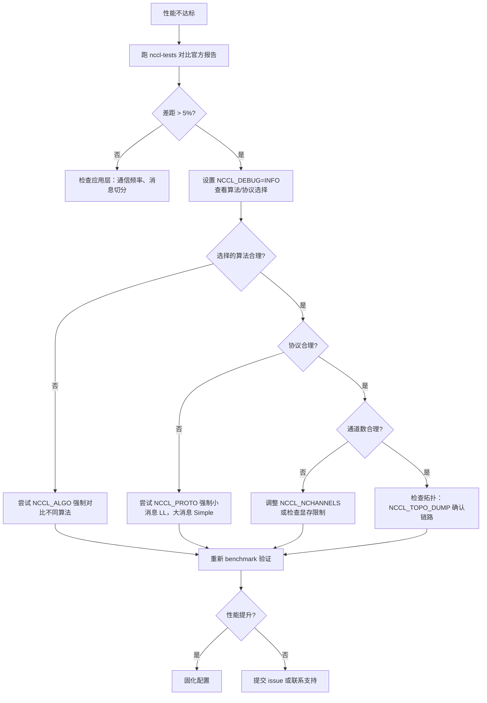

# 第 21 章：性能チューニング実践：tuningの実践、benchmarkツールとチューニング方法論

# 第21章：性能チューニング実践：tuningの実践、benchmarkツールとチューニング方法論

前章では、ユーザー定義カーネルがデバイス側APIとNCCL通信プリミティブを通じてどのように協調し、さらには通信と計算を同一カーネルに融合させるかを見てきた。これはNCCLをプログラミングモデルとして捉える可能性を開いたが、同時に現実的な問題ももたらす。通信性能が期待に達しないとき、どこから手を付けるべきか。NCCLは100以上のNCCL_PARAMを公開しているが、1回の集合通信がどの経路を通るかを実際に決めるのは、実はたった3つのノブだけである。アルゴリズム（Algo）、プロトコル（Proto）、チャネル数（nChannels）だ。本章では、前20章のメカニズムを実行可能な調査パスとしてつなげる。まず性能レポートを見て現象を特定し、次にコストモデルを読んでNCCL自身がどう選択するかを理解し、最後に環境変数とbenchmarkで仮説を検証する。

# 21.1 性能レポート：「正常」のベースラインをまず確立する

チューニングの第一歩はパラメータを変えることではなく、「正常」がどのようなものかを知ることだ。現在のシステムのピーク帯域幅がどれくらいかすら分からなければ、どんなパラメータ調整も当て推量にすぎない。

NCCL公式は`docs/perf`の下で参考性能データを公開しており、その位置づけは非常に明確である。製品レベルの保証ではなく、期待値を揃えるための参照点だ。

[FACT:docs/perf/README.md:3-14]

```
NCCL publishes reference performance data to:

1. Provide reference points that help users align performance expectations.
2. Help users validate their system setup.
3. Reduce repeated requests to the NCCL team for basic performance numbers.

These results are references, and NOT product-level guarantees that the same
performance is achievable on every system. Performance depends on a complex
combination of software versions, system configuration, hardware, and operating
conditions, including factors outside NCCL's control. A difference within 5% is
generally considered acceptable variance due to differences in the underlying
systems.
```

ここには2つの重要な情報があり、初心者が見落としやすい。

第一に、**5%以内の差異は正常な変動である**。これは、公式より3%低い測定結果が出ても、慌ててパラメータを調整しないことを意味する。まず測定ノイズ、GPUクロックの揺らぎ、あるいは隣接タスクの干渉でないかを確認せよ。

第二に、**公式はピーク帯域幅のみを公開し、レイテンシは公開しない**。

[FACT:docs/perf/README.md:24-24]

```
We publish peak bandwidth for a selection of commonly used platforms. We do not
currently publish latency because it is typically more sensitive to factors
outside NCCL's control.
```

> **[Design Inference & Architectural Trade-offs]**
> なぜレイテンシは公開されないのか。レイテンシはシステム状態に極めて敏感だからである。CPU周波数、PCIeリンク状態、NICファームウェアバージョン、さらにはBIOSの電源ポリシーまで影響する。帯域幅は大きなメッセージでは飽和に近づき、比較的安定している。レイテンシは小さなメッセージでは無数の微小な要素が積み重なって生じ、どの一环が揺らいでも増幅される。したがってチューニング時には、**大きなメッセージは帯域幅を見て、小さなメッセージはレイテンシを見る**、これが2つの異なる調査パスである。

[FACT:docs/perf/README.md:24-24]

```
If your workload differs significantly from the published results, open an
issue in the [NCCL repository](https://github.com/NVIDIA/nccl/issues) or contact
NVIDIA Support. We will try our best to help.
```

**調査順序の第一条**：まず標準benchmark（例えば`nccl-tests`の`all_reduce_perf`）を実行し、結果を公式レポートと比較する。差が5%以内なら、システム構成に問題はなく、性能ボトルネックはアプリケーション層（例えば通信頻度、メッセージ分割方式）にある。差が顕著なら、NCCLパラメータのチューニングに進む。

# 21.2 コストモデル：NCCL自身がアルゴリズムとプロトコルをどう選ぶか

パラメータを調整するには、まずNCCLのデフォルトがどう選ばれているかを理解する必要がある。その内部には「コストモデル」があり、本質的にはテーブル参照＋公式計算である。与えられたメッセージサイズ、トポロジタイプ、rank数に対して、各「アルゴリズム×プロトコル」の組み合わせの所要時間を見積もり、最小のものを選ぶ。

## 直感的モデル

コストモデルをナビゲーションソフトのように想像しよう。出発点と終点（メッセージサイズ、トポロジ）を入力すると、内部で各ルート（アルゴリズム/プロトコルの組み合わせ）の時間を見積もり、最速のものを推薦する。ナビの見積もりは履歴データと道路等級に基づき、NCCLの見積もりはハードコードされたレイテンシ/帯域幅パラメータテーブルに基づく。

もしこのモデルがなければ、NCCLはすべてのシナリオで同じ固定アルゴリズムを使うしかない。小さなメッセージは起動オーバーヘッドが大きすぎて遅くなり、大きなメッセージは帯域幅の利用が不十分で遅くなり、システムは両極端で悪い性能を示すだろう。

## データ構造：モデルテーブルとチューニングコンテキスト

コストモデルの中核は`modelMap`配列であり、各要素が1つの「アルゴリズム/プロトコル/対称カーネル」の組み合わせに対応する。

[FACT:src/tuning/cost_model.cc:230-277]

```
static struct ncclTuningModelEntry_t modelMap[] = {
    /*
Initialize default, static models here
{mod_init, mod_sim, mod_final, enabled}
Enable order: Broadcast, Reduce, AllGather, ReduceScatter, AllReduce
*/
  {ncclTuningTreeModelInit, ncclTuningTreeModelSim, nullptr, {0, 0, 0, 0, 1}},       // Tree/LL
  {ncclTuningTreeModelInit, ncclTuningTreeModelSim, nullptr, {0, 0, 0, 0, 1}},       // Tree/LL128
  {ncclTuningTreeModelInit, ncclTuningTreeModelSim, nullptr, {0, 0, 0, 0, 1}},       // Tree/Simple
  {ncclTuningRingModelInit, ncclTuningRingModelSim, nullptr, {1, 1, 1, 1, 1}},       // Ring/LL
  ...
```

各エントリには4つのフィールドがある。`mod_init`（初期化関数）、`mod_sim`（シミュレーション関数）、`mod_final`（クリーンアップ関数）、`enabled`（5つの関数それぞれの有効化フラグ）。`enabled`配列の順序は`{Broadcast, Reduce, AllGather, ReduceScatter, AllReduce}`である。この順序に注意せよ。後でコードを読むときに繰り返し使うことになる。

> **[Design Inference & Architectural Trade-offs]**
> 重要な観察：**TreeはAllReduceでのみ有効化され**（`{0,0,0,0,1}`）、Ringはすべての関数で有効化される（`{1,1,1,1,1}`）。これは、Treeアルゴリズムの利点がAllReduceの還元フェーズを並列化できる点にあるが、AllGather/ReduceScatterのような本質的にリングパイプラインである操作には、Ringの方が自然だからである。

モデルの具体的なパラメータは`ncclTunerConstants_t`にあり、各トポロジーにおける基本レイテンシと帯域幅を含んでいる。

[FACT:src/tuning/cost_model.cc:142-152]

```
static const ncclTunerConstants_t ncclTunerConstantsDefaults = {
    // baseLatencies
  {
    {6.8, 14.0, 8.4},  // Tree
    {6.6, 14.0, 8.4},  // Ring
    {0, 0, 0},         // Collnet Direct
    {0, 0, 0},         // Collnet Chain
    {0, 0, 0},         // NVLS
    {0, 0, 0},         // NVLS Tree
    {8.0, 8.0, 8.0}    // PAT
  },
```

各アルゴリズムには3つの基本レイテンシ値があり、LL / LL128 / Simple の3つのプロトコルに対応している。例えば Ring の`{6.6, 14.0, 8.4}`は、LLプロトコルの基本レイテンシが6.6マイクロ秒、LL128が14.0、Simpleが8.4であることを意味する。これらの数値はNVIDIAが実ハードウェア上で測定した経験値である。

ハードウェアレイテンシはトポロジータイプ（NVLink / PCI / NET）ごとに個別に与えられる。

[FACT:src/tuning/cost_model.cc:153-184]

```
    // hwLatencies
  {
    /* NVLINK */
    {
      {0.6, 1.25, 4.0}, // Tree (LL/LL128/Simple)
      {0.6, 1.9, 3.4},  // Ring (LL/LL128/Simple)
      ...
    },
    /* PCI */
    {
      {1.0, 1.9, 4.0}, // Tree (LL/LL128/Simple)
      {1.0, 2.5, 5.7}, // Ring (LL/LL128/Simple)
      ...
    },
    /* NET */
    {
      {5.0, 8.5, 14},   // Tree (LL/LL128/Simple)
      {2.7, 4.0, 14.0}, // Ring (LL/LL128/Simple)
      ...
    },
  },
```

比較すればトポロジーの違いが分かる。NVLink上のRing/Simpleのホップあたりレイテンシは3.4マイクロ秒、PCI上では5.7、NET上では14.0である。これがクロスホスト通信が遅い理由だ——1ホップごとに10マイクロ秒余分にかかる。

帯域幅パラメータはGPUアーキテクチャの世代ごとに与えられる。

[FACT:src/tuning/cost_model.cc:183-183]

```
    // llMaxBws
  {
    {39.0, 39.0, 20.4}, /* Volta-N1/Intel-N2/Intel-N4) */
    {87.7, 22.5 /*avg of ring & tree*/, 19.0}, /* Ampere-N1/AMD-N2/AMD-N4) */
    {141.0, 45.0 /*avg of ring & tree*/, 35.0}, /* Hopper-N1/AMD-N2/AMD-N4) */
    {2 * 141.2, 2 * 45.0 /*avg of ring & tree*/, 2 * 35.0}, /* Blackwell-N1/AMD-N2/AMD-N4) */
  },
```

各行は1世代のアーキテクチャに対応し、3つの値はそれぞれシングルノード（N1）、デュアルノード（N2）、クアッドノード（N4）シナリオにおけるLLプロトコルの最大帯域幅である。Hopperはシングルノードで141 GB/s、Blackwellは倍の282 GB/s——これが新しいカードで同じアルゴリズムの性能がはるかに良くなる理由を説明している。

## チューニングコンテキスト：per-commの状態

各通信ドメイン（communicator）は`ncclTuningContext_t`を1つ保持し、このcommのチューニング状態を保存する。

[FACT:src/include/tuning.h:81-95]

```
struct ncclTuningContext_t {
  // Persistant tuning parameters tied to a communicator.
  ncclTunerConstants_t tuningConstants;
  // State of the tuning models
  // Forced function is set via env var
  int forced[NCCL_NUM_FUNCTIONS];
  // Disabled tuning models are not execute and excluded from implemetation selection.
  int enabled[NCCL_TUNING_COUNT][NCCL_NUM_FUNCTIONS];
  // Store of model contexts per communicator.
  float generalLatencies[NCCL_NUM_FUNCTIONS][NCCL_NUM_ALGORITHMS][NCCL_NUM_PROTOCOLS];
  float generalBandwidths[NCCL_NUM_FUNCTIONS][NCCL_NUM_ALGORITHMS][NCCL_NUM_PROTOCOLS];

  ssize_t threadThresholds[NCCL_NUM_ALGORITHMS][NCCL_NUM_PROTOCOLS];
  int maxThreads[NCCL_NUM_ALGORITHMS][NCCL_NUM_PROTOCOLS];
};
```

4つの重要なフィールド：

- `forced[NCCL_NUM_FUNCTIONS]`：どの関数が環境変数によってアルゴリズム/プロトコルを強制指定されたかを示す。これが`NCCL_ALGO`/`NCCL_PROTO`が効果を発揮する着地点である。
- `enabled[NCCL_TUNING_COUNT][NCCL_NUM_FUNCTIONS]`：2次元ブールテーブルで、あるモデルがある関数に対して有効かどうかを示す。無効化されたモデルは選択に参加しない。
- `generalLatencies` / `generalBandwidths`：3次元配列で、「関数 × アルゴリズム × プロトコル」ごとに推定レイテンシと帯域幅を格納する。これが`ncclTuningInit`が印刷する大きな表のソースである。
- `threadThresholds` / `maxThreads`：スレッド数に関連する閾値で、各blockが何スレッド使うかを決定する。

## シナリオ駆動Walkthrough：1回のAllReduceのアルゴリズム選択

あなたが`ncclAllReduce`を呼び出し、メッセージサイズ1MB、8カードシングルノードNVLinkだと仮定する。NCCL内部では`ncclTuningInput_t`を構築し、次に`ncclTuningCompute`。

[FACT:src/tuning/tuning.cc:180-202]

```
ncclResult_t ncclTuningCompute(struct ncclTuningInput_t* const input, struct ncclTuningResult_t* const result) {
  ncclResult_t ret = ncclSuccess;
  TRACE(NCCL_TUNING, ...);
  struct ncclTuningResultList_t tunings;
  tunings.head = nullptr;
  struct ncclTuningResult_t bestTuning = NCCL_TUNING_RESULT_INIT;
  // Set tuning to Ring/Simple for single rank case
  if (input->comm->nRanks tuningMask & (1ULL forced = input->comm->tuningContext.forced[input->func];
  NCCLCHECKGOTO(getModelEntry(id, &model), ret, not_valid);
  if (model == nullptr) {
    ret = ncclInternalError;
    goto not_valid;
  }
  if (input->comm->tuningContext.enabled[id][input->func] == 0) {
    goto not_valid;
  }
  if (model->model != nullptr) {
    NCCLCHECKGOTO(model->model(input, result), ret, not_valid);
    if (result->timeUs timeUs = NCCL_TUNING_IGNORE;
  result->valid = 0;
  goto exit;
}
```

に転送する。`not_valid`コピー`timeUs``NCCL_TUNING_IGNORE`、`valid`ラベルの処理に注意：いずれかのステップが失敗すると（モデルが存在しない、無効化されている、シミュレーションが非正の時間を返す）、

を

[FACT:src/tuning/tuning.cc:155-173]

```
static ncclResult_t ncclTuningSelectBestTuning(struct ncclTuningResultList_t* tunings,
                                               struct ncclTuningResult_t* const bestTuning) {
  bestTuning->timeUs = FLT_MAX;
  float bestSelectionTimeUs = FLT_MAX;
  struct ncclTuningResultListNode* node = tunings->head;
  while (node != nullptr) {
    const struct ncclTuningResult_t& tuning = node->result;
    float selectionTimeUs = tuning.selectionTimeUs > 0.0f ? tuning.selectionTimeUs : tuning.timeUs;
    TRACE(NCCL_TUNING, "A/P/S %s/%s/%s, time: %f, selection time: %f", ...);
    if (selectionTimeUs next;
  }
  return ncclSuccess;
}
```

を0に設定する。この候補は以降の選択から除外される。`selectionTimeUs`ステップ4：すべての有効な候補から所要時間が最小のものを選ぶ。`timeUs`。`selectionTimeUs`コピー

## ここに細かい点がある：選択には

```mermaid
flowchart TD
    start["ncclTuningCompute(input, result)"] --> check_ranks{"comm->nRanks |是| single["bestTuning = Ring/SimplenChannels = 0"]
    check_ranks -->|否| all["ncclTuningComputeAllTunings()"]
    all --> loop{"遍历 i in NCCL_TUNING_COUNT"}
    loop -->|mask 未命中| skip["tuning.valid = 0continue"]
    loop -->|mask 命中| expand["ncclTuningExpandId(i, ...)"]
    expand --> sim["ncclTuningComputeTuning()→ ncclTuningCostModelSimModel()"]
    sim --> sim_check{"enabled[id][func] != 0且 model->model != nullptr?"}
    sim_check -->|否| invalid["timeUs = NCCL_TUNING_IGNOREvalid = 0"]
    sim_check -->|是| push["ncclTuningResultListPushFront()"]
    skip --> loop
    invalid --> loop
    push --> loop
    loop -->|遍历结束| tuner_check{"comm->tuner != NULL?"}
    tuner_check -->|是| plugin["tuner->getCollInfo()覆盖 generalTable"]
    tuner_check -->|否| select["ncclTuningSelectBestTuning()"]
    plugin --> select
    select --> channels["ncclTuningGetChannels()"]
    channels --> eff{"CTAPolicy & EFFICIENCY且 NCCL_ALGO/NCCL_PROTO 未设置?"}
    eff -->|是| nvls["尝试 NVLS 覆盖ncclNvlsRegResourcesQuery()"]
    eff -->|否| done["*result = bestTuning"]
    nvls --> done
    single --> done
```

にフォールバックする。

# は「選択時間」であり、追加のペナルティ項（例えば特定のシナリオで一部のアルゴリズムに追加コストがかかる）を含む可能性がある。これによりコストモデルに「推定時間」と「選択時間」を分離する能力が与えられる。

フローチャート`NCCL_ALGO`、`NCCL_PROTO`、`NCCL_SYM_KERNEL`コピー`parseList`この図はエントリから最終結果までの決定パスを完全に描いており、単一rankショートカット、マスクフィルタリング、モデル無効化、tunerプラグインの介入、CTAPolicyの上書きなど、すべての分岐を含んでいる。`enabled`21.3 環境変数：性能に本当に影響する3つのノブ

## コストモデルを理解すれば、環境変数がどのように介入するかが分かる。

`parseList`これら3つの変数は

[FACT:src/tuning/cost_model.cc:14-32]

```
// Parse a map of prefixes to a list of elements. The first prefix is
// optional and, if not present, the list of elements will be applied
// to all prefixes. Only the first list of elements can lack a
// prefix. Prefixes (if present) are followed by a colon. Lists of
// elements are comma delimited. Mappings of prefix to the lists of
// elements are semi-colon delimited.
//
// For example:
//
//     NCCL_ALGO="ring,collnetdirect;allreduce:tree,collnetdirect;broadcast:ring"
// Enable ring and collnetdirect for all functions, then select tree
// and collnetdirect for allreduce and ring for broadcast.
//
//     NCCL_PROTO="LL,Simple;allreduce:^LL"
// Enable LL and Simple for all functions, but everything except LL
// for allreduce.
//
//     NCCL_PROTO="^LL128;allreduce:LL128"
// Enable everything but LL128, but only LL128 for allreduce.
```

テーブルを直接変更し、ユーザーの意図に合わない候補をすべて無効化する。

1. **解析構文**：`NCCL_ALGO="ring,tree"`がサポートする構文は、ほとんどの人が想像するより複雑である。

2. **コピー**：`NCCL_ALGO="ring;allreduce:tree"`3つの使い方：

3. **グローバルリスト**：`NCCL_PROTO="^LL128"`—— すべての関数でringとtreeのみを使う。

`^`関数プレフィックス別

[FACT:src/tuning/cost_model.cc:59-67]

```
    int unset, set;
    if (elemList[0] == '^') {
      unset = 1;
      set = 0;
      elemList++;
    } else {
      unset = 0;
      set = 1;
    }
```

除外構文`^`—— LL128以外はすべて有効化。`unset=1`、`set=0`プレフィックスが鍵である——これは「unset」を意味し、デフォルトの全有効からあるオプションを除外する。`unset`コピー`set`。

[FACT:src/tuning/cost_model.cc:69-96]

```
    bool foundPrefix = false;
    for (int p = 0; p minCompCap, comm->maxCompCap, comm->graphs[algo].typeInter,
                          comm->graphs[algo].typeIntra, comm->nRanks, f, algo, comm->minDriverVersion)) {
        comm->tuningContext.enabled[i][f] = 0;
      }
      //  Check the user env vars only for functions that have a forced configuration and not already disabled.
      if (comm->tuningContext.forced[f] == 0 || comm->tuningContext.enabled[i][f] == 0) continue;
      comm->tuningContext.enabled[i][f] = 0;
      TRACE(NCCL_TUNING, "a/p/s %s/%s/%s enabled %d/%d/%d", ...);
      if (((algo != NCCL_ALGO_UNDEF && algoEnable[f * NCCL_NUM_ALGORITHMS + algo] != 0) &&
           (proto != NCCL_PROTO_UNDEF && protoEnable[f * NCCL_NUM_PROTOCOLS + proto] != 0)) ||
          (symKernelId != ncclSymkKernelId_Count && symKernelIdEnable[f * ncclSymkKernelId_Count + symKernelId] != 0)) {
        comm->tuningContext.enabled[i][f] = 1;
      }
    }
```

1. **の行に注意——ユーザーが明示的にある要素を列挙した場合、対応する関数は「強制」とマークされる。このマークは後でコストモデルが自由に選択することを許可するかどうかの判定に使われる。**強制と無効化の相互作用`isLL128Enabled``protoEnable == 2`には、ユーザーの強制と環境変数、プラットフォーム能力の相互作用を処理する重要なロジックがある。

2. **コピー**このロジックの順序は重要である：`forced[f] != 0`まずLL128プラットフォーム能力を処理`enabled[i][f] = 0`）、その後ユーザーがこの組み合わせを許可しているかを確認し、許可されていれば再度有効化する。

`protoEnable`の値には三種類ある：0（ユーザーによる除外）、1（ユーザーによる有効化）、2（ユーザーが言及しておらず、デフォルトで有効）。この三状態設計により、「ユーザーの明示的な要求」と「プラットフォームのデフォルト」を区別できる。

## 環境変数読み取りのキャッシュ機構

すべての`NCCL_PARAM`マクロは最終的に`ncclLoadParam`。

[FACT:src/misc/param.cc:78-108]

```
int64_t ncclLoadParam(char const* env, int64_t deftVal, int64_t uninitialized, int64_t* cache, int8_t* noCache) {
  static std::mutex mutex;
  std::lock_guard lock(mutex);

  // noCache is only load/stored within the mutex, no need for atomic
  if (*noCache == /*uninitialized*/ -1) ncclGetCachePolicy(env, noCache);

  if (COMPILER_ATOMIC_LOAD(cache, std::memory_order_relaxed) != uninitialized) {
    return COMPILER_ATOMIC_LOAD(cache, std::memory_order_relaxed);
  }

  // Read the environment variable
  const char* str = ncclGetEnv(env);
  int64_t value = deftVal;

  if (str && strlen(str) > 0) {
    errno = 0;
    char* end = nullptr;
    value = strtoll(str, &end, 0);
    // Preserve numeric-prefix parsing while rejecting non-numeric values.
    if (errno || end == str) {
      value = deftVal;
      ATTN("Invalid value %s for %s, using default %lld.", str, env, (long long)deftVal);
    } else {
      INFO(NCCL_ENV, "%s set by environment to %lld.", env, (long long)value);
    }
  }

  if (*noCache == /*cache*/ 0) COMPILER_ATOMIC_STORE(cache, value, std::memory_order_relaxed);
  return value;
}
```

このコードには注目すべき設計がいくつかある：

**グローバルミューテックス**：`static std::mutex mutex`が読み取りプロセス全体を保護する。これは、すべてのパラメータの初回読み取りが直列化されることを意味する。なぜロックを使い、ロックフリーにしないのか？パラメータ読み取りは初期化段階でのみ発生し、ホットパス上にはないため、ロックのオーバーヘッドは無視でき、正確性の方がより重要だからである。

**二重チェック**：まずアトミックに`cache`を読み取り、すでに初期化済みならそのまま返す。これにより、パラメータ読み取りのたびにロックに入ることを避けられる——ロック自体は初期化後ほとんど競合しないが、アトミック読み取りの方が高速である。

**キャッシュ戦略**：`noCache`フラグが、読み取った値を`cache`に書き戻すかどうかを決定する。一部のパラメータ（動的な応答が必要なものなど）はキャッシュを無効化し、毎回環境変数を読み直すことがある。

**エラー処理**：`strtoll`解析失敗時はデフォルト値を使用し、`ATTN`警告を出力する。`end == str`の判定に注意——文字列の先頭が数字でなければ、`end`は`str`と等しくなり、数字がまったく解析されなかったことを示す。

## 設定ファイルのサポート

環境変数は必ずしもシェルから設定する必要はなく、NCCL は設定ファイルからの読み取りをサポートしている。

[FACT:src/misc/param.cc:52-67]

```
static void initEnvFunc() {
  char confFilePath[1024];
  const char* userFile = std::getenv("NCCL_CONF_FILE");
  if (userFile && strlen(userFile) > 0) {
    snprintf(confFilePath, sizeof(confFilePath), "%s", userFile);
    setEnvFile(confFilePath);
  } else {
    const char* userDir = userHomeDir();
    if (userDir) {
      snprintf(confFilePath, sizeof(confFilePath), "%s/.nccl.conf", userDir);
      setEnvFile(confFilePath);
    }
  }
  snprintf(confFilePath, sizeof(confFilePath), "/etc/nccl.conf");
  setEnvFile(confFilePath);
}
```

読み込み順序：`NCCL_CONF_FILE`で指定されたファイル（設定されている場合）→`~/.nccl.conf` → `/etc/nccl.conf`。後に読み込まれたものが先に読み込まれたものを上書きする（`setEnvFile`が`ncclOsSetEnv`）。

[FACT:src/misc/param.cc:69-72]

```
void initEnv() {
  static std::once_flag once;
  std::call_once(once, initEnvFunc);
}
```

`std::call_once`コピー`ncclGetEnv`。

# は設定ファイルが一度だけ読み込まれることを保証する。複数のスレッドが同時に初めて

21.4 チャネル数：過小評価されている性能調整ノブ

## アルゴリズムとプロトコルは「どう進むか」を決め、チャネル数は「いくつの道を開くか」を決める。多くの人はチューニング時に最初の二つだけに注目し、チャネル数を無視する——しかし大メッセージのシナリオでは、チャネル数が帯域幅利用率を決める鍵となることが多い。

`ncclTuningCompute`チャネル数はどこから来るのか`ncclTuningGetChannels`最適なアルゴリズム/プロトコルを選出した後、

[FACT:src/tuning/tuning.cc:233-235]

```
  if (bestTuning.algo != NCCL_ALGO_UNDEF && bestTuning.proto != NCCL_PROTO_UNDEF) {
    NCCLCHECKGOTO(ncclTuningGetChannels(input, &bestTuning), ret, exit);
  }
```

コピー`ncclTuningResult_t`チャネル数の計算ロジックは本章のソース資料にはないが、

[FACT:src/include/tuning.h:42-55]

```
struct ncclTuningResult_t {
  int id;
  int valid;
  float timeUs;
  float selectionTimeUs;
  int algo;
  int proto;
  int symKernelId;
  int ceMethodId;
  int nChannels;
  int maxChannels;
  int nWarps;
  int forced;
};
```

`nChannels`コピー`maxChannels`は最終的に使用されるチャネル数、`nWarps`は上限である。

## は各 block の warp 数である。

CTAPolicy によるチャネル数の上書き`NCCL_CTA_POLICY_EFFICIENCY`戦略を処理する特別なロジックがある。

[FACT:src/tuning/tuning.cc:236-257]

```
  // NCCL_CTA_POLICY_EFFICIENCY requires user (non-symmetric) buffer registration (currently unsupported with MNNVL).
  // Run after GetChannels so bestTuning.nChannels is valid. Skip when a tuner plugin owns selection
  // (same as pre-rearch). The NVLS-bit guard keeps this bias inside the candidate set: a per-call
  // algSelection may have narrowed tuningMask, so EFFICIENCY must not resurrect NVLS when excluded.
  if (input->comm->tuner == NULL && (input->CTAPolicy & NCCL_CTA_POLICY_EFFICIENCY) &&
      ncclGetEnv("NCCL_ALGO") == NULL && ncclGetEnv("NCCL_PROTO") == NULL && !input->comm->MNNVL &&
      (input->tuningMask & (1ull regBuff && (input->func == ncclFuncAllGather || input->func == ncclFuncReduceScatter)) {
      if ((input->comm->nNodes > 1 && input->collNetSupport && input->nvlsSupport) ||
          (input->comm->nNodes == 1 && input->nvlsSupport)) {
        int recChannels;
        NCCLCHECKGOTO(ncclNvlsRegResourcesQuery(input->comm, input->func, &recChannels), ret, exit);
        if (recChannels comm->tuningContext.maxThreads[bestTuning.algo][bestTuning.proto] / WARP_SIZE;
        }
      }
    }
  }
```

このコードのガード条件は非常に密であり、一つずつ読み解く価値がある：

1. `input->comm->tuner == NULL`：tuner プラグインがない場合にのみこの部分を通る。プラグインが選択権を持つ場合、NCCL は介入しない。

2. `input->CTAPolicy & NCCL_CTA_POLICY_EFFICIENCY`：ユーザーが効率優先戦略を設定した。

3. `ncclGetEnv("NCCL_ALGO") == NULL && ncclGetEnv("NCCL_PROTO") == NULL`：ユーザーがアルゴリズム/プロトコルを強制していない。強制している場合はユーザーの選択を尊重する。

4. `!input->comm->MNNVL`：MNNVL シナリオではサポートされない。

5. `input->tuningMask & (1ull << (NCCL_ALGO_NVLS * NCCL_NUM_PROTOCOLS + NCCL_PROTO_SIMPLE))`：NVLS/Simple が候補集合内にある。このガードは排除された選択肢の「復活」を防ぐ。

条件を満たすと、NVLS 登録リソースがサポートできるチャネル数を照会し、現在の選択を超えなければ NVLS アルゴリズムに切り替える。

> **[Design Inference & Architectural Trade-offs]**
> なぜ EFFICIENCY 戦略は NVLS を好むのか？NVLS（NVLink SHARP）はスイッチハードウェアを利用してリダクションを行うため、GPU の計算と通信のオーバーヘッドを削減でき、AllGather/ReduceScatter のような操作でより効率的だからである。しかしそのチャネル数はハードウェアリソースに制限されるため、`ncclNvlsRegResourcesQuery`で実際の利用可能量を照会する必要がある。

## 対称カーネルのフォールバックロジック

対称カーネル（symmetric kernel）は比較的新しい機能であり、利用できない場合は汎用カーネルにフォールバックする必要がある。

[FACT:src/tuning/tuning.cc:258-298]

```
  if ((bestTuning.symKernelId != ncclSymkKernelId_Count ||
       (input->tuningMask & NCCL_TUNING_MASK_SYM_KERNELS && bestTuning.symKernelId == ncclSymkKernelId_Count)) &&
      bestTuning.algo == NCCL_ALGO_UNDEF && bestTuning.proto == NCCL_PROTO_UNDEF) {
    bool isLLKernel = (1 comm->intraRanks > 1 && !ncclParamSingleProcMemRegEnable();
    bool needFallback = bestTuning.symKernelId != ncclSymkKernelId_Count ? false : true;

    // General kernel tuning structs if fallback is needed
    struct ncclTuningResult_t generalTuning = NCCL_TUNING_RESULT_INIT;
    struct ncclTuningInput_t generalInput = *input;
    generalInput.tuningMask = NCCL_TUNING_MASK_GENERAL_KERNELS;

    // Fallback logic for symmetric LL kernels:
    // - If both src and dst are registered, we don't fall back if a symmetric kernel is available.
    // - Otherwise, we have to fall back to generl kernel if running the selected symmetric LL kernel is
    //   not possible (if the buffers are not registered and we manage multiple GPUs).
    // - If the user forced a symmetric kernel via NCCL_SYM_KERNEL or requested preference for using
    //   symmetric kernels even without symmetric buffers via NCCL_SYM_NOWIN_ENABLE, we respect that.
    // - Otherwise, we query the general cost model and if it selects a non-LL proto, we pick that.
    if (bestTuning.symKernelId != ncclSymkKernelId_Count) {
      if (input->winRegType == ncclSymSendRegRecvReg) {
        needFallback = false;
      } else if (isLLKernel) {
        needFallback = isOneThreadMultiGpus && input->winRegType == ncclSymSendNonregRecvNonreg;
        if (!needFallback && !result->forced) {
          needFallback = !ncclParamSymNoWinEnable() && input->winRegType == ncclSymSendNonregRecvNonreg;
          if (!needFallback) {
            NOWARN(ncclTuningCompute(&generalInput, &generalTuning), NCCL_TUNING);
            needFallback = (generalTuning.proto != NCCL_PROTO_LL);
          }
        }
      }
    }
```

フォールバック決定木：

- 送信バッファと受信バッファの両方が登録されている場合（`ncclSymSendRegRecvReg`）、フォールバックしない。
- LL カーネルで、単一スレッドが複数 GPU を管理し、バッファが未登録の場合、フォールバックする。
- ユーザーが`NCCL_SYM_NOWIN_ENABLE`を設定しておらず、バッファが未登録の場合、フォールバックする。
- それ以外の場合、汎用コストモデルを照会し、それが非 LL プロトコルを選んだらフォールバックする。

> **[Design Inference & Architectural Trade-offs]**
> このロジックの核心は：対称 LL カーネルはバッファ登録があってこそ利点を発揮できる。未登録の場合、LL カーネルの利点（低遅延）が余分なアドレス変換オーバーヘッドに相殺される可能性があるため、汎用カーネルにフォールバックする方が得策である。

## 利用可能な組み合わせがない場合のエラー処理

すべての候補が排除された場合、NCCL はエラーを報告し診断情報を出す。

[FACT:src/tuning/tuning.cc:308-329]

```
  if ((bestTuning.algo == NCCL_ALGO_UNDEF || bestTuning.proto == NCCL_PROTO_UNDEF) &&
      bestTuning.symKernelId == ncclSymkKernelId_Count && bestTuning.ceMethodId == ncclCeMethodId_Count) {
    char ncclAlgoEnvStr[1024] = "";
    char ncclProtoEnvStr[1024] = "";
    char ncclSymKernelIdEnvStr[1024] = "";
    const char* symKernelIdEnv = ncclGetEnv("NCCL_SYM_KERNEL");
    if (symKernelIdEnv) {
      snprintf(ncclSymKernelIdEnvStr, 1023, " NCCL_SYM_KERNEL was set to %s.", symKernelIdEnv);
    }
    const char* algoEnv = ncclGetEnv("NCCL_ALGO");
    if (algoEnv) {
      snprintf(ncclAlgoEnvStr, 1023, " NCCL_ALGO was set to %s.", algoEnv);
    }
    const char* protoEnv = ncclGetEnv("NCCL_PROTO");
    if (protoEnv) {
      snprintf(ncclProtoEnvStr, 1023, " NCCL_PROTO was set to %s.", protoEnv);
    }
    WARN("No algorithm/protocol nor symKernelId available for function %s with datatype %s.%s%s%s",
         ncclFuncToString(input->func), ncclDatatypeToString(input->datatype), ncclAlgoEnvStr, ncclProtoEnvStr,
         ncclSymKernelIdEnvStr);
    ret = (algoEnv || protoEnv || symKernelIdEnv) ? ncclInvalidUsage : ncclInternalError;
  }
```

エラーコードの選択には理由がある：ユーザーが環境変数を設定している場合（`algoEnv || protoEnv || symKernelIdEnv`）、`ncclInvalidUsage`を返す——これはユーザーの設定問題である；そうでなければ`ncclInternalError`を返す——これは NCCL 内部の問題である（すべての候補が予期せず排除された）。

# 21.5 本番環境の落とし穴回避ガイド

## 落とし穴一：環境変数のスペルミスによるサイレントフォールバック

`parseList`は認識できないトークンに遭遇すると`ncclInvalidUsage`を返すが、`NCCL_ALGO=RING`（大文字）と書いても、`strcasecmp`は正しくマッチする。本当に危険なのはスペルミスである。例えば`NCCL_ALGO=rnig`。

[FACT:src/tuning/cost_model.cc:87-91]

```
        if (e == nelems) {
          WARN("Unrecognized element token \"%s\" when parsing \"%s\"", elem, str);
          ret = ncclInvalidUsage;
          goto fail;
        }
```

ここでは WARN を出力しエラーを返す。しかし`NCCL_DEBUG=WARN`を有効にしていなければ、この警告が見えない可能性がある。**推奨**：チューニング時は常に`NCCL_DEBUG=WARN`または`NCCL_DEBUG=INFO`を設定し、設定解析の結果を確認できるようにする。

## 落とし穴二：NCCL_ALGO と NCCL_PROTO の相互作用

もし`NCCL_ALGO=tree`を設定して`NCCL_PROTO`を設定しなければ、NCCL は Tree アルゴリズムの下で最適なプロトコルを選ぶ。しかし`NCCL_ALGO=tree`と`NCCL_PROTO=LL`を同時に設定し、Tree/LL の組み合わせが一部の関数で無効化されている場合（例えば Tree は AllReduce でのみ有効）、「利用可能な組み合わせがない」エラーが発生する。

[FACT:src/tuning/cost_model.cc:379-383]

```
      if (((algo != NCCL_ALGO_UNDEF && algoEnable[f * NCCL_NUM_ALGORITHMS + algo] != 0) &&
           (proto != NCCL_PROTO_UNDEF && protoEnable[f * NCCL_NUM_PROTOCOLS + proto] != 0)) ||
          (symKernelId != ncclSymkKernelId_Count && symKernelIdEnable[f * ncclSymkKernelId_Count + symKernelId] != 0)) {
        comm->tuningContext.enabled[i][f] = 1;
      }
```

アルゴリズムとプロトコルが**同時に**許可されている場合にのみ、組み合わせが有効になる。これは AND ロジックであり、OR ではない。

## 落とし穴三：LL128 のプラットフォーム制限

LL128 はすべてのプラットフォームでサポートされているわけではない。`isLL128Enabled`計算能力、ドライババージョン、接続タイプを確認しました。

[FACT:src/tuning/cost_model.cc:119-139]

```
static int isLL128Enabled(int minCompCap, int maxCompCap, int interType, int intraType, int nRanks, int func, int algo,
                          int minDriverVersion) {
  int ret = 1;
  if (ncclParamLl128C2c() && minCompCap >= 90 && (!RUBIN_AND_LATER(minCompCap) || minDriverVersion >= 13030)) {
    // Rubin, Blackwell, and Hopper: Enable LL128 for all P2C and PXN if CUDA supports it.
    ret &= (interType = 90)
      INFO(
        NCCL_GRAPH | NCCL_TUNING,
        "Disabling LL128 over all PxN connections (PXB and C2C). This ensures that no C2C link will be used by LL128.");
  }
  ret &= (intraType = 90);
  ret &= !(minCompCap comm, input->func, &recChannels), ret, exit);
        if (recChannels comm->tuningContext.maxThreads[bestTuning.algo][bestTuning.proto] / WARP_SIZE;
        }
```

NVLS のチャネル数は`ncclNvlsRegResourcesQuery`がハードウェアリソースを照会して決定するものであり、自由に設定できるものではありません。ハードウェアリソースが不足している場合、チャネル数は制限されます。

# 21.6 チューニング意思決定フロー

これまでの内容をまとめて、実行可能なトラブルシューティングフローを導き出します。



このフローの核心的な考え方は：**まず特定し、次にパラメータを調整し、最後に検証する**です。いきなり環境変数をでたらめに設定しないでください。

# 本章のまとめ

本章では、NCCL のチューニングパスを4つのレベルに分解しました：

1. **ベースライン**：公式のパフォーマンスレポートで期待値を確立し、5% 以内は正常な変動であり、大きなメッセージは帯域幅、小さなメッセージはレイテンシを見ます。

2. **コストモデル**：NCCL は内部的に`modelMap`テーブル + レイテンシ/帯域幅パラメータで各組み合わせの所要時間を見積もり、最小のものを選びます。このモデルを理解することがチューニングの前提です。

3. **環境変数**：`NCCL_ALGO`、`NCCL_PROTO`、`NCCL_SYM_KERNEL`は`parseList`で解析された後に`enabled`テーブルを変更し、特定の組み合わせを強制または除外します。構文はグローバル、関数別、除外の3つのモードをサポートしています。

4. **チャネル数**：は`ncclTuningGetChannels`によって計算され、ハードウェアリソースと CTAPolicy の影響を受けます。

# 本章の考察とセルフチェック

Q1: もし`ncclTuningCompute`の単一 rank ショートカットロジック（`input->comm->nRanks <= 1`分岐）を削除したら、何が起こるでしょうか？どのようなシナリオで問題が発生するでしょうか？

**参考解説**：

単一 rank ショートカットは[FACT:src/tuning/tuning.cc:191-200]：

```cpp
  // Set tuning to Ring/Simple for single rank case
  if (input->comm->nRanks 
Q2: `parseList`における`forced[p] = 1`この行のコード（[FACT:src/tuning/cost_model.cc:83]）の役割は何ですか？もしそれを削除したら、`NCCL_ALGO=ring`の動作はどう変わりますか？

**参考解説**：

`forced[p] = 1`は[FACT:src/tuning/cost_model.cc:80-85]：

```cpp
        for (e = 0; e
