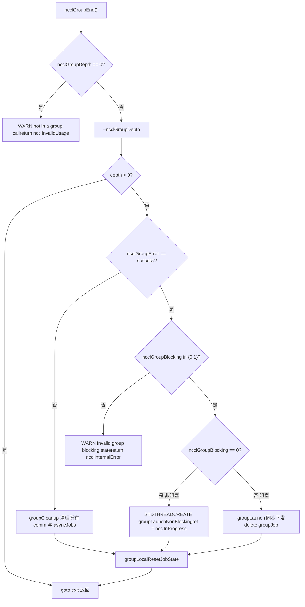

# 第 22 章：本番トラブルシューティングと落とし穴：よくあるデッドロック、タイムアウト、バージョン不一致と調査方案

# 第22章：本番トラブルシューティングと落とし穴：よくあるデッドロック、タイムアウト、バージョン不一致と調査方案

前章では性能チューニングの調査順序と重要なノブを整理しましたが、本番環境における NCCL の障害は、性能が基準に達しないことではなく、プログラムが直接ハングしたりクラッシュしたりすることがしばしばです。これらの障害の根本原因は通常、ある関数の書き間違いではなく、呼び出し順序、ライフサイクル、またはバージョン契約が破壊されたことです。本章では、最も典型的な4つの落とし穴に焦点を当てます：group セマンティクスの誤用によるデッドロック、パラメータ検証の欠如によるサイレントエラー、ABI バージョン不一致、そしてタイムアウトとリトライの境界です。src/group.cc、src/misc/argcheck.cc、src/include/checks.h、contrib/nccl_ep/nccl_ep.cc の4つの手がかりに沿って、NCCL 内部がエラー発生前にどのようにそれを阻止しているかを明らかにします。

# Group セマンティクスの誤用：「GroupEnd を1つ書き忘れる」となぜハングするのか

## 直感モデル：Group は「ショッピングカート」であり、「加速スイッチ」ではない

を`ncclGroupStart()` / `ncclGroupEnd()`オンラインショッピングのカートのように想像してください：複数の商品（複数の通信呼び出し）をカートに入れ、最後に一度に精算します（`ncclGroupEnd`）。入れるだけで精算しないと、カートは永遠に宙に浮いたままです——NCCL 内部が維持する`ncclGroupDepth`カウンタがゼロに戻らず、後続のすべての通信呼び出しが「まだ注文を溜めている」と思い込み、永遠に実際に kernel を発行しないため、プロセス全体がハングします。

> **[Design Inference & Architectural Trade-offs]**
> これは本番環境で最もよく見られるデッドロック形態である：コードが何らかの例外分岐で`return`してしまい、`ncclGroupEnd`をスキップし、そして`ncclGroupDepth`は`thread_local`であるため、関数の戻りによって自動的にクリーンアップされない。

## データ構造：thread_local の group 状態

NCCL は group 状態をすべてスレッドローカルストレージに置いている。これがデッドロックを理解する鍵である。

[FACT:src/group.cc:34-34]

```cpp
thread_local int ncclGroupDepth = 0; // depth of ncclGroupStart nesting
thread_local ncclResult_t ncclGroupError = ncclSuccess;
thread_local struct ncclComm* ncclGroupCommHead[ncclGroupTaskTypeNum] = {nullptr};
thread_local struct ncclComm* ncclGroupCommPreconnectHead = nullptr;
thread_local struct ncclIntruQueue ncclAsyncJobs;
thread_local int ncclGroupBlocking = -1; /* default mode */
```

フィールドごとの解説：

- `ncclGroupDepth`：ネスト深度。`ncclGroupStart`がインクリメントされ、`ncclGroupEnd`がデクリメントされ、0 まで減って初めて実際に送信がトリガーされる。ネスト対応は設計上の利便性だが、「End を1つ漏らす」と深度が永遠に1のまま止まることも意味する。
- `ncclGroupError`：このスレッドに蓄積された group エラー。一度呼び出しが失敗すると、以降の`ncclGroupEnd`は直接失敗パスを通る。
- `ncclGroupCommHead[]`：タスク種別（collective / rawTask / mgmtTask / symRegister）ごとにグループ化された通信ドメインのリンクリスト先頭。
- `ncclAsyncJobs`：実行待ちの非同期タスクキュー（例：preconnect、symmetric register）。
- `ncclGroupBlocking`：`-1`は「まだどの通信ドメインにも遭遇していない」ことを表し、`0`は非ブロッキング、`1`はブロッキングを表す。このフィールドは後述の「ブロッキングと非ブロッキングの混用」検出の中核である。

> **[Design Inference & Architectural Trade-offs]**
> `thread_local`をグローバル変数ではなく

## を使う動機は直接的である：NCCL は複数スレッドがそれぞれ独立した group コンテキストを持ち、互いに干渉しないことを許容する。代償は——スレッド終了時にこれらの状態が自動クリーンアップされず、スレッドが group の途中で終了すると状態がリークすることである。

Step-by-Step：1回の GroupEnd の完全な検証チェーン`ncclGroupEnd()`シナリオを代入：アプリケーションが`ncclGroupDepth`を呼び出し、このとき

は1である。

[FACT:src/group.cc:1048-1052]

```cpp
  if (ncclGroupDepth == 0) {
    WARN("ncclGroupEnd: not in a group call.");
    ret = ncclInvalidUsage;
    goto exit;
  }
```

コピー`ncclGroupStart`ユーザーが`ncclGroupEnd`を呼ばずに直接`ncclInvalidUsage`した場合、ここで "not in a group call" を出力して

を返す。これは最も親切なエラーである——即座にエラーを報告し、ハングしない。

[FACT:src/group.cc:1061-1063]

```cpp
  if ((--ncclGroupDepth) > 0) goto exit;

  if ((ret = ncclGroupError) != ncclSuccess) goto fail;
```

コピー`End`多層にネストしている場合、内側の

は深度をデクリメントして戻るだけで、送信をトリガーしない。最外層のみが続行する。同時に蓄積エラーをチェックする。

[FACT:src/group.cc:1095-1101]

```cpp
  if (hasCommHead || !ncclIntruQueueEmpty(&groupJob->asyncJobs) || ncclGroupCommPreconnectHead != nullptr) {
    /* make sure ncclGroupBlocking has been set. */
    if (ncclGroupBlocking != 0 && ncclGroupBlocking != 1) {
      WARN("Invalid group blocking state %d", ncclGroupBlocking);
      ret = ncclInternalError;
      goto fail;
    }
```

`ncclGroupBlocking`コピー`{0, 1}`は`-1`の間でなければならない。もしそれがまだ

なら、group 内に通信ドメインも非同期タスクもなく、論理的にここに来るべきではない。

[FACT:src/group.cc:1102-1134]

```cpp
    if (ncclGroupBlocking == 0) {
      /* nonblocking group */
      if (!ncclIntruQueueEmpty(&groupJob->asyncJobs)) {
        ncclAsyncJob* job = ncclIntruQueueHead(&groupJob->asyncJobs);
        do {
          NCCLCHECKGOTO(ncclCommSetAsyncError(job->comm, ncclInProgress), ret, fail);
          if (job->comm->groupJob == NULL) {
            job->comm->groupJob = groupJob;
            groupJob->groupRefCount++;
          }
          job = job->next;
        } while (job);
      }
      ...
      groupJob->base.func = groupLaunchNonBlocking;
      STDTHREADCREATE_GOTO(groupJob->base.thread, ncclAsyncJobMain, ret, fail, &groupJob->base);
      groupJob->nonBlockingInit = true;
      ret = ncclInProgress;
    }
```

コピー`groupRefCount++``ret = ncclInProgress`と`ncclGroupEnd`に注意：非ブロッキングモードでは、`ncclInProgress`は即座に`ncclCommGetAsyncError`を返し、実際の送信はバックグラウンドスレッドで実行される。呼び出し側は後で`ncclGroupJobComplete`でポーリングするか、

## で待機しなければならない。

阻塞与非阻塞混用：为什么被禁止`ncclAsyncLaunch`

[FACT:src/group.cc:55-64]

```cpp
    /* check if there are blocking and nonblocking comms at the same time in group. */
    if (comm->destroyFlag) {
      ncclGroupBlocking = 1;
    } else if (ncclGroupBlocking == -1) {
      /* first met communicator */
      ncclGroupBlocking = comm->config.blocking;
    } else if (ncclGroupBlocking != comm->config.blocking) {
      WARN("Blocking and nonblocking communicators are not allowed in the same group.");
      ret = ncclInvalidArgument;
    }
```

> **[Design Inference & Architectural Trade-offs]**
> 〔設計上の推論とアーキテクチャのトレードオフ〕`ncclGroupEnd`なぜ混用が禁止されているのか？ブロッキング通信ドメインの送信セマンティクスは「呼び出しが戻ったとき kernel は既にコミット済み」であり、非ブロッキングは「呼び出しが戻ったときタスクはキューに入ったが未コミット」である。両者が同じ group 内にあると、

## は統一的な戻りセマンティクスを与えられない——待つのか待たないのか？NCCL は直接拒否することを選び、問題を API 境界に露出させる。

**本番の落とし穴：3つの実シナリオ**シナリオ1：例外分岐で GroupEnd を漏らす。`ncclGroupStart`コードが`ncclGroupEnd`と`return`，`ncclGroupDepth`の間で例外を投げるか早期に`ncclGroupEnd`し、1のまま止まる。以降のすべての通信呼び出しが「溜め込み」状態に入り、永遠に送信されない。調査方法：`ncclGroupDepth`の前に`gdb`を出力するか、

**でその thread_local 変数を観察する。**シナリオ2：スレッドをまたいで同じ comm を使用する。`thread_local`group 状態は`ncclGroupStart`であるため、スレッド A が`ncclAllReduce`を呼び出した後、スレッド B が

**を呼んでも A の group には入らない。A と B が同じ comm を操作すると、「一部の呼び出しが group 内、一部が group 外」という錯乱が生じる。NCCL はこの状況を検出しない。なぜなら1つの comm は任意の時点で1つのスレッドのみに操作されると仮定しているからである。**シナリオ3：CUDA graph capture と group の相互作用。`doLaunches`

[FACT:src/group.cc:448-455]

```cpp
    if (capturingYes && capturingNo) {
      // We have entered barriers but are aborting without leaving them. Thus
      // these comms are permanently trashed. We need a good mechanism for
      // tracking and reporting that.
      WARN("Either none or all communicators in a ncclGroup() can be CUDA graph captured.");
      result = ncclInvalidUsage;
      goto failure;
    }
```

コピー



# コピー

## パラメータ検証とサイレントエラー：ArgCheck が「正常に見える」呼び出しをどうブロックするか

直感モデル：ArgCheck は「空港の保安検査」

## パラメータ検証は空港の保安検査のようなものである：より速く飛ばせる責任はないが、「荷物に見えて実は危険物」なものをブロックできる。これがなければ、デバイスを間違えたポインタが GPU kernel にゴミデータを読ませるか、さらに悪いことに——他人の VRAM を静かに破壊する。

データ構造：検証モードとグローバルチェックキュー`comm->checkMode`：

[FACT:src/misc/argcheck.cc:227-251]

```cpp
  if (info->comm->checkMode != ncclCheckModeDefault) {
    if ((info->coll == ncclFuncSend || info->coll == ncclFuncRecv)) {
      if (info->count > 0) NCCLCHECK(CudaPtrCheck(info->recvbuff, info->comm, "buff", info->opName));
    } else if (info->coll == ncclFuncPutSignal || info->coll == ncclFuncSignal || info->coll == ncclFuncWaitSignal) {
      // One-sided RMA ops specify the remote destination via peerWin, not sendbuff/recvbuff,
      // so the standard CUDA pointer checks do not apply here.
      INFO(NCCL_COLL, "%s : skipping sendbuff/recvbuff pointer check (one-sided RMA uses peerWin)", info->opName);
    } else {
      // Check CUDA device pointers
      if (info->coll != ncclFuncBroadcast || info->comm->rank == info->root) {
        NCCLCHECK(CudaPtrCheck(info->sendbuff, info->comm, "sendbuff", info->opName));
      }
      if (info->coll != ncclFuncReduce || info->comm->rank == info->root) {
        NCCLCHECK(CudaPtrCheck(info->recvbuff, info->comm, "recvbuff", info->opName));
      }
    }

    if (info->comm->checkMode == ncclCheckModeDebugGlobal) {
      struct ncclArgsInfo* argsInfo;
      NCCLCHECK(ncclCalloc(&argsInfo, 1));
      argsInfo->info = *info;
      argsInfo->next = NULL;
      ncclIntruQueueEnqueue(&info->comm->argsInfoQueue, argsInfo);
    }
  }
```

コピー

- `ncclCheckModeDefault`3つのモード：
- ：最も安価なチェック（root 範囲、datatype 範囲、op 範囲）のみを行い、CUDA API に触れない。`CudaPtrCheck`非デフォルトモード：`cudaPointerGetAttributes`を呼び出し、これが実際に
- `ncclCheckModeDebugGlobal`を呼び出すため、パフォーマンスオーバーヘッドがある。`ncclInfo`：ローカルチェックに加えて、`argsInfoQueue`、group が終了するまで待ってから、ランク間のグローバル整合性チェックを行います。

> **[Design Inference & Architectural Trade-offs]**
> この設計は性能と正確性のトレードオフです：`cudaPointerGetAttributes`は同期 CUDA 呼び出しであり、ホットパス上で毎回の通信ごとに呼び出すと小メッセージが著しく遅くなります。そのためデフォルトモードでは「ゼロコスト」のチェックのみを行い、高コストなポインタ検証はデバッグモードに委ねています。

## Step-by-Step：CudaPtrCheck の三層防御

シナリオを当てはめる：ユーザーが`sendbuff`を渡し、NCCL がデバッグモードでそれを検証します。

第一層、ポインタが有効か：

[FACT:src/misc/argcheck.cc:12-18]

```cpp
ncclResult_t CudaPtrCheck(const void* pointer, struct ncclComm* comm, const char* ptrname, const char* opname) {
  cudaPointerAttributes attr;
  cudaError_t err = cudaPointerGetAttributes(&attr, pointer);
  if (err != cudaSuccess || attr.devicePointer == NULL) {
    WARN("%s : %s %p is not a valid pointer", opname, ptrname, pointer);
    return ncclInvalidArgument;
  }
```

`cudaPointerGetAttributes`は無効なポインタに対してエラーを返すか、`devicePointer`が NULL になります。これにより「ホストのスタックアドレスを渡した」あるいは「解放済みのポインタを渡した」ケースを防ぎます。

第二層、デバイスが一致するか：

[FACT:src/misc/argcheck.cc:19-26]

```cpp
#if CUDART_VERSION >= 10000
  if (attr.type == cudaMemoryTypeDevice && attr.device != comm->cudaDev) {
#else
  if (attr.memoryType == cudaMemoryTypeDevice && attr.device != comm->cudaDev) {
#endif
    WARN("%s : %s allocated on device %d mismatchs with NCCL device %d", opname, ptrname, attr.device, comm->cudaDev);
    return ncclInvalidArgument;
  }
```

これが最も見落としやすい落とし穴です：ポインタは有効な GPU ポインタだが、別の GPU に属しているケースです。マルチ GPU マシンでは、ユーザーが`cudaSetDevice`を忘れると、簡単に間違って渡してしまいます。NCCL はここで明確に拒否します。

第三層、通信ドメインオブジェクトの完全性：

[FACT:src/misc/argcheck.cc:38-45]

```cpp
ncclResult_t CommCheck(struct ncclComm* comm, const char* opname, const char* ptrname) {
  NCCLCHECK(PtrCheck(comm, opname, ptrname));
  if (comm->startMagic != NCCL_MAGIC || comm->endMagic != NCCL_MAGIC) {
    WARN("Error: corrupted comm object detected");
    return ncclInvalidArgument;
  }
  return ncclSuccess;
}
```

`startMagic` / `endMagic`は`ncclComm`構造体の先頭と末尾に置かれたセンチネル値です。ユーザーが野ポインタを渡した場合、あるいは comm が既に解放されている場合、magic が一致しません。これは「メモリ破壊検出」の古典的な手法です——2つのセンチネルで構造体を挟み、あらゆる範囲外書き込みがいずれかを破壊する可能性があります。

## グローバル整合性チェック：registrationCheck のランク間検証

これは NCCL で最も「重い」検証であり、`ncclCheckModeDebugGlobal`の場合にのみトリガーされます。これがチェックするのは——すべてのランクの対称メモリ登録状態が一致しているかどうかです。

[FACT:src/misc/argcheck.cc:95-111]

```cpp
  NCCLCHECKGOTO(bootstrapAllGather(comm->bootstrap, bufInfo, sizeof(struct symBufInfo) * 2), ret, fail);

  cmpBufInfo[0] = bufInfo[0];
  cmpBufInfo[1] = bufInfo[1];
  for (int r = 1; r nRanks; r++) {
    int infoIdx = r * 2;
    if (cmpBufInfo[0].isSymRegistered != bufInfo[infoIdx].isSymRegistered ||
        cmpBufInfo[1].isSymRegistered != bufInfo[infoIdx + 1].isSymRegistered) {
      if (comm->rank == 0) {
        WARN("Coll %s size %ld symmetric registration check failed on rank %d: sendReg %d recvReg %d mismatch with "
             "rank 0 sendReg %d recvReg %d",
             info->opName, size, r, bufInfo[infoIdx].isSymRegistered, bufInfo[infoIdx + 1].isSymRegistered,
             cmpBufInfo[0].isSymRegistered, cmpBufInfo[1].isSymRegistered);
      }
      ret = ncclInvalidArgument;
      goto fail;
    }
```

これは bootstrap の`allGather`を通じて各ランクの`(isSymRegistered, bigOffset, userOffset)`を収集し、ランクごとに比較します。もしランク 0 の send buffer が対称メモリを登録しており、ランク 3 が登録していない場合、ここでエラーが報告されます。

> **[Design Inference & Architectural Trade-offs]**
> なぜこのチェックが重要なのでしょうか？対称メモリ（symmetric memory）は、すべてのランクが同じ仮想アドレスセットでバッファにアクセスすることを要求します。もしあるランクのバッファが登録されていない場合、kernel 内で計算されるアドレスが誤りとなり、ゴミを読んだり範囲外アクセスを引き起こします。この種のエラーは実行時に「結果が時々正しくない」という形で現れ、極めてデバッグが困難です。NCCL は API 境界で一度の allGather のコストを払ってこれを防いでいます。

## 本番環境での落とし穴

**落とし穴1：デフォルトモードではポインタエラーが報告されない。**ユーザーがデバッグモードを有効にしていない場合、誤ったデバイスのポインタを渡しても、NCCL は`ArgsCheck`段階でエラーを報告せず、kernel 実行時まで発見されません——その時点では既に他のランクの VRAM を破壊している可能性があります。開発段階では`NCCL_DEBUG=WARN`に`checkMode`を加えてデバッグすることを推奨します。

**落とし穴2：`ncclCheckModeDebugGlobal`の allGather オーバーヘッド。**通信ごとに bootstrap allGather を行うため、小メッセージ高頻度のシナリオではボトルネックになります。このモードはデバッグにのみ適しており、本番環境には投入できません。

**落とし穴3：userRedOp のライフサイクル。**この部分を見てください：

[FACT:src/misc/argcheck.cc:220-225]

```cpp
  int opIx = int(ncclUserRedOpMangle(info->comm, info->op)) - int(ncclNumOps);
  if (ncclNumOps op &&
      (info->comm->userRedOpCapacity comm->userRedOps[opIx].freeNext != -1)) {
    WARN("%s : reduction operation %d unknown to this communicator", info->opName, info->op);
    return ncclInvalidArgument;
  }
```

ユーザー定義の reduction op は comm に登録されます。もしユーザーが「以前登録されたが既に解放された」op を渡した場合、`freeNext != -1`はそれが回収済みであることを検出します。これは「ダングリング op ハンドル」を防ぐチェックです。

# エラー伝播マクロ：NCCLCHECK ファミリーが「エラーを落とさない」ことをどう保証するか

## 直感的モデル：エラー伝播マクロは「バトン」

NCCL のエラー処理は一連のマクロによるリレーに依存しています：下位関数が`ncclResult_t`を返し、上位が`NCCLCHECK`でチェックし、成功でなければ即座にリターンします。これはリレー競走のようなものです——バトン（エラーコード）は最後まで受け渡されなければならず、どこかで落ちるとチェーン全体が途切れます。

## データ構造：マクロファミリーの全体像

[FACT:src/include/checks.h:148-166]

```cpp
#define NCCLCHECK(call) \
  do { \
    ncclResult_t RES = call; \
    if (RES != ncclSuccess && RES != ncclInProgress) { \
      /* Print the back trace*/ \
      if (ncclDebugNoWarn == 0) INFO_LOC(NCCL_ALL, "-> %d", RES); \
      return RES; \
    } \
  } while (0)

#define NCCLCHECKGOTO(call, RES, label) \
  do { \
    RES = call; \
    if (RES != ncclSuccess && RES != ncclInProgress) { \
      /* Print the back trace*/ \
      if (ncclDebugNoWarn == 0) INFO_LOC(NCCL_ALL, "-> %d", RES); \
      goto label; \
    } \
  } while (0)
```

重要な詳細：`ncclInProgress`は「エラーではない」と見なされます。これは非ブロッキング通信の核心です——`ncclGroupEnd`が`ncclInProgress`を返すのは「タスクは投入されたが、まだ完了していない」ことを意味し、呼び出し側はエラーとして扱うのではなくポーリングを続けるべきです。

`NCCLCHECK`は直接`return`，`NCCLCHECKGOTO`にジャンプして`label`へ進みます。後者はリソースのクリーンアップが必要なシナリオで使用されます。

## クリーンアップパス：NCCLCHECKIGNORE は最初のエラーを保持

[FACT:src/include/checks.h:168-177]

```cpp
// Report failure but continue - useful for cleanup paths where we want to
// attempt all cleanup steps. Preserves the first error in RES.
#define NCCLCHECKIGNORE(call, RES) \
  do { \
    ncclResult_t TMPRES = call; \
    if (TMPRES != ncclSuccess && TMPRES != ncclInProgress) { \
      if (ncclDebugNoWarn == 0) INFO_LOC(NCCL_ALL, "-> %d", TMPRES); \
      if (RES == ncclSuccess) RES = TMPRES; \
    } \
  } while (0)
```

コメントが明確に述べている通り：クリーンアップパスでは「すべてのクリーンアップステップを試みる」必要があり、最初のエラーで中断されてはなりません。ただしエラーコードは最初のものを保持します——最初のエラーが通常、最も診断価値の高い根本原因だからです。

## 待機と中止：NCCLWAIT の abortFlag チェック

[FACT:src/include/checks.h:196-205]

```cpp
#define NCCLWAIT(call, cond, abortFlagPtr) \
  do { \
    uint32_t* tmpAbortFlag = (abortFlagPtr); \
    ncclResult_t RES = call; \
    if (RES != ncclSuccess && RES != ncclInProgress) { \
      if (ncclDebugNoWarn == 0) INFO_LOC(NCCL_ALL, "-> %d", RES); \
      return ncclInternalError; \
    } \
    if (COMPILER_ATOMIC_LOAD(tmpAbortFlag, std::memory_order_acquire)) NEQCHECK(*tmpAbortFlag, 0); \
  } while (!(cond))
```

これはポーリング待機のテンプレートです：各ループで`call`（進捗を推進）を呼び、`cond`（満たされたか）をチェックし、同時に`abortFlag`（中止されたか）をチェックします。`abortFlag`は`memory_order_acquire`ロードを使用し、他のスレッドが書き込んだ中止シグナルを確実に認識します。

> **[Design Inference & Architectural Trade-offs]**
> この設計は古典的な問題を解決します：あるランクがエラーになったとき、他のランクがまだそのデータを待ち続けている可能性があるという問題です。`abortFlag`はランク間で中止シグナルを伝播するメカニズムです——一度設定されると、すべての待機ループが終了します。

## スレッド作成とメモリ割り当ての安全マクロ

[FACT:src/include/checks.h:237-256]

```cpp
#define STDTHREADCREATE_IMPL(var, func, error_action, ...) \
  do { \
    try { \
      (var) = std::thread(func, __VA_ARGS__); \
    } catch (const std::exception& e) { \
      WARN("Thread creation failed: %s", e.what()); \
      error_action; \
    } \
  } while (0)

#define STDTHREADCREATE(var, func, ...) STDTHREADCREATE_IMPL(var, func, return ncclSystemError, __VA_ARGS__)

#define STDTHREADCREATE_GOTO(var, func, RES, label, ...) \
  STDTHREADCREATE_IMPL( \
    var, func, \
    do { \
      RES = ncclSystemError; \
      goto label; \
    } while (0), \
    __VA_ARGS__)
```

`std::thread`の構築失敗は例外をスローします（例えばスレッド数が上限を超えた場合）。このマクロは例外を`ncclSystemError`に変換し、例外が C API 境界を貫通するのを防ぎます。

[FACT:src/include/checks.h:258-275]

```cpp
#define NEW_NOTHROW(var, x) \
  do { \
    (var) = new (std::nothrow) x{}; \
    if (!(var)) { \
      WARN("Allocation failed"); \
      return ncclSystemError; \
    } \
  } while (0)
```

`new (std::nothrow)`は割り当て失敗時に例外をスローするのではなく nullptr を返します。これは C API 境界における C++ コードの標準的な手法です。

## 本番環境での落とし穴

**落とし穴1：`ncclInProgress`が誤って成功と見なされる。**一部のユーザーコードは`if (ret == ncclSuccess)`で成功を判定しますが、非ブロッキングモードでは返されるのは`ncclInProgress`です。正しい方法は`if (ret == ncclSuccess || ret == ncclInProgress)`とするか、`ncclCommGetAsyncError`でクエリすることです。

**落とし穴2：`NCCLCHECK`デストラクタで使う。**デストラクタで使うと`NCCLCHECK`、エラーは直接`return`、後続のクリーンアップをスキップする。使うべきは`NCCLCHECKIGNORE`。

# ABI バージョンの不一致：nccl_ep の size-based 設計

## 直感モデル：ABI は「コンセントの規格」

ABI（アプリケーションバイナリインターフェース）は電源コンセントの規格のようなものだ。ライブラリと呼び出し側で「構造体がどんな形か」の理解が一致しないと、米国規格のプラグを欧州規格のコンセントに挿すようなもの——軽ければ動かない、重ければ焼損する。`contrib/nccl_ep`は巧妙な設計を採用している。境界を越える各構造体は`size`フィールドで始まる。

## データ構造：size + magic の二重検証

[FACT:contrib/nccl_ep/nccl_ep.cc:70-76]

```cpp
// Size-based ABI versioning: every cross-boundary struct starts with a `size`
// field set by the caller to sizeof(struct). The library checks that against
// its own known size; any mismatch means caller and library are from different
// releases. Strict equality for now — see nccl_ep.h for the planned future
// relaxation (all-zero-trailing-bytes escape hatch).
// Immediately after `size` there is a `magic` field pre-filled by NCCL_EP_*_INIT
// to catch unininitialized structures.
```

設計の要点：

- `size`フィールドは呼び出し側が`sizeof(struct)`を設定し、ライブラリはそれが自身の認識する size と等しいか検査する。
- `magic`フィールドは`NCCL_EP_*_INIT`マクロで事前に設定され、「未初期化」の構造体を捕捉するために使う。
- 現在は厳密等価だが、将来は「末尾が全てゼロなら size がより小さくても許容する」緩和モードをサポートする予定。

## Step-by-Step：EP_REQUIRE_STRUCT の検証フロー

[FACT:contrib/nccl_ep/nccl_ep.cc:77-80]

```cpp
#define EP_REQUIRE_STRUCT(ptr) \
    do { \
        assert( \
            (ptr) != nullptr && (ptr)->size == sizeof(*(ptr)) && \
```

このマクロは`ncclEpDispatch`、`ncclEpCombine`などのエントリポイントで呼び出される：

[FACT:contrib/nccl_ep/nccl_ep.cc:2827-2830]

```cpp
    EP_REQUIRE_STRUCT(inputs);
    EP_REQUIRE_STRUCT(outputs);
    EP_OPTIONAL_LAYOUT_INFO(layout_info);
    EP_OPTIONAL_STRUCT(config);
```

`inputs`と`outputs`は必須パラメータで、`EP_REQUIRE_STRUCT`；`layout_info`と`config`はオプションパラメータで、`EP_OPTIONAL_*`。

## バージョン安全なフィールド読み取り：layoutInfoRecvTopkIdxKind

これが最も精妙な部分——「呼び出し側の構造体がより小さい可能性がある」状況でフィールドを安全に読み取る方法。

[FACT:contrib/nccl_ep/nccl_ep.cc:139-144]

```cpp
// Safe field reader for ncclEpLayoutInfo_t::recv_topk_idx_kind. Returns AUTO
// when the caller's struct (size) does not cover the field, preserving the
// pre-flag default.
static inline ncclEpExpertIdKind_t layoutInfoRecvTopkIdxKind(const ncclEpLayoutInfo_t* lip) {
    if (lip == nullptr) return NCCL_EP_EXPERT_ID_AUTO;
    constexpr size_t field_end = offsetof(ncclEpLayoutInfo_t, recv_topk_idx_kind) + sizeof(ncclEpExpertIdKind_t);
    if (lip->size recv_topk_idx_kind;
}
```

ロジックは：呼び出し側の`size`が「そのフィールドが終わるオフセット」より小さければ、呼び出し側は旧バージョンの構造体を使っており、このフィールドは存在しないのでデフォルト値`AUTO`を返す。そうでなければ通常通り読み取る。

> **[Design Inference & Architectural Trade-offs]**
> これは ABI 互換の標準手法だ：新フィールドは構造体の末尾にのみ追加でき、読み取り時に`size`でフィールドの存在を判定する。これにより旧呼び出し側が旧構造体を使っても、新ライブラリは正しく処理できる。

## バージョン番号チェック：ハード拒否ではなくソフト警告

[FACT:contrib/nccl_ep/nccl_ep.cc:1393-1400]

```cpp
    if (in_config->version != NCCL_EP_API_VERSION) {
        fprintf(
            stderr,
            "NCCL EP WARN: ncclEpGroupConfig_t.version=%u, library API_VERSION=%u; "
            "behavior may differ across versions.\n",
            in_config->version,
            (unsigned)NCCL_EP_API_VERSION);
    }
```

ここは`WARN`ではなく`return error`であることに注意。バージョン番号の不一致は単なる警告だ。なぜなら`size`チェックが既にメモリレイアウトの安全性を保証しているからだ。バージョン番号はむしろ「動作が異なる可能性がある」というヒントである。

## 本番の落とし穴

**落とし穴1：INIT マクロでの初期化を忘れる。**ユーザーが手動で`memset`構造体を 0 にすると、`magic`は 0 になり、`EP_REQUIRE_STRUCT`は失敗する。必ず`NCCL_EP_*_INIT`マクロを使わなければならない。

**落とし穴2：バージョンをまたいだ動的ライブラリの混用。**アプリケーションがリンクしているのが新版の`libnccl_ep.so`で、ヘッダファイルが旧版の場合、`sizeof(struct)`が不一致になり、`EP_REQUIRE_STRUCT`が即座にエラーを報告する。これは設計意図——静かなエラーよりも高速な失敗が優れている。

**落とし穴3：`EP_OPTIONAL_LAYOUT_INFO`の範囲チェック。**この部分を見てほしい：

[FACT:contrib/nccl_ep/nccl_ep.cc:114-123]

```cpp
            if ((ptr)->size size > sizeof(*(ptr))) { \
                fprintf( \
                    stderr, \
                    "NCCL EP: ncclEpLayoutInfo_t size out of supported range: " \
                    "got %u, expected [%zu, %zu]\n", \
                    (ptr)->size, \
                    kNcclEpLayoutInfoMinSize, \
                    sizeof(*(ptr))); \
                return ncclInvalidArgument; \
            } \
```

`layout_info`size を`[min, sizeof]`の範囲で許容する。これは`EP_REQUIRE_STRUCT`の厳密等価よりも緩い。理由は`layout_info`がオプションパラメータであり、歴史的にフィールドの増減があったからだ。

```mermaid
flowchart TD
    entry["ncclEpDispatch(inputs, outputs, layout_info, config)"] --> req_inputs{"EP_REQUIRE_STRUCT(inputs)size == sizeof?"}
    req_inputs -->|否| err_size["assert 失败 / 返回错误"]
    req_inputs -->|是| req_outputs{"EP_REQUIRE_STRUCT(outputs)"}
    req_outputs -->|否| err_size
    req_outputs -->|是| opt_layout{"layout_info != nullptr?"}
    opt_layout -->|否| skip_layout["跳过 layout 校验"]
    opt_layout -->|是| range_check{"size in [min, sizeof]?"}
    range_check -->|否| err_range["fprintf size out of rangereturn ncclInvalidArgument"]
    range_check -->|是| magic_check{"magic == NCCL_EP_MAGIC?"}
    magic_check -->|否| err_magic["fprintf magic mismatchreturn ncclInvalidArgument"]
    magic_check -->|是| read_field["layoutInfoRecvTopkIdxKindsize  read_field
    read_field --> proceed["继续执行 dispatch 逻辑"]
```

# タイムアウト、リトライ、中止：NCCLWAIT から nccl_ep の timeout_cycles へ

## 直感モデル：タイムアウトは「ヒューズ」

分散通信では、1つの rank がスタックすると全ての rank がデッドウェイトする。タイムアウト機構はヒューズのようなものだ：通常は動作せず、電流異常が起きると溶断し、システム全体の焼損を防ぐ。

## データ構造：abortFlag と timeout_cycles

NCCL コアは`abortFlag`で中止シグナルを伝播する。`ncclAsyncLaunch`内の伝播を見てほしい：

[FACT:src/group.cc:49-52]

```cpp
    job->abortFlag = comm->abortFlag;
    job->abortFlagDev = comm->abortFlagDev;
    job->childAbortFlag = comm->childAbortFlag;
    job->childAbortFlagDev = comm->childAbortFlagDev;
```

各 job は comm の abortFlag ポインタを保持する。group がエラーを検出すると：

[FACT:src/group.cc:118-126]

```cpp
        if (!job->destroyFlag &&
            (COMPILER_ATOMIC_LOAD(groupAbortFlag, std::memory_order_acquire) || errorJobAbortFlag == true)) {
          COMPILER_ATOMIC_STORE(job->abortFlag, uint32_t(1), std::memory_order_release);
          COMPILER_ATOMIC_STORE(job->abortFlagDev, uint32_t(1), std::memory_order_release);
          if (job->childAbortFlag) {
            COMPILER_ATOMIC_STORE(job->childAbortFlag, uint32_t(1), std::memory_order_release);
            COMPILER_ATOMIC_STORE(job->childAbortFlagDev, uint32_t(1), std::memory_order_release);
          }
        }
```

または`groupAbortFlag`が真になると、全ての job の abortFlag が 1 に設定される。`errorJobAbortFlag`は以前の書き込みが他のスレッドから可視であることを保証する。`memory_order_release`nccl_ep のタイムアウト設計：GPU クロックサイクル

## はより精密なタイムアウト——GPU クロックサイクル単位——を採用している。

`nccl_ep`コピー

[FACT:contrib/nccl_ep/nccl_ep.cc:1558-1591]

```cpp
    // Resolve timeout_cycles: env var > config field > compile-time default
    {
        int dev;
        int clock_khz_int;
        CUDA_CHECK(cudaGetDevice(&dev));
        CUDA_CHECK(cudaDeviceGetAttribute(&clock_khz_int, cudaDevAttrClockRate, dev));
        uint64_t clock_khz = static_cast(clock_khz_int);

        uint64_t resolved = NUM_TIMEOUT_CYCLES;
        const char* source = "compile-time default";
        const uint64_t env_ms = static_cast(ep_group->env.timeout_ms.value.ul);
        // Only a positive timeout overrides the default.
        const bool have_env_ms = ep_group->env.timeout_ms.is_set && env_ms > 0;

        if (have_env_ms) {
            resolved = clock_khz * 1000ULL * env_ms / 1000ULL;
            source = "NCCL_EP_TIMEOUT_MS env var";
            ...
        } else if (ep_group->config.timeout_ns != 0) {
            resolved = clock_khz * 1000ULL * (ep_group->config.timeout_ns / 1000000ULL) / 1000ULL;
            source = "config.timeout_ns";
        }

        ep_group->timeout_cycles = resolved;
```

> 設定フィールド`NCCL_EP_TIMEOUT_MS`> コンパイル時デフォルト値。変換式は`timeout_ns`、つまりミリ秒をクロックサイクルに変換する。`clock_khz * 1000 * ms / 1000`〔設計推論とアーキテクチャのトレードオフ〕

> **[Design Inference & Architectural Trade-offs]**
> レジスタを読むしかないからだ。クロックサイクルでタイムアウト判定を行えば、kernel 内で直接比較でき、host の介入が不要になる。`clock64()`非同期エラーフラグ：host-pinned メモリ

## コピー

[FACT:contrib/nccl_ep/nccl_ep.cc:1767-1778]

```cpp
    // Allocate mask buffer and async error flag for active-mask support
    if (ep_group->config.enable_mask && ep_group->config.algorithm == NCCL_EP_ALGO_LOW_LATENCY) {
        size_t mask_bytes = ep_group->nRanks * sizeof(int);
        CUDA_CHECK(cudaMalloc(reinterpret_cast(&ep_group->mask_buffer), mask_bytes));
        // Initialize all ranks as active (1 = active, 0 = masked/failed)
        std::vector all_active(ep_group->nRanks, 1);
        CUDA_CHECK(
            cudaMemcpyAsync(ep_group->mask_buffer, all_active.data(), mask_bytes, cudaMemcpyHostToDevice, stream));
        CUDA_CHECK(
            cudaHostAlloc(reinterpret_cast(&ep_group->async_error_flag), sizeof(int), cudaHostAllocMapped));
        *ep_group->async_error_flag = 0;
    }
```

`async_error_flag`で確保される。これは host-pinned かつデバイスアドレス空間にマップされたメモリだ。GPU kernel が書き込み、host が読み取ることができ、明示的なコピーが不要である。`cudaHostAllocMapped`非同期エラーの読み取り：アトミックロード

## コピー

[FACT:contrib/nccl_ep/nccl_ep.cc:4312-4321]

```cpp
ncclResult_t ncclEpGetAsyncError(ncclEpGroup_t ep_group, int* error_out) {
    EP_HOST_ASSERT(ep_group != nullptr);
    if (!ep_group->config.enable_mask) {
        return ncclInvalidUsage;
    }
    EP_HOST_ASSERT(ep_group->async_error_flag != nullptr && "ncclEpGetAsyncError: enable_mask must be true");
    EP_HOST_ASSERT(error_out != nullptr);
    *error_out = __atomic_load_n(ep_group->async_error_flag, __ATOMIC_ACQUIRE);
    return ncclSuccess;
}
```

に`__atomic_load_n`を加えて使い、キャッシュされた古い値ではなく、GPU が書き込んだ最新の値を読むことを保証する。`__ATOMIC_ACQUIRE`本番の落とし穴

## 落とし穴1：タイムアウト設定が短すぎて誤報を引き起こす。

**もし**を小さく設定しすぎると、正常なネットワークジッタがタイムアウトと誤判定される。実際のネットワーク RTT に基づいて設定することを推奨し、通常は10秒以上とする。`NCCL_EP_TIMEOUT_MS`落とし穴2：abortFlag 設定後にクリアされない。

**abortFlag が 1 に設定されると、comm は「中止」状態に入る。ユーザーがこの comm を引き続き使いたい場合、まず abortFlag をクリアしなければならない。NCCL の**がこのクリアを行う。`ncclCommAbort`落とし穴3：

**の前提条件。`ncclEpMaskClean`この部分を見てほしい：**コピー

[FACT:contrib/nccl_ep/nccl_ep.cc:4262-4266]

```cpp
    EP_HOST_ASSERT(ep_group->config.algorithm == NCCL_EP_ALGO_LOW_LATENCY);
    EP_HOST_ASSERT(
        ep_group->rdma_buffer != nullptr &&
        "ncclEpMaskClean: rdma_buffer not yet allocated; create at least one LL handle first");
    EP_HOST_ASSERT(ep_group->sync_buffer != nullptr && ep_group->sync_window != nullptr);
```

`ncclEpMaskClean`は`rdma_buffer`が確保済みであることを要求する。ユーザーが group を作成したがまだ LL handle を何も作成していない場合、`rdma_buffer`は nullptr になる（LL は遅延確保のため）。ここで assert が失敗する。

# 本章のまとめ

本章では4種類の本番の落とし穴を繋いだ：

1. **Group セマンティクスの誤用**：`ncclGroupDepth`は thread_local であり、省略すると`ncclGroupEnd`恒久的なハングを引き起こす；ブロッキング通信ドメインとノンブロッキング通信ドメインは混用できない；CUDA graph capture はオール・オア・ナッシングでなければならない。

2. **パラメータ検証**：`ArgsCheck`モード別に検証し、デフォルトモードではゼロコストのチェックのみを行う；`CudaPtrCheck`三層の防御線で無効なポインタ、誤ったデバイス、破損した comm を遮断する；`registrationCheck`クロスランクの対称メモリ整合性チェックを行う。

3. **エラー伝播**：`NCCLCHECK`ファミリーはエラーを失わないことを保証する；`ncclInProgress`エラーではない；`NCCLCHECKIGNORE`クリーンアップパスで最初のエラーを保持するために使用される；`NCCLWAIT`ポーリング中に abortFlag をチェックする。

4. **ABI バージョン**：`nccl_ep`size-based 設計を採用し、各境界を越える構造体は`size`で始まり、`magic`と組み合わせて未初期化を捕捉する；新しいフィールドは末尾にのみ追加でき、読み取り時に`size`で存在するかどうかを判断する。

5. **タイムアウトと中止**：コアは`abortFlag`で中止を伝播する；`nccl_ep`GPU クロックサイクルでタイムアウトを実装し、`async_error_flag`host-pinned メモリで GPU→host の非同期通知を実現する。

# 本章の考察とセルフチェック

Q1: もし`ncclGroupEndInternal`の`if ((--ncclGroupDepth) > 0) goto exit;`（[FACT:src/group.cc:1061]）を`if (ncclGroupDepth > 0) goto exit;`（デクリメントしない）に変更したら、何が起こるか？ネストされた group のシナリオではどのような結果になるか？

**参考解説**：

元のコードは`--ncclGroupDepth`まずデクリメントしてから判定する。デクリメントしないように変更すると：

```cpp
if (ncclGroupDepth > 0) goto exit;  // 错误版本
```

すると毎回`ncclGroupEnd`で深度が減少しなくなる。ユーザーが次のように書いたと仮定する：

```cpp
ncclGroupStart();  // depth = 1
ncclGroupStart();  // depth = 2
ncclAllReduce(...);
ncclGroupEnd();    // 原版: depth = 1, 返回; 错误版: depth = 2, 返回
ncclGroupEnd();    // 原版: depth = 0, 触发下发; 错误版: depth = 2, 返回
```

誤ったバージョンでは、2回目の`ncclGroupEnd`時に`ncclGroupDepth`は依然として 2 であり、`> 0`が成立し、直接`goto exit`となり、永遠に発行がトリガーされない。すべての通信呼び出しが「溜め込み」状態のままとなり、プロセスがハングする。

さらに隠蔽的なのは：`ncclGroupDepth`は thread_local であり、関数が戻ってもリセットされない。たとえ後続のコードが group API を呼び出さなくても、このスレッド上のすべての通信が無効になる。

この変更はさらに`ncclGroupStart`のペアリングセマンティクスを破壊する——`ncclGroupStart`はインクリメント、`ncclGroupEnd`はデクリメントしないため、深度は増える一方で最終的にオーバーフローする（ただし int のオーバーフローには20億回の呼び出しが必要で、実際にはより論理的なハングが起こる可能性が高い）。

Q2: `CudaPtrCheck`の`attr.type == cudaMemoryTypeDevice && attr.device != comm->cudaDev`（[FACT:src/misc/argcheck.cc:20]）というチェックで、もし`attr.type == cudaMemoryTypeDevice`という条件を削除したら、どのような問題が起こるか？どのようなシナリオで誤検出されるか？

**参考回答**：

`cudaPointerAttributes.type`には3つの可能な値がある：`cudaMemoryTypeDevice`（デバイスメモリ）、`cudaMemoryTypeHost`（ホストメモリ）、`cudaMemoryTypeManaged`（ユニファイドメモリ）。

もし`attr.type == cudaMemoryTypeDevice`条件を削除すると、次のようになる：

```cpp
if (attr.device != comm->cudaDev) {  // 错误版本
```

すると host メモリや managed メモリに対して、`attr.device`は -1 または 0 の可能性があり、`comm->cudaDev`と一致せず、「デバイス不一致」と誤検出される。

具体的なシナリオ：ユーザーが`cudaMallocManaged`で割り当てられたポインタを渡す。managed メモリの`attr.device`は通常割り当て時のデバイスだが、メモリが他のデバイスに移行された場合、`attr.device`が変化する可能性がある。より一般的なのは host メモリ（例えば`cudaHostAlloc`で割り当てられた pinned メモリ）で、`attr.device`は -1 となり、どの`cudaDev`とも等しくなく、誤検出される。

NCCL は host メモリを通信バッファとして許可している（`cudaMemcpy`を介して中継）、そのため「デバイスメモリだがデバイスが正しくない」と「非デバイスメモリ」を区別する必要がある。前者はエラーであり、後者は合法である。

Q3: `layoutInfoRecvTopkIdxKind`（[FACT:contrib/nccl_ep/nccl_ep.cc:139-144]）で`lip->size < field_end`を使用してフィールドの存在を判断する。もし新バージョンが構造体の途中にフィールドを挿入した場合（末尾ではなく）、この判断はどのように破綻するか？なぜ ABI 設計では新しいフィールドを末尾にのみ追加できると規定されているのか？

**参考解説**：

元の構造体が次のようであると仮定する：

```c
struct ncclEpLayoutInfo_t {
    unsigned int size;
    unsigned int magic;
    ncclEpExpertIdKind_t recv_topk_idx_kind;  // offset = 8
};
```

`field_end = offsetof(recv_topk_idx_kind) + sizeof(...) = 8 + 4 = 12`。

もし新バージョンが`magic`と`recv_topk_idx_kind`の間にフィールドを挿入すると：

```c
struct ncclEpLayoutInfo_t {
    unsigned int size;
    unsigned int magic;
    unsigned int new_field;                    // 新插入
    ncclEpExpertIdKind_t recv_topk_idx_kind;  // offset 变成 12
};
```

このとき`field_end = 12 + 4 = 16`。旧呼び出し側の`size`は 12（旧構造体サイズ）であり、`12 < 16`が成立し、関数は`AUTO`を返す——しかし旧呼び出し側には実際には`recv_topk_idx_kind`フィールドがあり、単にオフセットが異なるだけである。これにより旧呼び出し側が設定した`recv_topk_idx_kind`が無視される。

さらに悪いことに、もし旧呼び出し側が旧オフセット（8）で`recv_topk_idx_kind`を書き込み、新ライブラリが新オフセット（12）で読み取ると、`new_field`の値を読み取り、完全に混乱する。

したがって ABI 設計の鉄則は：**新しいフィールドは構造体の末尾にのみ追加できる**。こうすれば旧呼び出し側の`size`は新フィールドの`field_end`より小さく、関数は正しくデフォルト値を返す；新呼び出し側の`size`は新フィールドをカバーし、正常に読み取れる。途中にフィールドを挿入すると、`offsetof`に基づくすべてのバージョン判断が破壊される。

本章では本番環境における4種類の典型的な落とし穴とその内部防御メカニズムを分析した。これらの境界条件は、NCCL の安定した動作がコア実装だけでなく、周辺エコシステムの適応と拡張にも依存していることを思い起こさせる。次章ではエコシステムと拡張に移り、nccl4py、nccl4rust、nccl_ep、nccl_ubx といった周辺プロジェクトがどのように NCCL の能力をより広範なユーザーに届けているかを見ていく。
