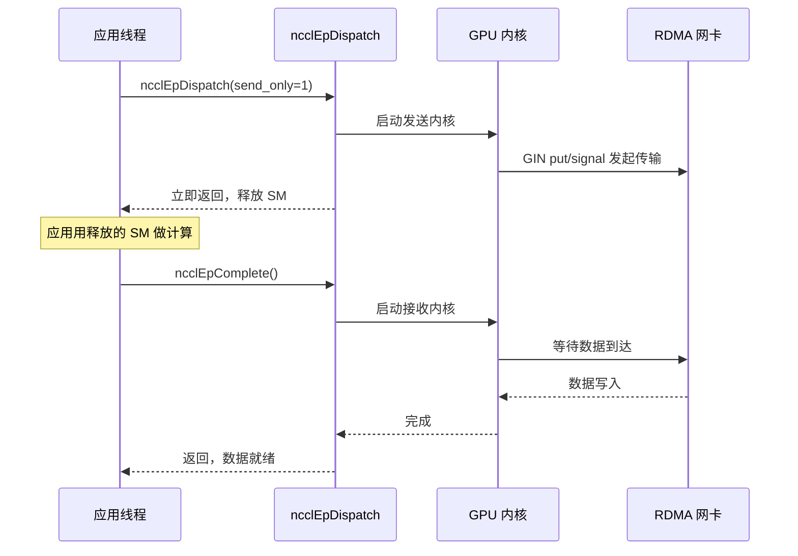
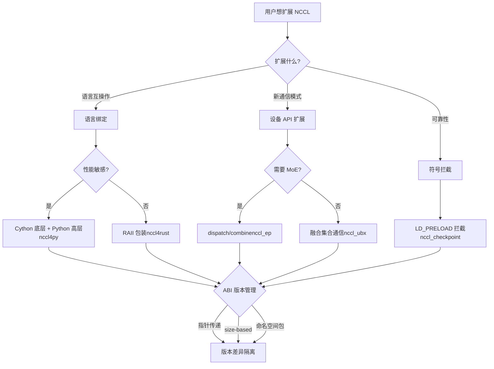

# 第 23 章：エコシステム拡張：nccl4py、nccl4rust、nccl_ep、nccl_ubx などの周辺プロジェクト

# 第23章：エコシステム拡張：nccl4py、nccl4rust、nccl_ep、nccl_ubx などの周辺プロジェクト

前章では、本番環境における NCCL の典型的な障害を調査しました。group セマンティクスの誤用、rank 数の不一致、stream の相互作用、ABI バージョンの競合、ネットワークタイムアウトです。これらの問題の多くは C ABI を直接使用する場面で発生しますが、現代の大規模モデル学習フレームワークは通常 C ABI を直接呼び出さず、Python や Rust などの言語バインディング、あるいは MoE や超帯域幅通信などのシナリオ向けの拡張プロジェクトを通じて NCCL の機能を再利用します。これらの周辺プロジェクトは bindings/ と contrib/ ディレクトリに配置され、実験的・コミュニティメンテナンスという位置づけであり、コアライブラリのリリース品質保証を継承していません。本章では nccl4py、nccl4rust、nccl_ep、nccl_ubx、nccl_checkpoint を一つずつ分析し、これらが言語バインディング、デバイス API 拡張、シンボルインターセプトという三つの経路を通じて、コアの外側にどのように豊かなエコシステムを構築しているかを見ていきます。

# nccl4py：Cython バインディングと名前空間パッケージ設計

## 直感的モデル：C ABI を Python が理解できる言葉に翻訳する

NCCL コアを C 言語しか話せない外交官、Python 学習スクリプトを Python しか話せないインターンだと想像してください。nccl4py はその翻訳者です——外交官の言葉（NCCL の動作）は変えず、「`ncclAllReduce(sendbuff, recvbuff, count, ...)`」を「`nccl.all_reduce(tensor)`」に翻訳するだけです。この翻訳層がなければ、すべての Python フレームワークが自前で ctypes バインディングを書く必要があり、重複作業でエラーも起きやすくなります。

## 階層構造：Cython 低レベル層 + Python 高レベル層

nccl4py の設計は二層構造です：低レベル層は Cython バインディング（`nccl/bindings/cynccl.pxd`）、高レベル層は Python API（`nccl.core`）です。README にはこの階層が明確に記載されています[FACT:bindings/nccl4py/README.md:4-4]：

> `nccl4py provides low-level Cython bindings and a high-level Python API`

Cython バインディングは`.pxd`ファイル形式で wheel に同梱されて配布され、他の Cython 拡張が直接`cimport` [FACT:bindings/nccl4py/README.md:39-43]：

```cython
from nccl.bindings cimport cynccl
```

> **[Design Inference & Architectural Trade-offs]**
> なぜ Python 層だけでなく Cython 層も公開するのか？それは、一部のフレームワーク（DeepSpeed や Megatron など）のコアループが Cython 内にあり、毎回の呼び出しで Python インタプリタを経由するとオーバーヘッドが大きすぎるからです。直接`cimport cynccl`することで、Cython 拡張が C に近いゼロオーバーヘッドで NCCL 関数を呼び出せます。これは「階層的公開」の典型的な設計です——高レベル層は一般ユーザーに、低レベル層は性能重視のシナリオに。

## 名前空間パッケージ：複数のディストリビューションが`nccl`プレフィックスを共有

これが nccl4py の最も巧妙な設計です。`nccl`は PEP 420 の暗黙的名前空間パッケージです[FACT:bindings/nccl4py/README.md:50-51]：

> `nccl` is a PEP 420 implicit namespace package. nccl4py provides `nccl.bindings` and `nccl.core`; other NCCL extension distributions can provide additional `nccl.*` subpackages.

> **[Design Inference & Architectural Trade-offs]**
> 従来の Python パッケージでは、`nccl/__init__.py`が`nccl`名前空間全体を「所有」します。nccl4py と nccl_ep の Python バインディングがどちらも`nccl.xxx`を提供しようとすると競合します——先にインストールした方が勝ちます。PEP 420 名前空間パッケージはこの問題を解決します：`__init__.py`がなくても、複数のディストリビューションがそれぞれ`nccl/`ディレクトリにサブパッケージを配置でき、Python のインポートシステムがそれらをマージします。したがって nccl4py は`nccl.bindings`と`nccl.core`を提供し、nccl_ep は`nccl.ep`を提供し、両者は共存できます[FACT:contrib/nccl_ep/README.md:80-82]。

この設計はエコシステム拡張にとって極めて重要です：将来、第三者が`nccl.monitoring`、`nccl.profiling`を追加したい場合、nccl4py のコードを変更する必要がありません。

## CUDA バージョン選択：extra メカニズム

インストール時に`nccl4py[cu12]`または`nccl4py[cu13]`で CUDA のメジャーバージョンを選択します[FACT:bindings/nccl4py/README.md:13-17]。README にはその理由が説明されています：extras は対応する NCCL runtime と CUDA Python 依存関係をインストールします[FACT:bindings/nccl4py/README.md:19]。公開済みの wheel には`CUDA_HOME`やローカル CUDA Toolkit は不要ですが、ソースからのビルドには[FACT:bindings/nccl4py/README.md:20-21]。

> **[Design Inference & Architectural Trade-offs]**
> 〔設計推論とアーキテクチャのトレードオフ〕

## これは Python エコシステムが CUDA バージョンの断片化に対処する標準的な手法です。CUDA 12 と 13 の ABI は互換性がなく、一つの wheel で両方をカバーできません。extra を使って pip がユーザー環境に応じて正しいバイナリ依存関係を選択することで、実行時に初めてバージョン不一致に気づく事態を避けられます。

**本番環境の落とし穴回避`__init__.py`落とし穴1：名前空間パッケージと**の競合。`nccl/`サードパーティパッケージが`__init__.py`の下に`nccl.core`を配置すると、PEP 420 名前空間パッケージのメカニズムが破壊され、`python -c "import nccl; print(nccl.__path__)"`のインポートが失敗します。調査方法：`AttributeError`、もし`nccl`が報告されたら

**が名前空間パッケージでないことを示します。** `cynccl.pxd`落とし穴2：Cython ABI バージョンのドリフト。[FACT:bindings/nccl4py/README.md:32-32]は実験的 API`.pxd`であり、NCCL アップグレード時に`cimport cynccl`が変わる可能性があります。

# に依存する Cython 拡張は nccl4py のバージョンと厳密に一致する必要があり、そうでなければコンパイル時のシンボル解決が失敗します。

## nccl4rust：RAII 所有権とデバイス側の境界

直感的モデル：コンパイラにライフサイクル管理を任せる`ncclCommInitRank`C 言語では、あなたは`ncclCommDestroy`で communicator を取得し、使用後は必ず

nccl4rust の核心的価値は、この所有権セマンティクスを NCCL の C ABI に適用することにある。

## 階層構造：5つの crate がそれぞれ役割を担う

README の Layout テーブルには5つの crate が列挙されている[FACT:contrib/nccl4rust/README.md:20-28]：

| Path | Purpose |
| --- | --- |
| `crates/nccl-sys` | bindgen が生成する生の host ABI |
| `crates/nccl` | Rust スタイルの host ラッパー + RAII 所有権 |
| `crates/nccl-device-sys` | `no_std`CUDA-Oxide デバイス宣言 |
| `crates/nccl-device` | 型付き`DevComm`、`Team`、`Window`ラッパー |
| `shim/` | 純粋な C-ABI シム、公開ヘッダーのみ使用 |

> **[Design Inference & Architectural Trade-offs]**
> この分割は意図的なものだ。README はその動機を説明している[FACT:contrib/nccl4rust/README.md:30-32]：host アプリケーションは`nccl`のみを使用でき、Rust GPU コンパイラは不要；CUDA-Oxide カーネルは`nccl-device`を使用；生の ABI が必要なコンシューマは`-sys`crate を選択できる。この「オンデマンド階層化」により、異なるユーザーは自分に必要なコンパイルコストだけを支払う。

## 重要な設計：デバイスコミュニケータを値ではなくポインタで渡す

これは nccl4rust で最も学ぶ価値のある設計判断だ。README の Host/device ownership boundary のセクション[FACT:contrib/nccl4rust/README.md:211-219]：

> `ncclDevCommCreate` produces a versioned public structure in host memory. The host `DeviceCommunicator` wrapper owns that structure and destroys it before its parent communicator. CUDA-Oxide remains responsible for allocating device memory, copying those bytes, and keeping the copy alive while kernels execute. Kernels construct `nccl_device::DevComm` from a pointer to that device copy. Using a pointer rather than a by-value Rust mirror keeps the versioned C struct layout out of the kernel argument ABI.

> **[Design Inference & Architectural Trade-offs]**
> なぜ Rust 構造体で C 構造体をミラーしないのか？なぜなら`ncclDevComm_t`はバージョン化されているため——NCCL のバージョンによってフィールドが異なる可能性がある。もしカーネルパラメータを値で Rust ミラーとして渡すと、カーネル ABI が特定の NCCL バージョンの構造体レイアウトに束縛される。NCCL が構造体をアップグレードすると、コンパイル済みのすべてのカーネルを再コンパイルする必要がある。ポインタで渡せばアドレスを1つ渡すだけで、カーネルはポインタ経由でアクセスし、レイアウト変更が ABI に影響しない。これは前章で述べた`ncclEpLayoutInfo_t`の size-based ABI と同じ考え方だ——**バージョン差異をポインタの背後に隔離する**。

## 安全境界：どれが unsafe か

README の Current API contracts のセクションには6つの契約が列挙されている[FACT:contrib/nccl4rust/README.md:230-249]、そのうち重要なものは：

- 生の`-sys`crate は C ABI をミラーするだけで、所有権やライフタイムの検証を追加しない[FACT:contrib/nccl4rust/README.md:232-233]
- 現在の集合通信およびポイントツーポイントのラッパーは生のデバイスポインタを受け入れ、`unsafe` [FACT:contrib/nccl4rust/README.md:42-45]
- として宣言されている。ポインタ変換メソッドは生のデバイスポインタを返し、オフセット境界、アラインメント、peer メンバーシップ、エイリアス、ウィンドウライフタイムを検証できない[FACT:contrib/nccl4rust/README.md:242-244]

> **[Design Inference & Architectural Trade-offs]**
> これが NCCL を Rust でバインディングする根本的な困難だ：NCCL の多くの API 契約は「バッファは CUDA stream が完了するまで有効でなければならない」だが、Rust の型システムは「stream 完了」という非同期イベントを表現できない。したがってこれらのメソッドは`unsafe`にしかできず、責任を呼び出し側に返す。README も改善の方向性を指摘している[FACT:contrib/nccl4rust/README.md:44-45]：stream-aware なバッファ抽象により、これらの要件を安全な API にエンコードできる。これは将来の課題だ。

## デバイス側：CUDA-Oxide と LTOIR シム

デバイス側の核心的な課題は：NCCL のデバイス API は C++ テンプレートであり、Rust デバイスコード（CUDA-Oxide）は C ABI を必要とする。解決策は C++ シム[FACT:contrib/nccl4rust/README.md:26]：

> `shim/` — CUDA C++ C-ABI shim built exclusively from public `nccl.h` and `nccl_device.h`

シムは LTOIR（LLVM 中間表現）にコンパイルされ、Rust PTX と一緒にリンクされて cubin になる[FACT:contrib/nccl4rust/README.md:165-167]。README はビルドフローを説明している[FACT:contrib/nccl4rust/README.md:158-163]：

```bash
make device \
  NCCL_INCLUDE_DIR="$NCCL_INCLUDE_DIR" \
  CUDA_HOME="$CUDA_HOME" \
  ARCH=90
```

> **[Design Inference & Architectural Trade-offs]**
> LTOIR は NVIDIA のリンク時最適化中間フォーマットだ。LTOIR を直接 cubin にコンパイルするのではなく使用するのは、シムと Rust カーネルがリンク時にクロスランゲージ最適化——例えばシム関数を Rust カーネルにインライン化——を行うためだ。これは「C++ テンプレート + Rust カーネル」の混合プログラミングの鍵となる技術だ。

## 本番環境での落とし穴回避

**落とし穴1：NCCL バージョンは正確に一致する必要がある。**README は明確に要求している`Matching NCCL 2.31 headers and runtime` [FACT:contrib/nccl4rust/README.md:80-81]、プロトタイプが初期の NCCL デバイス API バージョンで異なるフィールドを直接初期化するため。ヘッダーファイルと`libnccl.so`のバージョンが一致しないと、デバイスコミュニケータのフィールドがずれる。

**落とし穴2：CUDA graph とデバイスコミュニケータ。**デバイスコミュニケータは host メモリ内のバージョン化された構造体で、デバイスにコピーされた後カーネルがポインタ経由でアクセスする。CUDA graph キャプチャ時にデバイスポインタをカーネルパラメータに焼き込むと、その後コミュニケータを再作成すると graph 内のポインタが無効になる。これは nccl_ep の RDMA buffer 再割り当て問題と同源だ。

**落とし穴3：安全な初期化は生の group と混用できない。**README は警告している[FACT:contrib/nccl4rust/README.md:238-239]：安全な初期化と出力を生成する管理呼び出しは、生の`nccl-sys`group 状態と混用できない。なぜならラッパー層は生の group 状態を観察できないからだ。混用するとラッパー層のポーリングロジックと生の group セマンティクスが衝突する。

# nccl_ep：エキスパート並列の dispatch/combine プリミティブ

## 直感的モデル：MoE の「仕分けセンター」

MoE（Mixture of Experts）モデルでは、各トークンをtop-k個のエキスパートにルーティングする必要がある。エキスパートは異なるGPU上に分散しているため、トークンはGPU間を転送される必要がある——これがdispatchである。エキスパートの計算後、結果は元のトークンが存在するGPUに送り返される——これがcombineである。nccl_epは、この「仕分けセンター」の通信エンジンである。

これがなければ、各MoEフレームワークが独自にdispatch/combineの通信ロジックを実装しなければならず、重複が多く最適化が困難になる。nccl_epはこれをNCCLエコシステムにおける標準プリミティブとした。

## 2つのアルゴリズム：LLとHT

READMEでは2つのアルゴリズムが説明されている[FACT:contrib/nccl_ep/README.md:36-40]：

- **Low-Latency (LL)**：小バッチ、レイテンシ敏感（LLM推論）。直接的なポイントツーポイントall-to-all通信を使用する。
- **High-Throughput (HT)**：大バッチの学習および推論プリフィル。階層型通信を使用——ノード内はNVLinkで集約、ノード間はRDMA。Hopperのwarp-specializedパイプラインとTMAを活用する。

> **[Design Inference & Architectural Trade-offs]**
> これら2つのアルゴリズムの分岐は、MoE推論と学習の異なるボトルネックを反映している。推論時はバッチが小さく、レイテンシが主要な問題であるため、LLは直接的なポイントツーポイントで集約オーバーヘッドを回避する。学習時はバッチが大きく、帯域幅が主要な問題であるため、HTは階層型集約でノード間トラフィックを削減する。これは典型的な「ワークロード特性に応じたアルゴリズム選択」の設計である。

## 中核データ構造：ncclEpGroupConfig_t

これはEPの設定構造体であり、フィールドが多い[FACT:contrib/nccl_ep/README.md:339-362]。主要フィールド：

- `size`と`version`：ABIバージョンチェック。前章で述べたsize-based ABIと同源[FACT:contrib/nccl_ep/README.md:340-341]
- `algorithm`：HTまたはLL[FACT:contrib/nccl_ep/README.md:342]
- `max_dispatch_tokens_per_rank`：単一rankが最大でdispatchするトークン数[FACT:contrib/nccl_ep/README.md:344]
- `rdma_buffer_size`：LLモードのRDMAバッファサイズ[FACT:contrib/nccl_ep/README.md:356-356]
- `alloc`：カスタムデバイスメモリアロケータ[FACT:contrib/nccl_ep/README.md:359]

> **[Design Inference & Architectural Trade-offs]**
> `rdma_buffer_size`の`NCCL_EP_AUTO`セマンティクスは深掘りする価値がある。READMEは[FACT:contrib/nccl_ep/README.md:396-406]を次のように説明している：AUTOモードではバッファは`ncclEpCreateGroup`時に割り当てられず、最初の`ncclEpInitHandle`時に実際の`(layout, num_topk)`に応じて割り当てられる。後続のhandleがより大きなバッファを必要とする場合、集団的に再割り当てが行われる。この「遅延割り当て」設計は、ユーザーがバッファサイズを推測することを避けるが、3つの制約を導入する[FACT:contrib/nccl_ep/README.md:396-406]：

1. すべてのrankが同じ`(layout, num_topk)`で同期呼び出しを行う必要がある`ncclEpInitHandle`

2. 再割り当ては古いバッファの内容を破棄し、`send_only`に一時保存されたデータは失われる

3. CUDA graphキャプチャはRDMAベースアドレスポインタを焼き込むため、再割り当て後は再キャプチャが必要

**これは本章で最も重要な本番環境の落とし穴の一つである。**遅延割り当ては使いやすさと引き換えに、「いつ再割り当てするか」の複雑さをユーザーに転嫁している。

## テンソル記述子：静的と動的の2形態

`ncclEpTensor_t`は軽量な値型である[FACT:contrib/nccl_ep/README.md:310-332]。READMEは2つの使用法を示している：

**静的記述子**（スタック上、`NCCL_EP_TENSOR_INIT_INLINE`）[FACT:contrib/nccl_ep/README.md:806-809]：

```c
ncclEpTensor_t expert_counters = { NCCL_EP_TENSOR_INIT_INLINE,
                                   .ndim = 1, .datatype = ncclInt32,
                                   .data = expert_counters_data,
                                   .sizes = expert_counters_dims };
```

**動的記述子**（ヒープ上、`ncclEpTensorAlloc`）[FACT:contrib/nccl_ep/README.md:793-798]：

```c
ncclEpTensor_t* topk_idx = nullptr;
{
    size_t dims[2] = { num_tokens, top_k };
    ncclEpTensorAlloc(&topk_idx, 2, ncclInt64, dims, /*config=*/NULL);
    cudaMalloc(&topk_idx->data, num_tokens * top_k * sizeof(int64_t));
}
```

> **[Design Inference & Architectural Trade-offs]**
> 2形態の違いは`sizes`配列の所有権にある。静的記述子の`sizes`は呼び出し側が所有するスタック配列であり、記述子より長く生存する必要がある[FACT:contrib/nccl_ep/README.md:325-326]。動的記述子の`sizes`はライブラリが所有するヒープコピーであり、`ncclEpTensorDestroy`によって解放される[FACT:contrib/nccl_ep/README.md:514-514]。公開構造体は`ncclEpTensor_t*`ポインタを保持するため、2形態を同じ呼び出し内で混在させることができる[FACT:contrib/nccl_ep/README.md:514-514]。この設計により、単純なシナリオではヒープ割り当てがゼロになり、複雑なシナリオではライブラリ管理の利便性が得られる。

## 実行モード：同期と段階的

READMEのExecution Modesの節は[FACT:contrib/nccl_ep/README.md:701-741]2つのモードを説明している：

**同期モード**（デフォルト）：データ受信待ちの時間を含め、操作全体を通じてGPUリソースを占有する[FACT:contrib/nccl_ep/README.md:705-709]。

**段階的モード**（LLのみ）：操作をsendとreceiveの2段階に分割する[FACT:contrib/nccl_ep/README.md:718-726]。`send_only = 1`で開始し、データ転送が開始されるとGPUリソースを解放し、アプリケーションはそのリソースで計算を行い、最後に`ncclEpComplete`で完了する[FACT:contrib/nccl_ep/README.md:728-741]。



このシーケンス図は段階的モードの中核的価値を示している：`send_only`は開始後すぐに戻り、SMリソースが計算に解放され、アプリケーションが他の作業を終えた後に`ncclEpComplete`を呼んで受信完了を待つ。これは「計算-通信オーバーラップ」の古典的なパターンである。

## 本番環境の落とし穴回避

**落とし穴1：`ncclEpInitHandle`の条件的集団性。**AUTOモードでは、`ncclEpInitHandle`は条件的集団呼び出しである[FACT:contrib/nccl_ep/README.md:396-406]。あるrankがlayoutの違いにより再割り当てをトリガーした場合、他のrankも同期して参加する必要がある。同期しないとデッドロックやデータ破損が発生する。

**落とし穴2：CUDA graphキャプチャ期間中の`ncclEpInitHandle`。**READMEは明確に警告している[FACT:contrib/nccl_ep/README.md:396-406]：AUTOモードでは`cudaStreamBeginCapture`と`cudaStreamEndCapture`の間で`ncclEpInitHandle`を呼び出してはならない。再割り当てはRDMAベースアドレスを変更するが、graphキャプチャはすでに古いポインタを焼き込んでいるためである。

**落とし穴3：guardオーバーヘッド。**READMEは言及している[FACT:contrib/nccl_ep/README.md:299-303]：EPはデフォルトで内部通信バッファにguardを追加し、隣接するdispatch/combine呼び出しが互いのデータを破壊するのを防ぐ。上級ユーザーが連続操作が競合しないことをすでに保証している場合、`NCCL_EP_DISABLE_GUARD=1`で無効化してオーバーヘッドを回収できる。しかし誤って無効化するとデータのサイレント破損を引き起こす。

# nccl_ubx：融合集合通信と対称アロケータ

## 直感的モデル：「引っ越し前後の梱包・開梱」も引っ越し業者に任せる

通常の集合通信はデータを運ぶだけです。しかし実際のモデルでは、AllReduce の前に残差加算を行い、後に RMSNorm を行うことがよくあります。これらの操作を別々に行うと、データは VRAM 内を何度も往復することになります。nccl_ubx のアプローチは、残差加算、RMSNorm、mxfp8 量子化をすべて集合通信カーネルに融合することです[FACT:contrib/nccl_ubx/README.md:6-9]。まるで引越し業者が箱を運ぶだけでなく、梱包と開梱も手伝い、一度で完了するようなものです。

## ハードウェア前提：NVLink マルチキャストが必須

README は SM 9.0+（Hopper/Blackwell）を明確に要求しており、MC カーネルパスには NVLink マルチキャストハードウェアが必要です[FACT:contrib/nccl_ubx/README.md:24-24]。SM 8.0（A100）はサポートされません。Ampere には NVLink マルチキャストハードウェアがなく、`multimem.*`インライン PTX が arch 8.0 向けにアセンブルできないためです[FACT:contrib/nccl_ubx/README.md:24-24]。

> **[Design Inference & Architectural Trade-offs]**
> これが ubx が「実験的」である理由を説明しています——Hopper で初めて導入された NVLink マルチキャスト機能に依存しているのです。`multimem.*`この命令により、1 つの GPU が 1 命令で複数の GPU の対称アドレスにデータを書き込むことができ、これがハードウェアアクセラレーションによる集合通信の基盤です。このハードウェアがなければ、ubx の中核最適化は成立しません。

## 対称アロケータ：PyTorch テンソルを NCCL ウィンドウに変える

ubx の中核はカスタム対称アロケータです[FACT:contrib/nccl_ubx/README.md:11-14]：

> A central piece of the design is a custom symmetric allocator that provides zero-copy collective input/output buffers while remaining easy to plug into existing PyTorch code: tensors are ordinary `torch.Tensor` instances backed by an NCCL-managed symmetric window.

> **[Design Inference & Architectural Trade-offs]**
> これが ubx の最も巧妙な点です。NCCL の対称メモリは、すべての rank が同じ仮想アドレスセットでバッファにアクセスすることを要求します（第 14 章で説明）。しかし PyTorch ユーザーは`torch.Tensor`を使うことに慣れています。ubx は`torch.Tensor`の基盤ストレージを直接 NCCL 対称ウィンドウにすることで、ユーザーコードを変更せずに集合通信をゼロコピーで行えます——入出力バッファが対称メモリそのものであり、余分なコピーが不要です。

## 集合通信のバリアントと自動選択

README の Available collectives テーブル[FACT:contrib/nccl_ubx/README.md:90-90]：

| Op | Variants | Auto-select |
| --- | --- | --- |
| AllReduce | `mc`, `uc`, `lamport`, `auto` | Lamport ≤ 0.25 MB, else MC |
| AllToAll | `uc`, `lamport`, `auto` | Lamport ≤ 0.25 MB, else UC |
| AllGather | `mc` | — |

> **[Design Inference & Architectural Trade-offs]**
> 3 つのバリアントの違い：`mc`は NVLink マルチキャストハードウェアを使用し、`uc`は通常のユニキャストを使用し、`lamport`は低レイテンシアルゴリズムです。自動選択は 0.25 MB で分岐——小メッセージは Lamport 低レイテンシ、大メッセージは MC/UC 高帯域幅。この閾値は NCCL コアのチューニングロジックに似ていますが、ubx では固定閾値に簡略化されています。

## 融合操作：residual + RMSNorm

README に記載[FACT:contrib/nccl_ubx/README.md:103-103]：

> `SymmAllocator.allreduce_mc()` and `allreduce_lamport()` accept optional `gamma`/`residual_in` parameters to fuse residual addition + RMSNorm into the same kernel.

> **[Design Inference & Architectural Trade-offs]**
> これが ubx の中核的な売りです。従来のフローは：AllReduce → 残差加算 → RMSNorm で、3 回の VRAM 読み書きでした。融合後は 1 回のカーネルで完了し、VRAM 帯域幅を 2/3 節約できます。帯域幅制限のある大規模モデル訓練にとって、これは確実な高速化です。

## MoE トークンディスパッチ + mxfp8 量子化

README に記載`a2av_token_bf16_mxfp8` [FACT:contrib/nccl_ubx/README.md:103-103]：

> a single GPU kernel that routes bf16 tokens to remote ranks while quantizing them to mxfp8 (E8M0 scale per 32 elements) on the fly.

> **[Design Inference & Architectural Trade-offs]**
> このカーネルは「ルーティング + 量子化」を融合します。bf16 は 16 ビット、mxfp8 は 8 ビットで、量子化後はデータ量が半減し、ノード間転送の帯域幅要件も半減します。転送前に量子化する方が転送後に量子化するより優れています——節約されるのはネットワーク帯域幅であり、VRAM 帯域幅ではないからです。これは MoE 推論の鍵となる最適化です。

## 本番環境での落とし穴回避

**落とし穴 1：`TORCH_CUDA_ARCH_LIST`には`a`サフィックスが必須です。**README は強調しています[FACT:contrib/nccl_ubx/README.md:47-56]：`a`サフィックスを使用して完全な`multimem.*`命令セットへのアクセスを確保します。一部のアクセラレーション専用バリアントは通常の`9.0`/`10.0`では利用できず、将来のカーネルがこれらのバリアントを使用すると、静かに性能が低下するかアセンブルに失敗します。

**落とし穴 2：`UBX_BUILD_TIMEOUT`のランタイムオーバーヘッド。**README は説明しています[FACT:contrib/nccl_ubx/README.md:47-56]：1 に設定するとカーネル側で spinloop タイムアウトがコンパイルされ、ランタイムオーバーヘッドが増加します（余分な`clock64()`チェックとタイムアウト時の`printf`）。ハングの調査時のみ有効にしてください。

**落とし穴 3：`NCCL_NVLS_ENABLE=0`の降格。**README はこの環境変数を挙げています[FACT:contrib/nccl_ubx/README.md:202]：0 に設定すると NVLink マルチキャストなしで実行できます。ただし MC カーネルパスが無効になり、UC/Lamport バリアントのみとなり、性能が大幅に低下します。

# nccl_checkpoint：LD_PRELOAD インターセプトと状態リプレイ

## 直感的モデル：通信ドメインのスナップショットを撮る

訓練タスクが数時間実行された後、突然別のマシンに移行する必要がある、あるいは復元のために状態を保存する必要があるとします。通常のチェックポイントはモデルの重みとオプティマイザ状態のみを保存しますが、NCCL 通信ドメインの状態（rank 番号、接続、バッファ）は直接シリアライズできません。nccl_checkpoint のアプローチは：すべての NCCL 呼び出しをインターセプトし、初期化ステップを記録し、復元時にこれらのステップをリプレイすることです[FACT:contrib/nccl_checkpoint/README.md:3-7]。

まるで家具の組み立て手順をすべて録画し、引越し後にその録画に従って再組み立てするようなもので、組み立て済みの家具を丸ごと運ぼうとするのではありません。

## 中核メカニズム：LD_PRELOAD シンボルインターセプト

README の Design セクション[FACT:contrib/nccl_checkpoint/README.md:17-20]：

> The application is launched with `LD_PRELOAD=/path/to/libnccl-checkpoint-shim.so` in the environment. This allows the library to intercept all calls to NCCL functions to capture all resource initialization steps.

> **[Design Inference & Architectural Trade-offs]**
> `LD_PRELOAD`は Linux 動的リンカのメカニズムです：アプリケーションが通常の共有ライブラリをロードする前に、指定された`.so`を先にロードします。この`.so`内で NCCL と同名のシンボル（例えば`ncclCommInitRank`）が定義されている場合、動的リンカは`.so`内のバージョンを優先的に使用します。これにより shim がすべての NCCL 呼び出しをインターセプトし、パラメータを記録し、復元時にリプレイできます。

## チェックポイントフロー

README の Python サンプル[FACT:contrib/nccl_checkpoint/README.md:44-58]完全なフローを示しています：

```python
nccl_checkpoint.checkpoint_prepare()
drv.cuCheckpointProcessLock(os.getpid(), None)
drv.cuCheckpointProcessCheckpoint(os.getpid(), None)
# CRIU dump happens here.
drv.cuCheckpointProcessRestore(os.getpid(), None)
drv.cuCheckpointProcessUnlock(os.getpid(), None)
nccl_checkpoint.checkpoint_restore()
```

> **[Design Inference & Architectural Trade-offs]**
> フローは4ステップに分かれます：

1. `checkpoint_prepare()`：すべてのcommunicatorを破棄し、CUDA CheckpointとCRIUがプロセス状態を安全にダンプできるようにする[FACT:contrib/nccl_checkpoint/README.md:25-27]

2. `cuCheckpointProcessLock/Checkpoint`：CUDAドライバがプロセスをロックしてチェックポイントを実行

3. CRIU dump：外部ツールがプロセスのメモリとファイルディスクリプタをディスクにダンプ

4. `cuCheckpointProcessRestore/Unlock` + `checkpoint_restore()`：プロセスを復元し、NCCL設定をリプレイ[FACT:contrib/nccl_checkpoint/README.md:29-31]

## Redis KVS：マシン間ランデブー

READMEでRedisが必要な理由を説明[FACT:contrib/nccl_checkpoint/README.md:33-38]：

> Because it is useful to restore on different hardware, IP addresses may have changed. There is no convenient way to directly inform the NCCL Checkpoint library of all peer addresses during the restore process, so the library depends on a temporary Redis Key-Value store to be made available.

> **[Design Inference & Architectural Trade-offs]**
> 復元時にマシンが変わり、IPが変わる可能性があります。NCCL通信ドメインの再構築には、すべてのpeerの新しいアドレスを知る必要があります。しかしshimはこれらのアドレスを直接知ることができないため、Redis KVSをランデブーに使用します——すべてのプロセスが新しいアドレスをKVSに書き込み、KVSから他のプロセスのアドレスを読み取ります。これは引っ越し後に大家が公共の掲示板で新しい住所を交換するようなものです。

READMEではRedisは復元のブートストラップ段階でのみ必要と説明[FACT:contrib/nccl_checkpoint/README.md:221-221]，`checkpoint_restore()`が返った後は停止できます。

## 制限：3つの非サポート

READMEのLimitationsセクション[FACT:contrib/nccl_checkpoint/README.md:119-129]に3つの制限が記載されています：

1. `ncclWinGetUserPtr()`が返すポインタは復元後に無効[FACT:contrib/nccl_checkpoint/README.md:125-126]

2. CUDA graphキャプチャ非サポート[FACT:contrib/nccl_checkpoint/README.md:136-136]

3. デバイスAPI非サポート——`ncclDevComm`オブジェクトとデバイス可視の`ncclWindow_t`値は復元できません[FACT:contrib/nccl_checkpoint/README.md:136-136]

> **[Design Inference & Architectural Trade-offs]**
> 3番目の制限が最も深刻です。デバイスAPIはNCCLの新しい方向性（第19章で説明したDevComm）ですが、checkpointはサポートしていません。つまりデバイスAPIを使用するアプリケーション（nccl_ep、nccl_ubxなど）はcheckpointで復元できません。これはエコシステムの断片化の現れです——新機能は速く進むが、信頼性ツールが追いついていません。

## 本番環境での落とし穴回避

**落とし穴1：`NCCL_CHECKPOINT_KVS_PATH`はチェックポイント前に設定し、復元時には変更できません。**READMEの警告[FACT:contrib/nccl_checkpoint/README.md:221-221]：この環境変数はチェックポイント準備段階では使用されませんが、チェックポイントにキャプチャされ、復元時に簡単に変更できません。そのためチェックポイント前に設定しておく必要があり、復元環境でRedisアドレスが一致している必要があります。

**落とし穴2：`NCCL_CHECKPOINT_KVS_TIMEOUT`はshimのRedisランデブーのみをカバーします。**READMEの説明[FACT:contrib/nccl_checkpoint/README.md:221-221]：デフォルトは300秒。communicatorのリプレイがNCCL転送確立段階に入ると、基盤のNCCL転送呼び出しは独自の動作を使用し、転送固有の診断が必要になる場合があります。つまり、タイムアウトはRedis段階のみを保護し、転送確立段階のハングは`NCCL_DEBUG`で調査する必要があります。

**落とし穴3：NCCLバージョンが一致する必要があります。**READMEではNCCL 2.31.0以降を要求[FACT:contrib/nccl_checkpoint/README.md:158]、また`NCCL_SRC`パス内のNCCLバージョンがランタイムNCCLライブラリバージョンと正確に一致することを推奨[FACT:contrib/nccl_checkpoint/README.md:156-158]。バージョンの不一致はリプレイ時の構造体レイアウトのずれを引き起こします。

# 設計思考：エコシステム拡張の3つのモード

これら5つのプロジェクトを振り返ると、NCCLエコシステム拡張の3つのモードを归纳できます：

**モード1：言語バインディング（nccl4py、nccl4rust）。**核心的な課題は所有権とライフサイクルです。CのABIには所有権セマンティクスがなく、バインディング層が自分で補う必要があります。nccl4pyはCythonで階層化し、nccl4rustはRAII +`unsafe`境界を使用します。共通点は：**バージョン差異をポインタの背後に隔離する**——nccl4rustはポインタでDevCommを渡し、nccl4pyは名前空間パッケージでバージョンを隔離します。

**モード2：デバイスAPI拡張（nccl_ep、nccl_ubx）。**核心的な課題はABIバージョン管理とリソースライフサイクルです。nccl_epはsize-based ABI（前章で詳述）、nccl_ubxは対称アロケータを使用します。共通点は：**遅延割り当て + 集団再割り当て**——nccl_epのRDMA bufferとnccl_ubxの対称プールはどちらもオンデマンド割り当てですが、再割り当てにはすべてのrankの同期が必要です。

**モード3：シンボルインターセプト（nccl_checkpoint）。**核心的な課題は状態キャプチャとリプレイです。`LD_PRELOAD`で全てのNCCL呼び出しをインターセプトし、初期化ステップを記録し、復元時にリプレイします。このモードはNCCLコアを変更しませんが、既存アプリケーションに透過的にチェックポイント機能を追加できます。

> **[Design Inference & Architectural Trade-offs]**
> 3つのモードの共通制約は**NCCLバージョン互換性**です。すべてのプロジェクトが正確に一致するNCCLバージョンを要求します。NCCLのABIが進化しているためです。これはNCCLエコシステムの根本的な緊張を反映しています：コアは急速に反復するが、周辺プロジェクトは安定性を必要とします。size-based ABI、ポインタ渡し、名前空間パッケージはすべてこの緊張を緩和する技術的手段です。



この意思決定図はNCCL拡張の選択パスを示しています。どの道を選んでも、最終的にはABIバージョン管理という核心的な問題に直面し、3つの技術的手段（ポインタ渡し、size-based ABI、名前空間パッケージ）はすべてバージョン差異を安定したインターフェースの背後に隔離します。

# 本章のまとめ

本章ではNCCLエコシステムの5つの周辺プロジェクトを分析しました：

- **nccl4py**Cython レイヤリング + PEP 420 名前空間パッケージで、Python エコシステムをゼロコンフリクトで拡張可能にする`nccl.*`サブパッケージ。
- **nccl4rust**RAII 所有権 + ポインタ渡しのデバイスコミュニケータで、バージョン管理された C 構造体レイアウトをカーネル ABI の外に隔離する。
- **nccl_ep**LL/HT デュアルアルゴリズム + 遅延 RDMA バッファ割り当てで、MoE に dispatch/combine プリミティブを提供するが、条件付き集合呼び出しと CUDA graph 無効化の制約を導入する。
- **nccl_ubx**対称アロケータ + カーネル融合で、残差加算、RMSNorm、mxfp8 量子化を集合通信カーネルに折り込むが、Hopper+ の NVLink マルチキャストハードウェアに依存する。
- **nccl_checkpoint**用`LD_PRELOAD`シンボルインターセプト + Redis rendezvous で、クロスマシン通信ドメインのチェックポイントを実現するが、デバイス API と CUDA graph はサポートしない。

# 本章の考察とセルフチェック

Q1: nccl_ep の`rdma_buffer_size = NCCL_EP_AUTO`モードで、rank 0 が先に`ncclEpInitHandle`を呼び出してバッファ再割り当てをトリガーし、rank 1 は layout が異なるため再割り当てをトリガーしなかった場合、何が起こるか？[FACT:contrib/nccl_ep/README.md:396-406]の制約を踏まえて分析せよ。

**参考解説**：README に明記されている[FACT:contrib/nccl_ep/README.md:396-406]：`All ranks must call ncclEpInitHandle in lockstep with the same (layout, num_topk)`。AUTO モードでは`ncclEpInitHandle`は条件付き集合呼び出しである——再割り当てがトリガーされるかどうかは、その handle の`(layout, num_topk)`が現在のバッファより大きな空間を必要とするかどうかに依存する。

rank 0 の layout がより大きなバッファを必要とし再割り当てをトリガーする一方、rank 1 の layout がそれを必要としない場合、rank 0 は「deregister window → free → ncclMemAlloc → register」という集合操作を実行する[FACT:contrib/nccl_ep/README.md:396-406]が、rank 1 は実行しない。これにより 2 つの問題が生じる：

1. **集合操作の不一致**：NCCL の window deregister/register は集合操作であり、すべての rank の参加が必要である。rank 0 が一方的に実行すると、rank 1 は後続の通信で古いウィンドウハンドルを参照する一方、rank 0 はすでに新しいウィンドウに切り替わっているため、通信失敗やデータ破損が発生する。

2. **ベースアドレスの不一致**：再割り当て後、rank 0 の RDMA ベースアドレスは変わるが、rank 1 は変わらない。README には「recorded layout offsets on every live handle are pure offsets relative to the group's rdma_buffer and resolve correctly against the new base」[FACT:contrib/nccl_ep/README.md:396-406]とあるが、これはすべての rank が再割り当てする前提でのみ成立する。rank 1 のベースアドレスは変わらず、rank 0 は変わったため、クロス rank のアドレス解決がずれる。

正しい方法は：すべての rank が同じ`(layout, num_topk)`で同期的に`ncclEpInitHandle`を呼び出し、再割り当ての決定が一致することを保証する。保証できない場合は、明示的な`rdma_buffer_size > 0`モードを使用し、`ncclEpCreateGroup`時に十分大きなバッファを一度に割り当て、実行時の再割り当てを避ける[FACT:contrib/nccl_ep/README.md:396-406]。

Q2: nccl4rust はなぜ値渡しではなくポインタで`ncclDevComm_t`をデバイスカーネルに渡すのか？値渡しに変更した場合、NCCL が構造体レイアウトをアップグレードした後に何が起こるか？[FACT:contrib/nccl4rust/README.md:211-219]を踏まえて分析せよ。

**参考解説**：README に明記されている[FACT:contrib/nccl4rust/README.md:217-219]：`Kernels construct nccl_device::DevComm from a pointer to that device copy. Using a pointer rather than a by-value Rust mirror keeps the versioned C struct layout out of the kernel argument ABI.`

`ncclDevComm_t`はバージョン管理された公開構造体であり、NCCL バージョンによってフィールドが異なる可能性がある。値渡しの場合：

1. **カーネル ABI が構造体レイアウトにバインドされる**：カーネル引数を値渡しすると、コンパイラは構造体全体のバイト配置をカーネルの呼び出し規約に焼き込む。NCCL が構造体をアップグレード（フィールド追加、フィールド順序変更、アラインメント変更）した後も、コンパイル済みカーネルは古いレイアウトで引数を解釈し続けるため、フィールドがずれる。

2. **すべてのカーネルを再コンパイルする必要がある**：NCCL をアップグレードするたびに、デバイスコミュニケータを使用するすべてのカーネルを再コンパイルしなければならない。多数のマシンにデプロイされたトレーニングタスクにとって、これは巨大な運用負担となる。

3. **バージョン間の非互換**：host 側が新しい NCCL でコミュニケータを作成し、デバイス側カーネルが古い NCCL でコンパイルされている場合、値渡しではカーネルが誤ったフィールドを読み取る。

ポインタ渡しなら 8 バイトのアドレスを 1 つ渡すだけで、カーネルはポインタ経由で構造体にアクセスする。NCCL が構造体レイアウトをアップグレードしたとき、host 側が新バージョンでコミュニケータを作成しデバイスにコピーすれば、カーネルがポインタ経由でアクセスするのは新しいレイアウトである。カーネル自体は再コンパイル不要である。なぜならその引数は単なるアドレスだからだ。これによりバージョン差異をポインタの背後に隔離できる——**ポインタは安定しており、ポインタが指す内容は変わりうる**。

これは nccl_ep の size-based ABI と同じ設計哲学である：間接層によって、変わりやすいバージョン詳細を安定したインターフェースの背後に隔離する。

Q3: nccl_checkpoint は`LD_PRELOAD`で NCCL 呼び出しをインターセプトするが、アプリケーションが nccl4py と nccl_checkpoint の両方にリンクしている場合、nccl4py の Cython バインディングは直接`libnccl.so`のシンボルを呼び出すため、`LD_PRELOAD`はインターセプトできるか？シンボル解決順序を分析せよ。

**参考解説**：これはシンボル解決順序に依存する。`LD_PRELOAD`のメカニズムは：動的リンカがアプリケーションの正常な依存関係にある共有ライブラリをロードする前に、まず`LD_PRELOAD`で指定された`.so`をロードする。アプリケーション（またはそれが依存するライブラリ）がシンボルを参照すると、動的リンカは「先にロードしたものが先に解決される」順序で検索する——`LD_PRELOAD`の`.so`が`libnccl.so`。

より優先される。したがって理論上、nccl4py の Cython バインディングが`ncclCommInitRank`を呼び出すとき、動的リンカはまず`libnccl-checkpoint-shim.so`内の同名シンボルを見つけ、インターセプトが成功する。

しかし、いくつかのエッジケースがある：

1. **直接`dlopen` + `dlsym`**：nccl4py が`dlopen("libnccl.so")`を使ってから`dlsym`で関数ポインタを取得する場合、`LD_PRELOAD`はインターセプトできない。なぜなら`dlsym`は指定された`.so`内で直接シンボルを探し、グローバルシンボルテーブルを経由しないからである。README では C アプリケーションが`dlsym`を使って`ncclCheckpointPrepare` [FACT:contrib/nccl_checkpoint/README.md:109-109]を解決すると言及されているが、それはチェックポイント自身のシンボルを解決するものであり、NCCL シンボルではない。

2. **シンボルバインディングのタイミング**：nccl4py が`LD_PRELOAD`が有効になる前に NCCL シンボルをバインドした場合（例えば`__attribute__((constructor))`内で）、インターセプトが失敗する可能性がある。しかし通常、`LD_PRELOAD`はプロセス起動時に有効になり、どのユーザーコードよりも早い。

3. **`RTLD_DEEPBIND`**：nccl4py が`dlopen`を使う際に`RTLD_DEEPBIND`を指定すると、シンボル検索は`libnccl.so`内部で優先的に解決され、`LD_PRELOAD`をバイパスする。これはよくある落とし穴である。

4. **静的リンク**：nccl4py が NCCL を静的リンクしている場合、`LD_PRELOAD`は完全に無効である。シンボルはすでにコンパイル時に解決されているからである。

したがって結論は：**通常の動的リンクのシナリオでは`LD_PRELOAD`は nccl4py の呼び出しをインターセプトできる**が、nccl4py が`dlopen` + `RTLD_DEEPBIND`や静的リンクを使用している場合、インターセプトは失敗する。本番環境では`LD_DEBUG=bindings`を使ってシンボルバインディングを検証し、NCCL 呼び出しが shim によってインターセプトされていることを確認すべきである。

次章では、アーキテクチャの進化と将来の方向性に目を向け、NCCL が集合通信ライブラリからプログラマブル通信エンジンへとどのように進化するかを見ていく。

これらの周辺プロジェクトは、言語バインディング、デバイス API 拡張、シンボルインターセプトを通じて、NCCL のコア機能をさまざまなシナリオで再利用する方法を示している。そしてすべてのプロジェクトに共通する核心的な制約は NCCL ABI バージョンの互換性である——size-based ABI、ポインタ渡し、名前空間パッケージは、いずれもバージョン差異を安定したインターフェースの背後に隔離する技術的手段である。これらの手段を理解することが、これらの周辺プロジェクトを安全に使用する前提となる。これらの拡張プロジェクトがコアの境界を絶えず試す一方で、NCCL 自身も静かに進化している：固定された集合操作からプログラマブル通信エンジンへ、host proxy から GPU 直発へ、登録バッファから対称メモリへ。次章では、ソースコードに残された進化の痕跡に基づき、これらの変化が上位フレームワークの通信方式をどのように再形成するかを探る。
