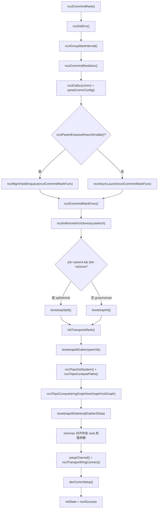
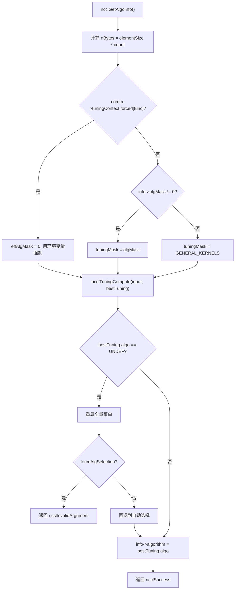
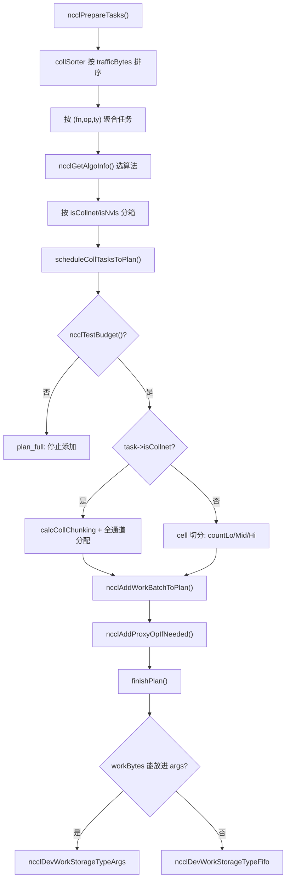

# 第 25 章：全景振り返りと考察：あるAllReduceの究極の旅と設計の精髓

# 第25章：全景振り返りと考察：あるAllReduceの究極の旅と設計の精髓

前の章では、ソースコード中の進化の痕跡に基づき、NCCLが固定集合操作からプログラマブルへ、host proxyからGPU直送へ、登録バッファから対称メモリへと向かうアーキテクチャの趨勢を展望した。今こそ、これらの趨勢を具体的な実行フローに戻して検証する時である。この章では新しいコードを一切導入せず、第3章から第10章のエンドツーエンド経路を再び繋ぎ合わせる——ncclAllReduceの一行の呼び出しから始まり、結果がビデオメモリに書き戻されるまで。読み終えた後、あなたは明確に答えられるはずだ：一度のAllReduceは一体どの関数を経るのか？各関数はどのファイルのどの行にあるのか？問題に遭遇したらどの章を開くべきか？

# 一、初期化：通信ドメインはどのように「成長」するのか

## 直感モデル

通信ドメインを「グループチャット」と想像しよう。あなたが`ncclCommInitRank`を呼ぶのは「グループチャットへの参加申請」であり、NCCLはこの時にグループメンバー名簿（peerInfo）、誰と誰がどの線で繋がるか（トポロジ図）、各線に何本のパイプラインを開くか（channel）を全て確定しなければならない。**もしこのステップで間違えれば、以降の全ての通信が間違っている**——グループチャットに誰かが入れられていないように、あなたが送ったメッセージは永遠に一人に届かない。

## データ構造とメモリレイアウト

通信ドメインの核心構造は`ncclComm`であり、その初期化は二段階に分かれる：`commAlloc`が「骨組みの割り当て」を担当し、`initTransportsRank`が「血肉の充填」を担当する。

`commAlloc`の中で最も注目すべきは**共有リソース参照カウント**の設計である。子通信ドメイン（split/shrinkで生成）が親通信ドメインのリソースを再利用する時、コピーするのではなく、同じ`ncclSharedResources`を共有し参照カウントをインクリメントする：

[FACT:src/init.cc:533-555]

```cpp
if (parent == NULL || !parent->shareResources) {
    struct ncclSharedResources* sharedRes;
    NEW_NOTHROW(sharedRes, ncclSharedResources);
    sharedRes->owner = comm;
    ...
    comm->sharedRes = sharedRes;
    sharedRes->refCount = 1;
    NCCLCHECK(ncclNetInit(comm));
    NCCLCHECK(ncclRmaInit(comm));
    NCCLCHECK(ncclGinInit(comm));
} else {
    comm->sharedRes = parent->sharedRes;
    ncclAtomicRefCountIncrement(&parent->sharedRes->refCount);
    NCCLCHECK(ncclNetInitFromParent(comm, parent));
    NCCLCHECK(ncclRmaInitFromParent(comm, parent));
}
```

このコードの意図は明確である：ネットワークプラグイン、RMA、GINといった「重いリソース」は一度だけ初期化され、子通信ドメインは直接借用する。`refCount`はアトミック操作でインクリメントし、マルチスレッド下で重複解放が起きないことを保証する。

もう一つの重要な点は`commAlloc`内の**チャネルの初期化**である。全てのチャネルはまず「未初期化」（`id = -1`）とマークされ、後続の`setupChannel`が実際に内容を埋める：

[FACT:src/init.cc:607-608]

```cpp
// Mark channels as non initialized.
for (int c = 0; c channels[c].id = -1;
```

この`-1`はセンチネル値である。もしコードが誤って未初期化のチャネルを使った場合、`id == -1`が即座に問題を露呈し、ランダムなメモリを読むことはない。

## Step-by-Step：ncclCommInitRankからinitTransportsRankまで

ユーザーが`ncclCommInitRank`を呼んだ後、実際の実行フローはこうである：

1. `ncclCommInitRank`まず`ncclInitEnv`を呼び環境プラグインをロードし、次に`ncclGroupStartInternal`を呼びgroupセマンティクスに入る（これは「一度のgroupで複数の通信ドメインを初期化する」をサポートするためである）。

2. 続いて`ncclCommInitRankDev`を呼び、これはパラメータ検証、`comm`構造の割り当て、configの解析を行い、そして**実際の初期化作業を非同期jobに投げる**：

[FACT:src/init.cc:2923-2929]

```cpp
if (ncclParamEnqueueRearchEnable()) {
    NCCLCHECKGOTO(ncclMgmtTaskEnqueue((struct ncclAsyncJob*)job, ncclCommInitRankFunc, ncclCommInitJobFree, comm), res, fail);
} else {
    NCCLCHECKGOTO(ncclAsyncLaunch((struct ncclAsyncJob*)job, ncclCommInitRankFunc, NULL, ncclCommInitJobFree, comm), res, fail);
}
```

ここでの`ncclParamEnqueueRearchEnable()`分岐に注意——これはNCCLが進行中の「enqueueリファクタリング」の痕跡である。デフォルトでは`ncclAsyncLaunch`を通り、リファクタリングを有効にすると`ncclMgmtTaskEnqueue`を通る。両方のパスは最終的に`ncclCommInitRankFunc`。

3. `ncclCommInitRankFunc`を呼ぶ。 は初期化のメイン関数である。まずデバイスを設定し、GPU属性を調べ、kernelを初期化する：

[FACT:src/init.cc:2119-2127]

```cpp
timers[TIMER_INIT_TOTAL] = clockNano();
CUDACHECKGOTO(cudaSetDevice(cudaDev), res, fail);
CUDACHECKGOTO(cudaDeviceGetAttribute(&maxSharedMem, cudaDevAttrMaxSharedMemoryPerBlockOptin, cudaDev), res, fail);
CUDACHECKGOTO(cudaDeviceGetAttribute(&archMajor, cudaDevAttrComputeCapabilityMajor, cudaDev), res, fail);
CUDACHECKGOTO(cudaDeviceGetAttribute(&archMinor, cudaDevAttrComputeCapabilityMinor, cudaDev), res, fail);
cudaArch = 100 * archMajor + 10 * archMinor;

timers[TIMER_INIT_KERNELS] = clockNano();
NCCLCHECKGOTO(ncclInitKernelsForDevice(cudaArch, maxSharedMem, &maxLocalSizeBytes), res, fail);
```

`cudaArch = 100 * archMajor + 10 * archMinor`この

4. 次に、通常の初期化か split/shrink/grow かに応じて、異なる bootstrap パスを通ります：

[FACT:src/init.cc:2136-2191]

```cpp
if (job->parent && !job->isGrow) {
    // SPLIT/SHRINK: use bootstrapSplit
    ...
    NCCLCHECKGOTO(bootstrapSplit(comm->commHash, comm, job->parent, job->color, job->key, parentRanks), res, fail);
} else {
    // GROW or NORMAL INIT: use bootstrapInit
    ...
    NCCLCHECKGOTO(bootstrapInit(job->nId, (struct ncclBootstrapHandle*)job->commId, comm, job->parent), res, fail);
}
```

5. 最後に呼び出します`initTransportsRank`、これは初期化全体で最も重い関数です（約800行）。内部で2回の AllGather を行います：

- **AllGather1**：交換します`ncclPeerInfo`（各 rank のデバイス情報、host hash、pid hash、GPU UUID など）：

[FACT:src/init.cc:1236-1239]

```cpp
NCCLCHECKGOTO(ncclCalloc(&comm->peerInfo, nranks + 1), ret, fail); // Extra rank to represent CollNet root
NCCLCHECKGOTO(fillInfo(comm, comm->peerInfo + rank, comm->commHash), ret, fail);
NCCLCHECKGOTO(bootstrapAllGather(comm->bootstrap, comm->peerInfo, sizeof(struct ncclPeerInfo)), ret, fail);
COMPILER_ATOMIC_STORE(&comm->peerInfoValid, true, std::memory_order_release);
```

注意`nranks + 1`この割り当て——余分な1つの位置は CollNet root 用です。`peerInfoValid`release セマンティクスで格納し、他のスレッドがこのフラグを見たときに peerInfo の内容が既に可視であることを保証します。

- **AllGather3**：トポロジ計算結果（各 rank が計算した ring/tree 構造、帯域幅、チャネル数など）を交換し、全 rank の**最小値**で整合させます：

[FACT:src/init.cc:1687-1703]

```cpp
for (int i = 0; i nChannels = std::min(allGather3Data[i].graphInfo[a].nChannels, graphs[a]->nChannels);
        graphs[a]->sameChannels = std::min(allGather3Data[i].graphInfo[a].sameChannels, graphs[a]->sameChannels);
        graphs[a]->bwIntra = std::min(allGather3Data[i].graphInfo[a].bwIntra, graphs[a]->bwIntra);
        graphs[a]->bwInter = std::min(allGather3Data[i].graphInfo[a].bwInter, graphs[a]->bwInter);
        graphs[a]->typeIntra = std::max(allGather3Data[i].graphInfo[a].typeIntra, graphs[a]->typeIntra);
        graphs[a]->typeInter = std::max(allGather3Data[i].graphInfo[a].typeInter, graphs[a]->typeInter);
        graphs[a]->crossNic = std::max(allGather3Data[i].graphInfo[a].crossNic, graphs[a]->crossNic);
    }
    ...
}
```

帯域幅は min、タイプは max を取ります。これは「木桶の原理」です：通信ドメイン全体の性能は最も遅い rank によって決まります。整合させないと、異なる rank が異なるアルゴリズム選択を計算し、通信デッドロックを引き起こす可能性があります。

## 初期化フローチャート



## 設計上の考察と落とし穴

**なぜ初期化は非同期でなければならないのか？**マルチ rank の初期化にはプロセス間同期（bootstrap）が必要であり、同期的に実行すると呼び出しスレッドをブロックするためです。非同期化により、ユーザーはグループ内で複数の通信ドメインを同時に初期化し、並行して進めることができます。

**落とし穴**：`initTransportsRank`の末尾に intra-node barrier があります：

[FACT:src/init.cc:1968-1971]

```cpp
/* Local intra-node barrier */
NCCLCHECKGOTO(bootstrapIntraNodeBarrier(comm->bootstrap, comm->localRankToRank, comm->localRank, comm->localRanks, comm->localRankToRank[0]), ret, fail);
```

この barrier は、同一マシンの全 rank がリソース割り当てを完了してから続行することを保証します。ある rank が`devCommSetup`でスタックしている場合（例えばメモリ不足）、他の rank はここで永遠に待ちます。本番環境で「初期化がハングする」に遭遇したら、まずある rank の`devCommSetup`が失敗していないかを確認してください。

# 二、タスクのエンキュー：API 呼び出しから内部タスクオブジェクトまで

## 直感的モデル

ユーザーが`ncclAllReduce`を呼び出すのは、レストランで料理を注文するようなものです。`ncclEnqueueCheck`はウェイターであり、あなたの注文をキッチンが理解できる「作業伝票」（`ncclTaskColl`）に翻訳し、`comm->planner`という「注文プール」に入れます。**この層がなければ、NCCL は複数の呼び出しを1回の kernel 起動に統合できません**——毎回の注文で個別に火をつけるのは、極めて非効率です。

## データ構造とメモリレイアウト

タスクエンキューの核心は`ncclKernelPlanner`であり、これは`comm->planner`にぶら下がっています。主要なフィールドは以下の通りです：

- `collSorter`：トラフィックサイズでソートされた集合通信タスクキュー
- `collTaskQueue`：最終的にソートされたタスクキュー
- `peers[]`：各 peer の send/recv キュー（P2P 用）
- `wipPlan`：構築中の kernel plan

タスクオブジェクト`ncclTaskColl`の主要フィールドは`collTaskAppend`で埋められます：

[FACT:src/enqueue/enqueue.cc:2800-2847]

```cpp
struct ncclTaskColl* t = ncclMemoryPoolAlloc(&comm->memPool_ncclTaskColl, &comm->memPermanent);
t->func = info->coll;
t->sendbuff = info->sendbuff;
t->recvbuff = info->recvbuff;
t->count = info->count;
t->root = info->root;
t->datatype = info->datatype;
size_t elementSize = ncclTypeSize(t->datatype);
if (t->func == ncclFuncAllGather || t->func == ncclFuncBroadcast) {
    t->count *= elementSize;
    t->datatype = ncclInt8;
    elementSize = 1;
}
t->trafficBytes = t->count * elementSize * ncclFuncTrafficPerByte(t->func, comm->nRanks);
...
t->aggIsolate = ncclCollConfigNeedAggIsolate(&info->collConfig) || info->collConfig.CTAPolicy != comm->config.CTAPolicy;
NCCL_CONFIG_SET(t, minCTAs, ncclParamMinCTAs(), info->collConfig.minCTAs, comm->config.minCTAs, 1, MAXCHANNELS);
NCCL_CONFIG_SET(t, maxCTAs, ncclParamMaxCTAs(), (std::min(info->collConfig.maxCTAs, comm->config.maxCTAs)), comm->config.maxCTAs, 1, MAXCHANNELS);
...
planner->nTasksColl += 1;
ncclTaskCollSorterInsert(&planner->collSorter, t, t->trafficBytes);
```

いくつかの詳細に注意：

1. **AllGather/Broadcast の特別処理**：count に要素サイズを掛け、datatype を`ncclInt8`に変更します。これはこれらの操作のセマンティクスが「バイトを運ぶ」ことであり、元の型を気にする必要がないためです。

2. **`trafficBytes`の計算**：`ncclFuncTrafficPerByte`は各バイトが何回転送される必要があるかを返します。AllReduce は 2（reduce + broadcast）、AllGather は nRanks を返します：

[FACT:src/enqueue/enqueue.cc:123-134]

```cpp
static inline int ncclFuncTrafficPerByte(ncclFunc_t func, int nRanks) {
  switch (func) {
  case ncclFuncAllReduce:
    return 2;
  case ncclFuncAllGather:
    return nRanks;
  case ncclFuncReduceScatter:
    return nRanks;
  default:
    return 1;
  }
}
```

3. **`NCCL_CONFIG_SET`マクロ**：これは「env > per-call > comm」の3段階設定解決です。環境変数が最優先、次に単一呼び出しの config、最後に通信ドメインレベルのデフォルト値です。

## Step-by-Step：ncclAllReduce のエンキューパス

1. `ncclEnqueueCheck`まず通信ドメインの検証と group への進入を行います：

[FACT:src/enqueue/enqueue.cc:3478-3495]

```cpp
ncclResult_t ncclEnqueueCheck(struct ncclInfo* info) {
  ncclResult_t ret = CommCheck(info->comm, info->opName, "comm");
  if (ret != ncclSuccess) return ncclGroupErrCheck(ret);
  if (info->comm->revokedFlag) {
    WARN("%s: communicator was revoked", info->opName);
    return ncclGroupErrCheck(ncclInvalidUsage);
  }
  ...
  NCCLCHECK(ncclGroupStartInternal());
  ret = ncclSuccess;
  int devOld = -1;
  NCCLCHECKGOTO(ncclCommEnsureReady(info->comm), ret, fail);
```

2. 次に`taskAppend`を呼び出し、操作タイプに応じてディスパッチします：

[FACT:src/enqueue/enqueue.cc:3337-3348]

```cpp
static ncclResult_t taskAppend(struct ncclComm* comm, struct ncclInfo* info) {
  ncclFunc_t collAPI = info->coll;
  bool hasLaunchCompletionEvent = ncclInfoHasLaunchCompletionEvent(info);

  if (ncclParamEnqueueRearchEnable()) {
    NCCLCHECK(rawTaskAppend(comm, info));
  } else if (info->coll == ncclFuncSend || info->coll == ncclFuncRecv) {
    NCCLCHECK(p2pTaskAppend(comm, info, info->coll, collAPI, (void*)info->recvbuff, info->count, info->datatype, info->root, true));
  } else if (info->coll == ncclFuncPutSignal || info->coll == ncclFuncSignal || info->coll == ncclFuncWaitSignal) {
    NCCLCHECK(rmaTaskAppend(comm, info));
  } else {
    ...
  }
}
```

AllReduce の場合、最後の`else`ブランチを通り、最終的に`collTaskAppend`。

3. `collTaskAppend`を呼び出してタスクを`collSorter`に挿入し、`trafficBytes`でソートします。ソートの目的は、スケジューラが大きなタスクを優先的に処理し、小さなタスクがチャネルリソースを断片化するのを避けるためです。

## タスクエンキューのデータフロー

```mermaid
flowchart LR
    api["ncclAllReduce()"] --> info["ncclInfo 填充"]
    info --> enq["ncclEnqueueCheck()"]
    enq --> check["CommCheck + ncclCommEnsureReady()"]
    check --> append["taskAppend()"]
    append --> coll["collTaskAppend()"]
    coll --> task["ncclTaskColl 分配"]
    task --> sorter["ncclTaskCollSorterInsert(collSorter)"]
    sorter --> prepare["ncclPrepareTasks()"]
    prepare --> algo["ncclGetAlgoInfo() 选算法"]
    algo --> schedule["scheduleCollTasksToPlan()"]
    schedule --> plan["ncclKernelPlan"]
```



## 設計上の考察と落とし穴

**なぜ`ncclMemoryPoolAlloc`ではなく`malloc`？**を使うのか？ タスクオブジェクトはライフサイクルが短く、頻繁に割り当てられるためです。メモリプールは毎回の`malloc/free`のシステムコールオーバーヘッドを回避します。注意`ncclMemoryPoolAlloc`の第2引数は`&comm->memPermanent`です——これはタスクオブジェクトが通信ドメインの破棄時に一括解放され、各タスクが個別に解放されないことを意味します。

**落とし穴**：`ncclPrepareTasks`に「集約」ロジックがあり、サイズが近い（4倍以内）タスクをマージします：

[FACT:src/enqueue/enqueue.cc:506-512]

```cpp
// We aggregate operations that are within 4X size of each other.
while (aggEnd != nullptr && aggEnd->trafficBytes trafficBytes && !aggBeg->aggIsolate && !aggEnd->aggIsolate) {
    agg.count += aggEnd->count;
    agg.trafficBytes += aggEnd->trafficBytes;
    aggEnd = aggEnd->next;
}
```

この集約はアルゴリズム選択をより安定させるためです——各小さなタスクが個別にアルゴリズムを選ぶと、多数の異なるアルゴリズムが選ばれ、kernel が断片化する可能性があります。しかし`aggIsolate`フラグは集約を阻止し、「個別にスケジュールする必要がある」タスク（per-call config 付きなど）に使用されます。

# 三、アルゴリズム選型：コストモデルがどのように最適解を選ぶか

## 直感的モデル

アルゴリズム選型はナビゲーションソフトがルートを選ぶようなものです。NCCL の「コストモデル」（tuning モジュール）は、各アルゴリズム/プロトコル組み合わせが与えられたメッセージサイズとトポロジでかかる時間を見積もり、最速のものを選びます。**コストモデルがなければ、NCCL は1つのアルゴリズムを固定で書くしかなく、小さなメッセージでは帯域幅を浪費し、大きなメッセージでは遅延を浪費します**。

## データ構造とメモリレイアウト

アルゴリズム選型の入口は`ncclGetAlgoInfo`：

[FACT:src/enqueue/enqueue.cc:2159-2185]

```cpp
ncclResult_t ncclGetAlgoInfo(struct ncclComm* comm, struct ncclTaskColl* info, int collNetSupport, int nvlsSupport,
                             int numPipeOps, ncclSimInfo_t* simInfo) {
  size_t elementSize = ncclTypeSize(info->datatype);
  size_t nBytes = elementSize * ncclFuncMaxSendRecvCount(info->func, comm->nRanks, info->count);
  info->algorithm = NCCL_ALGO_UNDEF;
  info->protocol = NCCL_PROTO_UNDEF;
  struct ncclTuningInput_t input;
  input.comm = comm;
  input.tuningMask = NCCL_TUNING_MASK_GENERAL_KERNELS;
  uint64_t effAlgMask = comm->tuningContext.forced[info->func] ? 0 : info->algMask;
  if (effAlgMask != 0) {
    input.tuningMask = effAlgMask & NCCL_TUNING_MASK_GENERAL_KERNELS;
  }
  input.CTAPolicy = info->CTAPolicy;
  input.func = info->func;
  input.redOp = info->opHost;
  input.devRedOp = info->opDev.op;
  input.datatype = info->datatype;
  input.nBytes = nBytes;
  input.numPipeOps = numPipeOps;
  input.collNetSupport = collNetSupport;
  input.nvlsSupport = nvlsSupport;
  input.count = info->count;
  NCCLCHECK(ncclGetRegBuff(comm, info, &input.regBuff));
  ...
}
```

注意`effAlgMask`のロジック：環境変数がアルゴリズムを強制指定した場合（`comm->tuningContext.forced[info->func]`が非ゼロ）、ユーザーの`algMask`を無視し、環境変数のものを使います。これは「env > per-call」優先度の体現です。

次に`ncclTuningCompute`を呼び出して最適な結果を得ます：

[FACT:src/enqueue/enqueue.cc:2213-2224]

```cpp
} else {
    NCCLCHECK(ncclTuningCompute(&input, &bestTuning));
}
INFO(NCCL_TUNING, "Best tuning, algorithm, %s, protocol, %s", ncclAlgoToString(bestTuning.algo), ncclProtoToString(bestTuning.proto));
info->algorithm = bestTuning.algo;
info->protocol = bestTuning.proto;
info->nWarps = bestTuning.nWarps;
if (simInfo) simInfo->estimatedTime = bestTuning.timeUs;
TRACE(NCCL_COLL, "%ld Bytes -> Algo %d proto %d time %f", nBytes, info->algorithm, info->protocol, bestTuning.timeUs);
info->nMaxChannels = bestTuning.maxChannels == 0 ? info->nMaxChannels : bestTuning.maxChannels;
```

## Step-by-Step：1回のAllReduceにおけるアルゴリズム選択

8カード・シングルノード、メッセージサイズ1MB、AllReduceを仮定：

1. `nBytes = 1MB`，`numPipeOps`は現在のplan内に既にあるタスク数。

2. `collNetSupport`と`nvlsSupport`は`ncclGetCollNetSupport`と`ncclNvlsTransportEnabled`によって決まる。

3. `ncclTuningCompute`利用可能なすべての (algo, proto) の組み合わせを走査し、コストモデルで時間を見積もる。

4. 1MB・シングルノードのシナリオでは、通常 NVLS または Tree+LL128 が勝つ。

5. 結果を書き戻す`info->algorithm`、`info->protocol`、`info->nWarps`。

## アルゴリズム選択の決定図



## 設計上の考察と落とし穴

**なぜアルゴリズム選択は「rank間で揃える」必要があるのか？**なぜなら、異なるrankが異なるアルゴリズムを選ぶと通信パターンが一致せず、デッドロックするからである。そこで`initTransportsRank`では min/max ですべてのグラフパラメータを揃え、各rankのコストモデル入力が一致することを保証する。

**落とし穴**：`ncclGetAlgoInfo`には「再計算」ロジックがある——ユーザーが`algMask`を指定したがどのアルゴリズムもマッチしない場合、まず黙って全量メニューを再計算し、その後ハードエラーかソフトフォールバックかを判定する：

[FACT:src/enqueue/enqueue.cc:2192-2208]

```cpp
NOWARN(ncclTuningCompute(&input, &bestTuning), NCCL_TUNING);
if (bestTuning.algo == NCCL_ALGO_UNDEF) {
    input.tuningMask = NCCL_TUNING_MASK_GENERAL_KERNELS;
    bestTuning = NCCL_TUNING_RESULT_INIT;
    bestTuning.maxChannels = 0;
    NCCLCHECK(ncclTuningCompute(&input, &bestTuning));
    if (info->forceAlgSelection) {
        WARN("algSelection: no algorithm in the selected set is available for %s", ncclFuncToString(info->func));
        return ncclInvalidArgument;
    }
    INFO(NCCL_TUNING, "algSelection: selected set unavailable for %s; falling back to automatic selection", ncclFuncToString(info->func));
}
```

`NOWARN`マクロで一時的に警告を抑制する。なぜなら「アルゴリズムがマッチしない」は正常な場合もあるからである（ユーザーが選んだ集合が確かに利用不可など）。`forceAlgSelection`が真のときのみエラーを報告する。

# 四、タスクスケジューリングとkernel planの構築

## 直感モデル

タスクスケジューリングは、たくさんの注文をいくつかの生産ラインに割り当てるようなものだ。`scheduleCollTasksToPlan`は各タスクがいくつのチャネルを使い、各チャネルがどれだけのデータを処理するかを決定し、最終的に`ncclKernelPlan`を生成する——これがGPUに渡す「作業指示書」である。

## データ構造とメモリレイアウト

`ncclKernelPlan`の主要フィールド：

- `channelMask`：このplanが使うチャネル（ビットマップ）
- `workBytes`：すべてのwork構造の総バイト数
- `nWorkBatches`：work batch数
- `kernelArgs`：kernel起動パラメータ
- `workStorageType`：workデータをどこに格納するか（args/fifo/persistent）

`finishPlan`はworkデータの格納位置を決定する：

[FACT:src/enqueue/enqueue.cc:244-255]

```cpp
// If we can fit everything into the kernel args we do so.
if (sizeof(ncclDevKernelArgs) + batchBytes + workBytes workArgsBytes) {
    plan->workStorageType = ncclDevWorkStorageTypeArgs;
}
plan->kernelArgsSize = sizeof(struct ncclDevKernelArgs) + batchBytes;
plan->kernelArgsSize += (plan->workStorageType == ncclDevWorkStorageTypeArgs) ? workBytes : 0;
plan->kernelArgsSize = alignUp(plan->kernelArgsSize, 16);
plan->kernelArgs = (struct ncclDevKernelArgs*)ncclMemoryStackAlloc(&comm->memScoped, plan->kernelArgsSize, /*align=*/16);
plan->kernelArgs->comm = comm->devComm;
plan->kernelArgs->channelMask = plan->channelMask;
plan->kernelArgs->workStorageType = plan->workStorageType;
```

3つのストレージタイプのトレードオフ：

- **Args**：最速だが、kernelパラメータサイズに制限がある（通常4KB）
- **Fifo**：リングバッファ、中程度のサイズに適する
- **Persistent**：独立したデバイスメモリ割り当て、CUDA Graphシナリオに適する

## Step-by-Step：scheduleCollTasksToPlanのチャネル割り当て

1. まずこのplanにいくつのタスクを収められるかを見積もる：

[FACT:src/enqueue/enqueue.cc:654-687]

```cpp
do {
    size_t workBytes = 0;
    struct ncclTaskColl* task = ncclIntruQueueHead(&planner->collTaskQueue);
    struct ncclWorkList* workNode = ncclIntruQueueHead(&planner->collWorkQueue);
    while (task != nullptr) {
        int nBatches = divUp(nPlanColls, 4); // Rough guess: 4 colls per batch.
        if (!ncclTestBudget(budget, nBatches, workBytes + workNode->size)) goto plan_full;
        bool taskAggIsolate = task->aggIsolate;
        if (taskAggIsolate && nPlanColls > 0) goto plan_full;
        nPlanColls += 1;
        workBytes += workNode->size;
        int kind = 2 * task->isCollnet + task->isNvls;
        trafficBytes[kind] += std::max(MinTrafficPerChannel, task->trafficBytes);
        ...
    }
plan_full:;
} while (0);
```

2. 次にトラフィックに応じてチャネルをタスクに割り当てる。非CollNetタスクでは、「cell」を単位に分割する：

[FACT:src/enqueue/enqueue.cc:742-759]

```cpp
int trafficPerByte = ncclFuncTrafficPerByte(task->func, comm->nRanks);
if (task->protocol == NCCL_PROTO_LL) trafficPerByte *= 4;
size_t cellSize = divUp(divUp(MinTrafficPerChannel, (size_t)trafficPerByte), 16) * 16;
int elementsPerCell = cellSize / elementSize;
size_t cells = divUp(task->count * elementSize, cellSize);
size_t trafficPerElement = elementSize * trafficPerByte;
size_t trafficPerCell = cellSize * trafficPerByte;
size_t cellsPerChannel = std::min(cells, divUp(trafficPerChannel, trafficPerCell));
size_t cellsLo;
if (channelId + 1 == nMaxChannels[kind]) {
    cellsLo = cells;
} else {
    cellsLo = std::min(cells, divUp((trafficPerChannel - currentTraffic), trafficPerCell));
}
int nMidChannels = (cells - cellsLo) / cellsPerChannel;
size_t cellsHi = (cells - cellsLo) % cellsPerChannel;
int nChannels = (cellsLo != 0 ? 1 : 0) + nMidChannels + (cellsHi != 0 ? 1 : 0);
```

このコードはデータを「低/中/高」の3段に切る：`countLo`、`countMid`、`countHi`。低段と高段は境界チャネル、中段は中間チャネルである。このように分割するのは、各チャネルが処理するデータ量をできるだけ均等にするためである。

3. 最後に`calcCollChunking`を呼び、各チャネルのchunkサイズを計算する：

[FACT:src/enqueue/enqueue.cc:2228-2275]

```cpp
static ncclResult_t calcCollChunking(struct ncclComm* comm, struct ncclTaskColl* info, int nChannels, size_t nBytes,
                                     uint32_t* outChunkSize, uint32_t* outDirectFlags, struct ncclProxyOp* proxyOp) {
  ncclPattern_t pattern;
  size_t grainSize = ncclProtoGrainSize(info->protocol);
  switch (info->func) {
  case ncclFuncAllReduce:
    pattern = info->algorithm == NCCL_ALGO_NVLS           ? ncclPatternNvls :
              info->algorithm == NCCL_ALGO_NVLS_TREE      ? ncclPatternNvlsTree :
              info->algorithm == NCCL_ALGO_COLLNET_DIRECT ? ncclPatternCollnetDirect :
              info->algorithm == NCCL_ALGO_COLLNET_CHAIN  ? ncclPatternCollnetChain :
              info->algorithm == NCCL_ALGO_TREE           ? ncclPatternTreeUpDown :
                                                            ncclPatternRingTwice;
    break;
  ...
  }
  int stepSize = comm->buffSizes[info->protocol] / NCCL_STEPS;
  int chunkSteps = (info->protocol == NCCL_PROTO_SIMPLE && info->algorithm == NCCL_ALGO_RING) ? info->chunkSteps : 1;
  int sliceSteps = (info->protocol == NCCL_PROTO_SIMPLE && info->algorithm == NCCL_ALGO_RING) ? info->sliceSteps : 1;
  int chunkSize = stepSize * chunkSteps;
  if (info->protocol == NCCL_PROTO_LL) chunkSize /= 2;
  if (info->protocol == NCCL_PROTO_LL128) chunkSize = (chunkSize / NCCL_LL128_LINEELEMS) * NCCL_LL128_DATAELEMS;
  ...
}
```

## スケジューリングフロー図



## 設計上の考察と落とし穴

**なぜCollNetタスクは別扱いなのか？**なぜならCollNetはネットワークスイッチでリダクションを行うため、チャネル割り当てロジックが通常のring/treeと全く異なるからである。CollNetタスクは利用可能なすべてのチャネルを直接占有するが、通常タスクはトラフィックに応じて分割する必要がある。

**落とし穴**：`ncclTestBudget`の見積もりは粗い式`nBatches = divUp(nPlanColls, 4)`を使っている——4つの集合操作ごとに1つのbatchが生成されると仮定している。この見積もりは不正確かもしれないので、後で正確なチェックがある：

[FACT:src/enqueue/enqueue.cc:711-714]

```cpp
// Ensure room for worst case of one new batch per channel
if (!ncclTestBudget(budget, plan->nWorkBatches + nChannels, plan->workBytes + workNode->size)) {
    return ncclSuccess;
}
```

正確なチェックが失敗した場合、直接リターンし（エラーを報告しない）、上位層に新しいplanを開かせる。

# 五、Kernel起動とデバイス側実行

## 直感モデル

Kernel起動は、作業指示書を工場に渡すようなものだ。`ncclLaunchKernel`は`ncclKernelPlan`をCUDA kernel起動パラメータに変換し、その後`cuLaunchKernelEx`を呼ぶ。デバイス側kernelは作業指示書を受け取ると、アルゴリズムに従ってデータ転送を実行する。

## データ構造とメモリレイアウト

`ncclLaunchKernel`の主要ステップ：

[FACT:src/enqueue/enqueue.cc:1886-1909]

```cpp
ncclResult_t ncclLaunchKernel(struct ncclComm* comm, struct ncclKernelPlan* plan) {
  ncclResult_t ret = ncclSuccess;
  struct ncclKernelPlanner* planner = &comm->planner;
  int nChannels = countOneBits(plan->channelMask);
  void* sym = plan->kernelFn;
  dim3 grid = {(unsigned)nChannels, 1, 1};
  dim3 block = {(unsigned)plan->threadPerBlock, 1, 1};
  int smem = plan->isSymColl ? plan->kernelDynSmem : ncclShmemDynamicSize(comm->cudaArch);
  cudaStream_t launchStream = planner->streams->stream;
  ...
  void* extra[] = {CU_LAUNCH_PARAM_BUFFER_POINTER, plan->kernelArgs, CU_LAUNCH_PARAM_BUFFER_SIZE, &plan->kernelArgsSize, CU_LAUNCH_PARAM_END};
  ...
  CUfunction fn;
  CUDACHECKGOTO(cudaGetFuncBySymbol(&fn, sym), ret, do_return);
```

注意`grid.x = nChannels`——各チャネルに1つのblock。`block.x = plan->threadPerBlock`——各blockのスレッド数はタスクによって決まる。

## Step-by-Step：planからkernel起動まで

1. まず`uploadWork`を呼び、workデータを目標位置（args/fifo/persistent）に書き込む：

[FACT:src/enqueue/enqueue.cc:1365-1407]

```cpp
static ncclResult_t uploadWork(struct ncclComm* comm, struct ncclKernelPlan* plan) {
  if (plan->isSymColl || plan->isCeColl || plan->isRma) return ncclSuccess;
  size_t workBytes = plan->workBytes;
  size_t batchBytes = plan->nWorkBatches * sizeof(struct ncclDevWorkBatch);
  void* fifoBufHost;
  uint32_t fifoCursor, fifoMask;
  switch (plan->workStorageType) {
  case ncclDevWorkStorageTypeArgs:
    plan->kernelArgs->workBuf = nullptr;
    fifoBufHost = (void*)plan->kernelArgs;
    fifoCursor = sizeof(ncclDevKernelArgs) + batchBytes;
    fifoMask = ~0u;
    break;
  case ncclDevWorkStorageTypeFifo:
    fifoBufHost = comm->workFifoBuf;
    fifoCursor = comm->workFifoProduced;
    fifoMask = comm->workFifoBytes - 1;
    NCCLCHECK(waitWorkFifoAvailable(comm, fifoCursor + workBytes));
    plan->kernelArgs->workBuf = comm->workFifoBufDev;
    break;
  ...
  }
}
```

2. 次にCUDA launch属性を構築する。sm90+ではcluster次元を設定する：

[FACT:src/enqueue/enqueue.cc:1929-1936]

```cpp
if (clusterSize) {
    // Grid dimension must be divisible by clusterSize
    if (grid.x % clusterSize) clusterSize = 1;
    launchAttrs[attrs].id = CU_LAUNCH_ATTRIBUTE_CLUSTER_DIMENSION;
    launchAttrs[attrs++].value.clusterDim = {clusterSize, 1, 1};
    launchAttrs[attrs].id = CU_LAUNCH_ATTRIBUTE_CLUSTER_SCHEDULING_POLICY_PREFERENCE;
    launchAttrs[attrs++].value.clusterSchedulingPolicyPreference = CU_CLUSTER_SCHEDULING_POLICY_SPREAD;
}
```

3. 最後に`cuLaunchKernelEx`：

[FACT:src/enqueue/enqueue.cc:1992]

```cpp
CUCHECKGOTO(cuLaunchKernelEx(&launchConfig, fn, nullptr, extra), ret, do_return);
```

## デバイス側：runRingの実行

デバイス側kernelは作業指示書を受け取ると、アルゴリズムに応じて対応する`RunWorkColl`特化を呼ぶ。Ring AllReduceを例に：

[FACT:src/device/all_reduce.h:14-83]

```cpp
template 
__device__ __forceinline__ void runRing(int tid, int nthreads, struct ncclDevWorkColl* work) {
  ncclRing* ring = &ncclShmem.channel.ring;
  int ringIx = ring->index;
  const int nranks = ncclShmem.comm.nRanks;
  ssize_t gridOffset;
  ssize_t channelCount;
  ssize_t chunkCount;
  ncclCollCbdPart(work, ncclShmem.channelId, Proto::Id, sizeof(T), (ssize_t*)nullptr, &gridOffset, &channelCount, &chunkCount);
  const ssize_t loopCount = nranks * chunkCount;
  ...
  Primitives, 1, Proto, 0> prims(tid, nthreads, &ring->prev, &ring->next, work->sendbuff, work->recvbuff, work->redOpArg, 0, 0, 0, work);

  for (ssize_t elemOffset = 0; elemOffset  int { return r - (r >= nranks ? nranks : 0); };

    // step 0: push data to next GPU
    chunk = modRanks(ringIx + nranks - 1);
    chunkOffset = chunk * chunkCount;
    offset = gridOffset + elemOffset + chunkOffset;
    nelem = (int)min(chunkCount, remCount - chunkOffset);
    prims.directSend(offset, offset, nelem);

    // k-2 steps: reduce and copy to next GPU
    for (int j = 2; j >Plan: ncclLaunchPrepare()
    Plan->>Plan: scheduleCollTasksToPlan()
    Plan->>Plan: finishPlan() 分配 kernelArgs
    Host->>Plan: ncclLaunchKernelBefore_NoUncapturedCuda()
    Plan->>Plan: uploadWork() 写 work 数据
    Host->>CUDA: cuLaunchKernelEx(fn, grid, block, smem)
    CUDA->>Kernel: 启动 nChannels 个 block
    Kernel->>Kernel: runRing() 执行 Ring AllReduce
    Host->>Plan: ncclLaunchKernelAfter_NoCuda()
    Plan->>Proxy: hostStreamPlanTask() + uploadProxyOps()
    Proxy->>Proxy: ncclProxyStart() 推进网络 I/O
    Kernel-->>Host: kernel 完成
    Host->>Plan: ncclLaunchFinish()
    Plan->>Plan: reclaimPlan() 释放资源
```

## 設計上の考察と落とし穴

**なぜ`cuLaunchKernelEx`ではなく`cudaLaunchKernel`？**を使うのか？ なぜならlaunch属性（cluster次元、mem sync domain、launch completion event）を設定する必要があるからである。これらの属性はCUDA 12.0+でのみサポートされる。

**落とし穴**：`uploadWork`ここでは persistent モードの処理が非常に複雑です——GPU メモリの割り当て、データのコピー、イベントの記録を行い、さらに CUDA Graph キャプチャモードでも正しく動作する必要があります：

[FACT:src/enqueue/enqueue.cc:1445-1478]

```cpp
CUDACHECKGOTO(cudaThreadExchangeStreamCaptureMode(&mode), result, fail);
NCCLCHECKGOTO(ncclStrongStreamAcquire(ncclCudaGraphNone(comm->config.graphUsageMode), &comm->sharedRes->deviceStream, /*concurrent=*/false, &deviceStream), result, fail);
if (comm->memPool) {
    CUDACHECKGOTO(cudaMallocAsync(&fifoBufDev, workBytes, comm->memPool, deviceStream), result, fail);
} else {
    CUDACHECKGOTO(cudaMalloc(&fifoBufDev, workBytes), result, fail);
}
plan->workBufPersistent = fifoBufDev;
plan->kernelArgs->workBuf = fifoBufDev;
CUDACHECKGOTO(cudaMemcpyAsync(fifoBufDev, fifoBufHost, workBytes, cudaMemcpyDefault, deviceStream), result, fail);
cudaEvent_t memcpyDone;
CUDACHECKGOTO(cudaEventCreateWithFlags(&memcpyDone, cudaEventDisableTiming), result, fail);
CUDACHECKGOTO(cudaEventRecord(memcpyDone, deviceStream), result, fail);
```

`cudaThreadExchangeStreamCaptureMode`はキャプチャモード中に一時的に relaxed モードへ切り替え、GPU メモリの割り当てを許可するためです。コピー完了後にイベントを記録し、後続で`ncclCommPollEventCallbacks`により回収します。

# 六、本番環境の落とし穴ガイド

## 落とし穴 1：初期化でハングする

**現象**：`ncclCommInitRank`がスタックして返らない。

**調査**：`NCCL_DEBUG=INFO`のログを見て、最後に出力された rank を特定します。すべての rank が "Init START" を出力したが "Init COMPLETE" がない場合、`initTransportsRank`でスタックしていることを示します。

**よくある原因**：

- いずれかの rank の`devCommSetup`が失敗（GPU メモリ不足、CUDA エラー）
- bootstrap ネットワークが不通（ファイアウォール、ポート競合）
- rank 間で NCCL バージョンが不一致

**ソースコード根拠**：`initTransportsRank`の末尾にある intra-node barrier は、すべてのローカル rank を待機します：

[FACT:src/init.cc:1968-1971]

```cpp
/* Local intra-node barrier */
NCCLCHECKGOTO(bootstrapIntraNodeBarrier(comm->bootstrap, comm->localRankToRank, comm->localRank, comm->localRanks, comm->localRankToRank[0]), ret, fail);
```

## 落とし穴 2：work FIFO のオーバーフロー

**現象**：kernel 起動後にハングする、または`ncclInternalError`。

**原因**：`waitWorkFifoAvailable`が FIFO 空間を待っているが、消費側（kernel）が進まない。

[FACT:src/enqueue/enqueue.cc:1333-1349]

```cpp
static ncclResult_t waitWorkFifoAvailable(struct ncclComm* comm, uint32_t desiredProduced) {
  bool hasRoom = (desiredProduced - comm->workFifoConsumed) workFifoBytes;
  if (!hasRoom) {
    while (true) {
      // Check abort flag to break deadlock when abort is signaled
      if (COMPILER_ATOMIC_LOAD(comm->abortFlag, std::memory_order_acquire)) {
        return ncclInternalError;
      }
      NCCLCHECK(ncclCommPollEventCallbacks(comm, /*waitSome=*/true));
      hasRoom = (desiredProduced - comm->workFifoConsumed) workFifoBytes;
      if (hasRoom) break;
      std::this_thread::yield();
    }
  }
  return ncclSuccess;
}
```

abort flag のチェックに注意——これが唯一の脱出経路です。abort も設定されていない場合、無限ループになります。

**回避策**：`NCCL_WORK_FIFO_BYTES`を大きくする、または 1 回の group 内の操作数を減らす。

## 落とし穴 3：CUDA Graph キャプチャの失敗

**現象**：CUDA Graph キャプチャ中に NCCL を呼び出すと、"operation not permitted" が報告される。

**原因**：キャプチャモードでは一部の CUDA 操作（`cudaMalloc`など）を実行できません。NCCL は`cudaThreadExchangeStreamCaptureMode`で一時的にモードを切り替えますが、すべての操作を回避できるわけではありません。

**ソースコード根拠**：`uploadWork`の persistent 分岐：

[FACT:src/enqueue/enqueue.cc:1445]

```cpp
CUDACHECKGOTO(cudaThreadExchangeStreamCaptureMode(&mode), result, fail);
```

**回避策**：`NCCL_GRAPH_MIXING_SUPPORT=1`で graph 混合モードを有効にする、または work buffer を事前に割り当てる。

# 本章のまとめ

この章では、1 回の AllReduce の完全な経路をもう一度たどりました：

1. **初期化**：`ncclCommInitRank` → `ncclCommInitRankFunc` → `initTransportsRank`、通信ドメインの確立、トポロジの探索、グラフパラメータの整合。

2. **タスクのエンキュー**：`ncclEnqueueCheck` → `taskAppend` → `collTaskAppend`、API 呼び出しを`ncclTaskColl`。

3. **アルゴリズム選定**：`ncclGetAlgoInfo` → `ncclTuningCompute`、コストモデルで最適な (algo, proto) を選択。

4. **タスクスケジューリング**：`ncclPrepareTasks` → `scheduleCollTasksToPlan` → `finishPlan`、タスクをチャネルに割り当て、`ncclKernelPlan`。

5. **Kernel 起動**：`ncclLaunchKernel` → `cuLaunchKernelEx`、plan を CUDA 起動パラメータに変換。

6. **デバイス側の実行**：`runRing` / `runTreeUpDown` / `runNvls`、アルゴリズムに従ってデータ転送を実行。

# 本章の考察とセルフチェック

Q1: もし`initTransportsRank`内の AllGather3 以降の min/max 整合ロジック（L1690-L1698）を削除した場合、どのようなシナリオで通信デッドロックが発生するか？その理由は？

**参考解説**：このロジックは、すべての rank が各アルゴリズムの`nChannels`、`bwIntra`、`bwInter`などのパラメータで一致することを保証します。削除すると、各 rank は自身のローカルトポロジで計算した結果を使用します。異種クラスタを考えてみましょう：rank 0 は 8 カード NVLink マシン上、rank 8 は 4 カード PCIe マシン上にあります。rank 0 は ring に 8 本のチャネルがあると計算し、rank 8 は 4 本と計算します。それらが Ring AllReduce を実行すると、rank 0 は rank 8 が 8 本のチャネルでデータを送るのを待ちますが、rank

ここまでで、1 回の AllReduce の完全な経路の振り返りを完了しました。初期化、トポロジ探索、アルゴリズム選択、タスクエンキュー、kernel 起動から、デバイス側の実行とネットワーク転送まで、各段階は前の章の詳細な分析に対応しています。この経路図は NCCL を理解するための骨格であるだけでなく、問題を調査するための索引でもあります：初期化失敗は第 3、4 章、アルゴリズム選択ミスは第 5 章、タスクエンキューのエラーは第 6、7 章、kernel 起動失敗は第 8 章、デバイス側のハングは第 9、10 章、ネットワーク問題は第 12、13 章を参照してください。NCCL がプログラマブル通信、GPU ダイレクト発信、対称メモリへと進化するにつれて、この経路はさらに延伸していきます——そしてあなたはすでにそれを追跡する方法を身につけています。
