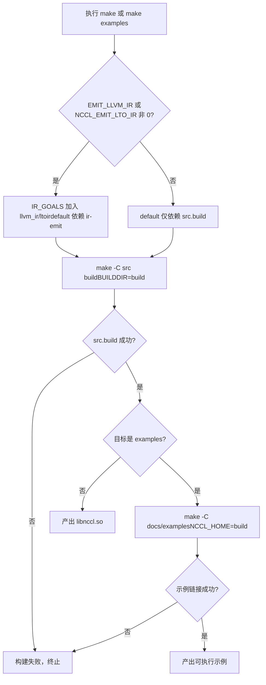
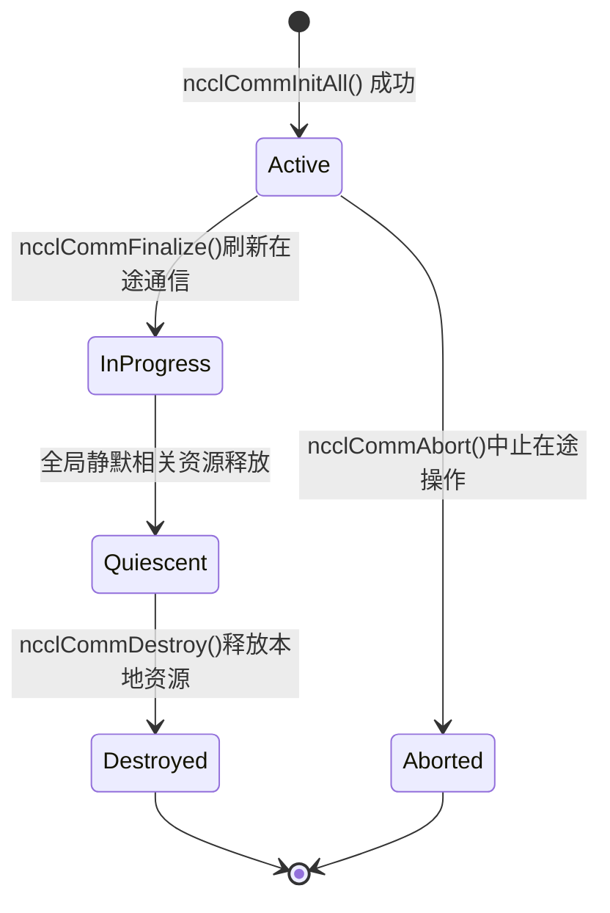

# 제 1 장: 실행과 현상: 하나의 AllReduce부터 외부 동작 살펴보기

# 제1장: 실행과 현상: 하나의 AllReduce부터 외부 동작 살펴보기

어떤 커널 코드를 깊이 파고들기 전에, 먼저 NCCL을 실행해 보고 그것이 외부에 드러내는 동작을 관찰하자. 이 장에서는 커널을 읽지 않고 단 한 가지 일만 한다. 바로 검증 가능한 참조 체계를 세우는 것이다. 이후의 모든 내부 메커니즘 분석은 결국 여기서 보이는 외부 동작을 설명할 수 있어야 한다.

# 1.1 빌드 진입점에서 본 NCCL의 엔지니어링 구조

## 직관적 모델

빌드 시스템은 건물의 시공 도면과 같다. 누가 그 건물에 사는지는 결정하지 않지만, 어떤 방이 있고 문이 어느 쪽으로 나는지는 결정한다. 빌드 진입점이 혼란스러우면 "실행하기"라는 첫걸음조차 떼지 못한다. NCCL은 Makefile과 CMake 두 가지 빌드 진입점을 동시에 제공하는데, 그 차이를 이해하는 것이 이 프로젝트의 엔지니어링 조직을 이해하는 첫걸음이다.

## 두 빌드 진입점의 구조

최상위`Makefile`은 매우 얇은 디스패치 계층으로, 그 자체로는 어떤 소스 파일도 컴파일하지 않고 작업을 각 하위 디렉터리의 Makefile로 전달한다.

[FACT:Makefile:44-45]은`src.%`패턴 규칙을 정의하여`src.build`、`src.install`등의 타깃을`src/Makefile`：

```
src.%:
	${MAKE} -C src $* BUILDDIR=${ABSBUILDDIR}
```

[FACT:Makefile:47-48]복사`examples`은`src.build`타깃을 정의하는데, 이는`docs/examples`에 의존한 다음

```
examples: src.build
	${MAKE} -C docs/examples NCCL_HOME=${ABSBUILDDIR}
```

복사`src.build`여기서 의존 관계에 주목하자. 예제 빌드는`NCCL_HOME`이 먼저 완료되는 것에 의존한다. 예제가 NCCL 라이브러리를 링크해야 하고,

[FACT:Makefile:29]정리 가능한 모든 대상 집합을 나열합니다:

```
TARGETS := src pkg nccl4py ir
```

[FACT:Makefile:30]GNU Make의 치환 참조 문법을 사용하여`${TARGETS:%=%.clean}`를`src pkg nccl4py ir`로 확장해`src.clean pkg.clean nccl4py.clean ir.clean`한 번에 모든 정리 대상을 정의합니다. 이는 Makefile에서 흔히 쓰이는 "데이터 기반 규칙" 기법입니다 — 새 모듈을 추가하려면`TARGETS`에 단어 하나만 더하면 됩니다.

## CMake 진입점: 버전 번호는 어디서 오는가

CMake 진입점은 Makefile보다 훨씬 복잡합니다. 크로스 플랫폼, CUDA 버전 탐지, 아키텍처 선택 등을 처리해야 하기 때문입니다. 우리는 "실행"과 직접 관련된 부분에만 집중합니다.

[FACT:CMakeLists.txt:5-11]버전 번호의 출처를 보여줍니다 — CMakeLists.txt에 하드코딩된 것이 아니라`makefiles/version.mk`에서 읽어 정규식으로 추출합니다:

```cmake
file(READ ${CMAKE_SOURCE_DIR}/makefiles/version.mk VERSION_CONTENT)
string(REGEX REPLACE ".*NCCL_MAJOR[ ]*:=[ ]*([0-9]+).*" "\\1" NCCL_MAJOR "${VERSION_CONTENT}")
...
math(EXPR NCCL_VERSION_CODE "(${NCCL_MAJOR} * 10000) + (${NCCL_MINOR} * 100) + ${NCCL_PATCH}")
```

> **[Design Inference & Architectural Trade-offs]**
> 버전 번호를`version.mk`에 집중시켜 Makefile과 CMake 두 빌드 시스템이 동일한 버전 소스를 공유하게 함으로써 "두 빌드 시스템의 버전 번호 불일치"라는 고전적인 엔지니어링 함정을 피합니다.`NCCL_VERSION_CODE`의 계산 공식`MAJOR*10000 + MINOR*100 + PATCH`은 헤더 파일의`NCCL_VERSION`매크로와 일치합니다.

[FACT:CMakeLists.txt:14-20]이 버전 번호들을`add_compile_definitions`를 통해 모든 C++ 소스 파일에 주입합니다:

```cmake
add_compile_definitions(
    NCCL_USE_CMAKE
    NCCL_MAJOR=${NCCL_MAJOR}
    NCCL_MINOR=${NCCL_MINOR}
    NCCL_PATCH=${NCCL_PATCH}
    NCCL_VERSION_CODE=${NCCL_VERSION_CODE}
)
```

[FACT:CMakeLists.txt:24-25]는 프로젝트 언어를 CUDA, CXX, C로 선언합니다:

```cmake
project(NCCL VERSION ${NCCL_MAJOR}.${NCCL_MINOR}.${NCCL_PATCH}
        LANGUAGES CUDA CXX C)
```

## CUDA 아키텍처 선택: 기본값이 왜 이렇게 복잡한가

[FACT:CMakeLists.txt:140-171]는 CUDA 버전에 따라`CMAKE_CUDA_ARCHITECTURES`를 결정하는 긴 로직입니다. CUDA 12.8 이상을 예로 들면:

```cmake
elseif(${CUDA_MAJOR} EQUAL 12)
    if(${CUDA_MINOR} LESS 8)
        set(CMAKE_CUDA_ARCHITECTURES "50;60;61;70;80;90")
    else()
        set(CMAKE_CUDA_ARCHITECTURES "50;60;61;70;80;90;100;120")
    endif()
```

> **[Design Inference & Architectural Trade-offs]**
> 이 로직의 설계 동기는: 새 아키텍처(예: 100, 120)의 PTX는 최신 CUDA 툴체인만 인식하므로, 구버전 CUDA에 새 아키텍처를 강제로 지정하면 컴파일이 바로 실패합니다. 따라서 기본 아키텍처 목록은 CUDA 버전에 따라 동적으로 조정되어야 합니다. 독자에게 이는 다음을 의미합니다:**를 명시적으로 설정하지 않으면`CMAKE_CUDA_ARCHITECTURES`컴파일 산출물에 긴 아키텍처 목록의 fatbin이 포함되어 컴파일 시간이 현저히 길어집니다**. 프로덕션 환경에서는 보통 대상 아키텍처를 명시적으로 지정해 빌드를 가속합니다.

## 빌드 흐름 결정 다이어그램

아래 그림은`make`실행부터 실행 가능한 예제 산출까지의 전체 결정 경로를 보여줍니다:



이 그림의 핵심 분기는`IR_GOALS`가 비어 있지 않은지 여부입니다 — 이는 기본 빌드가 LLVM IR 생성을 추가로 트리거할지 결정합니다. 단지 "실행"만 원하는 독자라면`EMIT_LLVM_IR=0`를 유지하여 최단 경로를 따르면 됩니다.

# 1.2 최소 실행 가능 프로그램의 전제 조건

## 직관적 모델

NCCL 프로그램을 작성하는 것은 다자간 전화 회의를 조직하는 것과 같습니다. 먼저 확인해야 할 것: 몇 명이 참여하는지(장치 수), 각자가 누구인지(rank), 어떤 회선으로 통화하는지(stream). 이 중 하나라도 빠지면 회의는 열릴 수 없습니다. 이 절에서는`01_communicators`예제를 통해 이 세 가지 전제 조건이 코드에서 어떻게 생겼는지 살펴봅니다.

## 데이터 구조: 세 개의 배열이 모든 상태를 담당

[FACT:docs/examples/01_communicators/01_multiple_devices_single_process/c/main.cc:88-92]는 예제의 핵심 변수를 정의합니다:

```c
int num_gpus;                 // Number of available CUDA devices
ncclComm_t *comms = NULL;     // Array of NCCL communicators (one per GPU)
cudaStream_t *streams = NULL; // Array of CUDA streams (one per GPU)
int *devices = NULL;          // Array of device IDs to use
```

여기서 NCCL 단일 프로세스 다중 GPU 프로그래밍 모델의 핵심이 드러납니다:**각 GPU에 하나의 통신 도메인, 하나의 stream, 하나의 장치 번호**. 세 배열의 길이는 모두`num_gpus`이며, 인덱스`i`는`i`번째 GPU에 대응합니다.

`ncclComm_t`는 헤더 파일에서 불투명 포인터로 정의됩니다.[FACT:src/nccl.h.in:36]는 실제 타입을 보여줍니다:

```c
typedef struct ncclComm* ncclComm_t;
```

> **[Design Inference & Architectural Trade-offs]**
> "불투명 포인터"(opaque pointer)는 C 언어에서 정보 은닉을 구현하는 고전적 기법입니다: 헤더 파일은`struct ncclComm*`라는 포인터 타입만 노출하고, 사용자 코드는 구조체 내부 필드에 접근할 수 없으며 모든 작업은 API 함수를 통해야 합니다. 이렇게 하면 NCCL은 ABI를 깨뜨리지 않고`ncclComm`의 내부 레이아웃을 자유롭게 수정할 수 있습니다. 초보 독자에게는 "블랙박스 핸들을 받았고 공식 인터페이스로만 조작할 수 있다"고 이해하면 됩니다.

## 단계별: 장치 탐지부터 통신 도메인 생성까지

**첫 번째 단계: 장치 수 탐지.** [FACT:docs/examples/01_communicators/01_multiple_devices_single_process/c/main.cc:96-104]는`cudaGetDeviceCount`를 호출하고 0인지 확인합니다:

```c
CUDACHECK(cudaGetDeviceCount(&num_gpus));

if (num_gpus == 0) {
    fprintf(stderr, "ERROR: No CUDA devices found on this system\n");
    ...
    return 1;
}
```

이 단계에서 하는 일: CUDA 런타임에 "이 머신에 GPU가 몇 장 있는가"를 묻습니다. 0이 반환되면 사용 가능한 장치가 없다는 뜻이므로 프로그램이 바로 종료됩니다 — 가장 앞선 가드 조건입니다.

**두 번째 단계: 호스트 메모리 할당 및 장치 목록 채우기.** [FACT:docs/examples/01_communicators/01_multiple_devices_single_process/c/main.cc:114-121]는 세 배열을 할당하고 할당 성공 여부를 확인합니다:

```c
devices = (int *)malloc(num_gpus * sizeof(int));
comms = (ncclComm_t *)malloc(num_gpus * sizeof(ncclComm_t));
streams = (cudaStream_t *)malloc(num_gpus * sizeof(cudaStream_t));

if (!devices || !comms || !streams) {
    fprintf(stderr, "ERROR: Failed to allocate memory for device arrays\n");
    return 1;
}
```

[FACT:docs/examples/01_communicators/01_multiple_devices_single_process/c/main.cc:126-136]는 루프로`devices[i] = i`를 채우고 각 장치의 속성을 출력합니다:

```c
for (int i = 0; i >CUDA: cudaGetDeviceCount(&num_gpus)
    CUDA-->>App: num_gpus = N
    loop i in 0..N-1
        App->>CUDA: cudaSetDevice(devices[i])
        App->>CUDA: cudaStreamCreate(&streams[i])
        CUDA-->>App: streams[i]
    end
    App->>NCCL: ncclCommInitAll(comms, N, devices)
    Note over NCCL: 内部为每个设备建立通信域分配 rank 0..N-1
    NCCL-->>App: comms[0..N-1]
    loop i in 0..N-1
        App->>NCCL: ncclCommUserRank(comms[i], &rank)
        NCCL-->>App: rank = i
        App->>NCCL: ncclCommCount(comms[i], &size)
        NCCL-->>App: size = N
    end
```

이 시퀀스 다이어그램이 드러내는 핵심:`ncclCommInitAll`는**동기 블로킹 호출**이며, 내부에서 모든 장치 간 조정을 완료하고 반환 시 모든 통신 도메인이 준비됩니다.

## 설계 고찰: 왜 ncclCommInitAll이 필요한가

> **[Design Inference & Architectural Trade-offs]**
> 다중 프로세스 시나리오에서는 각 프로세스가 GPU 하나만 관리하므로`ncclCommInitRank`을 각자 초기화하면 된다. 하지만 단일 프로세스 다중 GPU 시나리오에서 사용자가 각 GPU마다 수동으로`ncclCommInitRank`을 호출하게 하면 "여러 rank 간의 동기화"를 처리해야 하는데, 단일 프로세스에는 스레드가 하나뿐이라 여러 rank의 초기화를 동시에 진행할 수 없어 교착 상태에 빠진다.`ncclCommInitAll`은 이러한 조정을 라이브러리 내부에 캡슐화하여, 내부 메커니즘(보통 멀티스레드나 상태 머신)으로 모든 rank의 동기화 초기화를 완료하고 사용자에게는 단순한 동기 호출로 노출한다. 이것이 "편의 함수"가 존재하는 근본적인 이유다.

# 1.3 한 번의 AllReduce의 완전한 외부 동작

## 직관적 모델

AllReduce는 집합 통신에서 가장 많이 쓰이는 연산이다: 각 참여자가 데이터를 하나씩 기여하고, 모든 사람이 모든 데이터의 합계를 받는다. 마치 조별 과제 총점 계산처럼——각자 자기 점수를 보고하면, 마지막에 모든 사람이 전체 총점을 손에 쥔다. 이 절에서는`03_collectives/01_allreduce`예제를 추적하며 AllReduce가 호출부터 결과 검증까지의 완전한 외부 동작을 살펴본다.

## 데이터 구조: 데이터 버퍼와 초기화

[FACT:docs/examples/03_collectives/01_allreduce/c/main.cc:59-63]이 핵심 변수를 정의한다:

```c
int num_gpus = 0;
ncclComm_t *comms;
cudaStream_t *streams;
float **sendbuff;
float **recvbuff;
```

주의:`sendbuff`과`recvbuff`은`float**`——포인터 배열을 가리키는 포인터다. 각`sendbuff[i]`은`i`번째 GPU의 디바이스 메모리 주소다.

[FACT:docs/examples/03_collectives/01_allreduce/c/main.cc:99]이 데이터 규모를 정의한다:

```c
const size_t size = 32 * 1024 * 1024; // 32M floats for demonstration
```

32M개의 float, 각 4바이트, 즉 128 MB의 송신 버퍼와 128 MB의 수신 버퍼, 각 GPU마다 하나씩.

[FACT:docs/examples/03_collectives/01_allreduce/c/main.cc:101-120]은 각 디바이스의 초기화 루프다:

```c
for (int i = 0; i  **[Design Inference & Architectural Trade-offs]**
> 핵심 모순은: 집합 통신은 모든 rank가 동시에 참여해야 하지만, 단일 스레드에서는 하나씩`ncclAllReduce`을 호출할 수밖에 없다. 만약 첫 번째`ncclAllReduce`호출이 다른 rank를 기다리며 블로킹되는데 다른 rank의 호출이 아직 발행되지 않았다면 교착 상태에 빠진다. Group 메커니즘의 역할은:`ncclGroupStart`이후의 모든 호출은 "등록"만 하고 실제로 시작하지 않으며,`ncclGroupEnd`시에 등록된 모든 연산을 함께 제출하여 동시에 진행될 수 있게 한다. 이는 마치 배달 주문 시 모든 요리를 먼저 장바구니에 담고 마지막에 함께 결제하는 것과 같다. 한 요리씩 주문하는 것이 아니라.

**두 번째 단계: stream 동기화.** [FACT:docs/examples/03_collectives/01_allreduce/c/main.cc:139-142]：

```c
for (int i = 0; i 首元素=0"]
        r0["recvbuff[0]"]
    end
    subgraph dev1["GPU 1 (rank 1)"]
        s1["sendbuff[1]首元素=1"]
        r1["recvbuff[1]"]
    end
    subgraph dev2["GPU 2 (rank 2)"]
        s2["sendbuff[2]首元素=2"]
        r2["recvbuff[2]"]
    end
    s0 -->|ncclAllReducencclFloat ncclSum| reduce["归约求和0+1+2=3"]
    s1 -->|ncclAllReducencclFloat ncclSum| reduce
    s2 -->|ncclAllReducencclFloat ncclSum| reduce
    reduce -->|广播结果| r0
    reduce -->|广播结果| r1
    reduce -->|广播结果| r2
```

이 그림은 AllReduce의 두 단계를 보여준다: 먼저 리듀스(reduce), 그다음 브로드캐스트(broadcast). 각 rank의`recvbuff`은 최종적으로 모두 동일한 결과를 얻는다.

## 설계 고찰: 왜 하나씩 호출하지 않고 Group을 쓰는가

> **[Design Inference & Architectural Trade-offs]**
> 만약`ncclGroupStart`/`ncclGroupEnd`을 제거하면 코드는 이렇게 된다:

```c
for (int i = 0; i  **[Design Inference & Architectural Trade-offs]**
> 〔설계 추론 및 아키텍처 트레이드오프〕`ncclCommFinalize`왜 소멸이 두 단계로 나뉘는가?**은**전역 연산`ncclCommDestroy`——모든 rank가 참여해야 하며, 진행 중인 통신이 없음을 보장한다.**은**로컬 연산`ncclCommDestroy`——본 프로세스의 리소스만 해제하고 블로킹하지 않는다. 이 설계는 "모든 rank의 정적 대기"와 "로컬 리소스 해제"를 분리한다: 전자는 시간이 오래 걸릴 수 있고(네트워크 상대방을 기다려야 함), 후자는 순수 로컬 연산이다. 만약

## 하나만 있다면 두 가지 책임을 동시에 져야 하므로, 너무 오래 블로킹되거나 전역 정적을 보장할 수 없게 된다.

[FACT:docs/examples/01_communicators/01_multiple_devices_single_process/c/main.cc:221-249]소멸 순서의 완전한 사슬[FACT:docs/examples/01_communicators/01_multiple_devices_single_process/c/main.cc:218-219]이 완전한 정리 순서를 보여주며, 주석

```c
// IMPORTANT: Proper cleanup is critical for NCCL applications
// Resources must be cleaned up in the correct order to avoid issues
```

복사

순서는:[FACT:docs/examples/01_communicators/01_multiple_devices_single_process/c/main.cc:224-227]）

2. Finalize + Destroy 통신 도메인([FACT:docs/examples/01_communicators/01_multiple_devices_single_process/c/main.cc:233-240]）

3. CUDA stream 파괴([FACT:docs/examples/01_communicators/01_multiple_devices_single_process/c/main.cc:246-249]）

4. 호스트 메모리 해제([FACT:docs/examples/01_communicators/01_multiple_devices_single_process/c/main.cc:253-255]）

## 통신 도메인 상태 머신

`ncclCommFinalize`의 문서에서 상태 전환을 명확히 언급하고 있으며, 이는 상태 머신의 진입 조건에 부합합니다:



이 상태 머신의 핵심 전환은`InProgress -> Quiescent`: 이는 "전역 침묵"이라는 이벤트에 의해 트리거되며, 특정 함수 호출에 의해 직접 트리거되지 않습니다. 이는`ncclCommFinalize`가 반환된 후, 통신 도메인이 여전히`InProgress`상태에 있을 수 있으며,`ncclCommGetAsyncError`를 폴링해야 언제`Quiescent`。

## 에 진입하는지 알 수 있음을 의미합니다

> **[Design Inference & Architectural Trade-offs]**
> 〔설계 추론 및 아키텍처 트레이드오프〕`comms`만약 CUDA stream을 먼저 파괴하고 통신 도메인을 나중에 파괴하면 어떤 문제가 발생할까? 통신 도메인 내부에 stream에 대한 참조(예: 비동기 작업의 완료 알림용)를 보유하고 있을 수 있다. stream이 먼저 파괴되면, 통신 도메인이 Finalize 시 이미 파괴된 stream에 접근하여 정의되지 않은 동작을 초래한다. 마찬가지로, 호스트 메모리(`ncclCommDestroy`배열)를 먼저 해제하고 통신 도메인을 나중에 파괴하면,**는 댕글링 포인터를 얻게 된다. 이것이 순서가 반드시 "먼저 동기화, 그다음 통신 도메인 파괴, 그다음 stream 파괴, 마지막으로 호스트 메모리 해제"여야 하는 이유이다——**。

# 의존 관계가 파괴 순서가 생성 순서의 역순이어야 함을 결정한다

## 1.5 프로덕션 함정 회피 가이드

함정 1: Group을 잊어 교착 상태 발생`ncclAllReduce`이는 초보자가 가장 자주 빠지는 함정이다. 단일 프로세스 다중 GPU 시나리오에서 Group 없이

를 직접 루프 호출하면, 프로그램이 첫 번째 호출에서 교착 상태에 빠진다. 증상은: 프로그램이 멈춰 움직이지 않고, CPU 사용률이 거의 0이며, 아무 출력도 없다.`gdb`진단 방법:`ncclGroupStart`/`ncclGroupEnd`。

## 를 사용하여 프로세스에 attach하고, 스택이 NCCL 내부 대기 로직에 멈춰 있는지 확인한다. 그렇다면

[FACT:src/nccl.h.in:854-856]를 누락했는지 점검한다`ncclGroupEnd`함정 2: stream 동기화를 잊고 결과를 읽음[FACT:docs/examples/03_collectives/01_allreduce/c/main.cc:139-142]는`recvbuff`가 큐에 넣기만 보장하고 완료는 보장하지 않음을 명확히 설명한다. 만약

의 stream 동기화를 생략하고 직접`cudaMemcpy`를 읽으면, 완료되지 않은 데이터를 읽게 된다.**증상은: 결과가 맞았다 틀렸다 하거나, 전부 0을 읽는다. 이는**가 기본적으로 동기화이지만, 동기화하는 대상이`cudaStreamSynchronize`현재 stream

## 이며, AllReduce는 다른 stream에서 실행될 수 있기 때문이다. 진단 방법: 결과를 읽기 전에

를 추가하고, 문제가 사라지면 이 함정이다.`ncclCommDestroy`함정 3: 파괴 순서 오류로 세그멘테이션 폴트 발생`cudaFree`만약`sendbuff`/`recvbuff`이전에

를

## 했다면, 통신 도메인이 Finalize 시 여전히 이 버퍼들에 접근하여 세그멘테이션 폴트나 데이터 손상을 초래할 수 있다.

[FACT:docs/examples/01_communicators/01_multiple_devices_single_process/c/main.cc:198-200]증상은: 프로그램이 종료 단계에서 크래시하거나, 간헐적으로 쓰레기 데이터를 읽는다. 진단 방법: 정리 코드의 순서를 점검하여 통신 도메인 파괴가 모든 CUDA 리소스 해제보다 앞서도록 보장한다.

```c
if (device != devices[i]) {
    printf(" [WARNING: Expected device %d]", devices[i]);
}
```

> **[Design Inference & Architectural Trade-offs]**
> 복사`ncclCommInitAll`〔설계 추론 및 아키텍처 트레이드오프〕`devices[i] = i`rank와 device는 두 가지 다른 개념이다. rank는 통신 도메인 내의 논리 번호(0부터 nRanks-1)이고, device는 물리적 GPU 번호이다.`devlist`의 기본 사용법에서는`{2, 0, 1}`이므로 rank와 device가 정확히 일치한다. 하지만 사용자 정의

# (예:

)를 전달하면, rank 0이 device 2에 대응된다. 이 두 개념을 혼동하면 데이터가 잘못된 GPU로 전송된다.

1. **이 장 요약**이 장에서 우리는 세 가지를 완료했다:`make examples`빌드 진입점`NCCL_HOME`: Makefile의 전달 메커니즘과 CMake의 버전 번호 출처, CUDA 아키텍처 선택 로직을 이해했다. 핵심 결론은

2. **가 먼저 라이브러리를 빌드하고 그다음 예제를 빌드하며,**가 빌드 산출물 디렉터리를 예제에 전달한다는 것이다.`cudaGetDeviceCount`최소 실행 가능 프로그램의 세 가지 요소`ncclCommInitAll`: 디바이스 수(`ncclCommInitAll`), rank(

3. **가 자동 할당), stream(각 GPU당 하나).**는 단일 프로세스 다중 GPU의 편리한 진입점이며, 다중 rank 동기 초기화를 라이브러리 내부에 캡슐화한다.`ncclGroupStart`한 번의 AllReduce의 완전한 외부 동작`ncclAllReduce`:`ncclGroupEnd`가 여러`cudaStreamSynchronize`호출을 감싸고,

4. **가 제출하며,**：`ncclCommFinalize`가 완료를 대기하고, 마지막으로 결과를 검증한다. Group 메커니즘은 단일 스레드 다중 GPU 시나리오에서 교착 상태를 방지하는 핵심이다.`ncclCommDestroy`통신 도메인 생명주기

# (전역 침묵) +

(로컬 해제)의 2단계 파괴, 그리고 "먼저 동기화, 그다음 통신 도메인 파괴, 그다음 stream 파괴, 마지막으로 호스트 메모리 해제"라는 순서 제약.[FACT:docs/examples/03_collectives/01_allreduce/c/main.cc:130-136]이 장 사고와 자가 점검

**Q1: 만약**의 ncclGroupStart/ncclGroupEnd를 제거하고, 직접 루프로 ncclAllReduce를 호출하도록 변경하면, 단일 프로세스 다중 GPU 시나리오에서 무슨 일이 발생하는가? 왜인가?[FACT:src/nccl.h.in:844-864]참고 해석`ncclAllReduce(comms[0], ...)`: 교착 상태가 발생한다. 헤더 파일

이 원인을 설명한다: 집합 통신 호출은 inter-CPU 동기화를 실행할 수 있으며, 모든 rank가 동시에 참여해야 한다. 단일 스레드에서 첫 번째 루프 반복이`ncclGroupStart`를 호출할 때, NCCL은 다른 rank도 AllReduce를 시작할 때까지 기다려야 진행할 수 있다. 하지만 다른 rank의 호출은 아직 루프에서 실행되지 않았으므로(현재 스레드가 첫 번째 호출에 블록되어 있기 때문에), 첫 번째 호출은 영원히 다른 rank를 기다릴 수 없어 교착 상태가 된다.`ncclGroupEnd`Group 메커니즘의 역할은 "시작"과 "실행"을 분리하는 것이다:

이후의 모든 호출은 등록만 하고,`gdb`attach로 스택을 보면 NCCL 내부의 대기 로직에서 멈추고, CPU 사용률은 거의 0에 가깝다.

Q2: [FACT:docs/examples/03_collectives/01_allreduce/c/main.cc:139-142]의 cudaStreamSynchronize를 cudaDeviceSynchronize로 대체할 수 있는가? 둘은 의미상 어떤 차이가 있는가? 어떤 시나리오에서 이 대체가 문제를 일으키는가?

**참고 해석**: 사용할 수 있다`cudaDeviceSynchronize`로 대체할 수 있지만, 의미가 다르다.`cudaStreamSynchronize(streams[i])`는 지정된 stream上的 작업 완료만 기다린다;`cudaDeviceSynchronize`는 현재 디바이스上的**모든**stream의 작업 완료를 기다린다.

단일 프로세스 다중 GPU 시나리오에서,`cudaDeviceSynchronize`는 현재 디바이스만 동기화한다(`cudaSetDevice`에 의해 결정됨), 따라서`cudaSetDevice(i)`루프와 함께 사용해야 한다.`cudaSetDevice`，`cudaDeviceSynchronize`를 생략하면 기본 디바이스(보통 device 0)만 동기화되어, 다른 디바이스의 AllReduce가 아직 완료되지 않았을 수 있다.

헤더 파일[FACT:src/nccl.h.in:854-856]는`ncclGroupEnd`가 큐에 넣기만 보장하고 완료는 보장하지 않음을 강조하므로, 동기화는 필수적이다.`cudaStreamSynchronize`를 사용하는 것이 더 정밀한데, 관련 stream만 기다리고 무관한 작업을 잘못 기다리지 않기 때문이다.`cudaDeviceSynchronize`를 사용할 때의 문제는: 디바이스에 다른 무관한 장시간 실행 kernel이 있으면 잘못 기다리게 되어 성능이 저하된다.

Q3: [FACT:docs/examples/01_communicators/01_multiple_devices_single_process/c/main.cc:233-240]의 소멸 순서는 "먼저 모든 통신 도메인을 Finalize한 후, 모든 통신 도메인을 Destroy"이다. 만약 "각 통신 도메인에 대해 먼저 Finalize한 후 Destroy"(즉, 하나의 루프에서 두 작업을 완료)로 변경하면 어떤 문제가 발생하는가?

**참고 해석**: Group 의미가 깨진다. 현재 작성 방식은:

```c
ncclGroupStart();
for (i) ncclCommFinalize(comms[i]);
ncclGroupEnd();
for (i) ncclCommDestroy(comms[i]);
```

`ncclCommFinalize`가 Group으로 감싸져 있어, 모든 통신 도메인의 Finalize가 함께 제출되어 동시에 진행될 수 있다. 만약 다음과 같이 변경하면:

```c
for (i) {
    ncclCommFinalize(comms[i]);
    ncclCommDestroy(comms[i]);
}
```

첫 번째 반복의`ncclCommFinalize(comms[0])`는 모든 rank가 조용해질 때까지 블로킹 대기하지만, 다른 통신 도메인의 Finalize는 아직 시작되지 않아 교착 상태가 발생한다——이는 Q1의 교착 상태와 같은 종류의 문제이다.

또한, 헤더 파일[FACT:src/nccl.h.in:309-309]는`ncclCommFinalize`가 반환될 때 통신 도메인이 아직`ncclInProgress`상태일 수 있음을 설명하며, 전역적으로 조용해질 때까지 기다려야`ncclSuccess`로 진입할 수 있다. 만약 바로 이어서`ncclCommDestroy`를 하면, 통신 도메인이 완전히 조용해지기 전에 로컬 리소스를 해제하여 정의되지 않은 동작을 초래할 수 있다. 올바른 방법은 Finalize 후`ncclCommGetAsyncError`를 폴링하여 상태를 확인한 후 Destroy하는 것이다.

이러한 외부 동작들은 이후 모든 소스 코드 분석의 참조 체계를 구성한다. 제2장에서는 핵심 멘탈 모델을 구축할 것이다: 통신 도메인, 채널, 알고리즘, 프로토콜, 전송 계층이라는 다섯 가지 세트를 통해 NCCL 내부에서 이러한 개념들이 어떻게 조직되는지 살펴본다.
