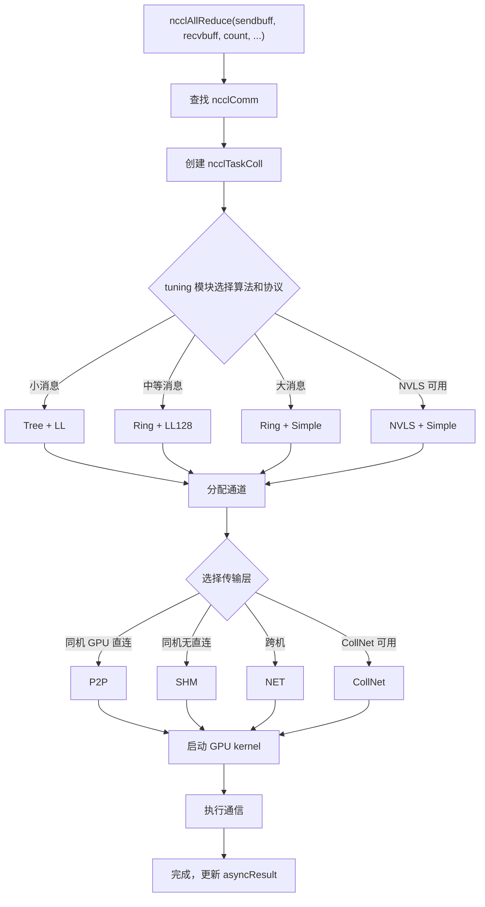

# 제 2 장: 핵심 추상 모델: 통신 연산자, 토폴로지, 알고리즘, 프로토콜 및 전송 계층

# 제2장: 핵심 추상 모델: 통신 연산자, 토폴로지, 알고리즘, 프로토콜 및 전송 계층

이전 장에서 우리는 NCCL을 실행시키고 ncclCommInitRank, ncclAllReduce, ncclCommDestroy 세 API의 외부 동작을 관찰했다. 하지만 외부 동작은 빙산의 일각에 불과하다——ncclAllReduce가 반환될 때 GPU上에서 도대체 무슨 일이 일어나는가? 데이터는 어느 경로로 가는가? 왜 동일한 AllReduce가 다른 머신에서 성능 차이가 큰가? 이러한 질문에 답하려면 먼저 NCCL의 공통 용어집을 구축해야 한다. 이 장에서는 다섯 가지 핵심 추상 개념을 하나씩 분해한다: 통신 도메인(ncclComm), 채널(channel), 알고리즘(algorithm), 프로토콜(protocol), 전송 계층(transport). 이 다섯 가지 개념은 전권을 관통하며, 이후 각 장의 분석에서 모두 사용된다. 이들 간의 관계를 이해하면 NCCL의 골격을 이해한 것이다.

# 2.1 통신 도메인 ncclComm: 한 프로세스의 통신 컨텍스트

## 직관적 모델

를`ncclComm`「그룹 채팅」이라고 상상하자: 각 프로세스가 그룹 채팅에 참여한 후 그룹 ID를 받고, 이후 모든 메시지가 이 그룹에서 발송된다. 그룹에 몇 명이 있는지(`nRanks`), 내가 누구인지(`rank`), 어떤 회선을 타는지(`channels`), 어떤 규칙을 사용하는지(`config`)가 모두 이 그룹 채팅 객체에 기록된다.

만약`ncclComm`가 없다면, NCCL은 「누가 누구와 통신하는지」「데이터가 어디로 가는지」를 알 수 없다——매번 API를 호출할 때마다 rank 목록을 재협상하고 연결을 재구축해야 하므로, 오버헤드를 감당할 수 없다.

## 데이터 구조와 메모리 레이아웃

`ncclComm`는 전체 NCCL에서 가장 핵심적인 구조체로,`src/include/comm.h`에 정의되어 있다. 그것은 극도로 방대하며(거의 300줄), 우리는 기능별로 그룹화하여 핵심 필드를 살펴본다.

**신원 식별과 수명 주기 센티넬**

[FACT:src/include/comm.h:576-580]는`startMagic`，[FACT:src/include/comm.h:879-881]를 정의하고`endMagic`를 정의한다. 이 두 필드는 보안 키가 아니라 메모리 경계 초과 감지 센티넬이다.[FACT:src/include/comm.h:883-885]에 두 개의`static_assert`：

```c
static_assert(offsetof(struct ncclComm, startMagic) == 0, "startMagic must be the first field of ncclComm");
static_assert(offsetof(struct ncclComm, endMagic) == sizeof(struct ncclComm) - sizeof(uint64_t),
              "endMagic must be the last field of ncclComm");
```

> **[Design Inference & Architectural Trade-offs]**
> 이 두 단언은 컴파일 시`startMagic`가 구조체 첫 주소에,`endMagic`가 끝에 위치하도록 강제한다. 런타임에 이 두 매직 넘버가 변조되었는지 확인하여`ncclComm`포인터가 유효한지 빠르게 판단할 수 있다——이는 다중 스레드 환경에서 「와일드 포인터가 소멸된 통신 도메인에 접근」하는 종류의 버그를排查할 때 매우 유용하다.

**Rank와 토폴로지 정보**

[FACT:src/include/comm.h:628-629]는`rank`와`nRanks`를 정의한다——통신 도메인에서의 내 번호와 총 참여자 수.[FACT:src/include/comm.h:644-652]는 노드 관련 필드를 정의한다:`node`(내가 있는 노드 번호),`nNodes`(총 노드 수),`localRank`(노드 내 번호),`localRanks`(노드 내 GPU 수), 그리고 세 개의 매핑 테이블`rankToNode`、`rankToLocalRank`、`localRankToRank`。

> **[Design Inference & Architectural Trade-offs]**
> 이 세 개의 매핑 테이블은 토폴로지 인식 알고리즘의 기초입니다. 예를 들어 Ring 알고리즘은 '내 다음 rank가 같은 노드 내에 있는지'를 알아야 NVLink를 탈지 네트워크를 탈지 결정할 수 있습니다. 이러한 매핑 테이블이 없으면 알고리즘 선택 시마다 토폴로지 그래프를 다시 쿼리해야 하므로 오버헤드가 막대합니다.

**채널과 버퍼**

[FACT:src/include/comm.h:593-593]는 다음을 정의합니다`channels[MAXCHANNELS]`——이것은 통신 도메인 내 모든 채널의 배열입니다.[FACT:src/include/comm.h:674-676]는 채널 수를 정의합니다:`nChannels`(연결 채널 수),`collChannels`(집합 통신 인큐 채널 수),`nvlsChannels`(NVLS 채널 수).

[FACT:src/include/comm.h:691-693]는 버퍼 크기를 정의합니다:`buffSizes[NCCL_NUM_PROTOCOLS]`(각 프로토콜의 버퍼 크기),`p2pChunkSize`(P2P 블록 크기),`nvlsChunkSize`(NVLS 블록 크기).

> **[Design Inference & Architectural Trade-offs]**
> `buffSizes`배열의 인덱스는 프로토콜 열거형 값(LL/LL128/Simple)입니다. 이는 각 프로토콜이 독립적인 버퍼 크기 구성을 가진다는 것을 의미합니다. LL 프로토콜은 지연 시간을 줄이기 위해 작은 버퍼가 필요하고, Simple 프로토콜은 대역폭을 높이기 위해 큰 버퍼가 필요합니다——이 배열은 두 요구 사항이 공존할 수 있게 합니다.

**작업 큐와 FIFO**

[FACT:src/include/comm.h:719-728]는 작업 FIFO 관련 필드를 정의합니다:`workFifoBytes`(FIFO 크기, 2의 거듭제곱),`workFifoBuf`(호스트 측 FIFO 버퍼),`workFifoBufDev`(디바이스 측 FIFO 버퍼),`workFifoProduced`(생산된 바이트 수),`workFifoConsumed`(소비된 바이트 수).

> **[Design Inference & Architectural Trade-offs]**
> 이것은 전형적인 생산자-소비자 링 버퍼입니다. 호스트 측(생산자)이 작업 설명을 FIFO에 쓰고, GPU kernel(소비자)이 읽어서 실행합니다.`workFifoBytes`는 반드시 2의 거듭제곱이어야 합니다. 이렇게 하면 모듈로 연산 대신 비트 마스크를 사용할 수 있어 인덱스 계산이 빨라집니다.

**프로세스 내 동기화 배리어**

[FACT:src/include/comm.h:731-731]는 프로세스 내 다중 통신 도메인 동기화 메커니즘을 정의합니다:

```c
struct ncclComm* intraComm0; // leader of intra-process comms (self possible)
struct ncclComm* intraNext; // next of intra-process comms, intraComm0 is head
int intraRank;
int intraRanks;
uint32_t intraBarrierPhase;
char intraPad1[64 - sizeof(uint64_t)];
uint64_t intraBarrierCounter; // only used if this is intraComm0
char intraPad2[64 - sizeof(uint64_t)];
uint64_t intraBarrierGate; // only used if this is intraComm0
```

주의`intraPad1`와`intraPad2`의 크기는`64 - sizeof(uint64_t)`, 즉 56바이트입니다. 앞의`uint64_t`필드를 더하면 각 필드 그룹은 정확히 64바이트——즉 하나의 캐시 라인(Cache Line)을 차지합니다.

> **[Design Inference & Architectural Trade-offs]**
> 이것은 전형적인**캐시 라인 패딩(Cache Line Padding)**기법입니다.`intraBarrierCounter`와`intraBarrierGate`는 여러 스레드에 의해 빈번히 읽히고 쓰입니다. 만약 이들이 같은 캐시 라인을 공유하면**거짓 공유(False Sharing)**가 발생합니다: 한 스레드가`intraBarrierCounter`를 수정하면 다른 스레드의`intraBarrierGate`캐시가 무효화되어 성능이 급격히 저하됩니다. 56바이트 패딩으로 이들을 서로 다른 캐시 라인으로 분리하는 것은 고성능 동시성 프로그래밍의 표준 기법입니다.

**비동기 오류 상태**

[FACT:src/include/comm.h:705-705]는`asyncResult`를 정의합니다——이 필드는 통신 도메인의 비동기 작업 상태를 기록합니다. 이전 장에서`ncclCommFinalize`가 반환될 때 통신 도메인이 아직`ncclInProgress`상태일 수 있다고 언급했는데, 바로 이 필드를 통해 추적됩니다.

## 시나리오 기반 Walkthrough: ncclCommInitRank에서 구조체 채우기까지

사용자가`ncclCommInitRank(&comm, nranks, commId, rank)`를 호출하면 NCCL 내부에서`ncclComm`구조체를 할당하고 필드별로 채웁니다. 이 흐름을 따라가며 주요 필드가 어떻게 설정되는지 살펴보겠습니다:

**1단계: 할당 및 초기화**

NCCL은`ncclCalloc`를 사용하여`ncclComm`를 할당하고 모든 필드가 0으로 초기화되도록 합니다. 이때`startMagic`와`endMagic`는`NCCL_MAGIC`（[FACT:src/include/comm.h:563-569]로 설정됩니다(`0x0280028002800280`는

**로 정의되며, 주석에는 "Nickel atomic number is 28"이라고 되어 있습니다).**

`rank`、`nRanks`、`cudaDev`2단계: 신원 정보 채우기`commHash`는 매개변수와 CUDA API에서 가져옵니다.`ncclCommId`는

**를 해시하여 얻으며, 이후 네트워크 통신에서 일관성 검증에 사용됩니다.**

3단계: 토폴로지 그래프 구축`topo`NCCL은 토폴로지 탐지 모듈을 호출하여 모든 GPU, NIC, PCI 스위치를 열거하고[FACT:src/include/comm.h:595-595]필드(

**)를 구축합니다. 이 토폴로지 그래프가 이후 알고리즘 선택과 경로 계획을 결정합니다.**

`channels[MAXCHANNELS]`4단계: 채널 초기화`id`배열이 하나씩 초기화됩니다. 각 채널의`peers`는 배열 인덱스로 설정되고,`devPeers`와

**포인터가 할당됩니다.**

5단계: 전송 연결 설정`setup`토폴로지 그래프에 따라 NCCL은 각 rank 쌍에 대해 전송 계층(P2P/SHM/NET)을 선택하고 해당`connect`와`channels[i].peers[j]`콜백을 호출합니다. 연결 정보는

**에 저장됩니다.**

6단계: 매직 넘버 설정`endMagic`마지막으로,`NCCL_MAGIC`가

## 로 설정되어 구조체 초기화가 완료되었음을 표시합니다.

**설계 고찰과 실무 함정`ncclComm`왜**

> **[Design Inference & Architectural Trade-offs]**
> `ncclComm`〔설계 추론 및 아키텍처 트레이드오프〕

**는 거의 300개의 필드를 포함하는데, 이는 하나의 통신 도메인의 전체 상태를 담고 있기 때문입니다. NCCL의 설계 철학은 '한 번 초기화, 여러 번 재사용'입니다——초기화 시 사용 가능한 모든 정보를 미리 계산하여 저장하고, 런타임에는 테이블을 직접 조회하여 반복 계산을 피합니다. 대가는 메모리 사용량이 다소 크다는 것(통신 도메인당 약 몇 KB)이지만, GPU 메모리와 네트워크 대역폭에 비하면 이 정도 메모리는 미미합니다.**

> **[Design Inference & Architectural Trade-offs]**
> `ncclComm`〔설계 추론 및 아키텍처 트레이드오프〕`ncclComm`는 스레드 안전하지 않습니다. 두 스레드가 동시에 같은`ncclAllReduce`，`workFifoProduced`에 대해

**등을 호출하면 필드 경쟁이 발생하여 데이터가 손상됩니다. 올바른 방법은 각 스레드가 독립적인 통신 도메인을 사용하거나 외부 잠금으로 호출을 직렬화하는 것입니다.**

`ncclCommDestroy`함정 시나리오 2: 파괴 후 접근`startMagic`가 구조체 메모리를 해제한 후에도 스레드가 포인터를 보유하고 접근하면 해제된 메모리를 읽게 됩니다.`endMagic`와

**는 이러한 상황을 감지하는 데 도움이 됩니다——매직 넘버가 일치하지 않으면 포인터가 무효화되었음을 의미합니다.**

함정 시나리오 3: 캐시 라인 거짓 공유`intraBarrierCounter`다중 프로세스 시나리오(프로세스당 하나의 rank)에서`intraBarrierGate`와

# 의 패딩은 특히 중요합니다. 패딩을 생략하면 여러 프로세스의 배리어 작업이 서로 간섭하여 동기화 지연이 나노초 수준에서 마이크로초 수준으로 증가합니다.

## 2.2 채널 channel: 하나의 통신을 여러 파이프라인으로 분할

직관적 모델`channel`NCCL의 「컨베이어 벨트」——집합 통신 한 번의 데이터를 여러 조각으로 나누고, 각 채널이 독립적으로 한 조각을 운반하며 병렬로 진행하여 대역폭 활용률을 높인다.

채널이 없으면 모든 데이터가 단 하나의 경로로만 흐를 수 있어, GPU 간의 여러 물리 링크(여러 NIC, 여러 NVLink 그룹)를 동시에 활용할 수 없고 대역폭 활용률이 크게 떨어진다.

## 데이터 구조와 메모리 레이아웃

`ncclChannel`정의 위치[FACT:src/include/comm.h:169-191]：

```c
struct ncclChannel {
  struct ncclChannelPeer** peers;
  struct ncclDevChannelPeer** devPeers;
  /* devPeer pointer array used for host side access */
  struct ncclDevChannelPeer** devPeersHostPtr;
  struct ncclRing ring;
  int* devRingUserRanks;
  struct ncclTree tree;

  struct ncclTree collnetChain;
  struct ncclDirect collnetDirect;

  struct ncclNvls nvls;

  int id; // index of this channel
  uint32_t workFifoProduced; // +1 successor of last used work fifo byte

  /* comm split sharable resources */
  struct ncclChannelPeer* collnetPeers;
  struct ncclDevChannelPeer* collnetDevPeers;
  struct ncclChannelPeer* nvlsPeers;
  struct ncclDevChannelPeer* nvlsDevPeers;
};
```

**주요 필드 분석**

- `peers` / `devPeers`: 해당 채널 내 모든 rank의 연결 정보를 가리킨다.`peers`는 호스트 측 뷰이고,`devPeers`는 디바이스 측 뷰이다(GPU kernel이 직접 접근).
- `ring`: Ring 알고리즘의 토폴로지 설명——각 rank의 전임자와 후임자.
- `tree`: Tree 알고리즘의 토폴로지 설명——부모 노드와 자식 노드 리스트.
- `collnetChain` / `collnetDirect`: CollNet 알고리즘의 두 가지 변형 토폴로지.
- `nvls`: NVLink SHARP의 토폴로지 설명.
- `id`: 채널 인덱스, 0부터`nChannels-1`。
- `workFifoProduced`: 해당 채널의 작업 FIFO 생산 포인터.

> **[Design Inference & Architectural Trade-offs]**
> 주의`ring`、`tree`、`collnetChain`、`collnetDirect`、`nvls`이 다섯 필드는**병렬**이다——동일한 채널이 동시에 여러 알고리즘의 토폴로지 설명을 보유할 수 있다. 런타임에 알고리즘 선택에 따라 어느 필드를 사용할지 결정한다. 이 설계 덕분에 알고리즘 전환 시 채널을 재구축할 필요 없이 읽는 필드만 바꾸면 된다.

**채널 수 계산**

채널 수는`ncclComm`에 정의된다([FACT:src/include/comm.h:674-676]）：

```c
int nChannels; // connection nChannels
int collChannels; // enqueue nChannels
int nvlsChannels; // enqueue nChannels
```

> **[Design Inference & Architectural Trade-offs]**
> `nChannels`는 실제로 설정된 연결 수이고,`collChannels`는 집합 통신 인큐 시 사용되는 채널 수이며,`nvlsChannels`는 NVLS 전용 채널 수이다. 세 가지가 다를 수 있다——예를 들어 일부 채널은 P2P에만 사용되고 집합 통신에는 사용되지 않는다.

**P2P 채널 스케줄링**

[FACT:src/include/channel.h:21-33]가`ncclP2pChannelBaseForRound`함수를 정의하며, P2P 통신에서 각 round에 사용되는 채널 기반 주소를 계산한다:

```c
inline uint8_t ncclP2pChannelBaseForRound(struct ncclComm* comm, int p2pRound) {
  int base;
  if (comm->nNodes > 1) {
    int localSize = comm->p2pSchedGroupSize;
    int groupDelta = p2pRound / localSize;
    int localDelta = p2pRound % localSize;
    base = groupDelta * divUp(localSize, NCCL_MAX_DEV_WORK_P2P_PER_BATCH);
    base += localDelta / NCCL_MAX_DEV_WORK_P2P_PER_BATCH;
  } else {
    base = p2pRound;
  }
  return reverseBits(base, log2Up(comm->p2pnChannels));
}
```

> **[Design Inference & Architectural Trade-offs]**
> 이 함수의 로직은: 다중 노드 시나리오에서는 P2P 통신이 「그룹」 단위로 스케줄링되고, 각 그룹 내 rank는 인접 채널을 사용한다; 단일 노드 시나리오에서는 각 round가 직접 하나의 채널에 매핑된다.`reverseBits`는 비트 반전 연산으로, 채널 할당을 분산시켜 핫스팟 집중을 방지한다.

## 시나리오 기반 Walkthrough: AllReduce 한 번이 채널을 어떻게 할당하는가

8개 rank, 4개 채널이라고 가정하고 AllReduce를 한 번 실행한다. 데이터는 4조각으로 나뉘고, 각 조각을 하나의 채널이 담당한다.

**1단계: 알고리즘 선택**

NCCL의 tuning 모듈이 메시지 크기와 토폴로지에 따라 알고리즘(예: Ring)과 프로토콜(예: Simple)을 선택한다.

**2단계: 채널 할당**

`ncclTaskColl`구조체([FACT:src/include/comm.h:212-273])가 생성되고, 그중`nChannels`필드가 4로 설정된다([FACT:src/include/comm.h:254-254]）。`channelLo`와`channelHi`필드([FACT:src/include/comm.h:256-257])는 해당 작업이 사용하는 채널 범위를 표시한다.

**3단계: 데이터 분할**

각 채널이`count / nChannels`개 요소를 담당한다. 채널 0은 0번째부터 count/4-1번째 요소를 처리하고, 채널 1은 count/4번째부터 count/2-1번째 요소를 처리하는 식이다.

**4단계: 병렬 실행**

4개 채널의 GPU kernel이 동시에 시작되고, 각자 자신의 데이터 슬라이스에서 Ring AllReduce를 수행한다. 채널 간에 데이터 의존성이 없으므로 완전히 병렬로 실행할 수 있다.

**5단계: 결과 병합**

모든 채널이 완료되면 각 rank의 recv buffer에는 완전한 AllReduce 결과가 담긴다.

## 동시성 제어와 하드웨어 상호작용

**채널과 GPU 리소스의 매핑**

> **[Design Inference & Architectural Trade-offs]**
> 각 채널은 일반적으로 독립적인 CUDA stream 또는 GPU 하드웨어 큐에 바인딩된다. 이렇게 하면 서로 다른 채널의 kernel이 GPU에서 동시에 실행되어 SM(스트리밍 멀티프로세서) 리소스를 충분히 활용할 수 있다.

**채널과 네트워크 디바이스의 매핑**

다중 NIC 시나리오에서는 서로 다른 채널을 서로 다른 NIC에 바인딩할 수 있다. 예를 들어 4개 채널, 2개 NIC라면 채널 0과 1은 NIC A를, 채널 2와 3은 NIC B를 사용한다. 이렇게 하면 두 NIC의 대역폭을 모두 활용할 수 있다.

**채널 수 선택**

> **[Design Inference & Architectural Trade-offs]**
> 채널 수가 많을수록 좋은 것은 아니다. 채널 수 증가는 다음을 초래한다:

- 더 많은 kernel 시작 오버헤드
- 더 많은 연결 설정 오버헤드
- 더 복잡한 동기화

NCCL의 tuning 모듈은 메시지 크기에 따라 최적의 채널 수를 자동으로 선택한다. 작은 메시지는 적은 채널(오버헤드 감소), 큰 메시지는 많은 채널(대역폭 향상)을 사용한다.

## 프로덕션 함정 회피 가이드

**함정 시나리오 1: 채널 수 설정 부적절**

> **[Design Inference & Architectural Trade-offs]**
> 만약 수동으로`NCCL_NCHANNELS`를 너무 크게 설정하면, 작은 메시지 시나리오에서 kernel 시작 오버헤드가 이득을 초과하여 성능이 오히려 떨어진다. 명확한 튜닝 요구가 없다면 NCCL이 자동 선택하도록 하는 것을 권장한다.

**함정 시나리오 2: 채널과 토폴로지 불일치**

> **[Design Inference & Architectural Trade-offs]**
> 채널 수가 물리 링크 수를 초과하면 일부 채널이 링크를 공유하게 되어 진정한 병렬을 달성할 수 없다. 예를 들어 2개 NIC에 8개 채널을 설정하면 실제로는 2개 채널만 동시 전송이 가능하고 나머지 6개는 대기한다.

**함정 시나리오 3: P2P 채널 충돌**

`ncclP2pChannelBaseForRound`의`reverseBits`연산이 잘못 구현되면 여러 round가 동일 채널에 매핑되어 직렬화가 발생한다.[FACT:src/include/channel.h:32-32]의`reverseBits(base, log2Up(comm->p2pnChannels))`는 채널 할당을 균등하게 보장한다.

# 2.3 알고리즘 algorithm: Tree/Ring/CollNet/NVLS/PAT의 토폴로지 구성

## 직관적 모델

베이징에서 상하이까지 고속철도, 비행기 또는 자가용으로 갈 수 있으며, 각 방식은 서로 다른 거리와 인원에 적합합니다. NCCL의 알고리즘은 바로 이러한 '이동 방식'입니다 — Ring은 대용량 메시지의 안정적인 대역폭에 적합하고, Tree는 소용량 메시지의 저지연에 적합하며, CollNet은 네트워크 카드 오프로드를 활용하고, NVLS는 NVLink SHARP 하드웨어 가속을 활용하며, PAT는 NVLS의 병렬화 변형입니다.

알고리즘 선택이 없다면 NCCL은 하나의 고정된 모드로만 통신할 수 있어 다양한 메시지 크기와 토폴로지 구조에 적응할 수 없고, 성능이 크게 저하됩니다.

## 데이터 구조와 메모리 레이아웃

**Ring 알고리즘**

Ring 알고리즘의 핵심은`ncclRing`구조체(`src/include/comm.h`에서`channels[i].ring`를 통해 참조)입니다.[FACT:src/include/collectives.h:81-116]는`RingAlgorithm`기반 클래스를 정의합니다:

```c
class RingAlgorithm {
protected:
  int refCount;
  int nRanks;
  int nStepsPerLoop;
  int chunkSteps;
  int sliceSteps;
  ssize_t sliceSize;
  ssize_t loopSize;
  ssize_t channelSize;
  uint8_t* sendbuff;
  uint8_t* recvbuff;
  void* sendMhandle;
  void* recvMhandle;
  void* srecvMhandle;

public:
  virtual void getNextSendAddr(int curStep, uint8_t** sendbuffOut, size_t* sizeOut, void** mhandleOut) = 0;
  virtual void getNextRecvAddr(int curStep, uint8_t** recvbuffOut, size_t* sizeOut, void** mhandleOut) = 0;
  int incRefCount() {
    return (int)COMPILER_ATOMIC_ADD_FETCH(&refCount, 1, std::memory_order_relaxed);
  }
  int decRefCount() {
    return (int)COMPILER_ATOMIC_SUB_FETCH(&refCount, 1, std::memory_order_release);
  }
  RingAlgorithm() {
    refCount = 0;
  }
  virtual ~RingAlgorithm() {};
};
```

**주요 필드 분석**

- `refCount`: 참조 카운트로, proxy 스레드와 GPU kernel이 알고리즘 객체를 공유하는 데 사용됩니다.
- `nRanks`: 링 위의 노드 수.
- `nStepsPerLoop`: 매 루프의 스텝 수. AllReduce는`2*(nRanks-1)*chunkSteps`（[FACT:src/include/collectives.h:218-218]）。
- `chunkSteps` / `sliceSteps`: 블록 스텝 수와 슬라이스 스텝 수로, 파이프라인 세분성을 제어합니다.
- `sliceSize` / `loopSize` / `channelSize`: 슬라이스 크기, 루프 크기, 채널 크기.
- `sendbuff` / `recvbuff`: 송신 및 수신 버퍼 포인터.
- `sendMhandle` / `recvMhandle` / `srecvMhandle`: 메모리 핸들로, 네트워크 등록에 사용됩니다.

**참조 카운트의 원자적 연산**

[FACT:src/include/collectives.h:106-108]은`incRefCount`과`decRefCount`：

```c
int incRefCount() {
  return (int)COMPILER_ATOMIC_ADD_FETCH(&refCount, 1, std::memory_order_relaxed);
}
int decRefCount() {
  return (int)COMPILER_ATOMIC_SUB_FETCH(&refCount, 1, std::memory_order_release);
}
```

> **[Design Inference & Architectural Trade-offs]**
> `incRefCount`는`memory_order_relaxed`을 사용합니다 — 참조 카운트를 증가시킬 때는 동기화가 필요 없고, 원자성만 보장하면 됩니다.`decRefCount`는`memory_order_release`을 사용합니다 — 참조 카운트를 감소시킬 때는 이전 쓰기 작업이 다른 스레드에 보이는지 확인해야 합니다(객체 소멸을 트리거할 수 있기 때문).

**RingARAlgorithm: AllReduce의 Ring 구현**

[FACT:src/include/collectives.h:118-234]은`RingARAlgorithm`를 정의하며,`RingAlgorithm`를 상속받습니다. 핵심 메서드는`getNextSendAddr`과`getNextRecvAddr`。

[FACT:src/include/collectives.h:126-167]의`getNextSendAddr`로직:

```c
void getNextSendAddr(int curStep, uint8_t** sendbuffOut, size_t* sizeOut, void** mhandleOut) {
  int curLoop = curStep / nStepsPerLoop;
  int curLoopStage = (curStep % nStepsPerLoop) / chunkSteps;
  int chunkStage = curLoopStage % nRanks;
  int sliceStage = (curStep % chunkSteps) / sliceSteps;
  ssize_t elemOffset = curLoop * loopSize;
  ssize_t remSize = channelSize - elemOffset;
  // ... 计算 chunkOffset, sliceOffset, curSliceSize ...
  if (remSize  **[Design Inference & Architectural Trade-offs]**
> 이 코드의 핵심은**주소 계산**입니다: 현재 스텝 수`curStep`가 주어지면, 어느 데이터 블록의 어느 슬라이스를 전송해야 하는지 계산합니다.`chunkId`의 계산`(ringIndex + nRanks - 1 - chunkStage) % nRanks`은 링 위의 역방향 전파를 구현합니다 — 각 rank는 전임자로부터 데이터를 수신하고, 처리 후 후임자에게 전송합니다.

**PAT 알고리즘**

PAT(Parallel Aggregated Tree)는 NVLS의 병렬화 변형입니다.[FACT:src/include/collectives.h:416-423]은`ncclPatStep`：

```c
struct ncclPatStep {
  int recvDim, sendDim, recvOffset, sendOffset, stepOffset, postRecv, postSend, nelem, last, flags;
  // PAT algo computation thread step number; -1 while the slot is free.
  int step;
  // This PAT group's offset within the shared NVLS slot.
  int nvlsOffset;
  size_t inpIx, outIx;
};
```

[FACT:src/include/collectives.h:425-435]은`ncclPatPeer`：

```c
struct ncclPatPeer {
  uint64_t step;
  struct ncclConnInfo* conn;
  struct ncclConnFifo* connFifo;
  void* buff;
  uint64_t* headPtr;
  uint64_t* tailPtr;
  uint64_t stepCache;
  long long int accSize;
  int connStepSize;
};
```

> **[Design Inference & Architectural Trade-offs]**
> PAT 알고리즘의 핵심 사상은**여러 작은 단계를 하나의 큰 단계로 집계**하여 동기화 오버헤드를 줄이는 것입니다.`ncclPatStep`은 집계 단계의 송수신 차원, 오프셋, 요소 수 등의 정보를 설명합니다.`ncclPatPeer`은 피어 노드의 연결 상태와 버퍼 포인터를 설명합니다.

## 시나리오 기반 Walkthrough: Ring AllReduce의 단계 진화

4개의 rank(0, 1, 2, 3)가 있고, 각 rank에 4개의 요소가 있다고 가정하고 Ring AllReduce를 실행합니다.

**Reduce-Scatter 단계**

- 스텝 0: rank 0이 요소 0을 rank 1에 전송하고, rank 1이 요소 1을 rank 2에 전송하며, rank 2가 요소 2를 rank 3에 전송하고, rank 3이 요소 3을 rank 0에 전송합니다.
- 스텝 1: 각 rank는 수신한 요소를 로컬의 대응 요소와 더한 후, 다음 rank에 전송합니다.
- 스텝 2: 계속 누적하고 전달합니다.
- 스텝 3: 이 시점에서 각 rank는 하나의 완전한 리덕션 결과를 가집니다(rank 0은 요소 3의 결과, rank 1은 요소 0의 결과 등).

**AllGather 단계**

- 스텝 4-6: 각 rank는 자신이 가진 리덕션 결과를 링을 따라 전파하고, 최종적으로 모든 rank가 완전한 결과를 가집니다.

[FACT:src/include/collectives.h:218-218]의`nStepsPerLoop = 2 * (nRanks - 1) * chunkSteps`는 이 흐름에 정확히 대응합니다: Reduce-Scatter는`(nRanks-1)*chunkSteps`스텝이 필요하고, AllGather도`(nRanks-1)*chunkSteps`스텝이 필요하며, 총`2*(nRanks-1)*chunkSteps`스텝입니다.

## 설계 사고와 프로덕션 함정

**왜 Ring과 Tree가 공존하는가?**

> **[Design Inference & Architectural Trade-offs]**
> Ring 알고리즘은 대역폭 활용률이 높지만(모든 링크가 전송 중), 지연이 rank 수에 따라 선형으로 증가합니다. Tree 알고리즘의 지연은 로그 스케일이지만 대역폭 활용률이 낮습니다(일부 링크만 작동). NCCL은 메시지 크기에 따라 자동 선택합니다: 소용량 메시지는 Tree(지연 민감), 대용량 메시지는 Ring(대역폭 민감).

**함정 시나리오 1: 알고리즘 선택 오류**

> **[Design Inference & Architectural Trade-offs]**
> 소용량 메시지에 Ring을 수동으로 강제 사용하면 지연이 현저히 증가합니다. 명확한 성능 분석 데이터가 수동 개입을 뒷받침하지 않는 한, tuning 모듈이 자동 선택하도록 하는 것이 권장됩니다.

**함정 시나리오 2: NVLS 하드웨어 미지원**

NVLS는 특정 하드웨어 지원(NVLink SHARP)이 필요합니다. 하드웨어가 지원하지 않는데 코드가 NVLS를 강제 사용하면 Ring 또는 Tree로 폴백되지만, 성능 변동이 동반될 수 있습니다.[FACT:src/include/comm.h:755-755]의`nvlsSupport`필드는 하드웨어가 NVLS를 지원하는지 표시합니다.

**함정 시나리오 3: PAT 알고리즘의 집계 인자 설정**

PAT 알고리즘의`aggFactor`은 몇 개의 단계를 집계할지 결정합니다.[FACT:src/include/collectives.h:537-560]은`aggFactor`의 계산 로직을 보여줍니다:

```c
aggFactor = 1;
size_t channelSize = end - offset;
while (stepSize / (channelSize * sizeof(T) * aggFactor) >= 2 && aggFactor  1 && aggFactor  **[Design Inference & Architectural Trade-offs]**
> `aggFactor`가 너무 작으면 동기화 오버헤드가 커지고, 너무 크면 파이프라인 버블이 발생합니다. NCCL은`stepSize`、`channelSize`、`nranks`에 따라 최적값을 자동 계산합니다.

# 2.4 프로토콜 protocol: LL/LL128/Simple 세 가지 데이터 전송 전략

## 직관적 모델

택배를 보낼 때 「동일 도시 당일 배송」「익일 배송」 또는 「일반 택배」를 선택할 수 있으며, 속도와 비용이 다릅니다. NCCL의 프로토콜이 바로 이러한 「발송 방식」입니다 — LL(Low Latency)은 작은 메시지의 저지연 전송에 적합하고, LL128은 중간 크기 메시지의 128바이트 정렬 전송에 적합하며, Simple은 큰 메시지의 고대역폭 전송에 적합합니다.

프로토콜 선택이 없다면, NCCL은 하나의 고정된 전략으로만 데이터를 운반할 수 있어 지연과 대역폭 사이의 균형을 맞출 수 없습니다.

## 데이터 구조와 메모리 레이아웃

**프로토콜 열거형**

[FACT:src/include/comm.h:55-57]프로토콜 관련 스레드 임계값을 정의합니다:

```c
#define NCCL_LL_THREAD_THRESHOLD 8
#define NCCL_LL128_THREAD_THRESHOLD 8
#define NCCL_SIMPLE_THREAD_THRESHOLD 64
```

> **[Design Inference & Architectural Trade-offs]**
> 이 임계값들은 각 프로토콜이 몇 개의 스레드를 사용하는지 결정합니다. LL과 LL128은 8개의 스레드를 사용하고(저지연, 적은 스레드로 충분), Simple은 64개의 스레드를 사용합니다(고대역폭, 더 많은 스레드의 병렬 운반 필요).

**프로토콜 버퍼**

[FACT:src/include/comm.h:691-691]다음을 정의합니다`buffSizes[NCCL_NUM_PROTOCOLS]`——각 프로토콜은 독립적인 버퍼 크기를 가집니다.

**프로토콜 관련 FIFO 구조**

[FACT:src/include/comm.h:59-83]다음을 정의합니다`ncclSendMem`그리고`ncclRecvMem`：

```c
struct ncclSendMem {
  union {
    struct {
      uint64_t head;
      char pad1[CACHE_LINE_SIZE - sizeof(uint64_t)];
      void* ptrExchange;
      uint64_t redOpArgExchange[2];
      char pad2[CACHE_LINE_SIZE - sizeof(void*) - 2 * sizeof(uint64_t)];
      int offsFifo[NCCL_STEPS];
    };
    char pad3[MEM_ALIGN];
  };
};

struct ncclRecvMem {
  union {
    struct {
      uint64_t tail;
      char pad1[CACHE_LINE_SIZE - sizeof(uint64_t)];
      struct ncclConnFifo connFifo[NCCL_STEPS];
      int flush; // For GDRCopy-based flush
    };
    char pad4[MEM_ALIGN];
  };
};
```

> **[Design Inference & Architectural Trade-offs]**
> `ncclSendMem`그리고`ncclRecvMem`은 송수신의 공유 메모리 구조입니다.`head`그리고`tail`은 링 버퍼의 읽기/쓰기 포인터이며,`pad1`이들이 서로 다른 캐시 라인에 있도록 보장합니다.`connFifo`배열은 각 단계의 연결 정보(모드, 오프셋, 크기, 포인터)를 저장하며, 다음에 정의됩니다[FACT:src/include/collectives.h:72-77]：

```c
struct ncclConnFifo {
  int mode;
  ssize_t offset;
  ssize_t size;
  void* ptr;
};
```

**프로토콜 선택 로직**

> **[Design Inference & Architectural Trade-offs]**
> 프로토콜 선택은 tuning 모듈에 의해 수행되며, 고려 요소는 다음과 같습니다:

- 메시지 크기: 작은 메시지는 LL, 중간은 LL128, 큰 메시지는 Simple.
- 토폴로지 구조: NVLink 연결은 LL128에 적합하고, 네트워크 연결은 Simple에 적합합니다.
- 하드웨어 능력: 일부 GPU 아키텍처는 특정 프로토콜에 최적화되어 있습니다.

## 시나리오 기반 Walkthrough: LL 프로토콜의 데이터 운반

LL 프로토콜을 사용하여 1KB 데이터를 전송한다고 가정합니다.

**첫 번째 단계: 데이터를 송신 버퍼에 쓰기**

호스트 측에서 데이터를 다음에 씁니다`sendbuff`, 그런 다음`ncclSendMem.head`포인터를 갱신하여 GPU kernel에 새 데이터가 있음을 알립니다.

**두 번째 단계: GPU kernel이 데이터 읽기**

GPU kernel이`head`포인터를 폴링하여 새 데이터를 발견하면,`sendbuff`에서 데이터를 읽습니다.

**세 번째 단계: 데이터 전송**

GPU kernel이 NVLink 또는 네트워크를 통해 데이터를 대상 rank로 전송합니다.

**네 번째 단계: 대상 rank가 데이터 수신**

대상 rank의 GPU kernel이 데이터를 다음에 씁니다`recvbuff`, 그런 다음`ncclRecvMem.tail`포인터를 갱신합니다.

**다섯 번째 단계: 호스트 측에서 데이터 읽기**

호스트 측에서`tail`포인터를 폴링하여 새 데이터를 발견하면,`recvbuff`에서 데이터를 읽습니다.

## 동시성 제어와 하드웨어 상호작용

**LL 프로토콜의 저지연 메커니즘**

> **[Design Inference & Architectural Trade-offs]**
> LL 프로토콜은**폴링(Polling)**을 사용하여 인터럽트 대신 데이터 도착을 감지합니다. GPU kernel이 지속적으로`head`포인터를 읽으며, 변화가 발견되면 즉시 처리합니다. 이는 인터럽트 방식보다 지연이 낮지만 GPU 연산 자원을 점유합니다.

**LL128 프로토콜의 128바이트 정렬**

> **[Design Inference & Architectural Trade-offs]**
> LL128 프로토콜은 데이터가 128바이트로 정렬될 것을 요구하며, 이렇게 하면 매 전송이 정확히 하나의 캐시 라인을 채웁니다. 정렬의 이점은:

- 부분 캐시 라인 쓰기(Partial Cache Line Write) 감소
- 메모리 대역폭 활용률 향상
- 하드웨어 처리 로직 단순화

**Simple 프로토콜의 배치 전송**

> **[Design Inference & Architectural Trade-offs]**
> Simple 프로토콜은**배치 전송**모드를 사용합니다: 일정량의 데이터를 축적한 후 한 번에 전송하여 동기화 횟수를 줄입니다. 이는 동기화 오버헤드가 대량의 데이터에 분산되므로 큰 메시지 시나리오에 적합합니다.

## 프로덕션 함정 회피 가이드

**함정 시나리오 1: 프로토콜과 메시지 크기 불일치**

> **[Design Inference & Architectural Trade-offs]**
> LL 프로토콜을 강제로 사용하여 큰 메시지를 전송하면 성능이 급격히 저하됩니다. LL 프로토콜의 설계 목표는 저지연이지 고대역폭이 아니기 때문입니다. 큰 메시지는 Simple 프로토콜을 사용해야 합니다.

**함정 시나리오 2: LL128 정렬 문제**

> **[Design Inference & Architectural Trade-offs]**
> 데이터가 128바이트로 정렬되지 않으면 LL128 프로토콜은 LL 또는 Simple로 폴백하여 성능이 불안정해집니다. 송신 버퍼와 수신 버퍼 모두 128바이트로 정렬되도록 보장할 것을 권장합니다.

**함정 시나리오 3: 프로토콜 전환 오버헤드**

> **[Design Inference & Architectural Trade-offs]**
> 런타임에 동적으로 프로토콜을 전환하면 추가 오버헤드가 발생합니다. NCCL은 초기화 시 프로토콜을 결정하고 런타임에는 전환하지 않습니다. 전환이 필요하면 통신 도메인을 재초기화해야 합니다.

# 2.5 전송 계층 transport: P2P/SHM/NET/CollNet 하위 운반 채널

## 직관적 모델

A 지점에서 B 지점까지 걸어가거나, 자전거를 타거나, 지하철을 타거나, 택시를 탈 수 있습니다. NCCL의 전송 계층이 바로 이러한 다양한 「이동 방식」입니다. 상위 계층은 구체적으로 어떻게 가는지에 관심이 없고, 전달할 수 있는지만 관심이 있습니다. P2P는 「걷기」(동일 머신 GPU 직결), SHM은 「자전거 타기」(공유 메모리), NET은 「지하철 타기」(네트워크), CollNet은 「택시 타기」(네트워크 카드 오프로드)입니다.

전송 계층 추상화가 없다면, 상위 알고리즘은 각 물리 링크마다 다른 코드를 작성해야 하며 재사용할 수 없습니다.

## 데이터 구조와 메모리 레이아웃

**전송 계층 열거형**

[FACT:src/include/transport.h:18-23]전송 계층 유형을 정의합니다:

```c
#define NTRANSPORTS 4
#define TRANSPORT_UNDEFINED -1
#define TRANSPORT_P2P 0
#define TRANSPORT_SHM 1
#define TRANSPORT_NET 2
#define TRANSPORT_COLLNET 3
```

**전송 계층 인터페이스**

[FACT:src/include/transport.h:129-146]다음을 정의합니다`ncclTransportComm`——전송 계층의 통신 인터페이스:

```c
struct ncclTransportComm {
  ncclResult_t (*setup)(struct ncclComm* comm, struct ncclTopoGraph* graph, struct ncclPeerInfo*, struct ncclPeerInfo*,
                        struct ncclConnect*, struct ncclConnector*, int channelId, int connIndex);
  ncclResult_t (*connect)(struct ncclComm* comm, struct ncclConnect*, int nranks, int rank, struct ncclConnector*);
  ncclResult_t (*free)(struct ncclComm* comm, struct ncclConnector*);
  ncclResult_t (*proxySharedInit)(struct ncclProxyConnection* connection, struct ncclProxyState* proxyState,
                                  int nChannels);
  ncclResult_t (*proxySetup)(struct ncclProxyConnection* connection, struct ncclProxyState* proxyState, void* reqBuff,
                             int reqSize, void* respBuff, int respSize, int* done);
  ncclResult_t (*proxyConnect)(struct ncclProxyConnection* connection, struct ncclProxyState* proxyState, void* reqBuff,
                               int reqSize, void* respBuff, int respSize, int* done);
  ncclResult_t (*proxyFree)(struct ncclProxyConnection* connection, struct ncclProxyState* proxyState);
  ncclResult_t (*proxyProgress)(struct ncclProxyState* proxyState, struct ncclProxyArgs*);
  ncclResult_t (*proxyRegister)(struct ncclProxyConnection* connection, struct ncclProxyState* proxyState,
                                void* reqBuff, int reqSize, void* respBuff, int respSize, int* done);
  ncclResult_t (*proxyDeregister)(struct ncclProxyConnection* connection, struct ncclProxyState* proxyState,
                                  void* reqBuff, int reqSize, int* done);
};
```

**주요 콜백 분석**

- `setup`: 연결 수립 전 준비 작업으로, 연결 파라미터를 교환합니다.
- `connect`: 실제로 연결을 수립합니다.
- `free`: 연결 자원을 해제합니다.
- `proxySharedInit`: proxy 스레드의 공유 리소스를 초기화합니다.
- `proxySetup` / `proxyConnect`: proxy 스레드 측의 연결 설정.
- `proxyProgress`: proxy 스레드가 데이터 전송을 진행합니다.
- `proxyRegister` / `proxyDeregister`: 메모리 등록 및 해제.

**전송 계층 구조체**

[FACT:src/include/transport.h:148-154]정의함`ncclTransport`：

```c
struct ncclTransport {
  const char name[8];
  ncclResult_t (*canConnect)(int*, struct ncclComm* comm, struct ncclTopoGraph* graph, struct ncclPeerInfo*,
                             struct ncclPeerInfo*);
  struct ncclTransportComm send;
  struct ncclTransportComm recv;
};
```

> **[Design Inference & Architectural Trade-offs]**
> `name`은 전송 계층 이름(예: "P2P", "SHM", "NET")이며,`canConnect`두 rank 사이에 해당 전송 계층을 사용할 수 있는지 판단합니다,`send`과`recv`은 각각 송신 및 수신 방향의 통신 인터페이스입니다.

**전송 계층 인스턴스**

[FACT:src/include/transport.h:36-36]네 개의 전송 계층 인스턴스를 선언합니다:

```c
extern struct ncclTransport p2pTransport;
extern struct ncclTransport shmTransport;
extern struct ncclTransport netTransport;
extern struct ncclTransport collNetTransport;
```

[FACT:src/include/transport.h:36-36]전송 계층 배열을 정의합니다:

```c
extern struct ncclTransport* ncclTransports[];
```

**피어 노드 정보**

[FACT:src/include/transport.h:46-74]정의함`ncclPeerInfo`——rank 간에 교환되는 메타데이터:

```c
struct ncclPeerInfo {
  int rank;
  int cudaDev;
  int nvmlDev;
  int gdrSupport;
  uint64_t hostHash;
  uint64_t pidHash;
  dev_t shmDev;
  int64_t busId;
  cudaUUID_t gpuUuid;
  struct ncclComm* comm;
  int cudaCompCap;
  int gpuCftSupport;
  size_t totalGlobalMem;
  // MNNVL support
  nvmlGpuFabricInfoV_t fabricInfo;
  int fabricHandleSupport;
  int cuMemSupport;
  int version;
  uint64_t supportedGinTypeBitMask;
  bool crossNicSupport;
  bool rmaPluginAvailable;
  bool cuMemGdrSupport;
  int mloPart; // MLOPart partition index, or -1 if not an MLOPart GPU
  int cudaDriverVersion;
  bool gpuCftMulticastSupport;
  bool gpuCftCountedSupport;
  uint32_t gitVersionHash;
};
```

> **[Design Inference & Architectural Trade-offs]**
> 이 필드들은 두 rank 사이에 어떤 전송 계층을 사용할 수 있는지 판단하는 데 사용됩니다:

- `hostHash`동일 → 같은 호스트 → P2P 또는 SHM 사용 가능
- `hostHash`다름 → 다른 호스트 → 반드시 NET 사용
- `gdrSupport`→ GPUDirect RDMA 지원 여부
- `cudaCompCap`→ GPU 컴퓨팅 능력, 프로토콜 선택에 영향

## 시나리오 기반 Walkthrough: P2P 연결 설정

두 rank가 같은 호스트 내에 있다고 가정하면, NCCL은 P2P 전송 계층을 선택합니다.

**첫 번째 단계: PeerInfo 교환**

두 rank가 bootstrap 채널을 통해`ncclPeerInfo`을 교환하고, 서로 같은 호스트에 있으며 GPU가 P2P를 지원하는지 확인합니다.

**두 번째 단계: canConnect 호출**

[FACT:src/include/transport.h:148-154]의`canConnect`콜백이 호출되어, 토폴로지 그래프를 확인하여 두 GPU 사이에 NVLink 또는 PCIe 연결이 있는지 검사합니다.

**세 번째 단계: setup 호출**

`p2pTransport.send.setup`과`p2pTransport.recv.setup`이 호출되어, 연결 파라미터(예: IPC 핸들)를 준비합니다.

**네 번째 단계: connect 호출**

`p2pTransport.send.connect`과`p2pTransport.recv.connect`이 호출되어, 실제로 연결을 설정합니다.

**다섯 번째 단계: 메모리 등록**

RDMA가 필요하면,`proxyRegister`을 호출하여 송신 및 수신 버퍼를 등록합니다.

## 동시성 제어 및 하드웨어 상호작용

**P2P 전송 계층**

> **[Design Inference & Architectural Trade-offs]**
> P2P는 CUDA IPC(Inter-Process Communication) 메커니즘을 사용하여, 한 GPU가 다른 GPU의 VRAM에 직접 접근할 수 있게 합니다. 이를 위해서는:

- 두 GPU가 같은 PCIe 도메인 또는 NVLink 도메인에 있어야 함
- 운영체제가 CUDA IPC를 지원해야 함
- 충분한 권한

**SHM 전송 계층**

> **[Design Inference & Architectural Trade-offs]**
> SHM은 호스트 공유 메모리를 중계로 사용합니다. 두 GPU 사이에 직접 연결이 없을 때, 데이터는 먼저 호스트 메모리로 복사된 후 대상 GPU로 복사됩니다. 이는 P2P보다 느리지만 호환성이 더 좋습니다.

**NET 전송 계층**

> **[Design Inference & Architectural Trade-offs]**
> NET은 네트워크 장치(InfiniBand 또는 RoCE)를 사용하여 데이터를 전송합니다. 이를 위해서는:

- 네트워크 장치가 GPUDirect RDMA를 지원해야 함(선택 사항이지만 권장됨)
- 올바른 네트워크 구성(IP 주소, 서브넷 마스크 등)
- 충분한 네트워크 대역폭

**CollNet 전송 계층**

> **[Design Inference & Architectural Trade-offs]**
> CollNet은 NIC의 집합 통신 오프로드 기능(예: NVIDIA SHARP)을 활용합니다. NIC가 직접 리덕션 연산을 수행하여 GPU의 계산 부담을 줄입니다. 이를 위해서는:

- SHARP를 지원하는 NIC
- 올바른 SHARP 구성

## 프로덕션 함정 회피 가이드

**함정 시나리오 1: P2P 사용 불가**

> **[Design Inference & Architectural Trade-offs]**
> 두 GPU 사이에 NVLink가 없고 PCIe 토폴로지가 P2P를 지원하지 않으면, NCCL은 SHM으로 폴백합니다. 이로 인해 성능이 저하됩니다.`NCCL_P2P_DISABLE=1`을 통해 P2P를 강제로 비활성화하고 성능 변화를 관찰할 수 있습니다.

**함정 시나리오 2: 네트워크 구성 오류**

> **[Design Inference & Architectural Trade-offs]**
> 네트워크 장치의 IP 주소가 잘못 구성되면 NET 전송 계층이 연결을 설정할 수 없습니다. 흔한 오류로는 서브넷 마스크 오류, 라우팅 테이블 누락, 방화벽 차단이 있습니다.`ibstat`과`ibping`을 사용하여 InfiniBand 연결을 확인하는 것을 권장합니다.

**함정 시나리오 3: GPUDirect RDMA 미활성화**

> **[Design Inference & Architectural Trade-offs]**
> 만약`gdrSupport`이 0이면, NET 전송 계층은 "먼저 호스트 메모리로 복사한 후 전송" 모드로 폴백하여 지연이 현저히 증가합니다.`nvidia-peermem`모듈이 로드되었는지, 그리고 NIC 드라이버가 GPUDirect를 지원하는지 확인하십시오.

# 2.6 다섯 가지 요소의 조합: 한 번의 통신 전체 라이프사이클

## 조합 관계도



## 전체 라이프사이클

**단계 1: API 호출**

사용자가`ncclAllReduce`을 호출하여, 송신 버퍼, 수신 버퍼, 요소 수, 데이터 타입, 리덕션 연산, 통신 도메인, CUDA stream을 전달합니다.

**단계 2: 작업 생성**

NCCL이`ncclTaskColl`구조체를 생성하고([FACT:src/include/comm.h:212-273]),`func`（AllReduce）、`sendbuff`、`recvbuff`、`count`、`datatype`、`opHost`등의 필드를 채웁니다.

**단계 3: 알고리즘 및 프로토콜 선택**

Tuning 모듈이 메시지 크기, 토폴로지 구조, 하드웨어 능력에 따라 알고리즘(Ring/Tree/NVLS)과 프로토콜(LL/LL128/Simple)을 선택합니다. 선택 결과는`ncclTaskColl`의`algorithm`과`protocol`필드에 기록됩니다([FACT:src/include/comm.h:227-227]）。

**단계 4: 채널 할당**

알고리즘과 프로토콜에 따라 사용할 채널 수와 채널 범위를 결정합니다.`nChannels`、`channelLo`、`channelHi`필드가 설정됩니다([FACT:src/include/comm.h:254-257]）。

**단계 5: 전송 계층 선택**

토폴로지 그래프에 따라 각 rank 쌍에 대해 전송 계층(P2P/SHM/NET/CollNet)을 선택합니다. 연결 정보는`channels[i].peers[j]`에 저장됩니다.

**단계 6: Kernel 시작**

NCCL이`ncclKernelPlan`（[FACT:src/include/comm.h:357-410])을 구축합니다. 여기에는 작업 큐, 정리 큐, 태스크 큐 등이 포함됩니다. 그런 다음 GPU kernel을 시작합니다.

**7단계: 통신 실행**

GPU kernel이 작업 FIFO를 읽고 데이터 전송 및 리덕션 연산을 수행한다. Proxy 스레드가 비동기적으로 네트워크 I/O를 진행한다.

**8단계: 완료**

모든 채널이 완료되면,`asyncResult`이(가) 로 설정된다`ncclSuccess`. 사용자는`ncclCommGetAsyncError`을 통해 상태를 조회할 수 있다.

## 설계 고찰

**왜 다섯 가지 세트가 필요한가?**

> **[Design Inference & Architectural Trade-offs]**
> 이 다섯 가지 추상화는 각각 서로 다른 차원의 문제를 해결한다:

- `ncclComm`: 「누가 누구와 통신하는가」 문제를 해결한다.
- `channel`: 「어떻게 병렬화할 것인가」 문제를 해결한다.
- `algorithm`: 「어떤 토폴로지를 사용할 것인가」 문제를 해결한다.
- `protocol`: 「어떤 전략을 사용할 것인가」 문제를 해결한다.
- `transport`: 「어떤 물리적 링크를 사용할 것인가」 문제를 해결한다.

이들은 직교적으로 조합되어, NCCL이 각 조합마다 전용 코드를 작성할 필요 없이 다양한 하드웨어 구성과 메시지 크기에 적응할 수 있게 한다.

**조합의 유연성**

> **[Design Inference & Architectural Trade-offs]**
> 다섯 가지 세트의 조합 수는:

- 알고리즘: 5가지 (Tree/Ring/CollNet/NVLS/PAT)
- 프로토콜: 3가지 (LL/LL128/Simple)
- 전송 계층: 4가지 (P2P/SHM/NET/CollNet)

# 이 장의 고찰과 자가 점검

Q1: 만약[FACT:src/include/comm.h:731-731]의`intraPad1[64 - sizeof(uint64_t)]`을`intraPad1[0]`로 변경하면 (즉, 캐시 라인 패딩을 제거하면), 다중 프로세스 시나리오에서 어떤 성능 문제가 발생하는가? 왜인가?

**참고 해석**：

패딩을 제거하면,`intraBarrierPhase`、`intraBarrierCounter`、`intraBarrierGate`세 필드가 메모리에 밀집 배열되어 동일한 캐시 라인(보통 64바이트)을 공유할 가능성이 높다.

다중 프로세스 시나리오에서 각 프로세스는 자신만의`ncclComm`복사본을 가지지만,`intraComm0`이 가리키는 leader 통신 도메인의`intraBarrierCounter`과`intraBarrierGate`은 모든 프로세스가 읽고 쓴다. 프로세스 A가`ncclCommIntraBarrierIn`을 호출하여`intraBarrierCounter`（[FACT:src/include/comm.h:943-959]을 업데이트할 때, 프로세스 B의`intraBarrierGate`캐시 라인이 무효화된다. 프로세스 B가`ncclCommIntraBarrierOut`에서`intraBarrierGate`（[FACT:src/include/comm.h:962-977]을 폴링할 때, 매번 캐시 무효화가 발생할 때마다 메모리에서 다시 로드해야 하므로 지연이 나노초 수준에서 마이크로초 수준으로 상승한다.

이것이 바로**거짓 공유(False Sharing)**문제이다. 56바이트를 패딩하여 각 필드가 독점적으로 하나의 캐시 라인을 차지하도록 보장하여 거짓 공유를 제거한다.

Q2: 만약[FACT:src/include/collectives.h:106-108]의`incRefCount`을`memory_order_relaxed`에서`memory_order_seq_cst`로 변경하면 어떤 영향이 있는가? 왜 저자는`relaxed`？

**참고 해석**：

`memory_order_seq_cst`은 전역 순차 일관성을 강제하여, 참조 카운트를 증가시킬 때마다 메모리 배리어를 삽입해야 하므로 성능이 저하된다.

`incRefCount`은 원자성만 보장하면 되고 다른 메모리 연산을 동기화할 필요가 없다. 참조 카운트 증가는 객체 소멸을 트리거하지 않으며 다른 스레드의 쓰기 연산에 의존하지도 않기 때문이다.`memory_order_relaxed`이 바로 이 요구사항을 충족한다 — 원자성만 보장하고 배리어를 삽입하지 않는다.

이와 대조적으로,`decRefCount`（[FACT:src/include/collectives.h:109-111])는`memory_order_release`을 사용하는데, 참조 카운트 감소가 객체 소멸을 트리거할 수 있어 이전 쓰기 연산이 다른 스레드에 가시적임을 보장해야 하기 때문이다.

이것은 C++ 메모리 모델의 전형적인 응용이다: 연산 의미론에 따라 가장 약한 메모리 순서를 선택하여 정확성을 보장하면서 성능을 극대화한다.

Q3: 만약[FACT:src/include/channel.h:32-32]의`reverseBits(base, log2Up(comm->p2pnChannels))`을 직접`base % comm->p2pnChannels`을 반환하도록 변경하면, 어떤 시나리오에서 성능이 저하되는가? 왜인가?

**참고 해석**：

`reverseBits`은 비트 반전 연산으로, 채널 할당을 분산시키는 데 사용된다. 직접 모듈로 연산을 하면 채널 할당이 규칙성을 띠게 된다: round 0은 채널 0, round 1은 채널 1, ..., round N은 채널 N%p2pnChannels을 사용한다.

다중 노드 시나리오에서 여러 rank의 P2P 통신이 동시에 진행되면, 규칙적인 채널 할당은 핫스팟 집중을 초래한다 — 특정 채널이 여러 rank에 의해 동시에 사용되고 다른 채널은 유휴 상태가 된다. 이는 링크 혼잡을 야기하고 전체 대역폭 활용률을 저하시킨다.

`reverseBits`은 채널 할당을 분산시켜 서로 다른 round가 겉보기에 무작위적인 채널을 사용하게 하여 부하를 균등하게 분배한다. 이것은**부하 균형**의 전형적인 기법이다.

또한,`reverseBits`은 순수 비트 연산으로 모듈로 연산보다 빠르다 (모듈로는 나눗셈 명령이 필요하지만 비트 연산은 몇 개의 명령만 필요하다).

---

다음 장에서는`ncclCommInitRank`의 내부 구현을 깊이 파고들어, NCCL이 빈`ncclComm`구조체에서 시작하여 점진적으로 토폴로지 그래프를 구축하고, 채널을 초기화하고, 전송 연결을 설정하여 최종적으로 사용 가능한 통신 도메인을 구축하는 과정을 살펴본다. 이 장에서 확립한 다섯 가지 세트의 멘탈 모델은 다음 장에서 하나씩 구체화될 것이다.

이 다섯 가지 추상화는 고립되어 존재하지 않는다: 통신 도메인은 컨테이너이고, 채널은 병렬 실행의 단위이며, 알고리즘은 데이터가 어떻게 리덕션될지 결정하고, 프로토콜은 데이터가 어떻게 인코딩될지 규정하며, 전송 계층은 데이터가 어떻게 이동할지 담당한다. 이들의 조합 — 5개 차원, 각 차원당 3~4가지 선택 — 은 NCCL 성능 튜닝의 탐색 공간을 구성한다. 그렇다면 이 통신 도메인 객체는 도대체 어떻게 처음부터 구축되는가? 다음 장에서는 ncclCommInitRank의 호출 체인을 깊이 파고들어, NCCL이 초기화 단계에서 장치 탐지, 토폴로지 발견, 채널 할당을 어떻게 완료하는지 살펴보고, comm->rank, comm->nRanks, comm->channels 등 핵심 필드의 할당 시점을 밝힌다.
