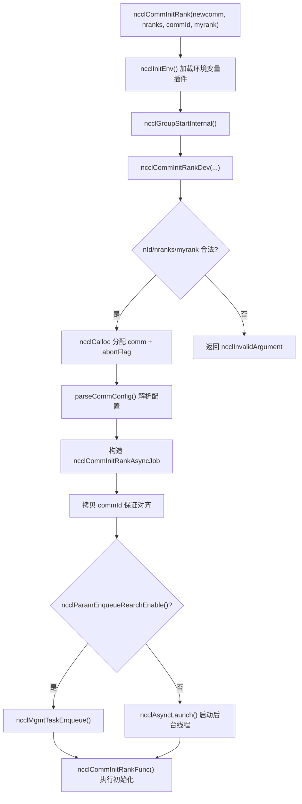
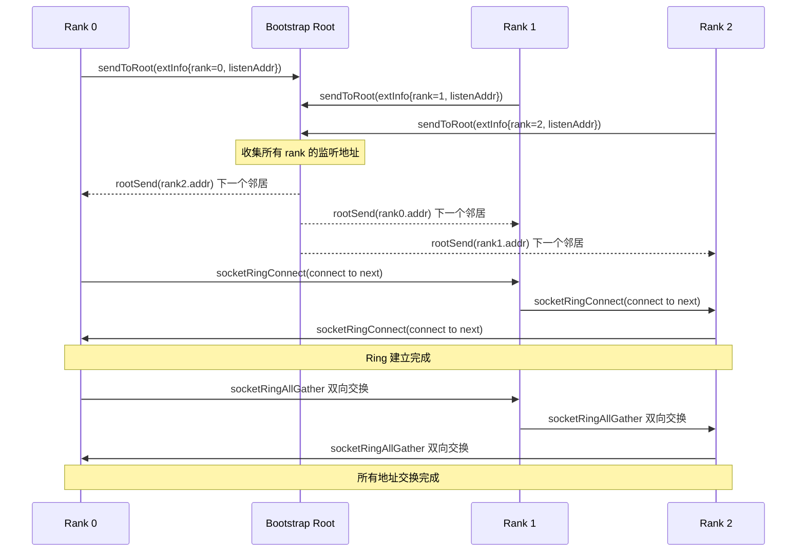
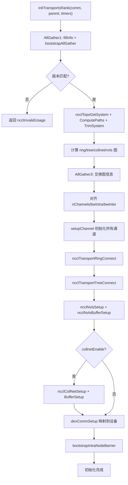

# 제 3 장: 초기화 진입: ncclCommInitRank가 고립된 프로세스 무리를 통신 도메인으로 구축하는 방법

이전 장에서 우리는 책 전체를 관통하는 다섯 가지 핵심 추상화인 ncclComm, channel, algorithm, protocol, transport를 확립했으며, 이들은 함께 「하나의 통신 = 여러 channel × 하나의 algorithm × 하나의 protocol × 여러 transport」라는 공통 어휘집을 구성한다. 이제 우리는 더 근본적인 질문에 답하려 한다: 이 ncclComm 객체는 도대체 어떻게 무에서 유로 구축되는가? ncclCommInitRank를 호출할 때, NCCL은 수백 밀리초 내에 일련의 복잡한 작업을 완료해야 한다: 모든 rank가 도착했는지 확인하고, 디바이스 정보를 교환하고, 머신 토폴로지를 탐지하고, 데이터 경로를 계산하고, GPU 메모리와 호스트 메모리를 할당하고, 최종적으로 이 모든 것을 하나의 ncclComm 객체로 패키징한다. 이 장에서는 이 호출 체인을 따라 API 진입점에서 initTransportsRank의 마지막 모세혈관까지 내려가 볼 것이다.

# 3.1 API 진입점: ncclCommInitRank의 동기外壳와 비동기内核

## 직관적 모델

`ncclCommInitRank`표면적으로는 "통신 도메인을 하나 만드는 것"이지만, 실제로는 "백그라운드 작업을 시작하고, (기본적으로) 그것이 완료되기를 기다리는 것"이다. 이것은 식당에서 주문하는 것과 같다: 주문하는 행위(API 호출)는 즉시 반환되지만, 주방에서 요리하는 것(실제 초기화)은 백그라운드에서 진행된다. 기본 "블로킹 모드"는 카운터 앞에서 요리가 완성될 때까지 기다리게 하는 것에 불과하고, "논블로킹 모드"는 픽업 번호를 주어 다른 일을 먼저 할 수 있게 한다.

만약 이러한 비동기 설계가 없다면, NCCL은 초기화 중에 CUDA Graph 캡처, 다중 통신 도메인 병렬 초기화 등의 시나리오와 협력할 수 없을 것이다——모든 초기화가 직렬화되고 사용자 코드와 겹칠 수 없는 블로킹 작업이 될 것이다.

## 데이터 구조와 메모리 레이아웃

먼저 API 진입점 자체를 살펴보자.`ncclCommInitRank`은 매우 얇은 동기外壳이다:

[FACT:src/init.cc:2946-2970]

그것은 네 가지 일을 한다: 호출`ncclInitEnv()`환경 변수 플러그인 로드, NVTX 성능 마커 열기, 현재 CUDA 디바이스 번호 읽기, 그런 다음 호출`ncclGroupStartInternal()`group 시맨틱에 진입하고, 마지막으로 실제 작업을 위임한다`ncclCommInitRankDev`。

주의`ncclGroupStartInternal()` / `ncclGroupEndInternal()`이 한 쌍의 호출——비록 통신 도메인을 하나만 초기화하더라도, NCCL은 그것을 group 시맨틱으로 감싼다. 이는 "사용자가 하나의 group에서 여러 통신 도메인을 초기화하는" 시나리오를 통일적으로 처리하여, 단일 통신 도메인과 다중 통신 도메인을 위해 두 세트의 코드 경로를 작성하는 것을 피하기 위함이다.

실제 매개변수 검증과 객체 할당은`ncclCommInitRankDev`에서 이루어진다:

[FACT:src/init.cc:2851-2943]

이 함수는 전체 링크의 "총调度台"이다. 먼저 매개변수 검증(`nId`범위,`nranks`/`myrank`합법성)을 수행한 다음,`ncclComm`구조체 자체와 중단 메커니즘과 관련된 세 가지 필드를 할당한다:`abortFlag`(호스트 측 원자 플래그),`abortFlagDev`(디바이스 측에서 볼 수 있는 고정 메모리 복사본),`abortFlagRefCount`(참조 카운트, split으로 생성된 하위 통신 도메인이 부모 통신 도메인의 abortFlag를 공유할 수 있기 때문).

여기 주목할 만한 세부 사항이 있다——`comm->startMagic = comm->endMagic = NCCL_MAGIC`：

[FACT:src/init.cc:2886-2886]

이 한 쌍의 magic 값은 "봉인"처럼`ncclComm`구조체의 처음과 끝을 감싼다. 어떤 범위를 벗어난 쓰기나 구조체 손상도 이 한 쌍의 magic을 파괴하며, 후속 작업은 이들을 검증하여 메모리 침범을 감지할 수 있다. 이것은 저렴하지만 효과적인 메모리 무결성 보호이다.

## Step-by-Step Walkthrough

`ncclCommInitRankDev`이 마지막에 도달하면,`ncclCommInitRankAsyncJob`을 구성하고 비동기 작업을 시작한다:

[FACT:src/init.cc:2896-2929]

`job`구조체는 초기화에 필요한 모든 매개변수를 담고 있다. 주의`job->commId`은**복사**된 것이지, 사용자가 전달한`commId`：

[FACT:src/init.cc:2903-2910]

을 직접 참조하는 것이 아니다. 왜 복사하는가? 소스 주석이 답을 준다:`ncclUniqueId`와`ncclBootstrapHandle`의 정렬 요구 사항이 다르기 때문에, 사용자가 전달한 배열이`ncclBootstrapHandle`에 필요한 경계에 올바르게 정렬되지 않았을 수 있다. 새로 할당된 메모리로 복사하면 정렬을 보장할 수 있다. 이것은 전형적인 "ABI 호환성 함정"이다——사용자가 보는 것은`ncclUniqueId`이지만, 내부적으로는`ncclBootstrapHandle`으로 사용해야 하며, 둘은 크기는 같지만 정렬이 다르다.

마지막으로,`ncclParamEnqueueRearchEnable()`의 값에 따라 작업은 관리 큐에 들어가거나`ncclAsyncLaunch`을 통해 직접 시작된다:

[FACT:src/init.cc:2922-2929]

`ncclAsyncLaunch`은 새 스레드를 생성하여`ncclCommInitRankFunc`을 실행한다. 블로킹 모드(기본값)라면, 호출자는`ncclGroupEndInternal()`에서 이 스레드가 완료되기를 기다린다; 논블로킹 모드라면, 호출자는 즉시 반환하고, 사용자는 나중에`ncclCommGetAsyncError`로 상태를 폴링한다.

## 설계 사고

여기서 설계 핵심은 "동기 API + 비동기 구현"이다. 왜`ncclCommInitRank`이 모든 초기화를 직접 동기적으로 실행하게 하지 않는가? NCCL이`ncclCommInitRankConfig`의 논블로킹 모드를 지원해야 하고, 논블로킹 모드는 초기화가 백그라운드 스레드에서 실행될 것을 요구하기 때문이다. 만약 동기 경로와 비동기 경로가 두 세트의 코드라면, 유지보수 비용이 두 배가 될 것이다. 통일적으로 비동기로 가고, 동기 경로는 단지 "시작 후 즉시 대기"일 뿐이며, 코드는 하나만 존재한다.



# 3.2 Bootstrap: rank 간의 첫 번째 제어 채널

## 직관적 모델

Bootstrap은 NCCL의 "회의 전 위챗 그룹"이다. 공식 통신이 시작되기 전에, 모든 rank는 먼저 제어 채널을建立해야 하며, 이를 통해 "나는 누구인가, 나는 어느 머신에 있는가, 내 GPU는 어떤 모델인가, 내 네트워크 카드 주소는 무엇인가"라는 메타데이터를 교환한다. bootstrap이 없으면, rank 간에는 서로를 모르는 낯선 사람들의 무리에 불과하여 어떤 통신도 조정할 수 없다.

만약 bootstrap이 실패하거나 시간 초과되면, 전체 통신 도메인 초기화가 교착 상태에 빠질 것이다——이것은 프로덕션 환경에서 가장 흔한 NCCL 행 원인 중 하나이다.

## 데이터 구조와 메모리 레이아웃

Bootstrap의 핵심 상태는`bootstrapState`구조체에 저장된다:

[FACT:src/bootstrap.cc:527-546]

이 구조체에서 주목할 만한 몇 가지 핵심 필드를 살펴보겠습니다:

- `ring`: 네트워크 디바이스 핸들이거나(`net.sendComm`/`net.recvComm`), 한 쌍의 소켓(`socket.send`/`socket.recv`)인 유니온입니다. 이는 두 가지 bootstrap 모드에 대응합니다: 소켓 기반 기본 모드와 네트워크 디바이스 기반`NCCL_OOB_NET_ENABLE`모드입니다.
- `listen`: 리스닝 엔드포인트 정보로, 마찬가지로 네트워크와 소켓 두 가지 형태가 있습니다.
- `peerP2pAddresses` / `peerProxyAddresses`: 모든 rank의 P2P 주소와 proxy 주소 배열로, ring allgather를 통해 채워집니다.
- `unexpectedConnections`: "수신했지만 아직 매칭되지 않은" 연결을 캐시하는 연결 리스트입니다. 이는 bootstrap 프로토콜의 핵심 설계입니다——수신 측은 누가 먼저 연결해 올지 예측할 수 없기 때문에, 매칭되지 않은 연결을 먼저 저장해 두어야 합니다.
- `asyncSendQueue` + `asyncSendLock` + `asyncSendCond`: 비동기 전송 큐와 그 동기화 프리미티브로, TLS 암호화 모드에서의 동시 전송에 사용됩니다.

`bootstrapState`의 할당은`bootstrapInit`시작 부분에서 발생합니다:

[FACT:src/bootstrap.cc:769-776]

다음을 주목하세요:`comm->bootstrap = state`이 줄——bootstrap 상태가 통신 도메인에 연결되며, 이후 모든 bootstrap 작업은`comm->bootstrap`를 통해 접근합니다.

## Step-by-Step Walkthrough

`bootstrapInit`는 bootstrap의 주 간선 함수입니다. 실행 순서대로 분해해 보겠습니다:

**첫 번째 단계: magic 값 결정.**magic은 bootstrap 통신의 "암호"로, 동일한 magic을 가진 rank만 서로 연결할 수 있습니다.

[FACT:src/bootstrap.cc:778-788]

정상 초기화(`handles != NULL`)인 경우, magic은 첫 번째 handle에서 옵니다; split/grow(`parent != NULL`)인 경우, magic은`hashCombine(parent->magic, parent->childCount)`를 통해 파생됩니다. 이는 각 하위 통신 도메인이 고유한 magic을 갖도록 보장합니다.

**두 번째 단계: 리스닝 소켓 생성.**각 rank는 두 개의 리스닝 엔드포인트가 필요합니다: 하나는 ring 이웃 연결용(`STATE_LISTEN(state, socket)`), 하나는 root 연결용(`listenSockRoot`）：

[FACT:src/bootstrap.cc:797-831]

여기에 핵심적인 역할 분담이 있습니다: ring 리스닝 소켓은`comm->magic`를 사용하고, root 리스닝 소켓은`BOOTSTRAP_HANDLE(handles, curr_root)->magic`를 사용합니다. 왜일까요? root는 전역 조정자로 모든 rank가 연결해야 하므로 통일된 magic을 사용하고, ring 이웃은 점대점이므로 통신 도메인 자체의 magic이면 충분하기 때문입니다.

**세 번째 단계: 시차 연결.**rank 수가 많을 때 모든 rank가 동시에 root에 연결하면 연결 폭풍이 발생합니다. NCCL은`NCCL_UID_STAGGER_RATE`과`NCCL_UID_STAGGER_THRESHOLD`를 사용하여 시차를 제어합니다:

[FACT:src/bootstrap.cc:833-843]

특정 root가 담당하는 rank 수가 임계값(기본 256)을 초과하면, 각 rank는 root 아래에서의 자신의 로컬 ID를 기반으로 지연 마이크로초를 계산한 후 sleep합니다. 이는 간단하지만 효과적인 "토큰 버킷" 방식의 속도 제한입니다.

**네 번째 단계: root에 자신의 연결 정보 전송.**각 rank는 자신의 리스닝 주소를 root에 보냅니다:

[FACT:src/bootstrap.cc:845-867]

root는 모든 rank의 정보를 받은 후 "링 페어링"을 수행합니다——rank i의 주소를 rank i-1에 보내고, rank i+1의 주소를 rank i에 보냅니다. 이렇게 하면 각 rank가 자신의 ring 상 앞뒤 이웃을 알게 됩니다.

**다섯 번째 단계: ring 연결 수립.**각 rank는 자신의 "다음" 이웃에 연결하고, 동시에 "이전" 이웃의 연결을 수락합니다:

[FACT:src/bootstrap.cc:885-894]

여기서`socketRingConnect`내부적으로`bootstrapConcurrent`를 사용합니다——TLS 암호화 모드에서는 connect와 accept가 반드시 동시에 실행되어야 합니다. 그렇지 않으면 교착 상태가 발생합니다(TLS 핸드셰이크는 양측이 동시에 참여해야 하기 때문). 비암호화 모드에서는 connect를 먼저 직렬로 실행한 후 accept합니다.

**여섯 번째 단계: 모든 주소 AllGather.**ring이 수립된 후,`ringAllInfo`를 통해 모든 rank의 P2P 주소, proxy 주소, UDS 주소를 한 번 allgather합니다:

[FACT:src/bootstrap.cc:934-938]

`ringAllInfo`내부적으로`bootstrapAllGather`를 호출하며, 후자는 소켓 모드에서`socketRingAllGather`를 사용합니다——양방향 ring allgather 알고리즘으로, N개의 rank에 N/2 단계만 필요합니다:

[FACT:src/bootstrap.cc:1363-1412]

이 양방향 알고리즘은 bootstrap 성능의 핵심 최적화입니다. 전통적인 단방향 ring allgather는 N-1 단계가 필요하지만, 양방향 버전은 단계 수를 절반으로 줄입니다. 각 단계에서 동시에 양방향으로 데이터를 보내고 받으며,`socketDoubleSendRecv`를 사용하여 4개의 작업(2회 송신, 2회 수신)을 하나의 시스템 호출로 묶습니다.

## 동시성 제어와 저수준 상호작용

Bootstrap의 동시성 제어에는 여러 계층이 있습니다:

**첫 번째 계층: abort 검사.**모든 블로킹 루프는 주기적으로 abortFlag를 검사합니다:

[FACT:src/bootstrap.cc:150-159]

`BOOTSTRAP_N_CHECK_ABORT`를 10000으로 설정한다는 것은 매 10000회 루프마다 abort 플래그를 한 번 검사한다는 의미입니다. 이 숫자는 성능과 응답성의 절충입니다——너무 자주 검사하면 성능에 영향을 미치고, 너무 적게 검사하면 abort 응답이 지연됩니다.

**두 번째 계층: 비동기 전송 큐.**TLS 암호화 모드에서`bootstrapSend`는 동기적으로 실행될 수 없습니다(TLS 핸드셰이크는 수신 측도 참여해야 하기 때문). 따라서 NCCL은 전송 작업을 별도 스레드에 배치합니다:

[FACT:src/bootstrap.cc:1161-1217]

여기에는 정교한 순서 보장 메커니즘이 있습니다.`bootstrapAsyncSendMain`는 전송 전에 큐에 "더 이른, 동일한 (peer, tag)로의 전송"이 있는지 검사합니다:

[FACT:src/bootstrap.cc:1124-1152]

왜 동일한 (peer, tag)의 전송 순서를 보장해야 하는가? 소스 코드 주석에 명확히 설명되어 있다: 수신 측은 (peer, tag)로 연결을 매칭하는데, 만약 동일한 (peer, tag)로 전송된 두 메시지의 도착 순서가 뒤바뀌면 수신 측이 잘못 매칭하게 된다. NVLS 초기화 중에는 동일한 peer에게 동일한 tag로 여러 번 브로드캐스트하므로, 이 순서 보장은 필수적이다.

**세 번째 계층: 예상치 못한 연결 큐.**수신 측은 누가 먼저 연결해 올지 예측할 수 없으므로`socketAccept`매칭되지 않는 연결을`unexpectedConnections`연결 리스트에 저장한다:

[FACT:src/bootstrap.cc:1276-1300]

이 설계는 고전적인 분산 문제를 해결한다: 여러 rank가 동시에 당신에게 연결을 시도할 수 있지만, 당신의`bootstrapRecv`호출 순서는 고정되어 있다. 매칭되지 않는 연결을 그냥 버리면 송신 측이 타임아웃되고, 블로킹 대기하면 데드락이 발생할 수 있다. 큐에 저장하는 것이 가장 안전한 방법이다.

## 프로덕션 함정 회피 가이드

**함정 1: bootstrap 타임아웃으로 인한 초기화 중단.**특정 rank가 네트워크 문제로 root에 연결할 수 없으면, 다른 모든 rank가`ncclSocketAccept`또는`ncclSocketRecv`에서 무한 대기하게 된다. NCCL에는 내장된 bootstrap 타임아웃 메커니즘이 없으며, 유일한 탈출 경로는 abortFlag이다. 프로덕션 환경에서는 대규모 클러스터의 연결 폭풍을 완화하기 위해`NCCL_UID_STAGGER_RATE`를 설정하는 것이 권장된다.

**함정 2:`NCCL_COMM_ID`과 다중 handle 충돌.**사용자가`NCCL_COMM_ID`환경 변수를 설정하면, NCCL은 강제로`nId`를 1로 낮춘다:

[FACT:src/init.cc:2912-2921]

이는`ncclCommInitRankScalable`의 다중 handle 기능이 조용히 비활성화됨을 의미한다. scalable 초기화를 사용하면서`NCCL_COMM_ID`도 설정했다면, 동작이 예상과 다를 것이다.

**함정 3: TLS 모드에서의 데드락.**TLS 암호화 모드에서 connect와 accept가 동시에 실행되지 않으면, 양쪽 모두 TLS 핸드셰이크에서 멈추게 된다.`bootstrapConcurrent`가 바로 이 문제를 해결하기 위한 것이다:

[FACT:src/bootstrap.cc:648-669]

비암호화 모드에서는 직렬 실행(send 후 recv), 암호화 모드에서는 스레드를 하나 시작해 send를 처리하고 메인 스레드가 recv를 처리한다.



# 3.3 commAlloc: 통신 도메인 객체의 메모리 골격

## 직관적 모델

`commAlloc`는 통신 도메인의 "골조 인도"이다 — 구조체 메모리를 할당하고, 모든 필드를 안전한 기본값으로 초기화하며, 필요한 CUDA 객체와 동기화 프리미티브를 생성하지만, 토폴로지 정보, 채널 구성, 전송 연결 같은 "내부 인테리어"는 아직 채우지 않는다. 만약`ncclComm`를 건물에 비유하면,`commAlloc`은 기초 공사와 골조 타설이고,`initTransportsRank`가 내부 인테리어이다.

만약`commAlloc`의 초기화가 없으면, 이후 코드가 초기화되지 않은 필드에 접근하여 예측 불가능한 동작을 초래할 수 있다 — 예를 들어`comm->channels[c].id`가 임의의 값이면, 채널 초기화 로직이 채널 상태를 잘못 판단하게 된다.

## 데이터 구조와 메모리 레이아웃

`commAlloc`의 시그니처와 시작 부분 검증:

[FACT:src/init.cc:512-526]

먼저`ndev`와`rank`의 유효성을 검증한 후, 두 개의 메모리 스택(`memPermanent`과`memScoped`)을 구성하고,`rank`과`nRanks`를 설정한다. 이 두 메모리 스택은 NCCL의 메모리 관리 인프라이다 —`memPermanent`는 수명 주기가 통신 도메인과 동일한 할당에 사용되고,`memScoped`는 임시 할당에 사용된다.

다음은 CUDA 디바이스 탐지:

[FACT:src/init.cc:528-531]

`cudaGetDevice`는 현재 디바이스 번호를 가져오고,`ncclCudaCompCap`는 컴퓨팅 능력을 가져온다. 소스 코드 주석에 아주 직설적으로 쓰여 있다: "Try to create a CUDA object right away. If there is something wrong with the device we're on, better know it early." — 디바이스 문제를 조기에 노출시켜 초기화 후반에야 발견하는 것을 피한다.

그 다음은 공유 리소스의 할당 또는 상속:

[FACT:src/init.cc:533-555]

여기에 중요한 분기가 있다: 만약`parent == NULL || !parent->shareResources`이면 새로운`ncclSharedResources`을 생성하고, 그렇지 않으면 부모 통신 도메인의 공유 리소스를 상속하고 참조 카운트를 증가시킨다.`ncclSharedResources`는 디바이스 스트림, 호스트 스트림, 시작 이벤트, scratch 이벤트 등을 포함한다 — 이러한 리소스는 split 시나리오에서 자식 통신 도메인이 재사용할 수 있어 중복 생성을 피한다.

주목할 점은`sharedRes->refCount = 1`이 줄이다 — 초기 참조 카운트가 1이고, split 공유 시마다 증가하며, 마지막 참조가 해제될 때 비로소 실제로 파괴된다.

다음은 네트워크, RMA, GIN의 초기화:

[FACT:src/init.cc:547-549]

이 세 하위 시스템은 각각 네트워크 전송, 원격 메모리 접근, GPU 발起的 네트워크 통신을 담당한다. 초기화 순서에는 이유가 있다 —`ncclNetInit`는 반드시`ncclRmaInit`보다 먼저여야 하는데, RMA가 네트워크 플러그인에 의존하기 때문이다.

메모리 관리자의 초기화:

[FACT:src/init.cc:567-576]

마찬가지로 공유/신규 두 가지 경로가 있다.`ncclMemManager`는 CUDA 메모리 풀과 등록 캐시를 관리한다.

채널 초기화 마커:

[FACT:src/init.cc:607-608]

이 줄은 모든 채널의`id`를 -1로 설정하여 "미초기화"를 나타낸다. 이후`setupChannel`가 이 값을 확인하여 초기화 필요 여부를 결정한다.

인터럽트 큐의 구성:

[FACT:src/init.cc:619-632]

NCCL은 침입형 큐(intrusive queue)를 사용하여 다양한 작업을 관리한다. 이 큐들은`commAlloc`단계에서 모두 빈 상태로 구성되며, 이후 작업이 큐에 들어갈 때 바로 사용된다.

CUDA 메모리 풀 생성:

[FACT:src/init.cc:636-652]

디바이스가 메모리 풀(`cudaDevAttrMemoryPoolsSupported`)을 지원하면, pinned 타입의 메모리 풀을 생성하고 해제 임계값을 최대값(`~uint64_t(0)`)으로 설정한다. 이는 "절대 자동 해제하지 않음"을 의미한다. CUDA 런타임이 NCCL이 모르는 사이에 메모리를 회수하는 것을 방지하기 위해서이다.

## Step-by-Step Walkthrough

구체적인 초기화 시나리오를 추적해 보자: 단일 머신 8 GPU, 프로세스당 하나의 rank, 정상 초기화.

1. `commAlloc(comm, NULL, 8, rank)`가 호출되고,`parent == NULL`。

2. 검증 통과,`comm->rank = rank`，`comm->nRanks = 8`。

3. `cudaGetDevice`가 현재 디바이스 번호를 반환하고,`comm->compCap`가 설정된다.

4. 새로운`ncclSharedResources`를 생성하고, 참조 카운트는 1이다.

5. `ncclNetInit`네트워크 플러그인 초기화 (Socket 또는 IB일 수 있음).

6. `ncclMemManagerInit`메모리 관리자 생성.

7. `getBusId`PCI 버스 ID 가져오기,`ncclNvmlDeviceGetHandleByPciBusId`NVML 핸들 가져오기.

8. `dmaBufSupported`DMA-BUF 지원 감지.

9. 할당`connectSend` / `connectRecv`비트맵 배열.

10. 모든 채널`id`을 -1로 설정.

11. 모든 인터럽트 큐 구성.

12. CUDA 메모리 풀 생성.

## 설계 고찰

`commAlloc`에서 가장 흥미로운 설계는 "조기 실패" 원칙이다. 이는 함수 시작 부분에서`cudaGetDevice`를 호출하며, 나중에 장치 정보가 필요할 때까지 기다리지 않는다. 이렇게 하면 장치에 문제가 있을 경우(예: 다른 프로세스가 독점 중인 경우) 대량의 메모리를 할당한 후가 아니라 초기화 초기에 오류가 드러난다는 장점이 있다.

또 다른 설계는`preconnectNext`의 초기화이다:

[FACT:src/init.cc:598-598]

`reinterpret_cast<struct ncclComm*>(0x1)`는 "다음 사전 연결"의 상태를 표시하는 센티넬 값이다. 이렇게 잘못된 포인터 값을 상태 표시로 사용하는 기법은 시스템 프로그래밍에서 흔히 볼 수 있다. 추가 불리언 필드보다 메모리를 절약하지만 역참조하지 않도록 주의해야 한다.

# 3.4 initTransportsRank: 토폴로지 발견 및 채널 할당

## 직관적 모델

`initTransportsRank`는 초기화의 "심장"이다. 이는 세 가지 큰 일을 한다: 두 번의 AllGather를 통해 모든 rank의 장치 정보와 토폴로지 정보를 교환하고, 이 정보를 기반으로 ring/tree/collnet/nvls 등의 알고리즘 그래프 구조를 계산하며, 마지막으로 모든 전송 연결을 설정한다. 통신 도메인을 도시의 교통 시스템에 비유하면,`initTransportsRank`는 모든 도로, 입체 교차로, 버스 노선을 계획하는 과정이다.

이 단계가 없으면 NCCL은 데이터가 어느 경로로 가야 할지 알 수 없다. 데이터가 우회하거나 도달 가능한 경로를 전혀 찾지 못할 수 있다.

## 데이터 구조와 메모리 레이아웃

`initTransportsRank`의 지역 변수는 매우 많으므로 핵심적인 것만 살펴보자:

[FACT:src/init.cc:1163-1179]

여기서`comm->graphs`배열의 각 그래프 구조를 가져와 별칭을 만든다.`graphs`배열은 알고리즘별로 인덱싱되며,`nvlsGraph`가 두 번 사용된 것에 주의하라 (NVLS와 NVLSTree가 동일한 그래프 구조를 공유).

두 가지 핵심 임시 구조체:

[FACT:src/init.cc:1181-1206]

`graphInfo`는 단일 rank의 특정 알고리즘에 대한 그래프 정보(채널 수, 대역폭, 유형 등)를 저장하고,`allGatherInfo`는 AllGather의 데이터 단위로, 모든 알고리즘의 그래프 정보와 토폴로지 rank 정보를 포함한다.

## Step-by-Step Walkthrough

**1단계: AllGather1 — 장치 정보 교환.**

[FACT:src/init.cc:1234-1239]

각 rank는`fillInfo`를 호출하여 자신의`ncclPeerInfo`를 채우고,`bootstrapAllGather`를 통해 교환한다.`fillInfo`에 채워지는 정보에는 rank 번호, CUDA 장치 번호, NVML 장치 번호, NCCL 버전, git hash, 호스트 hash, 프로세스 hash, GPU UUID, 버스 ID, VRAM 크기, 드라이버 버전 등이 포함된다.

[FACT:src/init.cc:888-982]

참고:`info->hostHash = getHostHash() + commHash`와`info->pidHash = getPidHash() + commHash`— host hash와 pid hash 모두 commHash가 추가된다. 이는 동일한 머신의 서로 다른 통신 도메인을 구분하기 위함이다.

AllGather 완료 후, 각 rank는 모든 peer의 정보를 순회하며 전역 속성을 계산한다:

[FACT:src/init.cc:1250-1303]

이 루프는 많은 일을 한다: 버전 불일치 감지, 노드 수 집계,`cuMemSupport`의 교집합 계산, 여러 rank가 동일한 GPU를 사용하는지 감지, GIN 유형 마스크의 교집합 계산 등.`nNodes`의 집계 방식에 주의하라 — 서로 다른 hostHash를 만날 때마다 증가시키는데, 이는 rank가 노드별로 연속 배치되어 있다고 가정한다.

**2단계: 토폴로지 발견.**

[FACT:src/init.cc:1390-1403]

이 여섯 단계는 토폴로지 발견의 핵심 흐름이다:`ncclTopoGetSystem`는 시스템 장치를 열거하여 토폴로지 그래프를 구축하고,`ncclTopoComputePaths`는 GPU에서 NIC까지의 경로를 계산하며,`ncclTopoTrimSystem`는 도달 불가능한 장치를 제거하고 경로를 다시 계산하며,`ncclTopoSearchInit`는 검색 상태를 초기화하고 마지막으로 토폴로지를 출력한다.

**3단계: 그래프 계산.**

[FACT:src/init.cc:1421-1468]

ring, tree, collnet chain, collnet direct, nvls 다섯 가지 그래프를 순차적으로 계산한다. 각 그래프는 서로 다른 pattern과 채널 수 제약을 가진다. 참고:`treeGraph->minChannels = ringGraph->nChannels`— tree의 채널 수는 ring과 동일하게 제한되는데, 이는 서로 다른 알고리즘 간의 채널 정렬을 보장하기 위함이다.

**4단계: AllGather3 — 그래프 정보 교환.**

[FACT:src/init.cc:1490-1533]

각 rank는 자신의 그래프 정보를`allGather3Data[rank]`에 채운 후 다시`bootstrapAllGather`를 수행한다. 이번에 교환되는 정보에는 각 알고리즘의 pattern/nChannels/bwIntra/bwInter/typeIntra/typeInter/crossNic, CPU 아키텍처, P2P 채널 수, 네트워크 장치 수, CollNet 장치 수 등이 포함된다.

AllGather3 완료 후, 각 rank는 모든 peer의 그래프 정보를 순회하며 최솟값/최댓값을 취해 정렬한다:

[FACT:src/init.cc:1687-1703]

여기서 정렬 전략에 주의하라:`nChannels`、`sameChannels`、`bwIntra`、`bwInter`는 최솟값을 취하고,`typeIntra`、`typeInter`、`crossNic`는 최댓값을 취한다. 왜인가? 채널 수와 대역폭은 가장 약한 링크에 의해 제한되며, 유형과 crossNic은 호환성을 보장하기 위해 합집합을 취해야 하기 때문이다.

**5단계: 전송 연결 설정.**

[FACT:src/init.cc:1811-1892]

여기에는 두 가지 분기가 있다:`runtimeConn`가 참이면 채널 setup만 하고 연결은 하지 않으며(런타임까지 지연), 그렇지 않으면 모든 연결을 즉시 설정한다. 연결 순서는 ring → tree → NVLS → PAT → NVLS tree → CollNet이다.

## 동시성 제어와 하드웨어 상호작용

`initTransportsRank`에는 주목할 만한 동시성/하드웨어 상호작용 지점이 몇 가지 있다:

**CPU 친화성 설정:**

[FACT:src/init.cc:1406-1412]

NCCL은 현재 스레드를 GPU 근처의 CPU 코어에 바인딩하여 호스트 메모리 할당이 로컬 NUMA 노드에서 이루어지도록 보장합니다. 이는 NUMA 간 접근 지연을 줄입니다.

**NVLS 초기화:**

[FACT:src/init.cc:1419-1419]

`ncclNvlsInit`NVLink SHARP 지원을 감지합니다. NVLS는 스위치가 직접 reduce 작업을 수행할 수 있게 하여 AllReduce 지연을 크게 줄입니다.

**Proxy 스레드 생성:**

[FACT:src/init.cc:1780-1786]

Proxy 스레드는 네트워크 I/O를 비동기적으로 진행하는 역할을 합니다. 이는`initTransportsRank`에서 생성되며, 이후 모든 네트워크 작업은 proxy를 통해 이루어집니다.

## 프로덕션 함정 회피 가이드

**함정 1: 네트워크 장치 수 불일치.**서로 다른 rank의 로컬 NIC 수가 다르면 NCCL이 오류를 발생시킵니다:

[FACT:src/init.cc:1576-1596]

다음을 설정하지 않는 한`NCCL_IGNORE_NET_MISMATCH=1`. 이는 이기종 클러스터에서 흔합니다—어떤 노드는 NIC가 8개, 어떤 노드는 4개뿐입니다. 불일치를 무시하면 채널 수가 가장 약한 노드에 의해 제한되므로 성능 저하가 발생할 수 있습니다.

**함정 2: 여러 rank가 동일한 GPU를 공유.**두 rank의 GPU UUID가 같으면 NCCL이 초기화를 거부합니다:

[FACT:src/init.cc:1291-1296]

다음을 설정하지 않는 한`NCCL_MULTI_RANK_GPU_ENABLE=1`. 이 검사는 사용자의 잘못된 구성으로 인한 성능 문제를 방지합니다.

**함정 3: CollNet 노드 수 부족.**CollNet은 최소`NCCL_COLLNET_NODE_THRESHOLD`개의 노드가 있어야 활성화됩니다:

[FACT:src/init.cc:1720-1728]

기본 임계값은 2입니다. 단일 노드 환경에서는 CollNet이 자동으로 비활성화됩니다.



# 3.5 NCCL_PARAM: 환경 변수 체계의 컴파일 타임 마법

## 직관적 모델

`NCCL_PARAM`은 NCCL의 "구성 스위치 공장"입니다. 매크로를 사용하여 컴파일 타임에 함수를 생성하고, 런타임에 처음 호출될 때 환경 변수를 읽고 결과를 캐시합니다. 이는 집의 전등 스위치와 같습니다—스위치를 누르면(함수 호출) 불이 켜지고(구성 값 반환), 이후 스위치 상태가 기억되어 매번 다시 누를 필요가 없습니다.

이 메커니즘이 없다면 NCCL은 구성을 사용하는 모든 곳에서 수동으로`getenv`을 호출하고 문자열을 파싱해야 하므로 코드가 극도로 장황해지고 오류가 발생하기 쉬워집니다.

## 데이터 구조와 메모리 레이아웃

`NCCL_PARAM`매크로의 정의:

[FACT:src/include/param.h:22-31]

이 매크로는 확장되어 함수`ncclParam##name()`를 생성하며, 내부에 세 개의 정적 변수가 있습니다:

- `uninitialized = INT64_MIN`: 센티넬 값으로 "아직 초기화되지 않음"을 나타냅니다.
- `noCache`: 삼상 플래그로, -1은 미초기화, 0은 캐시, 1은 캐시하지 않음을 나타냅니다.
- `cache`: 캐시된 값으로, 초기값은`uninitialized`。

함수 로직은: 만약`cache`이 여전히`uninitialized`이면`ncclLoadParam`을 호출하여 로드하고; 그렇지 않으면 직접`cache`。`COMPILER_EXPECT(..., false)`을 반환합니다.

`ncclLoadParam`은 컴파일러에게 이 분기가 거의 실행되지 않음을 알려 핫 패스를 최적화합니다.

[FACT:src/misc/param.cc:78-108]

의 구현:`noCache`전체 로딩 과정을 뮤텍스로 보호하며, 먼저

## Step-by-Step Walkthrough

정책을 확인하고, 캐시가 유효한지 확인한 다음, 환경 변수를 읽고 파싱합니다. 파싱 실패 시 기본값을 사용하고 경고를 출력합니다.`NCCL_PARAM(BuffSize, "BUFFSIZE", -2)`을 예로 들면:

[FACT:src/init.cc:1007-1007]

매크로 확장 후 생성:

```cpp
int64_t ncclParamBuffSize() {
  constexpr int64_t uninitialized = INT64_MIN;
  static int8_t noCache = -1;
  static_assert(-2 != uninitialized, "...");
  static int64_t cache = uninitialized;
  if (COMPILER_EXPECT(COMPILER_ATOMIC_LOAD(&cache, std::memory_order_relaxed) == uninitialized, false)) {
    return ncclLoadParam("NCCL_BUFFSIZE", -2, uninitialized, &cache, &noCache);
  }
  return cache;
}
```

첫 호출 시,`cache == uninitialized`,`ncclLoadParam`에 진입합니다.`NCCL_BUFFSIZE`환경 변수를 읽고, 설정되지 않았으면 기본값 -2를 반환합니다. 그런 다음`noCache`정책에 따라 캐시 여부를 결정합니다.

`noCache`정책은`ncclParamIsCacheDisabled`에 의해 결정됩니다:

[FACT:src/misc/param.cc:74-76]

환경 변수 이름이 특정 패턴과 일치하면(예:`_`로 끝나는 경우), 캐시하지 않고 매번 다시 읽습니다. 이를 통해 사용자는 런타임에 특정 구성을 동적으로 수정할 수 있습니다.

## 설계 고찰

이 설계의 정교함은 "제로 비용 추상화"에 있습니다: 핫 패스에서는 원자적 로드와 비교만 있고, 락도 문자열 파싱도 없습니다. 콜드 패스(최초 로드)에서만 전체 비용을 지불합니다.`COMPILER_EXPECT`은 컴파일러에게 핫 패스를 명령어 캐시 앞쪽에 배치하도록 힌트하여 성능을 더욱 향상시킵니다.

또 다른 설계는`noCache`의 삼상 설계입니다. -1은 "아직 결정되지 않음", 0은 "캐시", 1은 "캐시하지 않음"을 나타냅니다. 이 결정은 최초 로드 시 한 번만 이루어지고 이후 변경되지 않습니다.

## 프로덕션 함정 회피 가이드

**함정 1: 환경 변수 철자 오류.**사용자가`NCCL_BUFSIZE`대신`NCCL_BUFFSIZE`을 쓰면 NCCL은 오류를 내지 않고 기본값을 사용합니다.`NCCL_DEBUG=ENV`을 사용하여 인식된 모든 환경 변수를 확인하는 것을 권장합니다.

**함정 2:`NCCL_CONF_FILE`의 로딩 순서.**NCCL은`$NCCL_CONF_FILE`(또는`~/.nccl.conf`)과`/etc/nccl.conf`：

[FACT:src/misc/param.cc:52-67]

을 순차적으로 로드합니다. 나중에 로드된 파일이 먼저 로드된 것을 덮어씁니다. 두 파일 모두 같은 변수를 설정하면`/etc/nccl.conf`의 값이 적용됩니다.

**함정 3:`noCache`변수의 스레드 안전성.**소스 주석에 "noCache is only load/stored within the mutex, no need for atomic"이라고 되어 있습니다:

[FACT:src/misc/param.cc:74-76]

이는`noCache`의 읽기/쓰기가 모두 뮤텍스 보호 하에 있어 원자적 연산이 필요 없음을 의미합니다. 그러나`cache`의 읽기는 락이 없으므로(핫 패스) 원자적 로드를 사용합니다.

# 3.6 devCommSetup: 통신 도메인을 디바이스에 매핑

## 직관적 모델

`devCommSetup`은 통신 도메인의 "디바이스 측 프로젝션"입니다. GPU kernel은 디바이스에서 실행되며 호스트 메모리의`ncclComm`구조체에 직접 접근할 수 없습니다. 따라서 NCCL은 통신 도메인의 핵심 필드를 디바이스 접근 가능 메모리에 복사하여`ncclDevComm`을 형성합니다. 이는 회사의 연락처를 복사하여 각 직원의 책상에 두는 것과 같습니다—직원이 매번 프런트에 가서 동료 전화번호를 물을 필요가 없습니다.

만약`devCommSetup`이 없다면 GPU kernel은 자신의 rank, 채널 구성, 버퍼 크기 등의 정보를 알 수 없어 집합 통신 kernel이 시작될 수 없습니다.

## 데이터 구조와 메모리 레이아웃

`devCommSetup`은 임시 구조체`ncclKernelCommAndChannels`를 사용하여 디바이스에 복사할 데이터를 패킹합니다:

[FACT:src/init.cc:712-746]

이 구조체는`ncclDevComm`(디바이스 측 통신 도메인)와 채널 배열을 포함합니다. 함수는 먼저 호스트 측 데이터를 임시 구조체에 채운 다음, 한 번에`cudaMemcpyAsync`을 디바이스로 수행합니다.

핵심 필드 채우기:

[FACT:src/init.cc:734-746]

주목할 점은`comm->devComm = &devCommAndChans->comm`—호스트 측의`comm->devComm`은 디바이스 메모리의`ncclDevComm`을 가리킵니다. 이후 kernel 시작 시`comm->devComm`이 매개변수로 전달됩니다.

채널 정보 채우기:

[FACT:src/init.cc:829-843]

각 채널의 peers, ring, tree, collnetChain, collnetDirect, nvls 포인터가 모두 디바이스 측으로 복사됩니다. 주의`ring.userRanks`추가로 한 번의`cudaMemcpyAsync`이 필요합니다. 왜냐하면 이것은 배열이기 때문입니다.

## Step-by-Step Walkthrough

1. 디바이스 스트림 가져오기:`ncclStrongStreamAcquire`강한 스트림(strong stream)을 가져와 이후의 비동기 복사가 순서대로 실행되도록 보장합니다.

2. 디바이스 메모리 할당:`ncclCudaCallocAsync`할당`devCommAndChans`。

3. 호스트 측 임시 구조체 채우기: rank, nRanks, node, nNodes, abortFlag, buffSizes 등을 설정합니다.

4. 할당 및 복사`rankToLocalRank`배열.

5. 계산`workFifoBytes`: CC(Confidential Computing) 상태에 따라 결정됩니다.

6. workFifo 버퍼 할당: GDR 모드에서는`ncclGdrCudaCalloc`를 사용하고, 그렇지 않으면`ncclCudaHostCalloc`。

7. profiler 카운터 할당.

8. 진행 카운터 할당(활성화된 경우).

9. 채널 정보 채우기.

10. 디바이스로 한 번에 복사:`ncclCudaMemcpyAsync(devCommAndChans, &tmpCommAndChans, 1, deviceStream)`。

11. 강한 스트림 해제 및 동기화.

## 설계 고찰

`devCommSetup`에서 가장 주목할 만한 설계는 "일괄 복사"입니다. NCCL은 각 필드마다 개별적으로`cudaMemcpy`를 호출하지 않고, 모든 필드를 하나의 임시 구조체로 패킹하여 한 번의`cudaMemcpyAsync`로 완료합니다. 이는 CUDA API 호출 횟수와 동기화 오버헤드를 크게 줄입니다.

또 다른 설계는`workFifoBytes`의 CC 처리입니다:

[FACT:src/init.cc:750-763]

CC(Confidential Computing) 모드에서,`workFifoBytes`는 0으로 설정됩니다. 왜냐하면 GDR 복사는 CC 모드에서 사용할 수 없기 때문입니다. 이는 하드웨어 제약에 대한 우아한 성능 저하입니다.

## 프로덕션 함정 회피 가이드

**함정 1:`devCommSetup`은 반드시 barrier 이전에 호출해야 합니다.**소스 코드 주석이 그 이유를 설명합니다:

[FACT:src/init.cc:1950-1952]

barrier 이후에 호출하면, 일부 스레드가 이미 NCCL kernel을 시작했을 수 있고, 이때 디바이스 메모리가 아직 할당되지 않아 데드락이 발생할 수 있습니다.

**함정 2:`workFifoBytes`은 반드시 2의 거듭제곱이어야 합니다.**그렇지 않으면 NCCL이 경고를 표시하고 기본값을 사용합니다:

[FACT:src/init.cc:757-762]

# 이 장의 고찰과 자가 테스트

Q1: 만약[FACT:src/init.cc:1291-1296]에서 "여러 rank가 동일 GPU를 사용"하는지 감지하는 로직을 제거하면, 어떤 시나리오에서 문제가 발생할까요? 왜 NCCL은 기본적으로 이러한 구성을 거부할까요?

**참고 해석**：

이 코드는 동일 호스트에서 두 rank의 GPU UUID가 동일한지 감지합니다. 만약 동일하고`NCCL_MULTI_RANK_GPU_ENABLE=0`(기본값)이면,`ncclInvalidUsage`。

을 반환합니다. 이 검사를 제거하면, 여러 rank가 동일한 GPU를 공유하게 됩니다. 이는 다음을 초래합니다:

1. **P2P 전송 충돌**: NCCL의 P2P 전송은 각 rank가 하나의 GPU를 독점한다고 가정합니다. 두 rank가 GPU를 공유하면, 동시에 동일한 GPU의 동일한 버퍼에 데이터를 쓰게 되어 데이터 경쟁과 결과 오류가 발생합니다.

2. **채널 할당 충돌**：`comm->channels`에서 채널 리소스(버퍼, FIFO)는 rank별로 할당됩니다. GPU를 공유하는 rank들은 동일한 리소스를 두고 경쟁하게 됩니다.

3. **성능 재앙**: 정확성 문제가 없더라도, 두 rank가 하나의 GPU의 연산 능력과 메모리 대역폭을 공유하면 성능이 급격히 저하됩니다.

NCCL이 기본적으로 이러한 구성을 거부하는 것은 "빠른 실패"를 위한 것입니다 — 사용자가 잘못된 구성에서 몇 시간을 디버깅하며 낭비하게 하는 것보다, 초기화 시점에 명확히 오류를 보고하는 것이 낫습니다.`NCCL_MULTI_RANK_GPU_ENABLE=1`은 자신이 무엇을 하는지 명확히 아는 사용자(예: MPS 시나리오)를 위한 탈출구입니다.

Q2: 만약[FACT:src/bootstrap.cc:1129-1134]에서 "동일한 (peer, tag)의 더 이른 전송"을 기다리는 로직을 제거하면, 어떤 시나리오에서 수신 측 매칭 오류가 발생할까요?

**참고 해석**：

이 코드는 비동기 전송 스레드에서 큐에 동일한 (peer, tag)로 향하는 더 이른 전송이 없을 때까지 대기합니다.

이 대기를 제거하면, 동일한 (peer, tag)로 향하는 두 전송이 동시에 실행될 수 있고, 수신 측에 도달하는 순서가 불확정해집니다. 수신 측의`socketAccept`은 (peer, tag)로 연결을 매칭합니다:

[FACT:src/bootstrap.cc:1291-1292]

만약 송신자 A가 먼저`bootstrapSend`를 호출했지만 나중에 도착하고, 송신자 B가 나중에 호출했지만 먼저 도착하면, 수신 측은 B의 메시지를 A의 응답으로 간주합니다. 이는 데이터 불일치를 초래합니다 — 수신 측은 첫 번째 요청의 응답을 받았다고 생각하지만, 실제로는 두 번째 요청의 응답입니다.

소스 코드 주석이 이 시나리오를 명확히 지적합니다: "NVLS setup broadcasts to the same peers with the same tag several times during init". NVLS 초기화 중에 동일한 peer에게 동일한 tag로 여러 번 브로드캐스트하는데, 순서가 뒤바뀌면 NVLS 구성이 완전히 엉망이 됩니다.

이 순서 보장의 대가는: 동일한 (peer, tag)의 전송이 직렬화됩니다. 그러나 다른 (peer, tag)의 전송은 여전히 동시에 실행되므로, 전체 처리량은 영향을 받지 않습니다.

Q3: 만약[FACT:src/init.cc:1691-1697]에서 정렬 전략을 "nChannels는 min, typeIntra는 max"에서 "전부 min" 또는 "전부 max"로 변경하면, 각각 어떤 문제가 발생할까요?

**참고 해석**：

현재 전략은:`nChannels`、`sameChannels`、`bwIntra`、`bwInter`은 min,`typeIntra`、`typeInter`、`crossNic`은 max를 취합니다.

**만약 전부 min을 취하면**：`typeIntra`과`typeInter`min을 취하면 일부 rank의 전송 타입이 강등될 수 있다. 예를 들어 rank A는 P2P(typeIntra=P2P)를 지원하고, rank B는 SHM(typeIntra=SHM)만 지원한다면, min을 취한 후 모든 rank가 SHM을 사용하게 된다. 하지만 SHM의 열거값이 P2P보다 작을 수 있어, min을 취하면 잘못된 타입이 선택된다. 실제로`typeIntra`는 비트마스크 또는 열거형이며, max를 취하는 것은 "가장 강한 능력"의 타입을 선택하기 위함이다.

**만약 전부 max를 취한다면**：`nChannels`max를 취하면 일부 rank에 그 능력을 초과하는 채널 수가 할당될 수 있다. 예를 들어 rank A는 4개의 채널만 지원하고, rank B는 8개를 지원한다면, max를 취한 후 모든 rank가 8개의 채널을 사용하려 시도하여 rank A는 실패하거나 성능이 저하된다.`bwIntra`max를 취하면 대역폭 추정이 지나치게 낙관적으로 되어, tuning 모듈이 부적합한 알고리즘을 선택할 수 있다.

이 정렬 전략의 본질은:**자원 제약은 교집합(min), 능력 열거는 합집합(max)**이다. 채널 수와 대역폭은 "상한" 제약이므로 반드시 가장 보수적인 값을 취해야 하고, 전송 타입은 "능력" 열거이므로 최댓값을 취하여 모든 rank가 호환되는 전송 방식을 찾을 수 있도록 보장한다.

다음 장에서는 토폴로지 발견과 그래프 탐색을 깊이 다루며, NCCL이 머신 내의 GPU, 네트워크 카드, PCI 스위치를 어떻게 열거하여 완전한 토폴로지 그래프를 구축하고, 이 그래프에서 최적의 ring과 tree 구조를 탐색하는지 살펴본다. 이 장에서 확립한 bootstrap 통신, commAlloc 메모리 골격, initTransportsRank 주 간선 흐름은 다음 장에서 그 토폴로지 세부 사항을 하나씩 펼쳐낼 것이다.

지금까지 우리는 ncclCommInitRank의 호출 체인을 완전히 걸어가며 ncclComm 객체가 처음부터 구축되는 전 과정을 확인했다. 그러나 초기화 과정에서 한 가지 핵심 단계를 그냥 지나쳤다: NCCL은 머신 내부의 GPU와 네트워크 카드를 어떻게 탐지하고, 이를 기반으로 데이터가 어느 경로로 가야 할지 결정하는가? 이것이 바로 다음 장에서 깊이 다룰 주제——토폴로지 발견과 그래프 탐색이다. 우리는 src/graph/topo.cc가 PCI/NVLink/네트워크 카드 장치를 어떻게 열거하고 토폴로지 그래프를 구축하는지, src/graph/search.cc가 이 그래프에서 최적 경로를 어떻게 탐색하는지, 그리고 src/graph/rings.cc와 trees.cc가 탐색 결과를 Ring과 Tree 알고리즘 토폴로지로 어떻게 구체화하는지 분석할 것이다. 이 메커니즘을 이해하면 NCCL이 왜 다양한 머신에서 자동으로 적합한 알고리즘을 선택할 수 있는지 알게 될 것이다.
