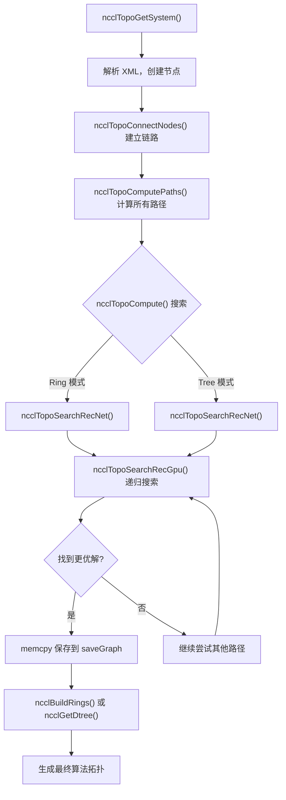
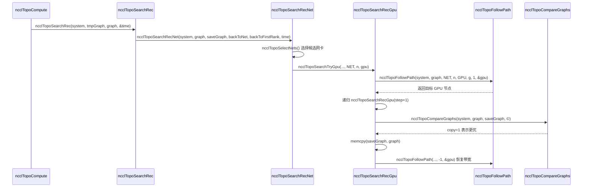

# 제 4 장: 토폴로지 발견과 그래프 탐색: NCCL이 다중 GPU 시스템의 물리적 상호 연결을 어떻게 "꿰뚫어 보는가"

# 제4장: 토폴로지 발견과 그래프 탐색: NCCL이 다중 GPU 시스템의 물리적 상호 연결을 어떻게 "꿰뚫어 보는가"

이전 장에서 우리는 ncclCommInitRank의 호출 체인을 따라 층층이 파고들며 comm->topo 필드가 채워지는 시점을 보았지만, 그 내부 구조는 펼치지 않았다. 그렇다면 NCCL은 도대체 어떻게 머신 내의 GPU와 네트워크 카드를 "보고", 이를 사용 가능한 토폴로지 정보로 조직하는가? 이 장에서는 이 과정의 세 가지 핵심 단계를 분석한다: topo.cc는 물리적 장치를 그래프로 열거하는 역할을, search.cc는 이 그래프에서 최적 경로를 탐색하는 역할을, rings.cc와 trees.cc는 탐색 결과를 Ring과 Tree 두 가지 알고리즘 토폴로지로 구체화하는 역할을 한다. 이 세 가지의 협력을 이해해야 NCCL이 왜 다양한 머신에서 자동으로 적합한 알고리즘을 선택할 수 있는지 알 수 있다.

# 토폴로지 그래프: 머신을 "지하철 노선도"로 그리기

## 직관적 모델

당신이 낯선 도시에 막 도착한 택배 기사라고 상상해 보자. A 지점에서 B 지점으로 소포를 배송해야 하는데, 어느 길이 가장 빠른지 모른다. 당신에게는 지도가 필요하다——모든 역(GPU, 네트워크 카드, CPU, PCI 스위치)과 역 사이의 연결(NVLink, PCIe, 네트워크)이 표시된 지도 말이다. NCCL의 토폴로지 그래프가 바로 이 지도다.

이 지도가 없다면 NCCL은 "모든 GPU 간 대역폭이 동일하다"고 맹목적으로 가정할 수밖에 없으며, 8카드 NVLink 전연결 머신에서는 그럭저럭 버틸 수 있겠지만, NUMA를 넘나들거나 PCI 스위치를 넘나들거나 NVLink + PCIe가 혼합된 복잡한 토폴로지를 만나면 잘못된 경로를 선택하여 본래 NVLink로 가야 할 데이터를 느린 PCIe에 밀어넣어 성능이 곧바로 반토막 난다.

## 데이터 구조와 메모리 레이아웃

토폴로지 그래프의 핵심은`ncclTopoSystem`이며, 이는 노드 타입별로 모든 장치를 그룹화하여 저장한다. 노드 타입은`topoNodeTypeStr`배열에 정의되어 있다:

[FACT:src/graph/topo.cc:33-35]

```c
const char* topoNodeTypeStr[] = {"GPU", "PCI", "NVS", "CPU", "NIC", "NET", "GIN", "RMA", "DEV", "CXB"};
const char* topoLinkTypeStr[] = {"LOC", "NVL", "", "C2C", "PCI", "", "", "", "", "SYS", "NET"};
const char* topoPathTypeStr[] = {"LOC", "NVL", "NVB", "C2C", "PIX", "PXB", "P2C", "PXN", "PHB", "SYS", "NET", "DIS"};
```

이 세 배열은 각각 노드 타입, 링크 타입, 경로 타입의 문자열 표현을 정의한다. 주목할 점은`topoPathTypeStr`의 순서——이는 동시에 경로 품질의 정렬 기준으로 작용한다: 인덱스가 작을수록 경로가 더 빠르다.`LOC`(로컬)이 가장 빠르고,`DIS`(끊김)이 가장 느리다. 이 순서는 이후 탐색에서 경로 우열을 비교하는 데 반복적으로 사용된다.

각 노드는`ncclTopoNode`로 표현되며, 생성 시 타입에 따라 서로 다른 필드를 초기화한다. GPU 노드를 예로 들면:

[FACT:src/graph/topo.cc:105-141]

```c
ncclResult_t ncclTopoCreateNode(struct ncclTopoSystem* system, struct ncclTopoNode** node, int type, uint64_t id) {
  if (system->nodes[type].count == NCCL_TOPO_MAX_NODES) {
    WARN("Error : tried to create too many nodes of type %d", type);
    return ncclInternalError;
  }
  struct ncclTopoNode* n = system->nodes[type].nodes + system->nodes[type].count;
  system->nodes[type].count++;
  n->type = type;
  n->id = id;
  if (type == GPU) {
    n->gpu.dev = NCCL_TOPO_UNDEF;
    n->gpu.rank = NCCL_TOPO_UNDEF;
    n->gpu.cudaCompCap = NCCL_TOPO_UNDEF;
    n->gpu.mloPart = NCCL_TOPO_UNDEF;
  } else if (type == CPU) {
    ...
```

여기에는 몇 가지 핵심 설계 포인트가 있다. 첫째, 노드는 미리 할당된 배열(`system->nodes[type].nodes`)에 저장되지, 연결 리스트가 아니다. 이는 노드가 메모리에서 연속적으로 배치되어 순회 시 캐시 친화적이라는 것을 의미한다. 둘째,`NCCL_TOPO_MAX_NODES`는 하드 상한으로, 초과하면 오류를 발생시킨다——이는 토폴로지 이상 시 무한 증가를 방지하기 위함이다. 셋째, 각 노드에는`id`필드가 있으며, 이는 64비트 정수로 상위 32비트는 systemId(어느 호스트인지 식별), 하위 32비트는 localId(호스트 내 장치 번호)이다.

노드 간의 연결은`ncclTopoLink`로 표현된다.`ncclTopoConnectNodes`는 양방향 연결을 설정하는 역할을 한다:

[FACT:src/graph/topo.cc:179-204]

```c
ncclResult_t ncclTopoConnectNodes(struct ncclTopoNode* node, struct ncclTopoNode* remNode, int type, float bw) {
  // Aggregate links into higher bw for NVLink
  struct ncclTopoLink* link;
  for (link = node->links; link - node->links != NCCL_TOPO_MAX_LINKS && link->remNode; link++) {
    if (link->remNode == remNode && link->type == type) break;
  }
  if (link - node->links == NCCL_TOPO_MAX_LINKS) {
    WARN("Error : too many Topo links (max %d)", NCCL_TOPO_MAX_LINKS);
    return ncclInternalError;
  }
  if (link->remNode == NULL) node->nlinks++;
  link->type = type;
  link->remNode = remNode;
  link->bw += bw;

  // Sort links in BW descending order
  struct ncclTopoLink linkSave;
  memcpy(&linkSave, link, sizeof(struct ncclTopoLink));
  while (link != node->links) {
    if ((link - 1)->bw >= linkSave.bw) break;
    memcpy(link, link - 1, sizeof(struct ncclTopoLink));
    link--;
  }
  memcpy(link, &linkSave, sizeof(struct ncclTopoLink));
  return ncclSuccess;
}
```

이 함수는 세 가지 일을 한다. 첫째, 동일한 대상, 동일한 타입의 링크가 이미 존재하는지 찾는다——존재하면 대역폭을 누적한다(`link->bw += bw`). 이는 여러 NVLink가 동일한 GPU에 연결된 경우를 처리한다: 4개의 NVLink가 각각 25 GB/s라면 집계 후 100 GB/s가 된다. 둘째, 찾지 못하면 새 링크를 추가한다. 셋째, 삽입 후 대역폭 내림차순으로 정렬하여 이후 순회 시 고대역폭 링크를 우선적으로 보게 한다.

> **[Design Inference & Architectural Trade-offs]**
> 대역폭 내림차순 정렬의 설계 동기는 검색 알고리즘이 고대역폭 경로를 조기에 발견하여 더 빠르게 우수한 해로 수렴하도록 하기 위함이다. 검색에는 타임아웃 제한이 있으며(나중에 보게 될`NCCL_SEARCH_TIMEOUT`), 정렬은 한정된 시간 예산을 더 유망한 경로에 사용할 수 있게 한다.

## 시나리오 기반 단계별 워크스루

이제 구체적인 시나리오를 대입해 보자: 8장의 A100 서버 한 대, 각 카드는 NVLink로 완전 연결되어 있고, 추가로 4장의 Mellanox ConnectX-6 네트워크 카드가 PCIe 슬롯에 꽂혀 있다. NCCL 초기화 시,`ncclTopoGetSystem`가 호출되며, 이는 XML 파일(`nvidia-topologyd`또는 NCCL 자체에서 생성)에서 장치 정보를 읽은 후 토폴로지 그래프를 구축한다.

첫 번째 단계, CPU 노드를 파싱한다.`ncclTopoAddCpu`는 XML에서 CPU의 아키텍처, 제조사, 모델을 읽고 CPU 노드를 생성한다:

[FACT:src/graph/topo.cc:806-875]

```c
ncclResult_t ncclTopoAddCpu(struct ncclXmlNode* xmlCpu, struct ncclTopoSystem* system) {
  int numaId;
  NCCLCHECK(xmlGetAttrInt(xmlCpu, "numaid", &numaId));
  int systemId;
  NCCLCHECK(ncclGetSystemId(system, xmlCpu, &systemId));
  struct ncclTopoNode* cpu;
  NCCLCHECK(ncclTopoCreateNode(system, &cpu, CPU, NCCL_TOPO_ID(systemId, numaId)));
  ...
  for (int s = 0; s nSubs; s++) {
    struct ncclXmlNode* node = xmlCpu->subs[s];
    if (strcmp(node->name, "pci") == 0) NCCLCHECK(ncclTopoAddPci(node, system, cpu, systemId, numaId));
    if (strcmp(node->name, "nic") == 0) {
      ...
    }
  }
  return ncclSuccess;
}
```

CPU 노드는 토폴로지 트리의 루트이다. 각 CPU 아래에는 PCI 서브트리와 NIC 노드가 매달려 있다.`ncclTopoAddPci`는 PCI 트리를 재귀적으로 처리하며, GPU를 만나면 GPU 노드를, NIC를 만나면 NIC 노드를 생성한다.

두 번째 단계, NVLink 연결을 추가한다. 주목할 점은`ncclTopoAddGpu`가 GPU의 기본 속성만 읽으며, 주석에 명확히 "Do not go any further, nvlinks will be added in a second pass"라고 되어 있다:

[FACT:src/graph/topo.cc:590-598]

```c
ncclResult_t ncclTopoAddGpu(struct ncclXmlNode* xmlGpu, struct ncclTopoSystem* system, struct ncclTopoNode* gpu) {
  NCCLCHECK(xmlGetAttrInt(xmlGpu, "rank", &gpu->gpu.rank));
  NCCLCHECK(xmlGetAttrInt(xmlGpu, "sm", &gpu->gpu.cudaCompCap));
  NCCLCHECK(xmlGetAttrInt(xmlGpu, "dev", &gpu->gpu.dev));
  NCCLCHECK(xmlGetAttrInt(xmlGpu, "gdr", &gpu->gpu.gdrSupport));
  NCCLCHECK(xmlGetAttrIntDefault(xmlGpu, "mlopart", &gpu->gpu.mlopart, NCCL_TOPO_UNDEF));
  // Do not go any further, nvlinks will be added in a second pass
  return ncclSuccess;
}
```

왜 두 번에 나누어 하는가? NVLink는 GPU 간의 연결이므로 링크를 설정하려면 양쪽 GPU 노드가 모두 존재해야 하기 때문이다. 첫 번째 패스에서 모든 노드를 생성하고, 두 번째 패스에서`ncclTopoAddNvLinks`가 이들을 연결한다.

세 번째 단계, 네트워크 장치를 처리한다.`ncclTopoAddNic`는 NIC 아래의 net/gin/rma 자식 노드를 순회하며 각각 해당 추가 함수를 호출한다.`ncclTopoAddNet`를 예로 들면:

[FACT:src/graph/topo.cc:461-503]

```c
static ncclResult_t ncclTopoAddNet(struct ncclXmlNode* xmlNet, struct ncclXmlNode* parent,
                                   struct ncclTopoSystem* system, struct ncclTopoNode* nic, int systemId) {
  int dev;
  NCCLCHECK(xmlGetAttrInt(xmlNet, "dev", &dev));
  int64_t netId = NCCL_TOPO_ID(systemId, dev);
  struct ncclTopoNode* net;
  NCCLCHECK(ncclTopoCreateNode(system, &net, NET, netId));
  net->net.dev = dev;
  int mbps;
  NCCLCHECKNOWARN(xmlGetAttrIntDefault(xmlNet, "speed", &mbps, 0), NCCL_GRAPH);
  if (mbps net.bw = mbps / 8000.0;
  ...
  NCCLCHECK(ncclTopoConnectNodes(nic, net, LINK_NET, net->net.bw));
  NCCLCHECK(ncclTopoConnectNodes(net, nic, LINK_NET, net->net.bw));
  return ncclSuccess;
}
```

주목할 점은`mbps / 8000.0`이 변환이다: mbps는 메가비트 per 초이며, 8000으로 나누면 GB/s가 된다(1 GB/s = 8000 Mbps이므로). 네트워크 카드가 speed = -1을 보고하면(일부 가상 네트워크 카드가 그렇다), 기본값으로 10000 Mbps = 1.25 GB/s를 사용한다.

네 번째 단계, 마무리 처리.`ncclTopoGetSystemFromXml`는 모든 노드와 링크 추가를 완료한 후 몇 가지 정리 작업을 수행한다:

[FACT:src/graph/topo.cc:1080-1088]

```c
  NCCLCHECK(ncclTopoAddNvLinks(topNode, *topoSystem, NULL, 0));
  NCCLCHECK(ncclTopoAddC2c(topNode, *topoSystem, NULL, 0));
  NCCLCHECK(ncclTopoAddPciLinks(topNode, *topoSystem, NULL, 0));

  NCCLCHECK(ncclTopoFlattenBcmSwitches(*topoSystem));
  NCCLCHECK(ncclTopoConnectCpus(*topoSystem));
  NCCLCHECK(ncclTopoSortSystem(*topoSystem));
```

`ncclTopoFlattenBcmSwitches`는 Broadcom Gen4 PCIe 스위치의 특수한 경우를 처리한다——이들은 자신을 2계층 스위치로 표현하지만 실제로는 전대역폭이므로, 검색 알고리즘이 오도되지 않도록 "평탄화"해야 한다.`ncclTopoConnectCpus`는 모든 CPU 노드를 상호 연결한다(크로스 NUMA 접근은 SYS 링크를 통함).`ncclTopoSortSystem`는 링크를 정렬하여 PCI 다운스트림 링크가 앞에 오도록 하여 순회를 용이하게 한다.

## 설계 고찰 및 프로덕션 함정

> **[Design Inference & Architectural Trade-offs]**
> **왜 XML을 중간 형식으로 사용하는가?**토폴로지 발견은 프로세스 간 공유가 필요하기 때문이다——각 rank는 자신이 관리하는 GPU만 탐지한 후 bootstrap을 통해 XML을 교환하고, 최종적으로 완전한 토폴로지로 융합한다. XML은 자기 서술적 텍스트 형식으로 디버깅(덤프해서 볼 수 있음)과 버전 호환에 용이하다.

**함정 1:`ncclTopoGetNode`는 노드를 찾지 못해도 오류를 보고하지 않는다.**이 함수를 보자:

[FACT:src/graph/topo.cc:95-103]

```c
ncclResult_t ncclTopoGetNode(struct ncclTopoSystem* system, struct ncclTopoNode** node, int type, uint64_t id) {
  for (int i = 0; i nodes[type].count; i++) {
    if (system->nodes[type].nodes[i].id == id) {
      *node = system->nodes[type].nodes + i;
      return ncclSuccess;
    }
  }
  return ncclSuccess;
}
```

찾지 못하면`ncclSuccess`를 반환하지만`*node`는 변경되지 않는다(호출자는 보통 NULL로 초기화). 호출자는 반드시 스스로`*node == NULL`를 확인해야 한다. 이런 설계는 놓치기 쉽다——호출자가 확인을 잊으면 이후 역참조에서 크래시가 발생한다.

**함정 2:`ncclTopoConnectNodes`의 대역폭 누적이 오버플로를 일으킬 수 있다.**동일한 노드 쌍 사이에 많은 링크가 있으면(예: NVSwitch 시나리오),`link->bw += bw`가 매우 크게 누적될 수 있다. float의 정밀도는 충분하지만, 링크 수가 비정상적으로 많으면 정렬 로직에 문제가 생길 수 있다.

**함정 3:`ncclTopoRemoveNode`의 포인터 수정.**노드를 삭제할 때, 삭제된 노드를 가리키는 모든 링크를 제거해야 하며, 삭제된 노드 이후 노드를 가리키는 포인터는 앞으로 이동해야 한다:

[FACT:src/graph/topo.cc:143-177]

```c
ncclResult_t ncclTopoRemoveNode(struct ncclTopoSystem* system, int type, int index) {
  struct ncclTopoNode* delNode = system->nodes[type].nodes + index;
  for (int t = 0; t paths[t] != nullptr) {
      WARN("Cannot remove topology node %d/%lx while paths are computed", type, delNode->id);
      return ncclInternalError;
    }
    for (int n = 0; n nodes[t].count; n++) {
      struct ncclTopoNode* node = system->nodes[t].nodes + n;
      if (node == delNode) continue;
      for (int l = 0; l nlinks; l++) {
        while (l nlinks && node->links[l].remNode == delNode) {
          memmove(node->links + l, node->links + l + 1, (node->nlinks - l - 1) * sizeof(struct ncclTopoLink));
          node->nlinks--;
        }
        if (l nlinks && node->links[l].remNode->type == type && node->links[l].remNode >= delNode) {
          node->links[l].remNode--;
        }
      }
    }
  }
  ...
```

여기에는 미묘한 점이 있다:`node->links[l].remNode--`는 포인터를 수정하는 중이다. 노드가 연속 배열에 저장되므로, 노드 하나를 삭제하면 이후 노드의 주소가 모두`sizeof(struct ncclTopoNode)`만큼 앞으로 이동한다. 따라서 삭제된 노드 이후 노드를 가리키는 모든 포인터는 1씩 감소해야 한다. 이 작업은`memmove`이전에 실행되며, 순서가 매우 중요합니다.

# 경로 탐색: 그래프에서 "최적 경로" 찾기

## 직관적 모델

지도만으로는 부족합니다. 내비게이션 알고리즘도 필요합니다. NCCL의 경로 탐색은 두 계층으로 나뉩니다: 첫 번째 계층은 전처리로, 모든 노드 쌍 사이의 최단 경로를 계산합니다(BFS). 두 번째 계층은 그래프 탐색으로, 전처리 결과 위에서 다양한 Ring/Tree 구조를 시도하여 대역폭이 가장 높은 것을 찾습니다.

경로 탐색이 없다면, NCCL은 "GPU 0 연결 GPU 1 연결 GPU 2..."와 같은 고정 순서를 하드코딩할 수밖에 없으며, 비균일 토폴로지에서 느린 경로를 선택하게 됩니다.

## 데이터 구조와 메모리 레이아웃

경로 탐색의 핵심 데이터 구조는`ncclTopoLinkList`이며, 특정 소스 노드에서 특정 대상 노드까지의 전체 경로를 저장합니다:

```c
struct ncclTopoLinkList {
  struct ncclTopoLink* list[NCCL_TOPO_MAX_HOPS];  // 路径上的链路
  int count;      // 跳数
  float bw;       // 瓶颈带宽
  int type;       // 路径类型（PATH_LOC, PATH_NVL, ...）
  int capacity;   // list 数组的容量
};
```

각 노드에는`paths[type]`배열이 있어 해당 유형의 모든 노드로 가는 경로를 저장합니다. 예를 들어 GPU 노드의`paths[NET]`은 모든 네트워크 카드로 가는 경로를 저장합니다.

경로 계산은`ncclTopoSetPaths`에 의해 수행되며, 이는 BFS입니다:

[FACT:src/graph/paths.cc:52-147]

```c
static ncclResult_t ncclTopoSetPaths(struct ncclTopoNode* baseNode, struct ncclTopoSystem* system) {
  if (baseNode->paths[baseNode->type] == NULL) {
    NCCLCHECK(ncclCalloc(baseNode->paths + baseNode->type, system->nodes[baseNode->type].count));
    for (int i = 0; i nodes[baseNode->type].count; i++) baseNode->paths[baseNode->type][i].type = PATH_DIS;
  }

  // breadth-first search to set all paths to that node in the system
  struct ncclTopoNodeList nodeList;
  struct ncclTopoNodeList nextNodeList = {{0}, 0};
  nodeList.count = 1;
  nodeList.list[0] = baseNode;
  ...
  while (nodeList.count) {
    nextNodeList.count = 0;
    for (int n = 0; n type, baseNode->id, &path));
      for (int l = 0; l nlinks; l++) {
        struct ncclTopoLink* link = node->links + l;
        struct ncclTopoNode* remNode = link->remNode;
        ...
        float bw = std::min(path->bw, link->bw);
        ...
        // Update if better path type, OR same type with higher bw, OR same type/bw with strickly fewer hops.
        if (newType type || (newType == remPath->type && remPath->bw type && remPath->bw == bw && remPath->count > (path->count + 1))) {
          ...
          remPath->bw = bw;
          remPath->type = newType;
          ...
        }
      }
    }
    memcpy(&nodeList, &nextNodeList, sizeof(nodeList));
  }
  return ncclSuccess;
}
```

BFS는`baseNode`에서 출발하여 계층별로 확장합니다. 새로운 노드에 도달할 때마다 경로의 병목 대역폭(`std::min(path->bw, link->bw)`)과 경로 유형을 계산합니다. 경로 유형 계산에는 몇 가지 특별한 규칙이 있습니다:

- 두 개의 PCI 스위치를 거치면 유형이`PATH_PXB`
- 으로 승격됩니다.`PATH_PHB`
- CPU를 거치면 유형이`PATH_NVB`

으로 승격됩니다. DEV 노드를 거치고 NVLink이면 유형이

## 으로 승격됩니다. 업데이트 조건은 "더 나은 경로"입니다: 유형이 더 좋거나, 유형이 같지만 대역폭이 더 높거나, 유형과 대역폭이 같지만 홉 수가 더 적은 경우입니다.

시나리오 기반 단계별 워크스루`ncclTopoCompute`이제 두 번째 계층 탐색을 살펴봅니다.`ncclTopoSearchRec`이 진입점이며, 다양한 매개변수 조합을 시도하고

을 호출하여 탐색을 수행합니다.`ncclTopoSearchRecGpu`탐색의 핵심은 재귀 함수

[FACT:src/graph/search.cc:639-756]

```c
ncclResult_t ncclTopoSearchRecGpu(struct ncclTopoSystem* system, struct ncclTopoGraph* graph,
                                  struct ncclTopoGraph* saveGraph, struct ncclTopoNode* gpu, int step, int backToNet,
                                  int backToFirstRank, int forcedOrder, int* time) {
  if ((*time) nChannels++;
    NCCLCHECKGOTO(ncclTopoCompareGraphs(system, graph, saveGraph, ©), ret, exit);
    if (copy) {
      memcpy(saveGraph, graph, sizeof(struct ncclTopoGraph));
      if (graph->nChannels == graph->maxChannels) *time = -1;
    }
    if (graph->nChannels maxChannels) {
      NCCLCHECKGOTO(ncclTopoSearchRec(system, graph, saveGraph, time), ret, exit);
    }
    graph->nChannels--;
    ret = ncclSuccess;
    goto exit;
  }
  graph->intra[graph->nChannels * ngpus + step] = gpu->gpu.rank;
  g = gpu - system->nodes[GPU].nodes;
  if (step == backToNet) {
    // first get back to NIC
    ...
  } else if (graph->pattern == NCCL_TOPO_PATTERN_NVLS) {
    ...
  } else if (step nodes[GPU].count - 1) {
    // Go to next GPU
    ...
  } else if (step == backToFirstRank) {
    // Find first GPU and loop back to it
    ...
  } else {
    // Next path
    NCCLCHECKGOTO(ncclTopoSearchRecGpu(system, graph, saveGraph, gpu, ngpus, -1, -1, forcedOrder, time), ret, exit);
  }
  ...
}
```

복사

1. **`step == ngpus`**이 함수에는 몇 가지 핵심 분기가 있습니다:`nChannels`: 모든 GPU를 방문하여 완전한 경로가 형성된 경우입니다. 이때`ncclTopoSearchRec`을 증가시키고, 현재 그래프와 저장된 최적 그래프를 비교하여 더 좋으면 저장합니다. 그런 다음 재귀적으로

2. **`step == backToNet`**을 호출하여 다음 channel 탐색을 시도합니다.

3. **`step < ngpus - 1`**: 네트워크 카드로 돌아가야 하는 경우입니다. 이는 Ring 모드(마지막 GPU가 시작 네트워크 카드로 연결) 또는 Tree 모드(첫 번째 GPU가 네트워크 카드로 연결)에서 발생합니다.`ncclTopoSearchNextGpuSort`: 다음 GPU로 계속 진행합니다. 여기서

4. **`step == backToFirstRank`**을 호출하여 후보 GPU를 정렬합니다.

5. **`else`**: Ring 모드에서 마지막 GPU가 첫 번째 GPU로 연결됩니다.

`ncclTopoSearchNextGpuSort`: 경로가 끝나고 다음 라운드로 진입합니다.

[FACT:src/graph/search.cc:254-327]

```c
ncclResult_t ncclTopoSearchNextGpuSort(struct ncclTopoSystem* system, struct ncclTopoGraph* graph,
                                       struct ncclTopoNode* gpu, int* next, int* countPtr, int sortNet) {
  const uint64_t flag = 1ULL nChannels);
  int ngpus = system->nodes[GPU].count;
  struct ncclTopoLinkList* paths = gpu->paths[GPU];
  ...
  for (int i = 1; i nodes[GPU].nodes[g].used & flag) continue;
    scores[count].g = g;
    scores[count].startIndex = i;
    scores[count].intraNhops = paths[g].count;
    scores[count].intraBw = paths[g].bw;
    if (netPaths) {
      scores[count].interNhops = netPaths[g].count;
      scores[count].interPciBw = gpuPciBw(system->nodes[GPU].nodes + g);
      scores[count].interBw = netPaths[g].bw;
    }
    count++;
  }

  // Sort GPUs
  qsort(scores, count, sizeof(struct ncclGpuScore), cmpScore);
  ...
}
```

복사

## 각 후보 GPU에 점수를 매기고, 정렬 규칙은: 먼저 interBw(네트워크 카드까지의 대역폭), 그다음 interPciBw, 그다음 interNhops, 그다음 intraBw, 마지막으로 intraNhops를 비교합니다. 이 우선순위는 NCCL의 최적화 목표를 반영합니다: 크로스 머신 통신이 병목이므로, 네트워크 카드 대역폭이 높은 GPU를 우선 선택합니다.

**설계 고찰과 프로덕션 함정**탐색에 왜 타임아웃이 있는가?

[FACT:src/graph/search.cc:329-330]

```c
#define NCCL_SEARCH_GLOBAL_TIMEOUT (1ULL count, bw, &step));
  if (step count) goto rewind;
  // Enough bandwidth : return destination node.
  graph->nHops += mult * path->count;
  *node = system->nodes[type2].nodes + index2;
  return ncclSuccess;
rewind:
  // Not enough bandwidth : rewind and exit.
  NCCLCHECK(followPath(path, node1, step, -bw, &step));
  return ncclSuccess;
}
```

`followPath`복사`bw`은 경로상의 각 링크의`followPath`을 수정합니다(사용된 대역폭 차감). 탐색이 실패하면 반드시`-bw`을 호출하여

**로 복원해야 합니다. 이 "차감-복원" 패턴은 재귀 탐색에서 오류가 나기 쉽습니다—어떤 분기가 복원을 잊으면, 이후 탐색에서 잘못된 대역폭을 보게 됩니다.`ncclTopoCompareGraphs`함정 2:**의 비교 로직은 매우 미묘합니다.`nChannels * bwIntra`은

[FACT:src/graph/search.cc:446-477]

```c
ncclResult_t ncclTopoCompareGraphs(struct ncclTopoSystem* system, struct ncclTopoGraph* graph,
                                   struct ncclTopoGraph* refGraph, int* copy) {
  // 1. Try to get the same nChannels between Rings and Trees
  if (graph->nChannels minChannels) return ncclSuccess;
  const bool evenReference = refGraph->nChannels > 0 && !(refGraph->nChannels & 1);
  const bool evenReferenceIsBetter = refGraph->nChannels * refGraph->bwIntra >= graph->nChannels * graph->bwIntra;
  // Favor an even number of channels when aggregate bandwidth is equal or better.
  if (graph->pattern != NCCL_TOPO_PATTERN_NVLS && evenReference && (graph->nChannels & 1) &&
      graph->nChannels nodes[NET].count && evenReferenceIsBetter)
    return ncclSuccess;
  ...
```

> **[Design Inference & Architectural Trade-offs]**
> 〔설계 추론과 아키텍처 트레이드오프〕

# 왜 짝수 channel을 선호하는가? Ring 알고리즘이 짝수 channel에서 더 잘 페어링될 수 있기 때문입니다—각 channel을 두 halves로 나누어, 절반은 시계 방향, 절반은 반시계 방향으로 하여 네트워크 혼잡을 줄입니다.

## Ring과 Tree: 탐색 결과를 알고리즘 토폴로지로 변환

직관적 모델

탐색 알고리즘이 찾는 것은 경로 집합이지만, 알고리즘이 필요로 하는 것은 명확한 "누가 누구에게 보내는가"의 순서입니다. Ring은 모든 rank를 하나의 고리로 연결하여, 각 rank가 이전에서 받고 다음으로 보냅니다. Tree는 트리로, 데이터가 루트에서 아래로 흐르거나 리프에서 위로 모입니다.

## 이 두 모듈이 없다면, 탐색 알고리즘은 단지 여러 경로를 찾았을 뿐, GPU kernel에게 구체적으로 데이터를 어떻게 보낼지 알려줄 수 없습니다.

데이터 구조와 메모리 레이아웃`ncclBuildRings`Ring의 구축은

[FACT:src/graph/rings.cc:29-74]

```c
ncclResult_t ncclBuildRings(int nrings, int* rings, int rank, int nranks, int* prev, int* next) {
  ncclResult_t ret = ncclSuccess;
  uint64_t* rankFound;
  int rankFoundSize = DIVUP(nranks, 64);
  NCCLCHECK(ncclCalloc(&rankFound, rankFoundSize));

  for (int r = 0; r  0 so it has to be our child 1, not 0.
    *d1 = nranks > 1 ? bit >> 1 : -1;
    return ncclSuccess;
  }

  up = (rank ^ bit) | (bit = nranks) up = (rank ^ bit);
  *parentChildType = (rank > 1;
  // down0 is always within bounds
  down0 = lowbit == 0 ? -1 : rank - lowbit;

  down1 = lowbit == 0 ? -1 : rank + lowbit;
  // Make sure down1 is within bounds
  while (down1 >= nranks) {
    down1 = lowbit == 0 ? -1 : rank + lowbit;
    lowbit >>= 1;
  }
  *d0 = down0;
  *d1 = down1;

  return ncclSuccess;
}
```

복사`bit`이 함수는 비트 연산으로 이진 트리를 구축합니다. 핵심 아이디어는: rank의 최하위 비트`(rank ^ bit) | (bit << 1)`를 찾아, 부모 노드는`rank - (bit >> 1)`, 왼쪽 자식은`rank + (bit >> 1)`, 오른쪽 자식은

## 입니다. 주석의 ASCII 그림이 이 구조를 명확히 보여줍니다.

8개 카드 Ring을 예로 들어보자. 검색 결과가 각 rank의`next`포인터:

```
rank 0 -> rank 1
rank 1 -> rank 2
...
rank 7 -> rank 0
```

`ncclBuildRings`rank 0에서 출발하여 1, 2, ..., 7을 순서대로 방문하고 마지막에 0으로 돌아온다. 생성된`rings[0..7] = {0, 1, 2, 3, 4, 5, 6, 7}`。

Tree의 경우,`ncclGetBtree`각 rank에 대해 부모 노드와 자식 노드를 계산한다. rank 1을 예로 들면:

- `bit`= 1 (최하위 비트가 0번째 비트)
- `up = (1 ^ 1) | (1 << 1) = 0 | 2 = 2`
- `up >= nranks`? 2 < 8, 따라서`up = 2`
- `parentChildType = (1 < 2) ? 0 : 1 = 0`(부모 노드의 첫 번째 자식)
- `lowbit = 0`, 따라서`down0 = -1`
- `down1 = -1`

따라서 rank 1의 부모 노드는 rank 2이고 자식 노드는 없다. 이는 주석의 트리 구조와 일치한다: rank 1은 리프이다.

## 설계 고찰과 프로덕션 함정

> **[Design Inference & Architectural Trade-offs]**
> **Tree는 왜 명시적 트리 구축 대신 비트 연산을 사용하는가?**각 rank는 자신의 부모 노드와 자식 노드만 알면 되고 전역 트리 구조는 필요하지 않기 때문이다. 비트 연산은 O(1) 시간에 이 정보를 계산할 수 있어 전체 트리를 저장하고 동기화하는 오버헤드를 피할 수 있다.

**함정 1:`ncclBuildRings`의 검증이 건너뛰어질 수 있다.**만약`next`배열에 사이클이 있으면 (예: rank 0 -> rank 1 -> rank 0), 루프는`nranks`번 반복 후 종료되지만,`current != rank`검사가 이 문제를 잡아낸다. 하지만 사이클의 길이가 정확히`nranks`의 약수이고 모든 rank를 포함하지 않으면,`rankFound`검사가 잡아낸다.

**함정 2:`ncclGetDtree`의 홀수 rank 처리.**홀수 개의 rank에 대해 두 번째 트리는 "미러"가 아니라 "시프트"이다:

[FACT:src/graph/trees.cc:90-112]

```c
ncclResult_t ncclGetDtree(int nranks, int rank, int* s0, int* d0_0, int* d0_1, int* parentChildType0, int* s1,
                          int* d1_0, int* d1_1, int* parentChildType1) {
  // First tree ... use a btree
  ncclGetBtree(nranks, rank, s0, d0_0, d0_1, parentChildType0);
  // Second tree ... mirror or shift
  if (nranks % 2 == 1) {
    // shift
    int shiftrank = (rank - 1 + nranks) % nranks;
    ...
  } else {
    // mirror
    int u, d0, d1;
    ncclGetBtree(nranks, nranks - 1 - rank, &u, &d0, &d1, parentChildType1);
    *s1 = u == -1 ? -1 : nranks - 1 - u;
    ...
  }
  return ncclSuccess;
}
```

이중 이진 트리(Double Tree)는 NCCL의 Tree 알고리즘 구현이다——두 트리가 동시에 작동하며, 하나는 전반부 데이터를, 다른 하나는 후반부 데이터를 담당하여 대역폭 활용률을 높인다. 홀수 rank일 때 미러를 사용하면 rank 매핑이 불완전해지므로 시프트로 변경한다.

# 세 가지의 협력: 토폴로지에서 알고리즘까지

이제 세 모듈을 연결해보자. 전체 흐름은 하나의 그림으로 표현할 수 있다:



이 그림은 토폴로지 발견부터 알고리즘 생성까지의 전체 흐름을 보여준다. 주목할 점은`ncclTopoSearchRecGpu`이 재귀 함수로서 타임아웃되거나 최적해를 찾을 때까지 계속해서 다른 GPU 순서를 시도한다는 것이다.

더 세밀한 타임시퀀스 다이어그램을 보면 검색 과정에서 각 모듈의 상호작용을 볼 수 있다:



이 타임시퀀스 다이어그램은 검색의 핵심 루프를 보여준다: NIC 선택 -> GPU 시도 -> 재귀 검색 -> 결과 비교 -> 대역폭 복원.

# 이 장 요약

이 장에서는 NCCL 토폴로지 인식의 세 가지 단계를 분석했다:

1. **토폴로지 발견**（`topo.cc`): XML에서 장치 정보를 읽고, GPU/CPU/PCI/NIC 노드를 생성하고, NVLink/PCIe/네트워크 링크를 구축하여 완전한 토폴로지 그래프를 형성한다.

2. **경로 검색**（`search.cc` + `paths.cc`): 먼저 BFS로 모든 노드 쌍 간의 최단 경로를 미리 계산한 다음, 재귀 검색으로 다양한 Ring/Tree 구조를 시도하여 대역폭이 가장 높은 방식을 찾는다.

3. **알고리즘 토폴로지 생성**（`rings.cc` + `trees.cc`): 검색 결과를 구체적인 rank 순서로 변환한다. Ring은`ncclBuildRings`으로 링을 생성하고, Tree는`ncclGetBtree`으로 이진 트리를 생성한다.

# 이 장 사고와 자가 점검

Q1: 만약`ncclTopoConnectNodes`에서 대역폭 누적`link->bw += bw`을`link->bw = std::max(link->bw, bw)`로 변경하면, 어떤 시나리오에서 성능 저하가 발생하는가? 왜인가?

**참고 해석**: 대역폭 누적은 여러 병렬 링크의 경우를 처리한다. 4개의 NVLink가 각각 25 GB/s인 경우를 예로 들면, 누적 후 100 GB/s이지만 max를 취하면 25 GB/s에 불과하다.`ncclTopoSetPaths`에서 경로 대역폭은`std::min(path->bw, link->bw)`이며, 링크 대역폭이 과소평가되면 전체 경로의 대역폭이 과소평가된다. 이로 인해`ncclTopoCompareGraphs`이 잘못된 그래프를 선택하게 된다——채널 수는 더 많지만 각 채널의 대역폭이 더 낮은 방식을 선택하여 실제 성능이 오히려 더 나빠질 수 있다. 구체적 시나리오: 8카드 A100 전 NVLink 상호 연결, 각 GPU 쌍 사이에 4개의 NVLink. 누적하면 100 GB/s, max를 취하면 25 GB/s. 검색 알고리즘은 NVLink와 PCIe Gen4 x16(약 25 GB/s)의 대역폭이 같다고 판단하여 PCIe 경로를 선택할 수 있다.

Q2: `ncclTopoSearchRecGpu`에서`(*time)--`이 함수 진입점에서 실행된다. 검색이 타임아웃되면(`*time <= 0`), 함수가 바로 반환된다. 이 설계는 어떤 상황에서 검색이 무한 루프에 빠지게 하는가? 어떻게 수정하는가?

**참고 해석**：`(*time)--`이 진입점에서 감소하며, 만약`*time`의 초기값이 0이거나 음수이면 함수가 바로 반환되어 감소하지 않는다. 하지만`*time`이 매우 큰 양수이면 매 재귀마다 감소하여 결국 0에 도달한다. 문제는: 어떤 분기의 재귀 깊이가 매우 크지만 매번 감소 후`*time`이 여전히 0보다 크면 검색이 계속된다. 진짜 위험은`ncclTopoSearchRec`의`goto search`루프이다——만약`time`이 루프에서 올바르게 리셋되지 않으면 무한 루프가 발생할 수 있다.`ncclTopoCompute`의`globalTimeout`로직을 보자:`globalTimeout -= time`이 매번`search`레이블에서 실행되며, 만약`globalTimeout`이 음수가 되면`goto done`을 실행한다. 하지만 만약`time`이`NCCL_SEARCH_TIMEOUT`，`globalTimeout`로 리셋되면 절대 음수가 되지 않을 수 있다. 수정 방법은`globalTimeout`이 매 검색 후 감소하고 하드 상한이 있도록 보장하는 것이다.

Q3: `ncclTopoFollowPath`검색 실패 시`followPath(path, node1, step, -bw, &step)`을 호출하여 대역폭을 복원한다. 만약 어떤 재귀 분기가 복원 전에 반환되면(예:`NCCLCHECKGOTO`이`exit`으로 점프), 무슨 일이 발생하는가? 이런 문제를 어떻게 감지하는가?

**참고 해석**: 만약 복원이 건너뛰어지면 경로상의 링크 대역폭이 차감된 상태로 유지된다. 후속 검색은 잘못된 대역폭을 보게 되어 최적해를 놓칠 수 있다. 감지 방법:`ncclTopoCompute`종료 후, 모든 링크를 순회하며 대역폭이 초기값과 일치하는지 확인한다. 불일치가 발견되면 복구 누락이 있다는 뜻이다. 수정 방법: RAII 스타일의 가드 객체를 사용하여 소멸 시 대역폭을 자동으로 복구한다. 또는 매 검색 전에 모든 링크의 대역폭 스냅샷을 저장하고, 검색 후 복구한다. NCCL의 현재 방식은 각`ncclTopoFollowPath`호출 지점에서 정방향과 역방향 호출을 수동으로 짝지어 주는 것이며, 이는 오류가 발생하기 쉽다. 더 견고한 설계는 대역폭 차감과 복구를 하나의 함수로 캡슐화하여 쌍으로 나타나도록 보장하는 것이다.

다음 장에서는 tuning 모듈을 깊이 살펴보며, NCCL이 토폴로지 검색 결과와 메시지 크기에 따라 Ring, Tree, CollNet 등의 알고리즘 중에서 최종 선택을 어떻게 내리는지 알아본다. 이 장에서 구축한 토폴로지 그래프, 경로 검색 결과, 알고리즘 템플릿은 tuning 모듈의 입력이 된다.

topo.cc의 그래프 구축, search.cc의 경로 검색, 그리고 rings.cc와 trees.cc의 토폴로지 생성을 통해, NCCL은 범용 그래프 구조로 임의의 토폴로지를 기술하고, 구성 가능한 검색 알고리즘으로 최적해를 찾으며, 간단한 템플릿으로 최종 알고리즘을 생성하는 설계 철학을 구현했다. 이 메커니즘 덕분에 NCCL은 2장 워크스테이션부터 10000장 클러스터까지 다양한 머신에서 적합한 알고리즘을 자동으로 선택할 수 있다. 그러나 토폴로지 그래프는 알고리즘의 후보 경로만 제공할 뿐, 특정 통신에서 어느 경로를 택하고 어떤 프로토콜을 사용할지는 더 정교한 결정이 필요하다. 다음 장에서는 src/tuning 디렉터리에 초점을 맞추어, tuning 모듈이 비용 모델과 알고리즘 추정을 결합하여 Ring/Tree/NVLS/PAT 및 LL/LL128/Simple 사이에서 최종 선택을 어떻게 내리는지 살펴본다.
