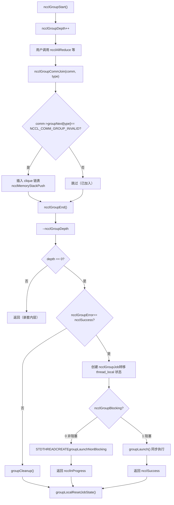
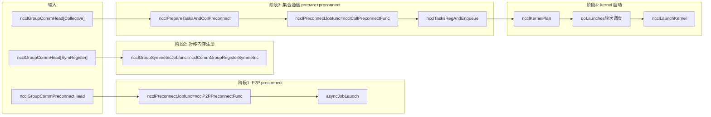

# 제 7 장: 작업 스케줄러: task_sched가 다중 channel과 kernel의 실행 순서를 어떻게 편성하는가

이전 장에서 우리는 ncclAllReduce를 ncclTaskColl까지 추적했다——작업 설명 객체가 이미 comm->planner에 놓여 있다. 하지만 작업 설명은 단지 '작업 지시서'일 뿐, 아직 GPU에서 실제로 실행되는 kernel이 되지 못했다. 이 장에서는 세 가지 질문에 답한다: 여러 API 호출은 어떻게 모아서 함께 제출되는가? 모인 작업들은 어떻게 여러 channel로 분할되는가? 여러 kernel 간의 순서와 의존성은 무엇으로 보장되는가? 먼저 전체적인 멘탈 모델을 제시한다. NCCL을 식당이라고 상상해 보자: ncclGroupStart/ncclGroupEnd는 '장바구니'로, 사용자가 여러 요리(여러 집합 통신 호출)를 장바구니에 담는다; ncclGroupEnd는 '주문'으로, 주방이 그제서야 주문에 따라 요리를 시작한다. 그리고 doLaunches는 '서빙调度员'으로, 어떤 요리를 먼저 내고 어떤 요리를 병렬로 만들 수 있는지 결정한다. group 시맨틱이 없으면 각 요리를 개별 주문하고, 주방은 요리 하나 만들 때마다 불을 다시 피워야(kernel 시작) 하므로 오버헤드가 막대하다; doLaunches의 라운드 스케줄링이 없으면 다중 channel의 kernel이 순서 없이 시작되어 데이터 의존성이 파괴된다.

# 一、Group 시맨틱의 전역 상태: thread_local 변수와 '장바구니' 모델

## 직관적 모델

`ncclGroupStart`과`ncclGroupEnd`사이의 모든 통신 호출은 즉시 kernel을 시작하지 않고 '모아'진다. 어디에 모이는가? 바로**스레드 로컬(thread_local)**전역 변수에 모인다. 왜 thread_local인가? NCCL은 같은 스레드 내의 group 호출이 직렬이라고 가정하고, 다른 스레드는 각자 독립적인 장바구니를 가져 서로 간섭하지 않기 때문이다. 만약 이 상태들이 전역 변수이고 thread_local이 아니라면, 두 스레드가 동시에`ncclGroupStart`를 호출할 때 서로 충돌하여 한 스레드의 작업이 다른 스레드의`ncclGroupEnd`로 제출되는——치명적인 상황이 발생한다.

## 데이터 구조와 메모리 레이아웃

먼저 group의 전역 상태 정의를 보자.

[FACT:src/group.cc:34-34]

```cpp
thread_local int ncclGroupDepth = 0; // depth of ncclGroupStart nesting
thread_local ncclResult_t ncclGroupError = ncclSuccess;
thread_local struct ncclComm* ncclGroupCommHead[ncclGroupTaskTypeNum] = {nullptr};
thread_local struct ncclComm* ncclGroupCommPreconnectHead = nullptr;
thread_local struct ncclIntruQueue ncclAsyncJobs;
thread_local int ncclGroupBlocking = -1; /* default mode */
```

필드별로 분석:

- **`ncclGroupDepth`**: 중첩 깊이.`ncclGroupStart`는 중첩 호출이 가능하며(흔하지는 않지만), 매번`ncclGroupStart`는 1 증가,`ncclGroupEnd`는 1 감소한다. 0으로 줄어들 때만 실제로 제출된다. 이는 장바구니가 중첩될 수 있는 것과 같다——장바구니 안에 또 하위 장바구니를 열고, 가장 바깥쪽에서 결제할 때만 실제로 주문된다.
- **`ncclGroupError`**: group 내 임의의 호출에서 오류가 발생하면 오류가 여기에 기록되고,`ncclGroupEnd`시 통합 처리된다. 이는 '한 번 호출 실패 후 이후 호출이 계속 장바구니에 물건을 담는' 불일치 상태를 방지한다.
- **`ncclGroupCommHead[ncclGroupTaskTypeNum]`**: 작업 유형별로 그룹화된 통신 도메인 연결 리스트 헤드.`ncclGroupTaskTypeNum`는 작업 유형 수(집합 통신, 원시 작업, 관리 작업, 대칭 등록 등)이다. 각 유형마다 하나의 연결 리스트가 있고, 연결 리스트 노드는`ncclComm`이며,`comm->groupNext[type]`를 통해 연결된다. 왜 유형별로 나누는가? 유형마다 작업 제출 시점과 의존 관계가 다르기 때문이다——집합 통신 작업은 먼저 preconnect해야 하고, 관리 작업(예: destroy)은 마지막에 실행해야 한다.
- **`ncclGroupCommPreconnectHead`**: 사전 연결이 필요한 통신 도메인 연결 리스트. 사전 연결은 '미리 네트워크 연결을 설정'하여 kernel 시작 시점에 연결을 설정함으로써 발생하는 지연을 방지한다.
- **`ncclAsyncJobs`**: 비동기 작업 큐. 일부 작업(예:`ncclCommInitRank`)은 비동기이며, 이 큐에 들어가`ncclGroupEnd`시 통합 시작된다.
- **`ncclGroupBlocking`**: 블로킹 모드 플래그.`-1`는 아직 결정되지 않음을,`0`는 비블로킹을 나타내며,`1`는 블로킹을 나타낸다. 동일한 group 내에서 블로킹과 논블로킹 통신 도메인을 혼용하는 것은 허용되지 않으며, 그렇지 않으면 오류가 발생한다.

여기에 핵심 설계가 있다:`ncclGroupCommHead`는**배열**이며, 각 요소는 하나의 연결 리스트이다. 연결 리스트 노드는`comm->groupNext[type]`를 통해 연결되며, 독립적인 연결 리스트 노드 구조체를 사용하지 않는다. 이는`ncclComm`구조체 내에`groupNext`배열 필드를 반드시预留해야 함을 의미한다. 이러한 「침투형 연결 리스트」 설계는 추가적인 메모리 할당을 방지하지만, 그 대가로`ncclComm`구조체가 커진다.

## 시나리오 기반 Step-by-Step Walkthrough

**시나리오**: 사용자가`ncclGroupStart()`를 호출한 후, 연속으로 두 번`ncclAllReduce`를 호출하고 (각각 서로 다른 두 통신 도메인 commA와 commB에 대해), 마지막으로`ncclGroupEnd()`。

**를 호출한다.`ncclGroupStart`첫 번째 단계:**

[FACT:src/include/group.h:63-66]

```cpp
inline ncclResult_t ncclGroupStartInternal() {
  ncclGroupDepth++;
  return ncclSuccess;
}
```

복사`ncclGroupStart`극히 단순하다: 깊이를 1 증가시킨다. 메모리 할당도, 락도, 시스템 콜도 없다. 이것이

**가 거의 제로 오버헤드인 이유이다.`ncclAllReduce`두 번째 단계:**

`ncclAllReduce`가 group 내에서 호출되면 무슨 일이 발생하는가?`ncclGroupCommJoin(comm, ncclGroupTaskTypeCollective)`내부에서

[FACT:src/include/group.h:80-116]

```cpp
inline void ncclGroupCommJoin(struct ncclComm* comm, int type) {
  if (comm->groupNext[type] == reinterpret_cast(NCCL_COMM_GROUP_INVALID)) {
    // Insert comm into ncclGroupCommHead adjacent to sibling comms. This preserves
    // the users program order yet insures siblings occur consecutively. This
    // is required by doLaunches() in "group.cc".
    struct ncclComm** pp = &ncclGroupCommHead[type];
    while (*pp != nullptr && comm->intraComm0 != (*pp)->intraComm0) pp = &(*pp)->groupNext[type];

    // didn't find its clique, we need to insert it with ascending order based on commHash
    if (*pp == nullptr) {
      pp = &ncclGroupCommHead[type];
      while (*pp != nullptr && (*pp)->commHash commHash) pp = &(*pp)->groupNext[type];
    }
    comm->groupNext[type] = *pp;
    *pp = comm;
    // Comms gets a new memory stack scope upon joining. Each task batched for
    // this comm is allocated there.
    if (type == ncclGroupTaskTypeCollective || type == ncclGroupTaskTypeRawTask) {
      // Initialize planner
      ncclMemoryStackPush(&comm->memScoped);
      ncclKernelPlanner::Peer* tmp = comm->planner.peers;
      ncclIntruQueue* tmpRmaQueues = comm->planner.rmaTaskQueues;
      int numRmaCtx = comm->config.numRmaCtx;
      memset(&comm->planner, 0, sizeof(comm->planner));
      comm->planner.peers = tmp;
      comm->planner.bcast_info.minBcastPeer = INT_MAX;
      comm->planner.bcast_info.maxBcastPeer = INT_MIN;
      comm->planner.rmaTaskQueues = tmpRmaQueues;
      if (comm->planner.rmaTaskQueues != NULL) {
        for (int i = 0; i planner.rmaTaskQueues[i]);
        }
      }
    }
  }
  ncclGroupBlocking = comm->config.blocking;
}
```

복사

1. **이 코드에는 몇 가지 정교한 점이 있다:**：`if (comm->groupNext[type] == NCCL_COMM_GROUP_INVALID)`멱등성 검사`ncclAllReduce`는 동일한 통신 도메인이 동일한 group 내에서 한 번만 추가되도록 보장한다. 만약 사용자가 동일한 comm에 대해`comm->planner`를 두 번 호출하면, 두 번째는 연결 리스트에 중복 추가되지 않지만, 태스크는

2. **에追加된다.**：`intraComm0`clique 정렬`ncclCommSplit`는 「전역 엔티티」의 식별자이다. 여러 통신 도메인이 동일한 전역 엔티티에 속하면 (예를 들어`intraComm0`를 통해 분할된 경우), 그들의`intraComm0`가 동일하며, 이를 하나의 clique라고 한다. 코드는 먼저`commHash`로 clique를 찾아 comm을 동일 clique의 형제 노드 옆에 삽입한다. clique를 찾지 못하면`doLaunches`오름차순으로 삽입한다. 이 정렬은

3. **가 clique 내의 barrier 동기화를 올바르게 처리할 수 있도록 하기 위한 것이다.**：`ncclMemoryStackPush(&comm->memScoped)`메모리 스택 스코프`ncclTaskColl`는 이 comm을 위해 group 내에 새로운 메모리 스택 스코프를 할당한다. 이 comm을 위해 할당된 모든 태스크(`ncclGroupCommLeave`등)는 이 스택에서 할당된다.`ncclMemoryStackPop`시`malloc/free`가 모든 태스크 메모리를 한 번에 해제한다——이는 「일괄 할당, 일괄 해제」의 고전적인 최적화로, 각 태스크마다 개별적으로

4. **하는 오버헤드를 방지한다.**：`memset(&comm->planner, 0, sizeof(comm->planner))`planner 리셋`peers`는 planner를 비우지만,`rmaTaskQueues`와`bcast_info`포인터는 유지한다 (먼저 임시 변수에 저장하고, memset 후 복원). 왜 유지하는가? 이 둘은 사전 할당된 배열이므로 매번 재할당할 필요가 없기 때문이다.`INT_MAX/INT_MIN`의 min/max는

**로 리셋되어 이후 broadcast 태스크의 병합 최적화에 사용된다.`ncclGroupEnd`세 번째 단계:**

[FACT:src/group.cc:1039-1164]

`ncclGroupEndInternal`는 무엇을 하는가?

[FACT:src/group.cc:1048-1061]

```cpp
if (ncclGroupDepth == 0) {
  WARN("ncclGroupEnd: not in a group call.");
  ret = ncclInvalidUsage;
  goto exit;
}
// ...
if ((--ncclGroupDepth) > 0) goto exit;
```

복사

[FACT:src/group.cc:1063]

```cpp
if ((ret = ncclGroupError) != ncclSuccess) goto fail;
```

복사

[FACT:src/group.cc:1084-1093]

```cpp
NEW_NOTHROW_GOTO(groupJob, ncclGroupJob, ret, fail);
ncclIntruQueueConstruct(&groupJob->asyncJobs);
groupJob->groupRefCount = 0;
groupJob->nonBlockingInit = false;
memcpy(groupJob->groupCommHead, ncclGroupCommHead, sizeof(ncclGroupCommHead));
groupJob->groupCommPreconnectHead = ncclGroupCommPreconnectHead;
groupJob->groupError = ncclSuccess;
groupJob->abortFlag = false;
groupJob->joined = false;
ncclIntruQueueTransfer(&groupJob->asyncJobs, &ncclAsyncJobs);
```

복사`ncclGroupJob`를 생성하여 thread_local의 group 상태를 job 객체로 「이전」한다.`ncclIntruQueueTransfer`는`ncclAsyncJobs`큐 전체를`groupJob->asyncJobs`로 이전한다. 이 단계가 핵심이다: thread_local 상태는 「임시」이고, job 객체는 「영속적」이므로 비동기 스레드가 보유할 수 있다.

[FACT:src/group.cc:1095-1147]

```cpp
if (hasCommHead || !ncclIntruQueueEmpty(&groupJob->asyncJobs) || ncclGroupCommPreconnectHead != nullptr) {
  /* make sure ncclGroupBlocking has been set. */
  if (ncclGroupBlocking != 0 && ncclGroupBlocking != 1) {
    WARN("Invalid group blocking state %d", ncclGroupBlocking);
    ret = ncclInternalError;
    goto fail;
  }
  if (ncclGroupBlocking == 0) {
    /* nonblocking group */
    // ... 设置 async error 为 ncclInProgress，创建线程执行 groupLaunchNonBlocking
    groupJob->base.func = groupLaunchNonBlocking;
    STDTHREADCREATE_GOTO(groupJob->base.thread, ncclAsyncJobMain, ret, fail, &groupJob->base);
    groupJob->nonBlockingInit = true;
    ret = ncclInProgress;
  } else {
    /* blocking group */
    int savedDev;
    CUDACHECKGOTO(cudaGetDevice(&savedDev), ret, fail);
    NCCLCHECKGOTO(groupLaunch(&groupJob->base, internalSimInfoPtr), ret, fail);
    CUDACHECKGOTO(cudaSetDevice(savedDev), ret, fail);
    if (simInfo) memcpy((void*)simInfo, (void*)internalSimInfoPtr, realSize);
    delete groupJob;
  }
} else {
  // Free when not needed (single rank case)
  delete groupJob;
}
```

블로킹 모드: 현재 스레드에서 직접`groupLaunch`를 호출하여 동기적으로 완료한다. 논블로킹 모드: 스레드를 생성하여`groupLaunchNonBlocking`를 실행하고 즉시`ncclInProgress`를 반환한다. 사용자는 이후`ncclCommGetAsyncError`를 통해 진행 상황을 조회한다.

주의:`cudaGetDevice`/`cudaSetDevice`의 저장과 복원:`groupLaunch`내부에서 CUDA 디바이스를 전환한다 (서로 다른 comm이 서로 다른 GPU에 있을 수 있기 때문). 실행 완료 후 사용자의 원래 디바이스를 복원한다. 이는 「NCCL 내부에서 디바이스를 전환한 후 되돌리지 않아」 사용자의 이후 CUDA 호출이 잘못된 디바이스에서 실행되는 것을 방지하기 위한 것이다.

## 설계 사고와 프로덕션 함정

**함정 1: 블로킹과 논블로킹 통신 도메인 혼용**。`ncclAsyncLaunch`에 검사가 있다:

[FACT:src/group.cc:55-64]

```cpp
/* check if there are blocking and nonblocking comms at the same time in group. */
if (comm->destroyFlag) {
  ncclGroupBlocking = 1;
} else if (ncclGroupBlocking == -1) {
  /* first met communicator */
  ncclGroupBlocking = comm->config.blocking;
} else if (ncclGroupBlocking != comm->config.blocking) {
  WARN("Blocking and nonblocking communicators are not allowed in the same group.");
  ret = ncclInvalidArgument;
}
```

왜 혼용이 허용되지 않는가? 블로킹 group은 현재 스레드에서 동기적으로 실행되고, 논블로킹 group은 독립 스레드에서 비동기적으로 실행되기 때문이다. 만약 혼용하면`ncclGroupEnd`가 동기적으로 반환해야 하는지`ncclInProgress`를 반환해야 하는지 결정할 수 없다. 프로덕션 환경에서 사용자가 실수로 블로킹과 논블로킹 comm을 동일한 group에 넣으면`ncclInvalidArgument`를 받게 되지만, 이 시점에서 group 상태는 이미 오염되었으므로 반드시`ncclGroupStart`。

**를 다시 해야 한다.`ncclGroupError`함정 2:**의 전파`ncclGroupError`. 만약 group 내에서 어느 한 번의 호출이 실패하면`ncclGroupEnd`가 설정되고,`groupCleanup`。`groupCleanup`는 fail 분기로 점프하여`ncclGroupStart`를 실행한다.

[FACT:src/group.cc:514-607]

```cpp
static void groupCleanup(struct ncclComm** groupCommHeadPtr,
                         struct ncclIntruQueue* asyncJobsPtr,
                         ncclResult_t error) {
  struct ncclComm* comm;
  for (int type = 0; type groupNext[type];
      (void)ncclGroupCommLeave(comm, type);
      // We don't know if preconnect succeeded or happened at all, so clear
      // the flags that let `taskAppend()` skip over checking if preconnect
      // is needed.
      if (type == ncclGroupTaskTypeCollective || type == ncclGroupTaskTypeRawTask) {
        comm->preconnectNext = reinterpret_cast(0x1);
        for (int i = 0; i nRanks; i++) {
          comm->connectSend[i] = 0UL;
          comm->connectRecv[i] = 0UL;
        }
        // Reclaim abandoned kernel plan memory.
        while (!ncclIntruQueueEmpty(&comm->planner.planQueue)) {
          struct ncclKernelPlan* plan = ncclIntruQueueDequeue(&comm->planner.planQueue);
          if (!plan->persistent) {
            while (!ncclIntruQueueEmpty(&plan->proxyOpQueue)) {
              struct ncclProxyOp* pxop = ncclIntruQueueDequeue(&plan->proxyOpQueue);
              ncclMemoryPoolFree(&comm->memPool_ncclProxyOp, pxop);
            }
            ncclMemoryPoolFree(&comm->memPool_ncclKernelPlan, plan);
          }
        }
        // Reset comm->planner to empty.
        // ...
      }
      // ...
    }
  }
  // ...
}
```

시 planner에 이전 데이터가 남아 있어 태스크 중복 제출이나 메모리 누수가 발생한다.`comm->preconnectNext = reinterpret_cast<struct ncclComm*>(0x1)`복사`0x1`주의:`ncclGroupCommPreconnect`이 줄. 이것은 「센티넬 값」으로, 「이 comm은 preconnect를 다시 해야 한다」를 나타낸다. 왜인가? cleanup 시 preconnect가 성공했는지 알 수 없으므로, 다음 번에 강제로 다시 검사하도록 하기 때문이다.`if (comm->preconnectNext == reinterpret_cast<struct ncclComm*>(0x1))`이 값은 매우 정교하다——합법적인 포인터는 아니지만, 「미초기화」 마커로 사용할 수 있다.

---

# 에서`ncclPrepareTasks`를 검사하여 preconnect 연결 리스트에 추가해야 하는지 판단한다.

## 二、태스크 준비:

`ncclPrepareTasks`이것은 「재료 준비」 단계입니다. 장바구니에 있는 재료(작업 설명)는 아직 생것이므로, 먼저 씻고 썰고 배합해야(알고리즘, 프로토콜, channel 분할 결정) 냄비에 넣을(kernel 시작) 수 있습니다. 이 단계를 건너뛰고 바로 kernel을 시작하면, kernel은 데이터를 어떻게 분할하고 어느 경로로 갈지 모르기 때문에 바로 크래시합니다.

## 시나리오 기반 Step-by-Step Walkthrough

`ncclPrepareTasks`여기서`groupLaunchLegacy`에서 호출됩니다:

[FACT:src/group.cc:705-746]

```cpp
static ncclResult_t ncclPrepareTasksAndCollPreconnect(
  struct ncclComm* comm, ncclSimInfo_t* simInfo,
  struct ncclIntruQueue* asyncCollJobs) {
  if (ncclParamSingleProcMemRegEnable()) {
    // 单进程内存注册模式：把 prepare 和 preconnect 合并成一个异步 job
    struct ncclPrepareTasksAndCollPreconnectJob* job;
    NEW_NOTHROW(job, ncclPrepareTasksAndCollPreconnectJob);
    job->base.func = ncclPrepareTasksAndCollPreconnectFunc;
    // ...
    ncclIntruQueueEnqueue(asyncCollJobs, &job->base);
  } else {
    bool needConnect = false;
    bool algoNeedConnect[NCCL_NUM_ALGORITHMS];
    memset(algoNeedConnect, 0, sizeof(bool) * NCCL_NUM_ALGORITHMS);

    CUDACHECK(cudaSetDevice(comm->cudaDev));
    NCCLCHECK(ncclPrepareTasks(comm, algoNeedConnect, &needConnect, simInfo));

    if (comm->cuMemSupport && needConnect) {
      // 创建 preconnect job
      struct ncclPreconnectJob* job;
      NEW_NOTHROW(job, ncclPreconnectJob);
      job->base.func = ncclCollPreconnectFunc;
      // ...
      ncclIntruQueueEnqueue(asyncCollJobs, &job->base);
    }
  }
  return ncclSuccess;
}
```

`ncclPrepareTasks`의 출력은 두 가지입니다:`algoNeedConnect`배열(어떤 알고리즘이 연결을 설정해야 하는지)과`needConnect`플래그(연결이 필요한지 여부)입니다. 만약`needConnect`가 참이고 cuMem을 지원하면, preconnect job을 생성하여 비동기로 실행합니다.

`ncclPrepareTasks`내부에서 무엇을 할까요? 그것은`comm->planner`안의 작업들을 순회하며, 각 작업에 대해 알고리즘과 프로토콜을 결정한 다음,`taskAppend`를 호출하여 작업을 planner의 plan에 추가합니다. 이 부분 로직은 이전 장에서 이미 전개했으므로 여기서는 반복하지 않습니다.

핵심 포인트:`ncclPrepareTasks`는**comm별로 하나씩 호출**되지만, preconnect는**clique별로 배치 실행**됩니다. 왜일까요?`groupLaunchLegacy`안의 주석을 보세요:

[FACT:src/group.cc:818-834]

```cpp
do {
  // We need to preconnect connections for collectives clique by clique to avoid
  // race condition for split shared comms which can connect the same connections
  // at the same time.
  comm = cliqueHead;
  do {
    NCCLCHECKGOTO(ncclPrepareTasksAndCollPreconnect(comm, simInfo, &asyncCollJobs), ret, fail);
    comm = comm->groupNext[ncclGroupTaskTypeCollective];
  } while (comm != nullptr && comm->intraComm0 == cliqueHead->intraComm0);
  // connect
  NCCLCHECKGOTO(asyncJobLaunch(&asyncCollJobs, groupAbortFlag), ret, fail);
  // ...
  cliqueHead = comm;
} while (cliqueHead != nullptr);
```

주석에 명확히 나와 있습니다:**clique별로 하나씩 preconnect하여, split shared comms가 동시에 같은 연결 그룹에 연결해 경쟁 상태가 발생하는 것을 방지**. 만약 두 comm이 같은 부모 comm에서 split된 것이라면,它们은 일부 연결을 공유할 수 있습니다. 만약 병렬로 preconnect하면, 두 스레드가 동시에 같은 연결을 설정하려고 시도하여 중복 연결이나 연결 상태 불일치가 발생할 수 있습니다. clique별로 직렬 실행하여, 같은 시점에 하나의 clique만 연결을 설정하도록 보장합니다.

## 동시성 제어와 저수준 상호작용

`asyncJobLaunch`는 비동기 작업 시작의 핵심입니다:

[FACT:src/group.cc:609-678]

```cpp
static ncclResult_t asyncJobLaunch(struct ncclIntruQueue* asyncJobsMain,
                                   volatile bool* groupAbortFlag) {
  ncclResult_t ret = ncclSuccess;
  bool jobsDone = false;
  bool errorJobAbortFlag = false;

  if (!ncclIntruQueueEmpty(asyncJobsMain)) {
    struct ncclAsyncJob* job = ncclIntruQueueHead(asyncJobsMain);
    if (job->next == nullptr) {
      // 只有一个 job，直接在当前线程执行，避免线程创建开销
      job->isThreadMain = true;
      ncclAsyncJobMain(job);
      job->state = ncclGroupJobJoined;
      return job->result;
    }
    // 多个 job，每个创建一个线程
    do {
      STDTHREADCREATE(job->thread, ncclAsyncJobMain, job);
      job = job->next;
    } while (job != nullptr);

    do {
      jobsDone = true;
      job = ncclIntruQueueHead(asyncJobsMain);
      do {
        ncclGroupJobState_t state = COMPILER_ATOMIC_LOAD(&job->state, std::memory_order_acquire);
        if (state == ncclGroupJobRunning) {
          jobsDone = false;
        } else if (state == ncclGroupJobDone) {
          int err;
          if ((err = ncclThreadJoin(job->thread)) != ncclSuccess) {
            WARN("asyncJobLaunch: failed to join thread for job");
            ret = ncclSystemError;
          }
          job->state = ncclGroupJobJoined;
          if (job->result != ncclSuccess && ret == ncclSuccess) {
            ret = job->result;
            errorJobAbortFlag = true;
          }
        } else {
          // safety check
          if (state != ncclGroupJobJoined) {
            WARN("Async job state is %d, expected %d", state, ncclGroupJobJoined);
            if (ret == ncclSuccess) ret = ncclInternalError;
            errorJobAbortFlag = true;
          }
        }

        if (!job->destroyFlag &&
            (COMPILER_ATOMIC_LOAD(groupAbortFlag, std::memory_order_acquire) || errorJobAbortFlag == true)) {
          COMPILER_ATOMIC_STORE(job->abortFlag, uint32_t(1), std::memory_order_release);
          COMPILER_ATOMIC_STORE(job->abortFlagDev, uint32_t(1), std::memory_order_release);
          if (job->childAbortFlag) {
            COMPILER_ATOMIC_STORE(job->childAbortFlag, uint32_t(1), std::memory_order_release);
            COMPILER_ATOMIC_STORE(job->childAbortFlagDev, uint32_t(1), std::memory_order_release);
          }
        }

        job = job->next;
      } while (job != nullptr);
      // Let preconnect threads progress.
      if (jobsDone == false) std::this_thread::sleep_for(std::chrono::microseconds(1));
    } while (jobsDone == false);

    if (ret != ncclSuccess) goto fail;
  }

exit:
  return ret;
fail:
  goto exit;
}
```

이 코드에는 몇 가지 핵심 설계가 있습니다:

1. **단일 job 최적화**: 만약 큐에 job이 하나만 있으면, 스레드를 생성하지 않고 현재 스레드에서 직접 실행합니다. 이는 스레드 생성과 join 오버헤드를 피합니다. 단일 comm 그룹의 경우, 이것이 일반적인 상황입니다.

2. **원자적 상태 머신**：`job->state`는 원자 변수이며, 세 가지 상태가 있습니다:`ncclGroupJobRunning`、`ncclGroupJobDone`、`ncclGroupJobJoined`. 작업 스레드가 실행을 마친 후`COMPILER_ATOMIC_STORE(..., std::memory_order_release)`를 사용하여`Done`로 설정합니다; 메인 스레드는`COMPILER_ATOMIC_LOAD(..., std::memory_order_acquire)`를 사용하여 읽습니다. release/acquire 페어링은 작업 스레드의 모든 메모리 쓰기가 메인 스레드에 보이도록 보장합니다.

3. **바쁜 대기 + 마이크로 슬립**: 메인 스레드는 모든 job의 상태를 폴링하며, 아직 실행 중인 job이 있으면`sleep_for(1us)`후 계속 폴링합니다. 왜 1마이크로초를 사용하고 조건 변수를 사용하지 않을까요? preconnect는 짧은 작업(보통 수십 마이크로초에서 수 밀리초)이기 때문에, 조건 변수의 깨우기 오버헤드가 바쁜 대기보다 더 클 수 있습니다. 1마이크로초의 슬립은 순수 스핀으로 인한 CPU 낭비를 방지합니다.

4. **오류 전파와 abort**: 만약 어떤 job이든 실패하면,`errorJobAbortFlag`가 설정되고, 이후 모든 job의`abortFlag`가 원자적으로 1로 설정됩니다. 작업 스레드는 실행 중에`abortFlag`를 확인하고, abort된 것을 발견하면 조기에 종료합니다. 이것은 「빠른 실패」 메커니즘으로, 하나의 job이 실패한 후 다른 job들이 계속 헛돌지 않도록 방지합니다.

## Mermaid 다이어그램: group 제출의 제어 흐름



---

# 3.`doLaunches`: 다중 channel 다중 kernel의 라운드 스케줄링

## 직관적 모델

`doLaunches`는 「음식 전달 스케줄러」입니다. 주방(GPU)에는 여러 화구(channel)가 있고, 각 요리(kernel plan)는 순서대로 올라가야 합니다. 하지만 다른 comm의 요리는 병렬로 올라갈 수 있고, 같은 comm의 요리는 반드시 순서대로 올라가야 합니다. 스케줄러는 다음을 보장해야 합니다: 같은 clique 내의 comm은 동기적으로 진행(barrier 사용)하고, 다른 clique 간에는 독립적으로 진행할 수 있습니다.

## 데이터 구조와 메모리 레이아웃

`doLaunches`의 핵심 데이터 구조는`ncclKernelPlan`와`comm->planner.unlaunchedPlansHead`。

[FACT:src/group.cc:427-503]

```cpp
ncclResult_t doLaunches(struct ncclComm* head, int taskType) {
  ncclResult_t result = ncclSuccess;
  struct ncclComm* cliqueHead = head;
  struct ncclComm* cliqueNextHead;
  bool useBarrier = ncclParamLaunchMode == ncclLaunchModeGroup;
  // This outer loop iterates over cliques of comms which are siblings of the
  // same global entity. We calculate a clique as all comms which have the same
  // `intraComm0` value.
  do {
    struct ncclComm* comm = cliqueHead;
    bool capturingYes = false, capturingNo = false;
    do {
      (ncclCudaGraphValid(comm->planner.capturingGraph) ? capturingYes : capturingNo) = true;
      CUDACHECKGOTO(cudaSetDevice(comm->cudaDev), result, failure);
      NCCLCHECKGOTO(ncclLaunchPrepare(comm), result, failure);
      if (useBarrier) ncclCommIntraBarrierIn(comm, 1);
      comm = comm->groupNext[taskType];
    } while (comm != nullptr && comm != reinterpret_cast(NCCL_COMM_GROUP_INVALID) &&
             comm->intraComm0 == cliqueHead->intraComm0);
    cliqueNextHead = comm;

    if (capturingYes && capturingNo) {
      // We have entered barriers but are aborting without leaving them. Thus
      // these comms are permanently trashed. We need a good mechanism for
      // tracking and reporting that.
      WARN("Either none or all communicators in a ncclGroup() can be CUDA graph captured.");
      result = ncclInvalidUsage;
      goto failure;
    }

    while (true) {
      // Iterate rounds of launches for clique.
      bool moreRounds = false;
      comm = cliqueHead;
      do {
        // Iterate clique members.
        struct ncclComm* next = comm->groupNext[taskType];
        if (useBarrier) {
          // Barrier reduction result tells us if this was the final round.
          moreRounds = 0 != ncclCommIntraBarrierOut(comm);
        } else {
          moreRounds |= comm->planner.unlaunchedPlansHead != nullptr;
        }
        if (moreRounds) {
          // Pop next unlaunched kernel
          struct ncclKernelPlan* plan = comm->planner.unlaunchedPlansHead;
          if (plan != nullptr) {
            comm->planner.unlaunchedPlansHead = plan->next;
            CUDACHECKGOTO(cudaSetDevice(comm->cudaDev), result, failure);
            NCCLCHECKGOTO(ncclLaunchKernelBefore_NoUncapturedCuda(comm, plan), result, failure);
            if (plan->isCeColl) {
              NCCLCHECKGOTO(ncclLaunchCeColl(comm, plan), result, failure);
            } else if (plan->isRma) {
              NCCLCHECKGOTO(ncclLaunchRma(comm, plan), result, failure);
            } else {
              NCCLCHECKGOTO(ncclLaunchKernel(comm, plan), result, failure);
            }
          }
          // Barrier reduction input indicates if we require further rounds.
          if (useBarrier) ncclCommIntraBarrierIn(comm, comm->planner.unlaunchedPlansHead != nullptr ? 1 : 0);
          if (plan != nullptr) {
            NCCLCHECKGOTO(ncclLaunchKernelAfter_NoCuda(comm, plan), result, failure);
          }
        } else {
          // Final round.
          CUDACHECKGOTO(cudaSetDevice(comm->cudaDev), result, failure);
          NCCLCHECKGOTO(ncclLaunchFinish(comm), result, failure);
        }
        comm = next;
      } while (comm != reinterpret_cast(NCCL_COMM_GROUP_INVALID) && comm != cliqueNextHead);
      if (!moreRounds) break;
    }
    cliqueHead = cliqueNextHead;
  } while (cliqueHead != nullptr && cliqueHead != reinterpret_cast(NCCL_COMM_GROUP_INVALID));
failure:
  return result;
}
```

## 시나리오 기반 Step-by-Step Walkthrough

**시나리오**: 두 comm(commA와 commB)이 같은 clique에 속하고(`intraComm0`동일), 각 comm에는 시작할 3개의 kernel plan이 있습니다.

**첫 번째 계층 루프: clique 순회**

외부`do-while`는 모든 clique를 순회합니다.`cliqueHead`는 현재 clique의 첫 번째 comm입니다. 내부`do-while`는 clique 내의 모든 comm을 순회합니다(`comm->intraComm0 == cliqueHead->intraComm0`）。

각 comm에 대해:

- `cudaSetDevice(comm->cudaDev)`: 해당 comm에 대응하는 GPU로 전환합니다.
- `ncclLaunchPrepare(comm)`: 시작 준비, CUDA 스트림 설정, 리소스 확인 등을 포함합니다.
- `ncclCommIntraBarrierIn(comm, 1)`: barrier에 진입, 초기값은 1입니다.

**두 번째 계층 루프: 라운드 스케줄링**

`while (true)`루프는 「라운드」를 실행합니다. 각 라운드에서 clique 내의 각 comm은 하나의 kernel plan을 시작합니다.

핵심은`moreRounds`의 계산입니다:

- **barrier 모드 있음**（`useBarrier == true`）：`moreRounds = 0 != ncclCommIntraBarrierOut(comm)`。`ncclCommIntraBarrierOut`는**comm 간 barrier 리덕션 연산**입니다. clique 내의 모든 comm이`ncclCommIntraBarrierIn`를 호출할 때까지 기다린 후, 모든 입력값의 리덕션 결과(여기서는 논리 OR)를 반환합니다. 만약 어떤 comm이든 아직 시작하지 않은 plan이 있으면, 리덕션 결과는 1이고,`moreRounds`는 true이며, 다음 라운드를 계속합니다. 만약 모든 comm에 시작하지 않은 plan이 없으면, 리덕션 결과는 0이고,`moreRounds`는 false이며, final round에 진입합니다.
- **barrier 모드 없음**：`moreRounds |= comm->planner.unlaunchedPlansHead != nullptr`. 각 comm에 아직 시작되지 않은 plan이 있는지 직접 확인한다. 여기서 사용하는 것은`|=`, 하나의 comm이라도 plan이 남아 있으면`moreRounds`은 true가 된다.

왜 barrier가 필요한가? clique 내의 comm은 "형제"로서 GPU 리소스나 네트워크 연결을 공유할 수 있기 때문이다. 한 comm이 3개의 kernel을 시작하고 다른 하나는 1개만 시작했다면, 먼저 시작을 마친 comm은`ncclLaunchFinish`에 진입하여 리소스를 해제하는데, 다른 comm은 아직 이 리소스를 사용 중이므로 use-after-free가 발생한다. barrier는 clique 내 모든 comm이 동기적으로 진행하도록 보장한다: 모두 N번째 라운드를 시작하거나, 모두 final round에 진입한다.

**kernel 시작 분기**

[FACT:src/group.cc:477-483]

```cpp
if (plan->isCeColl) {
  NCCLCHECKGOTO(ncclLaunchCeColl(comm, plan), result, failure);
} else if (plan->isRma) {
  NCCLCHECKGOTO(ncclLaunchRma(comm, plan), result, failure);
} else {
  NCCLCHECKGOTO(ncclLaunchKernel(comm, plan), result, failure);
}
```

세 가지 plan 유형:

- `isCeColl`: CollNet 집합 통신 (NIC offload로 집합 통신 수행).
- `isRma`: RMA (Remote Memory Access) 작업.
- 기본: 일반 GPU kernel.

각 유형의 시작 함수는 다르지만 모두 "Before -> Launch -> After" 패턴을 따른다:

- `ncclLaunchKernelBefore_NoUncapturedCuda`: 시작 전 준비 (kernel 파라미터 설정, 디바이스에 업로드 등).
- `ncclLaunchKernel`: 실제 kernel 시작 (`cudaLaunchKernel`）。
- `ncclLaunchKernelAfter_NoCuda`: 시작 후 정리 (상태 업데이트, 임시 리소스 해제).

**Final round**

`moreRounds`이 false일 때,`ncclLaunchFinish(comm)`을 실행한다. 이 단계는 최종 정리를 수행한다: plan 메모리 해제, comm 상태 업데이트, proxy 스레드 통지 등.

## 동시성 제어와 하드웨어 상호작용

`ncclCommIntraBarrierIn/Out`은 clique 내 comm의 동기화 프리미티브이다. 그 구현은 원자적 연산과 스핀 대기를 포함한다.`In`은 값을 공유 메모리에 쓰고,`Out`은 모든 comm이 쓴 후 리덕션 결과를 읽을 때까지 기다린다. 이 barrier는**프로세스 간**이며 (comm이 서로 다른 프로세스에 있는 경우), 하위 레벨에서 공유 메모리나 네트워크를 사용할 수 있다.

왜 단순한 "모든 comm에 plan이 남아 있는지 확인" 대신 barrier를 사용하는가? "확인"은 비원자적이기 때문이다: commA가 확인할 때 commB에 plan이 남아 있으면 commA는 계속하기로 결정한다. 그러나 commB는 commA의 확인 직후 마지막 plan을 시작 완료하고 final round에 진입한다. commA는 아직 kernel을 시작 중인데 commB는 이미 공유 리소스를 해제했다. barrier는 "확인"과 "결정"을 하나의 원자적 연산으로 만들어 이 경쟁 조건을 제거한다.

## 프로덕션 함정 회피 가이드

**함정 1: CUDA graph capture 혼용**。

[FACT:src/group.cc:448-455]

```cpp
if (capturingYes && capturingNo) {
  // We have entered barriers but are aborting without leaving them. Thus
  // these comms are permanently trashed. We need a good mechanism for
  // tracking and reporting that.
  WARN("Either none or all communicators in a ncclGroup() can be CUDA graph captured.");
  result = ncclInvalidUsage;
  goto failure;
}
```

clique 내 일부 comm이 CUDA graph capture 모드에 있고 다른 일부는 그렇지 않으면 즉시 오류가 발생한다. 주석에는 "these comms are permanently trashed"라고 되어 있다 — barrier에 진입했지만 빠져나오지 못했기 때문에 이 comm들의 barrier 상태는 영원히 일관되지 않으며 이후 사용할 수 없다. 이는**복구 불가능한 오류**이며, 사용자는 통신 도메인을 재생성해야 한다. 프로덕션 환경에서 사용자가 graph capture와 비-capture comm을 혼용하면`ncclInvalidUsage`을 받지만, 더 심각한 것은 comm이 이미 손상되었다는 점이다.

**함정 2:`useBarrier`의 구성 의존성**。`useBarrier = ncclParamLaunchMode == ncclLaunchModeGroup`. 사용자가`NCCL_LAUNCH_MODE=GROUP`을 설정하면 barrier 경로를 타고, 그렇지 않으면 비-barrier 경로를 탄다. 비-barrier 경로에서`moreRounds`은`|=`으로 누적하지만, 각 comm이 독립적으로 판단한다. commA에는 plan이 남아 있고 commB에는 없다면, commB는 final round에 진입하여`ncclLaunchFinish`을 실행하는데 commA는 아직 kernel을 시작 중이다. 이는 일부 시나리오에서는 안전하지만 (comm 간에 공유 리소스가 없는 경우), proxy 스레드나 네트워크 연결을 공유하면 문제가 발생할 수 있다. 따라서 기본적으로 barrier 모드를 권장한다.

---

# 4.`groupLaunchLegacy`의 전체 실행 체인

## 시나리오 기반 Step-by-Step Walkthrough

`groupLaunchLegacy`은 블로킹 모드에서의 전체 제출 흐름이다. 순서대로 실행한다:

**단계 1: P2P preconnect**

[FACT:src/group.cc:756-774]

```cpp
if (!simInfo && groupCommPreconnectHeadMain != nullptr) {
  struct ncclComm* comm = groupCommPreconnectHeadMain;
  do {
    struct ncclPreconnectJob* job;
    NEW_NOTHROW_GOTO(job, ncclPreconnectJob, ret, fail);
    job->base.func = ncclP2PPreconnectFunc;
    // ...
    ncclIntruQueueEnqueue(asyncJobsMain, (struct ncclAsyncJob*)job);
    struct ncclComm* next = comm->preconnectNext;
    comm->preconnectNext = reinterpret_cast(0x1);
    comm = next;
  } while (comm != nullptr);
}
NCCLCHECKGOTO(asyncJobLaunch(asyncJobsMain, groupAbortFlag), ret, fail);
```

preconnect가 필요한 각 comm에 대해`ncclP2PPreconnectFunc`job을 생성한 후 일괄 시작한다.`ncclP2PPreconnectFunc`내부에서`ncclTransportP2pSetup`을 호출하여 P2P 연결을 설정한다.

**단계 2: 대칭 메모리 등록**

[FACT:src/group.cc:778-808]

```cpp
// only loop through sym alloc and register tasks
for (int type = ncclGroupTaskTypeSymRegister; type destroyFlag && job->comm && !job->comm->config.blocking &&
      groupCommHeadMain[ncclGroupTaskTypeCollective] == nullptr) {
    (void)ncclCommSetAsyncError(job->comm, ret);
  }
  if (job->destructor) job->destructor((void*)job);
}

for (int type = 0; type groupNext[type];
    // Poll for callbacks sent to us from other threads.
    if (comm->reclaimSteps == GROUP_MAX_RECLAIM_STEPS) {
      NCCLCHECKGOTO(ncclCommPollCallbacks(comm, /*waitSome=*/false), ret, fail);
      comm->reclaimSteps = 0;
    } else {
      comm->reclaimSteps++;
    }
    (void)ncclGroupCommLeave(comm, type);
    if (!comm->config.blocking) {
      (void)ncclCommSetAsyncError(comm, ret);
    }
    groupCommHeadMain[type] = next;
  }
}
```

비동기 job을 정리한 후 모든 comm을 순회하며`ncclGroupCommLeave`을 호출한다.`reclaimSteps`의 카운트에 주의: 매`GROUP_MAX_RECLAIM_STEPS`(10)번 group 호출마다 callbacks를 한 번 폴링합니다. 이는 매 group마다 callbacks를 폴링하는 오버헤드를 피하면서 callbacks가 무한정 쌓이지 않도록 보장하기 위함입니다.

## Mermaid 다이어그램:`groupLaunchLegacy`의 데이터 흐름



---

# 5.`groupLaunchEnqueueRearch`: 새로운 아키텍처의 스케줄러

## 직관적 모델

`groupLaunchEnqueueRearch`은 NCCL이 개발 중인 새로운 스케줄링 아키텍처입니다. 작업 준비, 스케줄링, 시작을 더 세분화된 단계로 나누고 비동기 job 큐로 관리합니다. 현재 스케줄러와 런처 모듈은 "아직 구현되지 않았으며", legacy의`doLaunches`。

[FACT:src/group.cc:991-996]

```cpp
// Schedule and launch tasks. Scheduler and launcher module of the enqueue framework
// is not yet implemented and falls back to the legacy launcher: a single phased
// doLaunches over the clique, run here on the user's thread.
if (!simInfo && groupCommHeadMain[ncclGroupTaskTypeRawTask] != nullptr) {
  NCCLCHECKGOTO(doLaunches(groupCommHeadMain[ncclGroupTaskTypeRawTask], ncclGroupTaskTypeRawTask), ret, fail);
}
```

새로운 아키텍처의 실행 흐름:

1. **작업 관리**：`ncclMgmtTaskJobFunc`처리`mgmtTaskQueue`안의 작업(예: destroy)을 처리합니다.

2. **작업 준비**：`ncclTaskPrepareJobFunc`호출`ncclTaskPrepare`。

3. **스케줄링 및 시작**: 로 폴백`doLaunches`。

새로운 아키텍처는`ncclGroupJobLaunch`를 대체하여`asyncJobLaunch`를 사용하며, 더 엄격한 상태 검사를 추가했습니다:

[FACT:src/group.cc:113-116]

```cpp
} else {
  /* safety check */
  assert(state == ncclGroupJobJoined);
}
```

legacy 버전은`WARN`대신`assert`를 사용하고, 새로운 아키텍처는`assert`를 사용합니다. 이는 새로운 아키텍처가 상태 머신의 정확성에 더 높은 요구를 한다는 것을 보여줍니다.

## 설계 고찰

새로운 아키텍처의 동기는**디커플링**: legacy의`groupLaunchLegacy`는 모든 단계를 하나의 함수에 뒤섞어 유지보수와 확장이 어렵습니다. 새로운 아키텍처는 각 단계를 독립적인 job 타입으로 분리하고 큐로 연결합니다. 하지만 현재 스케줄러와 런처가 아직 구현되지 않았으므로 "프레임워크 선행"일 뿐입니다.

`ncclParamEnqueueRearchEnable()`이 새로운 아키텍처로 갈지 legacy로 갈지 제어합니다:

[FACT:src/group.cc:1031-1033]

```cpp
static ncclResult_t groupLaunch(struct ncclAsyncJob* job_, ncclSimInfo_t* simInfo = NULL) {
  return ncclParamEnqueueRearchEnable() ? groupLaunchEnqueueRearch(job_, simInfo) : groupLaunchLegacy(job_, simInfo);
}
```

사용자는 환경 변수`NCCL_ENQUEUE_REARCH_ENABLE`로 전환할 수 있습니다. 프로덕션 환경에서는 새로운 아키텍처가 아직 개발 중이므로 기본값(legacy)을 유지하는 것을 권장합니다.

---

# 6. 논블로킹 group과 비동기 오류 처리

## 시나리오 기반 단계별 워크스루

논블로킹 group의 핵심은`ncclGroupJobComplete`과`ncclGroupJobAbort`：

[FACT:src/group.cc:1166-1190]

```cpp
ncclResult_t ncclGroupJobComplete(struct ncclGroupJob* groupJob) {
  ncclResult_t ret = ncclSuccess;
  if (groupJob && groupJob->nonBlockingInit) {
    if (!COMPILER_ATOMIC_EXCHANGE(&groupJob->joined, true, std::memory_order_acq_rel)) {
      ret = ncclAsyncJobComplete(&groupJob->base);
    }
    if (ncclAtomicRefCountDecrement(&groupJob->groupRefCount) == 0) {
      delete groupJob;
    }
  }
  return ret;
}

ncclResult_t ncclGroupJobAbort(struct ncclGroupJob* groupJob) {
  if (groupJob && groupJob->nonBlockingInit) {
    if (!COMPILER_ATOMIC_EXCHANGE(&groupJob->joined, true, std::memory_order_acq_rel)) {
      COMPILER_ATOMIC_STORE(&groupJob->abortFlag, true, std::memory_order_relaxed);
      ncclAsyncJobComplete(&groupJob->base);
    }
    if (ncclAtomicRefCountDecrement(&groupJob->groupRefCount) == 0) {
      delete groupJob;
    }
  }
  return ncclSuccess;
}
```

핵심 설계:

1. **`joined`원자적 플래그**:`COMPILER_ATOMIC_EXCHANGE`를 사용하여 하나의 스레드만 join 로직을 실행할 수 있도록 보장합니다. 두 스레드가 동시에`ncclGroupJobComplete`를 호출하면 하나만 실제로 join하고 다른 하나는 바로 건너뜁니다. 이는 double-join을 방지합니다.

2. **참조 카운트**：`groupRefCount`는 이 group job에 몇 개의 comm이 연관되어 있는지 기록합니다. 각 comm은`ncclGroupEndInternal`에서 참조 카운트를 증가시킵니다:

[FACT:src/group.cc:1108-1111]

```cpp
if (job->comm->groupJob == NULL) {
  job->comm->groupJob = groupJob;
  groupJob->groupRefCount++;
}
```

모든 comm이`ncclGroupJobComplete`또는`ncclGroupJobAbort`를 호출하여 참조 카운트가 0으로 줄어들 때만 group job을 삭제합니다. 이는 group job의 수명 주기가 연관된 모든 comm을 포괄하도록 보장합니다.

3. **abort 시맨틱**：`ncclGroupJobAbort`은 먼저`abortFlag`를 설정한 후 join합니다. 워커 스레드는 실행 중에`abortFlag`를 확인하고 abort된 경우 조기 종료합니다. 이는 "협력적 취소"입니다 — 스레드를 강제로 죽이는 것이 아니라 스레드 스스로 플래그를 확인한 후 종료하게 합니다.

## 프로덕션 함정 회피 가이드

**함정 3: 논블로킹 group의 오류 조회**. 논블로킹 group은`ncclInProgress`를 반환하며, 사용자는`ncclCommGetAsyncError`를 통해 진행 상황을 조회해야 합니다. 사용자가 조회를 잊고 바로 다음 통신을 호출하면`ncclInProgress`오류가 발생할 수 있습니다. 더 심각한 것은 group job이 아직 실행 중인데 사용자가`ncclCommDestroy`를 호출하면 use-after-free가 발생합니다. NCCL은`comm->groupJob`포인터와 참조 카운트로 이를 방지합니다:`ncclCommDestroy`는 먼저`comm->groupJob`를 확인하고, 미완료 group job이 있으면 대기하거나 오류를 보고합니다.

**함정 4:`ncclGroupJobComplete`의 반환값**. group job 실행이 실패하면`ncclAsyncJobComplete`는 오류 코드를 반환합니다. 하지만`ncclGroupJobComplete`는 첫 번째 호출에서만 이 오류 코드를 반환하고, 이후 호출은`ncclSuccess`를 반환합니다(`joined`가 이미 true이기 때문). 사용자는 반드시 첫 번째 호출에서 반환값을 확인해야 하며, 그렇지 않으면 오류 정보를 잃게 됩니다.

---

# 이 장 요약

이 장에서는 NCCL의 "작업 설명"에서 "kernel 시작"까지의 완전한 스케줄링 체인을 분석했습니다:

1. **Group 시맨틱**：`ncclGroupStart/ncclGroupEnd`은 thread_local 변수로 작업을 모으고,`ncclGroupEnd`시 일괄 제출합니다. 블로킹 모드는 동기 실행, 논블로킹 모드는 스레드를 생성하여 비동기 실행합니다.

2. **작업 준비**：`ncclPrepareTasks`는 알고리즘/프로토콜을 결정하고,`ncclPrepareTasksAndCollPreconnect`는 clique별로 하나씩 preconnect하여 split comms의 경쟁 조건을 피합니다.

3. **라운드 스케줄링**：`doLaunches`은 clique별로 그룹화하고, barrier로 clique 내 comm을 동기화하며, 매 라운드마다 하나의 kernel plan을 시작하여 모든 plan이 시작될 때까지 반복합니다.

4. **비동기 작업**：`asyncJobLaunch`은 원자적 상태 머신과 바쁜 대기로 비동기 job을 관리하며, 빠른 실패와 abort를 지원합니다.

5. **새로운 아키텍처**：`groupLaunchEnqueueRearch`는 개발 중인 새로운 스케줄링 프레임워크이며, 현재 legacy의`doLaunches`。

로 폴백합니다.`ncclLaunchKernel`다음 장에서는 kernel 시작의 마지막 단계로 들어갑니다:`ncclKernelPlan`가 어떻게 GPU에서 실제로 실행되는 kernel이 되는지, 그리고 디바이스 측에서 어떻게`DevComm`메타데이터를 읽는지입니다.

# 이 장 생각해보기와 자가 점검

Q1: 만약`ncclGroupCommJoin`에서`ncclMemoryStackPush(&comm->memScoped)`를 제거하면 무슨 일이 발생할까요? 어떤 시나리오에서 메모리 누수나 데이터 손상이 발생할까요?

**참고 해석**：`ncclMemoryStackPush`은 comm을 위해 group에서

여기까지, 작업 설명은 이미 실행 가능한 시작 계획으로 변모했다: group 시맨틱은 여러 번의 API 호출을 하나의 제출로 병합하고, channel 분할은 작업을 여러 실행 스트림에 할당하며, doLaunches의 라운드 스케줄링은 커널 간의 순서와 의존성을 보장한다. 그러나 계획은 결국 계획일 뿐, host 측의 작업 설명이 어떻게 GPU 상의 하나의 grid로 변하는가? 다음 장에서는 ncclLaunchKernel을 깊이 파고들어 파라미터 준비, kernel 변형 선택 및 cudaLaunchKernel 호출을 살펴보며 host에서 device로의 마지막 도약을 완성할 것이다.
