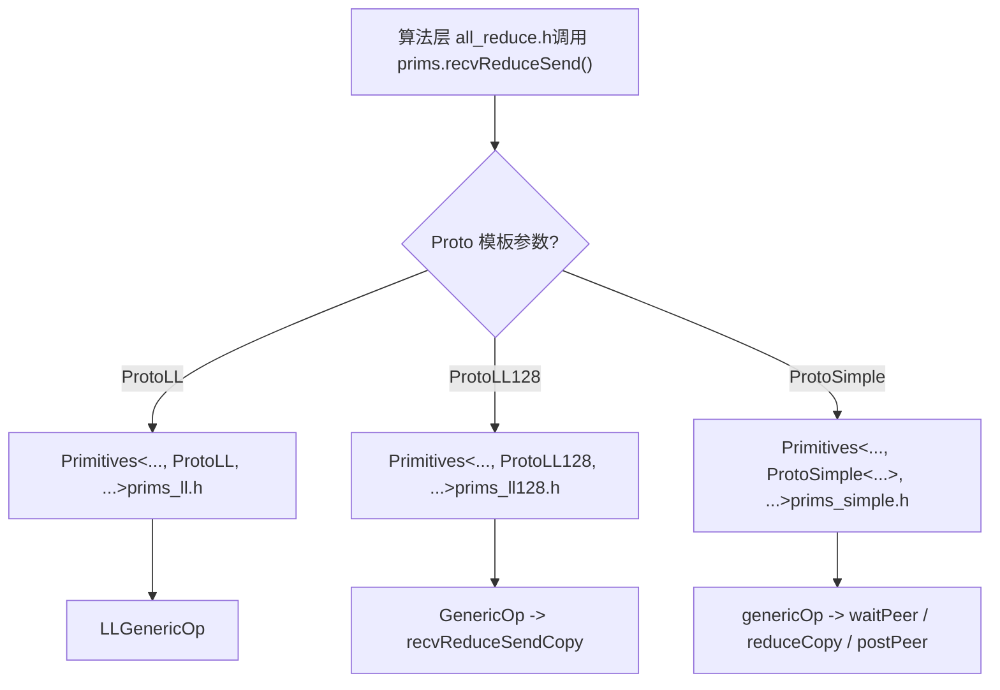
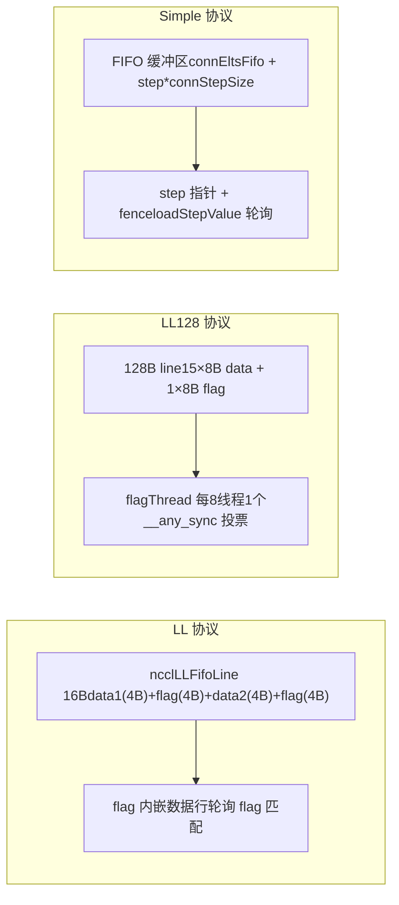

# 제 9 장: 디바이스 측 통신 원시 요소: LL, LL128, Simple 세 가지 프로토콜의 데이터 운반 구현

지난 장에서는 host 측이 하나의 AllReduce를 어떻게 __global__ kernel로 변환하는지 추적했고, device 측 진입점인 ncclKernelMain이 알고리즘과 프로토콜에 따라 분배를 수행하는 것을 확인했다. 그러나 분배는 도구를 선택했을 뿐이고, 실제 성능을 결정하는 것은 이 도구들이 데이터 이동을 어떻게 실행하는가이다. 이번 장에서는 src/device 아래의 세 가지 이동 프리미티브인 LL, LL128, Simple을 깊이 파고들어, 각각의 데이터 이동 구현을 하나씩 분석하고 서로 다른 프로토콜이 지연과 대역폭 사이에서 어떻게 절충하는지 이해한다.

# 왜 동일한 AllReduce에 세 가지 이동 프리미티브가 필요한가

먼저 직관적인 모델을 세워보자. 하나의 컨베이어 벨트 공장을 상상해보자. 원료(사용자 데이터)는 한쪽 끝에서 들어오고, 완제품은 다른 쪽 끝에서 나가며, 중간에 여러 공정(rank)이 서로 반제품을 교환해야 한다. 반제품을 운반하는 방식에는 세 가지가 있다:

- **LL（Low Latency）**: 두 사람이 마주 보고 쪽지를 건네는 것처럼, 건네는 동시에 상대방은 "이건 너에게 주는 것"이라는 것을 안다. 핸드셰이크 오버헤드가 거의 없다. 하지만 쪽지가 매우 작아서 한 번에 8바이트의 유효 데이터만 전달할 수 있다. 작은 메시지에 적합하다.
- **LL128**: 쪽지를 128바이트 메모지로 바꾸고, 한 번에 120바이트의 유효 데이터를 전달하지만, 메모지가 반드시 16바이트 정렬로 배치되어야 하며, 그렇지 않으면 먼저 공유 메모리에서 "재배치"해야 한다. 중간 크기 메시지에 적합하다.
- **Simple**: 택배함처럼, 먼저 소포를 함(FIFO 버퍼)에 넣고, 그다음 "N번 함에 물건이 있다"는 알림을 보낸다. 핸드셰이크 오버헤드가 크지만, 한 번에 많이 옮길 수 있다. 큰 메시지에 적합하다.

> **[Design Inference & Architectural Trade-offs]**
> 만약 프리미티브가 하나만 있다면 어떻게 될까? LL만 사용하면, 큰 메시지는 "모든 메시지마다 상대방의 flag 확인을 기다려야" 하므로 대역폭이 죽는다. Simple만 사용하면, 작은 메시지는 "FIFO 쓰기 + 알림 보내기 + 알림 기다리기"의 고정 오버헤드 때문에 지연이 폭발한다. NCCL의 성능 곡선이 8KB, 128KB 근처에서 뚜렷한 변곡점을 보이는 근본 원인이 바로 여기에 있다.

세 가지 프리미티브는 동일한 템플릿 골격을 공유한다`Primitives<T, RedOp, Fan, Direct, Proto, P2p, isNetOffload>`,`Proto`이 템플릿 파라미터를 통해 세 가지 버전으로 특화된다[FACT:src/device/primitives.h:117-117]。`ProtoLL`、`ProtoLL128`、`ProtoSimple`세 구조체는 각각 프로토콜 관련 상수와 계산 메서드를 가진다[FACT:src/device/primitives.h:25-75], 알고리즘 코드는`prims.send()`、`prims.recvReduceSend()`같은 통합 인터페이스만 호출하고, 저수준이 어떤 프로토콜인지 신경 쓰지 않는다.



이 그림은 "동일한 AllReduce 로직에 왜 세 가지 이동 프리미티브가 필요한가"를 설명한다: 알고리즘 계층은 프로토콜 독립적이고, 프로토콜 차이는`Primitives`의 세 가지 특화에 캡슐화된다.

# LL: flag를 데이터 행에 내장한 제로 핸드셰이크 이동

## 직관적 모델

LL의 핵심 사상은:**"데이터"와 "데이터가 준비되었는지"에 대한 표시를 동일한 16바이트 읽기/쓰기 단위에 집어넣는 것이다**. 수신 측은 별도의 "알림 메시지"가 필요 없고, 데이터 행의 flag 필드를 폴링하기만 하면 되며, flag가 일치하면 데이터가 도착한 것이다. 이는 편지를 보낼 때 "수신자 서명"을 봉투에 직접 인쇄하는 것과 같다. 우체부는 서명만 보면 배달해야 할지 알 수 있고, 별도의 수령증을 보낼 필요가 없다.

만약 이 설계가 없다면, 수신 측은 먼저 "데이터가 기록됨" 알림을 기다린 후 다시 데이터를 읽어야 하므로, 메모리 왕복이 두 번 발생하여 지연이 두 배가 된다.

## 데이터 구조와 메모리 레이아웃

LL의 이동 단위는`union ncclLLFifoLine`이며,`storeLL`의 어셈블리에서 그 레이아웃을 볼 수 있다[FACT:src/device/prims_ll.h:154-158]：

```
st.volatile.global.v4.u32 [%0], {%1,%2,%3,%4};
// 写入 4 个 u32：data1, flag, data2, flag
```

하나의`ncclLLFifoLine`은 16바이트이고, 배치는`[data1(4B) | flag(4B) | data2(4B) | flag(4B)]`이다. 유효 데이터는 8바이트(data1 + data2)뿐이고, 나머지 8바이트는 전부 flag이다. 이것이`ProtoLL::calcBytePerGrain()`가`sizeof(uint64_t)`을 반환하는 이유이다 — "One 16-byte line has 8-bytes of data"[FACT:src/device/primitives.h:55-57]。

핵심 필드(`Primitives`의 LL 특화)[FACT:src/device/prims_ll.h:20-42]：

| 필드 | 타입 | 역할 |
| --- | --- | --- |
| `recvStep[i]` / `sendStep[i]` | `uint64_t[MaxRecv/MaxSend]` | 각 peer의 스텝 카운트로, 버퍼 오프셋과 flag 값을 결정한다 |
| `recvBuff[i]` / `sendBuff[i]` | `ncclLLFifoLine*` | 각 peer의 FIFO 버퍼 기저 주소를 가리킨다 |
| `recvConnHeadPtr` | `volatile uint64_t*` | 수신 측 "몇 번째 스텝까지 소비했는지"의 전역 포인터 |
| `sendConnHeadPtr` | `volatile uint64_t*` | 송신 측 "상대방이 몇 번째 스텝까지 소비했는지"의 전역 포인터 |
| `sendConnHeadCache` | `uint64_t` | 마지막으로 읽은 head 값을 캐시하여 매번 전역 메모리를 읽지 않도록 한다 |

버퍼 오프셋은`recvOffset(i) = (recvStep[i] % NCCL_STEPS) * stepLines`으로 계산한다[FACT:src/device/prims_ll.h:44-46]，`NCCL_STEPS`은 링 버퍼의 슬롯 수이고,`stepLines`은 슬롯당 행 수이다. flag 값은`recvFlag(i) = NCCL_LL_FLAG(recvStep[i] + 1)`으로 계산한다[FACT:src/device/prims_ll.h:56-58],`+1`에 주의하라 — flag 초깃값이 0이므로, 첫 번째 스텝의 flag는 반드시 1이어야 "기록되지 않음"과 구분할 수 있다.

## 시나리오 기반 Walkthrough: 한 번의 recvReduceSend

rank 0이 Ring AllReduce에서`recvReduceSend`을 실행한다고 가정하자: 이전 rank로부터 데이터를 받고, 로컬 데이터와 reduce한 후, 다음 rank로 보낸다. 호출 체인은`recvReduceSend(inpIx, eltN)` → `LLGenericOp<1, 1, Input, -1>(inpIx, -1, eltN, false)` [FACT:src/device/prims_ll.h:403-405]。

**첫 번째 단계: 송신 버퍼가 사용 가능할 때까지 기다린다.** `waitSend`은`sendConnHeadCache + NCCL_STEPS < sendConnHead + 1` [FACT:src/device/prims_ll.h:73-89]을 검사한다. 의미는: 상대방의 소비 진행(head)이 나보다 너무 뒤처져 있으면 링 버퍼가 거의 가득 찼다는 뜻이므로 반드시 기다려야 한다.`NCCL_STEPS`은 버퍼의 총 슬롯 수이고,`sendConnHead + 1`은 내가 곧 차지할 슬롯이다. 기다리는 동안`*sendConnHeadPtr`을 폴링하여`checkAbort`캐시를 갱신하고, 주기적으로[FACT:src/device/prims_ll.h:73-89]。

**을 호출하여 abort되었는지 확인한다** `DataLoader::loadBegin`두 번째 단계: 로컬 데이터를 로드한다.[FACT:src/device/prims_ll.h:200-216]은 정렬 문제를 처리한다`sizeof(T) <= 2`.`u4[0..2]`일 때(예: half 또는 int8), 소스 주소가 4바이트 정렬이 아닐 수 있으므로, 먼저 4바이트 정렬로`misalign`에 읽어들이고,`loadFinish`을 기록한 후,`__funnelshift_r`에서[FACT:src/device/prims_ll.h:218-225]을 사용하여 바이트 수준 시프트로 올바른 64비트 값을 조립한다

**. 이것은 전형적인 "정렬 읽기 + 시프트 재조립" 기법으로, 비정렬 접근의 성능 페널티를 피한다.** `readLL`세 번째 단계: 상대방 데이터를 읽고 flag를 기다린다.[FACT:src/device/prims_ll.h:108-122]：

```cpp
do {
  asm volatile("ld.volatile.global.v4.u32 {%0,%1,%2,%3}, [%4];" ...);
  if (checkAbort(abort, 1, spins)) break;
} while ((flag1 != flag) || (flag2 != flag));
```

복사`ld.volatile.global.v4.u32`한 번에 16바이트(4개의 u32)를 읽고, 두 flag 필드가 모두 기대값과 일치하는지 확인한다.`volatile`키워드는 컴파일러가 이 읽기를 최적화로 제거하거나 레지스터에 캐시하지 않도록 보장한다——상대방이 언제든 새 데이터를 쓸 수 있기 때문이다. 두 flag가 모두 일치해야 하는 이유는, 쓰기 측이`storeLL`한 번에 4개의 u32를 쓰지만 이론적으로 두 번의 8바이트 쓰기로 쪼개질 수 있기 때문에, 두 flag가 모두 일치해야 16바이트가 완전하다는 것이 보장된다.

**네 번째 단계: reduce 후 전송.**peerData를 수신한 후,`applyReduce(redOp, peerData, data)`리듀스를 수행한다[FACT:src/device/prims_ll.h:279]. 그런 다음`storeLL(sendPtr(i) + offset, data, sendFlag(i))`결과를 송신 버퍼에 쓴다[FACT:src/device/prims_ll.h:295-296]. 전송 순서에 주의: 먼저`i=1..MaxSend`(보통 네트워크 peer)를 보내고, 마지막에`i=0`(보통 로컬 peer)를 보낸다[FACT:src/device/prims_ll.h:291-297]. 주석에 명확히 쓰여 있다: 「Send : inter-node, then intra-node, then local」——느린 것(네트워크)을 먼저 보내 백그라운드에서 날아가게 하고, 그다음 빠른 것(로컬)을 보내면 로컬 peer가 네트워크를 기다리지 않는다.

**다섯 번째 단계: step을 진행하고 post.** `incRecv(i)`수신 스텝을 증가시키고[FACT:src/device/prims_ll.h:91-93]，`postRecv()``recvConnHead`를 전역 포인터에 다시 쓴다[FACT:src/device/prims_ll.h:94-97], 상대방에게 「나는 이 단계를 소비했다」고 알린다. 송신 측`incSend`에는 특수 로직이 있다[FACT:src/device/prims_ll.h:99-106]：

```cpp
if ((sendStep[i] & NCCL_LL_CLEAN_MASK) == NCCL_LL_CLEAN_MASK) {
  for (int o = offset; o  *head) { ... }
}
```

sendrecv의 DirectRead 모드에서 송신자는 수신자가 데이터를 다 읽을 때까지 기다려야 반환할 수 있습니다. 수신자가 어떤 이유로 tail을 진행시키지 않으면 송신자는 데드락에 빠집니다. 이 대기는`barrier()`이후에 수행해야 합니다. 그렇지 않으면 post 스레드와 경쟁할 수 있습니다.

**함정 3:`roundUp`으로 인한 step 점프.** `loadRecvConn`과`loadSendConn`에 모두`step = roundUp(step, SlicePerChunk * StepPerSlice)` [FACT:src/device/prims_simple.h:486, 533]이 있습니다. 이는 step을 slice 경계에 정렬하지만, 이전 단계의 step이 정렬되지 않은 경우 건너뛴 슬롯이 올바르게 초기화되지 않을 수 있습니다. 코드는`loadRecvConn`에`*connStepPtr = step`를 추가하여 credit을 반환합니다[FACT:src/device/prims_simple.h:489]。

# 세 가지 프리미티브의 비교와 선택



| 차원 | LL | LL128 | Simple |
| --- | --- | --- | --- |
| 유효 페이로드 비율 | 50% | 93.75% | ~100% |
| 동기화 방식 | flag 내장, 폴링 | flagThread + warp 투표 | step 포인터 + fence |
| 정렬 요구사항 | 없음(시프트 재조립 있음) | 16 바이트 | 없음 |
| 적용 가능한 메시지 크기 | 작음(< 8KB) | 중간(8KB ~ 128KB) | 큼(> 128KB) |
| 버퍼 레이아웃 | `ncclLLFifoLine[]` | `uint64_t[]`128B line 기준 | `T[]` FIFO |
| Direct 지원 | 없음(`PrimitivesWithoutDirect`로 강등) | 없음(동일) | 완전 지원 |

LL과 LL128은 모두`PrimitivesWithoutDirect` [FACT:src/device/prims_ll.h:9-10, src/device/prims_ll128.h:13-14]를 상속받습니다. 이들의 버퍼 레이아웃이 상대방 메모리를 직접 읽고 쓰는 것을 지원하지 않기 때문입니다. Simple은 Direct 모드를 완전히 구현하여 P2P 직접 연결과 NVLS를 지원합니다.

# 설계 고찰

> **[Design Inference & Architectural Trade-offs]**
> **LL의 flag를 왜 두 번 반복할까?**GPU의 전역 메모리 쓰기는 원자성을 보장하지 않기 때문입니다.`storeLL`16 바이트를 쓸 때 하드웨어가 두 번의 8 바이트 쓰기로 나눌 수 있습니다. flag를 하나만 두면 수신자가 데이터가 절반만 쓰였는데도 준비되었다고 판단할 수 있습니다. 두 flag는 각각 16 바이트의 전반부와 후반부에 위치하여, 두 번의 쓰기가 모두 완료되어야 두 flag가 모두 일치합니다.

**Simple은 왜 warp 하나를 예약할까?** [FACT:src/device/prims_simple.h:625-626]주석에 「For send operations, we need an extra warp to overlap the threadfence and the copy」라고 되어 있습니다.`fence_acq_rel_sys()`은 비용이 큰 연산입니다. 모든 스레드가 fence 완료를 기다리면 많은 시간이 낭비됩니다. warp 하나를 fence 전용으로 예약하면 다른 warp는 다음 데이터 배치를 계속 옮길 수 있습니다.

> **[Design Inference & Architectural Trade-offs]**
> **LL128의 step 진행이 왜 recvReduceSendCopy가 아니라 GenericOp 끝에서 이루어질까?**LL128의 전송은 warp 단위이므로 여러 warp가 서로 다른 slice를 병렬로 처리할 수 있습니다.`recvReduceSendCopy`에서 step을 진행하면 각 warp가 한 번씩 진행시켜 step이 여러 번 진행됩니다.`GenericOp`끝에서 통합 진행하면 각 slice가 한 번만 진행됩니다.

# 이 장의 요약

이 장에서는 세 가지 전송 프리미티브의 구현을 깊이 살펴보았습니다:

1. **LL**: 16 바이트`ncclLLFifoLine`로 flag를 데이터 행에 내장하여, 수신자가 flag 일치를 폴링하면 데이터 준비를 확인할 수 있습니다. 유효 페이로드 50%, 작은 메시지에 적합합니다. 핵심은`readLL`의`ld.volatile.global.v4.u32`과`storeLL`의`st.volatile.global.v4.u32`。

2. **LL128**: flag를 128 바이트마다 마지막 8 바이트에 집중시켜 유효 페이로드를 93.75%로 높였습니다.`flagThread`(8 스레드당 1개)로 flag를 검사하고,`__any_sync`로 warp 투표를 합니다. 비정렬 시 공유 메모리 재배치를 거칩니다.

3. **Simple**: FIFO 버퍼 + step 포인터 알림으로 큰 메시지의 높은 처리량을 구현합니다.`flags`비트 플래그로 역할을 인코딩하고,`waitPeer`로 step을 폴링하며,`postPeer`로 step을 갱신하고 fence합니다. Direct 모드를 완전히 지원합니다.

세 프리미티브는 동일한 템플릿 골격을 공유하며,`Proto`템플릿 파라미터로 특수화됩니다. 알고리즘 계층은 통합 인터페이스만 호출하고 하위 프로토콜은 신경 쓰지 않습니다. 이것이 「동일한 AllReduce 로직에 왜 세 가지 전송 프리미티브가 필요한가」에 대한 답입니다: 메시지 크기마다 다른 동기화 전략과 버퍼 레이아웃이 필요하며, 세 프리미티브는 각각 작은, 중간, 큰 메시지에 최적화되어 있습니다.

# 이 장의 생각과 자가 점검

Q1: 만약`incSend`의 cleanup 로직([FACT:src/device/prims_ll.h:99-106])을 제거하면 어떤 시나리오에서 데이터 손상이 발생할까? 왜일까?

**참고 해설**: cleanup 로직은`sendStep[i] & NCCL_LL_CLEAN_MASK == NCCL_LL_CLEAN_MASK`시 slice의 모든 행을 현재 flag로 한 번씩 씁니다(데이터는 0으로 채움). 제거하면 step이`NCCL_LL_CLEAN_MASK`경계로 되돌아갈 때 일부 행의 flag가 이전 라운드 값일 수 있습니다. 이전 라운드의 flag가 이번 라운드 수신자가 기대하는 flag와 일치하면, 수신자는 데이터가 준비된 것으로 오인하여 이전 라운드의 잔여 데이터를 읽습니다. 이는 전형적인 ABA 문제입니다. 발생 조건은 장시간 실행(step이`NCCL_LL_CLEAN_MASK`주기를 초과) 중 flag가 정확히 같은 값으로 되돌아갈 때입니다. 이런 버그는 정확한 step 정렬이 필요하기 때문에 재현이 극히 어렵습니다.

Q2: Simple 프로토콜의 소멸자에서 NetRegMode下的 대기([FACT:src/device/prims_simple.h:794-804])와 DirectRead下的 대기([FACT:src/device/prims_simple.h:814-824])는 각각 무엇을 방지하는가? 둘 중 하나를 제거하면 고동시성 시나리오에서 무슨 일이 발생하는가?

**참고 해석**: NetRegMode는 proxy 스레드가`connFifo[prevStep].size`를 -1로 설정하는 것을 기다리며, 이는 NIC가 전송을 완료했음을 나타낸다. 이를 제거하면 다음 kernel이 NIC DMA가 읽고 있는 전송 버퍼를 덮어써서 NIC가 오염된 데이터를 읽을 수 있다. DirectRead는 수신자가 tail(`*tail > *head`)을 전진시키는 것을 기다리며, 이는 수신자가 직접 버퍼 읽기를 완료했음을 나타낸다. 이를 제거하면 송신자가 수신자가 아직 읽지 않은 상태에서 버퍼를 덮어써서 수신자가 이전 데이터 대신 새 데이터를 읽을 수 있다. 고동시성 시나리오에서 이 두 대기는 모두 필수적이며, 어느 하나라도 제거하면 데이터 경쟁이 발생한다. 차이점은 NetRegMode는 'NIC 읽기'를 방지하고, DirectRead는 '상대방 GPU 읽기'를 방지한다는 것이다.

Q3: LL128의`loadRegsBegin`가 비정렬 시 공유 메모리 재배열([FACT:src/device/prims_ll128.h:115-141])을 거치는데, 이 경로는 정렬 경로보다 얼마나 느린가? 왜 NCCL은 사용자 버퍼가 반드시 16바이트 정렬이어야 한다고 직접 요구하지 않는가?

**참고 해석**: 비정렬 경로는 세 단계가 추가된다: 공유 메모리 쓰기,`__syncwarp()`, 공유 메모리 읽기. 공유 메모리 대역폭은 높지만`__syncwarp()`는 동기화 지점으로, 모든 스레드가 쓰기를 완료할 때까지 warp를 차단한다. 대략적으로 비정렬 경로는 정렬 경로보다 20-40% 느리며, 구체적으로는 공유 메모리 bank 충돌 상황에 따라 다르다. NCCL이 정렬을 강제하지 않는 이유는 사용자가 임의 오프셋의 버퍼(예: tensor 슬라이스)를 전달할 수 있기 때문이며, 정렬을 강제하면 API의 유연성이 제한된다. NCCL의 전략은 '정렬 시 빠른 경로, 비정렬 시 느린 경로지만 정확성 보장'이다. 프로덕션 환경에서는 사용자가 가능한 한 16바이트 정렬로 버퍼를 할당하여 빠른 경로를 타도록 권장한다.

여기까지 우리는 LL, LL128, Simple 세 가지 원시의 데이터 전송 메커니즘을 파악했으며, 이들은 상위 알고리즘에 유연한 성능 조절 수단을 제공한다. 다음 장에서는 집합 통신 알고리즘 커널을 깊이 살펴보며, AllReduce, AllGather, ReduceScatter 등이 이러한 원시를 어떻게 호출하는지, 그리고 Ring, Tree, CollNet 등의 알고리즘이 데이터 흐름을 어떻게 조직하여 최종적으로 종단 간 집합 통신을 완성하는지 알아본다.
