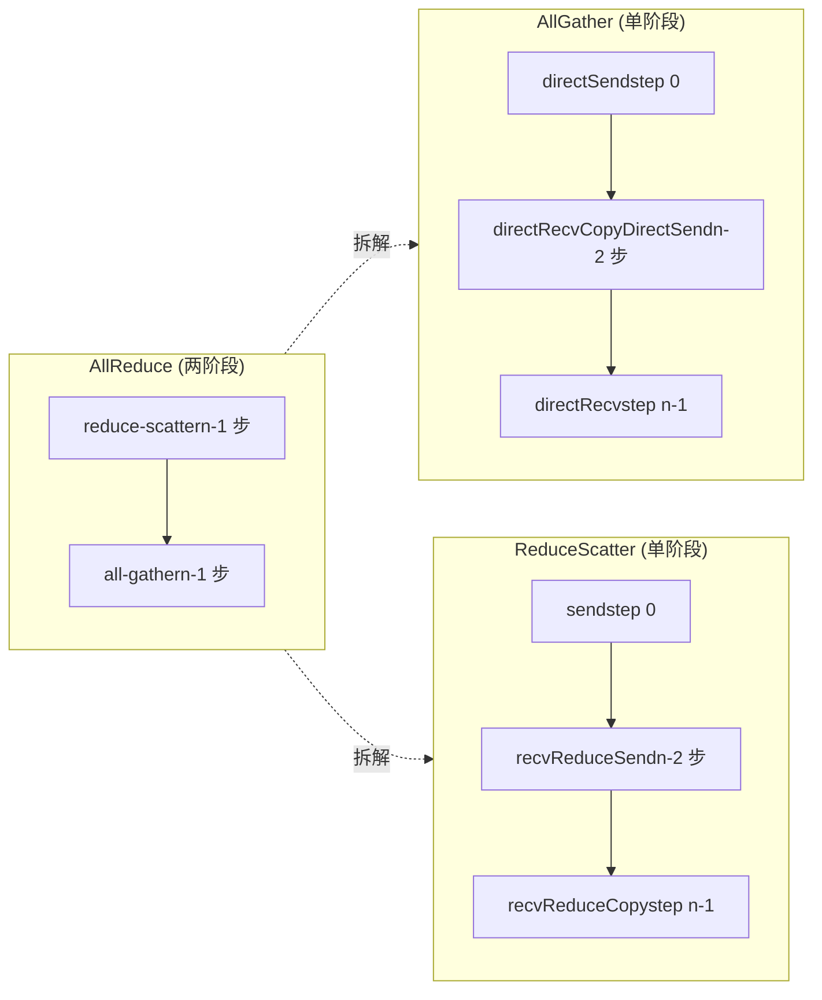
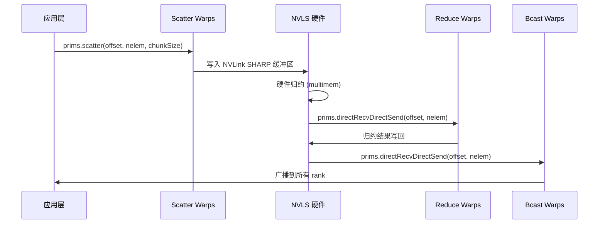

# 제 10 장: 집합 통신 알고리즘 커널: AllReduce, AllGather, ReduceScatter의 디바이스 측 구현

이전 장에서는 LL, LL128, Simple 세 가지 프로토콜 원시를 분석했는데, 이들은 데이터 전송의 '엔진'이지만 엔진 자체는 무엇을, 어디로, 어떤 순서로 옮길지 모른다. 이번 장에서 살펴볼 src/device 아래의 알고리즘 커널 파일들은 '변속기'로, AllReduce, AllGather, ReduceScatter 같은 집합 통신 의미를 prims.directSend, prims.directRecvReduceDirectSend 같은 원시 호출의 연속으로 번역한다. 한 문장으로 이번 장의 핵심 모순을 요약하면: 동일한 AllReduce에 왜 Ring, Tree, CollNet, NVLS 네 가지 완전히 다른 디바이스 측 구현이 필요한가? 답은 '데이터 흐름 토폴로지'와 '하드웨어 능력'의 매칭에 숨어 있다. Ring은 최소한의 네트워크 대역폭으로 2단계 파이프라인을 수행하고, Tree는 트리형 리덕션으로 지연을 log(n)까지 압축하며, CollNet/NVLS는 리덕션을 NIC나 NVLink 스위치에 오프로드한다. 이번 장에서 하나씩 풀어본다.

# 10.1 Ring AllReduce: 2단계 파이프라인이 kernel 내에서 어떻게 구현되는가

## 직관적 모델: 링 컨베이어 벨트 위의 '릴레이 경주'

n명의 작업자가 원형으로 서 있고, 각자 원료 상자를 하나씩 들고 있다고 상상하자. AllReduce의 목표는 모든 사람이 최종적으로 '모든 원료가 혼합된 완성품'을 받는 것이다. Ring 알고리즘의 방식은 두 단계로 나뉜다: 첫 번째 단계(reduce-scatter)에서는 각자가 상자를 링을 따라 전달하고, 한 역을 지날 때마다 자신의 원료를 혼합하여 n-1 역을 돈 후 각자 손에 정확히 '완전 혼합'된 완성품 한 부를 갖게 되지만, 1/n의 몫만 가진다; 두 번째 단계(all-gather)에서는 이 완성품 몫들이 다시 링을 따라 한 바퀴 돌아 각자가 모든 몫을 채운다.

Ring이 없다면 가장 순진한 방법은 각 rank가 데이터를 root에 보내고, root가 리덕션 후 브로드캐스트하는 것이다——root의 네트워크 대역폭이 병목이 되어 n이 클수록 느려진다. Ring의 정묘함은:**각 rank의 송신량과 수신량은 모두 2(n-1)/n배의 데이터량이며, n과 무관하게 모든 링크에 균등하게 분산된다**。

## 데이터 구조와 메모리 레이아웃

Ring 알고리즘의 핵심 상태는`ncclRing`구조에 있으며(device.h에 정의됨, 이 장에서는 다루지 않음),`runRing`그중 두 개의 필드만 사용한다:

- `ring->index`: 링에서 본 rank의 논리적 위치로, "j번째 단계에서 어떤 chunk를 처리해야 하는가"를 계산하는 데 사용된다.
- `ring->prev` / `ring->next`: 전임 및 후임 rank 번호로,`Primitives`생성자의 recv/send peer 파라미터로 사용된다.

핵심적인 분할 파라미터는`ncclCollCbdPart`에 의해 계산된다([FACT:src/device/all_reduce.h:21-22]）：

```
ncclCollCbdPart(work, ncclShmem.channelId, Proto::Id, sizeof(T), (ssize_t*)nullptr, &gridOffset, &channelCount, &chunkCount);
```

이 함수는 전체 통신 도메인의 데이터를 channel별로 분할하고 세 가지 값을 출력한다:`gridOffset`(본 channel이 담당하는 데이터의 전체 buffer 내 시작 오프셋),`channelCount`(본 channel이 담당하는 총 요소 수),`chunkCount`(각 rank에 할당되는 chunk 요소 수).`chunkCount`은 Ring 알고리즘의 입도(granularity)이다 — 매 단계마다 하나의 chunk를 전송한다.

`loopCount = nranks * chunkCount`（[FACT:src/device/all_reduce.h:23])는 "한 바퀴 전체를 도는" 처리 데이터량을 나타낸다. 외부 루프`for (elemOffset = 0; elemOffset < channelCount; elemOffset += loopCount)`（[FACT:src/device/all_reduce.h:34])는 다음을 의미한다: channel 데이터량이 한 바퀴로 처리할 수 있는 양을 초과하면 여러 바퀴로 나누어 실행한다.

## 단계별 분석: Ring AllReduce의 전체 호출 흐름

시나리오 대입: 4개의 rank(nranks=4), 본 rank의`ringIx=0`，`chunkCount=100`，`channelCount=400`(정확히 한 바퀴).

**0단계: "자신의 chunk"를 다음 GPU로 전송**（[FACT:src/device/all_reduce.h:42-47]）

```
chunk = modRanks(ringIx + nranks - 1);   // = 3
chunkOffset = chunk * chunkCount;         // = 300
offset = gridOffset + elemOffset + chunkOffset;
nelem = min(chunkCount, remCount - chunkOffset);
prims.directSend(offset, offset, nelem);
```

`modRanks`은 lambda로, nranks에 대한 모듈로 뺄셈을 수행한다([FACT:src/device/all_reduce.h:40]）。`ringIx + nranks - 1`은 "본 rank의 이전 chunk 번호"를 나타낸다. 왜 0단계에서 chunk 3을 보내는가? Ring의 reduce-scatter 단계에서 각 rank는 먼저 자신이 "보유해서는 안 되는" 데이터(즉 전임 rank의 chunk)를 전송하기 때문이다.`directSend`은 송신만 하고 수신하지 않는다. 이 시점에는 아직 어떤 데이터도 받지 못했기 때문이다.

**1단계부터 nranks-2단계까지: 수신하면서 리듀스하고 전달**（[FACT:src/device/all_reduce.h:50-56]）

```
for (int j = 2; j 计算 chunkCount/loopCount"] --> loop{"elemOffset |否| done["返回"]
    loop -->|是| s0["step 0: directSendchunk = ringIx-1"]
    s0 --> mid{"j 从 2 到 nranks-1?"}
    mid -->|是| s1["directRecvReduceDirectSendchunk = ringIx-j"]
    s1 --> mid
    mid -->|否| s2["step nranks-1directRecvReduceCopyDirectSendpostOp=true"]
    s2 --> ag{"j 从 1 到 nranks-2?"}
    ag -->|是| s3["directRecvCopyDirectSend纯转发"]
    s3 --> ag
    ag -->|否| s4["directRecv收最后一块"]
    s4 --> loop
```

## 설계 고찰: 왜 Ring의 chunk 순서는 "거꾸로 가는"가

chunk 번호의 규칙에 주목하라: 0단계에서`ringIx-1`을 보내고, j단계에서`ringIx-j`을 처리하며, 마지막 단계에서`ringIx+0`을 처리한다. 이것은**반시계 방향**진행이다. 왜인가? Ring의 각 rank는 "자신이 리듀스를 담당하는 chunk"(즉`ringIx+0`)만 보유하고, 나머지 chunk는 모두 지나가기 때문이다. 반시계 방향 진행은 다음을 보장한다: 어떤 chunk가 한 바퀴를 돌아 시작점으로 돌아왔을 때, 정확히 nranks번의 리듀스가 완료되어 최종 결과가 생성된다. 만약 시계 방향으로 진행하면, chunk는 잘못된 rank에서 리듀스가 완료된다.

## 프로덕션 함정:`remCount < loopCount`일 때의 정렬 트랩

[FACT:src/device/all_reduce.h:38]에는 간과하기 쉬운 코드 한 줄이 있다:

```
if (remCount = 256) nthreadsSplit += 64;
} else {
  nthreadsSplit = (nthreads * 7 / (10 * WARP_SIZE)) * WARP_SIZE;
}
```

Simple 프로토콜은 반반으로 나누고, LL/LL128 프로토콜은 7:3으로 나누는데, 이는 「3개의 소스에서 데이터를 받아 reduce하는 것」이 「3개의 대상에게 보내는 것」보다 계산 집약적이기 때문에 reduce 그룹에 더 많은 스레드를 할당한다.

그런 다음`tid < nthreadsSplit`의 스레드는 reduce 상향 전파([FACT:src/device/all_reduce.h:175-202])를, 나머지 스레드는 broadcast 하향 전파([FACT:src/device/all_reduce.h:203-224])를 수행한다. 두 그룹은`Proto::MaxGroupWidth`오프셋으로 각자의 통신 그룹([FACT:src/device/all_reduce.h:189]의`0 * Proto::MaxGroupWidth`과[FACT:src/device/all_reduce.h:210]의`1 * Proto::MaxGroupWidth`）。

## 설계 사고: Tree의 루트 노드를 왜 특별 처리해야 하는가

트리 reduce의 루트 노드는 「집결점」으로, 수신량이 자식 노드 수의 배수이고 송신량은 0이다(reduce 단계). 만약 루트 노드도 일반적인`directRecvReduceDirectSend`를 따르면`tree->up`(-1)로 보내려고 시도하여 범위를 벗어난다. 따라서 반드시`if (tree->up == -1)`분기로 별도 처리해야 한다. 마찬가지로 리프 노드의`tree->down[0] == -1`판단도 마찬가지다.

## 프로덕션 함정: Tree 알고리즘의 「핫스팟 루트」 문제

Tree의 루트 노드는 모든 reduce 트래픽을 담당하는데, 만약 루트 노드가 위치한 GPU가 마침 느린 노드라면(예: PCIe 대역폭 제한), 전체 AllReduce가 느려진다. NCCL의 대응은:**각 channel이 서로 다른 루트를 선택**하여 루트 노드의 부하를 여러 rank에 분산시키는 것이다. 이것이`runTreeSplit`에서 루트 노드 분기가`FanSymmetric<NCCL_MAX_TREE_ARITY_TOP>`（[FACT:src/device/all_reduce.h:168])를 사용하는 이유다 — 동시에 여러 자식 노드의 reduce를 처리해야 하기 때문이다. 프로덕션 환경에서 Tree AllReduce 성능이 불균일하다면 channel의 루트 노드 분포가 균일한지 확인하라.

# 10.3 AllGather와 ReduceScatter: Ring의 「절반」 변형

## 직관적 모델: AllReduce를 둘로 쪼개기

AllGather와 ReduceScatter는 본질적으로 AllReduce의 두 단계를 각각 독립 API로 만든 것이다. AllGather는 「수집」만 수행한다 — 각 rank가 데이터를 하나씩 기여하고, 최종적으로 모든 사람이 전체 데이터를 받는다. ReduceScatter는 「reduce+분산」만 수행한다 — 모든 사람이 데이터를 기여하고, reduce 후 각자 한 조각을 받는다.

이 두 독립 API가 없다면, 사용자가 「먼저 reduce 후 수집」 또는 「먼저 수집 후 reduce」를 할 때 AllReduce를 호출한 뒤 수동으로 슬라이스해야 하므로 대역폭의 절반을 낭비한다.

## AllGather의 Ring 구현

`all_gather.h`의`runRing`（[FACT:src/device/all_gather.h:14-88])는 AllReduce보다 간단하다: reduce 없이 복사-전달만 한다.

**0단계: 자신의 데이터를 다음 GPU로 푸시**（[FACT:src/device/all_gather.h:51-60]）

```
rankDest = ringRanks[0];
offset = dataOffset + rankDest * count;
if ((inputBuf + dataOffset == outputBuf + offset) || isNetOffload) {
  prims.directSend(dataOffset, offset, nelem);
} else {
  prims.directCopySend(dataOffset, offset, nelem);
}
```

여기에 in-place 판단이 있다: 만약`inputBuf + dataOffset == outputBuf + offset`이면 입력과 출력이 같은 메모리(in-place AllGather)이므로 직접`directSend`하고, 그렇지 않으면`directCopySend`해야 한다(먼저 출력으로 복사한 후 전송).

**중간 nranks-2 단계: 순수 전달**（[FACT:src/device/all_gather.h:62-67]）

```
prims.directRecvCopyDirectSend(offset, offset, nelem);
```

**마지막 단계: 마지막 조각 받기**（[FACT:src/device/all_gather.h:69-74]）

```
prims.directRecv(offset, nelem);
```

## isNetOffload: 단일 warp로 네트워크 구동 + 다중 warp 병렬 복사

[FACT:src/device/all_gather.h:28-36]에 특수 분기가 있다:

```
if (isNetOffload) {
  workNthreads = WARP_SIZE;
  chunkCount = NCCL_MAX_NET_SIZE;
} else {
  workNthreads = nthreads;
}
```

만약`isNetOffload=true`(단일 RPN + 네트워크 등록 모드)이면, 1개의 warp만 Ring 통신을 구동하고 나머지 warp는 병렬로 「소스 데이터를 대상 buffer로 복사」([FACT:src/device/all_gather.h:76-82])한다. 이는 비 in-place AllGather 시 복사 오버헤드와 통신 오버헤드를 오버랩하기 위함이다.

마지막에`barrier_sync(14, nthreads)`（[FACT:src/device/all_gather.h:87])가 있는데, 주석에 명확히 설명되어 있다: 모든 warp가 완료될 때까지 기다려야 하며, 그렇지 않으면 다음 work가 outputBuf를 재사용하여 경쟁이 발생할 수 있다. barrier 14를 사용하는 것은 prims 자체의 barrier와`__syncthreads()`。

## ReduceScatter의 Ring 구현

`reduce_scatter.h`의`runRing`（[FACT:src/device/reduce_scatter.h:14-56])는 AllReduce의 reduce-scatter 단계를 별도로 추출한 것이다:

**0단계: 자신의 데이터를 다음 GPU로 푸시**（[FACT:src/device/reduce_scatter.h:39-42]）

```
rankDest = ringRanks[nranks - 1];
offset = dataOffset + rankDest * count;
prims.send(offset, nelem);
```

**중간 nranks-2 단계: 받으면서 reduce하고 전달**（[FACT:src/device/reduce_scatter.h:44-49]）

```
prims.recvReduceSend(offset, nelem);
```

**마지막 단계: 받아서 reduce하여 최종 결과 생성**（[FACT:src/device/reduce_scatter.h:61-64]）

```
prims.recvReduceCopy(offset, dataOffset, nelem, /*postOp=*/true);
```

마지막 단계의`recvReduceCopy`두 개의 offset이 있습니다:`offset`(수신 소스)와`dataOffset`(로컬 입력), 리덕션 결과는`dataOffset`。

## 데이터 흐름 비교 다이어그램



## 프로덕션 함정: in-place 판단의 경계

[FACT:src/device/all_gather.h:55]의 in-place 판단`inputBuf + dataOffset == outputBuf + offset`은 포인터가 정확히 일치하는지에 의존합니다. 사용자가 전달한 sendbuff와 recvbuff가 오프셋이 있지만 논리적으로 같은 메모리 블록인 경우, 이 판단이 무효화되어`directCopySend`경로를 타게 됩니다 — 올바르지만 복사가 한 번 더 발생합니다. 프로덕션 환경에서는 in-place AllGather 시 sendbuff와 recvbuff가 완전히 일치하는지 확인하는 것이 좋습니다.

# 10.4 CollNet과 NVLS: 리덕션을 하드웨어로 오프로드

## 직관적 모델: '스위치'가 계산을 돕게 하기

Ring과 Tree는 모두 'GPU가 직접 리덕션을 계산'합니다. CollNet과 NVLS는 다른 접근을 취합니다: 리덕션 연산을 NIC(CollNet) 또는 NVLink 스위치(NVLS)로 오프로드합니다. GPU는 데이터를 보내기만 하고, 하드웨어가 리덕션을 완료한 후 다시 브로드캐스트합니다. 이는 '각 작업자가 직접 원료를 혼합'하는 것에서 '원료를 중앙 믹서로 보내고, 믹서가 혼합한 후 분배'하는 것으로 바뀌는 것과 같습니다.

하드웨어 오프로드가 없으면 리덕션 연산이 GPU의 SM 리소스를 차지하고, 리덕션 지연을 숨길 수 없습니다.

## CollNet Direct의 스레드 분담

`RunWorkColl<ncclFuncAllReduce, ..., NCCL_ALGO_COLLNET_DIRECT, ...>`의`run`（[FACT:src/device/all_reduce.h:249-386])는 스레드를 네 그룹으로 나눕니다:

```
const int nThreadsScatter = WARP_SIZE + ((hasUp && hasDn) ? COLLNET_COPY_THREADS : ...);
const int nThreadsGather = ((hasUp && hasDn) ? COLLNET_COPY_THREADS : ...);
const int nThreadsBcast = WARP_SIZE + ((hasUp && hasDn) ? COLLNET_COPY_THREADS : ...);
const int nThreadsReduce = work->nWarps * WARP_SIZE - nThreadsScatter - nThreadsGather - nThreadsBcast;
```

네 그룹의 스레드는 각각 Scatter(데이터를 각 rail로 분산), Reduce(리덕션 후 네트워크로 전송), Gather(각 rail에서 수집), Bcast(네트워크에서 수신 후 브로드캐스트)를 담당합니다.`COLLNET_COPY_THREADS = 96`（[FACT:src/device/all_reduce.h:250])는 고정된 복사 스레드 수입니다.

## netRegUsed: 네트워크 등록 모드의 버퍼 레이아웃

[FACT:src/device/all_reduce.h:280-288]에는 중요한 분기가 있습니다:

```
if (work->netRegUsed) {
  offsetBase = bid * chunkSize;
  maxNelems = size;
  peerOffset = nChannels * chunkSize;
} else {
  offsetBase = bid * direct->nHeads * chunkSize;
  maxNelems = direct->nHeads * chunkSize;
  peerOffset = chunkSize;
}
```

`netRegUsed`모드에서는 버퍼가 channel별로 연속 배치되며(`bid * chunkSize`), peer 오프셋은`nChannels * chunkSize`; 비등록 모드에서는 head별로 배치되며(`bid * nHeads * chunkSize`), peer 오프셋은`chunkSize`. 이 차이는 네트워크 등록 모드가 NIC DMA를 위해 버퍼가 연속적일 것을 요구하기 때문입니다.

## NVLS의 warp 할당

`RunWorkColl<ncclFuncAllReduce, ..., NCCL_ALGO_NVLS, ...>`의`run`（[FACT:src/device/all_reduce.h:391-523])는 더 세밀한 warp 할당을 사용합니다:

```
const int bcastWarps = hasOut ? (work->regUsed ? ((totalWarps - 2) >> 1) - 1 : 2) : 0;
const int reduceWarps = work->regUsed ? (totalWarps - bcastWarps - 2) : (hasOut ? 3 : nranks regUsed ? 1 : (totalWarps - reduceWarps - bcastWarps + 1) >> 1;
const int gatherWarps = work->regUsed ? 1 : (totalWarps - reduceWarps - bcastWarps) >> 1;
```

`regUsed`모드에서는 scatter/gather가 각각 1 warp만 차지하고(NVLS 하드웨어가 등록 메모리를 직접 조작하므로), reduce가 대부분을 차지합니다; 비등록 모드에서는 scatter/gather가 각각 약 절반을 차지하고, reduce는 rank 수에 따라 조정됩니다(≤6이면 7 warp, 그렇지 않으면 5 warp).

## 타이밍 상호작용 다이어그램



## 프로덕션 함정: CollNet의`direct->out == -1`함정

[FACT:src/device/reduce_scatter.h:521]에는 한 줄이 있습니다:

```
if (direct->out == -1) __trap();
```

CollNet의 out 연결이 설정되지 않은 경우(-1), 바로`__trap()`하면 kernel이 크래시됩니다. 이는 방어적 프로그래밍입니다 — CollNet은 NIC에 의존하므로, NIC 초기화가 실패하면 out이 -1이 되고, 이때 계속 실행하면 정의되지 않은 동작이 발생합니다. 프로덕션 환경에서 kernel trap이 발생하면 CollNet NIC가 정상적으로 초기화되었는지 확인하세요.

# 10.5 Broadcast와 Reduce: 가장 단순한 두 집합 연산

## Broadcast: root에서 팬아웃

`broadcast.h`의`runRing`（[FACT:src/device/broadcast.h:14-64]) 로직은 매우 직접적입니다: root 노드가 데이터를 보내고, 다른 노드가 전달하며, 마지막 노드는 받기만 합니다.

```
if (rank == root) {
  if (inputBuf == outputBuf || isNetOffload) {
    prims.directSend(offset, offset, nelem);
  } else {
    prims.directCopySend(offset, offset, nelem);
  }
} else if (nextRank == root) {
  prims.directRecv(offset, nelem);
} else {
  prims.directRecvCopyDirectSend(offset, offset, nelem);
}
```

세 가지 분기: root 전송, root의 전임자 수신, 중간 노드 전달. 주목할 점은`nextRank == root`이 '이 노드의 다음이 root'인지 판단한다는 것입니다. 즉, 이 노드가 링의 마지막이며 — 받기만 하고 보내지 않습니다.

## Reduce: root로 수렴

`reduce.h`의`runRing`（[FACT:src/device/reduce.h:14-53])는 Broadcast의 역연산입니다:

```
if (prevRank == root) {
  prims.send(offset, nelem);
} else if (rank == root) {
  prims.recvReduceCopy(offset, offset, nelem, /*postOp=*/true);
} else {
  prims.recvReduceSend(offset, nelem);
}
```

`prevRank == root`의 노드는 보내기만 하고(root의 전임자), root는 받아서 리덕션만 하며, 중간 노드는 받으면서 리덕션하고 전달합니다.

## 설계 고찰: 왜 Broadcast/Reduce도 Ring을 사용하는가

Broadcast와 Reduce는 이론적으로 Tree로 더 낮은 지연을 구현할 수 있지만, NCCL이 Ring을 선택한 이유는:**이 두 연산의 데이터량이 일반적으로 적고, Ring 구현이 더 단순하며, AllReduce의 Ring 코드 경로를 재사용할 수 있기 때문입니다**. Tree의 복잡성(루트 노드 선택, 스레드 분할)은 소규모 메시지 시나리오에서 이점이 뚜렷하지 않습니다.

## 프로덕션 함정: Broadcast의 root 노드 대역폭 병목

Broadcast의 root 노드는 모든 데이터를 전송해야 하므로, root가 느린 노드라면 전체 Broadcast가 지연됩니다. NCCL의 대응은:**Broadcast도 다중 channel을 지원하며, 각 channel의 root가 다를 수 있습니다**. 하지만 주의할 점은`work->root`이 전역적이어서 모든 channel이 동일한 root를 공유한다는 것입니다 — 이는 Broadcast의 의미론(소스가 하나뿐)에 의해 결정됩니다. 프로덕션 환경에서 Broadcast가 느리면 root 노드의 네트워크 대역폭을 확인하세요.

# 10.6 알고리즘 선택 매트릭스: RunWorkColl 템플릿 특수화

모든 알고리즘 커널은`RunWorkColl`템플릿 특수화로 등록됩니다([FACT:src/device/all_reduce.h:228-788]). 각 특수화는 '함수 × 알고리즘 × 프로토콜'의 조합에 대응합니다:

| 함수 | 알고리즘 | 프로토콜 | 특수화 위치 |
| --- | --- | --- | --- |
| AllReduce | RING | SIMPLE | [FACT:src/device/all_reduce.h:230-233] |
| AllReduce | TREE | SIMPLE | [FACT:src/device/all_reduce.h:238-244] |
| AllReduce | COLLNET_DIRECT | SIMPLE | [FACT:src/device/all_reduce.h:249-386] |
| AllReduce | NVLS | SIMPLE | [FACT:src/device/all_reduce.h:391-523] |
| AllReduce | NVLS_TREE | SIMPLE | [FACT:src/device/all_reduce.h:528-634] |
| AllReduce | COLLNET_CHAIN | SIMPLE | [FACT:src/device/all_reduce.h:639-759] |
| AllReduce | RING | LL | [FACT:src/device/all_reduce.h:764-766] |
| AllReduce | TREE | LL | [FACT:src/device/all_reduce.h:771-773] |
| AllReduce | RING | LL128 | [FACT:src/device/all_reduce.h:778-780] |
| AllReduce | TREE | LL128 | [FACT:src/device/all_reduce.h:785-787] |

주의:**CollNet과 NVLS는 SIMPLE 프로토콜만 지원한다**. 이 두 알고리즘은 하드웨어 오프로드에 의존하는데, LL/LL128의 저지연 동기화 메커니즘은 하드웨어 오프로드와 호환되지 않기 때문이다——하드웨어 리덕션의 지연은 LL의 flag 폴링보다 훨씬 크므로, LL을 쓰면 오히려 오버헤드가 증가한다.

## 프로토콜 선택의 내재적 논리

- **LL**: 작은 메시지(< 8KB), 저지연 우선. Ring과 Tree 모두 지원.
- **LL128**: 중간 메시지(8KB - 1MB), 128바이트 정렬. Ring과 Tree 모두 지원.
- **SIMPLE**: 큰 메시지(> 1MB), 대역폭 우선. 모든 알고리즘이 지원.

## 프로덕션 함정: 프로토콜과 알고리즘의 조합 제한

만약 사용자가 강제로`NCCL_PROTO=LL`를 지정했지만 알고리즘이 CollNet이라면, NCCL은 tuning 단계에서 SIMPLE로 폴백한다. 프로덕션 환경에서 프로토콜 설정이 적용되지 않는다면, 알고리즘이 해당 프로토콜을 지원하는지 확인하라.

# 설계 사고: 왜 동일한 AllReduce 로직에 이렇게 많은 구현이 필요한가

이 장을 돌아보면, AllReduce에는 Ring, Tree, CollNet Direct, CollNet Chain, NVLS, NVLS Tree 여섯 가지 알고리즘 구현이 있다. 이는 중복이 아니라**서로 다른 하드웨어 토폴로지와 메시지 크기에 대한 최적해**：

- **Ring**: 범용, 큰 메시지에 적합, 대역폭 활용률 최고.
- **Tree**: 대규모 클러스터에 적합, 지연 O(log n).
- **CollNet**: 리덕션을 지원하는 NIC가 있는 클러스터에 적합, GPU 계산을 오프로드.
- **NVLS**: 단일 노드 NVLink 전연결에 적합, 하드웨어 멀티캐스트 리덕션.

NCCL의 tuning 모듈(제5장)은 메시지 크기, rank 수, 토폴로지에 따라 자동으로 선택한다. 디바이스 측 구현은 「각 조합이 모두 정확함」만 보장하면 되고, 선택 로직은 host 측에 있다.

# 이 장 요약

이 장에서는`src/device`아래의 여섯 가지 알고리즘 커널 파일을 분석했다:

1. **Ring AllReduce**（[FACT:src/device/all_reduce.h:14-83]): 2단계 파이프라인, reduce-scatter + all-gather, 각 단계당 n-1 스텝.

2. **Tree AllReduce**（[FACT:src/device/all_reduce.h:86-225]): 트리형 리덕션, 지연 O(log n),`runTreeSplit`스레드 분할로 리덕션-브로드캐스트 파이프라인을 구현.

3. **AllGather**（[FACT:src/device/all_gather.h:14-88]): Ring 단일 단계, in-place와 netOffload 지원.

4. **ReduceScatter**（[FACT:src/device/reduce_scatter.h:14-56]): Ring 단일 단계, AllReduce의 reduce-scatter 단계.

5. **Broadcast/Reduce**（[FACT:src/device/broadcast.h:14-64]、[FACT:src/device/reduce.h:14-53]): 가장 단순한 Ring 변형.

6. **CollNet/NVLS**（[FACT:src/device/all_reduce.h:247-635]): 하드웨어 오프로드, SIMPLE 프로토콜만 지원.

# 이 장 사고와 자가 점검

Q1: Ring AllReduce의 reduce-scatter 단계에서, 0번째 스텝은`directSend`를 사용하고, 중간 스텝은`directRecvReduceDirectSend`를 사용하며, 마지막 스텝은`directRecvReduceCopyDirectSend`를 사용한다. 만약 마지막 스텝의`postOp=true`를 제거하면, 어떤 시나리오에서 잘못된 결과가 발생하는가?

**참고 해석**：`postOp=true`가 트리거되어 후처리 연산(예: 평균 계산 시 나눗셈)을 수행한다.`ncclAvg`를 예로 들면, 리덕션은 합산이고 postOp는 nranks로 나누는 것이다. 만약`postOp`를 제거하면, 마지막 스텝은 리덕션만 하고 나눗셈을 하지 않으므로 recvbuff에는 「합」이 아닌 「평균」이 저장된다. reduce-scatter 단계에서 각 rank는 하나의 chunk에 대한 최종 결과만 보유하는데, 이 chunk는 정확히`ringIx+0`（[FACT:src/device/all_reduce.h:60])이다. 만약 postOp가 누락되면, 이 chunk의 합은 nranks로 나뉘지 않고, 이후 all-gather 단계에서 이 잘못된 「합」이 모든 rank에 전파된다. 주의: 마지막 스텝만 postOp가 필요한데, 이 스텝만 「완전한 리덕션」 결과를 생성하기 때문이다; 중간 스텝의 리덕션은 부분합이므로 postOp가 필요 없다. 프로덕션 환경에서 AllReduce 결과가 nranks배만큼 크게 나온다면, postOp가 올바르게 전달되었는지 확인하라.

Q2: `runTreeSplit`LL/LL128 프로토콜에서 스레드를 7:3으로 분할하고([FACT:src/device/all_reduce.h:163]), Simple 프로토콜에서는 1:1로 분할한다([FACT:src/device/all_reduce.h:157]). 만약 LL 프로토콜도 강제로 1:1로 바꾸면, 무슨 일이 발생하는가?

**참고 해석**: LL/LL128의 리덕션 그룹은 최대 3개의 자식 노드로부터 데이터를 받아 리덕션해야 하며([FACT:src/device/all_reduce.h:187]의`FanAsymmetric<NCCL_MAX_TREE_ARITY, 1>`), 계산 집약적이다; 브로드캐스트 그룹은 복사-전달만 하며([FACT:src/device/all_reduce.h:208]의`FanAsymmetric<1, NCCL_MAX_TREE_ARITY>`), 계산이 가볍다. 7:3 분할은 리덕션 그룹이 3-way 리덕션을 처리할 충분한 스레드를 갖게 하고, 브로드캐스트 그룹은 스레드가 적지만 충분하다. 만약 1:1로 바꾸면, 리덕션 그룹의 스레드가 부족해져 리덕션이 병목이 된다; 브로드캐스트 그룹은 스레드가 과잉되어 낭비된다. 더 심각한 것은, LL 프로토콜의 flag 폴링이 바쁜 대기(busy-wait)이므로, 스레드가 많아지면 flag 경쟁이 증가한다. 프로덕션 환경에서 Tree AllReduce가 LL 프로토콜에서 성능 이상을 보인다면,`nthreadsSplit`의 계산이 수정되었는지 확인하라.

Q3: AllGather의`isNetOffload`모드에서, 1개의 warp만 Ring 통신을 구동하고([FACT:src/device/all_gather.h:32]), 나머지 warp는 병렬로 복사한다([FACT:src/device/all_gather.h:76-82]). 만약 마지막`barrier_sync(14, nthreads)`（[FACT:src/device/all_gather.h:87])을 제거하면, 어떤 시나리오에서 데이터 경쟁이 발생하는가?

**참고 해석**：`barrier_sync`모든 warp(통신 warp와 복사 warp 포함)가 본 work를 완료한 후에만 다음 work로 진입하도록 보장한다. 이를 제거하면 통신 warp가 복사 warp가 아직 outputBuf를 다 쓰지 못한 상태에서 다음 work의 통신을 시작할 수 있고, 다음 work가 동일한 outputBuf를 재사용할 수 있다. 구체적 시나리오: 연속 두 번의 AllGather에서 첫 번째 복사 warp가 아직 outputBuf의 꼬리 부분을 쓰고 있는데, 두 번째 통신 warp가 이미 outputBuf에 새 데이터를 쓰기 시작하여 첫 번째 데이터가 덮어써진다. 주석에 명확히 나와 있다: 「otherwise, we can have contention if next work will use the outputBuf in this work」. 기본 barrier가 아닌 barrier 14를 사용하는 것은 prims 내부의 barrier와`__syncthreads()`를 피하여 데드락을 방지하기 위함이다. 프로덕션 환경에서 AllGather 결과가 간헐적으로 오류가 발생하면`isNetOffload`경로의 barrier가 최적화로 제거되었는지 확인하라.

여기까지 우리는 디바이스 측 알고리즘 커널이 어떻게 데이터 흐름을 조직하는지 살펴보았다. 각 알고리즘은`Primitives`를 통해 이전 장의 원시 연산을 호출하며, 알고리즘 계층은 「누가 누구에게, 어느 chunk를 보내는지, reduce인지 copy인지」만 신경 쓴다. 다음 장에서는 전송 계층 추상화를 깊이 파고들어 P2P, SHM, NET, NVLS가 어떻게 하나의 인터페이스로 통합되는지, 그리고 host 측 proxy 스레드가 디바이스 측 kernel과 어떻게 협력하여 크로스 머신 통신을 완료하는지 살펴본다.

핵심 규칙: 모든 알고리즘은 Primitives 템플릿 클래스를 통해 원시 연산을 호출하며, 알고리즘은 「데이터 흐름 토폴로지」만 담당하고 원시 연산은 「데이터 이동」을 담당한다. 이러한 계층화 덕분에 새로운 알고리즘을 추가할 때 토폴로지 로직만 구현하면 되고 저수준 동기화는 신경 쓸 필요가 없다. 그러나 토폴로지가 어떻게 변하든 데이터는 결국 물리적 링크를 통해 전송되어야 한다. 다음 장에서는 src/transport 디렉터리를 깊이 파고들어 NCCL이 어떻게 통일된 transport 인터페이스로 P2P, SHM, NET, NVLS의 차이를 가리는지, 그리고 각 transport의 setup/connect/send/recv 시맨틱을 살펴본다. 이것이 크로스 머신 통신을 이해하는 기초다.
