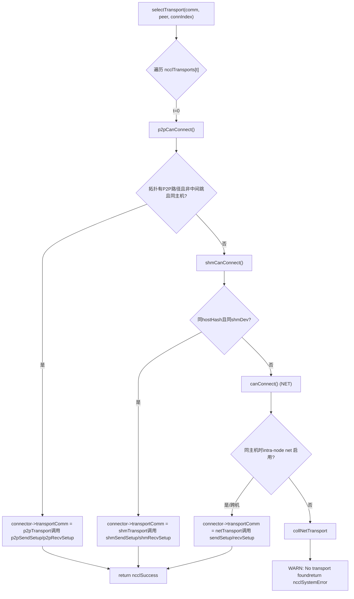
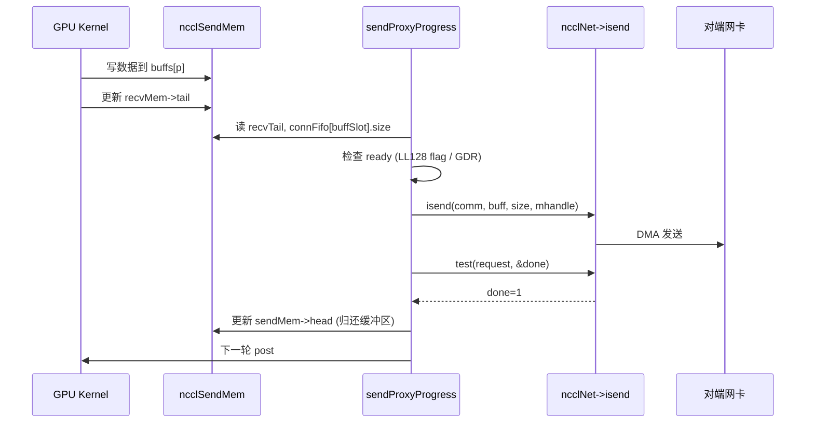

# 제 11 장: 전송 계층 추상화: P2P, SHM, NET, NVLS가 어떻게 동일한 인터페이스 아래 통합되는가

이전 장에서 우리는 알고리즘 커널을 깊이 파고들어 Ring AllReduce가 어떻게 데이터를 분할한 후 두 단계로 reduce하는지, Tree AllReduce가 어떻게 트리 구조를 통해 지연을 낮추는지 살펴보았다. 그러나 이러한 알고리즘은 「누가 누구에게, 어느 chunk를 보내는지」의 논리적 뷰만 정의한다. 데이터는 결국 실제 물리적 링크, 즉 NVLink, PCIe, 공유 메모리 또는 네트워크 카드를 통과해야 한다. 이 장에서는 src/transport 디렉터리를 해부하여 NCCL이 어떻게 통일된 ncclTransport 인터페이스로 P2P, SHM, NET, NVLS 네 가지 물리적 채널을 동일한 얼굴로 가리는지, 알고리즘 토폴로지에서 물리적 전송까지의 마지막 1마일을 완성하는지 살펴본다.

# 1. 통일 인터페이스: ncclTransport가 어떻게 네 가지 물리적 채널을 가리는가

## 직관적 모델

물류 회사를 상상해 보자: 고객이 시내 택배(P2P), 건물 내 전달(SHM), 성 간 운송(NET), 전용 직통(NVLS) 중 무엇을 보내든 프런트에서는 「운송장」 한 장만 작성한다. 이 운송장이 바로`ncclTransport`구조체다. 이는 각 운송 방식이 반드시 제공해야 하는`canConnect`、`setup`、`connect`、`free`등의 고정 동작을 규정한다. 이러한 추상화 계층이 없다면 상위 알고리즘은 네 가지`if-else`를 작성하여 어느 링크로 갈지 판단해야 하고, 새로운 하드웨어를 추가할 때마다 모든 알고리즘을 수정해야 한다.

## 데이터 구조와 메모리 레이아웃

NCCL은 전역 배열 하나로 모든 transport를 등록하며, 순서가 곧 우선순위다:

[FACT:src/transport.cc:15-20]

```c
struct ncclTransport* ncclTransports[NTRANSPORTS] = {
  &p2pTransport,
  &shmTransport,
  &netTransport,
  &collNetTransport,
};
```

배열 순서가 선택 순서를 결정한다: P2P 우선, 다음 SHM, 다음 NET, 마지막 CollNet. 각 transport는`ncclTransport`구조체로 설명되며, 이는`canConnect`함수 포인터 하나와 두 개의`ncclTransportComm`(send/recv 각각 하나)를 포함한다. P2P를 예로 들면:

[FACT:src/transport/p2p.cc:1493-1498]

```c
struct ncclTransport p2pTransport = {"P2P",
                                     p2pCanConnect,
                                     {p2pSendSetup, p2pSendConnect, p2pSendFree, NULL, p2pSendProxySetup, NULL,
                                      p2pSendProxyFree, NULL, p2pProxyRegister, p2pProxyDeregister},
                                     {p2pRecvSetup, p2pRecvConnect, p2pRecvFree, NULL, p2pRecvProxySetup, NULL,
                                      p2pRecvProxyFree, NULL, p2pProxyRegister, p2pProxyDeregister}};
```

`ncclTransportComm`의 필드 순서는 고정된 「생명주기 슬롯」이다:`setup`(리소스 준비),`connect`(연결 정보 교환),`free`(해제),`proxySharedInit`(프록시 공유 초기화),`proxySetup`、`proxyConnect`、`proxyFree`、`proxyProgress`、`proxyRegister`、`proxyDeregister`. P2P의`proxyProgress`슬롯은`NULL`이다. P2P는 GPU가 상대방의 메모리를 직접 읽고 쓰는 방식이므로 host 프록시 스레드가 데이터를 옮길 필요가 없기 때문이다. 반면 NET의`proxyProgress`는`sendProxyProgress`/`recvProxyProgress`이다. 네트워크 카드 I/O는 반드시 host 스레드가 구동해야 하기 때문이다.

## 시나리오 기반 Walkthrough: 하나의 연결이 어떻게 transport를 선택하는가

NCCL이 특정 channel의 특정 peer에 대한 연결을 설정해야 할 때,`selectTransport`：

[FACT:src/transport.cc:23-44]

```c
template 
static ncclResult_t selectTransport(struct ncclComm* comm, struct ncclTopoGraph* graph, struct ncclConnect* connect,
                                    int channelId, int peer, int connIndex, int* transportType) {
  struct ncclPeerInfo* myInfo = comm->peerInfo + comm->rank;
  struct ncclPeerInfo* peerInfo = comm->peerInfo + peer;
  struct ncclConnector* connector = (type == 1) ? comm->channels[channelId].peers[peer]->send + connIndex :
                                                  comm->channels[channelId].peers[peer]->recv + connIndex;
  for (int t = 0; t send : &transport->recv;
    int ret = 0;
    NCCLCHECK(transport->canConnect(&ret, comm, graph, myInfo, peerInfo));
    if (ret) {
      connector->transportComm = transportComm;
      NCCLCHECK(transportComm->setup(comm, graph, myInfo, peerInfo, connect, connector, channelId, connIndex));
      if (transportType) *transportType = t;
      return ncclSuccess;
    }
  }
  WARN("No transport found for rank %d[%lx] -> rank %d[%lx]", myInfo->rank, myInfo->busId, peerInfo->rank,
       peerInfo->busId);
  return ncclSystemError;
}
```

`type==1`send 방향을 나타내고,`type==0`recv 방향을 나타냅니다. 루프는 각 transport의`canConnect`를 순차적으로 질의합니다:`ret=1`를 반환하면 「내가 이 작업을 할 수 있다」는 뜻이며, 즉시`connector->transportComm`를 해당 transport의 대응 방향으로 지정하고 그`setup`를 호출합니다. 모든 transport가 0을 반환하면 경고를 출력하고`ncclSystemError`。

`canConnect`의 판정 로직은 각 transport의 「영역 경계」를 반영합니다. P2P를 예로 들면:

[FACT:src/transport/p2p.cc:129-157]

```c
ncclResult_t p2pCanConnect(int* ret, struct ncclComm* comm, struct ncclTopoGraph* graph, struct ncclPeerInfo* info1,
                           struct ncclPeerInfo* info2) {
  initCeOperation();
  int intermediateRank;
  int isCrossClique;
  NCCLCHECK(ncclTopoCheckP2p(comm, comm->topo, info1->rank, info2->rank, ret, NULL, &intermediateRank, NULL,
                             &isCrossClique));
  if (*ret == 0) return ncclSuccess;
  if (intermediateRank != -1) {
    if (useMemcpy) *ret = 0;
    return ncclSuccess;
  }
  if (!isCrossClique) {
    int useNet = 0;
    NCCLCHECK(ncclTopoCheckNet(comm->topo, info1->rank, info2->rank, &useNet));
    if (useNet) {
      *ret = 0;
      return ncclSuccess;
    }
  }
  if (info1->hostHash != comm->peerInfo[comm->rank].hostHash || info1->hostHash != info2->hostHash) {
    return ncclSuccess;
  }
  ...
```

P2P의 판정 체인: 먼저 토폴로지에 「두 rank 사이에 P2P 경로가 있는가」를 질의하고; 중간 홉(`intermediateRank != -1`)이 있고 CE memcpy가 활성화되어 있으면 P2P를 포기하고 SHM/NET에 양보하며; 토폴로지가 네트워크 경로(`useNet`)를 권장해도 포기하고; 마지막으로 동일 호스트인지 확인합니다. SHM의 판정은 더 간단합니다:

[FACT:src/transport/shm.cc:61-83]

```c
static ncclResult_t shmCanConnect(int* ret, struct ncclComm* comm, struct ncclTopoGraph* graph,
                                  struct ncclPeerInfo* info1, struct ncclPeerInfo* info2) {
  *ret = 0;
  initShmLocality();
  if (ncclParamShmDisable() == 1) return ncclSuccess;
  int useNet = 0;
  NCCLCHECK(ncclTopoCheckNet(comm->topo, info1->rank, info2->rank, &useNet));
  if (useNet) return ncclSuccess;
  if (info1->hostHash != info2->hostHash) return ncclSuccess;
  if (info1->shmDev != info2->shmDev) return ncclSuccess;
  *ret = 1;
  return ncclSuccess;
}
```

SHM은 동일 호스트(`hostHash`동일)이면서 동일한`/dev/shm`（`shmDev`를 공유해야 합니다(동일, 컨테이너 간 통신에 사용). NET은 거의 항상 1을 반환하며, 동일 호스트일 때만 intra-node net이 비활성화되었는지 확인합니다:

[FACT:src/transport/net.cc:160-168]

```c
static ncclResult_t canConnect(int* ret, struct ncclComm* comm, struct ncclTopoGraph* graph, struct ncclPeerInfo* info1,
                               struct ncclPeerInfo* info2) {
  *ret = 1;
  if (info1->hostHash == info2->hostHash) {
    NCCLCHECK(ncclTopoCheckNet(comm->topo, info1->rank, info2->rank, ret));
  }
  return ncclSuccess;
}
```

NET은 「최후의 보루」입니다 — 앞에서 아무도 받지 않으면 그것이 받습니다. NVLS의`canConnect`는 직접 0을 반환합니다:

[FACT:src/transport/nvls.cc:21-26]

```c
ncclResult_t nvlsCanConnect(int* ret, struct ncclComm* comm, struct ncclTopoGraph* graph, struct ncclPeerInfo* info1,
                            struct ncclPeerInfo* info2) {
  // This transport cannot be used for p2p
  *ret = 0;
  return ncclSuccess;
}
```

NVLS는 일반적인 peer-to-peer 연결 경로를 사용하지 않고,`ncclNvlsSetup`를 통해 별도로 멀티캐스트 그룹을 설정하므로`canConnect`는 항상 0을 반환합니다.



## 설계 고찰

> **[Design Inference & Architectural Trade-offs]**
> 왜 「배열 순서 + canConnect 투표」를 사용하고 명시적 라우팅 테이블을 사용하지 않는가? 토폴로지가 동적이기 때문입니다: 동일한 머신이라도`NCCL_P2P_DISABLE`, 컨테이너 격리, CUDA IPC 가용성 등의 요인으로 P2P가 불가능해질 수 있으며, 이때 자동으로 SHM 또는 NET으로 강등됩니다. 투표 메커니즘은 각 transport가 스스로 「내가 할 수 있는가」를 판단하게 하며, 새로운 transport를 추가할 때 배열에 항목 하나만 추가하면 되고 선택 로직을 변경할 필요가 없습니다. 이것이 바로 개방-폐쇄 원칙이 시스템 프로그래밍에서 구현된 모습입니다.

# 2. P2P: 동일 머신 GPU 직결의 네 가지 형태

## 직관적 모델

P2P는 「이웃 간에 직접 물건을 전달」하는 것입니다 — GPU 0이 CPU나 네트워크 카드를 거치지 않고 GPU 1의 메모리를 직접 읽고 씁니다. P2P가 없으면 동일 머신 다중 GPU 통신은 host 메모리로 우회해야 하므로 지연이 두 배, 대역폭이 절반으로 줄어듭니다.

## 데이터 구조와 메모리 레이아웃

P2P 내부에는 네 가지 형태가 있으며,`enum p2pType`로 구분됩니다:

[FACT:src/transport/p2p.cc:19-24]

```c
enum p2pType {
  P2P_DIRECT,
  P2P_INTERMEDIATE,
  P2P_IPC,
  P2P_CUMEM
};
```

- `P2P_DIRECT`: 동일 프로세스 내 서로 다른 GPU, 포인터로 직접 접근(가장 빠름).
- `P2P_INTERMEDIATE`: 두 GPU 사이에 직결이 없어 중간 GPU를 경유해야 함.
- `P2P_IPC`: 프로세스 간, 전통적인`cudaIpcOpenMemHandle`로 상대방 메모리를 임포트.
- `P2P_CUMEM`: 프로세스 간, cuMem API(`cuMemExportToShareableHandle`)로 임포트하며 더 세밀한 메모리 관리를 지원.

핵심 리소스 구조체:

[FACT:src/transport/p2p.cc:79-94]

```c
struct p2pResources {
  enum p2pType type;
  union {
    struct ncclSendMem* sendDevMem;
    struct ncclRecvMem* recvDevMem;
  };
  void* sendMemIpc;
  int sendMemSameProc;
  void* recvMemIpc;
  int recvMemSameProc;
  // CE memcpy support
  struct p2pShmProxyInfo proxyInfo;
  struct p2pShm* shm;
  struct p2pShm* devShm;
  ncclShmIpcDesc_t desc;
};
```

`sendDevMem`/`recvDevMem`는 union입니다 — 송신 측은`sendDevMem`만 신경 쓰고, 수신 측은`recvDevMem`만 신경 쓰며, 하나의 메모리를 공유합니다.`sendMemIpc`/`recvMemIpc`는 임포트한 상대방 메모리 핸들을 저장하고,`sendMemSameProc`/`recvMemSameProc`는 동일 프로세스 여부를 표시합니다(해제 시`ncclCuMemFreeAddr`를 쓸지`cudaIpcCloseMemHandle`）。

를 쓸지 결정).`p2pConnectInfo`연결 정보 구조체는 bootstrap을 통해 교환됩니다:

[FACT:src/transport/p2p.cc:38-44]

```c
struct p2pConnectInfo {
  int rank;
  int read;
  struct ncclP2pBuff p2pBuff;
  // Used by CE memcpy
  ncclShmIpcDesc_t desc;
};
static_assert(sizeof(struct p2pConnectInfo) transportResources = resources;
  int useRead, intermediateRank;
  NCCLCHECK(p2pGetInfo(comm, myInfo, peerInfo, &useRead, &intermediateRank));
  if (useMemcpy) useRead = 0;
  ...
  int sendSize = sizeof(struct ncclSendMem);
  if (info->read) sendSize += comm->buffSizes[NCCL_PROTO_SIMPLE];
  ALIGN_SIZE(sendSize, CUDA_IPC_MIN);
  ...
```

복사`sendSize`핵심 포인트:`ncclSendMem`는 P2P Read 모드에서 SIMPLE 프로토콜 버퍼 크기를 추가로 더해야 합니다 — 읽기 모드에서는 송신 측의 SIMPLE buffer를 수신 측이 직접 읽으므로 반드시`ALIGN_SIZE(sendSize, CUDA_IPC_MIN)`와 함께 동일한 공유 가능 메모리에 할당해야 합니다.

는 크기를 CUDA IPC 최소 입자에 맞춰 정렬합니다.`intermediateRank`이어서

[FACT:src/transport/p2p.cc:416-437]

```c
  if (intermediateRank == -1) {
    info->rank = myInfo->rank;
    if (P2P_SAME_PID(myInfo, peerInfo) && ncclParamP2pDirectDisable() == 0 && useMemcpy == 0) {
      resources->type = P2P_DIRECT;
      ...
    } else {
      if (ncclCuMemEnable()) {
        resources->type = P2P_CUMEM;
        ...
      } else {
        resources->type = P2P_IPC;
        ...
      }
    }
    send->conn.flags |= info->read ? NCCL_P2P_READ : NCCL_P2P_WRITE;
  } else {
    resources->type = P2P_INTERMEDIATE;
    info->rank = intermediateRank;
    ...
  }
```

`P2P_SAME_PID`복사

[FACT:src/transport/p2p.cc:334-335]

```c
#define P2P_SAME_PID(MYINFO, PEERINFO) \
  ((MYINFO->hostHash == PEERINFO->hostHash) && (MYINFO->pidHash == PEERINFO->pidHash))
```

복사`P2P_DIRECT`동일 프로세스이고 direct가 비활성화되지 않았으며 memcpy가 활성화되지 않았다면 가장 빠른

입니다 — 상대방 포인터를 직접 가져옵니다. 그렇지 않으면 IPC/CUMEM을 사용합니다.

[FACT:src/transport/p2p.cc:457-468]

```c
  NCCLCHECK(ncclProxyConnect(comm, TRANSPORT_P2P, 1, info->rank, &send->proxyConn));
  if (useMemcpy) {
    NCCLCHECK(ncclProxyCallBlocking(comm, &send->proxyConn, ncclProxyMsgSetup, NULL, 0, &resources->proxyInfo,
                                    sizeof(struct p2pShmProxyInfo)));
    memcpy(&info->desc, &resources->proxyInfo.desc, sizeof(ncclShmIpcDesc_t));
  } else {
    NCCLCHECK(ncclProxyCallBlocking(comm, &send->proxyConn, ncclProxyMsgSetup, &req, sizeof(struct ncclP2pRequest),
                                    &info->p2pBuff, sizeof(struct ncclP2pBuff)));
    NCCLCHECK(p2pMap(comm, &send->proxyConn, myInfo, comm->peerInfo + info->rank, &info->p2pBuff,
                     (void**)&resources->sendDevMem, &resources->sendMemIpc));
    resources->sendMemSameProc = P2P_SAME_PID(myInfo, (comm->peerInfo + info->rank));
  }
```

`ncclProxyCallBlocking`복사`p2pSendProxySetup`는 동기 RPC입니다: host 스레드가 프록시 스레드에 메시지를 보내고, 프록시 스레드가`ncclP2pBuff`를 호출하여 공유 가능 버퍼를 할당한 뒤`p2pMap`(IPC 핸들 포함)를 반환합니다. 그런 다음

`p2pMap`가 상대방 버퍼를 로컬 주소 공간에 매핑합니다.

[FACT:src/transport/p2p.cc:349-390]

```c
static ncclResult_t p2pMap(struct ncclComm* comm, struct ncclProxyConnector* proxyConn, struct ncclPeerInfo* myInfo,
                           struct ncclPeerInfo* peerInfo, struct ncclP2pBuff* p2pBuff, void** devMem, void** ipcPtr) {
  if (P2P_SAME_PID(myInfo, peerInfo)) {
    if (peerInfo->cudaDev != myInfo->cudaDev) {
      cudaError_t err = cudaDeviceEnablePeerAccess(peerInfo->cudaDev, 0);
      ...
      if (ncclCuMemEnable()) {
        NCCLCHECK(ncclCuMemAllocAddr(devMem, &p2pBuff->ipcDesc.memHandle, p2pBuff->size));
        CUCHECK(cuMemRelease(p2pBuff->ipcDesc.memHandle));
        *ipcPtr = *devMem;
        ...
      } else {
        *devMem = p2pBuff->directPtr;
        *ipcPtr = NULL;
      }
    } else {
      *devMem = p2pBuff->directPtr;
      *ipcPtr = NULL;
    }
  } else {
    NCCLCHECK(ncclP2pImportShareableBuffer(comm, peerInfo->rank, p2pBuff->size, &p2pBuff->ipcDesc, devMem,
                                           p2pBuff->directPtr, ncclMemOffload));
    *ipcPtr = *devMem;
  }
  return ncclSuccess;
}
```

복사`cudaDeviceEnablePeerAccess`동일 프로세스 다른 GPU: 먼저`directPtr`로 P2P 채널을 열고, 그런 다음`ncclP2pImportShareableBuffer`를 직접 사용합니다(동일 프로세스 주소 공간 공유이므로). 프로세스 간:

## 를 호출하여 상대방 메모리 핸들을 임포트합니다.

동시성 제어와 하드웨어 상호작용`ncclSendMem`/`ncclRecvMem`P2P의 동기화는`head`/`tail`내의`head`포인터에 의존합니다. 송신 측은`tail`를 써서 수신 측에 「내가 어디까지 썼는지」를 알리고, 수신 측은

[FACT:src/transport/p2p.cc:571-576]

```c
  } else {
    send->conn.tail = &remDevMem->tail;
    send->conn.head = &resources->sendDevMem->head;
    send->conn.ptrExchange = &resources->sendDevMem->ptrExchange;
    send->conn.redOpArgExchange = resources->sendDevMem->redOpArgExchange;
  }
```

`head`복사`sendDevMem`，`tail`는 로컬`remDevMem`를 가리키고

## 는 상대방

**를 가리킵니다. GPU kernel은 이 두 포인터를 읽고 써서 CPU 개입 없이 GPU 간 동기화를 구현합니다.**프로덕션 함정 회피 가이드`p2pSendConnect`：

[FACT:src/transport/p2p.cc:551-559]

```c
  for (int p = 0; p read && p == NCCL_PROTO_SIMPLE) {
      /* For P2P Read the SIMPLE buffer is local (ncclSendMem) */
      if (resources->sendDevMem == NULL) return ncclInternalError; // We should not use read + memcpy
      send->conn.buffs[p] = (char*)(resources->sendDevMem + 1);
    } else {
      send->conn.buffs[p] = buff;
      buff += comm->buffSizes[p];
    }
  }
```

`read=1`를 봅니다`sendDevMem==NULL`복사`ncclInternalError`만약`NCCL_P2P_READ_ENABLE=1`인데`NCCL_P2P_USE_CUDA_MEMCPY=1`이면, 직접

**를 반환합니다. 프로덕션 환경에서 이 오류가 보이면** `p2pSendFree`와`sendMemSameProc`를 동시에 설정했는지 확인하세요 — 이 둘은 의미가 충돌합니다.

[FACT:src/transport/p2p.cc:624-651]

```c
ncclResult_t p2pSendFree(struct ncclComm* comm, struct ncclConnector* send) {
  struct p2pResources* resources = (struct p2pResources*)send->transportResources;
  if (resources) {
    if (ncclCuMemEnable()) {
      if (resources->sendMemIpc) {
        if (resources->sendMemSameProc) {
          NCCLCHECK(ncclCuMemFreeAddr(resources->sendMemIpc, comm->memManager));
        } else {
          NCCLCHECK(ncclCudaFree(resources->sendMemIpc, comm->memManager));
        }
      }
      ...
```

`ncclCuMemFreeAddr`에 따라 해제 방식을 결정합니다:`ncclCudaFree`(물리 메모리 해제). 반대로 하면 메모리 누수나 use-after-free가 발생한다.

# 3. SHM: 공유 메모리의 「누가 메모리를 내는가」 논쟁

## 직관적 모델

SHM은 「두 프로세스가 하나의 화이트보드를 공유하는 것」이다 — 송신자가 쓰고, 수신자가 읽는다. 하지만 화이트보드를 누구 집에 둘 것인가? 송신자 집(sender-side)에 두고 수신자가 달려와 읽을 것인가, 아니면 수신자 집(receiver-side)에 두고 송신자가 달려가 쓸 것인가? 이것이 바로`NCCL_SHM_LOCALITY`파라미터가 해결하려는 문제다.

## 데이터 구조와 메모리 레이아웃

[FACT:src/transport/shm.cc:28-34]

```c
struct shmSendResources {
  struct ncclRecvMem* remHostMem;
  struct ncclRecvMem* devRemHostMem;
  ncclShmIpcDesc_t remDesc;
  struct ncclSendMem* hostMem;
  struct ncclSendMem* devHostMem;
};

struct shmRecvResources {
  struct ncclSendMem* remHostMem;
  struct ncclSendMem* devRemHostMem;
  ncclShmIpcDesc_t remDesc;
  struct ncclRecvMem* hostMem;
  struct ncclRecvMem* devHostMem;
};
```

주의`hostMem`와`devHostMem`는 쌍으로 나타난다:`hostMem`는 host 측 포인터,`devHostMem`는 디바이스 측 포인터(UVA 또는 cuMem 매핑을 통해).`remHostMem`/`devRemHostMem`는 상대방 공유 메모리의 로컬 매핑이다.

## 시나리오 기반 Walkthrough: SHM의 locality 선택

`shmSendSetup`locality에 따라 얼마나 큰 메모리를 할당할지 결정한다:

[FACT:src/transport/shm.cc:88-119]

```c
static ncclResult_t shmSendSetup(struct ncclComm* comm, struct ncclTopoGraph* graph, struct ncclPeerInfo* myInfo,
                                 struct ncclPeerInfo* peerInfo, struct ncclConnect* connectInfo,
                                 struct ncclConnector* send, int channelId, int connIndex) {
  struct shmSendResources* resources;
  struct shmConnectInfo* info = (struct shmConnectInfo*)connectInfo;
  size_t shmSize = sizeof(struct ncclSendMem);
  struct shmRequest req;

  NCCLCHECK(ncclCalloc(&resources, 1));
  send->transportResources = resources;

  if (shmLocality == SHM_SEND_SIDE) {
    for (int p = 0; p buffSizes[p];
  }
  req.size = shmSize;
  if (myInfo->hostHash == peerInfo->hostHash && myInfo->pidHash == peerInfo->pidHash) req.legacy = true;
  else req.legacy = false;

  NCCLCHECK(ncclProxyConnect(comm, TRANSPORT_SHM, 1, myInfo->rank, &send->proxyConn));
  NCCLCHECK(ncclProxyCallBlocking(comm, &send->proxyConn, ncclProxyMsgSetup, (void*)&req, sizeof(struct shmRequest),
                                  (void*)info, sizeof(struct shmConnectInfo)));

  info->rank = comm->rank;
  resources->hostMem = (struct ncclSendMem*)info->buf.hptr;
  resources->devHostMem = (struct ncclSendMem*)info->buf.dptr;
  ...
```

`shmLocality == SHM_SEND_SIDE`시, 송신자는 데이터 버퍼(`shmSize`에 모든 프로토콜 버퍼를 더한 값)를 할당하고, 그렇지 않으면`ncclSendMem`제어 구조만 할당한다.`req.legacy`동일 프로세스인지 표시한다 — 동일 프로세스는 전통적인`mmap`를 사용할 수 있고, 프로세스 간에는 cuMem 또는`/dev/shm`파일이 필요하다.

`shmSendConnect`에서 locality에 따라`buffs`가 로컬을 가리킬지 상대방을 가리킬지 결정한다:

[FACT:src/transport/shm.cc:153-176]

```c
static ncclResult_t shmSendConnect(struct ncclComm* comm, struct ncclConnect* connectInfo, int nranks, int rank,
                                   struct ncclConnector* send) {
  struct shmConnectInfo* info = (struct shmConnectInfo*)connectInfo;
  struct shmSendResources* resources = (struct shmSendResources*)send->transportResources;
  char* buff;

  NCCLCHECK(ncclShmImportShareableBuffer(comm, info->rank, &info->desc, (void**)&resources->remHostMem,
                                         (void**)&resources->devRemHostMem, &resources->remDesc));

  buff = shmLocality == SHM_SEND_SIDE ? (char*)(resources->devHostMem + 1) : (char*)(resources->devRemHostMem + 1);
  for (int p = 0; p conn.buffs[p] = buff;
    buff += comm->buffSizes[p];
  }
  send->conn.tail = &resources->devRemHostMem->tail;
  send->conn.head = &resources->devHostMem->head;
  send->conn.stepSize = comm->buffSizes[NCCL_PROTO_SIMPLE] / NCCL_STEPS;
  ...
```

`SHM_SEND_SIDE`：`buffs`는 로컬`devHostMem`을 가리킨다(송신자가 자신의 메모리에 쓴다);`SHM_RECV_SIDE`：`buffs`는 상대방`devRemHostMem`을 가리킨다(송신자가 수신자의 메모리에 쓴다).`head`는 항상 로컬을 가리키고,`tail`는 항상 상대방을 가리킨다 — 왜냐하면 송신자는`head`를 갱신하고, 수신자는`tail`。

## 설계 사고

> **[Design Inference & Architectural Trade-offs]**
> 왜 기본값이`SHM_RECV_SIDE`인가? 수신자는 보통 공유 메모리에서 자신의 GPU 메모리로 데이터를 복사해야 하는데, 공유 메모리가 수신자 로컬에 있으면 복사 경로가 더 짧아진다(로컬 메모리 → 로컬 GPU). NUMA 간 접근을 피할 수 있다. 송신자가 원격 메모리에 쓰는 것은 노드 간 쓰기가 한 번 더 발생하지만, 송신자는 보통 계산 집약적인 GPU이므로 쓰기 작업을 비동기로 진행할 수 있다.

## 프로덕션 함정 회피 가이드

**함정: 컨테이너 간`/dev/shm`가 공유되지 않는다.** `shmCanConnect`확인`info1->shmDev != info2->shmDev`：

[FACT:src/transport/shm.cc:76-78]

```c
  TRACE(NCCL_INIT | NCCL_SHM, "peer1 shmDev %lx peer2 shmDev %lx", info1->shmDev, info2->shmDev);
  if (info1->shmDev != info2->shmDev) return ncclSuccess;
```

두 컨테이너가 서로 다른`/dev/shm`，`shmDev`를 마운트하면 다르고, SHM은 자동으로 NET으로 강등된다. 프로덕션 환경에서 같은 호스트 통신인데 네트워크를 탄다면, 컨테이너의`/dev/shm`마운트가 일치하는지 확인하라.

# 4. NET: 네트워크 전송의 매핑 테이블과 프록시 진행

## 직관적 모델

NET은 「도시 간 택배」다 — 데이터를 패키징해서 NIC에 넘기면, NIC가 광섬유를 통해 상대방에게 보낸다. 하지만 NIC는 GPU 메모리 주소를 인식하지 못하므로, GPU 가상 주소를 NIC가 이해할 수 있는 물리 주소로 변환하는 「주소 매핑 테이블」이 필요하다. 이 테이블이 바로`connectMap`。

## 데이터 구조와 메모리 레이아웃

[FACT:src/transport/net.cc:73-86]

```c
struct connectMapMem {
  char* gpuPtr;
  char* cpuPtr;
  ssize_t size;
  ncclIpcDesc ipcDesc;
  ncclShmIpcDesc_t attachDesc;
  ncclShmIpcDesc_t createDesc;
};

struct connectMap {
  int sameProcess;
  int shared;
  int cudaDev;
  // First 3 bits of offsets determine the mem bank. 001 is host mem, 011 is dev mem, 101 is shared host mem and 111
  // is shared dev mem.
  struct connectMapMem mems[NCCL_NET_MAP_MEMS];
  // Offsets. 3 MSBs indicate mem bank, 111 indicates NULL.
  struct {
    uint32_t sendMem;
    uint32_t recvMem;
    uint32_t buffs[NCCL_NUM_PROTOCOLS];
  } offsets;
};
```

`connectMap`는 「메모리 은행」 시스템이다:`mems`배열에는 5개의 슬롯(`NCCL_NET_MAP_MEMS=5`)이 있으며, 각각 host mem, dev mem, shared host mem, shared dev mem, GDC mem에 대응한다.`offsets`의 각 필드는 32비트 정수로, 상위 3비트는 「어느 은행인지」를 인코딩하고 하위 29비트는 「은행 내 오프셋」을 인코딩한다.

디코딩 매크로:

[FACT:src/transport/net.cc:36-46]

```c
#define NCCL_NET_MAP_OFFSET_BANK(mapStruct, offsetName) ((mapStruct)->offsets.offsetName >> 30)

#define NCCL_NET_MAP_OFFSET_NULL(mapStruct, offsetName) (((mapStruct)->offsets.offsetName >> 29) == 0)

#define NCCL_NET_MAP_GET_POINTER(mapStruct, cpuOrGpu, offsetName) \
  (NCCL_NET_MAP_OFFSET_NULL(mapStruct, offsetName) ? \
     NULL : \
     (mapStruct)->mems[NCCL_NET_MAP_OFFSET_BANK(mapStruct, offsetName)].cpuOrGpu##Ptr + \
       ((mapStruct)->offsets.offsetName & NCCL_NET_MAP_MASK_OFFSET))

#define NCCL_NET_MAP_DEV_MEM(mapStruct, offsetName) (((mapStruct)->offsets.offsetName & NCCL_NET_MAP_MASK_DEVMEM) != 0)
```

`NCCL_NET_MAP_GET_POINTER(map, gpu, sendMem)`전개 후:`offsets.sendMem`의 상위 2비트를 bank 인덱스로 취하고,`mems[bank].gpuPtr`에 하위 29비트 오프셋을 더해 실제 포인터를 얻는다. 이 인코딩은 「어느 메모리 영역 + 영역 내 오프셋」을 하나의 32비트 정수에 압축하여`connectMap`의 전송 크기를 절약한다.

## 시나리오 기반 Walkthrough: sendProxyConnect의 매핑 설정

`sendProxyConnect`는 NET에서 가장 복잡한 함수로, NIC 연결 설정, 버퍼 할당, 메모리 등록을 담당한다:

[FACT:src/transport/net.cc:858-1041]

```c
static ncclResult_t sendProxyConnect(struct ncclProxyConnection* connection, struct ncclProxyState* proxyState,
                                     void* reqBuff, int reqSize, void* respBuff, int respSize, int* done) {
  struct sendNetResources* resources = (struct sendNetResources*)(connection->transportResources);
  ...
  if (resources->shared) {
    // Shared buffers
    ...
    if (resources->maxRecvs > 1 && ncclParamNetSharedComms()) {
      // Connect or reuse connection for a netdev/remote rank.
      ...
      if (comms->sendComm[resources->channelId] == NULL &&
          comms->activeConnect[resources->channelId] == (resources->tpLocalRank + 1)) {
        ret = proxyState->ncclNet->connect(proxyState->netContext, resources->netDev, req->handle,
                                           comms->sendComm + resources->channelId, &resources->netDeviceHandle);
      }
      ...
```

`maxRecvs > 1`시 「공유 연결」을 활성화한다: 여러 channel이 동일한 NIC 연결을 재사용하여 연결 수를 줄인다.`activeConnect`배열은 하나의 local rank만 연결을 시작하도록 보장하여 중복을 피한다.

이어서 버퍼를 할당하고 등록한다:

[FACT:src/transport/net.cc:933-956]

```c
  if (resources->shared == 0) {
    // Only allocate dedicated buffers for ring/tree, not for p2p
    for (int p = 0; p useGdr ? 1 : 0, proxyState->buffSizes[p],
                               buffs[p]);
      resources->buffSizes[p] = proxyState->buffSizes[p];
    }
  } else {
    // Get shared buffers
    int bank = resources->useGdr ? NCCL_NET_MAP_SHARED_DEVMEM : NCCL_NET_MAP_SHARED_HOSTMEM;
    struct connectMapMem* mapMem = map->mems + bank;
    NCCLCHECK(sharedNetBuffersInit(proxyState, resources->useGdr, resources->tpLocalRank, 0, map->sameProcess,
                                   proxyState->p2pnChannels, &mapMem->gpuPtr, &mapMem->cpuPtr, &mapMem->size,
                                   &mapMem->ipcDesc));
    resources->buffSizes[NCCL_PROTO_SIMPLE] = mapMem->size;
    ...
```

`NCCL_NET_MAP_ADD_POINTER`매크로가 버퍼를`connectMap`：

[FACT:src/transport/net.cc:48-62]

```c
#define NCCL_NET_MAP_ADD_POINTER(mapStruct, shared, dev, memSize, offsetName) \
  do { \
    int bank = NCCL_NET_MAP_MASK_USED + (dev) * NCCL_NET_MAP_MASK_DEVMEM + (shared) * NCCL_NET_MAP_MASK_SHARED; \
    if ((shared) == 0) { \
      if (dev) { \
        (mapStruct)->offsets.offsetName = bank + (mapStruct)->mems[NCCL_NET_MAP_DEVMEM].size; \
        (mapStruct)->mems[NCCL_NET_MAP_DEVMEM].size += memSize; \
      } else { \
        (mapStruct)->offsets.offsetName = bank + (mapStruct)->mems[NCCL_NET_MAP_HOSTMEM].size; \
        (mapStruct)->mems[NCCL_NET_MAP_HOSTMEM].size += memSize; \
      } \
    } else { \
      (mapStruct)->offsets.offsetName = bank; \
    } \
  } while (0);
```

복사`size`비공유 버퍼: 현재 bank의`offsets`를 오프셋으로`size += memSize`에 기록한 후

— 이것은 bump allocator다. 공유 버퍼: bank 번호를 직접 쓰고 오프셋은 0이다(공유 버퍼 전체가 하나의 bank이기 때문).

[FACT:src/transport/net.cc:1004-1035]

```c
  for (int p = 0; p buffers[p] = NCCL_NET_MAP_GET_POINTER(map, cpu, buffs[p]);
    if (resources->buffers[p]) {
#if CUDA_VERSION >= 11070
      int type = NCCL_NET_MAP_DEV_MEM(map, buffs[p]) ? NCCL_PTR_CUDA : NCCL_PTR_HOST;
      if (type == NCCL_PTR_CUDA && resources->useDmaBuf) {
        int dmabuf_fd;
        size_t dmaBufSize = resources->buffSizes[p];
        ALIGN_SIZE(dmaBufSize, ncclOsGetPageSize());
        CUCHECK(cuMemGetHandleForAddressRange((void*)&dmabuf_fd, (CUdeviceptr)resources->buffers[p], dmaBufSize,
                                              CU_MEM_RANGE_HANDLE_TYPE_DMA_BUF_FD,
                                              getHandleForAddressRangeFlags(resources->useGdr)));
        NCCLCHECK(proxyState->ncclNet->regMrDmaBuf(resources->netSendComm, resources->buffers[p],
                                                   resources->buffSizes[p], type, 0ULL, dmabuf_fd,
                                                   &resources->mhandles[p]));
        (void)close(dmabuf_fd);
      } else
#endif
      {
        NCCLCHECK(proxyState->ncclNet->regMr(resources->netSendComm, resources->buffers[p], resources->buffSizes[p],
                                             NCCL_NET_MAP_DEV_MEM(map, buffs[p]) ? NCCL_PTR_CUDA : NCCL_PTR_HOST,
                                             &resources->mhandles[p]));
      }
      ...
```

복사`cuMemGetHandleForAddressRange`DMA-BUF 경로를 우선한다(`regMr`로 fd를 얻어 NIC 플러그인에 전달). 실패하면

## 로 폴백한다(전통적인 nv_peermem GDR).

`sendProxyProgress`동시성 제어와 하드웨어 상호작용: sendProxyProgress의 3단계 파이프라인

[FACT:src/transport/net.cc:1324-1491]

```c
static ncclResult_t sendProxyProgress(struct ncclProxyState* proxyState, struct ncclProxyArgs* args) {
  ...
  if (args->state == ncclProxyOpProgress) {
    int p = args->protocol;
    int maxDepth = std::min(NCCL_STEPS, NCCL_SHARED_STEPS / args->nsubs);
    for (int s = 0; s nsubs; s++) {
      struct ncclProxySubArgs* sub = args->subs + s;
      ...
      // Post buffers to the GPU
      if (sub->posted nsteps && sub->posted done + maxDepth) {
        ...
        if (resources->shared) {
          ...
          volatile uint64_t* sendHead = resources->gdcSync ? resources->gdcSync : &resources->sendMem->head;
          sub->posted += args->sliceSteps;
          *sendHead = sub->base + sub->posted - NCCL_STEPS;
          if (resources->gdcSync) wc_store_fence(); // Flush out WC write
        } else {
          sub->posted += args->sliceSteps;
        }
        ...
        continue;
      }
      // Check whether we received data from the GPU and send it to the network
      if (sub->transmitted posted && sub->transmitted done + NCCL_STEPS) {
        ...
        if (connFifo[buffSlot].size != -1 && (*recvTail > tail || p == NCCL_PROTO_LL)) {
          ...
          if (ready) {
            ...
            NCCLCHECK(proxyState->ncclNet->isend(resources->netSendComm, buff, size, resources->tpRank,
                                                 sub->sendMhandle, phandle, sub->requests + buffSlot));
            ...
```

- **post**복사`sendMem->head`: 프록시 스레드가
- **transmit**를 갱신하여 GPU에 「버퍼가 준비되었으니 데이터를 써도 된다」고 알린다.`recvMem->tail`:`connFifo[buffSlot].size != -1`가 진행되었는지 확인하고(GPU가 쓰기를 완료함),`ncclNet->isend`를 확인한 후(데이터 크기가 채워짐),
- **done**를 호출하여 비동기 전송을 시작한다.`ncclNet->test`:`sendMem->head`를 호출하여 전송 완료를 확인하고,

`wc_store_fence()`를 갱신하여 버퍼를 반환한다.`gdcSync`는 쓰기 결합 배리어다 — GDRCopy 시나리오에서 CPU가

## 를 쓴 후 반드시 쓰기 결합 버퍼를 플러시해야 하며, 그렇지 않으면 GPU가 갱신을 볼 수 없다.

**프로덕션 함정 회피 가이드**함정 1: LL128 프로토콜의 flag 검증.

[FACT:src/transport/net.cc:1388-1403]

```c
          if (p == NCCL_PROTO_LL128) {
            ready = resources->useGdr;
            if (!ready) {
              uint64_t flag = sub->base + sub->transmitted + 1;
              int nFifoLines = DIVUP(connFifo[buffSlot].size, sizeof(uint64_t) * NCCL_LL128_LINEELEMS);
              volatile uint64_t* lines = (volatile uint64_t*)buff;
              ready = 1;
              for (int i = 0; i  0 && p == NCCL_PROTO_SIMPLE && needFlush) {
            struct recvNetResources* resources = (struct recvNetResources*)(subGroup->connection->transportResources);
            if (resources->gdcFlush) {
#if defined(__x86_64__)
              asm volatile("mfence" ::: "memory");
              asm volatile("mov (%0), %%eax" ::"l"(resources->gdcFlush) : "%eax", "memory");
#else
              std::atomic_thread_fence(std::memory_order_seq_cst);
              uint64_t dummy;
              NCCLCHECK(ncclGdrCudaRead(resources->gdrDesc, &dummy, resources->gdcFlush, sizeof(dummy)));
#endif
            }
```

`mfence`CQE poll의 읽기가 flush 읽기 이전으로 재배열되지 않도록 보장한다;`mov (%0), %%eax`PCIe 읽기를 강제로 한 번发起하여, CPU가 모든 이전 PCIe posted write(网卡 DMA 포함)가 제출될 때까지 정지하게 한다. 이는 GDRCopy 시나리오에서 「网卡가 쓰기를 완료했다고 하지만 데이터는 아직 PCIe 버퍼에 있는」 상황을 방지하는 핵심이다. 이 부분을 제거하면 수신 측이 오래된 데이터를 읽을 수 있다.



# 5. NVLS: 멀티캐스트 그룹과 UC/MC 메모리 바인딩

## 직관적 모델

NVLS는 「방송국」이다——하나의 rank가 데이터를 멀티캐스트 그룹에 쓰면, 하드웨어가 자동으로 모든 구독자에게 복사한다. 전통적인 AllReduce는 N-1번의 점대점 전송이 필요하지만, NVLS는 단 1번의 멀티캐스트 쓰기 + 1번의 멀티캐스트 읽기만 필요하다. NVLS가 없으면 대규모 AllReduce의 지연은 rank 수에 따라 선형으로 증가한다.

## 데이터 구조와 메모리 레이아웃

NVLS의 핵심은 「UC(유니캐스트) 메모리」와 「MC(멀티캐스트) 메모리」의 바인딩이다.`nvlsAllocBindUc`UC 메모리를 할당하고 MC 그룹에 바인딩:

[FACT:src/transport/nvls.cc:225-277]

```c
static ncclResult_t nvlsAllocBindUc(struct ncclComm* comm, const struct ncclMcPartition* partition, size_t size,
                                    struct ncclNvlsUcSegment* outUc) {
  CUmemAllocationProp ucprop;
  ...
  ucprop.type = CU_MEM_ALLOCATION_TYPE_PINNED;
  ucprop.location.type = CU_MEM_LOCATION_TYPE_DEVICE;
  ucprop.location.id = comm->cudaDev;
  ucprop.requestedHandleTypes = ncclCuMemHandleType;
  CUCHECKGOTO(cuMemGetAllocationGranularity(&ucgran, &ucprop, CU_MEM_ALLOC_GRANULARITY_RECOMMENDED), ret, fail);
  ALIGN_SIZE(ucsize, ucgran);
  CUCHECKGOTO(cuMemAddressReserve((CUdeviceptr*)&ucptr, ucsize, ucgran, 0U, 0), ret, fail);
  CUCHECKGOTO(cuMemCreate(&ucHandle, ucsize, &ucprop, 0), ret, fail1);
  CUCHECKGOTO(cuMemMap((CUdeviceptr)ucptr, ucsize, 0, ucHandle, 0), ret, fail2);
  CUCHECKGOTO(cuMemSetAccess((CUdeviceptr)ucptr, ucsize, &comm->nvlsResources->accessDesc, 1), ret, fail3);
  CUDACHECKGOTO(cudaMemset(ucptr, 0, ucsize), ret, fail3);
  NCCLCHECKGOTO(ncclMemTrack(comm->memManager, ucptr, ucsize, ucHandle, ncclCuMemHandleType, ncclMemPersist), ret,
                fail3);
  NCCLCHECKGOTO(bootstrapIntraNodeBarrier(comm->bootstrap, comm->localRankToRank, comm->localRank, comm->localRanks,
                                          comm->localRankToRank[0]),
                ret, fail3);
  NCCLCHECKGOTO(ncclMcPartitionBindMem(partition, 0 /*offsetInPartition*/, ucHandle, 0 /*memOffset*/, ucsize), ret,
                fail3);
  ...
```

흐름:`cuMemCreate`물리 메모리 할당 →`cuMemMap`가상 주소에 매핑 →`cuMemSetAccess`GPU 접근 권한 설정 →`ncclMcPartitionBindMem`UC 물리 메모리를 MC 그룹의 지정된 오프셋에 바인딩. 바인딩 후, 어떤 rank든 MC 주소에 쓰면 하드웨어가 데이터를 모든 바인딩된 UC 메모리에 복사한다.

주의`bootstrapIntraNodeBarrier`가`cuMulticastBindMem`이전에——주석에 따르면 이는 「mitigate the possible hang in cuMulticastBindMem during abort」를 위한 것이다. 이는 하드웨어 수준의 방어다: 만약 어떤 rank가 바인딩 과정에서 abort하면, 다른 rank들이`cuMulticastBindMem`에서 멈출 수 있다.

## 시나리오 기반 Walkthrough: ncclNvlsBufferSetup의 버퍼 레이아웃

[FACT:src/transport/nvls.cc:279-368]

```c
ncclResult_t ncclNvlsBufferSetup(struct ncclComm* comm) {
  ...
  nvlsStepSize = comm->nvlsChunkSize;
  buffSize = nvlsStepSize * NCCL_STEPS;
  nvlsPerRankSize = nChannels * 2 * buffSize;
  nvlsTotalSize = nvlsPerRankSize * nHeads;
  ...
  if (resources->dataUc.ptr == NULL) {
    NCCLCHECKGOTO(nvlsAllocBindUc(comm, &resources->dataPartition, nvlsTotalSize, &resources->dataUc), res, fail);
  }
  ...
  for (int h = 0; h nRanks + 1 + h;
    for (int c = 0; c channels + c;
      struct ncclChannelPeer* peer = channel->peers[nvlsPeer];

      // Reduce UC -> MC
      peer->send[1].conn.buffs[NCCL_PROTO_SIMPLE] = (char*)resources->dataUc.ptr + (h * 2 * nChannels + c) * buffSize;
      peer->recv[0].conn.buffs[NCCL_PROTO_SIMPLE] =
        (char*)resources->dataPartition.ptr + (h * 2 * nChannels + c) * buffSize;

      // Broadcast MC -> UC
      peer->recv[1].conn.buffs[NCCL_PROTO_SIMPLE] =
        (char*)resources->dataUc.ptr + ((h * 2 + 1) * nChannels + c) * buffSize;
      peer->send[0].conn.buffs[NCCL_PROTO_SIMPLE] =
        (char*)resources->dataPartition.ptr + ((h * 2 + 1) * nChannels + c) * buffSize;
      ...
```

버퍼 레이아웃: 각 head는`2 * nChannels`개의 buffer를 가진다(절반은 reduce용, 절반은 broadcast용).`send[1]`와`recv[0]`는 reduce 방향(UC → MC),`recv[1]`와`send[0]`는 broadcast 방향(MC → UC)이다.`dataUc.ptr`는 로컬 UC 메모리,`dataPartition.ptr`는 MC 그룹 매핑 주소이다.

## 설계 사고

> **[Design Inference & Architectural Trade-offs]**
> 왜 NVLS의`canConnect`는 0을 반환하는가? NVLS는 점대점 전송이 아니라——「일대다」 멀티캐스트 모델이기 때문이다.`selectTransport`의 루프는 점대점 연결을 위해 설계되었고, NVLS의 연결 설정은`ncclNvlsSetup`독립 경로를 따른다. NVLS를`ncclTransports`배열에 넣는 것은 단지`free`인터페이스(`nvlsSendFree`/`nvlsRecvFree`)를 통일하기 위한 것이며, 실제 연결 로직은 완전히 독립적이다.

## 프로덕션 함정 회피 가이드

**함정: MNNVL은 NVLS buffer 등록을 지원하지 않는다.**보기`ncclNvlsSetup`：

여기까지, NCCL은 ncclTransport 추상화 계층을 통해 P2P, SHM, NET, NVLS 네 가지 이기종 채널을 일관된 인터페이스로 성공적으로 통일했으며, 알고리즘 커널은 하위가 NVLink인지 网卡인지 신경 쓸 필요가 없다. 그러나 전송 계층은 「채널을 어떻게 추상화할 것인가」만 해결했을 뿐, 「데이터가 어떻게 비동기적으로 구동되는가」는 아직 답하지 않았다. 다음 장에서는 src/proxy.cc와 src/include/proxy.h에 초점을 맞춰, proxy 스레드가 host 측에서 네트워크 송수신을 어떻게 비동기적으로 진행하며 GPU kernel과 생산자-소비자 관계를 형성하는지 살펴보고, NCCL 비동기성의 핵심 메커니즘을 밝힌다.
