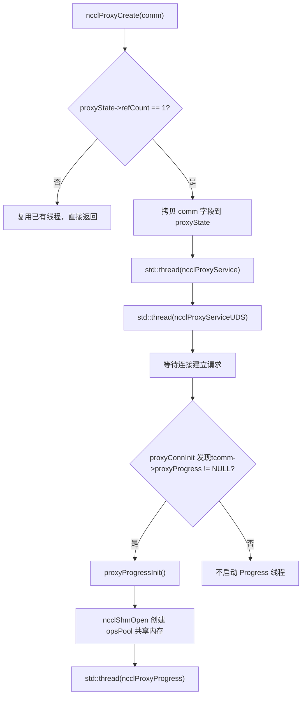
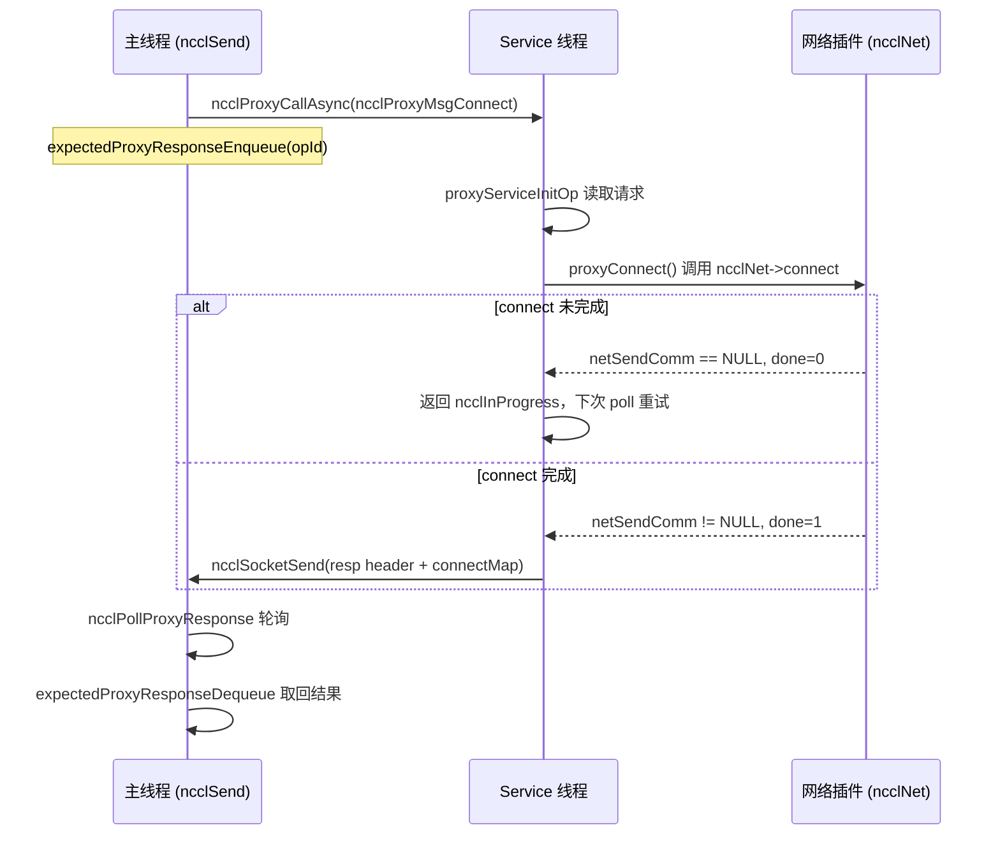
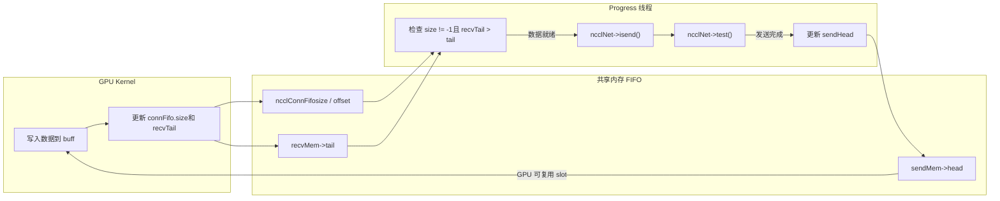

# 제 12 장: 프록시 스레드 비동기 스케줄링: proxy.cc가 I/O와 kernel 실행을 어떻게 분리하는가

이전 장에서는 transport 추상화 계층을 분석하며 NCCL이 통일된 인터페이스로 P2P/SHM/NET/NVLS의 차이를 어떻게 가리는지 살펴보았다. 그러나 전송 계층은 「데이터가 어느 채널로 가는가」만 답했을 뿐, 「데이터가 어떻게 비동기적으로 구동되는가」는 아직 답하지 않았다. GPU kernel이 네트워크 대기에서 직접 블로킹되면, 연산 유닛이 I/O에 의해 질식할 것이다. 이 장에서는`src/proxy.cc`과`src/include/proxy.h`에 초점을 맞춰, NCCL이 독립적인 host 스레드로 네트워크 I/O를 kernel 실행 경로에서 어떻게 분리하여 GPU와 생산자-소비자 관계를 형성하는지 살펴본다.

# 12.1 왜 프록시 스레드가 필요한가: 「누가 네트워크를 기다리는가」부터

## 직관적 모델

식당을 상상해 보자: 주방(GPU kernel)은 요리만 담당하고, 서빙 직원(proxy 스레드)은 요리를 손님(네트워크 상대방)에게 가져다주는 역할을 한다. 만약 요리사가 직접 서빙을 하러 다닌다면, 서빙할 때마다 요리를 멈춰야 하므로 음식 제공 속도가 급락한다. NCCL의 proxy가 바로 그 전담 서빙 직원이다—kernel은 공유 버퍼에 데이터를 쓰고 버퍼에서 데이터를 읽기만 하며, 네트워크 송수신의 번거로운 작업은 모두 host 측 proxy 스레드에 맡긴다.

> **[Design Inference & Architectural Trade-offs]**
> 만약 proxy가 없다면 시스템은 어떤 재앙에 직면할까? GPU kernel은 SIMT 대규모 병렬 방식이므로, 하나의 warp가 네트워크 폴링에 블로킹되면 전체 SM의 연산 능력이 낭비된다. 더 치명적인 것은 네트워크 송수신이 socket 시스템 호출, verbs 폴링, DMA 디스크립터 제출을 포함하는데, 이러한 작업은 device 코드에서 실행할 수 없다는 점이다. 따라서 NCCL은 네트워크 I/O를 host로 옮기고, kernel과 proxy가 공유 메모리의 FIFO를 통해 「데이터 준비 완료」 신호를 교환하도록 해야 한다.

## 두 종류 스레드의 역할 분담

NCCL은 host 측에서 두 종류의 proxy 스레드를 시작하며, 그 역할은 완전히 다르다:

- **Service 스레드**（`ncclProxyService`): 제어 평면 요청을 처리한다—연결 설정, 메모리 등록, FD 조회. 하나의 socket을 수신 대기하며, 로컬 rank로부터의 RPC 요청을 받아 setup/connect 등의 작업을 비동기적으로 진행한다.
- **Progress 스레드**（`ncclProxyProgress`): 데이터 평면을 처리한다—실제로 네트워크 송수신을 구동한다. 공유 메모리 풀에서 proxy op를 가져와 transport의`proxyProgress`콜백을 호출하여 데이터 이동을 진행한다.

[FACT:src/include/proxy.h:343-345]표시`ncclProxyState`동시에 보유`thread`(Service)와`threadUDS`(UDS 서비스)를 가지며, Progress 스레드의 핸들은`progressState.thread`안에 숨겨져 있다[FACT:src/include/proxy.h:261-261]。

## 생산자-소비자 관계의 구축

[FACT:src/proxy.cc:2130-2166]의`ncclProxyCreate`은 스레드가 탄생하는 곳이다:当`refCount == 1`(첫 번째 comm 생성) 시, comm의 핵심 필드를`proxyState`에 복사한 후 Service 스레드와 UDS 스레드를 시작한다. Progress 스레드는 여기서 시작되지 않는다는 점에 주목하라—그것은`proxyProgressInit`이 처음으로 proxy progress가 필요한 연결 설정 시에 지연 시작된다[FACT:src/proxy.cc:1523-1524]。



이 그림은 스레드 시작의 실제 분기를 고정한다: 오직`tcomm->proxyProgress`이 비어 있지 않을 때(즉 해당 transport가 데이터 평면 진행을 필요로 할 때)만 Progress 스레드가 생성된다.

# 12.2 데이터 구조와 메모리 레이아웃: 공유 메모리 풀과 op 풀

## 핵심 구조체 전경

proxy의 동시성 모델은 두 개의 공유 메모리 위에 구축되며, 그 메모리 레이아웃을 이해하는 것이 전체 메커니즘을 이해하는 전제이다.

**첫 번째 블록:`ncclProxyOpsPool`**（[FACT:src/include/proxy.h:218-226]). 이것은 메인 스레드와 Progress 스레드 사이의 「작업 투입함」이며,`/dev/shm`을 통해 프로세스 간 공유된다.

| 필드 | 타입 | 역할 |
| --- | --- | --- |
| `ops[]` | `ncclProxyOp[]` | 사전 할당된 op 배열, 크기`MAX_OPS_PER_PEER * NCCL_MAX_LOCAL_RANKS` |
| `nextOps` | `volatile int` | 처리 대기 op 연결 리스트 헤드 인덱스, -1은 비어 있음을 의미 |
| `nextOpsEnd` | `volatile int` | 처리 대기 op 연결 리스트 테일 인덱스 |
| `freeOps[]` | `volatile int[]` | 각 local rank의 유휴 op 연결 리스트 헤드 |
| `syncObjectsInitialized` | `int` | mutex/cond가 초기화되었는지 표시 |
| `mutex` / `cond` | `std::mutex` / `std::condition_variable` | 프로세스 간 동기화 원시 요소 |

`MAX_OPS_PER_PEER`의 정의[FACT:src/include/proxy.h:218-226]은`2 * MAXCHANNELS * 2 * NCCL_MAX_DEV_WORK_P2P_PER_BATCH`이다. 주석은 왜 2배인지 설명한다: 각 p2p work는 하나의 send와 하나의 recv proxy op를 포함하므로 2를 곱해야 하고, 다시 2를 곱하는 것은 두 라운드의 완전한 작업을 저장할 수 있기 위해서이며, 그렇지 않으면 「절반 투입, 절반 해제」가 불가능하다.

**두 번째 블록:`ncclProxyArgs`**（[FACT:src/include/proxy.h:174-209]). 이것은 Progress 스레드 내부에서 사용되는 「런타임 op 설명」이며,`ncclProxyPool`에서 할당되고 프로세스 간 공유되지 않는다.

핵심 필드:

- `subs[NCCL_PROXY_MAX_SUBS]`: 하위 작업 배열,`NCCL_PROXY_MAX_SUBS = MAXCHANNELS` [FACT:src/include/proxy.h:55-55]. 여러 channel의 동일 유형 작업이 하나의 args의 여러 sub로 집계된다.
- `progress`: 함수 포인터, transport의`proxyProgress`콜백을 가리킴[FACT:src/include/proxy.h:176-176]。
- `next` / `nextPeer` / `proxyAppendPtr`: 세 개의 연결 리스트 포인터로, 복잡한 op 조직 관계를 구성한다.
- `state`：`ncclProxyOpNone` / `ncclProxyOpReady` / `ncclProxyOpProgress`삼태[FACT:src/include/proxy.h:48-52]。

## 메모리 풀의 계층적 설계

`ncclProxyPool` [FACT:src/proxy.cc:50-53]은 일괄 할당 단위이며, 각 pool은`PROXYARGS_ALLOCATE_SIZE`(즉`NCCL_MAX_OPS`)개의`ncclProxyArgs`。`allocateArgs` [FACT:src/proxy.cc:207-231]을 포함한다. 의 할당 로직은 자세히 볼 가치가 있다:

```c
if (state->pool == NULL) {
    struct ncclProxyPool* newPool;
    NCCLCHECK(ncclCalloc(&newPool, 1));
    struct ncclProxyArgs* newElems = newPool->elems;
    for (int i = 0; i pool = newElems;
    newPool->next = state->pools;
    state->pools = newPool;
}
elem = state->pool;
state->pool = state->pool->next;
```

[FACT:src/proxy.cc:207-231]

> **[Design Inference & Architectural Trade-offs]**
> 여기서 설계 동기는 다음과 같다:`ncclProxyArgs`구조체가 매우 크며(`subs[MAXCHANNELS]`배열을 포함하고, 각 sub는 다시`requests[NCCL_STEPS]`를 가짐), 만약 각 op를 개별적으로 malloc하면 심각한 메모리 단편화와 할당 오버헤드가 발생한다. 일괄 할당 + 유휴 연결 리스트 재사용은 할당 비용을 거의 제로에 가깝게 분산시킨다. 주석 「Make sure we allocate the memory close to the network thread」는 이것이 NUMA 친화성을 위한 것임을 암시한다—pool은 Progress 스레드가 처음 할당할 때 생성되어 자연스럽게 해당 스레드가 실행되는 CPU에 가까워진다.

## 거짓 공유와 원자 변수

`ncclProxyOpsPool`안의`nextOps`、`nextOpsEnd`、`freeOps[]`은 모두`volatile int`이다. 이것들은 메인 스레드와 Progress 스레드가 동시에 읽고 쓰지만, NCCL은 모든 접근을 잠금으로 보호하지 않는다—대신 원자 연산 + 메모리 순서로 정확성을 보장한다.

보기`ncclLocalOpAppend`에서 freeOps로부터 유휴 op를 가져오는 로직[FACT:src/proxy.cc:503-513]：

```c
int freeOp = -1;
while (freeOp == -1) {
  freeOp = COMPILER_ATOMIC_EXCHANGE(&pool->freeOps[tpLocalRank], -1, std::memory_order_acquire);
  if (freeOp == -1) std::this_thread::yield();
}
```

메인 스레드는`atomic_exchange`을 사용하여`freeOps[tpLocalRank]`-1로 설정하고 이전 값을 가져옵니다——이것은 「선점적 획득」입니다: 먼저 exchange에 성공한 쪽이 전체 유휴 연결 리스트를 가져갑니다. Progress 스레드가 op를 반환할 때 CAS 루프를 사용합니다[FACT:src/proxy.cc:898-907]：

```c
oldFree = COMPILER_ATOMIC_LOAD(&pool->freeOps[i], std::memory_order_acquire);
do {
  pool->ops[freeOpEnd[i]].next = oldFree;
} while (!COMPILER_ATOMIC_COMPARE_EXCHANGE(&pool->freeOps[i], &oldFree, newFree,
                                           std::memory_order_release,
                                           std::memory_order_acquire));
```

> **[Design Inference & Architectural Trade-offs]**
> 여기서 seq_cst 대신 acquire/release를 사용하는 이유는 「연결 리스트 노드의 next 포인터 쓰기」가 획득자에게 보이는 것만 보장하면 되고, 전역 순서는 필요하지 않기 때문입니다.`freeOps[]`배열의 각 요소는 하나의 local rank에 대응하며, 자연스럽게 서로 다른 캐시 라인 근처에 분산되어 있어 거짓 공유를 줄입니다.

# 12.3 제어 평면: 연결 설정과 RPC 메커니즘

## 직관적 모델

> **[Design Inference & Architectural Trade-offs]**
> Service 스레드는 「프런트 데스크 접수원」과 같습니다: 로컬 rank가 네트워크 연결을 설정할 때 직접 연결하는 것이 아니라, Service 스레드에 RPC 요청을 보내고 그것이 대신 setup/connect를 실행합니다. 왜 이렇게 할까요? 네트워크 연결 설정(특히 verbs의 QP 생성, 메모리 등록)이 블로킹될 수 있고, 일부 리소스(예: listen socket)는 반드시 단일 스레드가 보유해야 하기 때문입니다. 제어 평면을 Service 스레드에 집중시키면 메인 스레드는 논블로킹으로 다른 일을 계속할 수 있습니다.

## RPC 요청의 인코딩

`ncclProxyCallAsync` [FACT:src/proxy.cc:1369-1394]은 RPC의 송신端입니다. socket을 통해 순서대로 전송합니다: type, connection 포인터, reqSize, respSize, reqBuff, opId.

```c
NCCLCHECKGOTO(ncclSocketSend(sock, &type, sizeof(int)), ret, error);
NCCLCHECKGOTO(ncclSocketSend(sock, &proxyConn->connection, sizeof(void*)), ret, error);
NCCLCHECKGOTO(ncclSocketSend(sock, &reqSize, sizeof(int)), ret, error);
NCCLCHECKGOTO(ncclSocketSend(sock, &respSize, sizeof(int)), ret, error);
if (reqSize) NCCLCHECKGOTO(ncclSocketSend(sock, reqBuff, reqSize), ret, error);
NCCLCHECKGOTO(ncclSocketSend(sock, &opId, sizeof(opId)), ret, error);
NCCLCHECK(expectedProxyResponseEnqueue(sharedProxyState, opId, respSize));
```

[FACT:src/proxy.cc:1369-1394]

마지막 단계에 주목하세요: 요청을 보낸 후 즉시 opId를`expectedResponses`큐에 등록합니다. 이것이 비동기 RPC의 핵심입니다——호출자는 응답을 기다리지 않고, 먼저 「나는 이 opId의 응답을 기대한다」고 등록한 후, 나중에`ncclPollProxyResponse`로 폴링합니다.

## 응답 큐의 연결 리스트 구현

`expectedProxyResponseEnqueue` [FACT:src/proxy.cc:97-117]은 단방향 연결 리스트로 대기 중인 op를 저장합니다.`expectedProxyResponseStore` [FACT:src/proxy.cc:67-95]은 응답 수신 시 opId로 매칭하여 응답 데이터를 미리 할당된`respBuff`에 memcpy하고,`done = true`。`expectedProxyResponseDequeue` [FACT:src/proxy.cc:119-141]을 표시합니다. 폴링 시 완료된 응답을 찾아 제거합니다.

여기에는 디테일이 있습니다:`expectedProxyResponseStore`은`respSize`이[FACT:src/proxy.cc:72-75]과 일치하는지 확인하고, 일치하지 않으면`ncclInternalError`을 보고합니다. 이것은 방어적 프로그래밍입니다——요청자와 응답자가 응답 크기에 대한 이해가 다르다면 프로토콜이 어긋난 것이므로, 조용히 계속하지 말고 즉시 실패해야 합니다.

## Service 스레드의 메인 루프

`ncclProxyService` [FACT:src/proxy.cc:1789-2016]의 핵심은 poll 루프입니다.`pollfds`배열로 모든 연결을 관리하며, listen socket과 각 peer의 socket을 포함합니다.

```c
while (stop == PROXY_RUNNING || npeers > 0) {
    if (COMPILER_ATOMIC_LOAD(proxyState->abortFlag, std::memory_order_acquire) != 0) stop = PROXY_ABORT;
    int ret = 0;
    const int timeout = asyncOpCount ? 0 : 500;
    ...
    ret = poll(activePollfds, nfds_to_poll, timeout);
```

[FACT:src/proxy.cc:1842-1863]

`timeout`의 선택은 매우 신중합니다: 진행 중인 비동기 op가 있으면(`asyncOpCount > 0`), timeout을 0(논블로킹 폴링)으로 설정합니다. 왜냐하면`proxyProgressAsync`을 자주 호출하여 그것들을 진행시켜야 하기 때문입니다. 그렇지 않으면 500ms로 설정하여 공회전으로 CPU를 태우는 것을 방지합니다. 주석 「never let proxy service thread blocks in poll, or it cannot receive abortFlag」[FACT:src/proxy.cc:1847-1847]는 왜 무한 블로킹할 수 없는지 명확히 합니다——주기적으로 깨어나 abortFlag를 확인해야 합니다.

## 비동기 op의 진행

`proxyProgressAsync` [FACT:src/proxy.cc:1626-1700]은 Service 스레드가 비동기 작업을 진행하는 핵심입니다. op 유형에 따라 서로 다른 transport 콜백으로 분배합니다:

```c
if (op->type == ncclProxyMsgSetup) {
    res = op->connection->tcomm->proxySetup(op->connection, proxyState, op->reqBuff, op->reqSize, op->respBuff,
                                            op->respSize, &done);
} else if (op->type == ncclProxyMsgConnect) {
    res = op->connection->tcomm->proxyConnect(...);
} else if (op->type == ncclProxyMsgInit) {
    res = proxyConnInit(peer, connectionPool, proxyState, ...);
}
```

[FACT:src/proxy.cc:1631-1664]

각 콜백은`done`출력 파라미터를 가집니다. 만약`done == 0`이면 작업이 아직 완료되지 않았음을 의미하며(예: 네트워크 연결이 아직 3-way handshake 중),`ncclInProgress`을 반환하고 다음 루프에서 계속 진행합니다. 만약`done == 1`이면 요청자에게 응답 헤더 + 응답 본문을 전송합니다[FACT:src/proxy.cc:1681-1689]。



이 시퀀스 다이어그램은`sendProxyConnect`에 있는`*done = 0; return ncclInProgress`의 실제 분기를 고정합니다[FACT:src/transport/net.cc:913-916]。

# 12.4 데이터 평면: Progress 스레드가 네트워크 송수신을 구동하는 방법

## 직관적 모델

Progress 스레드는 「컨베이어 벨트 운영자」입니다: 공유 버퍼의 FIFO를 주시하다가 GPU가 데이터를 다 쓰면(FIFO에서 size != -1), 즉시`isend`을 호출하여 데이터를 전송합니다. 네트워크가 데이터 수신을 완료하면 recvTail을 업데이트하여 GPU에 읽어도 된다고 알립니다. 전체 과정에서 GPU와 proxy는 FIFO의 head/tail 포인터로 동기화하며, 어떤 락도 필요하지 않습니다.

## op의 전달: 메인 스레드에서 Progress 스레드로

메인 스레드는`ncclProxySaveOp` [FACT:src/proxy.cc:591-761]에서 pattern에 따라 필요한 proxy op를 결정한 후,`SaveProxy` → `ncclLocalOpAppend`을 통해 op를 공유 메모리 풀에 씁니다.

`ncclLocalOpAppend` [FACT:src/proxy.cc:488-554]의 흐름:

1.`proxyOps->freeOp`또는`pool->freeOps[tpLocalRank]`에서 유휴 op 슬롯을 가져옵니다.

2. `memcpy(op, proxyOp, sizeof(struct ncclProxyOp))`op 내용을 공유 메모리[FACT:src/proxy.cc:515-515]。

에 복사합니다`proxyOps->nextOps`3. op를

연결 리스트 끝에 붙입니다.`MAX_OPS_PER_PEER`4. 누적된 op 수가[FACT:src/proxy.cc:525-551]。

에 도달하면 일괄 전달[FACT:src/proxy.cc:529-548]。

을 트리거합니다. 일괄 전달의 논리는 매우 미묘합니다: 모든 op를 단순히 전부 보낼 수는 없습니다. 왜냐하면 「같은 opCount의 여러 op는 반드시 함께 전달되어야 하며, 그렇지 않으면 proxyArgs의 sub 집계가 깨지기」 때문입니다. 그래서 마지막 opCount 변화 경계를 찾아 거기까지만 전달합니다`ncclProxyPost` [FACT:src/proxy.cc:476-486]전달은`pool->nextOps`、`notify_one`을 통해 완료되며, 이것은 락을 걸고

## 을 업데이트하여 Progress 스레드를 깨웁니다.

`ncclProxyProgress` [FACT:src/proxy.cc:951-1011]Progress 스레드의 메인 루프

```c
do {
    int idle = 1;
    ncclResult_t ret = progressOps(proxyState, state, state->active, &idle);
    ...
    if (idle || !state->active || (++proxyOpAppendCounter == ncclParamProgressAppendOpFreq())) {
      int added = 0;
      proxyOpAppendCounter = 0;
      ret = ncclProxyGetPostedOps(proxyState, &added);
      ...
    }
    lastIdle = idle;
    stopv = state->stop.load(std::memory_order_acquire);
} while ((stopv == 0 || (stopv == 1 && state->active)) &&
         COMPILER_ATOMIC_LOAD(proxyState->abortFlag, std::memory_order_acquire) == 0);
```

[FACT:src/proxy.cc:976-1009]

복사`proxyOpAppendCounter`여기서 주목할 만한 성능 최적화가 있습니다:[FACT:src/proxy.cc:974-974]카운터[FACT:src/proxy.cc:969-973]. 주석은`ncclProxyGetPostedOps`을 설명합니다:`ProgressAppendOpFreq`(기본 8)번마다 새 op를 한 번 가져옵니다.

## op의 집계: ProxyAppend

`ProxyAppend` [FACT:src/proxy.cc:437-474]하나의 op가 「기존 args의 sub에 추가」인지 「새 args 생성」인지 결정합니다. 판단 기준은`connection->shared && args->opCount == op->opCount` [FACT:src/proxy.cc:443-443]——동일 연결, 동일 opCount의 여러 channel 작업이 집계됩니다.

> **[Design Inference & Architectural Trade-offs]**
> 집계의 가치: 여러 channel의 동종 작업을 하나의 args로 병합하면 Progress 스레드가 한 번의 루프로 모든 channel을 진행할 수 있어 함수 호출 오버헤드와 캐시 무효화가 줄어듭니다.`ncclProxyOpToArgs` [FACT:src/proxy.cc:368-435]sub를 추가할 때 검증합니다`sliceSteps`、`chunkSteps`、`protocol`、`dtype`、`redOp`、`coll`일치 여부[FACT:src/proxy.cc:401-406]불일치하면 오류를 보고합니다——이는 잘못된 집계를 방지하는 방어선입니다.

## sendProxyProgress: 송신 측의 4단계 상태 머신

`sendProxyProgress` [FACT:src/transport/net.cc:1324-1491]송신 측의 핵심입니다. sub별로 하나씩 진행하며, 각 sub에는 네 개의 카운터가 있습니다:`posted`、`transmitted`、`done`。

**1단계: Ready 초기화** [FACT:src/transport/net.cc:1326-1339]

```c
sub->base = ROUNDUP(resources->step, args->chunkSteps);
resources->step = sub->base + sub->nsteps;
sub->posted = sub->transmitted = sub->done = 0;
```

`base`step의 시작 번호이며,`ROUNDUP`에 정렬되도록 보장합니다`chunkSteps`。`resources->step`누적하여 다음 op를 위한 공간을 확보합니다.

**2단계: Post 버퍼를 GPU에 전달** [FACT:src/transport/net.cc:1355-1376]

```c
if (sub->posted nsteps && sub->posted done + maxDepth) {
    int buffSlot = (sub->base + sub->posted) % NCCL_STEPS;
    if (resources->shared) {
        ...
        *sendHead = sub->base + sub->posted - NCCL_STEPS;
    } else {
        sub->posted += args->sliceSteps;
    }
}
```

`maxDepth`파이프라인 깊이[FACT:src/transport/net.cc:1343-1343]동시에 in-flight 상태인 step 수를 제한합니다. shared 모드에서 proxy는`sendHead`를 업데이트하여 GPU에 「이 slot에 쓸 수 있다」고 알립니다.

**3단계: GPU가 다 썼는지 확인하고 isend 시작** [FACT:src/transport/net.cc:1378-1452]

```c
if (sub->transmitted posted && sub->transmitted done + NCCL_STEPS) {
    int buffSlot = (sub->base + sub->transmitted) % NCCL_STEPS;
    volatile uint64_t* recvTail = &resources->recvMem->tail;
    uint64_t tail = sub->base + sub->transmitted;
    if (connFifo[buffSlot].size != -1 && (*recvTail > tail || p == NCCL_PROTO_LL)) {
        int size = connFifo[buffSlot].size;
        ...
        NCCLCHECK(proxyState->ncclNet->isend(resources->netSendComm, buff, size, resources->tpRank,
                                             sub->sendMhandle, phandle, sub->requests + buffSlot));
        if (sub->requests[buffSlot] != NULL) {
            sub->transmitted += args->sliceSteps;
        }
    }
}
```

여기서 핵심 판단은`connFifo[buffSlot].size != -1 && *recvTail > tail`——GPU가 데이터를 다 쓰면 FIFO의 size와 recvTail을 업데이트하고, proxy는 이 두 조건이 충족된 것을 보고 나서야 isend를 시작합니다. LL 프로토콜의 경우 「제로 카피」 시맨틱이므로 recvTail을 기다릴 필요가 없습니다.

**4단계: 전송 완료 확인, sendHead 업데이트** [FACT:src/transport/net.cc:1455-1481]

```c
if (sub->done transmitted) {
    int buffSlot = (sub->base + sub->done) % NCCL_STEPS;
    NCCLCHECK(proxyState->ncclNet->test(sub->requests[buffSlot], &done, &size));
    if (done) {
        connFifo[buffSlot].size = -1;
        std::atomic_thread_fence(std::memory_order_seq_cst);
        sub->done += args->sliceSteps;
        if (resources->shared == 0) {
            volatile uint64_t* sendHead = resources->gdcSync ? resources->gdcSync : &resources->sendMem->head;
            *sendHead = sub->base + sub->done;
        }
    }
}
```

`test`가 done을 반환하면 먼저 FIFO size를 -1로 재설정하고, seq_cst fence를 삽입한 뒤, sendHead를 업데이트하여 GPU에 「이 slot을 재사용할 수 있다」고 알립니다. fence의 역할은 size 재설정과 head 업데이트의 재정렬을 방지하는 것입니다——만약 head가 먼저 업데이트되면 GPU가 size가 아직 이전 값일 때 쓰기를 시작할 수 있습니다.

## recvProxyProgress: 수신 측의 4단계

`recvProxyProgress` [FACT:src/transport/net.cc:1493-1788]더 복잡한데, sub 그룹화(여러 sub가 동일한 recvComm을 공유할 때 multirecv 사용)를 포함하기 때문입니다.

**1단계: Ready 시 recvComm별로 그룹화** [FACT:src/transport/net.cc:1495-1538]

```c
for (int s = 0; s nsubs; s++) {
    ...
    if (groupSize == maxRecvs) {
        groupSize = 0;
    } else if (s > 0) {
        int next;
        for (next = s; next nsubs; next++) {
            struct recvNetResources* nextRes = ...;
            if (nextRes->netRecvComm == recvComm) break;
        }
        if (next == args->nsubs) {
            groupSize = 0;
        } else if (s != next) {
            // swap subs
        }
    }
    groupSize++;
    ...
    for (int i = 0; i  **[Design Inference & Architectural Trade-offs]**
> 이 코드는 동일한`recvComm`를 사용하는 sub를 함께 배치하고`groupSize`를 기록합니다. 왜 그룹화할까요? 왜냐하면`irecv`가 한 번에 여러 buffer를 수신(multirecv)할 수 있으므로, 같은 comm의 요청을 하나의 호출로 병합하면 플러그인 오버헤드를 크게 줄일 수 있기 때문입니다.

**2단계: irecv 시작** [FACT:src/transport/net.cc:1543-1631]

```c
if (subCount) {
    uint64_t step = subGroup->posted;
    void** requestPtr = subGroup->requests + (step % NCCL_STEPS);
    bool ignoreCompletion = ncclParamNetOptionalRecvCompletion() &&
                            ((args->protocol == NCCL_PROTO_LL128) || (args->protocol == NCCL_PROTO_LL)) &&
                            (subCount == 1);
    if (ignoreCompletion) *requestPtr = (void*)NCCL_NET_OPTIONAL_RECV_COMPLETION;
    NCCLCHECK(proxyState->ncclNet->irecv(resources->netRecvComm, subCount, ptrs, sizes, tags, mhandles, phandles,
                                         requestPtr));
    if (*requestPtr) {
        subGroup->recvRequestsCache[step % NCCL_STEPS] = *requestPtr;
        subGroup->recvRequestsSubCount = subCount;
        for (int i = 0; i groupSize; i++) {
            sub->posted += args->sliceSteps;
        }
    }
}
```

`ignoreCompletion`최적화[FACT:src/transport/net.cc:1608-1610]: LL/LL128 프로토콜의 단일 buffer 수신의 경우 완료 통지는 선택 사항이므로(데이터 자체에 flag가 있기 때문) completion 검사를 건너뛸 수 있습니다.

**3단계: 수신 완료 확인, recvTail 업데이트** [FACT:src/transport/net.cc:1634-1743]

```c
NCCLCHECK(proxyState->ncclNet->test(subGroup->requests[step % NCCL_STEPS], &done, sizes));
if (done) {
    for (int i = 0; i groupSize; i++) {
        struct ncclProxySubArgs* sub = subGroup + i;
        int buffSlot = (sub->base + sub->received) % NCCL_STEPS;
        connFifo[buffSlot].size = -1;
        sub->received += args->sliceSteps;
    }
    ...
}
```

수신 완료 후 FIFO size를 재설정하고, flush 단계로 진입합니다(GDRDMA 시나리오에서는 데이터 가시성을 보장하기 위해 flush가 필요합니다).

**4단계: GPU 소비 대기, done 업데이트** [FACT:src/transport/net.cc:1745-1779]

```c
if (sub->transmitted > sub->done) {
    volatile uint64_t* sendHead = &resources->sendMem->head;
    uint64_t done = *sendHead;
    while (done > sub->base + sub->done && sub->transmitted > sub->done) {
        if (subGroup->recvRequestsCache[sub->done % NCCL_STEPS]) {
            if (proxyState->ncclNet->irecvConsumed) {
                NCCLCHECK(proxyState->ncclNet->irecvConsumed(resources->netRecvComm, subGroup->recvRequestsSubCount,
                                                             subGroup->recvRequestsCache[sub->done % NCCL_STEPS]));
            }
            subGroup->recvRequestsCache[sub->done % NCCL_STEPS] = NULL;
        }
        sub->done += args->sliceSteps;
    }
}
```

여기서`sendHead`를 읽어 GPU가 데이터를 소비했는지 판단합니다.`irecvConsumed`는 플러그인에 대한 콜백으로, 「이 수신 요청의 buffer가 소비되었으니 재사용할 수 있다」고 알립니다.

## 데이터 흐름 전경



이 데이터 흐름 다이어그램은 GPU와 proxy가 FIFO 및 head/tail 포인터를 통해 형성하는 폐루프를 보여줍니다: GPU가 데이터 쓰기 → tail 업데이트 → proxy가 감지하고 isend 시작 → test로 완료 확인 → head 업데이트 → GPU가 slot 재사용.

# 12.5 동시성 제어, 메모리 배리어 및 하드웨어 상호작용

## 락 프리 FIFO의 메모리 순서

proxy와 GPU 간의 동기화는 전적으로`ncclConnFifo`와 head/tail 포인터에 의존하며, 어떤 락도 없습니다. 이는 극히 신중한 메모리 순서 제어를 요구합니다.

송신 측에서 proxy는`test`가 done을 반환한 후[FACT:src/transport/net.cc:1460-1473]：

```c
connFifo[buffSlot].size = -1;
std::atomic_thread_fence(std::memory_order_seq_cst);
...
*sendHead = sub->base + sub->done;
```

seq_cst fence는 size 재설정이 GPU에 가시화된 후에 head 업데이트가 가시화되도록 보장합니다. 만약 순서가 뒤바뀌면 GPU가 새 head를 보지만 이전 size를 보게 되어 slot에 데이터가 있다고 오인할 수 있습니다.

수신 측에서 proxy는 recvTail을 업데이트하기 전에[FACT:src/transport/net.cc:1731-1736]：

```c
if (step nsteps) {
    std::atomic_thread_fence(std::memory_order_seq_cst);
    volatile uint64_t* recvTail = resources->gdcSync ? resources->gdcSync : &resources->recvMem->tail;
    *recvTail = sub->base + sub->transmitted;
}
```

같은 원리입니다: 먼저 fence로 데이터 쓰기 가시성을 보장하고, 그다음 tail을 업데이트하여 GPU에 읽을 수 있다고 알립니다.

## GDRCOPY의 flush 메커니즘

GDRDMA를 사용할 때 NIC는 GPU 메모리에 직접 쓰지만, 쓰기 작업이 아직 PCIe 버스에서 커밋되지 않았을 수 있습니다. proxy가 능동적으로 flush해야 데이터 가시성이 보장됩니다.`recvProxyProgress`의 flush 로직[FACT:src/transport/net.cc:1664-1709]：

```c
if (totalSize > 0 && p == NCCL_PROTO_SIMPLE && needFlush) {
    if (resources->gdcFlush) {
#if defined(__x86_64__)
        asm volatile("mfence" ::: "memory");
        asm volatile("mov (%0), %%eax" ::"l"(resources->gdcFlush) : "%eax", "memory");
#else
        std::atomic_thread_fence(std::memory_order_seq_cst);
        uint64_t dummy;
        NCCLCHECK(ncclGdrCudaRead(resources->gdrDesc, &dummy, resources->gdcFlush, sizeof(dummy)));
#endif
    } else {
        // iflush 路径
        NCCLCHECK(proxyState->ncclNet->iflush(resources->netRecvComm, subCount, ptrs, sizes, mhandles,
                                              subGroup->requests + (step % NCCL_STEPS)));
    }
}
```

x86 경로의 주석이 매우 훌륭합니다[FACT:src/transport/net.cc:1668-1674]：`mfence`CQE-poll의 load가 flush load 이전으로 재배치되는 것을 방지한다;`mov (%0), %%eax`PCIe 읽기를 강제하여 CPU가 모든 이전 PCIe posted write(NIC DMA 포함)가 엔드포인트에 커밋될 때까지 정지하게 한다. 이는 하드웨어 수준의 메모리 순서 제어로, 어떤 소프트웨어 fence보다도 강력하다.

## 원자 변수와 stop/abort의 협력

Progress 스레드의 종료 조건[FACT:src/proxy.cc:1007-1009]：

```c
stopv = state->stop.load(std::memory_order_acquire);
} while ((stopv == 0 || (stopv == 1 && state->active)) &&
         COMPILER_ATOMIC_LOAD(proxyState->abortFlag, std::memory_order_acquire) == 0);
```

`stop == 1`그러나`state->active != NULL`시 계속 실행——이는 '우아한 중지'를 위한 것이다: 이미 투입된 op는 반드시 완료까지 진행되어야 하며, 그렇지 않으면 GPU가 영원히 데이터를 기다리게 된다. 오직`stop == 2`(abort) 또는`abortFlag != 0`만이 강제 종료한다.

`ncclProxyProgressDestroy` [FACT:src/proxy.cc:1039-1065]의 중지 절차:

```c
std::lock_guard lock(state->opsPool->mutex);
state->stop.store(1, std::memory_order_release);
state->opsPool->cond.notify_one();
state->thread.join();
```

먼저 잠금을 획득한 후 stop을 store하고, 그 다음 notify——이는 lost wakeup을 방지하는 표준 패턴이다. Progress 스레드는`pool->cond.wait`시 잠금을 보유하고 술어[FACT:src/proxy.cc:850-851]를 검사하여 깨우침을 놓치지 않도록 보장한다.

# 12.6 프로덕션 함정 회피 가이드와 장애 복구 체인

## 함정 1: 연결 누수로 인한 Service 스레드 종료 불가

`ncclProxyService`의 메인 루프 조건은`stop == PROXY_RUNNING || npeers > 0` [FACT:src/proxy.cc:1842-1842]이다. 주석은[FACT:src/proxy.cc:1843-1845]를 설명한다: 로컬 comm이 abort되더라도 peer 연결이 남아 있는 한 proxy 스레드는 종료할 수 없으며, 그렇지 않으면 세그멘테이션 폴트가 발생할 수 있다.

**진단 시나리오**: 특정 rank가 크래시했지만 상대방에게 통지하지 않은 경우, 상대방의 Service 스레드는`npeers > 0`의 루프에 계속 갇히게 된다. 이때는`abortFlag`또는 타임아웃 메커니즘에 의존해야 한다. 프로덕션 환경에서 프로세스가`ncclProxyService`에서 hang된 것을 발견하면, 먼저 상대 rank의 비정상 종료 여부를 확인하라.

## 함정 2: 응답 큐 불일치로 인한 메모리 누수

`expectedProxyResponseStore`는 opId가 불일치할 때`ncclInternalError` [FACT:src/proxy.cc:93-94]를 반환한다. 그러나 응답 도착 시 요청자가 이미 포기한 경우(예: 타임아웃), 이 응답은 영원히 큐에 남아`respBuff`누수가 발생한다.

**방어 조치**：`expectedProxyResponseFree` [FACT:src/proxy.cc:55-65]는`ncclProxyDestroy`시 전체 큐[FACT:src/proxy.cc:2226-2226]를 정리한다. 그러나 이는 최후의 안전장치이며, 정상 운영 중에는 잔여물이 있어서는 안 된다.

## 함정 3: shared 모드에서 head가 음수로 초기화됨

`sendProxyConnect`에서[FACT:src/transport/net.cc:999-1000]：

```c
// Don't give credits yet in shared mode.
(resources->gdcSync ? *resources->gdcSync : resources->sendMem->head) = (map->shared ? -NCCL_STEPS : 0);
```

shared 모드에서 head는`-NCCL_STEPS`로 초기화되며, 이는 GPU가 처음에 쓸 수 있는 credit이 없음을 의미한다. proxy는 post 단계에서 점진적으로 head를 증가시켜 'credit을 발급'해야 한다. 이 초기화를 잊으면 GPU는 credit이 있다고 착각하여 준비되지 않은 slot에 쓰게 되어 데이터가 손상된다.

## 함정 4: LL128 프로토콜의 flag 검증

`sendProxyProgress`에서 LL128의 ready 판단[FACT:src/transport/net.cc:1388-1403]：

```c
if (p == NCCL_PROTO_LL128) {
    ready = resources->useGdr;
    if (!ready) {
        uint64_t flag = sub->base + sub->transmitted + 1;
        int nFifoLines = DIVUP(connFifo[buffSlot].size, sizeof(uint64_t) * NCCL_LL128_LINEELEMS);
        volatile uint64_t* lines = (volatile uint64_t*)buff;
        ready = 1;
        for (int i = 0; i Q1: 만약`sendProxyProgress`에서`sub->done == sub->nsteps`시`sendHead`를 갱신하는 로직을 제거하면(GPU slot 해제를 통지하지 않음), 어떤 시나리오에서 교착 상태가 발생하는가? 왜인가?

**참고 해석**：`sendHead`는 GPU가 '어떤 slot을 재사용할 수 있는지' 판단하는 유일한 근거이다. 보기[FACT:src/transport/net.cc:1469-1473]：

```c
if (resources->shared == 0) {
    volatile uint64_t* sendHead = resources->gdcSync ? resources->gdcSync : &resources->sendMem->head;
    *sendHead = sub->base + sub->done;
}
```

이 부분을 제거하면 GPU의 head는 영원히 초기값(shared 모드에서는`-NCCL_STEPS`, 비 shared에서는 0)에 머문다. GPU kernel은`waitSend`시`head + NCCL_STEPS > step`를 검사해야 credit이 있다고 판단한다. head가 전진하지 않으면 GPU는`NCCL_STEPS`개 slot을 모두 채운 후 credit을 기다리며 영원히 블록되고, proxy는 GPU가 새 데이터를 쓰기를 기다려야 isend할 수 있다——전형적인 생산자-소비자 교착 상태이다. shared 모드에서는 초기 head가 음수이므로 GPU가 처음부터 credit이 없어 더 심각하다.

Q2: `ncclLocalOpAppend`누적 op가 도달하면`MAX_OPS_PER_PEER`일괄 전송이 트리거되지만, 코드는 의도적으로 "마지막 opCount의 모든 op를 전송하지 않는다". 만약 단순히 모든 op를 전송하도록 변경하면 어떤 메커니즘이 깨지는가?

**참고 해석**: 보기[FACT:src/proxy.cc:525-548]의 주석과 로직:

```c
// Do not post last operations as we could have more coming with the same opCount, and posting
// them in different batches would break proxyArgs aggregation with subs.
uint64_t lastOpCount = pool->ops[proxyOps->nextOpsEnd].opCount;
int lastOp = -1;
...
for (int op = proxyOps->nextOps; op != proxyOps->nextOpsEnd; op = pool->ops[op].next) {
    ops++;
    if (pool->ops[op].opCount != lastOpCount) {
        lastOp = op;
        toSend = ops;
    }
}
```

`ProxyAppend`의 집계 로직[FACT:src/proxy.cc:443-443]은`args->opCount == op->opCount`에 의존하여 sub를 추가할지 판단한다. 만약 동일한 opCount의 여러 channel op가 두 배치로 나뉘어 전송되면, 첫 번째 배치가 args를 생성하고, 두 번째 배치가 도착할 때`args->opCount`은 이미 새 op의 opCount와 같지 않게 되어( args가 이미 전진했을 수 있으므로), 본래 집계되어야 할 sub가 독립적인 args로 분리된다. 이는 성능을 저하시킬 뿐만 아니라,`ncclProxyOpToArgs`안의`nChannels`/`nPeers`min을 취하는 로직[FACT:src/proxy.cc:399-400]을 깨뜨려 잘못된 채널 수 계산을 초래할 수 있다.

Q3: `recvProxyProgress`의 Ready 단계는`recvComm`에 따라 sub를 재정렬하고 그룹화한다. 만약 이 그룹화 로직을 제거하고 각 sub가 독립적으로`irecv`을 호출하게 하면,`maxRecvs > 1`의 네트워크 카드에서 어떤 결과가 발생하는가?

**참고 해석**: 보기[FACT:src/transport/net.cc:1495-1538]의 그룹화 로직과[FACT:src/transport/net.cc:1613-1614]의 multirecv 호출:

```c
NCCLCHECK(proxyState->ncclNet->irecv(resources->netRecvComm, subCount, ptrs, sizes, tags, mhandles, phandles,
                                     requestPtr));
```

`maxRecvs`은 네트워크 카드 플러그인이 선언한 "단일 irecv가 수신할 수 있는 최대 buffer 수"[FACT:src/transport/net.cc:1525-1525]이다.当`maxRecvs > 1`일 때, 플러그인(예: IB)은 하나의 WQE로 여러 buffer를 수신하는 것을 지원하여 doorbell 오버헤드와 CQE 처리 비용을 현저히 줄일 수 있다. 만약 그룹화를 제거하고 각 sub를 개별적으로 irecv하면,`subCount`은 항상 1이 되고, 플러그인은 단일 buffer 모드로 퇴화하여 처리량이 감소한다. 더 중요한 것은,`recvRequestsCache`과`irecvConsumed`메커니즘[FACT:src/transport/net.cc:1616-1617]이 multirecv를 위해 설계되었다는 점이다——단일 buffer 모드에서는 이러한 캐시 로직이 무효화되어 요청 누수가 발생할 수 있다.

여기까지 우리는 proxy 스레드가 어떻게 네트워크 I/O를 kernel 실행과 분리하여 GPU 계산과 통신을 진정으로 병렬화하는지 이해했다. 그러나 proxy는 단지 구동자일 뿐, 하위 네트워크 전송의 구체적인 구현은 아직 밝혀지지 않았다. 다음 장에서는`net_ib`을 깊이 파고들어, NCCL이 verbs API를 어떻게 캡슐화하여 InfiniBand 전송을 구현하는지, 그리고 GPUDirect RDMA가 어떻게 네트워크 카드가 GPU 메모리를 직접 읽고 쓸 수 있게 하는지 살펴본다.
