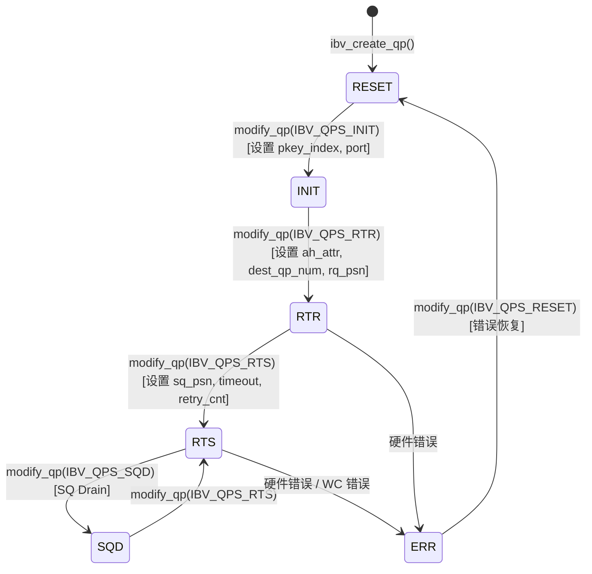

# 제 13 장: InfiniBand 네트워크 전송: net_ib가 verbs와 GPUDirect RDMA를 캡슐화하는 방법

이전 장에서 우리는 proxy 스레드가 어떻게 네트워크 I/O를 GPU kernel에서 분리하여 계산과 통신을 진정으로 병렬화하는지 보았다. 그러나 proxy는 단지 "구동자"일 뿐이다——그것은 ncclNet->isend/irecv라는 추상 인터페이스를 호출하지만, 그 아래가 TCP인지, InfiniBand인지, 아니면 다른 무엇인지 알지 못한다. 이번 장에서는 이 추상화의 층을 걷어내고 src/transport/net_ib와 src/misc/ibvwrap.cc로 들어가, NCCL이 libibverbs라는 C 라이브러리를 어떻게 플러그 가능한 심볼 테이블로 캡슐화하는지, Queue Pair(QP)를 어떻게 설정하는지, 그리고 GPUDirect RDMA가 어떻게 네트워크 카드가 host 메모리를 우회하여 GPU 메모리를 직접 읽고 쓸 수 있게 하는지 살펴본다.

# 13.1 NCCL이 libibverbs를 직접 호출하지 않는 이유

## 직관적 모델: 심볼 테이블은 "플러그 가능한 전원 콘센트"

수입 전기 제품을 샀는데 플러그 모양이 집의 콘센트와 맞지 않는다고 상상해 보자. 두 가지 선택이 있다: 전기 제품을 분해해서 배선을 바꾸거나(직접`#include <infiniband/verbs.h>`하고`-libverbs`을 링크), 아니면 만능 변환 플러그를 사는 것(런타임에 심볼을 동적으로 로드)이다. NCCL은 후자를 선택했다.

> **[Design Inference & Architectural Trade-offs]**
> 이 선택의 핵심 동기는**배포 유연성**이다: NCCL은 PyTorch, TensorFlow 등 상위 프레임워크에 의해 라이브러리로 로드되며, 실행 환경에 반드시`libibverbs.so`이 설치되어 있다고 가정할 수 없다. 만약 컴파일 시점에 하드 링크하면, InfiniBand 드라이버가 없는 머신에서는 전체 NCCL 라이브러리가 로드될 수 없다——단지 NVLink로 단일 머신 통신만 하고 싶어도 마찬가지다. 런타임`dlopen`+ 심볼 해석을 통해 NCCL은 IB가 없는 머신에서 우아하게 성능을 저하시킬 수 있다.

만약 이 캡슐화 계층이 없다면, 시스템이 직면할 재앙은:**순수 NVLink 단일 머신 훈련 작업이 머신에 IB 드라이버가 설치되지 않아 직접 충돌하는 것**이다. 이는 클라우드 환경, 개발 머신에서 극히 흔하다.

## 데이터 구조와 메모리 레이아웃: 심볼 테이블 컨테이너

핵심 데이터 구조는`ncclIbvSymbols`이며,`ibvsymbols.h`에 정의되어 있다(이번 장 자료에는 해당 파일이 포함되지 않았지만, 사용 방식으로부터 그 구조를 추론할 수 있다). 이것은 순수 함수 포인터 컨테이너로, 각 필드가 하나의 libibverbs 함수에 대응한다:

```c
struct ncclIbvSymbols {
  int (*ibv_internal_fork_init)(void);
  struct ibv_device** (*ibv_internal_get_device_list)(int* num_devices);
  int (*ibv_internal_modify_qp)(struct ibv_qp*, struct ibv_qp_attr*, int);
  // ... 数十个函数指针
};
```

전역에 인스턴스가 하나만 있으며,`std::once_flag`과 함께 스레드 안전 초기화를 보장한다:

[FACT:src/misc/ibvwrap.cc:26-29]

```c
static std::once_flag initOnceFlag;
static ncclResult_t initResult;
struct ncclIbvSymbols ibvSymbols;
```

여기서 설계는 매우 절제되어 있다:`initOnceFlag`은`std::once_flag`，`initResult`캐시 초기화 결과,`ibvSymbols`전역 심볼 테이블이다. 세 가지 모두 정적 저장 기간을 가지며, 생명주기가 전체 프로세스에 걸쳐 있다.

> **[Design Inference & Architectural Trade-offs]**
> 왜`std::once_flag`를 사용하고`pthread_once`를 사용하지 않는가? NCCL의 C++ 코드가 이미`<mutex>`와`<thread>`에 의존하고 있기 때문에, 표준 라이브러리를 사용하는 것이 더 일관적이다.`call_once`의 의미는: 아무리 많은 스레드가 동시에`wrap_ibv_symbols()`를 호출하더라도, lambda는 한 번만 실행되고 나머지 스레드는 차단 대기한 후 모두 동일한`initResult`을 얻는다. 이는 수동으로 이중 검사 잠금(DCLP)을 작성하는 것보다 훨씬 안전하다——DCLP는 C++ 메모리 모델에서 유명한 재정렬 함정이 있다.

## Step-by-Step: 심볼 해석의 전체 흐름

NCCL이 처음으로 IB 전송이 필요할 때,`wrap_ibv_symbols()`：

[FACT:src/misc/ibvwrap.cc:26-29]

```c
ncclResult_t wrap_ibv_symbols(void) {
  std::call_once(initOnceFlag, []() { initResult = buildIbvSymbols(&ibvSymbols); });
  return initResult;
}
```

`buildIbvSymbols`를 호출한다.`ibvsymbols.cc`에 정의되어 있으며(이 장에서는 포함되지 않음), 그 작업은`dlopen("libibverbs.so")`로 라이브러리를 열고, 각 함수 이름에 대해`dlsym`를 호출하여 포인터를 채우는 것이다. 특정 심볼을 찾을 수 없으면 해당 필드는 NULL로 유지된다.

이 "NULL 허용" 설계는 전체 래핑 계층에 걸쳐 있다.`CHECK_NOT_NULL`매크로를 보자:

[FACT:src/misc/ibvwrap.cc:26-29]

```c
#define CHECK_NOT_NULL(container, internal_name) \
  if (container.internal_name == NULL) { \
    WARN("lib wrapper not initialized."); \
    return ncclInternalError; \
  }
```

각 래핑 함수는 호출 전에 해당 심볼이 비어 있지 않은지 확인한다. 이는 다음을 의미한다:**구버전 libibverbs에 새로운 함수가 없는 경우, NCCL은 로드 시 충돌하지 않고 실제로 해당 함수를 사용할 때 오류를 보고한다**. 이것이 점진적 성능 저하의 핵심이다.

## 설계 사고: 매크로 래핑의 삼중 책임

`ibvwrap.cc`에는 7개의 매크로가 정의되어 있으며, 이들은 단순한 문법 설탕이 아니라 삼중 책임을承担한다:

1. **널 포인터 방어**：`CHECK_NOT_NULL`초기화되지 않음을 차단

2. **오류 코드 정규화**: libibverbs의 다양한 오류 규약(-1 반환, errno 반환, NULL 포인터 반환)을 통일적으로`ncclResult_t`

3. **로 변환**로그 삽입`WARN`: 실패 시

가 함수 이름과 errno를 출력`IBV_PTR_CHECK_ERRNO`가장 복잡한 매크로인

[FACT:src/misc/ibvwrap.cc:38-45]

```c
#define IBV_PTR_CHECK_ERRNO(container, internal_name, call, retval, error_retval, name) \
  CHECK_NOT_NULL(container, internal_name); \
  retval = container.call; \
  if (retval == error_retval) { \
    WARN("Call to " name " failed with error %s", strerror(errno)); \
    return ncclSystemError; \
  } \
  return ncclSuccess;
```

복사`retval`확장 후 네 가지 작업을 수행한다: 심볼이 비어 있지 않은지 확인, 호출 실행, 반환값을`ibv_pd*`에 쓰기(일반적으로 포인터 매개변수를 통해 반환되는`strerror(errno)`등), 오류 값과 같은지 판단. 주목할 점은`ibv_alloc_pd`——libibverbs의 포인터 반환형 함수(예:`errno`)는 실패 시 NULL을 반환하고`errno`를 설정하므로, 여기서

를 읽는 것이 맞다.`IBV_INT_CHECK`그리고

[FACT:src/misc/ibvwrap.cc:84-91]

```c
#define IBV_INT_CHECK(container, internal_name, call, error_retval, name) \
  CHECK_NOT_NULL(container, internal_name); \
  int ret = container.call; \
  if (ret == error_retval) { \
    WARN("Call to " name " failed"); \
    return ncclSystemError; \
  } \
  return ncclSuccess;
```

복사`errno`여기서는`ibv_fork_init`를 읽지 않는다. 왜냐하면 이러한 함수(예:

> **[Design Inference & Architectural Trade-offs]**
> 〔설계 추론 및 아키텍처 트레이드오프〕`net_ib.cc`이러한 "함수마다 다른 매크로 사용" 방식은 번거로워 보이지만 필요하다: libibverbs의 API 오류 규약이 극도로 불통일하여, 어떤 것은 0/-1을 반환하고, 어떤 것은 errno 값을 반환하며, 어떤 것은 포인터를 반환한다. 억지로 통일하면 오히려 오류 정보가 손실된다. NCCL은 "있는 그대로 번역"을 선택하여 복잡성을 래핑 계층에 남기고, 상위`ncclSuccess`。

# 는

## 만 판단하면 된다.

`ibvcore.h`13.2 ibvcore.h: 헤더 파일에 의존하지 않는 ABI 계약**직관적 모델: 자체 사전을 가진 번역가**는 특이한 파일이다——libibverbs의 핵심 구조체, 열거형, 상수를`#include <infiniband/verbs.h>`재정의했다

> **[Design Inference & Architectural Trade-offs]**
> 없이 이러한 타입을 사용해야 하기 때문이다.`infiniband/verbs.h`〔설계 추론 및 아키텍처 트레이드오프〕`dlopen`이는 실제 엔지니어링 문제를 해결한다:

는 다른 배포판, 다른 드라이버 버전에서 내용이 다르다. NCCL이 이를 직접 포함하면 컴파일 시 특정 버전에 바인딩된다. "최소 필요 부분집합"을 자체 정의함으로써 NCCL은 컴파일 시 IB 헤더 파일이 필요 없고, 런타임에**를 통해 모든 버전의 라이브러리를 로드할 수 있다.`libibverbs-dev`이 계층이 없으면 재앙이다:**가 설치되지 않은 머신에서 NCCL을 컴파일할 수 없다`rdma-core`. 실제로 런타임에는

## 를 통해 라이브러리 파일을 제공할 수 있다.

핵심 구조체의 메모리 레이아웃

**`ibv_gid`RDMA 이해에 가장 중요한 몇 가지 구조체를 분석해 보자.**

[FACT:src/include/ibvcore.h:58-64]

```c
union ibv_gid {
	uint8_t			raw[16];
	struct {
		uint64_t	subnet_prefix;
		uint64_t	interface_id;
	} global;
};
```

복사`ibvGetGidStr`GID는 InfiniBand의 "IP 주소"로, 16바이트이다. 16바이트 배열로도 접근할 수 있고, 두 개의 64비트 정수로도 접근할 수 있다. RoCE(RDMA over Converged Ethernet) 시나리오에서 GID는 실제로 IPv6 주소이다——이것이`inet_ntop(AF_INET6, ...)`가

[FACT:src/include/ibvwrap.h:102-108]

```c
static inline const char* ibvGetGidStr(union ibv_gid* gid, char* gidStr, size_t strLen) {
  static_assert(sizeof(union ibv_gid) == sizeof(struct in6_addr),
                "the sizeof struct ibv_gid must be the size of struct in6_addr");
  return inet_ntop(AF_INET6, gid->raw, gidStr, strLen);
}
```

`static_assert`복사`ibv_gid`는 컴파일 시`in6_addr`와`inet_ntop`의 크기가 일치함을 보장하여,

**`ibv_mr`가 이 16바이트를 올바르게 해석할 수 있도록 한다.**

[FACT:src/include/ibvcore.h:402-410]

```c
struct ibv_mr {
	struct ibv_context     *context;
	struct ibv_pd	       *pd;
	void		       *addr;
	size_t			length;
	uint32_t		handle;
	uint32_t		lkey;
	uint32_t		rkey;
};
```

복사`addr`이것은 GPUDirect RDMA의 핵심이다.`length`는 등록된 메모리 시작 주소(호스트 메모리일 수도 있고, GPU 메모리가 호스트에 매핑된 주소일 수도 있음)이고,`lkey`는 길이이다.`rkey`(local key)와`lkey`(remote key)는 네트워크 카드가 접근 권한을 검증하는 데 사용하는 "열쇠"이다——송신 측은 WQE에`rkey`를 포함하고, 수신 측은

> **[Design Inference & Architectural Trade-offs]**
> 〔설계 추론 및 아키텍처 트레이드오프〕`addr`왜 등록이 필요한가? 네트워크 카드가 DMA를 수행할 때 물리 주소를 사용하는데,`lkey/rkey`는 가상 주소이기 때문이다. 등록 과정에서 드라이버가 이 가상 주소의 페이지 테이블을 "고정"(pin)하고, IOMMU 매핑을 설정하며, 이후 참조를 위한 핸들로

**`ibv_send_wr`를 반환한다. 등록은 비용이 많이 든다(페이지 테이블 순회와 IOMMU 프로그래밍 포함). 따라서 NCCL은 MR을 캐시하여 매 전송마다 등록하는 것을 피한다.**

[FACT:src/include/ibvcore.h:704-738]

```c
struct ibv_send_wr {
	uint64_t		wr_id;
	struct ibv_send_wr     *next;
	struct ibv_sge	       *sg_list;
	int			num_sge;
	enum ibv_wr_opcode	opcode;
	int			send_flags;
	uint32_t		imm_data;
	union {
		struct {
			uint64_t	remote_addr;
			uint32_t	rkey;
		} rdma;
		// ...
	} wr;
};
```

복사`wr_id`이것은 "네트워크 카드가 무엇을 해야 하는가"에 대한 설명이다.`sg_list`는 사용자 정의 태그(완료 시 그대로 반환됨),`opcode`는 산란-수집 목록(scatter-gather list),`wr.rdma.remote_addr`및`wr.rdma.rkey`상대방의 대상 주소와 접근 키를 지정합니다.

`ibv_sge`로컬 메모리 일부를 설명합니다:

[FACT:src/include/ibvcore.h:698-702]

```c
struct ibv_sge {
	uint64_t		addr;
	uint32_t		length;
	uint32_t		lkey;
};
```

주의`addr`는`uint64_t`이며 포인터가 아닙니다 — WQE는 NIC 하드웨어에 의해 읽히므로 반드시 고정된 64비트 형식이어야 합니다.

## 인라인 함수: 심볼 테이블을 우회하는 빠른 경로

일부 함수는 NCCL이 심볼 테이블을 거치지 않고 인라인 구현을 선택합니다. 예를 들어`ibv_post_send`：

[FACT:src/include/ibvcore.h:1099-1101]

```c
static inline int ibv_post_send(struct ibv_qp *qp, struct ibv_send_wr *wr, struct ibv_send_wr **bad_wr) {
  return qp->context->ops.post_send(qp, wr, bad_wr);
}
```

그것은 직접`qp->context->ops.post_send`함수 포인터를 통해 호출됩니다. 이것은 libibverbs의 전형적인 설계입니다:`ibv_context`안에 하나의`ops`구조체가 있으며, 모든 연산 함수 포인터를 포함하고 구체적인 드라이버에 의해 채워집니다.

> **[Design Inference & Architectural Trade-offs]**
> 왜`post_send`는`ops`를 거치고 심볼 테이블을 거치지 않습니까? 왜냐하면`post_send`는**데이터 경로**상의 핫 함수이며, 매번 전송할 때마다 호출됩니다. 만약`dlsym`로 해석되는 전역 심볼 테이블을 거치면 간접 주소 지정이 한 번 더 발생합니다. 반면`qp->context->ops`를 통하면 컴파일러가 더 나은 최적화를 할 수 있고, 이 포인터는 QP 생성 시에 고정됩니다. 이와 대조적으로,`ibv_modify_qp`는 제어 경로 함수이며 호출 빈도가 낮아 심볼 테이블을 거쳐도 상관없습니다.

NCCL의 래핑`wrap_ibv_post_send`도 인라인입니다:

[FACT:src/include/ibvwrap.h:77-85]

```c
static inline ncclResult_t wrap_ibv_post_send(struct ibv_qp* qp, struct ibv_send_wr* wr, struct ibv_send_wr** bad_wr) {
  int ret = qp->context->ops.post_send(
    qp, wr, bad_wr);
  if (ret != IBV_SUCCESS) {
    WARN("ibv_post_send() failed with error %s, Bad WR %p, First WR %p", strerror(ret), wr, *bad_wr);
    return ncclSystemError;
  }
  return ncclSuccess;
}
```

주의`IBV_SUCCESS`는 0으로 정의됩니다:

[FACT:src/include/ibvwrap.h:23-25]

```c
typedef enum ibv_return_enum {
  IBV_SUCCESS = 0,
} ibv_return_t;
```

## 설계 사고: ABI 호환성의 "버전 탐지"

`ibvcore.h`안에 정교한 ABI 버전 탐지 코드가 있습니다:

[FACT:src/include/ibvcore.h:81]

```c
static void *__VERBS_ABI_IS_EXTENDED = ((uint8_t *)NULL) - 1;
```

이것은 "매직 포인터"입니다 — 값은`(uint8_t*)0 - 1`, 즉`0xFFFFFFFFFFFFFFFF`입니다. 이것은`ibv_context.abi_compat`필드의 마커 값으로 사용됩니다:

[FACT:src/include/ibvcore.h:1072-1081]

```c
static inline struct verbs_context *verbs_get_ctx(struct ibv_context *ctx)
{
	if (ctx->abi_compat != __VERBS_ABI_IS_EXTENDED)
		return NULL;
	return (struct verbs_context *)(((uintptr_t)ctx) -
					offsetof(struct verbs_context,
						 context));
}
```

만약`abi_compat`가 이 매직 값과 같다면, 하위 라이브러리가 확장 ABI를 지원한다는 의미이며, 이때`container_of`기법을 통해`ibv_context`에서 역으로 외부의`verbs_context`。`verbs_context`의 마지막 필드가`ibv_context`：

[FACT:src/include/ibvcore.h:1068-1069]

```c
	size_t   sz;			/* Must be immediately before struct ibv_context */
	struct ibv_context context;	/* Must be last field in the struct */
```

> **[Design Inference & Architectural Trade-offs]**
> 이것은 C 언어로 "상속"을 구현하는 전형적인 기법입니다:`verbs_context`는`ibv_context`를 "상속"하며, 기반 클래스를 끝에 배치함으로써`container_of`를 사용해 기반 클래스 포인터에서 파생 클래스 포인터를 역추적할 수 있습니다.`sz`필드는 구조체 크기를 기록하며 버전 호환성에 사용됩니다 — 새 버전 라이브러리는 구조체를 확장할 수 있고, 구버전 코드는`sz`를 검사하여 특정 필드가 존재하는지 판단합니다.

`verbs_get_ctx_op`매크로는 이 검사를 더욱 캡슐화합니다:

[FACT:src/include/ibvcore.h:1083-1086]

```c
#define verbs_get_ctx_op(ctx, op) ({ \
	struct verbs_context *__vctx = verbs_get_ctx(ctx); \
	(!__vctx || (__vctx->sz op) ? NULL : __vctx; })
```

그것은 세 가지를 검사합니다: 확장 ABI인지, 구조체가 해당 필드를 포함할 만큼 충분히 큰지, 해당 필드가 비어 있지 않은지. 모두 만족해야만 유효한 포인터를 반환합니다. 이것이`ibv_query_port_ex`가 안전하게 호출될 수 있는 기초입니다:

[FACT:src/include/ibvcore.h:1121-1132]

```c
static inline int ibv_query_port_ex(struct ibv_context *context,
				    uint8_t port_num,
				    struct ibv_port_attr *port_attr)
{
	struct verbs_context *vctx = verbs_get_ctx_op(context, query_port);
        if (vctx) {
          return vctx->query_port(context, port_num, port_attr, sizeof(*port_attr));
        }
        return -1;
}
```

만약 하위 라이브러리가 확장`query_port`를 지원하지 않으면 -1을 반환하고, 호출자`wrap_ibv_query_port`는 구 API로 폴백합니다:

[FACT:src/misc/ibvwrap.cc:156-171]

```c
ncclResult_t wrap_ibv_query_port(struct ibv_context* context, uint8_t port_num, struct ibv_port_attr* port_attr) {
#ifndef NCCL_BUILD_RDMA_CORE
  // First try and query the extended port attributes (e.g. active_speed_ex)
  if (ibv_query_port_ex(context, port_num, port_attr) != 0) {
    // Fall back to the original attribute API call, but zero all members first
    memset(port_attr, 0, sizeof(*port_attr));
    IBV_INT_CHECK_RET_ERRNO(ibvSymbols, ibv_internal_query_port, ibv_internal_query_port(context, port_num, port_attr),
                            0, "ibv_query_port");
  }
#else
  IBV_INT_CHECK_RET_ERRNO(ibvSymbols, ibv_internal_query_port, ibv_internal_query_port(context, port_num, port_attr), 0,
                          "ibv_query_port");
#endif
  return ncclSuccess;
}
```

주의`memset(port_attr, 0, sizeof(*port_attr))`— 폴백 전에 먼저 0으로 초기화해야 합니다. 구 API는`active_speed_ex`등의 새 필드를 채우지 않으므로, 0으로 초기화하지 않으면 스택의 쓰레기 값을 읽게 됩니다.

# 13.3 QP 상태 머신과 modify_qp의 재시도 예술

## 직관적 모델: QP는 "전화 걸기"의 전체 과정

Queue Pair(QP)는 RDMA 통신의 기본 단위이며, 송신 큐(SQ)와 수신 큐(RQ)를 포함합니다. QP를 설정하는 것은 전화를 거는 것과 같습니다: 먼저 다이얼을 돌리고(RESET→INIT), 상대방이 받기를 기다리고(INIT→RTR), 양쪽이 들을 수 있는지 확인한 후(RTR→RTS), 그제서야 통화할 수 있습니다.

만약 QP 상태 머신에 오류가 발생하면 재앙은:**NIC가 연결을 설정할 수 없고, 모든 크로스 머신 통신이 실패하며, 훈련 작업이 멈추거나 충돌합니다**. 그리고 QP 상태 전환은恰恰 가장 문제가 발생하기 쉬운 곳입니다 — 네트워크 지터, GID 변경, 크로스 rail 연결 오류 모두`ibv_modify_qp`실패를 초래합니다.

## 상태 열거와 전환

[FACT:src/include/ibvcore.h:636-645]

```c
enum ibv_qp_state {
	IBV_QPS_RESET,
	IBV_QPS_INIT,
	IBV_QPS_RTR,
	IBV_QPS_RTS,
	IBV_QPS_SQD,
	IBV_QPS_SQE,
	IBV_QPS_ERR,
	IBV_QPS_UNKNOWN
};
```

이것은 표준 RDMA QP 상태 머신입니다. NCCL의`ibvQpStateName`는 열거를 읽을 수 있는 문자열로 변환하여 로그에 사용합니다:

[FACT:src/misc/ibvwrap.cc:263-293]

```c
static void ibvQpStateName(enum ibv_qp_state state, char* msg, const size_t len) {
  switch (state) {
  case (IBV_QPS_RESET):
    snprintf(msg, len, "RESET");
    break;
  case (IBV_QPS_INIT):
    snprintf(msg, len, "INIT");
    break;
  // ...
  }
}
```

아래 상태 다이어그램은 소스 코드의 열거와 전환 의미에 정확히 대응합니다:



> **[Design Inference & Architectural Trade-offs]**
> 주의`IBV_QPS_SQD`(SQ Drained)와`IBV_QPS_SQE`(SQ Error) 두 상태에 주목하십시오. SQD는 우아한 종료에 사용됩니다 — 송신 큐를 비운 후 전환합니다. SQE는 송신 큐 오류를 나타냅니다. NCCL은 정상 경로에서 이 두 상태로 능동적으로 진입하지 않지만, 오류 처리 시 이들을 식별해야 합니다.

## 단계별: modify_qp의 재시도 로직

`wrap_ibv_modify_qp`는 이 장에서 가장 복잡한 함수이며, 완전한 재시도 메커니즘을 구현합니다:

[FACT:src/misc/ibvwrap.cc:360-385]

```c
ncclResult_t wrap_ibv_modify_qp(struct ibv_qp* qp, struct ibv_qp_attr* attr, int attr_mask) {
  char qpMsg[1024];
  int ret = 0, attempts = 0;
  int maxCnt = (int)ncclParamIbMQpRetryCnt() + 1; // number of attempts = number of retry + 1
  int timeOut = (int)ncclParamIbMQpRetryTimeout();
  CHECK_NOT_NULL(ibvSymbols, ibv_internal_modify_qp);
  do {
    if (attempts > 0) {
      unsigned int sleepTime = timeOut * attempts;
      ibvModifyQpLog(qp, attr->qp_state, attr, attr_mask, qpMsg, sizeof(qpMsg));
      INFO(NCCL_NET, "Call to ibv_modify_qp failed with %d %s, %s, retrying %d/%d after %u msec of sleep", ret,
           strerror(ret), qpMsg, attempts, maxCnt, sleepTime);
      // sleep before retrying
      std::this_thread::sleep_for(std::chrono::milliseconds(sleepTime));
    }
    ret = ibvSymbols.ibv_internal_modify_qp(qp, attr, attr_mask);
    attempts++;
  } while (IBV_MQP_RETRY_ERRNO_ALL(ret) && attempts qp_state, attr, attr_mask, qpMsg, sizeof(qpMsg));
    WARN("Call to ibv_modify_qp failed with %d %s, %s", ret, strerror(ret), qpMsg);
    printIbModifyQpHint(ret);
    return ncclSystemError;
  }
  return ncclSuccess;
}
```

단계별 분해:

**첫 번째 단계: 매개변수 읽기**。`maxCnt = IbMQpRetryCnt() + 1`, 기본 재시도 34회이므로 최대 35회 시도합니다.`timeOut`기본 100밀리초.

**두 번째 단계: 재시도 루프 진입**. 첫 번째`attempts == 0`는 sleep하지 않고 직접 호출합니다. 이후 매번 실패할 때마다,`sleepTime = timeOut * attempts`— 이것은**선형 백오프**이며, 1번째 재시도는 100ms 대기, 2번째는 200ms 대기, 34번째는 3400ms 대기합니다.

**세 번째 단계: 재시도 여부 판단**。`IBV_MQP_RETRY_ERRNO_ALL(ret)`가 계속할지 결정합니다:

[FACT:src/misc/ibvwrap.cc:107-109]

```c
#define IBV_ERR_EQ(e, code) (e == code || e == (-code))
#define IBV_MQP_RETRY_ERRNO(e) (IBV_ERR_EQ(e, ETIMEDOUT))
#define IBV_MQP_RETRY_ERRNO_ALL(e) (ncclParamIbMQpRetryAll() ? (e != 0) : IBV_MQP_RETRY_ERRNO(e))
```

기본적으로`ETIMEDOUT`에만 재시도합니다.`IBV_ERR_EQ`는 양수와 음수 값을 동시에 매칭하는데, 드라이버마다`ETIMEDOUT`또는`-ETIMEDOUT`를 반환할 수 있기 때문입니다. 만약`NCCL_IB_MQP_RETRY_ALL=1`가 설정되면, 모든 0이 아닌 오류에 대해 재시도합니다.

**네 번째 단계: 실패 시 진단 정보 출력**。`ibvModifyQpLog`는 장치 이름, 포트 번호, 현재 상태, 대상 상태, 로컬/원격 GID를 수집합니다:

[FACT:src/misc/ibvwrap.cc:297-339]

```c
static void ibvModifyQpLog(struct ibv_qp* qp, enum ibv_qp_state qpState, struct ibv_qp_attr* userAttr, int userFlag,
                           char* msg, size_t msgLen) {
  // ...
  char nextState[32], currState[32];
  ibvQpStateName(qp->state, currState, sizeof(currState));
  ibvQpStateName(qpState, nextState, sizeof(nextState));
  char devName[IBV_SYSFS_NAME_MAX] = "";
  snprintf(devName, sizeof(devName), "%s",
           (qp->pd->context) ? wrap_ibv_get_device_name(qp->pd->context->device) : "N/A");
  // ...
}
```

주의`QP_ATTR`매크로의 교묘한 설계:

[FACT:src/misc/ibvwrap.cc:295]

```c
#define QP_ATTR(attr, userAttr, userFlag, mask) ((userFlag & mask) ? (userAttr) : (attr))
```

그것은 사용자가 전달한 속성을 우선 사용하고(만약`attr_mask`에 해당 비트가 설정되어 있으면), 그렇지 않으면`query_qp`에서 조회한 현재 속성으로 폴백합니다. 이렇게 하면`query_qp`가 실패하더라도 사용자 매개변수에서 일부 정보를 얻을 수 있습니다.

**다섯 번째 단계: 실패 시 힌트 제공**。`printIbModifyQpHint`는 일반적인 오류 코드에 대해 문제 해결 제안을 제공합니다:

[FACT:src/misc/ibvwrap.cc:341-358]

```c
static void printIbModifyQpHint(int status) {
  switch (status) {
  case ETIMEDOUT:
    INFO(NCCL_NET, "HINT: In many cases this error indicates that the NICs are not cross-rail connected.");
    INFO(NCCL_NET, "HINT: To confirm, set NCCL_CROSS_NIC=0 to disable cross-rail communication ...");
    return;
  case EINVAL:
    INFO(NCCL_NET, "HINT: In many cases this error indicates that an incorrect GID index is forced by "
                   "NCCL_IB_GID_INDEX, or that a NIC's GID changed mid-run.");
    // ...
  }
}
```

> **[Design Inference & Architectural Trade-offs]**
> 이 힌트는 생산 경험의 결정체입니다.`ETIMEDOUT`의 가장 흔한 원인은 크로스 rail 연결 문제입니다 — 멀티 rail 네트워크에서 rank A의 NIC 0이 rank B의 NIC 1에 연결하려고 하는데, 같은 rail에 있지 않으면 타임아웃됩니다.`EINVAL`는 일반적으로 GID 인덱스 구성 오류, 또는 실행 중 GID 변경(예: NIC 재설정)입니다.

## 동시성 제어와 하드웨어 상호작용

`wrap_ibv_modify_qp`자체적으로 잠금을 걸지 않는다——호출자가 동일한 QP가 멀티스레드에 의해 동시에 수정되지 않도록 보장한다고 가정한다. 이는 NCCL에서 성립한다: QP 설정은 초기화 단계에서 단일 스레드에 의해 수행된다.

> **[Design Inference & Architectural Trade-offs]**
> 그러나 재시도 루프 내의`std::this_thread::sleep_for`은 주목할 만하다. CPU를 양보하지만 어떤 잠금도 해제하지 않는다(애초에 잠금을 보유하지 않았으므로). proxy 스레드에서 이 함수를 호출할 때, sleep은 proxy의 진행을 차단한다——QP 설정이 막히면 전체 통신이 정체된다. 이것이 기본 재시도 횟수가 34회, 총 시간 약 60초인 이유다——짧은 네트워크 지터를 충분히 커버하지만 무한정 대기하지는 않는다.

# 13.4 메모리 등록: GPUDirect RDMA의 진입점

## 직관적 모델: NIC에 "출입 카드"를 발급하기

NIC가 메모리를 직접 읽고 쓰려면 먼저 이 메모리를 "인식"해야 한다. 메모리 등록(`ibv_reg_mr`)은 NIC에 출입 카드를 발급하는 것이다——이 메모리의 물리 주소 범위를 알려주고,`lkey`(로컬 키)와`rkey`(원격 키)를 반환한다. 이후 NIC가 DMA를 수행할 때 이 키로 접근한다.

메모리 등록이 없으면 재앙은:**NIC가 어떤 메모리에도 접근할 수 없어 RDMA가 전혀 작동하지 않는다**. 더 은밀한 문제는: host 메모리를 등록했지만 GPU VRAM에 접근하려 하면, NIC가 잘못된 데이터를 읽거나 보호 오류를 트리거한다.

## 세 가지 등록 경로

NCCL은 서로 다른 사용 시나리오에 대응하는 세 가지 메모리 등록 함수를 래핑한다:

**경로 1: 일반 등록**

[FACT:src/misc/ibvwrap.cc:198-201]

```c
ncclResult_t wrap_ibv_reg_mr(struct ibv_mr** ret, struct ibv_pd* pd, void* addr, size_t length, int access) {
  IBV_PTR_CHECK_ERRNO(ibvSymbols, ibv_internal_reg_mr, ibv_internal_reg_mr(pd, addr, length, access), *ret, NULL,
                      "ibv_reg_mr");
}
```

이것은 표준 경로이며,`addr`은 가상 주소,`access`은 접근 권한 플래그(`IBV_ACCESS_LOCAL_WRITE | IBV_ACCESS_REMOTE_WRITE`등)이다.

**경로 2: IOVA 지정 등록**

[FACT:src/misc/ibvwrap.cc:211-219]

```c
ncclResult_t wrap_ibv_reg_mr_iova2(struct ibv_mr** ret, struct ibv_pd* pd, void* addr, size_t length, uint64_t iova,
                                   int access) {
  if (ibvSymbols.ibv_internal_reg_mr_iova2 == NULL) {
    return ncclInternalError;
  }
  if (ret == NULL) return ncclSuccess; // Assume dummy call
  IBV_PTR_CHECK_ERRNO(ibvSymbols, ibv_internal_reg_mr_iova2, ibv_internal_reg_mr_iova2(pd, addr, length, iova, access),
                      *ret, NULL, "ibv_reg_mr_iova2");
}
```

`iova`(I/O Virtual Address)는 NIC가 보는 주소를 지정할 수 있게 한다. 고정 주소 매핑이 필요한 시나리오에서 유용하다. 주의:`ret == NULL`시 바로 성공을 반환한다——이것은 "탐지 호출"로, 함수 존재 여부만 확인하고 실제로 등록하지 않는다.

**경로 3: DMA-BUF 등록 (GPUDirect RDMA의 핵심)**

[FACT:src/misc/ibvwrap.cc:222-227]

```c
ncclResult_t wrap_ibv_reg_dmabuf_mr(struct ibv_mr** ret, struct ibv_pd* pd, uint64_t offset, size_t length,
                                    uint64_t iova, int fd, int access) {
  IBV_PTR_CHECK_ERRNO(ibvSymbols, ibv_internal_reg_dmabuf_mr,
                      ibv_internal_reg_dmabuf_mr(pd, offset, length, iova, fd, access), *ret, NULL,
                      "ibv_reg_dmabuf_mr");
}
```

이것이 GPUDirect RDMA의 핵심이다.`fd`은 DMA-BUF 파일 디스크립터로——GPU VRAM 블록을 나타낸다. NCCL은`cuMemGetHandleForAddressRange`같은 CUDA API를 통해 이 fd를 얻은 후`ibv_reg_dmabuf_mr`에 전달한다. NIC 드라이버는 DMA-BUF 메커니즘을 통해 GPU VRAM을 직접 매핑하며, host 메모리 복사를 거치지 않는다.

> **[Design Inference & Architectural Trade-offs]**
> DMA-BUF는 Linux 커널의 버퍼 공유 프레임워크다. GPU 드라이버(예: NVIDIA의 nvidia.ko)가 VRAM을 DMA-BUF로 내보내고, NIC 드라이버(예: mlx5)가 이를 가져와 IOMMU 매핑을 설정한다. 전체 과정이 커널에서 완료되며, 사용자 공간은 fd 하나만 전달한다. 이것이 "NIC가 GPU VRAM을 직접 읽고 쓰는" 저수준 메커니즘이다.

## 직접 등록 vs 래핑 등록

두 개의 "direct" 버전이 있다는 점에 주목:

[FACT:src/misc/ibvwrap.cc:203-209]

```c
struct ibv_mr* wrap_direct_ibv_reg_mr(struct ibv_pd* pd, void* addr, size_t length, int access) {
  if (ibvSymbols.ibv_internal_reg_mr == NULL) {
    WARN("lib wrapper not initialized.");
    return NULL;
  }
  return ibvSymbols.ibv_internal_reg_mr(pd, addr, length, access);
}
```

[FACT:src/misc/ibvwrap.cc:229-236]

```c
struct ibv_mr* wrap_direct_ibv_reg_dmabuf_mr(struct ibv_pd* pd, uint64_t offset, size_t length, uint64_t iova, int fd,
                                             int access) {
  if (ibvSymbols.ibv_internal_reg_dmabuf_mr == NULL) {
    errno = EOPNOTSUPP; // ncclIbDmaBufSupport() requires this errno being set
    return NULL;
  }
  return ibvSymbols.ibv_internal_reg_dmabuf_mr(pd, offset, length, iova, fd, access);
}
```

이들은`ibv_mr*`대신`ncclResult_t`을 직접 반환하며, WARN 로그를 출력하지 않는다. 왜인가?

> **[Design Inference & Architectural Trade-offs]**
> 이 두 함수는**능력 탐지**。`ncclIbDmaBufSupport()`에 사용되기 때문이다.`wrap_direct_ibv_reg_dmabuf_mr`을 호출하여 NIC가 DMA-BUF를 지원하는지 탐색한다. 실패하면 "오류"가 아닌 "미지원"을 판단하기 위해`errno == EOPNOTSUPP`을 얻기를 기대한다. 여기서 WARN을 출력하면 DMA-BUF를 지원하지 않는 머신에서 로그가 도배된다. 따라서 direct 버전은 오류 처리 책임을 호출자에게 넘긴다.

## 접근 권한 플래그

[FACT:src/include/ibvcore.h:365-372]

```c
enum ibv_access_flags {
	IBV_ACCESS_LOCAL_WRITE		= 1,
	IBV_ACCESS_REMOTE_WRITE		= (1(device ptr)"]
    end
    subgraph Host["Host 进程"]
        dmabuf["DMA-BUF fd(cuMemGetHandleForAddressRange)"]
        mr["ibv_mr{addr, lkey, rkey}"]
        wr["ibv_send_wr{opcode=RDMA_WRITE,sg_list, wr.rdma.remote_addr, rkey}"]
    end
    subgraph NIC["网卡 mlx5"]
        qp["ibv_qp(SQ + RQ)"]
        wqe["WQE(硬件工作队列元素)"]
    end
    buf -->|导出| dmabuf
    dmabuf -->|ibv_reg_dmabuf_mr| mr
    mr -->|填充 sge.lkey| wr
    wr -->|ibv_post_send| qp
    qp -->|DMA 读取| wqe
    wqe -->|PCIe P2P| buf
    wqe -->|网络| remote["对端 GPU 显存(remote_addr + rkey)"]
```

그림의 각 노드는 소스 코드의 실제 타입에 대응한다:`ibv_mr`은[FACT:src/include/ibvcore.h:402-410]，`ibv_send_wr`에서,[FACT:src/include/ibvcore.h:704-738]，`ibv_qp`은[FACT:src/include/ibvcore.h:787-802]。

# 에서 유래

## 13.5 작업 완료와 오류 진단

직관적 모델: 택배 수령 확인서`post_send`RDMA는 비동기적이다——`poll_cq`이후에도 결과를 즉시 알 수 없다. NIC가 작업을 완료하면 Completion Queue(CQ)에 Work Completion(WC)을 넣는다. 마치 택배 기사가 수령 확인서를 우편함에 넣는 것과 같다. 능동적으로

를 가져와야 한다.**WC 진단이 없으면 재앙은:**통신 실패 시 "실패했다"만 알 뿐 "왜 실패했는지"를 모른다

## . RDMA 오류 코드는 20가지 이상이며, 각각 다른 근본 원인에 대응한다.

[FACT:src/include/ibvcore.h:349-363]

```c
struct ibv_wc {
	uint64_t		wr_id;
	enum ibv_wc_status	status;
	enum ibv_wc_opcode	opcode;
	uint32_t		vendor_err;
	uint32_t		byte_len;
	uint32_t		imm_data;	/* in network byte order */
	uint32_t		qp_num;
	uint32_t		src_qp;
	int			wc_flags;
	uint16_t		pkey_index;
	uint16_t		slid;
	uint8_t			sl;
	uint8_t			dlid_path_bits;
};
```

`wr_id`복사`status`은 post 시 채운 태그,`opcode`는 완료 상태,`byte_len`는 작업 유형,`qp_num`는 실제 전송 바이트 수.`src_qp`와

## 는 다중 QP 시나리오에서 어느 QP가 완료했는지 식별하는 데 사용된다.

`ibvWcStatusStr`상태 코드 변환

[FACT:src/misc/ibvwrap.cc:415-464]

```c
const char* ibvWcStatusStr(enum ibv_wc_status status) {
  switch (status) {
  case IBV_WC_SUCCESS:
    return "IBV_WC_SUCCESS";
  case IBV_WC_LOC_LEN_ERR:
    return "IBV_WC_LOC_LEN_ERR";
  // ... 20 多个 case
  default:
    return "UNKNOWN_STATUS";
  }
}
```

복사

| 이 상태 코드들의 의미: | 상태 코드 | 의미 |
| --- | --- | --- |
| `IBV_WC_SUCCESS` | 일반적 근본 원인 | — |
| `IBV_WC_LOC_LEN_ERR` | 성공 | 로컬 길이 오류 |
| `IBV_WC_LOC_ACCESS_ERR` | SGE 길이가 MR 범위 초과 | 로컬 접근 오류 |
| `IBV_WC_REM_ACCESS_ERR` | lkey 무효 또는 권한 부족 | 원격 접근 오류 |
| `IBV_WC_RETRY_EXC_ERR` | rkey 무효 또는 상대방 MR이 해제됨 | 재시도 소진 |
| `IBV_WC_RNR_RETRY_EXC_ERR` | 네트워크 불통 또는 상대방 QP 미준비 | 상대방이 recv를 post하지 않음 |
| `IBV_WC_RESP_TIMEOUT_ERR` | 응답 시간 초과 | 상대방 무응답 |

> **[Design Inference & Architectural Trade-offs]**
> `IBV_WC_RNR_RETRY_EXC_ERR`(Receiver Not Ready)는 프로덕션 환경에서 가장 흔한 문제 중 하나입니다. 이는 송신 측이 데이터를 보냈지만 수신 측이 충분한 recv buffer를 미리 post하지 않았음을 의미합니다. NCCL에서는 일반적으로 연결 설정 단계에서 발생합니다——양측 QP 상태가 동기화되지 않아 한쪽은 이미 전송을 시작했지만 다른 쪽은 아직 수신 준비가 되지 않은 경우입니다.

## opcode 변환

`ibvWcOpcodeStr`과`ibvWrOpcodeStr`은 각각 완료 opcode와 요청 opcode로 변환됩니다:

[FACT:src/misc/ibvwrap.cc:467-488]

```c
const char* ibvWcOpcodeStr(enum ibv_wc_opcode opcode) {
  switch (opcode) {
  case IBV_WC_SEND:
    return "IBV_WC_SEND";
  case IBV_WC_RDMA_WRITE:
    return "IBV_WC_RDMA_WRITE";
  case IBV_WC_RDMA_READ:
    return "IBV_WC_RDMA_READ";
  // ...
  }
}
```

주의`IBV_WC_RECV`의 값은`1 << 7`：

[FACT:src/include/ibvcore.h:329-342]

```c
enum ibv_wc_opcode {
	IBV_WC_SEND,
	IBV_WC_RDMA_WRITE,
	IBV_WC_RDMA_READ,
	IBV_WC_COMP_SWAP,
	IBV_WC_FETCH_ADD,
	IBV_WC_BIND_MW,
	IBV_WC_RECV			= 1  **[Design Inference & Architectural Trade-offs]**
> 왜`IBV_WC_RECV`이`1 << 7`이고 순차 값이 아닌가? 수신 완료와 송신 완료는 서로 다른 두 가지 유형의 작업이므로 상위 비트로 구분하면 코드가`opcode & IBV_WC_RECV`을 통해 "이것이 수신 완료인지"를 빠르게 판단할 수 있습니다. 이는 libibverbs의 API 설계 규약입니다.

## CQ 폴링

`wrap_ibv_poll_cq`은 인라인됩니다:

[FACT:src/include/ibvwrap.h:60-69]

```c
static inline ncclResult_t wrap_ibv_poll_cq(struct ibv_cq* cq, int num_entries, struct ibv_wc* wc, int* num_done) {
  int done = cq->context->ops.poll_cq(cq, num_entries,
                                      wc);
  if (done  **[Design Inference & Architectural Trade-offs]**
> `poll_cq`은**바쁜 폴링**——블로킹하지 않고 즉시 반환합니다. NCCL의 proxy 스레드는 완료 이벤트를 얻을 때까지 루프에서 반복적으로 호출합니다. 이것이 저지연의 핵심입니다: 인터럽트 기반과 비교하여 바쁜 폴링은 인터럽트 컨텍스트 전환 오버헤드를 피합니다. 대가는 높은 CPU 점유율이지만 고성능 컴퓨팅 시나리오에서는 허용 가능합니다.

# 13.6 프로덕션 함정 회피 가이드

## 함정 1: 크로스 rail 연결 시간 초과

**현상**：`ibv_modify_qp`이`ETIMEDOUT`을 반환하고, 34회 재시도 후 실패합니다.

**근본 원인**: 멀티 rail 네트워크에서 각 GPU는 일반적으로 특정 NIC에 바인딩됩니다. 만약 rank A의 GPU 0이 NIC 0에 바인딩되고, rank B의 GPU 0이 NIC 1에 바인딩되었는데 NIC 0과 NIC 1이 같은 rail에 있지 않다면(즉, 서로 다른 스위치에 연결되어 있다면), QP 설정이 시간 초과됩니다.

**진단**: 소스 코드에 이미 힌트가 있습니다:

[FACT:src/misc/ibvwrap.cc:343-347]

```c
  case ETIMEDOUT:
    INFO(NCCL_NET, "HINT: In many cases this error indicates that the NICs are not cross-rail connected.");
    INFO(NCCL_NET, "HINT: To confirm, set NCCL_CROSS_NIC=0 to disable cross-rail communication ...");
    return;
```

설정`NCCL_CROSS_NIC=0`은 동일 rail 통신을 강제할 수 있습니다. 이렇게 해서 해결된다면 실제로 크로스 rail 문제입니다.

**복구 체인**: NCCL의 재시도 메커니즘(34회, 선형 백오프)은 네트워크에 충분한 복구 시간을 줍니다. 하지만 근본 원인이 토폴로지 구성 오류라면 재시도는 무용하며, 반드시`NCCL_IB_HCA`또는`NCCL_CROSS_NIC`구성을 수정해야 합니다.

## 함정 2: GID 인덱스 오류

**현상**：`ibv_modify_qp`이`EINVAL`。

**을 반환**：`NCCL_IB_GID_INDEX`근본 원인

**이 존재하지 않는 GID 인덱스를 강제 지정했거나, 실행 중 NIC의 GID가 변경된 경우(예: RoCE NIC가 IP를 다시 획득)입니다.**：

[FACT:src/misc/ibvwrap.cc:341-358]

```c
  case EINVAL:
    INFO(NCCL_NET, "HINT: In many cases this error indicates an incorrect GID index is forced by "
                   "NCCL_IB_GID_INDEX, or that a NIC's GID changed mid-run.");
    INFO(NCCL_NET, "HINT: To confirm, set NCCL_IB_GID_INDEX=-1 to enable automatic detection and check "
                   "'dmesg | grep -i gid' for GID changes ...");
    return;
```

복사`NCCL_IB_GID_INDEX=-1`설정`dmesg`은 자동 감지를 활성화합니다. 동시에

## 에 GID 변경 이벤트가 있는지 확인하십시오.

**함정 3: DMA-BUF 미지원으로 인한 host 복사로의 폴백**현상

**: GPUDirect RDMA가 작동하지 않아 성능이 예상보다 낮습니다.**근본 원인`wrap_direct_ibv_reg_dmabuf_mr`: NIC 드라이버 또는 커널이 DMA-BUF를 지원하지 않아`errno = EOPNOTSUPP`：

[FACT:src/misc/ibvwrap.cc:229-236]

```c
struct ibv_mr* wrap_direct_ibv_reg_dmabuf_mr(struct ibv_pd* pd, uint64_t offset, size_t length, uint64_t iova, int fd,
                                             int access) {
  if (ibvSymbols.ibv_internal_reg_dmabuf_mr == NULL) {
    errno = EOPNOTSUPP; // ncclIbDmaBufSupport() requires this errno being set
    return NULL;
  }
  return ibvSymbols.ibv_internal_reg_dmabuf_mr(pd, offset, length, iova, fd, access);
}
```

복사`ncclIbDmaBufSupport()`주석에 주의:`errno`이`EOPNOTSUPP`에 의존하여 지원 여부를 판단합니다. 여기서

**을 설정하지 않으면 상위 계층이 "오류"로 오판하고 "미지원"으로 판단하지 않습니다.**진단`nvidia-peermem`: 커널 버전(5.12+ 필요), NIC 드라이버 버전, 그리고

## 모듈이 로드되었는지 확인하십시오. 실제로 지원되지 않으면 NCCL은 host 메모리 중계로 폴백하여 성능은 저하되지만 기능은 정상입니다.

> **[Design Inference & Architectural Trade-offs]**
> 〔설계 추론 및 아키텍처 트레이드오프〕`ibv_mr`메모리 등록은 비용이 큰 작업(IOMMU 프로그래밍 포함)이므로 NCCL은

`wrap_ibv_dereg_mr`을 캐시합니다. 하지만 캐시 전략이 부적절하면 두 가지 문제가 발생합니다: 첫째, 메모리 누수(MR이 계속 해제되지 않음), 둘째, 캐시 무효화(메모리는 해제되었지만 MR이 여전히 이전 주소를 가리킴).

[FACT:src/misc/ibvwrap.cc:238-241]

```c
ncclResult_t wrap_ibv_dereg_mr(
  struct ibv_mr* mr) {
  IBV_INT_CHECK_RET_ERRNO(ibvSymbols, ibv_internal_dereg_mr, ibv_internal_dereg_mr(mr), 0, "ibv_dereg_mr");
}
```

> **[Design Inference & Architectural Trade-offs]**
> 〔설계 추론 및 아키텍처 트레이드오프〕`ibv_reg_mr`프로덕션 환경에서 훈련 작업이 통신 도메인을 빈번히 생성/파괴하는데 MR이 제대로 해제되지 않으면 IOMMU 매핑 테이블이 팽창하여 결국`ENOMEM`실패(`/sys/kernel/debug/iommu`반환)를 유발합니다. 진단 방법은

# 아래의 매핑 수를 모니터링하는 것입니다.

설계 사고: 왜 래핑 계층이 이렇게 "두꺼운가"`ibvwrap.cc`이 장을 돌아보면,`ibvcore.h`은 509줄,

> **[Design Inference & Architectural Trade-offs]**
> 〔설계 추론 및 아키텍처 트레이드오프〕

**세 가지 이유:**첫째, 오류 처리의 복잡성

**. libibverbs의 API 오류 규약은 극도로 불통일적이어서 NCCL은 각 규약마다 매크로를 작성하고 모든 함수에서 올바르게 사용해야 합니다. 이는 과잉 설계가 아니라 "있는 그대로 번역"하기 위한 필수 비용입니다.**。`ibvcore.h`둘째, ABI 호환성의 부담`verbs_context`은 모든 구조체를 재정의하고

**의 버전 탐지도 처리해야 합니다. 이는 컴파일 시 IB 헤더 파일에 의존하지 않고 런타임에 임의 버전과 호환되기 위함입니다.**。`ibvModifyQpLog`、`printIbModifyQpHint`、`ibvWcStatusStr`셋째, 진단 정보의 가치

이러한 함수들은 정상 경로에서는 호출되지 않지만 장애 진단 시 가치가 큽니다. NCCL은 진단 정보를 오류 발생 시 임시로 수집하는 대신 래핑 계층에 "미리 심어두기"로 선택했습니다.`net_ib.cc`이러한 "두꺼운 래핑"의 대가는 코드량이 많고 유지보수 비용이 높다는 것입니다. 하지만 이점은: 상위`ncclResult_t`이 통일된

# 인터페이스로 작성할 수 있어 libibverbs의 각종 특이점을 신경 쓸 필요가 없다는 것입니다. 이는 전형적인 "복잡성 격리" 설계입니다.

이번 장에서는 NCCL의 InfiniBand 전송 래핑 계층을 깊이 살펴보았으며, 핵심 요점은 다음과 같습니다:

1. **심볼 테이블 래핑**：`ncclIbvSymbols`다음을 통해`dlopen` + `dlsym`런타임에 libibverbs를 로드하고, 함께`std::once_flag`스레드 안전 초기화를 보장합니다. 이를 통해 NCCL은 IB 드라이버가 없는 머신에서도 로드할 수 있습니다.

2. **ABI 계약**：`ibvcore.h`libibverbs의 핵심 타입을 재정의하고, 다음을 통해`__VERBS_ABI_IS_EXTENDED`매직 포인터와`verbs_context`의`container_of`기법으로 버전 탐지를 구현합니다.

3. **QP 상태 머신**：`wrap_ibv_modify_qp`34회 선형 백오프 재시도를 구현했으며,`ETIMEDOUT`과`EINVAL`에 대한 진단 힌트를 제공합니다.

4. **GPUDirect RDMA**：`wrap_ibv_reg_dmabuf_mr`DMA-BUF 메커니즘을 통해 NIC가 GPU 메모리를 직접 매핑할 수 있게 하며,`wrap_direct_ibv_reg_dmabuf_mr`능력 탐지에 사용됩니다.

5. **오류 진단**：`ibvWcStatusStr`、`ibvWcOpcodeStr`、`ibvWrOpcodeStr`하드웨어 오류 코드를 읽을 수 있는 문자열로 변환하는 것은 프로덕션 문제 해결의 핵심 도구입니다.

# 이번 장 생각해보기와 자기 점검

Q1: 만약`wrap_ibv_symbols`의`std::call_once`를 일반적인`if (initResult == ncclSuccess) return initResult;`이중 검사 잠금으로 바꾸면, 어떤 동시성 시나리오에서 문제가 발생할까?

**참고 해석**: 보기[FACT:src/misc/ibvwrap.cc:26-29]：

```c
ncclResult_t wrap_ibv_symbols(void) {
  std::call_once(initOnceFlag, []() { initResult = buildIbvSymbols(&ibvSymbols); });
  return initResult;
}
```

만약 순수한 이중 검사 잠금으로 바꾸면, 문제는**메모리 재정렬**。`buildIbvSymbols`이`ibvSymbols`의 각 필드를 채운 후`initResult`에 씁니다. 메모리 배리어가 없으면 CPU나 컴파일러가`initResult = ncclSuccess`를 `

여기까지 우리는 NCCL이 net_ib를 통해 libibverbs를 플러그 가능한 전송 계층으로 래핑하고, GPUDirect RDMA를 활용해 NIC가 GPU 메모리에 직접 접근하는 방법을 살펴보았습니다. 이 메커니즘은 머신 간 통신의 지연과 대역폭 병목을 해결합니다. 하지만 머신 내 통신도 마찬가지로 중요합니다——다음 장에서는 대칭 메모리와 NVLS로 들어가, NCCL이 NVLink 멀티캐스트를 활용해 하드웨어 가속 집합 통신을 구현하는 방법을 살펴보겠습니다. 그때 여러분은 이번 장의 RDMA 메커니즘과 NVLS가 상호 보완적이라는 것을 알게 될 것입니다: 전자는 머신 간을, 후자는 머신 내를 담당합니다.
