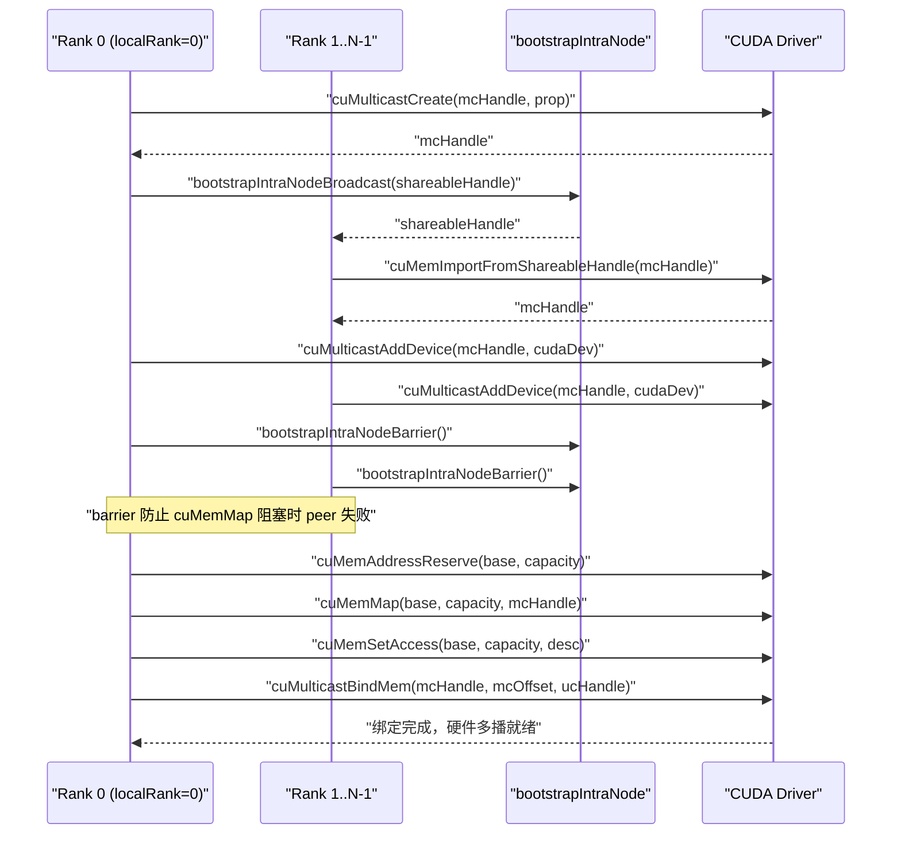
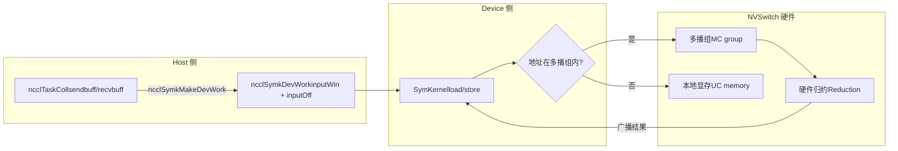

# 제 14 장: 대칭 메모리와 NVLS: 멀티캐스트 가속과 LSA 디바이스 측 직접 주소 지정

지난 장에서 우리는 머신 간 AllReduce를 따라가며 데이터가 GPU 메모리에서 NIC를 거쳐 상대방 GPU에 도달하는 과정을 보았고, 그 경로는 머신 간 통신을 해결합니다. 하지만 현대 AI 클러스터에서는 같은 머신, 심지어 같은 NVLink 도메인 내부의 GPU 간 통신량도 마찬가지로 막대합니다——데이터 병렬 훈련의 그래디언트 동기화, 텐서 병렬의 활성값 교환은 대부분 머신 내에서 발생합니다. 만약 머신 내 통신이 여전히 GPU→메모리→NIC→상대 NIC→메모리→GPU라는 머신 간 흐름을 따른다면, 같은 도시 내 택배를 굳이 항공편으로 보내는 것과 같아 지연이 낭비됩니다. 이번 장에서 분석할 것은 바로 NCCL이 머신 내 통신을 위해 준비한 두 가지 무기입니다: 대칭 메모리와 NVLS. 전자는 각 rank가 동일한 가상 주소로 모든 rank의 버퍼에 접근하게 하고, 후자는 NVSwitch 하드웨어의 멀티캐스트 능력을 활용해 리덕션을 수행합니다. 둘을 결합하면 작은 메시지 집합 통신의 지연을 하드웨어 한계에 가깝게 줄일 수 있습니다.

# 14.1 대칭 메모리: "3열 5번 좌석"이 모든 사람의 집에서 같은 위치를 가리키게 하기

## 직관적 모델

한 학급이 숙제장을 교환한다고 상상해 보세요. 전통적인 방식은: 각자 자신의 공책에 번호를 매기고 "장삼, 내 5번째 공책을 너에게; 이사, 내 8번째 공책을 너에게"라고 외치는 것입니다——각자 "누구의 공책이 어디에, 몇 번째인지"를 기억해야 합니다. 이것이 일반 통신입니다: 주소는**상대적이고 사적인**것이며, 상대방 데이터에 접근하려면 먼저 상대방의 주소 매핑을 알아야 합니다.

대칭 메모리는 다른 접근을 합니다: 반 전체가 "3열 5번 좌석"이라는 좌표를 약속하면, 모든 사람의 집에서 같은 물리적 위치를 가리킵니다. 그래서 장삼이 이사의 5번째 공책을 가지려면 "이사 집 3열 5번 좌석"이라고 바로 말하면 되고, 어떤 주소 변환도 필요 없습니다. 이것이 대칭 메모리의 핵심입니다:**각 rank의 버퍼가 모든 rank의 주소 공간에서 동일한 가상 주소로 매핑됩니다**。

> **[Design Inference & Architectural Trade-offs]**
> 대칭 메모리가 없다면 머신 내 집합 통신은 어떤 재앙을 맞이할까? 각 rank가 상대방 버퍼에 접근할 때마다 "주소 변환"을 거쳐야 합니다——테이블 조회, 오프셋 계산, 어쩌면 프로세스 간 통신으로 매핑 관계를 확인해야 할 수도 있습니다. 작은 메시지(몇 KB)의 경우 이 변환 오버헤드가 데이터 자체 전송보다 클 수 있습니다. 대칭 메모리는 이 오버헤드를 완전히 제거하며, 이것이 바로 "작은 메시지 지연을 현저히 줄이는" 근본 원인입니다.

## 데이터 구조와 메모리 레이아웃

대칭 메모리의 등록 타입은`ncclSymRegType_t`으로 설명되며,`ncclGetSymRegType`은 send/recv 윈도우에`NCCL_WIN_COLL_SYMMETRIC`플래그가 있는지에 따라 등록 상태를 네 가지로 나눕니다.

[FACT:src/sym_kernels.cc:395-412]

```c
ncclResult_t ncclGetSymRegType(struct ncclDevrWindow* sendWin, struct ncclDevrWindow* recvWin,
                               ncclSymRegType_t* winRegType) {
  bool isSendSymmReg = false;
  bool isRecvSymmReg = false;
  if (sendWin && (sendWin->winFlags & NCCL_WIN_COLL_SYMMETRIC)) isSendSymmReg = true;
  if (recvWin && (recvWin->winFlags & NCCL_WIN_COLL_SYMMETRIC)) isRecvSymmReg = true;
  // determine the registration type
  if (!isSendSymmReg && !isRecvSymmReg) {
    *winRegType = ncclSymSendNonregRecvNonreg;
  } else if (isSendSymmReg && !isRecvSymmReg) {
    *winRegType = ncclSymSendRegRecvNonreg;
  } else if (!isSendSymmReg && isRecvSymmReg) {
    *winRegType = ncclSymSendNonregRecvReg;
  } else if (isSendSymmReg && is isRecvSymmReg) {
    *winRegType = ncclSymSendRegRecvReg;
  }
  return ncclSuccess;
}
```

이 네 가지 상태는 이후 kernel이 어느 경로를 탈지 결정합니다: 완전 대칭 등록(`SendRegRecvReg`)은 가장 빠른 LSA 경로를, 완전 비등록(`SendNonregRecvNonreg`)은 일반 경로를, 혼합 상태는 특별 처리가 필요합니다.`winFlags`의`NCCL_WIN_COLL_SYMMETRIC`비트가 바로 "이 윈도우가 대칭 등록되었는지"의 표시입니다.

대칭 메모리의 초기화 진입점은`ncclSymkInitOnce`이며, 이것은 핵심적인 일을 합니다: 현재 통신 도메인이 LSA 멀티캐스트를 지원하는지 판단합니다(`hasLsaMultimem`）。

[FACT:src/sym_kernels.cc:185-196]

```c
ncclResult_t ncclSymkInitOnce(struct ncclComm* comm) {
  // ncclTeamLsa() below calls this internally but drops the error code so we do it here.
  NCCLCHECK(ncclDevrInitOnce(comm));

  struct ncclSymkState* symk = &comm->symkState;
  if (!symk->initialized) {
    symk->initialized = true;
    struct ncclDevCommRequirements reqs = NCCL_DEV_COMM_REQUIREMENTS_INITIALIZER;
    // Disable LSA multicast for cross-clique since NVLS isn't available across cliques
    symk->hasLsaMultimem =
      ncclNvlsSymmetricMultimemEnabled(comm) && ncclTeamLsa(comm).nRanks > 2 && !comm->p2pCrossClique;
    reqs.lsaMultimem = symk->hasLsaMultimem;
```

`hasLsaMultimem`세 가지 조건이 모두 충족되어야 합니다: NVLS 대칭 멀티캐스트가 활성화되어 있고, LSA 팀의 rank 수가 2보다 크며(두 rank는 직접 점대점 통신이 더 빠르므로 멀티캐스트가 필요 없음), clique를 넘지 않아야 합니다(clique를 넘으면 NVSwitch 멀티캐스트를 사용할 수 없음). 이 판단은`reqs.lsaMultimem`의 설정 여부를 직접 결정하며, 나아가 디바이스 측 통신자의 리소스 할당에 영향을 미칩니다.

## 시나리오 기반 단계별 워크스루

AllReduce를 한 번 실행한다고 가정해 봅시다. 메시지 크기는 4KB이고, 8개의 rank가 동일한 NVLink 도메인 내에 있습니다.`ncclSymkMask`은 어떤 kernel을 사용할 수 있는지 결정합니다.

[FACT:src/sym_kernels.cc:304-352]

```c
uint32_t ncclSymkMask(struct ncclComm* comm, ncclFunc_t coll, int /*ncclDevRedOp_t*/ red, ncclDataType_t ty,
                      size_t nElts, bool symAligned16B) {
  uint32_t kmask = kernelMask_coll(coll);

  bool hasSTMC = comm->symkState.hasLsaMultimem;
  bool hasLDMC = false;
  if (comm->symkState.hasLsaMultimem) {
    switch (ty) {
    case ncclInt32:
    ...
      hasLDMC = red == ncclDevSum || red == ncclDevMinMax || red == ncclDevSumPostDiv;
      break;
    ...
    }
  }
  if (!hasSTMC) kmask &= ~kernelMask_STMC;
  if (!hasLDMC) kmask &= ~kernelMask_LDMC;
```

첫 번째 단계:`kernelMask_coll`은 집합 유형(AllReduce)에 따라 후보 kernel 집합`kernelMask_AR`을 가져옵니다. 두 번째 단계:`hasLsaMultimem`을 확인하고, 멀티캐스트가 지원되면 데이터 타입과 리덕션 연산이 LDMC(Load-Multicast)를 지원하는지 추가로 판단합니다. 세 번째 단계: 비트마스크로 지원되지 않는 기능을 제거합니다——`kmask &= ~kernelMask_STMC`은 STMC를 지원하지 않는 kernel을 모두 제거합니다.

다음은 크기 제한입니다:

[FACT:src/sym_kernels.cc:336-342]

```c
  size_t nBytes = alignUp(nElts * ncclTypeSize(ty), NCCL_SYM_KERNEL_CELL_SIZE);
  size_t nBusBytes = (coll == ncclFuncAllReduce ? 1 : comm->nRanks) * nBytes;
  // LL kernels use 32-bit ints to track element counts and indices.
  if (nBusBytes >= (size_t(2) = 32 * (size_t(2) nRanks;
  kmask &= needGin ? kernelMask_Gin : ~kernelMask_Gin;
  return kmask;
```

TMA는 SMEM 용량이 기준을 충족해야 하고(`ncclSymkTmaAvailable`확인`maxSharedMemOptin`) 16바이트 정렬이어야 합니다. GIN은 "LSA 팀의 rank 수가 전체 rank 수보다 작을 때"만 필요합니다——즉, 통신 도메인이 LSA 경계를 넘어설 때(네트워크를 거쳐야 할 때)만 GIN이 의미가 있습니다. 전체 통신 도메인이 LSA 내에 있으면 GIN kernel은 제거됩니다.

## 동시성 제어와 하드웨어 상호작용

대칭 메모리의 주소 해석은 최종적으로 디바이스 측에서 이루어집니다.`ncclSymkMakeDevWork`은 호스트 측 작업 설명을 디바이스 측에서 읽을 수 있는 작업 항목으로 변환합니다.

[FACT:src/sym_kernels.cc:380-393]

```c
ncclResult_t ncclSymkMakeDevWork(struct ncclComm* comm, struct ncclTaskColl* task, struct ncclSymkDevWork* outDevWork) {
  outDevWork->rootRank = task->root;
  outDevWork->redOpArg = task->opDev.scalarArg;
  outDevWork->nElts = task->count;
  outDevWork->inputWin = task->sendWin ? task->sendWin->vidmem : nullptr;
  outDevWork->inputOff =
    task->sendWin ? (uint8_t*)task->sendbuff - (uint8_t*)task->sendWin->userPtr : (size_t)task->sendbuff;
  outDevWork->outputWin = task->recvWin ? task->recvWin->vidmem : nullptr;
  outDevWork->outputOff =
    task->recvWin ? (uint8_t*)task->recvbuff - (uint8_t*)task->recvWin->userPtr : (size_t)task->recvbuff;
  outDevWork->sChannelId = 0xffff;
  outDevWork->nChannels = 0;
  return ncclSuccess;
}
```

주의`inputOff`의 계산: sendWin이 존재하면(대칭 등록 윈도우), 오프셋은`sendbuff - sendWin->userPtr`입니다——이것은**윈도우 내 오프셋**이며, 디바이스 측에서`inputWin`(윈도우 베이스 주소)에`inputOff`을 더하면 실제 주소를 계산할 수 있습니다. sendWin이 존재하지 않으면 오프셋은 바로`sendbuff`의 절대 주소입니다. 이 설계 덕분에 디바이스 측 kernel은 동일한 로직으로 등록 및 비등록 버퍼를 처리할 수 있습니다.

`ncclSymkInitOnce`에서는 GIN 관련 리소스 요구사항도 초기화하는데, 여기에는 inbox, outbox, accumulation buffer, rail signal이 포함됩니다.

[FACT:src/sym_kernels.cc:208-251]

```c
    struct ncclDevResourceRequirements ginInboxRailReq = {};
    struct ncclDevResourceRequirements ginOutboxReq = {};
    struct ncclDevResourceRequirements rsGinAccumReq = {};
    struct ncclDevResourceRequirements railSignalReq = {};
    if (ncclParamSymGinKernelsEnable() && ncclTeamLsa(comm).nRanks nRanks) {
      int maxBlocks;
      size_t bufSize;
      getRequirements_gin(comm, &maxBlocks, &bufSize);

      maxBlocks = std::max(maxBlocks, comm->config.minCTAs);
      maxBlocks = std::min(maxBlocks, comm->config.maxCTAs);
      if (ncclParamSymCTAs() >= 1) maxBlocks = ncclParamSymCTAs();
      maxBlocks = std::min(maxBlocks, ncclSymkMaxBlocks);
      symk->maxGinInboxBlocks = maxBlocks;
      symk->kcomm.rsGinAccumBytesPerBlock = ncclSymkRsGinAccumBytesPerBlock();

      rsGinAccumReq.bufferSize = (size_t)maxBlocks * symk->kcomm.rsGinAccumBytesPerBlock;
      rsGinAccumReq.bufferAlign = 128;
      rsGinAccumReq.outBufferHandle = &symk->kcomm.rsGinAccumBuf;
      ...
      uint32_t railSignalCount = ncclTeamRail(comm).nRanks * ncclSymkMaxBlocks;
      ...
      reqs.barrierCount = ncclSymkMaxBlocks;
      reqs.ginConnectionType = NCCL_GIN_CONNECTION_RAIL;
      reqs.ginStrongSignalsRequired = true;
      reqs.ginVaSignalsRequired = true;
    }
```

`getRequirements_gin`은 튜닝 모델로 필요한 block 수와 버퍼 크기를 계산한 다음`[minCTAs, maxCTAs]`구간으로 clamp됩니다.`rsGinAccumBytesPerBlock`은 각 block의 누적 버퍼 크기이며, 128바이트로 정렬됩니다——이는 캐시 라인 크기로, 거짓 공유를 방지합니다.

```mermaid
flowchart TD
    start["ncclSymkMask(comm, coll, red, ty, nElts)"] --> coll{"集合类型?"}
    coll -->|AllGather| mask_ag["kmask = kernelMask_AG"]
    coll -->|AllReduce| mask_ar["kmask = kernelMask_AR"]
    coll -->|ReduceScatter| mask_rs["kmask = kernelMask_RS"]
    mask_ag --> check_stmc{"hasLsaMultimem?"}
    mask_ar --> check_stmc
    mask_rs --> check_stmc
    check_stmc -->|否| clear_stmc["kmask &= ~kernelMask_STMC"]
    check_stmc -->|是| check_ldmc{"数据类型+归约支持LDMC?"}
    clear_stmc --> size_check
    check_ldmc -->|否| clear_ldmc["kmask &= ~kernelMask_LDMC"]
    check_ldmc -->|是| size_check
    clear_ldmc --> size_check
    size_check{"nBusBytes >= 2GB?"} -->|是| clear_ll["kmask &= ~kernelMask_LL"]
    size_check -->|否| tma_check
    clear_ll --> tma_check{"TMA可用且16B对齐?"}
    tma_check -->|否| clear_tma["kmask &= ~kernelMask_Tma"]
    tma_check -->|是| gin_check
    clear_tma --> gin_check{"需要GIN? LSA rank |否| clear_gin["kmask &= ~kernelMask_Gin"]
    gin_check -->|是| done
    clear_gin --> done["返回 kmask"]
```

이 그림은`ncclSymkMask`의 의사결정 체인을 완전히 묘사합니다: 집합 유형에서 출발하여 멀티캐스트 지원, 데이터 타입, 크기 경계, TMA 가용성, GIN 필요성의 다섯 가지 필터를 차례로 거쳐 최종적으로 비트마스크를 반환합니다. 각 필터는 한 무리의 kernel을 제거할 수 있으며, 이는 NCCL이 "시나리오에 따라 최적의 kernel을 선택"하는 모습을 보여줍니다.

## 프로덕션 함정 회피 가이드

**함정 1: clique를 넘을 때 멀티캐스트가 조용히 무효화됩니다.** `hasLsaMultimem`의 세 번째 조건은`!comm->p2pCrossClique`입니다. 클러스터에 MNNVL(Multi-Node NVLink)이 구성되어 있지만 일부 rank가 clique를 넘으면 멀티캐스트가 비활성화되고 성능이 조용히 일반 경로로 퇴화합니다. 문제를 진단할 때는`ncclNvlsSymmetricMultimemEnabled`의 로그 출력을 확인하세요.

**함정 2: 16바이트 정렬의 숨은 요구사항.** `ncclSymkMask`에서`if (!symAligned16B) kmask &= ~kernelMask_Tma;`——사용자 버퍼가 16바이트 정렬이 아니면 TMA kernel이 제거됩니다. TMA는 Hopper/Blackwell에서 가장 빠른 복사 엔진이며, 이를 잃는다는 것은 성능 저하를 의미합니다. 프로덕션 환경에서 사용자가 전달하는 buffer는 흔히`cudaMalloc`에서 오므로 자연스럽게 정렬되지만, 커스텀 allocator나 슬라이스에서 오면 함정에 빠질 수 있습니다.

**함정 3: 2GB 경계.**LL kernel은 32비트 인덱스를 사용하므로 버스 바이트 수가 2GB를 초과하면 제거됩니다. 대규모 모델 학습에서는 단일 AllReduce의 그래디언트가 이 값을 초과할 수 있으며, 이때 NCCL은 자동으로 STMC 또는 Simple 프로토콜로 전환합니다. 이는 버그가 아니지만, LL 프로토콜을 수동으로 지정하면`ncclInvalidArgument`。

---

# 14.2 NVLS: NVSwitch 하드웨어가 대신 리덕션을 수행하게 하기

## 직관적 모델

전통적인 AllReduce는 "소프트웨어 리덕션"입니다: 각 GPU가 데이터를 이웃에게 보내고, 이웃이 덧셈을 수행한 뒤 다시 전달합니다——데이터가 GPU 사이를 오가며, 덧셈은 SM에서 실행됩니다. 이는 마치 8명이 쪽지를 돌려가며 합계를 계산하는 것과 같아서, 각자가 한 번 읽고, 한 번 더하고, 다시 전달해야 합니다.

NVLS는 다른 접근을 취합니다: NVSwitch 칩에 내장된**멀티캐스트(multicast)와 리덕션(reduction) 기능**데이터를 멀티캐스트 주소에 쓰면 NVSwitch가 자동으로 모든 멤버에게 브로드캐스트하고 하드웨어에서 덧셈을 완료한다. 이는 마치 8명이 같은 화이트보드에 숫자를 쓰면 화이트보드가 자동으로 합계를 표시하는 것과 같다—GPU는 한 번 쓰고 한 번 읽으며, 중간의 이동과 덧셈은 모두 스위치 하드웨어가 수행한다.

NVLS가 없으면 노드 내 AllReduce의 대역폭이 GPU 간 점대점 링크에 의해 제한되고, SM이 덧셈에 많은 사이클을 소모해야 한다. NVLS는 이 두 가지를 모두 하드웨어로 오프로드하여 SM이 다른 연산을 할 수 있게 한다.

## 데이터 구조와 메모리 레이아웃

NVLS의 핵심은**멀티캐스트 그룹(MC group)**。`ncclMcGroup`구조체는 멀티캐스트 그룹의 전체 상태를 설명한다.

[FACT:src/transport/multicast.cc:72-77]

```c
struct ncclMcGroup {
  CUmemGenericAllocationHandle handle;  // the MC object
  char* base;                          // mapped MC VA base
  size_t capacity;                      // total mapped VA size
  int dev;                           // local device, for unbind
};
```

네 개의 필드:`handle`는 CUDA 멀티캐스트 객체의 핸들,`base`는 멀티캐스트 가상 주소의 베이스,`capacity`는 총 매핑 크기,`dev`는 로컬 디바이스 번호(언바인딩용)이다. 여기에는 잠금이 없다—멀티캐스트 그룹의 생성과 소멸은 초기화/소멸 단계에서 이루어지며 핫 패스에 있지 않다.

멀티캐스트 그룹은 여러 개로 분할된다**파티션(partition)**, 각 파티션은 불변 슬라이스이다.`ncclMcPartition`는 파티션을 설명한다.

[FACT:src/transport/multicast.cc:162-170]

```c
  // A partition is self-sufficient for binds: it carries the group's handle, device and
  // bind granularity alongside its own extent.
  for (int i = 0; i base + outPartitions[i].offset;
    outPartitions[i].mcHandle = mcHandle;
    outPartitions[i].minGranularity = minGran;
    outPartitions[i].dev = comm->cudaDev;
  }
```

각 파티션은 자체`offset`、`size`、`ptr`, 그리고 소속 그룹의`mcHandle`、`minGranularity`、`dev`을 가진다. 이러한 "자급자족" 설계 덕분에 파티션은 그룹 정보를 다시 조회할 필요 없이 독립적으로 바인딩 함수에 전달될 수 있다.

## 시나리오 기반 단계별 워크스루

8개의 rank가 NVLS 도메인을 구축한다고 가정하자.`ncclMcGroupBuildPartitions`은 멀티캐스트 그룹을 생성하고 파티션을 분할하는 역할을 한다.

[FACT:src/transport/multicast.cc:79-121]

```c
ncclResult_t ncclMcGroupBuildPartitions(struct ncclComm* comm, const struct ncclMcRequest* requests, int nRequests,
                                        struct ncclMcGroup** outGroup, struct ncclMcPartition* outPartitions) {
  ...
  mcprop.numDevices = comm->localRanks;
  mcprop.handleTypes = ncclCuMemHandleType;
  mcprop.flags = 0;
  mcprop.size = 0;
  for (int i = 0; i  recGran ? requests[i].alignment : recGran;
    ALIGN_SIZE(capacity, align);
    size_t slice = requests[i].size;
    ALIGN_SIZE(slice, recGran);
    outPartitions[i].offset = capacity;
    outPartitions[i].size = slice;
    capacity += slice;
  }
```

1단계: 모든 요청의 크기를 누적하여 멀티캐스트 그룹 총 크기를 구한다. 2단계: CUDA의 권장 입자 크기와 최소 입자 크기를 조회한다—이는 하드웨어 제약으로, 멀티캐스트 객체의 주소와 크기는 입자 크기의 정수 배여야 한다. 3단계: bump 할당—각 요청마다 한 조각을 잘라내고, 오프셋과 크기를 권장 입자 크기에 맞춘다.`ALIGN_SIZE(capacity, align)`은 각 슬라이스의 시작 오프셋이 유효한 바인딩 오프셋임을 보장한다.

다음은 rank 간 생성과 임포트이다:

[FACT:src/transport/multicast.cc:125-146]

```c
  if (comm->localRank == 0) {
    NCCLCHECKGOTO(ncclMcCreate(comm, &mcprop, comm->localRank, comm->localRanks, &mcHandle, shareableHandle), ret,
                  fail);
    mcCreated = 1;
    NCCLCHECKGOTO(bootstrapIntraNodeBroadcast(comm->bootstrap, comm->localRankToRank, comm->localRank, comm->localRanks,
                                              0, shareableHandle, NVLS_HANDLE_SIZE),
                  ret, fail);
  } else {
    NCCLCHECKGOTO(bootstrapIntraNodeBroadcast(comm->bootstrap, comm->localRankToRank, comm->localRank, comm->localRanks,
                                              0, shareableHandle, NVLS_HANDLE_SIZE),
                  ret, fail);
    NCCLCHECKGOTO(ncclMcImport(comm, shareableHandle, comm->localRankToRank[0], &mcHandle), ret, fail);
    mcCreated = 1;
  }
  CUCHECKGOTO(cuMulticastAddDevice(mcHandle, comm->cudaDev), ret, fail);

  // cuMemMap of an MC object blocks until every device has been added. This
  // abort-aware barrier makes a peer failing before cuMulticastAddDevice trip the
  // abort flag here instead of stranding survivors in the blocking cuMemMap.
  NCCLCHECKGOTO(bootstrapIntraNodeBarrier(comm->bootstrap, comm->localRankToRank, comm->localRank, comm->localRanks,
                                          comm->localRankToRank[0]),
                ret, fail);
```

localRank 0이 멀티캐스트 객체를 생성한 후 bootstrap을 통해 shareable handle을 브로드캐스트하고, 다른 rank는 handle을 받아 임포트한다.`cuMulticastAddDevice`은 로컬 디바이스를 멀티캐스트 그룹에 추가한다. 저 barrier에 주목하라—주석이 명확히 설명한다:`cuMemMap`은 모든 디바이스가 참여할 때까지 블록되며, 만약 어떤 peer가`cuMulticastAddDevice`이전에 실패하면 생존자는`cuMemMap`에서 교착된다. 이 barrier는 실패가 블록되기 전에 abort 플래그로 포착되게 한다.

마지막은 매핑과 접근 권한 설정이다:

[FACT:src/transport/multicast.cc:148-155]

```c
  // Reserve and map the whole MC VA once; each consumer slice is a view into it.
  CUCHECKGOTO(cuMemAddressReserve(&base, capacity, recGran, 0U, 0), ret, fail);
  CUCHECKGOTO(cuMemMap(base, capacity, 0, mcHandle, 0), ret, fail);
  mapped = 1;
  desc.flags = CU_MEM_ACCESS_FLAGS_PROT_READWRITE;
  desc.location.type = CU_MEM_LOCATION_TYPE_DEVICE;
  desc.location.id = comm->cudaDev;
  CUCHECKGOTO(cuMemSetAccess(base, capacity, &desc, 1), ret, fail);
```

전체 멀티캐스트 VA는 한 번만 예약되고 매핑되며, 각 소비자 슬라이스는 이 VA의 뷰이다. 이는 "한 번 매핑, 여러 번 슬라이스" 설계로—각 소비자가 개별적으로 멀티캐스트 객체를 생성하는 것보다 자원을 절약한다.

## 동시성 제어와 하드웨어 상호작용

바인딩은 NVLS의 가장 핵심적인 작업이다.`ncclMcPartitionBindMem`은 UC(유니캐스트) 메모리 핸들을 멀티캐스트 그룹의 특정 오프셋에 바인딩한다.

[FACT:src/transport/multicast.cc:200-225]

```c
ncclResult_t ncclMcPartitionBindMem(const struct ncclMcPartition* partition, size_t offsetInPartition,
                                    CUmemGenericAllocationHandle mem, size_t memOffset, size_t bindSize) {
  // A bind overrunning its partition would corrupt the next consumer's partition; fail
  // cleanly instead (possible when UC rounding exceeds the MC-rounded partition).
  if (offsetInPartition + bindSize > partition->size) {
    WARN("NVLS MC bind of size %zu at slice offset %zu exceeds slice size %zu (UC/MC granularity mismatch)", bindSize,
         offsetInPartition, partition->size);
    return ncclInternalError;
  }
  size_t mcOffset = partition->offset + offsetInPartition;
  ...
  CUresult err = CUPFN(cuMulticastBindMem(partition->mcHandle, mcOffset, mem, memOffset, bindSize, 0 /*flags*/));
  if (err != CUDA_SUCCESS) {
    ...
    WARN("Failed to bind NVLink SHARP (NVLS) Multicast memory of size %zu at MC group %llx offset %zu : CUDA error %d "
         "'%s'.\nThis is usually caused by a system or configuration error in the Fabric Manager or NVSwitches.\n"
         "Disable NVLS (NCCL_NVLS_ENABLE=0) if you wish to avoid this error in the future.",
         bindSize, partition->mcHandle, mcOffset, err, errStr);
    return ncclUnhandledCudaError;
  }
  return ncclSuccess;
}
```

첫 번째 방어선은 경계 검사이다:`offsetInPartition + bindSize > partition->size`이면 오류를 보고한다. 주석이 그 이유를 설명한다—UC 메모리의 입자 크기가 MC 파티션보다 클 수 있으며, UC 정렬 후 MC 파티션 경계를 초과하면 다음 소비자의 파티션을 침범하게 된다. 이는 전형적인 "두 입자 크기 불일치" 함정이다.

`cuMulticastBindMem`은 하드웨어 호출로, 주석에 따르면 "blocks until all ranks have been added to the group"이다—이것이 NVLS에서 가장 문제가 발생하기 쉬운 부분이다. Fabric Manager 설정 오류나 NVSwitch 펌웨어 문제가 있으면 여기서 멈추거나 오류를 반환한다. 오류 메시지에서 사용자에게 직접`NCCL_NVLS_ENABLE=0`을 권장하는데, 이는 프로덕션 환경의 표준 탈출구이다.

사용자 버퍼 등록을 위한 "바인딩 시도" 변형도 있다:

[FACT:src/transport/multicast.cc:237-268]

```c
ncclResult_t ncclMcPartitionTryBindAddr(const struct ncclMcPartition* partition, size_t offsetInPartition,
                                        CUdeviceptr address, size_t bindSize, enum ncclMcBindStatus* outStatus) {
  const char* errStr = NULL;

  *outStatus = ncclMcBindStatusTransient;
  if (offsetInPartition + bindSize > partition->size) {
    ...
    return ncclInternalError;
  }
  size_t mcOffset = partition->offset + offsetInPartition;
  CUresult err = CUPFN(cuMulticastBindAddr(partition->mcHandle, mcOffset, address, bindSize, 0 /*flags*/));
  if (err == CUDA_SUCCESS) {
    *outStatus = ncclMcBindStatusOk;
    return ncclSuccess;
  }

  (void)pfn_cuGetErrorString(err, &errStr);
  // Only an outright rejection of the input is a property of the buffer. Anything else,
  // notably OUT_OF_MEMORY, may succeed later, so it must not be reported as permanent.
  if (err == CUDA_ERROR_INVALID_VALUE || err == CUDA_ERROR_NOT_SUPPORTED || err == CUDA_ERROR_NOT_PERMITTED) {
    *outStatus = ncclMcBindStatusNoSupport;
    ...
  } else {
    WARN("NVLS Multicast bind of size %zu at MC group %llx offset %zu dev %d failed transiently: CUDA error %d '%s'.\n"
         "The buffer is left unregistered for this operation and will be retried; repeated occurrences indicate "
         "sustained resource pressure.",
         bindSize, partition->mcHandle, mcOffset, partition->dev, err, errStr);
  }
  return ncclSuccess;
}
```

여기에는 정교한 오류 분류가 있다:`CUDA_ERROR_INVALID_VALUE`、`NOT_SUPPORTED`、`NOT_PERMITTED`은`ncclMcBindStatusNoSupport`로 분류된다—이는**영구적 실패**로, 해당 버퍼 자체가 멀티캐스트 바인딩을 지원하지 않음을 의미한다. 반면 다른 오류(특히`OUT_OF_MEMORY`)는`ncclMcBindStatusTransient`로 분류된다—이는**일시적 실패**로, 재시도할 수 있다. 이 구분은 매우 중요하다: OOM을 영구적 실패로 취급하면 성공할 수 있었던 등록을 잘못 포기하게 되고, 매개변수 오류를 일시적 실패로 취급하면 무한 재시도하게 된다.

## 프로덕션 함정 회피 가이드

**함정 1: Fabric Manager 설정 오류로 인한`cuMulticastBindMem`멈춤.**이는 NVLS의 가장 전형적인 프로덕션 장애이다. 오류 메시지가 Fabric Manager 또는 NVSwitch를 명확히 지목한다. 진단 단계: 먼저`NCCL_NVLS_ENABLE=0`으로 문제가 사라지는지 확인한 후, Fabric Manager 로그와 NVSwitch 펌웨어 버전을 점검한다.

**함정 2: UC/MC 입자 크기 불일치.** `ncclMcPartitionBindMem`의 경계 검사가 이 문제를 포착하지만, "UC/MC granularity mismatch" 경고가 보이면 특정 요청의 UC 크기가 정렬 후 MC 파티션을 초과했음을 의미한다. 이는 보통 요청 크기가 입자 크기 경계에 근접할 때 발생한다.

**함정 3: 멀티캐스트 그룹 생성 실패 후 자원 누수.** `ncclMcGroupBuildPartitions`의 fail 경로는`CUCALL`(best-effort)를 사용하며`CUCHECK`：

[FACT:src/transport/multicast.cc:179-184]

```c
fail:
  // Best-effort (CUCALL) so a failing cleanup op cannot skip releasing the MC handle.
  if (mapped) CUCALL(cuMemUnmap(base, capacity));
  if (base) CUCALL(cuMemAddressFree(base, capacity));
  if (mcCreated) CUCALL(cuMemRelease(mcHandle));
  return ret;
```

주석은 그 이유를 설명한다: cleanup 작업 자체가 실패하더라도 그 때문에 MC handle 해제를 건너뛸 수는 없다—MC slot은 희소 자원이며, 누수가 발생하면 이후 생성이 실패할 수 있다. 이는 "정리 경로는 반드시 최선을 다해야 한다"는 전형적인 설계이다.



이 시퀀스 다이어그램은 멀티캐스트 그룹이 생성에서 바인딩까지 이르는 전체 흐름을 묘사한다. 핵심은 그 barrier이다—이는 "peer 실패"와 "cuMemMap 블로킹"을 분리하여 생존자가 교착 상태에 빠지는 것을 방지한다.

---

# 14.3 대칭 메모리와 NVLS의 결합: LSA 포인터가 디바이스 측에서 해석되는 방법

## 직관적 모델

대칭 메모리는 "주소 일관성" 문제를 해결하고, NVLS는 "하드웨어 리덕션" 문제를 해결한다. 하지만 둘이 실제로 협력하려면 핵심 메커니즘이 하나 더 필요하다:**디바이스 측은 어떻게 어떤 주소가 대칭이며 멀티캐스트 경로를 탈 수 있는지 아는가?**

답은 LSA(Load-Store Accessible) 포인터에 있다. LSA는 "로드-스토어 접근 가능"의 약자로, 이 포인터가 가리키는 메모리를 GPU가 일반 load/store 명령어로 직접 접근할 수 있다는 뜻이다—물리적으로 로컬에 있든 원격에 있든 상관없이. 주소가 멀티캐스트 그룹 내에 있으면 load/store는 NVSwitch 하드웨어에 의해 가로채져 브로드캐스트된다.

## 데이터 구조와 메모리 레이아웃

`ncclSymkDevWork`은 디바이스 측 작업 디스크립터로, 대칭 메모리의 핵심 정보를 담고 있다.

[FACT:src/sym_kernels.cc:380-393]

```c
ncclResult_t ncclSymkMakeDevWork(struct ncclComm* comm, struct ncclTaskColl* task, struct ncclSymkDevWork* outDevWork) {
  outDevWork->rootRank = task->root;
  outDevWork->redOpArg = task->opDev.scalarArg;
  outDevWork->nElts = task->count;
  outDevWork->inputWin = task->sendWin ? task->sendWin->vidmem : nullptr;
  outDevWork->inputOff =
    task->sendWin ? (uint8_t*)task->sendbuff - (uint8_t*)task->sendWin->userPtr : (size_t)task->sendbuff;
  outDevWork->outputWin = task->recvWin ? task->recvWin->vidmem : nullptr;
  outDevWork->outputOff =
    task->recvWin ? (uint8_t*)task->recvbuff - (uint8_t*)task->recvWin->userPtr : (size_t)task->recvbuff;
  outDevWork->sChannelId = 0xffff;
  outDevWork->nChannels = 0;
  return ncclSuccess;
}
```

`inputWin`은 윈도우의 디바이스 측 가상 주소이고(`vidmem`），`inputOff`은 윈도우 내 버퍼의 오프셋이다. 디바이스 측 kernel이 이 두 값을 받으면`inputWin + inputOff`를 계산하여 실제 주소를 얻는다. 이 주소가 멀티캐스트 그룹 내에 있으면 하드웨어가 자동으로 브로드캐스트를 처리한다.

`ncclSymkInitOnce`에는 LSA barrier와 LLA2A(Low-Latency All-to-All) 리소스도 설정된다.

[FACT:src/sym_kernels.cc:197-206]

```c
    reqs.lsaBarrierCount = ncclSymkMaxBlocks;
    reqs.ginStrongSignalsRequired = false;
    reqs.ginVaSignalsRequired = false;

    struct ncclDevResourceRequirements lla2aReq;
    ncclLLA2ACreateRequirement(ncclSymkMaxBlocks,
                               ncclLLA2ACalcSlots(ncclTeamLsa(comm).nRanks * ncclSymkMaxThreads, ncclSymkLLMaxEltSize),
                               &symk->kcomm.lsaLLA2A, &lla2aReq);
    lla2aReq.next = reqs.resourceRequirementsList;
    reqs.resourceRequirementsList = &lla2aReq;
```

`lsaBarrierCount`을`ncclSymkMaxBlocks`로 설정—각 block마다 barrier 슬롯 하나. LLA2A는 저지연 all-to-all의 약자로, LSA 도메인 내에서 빠른 데이터 교환에 사용된다.`ncclLLA2ACalcSlots`은 rank 수, 스레드 수, 최대 요소 크기에 따라 필요한 슬롯 수를 계산한다.

## 시나리오 기반 단계별 워크스루

한 번의 AllReduce가`AllReduce_AGxLLMC_R`kernel(AllGather + LL + MC + Reduce)을 사용한다고 가정하자. 이 kernel의 워크플로는:

1. **AllGather 단계**: 각 rank가 자신의 데이터를 멀티캐스트 그룹에 쓰면, NVSwitch 하드웨어가 모든 rank에 브로드캐스트한다.

2. **Reduce 단계**: 각 rank가 멀티캐스트 그룹에서 모든 rank의 데이터를 읽고 로컬에서 리덕션을 수행한다.

`ncclSymkMask`은 이 kernel이 사용 가능한지 확인한다.`kernelMask_LL`은`AllReduce_AGxLLMC_R`을 포함하지만, 전제는`hasLsaMultimem`이 참이어야 한다(그렇지 않으면`kernelMask_STMC`이 제거되고,`AllReduce_AGxLLMC_R`은 STMC 집합에 속한다).

잠깐, 여기 세부 사항이 있다:`kernelMask_STMC`이`AllReduce_AGxLLMC_R`을 포함하는가? 소스를 보자:

[FACT:src/sym_kernels.cc:17-21]

```c
constexpr uint32_t kernelMask_STMC =
  1 nvlsChannels;
    size_t creditSize = nChannels * 2 * memSize * nHeads;
    int nvlsStepSize = comm->nvlsChunkSize;

    NCCLCHECKGOTO(ncclCalloc(&comm->nvlsResources, 1), res, fail);
    comm->nvlsResources->inited = false;
    comm->nvlsResources->refCount = 1;
    comm->nvlsResources->nChannels = nChannels;
    comm->nvlsResources->nHeads = nHeads;
    comm->nvlsResources->chunkSize = comm->nvlsChunkSize;
    comm->nvlsResources->treeMaxChunkSize = comm->nvlsTreeMaxChunkSize;
    resources = comm->nvlsResources;

    for (int c = 0; c accessDesc, 0, sizeof(resources->accessDesc));
    resources->accessDesc.flags = CU_MEM_ACCESS_FLAGS_PROT_READWRITE;
    resources->accessDesc.location.type = CU_MEM_LOCATION_TYPE_DEVICE;
    resources->accessDesc.location.id = comm->cudaDev;
    resources->dev = comm->cudaDev;

    // Build the single shared MC group for this NVLS domain. The data slice is
    // reserved here but bound later by ncclNvlsBufferSetup.
    {
      size_t buffSize = nvlsStepSize * NCCL_STEPS;
      size_t dataSize = nChannels * 2 * buffSize * nHeads;
      size_t ubSize = ncclNvlsUbSize(comm);
      struct ncclMcRequest requests[3] = {{creditSize, 0}, {dataSize, 0}, {ubSize, 0}};
      struct ncclMcPartition partitions[3];
      NCCLCHECKGOTO(ncclMcGroupBuildPartitions(comm, requests, 3, &resources->mcGroup, partitions), res, fail);
      resources->creditPartition = partitions[0];
      resources->dataPartition = partitions[1];
      if (ubSize) {
        resources->ubPartition = partitions[2];
        NCCLCHECKGOTO(ncclMcArenaInit(comm, &resources->ubArena, &resources->ubPartition), res, fail);
        resources->ubEnabled = true;
      }
      NCCLCHECKGOTO(nvlsAllocBindUc(comm, &resources->creditPartition, creditSize, &resources->creditUc), res, fail);
    }
```

멀티캐스트 그룹이 세 개의 파티션으로 나뉜다:`creditPartition`(크레딧),`dataPartition`(데이터),`ubPartition`(사용자 버퍼). credit 파티션은 동기화에 사용된다—각 channel은 독립적인 head/tail 포인터를 가지며, 멀티캐스트 그룹을 통해 공유된다.

credit 초기화는 뒤의 루프에서 이루어진다:

[FACT:src/transport/nvls.cc:456-491]

```c
    for (int h = 0; h nRanks + 1 + h;
      for (int c = 0; c channels + c;
        char* mem = NULL;
        struct ncclChannelPeer* peer = channel->peers[nvlsPeer];

        // Reduce UC -> MC
        mem = (char*)resources->creditUc.ptr + (h * 2 * nChannels + c) * memSize;
        peer->send[1].transportComm = &nvlsTransport.send;
        peer->send[1].conn.buffs[NCCL_PROTO_SIMPLE] = NULL;
        peer->send[1].conn.head = (uint64_t*)mem;
        peer->send[1].conn.tail = (uint64_t*)(mem + memSize / 2);
        peer->send[1].conn.stepSize = nvlsStepSize;
        mem = (char*)resources->creditPartition.ptr + (h * 2 * nChannels + c) * memSize;
        peer->recv[0].transportComm = &nvlsTransport.recv;
        peer->recv[0].conn.buffs[NCCL_PROTO_SIMPLE] = NULL;
        peer->recv[0].conn.head = (uint64_t*)mem;
        peer->recv[0].conn.tail = (uint64_t*)(mem + memSize / 2);
        peer->recv[0].conn.stepSize = nvlsStepSize;
        peer->recv[0].conn.flags |= NCCL_NVLS_MIN_POLL;
```

각 head와 channel 조합마다 독립적인 credit 영역이 있다.`head`과`tail`은 64비트 포인터이고,`memSize`은 64바이트(`size_t memSize = 64;`)이므로 head와 tail이 각각 32바이트를 차지한다—정확히 캐시 라인 절반이다.`NCCL_NVLS_MIN_POLL`플래그는 수신 측이 최소 폴링 모드를 사용하도록 하여 CPU 오버헤드를 줄인다.

## 프로덕션 함정 회피 가이드

**함정 1: credit 파티션의 head/tail 경쟁.**여러 channel이 같은 멀티캐스트 그룹을 공유하지만, 각 channel은 독립적인 credit 영역을 가진다. channel 수가 부적절하게 설정되면(예:`nvlsCTAs`를 너무 크게 설정), credit 영역이 팽창하여 소중한 멀티캐스트 주소 공간을 차지한다.`ncclNvlsChannels`은 GPU 아키텍처와 노드 수에 따라 channel 수를 자동으로 조정한다:

[FACT:src/transport/nvls.cc:100-133]

```c
  if (comm->config.nvlsCTAs != NCCL_CONFIG_UNDEF_INT) {
    channels = comm->config.nvlsCTAs;
  } else if (channels == 0 && comm->compCap >= 100) {
    // Use a reduced number of channels for single node/MNNVL domain on Blackwell and above.
    // comm->nNodes is not yet initialized at this point so we need to use local information.
    bool multiNode = false;
    if (comm->MNNVL) {
      multiNode = (comm->clique.size nRanks);
    } else {
      int i;
      for (i = 1; i nRanks; i++) {
        if (comm->peerInfo[i].hostHash != comm->peerInfo[0].hostHash) break;
      }
      multiNode = (i nRanks);
    }
    if (multiNode) {
      channels = RUBIN_AND_LATER(comm->compCap) ? /*RUBIN=*/64 : /*SM100=*/32;
    } else {
      channels = RUBIN_AND_LATER(comm->compCap) ? /*RUBIN=*/48 : /*SM100=*/24;
    }
  } else if (channels == 0) {
    channels = /*SM90=*/16;
  }
```

주의:`comm->nNodes`은 이 단계에서 아직 초기화되지 않았으므로, 코드는`peerInfo[i].hostHash`로 수동으로 다중 노드 여부를 판단한다. 이는 초기화 순서의 전형적인 함정이다—아직 계산되지 않은 필드에 의존할 수 없다.

**함정 2: MNNVL은 NVLS buffer 등록을 지원하지 않는다.** [FACT:src/transport/nvls.cc:516-517]

```c
  // MNNVL does not support NVLS buffer registration
  if (!comm->MNNVL && comm->nvlsResources->nvlsShmemHandle == NULL) {
```

MNNVL(Multi-Node NVLink) 환경에서는 사용자 버퍼 등록이 건너뛰어진다. 클러스터가 MNNVL이고 UB 등록으로 성능 향상을 기대한다면, 등록이 적용되지 않음을 발견하게 된다. 이는 하드웨어 제한이지 버그가 아니다.

**함정 3: 공유 자원의 참조 카운트.** `ncclNvlsSetup`부모-자식 통신 도메인 간 NVLS 자원 공유 지원:

[FACT:src/transport/nvls.cc:380-392]

```c
  if (nvlsShare) {
    /* reuse NVLS resources */
    comm->nvlsChannels = std::min(comm->nvlsChannels, parent->nvlsResources->nChannels);
    /* Inherit chunk sizes from the shared resource since we're reusing the parent's
     * NVLS buffers, which were allocated and laid out based on these values. */
    comm->nvlsChunkSize = parent->nvlsResources->chunkSize;
    comm->nvlsTreeMaxChunkSize = parent->nvlsResources->treeMaxChunkSize;
    for (int c = 0; c nvlsChannels; c++) {
      NCCLCHECKGOTO(initNvlsChannel(comm, c, parent, true), res, fail);
    }

    comm->nvlsResources = parent->nvlsResources;
    ncclAtomicRefCountIncrement(&parent->nvlsResources->refCount);
  }
```

자식 통신 도메인이 부모 통신 도메인의 자원을 재사용하면 참조 카운트가 1 증가한다.`ncclNvlsFree`에서 참조 카운트가 0으로 줄어야 실제로 해제된다. 참조 카운트 관리에 오류가 생기면 자원이 조기 해제되거나 누수된다. 주의`nvlsChunkSize`과`nvlsTreeMaxChunkSize`은 반드시 부모 통신 도메인의 값을 상속해야 한다——버퍼가 이 값들에 따라 배치되므로, 변경하면 주소 계산 오류가 발생한다.



이 데이터 흐름 다이어그램은 host 측 작업에서 디바이스 측 실행까지의 전체 경로를 보여준다. 핵심 분기는`lsa{"地址在多播组内?"}`——만약 그렇다면 NVSwitch 하드웨어 멀티캐스트와 리덕션을 타고, 아니라면 로컬 VRAM을 탄다. 이 판단은 하드웨어가 주소 범위에 따라 자동으로 수행하며 소프트웨어 개입이 필요 없다.

---

# 14.4 설계 사고: 왜 대칭 메모리가 소형 메시지 지연을 줄일 수 있는가

이 장 서두의 핵심 질문으로 돌아가자: 왜 대칭 메모리가 소형 메시지 지연을 현저히 줄일 수 있는가?

**첫째, 주소 변환 오버헤드를 제거한다.**전통적 통신에서는 각 rank가 상대방 버퍼에 접근할 때마다 테이블 조회와 오프셋 계산이 필요하다. 대칭 메모리는 모든 rank가 동일한 주소 집합을 사용하게 하여, 디바이스 측 kernel이 직접`base + offset`을 계산하면 된다. 소형 메시지의 경우 이 변환 오버헤드의 비중이 매우 높다.

**둘째, 제어 메시지 왕복을 제거한다.**전통적 통신은 "내가 너의 어느 버퍼에 쓸 것인가"와 같은 제어 정보를 교환해야 한다. 대칭 메모리에서는 주소가 사전에 약정되어 있어 런타임 협상이 필요 없다.

**셋째, 하드웨어 멀티캐스트를 가능하게 한다.**주소가 대칭일 때만 NVSwitch가 동일한 주소 집합으로 멀티캐스트를 수행할 수 있다. 각 rank의 주소가 다르면 하드웨어는 어디로 브로드캐스트해야 하는지 알 수 없다.

**넷째, SM의 리덕션 부담을 줄인다.**NVLS는 덧셈을 NVSwitch에 오프로드하여, SM은 한 번의 쓰기와 한 번의 읽기만 발행하면 된다. 소형 메시지의 경우 SM의 명령 오버헤드가 지연의 주요 원인이다.

이 네 가지 요소가 겹쳐져 소형 메시지 지연을 "마이크로초급"에서 "서브마이크로초급"으로 낮춘다.

> **[Design Inference & Architectural Trade-offs]**
> 엔지니어링 관점에서 대칭 메모리 설계는 NCCL의 핵심 철학을 보여준다:**복잡성을 초기화 단계로 밀어넣고, 핫 패스를 가능한 한 단순하게 유지한다**. 주소 협상, 멀티캐스트 그룹 생성, credit 할당은 모두 초기화 시 완료되며, 런타임 kernel은 가장 단순한 주소 계산과 load/store만 수행하면 된다. 이러한 "초기화는 무겁게, 런타임은 가볍게" 설계는 고성능 통신 라이브러리의 보편적 패턴이다.

---

# 이 장 요약

이 장은 NCCL 노드 내 통신의 두 기둥을 분해했다:

1. **대칭 메모리**:`ncclSymkInitOnce`과`ncclSymkMask`을 통해 주소가 일치하는 버퍼를 구축하여, 각 rank가 동일한 주소 집합으로 모든 rank의 데이터에 접근하게 한다.`ncclSymkMakeDevWork`은 host 측 작업을 디바이스 측 작업 항목으로 변환하며,`inputWin + inputOff`은 주소 해석의 핵심 공식이다.

2. **NVLS 멀티캐스트**:`ncclMcGroupBuildPartitions`을 통해 멀티캐스트 그룹을 생성하고,`ncclMcPartitionBindMem`은 UC 메모리를 멀티캐스트 그룹에 바인딩하며,`cuMulticastBindMem`은 하드웨어 호출이다. 멀티캐스트 그룹은 credit, data, ub 세 파티션으로 나뉘어 각각 동기화, 데이터 전송, 사용자 버퍼 등록에 사용된다.

3. **LSA 포인터 해석**: 디바이스 측이 주소 범위에 따라 멀티캐스트 경로를 탈지 자동으로 판단하며, 소프트웨어 변환이 필요 없다.`NCCL_NVLS_MIN_POLL`플래그는 폴링 오버헤드를 최적화한다.

4. **오류 처리**：`ncclMcPartitionTryBindAddr`은 영구적 실패와 일시적 실패를 구분하며,`ncclMcGroupBuildPartitions`의 fail 경로는`CUCALL`을 사용하여 자원 해제를 보장한다.

# 이 장 사고와 자가 점검

Q1: 만약`ncclMcPartitionBindMem`의 경계 검사`if (offsetInPartition + bindSize > partition->size)`을 제거하면, 어떤 시나리오에서 메모리 범위 초과가 발생하는가? 왜 이 검사를 "UC와 MC의 입도가 동일하다"로 대체할 수 없는가?

**참고 해석**:[FACT:src/transport/multicast.cc:200-208]：
