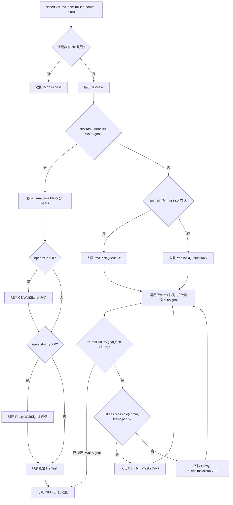
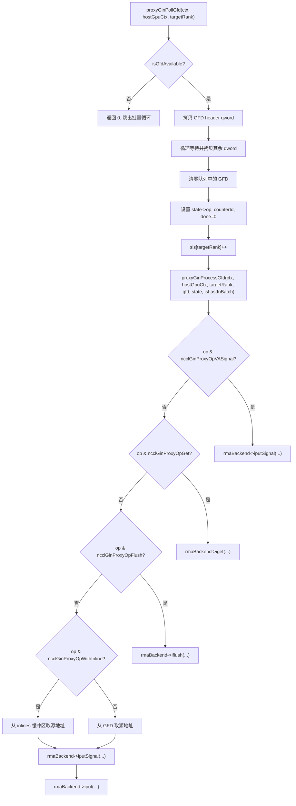

# 제 15 장: RMA와 GIN: 원격 메모리 접근과 GPU 직결 통신의 진화

# 제15장: RMA와 GIN: 원격 메모리 접근과 GPU 직결 통신의 진화

이전 장에서 우리는 대칭 메모리가 각 rank로 하여금 동일한 주소 집합으로 모든 rank의 버퍼에 접근하게 하고, NVLS가 NVSwitch의 멀티캐스트 능력을 빌려 하드웨어 가속 리덕션을 극한으로 밀어붙이는 것을 보았다. 그러나 집합 통신이 전부는 아니다——애플리케이션이 점대점 원격 메모리 연산을 필요로 하거나, GPU kernel이 직접 네트워크 요청을 발행하기를 원할 때 RMA와 GIN이 등장한다. RMA는 put/get 시맨틱의 원격 메모리 접근을 제공하고, GIN은 GPU가 host proxy 스레드를 우회하여 네트워크와 직접 상호작용하게 한다. 이 장은 "먼저 RMA, 나중에 GIN" 순서로 이 두 메커니즘의 데이터 구조, 스케줄링 로직, 동시성 제어, 프로덕션 함정을 층층이 분해한다.

# RMA의 이중 채널 모델: CE와 Proxy의 분업

## 직관적 모델

국가 간 택배 시스템을 상상해 보자: 같은 도시 내 택배(LSA 도달 가능한 rank)는 로컬 배송 차량으로 직접 배달할 수 있지만, 도시 간 택배(LSA 도달 불가능한 rank)는 반드시 항공 화물 대리점에 맡겨야 한다. NCCL의 RMA가 바로 이 모델이다——동일한 put 연산이 대상 rank가 LSA(Load-Store Accessible) 팀 내에 있는지에 따라 완전히 다른 두 실행 경로, 즉 CE(Copy Engine, 복사 엔진) 경로와 Proxy(프록시 스레드) 경로로 라우팅된다.

만약 이 분기 메커니즘이 없다면 모든 RMA 연산이 proxy 스레드를 거치게 되어, 같은 머신 내의 put도 host 스레드를 중계해야 하므로 불필요하게 host-device 왕복 지연이 한 번 추가된다. 반대로 모든 연산이 CE를 거친다면 머신 간 연산은 네트워크 플러그인의 비동기 능력을 활용할 수 없다.

## 데이터 구조와 메모리 레이아웃

RMA의 핵심 스케줄링 구조는`ncclRmaArgs`이며, 이는 하나의 plan에서 RMA 작업의 분기 결과를 기록한다. 주요 필드는 다음과 같다:

| 필드 | 의미 |
| --- | --- |
| `func` | 연산 유형(PutSignal / Signal / WaitSignal) |
| `nRmaTasks` | 총 작업 수 |
| `nRmaTasksProxy` | proxy 경로를 사용하는 작업 수 |
| `nRmaTasksCe` | CE 경로를 사용하는 작업 수 |

각 plan 내부에는 두 개의 침투적 큐가 유지된다:`rmaTaskQueueCe`와`rmaTaskQueueProxy`이며, 각각 두 경로의 작업을 저장한다.[FACT:src/rma/rma.cc:166-171]

rank가 LSA 도달 가능한지 판단하는 로직은 매우 직접적이다——배열을 순회하며`lsaRankList`선형 검색을 수행한다.[FACT:src/rma/rma.cc:34-41]이 검색은 작업 스케줄링 시 각 peer에 대해 한 번 실행되며, 복잡도는 O(lsaSize)이고, 일반적인 소규모 LSA 팀(보통 2-8개 rank)에서는 오버헤드가 무시할 수 있는 수준이다.

## 단계별 스케줄링 흐름

애플리케이션이 RMA put 연산을 한 번 호출하면, 작업이`planner->rmaTaskQueues[ctx]`。`scheduleRmaTasksToPlan`에 들어가며, 이는 큐의 작업을 plan에 할당하는 역할을 한다.[FACT:src/rma/rma.cc:141-296]

첫 번째 단계: 첫 번째 비어 있지 않은 context 큐를 찾는다. NCCL은 여러 RMA context를 지원하며(`numRmaCtx`로 구성), 각 context는 독립적인 큐를 가진다.[FACT:src/rma/rma.cc:148-155]

두 번째 단계: 첫 번째 작업을 꺼내 연산 유형을 판단한다. WaitSignal이면 특수한 분할 로직을, Put/Signal이면 일괄 병합 로직을 따른다.[FACT:src/rma/rma.cc:163-168]

WaitSignal 작업의 경우, 스케줄러는 peers 목록을 LSA 도달 가능성에 따라 CE 그룹과 Proxy 그룹 두 그룹으로 분할해야 한다.[FACT:src/rma/rma.cc:187-204]분할 후 각각 두 개의 새로운`ncclTaskRma`구조를 생성하며, 각각 해당 그룹의 peers 배열을 보유한다.[FACT:src/rma/rma.cc:207-246]원본 작업은 해제된다.[FACT:src/rma/rma.cc:251]

Put/Signal 작업의 경우 로직이 더 복잡하다——스케줄러는 모든 context의 큐를 순회하며 연속된 put/signal 작업을 모두 동일한 plan으로 끌어들이고, WaitSignal을 만나면 중단한다.[FACT:src/rma/rma.cc:279-295]이 설계의 목적은 주석에 명확히 적혀 있다: 한 번의 kernel launch로 모든 context의 put/signal을 커버하고, proxy는 어떤 블로킹 연산 전에도 모든 비동기 요청을 한꺼번에 발행할 수 있으며, CE 경로는 모든 context의 복사와 신호를 일괄 제출한다.[FACT:src/rma/rma.cc:270-278]

## 병렬 실행과 스트림 동기화

스케줄링이 완료되면,`ncclLaunchRma`은`func`필드에 따라`ncclRmaPut`또는`ncclRmaWaitSignal`。[FACT:src/rma/rma.cc:109-131]

로 분배된다.`ncclRmaPut`을 예로 들면, plan에 proxy와 CE 작업이 동시에 존재할 때 두 경로는 병렬로 실행되어야 한다. NCCL의 방식은: 입력 스트림에 event를 기록하고, CE 스트림이 이 event를 기다리게 한 다음, 동시에 두 스트림에서 연산을 시작하고, 마지막으로 CE 스트림에 다시 event를 기록하여 입력 스트림이 이를 기다리게 하는 것이다.[FACT:src/rma/rma.cc:80-96]이 event 체인은 다음을 보장한다: CE 연산은 입력 스트림의 의존성이 준비되기 전에 시작되지 않고, 입력 스트림의 후속 연산도 CE가 완료되기 전에 시작되지 않는다.

proxy 작업만 있거나 CE 작업만 있으면, 입력 스트림에서 해당 연산을 직접 시작하며 추가적인 스트림 동기화가 필요 없다.[FACT:src/rma/rma.cc:97-101]

## 설계 고찰과 프로덕션 함정

**함정 1: LSA 도달 가능성 판단의 정적성.** `isLsaAccessible`스케줄링 시`comm->devrState.lsaRankList`을 조회하는데, 이 목록은 통신 도메인 초기화 후에는 변하지 않는다. 만약 실행 중 토폴로지가 변경되면(예: NVLink 장애로 인한 성능 저하), LSA 목록이 자동으로 갱신되지 않아, 원래 proxy를 사용해야 할 연산이 여전히 CE 경로를 사용하여 복구 불가능한 오류를 유발할 수 있다.

**함정 2: 일괄 병합의 FIFO 보장.**일괄 병합 로직은 연속된 put/signal 작업만 가져오고, WaitSignal을 만나면 중단한다.[FACT:src/rma/rma.cc:283]이는 각 context 내의 FIFO 순서를 보장하지만, context 간 작업은 동일한 plan으로 병합될 수 있다. 애플리케이션이 context 간 연산 순서에 의존한다면, 명시적으로 WaitSignal을 사용하여 배리어를 설정해야 한다.

**함정 3: 메모리 누수 경로.**WaitSignal 분기에서 만약`npeersProxy == 0`이면, 코드는`peersProxy`、`nsignalsProxy`、`signalIdxsProxy`세 배열을 해제한다.[FACT:src/rma/rma.cc:239-244]그러나 만약`npeersCe == 0`이고`npeersProxy > 0`，`peersCe`등의 배열이`ncclMemoryStackAlloc`로 할당되었다면, 수동으로 해제할 필요가 없다(스택 할당자가 일괄 회수).[FACT:src/rma/rma.cc:176-178]이 비대칭성은 독자가 혼동하기 쉽지만 실제로는 올바르다—스택에 할당된 메모리는`comm->memScoped`에 의해 통합 관리된다.

# RMA Proxy 컨텍스트: 시그널, 큐 및 락프리 링 버퍼

## 직관적 모델

Proxy 컨텍스트는 "우체국 분류 센터"와 같다: GPU는 보낼 소포(put 요청)를 수신함(링 버퍼)에 넣고, proxy 스레드는 수신함에서 소포를 꺼내 택배 회사(네트워크 플러그인)에 전달하며, 택배 회사는 배송 후 영수증(시그널)에 도장을 찍는다. 전체 과정에서 GPU와 proxy 스레드는 락프리 데이터 구조를 통해 통신하여 값비싼 락 경합을 피한다.

## 데이터 구조와 메모리 레이아웃

`ncclRmaProxyCtx`은 proxy 컨텍스트의 호스트 구조이며, 핵심 필드는 다음과 같다:

**시그널 영역(signalsDev)**: GPU에 할당된 메모리 블록으로, 크기는`nRanks * numRmaSig * sizeof(uint64_t)`。[FACT:src/rma/rma_proxy.cc:120-123]각 rank는`numRmaSig`개의 시그널 슬롯을 가지며, 해당 rank로부터의 시그널을 수신하는 데 사용된다. 이 메모리는 네트워크 플러그인에 등록될 때`NCCL_NET_MR_FLAG_FORCE_SO`(강제 강순서) 및`NCCL_NET_MR_FLAG_SIGNAL_NEVER_RESET`(시그널 절대 리셋 안 함) 플래그를 가진다.[FACT:src/rma/rma_proxy.cc:125-127]강순서 플래그는 put과 signal 사이의 순서 관계를 보장한다—put이 signal보다 먼저 발행되면, 네트워크는 signal이 put 데이터 도착 후에만 기록되도록 보장해야 한다.

**시퀀스 번호 영역(opSeqs/readySeqs/doneSeqs)**: 각 rank당 한 세트로,`allocMemCPUAccessible`을 통해 할당되며, GDR(GPU Direct RDMA) 메모리이거나 일반 host 메모리일 수 있다.[FACT:src/rma/rma_proxy.cc:132-137]이 세 가지 시퀀스 번호는 각각 추적한다: 제출된 작업 번호, 준비된 작업 번호, 완료된 작업 번호.

**락프리 링 버퍼(circularBuffers)**: 크기가`nRanks * queueSize`인 포인터 배열로, 각 rank마다 독립적인 링 큐를 가진다.[FACT:src/rma/rma_proxy.cc:163-164]함께 제공되는`pis`(Producer Index)와`cis`(Consumer Index) 배열은 각각`nRanks`개의 요소를 가진다.[FACT:src/rma/rma_proxy.cc:165-166]큐 크기는 2의 거듭제곱이어야 하며, 이렇게 하면 인덱스 랩어라운드가 모듈로 연산 대신 비트 AND 연산`& (queueSize - 1)`으로 처리될 수 있다.[FACT:src/rma/rma_proxy.cc:156-160]

**InProgress 큐**: 각 peer당 하나의 침습적 연결 리스트로, 네트워크 플러그인에 제출되었지만 아직 완료되지 않은 디스크립터를 저장한다.[FACT:src/rma/rma_proxy.cc:170-175]이는 단일 소비자 큐로, proxy 스레드만 접근하므로 원자적 연산이 필요 없다.

## Step-by-Step: 컨텍스트 생성부터 진행推进까지

**컨텍스트 생성**：`ncclRmaProxyCreateContext`먼저 RMA 플러그인을 통해 네트워크 컨텍스트를 생성한다.[FACT:src/rma/rma_proxy.cc:229]그런 다음`ncclRmaProxyCtxAlloc`을 호출하여 시그널, 시퀀스 번호, 링 버퍼 등의 리소스를 할당한다.[FACT:src/rma/rma_proxy.cc:231]이어서`ncclRmaProxyCtxAllocGraph`을 호출하여 그래프 캡처 모드에 필요한 리소스—CPU 접근 가능 시그널, flush 버퍼, 영속 큐—를 할당한다.[FACT:src/rma/rma_proxy.cc:232]

그래프 캡처 모드가 존재하는 이유는 CUDA Graph가 모든 작업의 재생을 요구하기 때문이다. 일반 모드에서는 시그널이 GPU 메모리에 있고 proxy가 GDR을 통해 읽는다; 그래프 캡처 모드에서는 시그널이 CPU 접근 가능 메모리에 있어 proxy가 직접 읽고 쓸 수 있으므로 GDR의 불확실성을 피한다.[FACT:src/rma/rma_proxy.cc:184-190]

**진행 스레드**：`ncclRmaProxyProgressThread`은 proxy의 메인 루프이다.[FACT:src/rma/rma_proxy.cc:354-389]이는`rmaProgress`상태 워드에 따라 동작을 결정한다:

- `rmaProgress == 1`: 정상 진행 모드로, 모든 proxy 컨텍스트를 순회하며`ncclRmaProxyProgress`。[FACT:src/rma/rma_proxy.cc:361-372]
- `rmaProgress == 2`을 호출한다: 일시정지 모드로, 리소스 회수에 사용된다. 스레드는 일시정지를 확인한 후 조건 변수를 기다린다.[FACT:src/rma/rma_proxy.cc:373-378]
- `rmaProgress == -1`: 종료 시그널로, 스레드가 반환된다.[FACT:src/rma/rma_proxy.cc:379-380]
- `rmaProgress == 0`: 유휴 대기.[FACT:src/rma/rma_proxy.cc:381-382]

만약`ncclRmaProxyProgress`이 오류를 반환하면, 스레드는 오류 코드를`asyncResult`에 기록하고,`rmaProgress = -2`을 설정한 후 종료한다.[FACT:src/rma/rma_proxy.cc:365-369]이 오류 코드는 메인 스레드가 이후`ncclCommGetAsyncError`호출에서 읽게 된다.

## 동시성 제어와 메모리 순서

RMA proxy의 동시성 모델은 "단일 생산자-단일 소비자"이다: GPU kernel이 생산자이고, proxy 스레드가 소비자이다. 링 버퍼의 PI는 GPU가 업데이트하고, CI는 proxy가 업데이트한다. 단일 생산자 단일 소비자이므로 CAS 연산이 필요 없고, 올바른 메모리 순서만 필요하다.

시그널 영역의 강순서 플래그`NCCL_NET_MR_FLAG_FORCE_SO`이 핵심이다.[FACT:src/rma/rma_proxy.cc:127]이 플래그가 없으면 네트워크 플러그인이 put과 signal의 순서를 재배열할 수 있어, 수신자가 데이터 도착 전에 시그널을 보고 더티 데이터를 읽을 수 있다.

`NCCL_NET_MR_FLAG_SIGNAL_NEVER_RESET`플래그는 네트워크 플러그인에게 알린다: 시그널은 한 번 기록되면 리셋되지 않는다.[FACT:src/rma/rma_proxy.cc:127]이는 플러그인이 시그널 쓰기 경로를 최적화할 수 있게 한다—매번 쓰기 전에 제로화할 필요가 없다.

## 생산 함정

**함정 1: 큐 크기가 2의 거듭제곱이 아님.**만약 사용자가`NCCL_RMA_PROXY_QUEUE_SIZE`을 통해 2의 거듭제곱이 아닌 값을 설정하면, 코드는 기본값으로 폴백하고 INFO 로그를 출력한다.[FACT:src/rma/rma_proxy.cc:156-159]이 폴백은 조용하다(INFO 레벨만). 프로덕션 환경에서 무시되기 쉽다. 사용자가 버스트 트래픽을 흡수하기 위해 더 큰 큐를 기대했지만 실제로는 기본값이 사용되면 백프레셔가 발생할 수 있다.

**함정 2: DMA-BUF 등록 실패 시 폴백 체인.** `ncclRmaProxyRegMrSym`CUDA 메모리 등록에는 세 단계 폴백이 있다: 먼저 DataDirect 모드의 DMA-BUF를 시도하고, 실패하면 비 DataDirect DMA-BUF를 시도하고, 다시 실패하면 일반`regMrSym`。[FACT:src/rma/rma_proxy.cc:76-108]으로 폴백한다. 주석에서 특별히 경고한다: 하나의 MR이 비 DataDirect 경로로 들어가면, 다른 모든 MR도 그렇게 해야 하며, 혼합 사용은 GIN의 순서 보장을 깨뜨린다.[FACT:src/gin/gin_host_proxy.cc:429-430]이 제약은 RMA 경로에서 명시적으로 검사되지 않으며, 잠재적 위험이다.

**함정 3: 진행 스레드의 오류 전파 지연.**当`ncclRmaProxyProgress`이 오류를 반환하면, 스레드는`asyncResult`을 설정하고 종료한다.[FACT:src/rma/rma_proxy.cc:366-369]하지만 메인 스레드는 장시간 실행되는 kernel을 실행 중일 수 있어 즉시 확인하지 않습니다`asyncResult`. 이 기간 동안 후속 RMA 작업은 계속 큐에 들어가지만 메인 스레드가 오류를 발견할 때까지 처리되지 않습니다. 이는 비동기 오류 전파의 고유한 지연이며, 애플리케이션은 주기적으로`ncclCommGetAsyncError`를 호출하여 이 윈도우를 줄여야 합니다.

# GIN 아키텍처: GPU가 직접 네트워크 요청을 시작

## 직관적 모델

전통적인 모드에서 GPU가 네트워크 데이터를 전송하려면 반드시 "GPU → host 메모리 → proxy 스레드 → 네트워크 카드" 경로를 거쳐야 합니다. GIN(GPU-Initiated Networking)의 목표는 GPU가 네트워크 카드의 전송 큐에 직접 쓰는 것으로, 마치 CPU가 네트워크 카드의 MMIO 레지스터에 직접 쓰는 것과 같습니다. 이를 위해서는 네트워크 카드가 GPU가 시작한 doorbell 쓰기를 지원해야 하며, GPU와 proxy 스레드 간의 통신 프로토콜이 필요합니다.

## 데이터 구조와 메모리 레이아웃

GIN의 핵심 데이터 구조는`ginProxyHostGpuCtx`이며, 이는 GPU-host 통신 컨텍스트를 나타냅니다:

| 필드 | 타입 | 의미 |
| --- | --- | --- |
| `queues` | `ncclGinProxyGfd_t*` | GFD 큐, 크기`nRanks * queueSize` |
| `pis` | `uint32_t*` | 생산자 인덱스(GPU 쓰기) |
| `cis` | `uint32_t*` | 소비자 인덱스(proxy 쓰기) |
| `cisShadow` | `uint32_t*` | CI의 섀도 복사본(proxy 로컬) |
| `sis` | `uint32_t*` | 확인된 인덱스(proxy 로컬) |
| `states` | `ginProxyGfdState*` | 각 GFD 슬롯의 상태 |
| `inlines` | `uint64_t*` | 인라인 데이터 버퍼 |

GFD(GIN Forwarding Descriptor)는 GPU가 proxy에 쓰는 요청 설명자입니다. 각 GFD는 여러 qword로 구성되며, 작업 유형, 소스 주소, 대상 주소, 크기, 신호 정보 등을 포함합니다.[FACT:src/gin/gin_host_proxy.cc:158-163]

`queues`배열의 메모리 할당에는 중요한 세부 사항이 있습니다:`allocMemCPUAccessible`를 통해 할당되지만,`forceHost=true`매개변수가 전달됩니다.[FACT:src/gin/gin_host_proxy.cc:564]이는 큐 자체가 host 메모리에 있고 GPU가 PCIe를 통해 쓰는 것을 의미합니다. 반면`cis`배열은 GPU 접근 가능 메모리(GDR일 수 있음)에 할당됩니다. proxy가 이를 자주 업데이트해야 하기 때문입니다.[FACT:src/gin/gin_host_proxy.cc:565-566]

`cisShadow`과`sis`는 proxy 스레드의 로컬 복사본으로, 매번 GPU 메모리에 있을 수 있는`cis`。[FACT:src/gin/gin_host_proxy.cc:44-47]를 읽는 것을 피합니다.`cisShadow`가 전진할 때만`cis`。

## Step-by-Step: GFD의 폴링과 처리

`ncclGinProxyProgress`는 GIN proxy의 메인 루프입니다.[FACT:src/gin/gin_host_proxy.cc:648-669]

첫 번째 단계: 각 context에 대해 먼저`proxyGinPollCompletions`를 호출하여 제출된 요청의 완료 상태를 확인합니다.[FACT:src/gin/gin_host_proxy.cc:653]

두 번째 단계: 각 target rank에 대해 GFD를 배치 폴링합니다.`pollBatch`는 매번 최대 몇 개의 GFD를 처리할지 제어합니다.[FACT:src/gin/gin_host_proxy.cc:654-655]

세 번째 단계:`proxyGinPollGfd`는 큐 헤드에 새로운 GFD가 있는지 확인합니다. 판단 기준은 GFD 헤드의 flag 비트가 0이 아닌지 여부입니다.[FACT:src/gin/gin_host_proxy.cc:176-182]있다면, 먼저 첫 번째 qword(헤드)를 복사한 후 나머지 qword가 준비될 때까지 기다립니다.[FACT:src/gin/gin_host_proxy.cc:194-202]복사가 완료되면 큐의 GFD를 0으로 초기화하여 중복 처리를 방지합니다.[FACT:src/gin/gin_host_proxy.cc:206-208]

네 번째 단계:`proxyGinProcessGfd`는 작업 유형에 따라 다른 처리 경로로 분배합니다.[FACT:src/gin/gin_host_proxy.cc:246-340]

## 폴링과 카운터 업데이트 완료

`proxyGinPollCompletions`는 제출된 요청의 완료 상태를 확인합니다.[FACT:src/gin/gin_host_proxy.cc:113-156]

각 target rank에 대해`cisShadow`에서`sis`까지 확인되었지만 소비되지 않은 모든 GFD 상태를 순회합니다.[FACT:src/gin/gin_host_proxy.cc:117]상태가 완료되지 않았다면`rmaBackend->test`를 호출하여 확인합니다.[FACT:src/gin/gin_host_proxy.cc:122]완료되었고 작업에 카운터 플래그가 있다면 카운터 값을 업데이트합니다.[FACT:src/gin/gin_host_proxy.cc:132-141]

카운터 업데이트는 원자적 로드와 원자적 저장을 사용하지만, 주석에서 원자적 덧셈이 필요 없는 이유를 설명합니다: GPU kernel은 미완료 작업이 있을 때 카운터를 재설정할 수 없으므로 경쟁이 존재하지 않습니다.[FACT:src/gin/gin_host_proxy.cc:133-135]

CI 업데이트에는 "구멍 허용" 메커니즘이 있습니다:`state->done && i == cisShadow[targetRank]`일 때만 CI를 전진시킵니다.[FACT:src/gin/gin_host_proxy.cc:145-151]이는 CI가 단조 증가하도록 보장하며, 일부 GFD가 먼저 완료되더라도 미완료 GFD를 건너뛰지 않습니다.

## 동시성 제어와 메모리 배리어

GIN proxy의 동시성 모델은 RMA proxy보다 더 복잡합니다. 여러 proxy 스레드가 존재하기 때문입니다(`GIN_PROXY_NTHREADS`에 의해 제어됨).[FACT:src/gin/gin_host.cc:90]

`ncclGinProgress`에서 각 스레드는 연결 그룹을 담당합니다: 스레드 t는 연결 t, t+proxyNthreads, t+2*proxyNthreads, ...를 처리합니다.[FACT:src/gin/gin_host.cc:72]이 할당 방식은 각 연결이 하나의 스레드에 의해서만 처리되도록 보장하여 연결 수준의 경쟁을 방지합니다.

devComms 연결 리스트의 수정은 쓰기 잠금으로 보호해야 합니다.`ginProgressWriteLock`먼저`writePending`플래그를 설정한 후 쓰기 잠금을 획득합니다.[FACT:src/gin/gin_host.cc:43-47]진행 스레드는 각 루프 시작 시`writePending`를 확인하고, 참이면 CPU를 양보합니다.[FACT:src/gin/gin_host.cc:63-66]이 설계는 진행 스레드가 읽기 잠금을 보유한 상태에서 쓰기 잠금에 의해 차단되는 것을 방지합니다.

`writePending`를 사용하지만, 주석에서 이 로직이 단일 작성자를 가정한다고 지적합니다.`std::atomic<bool>`NCCL 사용 시나리오에서는 메인 스레드만 devComms 연결 리스트를 수정하므로 이 가정이 성립합니다.[FACT:src/gin/gin_host.cc:43-47]프로덕션 함정

## 함정 1: GFD 큐의 메모리 위치.

**는 host 메모리에 강제 할당됩니다(** `queues`이는 GPU가 GFD를 쓰려면 PCIe 버스를 거쳐야 함을 의미합니다. GFD 쓰기 빈도가 높으면(소형 메시지 시나리오) PCIe 대역폭이 병목이 될 수 있습니다. 반면,`forceHost=true`），[FACT:src/gin/gin_host_proxy.cc:564]는 GPU 접근 가능 메모리에 할당됩니다. proxy가 이를 자주 업데이트해야 하기 때문입니다.`cis`함정 2: 인라인 데이터의 재구성.[FACT:src/gin/gin_host_proxy.cc:565-566]

**GFD에 인라인 데이터가 있을 때 proxy는 여러 qword에서 인라인 값을 재구성해야 합니다.** 当 GFD 带有内联数据时，proxy 需要从多个 qword 中重建内联值。[FACT:src/gin/gin_host_proxy.cc:298-305]재구성 로직은 size에 따라 어떤 qword를 읽을지 결정합니다: size ≤ 4이면 하위 32비트만 읽고, size > 4이면 하위 64비트를 읽고, size > 6이면 상위 16비트를 추가로 읽습니다. 이 분할 로직은 GPU 측 쓰기 로직과 반드시 엄격하게 대응되어야 하며, 어떤 불일치라도 데이터 손상을 초래합니다.

**함정 3: 멀티스레드 진행 상황과 연결 할당.**서로 다른 rank가 서로 다른`GIN_PROXY_NTHREADS`를 설정한 경우, AllGather로 최솟값을 취한 후 일부 스레드가 어떤 연결도 할당받지 못할 수 있습니다.[FACT:src/gin/gin_host.cc:181-183]주석에 따르면 이러한 스레드는 stride 루프에서 공회전하며 정확성 문제는 일으키지 않지만 CPU 자원을 낭비합니다.

# GIN 백엔드 선택과 버전 호환성

## 직관적 모델

GIN은 여러 백엔드를 지원합니다: Proxy(RMA 플러그인 기반 소프트웨어 시뮬레이션), GDAKI(GPU Direct Async Kernel Initiated), GPI(GPU-Initiated), EFA GDA(AWS EFA의 GPU Direct Async). 이는 동일한 API에 여러 구현이 있을 수 있는 것과 같습니다 — 소프트웨어 시뮬레이션 버전은 호환성이 가장 좋지만 성능은 보통이고, 하드웨어 오프로드 버전은 성능이 가장 좋지만 특정 NIC 지원이 필요합니다.

## 백엔드 버전 매트릭스

각 백엔드에는 버전 호환 배열이 있으며, 인덱스는 백엔드 버전 번호이고 값은 해당 버전이 요구하는 최소 NCCL 버전입니다.[FACT:src/gin/gin_host.cc:27-33]

| 백엔드 | 버전 0 | 버전 1 | 버전 2 | 버전 3 |
| --- | --- | --- | --- | --- |
| Proxy | 0 | 2.30.3 | 2.30.5 | 2.32.0 |
| GDAKI | 0 | 2.30.3 | 2.30.5 | - |
| GPI | 0 | 2.30.5 | - | - |
| EFA GDA | 0 | 2.31.0 | 2.32.0 | - |

버전 선택 로직: 버전 배열을 순회하며 요구 버전이 현재 디바이스 코드 버전보다 높은 첫 번째 항목을 찾고, 그 이전 버전이 사용 가능한 버전입니다.[FACT:src/gin/gin_host.cc:300-304]

## 백엔드 선택 흐름

`ncclGinDevCommSetup`모든 활성 백엔드를 순회하며 각 백엔드로 DevComm 생성을 시도합니다.[FACT:src/gin/gin_host.cc:427-442]선택 조건에는 요청된 GIN 유형 일치(또는 미지정), 시그널 능력 요구사항 충족이 포함됩니다.[FACT:src/gin/gin_host.cc:430-435]

`ncclGinValidateSignalRequest`두 가지 능력을 확인합니다: 강한 시그널(`supportsStrongSignals`)과 VA 시그널(`supportsVASignals`）。[FACT:src/gin/gin_host.cc:230-243]요청이 강한 시그널을 요구하지만 백엔드가 지원하지 않으면 해당 백엔드를 건너뜁니다.

## 연결 설정과 stride 계산

`ncclGinConnectOnce`GIN 연결을 설정합니다.[FACT:src/gin/gin_host.cc:92-228]

연결 유형이 stride를 결정합니다: FULL 모드에서 stride는 1(모든 rank에 연결), RAIL 모드에서 stride는`contiguousRanksPerHost`(동일 rail의 rank에만 연결)입니다.[FACT:src/gin/gin_host.cc:139-145]

`ginDevCommSetupWithBackend`에서 stride 검증 로직은 매우 엄격합니다:

- 요청된 stride는 0이 될 수 없습니다.[FACT:src/gin/gin_host.cc:318-323]
- 요청된 stride는 rail team의 stride보다 클 수 없습니다.[FACT:src/gin/gin_host.cc:324-330]
- 요청된 stride는 이미 연결된 stride의 배수여야 합니다.[FACT:src/gin/gin_host.cc:331-337]

이러한 제약의 동기는 계층적 배리어가 GIN이 최소한 RAIL 연결이라고 가정하기 때문입니다.[FACT:src/gin/gin_host.cc:325]stride가 이러한 조건을 충족하지 않으면 일부 rank 간의 통신 경로가 존재하지 않을 수 있습니다.

## 프로덕션 함정

**함정 1: 백엔드 버전 불일치.**디바이스 코드 버전이 백엔드가 요구하는 최소 버전보다 낮으면,`backendVersion`은 더 낮은 값에 머무릅니다.[FACT:src/gin/gin_host.cc:301-303]이로 인해 일부 새로운 기능을 사용할 수 없게 될 수 있지만(예: 시그널이 절대 리셋되지 않음) 오류는 발생하지 않습니다. 그러나 디바이스 코드 버전이 알려진 모든 버전보다 높으면,`backendVersion`은 최댓값을 취하여 정의되지 않은 동작을 유발할 수 있습니다.

**함정 2: stride 검증의 경계.**만약`requestedStride % connectedStride != 0`이면 생성이 실패합니다.[FACT:src/gin/gin_host.cc:331-337]이 검사는 connectedStride가 2의 거듭제곱(FULL 모드에서 1, RAIL 모드에서`contiguousRanksPerHost`)이라고 가정합니다. 만약`contiguousRanksPerHost`이 2의 거듭제곱이 아니면(예: 3), 배수 검사가 합법적인 stride를 거부할 수 있습니다.

# 이 장의 생각과 자가 점검

Q1:`scheduleRmaTasksToPlan`의 WaitSignal 분기에서`plan->rmaArgs->nRmaTasks = (npeersCe > 0 ? 1 : 0) + (npeersProxy > 0 ? 1 : 0)`이 줄을 제거하고 직접 1로 설정하면 어떤 시나리오에서 문제가 발생하는가?

**참고 해석**:[FACT:src/rma/rma.cc:248]。`nRmaTasks`이 기록하는 것은 실제로 인큐된 작업 수입니다. 모든 peer가 LSA 도달 가능하면(`npeersProxy == 0`), 실제로는 1개의 CE 작업만 인큐되므로`nRmaTasks`은 1이어야 합니다. 모든 peer가 도달 불가능하면(`npeersCe == 0`), 실제로는 1개의 Proxy 작업만 인큐되므로`nRmaTasks`도 1이어야 합니다. 그러나 peer가 혼합 분포이면 두 작업 모두 인큐되므로`nRmaTasks`은 2여야 합니다.

이 줄을`plan->rmaArgs->nRmaTasks = 1`으로 바꾸면 혼합 분포 시나리오에서`nRmaTasks`이 실제 작업 수를 과소평가합니다. 이후`ncclRmaWaitSignal`의 판단`plan->rmaArgs->nRmaTasksProxy > 0 && plan->rmaArgs->nRmaTasksCe > 0`은 여전히 올바르게 작동하지만(`nRmaTasksProxy`과`nRmaTasksCe`），[FACT:src/rma/rma.cc:47]를 사용하므로),`nRmaTasks`에 의존하여 자원 추정이나 로그 통계를 수행하는 코드는 잘못된 결과를 얻게 됩니다. 더 심각한 것은 이후 코드가`nRmaTasks`을 사용하여 배열을 할당하거나 루프 횟수를 계산하면 버퍼 오버플로나 작업 누락이 발생할 수 있습니다.

Q2:`proxyGinPollGfd`에서`hostGpuCtx->sis[targetRank]++`을`proxyGinProcessGfd`호출 이후로 옮기면 어떤 동시성 시나리오에서 GFD가 중복 처리되는가?

**참고 해석**:[FACT:src/gin/gin_host_proxy.cc:228]。`sis`은 "이미 본 인덱스"로, proxy가 이미 보고 처리를 시작한 GFD 수를 나타냅니다.`proxyGinPollGfd`은 GFD 복사를 완료한 직후 증가되고,`sis`그런 다음 1을 반환하여 성공을 나타냅니다. 호출자`ncclGinProxyProgress`은 루프에서`proxyGinPollGfd`을 호출하고, 1을 반환하면 다음 GFD 처리를 계속합니다.[FACT:src/gin/gin_host_proxy.cc:648-669]

만약`sis++`을`proxyGinProcessGfd`이후로 옮기면,`proxyGinProcessGfd`실행 중(네트워크 플러그인의 비동기 호출을 포함할 수 있음)에`sis`이 여전히 현재 GFD를 가리킵니다. 이때 GPU가 동일한 슬롯에 새로운 GFD를 기록하면(큐가 환형이므로`pis`이 이미 랩어라운드했을 수 있음),`proxyGinPollGfd`이 이 슬롯을 다시 보게 되지만`sis`이 전진하지 않아 동일한 슬롯을 중복 처리하게 됩니다.

더 위험한 것은,`proxyGinPollGfd`GFD를 복사한 후 큐에 있는 GFD를 0으로 초기화한다.[FACT:src/gin/gin_host_proxy.cc:206-208]만약`sis`전진하지 않으면, 다음 폴링에서 0으로 초기화된 GFD(flag가 0)를 보게 되고,`isGfdAvailable`false를 반환하여 GFD가 유실된다. 이로 인해 GPU 측은 영원히 처리되지 않을 요청을 기다리게 되어 최종적으로 교착 상태에 빠진다.

Q3:`ncclRmaProxyProgressThread`에서 만약`rmaProgress == 2`분기에서`rmaProxyState->cond.notify_one()`호출을 잊어버리면, 어떤 시나리오에서 메인 스레드가 영구적으로 블로킹되는가?

**참고 해석**: 보면[FACT:src/rma/rma_proxy.cc:373-378]。`rmaProgress == 2`은 "일시정지 요청" 상태로, 리소스 회수를 위해 사용된다. 메인 스레드가`rmaProgress = 2`를 설정한 후, 진행 스레드가 일시정지를 확인할 때까지 기다린다. 진행 스레드는`cond.wait(lock)`에서 대기하며, 메인 스레드는`cond.notify_one()`를 호출하여 깨워야 한다.[FACT:src/rma/rma_proxy.cc:377]

만약 진행 스레드가`rmaProgress = 0`를 설정한 후`notify_one()`를 잊어버리면, 메인 스레드는 계속 조건 변수를 기다리게 된다. 하지만 더 중요한 것은, 진행 스레드가`cond.wait(lock)`에서 대기할 때 메인 스레드가`rmaProgress = 2`를 설정하려면 먼저 락을 획득해야 한다. 만약 진행 스레드가`wait`이전에 락을 해제하지 않으면, 메인 스레드가 락을 획득할 수 없어 교착 상태가 발생한다.

올바른 순서는: 진행 스레드가`rmaProgress = 0`를 설정하고,`notify_one()`를 호출하여 메인 스레드를 깨운 다음,`cond.wait(lock)`를 호출하여 락을 해제하고 대기한다. 메인 스레드가 깨어난 후 락을 획득하고,`rmaProgress = 2`를 설정하며,`notify_one()`를 호출하여 진행 스레드를 깨운 다음, 진행 스레드가 확인할 때까지 기다린다. 진행 스레드가 깨어난 후`rmaProgress = 0`를 설정하고, 다시`notify_one()`를 호출한 다음,`wait`를 호출한다. 이 핸드셰이크 프로토콜에서 어느 한 단계라도`notify_one()`가 누락되면 영구적 블로킹이 발생한다.

RMA의 put/get 시맨틱에서 GIN의 GPU 발기 네트워크 통신까지, 우리는 NCCL이 범용 원격 메모리 접근 엔진으로 진화하는 핵심 단계를 완료했다. 그러나 메커니즘이 아무리 정교하더라도, 최종적으로는 플러그인 체계를 통해 외부 네트워크 백엔드, 튜닝 전략, 성능 수집기와 연결되어야 한다. 다음 장에서는 플러그인 세계로 들어가, NCCL이 핵심 코드를 수정하지 않고도 net, tuner, profiler, env 등의 확장을 동적으로 로드하는 방법을 살펴보고, google-fastsocket과 google-CoMMA를 예로 들어 생태계 확장성 구현의 핵심을 밝힌다.
