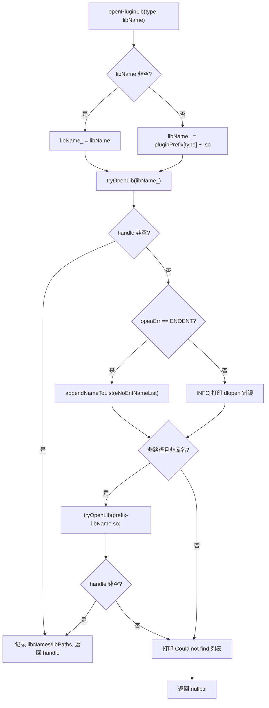
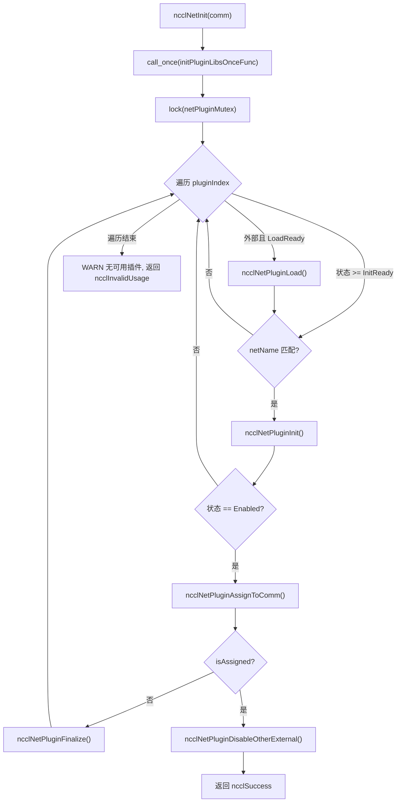
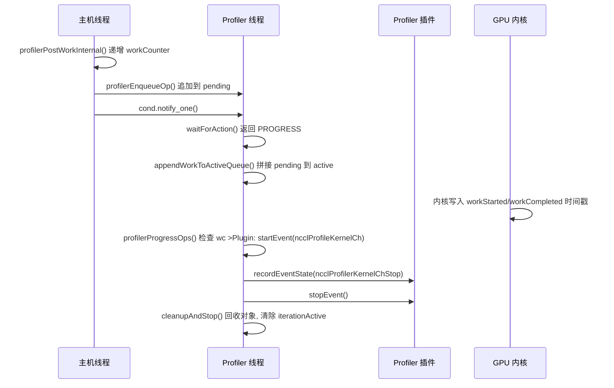

# 제 16 장: 플러그인 생태계와 환경 변수: net, tuner, profiler, env가 NCCL 동작을 확장하는 방법

이전 장에서 우리는 NCCL이 RMA와 GIN을 통해 통신 능력을 집합 연산에서 점대점 원격 접근으로 확장하고, 심지어 GPU가 직접 네트워크 요청을 발기하도록 하는 방법을 보았다. 새로운 하드웨어와 저지연 시나리오로의 이러한 진화는 통신 엔진의 유연성에 더 높은 요구를 제기한다: 만약 새로운 네트워크, 새로운 튜닝 전략, 또는 새로운 수집 도구를 적응시킬 때마다 핵심 코드를 다시 컴파일해야 한다면, NCCL은 생태계 변화를 따라가기 어려울 것이다. 이 장에서는 src/plugin과 plugins 디렉터리를 분석하여, 핵심 질문 하나에 답한다: NCCL이 핵심 코드를 재컴파일하지 않고도 네트워크 백엔드, 튜닝 전략, 성능 수집기, 설정 소스를 교체하는 방법은 무엇인가.

# 16.1 플러그인 로더: plugin_open.cc가 .so를 사용 가능한 백엔드로 만드는 방법

## 직관적 모델

`plugin_open.cc`를 NCCL의 "채용 중개소"라고 상상해보자: 그곳에는 직무 목록(NET, GIN, RMA, TUNER, PROFILER, ENV)이 있고, 각 직무는 후보 라이브러리 이름에 대응한다. NCCL이 특정 직무의 인력이 필요할 때, 중개소는 정해진 순서대로 인재 시장(동적 링커)에서 사람을 찾고, 찾으면 계약을 맺고(`dlopen`), 찾지 못하면 "이 사람은 존재하지 않는다"고 기록한 후, 최종적으로 핸들을 반환한다. 만약 이 중개 계층이 없다면, NCCL은 네트워크 백엔드를 바이너리에 하드코딩할 수밖에 없고, 어떤 NIC 제조사든 접속하려면 NCCL 소스 코드를 수정해야 한다——이것이 바로 플러그인 체계가 없애고자 하는 재앙이다.

## 데이터 구조와 메모리 레이아웃

로더의 전체 상태는 여섯 개의 병렬 배열이며, 인덱스가 곧 플러그인 타입 열거형이다:

```
static char* libNames[NUM_LIBS];              // 已加载库的名字
char* ncclPluginLibPaths[NUM_LIBS];           // 库的绝对路径
static void* libHandles[NUM_LIBS];            // dlopen 返回的句柄
static const char* pluginNames[NUM_LIBS];     // 日志用的人类可读名
static const char* pluginPrefix[NUM_LIBS];    // 库名前缀
static const char* pluginFallback[NUM_LIBS];  // 找不到时的提示
static unsigned long subsys[NUM_LIBS];        // 日志子系统位掩码
```

이 일곱 개 배열의 인덱스는 반드시 엄격히 정렬되어야 하며,`pluginNames[type]`、`pluginPrefix[type]`、`subsys[type]`는 동일한 플러그인 타입을 설명한다.[FACT:src/plugin/plugin_open.cc:18-29]는`NUM_LIBS = 6`를 정의하며, 타입 순서는`{"NET", "GIN", "RMA", "TUNER", "PROFILER", "ENV"}`이고, 접두사는`{"libnccl-net", "libnccl-gin", "libnccl-rma", "libnccl-tuner", "libnccl-profiler", "libnccl-env"}`。

> **[Design Inference & Architectural Trade-offs]**
> 여기서 구조체 배열 대신 병렬 배열을 사용하는 이유는`openPluginLib`라는 단일 함수가 여섯 가지 플러그인을 동시에 서비스할 수 있도록 하기 위해서다——타입은 인덱스로만 사용되고 로직은 완전히 재사용된다. 대가는 새로운 플러그인 타입을 추가할 때 여섯 개 배열을 동시에 수정해야 하며, 컴파일러가 누락을 검사해줄 수 없다는 점이다.

`subsys`배열은 로그 귀속을 결정한다: NET/GIN/RMA는 모두`NCCL_INIT | NCCL_NET`에 연결되고, TUNER는`NCCL_INIT | NCCL_TUNING`에 연결되며, PROFILER는`NCCL_INIT`에만 연결되고, ENV는`NCCL_INIT | NCCL_ENV`。[FACT:src/plugin/plugin_open.cc:26-29]에 연결된다. 이렇게 하면`NCCL_DEBUG_SUBSYS=NET`시 네트워크 플러그인의 로그만 보이고, 튜닝 로그에 묻히지 않는다.

## 단계별 워크스루: 한 번의`ncclOpenNetPluginLib("mlx5")`전체 여정

사용자가`NCCL_NET_PLUGIN=mlx5`를 설정했다고 가정하면, NCCL 초기화 시`ncclOpenNetPluginLib("mlx5")`를 호출하고, 이는 직접`openPluginLib(ncclPluginTypeNet, "mlx5")`。[FACT:src/plugin/plugin_open.cc:132-134]

**로 전달된다.**첫 번째 단계: 후보 라이브러리 이름 구성.`libName`비어 있지 않은`snprintf(libName_, MAX_STR_LEN, "%s", libName)`가 전달되었으므로`libName_`분기를 타고,`"mlx5"`。[FACT:src/plugin/plugin_open.cc:85-89]는`.so`가 된다. 이때 아직 합법적인 라이브러리 파일 이름이 아니다——접두사도 없고

**접미사도 없다.** `tryOpenLib("mlx5", ...)`두 번째 단계: 첫 번째 열기 시도.[FACT:src/plugin/plugin_open.cc:91]가 호출된다.`tryOpenLib`에 진입한 후, 먼저`name`가 비어 있거나 길이가 0인지 확인하고, 그 다음 특수 분기가 있다: 만약 이름이`STATIC_PLUGIN`로 시작하면,`name`를 로 설정한다.`nullptr`。[FACT:src/plugin/plugin_open.cc:37-39]이것은 NCCL에 정적 링크된 플러그인을 위한 센티넬이다—`dlopen(nullptr)`Linux에서 메인 프로그램 핸들을 반환하여`dlsym`메인 프로그램 심볼 테이블에서 플러그인 심볼을 찾을 수 있게 한다.

이어서`ncclOsDlopen(name)`。[FACT:src/plugin/plugin_open.cc:41]를 호출한다.`"mlx5"`는 경로도 아니고 유효한 라이브러리 이름도 아니기 때문에`dlopen`는 실패한다. 실패 후 코드는`ncclOsDlerror()`의 오류 문자열을 가져와 정밀하게 판단한다: 오류 문자열에`name`와`"No such file or directory"`가 동시에 포함되어 있으면`*err`를`ENOENT`。[FACT:src/plugin/plugin_open.cc:42-55]로 설정한다. 이 판단의 의미는 "파일이 아예 존재하지 않음"과 "파일은 존재하지만 로드 실패"를 구분하는 것이다—전자는 단지 후보 이름이 잘못된 것이므로 조용히 다음 후보 이름을 시도해야 하고, 후자는 실제 오류이므로 로그를 남겨야 한다.

**세 번째 단계: 첫 번째 실패 후 처리.**로 돌아가면`openPluginLib`，`libHandles[type]`가 비어 있고`openErr == ENOENT`이므로`"mlx5"`를`eNoEntNameList`。[FACT:src/plugin/plugin_open.cc:97-101]에 추가한다. 이 리스트는 최종적으로 "Could not find: mlx5 libnccl-net-mlx5.so"라는 로그로 조합된다.

**네 번째 단계: 두 번째 시도—접두사 추가.**코드는`libName`가 경로가 아니고(`/`미포함) 라이브러리 이름도 아닌(`lib`로 시작하지 않고`.so`로 끝나지 않음)지 확인한다.[FACT:src/plugin/plugin_open.cc:105-107] `"mlx5"`조건을 만족하므로`"libnccl-net-mlx5.so"`를 조합하여 다시 시도한다.[FACT:src/plugin/plugin_open.cc:108]이번에는`dlopen`가 성공하고`libHandles[type]`가 할당되며`libNames[type]`라이브러리 이름을 기록하고`ncclPluginLibPaths[type]`를 통해`getLibPath`절대 경로를 얻어 함수가 핸들을 반환한다.[FACT:src/plugin/plugin_open.cc:110-115]

**다섯 번째 단계: 절대 경로 얻기.** `getLibPath`Linux에서`dlinfo(handle, RTLD_DI_LINKMAP, &lm)`로`link_map`를 꺼내고 다시`strdup(lm->l_name)`。[FACT:src/plugin/plugin_open.cc:65-69]한다. 이 경로는 이후 모든 로그에 나타나 사용자가 어떤 파일이 로드되었는지 한눈에 볼 수 있게 한다—프로덕션 환경에서 "왜 잘못된 플러그인이 로드되었는가"를 조사할 때 이 로그 줄이 첫 번째 현장이다.

전체 의사결정 흐름은 다음과 같다:



## 설계 사고와 프로덕션 함정

> **[Design Inference & Architectural Trade-offs]**
> **후보 이름 순서가 곧 우선순위다.**먼저 사용자가 준 원시 이름을 시도하고, 그다음 접두사가 붙은 이름을 시도한다. 이는 현재 디렉터리에`mlx5`라는 파일이 있으면 우선 로드된다는 의미다—이것은 잠재적 보안 표면이며, 프로덕션 환경에서는`LD_LIBRARY_PATH`에 플러그인과 같은 이름의 실행 파일을 넣지 말아야 한다.

**`STATIC_PLUGIN`의 의미.**일 때`NCCL_NET_PLUGIN=STATIC_PLUGIN``tryOpenLib`는 이름을 비우고`dlopen(nullptr)`는 메인 프로그램을 열고`dlsym`는 메인 프로그램 심볼 테이블에서`ncclNet_v12`등의 심볼을 찾는다.[FACT:src/plugin/plugin_open.cc:37-39]이는 플러그인을 NCCL 바이너리에 정적 링크하여`.so`배포의 번거로움을 없앨 수 있게 한다. 대가는 런타임 교체 능력을 잃는 것이다.

**참조 카운트와 언로드.** `ncclClosePluginLib`는`libHandles[type] == handle`일 때만 실제로`dlclose`를 하고 경로와 이름을 비운다.[FACT:src/plugin/plugin_open.cc:176-186]이 동등성 판단은 이미 교체된 핸들을 잘못 닫는 것을 방지한다. GIN과 RMA 플러그인은`ncclGetGinPluginLib`/`ncclGetNetPluginLib`를 통해 NET 라이브러리의 핸들을 재사용하며, 구현 방식은 같은 라이브러리 이름을 다시`dlopen`하여 참조 카운트를 증가시키는 것이다.[FACT:src/plugin/plugin_open.cc:156-164]이것은`dlopen`의 참조 카운트 의미론이다—같은 라이브러리가 두 번 열리면`dlclose`를 두 번 해야 실제로 언로드된다.

# 16.2 net.cc: 네트워크 플러그인의 상태 머신과 생명주기

## 직관적 모델

`net.cc`는 네트워크 플러그인의 "스케줄링 센터"다. 플러그인 라이브러리 배열을 유지하며, 각 라이브러리는 자체 상태(미로드, 로드 실패, 로드 대기, 초기화 대기, 활성화됨)를 가진다. 새로운 통신 도메인(communicator)이 탄생하면 스케줄링 센터는 모든 후보 플러그인을 순회하며 하나씩 초기화를 시도하고, 첫 번째로 성공한 것이 이 통신 도메인에 "할당"되며 나머지 외부 플러그인은 모두 비활성화된다. 이 상태 머신 계층이 없으면 NCCL은 "플러그인은 로드되었지만 장치를 사용할 수 없음", "여러 플러그인이 공존할 때 어느 것을 선택할 것인가", "통신 도메인 파괴 시 안전하게 언로드하는 방법" 같은 현실 문제를 처리할 수 없다.

## 데이터 구조와 메모리 레이아웃

핵심 구조는`netPluginLib_t`：

| 필드 | 타입 | 의미 |
| --- | --- | --- |
| `name` | `char[255]` | 플러그인 라이브러리 이름 |
| `dlHandle` | `void*` | dlopen 핸들 |
| `ncclNet` | `ncclNet_t*` | 네트워크 함수 테이블 |
| `ncclNetVer` | `int` | 네트워크 API 버전 번호 |
| `ncclCollNet` | `ncclCollNet_t*` | 집합 통신 오프로드 함수 테이블 |
| `ncclNetPluginState` | 열거형 | 네트워크 플러그인 상태 |
| `ncclCollNetPluginState` | 열거형 | CollNet 플러그인 상태 |
| `ncclNetPluginRefCount` | `int` | 참조 카운트 |
| `netPhysDevs`/`netVirtDevs` | `int` | 물리/가상 장치 수 |
| `collNetPhysDevs`/`collNetVirtDevs` | `int` | CollNet 장치 수 |

[FACT:src/plugin/net.cc:63-76]가 이 필드들을 정의한다. 주의할 점은`ncclNet`와`ncclCollNet`가 분리된 두 함수 테이블이고 상태도 분리된 두 열거형이라는 것이다—하나의 플러그인이 네트워크 기능을 제공하지만 CollNet 오프로드는 제공하지 않을 수 있다.

상태 열거형에는 다섯 값이 있다:`Disabled = -2`(초기화 실패),`LoadFailed = -1`(로드 실패),`LoadReady = 0`(로드 대기),`InitReady = 1`(로드됨, 초기화 대기),`Enabled = 2`(활성화됨).[FACT:src/plugin/net.cc:54-60]는 음수로 실패 상태를 표현하여 "상태 >= InitReady" 같은 비교가 자연스럽게 "최소한 로드됨"을 표현할 수 있게 한다.

전역 상태는 세 변수다:`pluginCount`는 플러그인 총수를 기록하고`netPluginLibs[NCCL_NET_MAX_PLUGINS]`는 플러그인 배열이며`netPluginMutex`는 동시 접근을 보호하고`initPluginLibsOnceFlag`는 초기화가 한 번만 수행되도록 보장한다.[FACT:src/plugin/net.cc:78-81]

## 단계별 워크스루: 한 번의`ncclNetInit(comm)`의 완전한 여정

**첫 번째 단계: 일회성 초기화.** `std::call_once(initPluginLibsOnceFlag, initPluginLibsOnceFunc)`는 플러그인 리스트가 한 번만 구축되도록 보장한다.[FACT:src/plugin/net.cc:360] `initPluginLibsOnceFunc`는`NCCL_NET_PLUGIN`환경 변수를 읽고, 설정되지 않았으면 기본적으로`"libnccl-net.so"`를 추가한 다음 두 내장 플러그인`ncclNetIb`과`ncclNetSocket`。[FACT:src/plugin/net.cc:288-340]

을 등록한다. 환경 변수 파싱은`strtok_r`로 쉼표로 분할하여 여러 플러그인 이름을 지원한다.[FACT:src/plugin/net.cc:303-324]에는 용량 검사가 있다: 외부 플러그인 수가`NCCL_NET_MAX_PLUGINS - NCCL_NET_NUM_INTERNAL_PLUGINS`를 초과할 수 없으며, 초과분은 무시되고 로그가 남는다.[FACT:src/plugin/net.cc:307-311]내장 플러그인은 2개(IB와 Socket)로 고정되어 있으므로 외부 플러그인은 최대`NCCL_NET_MAX_PLUGINS - 2`개다.

**두 번째 단계: 잠금 순회.** `std::lock_guard<std::mutex> lock(netPluginMutex)`는 전체 순회 과정을 보호한다.[FACT:src/plugin/net.cc:361]각 플러그인 인덱스에 대해 먼저 외부 플러그인이면서`LoadReady`상태인지 판단하고, 그렇다면`ncclNetPluginLoad`。[FACT:src/plugin/net.cc:364-367]

**을 호출한다. 세 번째 단계: 플러그인 로드.** `ncclNetPluginLoad`는`ncclOpenNetPluginLib`를 호출하여 핸들을 얻은 다음, 높은 버전에서 낮은 버전으로`getNcclNet_v12`부터`getNcclNet_v6`까지 차례로 시도하며, 첫 번째로 비어 있지 않은 것을 반환하는 버전이 채택된다.[FACT:src/plugin/net.cc:103-112]버전 배열`ncclNetVersion`과 함수 포인터 배열`getNcclNet`은 내림차순으로 정렬되어 최신 API를 우선 사용하도록 보장한다.[FACT:src/plugin/net.cc:41-43]

모든 버전에서`ncclNet`를 얻지 못하면 이 라이브러리는 합법적인 네트워크 플러그인이 아니다. 이때`NCCL_NET_PLUGIN`가 명시적으로 설정되었는지 확인한다: 설정되었다면`ATTN`레벨로 경고하고(사용자가 명확히 요구했지만 실패), 설정되지 않았다면`INFO`레벨(단지 기본 시도 실패).[FACT:src/plugin/net.cc:115-125]이 구분은 중요하다 — 사용자가 명시적으로 설정한 실패는 반드시 보여줘야 한다.

**네 번째 단계: 플러그인 초기화.**다시`ncclNetInit`로 돌아가서, 상태가`>= InitReady`이고 이름이`comm->config.netName`와 일치하는 플러그인에 대해`ncclNetPluginInit`。[FACT:src/plugin/net.cc:369-372] `ncclNetPluginInit`을 호출하여 두 가지를 수행한다: 플러그인의`init`함수를 호출하여 통신 도메인 컨텍스트를 설정하고, 최초 초기화 시`devices`을 호출하여 장치 수를 탐지한다.[FACT:src/plugin/net.cc:186-236]

주의:`init`의 호출 조건:`pluginLib->ncclNetPluginState >= ncclNetPluginStateInitReady`。[FACT:src/plugin/net.cc:190]주석에서 명확히 설명하기를 "모든 새로운 통신 도메인은 올바른 컨텍스트 설정을 위해 반드시 init을 호출해야 한다".[FACT:src/plugin/net.cc:189]그러나 장치 탐지는`== InitReady`일 때만 한 번 수행한다.[FACT:src/plugin/net.cc:201]이 "init은 매번 호출, devices는 한 번만 호출" 구분은 성능 최적화이다 — 장치 탐지는 매우 느릴 수 있지만 컨텍스트는 각 통신 도메인마다 독립적이어야 한다.

**다섯 번째 단계: 할당과 비활성화.**초기화 성공 후`ncclNetPluginAssignToComm`을 호출하면, 플러그인의`ncclNet`을`comm->ncclNet`에 할당하고, 참조 카운트를 증가시키며,`comm->netPluginIndex`。[FACT:src/plugin/net.cc:238-255]을 설정한다. 할당 성공 후 즉시`ncclNetPluginDisableOtherExternal`을 호출하여 다른 모든 외부 플러그인을 비활성화한다.[FACT:src/plugin/net.cc:377-380]

> **[Design Inference & Architectural Trade-offs]**
> 비활성화 로직에는 핵심 판단이 있다: 할당된 플러그인이 외부 플러그인(`pluginIndex >= pluginCount - NCCL_NET_NUM_INTERNAL_PLUGINS`)일 때만 다른 외부 플러그인을 비활성화한다.[FACT:src/plugin/net.cc:257-259]할당된 것이 내장 IB 플러그인이라면 외부 플러그인은 그대로 유지된다 — 이는 후속 통신 도메인을 위해 선택의 여지를 남긴다.



## 동시성 제어와 하드웨어 상호작용

`netPluginMutex`이`netPluginLibs`에 대한 모든 읽기/쓰기를 보호한다.`ncclNetInit`、`ncclNetFinalize`모두 잠금을 건다.[FACT:src/plugin/net.cc:361][FACT:src/plugin/net.cc:411-416]그러나`ncclNetGetDevCount`등의 함수 주석에서는 "잠금이 필요 없다, 호출자가 이미`ncclTopoGetSystem`의 잠금 내에 있기 때문"이라고 설명한다.[FACT:src/plugin/net.cc:418-429]이는 "잠금을 상위 계층이 보유한다"는 일종의 규약으로, 중첩 잠금 오버헤드를 줄이지만 대가로 호출자가 규약을 준수해야 한다.

`ncclGpuGdrSupport`플러그인과 하드웨어의 직접 상호작용을 보여준다: 2MB GPU 버퍼를 할당하고, 플러그인의`listen`/`connect`/`accept`을 통해 루프백 연결을 설정한 후,`regMr`을 시도하여 GPU 메모리를 등록한다.[FACT:src/plugin/net.cc:464-535]등록이 성공하면 NIC가 GPUDirect RDMA를 지원한다는 의미이다. 이 탐지 결과는`gdrSupportMatrix[32]`에 캐시되며, CUDA 장치 번호로 인덱싱된다.[FACT:src/plugin/net.cc:478-480]

> **[Design Inference & Architectural Trade-offs]**
> 주의:`gdrSupportMatrix`은`static`의 것이며, 통신 도메인 간에 공유된다.[FACT:src/plugin/net.cc:478]이는 동일 프로세스 내 여러 통신 도메인이 탐지 결과를 재사용하여 반복적인 고비용 탐지를 피한다는 의미이다. 그러나 배열 크기가 32로 하드코딩되어 있어, 32개 이상의 GPU를 가진 머신에서는 범위를 벗어난다 — 이는 암묵적인 상한 가정이다.

## 프로덕션 함정 회피 가이드

**함정 1: 플러그인 로드는 성공했지만 장치 수가 0인 경우.** `ncclNetPluginInit``devices(&ndev) != ncclSuccess || ndev <= 0`을 확인하면 실패 분기로 점프한다.[FACT:src/plugin/net.cc:202]실패 후`finalize`을 호출하여 이미 설정된 컨텍스트를 정리하고, 장치 수를`NCCL_UNDEF_DEV_COUNT`으로 재설정하며, 상태를`Disabled`。[FACT:src/plugin/net.cc:229-234]로 설정한다. 이 정리를 하지 않으면 후속 통신 도메인이 "초기화되었지만 장치가 없는" 플러그인을 보게 되어 진단하기 어려운 오류가 발생한다.

> **[Design Inference & Architectural Trade-offs]**
> **함정 2:`init`은 성공했지만`devices`이 실패한 경우.**코드는`initCompleted`플래그로`init`의 성공 여부를 추적한다.[FACT:src/plugin/net.cc:178-184][FACT:src/plugin/net.cc:198]실패 분기에서는`initCompleted`이 참일 때만`finalize`。[FACT:src/plugin/net.cc:230]을 호출한다. 이는 초기화되지 않은 컨텍스트에 대해`finalize`을 호출하는 것을 방지한다 — 많은 플러그인의`finalize`은 널 포인터를 검사하지 않으므로 잘못 호출하면 크래시가 발생한다.

**함정 3: 통신 도메인 파괴 시의 참조 카운트.** `ncclNetPluginFinalize`먼저 플러그인의`finalize`을 호출하고, 그 다음 참조 카운트를 감소시키며, 마지막으로 참조 카운트가 0이 되고 외부 플러그인일 때 라이브러리를 언로드한다.[FACT:src/plugin/net.cc:342-355] `ncclNetPluginUnload``dlHandle`이 널이 아니고 참조 카운트가 0일 때만 실제로`dlclose`。[FACT:src/plugin/net.cc:84-101]을 수행한다. 언로드 후 필드를 재설정하지만`name`은 유지하여 재로드 시 재사용할 수 있게 한다.[FACT:src/plugin/net.cc:84-101]

# 16.3 tuner.cc와 profiler.cc: 전략 플러그인과 관측 플러그인의 서로 다른 계약

## 직관적 모델

Tuner 플러그인은 "내비게이션 소프트웨어의 경로 선호 설정"과 같다 — 차가 어떻게 가는지는 바꾸지 않고, 어느 길을 선택할지만 바꾼다. Profiler 플러그인은 "블랙박스"와 같다 — 운전에 개입하지 않고 무슨 일이 있었는지만 기록한다. 둘의 공통점은 모두 함수 테이블을 통해 접속한다는 것이고, 차이점은 Tuner는 "통신 도메인마다 하나의 인스턴스"인 경량 전략 객체인 반면, Profiler는 GPU가 생성하는 이벤트를 비동기로 소비하기 위해 독립 스레드가 필요하다는 것이다.

## tuner.cc: 극도로 단순한 전역 싱글턴

Tuner의 상태는 극히 단순하다: 뮤텍스 하나, 참조 카운트 하나, 라이브러리 핸들 하나, 심볼 포인터 하나, 상태 변수 하나.[FACT:src/plugin/tuner.cc:24-37]플러그인 배열도 없고, 다중 플러그인 공존도 없다 — 전역에 tuner가 하나뿐이다.

`ncclTunerPluginLoad`의 로직은 "최초 로드, 이후 재사용"이다: 상태가`LoadSuccess`이면, 심볼을 직접`comm->tuner`에 할당하고 참조 카운트를 증가시킨다.[FACT:src/plugin/tuner.cc:53-57]그렇지 않으면`NCCL_TUNER_PLUGIN`환경 변수를 읽고,`"none"`이면 직접 실패한다.[FACT:src/plugin/tuner.cc:59-63]

> **[Design Inference & Architectural Trade-offs]**
> 버전 협상은 v6에서 v2로 내려가며 하나씩 시도한다.[FACT:src/plugin/tuner.cc:75-87]여기에는 v1이 없다 — tuner API는 v2부터 안정적인 함수 테이블 구조를 가진다.

> **[Design Inference & Architectural Trade-offs]**
> 흥미로운 세부 사항: 만약`ncclOpenTunerPluginLib`이 비어 있으면, 코드는`ncclGetNetPluginLib(ncclPluginTypeTuner)`。[FACT:src/plugin/tuner.cc:65-70]을 시도한다. 이는 tuner가 net 플러그인 라이브러리에 패키징될 수 있다는 의미이다 — 이는 배포 복잡도를 낮춰, 하나의`.so`이 네트워크와 튜닝 기능을 동시에 제공한다.

## profiler.cc: 비동기 이벤트 소비 스레드

Profiler는 이 장에서 가장 복잡한 플러그인이다, GPU가 비동기로 생성하는 이벤트를 처리해야 하기 때문이다. 핵심 구조는`ncclProfilerThread`：

| 필드 | 타입 | 역할 |
| --- | --- | --- |
| `thread` | `std::thread` | 소비 스레드 |
| `mutex` | `std::mutex` | 큐 보호 |
| `cond` | `condition_variable` | 새 작업이 있을 때 깨움 |
| `condIterationInactive` | `condition_variable` | 반복 종료 대기 |
| `stop` | `int` | 중지 플래그 |
| `refCount` | `int` | 통신 도메인 참조 카운트 |
| `cudaDev` | `int` | 바인딩된 CUDA 장치 |
| `abortFlag` | `volatile uint32_t*` | 중단 플래그 |
| `iterationActive` | `bool` | 반복 중인지 여부 |
| `pending`/`pendingTail` | 연결 리스트 | 대기 중 작업 |
| `active`/`activeTail` | 연결 리스트 | 처리 중 작업 |
| `opStack`/`opPool` | 메모리 풀 | 작업 객체 할당 |
| `inflight`/`maxInflightSeen`/`maxInflight` | `size_t` | 백프레셔 관측 |
| `droppedOps` | `uint64_t` | 할당 실패 카운트 |

[FACT:src/plugin/profiler.cc:38-69]이 구조를 정의한다. 주의:`pending`과`active`은 두 개의 독립적인 연결 리스트이다: 생산자는`pending`에 추가하고, 소비 스레드는 잠금 내에서`pending`을`active`에 이어 붙인 후, 잠금 밖에서`active`。[FACT:src/plugin/profiler.cc:56-59]

`iterationActive`을 순회한다.`true`플래그는 동시성 정확성의 핵심이다: 소비 스레드는 잠금 내에서`false`통신 도메인 상태를 해제할 수 있다.[FACT:src/plugin/profiler.cc:52-55]

## Step-by-Step Walkthrough: 하나의 KernelCh 이벤트 생성과 소비

**첫 번째 단계: 호스트 측 인큐.**커널 계획(kernel plan)이 제출될 때,`ncclProfilerPostPlanWork`계획 내의 집합 작업을 순회하며, 각각에 대해 활성화된`ncclProfileKernelCh`작업에 대해 채널 범위에 따라 호출한다`profilerPostWorkInternal`。[FACT:src/plugin/profiler.cc:1315-1331]

`profilerPostWorkInternal`먼저 증가시키고`comm->profiler.workCounter[channelId]`그런 다음 호출한다`profilerEnqueueOp`。[FACT:src/plugin/profiler.cc:1259-1266]주석은 이 증가가 "할당 실패 시에도 매 호출마다 정확히 한 번" 이루어져야 한다고 강조하며, 이는 디바이스 커널과의 동기화를 유지하기 위함이다.[FACT:src/plugin/profiler.cc:1259-1266]

**두 번째 단계: 작업 객체 할당.** `profilerEnqueueOp`락 내에서 메모리 풀에서 할당한다`ncclProfilerWorkOp`채널 번호, 작업 카운터, 활성화 마스크, 작업 이벤트 핸들, 통신 도메인 컨텍스트 등의 필드를 채운다.[FACT:src/plugin/profiler.cc:1199-1223]할당 실패 시 증가시키고`droppedOps`로그를 기록하지만,**하지 않는다**롤백을`workCounter`——이것이 디바이스와의 동기화를 유지하는 핵심이다.[FACT:src/plugin/profiler.cc:1202-1207]

할당 성공 후 객체를 추가한다`pending`연결 리스트 끝에, 증가시키고`inflight`, 업데이트하고`maxInflightSeen`, 소비 스레드를 깨운다.[FACT:src/plugin/profiler.cc:1225-1239]

**세 번째 단계: 소비 스레드 대기.** `ncclProfilerThreadFunc`반복 호출한다`waitForAction`。[FACT:src/plugin/profiler.cc:1074-1077] `waitForAction`락 내에서 조건 변수를 대기하며,`pending`또는`active`가 비어 있지 않거나 중지/중단 신호를 받을 때까지.[FACT:src/plugin/profiler.cc:1017-1031]

깨어난 후, 호출한다`appendWorkToActiveQueue`를`pending`에 연결하고`active`끝에, 설정하고`iterationActive = true`, 반환한다`NCCL_PROFILER_THREAD_PROGRESS`。[FACT:src/plugin/profiler.cc:1017-1031]

**네 번째 단계: 작업 처리.** `profilerProgressOps`에서**락 외부**순회한다`active`연결 리스트를.[FACT:src/plugin/profiler.cc:958-999]각 작업 객체에 대해, 디바이스가 시작 타임스탬프를 기록했는지 확인한다:`wc <= op->workStarted[ch].data[slot].counter`。[FACT:src/plugin/profiler.cc:972]사용된 것은`<=`가 아니라`==`이며, 디바이스가`MAX_PROFILER_EVENTS_PER_CHANNEL`개의 슬롯을 순환하므로 호스트가 뒤처지면 디바이스가 이미 해당 슬롯을 덮어썼을 수 있기 때문이다.[FACT:src/plugin/profiler.cc:969-971]

시작 조건이 충족되면, 호출한다`ncclProfilerStartKernelChEvent`플러그인에 알린다.[FACT:src/plugin/profiler.cc:973]그런 다음 완료 조건을 확인하고, 충족되면 먼저 단계 이벤트를 트리거한 후 호출한다`ncclProfilerStopKernelChEvent`。[FACT:src/plugin/profiler.cc:978-985]

완료된 작업 객체는 연결 리스트에서 제거되어`recycled`리스트에 수집된다.[FACT:src/plugin/profiler.cc:987-991]

**다섯 번째 단계: 회수 및 게시.** `cleanupAndStop`락 내에서 회수한다`recycled`리스트를, 새로운`activeTail`를 게시하고, 지우고`iterationActive`대기자에게 알린다.[FACT:src/plugin/profiler.cc:1036-1050]



## 동시성 제어와 백프레셔

`NCCL_PROFILER_DEFAULT_MAX_INFLIGHT`로 정의된다`MAXCHANNELS * MAX_PROFILER_EVENTS_PER_CHANNEL * 4`。[FACT:src/plugin/profiler.cc:32-32]이것은 "소프트 상한"이다——초과해도 인큐를 막지 않고 로그만 기록한다.[FACT:src/plugin/profiler.cc:1233-1238]주석은 인큐를 유지하는 이유가 KernelCh 이벤트를 부모 작업 이벤트와 페어링하기 위함이라고 설명한다.[FACT:src/plugin/profiler.cc:32-32]

로그는 2의 거듭제곱으로 트리거된다:`(pt->inflight & (pt->inflight - 1)) == 0`。[FACT:src/plugin/profiler.cc:1233]이는 inflight가 1, 2, 4, 8...일 때만 로그를 기록하여 화면 도배를 방지한다.

소비 스레드의 백오프 전략은`updateProgressInterval`에 있다: 진행이 있으면 즉시 재시도하고, 진행이 없으면 1마이크로초부터 두 배로 늘려 최대 10마이크로초까지.[FACT:src/plugin/profiler.cc:1054-1057]이 설계는 지연과 CPU 점유를 균형 있게 조정한다.

## 프로덕션 함정 회피 가이드

**함정 1: 소멸 시 작업 누수.** `ncclProfilerThreadDestroy`먼저 대기한다`iterationActive`가 거짓이 되면, 호출한다`profilerPurgeByContext`해당 통신 도메인 컨텍스트를 참조하는 모든 대기 중 작업을 제거한다.[FACT:src/plugin/profiler.cc:1162-1169]이 제거를 하지 않으면 플러그인 콜백이 이미 소멸된 컨텍스트 포인터를 받아 use-after-free가 발생한다.

**함정 2: 중지 시 배출.**중지 신호를 받았지만`active`가 비어 있지 않을 때, 반환한다`NCCL_PROFILER_THREAD_CLEANUP_AND_STOP`，`cleanupAndStop`의`drainStuck`매개변수가 참이면, 모든 남은 작업을 직접 회수한다.[FACT:src/plugin/profiler.cc:1029][FACT:src/plugin/profiler.cc:1036-1050]주석은 이 작업들의 커널이 절대 실행되지 않으므로 직접 버린다고 말한다.[FACT:src/plugin/profiler.cc:1034-1035]

**함정 3: CUDA 디바이스 바인딩.**소비 스레드 시작 시 호출한다`cudaSetDevice(pt->cudaDev)`。[FACT:src/plugin/profiler.cc:1054-1057]주석 설명: 스레드 자체는 호스트 고정 메모리만 읽지만, 플러그인이 컨텍스트 의존적 드라이버 호출을 할 수 있으므로 방어적으로 바인딩한다.[FACT:src/plugin/profiler.cc:1054-1057]바인딩 실패 시 로그만 기록하고 중단하지 않는다, 스레드 자체가 CUDA에 의존하지 않기 때문이다.[FACT:src/plugin/profiler.cc:1065-1070]

# 16.4 공식 예제: google-fastsocket과 google-CoMMA의 구현 요점

## 직관적 모델

공식 예제는 플러그인 API의 "참조 구현"이다.`google-fastsocket`사용자 공간 네트워크 스택으로 커널 TCP를 대체하는 방법을 보여준다;`google-CoMMA`통신 성능을 수집하는 profiler 플러그인을 구현하는 방법을 보여준다. 이들의 존재는 플러그인 API가 실제 요구를 표현하기에 충분함을 증명한다.

## google-fastsocket: 네트워크 백엔드 대체

> **[Design Inference & Architectural Trade-offs]**
> FastSocket은 Google이 오픈소스로 공개한 사용자 공간 네트워크 스택으로,`AF_FABRIC`주소 패밀리를 통해 커널 TCP/IP 스택을 우회한다. NCCL net 플러그인으로서`ncclNet_t`의 모든 함수를 구현해야 한다:`init`、`devices`、`getProperties`、`listen`、`connect`、`accept`、`regMr`、`isend`、`irecv`、`test`、`closeSend`등.

핵심 구현 포인트는`getProperties`가 반환하는`ptrSupport`이다: FastSocket이 GPUDirect RDMA를 지원하면`NCCL_PTR_HOST|NCCL_PTR_CUDA`로 설정해야 하고; 그렇지 않으면`NCCL_PTR_HOST`로만 설정할 수 있으며, NCCL은 전송 전에 GPU 데이터를 호스트 메모리로 복사한다.[FACT:plugins/net/README.md:245-245]

`connect`와`accept`의 "비차단" 계약은 플러그인 구현의 핵심 난제이다: 즉시 반환해야 하며,`sendComm`/`recvComm`를`NULL`로 설정하여 NCCL이 성공할 때까지 반복 호출하게 한다.[FACT:plugins/net/README.md:299-311]이는 플러그인 내부에 연결 상태 머신을 유지하고 시간이 많이 걸리는 핸드셰이크를 백그라운드에 두어야 함을 요구한다.

## google-CoMMA: profiler 플러그인 구현

> **[Design Inference & Architectural Trade-offs]**
> CoMMA(Collective Memory Monitoring Agent)는 Google의 통신 성능 수집기이다. profiler 플러그인으로서`ncclProfiler_t`함수 테이블을 구현한다:`init`、`finalize`、`startEvent`、`stopEvent`、`recordEventState`。

`init`를 받는다`ncclProfilerEventMask`포인터를, 플러그인은 이 마스크에 기록하여 어떤 이벤트를 구독할지 선택한다.[FACT:src/plugin/profiler.cc:341]NCCL이 지원하는 이벤트 유형에는 Group, Coll, P2p, ProxyOp, ProxyStep, ProxyCtrl, KernelCh, KernelPhase, NetPlugin 등이 있다.[FACT:src/plugin/profiler.cc:285-307]

`startEvent`이벤트 핸들을 반환하고, 이후`stopEvent`와`recordEventState`가 이 핸들로 이벤트를 연관시킨다.[FACT:src/plugin/profiler.cc:392][FACT:src/plugin/profiler.cc:400-407]플러그인은 핸들로 자체 상태를 저장하여 이벤트 페어링과 소요 시간 통계를 구현할 수 있다.

## 설계 사고

**왜 net 플러그인에는 버전 협상이 있고 tuner/profiler에는 없는가?**net API는 디바이스 측 코드(`ncclNetDeviceHandle`)를 포함하기 때문에 버전 불일치 시 커널 크래시가 발생한다. 반면 tuner/profiler는 순수 호스트 측이므로 버전 불일치가 발생해도 최대 기능 누락에 그친다.[FACT:src/plugin/net.cc:153-176]는`ncclNetCheckDeviceVersion`디바이스 타입과 버전을 확인하는 방법을 보여주며, 불일치 시`ncclInternalError`。

**profiler에 왜 독립 스레드가 필요한가?**profiler 콜백이 블로킹될 수 있기 때문이다(예: 파일 쓰기, 네트워크 요청). 호스트 스레드에서 호출하면 통신이 느려진다.[FACT:src/plugin/profiler.cc:950-952]주석에 "플러그인 콜백이 블로킹될 수 있으므로 잠금을 보유한 상태에서 호출해서는 안 된다"고 명시되어 있다.

# 16.5 프로덕션 함정 회피 가이드와 장애 복구 체인

## 함정 1: 플러그인 버전 불일치로 인한 커널 크래시

`ncclNetCheckDeviceVersion`를 확인한다.`props.netDeviceType`및`props.netDeviceVersion`。[FACT:src/plugin/net.cc:153-176]플러그인이 보고한`NCCL_NET_DEVICE_UNPACK`버전이 NCCL 컴파일 시의`NCCL_NET_DEVICE_UNPACK_VERSION`와 일치하지 않으면`ncclInternalError`를 반환하고 경고한다.[FACT:src/plugin/net.cc:153-176]이 검사는`ncclNetPluginAssignToComm`에서 호출되며, 실패 시 플러그인은 통신 도메인에 할당되지 않는다.[FACT:src/plugin/net.cc:241]

**복구 체인**: 버전 불일치 →`ncclNetCheckDeviceVersion`오류 반환 →`ncclNetPluginAssignToComm`가`isAssigned = false` → `ncclNetInit`를 반환하고 다음 플러그인 시도 → 최종적으로 내장 Socket 플러그인으로 폴백될 수 있다.

## 함정 2: profiler 스레드가 종료되지 않음

profiler 플러그인이`stopEvent`에서 블로킹되면 소비 스레드가`profilerProgressOps`에서 멈추고,`iterationActive`이 항상 참이 되어,`ncclProfilerThreadDestroy`이 영원히 대기한다.[FACT:src/plugin/profiler.cc:1166]이는 실제 교착 상태 위험이다.

> **[Design Inference & Architectural Trade-offs]**
> **복구 체인**：`comm->abortFlag`이 설정됨 →`waitForAction`이 중단을 감지 →`CLEANUP_AND_STOP` → `cleanupAndStop`를 반환하고 큐를 비운다.[FACT:src/plugin/profiler.cc:1017-1031]그러나 스레드가 이미 플러그인 콜백에 갇혀 있다면 중단 플래그가 이를 중단시킬 수 없다 — 이는 플러그인 구현자의 책임이며, 콜백에는 반드시 타임아웃이 있어야 한다.

## 함정 3: tuner 플러그인의 참조 카운트 누수

`ncclTunerPluginLoad`성공 시`tunerPluginRefCount`。[FACT:src/plugin/tuner.cc:98] `ncclTunerPluginUnload`를 증가시키고,`comm->tunerPluginLoaded`이 참일 때 감소시킨다.[FACT:src/plugin/tuner.cc:111-123]특정 통신 도메인이 tuner를 로드했지만 소멸 시`tunerPluginLoaded`이 예기치 않게 0으로 초기화되면 참조 카운트가 영원히 0이 되지 않아 플러그인 라이브러리가 영원히 언로드되지 않는다.

# 이 장의 생각과 자가 점검

Q1: 만약`ncclNetPluginLoad`에서 "높은 버전에서 낮은 버전으로 시도"하는 루프를 "최고 버전만 시도"로 변경하면, 어떤 시나리오에서 원래 사용 가능했던 플러그인이 로드되지 않게 되는가?

**참고 해설**:[FACT:src/plugin/net.cc:108-112]을 본다. 루프는`NCCL_NET_VERSION_COUNT`개 버전을 순회하며 v12에서 v6까지 내려가고, 첫 번째로 비어 있지 않은 것을 반환한 것이 채택된다. v12만 시도하면 v11만 구현한 구버전 플러그인은 로드에 실패한다.

> **[Design Inference & Architectural Trade-offs]**
> 이 설계는 하위 호환성을 위한 것이다: NCCL 코어가 v12 지원으로 업그레이드된 후에도 v11만 제공하는 플러그인을 여전히 로드할 수 있다. 플러그인 작성자는 여러 버전의 심볼을 제공하도록 권장된다([FACT:plugins/net/README.md:35-37]참조). 이렇게 하면 동일한`.so`이 여러 NCCL 버전을 서비스할 수 있다.

다운그레이드 시도를 제거하면 사용자가 NCCL을 업그레이드한 후 구버전 플러그인이 갑자기 사용 불가능해져 내장 Socket 플러그인으로만 폴백해야 하며 성능이 크게 저하된다. 이것이 바로 버전 협상이 존재하는 이유이다.

Q2:`profilerProgressOps`에서 만약`wc <= op->workStarted[ch].data[slot].counter`을`wc == op->workStarted[ch].data[slot].counter`로 변경하면, 어떤 고동시성 시나리오에서 이벤트가 영원히 트리거되지 않는가?

**참고 해설**:[FACT:src/plugin/profiler.cc:969-972]을 본다. 주석에 디바이스가`MAX_PROFILER_EVENTS_PER_CHANNEL`개 슬롯을 순환한다고 명시되어 있다. 호스트 소비 속도가 디바이스 생산 속도보다 뒤처지면, 디바이스가 이미 카운터`wc + N`로 슬롯`wc % MAX_PROFILER_EVENTS_PER_CHANNEL`。

을 덮어썼을 수 있다. 이때`op->workStarted[ch].data[slot].counter`의 값은`wc + N`이고`op->workCounter`은`wc`이다.`==`로 판단하면 실패하여 이벤트가 영원히 트리거되지 않고, 작업 객체가 영원히`active`연결 리스트에 남아`inflight`이 증가만 하고 감소하지 않아 결국 메모리 풀이 고갈된다.

`<=`를 사용하면 이러한 상황을 올바르게 처리할 수 있다: 디바이스가 기록한 카운터가 기대값 이상이면 이벤트가 준비된 것으로 간주한다. 이는 전형적인 "생산자-소비자 순환 버퍼"의 정확성 조건이다.

Q3: 만약`ncclProfilerThreadDestroy`에서`iterationActive`이 거짓이 되기를 기다리는 루프를 제거하면, 어떤 타이밍에서 profiler 플러그인이 이미 해제된 통신 도메인 컨텍스트에 접근하게 되는가?

**참고 해설**:[FACT:src/plugin/profiler.cc:1162-1166]을 본다. 주석에`ncclProfilerPluginFinalize`이`ncclProfilerThreadDestroy`반환 후 즉시 통신 도메인의`profilerContext`。

을 파괴한다고 설명되어 있다. 소비 스레드가`profilerProgressOps`에서 플러그인 콜백을 호출할 때 전달되는 것은`op->profilerContext`。[FACT:src/plugin/profiler.cc:938]이다. 소멸 스레드가`iterationActive`이 거짓이 되기를 기다리지 않고 반환하면,`ncclProfilerPluginFinalize`이 컨텍스트를 해제하는데 소비 스레드가 이 컨텍스트로 플러그인을 호출하고 있을 수 있다 — use-after-free.

`iterationActive`의 핸드셰이크 프로토콜은: 소비 스레드가 잠금 내에서`true`로 설정한 후 잠금을 해제하고 플러그인을 호출하며, 소멸 스레드는 잠금 내에서 그것이`false`。[FACT:src/plugin/profiler.cc:1028][FACT:src/plugin/profiler.cc:1054-1057]로 돌아오기를 기다린다. 이 프로토콜은 플러그인 콜백 동안 컨텍스트가 항상 유효함을 보장한다.

대기를 제거하면 소멸 스레드가 소비 스레드가 막 플러그인 콜백에 진입한 시점에 반환하여 플러그인이 댕글링 포인터를 받을 수 있다. 이는 전형적인 "생명주기와 동시 접근" 경쟁이다.

플러그인 체계는 NCCL을 폐쇄에서 개방으로 전환시켰다: 네트워크 백엔드, 튜닝 전략, 성능 수집기, 설정 소스 모두 코어 코드를 수정하지 않고 교체할 수 있다. 그러나 플러그인은 새로운 장애 영역도 도입했다 — 버전 불일치, 생명주기 경쟁, 참조 카운트 누수. 다음 장에서는 RAS와 진단 서브시스템으로 들어가 NCCL이 장애를 감지하고, 진행 상황을 모니터링하며, 장시간 훈련 작업에서 자가 치유를 구현하는 방법을 살펴본다.

플러그인 체계는 NCCL의 핵심 통신 경로와 교체 가능한 컴포넌트 사이에 명확한 경계를 그었으며, net, tuner, profiler, env 네 가지 플러그인이 각각 등록과 참조 카운트 메커니즘을 통해 런타임 동작에 안전하게 개입한다. 그러나 확장 가능한 통신 엔진은 컴포넌트를 유연하게 교체할 수 있을 뿐만 아니라 장시간 훈련에서 안정적으로 실행되어야 한다 — 네트워크 카드나 GPU에 장애가 발생하면 NCCL은 어떻게 감지하고, 모니터링하며, 복구를 트리거하는가? 다음 장에서는 RAS와 진단 메커니즘으로 들어가 프로덕션 환경에서의 신뢰성이 어떻게 체계적으로 보장되는지 살펴본다.
