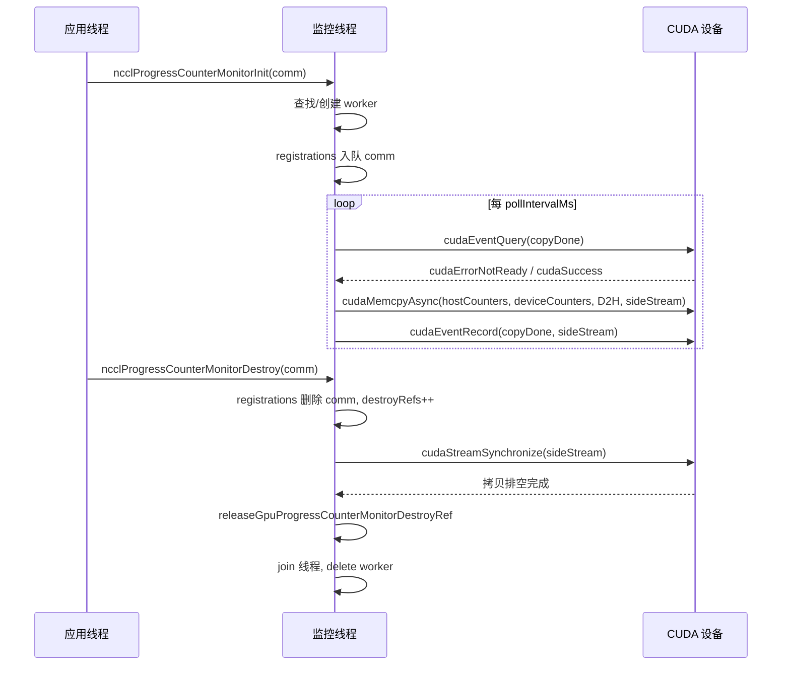
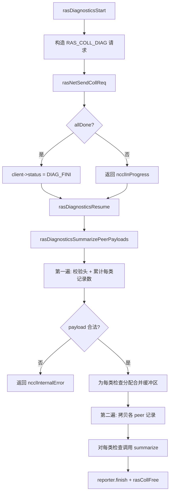

# 제 17 장: RAS 메커니즘과 내결함성: 링크 장애 감지, 하트비트 및 우아한 성능 저하

# 제17장: RAS 메커니즘과 내결함성: 링크 장애 감지, 하트비트 및 우아한 성능 저하

이전 장에서 우리는 플러그인 시스템이 어떻게 핵심 통신 경로와 교체 가능한 컴포넌트 사이의 경계를 명확히 하여, 핵심 코드를 수정하지 않고도 네트워크 백엔드, 튜닝 전략, 성능 수집기를 교체할 수 있는지 살펴보았다. 그러나 확장성은 프로덕션 사용 가능성의 한 차원일 뿐이며, 또 다른 equally hardcore한 문제는: AllReduce가 이미 72시간 동안 실행되었을 때, 특정 머신의 네트워크 카드가 조용히 고장 났다면, NCCL이 무엇을 근거로 발견하고, 격리하고, 계속할 수 있는가? RAS 서브시스템은 바로 NCCL이 "실행 가능"에서 "프로덕션 사용 가능"으로 나아가는 분수령이며, 이 장에서는 장애 감지, 진행 모니터링 및 자가 치유 메커니즘 뒤의 설계를 분석한다.

# 17.1 RAS 총괄: 프로세스당 하나의 RAS 스레드인 전역 조정자

## 직관적 모델

RAS를 전체 작업의 "당직실"로 상상해 보자. 각 NCCL 프로세스(각 rank)는 초기화 시 하나의 당직실을 열고, 그 안에 전담 스레드가 앉아 있다. 모든 통신 도메인(communicator)의 생성, 소멸, 진단 요청은 먼저 당직실에 등록해야 하며, 당직실 간에는 독립적인 RAS 네트워크를 통해 "누가 아직 살아 있고, 누가 이미 죽었는지"를 서로 통보한다.

만약 이 당직실이 없다면, NCCL은 통신 경로 자체의 타임아웃에만 의존하여 장애를 감지할 수밖에 없다 — 그리고 통신 경로상의 타임아웃은 느릴 뿐만 아니라 오판하기 쉽다(한 번의 네트워크 지터가 노드 사망으로 간주될 수 있다). RAS는 "장애 감지"를 데이터 플레인에서 제어 플레인으로 분리하여, 독립적인 경량 하트비트와 진단 채널로 건강 상태를 판정한다.

## 데이터 구조와 메모리 레이아웃

RAS의 핵심 상태는`ras.cc`의 전역 변수에 흩어져 있으며, 하나씩 분석해 보자:

| 변수 | 타입 | 역할 |
| --- | --- | --- |
| `rasInitMutex` | `std::mutex` | RAS 싱글톤 초기화 보호 |
| `rasInitialized` | `bool` | 초기화 여부 |
| `rasInitRefCount` | `int` | 참조 카운트, 활성 comm 수와 동일 |
| `rasNetListeningSocket` | `struct ncclSocket` | RAS 네트워크 리스닝 소켓 |
| `rasNotificationPipe[2]` | `ncclSocketPairDescriptor` | 로컬 스레드 → RAS 스레드의 알림 파이프 |
| `rasPfds` | `struct pollfd*` | 메인 이벤트 루프의 poll 배열 |
| `ncclComms` | `struct ncclComm**` | 모든 통신 도메인 포인터 배열 |

[FACT:src/ras/ras.cc:49-61]이 전역 상태들을 정의한다. 주목할 점은`rasInitRefCount`이`ncclAtomicRefCountIncrement`을 증감하는 데 사용되고,[FACT:src/ras/ras.cc:129]은 일반 bool과 이중 검사 잠금으로`rasInitialized`을 보호한다는 것이다[FACT:src/ras/ras.cc:103-105]— 이것은 전형적인 "한 번 초기화, 이후 읽기 전용" 패턴이다.

`ncclComms`배열의 할당 전략은 주목할 만하다: 필요에 따라 증가하는 것이 아니라, 확장할 때마다`RAS_INCREMENT * 8`(즉 32개 슬롯)[FACT:src/ras/ras.cc:139-140]이다. 배열에는`nullptr`공백(comm 소멸 시 비워짐)이 허용되며, 새 comm은 첫 번째 공백을 재사용한다[FACT:src/ras/ras.cc:135-137]。

## 시나리오 기반 Walkthrough: comm 초기화부터 RAS 스레드 시작까지

**첫 번째 단계:`ncclRasCommInit`이 호출된다.**이것은 각 comm 초기화 시 첫 번째로 호출되는 RAS 함수이다[FACT:src/ras/ras.cc:101]. 먼저`rasInitialized`을 확인하고, 초기화되지 않았다면 임계 영역에 진입한다:

1. bootstrap 네트워크 인터페이스 주소로`rasNetListeningSocket`을 초기화하고, 포트를 0으로 설정하여 커널이 무작위로 할당하게 한다[FACT:src/ras/ras.cc:108-109]

2. 해당 소켓을 리스닝한다[FACT:src/ras/ras.cc:113]

3. 로컬 알림 파이프를 생성한다[FACT:src/ras/ras.cc:118]

4. 진단 서브시스템을 초기화한다[FACT:src/ras/ras.cc:120]

5.`rasThreadMain`스레드를 시작한다[FACT:src/ras/ras.cc:121]

6.`atexit(rasTerminate)`을 등록하여 프로세스 종료 시 정리를 보장한다[FACT:src/ras/ras.cc:126]

**두 번째 단계: comm 등록.**최초 초기화 여부와 관계없이`comm`포인터를`ncclComms`배열에 기록하고,[FACT:src/ras/ras.cc:142]을 false로 설정한다`ncclCommsSorted`— 배열 순서가 변경되었으므로 이전 정렬이 무효화되기 때문이다.[FACT:src/ras/ras.cc:143]세 번째 단계: 포트 역채움.

**함수 마지막에**(커널이 할당한 포트 포함)을`rasNetListeningSocket.addr`에 복사하여, 호출자가 RAS 네트워크가 어느 포트에서 리스닝하는지 알 수 있게 한다.`myRank->addr` [FACT:src/ras/ras.cc:146]메인 이벤트 루프: poll 기반 멀티플렉싱

## 은 RAS 스레드의 심장이다

`rasThreadMain`. 먼저 세 개의 고정 fd를 등록한다: 알림 파이프, RAS 네트워크 리스닝 소켓, 클라이언트 리스닝 소켓[FACT:src/ras/ras.cc:633]. 그런 다음 무한 루프에 진입한다:[FACT:src/ras/ras.cc:641-652]복사

```
for (int64_t nextWakeup = 0;;) {
  // 计算超时
  timeoutMs = min(..., 1000);
  nEvents = poll(rasPfds, nRasPfds, timeoutMs);
  // 处理事件
  for (pollIdx...) { ... }
  // 处理各类超时
  rasSocksHandleTimeouts(now, &nextWakeup);
  rasConnsHandleTimeouts(now, &nextWakeup);
  rasNetHandleTimeouts(now, &nextWakeup);
  rasCollsHandleTimeouts(now, &nextWakeup);
}
```

[FACT:src/ras/ras.cc:655-728]이 1000ms 이내로 강제 제한된다는 것이다`timeoutMs`—[FACT:src/ras/ras.cc:664]이 아무리 멀어도 매초 깨어나 타임아웃 검사의 적시성을 보장한다.`nextWakeup`이벤트 디스패치 로직은 fd 값을 라우팅에 사용한다

: 알림 파이프라면[FACT:src/ras/ras.cc:684-715]을 호출하고; 리스닝 소켓이면 accept; 그렇지 않으면`rasLocalHandle`과`rasSocketsHead`연결 리스트를 순회하여 해당 socket을 찾아 처리한다.`rasClientsHead`로컬 알림 메커니즘: 파이프 + 고정 길이 구조

## 로컬 NCCL 스레드와 RAS 스레드는 socketpair를 통해 통신한다. 알림 구조

는 고정 길이`rasNotification`이며,[FACT:src/ras/ras.cc:35-46]을 사용하여`static_assert`을 초과하지 않도록 보장한다`PIPE_BUF` [FACT:src/ras/ras.cc:47]— 이는 쓰기의 원자성을 보장하기 위함이다(POSIX는 PIPE_BUF보다 작은 쓰기가 원자적임을 보장한다).

송신 측`rasLocalNotify`은`rasNotificationMutex`을 사용하여 여러 사용자 스레드의 쓰기를 직렬화하고[FACT:src/ras/ras.cc:224-237], 전부 쓸 때까지 루프로 쓴다[FACT:src/ras/ras.cc:224-237]. 수신 측`rasLocalHandle`도 마찬가지로 전체 구조를 다 읽을 때까지 루프로 읽고[FACT:src/ras/ras.cc:247-256], EOF를 읽으면`ncclSystemError` [FACT:src/ras/ras.cc:251-253]。

을 반환한다`RAS_ADD_RANKS`세 가지 알림 유형:`RAS_RUN_DIAG`(새 rank 참여),`RAS_TERMINATE`(진단 실행),[FACT:src/ras/ras.cc:28-32]。

## (종료)

메시지 송수신: 길이 접두사 + 증분 진행[FACT:src/ras/ras_internal.h:110-117]RAS 메시지의 와이어 포맷은 "4바이트 길이 + 메시지 본문"이다`rasConnSendMsg`. 송신 시[FACT:src/ras/ras.cc:362-390]은 먼저 길이를 보내고 그다음 메시지 본문을 보내며`meta->offset`,`rasMsgRecv`로 진행 상황을 기록하여 부분 전송 후 다음에 계속할 수 있다. 수신 시[FACT:src/ras/ras.cc:393-412]。

은 먼저 길이를 받고, 길이에 따라 버퍼를 할당한 후, 메시지 본문을 받는다`rasMsgAlloc`여기에는 세부 사항이 있다:`rasMsgMeta`이 할당하는 것은`msg`구조이며,`offsetof`필드는 구조 끝에 있고,[FACT:src/ras/ras.cc:313-319]으로 오프셋을 계산한다[FACT:src/ras/ras.cc:323-328]. 이러한 "메타데이터 전치" 레이아웃은 메시지가 전송 진행률, 큐잉 시간 등 로컬 정보를 운반할 수 있게 하면서도 와이어 포맷을 차지하지 않습니다.

## 설계 고찰

> **[Design Inference & Architectural Trade-offs]**
> **왜 epoll 대신 poll을 사용하는가?**poll의 O(n) 복잡도는 RAS 시나리오에서 허용 가능합니다——RAS 연결 수는 데이터 플레인 연결 수보다 훨씬 적고, RAS 스레드 자체가 성능 임계 경로가 아니기 때문입니다. poll의 크로스 플랫폼성도 더 우수합니다(Windows 호환).

> **[Design Inference & Architectural Trade-offs]**
> **왜 알림에 조건 변수 대신 파이프를 사용하는가?**파이프는 poll 루프에 원활하게 통합되어 RAS 스레드가 통일된`poll`모든 이벤트 소스를 대기할 수 있습니다. 조건 변수를 사용하면 poll을 깨우기 위한 추가 메커니즘이 필요합니다.

```mermaid
flowchart TD
    start["rasThreadMain 启动"] --> reg_pipe["注册通知管道 fd"]
    reg_pipe --> reg_net["注册 RAS 网络监听 fd"]
    reg_net --> reg_client["注册客户端监听 fd"]
    reg_client --> poll["poll(rasPfds, timeout check{"nEvents == -1?"}
    check -->|"是且非 EINTR"| log_err["记录 poll 错误并继续"]
    check -->|"否"| dispatch["遍历 revents 分发事件"]
    log_err --> dispatch
    dispatch --> is_pipe{"fd == 通知管道?"}
    is_pipe -->|"是"| local_handle["rasLocalHandle()"]
    is_pipe -->|"否"| is_net{"fd == RAS 监听?"}
    is_net -->|"是"| accept_net["rasNetAcceptNewSocket()"]
    is_net -->|"否"| is_client{"fd == 客户端监听?"}
    is_client -->|"是"| accept_client["rasClientAcceptNewSocket()"]
    is_client -->|"否"| find_sock["遍历 rasSocketsHead 找匹配 socket"]
    find_sock --> sock_loop["rasSockEventLoop(sock, pollIdx)"]
    local_handle --> terminate{"terminate?"}
    terminate -->|"是"| cleanup["rasThreadCleanup() 并退出"]
    terminate -->|"否"| timeouts
    sock_loop --> timeouts["rasSocksHandleTimeouts / rasConnsHandleTimeouts / rasNetHandleTimeouts / rasCollsHandleTimeouts"]
    accept_net --> timeouts
    accept_client --> timeouts
    timeouts --> poll
```

# 17.2 진행 모니터링: DMA로 GPU 카운터를 호스트로 옮기기

## 직관적 모델

진행 모니터링은 자동차 대시보드의 "엔진 회전계"와 같습니다. 운전(통신)에 참여하지는 않지만, GPU 내부의 진행 카운터를 지속적으로 호스트 메모리에 복사하여 호스트가 "이 통신 도메인이 멈춘 건 아닌지" 판단할 수 있게 합니다. 이것이 없으면 AllReduce가 멈췄을 때 "프로그램이 반환되지 않는다"는 것만 보일 뿐, GPU가 연산 중인지, 네트워크를 기다리는지, 완전히 교착 상태인지 알 수 없습니다.

## 데이터 구조와 메모리 레이아웃

각 CUDA 디바이스는 하나의`ncclGpuProgressCounterMonitor`워커 스레드에 대응됩니다[FACT:src/ras/progress_monitor.cc:35-52]：

| 필드 | 타입 | 역할 |
| --- | --- | --- |
| `cudaDev` | `int` | 바인딩된 CUDA 디바이스 번호 |
| `thread` | `std::thread` | 워커 스레드 |
| `mutex` / `cv` | `std::mutex` / `condition_variable` | 가변 상태 보호 및 깨우기 |
| `running` / `shouldStop` | `bool` | 스레드 수명 주기 플래그 |
| `copyInFlight` | `bool` | DMA 복사가 진행 중인지 여부 |
| `copyStallWarned` | `bool` | 이번 정체에 대해 이미 경고했는지 여부 |
| `copyStartNs` | `uint64_t` | 이번 복사 시작 시간 |
| `sideStream` | `cudaStream_t` | 전용 비블로킹 스트림 |
| `copyDone` | `cudaEvent_t` | 복사 완료 이벤트 |
| `warningMutex` | `std::mutex` | 경고 타임스탬프 보호 |
| `lastStaleWarnNs` / `lastErrorWarnNs` | `uint64_t` | 스로틀링 타임스탬프 |
| `destroyRefs` | `int` | 파괴 참조 카운트 |
| `registrations` | 침투적 큐 | 이 디바이스에 등록된 comm 목록 |

[FACT:src/ras/progress_monitor.cc:59-62]잠금 순서를 명확히 했습니다:`gpuProgressCounterMonitorsMu`이전에`ncclGpuProgressCounterMonitor::mutex`. 이것이 교착 상태를 피하기 위한 핵심 규약입니다.

전역 배열`gpuProgressCounterMonitors[kRasMaxCudaDevices]`디바이스 번호로 인덱싱[FACT:src/ras/progress_monitor.cc:59-62]。

## 시나리오 기반 워크스루: 한 번의 카운터 복사

**첫 번째 단계: 등록.** `ncclProgressCounterMonitorInit`이 호출됩니다[FACT:src/ras/progress_monitor.cc:319]. 만약`deviceCountersBlock`이 비어 있으면 바로 반환합니다(해당 comm은 모니터링에 참여하지 않음)[FACT:src/ras/progress_monitor.cc:323]. 그렇지 않으면 전역 잠금 내에서 해당 디바이스의 worker를 찾거나 생성하고[FACT:src/ras/progress_monitor.cc:328-335], 그런 다음 comm을 큐에 넣습니다`registrations` [FACT:src/ras/progress_monitor.cc:339]。

**두 번째 단계: 워커 스레드 시작.** `createGpuProgressCounterMonitor`worker를 생성하고,`cudaSetDevice`을 설정하며,`sideStream`（`cudaStreamNonBlocking`)와`copyDone`이벤트를 생성하고[FACT:src/ras/progress_monitor.cc:280-282], 스레드 시작 후 최대 2000ms 동안`running`이 true가 되기를 기다립니다[FACT:src/ras/progress_monitor.cc:287-303]。

**세 번째 단계: 루프 복사.** `progressCounterMonitorLoop`먼저 디바이스를 바인딩하고 relaxed 스트림 캡처 모드를 설정한 후(애플리케이션의 graph capture를 방해하지 않도록)[FACT:src/ras/progress_monitor.cc:97-121], 메인 루프에 진입합니다:

1.`pollIntervalMs`을 기다립니다(기본 1000ms)[FACT:src/ras/progress_monitor.cc:132-136]

2. 이전 복사가 아직 진행 중이면`cudaEventQuery`으로[FACT:src/ras/progress_monitor.cc:140]을 확인합니다. 만약`cudaErrorNotReady`이고 stale 임계값(기본 5000ms)을 초과하면 스로틀링 경고를 발생시킵니다[FACT:src/ras/progress_monitor.cc:141-154]

3. 등록된 모든 comm을 순회하며, 각각에 대해`cudaMemcpyAsync`을 호출하여`deviceCountersBlock`을`hostCountersBlock` [FACT:src/ras/progress_monitor.cc:170-185]

로 복사합니다`copyDone`4. 복사가 하나라도 성공하면`copyInFlight` [FACT:src/ras/progress_monitor.cc:194-202]

## 이벤트를 기록하고

을 설정합니다`progressCounterMonitorShouldWarn`동시성 제어와 스로틀링[FACT:src/ras/progress_monitor.cc:78-87]경고 스로틀링은`warningMutex`로 구현됩니다`warnIntervalNs`:`staleWarnSec`보호 아래에서 마지막 경고로부터[FACT:src/ras/progress_monitor.cc:27]를 초과했는지 확인하고, 초과한 경우에만 업데이트하고 true를 반환합니다. 기본

은 600초[FACT:src/ras/progress_monitor.cc:29], 즉 동일한 유형의 경고는 최대 10분에 한 번입니다.[FACT:src/ras/progress_monitor.cc:30]파라미터에는 하한 클램핑이 있습니다: poll 간격 최소 50ms

## , stale 임계값 최소 1000ms

`ncclProgressCounterMonitorDestroy`. 이는 사용자가 과도하게 설정하여 CPU가 헛도는 것을 방지합니다.[FACT:src/ras/progress_monitor.cc:352-354]：

파괴: 참조 카운트 + 스트림 동기화`registrations`의 파괴 로직은 이 장에서 가장 정교한 동시성 설계 중 하나입니다[FACT:src/ras/progress_monitor.cc:368]

1. 전역 잠금 + worker 잠금 내에서`destroyRefs++`에서 comm을 제거합니다`haveDestroyRef` [FACT:src/ras/progress_monitor.cc:371-372]

2. 제거에 성공하면,`shouldStop` [FACT:src/ras/progress_monitor.cc:373-376]

하고`cudaStreamSynchronize(g->sideStream)`을 설정합니다[FACT:src/ras/progress_monitor.cc:393]

3. 등록 목록이 비면 전역 배열에서 제거하고`releaseGpuProgressCounterMonitorDestroyRef`을 설정합니다[FACT:src/ras/progress_monitor.cc:219-246]

> **[Design Inference & Architectural Trade-offs]**
> **은 여전히 해당 comm 버퍼를 참조할 수 있는 복사를 배출합니다`destroyRefs`？**5. 마지막으로`cudaStreamSynchronize`은 참조 카운트를 감소시키고, 0이 되고 큐가 비면 스레드를 join하고 삭제합니다



## 왜

**이 필요한가`cudaSetDevice`왜냐하면**이 잠금 외부에서 실행되며, 그 동안 다른 스레드도 같은 worker를 파괴할 수 있기 때문입니다. 참조 카운트는 마지막 파괴자만이 실제로 join하고 delete하도록 보장합니다.`cudaSetDevice`복사`shouldStop`프로덕션 함정 회피[FACT:src/ras/progress_monitor.cc:97-107]함정 1:`NCCL_RAS`실패로 인한 모니터링 무음 실패.

**스레드 시작 시**이 실패하면 worker는`cudaThreadExchangeStreamCaptureMode(cudaStreamCaptureModeRelaxed)`을 설정하고 종료합니다[FACT:src/ras/progress_monitor.cc:110-111], 하지만 이를 등록한 comm은 여전히 모니터링이 실행 중이라고 생각합니다. 이때 카운터 미러는 Init 단계에서 실패가 드러날 때까지 계속 오래된 상태로 남습니다. 문제를排查할 때는

# 로그에 "progress-counter mirrors will remain stale"이 있는지 확인해야 합니다.

## 함정 2: graph capture 충돌.

모니터링 스레드가 CUDA API를 호출할 때 애플리케이션이 stream capture를 수행 중이면 캡처 그래프를 오염시킵니다. 코드는`nvidia-smi`으로 회피합니다

## , 이는 필수적인 보호입니다.

17.3 진단 프레임워크: 테이블 기반 검사 디스패치`rasDiagnosticsChecks` [FACT:src/ras/diagnostics.cc:63-77]직관적 모델`collectLocal`(로컬 수집) 및`summarize`(집계). 총 11개 검사 항목: GPU 모델, CUDA 드라이버 버전, ECC, NVLink, NCCL 환경, RDMA 토폴로지, IOMMU 모드, ATS, XID/SXID, NVIDIA 드라이버 버전, 경로.

`rasDiagnosticsGetCheck`삼중 검증을 수행한다: ID 범위, 테이블 항목 ID 일치, 콜백 비어있지 않음[FACT:src/ras/diagnostics.cc:104-128]. 이는 방어적 프로그래밍이다 — 테이블 항목이 잘못 수정되어 널 포인터를 호출하는 것을 방지한다.

## 시나리오 기반 Walkthrough: 한 번의 진단 전체 생명주기

**1단계: 로컬 payload 구성.** `rasDiagnosticsCollectLocalPeerPayload`먼저 peer 헤더를 기록하고[FACT:src/ras/diagnostics.cc:226-227], 그다음 분배 테이블을 순회하며 각 항목에 대해`rasDiagnosticsAppendCheckPayload` [FACT:src/ras/diagnostics.cc:229-231]。

`rasDiagnosticsAppendCheckPayload`를 호출한다`collectLocal`를 호출하여`rasDiagnosticsLocalData`를 얻고,`ncclUniquePtr`로 records 소유권을 인수하며[FACT:src/ras/diagnostics.cc:191-192], 메타데이터를 검증하고[FACT:src/ras/diagnostics.cc:193], 레코드 수가 0이면 건너뛰고[FACT:src/ras/diagnostics.cc:194], 그렇지 않으면 검사 헤더 + 레코드 데이터를 기록한다[FACT:src/ras/diagnostics.cc:196-201]。

**2단계: 집합 통신 시작.** `rasDiagnosticsStart`를 구성하여`RAS_COLL_DIAG`요청하고[FACT:src/ras/diagnostics.cc:532-537], 를 통해`rasNetSendCollReq`를 발송하며[FACT:src/ras/diagnostics.cc:539], 클라이언트 상태를 로 설정한다`RAS_CLIENT_DIAG_FINI` [FACT:src/ras/diagnostics.cc:541]。

**3단계: 응답 병합.** `rasCollDiagMerge`각 peer의 payload를 집합 버퍼에 추가한다[FACT:src/ras/diagnostics.cc:310-337]. 여기서 대량의 오버플로 검사를 수행한다: peer 수 상한[FACT:src/ras/diagnostics.cc:320-324], 총 크기 상한[FACT:src/ras/diagnostics.cc:325-328]。

**4단계: 집계.** `rasDiagnosticsSummarizePeerPayloads`은 두 번의 스캔이다[FACT:src/ras/diagnostics.cc:399]：

- 첫 번째: 각 peer 헤더와 검사 헤더를 검증하고, 각 검사 유형별 레코드 수와 바이트 수를 누적한다[FACT:src/ras/diagnostics.cc:418-470]
- 각 검사 유형별 병합 버퍼를 할당한다[FACT:src/ras/diagnostics.cc:472-476]
- 두 번째: 각 peer의 레코드를 해당 버퍼에 복사한다[FACT:src/ras/diagnostics.cc:479-497]
- 마지막으로 각 검사 유형에 대해 를 호출한다`summarize` [FACT:src/ras/diagnostics.cc:499-506]

## 클라이언트 상태와 취소

진단 상태는`rasDiagnosticsClientState`에 존재하며[FACT:src/ras/diagnostics.cc:242-245], 에 매달려 있다.`rasClient->diagnostics`클라이언트 소켓이 닫힐 때 reporter를 noop으로 교체하여`rasDiagnosticsCancelTarget`, 비동기 진단 완료 후 이미 닫힌 소켓에 쓰는 것을 방지한다[FACT:src/ras/diagnostics.cc:286-293]설계 고찰[FACT:src/ras/diagnostics.cc:48-52]。

## 〔설계 추론과 아키텍처 트레이드오프〕

> **[Design Inference & Architectural Trade-offs]**
> **payload가 가변이기 때문에, 첫 번째 스캔에서만 각 검사 유형에 필요한 버퍼 크기를 계산할 수 있다. 한 번 스캔은 동적 증가(다중 realloc)이거나 과도한 사전 할당이 필요하다. 두 번 스캔은 한 번의 정확한 할당으로 결정성을 얻는다.**왜 검사 헤더에 를 포함하는가?

**검사마다 레코드 구조 크기가 다르기 때문에, 집계 시 스트라이드를 알아야 올바르게 복사하고 검증할 수 있다.`recordStride`？** [FACT:src/ras/diagnostics.cc:197]동일 검사의 stride 일관성을 강제한다`rasDiagnosticsAccountCheckRecords`복사[FACT:src/ras/diagnostics.cc:381-385]。



# 직관적 모델

## 이 유지하는 것은 "반 전체 명단"이다. 각 RAS 스레드는 완전히 동일한 명단을 보관하며, 각 NCCL 프로세스의 주소, PID, 관리 GPU를 기록한다. 새 학생이 합류하거나 누군가 "실종"되면 RAS 네트워크를 통해 변경을 브로드캐스트한다. 명단은 해시값을 버전 번호로 사용하여 매번 전체 동기화를 피한다.

`peers.cc`데이터 구조와 메모리 레이아웃

## 두 개의 핵심 배열:

: 모든 알려진 peer, 주소로 정렬

- `rasPeers`. 죽은 peer 포함.[FACT:src/ras/peers.cc:18-19]: 죽은 peer 주소, 별도 저장
- `rasDeadPeers`왜 죽은 peer를 별도 저장하는가?[FACT:src/ras/peers.cc:37-38]。

**의 주석이 명확히 설명한다:** [FACT:src/ras/peers.cc:25-28]은 대규모에서 기본적으로 정적이고 매우 크며,`rasPeers`은 동적이고 훨씬 작다. 분리 저장으로 매번 동기화 시 거대한`rasDeadPeers`배열을 전송하는 것을 피한다.`rasPeers`구조

`rasPeerInfo`필드[FACT:src/ras/ras_internal.h:110-117]：

| 타입 | 설명 | 네트워크 주소 (정렬 키) |
| --- | --- | --- |
| `addr` | `ncclSocketAddress` | 프로세스 ID |
| `pid` | `ncclPid_t` | CUDA 디바이스 비트마스크 (CUDA_VISIBLE_DEVICES 영향 받음) |
| `cudaDevs` | `uint64_t` | NVML 디바이스 비트마스크 (영향 받지 않음) |
| `nvmlDevs` | `uint64_t` | comm에서 추출, commHash를 빼서 통신 도메인과 무관하게 만듦 |
| `hostHash` / `pidHash` | `uint64_t` | 두 해시 |

와`rasPeersHash`는 동기화의 핵심이다`rasDeadPeersHash`시나리오 기반 Walkthrough: 새 rank 합류[FACT:src/ras/peers.cc:21][FACT:src/ras/peers.cc:37-38]。

## 1단계: 변환.

**이** `rasRanksConvertToPeers`배열을`rasRankInit`로 변환한다. 먼저 주소 + cudaDev로 정렬하고`rasPeerInfo` [FACT:src/ras/peers.cc:104], 빈 주소를 건너뛰며[FACT:src/ras/peers.cc:114], 같은 주소의 다중 GPU 프로세스를 병합한다 (비트마스크 OR)[FACT:src/ras/peers.cc:127-130]2단계: 로컬 배열 갱신.[FACT:src/ras/peers.cc:134-139]。

**은 이 장에서 가장 복잡한 병합 알고리즘이다** `rasPeersUpdate`. 먼저 새 배열 크기를 계산하고[FACT:src/ras/peers.cc:197], 그다음 두 정렬 배열을 병합한다[FACT:src/ras/peers.cc:202-229]. 핵심: 병합 과정에서[FACT:src/ras/peers.cc:244-361]을 "차이"로 변환 — 실제로 새로 추가된 GPU 비트만 유지하고`rankPeers`, 마지막으로 기여 없는 항목을 제거한다[FACT:src/ras/peers.cc:301-308]. 이렇게 하면 브로드캐스트 데이터량이 최소화된다.[FACT:src/ras/peers.cc:393-402]3단계: 전파.

**을 따라** `rasNetUpdatePeers`과`rasNextLink`두 방향으로 전파하고`rasPrevLink`, 그다음 연결을 재구성한다[FACT:src/ras/peers.cc:430-450]4단계: 업데이트 전송.[FACT:src/ras/peers.cc:443-444]。

**먼저 해시를 검사한다** `rasConnSendPeersUpdate`: 상대방이 현재 해시를 알고 있으면 건너뛴다. 메시지에[FACT:src/ras/peers.cc:500-508]와`peersHash`를 포함하고`deadPeersHash` [FACT:src/ras/peers.cc:521-524], 수신자가 병합 후에도 해시가 일치하지 않으면 를 회신한다[FACT:src/ras/peers.cc:608-653]。

## 죽은 peer의 선언과 전파

`rasPeerDeclareDead`이 주소를 에 추가하고`rasDeadPeers`, 정렬 후 해시를 재계산한다[FACT:src/ras/peers.cc:793-812]。`rasMsgHandleBCDeadPeer`이 브로드캐스트된 죽은 peer 메시지를 처리한다[FACT:src/ras/ras.cc:578-591]: 로컬에 없으면 연결을 끊고 사망 선언하며, 그렇지 않으면 표시한다`*pDone = true`재브로드캐스트를 중지한다.

`rasDeadPeersUpdate`이 병합 정렬로 신구 죽은 peer 목록을 병합한다[FACT:src/ras/peers.cc:838-893]. 여기서`memmove`가 아닌`memcpy` [FACT:src/ras/peers.cc:855]를 사용하는데, 소스와 대상이 겹칠 수 있기 때문이다.

## 연결 재구성: 중복 연결 경쟁 방지

`rasLinkReinitConns`이 peer 업데이트 후 링크 연결을 재구성한다[FACT:src/ras/peers.cc:680]. 핵심 전략: 주소가 작은 쪽에서 연결을 시작하여[FACT:src/ras/peers.cc:706-711], 양쪽이 동시에 시작해 중복되는 것을 방지한다.

`rasLinkCalculatePeer`이 다음 peer 인덱스를 계산하며 죽은 peer를 건너뛴다[FACT:src/ras/peers.cc:743-785]. fallback에는 추가 최적화가 있다: 이전 fallback과 같은 노드의 peer를 건너뛰어[FACT:src/ras/peers.cc:743-785], 전체 노드 다운 시 하나씩 대기하는 것을 피한다.

## 프로덕션 함정 회피

**함정 1: 주소 비교의 바이트 순서 함정.** `ncclSocketsCompare`은 주소 패밀리 → 주소 → 포트 순으로 정렬한다[FACT:src/ras/peers.cc:960-990]. 주석은 단순히`memcmp`전체 구조를 비교할 수 없다고 지적하는데, 메모리 레이아웃 순서가 기대 정렬 순서와 다르기 때문이다[FACT:src/ras/peers.cc:957-959]. IPv4 주소와 포트는 네트워크 바이트 순서에서 바이트별 비교가 가능하지만, 주소 패밀리 필드는 그렇지 않다.

**함정 2:`myPeerIdx`무효화됩니다.**배열이 증가할 때`myPeerIdx`가 변경됩니다[FACT:src/ras/peers.cc:22-23]。`rasPeersUpdate`병합 과정에서 이를 동기적으로 업데이트하며[FACT:src/ras/peers.cc:312][FACT:src/ras/peers.cc:358], 업데이트 실패 시 이진 탐색으로 폴백합니다[FACT:src/ras/peers.cc:374-388]。

> **[Design Inference & Architectural Trade-offs]**
> **함정 3: 해시 충돌로 인한 동기화 누락.**해시는 "동기화가 필요한지" 판단에만 사용되며, 정확성에는 사용되지 않습니다 . 해시 충돌로 동기화를 건너뛰더라도, 이후 keep-alive 교환 시 여전히 해시가 포함되어 최종적으로 수렴합니다.

```mermaid
flowchart LR
    subgraph 输入
        ranks["rasRankInit[]"]
    end
    subgraph 转换
        convert["rasRanksConvertToPeers: 排序+合并同地址"]
        rankPeers["rasPeerInfo[] (rankPeers)"]
    end
    subgraph 合并
        update["rasPeersUpdate: 归并到 rasPeers"]
        diff["rankPeers 改造为差异"]
        hash["重算 rasPeersHash"]
    end
    subgraph 传播
        send["rasConnSendPeersUpdate: 带哈希"]
        recv["rasMsgHandlePeersUpdate: 合并+回发"]
        reinit["rasLinkReinitConns: 重建连接"]
    end
    ranks --> convert --> rankPeers --> update
    update --> diff --> hash
    hash --> send --> recv --> reinit
```



# 17.5 설계 사고: RAS와 주 통신 경로의 경계

RAS 서브시스템의 가장 핵심적인 설계 결정은**데이터 플레인과 완전히 분리**하는 것입니다 . RAS 스레드는 어떤 집합 통신의 데이터 전송에도 참여하지 않으며, 오직 세 가지 일만 합니다: peer 명단 유지, 연결 상태 감지, 진단 실행. 이러한 분리는 몇 가지 이점을 가져옵니다:

1. **장애 격리**: RAS 스레드가 크래시해도 통신 실패로 직접 이어지지 않습니다 (비록 장애 감지 능력은 상실되지만)

2. **성능 무손실**: RAS의 하트비트와 동기화 트래픽은 독립 네트워크를 사용하여 데이터 플레인 대역폭을 점유하지 않습니다

3. **관측 가능성**: 진단과 모니터링이 통신 진행 중에 병렬로 실행될 수 있습니다

대가는**상태 일관성**의 도전입니다: RAS가 보는 comm 상태는 데이터 플레인보다 지연될 수 있습니다.`ncclRasCommInit`과`ncclRasCommFini`는`ncclCommsMutex`를 통해[FACT:src/ras/ras.cc:77-77]를 보호하지만, RAS 스레드가 읽을 때는 스냅샷만 수행하고 강한 일관성 보장은 하지 않습니다.

또 다른 핵심 설계는**타임아웃 계층화**。`ras_internal.h`입니다. 일련의 타임아웃 상수를 정의합니다[FACT:src/ras/ras_internal.h:214-249]: keep-alive 간격 1초, 경고 임계값 5초, 오류 임계값 20초, peer 사망 임계값 60초. 이러한 계층화를 통해 시스템은 심각도에 따라 다른 조치를 취할 수 있습니다——먼저 경고하고, 그다음 대체 연결을 시도하며, 마지막에야 사망을 선언합니다.

# 17.6 이 장의 요약

이 장에서는 NCCL RAS 서브시스템의 네 가지 핵심 모듈을 분석했습니다:

- **`ras.cc`**: 싱글턴 RAS 스레드 + poll 이벤트 루프로, 파이프를 통해 로컬 알림을 수신하고 독립 네트워크를 통해 다른 rank와 메시지를 교환합니다
- **`progress_monitor.cc`**: 디바이스당 하나의 워커 스레드로, DMA를 사용하여 GPU 진행 카운터를 호스트로 가져오며, 스로틀 경고와 참조 카운트 기반 파괴를 지원합니다
- **`diagnostics.cc`**: 테이블 기반 검사 디스패치 프레임워크로, 두 번의 스캔으로 각 rank의 진단 payload를 집계합니다
- **`peers.cc`**: 정렬된 배열 + 해시 동기화 기반의 peer 명단 관리로, 죽은 peer를 별도로 저장하여 대역폭을 절약합니다

# 이 장의 생각과 자가 점검

Q1：`rasLocalNotify`는`rasNotificationMutex`로 직렬화하여 쓰지만,`rasLocalHandle`는 읽을 때 대응하는 잠금이 없습니다. 왜 이것이 안전한가요? 만약`static_assert(sizeof(struct rasNotification) <= PIPE_BUF)`를 제거하면 어떤 시나리오에서 문제가 발생하나요?

**참고 해석**: 안전성은 파이프 쓰기의 원자성을 보장하는 POSIX에서 비롯됩니다——보다 작은`PIPE_BUF`쓰기는 원자적입니다[FACT:src/ras/ras.cc:47]。`rasLocalNotify`의 루프 쓰기는[FACT:src/ras/ras.cc:224-237]단일 쓰기로 완료될 때 다른 쓰기와 인터리빙되지 않습니다.`rasLocalHandle`의 루프 읽기는[FACT:src/ras/ras.cc:247-256]부분 데이터를 읽을 수 있지만, 쓰기가 원자적이므로 읽은 것은 반드시 완전한 메시지의 접두사이며, 다음 읽기에서 보충하면 됩니다.

를 제거하면, 만약`static_assert`가`rasNotification`를 초과하면`PIPE_BUF`, 쓰기가 여러 번의 비원자적 쓰기로 분할될 수 있습니다. 두 스레드가 동시에 쓸 때 그들의 바이트가 인터리빙되어 RAS 스레드가 두 번의 알림이 이어붙은 기형 데이터를 읽을 수 있습니다.`msg.type`는 스레드 A에서 오고`msg.addRanks.ranks`는 스레드 B에서 올 수 있어,`rasLocalHandle`의 알 수 없는 타입 분기를 트리거하거나[FACT:src/ras/ras.cc:267-269]더 나쁘게는 와일드 포인터 역참조를 발생시킵니다.

Q2：`ncclProgressCounterMonitorDestroy`는 잠금 해제 후에`cudaStreamSynchronize` [FACT:src/ras/progress_monitor.cc:381-400]를 실행합니다. 만약 동기화 중에 다른 스레드도 Destroy를 호출하여 같은 comm을 파괴하면 어떻게 되나요?`destroyRefs`는 어떻게 문제를 방지하나요?

**참고 해석**：`destroyRefs`는 워커가 너무 일찍 삭제되는 것을 방지하는 참조 카운트입니다. 첫 번째 스레드가 comm을 삭제한 후`destroyRefs++` [FACT:src/ras/progress_monitor.cc:371], 이때`haveDestroyRef = true`. 두 번째 스레드가 같은 comm을 삭제하려 할 때,`ncclIntruQueueDelete`는 nullptr를 반환하고(이미 삭제됨),`haveDestroyRef`는 false를 유지하며[FACT:src/ras/progress_monitor.cc:368], 동기화와 해제를 바로 건너뜁니다.

첫 번째 스레드가`cudaStreamSynchronize`를 완료한 후`releaseGpuProgressCounterMonitorDestroyRef` [FACT:src/ras/progress_monitor.cc:402]를 호출하여`destroyRefs`를 0으로 감소시키고, 등록 큐가 비어 있을 때만 실제로 스레드를 join하고[FACT:src/ras/progress_monitor.cc:225]。

를 delete합니다`destroyRefs`만약`delete g`가 없다면, 첫 번째 스레드가 동기화 중에 두 번째 스레드의`releaseGpuProgressCounterMonitorDestroyRef`에 의해 워커가 해제되어 use-after-free가 발생할 수 있습니다. 참고로[FACT:src/ras/progress_monitor.cc:222-225]는 전역 잠금 + 워커 잠금 내에서`registrations`를 감소시켜`destroyRefs == 0`가 비어 있는지 확인과

Q3：`rasDiagnosticsSummarizePeerPayloads`의 원자성을 보장합니다.`checkHeader->payloadBytes != checkHeader->nRecords * checkHeader->recordStride` [FACT:src/ras/diagnostics.cc:451-454]는 첫 번째 스캔 시`recordStride = 0`를 검증합니다. 만약 어떤 악의적이거나 손상된 peer가`nRecords = 0`를 보내고

**라면, 이 검증이 통과할까요? 이후에 무슨 일이 발생하나요?**：`recordStride <= 0`참고 해석[FACT:src/ras/diagnostics.cc:451]는 첫 번째 조건에 의해 차단되어`ncclInternalError`, 를 반환합니다`recordStride = 0`. 따라서

는 통과하지 않습니다.`recordStride > 0`하지만 만약`nRecords = 0`이고`payloadBytes = 0`라면,`rasDiagnosticsAccountCheckRecords`이므로 검증이 통과합니다.`nRecords == 0`는[FACT:src/ras/diagnostics.cc:378]에 대해 직접 성공을 반환하고`combined`, 를 업데이트하지 않습니다`recordsBytes == 0`. 이후 할당 시[FACT:src/ras/diagnostics.cc:473]는`payloadBytes > 0`를 할당하지 않고, 복사 시[FACT:src/ras/diagnostics.cc:490]가 거짓이면 건너뜁니다`summarize`. 최종적으로`records = nullptr, recordsBytes = 0`는

를 수신하며, 각 검사의 summarize 구현은 빈 입력을 처리해야 합니다.`nRecords > INT_MAX / recordStride`진짜 위험은[FACT:src/ras/diagnostics.cc:453]의 검사에 있습니다`nRecords * recordStride`——이것은`nRecords = 2^31, recordStride = 2`정수 오버플로가 동등성 검증을 우회하는 것을 방지합니다. 만약 이 검사를 제거하면, 공격자는`payloadBytes = 0`를 구성할 수 있고, 곱이 0으로 오버플로되어`rasDiagnosticsAccountCheckRecords`와 같아지며, 검증 통과 후`nRecords`는 거대한

를 누적하여 이후 할당이나 복사가 범위를 벗어나게 됩니다.

전 장을 관통하는 설계 원칙은 제어 평면과 데이터 평면의 분리, 상태 버전 관리를 위한 해시 사용, 계층적 타임아웃 처리, 참조 카운팅을 통한 동시성 수명 주기 보호입니다. 이러한 원칙 덕분에 RAS는 통신 성능을 저하시키지 않으면서 장애 발견과 자가 치유를 구현할 수 있습니다. 통신 성능의 또 다른 핵심 지지대인 메모리 관리 역시 정교한 엔지니어링 트레이드오프가 필요합니다: NCCL 통신 전에 왜 메모리 등록이 필요한가? 등록 캐시는 성능에 어떻게 영향을 미치는가? 다음 장에서는 allocator, 등록 캐시, 사용자 버퍼 등록을 깊이 파고들어 이러한 질문에 대한 답을 밝히겠습니다.
