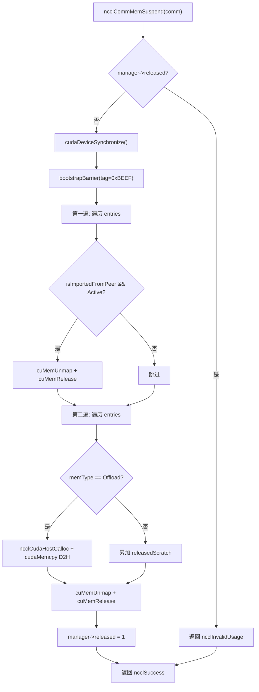
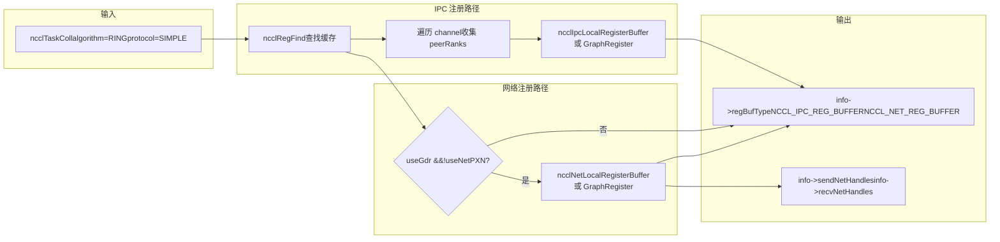
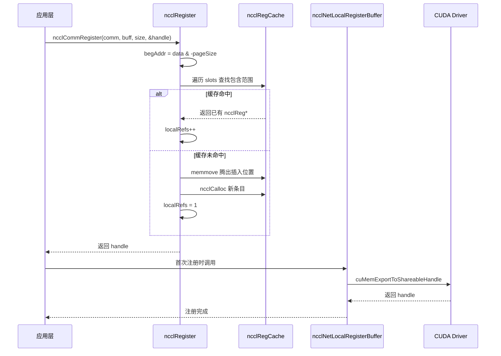

# 제 18 장: 메모리 할당과 VRAM 관리: allocator, 등록 캐시, 사용자 등록 메모리 최적화

# 제18장: 메모리 할당과 VRAM 관리: allocator, 등록 캐시, 사용자 등록 메모리 최적화

이전 장에서 RAS 서브시스템이 제어 평면에서 데이터 평면과 독립적으로 작동하며 해시로 버전을 관리하고 참조 카운팅으로 수명 주기를 보호하는 방법을 살펴보았습니다. 이번 장에서는 NCCL의 세 번째 기둥인 메모리 관리로 들어갑니다. 통신 성능의 상한은 종종 알고리즘 자체가 아니라 '데이터를 NIC가 직접 읽고 쓸 수 있는가'에 달려 있습니다. NCCL은 이를 위해 세 계층의 메커니즘을 구축했습니다: 하위 계층에서는`ncclSpace`과`ncclShadowPool`를 사용하여 주소 공간과 섀도 객체를 관리하고, 중간 계층에서는`ncclMemManager`를 사용하여 동적 메모리의 가져오기/내보내기와 일시 중단/재개를 추적하며, 상위 계층에서는`ncclCommRegister`를 사용하여 사용자 버퍼를 캐시에 등록하여 매 통신마다 메모리를 반복적으로 pin하는 것을 방지합니다. 이번 장에서는 이 세 가지 메커니즘을 계층별로 분해하여 'NCCL 통신 전에 왜 메모리 등록이 필요한가'와 '등록 캐시가 성능에 어떻게 영향을 미치는가'에 답하겠습니다.

# 18.1 ncclSpace: 주소 공간을 가득 참/비어 있음이 교차하는 세그먼트로 분할

## 직관적 모델

0부터 오른쪽으로 무한히 뻗어나가는 주차 공간 번호 라인을 상상해 보세요. 어떤 공간에는 차가 주차되어 있고(할당됨), 어떤 공간은 비어 있습니다(할당되지 않음).`ncclSpace`는 이 번호 라인의 '주차 공간 상태 기록부'입니다. 각 주차 공간을 기록하는 것이 아니라 '상태가 반전되는 경계 지점'만 기록합니다. 이것이 없다면 NCCL은 대칭 메모리의 가상 주소 범위를 관리할 때 각 바이트마다 플래그 비트를 유지해야 하며, 메모리 오버헤드가 주소 공간에 비례하여 완전히 용납할 수 없게 됩니다.

## 데이터 구조와 메모리 레이아웃

`ncclSpace`의 정의는 매우 간결합니다[FACT:src/include/allocator.h:20-24]：

```c
struct ncclSpace {
  int count;        // cuts[] 中有效元素个数
  int capacity;     // cuts[] 已分配容量
  int64_t* cuts;    // 升序排列的边界点数组
};
```

핵심 통찰은 소스 주석에 명확히 적혀 있습니다[FACT:src/allocator.cc:151-153]：`cuts[]`는 음이 아닌 정수 축을 '가득 참'과 '비어 있음'이 교차하는 세그먼트로 나누며, 분할점은 오름차순으로 정렬되고 마지막 분할점 이후의 세그먼트는 반드시 비어 있습니다(할당되지 않은 프런티어). 이로부터`i`번째 세그먼트가 가득 찼는지 판단하는 공식을 도출할 수 있습니다:

```
isFull(i) = (i%2 != ncuts%2)
```

이 공식의 의미는 세그먼트의 가득 참/비어 있음 상태가 '세그먼트 인덱스의 홀짝성'과 '분할점 총 개수의 홀짝성'에 의해 함께 결정된다는 것입니다.`ncuts`가 짝수일 때 제0 세그먼트(`cuts[0]`이전)는 비어 있고,`ncuts`가 홀수일 때 제0 세그먼트는 가득 찼습니다. 이 불변량은 전체 모듈을 관통합니다.

## 단계별 워크스루: 한 번의 할당이 cuts[]를 어떻게 변경하는가

시나리오 대입: 초기`ncclSpace`가 비어 있음(`count=0`),`ncclSpaceTryAlloc(a, limit=1000, size=100, align=1, &outOffset)`。

**호출** [FACT:src/allocator.cc:209]。`i = a->count % 2`1단계: 첫 번째 빈 세그먼트 찾기`count=0`, 이때`i=0`, 따라서

**, 제0 세그먼트부터 스캔 시작.** [FACT:src/allocator.cc:212-213]。`i==0`2단계: 세그먼트 경계 계산`lo=0`；`i==a->count`일 때`hi=limit=1000`일 때`[0, 1000)`。

**. 따라서 빈 세그먼트는** [FACT:src/allocator.cc:214-215]。`off = alignUp(0, 1) = 0`，`0 + 100 <= 1000`3단계: 정렬 및 용량 확인

**성립, 할당 성공.** [FACT:src/allocator.cc:217-223]4단계: 분할점 삽입`i==0`.`insertSegment(a, 0, 0, 100)`。`insertSegment`(헤드에 삽입)이므로 느린 경로`index=0`로 가서`lo=0, hi=100` [FACT:src/allocator.cc:172-174]위치에 두 개의 분할점[FACT:src/allocator.cc:185-203]을 삽입한 후 '인접 중복 값 필터링'을 실행합니다[FACT:src/allocator.cc:182-184]。

. 필터링 로직은 매우 정교합니다: 읽기/쓰기 이중 커서로 스캔하며 중복 값을 만나면 쓰기 커서를 되돌려 쌍으로 된 중복 값을 삭제합니다. 쌍으로 중복된다는 것은 빈 세그먼트가 두 개의 가득 찬 세그먼트 사이에 끼어 있다는 의미이므로 병합할 수 있기 때문입니다. 그러나 선행 0은 특례로 별도로 삭제할 수 있습니다`cuts = [0, 100]`，`count=2`할당 후`isFull(0) = (0%2 != 2%2) = false`. 이때`[0,0)`, 제0 세그먼트(`[0,100)`, 비어 있음)는 비어 있고, 제1 세그먼트(

**)는 가득 찼습니다. 정확합니다.** [FACT:src/allocator.cc:239-267]5단계: 해제`ncclSpaceFree(a, 0, 100)`.`cuts[count-1] <= offset`호출. 먼저[FACT:src/allocator.cc:231-237]가 성립하는지 확인`100 <= 0`, 즉`i = 1 - count%2 = 1 - 0 = 1` [FACT:src/allocator.cc:246]，`cuts[1]=100 > 0`가 거짓이므로 계속. 첫 번째 가득 찬 세그먼트 위치`i=1`。`lo = cuts[0] = 0`，`hi = cuts[1] = 100`, 따라서`offset < lo || hi < offset+size` [FACT:src/allocator.cc:252]，`0<0`.`100<100`거짓,`lo==offset`거짓 확인, 통과.`offset+size==hi`이고`offset+size != hi`이므로 두 빠른 경로 모두 충족되지 않음(첫 번째는`lo != offset`요구, 두 번째는`insertSegment(a, 1, 0, 100)` [FACT:src/allocator.cc:264]요구), 느린 경로`cuts = [0, 0, 100, 100]`로 이동. 삽입 후`[]`，`count=0`, 필터링 후

로 변합니다. 초기 상태로 복귀.`insertSegment`이 '삽입 후 필터링' 설계는 할당/해제 시 복잡한 세그먼트 병합 로직을 피하고 복잡성을

## 한 곳에 집중시킵니다.

**설계 고려사항과 프로덕션 함정**왜 size_t 대신 int64_t를 사용하는가?`ncclSpace`는 '포인터'가 아닌 '오프셋'을 관리하며, 오프셋은 음수가 될 수 있고(실제 사용에서는 그렇지 않지만), CUDA의`CUdeviceptr`너비와 일치해야 하기 때문입니다. 부호 있는 타입을 사용하면 디버깅 시 범위 초과를 발견하기 쉽습니다.

**성능 함정**：`ncclSpaceFree`의 주석은 "This could be binary search, but since allocate is linear there's no point"라고 직언합니다[FACT:src/allocator.cc:245]. 이는 할당과 해제가 모두 O(n) 스캔임을 의미합니다. 특정 통신 도메인이 많은 작은 세그먼트를 빈번히 할당/해제하면`cuts[]`가 팽창하여 매 작업이 느려집니다. 프로덕션 환경에서는 반복적으로 등록/해제하는 대신 이미 등록된 버퍼를 최대한 재사용해야 합니다.

**정렬 오버플로 위험**：`alignUp(lo, align)`는`lo`가`INT64_MAX`에 가깝고`align`가 클 때 오버플로할 수 있습니다. 소스 코드에는 명시적 검사가 없는데,`limit`가 호출자에 의해 합리적인 범위 내에 있음이 보장되기 때문입니다.

# 18.2 ncclShadowPool: 디바이스 객체와 호스트 섀도의 페어링 관리

## 직관적 모델

GPU kernel은 디바이스에서 실행되며, 호스트 메모리에 있는 C++ 객체(예:`ncclDevComm`의 메타데이터)에 직접 접근할 수 없다.`ncclShadowPool`는 마치 「번역가」와 같다: 각 디바이스 측 객체에 대해 디바이스 메모리 한 블록을 할당하고, 동시에 호스트 측에 대응하는 「섀도」 메모리를 할당하며, 「디바이스 주소 → 호스트 주소」 매핑 테이블을 유지한다. 호스트가 특정 디바이스 객체의 설정을 수정해야 할 때, 먼저 호스트 섀도를 수정한 후 디바이스로 복사한다. 이것이 없다면, kernel이 메타데이터를 읽을 때마다`cudaMemcpy`를 통해 호스트에서 가져와야 하므로 지연이 허용 불가능할 정도로 높아진다.

## 데이터 구조와 메모리 레이아웃

두 개의 핵심 구조체[FACT:src/allocator.cc:272-277]：

```c
struct ncclShadowPage {   // 最多 64 个对象的连续块
  struct ncclShadowPage* next;
  int objSize;
  uint64_t freeMask;      // 位图，1=空闲，0=已占用
  void* devObjs;
};
struct ncclShadowObject {
  struct ncclShadowObject* next;
  void* devObj;
  void* hostObj;
  struct ncclShadowPage* page;  // null 表示直接分配在 CUDA mempool
};
```

`ncclShadowPool`자체[FACT:src/include/allocator.h:42-47]：

```c
struct ncclShadowPool {
  int count, hbits;                       // 对象数、哈希位数
  struct ncclShadowObject** table;        // 哈希桶数组
  cudaMemPool_t memPool;                  // 可选的 CUDA 内存池
  struct ncclShadowPage* pages;           // 页链表
};
```

**핵심 설계 포인트:`freeMask`는 uint64_t**이므로, 페이지당 최대 64개의 객체를 담을 수 있다. 이는 임의로 선택된 것이 아니다 — 64비트는 정확히 하나의 캐시 라인 너비이며,`popFirstOneBit`는 단일`__builtin_ctzll`명령으로 첫 번째 빈 슬롯을 찾을 수 있어 루프가 필요 없다.

**해시 테이블 증가 전략**: 소스 주석 「Maintain 2:1 object:bucket ratio」[FACT:src/allocator.cc:368], 즉 객체 수가 버킷 수의 두 배를 초과하면 확장한다. 초기`hbits=4`(16개 버킷)[FACT:src/allocator.cc:363], 매번 두 배로 증가.

## Step-by-Step Walkthrough: 한 번의 할당이 페이지 또는 직결을 선택하는 방법

시나리오 대입:`ncclShadowPoolAlloc(pool, size=1024, &devObj, &hostObj, stream)`。

**첫 번째 단계: 지연 초기화** [FACT:src/allocator.cc:347-366]. 만약`hbits==0`이면, 먼저 디바이스가 메모리 풀[FACT:src/allocator.cc:352]을 지원하는지 조회하고, 지원하면`cudaMemPool_t`을 생성하고,`maxSize`를 파라미터`SHADOW_MEMPOOL_MAX_SIZE`(기본 1GB)로 설정한다.[FACT:src/allocator.cc:359]그런 다음 16개 버킷의 해시 테이블을 할당한다.

**두 번째 단계: 확장 필요 여부 확인** [FACT:src/allocator.cc:369-386]. 만약`count+1 > 2<<hbits`이면, 두 배 크기의 버킷 배열을 할당하고, 이전 테이블을 순회하며 재삽입한다(`hashInsert`는`ncclHashPointer`로 버킷 인덱스[FACT:src/allocator.cc:333-337]를 계산), 이전 테이블을 해제한다.

**세 번째 단계: 페이지 경로 또는 직결 경로 결정** [FACT:src/allocator.cc:390]. 판단 조건`(64<<10)/size >= 3`, 즉`size <= 21845`일 때 페이지 경로를 탄다.`size=1024`，`65536/1024=64 >= 3`의 경우, 페이지 경로를 탄다.

**네 번째 단계: 페이지 내 객체 크기 계산** [FACT:src/allocator.cc:391-392]。`shift = max(0, log2Down(1024)+1-4) = max(0, 10+1-4) = 7`。`pageObjSize = ((1024 + 127) >> 7) << 7 = 1024`. 즉 페이지 내 객체 크기를 2의 거듭제곱으로 128바이트의 배수로 정렬한다.

**다섯 번째 단계: 페이지 검색 또는 생성** [FACT:src/allocator.cc:393-415].`pool->pages`연결 리스트를 순회하며`objSize == pageObjSize`인 페이지를 찾는다. 없으면 새 페이지를 생성한다:`pageSize = min(65536, 64*1024) = 65536`，`freeMask = uint64_t(-1) >> (64 - 65536/1024) = uint64_t(-1) >> 0 = 全 1`(64개 슬롯 모두 비어 있음)[FACT:src/allocator.cc:400].`cudaMallocFromPoolAsync`또는`cudaMalloc`로 디바이스 메모리[FACT:src/allocator.cc:403-404]를 할당하고,`cudaMemsetAsync`를 0으로 초기화[FACT:src/allocator.cc:405]。

**여섯 번째 단계: 페이지에서 슬롯 가져오기** [FACT:src/allocator.cc:408-412]。`popFirstOneBit(&page->freeMask)`첫 번째 빈 비트를 찾고,`devObj = page->devObjs + slot * pageObjSize`. 만약`freeMask`이 0이 되면(페이지 가득 참), 페이지를 빈 리스트에서 제거[FACT:src/allocator.cc:411]。

**일곱 번째 단계: 호스트 섀도 객체 할당** [FACT:src/allocator.cc:423-428]。`malloc(sizeof(ncclShadowObject) + alignof(max_align_t)-1 + size)`, 여기서`alignof(max_align_t)-1`바이트를 추가로 할당하여 정렬 패딩에 사용한다.`hostObj = alignUp((char*)(obj+1), alignof(max_align_t))`, 즉 객체 헤더 이후를 최대 정렬 경계로 정렬한다. 그런 다음`memset(hostObj, 0, size)`를 0으로 초기화.

**여덟 번째 단계: 해시 테이블에 삽입하고 카운트 갱신** [FACT:src/allocator.cc:429-430]。

## 동시성 제어와 하드웨어 상호작용

`ncclShadowPool`자체**에는 잠금이 없다**. 이는 단일 스레드 컨텍스트에서만 사용할 수 있거나, 호출자가 상호 배제를 보장해야 함을 의미한다. NCCL의 실제 사용을 보면, 주로 통신 도메인 초기화 단계에서 호출되며, 이때는 단일 스레드이다.

`cudaMallocFromPoolAsync`와`cudaFreeAsync`는 비동기 작업이며,`stream`파라미터에 의존하여 순서를 보장한다[FACT:src/allocator.cc:403,459]。`ncclShadowPoolDestruct`는 모든 리소스를 해제한 후 호출되어`cudaStreamSynchronize(stream)` [FACT:src/allocator.cc:333-337], 모든 비동기 해제가 완료된 후 메모리 풀을 파괴하도록 보장한다.

## 프로덕션 함정 회피 가이드

**함정 1: 페이지 내 객체 크기 정렬로 인한 메모리 낭비**。`pageObjSize`를 2의 거듭제곱으로 정렬하면, 만약`size=1000`，`shift = log2Down(1000)+1-4 = 9+1-4 = 6`，`pageObjSize = ((1000+63)>>6)<<6 = 1024`. 각 객체당 24바이트 낭비, 페이지 내 64개 객체당 1536바이트 낭비. 대량의 작은 객체의 경우 이 오버헤드는 무시할 수 없다.

**함정 2:`ncclShadowPoolFree`가 객체를 찾지 못할 때의 동작** [FACT:src/allocator.cc:442-445]. 이는`ncclInternalError`를 반환하고 경고를 출력하지만,**어떤 리소스도 해제하지 않는다**. 호출자가 반환값을 무시하면 메모리 누수가 발생한다. 프로덕션 코드는 반드시 반환값을 확인해야 한다.

**함정 3:`ncclShadowPoolDestruct`에서`freeMask==0`인 페이지가 회수됨** [FACT:src/allocator.cc:301-306]. 여기서`freeMask`를 1로 설정한다(전부 1이 아님). 이는 첫 번째 슬롯만 비어 있음으로 표시함을 의미한다. 이는 「가득 찬 페이지」를 다시`pool->pages`연결 리스트에 넣기 위한 것이지만, 페이지 내 다른 슬롯은 여전히 점유되어 있다 — 실제로 이 객체들은 곧 해제될 것이므로 이 작업은 안전하다. 그러나 소멸 과정에서 동시 접근이 있으면 일관성 없는 상태를 읽게 된다.

# 18.3 ncclMemManager: 동적 메모리의 참조 카운팅과 일시 중단/복구

## 직관적 모델

훈련 작업은 며칠 동안 실행될 수 있으며, 그 동안 GPU가 다른 작업에 의해 선점되거나 체크포인트를 수행해야 할 수 있다.`ncclMemManager`는 마치 「메모리 관리인」과 같다: 모든 동적 할당 메모리(scratch/offload)를 기록하고, 필요할 때 GPU 메모리를 「일시 중단」(물리 페이지 unmap, 가상 주소 유지)하고, 데이터를 CPU로 백업하며, 복구 시 물리 페이지를 재할당하고, 재매핑하고, 데이터를 복원한다. 이것이 없다면, 작업이 선점된 후 처음부터 다시 시작해야 하므로 수 시간의 훈련 진행을 낭비한다.

## 데이터 구조와 메모리 레이아웃

`ncclMemManager`의 핵심 필드(초기화 코드에서 추론)[FACT:src/mem_manager.cc:32-60]：

| 필드 | 타입 | 의미 |
| --- | --- | --- |
| `entries` | `ncclDynMemEntry*` | 동적 메모리 엔트리 연결 리스트 헤드 |
| `numEntries` | `int` | 연결 리스트 길이 |
| `released` | `int` | 0=활성, 1=일시 중단됨 |
| `refCount` | `int` | 참조 카운트(여러 comm이 공유 가능) |
| `totalPersist` | `size_t` | 영구 메모리 총량(원자적) |
| `totalScratch` | `size_t` | scratch 메모리 총량(원자적) |
| `totalOffload` | `size_t` | offload 메모리 총량(원자적) |
| `cpuBackupUsage` | `size_t` | CPU 백업 메모리 총량 |
| `lock` | `std::mutex` | entries 연결 리스트 보호 |
| `initialized` | `int` | 원자적 플래그, 파괴된 mutex 접근 방지 |

**메모리 레이아웃의 핵심 설계**：`lock`는`std::mutex`이지만,`ncclMemManager`는`ncclCalloc`로 할당되므로(C 스타일), placement new로 명시적으로[FACT:src/mem_manager.cc:39]를 생성해야 하고, 소멸 시 명시적으로`~mutex()` [FACT:src/mem_manager.cc:120]를 호출해야 한다. 이는 C/C++ 혼합 프로그래밍의 전형적인 함정이다.

**원자적 변수와 잠금의 역할 분담**: 통계 필드(`totalPersist`등)는 원자적 연산으로 갱신하며 잠금이 필요 없다;`entries`연결 리스트는`lock`로 보호한다. 이렇게 하면 통계 조회(`ncclCommMemStats`)는 잠금 없이[FACT:src/mem_manager.cc:1117-1130]를 읽을 수 있고, 연결 리스트 작업은 반드시 잠금을 보유해야 한다.

## Step-by-Step Walkthrough: 일시 중단 및 재개 전체 흐름

**일시 중단 흐름** `ncclCommMemSuspend` [FACT:src/mem_manager.cc:418-540]：

**1단계: 사전 검사** [FACT:src/mem_manager.cc:419-430]. 메모리 관리자가 비활성화되었는지, comm이 비어 있는지, 이미 일시 중단되었는지 확인한다.

**2단계: 디바이스 동기화 및 barrier** [FACT:src/mem_manager.cc:440-441]。`cudaDeviceSynchronize()`모든 GPU 작업이 완료되었는지 확인한 후`bootstrapBarrier`모든 rank가 동기화되었는지 확인한다. barrier tag는`0xBEEF`。

**3단계: 첫 번째 스캔 — 모든 peer가 가져온 버퍼를 unmap** [FACT:src/mem_manager.cc:444-465]. 각`isImportedFromPeer && state==Active`항목에 대해`cuMemUnmap`을 호출하여 매핑을 해제하고[FACT:src/mem_manager.cc:451]handle을 해제하며[FACT:src/mem_manager.cc:456]상태를`Released`。

**로 변경한다. 4단계: 두 번째 스캔 — 로컬 메모리 offload** [FACT:src/mem_manager.cc:468-526]. peer가 가져온 항목과 이미 해제된 항목은 건너뛴다.`ncclMemOffload`유형에 대해서는 먼저 CPU 백업[FACT:src/mem_manager.cc:484]을 할당한 후`cudaMemcpy`GPU에서 CPU로 복사한다[FACT:src/mem_manager.cc:492].`ncclMemScratch`유형에 대해서는 통계만 누적한다. 그런 다음 shareable FD를 닫고[FACT:src/mem_manager.cc:508-513]，`cuMemUnmap` [FACT:src/mem_manager.cc:516]，`cuMemRelease` [FACT:src/mem_manager.cc:519], 상태를`Released`。

**로 변경한다. 5단계: 일시 중단 표시** [FACT:src/mem_manager.cc:528]。

**재개 흐름** `ncclCommMemResume` [FACT:src/mem_manager.cc:550-942]：

**1단계: 로컬 메모리 복원** [FACT:src/mem_manager.cc:577-668]. 각`!isImportedFromPeer && state==Released`항목에 대해 다시`cuMemCreate` [FACT:src/mem_manager.cc:599]，`ncclCuMemMapAndSetAccess`을 동일한 가상 주소[FACT:src/mem_manager.cc:602]에 매핑하고, peer 접근 권한[FACT:src/mem_manager.cc:610-626]을 복원하며, offload 유형에 대해서는 CPU 백업에서 데이터를 복원하고[FACT:src/mem_manager.cc:632-643], FABRIC handle을 다시 내보낸다[FACT:src/mem_manager.cc:646-658]。

**. 2단계: barrier 동기화** [FACT:src/mem_manager.cc:671-679]. tag는 여전히`0xBEEF`。

**이다. 3단계: 새 handle 정보 교환** [FACT:src/mem_manager.cc:688-816]. 각 rank가 브로드캐스트해야 할 로컬 버퍼 수를 집계하고[FACT:src/mem_manager.cc:689-696],`bootstrapAllGather`을 사용하여 카운트를 교환하고[FACT:src/mem_manager.cc:710], 오프셋을 계산한 후[FACT:src/mem_manager.cc:724-728]먼저`bootstrapSend`한 다음`bootstrapRecv`을 수행한다 (주석에 명확히 "send first, then receive to avoid deadlock"이라고 되어 있음).[FACT:src/mem_manager.cc:783]）。

**4단계: peer 버퍼 재가져오기** [FACT:src/mem_manager.cc:822-911]. 각`isImportedFromPeer && state==Released`항목에 대해 교환 결과에서 일치하는 handle 정보를 찾는다[FACT:src/mem_manager.cc:829-835]. POSIX FD 유형은 hostHash가 동일한지 확인해야 하며[FACT:src/mem_manager.cc:853-859], 그런 다음 proxy를 통해 FD를 가져와[FACT:src/mem_manager.cc:866]，`cuMemImportFromShareableHandle`을 가져온다[FACT:src/mem_manager.cc:873]. FABRIC 유형은 직접 가져온다[FACT:src/mem_manager.cc:878]. 그런 다음`ncclCuMemMapAndSetAccess`을 다시 매핑한다[FACT:src/mem_manager.cc:893]。

**. 5단계: 최종 barrier** [FACT:src/mem_manager.cc:916-928]. tag는`0xCAFE`이며, 앞의`0xBEEF`과 구분된다.

## 동시성 제어 및 하드웨어 상호작용

**참조 카운팅으로 수명 주기 보호**：`ncclMemManagerDestroy`을 먼저 감소시키고`refCount` [FACT:src/mem_manager.cc:76], 여전히 0보다 크면 현재 comm의 포인터만 제거하고[FACT:src/mem_manager.cc:81], 리소스는 해제하지 않는다. 이는 여러 comm이 동일한 메모리 관리자를 공유할 수 있게 한다 (예: split_share 시나리오).

**원자적 initialized 플래그**: 모든 작업 전에`COMPILER_ATOMIC_LOAD(&manager->initialized, memory_order_acquire)` [FACT:src/mem_manager.cc:136,242,338,358]을 확인하여 이미 파괴된 mutex에 접근하는 것을 방지한다. 파괴 시`memory_order_release`을 사용하여 0을 저장하고[FACT:src/mem_manager.cc:87], 이전 쓰기 작업이 다른 스레드에 가시적임을 보장한다.

**CUDA VMM API 사용**：`cuMemCreate`/`cuMemMap`/`cuMemUnmap`/`cuMemRelease`은 CUDA 가상 메모리 관리 API로, 물리 메모리와 가상 주소를 분리할 수 있게 한다. 이것이 일시 중단/재개의 기초이다 — 일시 중단 시 물리 페이지를 unmap하지만 가상 주소는 유지하고, 재개 시 동일한 가상 주소에 다시 매핑하므로 이미 설정된 모든 포인터 관계를 수정할 필요가 없다.

## 프로덕션 함정 회피 가이드

**함정 1: split_share 통신 도메인은 일시 중단을 지원하지 않음** [FACT:src/mem_manager.cc:1014-1018]. 만약`refCount > 1`이면, 바로`ncclInvalidUsage`을 반환한다. 여러 comm이 메모리 관리자를 공유할 때 하나의 comm을 일시 중단하면 다른 comm의 메모리에 영향을 미치기 때문이다.

**함정 2: POSIX FD 크로스 노드 무효화** [FACT:src/mem_manager.cc:853-859]. POSIX 파일 디스크립터는 동일 노드 내에서만 유효하므로, 크로스 노드 재개 시 반드시 건너뛰어야 한다. 소스 코드는`hostHash`을 비교하여 동일 노드인지 판단한다.

**함정 3: offload 데이터 복원 실패 시 백업 유지** [FACT:src/mem_manager.cc:635]. 만약`cudaMemcpy`이 CPU에서 GPU로 복원에 실패하면, 소스 코드는 경고를 출력하고`cpuBackup`을 유지하며 해제하지 않는다. 이는 호출자에게 재시도 기회를 주기 위한 것이지만, 재시도하지 않으면 CPU 메모리가 누수된다.

**함정 4:`ncclMemUntrackDynamic`에서의 use-after-free 위험**. 소스 코드는 잠금 상태에서 항목을 찾고, 필요한 정보를 저장하고, 항목[FACT:src/mem_manager.cc:302]을 해제한 후, 잠금 외부에서 통계[FACT:src/mem_manager.cc:311-327]를 업데이트한다. 이 순서는 올바르지만, 만약`info`포인터가 호출자의 스택 메모리를 가리키고 호출자가 잠금 외부에서 읽는다면,`info`의 수명 주기가 전체 함수를 커버하는지 확인해야 한다.



위 그림은 일시 중단 흐름의 제어 흐름을 보여준다. 두 가지 핵심 분기에 주목하라: 첫 번째 스캔은 peer가 가져온 버퍼만 처리하고, 두 번째 스캔은 로컬 버퍼만 처리하며, 순서는 바꿀 수 없다 — 반드시 peer 메모리에 대한 참조를 먼저 해제한 후 로컬 메모리를 해제해야 한다.

# 18.4 등록 캐시: ncclRegister가 중복 pin을 방지하는 방법

## 직관적 모델

네트워크 카드가 GPU 메모리를 직접 읽고 쓰려면 (GPUDirect RDMA), 먼저 이 메모리를 "등록"해야 한다 — 네트워크 카드에게 "이 주소에 직접 접근할 수 있다"고 알려주는 것이다. 등록 과정은 페이지 pin, IOMMU 매핑 설정을 포함하며 오버헤드가 크다 (밀리초 수준). 매번 AllReduce마다 재등록하면, 작은 메시지 통신의 지연이 등록 오버헤드에 완전히 묻히게 된다.`ncclRegister`은 "등록 캐시"이다: 이미 등록된 주소 범위를 정렬된 배열에 기록해 두고, 다음에 동일하거나 포함되는 버퍼를 만나면 바로 재사용하고 재등록하지 않는다.

## 데이터 구조와 메모리 레이아웃

`ncclRegCache`의 핵심은 정렬된 배열`slots`이며, 각 요소는`ncclReg*`。`ncclReg`의 핵심 필드이다 (사용에서 추론):

| 필드 | 유형 | 의미 |
| --- | --- | --- |
| `begAddr` | `uintptr_t` | 페이지 정렬된 시작 주소 |
| `endAddr` | `uintptr_t` | 페이지 정렬된 끝 주소 |
| `localRefs` | `int` | 로컬 참조 카운트 |
| `graphRefs` | `int` | 그래프 참조 카운트 |
| `state` | `int` | 등록 상태 비트 (NET/NVLS/COLLNET/IPC) |
| `netHandleHead` | `ncclRegNetHandles*` | 네트워크 handle 연결 리스트 |
| `ipcInfos` | `ncclIpcInfo**` | IPC 정보 배열 |

**페이지 정렬**：`begAddr = (uintptr_t)data & -pageSize` [FACT:src/register/register.cc:31]，`endAddr = ((uintptr_t)data + size + pageSize - 1) & -pageSize` [FACT:src/register/register.cc:32]。`-pageSize`은`pageSize`의 2의 보수이며, 이는 「pageSize의 배수로 내림 정렬」과 동일합니다. 이렇게 하는 이유는 등록의 최소 단위가 페이지이기 때문입니다. 1바이트만 등록하더라도 전체 페이지를 등록해야 합니다.

## Step-by-Step Walkthrough: 한 번의 등록이 어떻게 캐시에 적중하는가

시나리오 대입:`ncclCommRegister(comm, buff=0x7f0000001000, size=4096, &handle)`。

**1단계: 파라미터 검사 및 페이지 정렬** [FACT:src/register/register.cc:18-24]。`CommCheck`comm 유효성을 검증합니다. 가정:`pageSize=4096`，`begAddr = 0x7f0000001000 & -4096 = 0x7f0000001000`，`endAddr = (0x7f0000001000 + 4096 + 4095) & -4096 = 0x7f0000002000`。

**2단계: 시스템 메모리 검사** [FACT:src/register/register.cc:36-64]. 만약`ncclCuMemEnable()`이면 주소 범위와 메모리 유형을 조회합니다. 만약`memType == CU_MEMORYTYPE_HOST`이면 CPU 메모리이므로 등록을 건너뜁니다[FACT:src/register/register.cc:58-61]. 그렇지 않으면 Sysmem 세그먼트가 있는지 확인합니다[FACT:src/register/register.cc:50-55]。

**3단계: 캐시를 순회하며 삽입 위치 찾기** [FACT:src/register/register.cc:66-89]. 루프`slot`은 0부터 시작:

- 만약`slot == population`(끝에 도달) 또는`begAddr < slots[slot]->begAddr`(현재 주소가 캐시 항목보다 앞)이면 새 항목을 생성해야 함[FACT:src/register/register.cc:67]。
- 만약`slots[slot]->begAddr <= begAddr && slots[slot]->endAddr >= endAddr`이면 현재 버퍼가 기존 항목에 완전히 포함되므로 참조 카운트를 직접 증가[FACT:src/register/register.cc:83-87]。

**4단계: 새 항목 생성** [FACT:src/register/register.cc:68-82]. 캐시가 가득 차면 확장(초기 32, 이후 두 배씩)[FACT:src/register/register.cc:70].`memmove`을 사용하여`slot`위치에 공간을 확보[FACT:src/register/register.cc:73]，`ncclCalloc`새 항목 할당[FACT:src/register/register.cc:74],`begAddr`/`endAddr`설정,`isGraph`에 따라`graphRefs`또는`localRefs`를 1로 설정[FACT:src/register/register.cc:78-79]，`population++`, handle 반환.

**5단계: 등록 해제** [FACT:src/register/register.cc:172-195]。`commDeregister`먼저 handle에 해당하는 slot을 찾고[FACT:src/register/register.cc:180], 참조 카운트를 감소[FACT:src/register/register.cc:185-186]. 아직 참조가 남아 있으면 바로 반환[FACT:src/register/register.cc:187]. 그렇지 않으면`regCleanup`을 호출하여 모든 하위 등록을 정리[FACT:src/register/register.cc:188], 항목을 해제하고,`memmove`로 빈 공간을 채움[FACT:src/register/register.cc:190]，`population--`。

## 설계 고찰과 프로덕션 함정

**왜 해시 테이블 대신 정렬된 배열을 사용하는가?**등록 조회는 「범위 포함」 조회이지 정확한 매칭이 아니기 때문입니다. 정렬된 배열은 이진 탐색을 지원하며(소스 코드는 선형 스캔을 사용하지만), 메모리 지역성이 좋습니다. 해시 테이블은 「이 주소가 더 큰 범위에 포함되는가」와 같은 조회를 효율적으로 처리할 수 없습니다.

**`regCleanup`의 상태 비트 설계** [FACT:src/register/register.cc:95-134]。`state`은 비트 마스크로, 각 비트가 하나의 등록 유형(NET/NVLS/COLLNET/IPC)에 대응합니다. 정리 시 비트별로 검사하여 완료된 등록만 정리합니다. 이 설계는 부분 등록 성공, 부분 실패 상황을 허용합니다 — 예를 들어 네트워크 등록은 성공했지만 IPC 등록이 실패한 경우, 정리 시 네트워크 부분만 정리합니다.

**프로덕션 함정: 등록 캐시가 메모리 해제를 인지하지 못함**. 사용자가 버퍼를 등록한 후 등록 해제 없이`cudaFree`해버리면, 캐시에 해당 항목이 여전히 남아 있습니다. 다음 할당이 같은 주소를 재사용할 수 있어 캐시는 적중하지만 실제 메모리는 이미 무효화됩니다. NCCL의 규약은 등록과 등록 해제가 반드시 짝을 이루어야 하며, 사용자가 등록 기간 동안 메모리가 해제되지 않도록 보장해야 합니다.

**`ncclCommRegister`의 건너뛰기 조건** [FACT:src/register/register.cc:150-159]. 만약`LocalRegister=0`또는`P2pUsesMemcpy=1`이면 바로`NULL`handle을 반환합니다. 이는 특정 구성(예: P2P가 RDMA 대신 memcpy를 사용)에서 등록이 완전히 건너뛰어진다는 의미입니다. 호출자는 handle이 NULL인지 반드시 확인해야 합니다.

# 18.5 집합 통신 등록: coll_reg가 다양한 알고리즘에 대해 등록 전략을 선택하는 방법

## 직관적 모델

다양한 집합 통신 알고리즘은 서로 다른 전송 경로를 사용합니다: NVLS는 NVLink SHARP, Ring은 P2P 또는 네트워크, Tree는 트리 토폴로지를 사용합니다. 각 경로는 서로 다른 등록 방식이 필요합니다: NVLS는 NVLS 하드웨어에 등록, 네트워크는 NIC에 등록, IPC는 상대 GPU에 등록해야 합니다.`coll_reg.cc`은 「등록 전략 라우터」입니다: 알고리즘, 프로토콜, 버퍼 유형에 따라 어떤 등록 함수를 호출할지 결정합니다. 이것이 없다면 각 알고리즘이 자체적으로 등록 로직을 구현해야 하여 코드 중복과 오류 가능성이 높아집니다.

## Step-by-Step Walkthrough: Ring 알고리즘의 등록 결정

시나리오 대입:`ncclRegisterCollBuffers(comm, info, outRegBufSend, outRegBufRecv, cleanupQueue, regNeedConnect)`, 여기서`info->algorithm == NCCL_ALGO_RING`，`info->protocol == NCCL_PROTO_SIMPLE`。

**1단계: 사전 검사** [FACT:src/register/coll_reg.cc:155-157].`regBufType = NCCL_REGULAR_BUFFER`，`regNeedConnect = true`설정. 만약`LocalRegister=0`이고 영구 그래프 등록이 아니면 바로 종료.

**2단계: Ring 분기 진입** [FACT:src/register/coll_reg.cc:338].`recvRegRecord`/`sendRegRecord`을 NULL로 초기화,`sendNetConns`/`sendNetHandles`/`recvNetConns`/`recvNetHandles`/`srecvNetHandles`배열 할당[FACT:src/register/coll_reg.cc:356-360]。

**3단계: 기존 등록 기록 찾기** [FACT:src/register/coll_reg.cc:351-355]。`ncclRegFind`캐시에서 recv/send 버퍼를 찾습니다. recv를 찾지 못하고 영구 그래프 등록이 아니면 종료[FACT:src/register/coll_reg.cc:352]. 크로스 노드이고 send를 찾지 못하고 영구 그래프 등록이 아니면 종료[FACT:src/register/coll_reg.cc:354]。

**4단계: 모든 channel을 순회하며 peer 수집** [FACT:src/register/coll_reg.cc:362-393]. 각 channel에 대해`ring.prev`과`ring.next`을 검사. 연결 플래그에`NCCL_DIRECT_NIC`이 포함되면`recvNetConns`/`sendNetConns` [FACT:src/register/coll_reg.cc:370-379]에 기록.`NCCL_P2P_READ | NCCL_P2P_WRITE`이 포함되면 peer를`peerRanks`배열에 추가[FACT:src/register/coll_reg.cc:382-391]。

**5단계: IPC 등록** [FACT:src/register/coll_reg.cc:394-407]. 만약`nPeers > 0 && comm->isAllDirectP2p`이면 먼저 그래프 등록[FACT:src/register/coll_reg.cc:395-399]을 시도하고, 실패하면 로컬 등록[FACT:src/register/coll_reg.cc:400-403]을 시도. 성공하면`regBufType = NCCL_IPC_REG_BUFFER` [FACT:src/register/coll_reg.cc:406]。

**설정** [FACT:src/register/coll_reg.cc:409-457]6단계: 네트워크 등록`!comm->useNetPXN && comm->useGdr && netDeviceType != UNPACK`.[FACT:src/register/coll_reg.cc:415-418]이고 AllReduce의 PreMulSum/SumPostDiv가 아닌지 확인[FACT:src/register/coll_reg.cc:419-430]. 먼저 그래프 등록[FACT:src/register/coll_reg.cc:431-442]을 시도하고, 실패하면 로컬 등록`regBufType |= NCCL_NET_REG_BUFFER`. 성공하면[FACT:src/register/coll_reg.cc:445-452]。

**설정, handle 배열 저장** [FACT:src/register/coll_reg.cc:551-554]7단계: 채널 수 조정

## . IPC 등록만 있고 단일 노드이며 채널 수가 17-24 사이이면 16으로 줄입니다. 이는 IPC 등록 후의 대역폭 특성에 맞추기 위함입니다.

**설계 고찰과 프로덕션 함정**왜 NVLS와 Ring의 등록 순서가 반대인가?[FACT:src/register/coll_reg.cc:86-94]NVLS 분기는 그래프 등록을 먼저 시도하고 로컬 등록을 나중에 하며[FACT:src/register/coll_reg.cc:395-403], Ring 분기는 로컬을 먼저 하고 그래프를 나중에 합니다

**`isMloPartBufRdmaCapable`. 이는 NVLS의 그래프 등록이 성공할 가능성이 더 높고(NVLS 하드웨어가 영구 버퍼에 최적화되어 있음), Ring의 로컬 등록이 더 가볍기 때문입니다.** [FACT:src/register/coll_reg.cc:14-37]. 주석은 "등록 결정은 전역적이어야 하며, communicator 전체에 걸친 보장을 사용해야 한다"를 강조한다.[FACT:src/register/coll_reg.cc:20]. 이는 특정 rank의 버퍼가 RDMA를 지원하더라도, 통신 도메인 내에 지원하지 않는 rank가 하나라도 있으면 전체 통신 도메인이 등록되지 않는다는 것을 의미한다. 이는 일부 rank만 등록되고 일부는 등록되지 않아 발생하는 불일치를 방지하기 위함이다.

**프로덕션 함정: 등록 실패 시의 조용한 성능 저하**。`ncclRegisterCollBuffers`등록 실패 시 오류를 발생시키지 않고, 단지 설정하지 않을 뿐이다.`regBufType`의 해당 비트를. 이는 통신이 여전히 작동하지만 성능이 저하된다는 것을 의미한다. 프로덕션 환경에서 성능이 기대에 미치지 못하는 경우,`NCCL_REG`로그를 확인하여 등록이 성공했는지 확인해야 한다.



위 그림은 Ring 알고리즘下에서 두 개의 병렬 등록 경로를 보여준다: IPC 경로는 동일 노드 P2P 연결을 처리하고, 네트워크 경로는 노드 간 RDMA 연결을 처리한다. 두 경로는 독립적으로 실행되며, 최종적으로 모두`info->regBufType`。

# 18.6 프로덕션 함정 회피와 장애 복구 체인

## 함정 1: 등록 캐시와 메모리 풀의 상호작용

를 사용하여`ncclMemAlloc`메모리를 할당할 때, 내부적으로 CUDA VMM API[FACT:src/allocator.cc:38-94]를 사용한다. 이러한 할당 방식으로 생성된 물리 메모리는`gpuDirectRDMACapable`플래그[FACT:src/allocator.cc:54]를 가지며, 이는 본질적으로 RDMA를 지원한다는 것을 의미한다. 그러나`ncclMemFree`해제 시, 메모리 관리자가 이미 파괴된 경우`cudaFree`폴백 경로[FACT:src/allocator.cc:130-132]를 사용한다. 이로 인해 VMM으로 할당된 메모리가 잘못하여`cudaFree`로 해제될 수 있다. 프로덕션 환경에서는 반드시`ncclMemAlloc`/`ncclMemFree`를 쌍으로 사용하고, 메모리 관리자 파괴 후에 해제하지 않도록 해야 한다.

## 함정 2: 일시 중단 기간 중의 통신 요청

`ncclCommMemSuspend`실행 중에 새로운 통신 요청이 도착하면 어떻게 될까? 소스 코드는 일시 중단 전에`cudaDeviceSynchronize()` [FACT:src/mem_manager.cc:440]를 호출하여 이미 큐에 들어간 모든 GPU 작업이 완료되도록 보장한다. 그러나 host 측 통신 요청이 큐에 들어가고 있는 경우, 명시적인 보호가 없다. 프로덕션 환경에서는 일시 중단 전에 모든 통신 스레드를 중지하거나, group 시맨틱을 사용하여 일시 중단 작업이 다른 작업과 직렬화되도록 해야 한다.

## 함정 3: FABRIC handle의 호환성

`ncclMemAlloc`는 CUDA 12.3+에서 FABRIC handle[FACT:src/allocator.cc:60-71]을 사용하려고 시도한다. 만약`cuMemCreate`이`CUDA_ERROR_NOT_PERMITTED`또는`CUDA_ERROR_NOT_SUPPORTED`를 반환하면, POSIX FD[FACT:src/allocator.cc:63-65]로 폴백한다. 그러나 복구 시 handle 타입이 FABRIC인데 내보내기가 실패하면, 직접 오류를 발생시키고 unmap[FACT:src/mem_manager.cc:649-655]한다. 이는 혼합 환경(일부 GPU는 FABRIC을 지원하고 일부는 지원하지 않음)에서 일시 중단/복구가 실패할 수 있음을 의미한다.

## 함정 4: 참조 카운트 누수

`ncclRegister`캐시에 적중할 때마다 참조 카운트[FACT:src/register/register.cc:84-85]가 증가한다. 호출자가 N번 등록했지만 M번만 등록 해제한 경우(M < N), 참조 카운트는 결코 0이 되지 않으며,`regCleanup`는 결코 호출되지 않고, 내부 등록 리소스가 누수된다. 프로덕션 코드는 반드시`ncclCommRegister`/`ncclCommDeregister`。



# 복사

이 장의 생각과 자가 점검`ncclSpaceFree`Q1: 만약`if (a->count == 0 || a->cuts[a->count - 1] <= offset)`에서[FACT:src/allocator.cc:231-237]검사

**를 제거하면, 어떤 시나리오에서 범위를 벗어난 접근이 발생하는가?**참고 해석`a->count == 0`: 이 검사는 두 가지 역할을 한다. 첫째,`cuts[-1]`는 빈 배열 접근`a->cuts[a->count-1] <= offset`을 방지한다. 둘째,`offset`는`count == 0`가 할당된 범위를 초과하는 것을 방지한다. 만약 제거하면,`a->cuts[a->count - 1]`일 때,`cuts[-1]`는`count > 0`를 읽게 되며, 이는 정의되지 않은 동작으로 힙 메타데이터를 읽거나 세그멘테이션 오류를 발생시킬 수 있다. 더 은밀한 것은,`offset`이더라도`while (a->cuts[i] <= offset) i += 2`가 마지막 분할점보다 크면, 이후의[FACT:src/allocator.cc:247]루프`i`에서`cuts[]`가 계속 증가하여 범위를 벗어날 때까지 진행되는데, 이는`offset`에`ncclSpace`보다 큰 요소가 존재하지 않기 때문이다. 프로덕션에서의 발생 시나리오는: 호출자가 한 번도 할당된 적 없는 오프셋을 전달한 경우(예: 버퍼가 외부에서 해제된 후 다시 free를 호출), 또는`offset`가 동시에 수정되어 상태가 불일치하게 된 경우이다. 수정 방법은 이 검사를 유지하고, 오류 반환 시`count`와

Q2: `ncclMemManagerDestroy`를 출력하여 문제 해결을 용이하게 하는 것이다.`refCount`에서, 만약[FACT:src/mem_manager.cc:78-83]가 감소한 후에도 여전히 0보다 크면, 현재 comm의 포인터만 지우고 리소스는 해제하지 않는다`ncclMemTrack`. 만약 이때 다른 comm이

**를 호출하고 있다면, 어떤 일이 발생하는가?**：`ncclMemTrack`참고 해석`manager->initialized` [FACT:src/mem_manager.cc:136]는 먼저`refCount > 0`를 검사한다.`initialized = 0`일 때`manager->lock`를 설정하지 않으므로, 검사를 통과한다. 그런 다음`entries`를 획득하고[FACT:src/mem_manager.cc:188-192]연결 리스트`refCount > 0`를 수정한다. 이는 안전한데,`ncclMemManagerDestroy`는 적어도 하나의 comm이 참조를 보유하고 있음을 의미하며, 메모리 관리자가 파괴되지 않기 때문이다. 진정한 위험은: 마지막 comm이`refCount`를 호출할 때,`initialized = 0` [FACT:src/mem_manager.cc:87]가 0으로 감소하면,`ncclMemTrack`를 설정하고 모든 리소스를 해제한다. 만약 이때 다른 스레드가`initialized`에서 이미`manager->lock`검사를 통과했지만 아직 락을 획득하지 못했다면, 해제된`memory_order_acquire`/`release`에 접근하여 use-after-free가 발생한다. 소스 코드는

를 쌍으로 맞춰 이 문제를 완화하지만, 엄밀히 말하면 여전히 경쟁 창이 존재한다. 프로덕션 환경에서는 메모리 관리자를 파괴하기 전에 모든 통신 스레드가 중지되었는지 확인해야 한다.`ncclCommMemResume`Q3:[FACT:src/mem_manager.cc:853-859]에서 POSIX FD 타입의 peer 버퍼가 노드 간에서 건너뛰어진다`restoredPeerCount`. 만약 모든 peer 버퍼가 건너뛰어지면,`manager->released`는 0이지만,[FACT:src/mem_manager.cc:913]는 여전히 0으로 설정된다

**. 이는 어떤 결과를 초래하는가?**：`manager->released = 0`참고 해석`state`는 메모리 관리자가 복구가 완료되었다고 간주함을 나타낸다. 그러나 건너뛰어진 peer 버퍼가 있으면, 그들의`ncclDynMemStateReleased`，`handle`는 여전히`ncclCommMemStats`이고 여전히 0이다. 이후 통신이 이 버퍼들에 접근하면 CUDA 오류(매핑되지 않은 가상 주소 접근)가 발생한다. 더 심각한 것은,`ncclStatGpuMemSuspended`가[FACT:src/mem_manager.cc:1130]를 조회하면 0(활성)을 반환`entries`에서. 올바른 방법은 일시 중단 시 크로스 노드 POSIX FD 항목을 복구 불가능으로 표시하거나, 복구 시 조용히 건너뛰는 대신 오류를 반환하는 것입니다. 프로덕션 환경에서 POSIX FD를 사용하고 크로스 노드인 경우, FABRIC 핸들로 전환하거나 일시 중단/복구가 단일 노드 내에서만 수행되도록 보장해야 합니다.

메모리 관리는 NCCL 성능의 보이지 않는 기둥입니다:`ncclSpace`극도로 간결한 분할점 배열로 주소 공간을 관리하고,`ncclShadowPool`64비트 비트맵과 해시 테이블로 디바이스/호스트 객체 페어링을 관리하며,`ncclMemManager`참조 카운팅과 CUDA VMM API로 일시 중단 복구를 구현하고,`ncclRegister`정렬된 배열로 등록 결과를 캐시하여 중복 pin을 방지합니다. 이 네 가지 계층 메커니즘이 함께 "통신 전에 메모리를 재등록할 필요가 없다"는 핵심 성능 보장을 뒷받침합니다. 다음 장에서는 디바이스 측 통신자와 ABI 호환성으로 들어가,`devcomm`어떻게 이 호스트 측 메모리 레이아웃을 GPU kernel이 접근 가능한 구조로 매핑하는지 살펴보겠습니다.

위 그림은 등록의 타이밍을 보여줍니다: 캐시 히트 시에는 참조 카운트만 증가시키고 하위 등록을 호출하지 않으며, 캐시 미스 시에만 새 항목을 생성하고 하위 등록을 트리거합니다. 여기까지 호스트 측 메모리 관리 메커니즘이 명확해졌습니다. 하지만 통신은 결국 GPU에서 발생하며, kernel은 상대 rank의 주소와 연결 상태에 직접 접근해야 합니다. 다음 장에서는 디바이스 측 통신자와 ABI 호환성으로 들어가, devcomm이 어떻게 호스트 측 ncclComm의 메타데이터를 디바이스 측 접근 가능한 구조로 매핑하는지, 그리고 버전화된 ABI가 어떻게 신구 kernel과 라이브러리의 호환성을 보장하는지 살펴보겠습니다.
