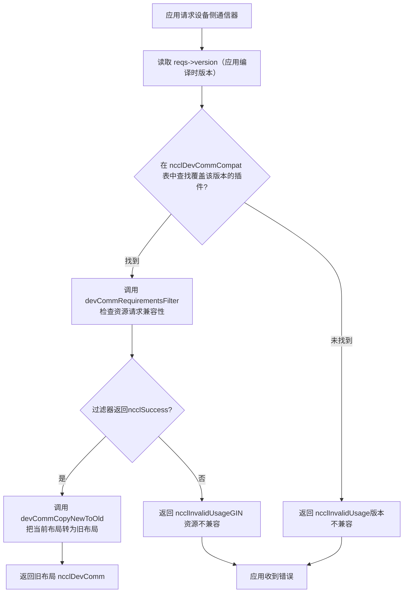
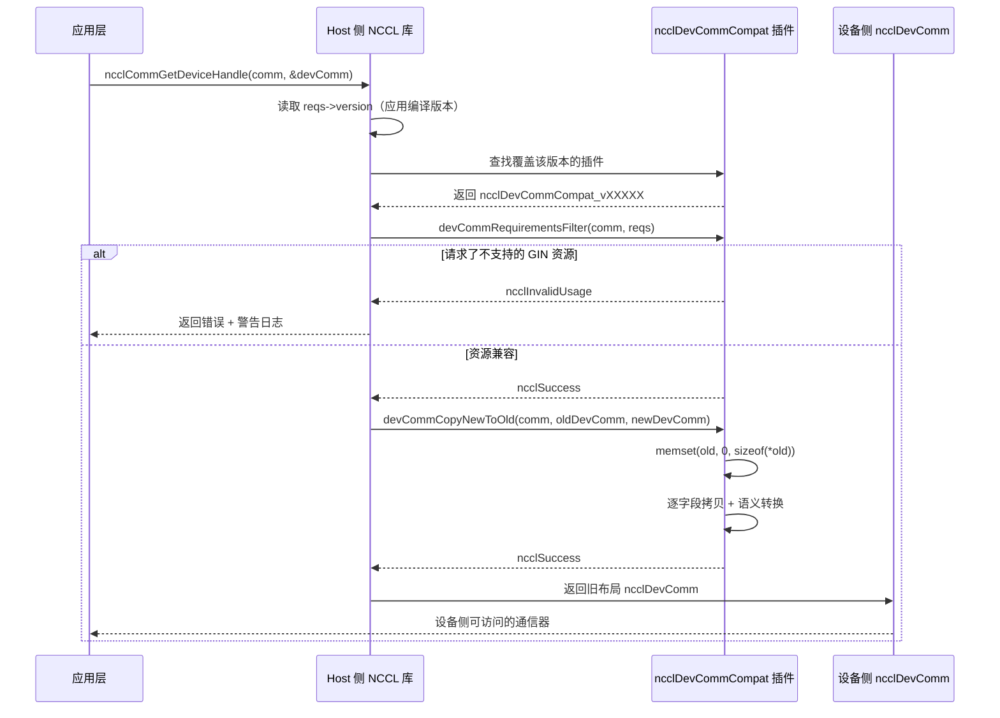

# 제 19 장: 디바이스 측 통신 도메인과 ABI 호환성: devcomm과 kernel의 통신 계약

이전 장에서 우리는 호스트 측 ncclMemManager가 참조 카운팅과 CUDA VMM API로 통신 버퍼의 수명 주기를 관리하는 것을 보았습니다. 하지만 통신이 실제로 발생하는 곳은 GPU kernel입니다——kernel 내의 스레드는 알아야 합니다: 나는 어느 rank인가? 상대 rank의 버퍼는 어느 가상 주소에 있는가? 연결이 준비되었는가? 이 정보는 호스트 측 ncclComm 구조에 있지만, kernel은 호스트 포인터를 직접 역참조할 수 없습니다. 만약 NCCL이 kernel이 매번 파라미터 전달이나 전역 메모리 조회를 통해 이 메타데이터를 얻도록 한다면, 매 통신마다 추가 지연과 대역폭 오버헤드를 지불해야 합니다. 더 나쁜 것은, kernel 코드가 한 번 컴파일되면 접근하는 필드 오프셋이 고정된다는 것입니다——라이브러리 업그레이드 후 ncclComm의 레이아웃이 변경되면 구 kernel은 잘못된 데이터를 읽게 됩니다. 이것이 devcomm이 해결해야 할 핵심 문제입니다: 호스트 측 통신 도메인의 핵심 메타데이터를 안정적이고 버전화된 메모리 레이아웃으로 디바이스 측 접근 가능한 구조에 매핑하는 것입니다. src/devcomm 디렉토리의 devcomm_v22902.cc, devcomm_v22907.cc, devcomm_v23000.cc, devcomm_v23100.cc가 바로 이 버전화된 ABI의 구체적 구현입니다. 각 파일은 하나의 NCCL 버전 구간에 대응하며, 해당 구간 내 ncclDevComm의 정확한 메모리 레이아웃과 신구 버전 간의 필드 복사 로직을 정의합니다. 이 장에서는 순서대로 분석합니다: 디바이스 측 통신자의 핵심 데이터 구조가 어떻게 생겼는지, 버전화된 ABI의 등록과 매칭 메커니즘이 어떻게 작동하는지, 신구 버전 간에 필드 수준 변환을 어떻게 수행하는지, 그리고 이 메커니즘의 프로덕션 환경에서의 경계와 함정은 무엇인지.

# 一、디바이스 측 통신자의 핵심 구조: ncclDevComm의 메모리 레이아웃

## 직관적 모델

`ncclDevComm`을 "워크스테이션 카드"로 상상해 보세요: 각 GPU kernel이 시작될 때마다 카드를 받는데, 거기에는 "너는 3번 rank, 총 8개 rank, 너의 LSA 그룹에는 4개 rank, 상대 버퍼 기저 주소는 0x7f..."라고 적혀 있습니다. 이 카드는 충분히 작아야 하고(kernel 파라미터에 들어갈 수 있어야 함), 동시에 모든 핵심 정보를 포함해야 합니다. 만약 이 카드가 없다면, kernel은 호스트 측에서 반복적으로 파라미터를 전달받아 매 통신마다 재조립해야 합니다——지연이 높고 오류가 발생하기 쉽습니다.

## 데이터 구조와 메모리 레이아웃

`ncclDevComm_v23000`을 예로 들면, 전체 정의는[FACT:src/devcomm/devcomm_v23000.cc:25-62]：

```c
struct ncclDevComm_v23000 {
  unsigned int magic;          // 偏移 0，魔数校验
  unsigned int version;        // 偏移 4，版本号

  int rank, nRanks;            // 偏移 8, 12
  uint32_t nRanks_rcp32;       // 偏移 16，nRanks 的倒数（定点数）
  int lsaRank, lsaSize;        // 偏移 20, 24
  uint32_t lsaSize_rcp32;      // 偏移 28

  ncclDevCommWindowTable_t windowTable;  // 偏移 32
  ncclWindow_t resourceWindow;           // 偏移 40
  ncclResourceWindow_vidmem_v23000_t resourceWindow_inlined;  // 偏移 48
  ncclGinBarrierHandle_t hybridWorldGinBarrier;  // 偏移 112
  ...
};
```

[FACT:src/devcomm/devcomm_v23000.cc:64-93]一连串`static_assert`으로 각 필드의 오프셋을 고정합니다. 이것은 장식이 아닙니다——ABI 호환성의 컴파일 타임 계약입니다. 만약 어떤 필드의 오프셋이 컴파일러 정렬 정책 변화로 인해 이동하면, 런타임에 디버깅하기 어려운 메모리 오정렬이 발생하는 대신 컴파일이 실패합니다.

몇 가지 핵심 필드의 설계 동기:

> **[Design Inference & Architectural Trade-offs]**
> **`nRanks_rcp32`와`lsaSize_rcp32`**: 이것은`nRanks`와`lsaSize`의 역수로, 32비트 고정소수점으로 표현된다. kernel에서 rank를 buffer 오프셋으로 변환하는 나눗셈 연산을 할 때, GPU의 정수 나눗셈은 매우 느리므로 역수를 곱한 뒤 시프트하는 방식으로 상당히 가속할 수 있다. 이는 전형적인 「공간을 시간으로 바꾸는」 기법이다 — 4바이트를 더 저장해서 매 나눗셈마다 발생하는 수십 클럭 사이클을 절약한다.

**`resourceWindow_inlined`**: 이것은 인라인 윈도우 디스크립터이며, 타입은`ncclResourceWindow_vidmem_v23000_t`이다. 주의:[FACT:src/devcomm/devcomm_v23000.cc:11-18]에서의 정의:

```c
typedef struct ncclResourceWindow_vidmem_v23000 {
  char reserved1[8];
  char* lsaFlatBase;
  char reserved2[8];
  uint32_t stride4G;
  uint32_t mcOffset4K;
  char reserved3[32];  // NOTE: shrunk from 40 in 2.30u1 to reclaim 8 bytes
} ncclResourceWindow_vidmem_v23000_t;
```

여기서`reserved1`、`reserved2`、`reserved3`은**패딩 필드**로, 자리를 차지하기 위해 사용된다. 왜 패딩이 필요한가? 왜냐하면`ncclDevComm_v23000`의 레이아웃은 반드시 어떤 「기준 버전」과 오프셋이 일치해야 하므로, 일부 필드가 현재 버전에서 더 이상 사용되지 않더라도 자리 표시를 유지하여 이후 필드의 오프셋이 변하지 않도록 해야 한다.[FACT:src/devcomm/devcomm_v23000.cc:11-18]의 주석은 명확히 설명한다: 2.30u1에서`reserved3`을 40바이트에서 32바이트로 축소하여 8바이트를`hybridWorldGinBarrier`에게 확보했다. 이것은**레이아웃 재배치**이다 — 패딩 영역을 축소함으로써 전체 크기를 변경하지 않으면서 새 필드를 끼워 넣는다.

[FACT:src/devcomm/devcomm_v23000.cc:11-18]의`static_assert`이 추가로 검증한다:`lsaFlatBase`、`stride4G`、`mcOffset4K`세 필드의 오프셋은 반드시 「현재 버전」의`ncclWindow_vidmem`과 일치해야 하며, 전체 구조체 크기는 64바이트이다. 이는`resourceWindow_inlined`이 v23000과 현재 버전 사이에서**바이너리 호환**임을 의미한다 — 직접 memcpy할 수 있다.

## 버전화된 구조체의 패밀리

비교`ncclDevComm_v22902` [FACT:src/devcomm/devcomm_v22902.cc:38-62]과`ncclDevComm_v22907` [FACT:src/devcomm/devcomm_v22907.cc:13-41]을 보면 필드의 진화를 알 수 있다:

| 필드 | v22902 | v22907 | v23000 |
| --- | --- | --- | --- |
| `magic`/`version` | 없음 | 없음 | 있음 (오프셋 0/4) |
| `ginContextCount` | uint8_t | uint32_t | uint32_t |
| `ginNetDeviceTypes` | `[4]` | `[NCCL_GIN_MAX_CONNECTIONS]` | `[NCCL_GIN_MAX_CONNECTIONS]` |
| `ginIsRailed` | 없음 | bool | 분할됨`ginConnectionsRailed` + `ginContextsRailed` |
| `hybridWorldGinBarrier` | 없음 | 없음 | 있음 (오프셋 112) |
| 구조체 크기 | 200 | 224 | 240 |

> **[Design Inference & Architectural Trade-offs]**
> 이 진화 경로는 NCCL의 버전 전략을 드러낸다:**필요할 때만 필드를 추가하고, 가능한 한 패딩 영역을 활용한다**. v22902에서 v22907로 가면서`ginSignalBase`、`ginCounterBase`、`ginContextBase`、`ginIsRailed`등 GIN 관련 필드가 추가되었고; v22907에서 v23000으로 가면서`magic`/`version`검증 필드와`hybridWorldGinBarrier`이 추가되었으며, 동시에`ginIsRailed`을 두 개의 더 정밀한 플래그 비트로 분할했다.

---

# 二、버전화된 ABI의 등록과 매칭: ncclDevCommCompat 구조

## 직관적 모델

버전화된 ABI를 일종의 「번역 플러그인」 세트라고 상상해 보자: 애플리케이션이 NCCL 2.29.2로 컴파일되었지만 런타임에 링크된 라이브러리는 2.31.0인 경우, 라이브러리는 「2.29.2의 kernel이 어떤`ncclDevComm`레이아웃을 기대하는지」를 알아야 하며, 그런 다음 현재 버전의`ncclDevComm`을 이전 레이아웃으로 번역한다. 각 버전 구간은 하나의 번역 플러그인에 대응하며, 전역 테이블에 등록된다.

## 핵심 구조: ncclDevCommCompat

각`devcomm_vXXXXX.cc`파일 끝에는`ncclDevCommCompat`구조체가 정의되어 있다. v23000을 예로 들면[FACT:src/devcomm/devcomm_v23000.cc:192-199]：

```c
struct ncclDevCommCompat ncclDevCommCompat_v23000 = {
  NCCL_VERSION(2, 30, 0),               // minVersion
  NCCL_VERSION(2, 30, 7),               // maxVersion
  nullptr,                              // commPropertiesFilter
  ncclDevCommRequirementsFilter_v23000, // devCommRequirementsFilter
  ncclDevCommCopyNewToOld_v23000,       // devCommCopyNewToOld
  ncclDevCommCopyOldToNew_v23000,       // devCommCopyOldToNew
};
```

여섯 필드의 의미:

1. **`minVersion` / `maxVersion`**: 이 플러그인이 담당하는 버전 구간. v23000은 2.30.0부터 2.30.7까지 커버한다.

2. **`commPropertiesFilter`**: 선택적 필터로,`ncclCommProperties`에서 이전 버전에 노출되는 기능 플래그를 조정하는 데 사용된다. v23000은`nullptr`으로 설정되어 있으며, 필터링이 필요 없음을 나타낸다.

3. **`devCommRequirementsFilter`**: 애플리케이션이 요청한 디바이스 측 리소스가 이전 버전과 호환되는지 확인한다. v23000의 구현[FACT:src/devcomm/devcomm_v23000.cc:95-98]은 단지`ginType`을`comm->sharedRes`에서`reqs`。

4. **`devCommCopyNewToOld`**으로 복사한다: 현재 버전의`ncclDevComm`을 이전 버전 레이아웃으로 복사한다.

5. **`devCommCopyOldToNew`**: 이전 버전 레이아웃을 다시 현재 버전으로 복사한다.

## 버전 구간의 구분

네 파일의 버전 구간:

| 파일 | minVersion | maxVersion | 비고 |
| --- | --- | --- | --- |
| `devcomm_v22902.cc` | 2.29.2 | 2.29.3 | 최초의 버전화 구현 |
| `devcomm_v22907.cc` | 2.29.5 | 2.29.7 | GIN 필드 추가, 그러나 GIN 하위 호환성은 제공하지 않음 |
| `devcomm_v23000.cc` | 2.30.0 | 2.30.7 | magic/version 검증 추가 |
| `devcomm_v23100.cc` | 2.31.0 | 현재 버전 | 모든 필터가 nullptr이며, 완전 호환을 나타낸다 |

[FACT:src/devcomm/devcomm_v23100.cc:10-17]의 v23100 플러그인은 모든 콜백이`nullptr`이며, 이는 2.31.0부터`ncclDevComm`의 레이아웃이 이미 안정화되어 어떠한 변환도 필요하지 않음을 의미한다.

> **[Design Inference & Architectural Trade-offs]**
> v22902와 v22907 사이의 버전 구간에 「틈」이 있음에 주의하라 (2.29.4와 2.29.6에는 대응하는 플러그인이 없다). 이는 아마도 해당 버전들이 릴리스되지 않았거나, 그 레이아웃이 인접 버전과 완전히 동일하여 재사용할 수 있기 때문일 것이다.

## 매칭 흐름

애플리케이션이`ncclCommGetDeviceHandle`또는 유사한 API를 호출할 때, NCCL은 다음을 해야 한다:

1. 애플리케이션이 컴파일 시 삽입한 NCCL 버전 번호를 읽는다 (`reqs->version`）。

을 통해)`ncclDevCommCompat`2. 전역

테이블에서 해당 버전을 커버하는 플러그인을 찾는다.`devCommCopyNewToOld`3. 찾으면 플러그인의

을 호출하여 현재 레이아웃을 이전 레이아웃으로 변환한다.

4. 찾지 못하면 오류를 반환하거나 기본 동작을 사용한다.



---

# 복사

## 三、필드 수준 변환: 신구 레이아웃은 어떻게 상호 변환되는가

직관적 모델`ncclDevComm`버전 변환은 「번역」과 같다: 새 버전의`rank`은 현대 중국어 문장이고, 이전 버전의 레이아웃은 고문이다. 번역기는 필드별로 대응해야 한다 — 어떤 필드는 직접 대응되고 (`rank`는`ginConnectionStride > 1`에 대응), 어떤 필드는 「의역」이 필요하며 (`ginConnectionsRailed = true`을

## 으로 번역), 어떤 필드는 이전 버전에 존재하지 않는다 (그냥 버린다).

NewToOld 변환: 현재 버전에서 이전 버전으로`ncclDevCommCopyNewToOld_v23000`을 예로 들면[FACT:src/devcomm/devcomm_v23000.cc:114-152]：

```c
static ncclResult_t ncclDevCommCopyNewToOld_v23000(ncclComm_t comm, void* oldDevComm,
                                                   struct ncclDevComm const* newDevComm) {
  struct ncclDevComm_v23000* old = (struct ncclDevComm_v23000*)oldDevComm;

  memset(old, '\0', sizeof(*old));  // 先清零，防止未初始化字段泄露
  old->magic = newDevComm->magic;
  old->version = newDevComm->version;
  old->rank = newDevComm->rank;
  ...
  old->ginConnectionsRailed = (newDevComm->ginConnectionStride > 1);
  old->ginStrongLegacySignals = newDevComm->ginStrongLegacySignals;
  old->ginContextsRailed = (newDevComm->ginContextStride > 1);
  ...
}
```

핵심 단계:

1. **`memset`0으로 초기화** [FACT:src/devcomm/devcomm_v23000.cc:118]: 이것은 안전 보호이다 — 이전 구조체에는 새 버전에 존재하지 않는 필드가 있을 수 있으며, 0으로 초기화하면 초기화되지 않은 메모리가 디바이스 측으로 유출되는 것을 방지할 수 있다.

2. **직접 필드 복사**：`rank`、`nRanks`、`lsaRank`등은 직접 대입한다.

3. **인라인 윈도우 변환**: 호출`ncclDevCommCopyResourceWindowNewToOld_v23000` [FACT:src/devcomm/devcomm_v23000.cc:100-105], 필드별로 복사`lsaFlatBase`、`stride4G`、`mcOffset4K`。

4. **의미 변환**：`ginConnectionsRailed = (newDevComm->ginConnectionStride > 1)` [FACT:src/devcomm/devcomm_v23000.cc:142]. 새 버전은`ginConnectionStride`(정수 스텝)으로 railed 여부를 나타내고, 이전 버전은 불리언 값을 사용한다. 스텝이 1보다 크면 연결이 railed임을 나타낸다.

5. **배열 복사**：`memcpy`복사`ginNetDeviceTypes`과`ginHandles`배열[FACT:src/devcomm/devcomm_v23000.cc:135-136]。

## OldToNew 변환: 이전 버전에서 현재 버전으로

역변환은[FACT:src/devcomm/devcomm_v23000.cc:154-190]：

```c
static ncclResult_t ncclDevCommCopyOldToNew_v23000(ncclComm_t comm, struct ncclDevComm* newDevComm,
                                                   void const* oldDevComm) {
  struct ncclDevComm_v23000 const* old = (struct ncclDevComm_v23000 const*)oldDevComm;

  newDevComm->magic = old->magic;
  ...
  newDevComm->ginConnectionStride = old->ginConnectionsRailed ? old->lsaSize : 1;
  newDevComm->ginContextStride = old->ginContextsRailed ? old->lsaSize : 1;
  ...
}
```

> **[Design Inference & Architectural Trade-offs]**
> 주의[FACT:src/devcomm/devcomm_v23000.cc:180-181]의 의미 변환: 이전 버전에서`ginConnectionsRailed`이 참이면, 새 버전의`ginConnectionStride`은 다음과 같이 설정된다`lsaSize`；그렇지 않으면 1로 설정한다. 여기서는`lsaSize`를 스텝 크기로 사용하는데, railed 모드에서 각 LSA 그룹 내의 rank가 하나의 GIN 연결을 공유하므로 스텝 크기는 LSA 그룹의 크기와 같기 때문이다.

## v22902의 특수 처리

`ncclDevCommCopyOldToNew_v22902` [FACT:src/devcomm/devcomm_v22902.cc:149-167]에는 중요한 주석이 있다:

```c
// Note: this callback will be used with v22907 as well because, prior to 2.30.0, ncclDevComm was unversioned,
// so v22902 and v22907 variants are indistinguishable.
```

> **[Design Inference & Architectural Trade-offs]**
> 이는 2.30.0 이전에는`ncclDevComm`이 없었음을 의미한다`magic`/`version`필드가 없으므로 라이브러리는 구 구조체가 v22902인지 v22907인지 구분할 수 없다. 따라서 v22907의`devCommCopyOldToNew`은`nullptr` [FACT:src/devcomm/devcomm_v22907.cc:128]로 설정되고, 실제로는 v22902의 버전이 사용된다. 둘 다 GIN 하위 호환성을 지원하지 않으므로 GIN 관련 필드의 차이는 정확성에 영향을 미치지 않는다.

## 리소스 윈도우의 버전 관리

`ncclWindow_vidmem_v22902`의 정의는`devcomm_v22902.h`에 있으며(이 장에서는 해당 파일 내용을 제공하지 않음), 하지만[FACT:src/devcomm/devcomm_v22902.cc:141]과[FACT:src/devcomm/devcomm_v22902.cc:164]에서 볼 수 있듯이 v22902는`ncclDevCommCopyResourceWindow_v22902`를 사용하여 윈도우를 변환한다. 이 함수는`devcomm_v22902.h`에 선언되어 있으며, 구체적인 구현은 이 장의 소스 코드에 표시되지 않는다.

[FACT:src/devcomm/devcomm_v23000.cc:11-18]의`static_assert`은 v23000의 윈도우 레이아웃이 현재 버전과 일치함을 검증하므로, v23000의 변환 함수는 필드별로 직접 복사할 수 있다.

---

# 4. 능력 필터링과 리소스 검사: 구 kernel이 지원되지 않는 기능에 접근하는 것을 방지

## 직관적 모델

버전 변환은 단순한 "필드 이사"가 아니다 — 구 버전이 애플리케이션이 요청한 기능을 지원하는지도 확인해야 한다. 예를 들어, 2.29.2로 컴파일된 kernel이 GIN 리소스를 요청하지만, 2.29.2의`ncclDevComm`레이아웃에서 GIN 필드가 불완전하면 직접 변환 시 kernel이 쓰레기 데이터를 읽게 된다. 따라서 변환 전에 이러한 요청을 차단하는 "필터"가 필요하다.

## commPropertiesFilter: 능력 플래그 필터링

`ncclCommPropertiesFilter_v22907` [FACT:src/devcomm/devcomm_v22907.cc:69-77]：

```c
static ncclResult_t ncclCommPropertiesFilter_v22907(ncclComm_t comm, struct ncclCommProperties* props) {
  // We don't provide backwards compatibility for GIN with 2.29.7.  If a communicator needs it, we indicate that
  // the Device API is not available.
  props->deviceApiSupport = (props->deviceApiSupport && ncclTeamLsa(comm).nRanks == comm->nRanks);
  props->ginType = NCCL_GIN_TYPE_NONE;
  props->railedGinType = NCCL_GIN_TYPE_NONE;
  return ncclSuccess;
}
```

세 가지 작업:

1. **`deviceApiSupport`강등**: LSA 그룹의 rank 수가 전체 rank 수와 다르면(즉, 노드 간 통신이 존재하면) 디바이스 API를 비활성화한다. 이는 2.29.7의 GIN이 노드 간을 지원하지 않기 때문이다.

2. **`ginType`을 NONE으로 설정**: 애플리케이션에 "이 버전은 GIN을 지원하지 않는다"고 명확히 알린다.

3. **`railedGinType`을 NONE으로 설정**: 위와 동일.

`ncclCommPropertiesFilter_v22902` [FACT:src/devcomm/devcomm_v22902.cc:86-96]와 유사하지만 세부 사항이 하나 더 있다:

```c
// v22902 ncclCommProperties is _almost_ compatible with newer ones, with the exception of ginType, which in that
// version was based on uint_8, not an int.
((struct ncclCommProperties_v22902*)props)->ginType = NCCL_GIN_TYPE_NONE_v22902;
```

[FACT:src/devcomm/devcomm_v22902.cc:13-17]은 v22902의 GIN 타입 열거형을 정의한다:

```c
typedef enum : uint8_t {
  NCCL_GIN_TYPE_NONE_v22902 = 0,
  NCCL_GIN_TYPE_PROXY_v22902 = 2,
  NCCL_GIN_TYPE_GDAKI_v22902 = 3,
} ncclGinType_t_v22902;
```

이는`uint8_t`타입이며, 새 버전에서`ginType`은`int`이다. 따라서 v22902의 필터는`props`를`ncclCommProperties_v22902*`로 강제 변환한 후`uint8_t`타입의`ginType`。[FACT:src/devcomm/devcomm_v22902.cc:35-36]에 기록해야 한다.`static_assert`의`ginType`은

## 이 오프셋 34에 있고 구조체 크기가 40바이트임을 검증한다.

`ncclDevCommRequirementsFilter_v22907` [FACT:src/devcomm/devcomm_v22907.cc:79-98]devCommRequirementsFilter: 리소스 요청 검사

```c
static ncclResult_t ncclDevCommRequirementsFilter_v22907(ncclComm_t comm, ncclDevCommRequirements_t* reqs) {
  bool requestedGinResources =
    reqs->ginSignalCount > 0 || reqs->ginCounterCount > 0 || reqs->barrierCount > 0 || reqs->railGinBarrierCount > 0;
  struct ncclDevResourceRequirements* node = reqs->resourceRequirementsList;
  while (!requestedGinResources && node != nullptr) {
    requestedGinResources = node->ginSignalCount > 0 || node->ginCounterCount > 0;
    node = node->next;
  }
  if (requestedGinResources && (reqs->ginConnectionType != NCCL_GIN_CONNECTION_NONE || reqs->ginForceEnable)) {
    // 打印警告并返回错误
    return ncclInvalidUsage;
  }
  return ncclSuccess;
}
```

복사

1. **논리는 두 단계로 나뉜다:**：`reqs->ginSignalCount`、`ginCounterCount`、`barrierCount`、`railGinBarrierCount`최상위 요청 확인

2. **중 하나라도 0보다 크면 GIN 리소스를 요청한 것이다.**리소스 요구 사항 연결 리스트 순회`resourceRequirementsList`: 최상위에서 요청하지 않았다면`ginSignalCount`연결 리스트를 계속 순회하며 각 노드의`ginCounterCount`。

과`ginConnectionType`을 확인한다`NONE`실제로 GIN 리소스를 요청했고`ginForceEnable`이`ncclInvalidUsage`가 아니거나

`ncclDevCommRequirementsFilter_v22902` [FACT:src/devcomm/devcomm_v22902.cc:98-126]이 참이면`barrierCount`을 반환하고 경고를 출력하여 애플리케이션이 재컴파일해야 함을 알린다.

```c
// Prior to 2.29.4, a non-zero barrierCount did not imply GIN, but it does since.
if (reqs->barrierCount) {
  reqs->lsaBarrierCount = std::max(reqs->lsaBarrierCount, reqs->barrierCount);
  reqs->barrierCount = 0;
}
// Strangely, neither did railGinBarrierCount.
reqs->railGinBarrierCount = 0;
```

> **[Design Inference & Architectural Trade-offs]**
> 복사`barrierCount`〔설계 추론 및 아키텍처 트레이드오프〕`barrierCount`2.29.4 이전에는`barrierCount`이 LSA barrier만 나타내며 GIN 요구 사항을 암시하지 않았다. 2.29.4부터`lsaBarrierCount`이 GIN 요구 사항을 암시한다. 구 버전과의 호환성을 위해 필터는`barrierCount`을`railGinBarrierCount`。

로 변환하고



---

# 을 0으로 초기화한다

## 아래 시퀀스 다이어그램은 애플리케이션 요청부터 버전 변환까지의 전체 상호작용을 보여준다:

**복사**5. 프로덕션 함정 회피 가이드와 장애 복구 체인`ncclGinPut`）。

**함정 1: GIN 리소스 요청과 구 버전 kernel의 충돌**：`ncclDevCommRequirementsFilter_v22902` [FACT:src/devcomm/devcomm_v22902.cc:98-126]시나리오`ginForceEnable`: 애플리케이션이 NCCL 2.29.2로 컴파일되었지만 런타임에 2.31.0 라이브러리에 링크되었다. 애플리케이션이 kernel에서 GIN 관련 디바이스 측 API(예:`ginSignalCount > 0`를 호출했다`ncclInvalidUsage`무슨 일이 발생하는가

```
The application was compiled with too old version of NCCL. It was compiled with NCCL version 2.29.2, but is
running with NCCL library version 2.31.0. Because of its use of GIN device kernels, it needs to be recompiled,
preferably with the same NCCL version that it will be running with.
```

**또는**을 감지하면`ncclDevComm_v22902`을 반환하고 경고를 출력한다:`ginContextCount`、`ginNetDeviceTypes`、`ginHandles`복사

**근본 원인**: 2.29.2의

## 레이아웃에서 GIN 필드(

**등)가 2.31.0의 레이아웃과 호환되지 않는다. 강제 변환하면 kernel이 잘못된 오프셋을 읽어 정의되지 않은 동작이 발생한다.**올바른 방법`ncclTeamLsa(comm).nRanks != comm->nRanks`）。

**: 애플리케이션은 런타임 라이브러리와 동일(또는 호환)한 NCCL 버전으로 재컴파일해야 한다. 재컴파일할 수 없다면 kernel에서 GIN API 사용을 피해야 한다.**：`ncclCommPropertiesFilter_v22907` [FACT:src/devcomm/devcomm_v22907.cc:69-77]함정 2: 노드 간 통신 시 디바이스 API가 조용히 비활성화됨`props->deviceApiSupport`시나리오`false`: 애플리케이션이 2.29.7로 컴파일되었고, 통신 도메인에 노드 간 rank가 포함됨(

**무슨 일이 발생하는가**이

**을**로 설정한다. 애플리케이션이 이 플래그를 확인하면 디바이스 API를 사용할 수 없음을 알 수 있지만, 확인하지 않고 디바이스 측 API를 직접 호출하면 정의되지 않은 동작이 발생한다.`ncclCommProperties.deviceApiSupport`근본 원인`false`: 2.29.7의 GIN은 노드 간을 지원하지 않는다. LSA(Local SHARP Aggregation) 그룹 내의 rank만 디바이스 측 API를 사용할 수 있다.

## 올바른 방법

**: 애플리케이션은 초기화 후**：`ncclDevCommCopyNewToOld_v23000` [FACT:src/devcomm/devcomm_v23000.cc:118]을 확인하고,`memset(old, '\0', sizeof(*old))`。

**이면 host 측 API로 폴백해야 한다.**함정 3: memset 제로화와 초기화되지 않은 필드 누출`ginSignalBase`、`ginCounterBase`시나리오

**이 복사 전에**: 개발자가 버전 변환을 수동으로 구현하면서 0으로 초기화하는 것을 잊으면, kernel이 임의의 값을 읽을 수 있으며, 이는 간헐적 오류로 나타나 재현과 디버깅이 어렵습니다.

**올바른 방법**: 변환 전에 항상 대상 구조체 전체를 0으로 초기화하십시오. NCCL의 모든`CopyNewToOld`구현은 이 패턴을 따릅니다[FACT:src/devcomm/devcomm_v22902.cc:132] [FACT:src/devcomm/devcomm_v22907.cc:104] [FACT:src/devcomm/devcomm_v23000.cc:118]。

## 함정 4: 버전 구간 공백으로 인한 매칭 실패

**시나리오**: 애플리케이션이 NCCL 2.29.4로 컴파일되었습니다. 버전 구간 표를 확인하십시오:

| 파일 | minVersion | maxVersion |
| --- | --- | --- |
| v22902 | 2.29.2 | 2.29.3 |
| v22907 | 2.29.5 | 2.29.7 |

2.29.4에 대응하는 플러그인이 없습니다.

> **[Design Inference & Architectural Trade-offs]**
> **무슨 일이 발생하는가**: 매칭 로직이 구간별로 엄격하게 조회하면 2.29.4는 매칭에 실패하여 오류를 반환합니다. 그러나 실제 구현에서는 "최근접 매칭" 전략이 있을 수 있으며, 2.29.4는 v22902 또는 v22907 플러그인으로 라우팅될 수 있습니다.

**올바른 방법**: 애플리케이션은 가능한 한 런타임 라이브러리와 동일한 주 버전 번호를 사용해야 합니다. 버전을 넘어야 하는 경우, 대상 버전 구간에 호환되는 플러그인이 있는지 테스트해야 합니다.

## 장애 복구 체인

버전 변환이 실패할 때 NCCL의 오류 복구 체인:

1. **필터가 오류를 반환**：`devCommRequirementsFilter`반환`ncclInvalidUsage`。

2. **상위 API가 오류를 포착**：`ncclCommGetDeviceHandle`반환 값을 확인하고, 만약`ncclSuccess`가 아니면`devComm`구조체를 채우지 않습니다.

3. **애플리케이션 처리**: 애플리케이션은 반환 값을 확인하고, 실패하면 host 측 API로 폴백하거나 통신을 종료해야 합니다.

4. **로그 기록**: NCCL은`WARN`레벨 로그를 출력하며, 컴파일 버전과 런타임 버전을 포함하여 문제를 파악하는 데 도움을 줍니다.

> **[Design Inference & Architectural Trade-offs]**
> 현재 NCCL은 "자동 다운그레이드" 메커니즘을 제공하지 않습니다. 버전 변환이 실패해도 host 측 API로 자동 폴백하지 않습니다. 애플리케이션이 자체적으로 폴백 로직을 구현해야 합니다.

---

# 설계 고찰

**왜 "안정적인 ABI" 대신 버전화된 구조체를 사용하는가?**

> **[Design Inference & Architectural Trade-offs]**
> 대안은 "절대 변하지 않는"`ncclDevComm`레이아웃을 설계하고 모든 새 필드를 간접 포인터로 접근하는 것입니다. 그러나 이는 두 가지 문제를 야기합니다: 첫째, 간접 접근이 지연을 증가시키고(kernel이 추가 역참조 필요), 둘째, 패딩 영역을 활용한 레이아웃 최적화가 불가능합니다. NCCL이 버전화된 구조체를 선택한 것은 "성능"과 "호환성" 사이의 트레이드오프입니다. 각 버전 구간 내의 kernel은 최적 레이아웃을 얻고, 버전 간에는 변환 계층을 통해 호환성을 보장합니다.

**왜 v22907의`devCommCopyOldToNew`를 nullptr로 설정했는가?**

[FACT:src/devcomm/devcomm_v22902.cc:153-155]의 주석이 그 이유를 설명합니다: 2.30.0 이전에는`ncclDevComm`에 버전 필드가 없어서 v22902와 v22907의 구버전 레이아웃을 구분할 수 없습니다. 둘 다 GIN 하위 호환성을 지원하지 않으므로 GIN 필드의 차이가 정확성에 영향을 미치지 않아 v22902의 변환 함수를 재사용합니다.

**왜`nRanks_rcp32`는 부동소수점 대신 고정소수점을 사용하는가?**

> **[Design Inference & Architectural Trade-offs]**
> GPU의 부동소수점 나눗셈 정밀도는`1/nRanks`를 정확히 표현하기에 충분하지 않을 수 있습니다, 특히`nRanks`가 2의 거듭제곱이 아닐 때. 고정소수점(32비트 정수로 표현된 소수)은 충분한 정밀도를 제공하며, 정수 곱셈이 부동소수점 곱셈보다 빠릅니다.

---

# 이 장 요약

이 장에서는`src/devcomm`디렉터리의 버전화된 ABI 구현을 분석했습니다:

1. **`ncclDevComm`의 메모리 레이아웃**: 각 버전은 정확한 필드 오프셋을 가지며,`static_assert`로 컴파일 타임에 검증됩니다. 주요 필드에는`rank`、`nRanks`、`nRanks_rcp32`、`lsaRank`、`lsaSize`、`windowTable`、`resourceWindow`등이 있습니다.

2. **버전화된 ABI 등록**: 각 버전 구간은 하나의`ncclDevCommCompat`구조체에 대응하며,`minVersion`、`maxVersion`, 필터 함수, 변환 함수를 포함합니다.

3. **필드 수준 변환**：`CopyNewToOld`과`CopyOldToNew`는 필드별로 복사하며, 의미 변화를 처리합니다(예:`ginConnectionStride > 1`를`ginConnectionsRailed = true`）。

4. **으로 변환)**：`commPropertiesFilter`능력 필터링`devCommRequirementsFilter`은 구버전에 노출되는 능력 플래그를 조정하고,

5. **은 리소스 요청이 구버전과 호환되는지 확인합니다.**프로덕션 함정

: GIN 리소스 요청과 구버전 kernel의 충돌, 크로스 노드 통신 시 디바이스 API 비활성화, memset 0 초기화의 필요성, 버전 구간 공백으로 인한 매칭 실패.`nccl_device`다음 장에서는 디바이스 측 API와 커널 융합으로 들어가,

# 헤더 파일이 디바이스 측 함수를 어떻게 구성하는지, 그리고 kernel fusion이 여러 집합 통신 작업을 하나의 kernel에서 실행하도록 어떻게 병합하는지 살펴봅니다.

이 장 생각해보기와 자가 테스트`ncclDevCommCopyNewToOld_v23000`Q1: 만약`memset(old, '\0', sizeof(*old))`에서

**를 제거하면, 어떤 시나리오에서 kernel이 잘못된 데이터를 읽게 되는가? v22902와 v23000의 필드 차이를 결합하여 분석하십시오.**：

`ncclDevComm_v22902`참고 해석[FACT:src/devcomm/devcomm_v22902.cc:84]의 구조체 크기는 200바이트`ncclDevComm_v23000`이고,[FACT:src/devcomm/devcomm_v23000.cc:95-98]는 240바이트`ginSignalBase`입니다. v22902에는`ginCounterBase`(오프셋 176),`ginContextBase`(오프셋 184),

(오프셋 204) 등의 필드가 있으며, 이 필드들은 v23000에 존재하지 않거나 의미가 다릅니다.`memset`만약`old`를 제거하면, v23000에서 v22902로 변환할 때,`ginSignalBase`、`ginCounterBase`구조체에서 v23000에 존재하지 않는 필드(예:

- )는 스택의 쓰레기 값을 유지합니다. kernel이 이 필드들을 읽으면(예: 구버전 kernel의 GIN 코드 경로), 임의의 값을 얻게 되어:
- 신호 기저 주소 오류, GIN 작업이 잘못된 메모리 위치에 기록됩니다.
- 카운터 기저 주소 오류, 카운터 오버플로 또는 언더플로를 초래합니다.

`memset`극단적인 경우, 불법 메모리 접근을 유발하여 kernel이 충돌할 수 있습니다.`CopyNewToOld`0 초기화는 명시적으로 할당되지 않은 모든 필드가 0이 되도록 보장하며, 이는 안전한 기본값입니다. NCCL의 모든[FACT:src/devcomm/devcomm_v22902.cc:132] [FACT:src/devcomm/devcomm_v22907.cc:104] [FACT:src/devcomm/devcomm_v23000.cc:118]。

구현은 이 단계를 포함합니다`ncclDevCommCompat`플러그인. NCCL이 이러한 상황을 어떻게 처리할 수 있는지, 그리고 애플리케이션이 어떻게 회피해야 하는지 분석하십시오.

**참고 해석**：

버전 구간 표:

- v22902：2.29.2 - 2.29.3
- v22907：2.29.5 - 2.29.7
- v23000：2.30.0 - 2.30.7
- v23100: 2.31.0 - 현재

2.29.4는 v22902와 v22907 사이의 공백에 위치합니다. 가능한 처리 방식:

1. **최근접 매칭**: NCCL은 요청 버전보다 작거나 같은 최대 구간, 즉 v22902를 선택할 수 있습니다. 그러나 v22902의`maxVersion`은 2.29.3이므로, 엄밀히 말해 2.29.4를 커버하지 않습니다.

2. **오류 반환**: 매칭 로직이 구간을 엄격히 따르는 경우, 2.29.4는 매칭에 실패하여`ncclInvalidUsage`。

3. **을 반환합니다. 상향 매칭**: 요청 버전보다 크거나 같은 최소 구간, 즉 v22907을 선택합니다. 그러나 v22907의`minVersion`은 2.29.5이므로, 역시 2.29.4를 커버하지 않습니다.

> **[Design Inference & Architectural Trade-offs]**
> 실제 구현에서 NCCL은 '내결함성' 전략을 가질 수 있습니다 — 정확한 매칭을 찾을 수 없으면 인접 구간의 플러그인을 사용하려고 시도합니다. 그러나 이것이 신뢰할 수 있는 보장은 아닙니다.

애플리케이션의 회피 방법:

- 런타임 라이브러리와 동일한 주 버전 번호(예: 2.31.x)를 사용합니다.
- 반드시 버전을 넘나들어야 한다면, 대상 버전 구간에 대응하는 호환 플러그인이 있는지 테스트합니다.
- 초기화 후`ncclCommProperties.deviceApiSupport`을 확인하고, 만약`false`이면 host 측 API로 폴백합니다.

Q3: `ncclDevCommRequirementsFilter_v22902`에 다음과 같은 로직이 있습니다:`if (reqs->barrierCount) { reqs->lsaBarrierCount = std::max(reqs->lsaBarrierCount, reqs->barrierCount); reqs->barrierCount = 0; }`. 이 변환이 왜 필요한지, 그리고 변환하지 않으면 어떤 일이 발생하는지 설명하십시오.

**참고 해석**：

[FACT:src/devcomm/devcomm_v22902.cc:117-121]의 주석에 따르면: 「Prior to 2.29.4, a non-zero barrierCount did not imply GIN, but it does since.」

2.29.4 이전에는,`barrierCount`이 LSA barrier의 수만 나타내며 GIN 요구사항을 암시하지 않았습니다. 2.29.4부터는,`barrierCount`이 GIN 요구사항을 암시합니다(즉, barrier를 요청하면 GIN 리소스가 필요함을 의미합니다).

애플리케이션이 2.29.2로 컴파일되면,`barrierCount > 0`을 설정하여 LSA barrier 요구사항을 나타낼 수 있지만, 이것이 GIN 요구사항을 암시한다는 것을 알지 못합니다. NCCL 라이브러리(2.31.0)가 새로운 의미론에 따라 직접 처리하면, 애플리케이션이 GIN 리소스를 요청한 것으로 간주하고,`ncclDevCommRequirementsFilter_v22902`이 GIN 요청을 감지하여`ncclInvalidUsage`을 반환합니다 — 이것은 오탐입니다.

변환 로직은`barrierCount`을`lsaBarrierCount`로 변환하고(둘 중 최댓값을 취함),`barrierCount`을 0으로 설정합니다. 이렇게 하면:

- `lsaBarrierCount`은 애플리케이션의 barrier 요구사항을 보존합니다.
- `barrierCount = 0`은 GIN 요구사항의 오탐을 방지합니다.
- `railGinBarrierCount = 0`도 마찬가지로, 구버전에서는 이것이 GIN 요구사항을 암시하지 않기 때문입니다.

변환하지 않으면, 애플리케이션이 2.29.2로 컴파일되고`barrierCount > 0`을 설정한 경우, 잘못 거부되어 디바이스 API를 사용할 수 없습니다.

여기까지, 우리는 devcomm이 버전화된 ABI를 통해 host 측 통신 도메인의 핵심 메타데이터를 디바이스 측에 안전하게 매핑하여, kernel이 host 포인터 없이도 rank, 주소, 연결 상태를 얻을 수 있게 하는 방법을 살펴보았습니다. 이 메커니즘은 kernel이 통신 도메인에 접근하는 기본적인 문제를 해결했지만, 디바이스 측의 능력은 이에 그치지 않습니다. 사용자가 자신의 kernel에서 직접 통신 프리미티브를 호출하거나, 통신과 연산을 동일한 kernel에 융합하고자 할 때는 더 상위의 디바이스 측 API와 커널 융합 기술이 필요합니다. 다음 장에서는 nccl_device 디렉터리와 관련 예제를 깊이 살펴보며, ncclBarrier, ncclLsaBarrier, ncclGinBarrier 등의 디바이스 측 API가 어떻게 사용자 kernel이 통신에 참여하게 하는지, 그리고 커널 융합이 어떻게 시작 오버헤드를 줄이는지 탐구하여, NCCL을 라이브러리에서 프로그래밍 모델로 발전시킵니다.
