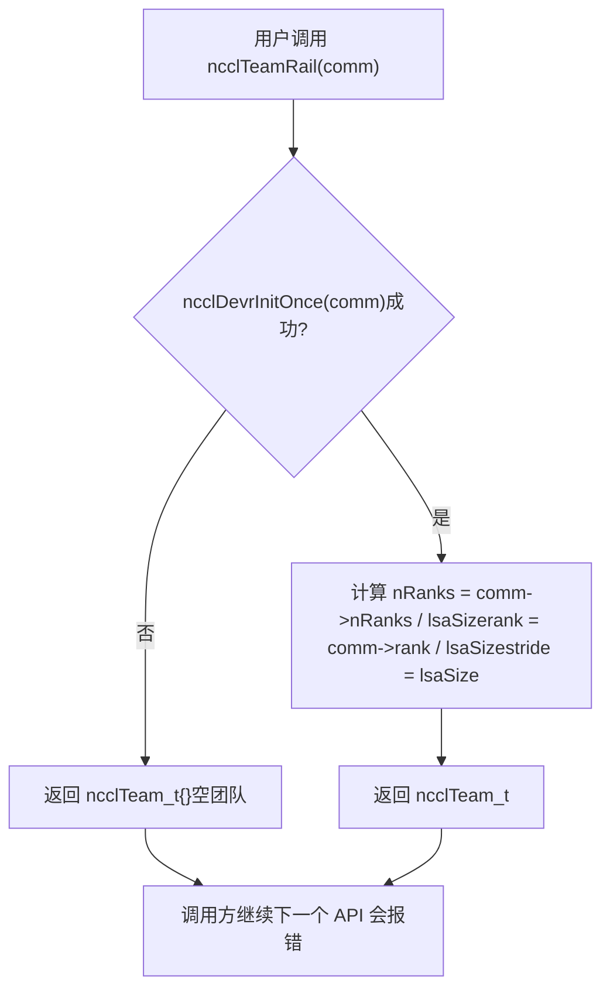
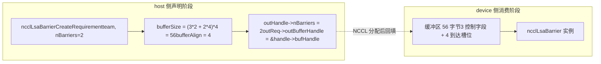
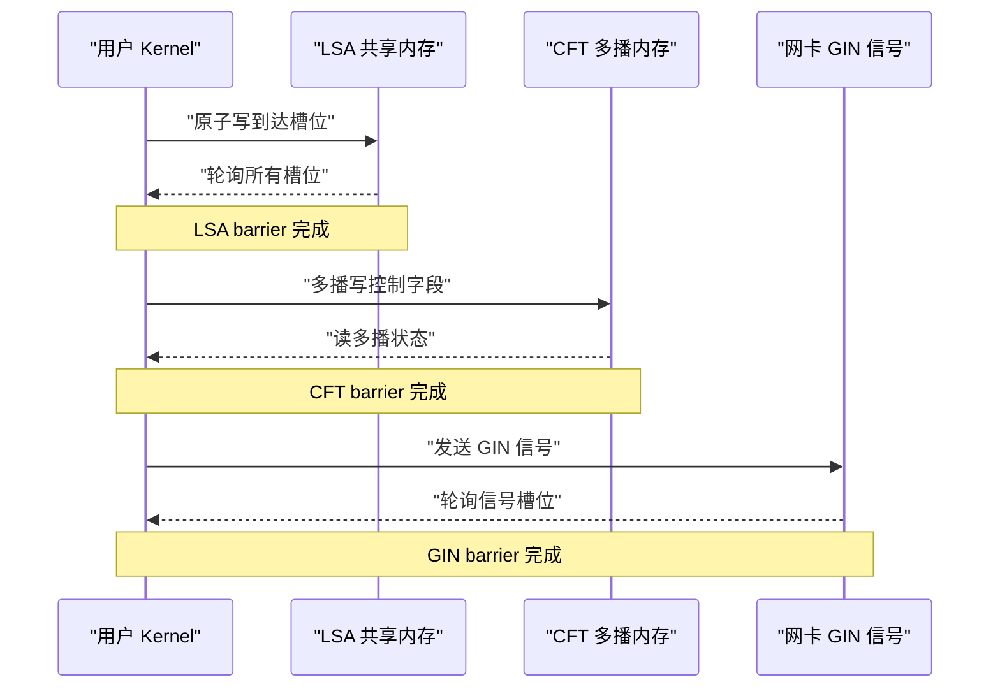
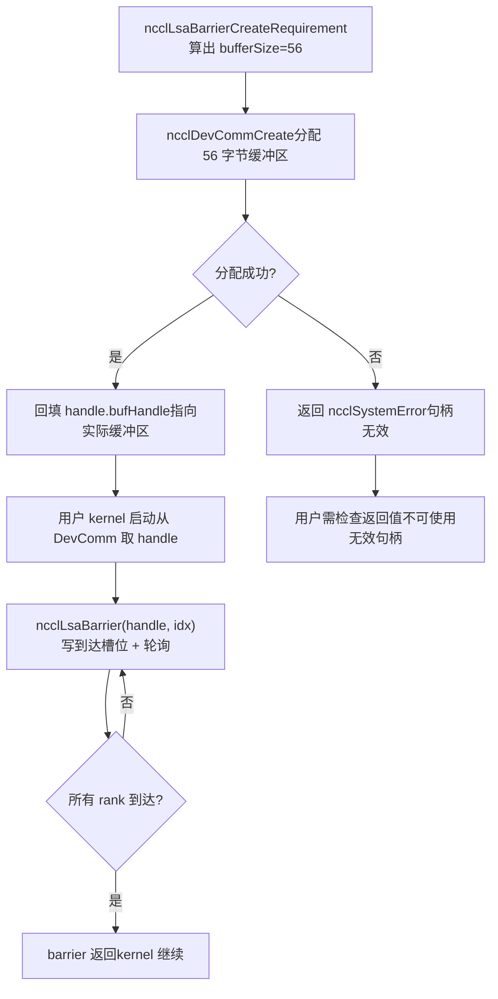
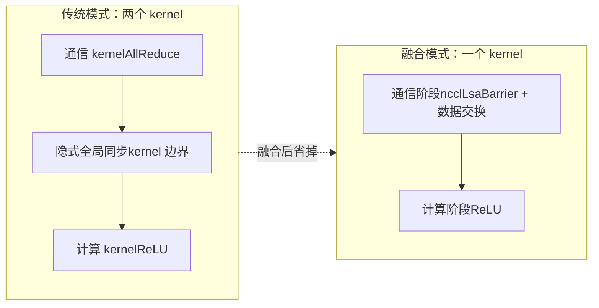

# 제 20 장: 디바이스 측 네이티브 API와 연산자 융합: nccl_device와 kernel fusion 실전

지난 장에서 우리는 devcomm이 호스트 측 ncclComm의 메타데이터를 어떻게 버전화하여 디바이스 측에 매핑해서 커널이 rank, 주소, 연결 상태를 읽을 수 있게 하는지 살펴보았다. 하지만 "메타데이터를 읽을 수 있다"와 "통신을 시작할 수 있다"는 전혀 다른 문제다. 메타데이터만 있다면 사용자 커널은 기껏해야 주소를 직접 계산하고 플래그를 직접 쓸 수 있을 뿐, rank 간 동기화나 머신 간 신호 전달이 필요해지면 결국 호스트 측으로 돌아가 ncclAllReduce 같은 집합 API를 호출해야 한다. 그리고 그런 호출은 매번 커널 실행 한 번, 호스트-디바이스 왕복 한 번을 의미한다. 이번 장에서 분석할 src/nccl_device 디렉터리는 바로 NCCL이 "호출되는 라이브러리"에서 "프로그래밍 가능한 모델"로 나아가는 핵심이다. 이것이 제공하는 것은 새로운 집합 통신 알고리즘이 아니라 디바이스 측 프리미티브 집합이다. 즉 사용자 자신의 커널 내부에서 ncclBarrier, ncclLsaBarrier, ncclGinBarrier 같은 동기화 연산을 호출할 수 있게 해서 "통신"과 "계산"을 같은 커널 안에 넣고 중간의 실행 오버헤드를 없앤다. 이번 장의 소스 자료는 이 프리미티브 집합의 호스트 측 요구사항 선언(CreateRequirement)과 팀(Team) 추상화에 초점을 맞추며, 이것이 바로 디바이스 측 API의 입구다. 이번 장을 이해하는 핵심 전제: 디바이스 측 API의 설계 철학은 "호스트 측에서 자원 요구사항을 선언하고, 디바이스 측에서 자원을 소비한다"이다. 호스트 측은 배리어를 직접 생성하지 않고 NCCL에 "nBarriers개의 배리어가 필요하고, 팀에는 team.nRanks명의 멤버가 있다"고 알려주며, NCCL은 이를 바탕으로 필요한 버퍼 수와 GIN 신호 수를 계산한 뒤 디바이스 측에서 이 자원들을 인스턴스화한다. 이러한 "선언-소비" 분리가 디바이스 측 코드가 호스트 포인터 없이 동작할 수 있는 근본 이유다.

# 1. Team 추상화: 디바이스 측 API의 좌표계

## 직관적 모델

다국적 기업의 조직 구조를 상상해 보자. 이메일을 보내려면 먼저 "누구에게 보내는가"를 알아야 한다. 전사(World)에 보내는지, 같은 사무실 동료(LSA)에게 보내는지, 아니면 같은 사업 라인의 사무실 간 팀(Rail)에 보내는지.`ncclTeam_t`바로 이 "수신자 범위"의 기술자다. Team 추상화가 없다면 각 디바이스 측 API가 "내가 이 통신 도메인에서 몇 번째이고, 총 몇 명인지"를 매번 다시 계산해야 해서 코드가 중복되고 오류가 나기 쉽다.

## 데이터 구조와 메모리 레이아웃

`ncclTeam_t`는 디바이스 측 API의 좌표계이며, 세 개의 필드가 하나의**등차수열**：

| 필드 | 의미 | 비유 |
| --- | --- | --- |
| `nRanks` | 팀 내 멤버 총수 | 그룹에 몇 명이 있는가 |
| `rank` | 현재 rank의 팀 내 번호 | 내가 그룹에서 몇 번째인가 |
| `stride` | 팀 내 인접 멤버가 world에서 가지는 보폭 | 그룹에서 인접한 두 사람의 학번 차이는 얼마인가 |

`stride`는 가장 간과되기 쉽지만 가장 핵심적인 필드다. World 팀에서는`stride = 1`, 모든 rank가 연속으로 배열되기 때문이다. 하지만 Rail 팀에서는`stride = lsaSize`, 같은 rail 위의 rank가 world에서`lsaSize`개마다 한 번씩 나타나기 때문이다.

[FACT:src/nccl_device/core.cc:13-19]는 World 팀의 구성을 보여준다. 바로`comm->nRanks`과`comm->rank`，`stride`를 1로 고정한다. 이것은`ncclDevrInitOnce`가 필요 없는 유일한 팀인데, 정보가 전부 호스트 측`comm`안에 있기 때문이다.

[FACT:src/nccl_device/core.cc:22-33]는 LSA 팀이다. L26의`ncclDevrInitOnce(comm)`에 주목하라. 이것은 디바이스 측 자원 초기화의 멱등 진입점이다. L23-25의 주석은 매우 중요하다:**여기서는 의도적으로 오류를 무시한다**. 초기화가 실패하면 반환된 team은 "쓰레기 값"이지만, 다음에 실제로 자원이 필요한 API 호출이 다시`ncclDevrInitOnce`를 트리거하고 오류를 보고하기 때문이다. 이것은 "지연 오류 보고" 전략으로, 팀 조회 같은 경량 작업에서 무거운 오류를 던지는 것을 피한다.

## 시나리오 기반 Walkthrough: World에서 Rail로의 좌표 변환

8카드 머신 하나를 가정하고,`lsaSize = 4`(4카드마다 하나의 LSA 도메인),`nRanks = 8`. 이제`ncclTeamRail`가 어떻게 구성되는지 보자:

[FACT:src/nccl_device/core.cc:70-79]에서,`nRanks = 8 / 4 = 2`，`rank = comm->rank / 4`，`stride = 4`. 현재 rank가 5라면 Rail 팀에서의`rank = 5 / 4 = 1`，`stride = 4`, 즉 Rail 팀의 멤버는 world의 rank 1과 rank 5라는 뜻이다.

이제`ncclTeamRankToWorld`의 환산 공식을 보자:

[FACT:src/nccl_device/core.cc:82-84]의`comm->rank + (rank - team.rank) * team.stride`는**상대 오프셋**계산이다. 먼저 대상 rank가 현재 rank에 대해 팀 내에서 가지는 오프셋`(rank - team.rank)`을 계산하고, 여기에 보폭`stride`을 곱한 뒤 현재 rank의 world 번호를 더한다. 이 공식은 모든 팀에 통용되는데,`stride`가 이미 팀의 배열 규칙을 인코딩하고 있기 때문이다.

`ncclTeamRankToLsa`는 다르다:

[FACT:src/nccl_device/core.cc:87-92]는`comm->devrState.lsaSelf + (rank - team.rank) * team.stride`을 사용한다. 여기서는`lsaSelf`가 아니라`comm->rank`을 사용한다는 점에 주목하라. LSA 번호는 디바이스 측 자원 초기화 후에야 알 수 있고, world rank와 다를 수 있기 때문이다.

이 그림은 "지연 오류 보고" 전략의 실행 경로를 보여준다. 초기화 실패 시 빈 팀을 반환하지만 호출자를 중단시키지 않으며, 오류는 다음에 실제로 자원이 필요한 API(예:`ncclLsaBarrierCreateRequirement`)에서 드러난다.

## 설계 고찰과 함정

**왜`ncclTeamWorld`는`ncclDevrInitOnce`？**를 호출하지 않는가? World 팀의 정보는 전적으로 호스트 측에서 오기 때문이다`comm`, 어떤 장치 측 자원도 필요하지 않습니다. 강제로 호출하면 순수 host 쿼리 작업이 장치 측 초기화에 의존하게 되어 불필요한 실패 지점이 늘어납니다.

**함정 포인트**：`ncclTeamRankToLsa`초기화 실패 시 반환`-1`（[FACT:src/nccl_device/core.cc:87-92]), 그리고`ncclTeamRankToWorld`는 절대 실패하지 않습니다. 호출자가 이 두 함수를 혼용하면서 반환값을 확인하지 않으면, LSA 초기화 실패 시`-1`를 합법적인 rank로 사용하여 범위를 벗어난 접근이 발생할 수 있습니다. 프로덕션 코드에서는`ncclTeamRankToLsa`의 반환값을 실패할 수 있는 작업으로 처리해야 합니다.

---

# 2. Barrier 요구사항 선언: host 측에서 장치 자원을 어떻게 "예약"하는가

## 직관적 모델

장치 측 API의 자원 할당은**회의실 예약**과 같습니다: 회의실에 바로 뛰어들어 회의할 수 없고, 먼저 프런트(host 측`CreateRequirement`)에 신청서를 제출해야 합니다 — "회의 3건, 각 8명 참석". 프런트는 이를 바탕으로 필요한 공간 크기(`bufferSize`), 필요한 의자 수(`ginSignalCount`)를 계산한 뒤 공간 번호(`outBufferHandle`)를 부여합니다. 이러한 예약 메커니즘이 없으면 장치 측 kernel은 자신의 barrier 버퍼가 어디에 있고 얼마나 큰지 알 수 없어 안전하게 읽고 쓸 수 없습니다.

## 데이터 구조와 메모리 레이아웃

세 가지 barrier의`CreateRequirement`함수는 동일한 패턴을 공유합니다:**요구사항 구조체 초기화 → 버퍼 크기/정렬 채우기 → 출력 핸들 포인터 채우기**. 하지만 자원 유형은 다릅니다:

| Barrier 유형 | 자원 유형 | 크기 공식 | 정렬 |
| --- | --- | --- | --- |
| LSA Barrier | 버퍼 | `(3*n + n*team.nRanks) * sizeof(uint32_t)` | `alignof(uint32_t)` |
| CFT Barrier | 버퍼 | `(3*n + n*team.nRanks) * NCCL_CFT_BARRIER_GRAN` | `NCCL_CFT_BARRIER_ALIGN` |
| GIN Barrier | GIN 신호 | `n * team.nRanks`개 신호 | 버퍼 미포함 |

먼저 LSA Barrier의 크기 공식을 보겠습니다:

[FACT:src/nccl_device/lsa_barrier.cc:14-22]의`(3 * nBarriers + nBarriers * team.nRanks) * sizeof(uint32_t)`는 두 부분으로 분해할 수 있습니다:

- `3 * nBarriers`: 각 barrier에 3개의`uint32_t`제어 필드가 필요합니다 ([INFERENCE] 일반적으로 "도달 카운트", "라운드", "상태 플래그").
- `nBarriers * team.nRanks`: 각 barrier는 팀 내 각 멤버를 위해 하나의`uint32_t`도달 슬롯을 예약해야 합니다.

따라서 단일 barrier의 총 크기는`3 + team.nRanks`개`uint32_t`입니다. 이 공식은 LSA와 CFT에서 완전히 동일하며, 다만 CFT는`NCCL_CFT_BARRIER_GRAN`를 세분화 단위로 사용합니다 (더 큰 경계로 정렬하기 위한 것일 수 있습니다).

GIN Barrier는 완전히 다릅니다:

[FACT:src/nccl_device/gin_barrier.cc:14-20]는 버퍼를 할당하지 않고`ginSignalCount = nBarriers * team.nRanks`를 설정하며,`outGinSignalStart`를 핸들 내의`signal0`로 지정합니다. 이는 GIN barrier가 네트워크 신호 경로를 사용하여 공유 메모리 버퍼가 필요 없고, NIC가 인식할 수 있는 신호 슬롯이 필요하기 때문입니다.

## 시나리오 기반 Walkthrough: LSA Barrier의 완전한 예약 과정

사용자가 4카드 LSA 팀에서 2개의 barrier를 생성한다고 가정합니다:

1. **호출** `ncclLsaBarrierCreateRequirement(team, 2, &handle, &req)`。

2. **초기화**：`memset(outReq, 0, sizeof(*outReq))`（[FACT:src/nccl_device/lsa_barrier.cc:14-22]) — 설정되지 않은 필드가 확정값이 되도록 보장하여 호출자가 스택의 쓰레기 값을 읽는 것을 방지합니다.

3. **barrier 수 기록**：`outHandle->nBarriers = 2`（[FACT:src/nccl_device/lsa_barrier.cc:14-22]）。

4. **버퍼 크기 계산**：`(3*2 + 2*4) * 4 = (6 + 8) * 4 = 56`바이트 ([FACT:src/nccl_device/lsa_barrier.cc:14-22]）。

5. **정렬 설정**：`alignof(uint32_t) = 4`（[FACT:src/nccl_device/lsa_barrier.cc:14-22]）。

6. **핸들 포인터 역채움**：`outReq->outBufferHandle = &outHandle->bufHandle`（[FACT:src/nccl_device/lsa_barrier.cc:14-22]) — NCCL이 실제로 버퍼를 할당한 후 주소를 핸들에 다시 쓰도록 합니다.

이 데이터 흐름도는 "선언"과 "소비"의 분리를 보여줍니다: host 측은 크기와 포인터만 계산하고, 실제 버퍼 할당과 인스턴스화는 NCCL 내부에서 발생하며, device 측 kernel은 이미 채워진 핸들을 받습니다.

## 설계 고찰과 함정

**왜`memset`로 전체`outReq`？**를 초기화하는가? 왜냐하면`ncclDevResourceRequirements_t`는 다중 필드 구조체이고, 각 barrier 유형은 그중 일부 필드만 채웁니다. 초기화는 사용되지 않는 필드(예: LSA barrier가 사용하지 않는`ginSignalCount`)가 0이 되도록 보장하며, NCCL 내부는 이를 기반으로 "이 자원은 필요 없다"고 판단합니다. 초기화하지 않으면 스택의 임의 값이 "GIN 자원 필요"로 오인되어 이전 장에서 언급한 오탐 문제가 발생할 수 있습니다.

**함정 포인트**：`outReq->outBufferHandle = &outHandle->bufHandle`는 핸들 내부 필드의 주소를 NCCL에 넘겼습니다. 이는`outHandle`가 NCCL이 버퍼 할당을 완료할 때까지 유효해야 함(스택 회수나 이동이 불가능)을 의미합니다. 사용자가`outHandle`를 조기에 해제되는 스코프에 두면, NCCL이 역채움할 때 댕글링 포인터에 쓰게 됩니다.

> **[Design Inference & Architectural Trade-offs]**
> **CFT Barrier의 세분화 차이**：[FACT:src/nccl_device/cft_barrier.cc:13-21]는`NCCL_CFT_BARRIER_GRAN`와`NCCL_CFT_BARRIER_ALIGN`로 LSA의`sizeof(uint32_t)`와`alignof(uint32_t)`를 대체했습니다. 이는 CFT(Cross-Fabric Team 또는 유사한 크로스 도메인 팀일 수 있음)의 barrier가 더 큰 정렬 세분화를 필요로 함을 보여주며, 여러 멀티캐스트 메모리 영역을 넘어야 하기 때문에 하드웨어가 주소 정렬에 더 엄격한 요구사항을 가질 수 있습니다.

---

# 3. 세 가지 Barrier의 의미론적 분업: LSA, CFT, GIN이 각각 담당하는 것

## 직관적 모델

세 가지 barrier는 세 가지 다른 범위의 "집합 신호"와 같습니다:

- **LSA Barrier**: 같은 사무실 내 동료 집합, 공유 메모리 사용, 가장 빠름.
- **CFT Barrier**: 사무실을 넘지만 같은 건물 내 집합, 멀티캐스트 메모리 사용, 중간.
- **GIN Barrier**: 도시를 넘거나 국가를 넘는 집합, 네트워크 신호 사용, 가장 느리지만 가장 넓은 범위.

잘못된 barrier 유형을 선택해도 오류는 발생하지 않지만 막대한 성능 손실을 초래합니다 — GIN barrier로 같은 사무실 동기화를 하는 것은 옆 자리 문서를 국제 택배로 보내는 것과 같습니다.

## 데이터 구조와 메모리 레이아웃 비교

host 측 요구사항 선언 관점에서 보면 세 가지의 자원 요구사항은 완전히 다릅니다:

| 차원 | LSA Barrier | CFT Barrier | GIN Barrier |
| --- | --- | --- | --- |
| 필요`comm`매개변수 | 아니오 | 아니오 | 예 |
| 버퍼 | 있음 | 있음 | 없음 |
| GIN 신호 | 없음 | 없음 | 있음 |
| 크기 단위 | `uint32_t` | `NCCL_CFT_BARRIER_GRAN` | 신호 개수 |
| 출력 핸들 필드 | `bufHandle` | `bufHandle` | `signal0` |

GIN Barrier는 유일하게`comm`매개변수가 필요한 것에 주목하세요:

[FACT:src/nccl_device/gin_barrier.cc:14-20]의 함수 시그니처에는`ncclComm_t comm`가 포함되지만, LSA와 CFT의 시그니처에는`ncclTeam_t team`. 이는 GIN 신호가 구체적인 네트워크 연결에 바인딩되어야 하기 때문이며, 네트워크 연결 정보는`comm`에 있습니다.

## 시나리오 기반 Walkthrough: GIN Barrier의 신호 할당

[FACT:src/nccl_device/gin_barrier.cc:14-20]의 로직은 LSA보다 더 단순하지만, 시맨틱은 더 미묘합니다:

1. **클리어**：`memset(outReq, 0, sizeof(*outReq))`（L16）。

2. **신호 수 설정**：`outReq->ginSignalCount = nBarriers * team.nRanks`(L17) — 각 barrier는 팀 내 각 멤버를 위해 하나의 신호 슬롯을 할당해야 합니다.

3. **신호 시작 포인터 백필**：`outReq->outGinSignalStart = &outHandle->signal0`(L18) — 여기서는`bufferSize`를 설정하지 않았다는 점에 주목하세요. GIN barrier는 공유 메모리 버퍼를 사용하지 않기 때문입니다.

> **[Design Inference & Architectural Trade-offs]**
> `signal0`이 이름은 핸들 안에 연속된 신호 필드 그룹이 있을 수 있음을 암시합니다(`signal0`, `signal1`, ...），`outGinSignalStart`는 첫 번째를 가리키며, NCCL은 이를 기반으로 어디서부터`nBarriers * team.nRanks`개의 신호를 할당하기 시작할지 알 수 있습니다.

## 동시성 제어와 하드웨어 상호작용

세 가지 barrier의 동시성 제어 메커니즘은 완전히 다릅니다:

- **LSA Barrier**: 공유 메모리 기반 원자적 연산.`3 + team.nRanks`개의`uint32_t`중, 도달 슬롯은 원자적 더하기 또는 원자적 쓰기로 「내가 도착했다」를 표시하고, 제어 필드는 원자적 읽기로 「모두 도착했는가」를 확인합니다. 이는 순수 GPU 내부 동기화이며, 네트워크를 포함하지 않습니다.
- **CFT Barrier**: 멀티캐스트 메모리(multimem) 기반. [INFERENCE] 멀티캐스트 메모리는 한 번의 쓰기 연산으로 여러 rank의 뷰를 동시에 갱신할 수 있으므로, CFT barrier는 더 적은 제어 필드로 더 넓은 동기화를 구현할 수 있습니다.
- **GIN Barrier**: 네트워크 신호 기반.`ginSignalCount`개의 신호가 네트워크 카드를 통해 전송되고, 수신 측은 신호 슬롯을 폴링합니다. 이는 유일하게 크로스 머신 하드웨어를 포함하는 barrier입니다.

이 시퀀스 다이어그램은 세 가지 barrier의 하드웨어 상호작용 계층을 보여줍니다: 순수 GPU 내부 동기화에서 멀티캐스트 메모리, 그리고 네트워크 카드 신호로 갈수록 지연이 순차적으로 증가하고, 커버 범위도 순차적으로 확대됩니다.

## 설계 고찰과 함정

**왜 LSA와 CFT는`comm`파라미터가 필요 없는가?**그들의 리소스(공유 메모리, 멀티캐스트 메모리)는 이미`ncclDevrInitOnce`단계에서 팀에 바인딩되었기 때문이며,`team`자체에 리소스 위치 정보가 내포되어 있습니다. 반면 GIN 신호는 네트워크 리소스를 동적으로 할당해야 하므로, 반드시`comm`를 통해 네트워크 연결 상태에 접근해야 합니다.

**함정 포인트**: GIN Barrier의`ginSignalCount`는`nBarriers * team.nRanks`입니다. 만약 팀이 매우 크고(예: 1024개 rank) barrier가 많으면(예: 100개), 신호 총수가 102400에 달할 수 있습니다. 네트워크 카드의 신호 슬롯은 한정된 리소스이므로, 과도한 신청은`ncclDevrInitOnce`실패를 초래할 수 있습니다. 프로덕션 코드는 실제로 필요한 최소 barrier 수에 따라 신청해야 하며, 한 번에 대량의 예비분을 신청해서는 안 됩니다.

---

# 4. 요구사항 선언에서 디바이스 측 소비까지: 전체 라이프사이클

## 직관적 모델

`CreateRequirement`은 단지 「주문」일 뿐이며, 실제 「발송」과 「수령」은 NCCL 내부와 디바이스 측 kernel에서 발생합니다. 전체 라이프사이클은**온라인 쇼핑**과 같습니다: 주문(CreateRequirement) → 판매자 재고 준비(NCCL 리소스 할당) → 택배 배송(리소스를 DevComm에 바인딩) → 수령 및 사용(디바이스 측 kernel에서 barrier 호출).

## 데이터 구조와 메모리 레이아웃: 핸들의 필드 진화

를 예로 들면,`ncclLsaBarrierHandle_t`은 라이프사이클에서 세 단계를 거칩니다:

| 단계 | `nBarriers` | `bufHandle` | 기타 필드 |
| --- | --- | --- | --- |
| CreateRequirement 후 | 설정됨 | 주소는 백필되었으나 내용은 할당되지 않음 | 설정되지 않음 |
| NCCL 할당 후 | 설정됨 | 실제 버퍼를 가리킴 | 설정됨 |
| 디바이스 측 사용 | 읽기 전용 | 읽기 전용 | 읽기 전용 |

[FACT:src/nccl_device/lsa_barrier.cc:14-22]설정`nBarriers`，[FACT:src/nccl_device/lsa_barrier.cc:14-22]백필`bufHandle`의 주소. 이 두 작업 사이에서 NCCL 내부가 버퍼의 실제 할당을 완료합니다.

## 시나리오 기반 Walkthrough: 완전한 barrier 사용 한 번

1. **Host 측 선언**: 사용자가`ncclLsaBarrierCreateRequirement(team, 2, &handle, &req)`를 호출하여`req.bufferSize = 56`。

2. **를 얻음**Host 측 제출`req`: 사용자가`ncclDevCommCreate`를`handle.bufHandle`。

3. **에 전달(이전 장 내용), NCCL이 56바이트 버퍼를 할당하고 주소를**에 기록`handle`Device 측 초기화`bufHandle`: 사용자 kernel 시작 시 DevComm에서

4. **를 꺼내고,**로 버퍼를 위치시킴`ncclLsaBarrier(handle, barrierIndex)`Device 측 동기화

5. **: kernel이**를 호출하여 버퍼의 해당 슬롯에 도달 마커를 쓰고, 다른 슬롯을 폴링

: 모든 rank가 도달하면 barrier가 반환되고 kernel이 계속 실행`ncclLsaBarrierCreateRequirement`복사`ncclSuccess`（[FACT:src/nccl_device/lsa_barrier.cc:14-22]이 결정 다이어그램은 선언에서 사용까지의 전체 경로와 할당 실패 시의 오류 분기를 보여줍니다. 주목할 점은

## 자체는 항상

를 반환하며, 실제 실패는 이후 리소스 할당 단계에서 발생합니다.**동시성 제어와 하드웨어 상호작용**디바이스 측 barrier의 동시성 제어 핵심은

- **원자적 연산 + 메모리 배리어**입니다. LSA barrier를 예로 들면:
- **도달 단계**: 각 rank가 원자적 쓰기(또는 원자적 더하기)로 자신의 도달 슬롯을 갱신합니다. 이 단계는 반드시 release 시맨틱을 사용하여 barrier 이전의 모든 메모리 연산이 다른 rank에 가시적이도록 보장해야 합니다.
- **폴링 단계**: 각 rank가 원자적 읽기(또는 volatile 읽기)로 모든 슬롯을 확인합니다. 이 단계는 반드시 acquire 시맨틱을 사용하여 「모두 도착했다」를 확인한 후 다른 사람이 barrier 이전에 쓴 데이터를 읽을 수 있도록 보장해야 합니다.

> **[Design Inference & Architectural Trade-offs]**
> `3 * nBarriers`여러 제어 필드가 바로 이런 '라운드' 문제를 처리하는 데 사용될 가능성이 높다: 하나의 필드는 현재 라운드를 기록하고, 하나의 필드는 도달 카운트를 기록하며, 하나의 필드는 리셋 플래그 역할을 한다. 이렇게 하면 여러 barrier가 동일한 슬롯 그룹을 재사용하면서도 라운드가 혼동되지 않는다.

## 프로덕션 함정 회피 가이드

**함정 1: 핸들 수명 주기 관리**。`outReq->outBufferHandle = &outHandle->bufHandle`핸들 내부 필드의 주소를 NCCL에 넘겼다. 만약 사용자가`ncclDevCommCreate`반환 전에`outHandle`를 파괴하면, NCCL이 값을 되쓸 때 이미 해제된 메모리에 쓰게 된다. 올바른 방법은`outHandle`의 수명 주기를 이를 생성한 함수 스코프가 아니라 DevComm에 바인딩하는 것이다.

**함정 2: barrier 수와 팀 크기의 곱**。`bufferSize = (3*n + n*team.nRanks) * sizeof(uint32_t)`에서`n*team.nRanks`항목은 팀이 클 때 크기를 지배한다. 1024개 rank, 100개 barrier면`100*1024*4 = 409600`바이트, 약 400KB가 필요하다. 각 rank가 이만큼을 요청하면 VRAM 압박을 무시할 수 없다. 총 barrier 수가 아니라 실제 동시 사용되는 barrier 수에 맞춰 요청해야 한다.

**함정 3: GIN barrier의 시그널 고갈**. GIN 시그널은 NIC 자원이며 수량이 제한적이다. 여러 DevComm이 동시에 대량의 GIN 시그널을 요청하면 NIC 슬롯이 고갈될 수 있다. 프로덕션 코드는 DevComm 생성 실패 시 GIN 시그널 부족 여부를 확인하고`nBarriers`를 줄이거나 LSA barrier로 전환하는 것을 고려해야 한다.

**함정 4: 초기화 실패의 지연 노출**。`ncclTeamLsa`등의 함수는`ncclDevrInitOnce`실패 시 빈 팀([FACT:src/nccl_device/core.cc:22-33])을 반환하며 오류를 보고하지 않는다. 사용자 코드가 이후 API의 반환값을 확인하지 않으면 빈 팀에서 계속 작업하여 원인 파악이 어려운 오류가 발생할 수 있다. 디바이스 측 API를 처음 사용할 때 팀의 유효성을 명시적으로 확인하는 것이 좋다(예:`team.nRanks > 0`）。

---

# 5. 커널 융합: 왜 통신과 계산을 하나의 kernel에 넣어야 하는가

## 직관적 모델

전통적 방식에서 한 번의 'AllReduce + 활성화 함수'에는 두 개의 kernel이 필요하다: 하나는 통신, 하나는 계산. 두 kernel 사이에는 암묵적 전역 동기화가 한 번 있다——통신 kernel이 완전히 끝나야 계산 kernel이 시작될 수 있다. 이는 마치**계주**와 같다: 첫 주자가 달린 후 반드시 바통을 두 번째 주자에게 넘겨야 하고, 교대 순간 둘 다 기다린다. 커널 융합은 동일한 kernel이 통신과 계산을 모두 수행하게 하여, 마치**한 사람이 달리면서 신발을 갈아 신는 것**처럼 교대 대기를 없앤다.

## 데이터 구조와 메모리 레이아웃

커널 융합의 핵심은 통신 프리미티브(예: barrier)와 계산 로직이 동일한 kernel의 레지스터와 공유 메모리를 공유한다는 것이다. 이는 다음을 의미한다:

- **레지스터 압박**: 통신 프리미티브의 원자적 연산과 폴링 루프가 레지스터를 점유하여 계산 로직의 레지스터 예산을 압박한다.
- **공유 메모리 경쟁**: LSA barrier의 버퍼가 공유 메모리에 있으면 계산 로직의 공유 메모리 요구와 경쟁한다.
- **Occupancy 영향**: 융합 kernel의 occupancy는 일반적으로 순수 계산 kernel보다 낮은데, 통신 프리미티브가 추가 자원을 필요로 하기 때문이다.

> **[Design Inference & Architectural Trade-offs]**
> 디바이스 측 API의 설계(host 측에서 자원 선언, device 측에서 소비)는 바로 이러한 압박을 완화하기 위한 것이다: 자원을 host 측에서 미리 할당하면 device 측 kernel은 읽기/쓰기만 하면 되고 동적 할당이 필요 없어 레지스터 점유가 줄어든다.

## 시나리오 기반 Walkthrough: 융합 kernel의 실행 흐름

사용자가 'AllReduce + ReLU' 융합 kernel을 작성한다고 가정하자:

1. **Host 측 준비**:`ncclLsaBarrierCreateRequirement`를 호출하여 barrier를 요청하고,`ncclDevCommCreate`를 호출하여 자원을 할당한다.

2. **Kernel 시작**: 사용자 kernel이 DevComm과 barrier 핸들을 매개변수로 받는다.

3. **통신 단계**: kernel 내에서`ncclLsaBarrier`를 호출하여 모든 rank를 동기화한 후, 각 rank가 데이터를 교환한다(대칭 메모리를 통한 직접 읽기/쓰기).

4. **계산 단계**: 동기화 완료 후 kernel이 로컬 데이터에 직접 ReLU를 수행하며, 추가 kernel 시작이 필요 없다.

5. **완료**: kernel이 종료되고, host 측은 추가 통신 kernel을 기다릴 필요가 없다.

이 비교 그림은 융합의 핵심 이점을 보여준다: kernel 경계에서의 암묵적 전역 동기화를 제거한다. 전통적 방식에서 이 동기화의 비용은 두 번의 kernel 시작 지연에 GPU 파이프라인 드레인을 더한 것이다.

## 설계 고찰과 함정

**왜 디바이스 측 API는 '융합 AllReduce'를 직접 제공하지 않는가?**융합의 구체적 형태는 사용자의 계산 로직에 달려 있기 때문이다. NCCL이 제공하는 것은**프리미티브**(barrier, 시그널, 대칭 메모리 접근)이지**완성품**(융합된 AllReduce+ReLU)이 아니다. 사용자가 이 프리미티브들을 직접 조합해야 자신의 요구에 맞는 융합 kernel을 구현할 수 있다. 이것이 '라이브러리'가 아닌 '프로그래밍 모델'의 본질적 차이다.

**함정 포인트**: 융합 kernel의 디버깅 난이도는 분리 kernel보다 훨씬 높다. 만약 barrier 로직에 버그가 있으면 kernel이 hang(교착 상태)될 수 있는데, GPU kernel hang은 host 프로세스 hang처럼 진단하기 쉽지 않다. 융합 kernel에 타임아웃 메커니즘을 추가하거나, 먼저 소규모 팀으로 barrier 로직을 검증하는 것을 권장한다.

**함정 포인트**: 융합 kernel의 occupancy 하락은 통신으로 절약한 이득보다 계산 성능 손실이 더 클 수 있다. 융합을 결정하기 전에 통신 지연 감소만 보지 말고 융합 전후의 엔드투엔드 시간을 측정해야 한다.

# 이 장의 생각과 자가 점검

Q1: 만약`ncclTeamLsa`의 L26에 있는`ncclDevrInitOnce`호출을 제거하고, 직접`comm->devrState.lsaSize`과`lsaSelf`을 반환하면, 어떤 시나리오에서 디바이스 측 kernel이 잘못된 팀 정보를 읽게 되는가?

**참고 해석**：`ncclDevrInitOnce`은 디바이스 측 리소스 초기화의 멱등 진입점이다. 만약 이것을 제거하면,`comm->devrState.lsaSize`과`lsaSelf`은 여전히 초기값(보통 0 또는 미정의)일 수 있다. 디바이스 측 API를 처음 사용하는 시나리오에서, 사용자가`ncclTeamLsa`을 호출하면`nRanks = 0`의 빈 팀을 얻게 된다. 이후 사용자가 팀 유효성을 검사하지 않고 이 팀으로 바로`ncclLsaBarrierCreateRequirement`을 호출하면,`bufferSize = (3*n + n*0) * 4 = 12n`바이트를 계산하게 되는데——실제 필요한 것보다 작다. 왜냐하면`n*team.nRanks`항목이 0이 되기 때문이다. 이로 인해 버퍼 오버플로가 발생한다: barrier 런타임이`team.nRanks`개의 도착 슬롯에 쓰려고 시도하지만, 버퍼에는`3n`개의`uint32_t`공간만 할당되어 있다. 더 은밀한 것은, 만약`lsaSelf`도 0이면,`ncclTeamRankToLsa`이 잘못된 rank 번호를 반환하여 barrier의 도착 슬롯이 잘못된 위치에 쓰이게 되고, 모든 rank가 도착하기를 영원히 기다리지 못해 kernel이 hang될 수 있다. 이것이 바로 L23-25 주석에서 말한 「쓰레기 값을 반환하고, 다음 API에서 오류를 보고한다」 전략이 방지하려는 상황이다——단, 전제는 다음 API가 실제로 오류를 보고해야 하며, 조용히 잘못된 크기를 사용해서는 안 된다.

Q2：`ncclLsaBarrierCreateRequirement`의 크기 공식은`(3*nBarriers + nBarriers*team.nRanks) * sizeof(uint32_t)`이다. 만약 팀에 8개의 rank가 있고, 사용자가 1개의 barrier를 신청하면, 버퍼는 44바이트이다. barrier 구현에서 「3개의 제어 필드」가 각각 「도착 카운트」「라운드」「리셋 플래그」라고 가정하고 추론해보자: 8개의 rank가 동시에 도착할 때, 만약 「도착 카운트」가 비원자적`++`연산을 사용하면 무슨 일이 발생하는가?

**참고 해석**: 비원자적`++`은 GPU에서 「읽기-수정-쓰기」 3단계이며, 원자적 연산이 아니다. 8개의 rank가 동시에`count++`을 실행할 때, 여러 rank가 동일한 이전 값(예: 모두 0)을 읽고 모두 1로 다시 쓸 수 있다. 최종적으로`count`은 8이 아니라 1만 증가하여, barrier가 영원히 「아직 다 도착하지 않았다」고 판단하게 되고, 모든 rank가 폴링 단계에서 무한 루프에 빠진다. 이것이 바로 LSA barrier의 도착 슬롯이 반드시 원자적 연산(예:`atomicAdd`)을 사용하거나 각 rank가 자신의 독립 슬롯에 쓰는 방식(`nBarriers * team.nRanks`항목이 바로 각 rank를 위해 독립 슬롯을 예약하는 것)을 사용해야 하는 이유이다. 만약 「각 rank가 자신의 슬롯에 쓰는」 방식을 채택하면, 원자적 증가는 필요 없고 원자적 쓰기 + 메모리 배리어만 필요하다. 왜냐하면 각 슬롯에는 작성자가 하나뿐이기 때문이다. 이것은 또한 크기 공식에`nBarriers * team.nRanks`항목이 있는 이유를 설명한다——공간을 사용해 원자성을 확보하고, 다중 작성자 경쟁을 피하는 것이다.

Q3：`ncclGinBarrierCreateRequirement`은`comm`파라미터가 필요하지만`ncclLsaBarrierCreateRequirement`은 필요하지 않다. 만약 LSA barrier에도 억지로`comm`파라미터를 추가한다면(인터페이스 통일을 위해 가정), 어떤 설계 문제가 발생하는가? 반대로, GIN barrier에서`comm`파라미터를 제거하면 어떤 시나리오에서 실패하는가?

**참고 해석**: LSA barrier에`comm`파라미터를 추가하는 문제는 불필요한 의존성을 도입한다는 것이다. LSA barrier의 리소스(공유 메모리)는 이미`ncclDevrInitOnce`단계에서 팀에 바인딩되어 있으며,`team`자체가 리소스 위치를 암시한다.`comm`을 추가하면 순수한 팀 연산이 통신 도메인 상태에 의존하게 되어 실패 지점이 늘어나고(예:`comm`이 유효하지 않으면 LSA barrier도 생성할 수 없음), 「최소 권한」 원칙을 위반한다. 반대로, GIN barrier에서`comm`파라미터를 제거하면 실패한다. 왜냐하면 GIN 신호는 구체적인 네트워크 연결에 바인딩되어야 하기 때문이다.`ncclGinBarrierCreateRequirement`의`ginSignalCount`은 어느 네트워크 카드, 어느 QP(Queue Pair)로 신호를 보낼지 알아야 하며, 이 정보는`comm`의 네트워크 전송 계층 상태에 있다.`comm`이 없으면 NCCL은 신호가 어느 네트워크 카드의 슬롯에 할당되어야 하는지 결정할 수 없고, 신호가 대상 rank로 올바르게 라우팅된다는 것도 보장할 수 없다. 이것은 디바이스 측 API의 설계 원칙을 보여준다:**리소스 요구 선언은 그것이 진정으로 필요로 하는 컨텍스트에만 의존한다**——LSA는 팀 토폴로지만 필요하고, GIN은 네트워크 연결이 필요하다.

---

디바이스 측 API와 커널 융합은 NCCL을 「당신이 호출하는 라이브러리」에서 「당신이 프로그래밍하는 모델」로 바꾸었다.`ncclTeam_t`은 좌표계를 제공하고,`CreateRequirement`은 리소스 예약 메커니즘을 제공하며, 세 가지 barrier는 공유 메모리부터 네트워크 신호까지 모든 동기화 범위를 커버한다. 하지만 리소스를 선언하고 융합 kernel을 작성했다고 해서 성능이 좋은 것은 아니다——barrier의 수, 팀의 크기, 융합의 입자도, 각각의 선택이 엔드투엔드 성능에 영향을 미친다. 다음 장에서는 성능 튜닝 실전으로 들어가, tuning 파라미터가 알고리즘 선택에 어떻게 영향을 미치는지, 그리고 실제 benchmark로 튜닝 효과를 어떻게 검증하는지 살펴볼 것이다.

여기까지 우리는 devcomm 메타데이터 매핑에서 nccl_device 디바이스 측 프리미티브까지의 전 과정을 살펴보았고, NCCL이 'host 선언, device 소비' 모델을 통해 사용자 kernel이 barrier류 동기화 연산을 직접 호출하여 통신과 계산을 동일한 kernel에 융합하는 방식을 확인했습니다. 하지만 이러한 메커니즘을 파악한 후에는 더 실질적인 문제가 자연스럽게 떠오릅니다: 실제 훈련 작업의 성능이 기준에 미치지 못할 때, 알고리즘 선택이 부적절한지, 프로토콜이 맞지 않는지, 아니면 채널 수 설정이 합리적이지 않은지를 어떻게 판단할 것인가? 다음 장에서는 앞 20개 장의 메커니즘을 하나의 실행 가능한 튜닝 방법론으로 엮어, 성능 보고서, 비용 모델, 환경 변수를 결합하여 현상에서 근본 원인까지의排查 경로를 제시합니다.
