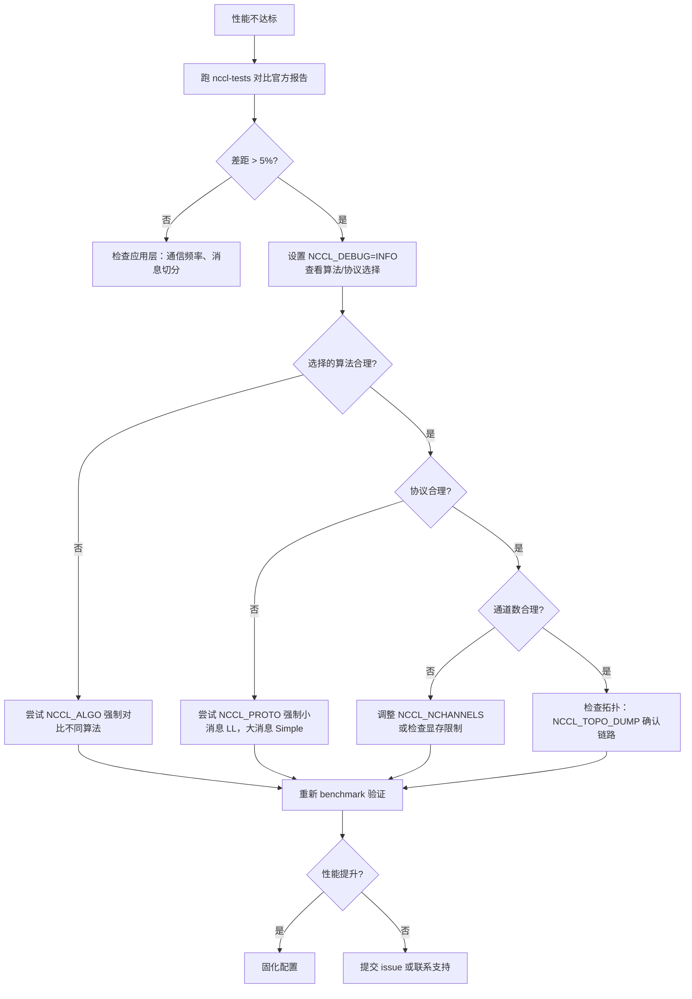

# 제 21 장: 성능 튜닝 실전: tuning 실습, benchmark 도구 및 튜닝 방법론

# 제21장: 성능 튜닝 실전: tuning 실습, benchmark 도구 및 튜닝 방법론

이전 장에서 우리는 사용자 정의 kernel이 디바이스 측 API와 NCCL 통신 프리미티브를 통해 협력하고, 심지어 통신과 계산을 동일한 kernel에 융합하는 방법을 살펴보았습니다. 이는 NCCL을 프로그래밍 모델로서의 가능성을 열어주었지만, 동시에 현실적인 문제를 제기합니다: 통신 성능이 예상에 미치지 못할 때 어디서부터 시작해야 하는가? NCCL은 수백 개의 NCCL_PARAM을 노출하지만, 실제로 한 번의 집합 통신이 어떤 경로를 탈지 결정하는 것은 사실 세 개의 손잡이뿐입니다: 알고리즘(Algo), 프로토콜(Proto), 채널 수(nChannels). 이 장에서는 앞 20개 장의 메커니즘을 하나의 실행 가능한排查 경로로 엮습니다——먼저 성능 보고서를 보고 현상을 파악하고, 다음으로 비용 모델을 읽어 NCCL이 스스로 어떻게 선택하는지 이해하고, 마지막으로 환경 변수와 benchmark로 가설을 검증합니다.

# 21.1 성능 보고서: 먼저 '정상' 기준선을 세우자

튜닝의 첫 단계는 파라미터를 바꾸는 것이 아니라 '정상'이 어떤 모습인지 아는 것입니다. 현재 시스템의 피크 대역폭이 얼마인지조차 모른다면, 어떤 파라미터 조정도 맹목적인 추측일 뿐입니다.

NCCL 공식은`docs/perf`아래에 참조 성능 데이터를 발표하는데, 그 위치는 매우 명확합니다——제품급 보장이 아니라 기대치를 정렬하기 위한 참조점입니다.

[FACT:docs/perf/README.md:3-14]

```
NCCL publishes reference performance data to:

1. Provide reference points that help users align performance expectations.
2. Help users validate their system setup.
3. Reduce repeated requests to the NCCL team for basic performance numbers.

These results are references, and NOT product-level guarantees that the same
performance is achievable on every system. Performance depends on a complex
combination of software versions, system configuration, hardware, and operating
conditions, including factors outside NCCL's control. A difference within 5% is
generally considered acceptable variance due to differences in the underlying
systems.
```

여기에는 초보자가 놓치기 쉬운 두 가지 핵심 정보가 있습니다:

첫째,**5% 이내의 차이는 정상 변동**입니다. 이는 공식보다 3% 낮게 측정되었을 때, 서둘러 파라미터를 조정하지 말라는 의미입니다——먼저 측정 노이즈, GPU 클럭 지터, 또는 이웃 작업 간섭인지 확인하세요.

둘째,**공식은 피크 대역폭만 발표하고 지연 시간은 발표하지 않습니다**。

[FACT:docs/perf/README.md:24-24]

```
We publish peak bandwidth for a selection of commonly used platforms. We do not
currently publish latency because it is typically more sensitive to factors
outside NCCL's control.
```

> **[Design Inference & Architectural Trade-offs]**
> 왜 지연 시간을 발표하지 않을까? 지연 시간은 시스템 상태에 극도로 민감하기 때문입니다——CPU 주파수, PCIe 링크 상태, 네트워크 카드 펌웨어 버전, 심지어 BIOS의 전원 정책까지도 영향을 미칩니다. 대역폭은 큰 메시지에서 포화되어 상대적으로 안정적이고, 지연 시간은 작은 메시지에서 수많은 미세한环节이 중첩되어 만들어지므로 어느 한环节이라도 흔들리면 증폭됩니다. 따라서 튜닝 시,**큰 메시지는 대역폭을 보고, 작은 메시지는 지연 시간을 본다**는 두 가지 다른排查 경로입니다.

[FACT:docs/perf/README.md:24-24]

```
If your workload differs significantly from the published results, open an
issue in the [NCCL repository](https://github.com/NVIDIA/nccl/issues) or contact
NVIDIA Support. We will try our best to help.
```

**排查 순서의 첫 번째**: 먼저 표준 benchmark(예:`nccl-tests`의`all_reduce_perf`)를 실행하고, 결과를 공식 보고서와 비교하세요. 차이가 5% 이내라면 시스템 구성에 문제가 없고 성능 병목이 애플리케이션 계층(예: 통신 빈도, 메시지 분할 방식)에 있다는 뜻입니다; 차이가 현저하면 그제서야 NCCL 파라미터 튜닝에 들어갑니다.

# 21.2 비용 모델: NCCL이 스스로 알고리즘과 프로토콜을 선택하는 방법

파라미터를 조정하려면 먼저 NCCL이 기본적으로 어떻게 선택하는지 이해해야 합니다. 내부에는 '비용 모델'(cost model)이 있는데, 본질적으로 테이블 조회 + 공식 계산입니다: 주어진 메시지 크기, 토폴로지 유형, rank 수에 대해 각 '알고리즘 × 프로토콜' 조합의 소요 시간을 추정하고 가장 작은 것을 선택합니다.

## 직관적 모델

비용 모델을 내비게이션 소프트웨어라고 상상해 보세요. 출발지와 목적지(메시지 크기, 토폴로지)를 입력하면 내부적으로 각 경로(알고리즘/프로토콜 조합)의 시간을 추정한 후 가장 빠른 것을 추천합니다. 내비게이션의 추정은 역사적 데이터와 도로 등급에 기반하고, NCCL의 추정은 하드코딩된 지연/대역폭 파라미터 테이블에 기반합니다.

이 모델이 없다면 NCCL은 모든 시나리오에 동일한 고정 알고리즘을 사용할 수밖에 없습니다——작은 메시지는 시작 오버헤드가 너무 커서 느려지고, 큰 메시지는 대역폭 활용이 부족하여 느려지며, 시스템은 양 극단 모두에서 나쁜 성능을 보일 것입니다.

## 데이터 구조: 모델 테이블과 튜닝 컨텍스트

비용 모델의 핵심은`modelMap`배열이며, 각 요소는 하나의 '알고리즘/프로토콜/대칭 커널' 조합에 대응합니다.

[FACT:src/tuning/cost_model.cc:230-277]

```
static struct ncclTuningModelEntry_t modelMap[] = {
    /*
Initialize default, static models here
{mod_init, mod_sim, mod_final, enabled}
Enable order: Broadcast, Reduce, AllGather, ReduceScatter, AllReduce
*/
  {ncclTuningTreeModelInit, ncclTuningTreeModelSim, nullptr, {0, 0, 0, 0, 1}},       // Tree/LL
  {ncclTuningTreeModelInit, ncclTuningTreeModelSim, nullptr, {0, 0, 0, 0, 1}},       // Tree/LL128
  {ncclTuningTreeModelInit, ncclTuningTreeModelSim, nullptr, {0, 0, 0, 0, 1}},       // Tree/Simple
  {ncclTuningRingModelInit, ncclTuningRingModelSim, nullptr, {1, 1, 1, 1, 1}},       // Ring/LL
  ...
```

각 항목에는 네 개의 필드가 있습니다:`mod_init`(초기화 함수),`mod_sim`(시뮬레이션 함수),`mod_final`(정리 함수),`enabled`(5개 함수 각각의 활성화 플래그).`enabled`배열의 순서는`{Broadcast, Reduce, AllGather, ReduceScatter, AllReduce}`입니다——이 순서를 기억하세요, 나중에 코드를 읽을 때 반복적으로 사용됩니다.

> **[Design Inference & Architectural Trade-offs]**
> 핵심 관찰:**Tree는 AllReduce에서만 활성화**（`{0,0,0,0,1}`), Ring은 모든 함수에서 활성화됩니다(`{1,1,1,1,1}`). 이는 Tree 알고리즘의 장점이 AllReduce의 reduce 단계에서 병렬화가 가능하다는 것이지만, AllGather/ReduceScatter처럼 본질적으로 링 파이프라인인 연산에는 Ring이 더 자연스럽기 때문입니다.

모델의 구체적인 파라미터는`ncclTunerConstants_t`에 존재하며, 각 토폴로지별 기본 지연 시간과 대역폭을 포함합니다.

[FACT:src/tuning/cost_model.cc:142-152]

```
static const ncclTunerConstants_t ncclTunerConstantsDefaults = {
    // baseLatencies
  {
    {6.8, 14.0, 8.4},  // Tree
    {6.6, 14.0, 8.4},  // Ring
    {0, 0, 0},         // Collnet Direct
    {0, 0, 0},         // Collnet Chain
    {0, 0, 0},         // NVLS
    {0, 0, 0},         // NVLS Tree
    {8.0, 8.0, 8.0}    // PAT
  },
```

각 알고리즘에는 세 가지 기본 지연 값이 있으며, LL / LL128 / Simple 세 가지 프로토콜에 대응합니다. 예를 들어 Ring의`{6.6, 14.0, 8.4}`은 LL 프로토콜 기본 지연 6.6마이크로초, LL128은 14.0, Simple은 8.4를 의미합니다. 이 숫자들은 NVIDIA가 실제 하드웨어에서 측정한 경험값입니다.

하드웨어 지연은 토폴로지 유형(NVLink / PCI / NET)별로 각각 제공됩니다.

[FACT:src/tuning/cost_model.cc:153-184]

```
    // hwLatencies
  {
    /* NVLINK */
    {
      {0.6, 1.25, 4.0}, // Tree (LL/LL128/Simple)
      {0.6, 1.9, 3.4},  // Ring (LL/LL128/Simple)
      ...
    },
    /* PCI */
    {
      {1.0, 1.9, 4.0}, // Tree (LL/LL128/Simple)
      {1.0, 2.5, 5.7}, // Ring (LL/LL128/Simple)
      ...
    },
    /* NET */
    {
      {5.0, 8.5, 14},   // Tree (LL/LL128/Simple)
      {2.7, 4.0, 14.0}, // Ring (LL/LL128/Simple)
      ...
    },
  },
```

비교해보면 토폴로지 차이를 알 수 있습니다: NVLink에서 Ring/Simple의 홉당 지연은 3.4마이크로초, PCI에서는 5.7, NET에서는 14.0입니다. 이것이 크로스 머신 통신이 느린 이유입니다 — 홉마다 10마이크로초를 더 써야 합니다.

대역폭 파라미터는 GPU 아키텍처 세대별로 제공됩니다.

[FACT:src/tuning/cost_model.cc:183-183]

```
    // llMaxBws
  {
    {39.0, 39.0, 20.4}, /* Volta-N1/Intel-N2/Intel-N4) */
    {87.7, 22.5 /*avg of ring & tree*/, 19.0}, /* Ampere-N1/AMD-N2/AMD-N4) */
    {141.0, 45.0 /*avg of ring & tree*/, 35.0}, /* Hopper-N1/AMD-N2/AMD-N4) */
    {2 * 141.2, 2 * 45.0 /*avg of ring & tree*/, 2 * 35.0}, /* Blackwell-N1/AMD-N2/AMD-N4) */
  },
```

각 행은 한 세대 아키텍처에 대응하며, 세 값은 각각 단일 머신(N1), 듀얼 머신(N2), 쿼드 머신(N4) 시나리오에서의 LL 프로토콜 최대 대역폭입니다. Hopper 단일 머신 141 GB/s, Blackwell은 두 배인 282 GB/s — 이것이 새 카드에서 동일한 알고리즘이 훨씬 좋은 성능을 보이는 이유를 설명합니다.

## 튜닝 컨텍스트: per-comm 상태

각 communicator는`ncclTuningContext_t`를 보유하며, 이 comm의 튜닝 상태를 저장합니다.

[FACT:src/include/tuning.h:81-95]

```
struct ncclTuningContext_t {
  // Persistant tuning parameters tied to a communicator.
  ncclTunerConstants_t tuningConstants;
  // State of the tuning models
  // Forced function is set via env var
  int forced[NCCL_NUM_FUNCTIONS];
  // Disabled tuning models are not execute and excluded from implemetation selection.
  int enabled[NCCL_TUNING_COUNT][NCCL_NUM_FUNCTIONS];
  // Store of model contexts per communicator.
  float generalLatencies[NCCL_NUM_FUNCTIONS][NCCL_NUM_ALGORITHMS][NCCL_NUM_PROTOCOLS];
  float generalBandwidths[NCCL_NUM_FUNCTIONS][NCCL_NUM_ALGORITHMS][NCCL_NUM_PROTOCOLS];

  ssize_t threadThresholds[NCCL_NUM_ALGORITHMS][NCCL_NUM_PROTOCOLS];
  int maxThreads[NCCL_NUM_ALGORITHMS][NCCL_NUM_PROTOCOLS];
};
```

네 가지 핵심 필드:

- `forced[NCCL_NUM_FUNCTIONS]`: 어떤 함수가 환경 변수에 의해 알고리즘/프로토콜이 강제 지정되었는지 표시합니다. 이것이`NCCL_ALGO`/`NCCL_PROTO`가 적용되는 지점입니다.
- `enabled[NCCL_TUNING_COUNT][NCCL_NUM_FUNCTIONS]`: 2차원 불리언 테이블로, 특정 모델이 특정 함수에 대해 활성화되었는지 표시합니다. 비활성화된 모델은 선택에 참여하지 않습니다.
- `generalLatencies` / `generalBandwidths`: 3차원 배열로, 「함수 × 알고리즘 × 프로토콜」별로 추정된 지연과 대역폭을 저장합니다. 이것이`ncclTuningInit`가 출력하는 큰 테이블의 출처입니다.
- `threadThresholds` / `maxThreads`: 스레드 수 관련 임계값으로, 각 block이 몇 개의 스레드를 사용할지 결정합니다.

## 시나리오 기반 Walkthrough: AllReduce 한 번의 알고리즘 선택

다음과 같이 호출한다고 가정합니다:`ncclAllReduce`, 메시지 크기 1MB, 8카드 단일 머신 NVLink. NCCL 내부에서`ncclTuningInput_t`를 구성한 후,`ncclTuningCompute`。

[FACT:src/tuning/tuning.cc:180-202]

```
ncclResult_t ncclTuningCompute(struct ncclTuningInput_t* const input, struct ncclTuningResult_t* const result) {
  ncclResult_t ret = ncclSuccess;
  TRACE(NCCL_TUNING, ...);
  struct ncclTuningResultList_t tunings;
  tunings.head = nullptr;
  struct ncclTuningResult_t bestTuning = NCCL_TUNING_RESULT_INIT;
  // Set tuning to Ring/Simple for single rank case
  if (input->comm->nRanks tuningMask & (1ULL forced = input->comm->tuningContext.forced[input->func];
  NCCLCHECKGOTO(getModelEntry(id, &model), ret, not_valid);
  if (model == nullptr) {
    ret = ncclInternalError;
    goto not_valid;
  }
  if (input->comm->tuningContext.enabled[id][input->func] == 0) {
    goto not_valid;
  }
  if (model->model != nullptr) {
    NCCLCHECKGOTO(model->model(input, result), ret, not_valid);
    if (result->timeUs timeUs = NCCL_TUNING_IGNORE;
  result->valid = 0;
  goto exit;
}
```

로 전달됩니다.`not_valid`복사`timeUs`주의:`NCCL_TUNING_IGNORE`、`valid`태그 처리 — 어느 단계든 실패하면(모델 미존재, 비활성화, 시뮬레이션이 비양수 시간 반환),

를

[FACT:src/tuning/tuning.cc:155-173]

```
static ncclResult_t ncclTuningSelectBestTuning(struct ncclTuningResultList_t* tunings,
                                               struct ncclTuningResult_t* const bestTuning) {
  bestTuning->timeUs = FLT_MAX;
  float bestSelectionTimeUs = FLT_MAX;
  struct ncclTuningResultListNode* node = tunings->head;
  while (node != nullptr) {
    const struct ncclTuningResult_t& tuning = node->result;
    float selectionTimeUs = tuning.selectionTimeUs > 0.0f ? tuning.selectionTimeUs : tuning.timeUs;
    TRACE(NCCL_TUNING, "A/P/S %s/%s/%s, time: %f, selection time: %f", ...);
    if (selectionTimeUs next;
  }
  return ncclSuccess;
}
```

네 번째 단계: 모든 유효 후보 중에서 소요 시간이 가장 작은 것을 선택합니다.`selectionTimeUs`복사`timeUs`。`selectionTimeUs`여기에 디테일이 있습니다: 선택에는

## 를 사용하며, 0보다 크면 그것을 사용하고, 그렇지 않으면

```mermaid
flowchart TD
    start["ncclTuningCompute(input, result)"] --> check_ranks{"comm->nRanks |是| single["bestTuning = Ring/SimplenChannels = 0"]
    check_ranks -->|否| all["ncclTuningComputeAllTunings()"]
    all --> loop{"遍历 i in NCCL_TUNING_COUNT"}
    loop -->|mask 未命中| skip["tuning.valid = 0continue"]
    loop -->|mask 命中| expand["ncclTuningExpandId(i, ...)"]
    expand --> sim["ncclTuningComputeTuning()→ ncclTuningCostModelSimModel()"]
    sim --> sim_check{"enabled[id][func] != 0且 model->model != nullptr?"}
    sim_check -->|否| invalid["timeUs = NCCL_TUNING_IGNOREvalid = 0"]
    sim_check -->|是| push["ncclTuningResultListPushFront()"]
    skip --> loop
    invalid --> loop
    push --> loop
    loop -->|遍历结束| tuner_check{"comm->tuner != NULL?"}
    tuner_check -->|是| plugin["tuner->getCollInfo()覆盖 generalTable"]
    tuner_check -->|否| select["ncclTuningSelectBestTuning()"]
    plugin --> select
    select --> channels["ncclTuningGetChannels()"]
    channels --> eff{"CTAPolicy & EFFICIENCY且 NCCL_ALGO/NCCL_PROTO 未设置?"}
    eff -->|是| nvls["尝试 NVLS 覆盖ncclNvlsRegResourcesQuery()"]
    eff -->|否| done["*result = bestTuning"]
    nvls --> done
    single --> done
```

는 「선택 시간」으로, 추가 페널티 항목(예: 특정 시나리오에서 특정 알고리즘이 추가 오버헤드를 가지는 경우)을 포함할 수 있습니다. 이는 비용 모델에 「추정 시간」과 「선택 시간」을 분리하는 능력을 부여합니다.

# 플로우차트

복사`NCCL_ALGO`、`NCCL_PROTO`、`NCCL_SYM_KERNEL`이 그림은 진입점에서 최종 결과까지의 의사결정 경로를 완전히 그려내며, 단일 rank 단락, 마스크 필터링, 모델 비활성화, tuner 플러그인 개입, CTAPolicy 오버라이드 등 모든 분기를 포함합니다.`parseList`21.3 환경 변수: 성능에 실제로 영향을 미치는 세 가지 노브`enabled`비용 모델을 이해하면 환경 변수가 어떻게 개입하는지 알 수 있습니다.

## 이 세 변수는

`parseList`를 통해 파싱된 후,

[FACT:src/tuning/cost_model.cc:14-32]

```
// Parse a map of prefixes to a list of elements. The first prefix is
// optional and, if not present, the list of elements will be applied
// to all prefixes. Only the first list of elements can lack a
// prefix. Prefixes (if present) are followed by a colon. Lists of
// elements are comma delimited. Mappings of prefix to the lists of
// elements are semi-colon delimited.
//
// For example:
//
//     NCCL_ALGO="ring,collnetdirect;allreduce:tree,collnetdirect;broadcast:ring"
// Enable ring and collnetdirect for all functions, then select tree
// and collnetdirect for allreduce and ring for broadcast.
//
//     NCCL_PROTO="LL,Simple;allreduce:^LL"
// Enable LL and Simple for all functions, but everything except LL
// for allreduce.
//
//     NCCL_PROTO="^LL128;allreduce:LL128"
// Enable everything but LL128, but only LL128 for allreduce.
```

파싱 문법

1. **이 지원하는 문법은 대부분 사람들이 상상하는 것보다 복잡합니다.**：`NCCL_ALGO="ring,tree"`복사

2. **세 가지 사용법:**：`NCCL_ALGO="ring;allreduce:tree"`전역 리스트

3. **— 모든 함수가 ring과 tree만 사용합니다.**：`NCCL_PROTO="^LL128"`함수 접두사별

`^`— 기본은 ring이지만 allreduce는 tree를 사용합니다.

[FACT:src/tuning/cost_model.cc:59-67]

```
    int unset, set;
    if (elemList[0] == '^') {
      unset = 1;
      set = 0;
      elemList++;
    } else {
      unset = 0;
      set = 1;
    }
```

— LL128 외에는 모두 활성화합니다.`^`접두사가 핵심입니다 — 「unset」을 의미하며, 기본 전체 활성화에서 특정 옵션을 제외합니다.`unset=1`、`set=0`복사`unset`파싱 시`set`。

[FACT:src/tuning/cost_model.cc:69-96]

```
    bool foundPrefix = false;
    for (int p = 0; p minCompCap, comm->maxCompCap, comm->graphs[algo].typeInter,
                          comm->graphs[algo].typeIntra, comm->nRanks, f, algo, comm->minDriverVersion)) {
        comm->tuningContext.enabled[i][f] = 0;
      }
      //  Check the user env vars only for functions that have a forced configuration and not already disabled.
      if (comm->tuningContext.forced[f] == 0 || comm->tuningContext.enabled[i][f] == 0) continue;
      comm->tuningContext.enabled[i][f] = 0;
      TRACE(NCCL_TUNING, "a/p/s %s/%s/%s enabled %d/%d/%d", ...);
      if (((algo != NCCL_ALGO_UNDEF && algoEnable[f * NCCL_NUM_ALGORITHMS + algo] != 0) &&
           (proto != NCCL_PROTO_UNDEF && protoEnable[f * NCCL_NUM_PROTOCOLS + proto] != 0)) ||
          (symKernelId != ncclSymkKernelId_Count && symKernelIdEnable[f * ncclSymkKernelId_Count + symKernelId] != 0)) {
        comm->tuningContext.enabled[i][f] = 1;
      }
    }
```

이 줄 — 사용자가 특정 요소를 명시적으로 나열하면, 해당 함수가 「강제」로 표시됩니다. 이 표시는 나중에 비용 모델이 자유롭게 선택할 수 있는지 판단하는 데 사용됩니다.

1. **강제와 비활성화의 상호작용**에는 사용자 강제와 환경 변수, 플랫폼 능력의 상호작용을 처리하는 핵심 로직이 있습니다.`isLL128Enabled`복사`protoEnable == 2`이 로직의 순서가 중요합니다:

2. **먼저 LL128 플랫폼 능력 처리**: 플랫폼이 LL128을 지원하지 않고(`forced[f] != 0`가 0 반환) 사용자가 명시적으로 요구하지 않았다면(`enabled[i][f] = 0`), 그런 다음 사용자가 이 조합을 허용하는지 확인한다——허용하면 다시 활성화한다.

`protoEnable`의 값은 세 가지가 있다: 0(사용자 제외), 1(사용자 활성화), 2(사용자 미언급, 기본 활성화). 이 삼상태 설계는 '사용자 명시적 요구'와 '플랫폼 기본'을 구분할 수 있게 한다.

## 환경 변수 읽기의 캐시 메커니즘

모든`NCCL_PARAM`매크로는 최종적으로`ncclLoadParam`。

[FACT:src/misc/param.cc:78-108]

```
int64_t ncclLoadParam(char const* env, int64_t deftVal, int64_t uninitialized, int64_t* cache, int8_t* noCache) {
  static std::mutex mutex;
  std::lock_guard lock(mutex);

  // noCache is only load/stored within the mutex, no need for atomic
  if (*noCache == /*uninitialized*/ -1) ncclGetCachePolicy(env, noCache);

  if (COMPILER_ATOMIC_LOAD(cache, std::memory_order_relaxed) != uninitialized) {
    return COMPILER_ATOMIC_LOAD(cache, std::memory_order_relaxed);
  }

  // Read the environment variable
  const char* str = ncclGetEnv(env);
  int64_t value = deftVal;

  if (str && strlen(str) > 0) {
    errno = 0;
    char* end = nullptr;
    value = strtoll(str, &end, 0);
    // Preserve numeric-prefix parsing while rejecting non-numeric values.
    if (errno || end == str) {
      value = deftVal;
      ATTN("Invalid value %s for %s, using default %lld.", str, env, (long long)deftVal);
    } else {
      INFO(NCCL_ENV, "%s set by environment to %lld.", env, (long long)value);
    }
  }

  if (*noCache == /*cache*/ 0) COMPILER_ATOMIC_STORE(cache, value, std::memory_order_relaxed);
  return value;
}
```

이 코드에는 주목할 만한 설계가 몇 가지 있다:

**전역 뮤텍스**：`static std::mutex mutex`가 전체 읽기 과정을 보호한다. 이는 모든 매개변수의 최초 읽기가 직렬화된다는 의미다. 왜 락을 사용하고 락프리가 아닌가? 매개변수 읽기는 초기화 단계에서만 발생하고 핫 패스에 있지 않으므로 락의 오버헤드는 무시할 수 있으며, 정확성이 더 중요하기 때문이다.

**이중 검사**: 먼저 원자적으로`cache`를 읽고, 이미 초기화되었다면 바로 반환한다. 이는 매개변수를 읽을 때마다 락에 들어가는 것을 피한다——락 자체는 초기화 후 거의 경쟁하지 않지만, 원자적 읽기가 더 빠르다.

**캐시 전략**：`noCache`플래그는 읽은 값을`cache`에 다시 쓸지 여부를 결정한다. 일부 매개변수(동적 응답이 필요한 경우 등)는 캐시를 비활성화하여 매번 환경 변수를 다시 읽을 수 있다.

**오류 처리**：`strtoll`파싱 실패 시 기본값을 사용하고`ATTN`경고를 출력한다.`end == str`의 판단에 주의하라——문자열 시작부터 숫자가 아니라면,`end`은`str`과 같아지며, 이는 숫자를 전혀 파싱하지 못했음을 의미한다.

## 구성 파일 지원

환경 변수는 반드시 셸에서 설정할 필요가 없으며, NCCL은 구성 파일에서 읽는 것을 지원한다.

[FACT:src/misc/param.cc:52-67]

```
static void initEnvFunc() {
  char confFilePath[1024];
  const char* userFile = std::getenv("NCCL_CONF_FILE");
  if (userFile && strlen(userFile) > 0) {
    snprintf(confFilePath, sizeof(confFilePath), "%s", userFile);
    setEnvFile(confFilePath);
  } else {
    const char* userDir = userHomeDir();
    if (userDir) {
      snprintf(confFilePath, sizeof(confFilePath), "%s/.nccl.conf", userDir);
      setEnvFile(confFilePath);
    }
  }
  snprintf(confFilePath, sizeof(confFilePath), "/etc/nccl.conf");
  setEnvFile(confFilePath);
}
```

로딩 순서:`NCCL_CONF_FILE`로 지정된 파일(설정된 경우) →`~/.nccl.conf` → `/etc/nccl.conf`. 나중에 로드된 것이 먼저 로드된 것을 덮어쓴다(`setEnvFile`가`ncclOsSetEnv`）。

[FACT:src/misc/param.cc:69-72]

```
void initEnv() {
  static std::once_flag once;
  std::call_once(once, initEnvFunc);
}
```

`std::call_once`복사`ncclGetEnv`。

# 21.4 채널 수: 과소평가된 성능 노브

알고리즘과 프로토콜이 '어떻게 갈지'를 결정하고, 채널 수가 '몇 개의 길을 열지'를 결정한다. 많은 사람이 튜닝할 때 앞의 두 가지만 신경 쓰고 채널 수를 무시한다——하지만 대형 메시지 시나리오에서는 채널 수가 대역폭 활용률을 결정하는 핵심인 경우가 많다.

## 채널 수는 어디서 오는가

`ncclTuningCompute`는 최적 알고리즘/프로토콜을 선택한 후`ncclTuningGetChannels`를 호출하여 채널 수를 계산한다.

[FACT:src/tuning/tuning.cc:233-235]

```
  if (bestTuning.algo != NCCL_ALGO_UNDEF && bestTuning.proto != NCCL_PROTO_UNDEF) {
    NCCLCHECKGOTO(ncclTuningGetChannels(input, &bestTuning), ret, exit);
  }
```

채널 수의 계산 로직은 이 장의 소스 자료에 없지만,`ncclTuningResult_t`의 필드에서 그 역할을 알 수 있다.

[FACT:src/include/tuning.h:42-55]

```
struct ncclTuningResult_t {
  int id;
  int valid;
  float timeUs;
  float selectionTimeUs;
  int algo;
  int proto;
  int symKernelId;
  int ceMethodId;
  int nChannels;
  int maxChannels;
  int nWarps;
  int forced;
};
```

`nChannels`는 최종적으로 사용되는 채널 수이고,`maxChannels`는 상한이다.`nWarps`는 각 블록의 warp 수다.

## CTAPolicy의 채널 수 오버라이드

전략을 처리하는 특별한 로직이 있다.`NCCL_CTA_POLICY_EFFICIENCY`복사

[FACT:src/tuning/tuning.cc:236-257]

```
  // NCCL_CTA_POLICY_EFFICIENCY requires user (non-symmetric) buffer registration (currently unsupported with MNNVL).
  // Run after GetChannels so bestTuning.nChannels is valid. Skip when a tuner plugin owns selection
  // (same as pre-rearch). The NVLS-bit guard keeps this bias inside the candidate set: a per-call
  // algSelection may have narrowed tuningMask, so EFFICIENCY must not resurrect NVLS when excluded.
  if (input->comm->tuner == NULL && (input->CTAPolicy & NCCL_CTA_POLICY_EFFICIENCY) &&
      ncclGetEnv("NCCL_ALGO") == NULL && ncclGetEnv("NCCL_PROTO") == NULL && !input->comm->MNNVL &&
      (input->tuningMask & (1ull regBuff && (input->func == ncclFuncAllGather || input->func == ncclFuncReduceScatter)) {
      if ((input->comm->nNodes > 1 && input->collNetSupport && input->nvlsSupport) ||
          (input->comm->nNodes == 1 && input->nvlsSupport)) {
        int recChannels;
        NCCLCHECKGOTO(ncclNvlsRegResourcesQuery(input->comm, input->func, &recChannels), ret, exit);
        if (recChannels comm->tuningContext.maxThreads[bestTuning.algo][bestTuning.proto] / WARP_SIZE;
        }
      }
    }
  }
```

: tuner 플러그인이 없을 때만 이 부분을 탄다. 플러그인이 선택권을 가질 때 NCCL은 개입하지 않는다.

1. `input->comm->tuner == NULL`: 사용자가 효율 우선 전략을 설정했다.

2. `input->CTAPolicy & NCCL_CTA_POLICY_EFFICIENCY`: 사용자가 알고리즘/프로토콜을 강제하지 않았다. 강제했다면 사용자 선택을 존중한다.

3. `ncclGetEnv("NCCL_ALGO") == NULL && ncclGetEnv("NCCL_PROTO") == NULL`: MNNVL 시나리오는 지원되지 않는다.

4. `!input->comm->MNNVL`: NVLS/Simple이 후보 집합 내에 있다. 이 가드는 제외된 옵션이 '부활'하는 것을 방지한다.

5. `input->tuningMask & (1ull << (NCCL_ALGO_NVLS * NCCL_NUM_PROTOCOLS + NCCL_PROTO_SIMPLE))`조건을 만족하면 NVLS 등록 리소스가 지원할 수 있는 채널 수를 조회하고, 현재 선택을 초과하지 않으면 NVLS 알고리즘으로 전환한다.

〔설계 추론과 아키텍처 트레이드오프〕

> **[Design Inference & Architectural Trade-offs]**
> 로 실제 사용 가능량을 조회해야 한다.`ncclNvlsRegResourcesQuery`대칭 커널의 폴백 로직

## 대칭 커널(symmetric kernel)은 비교적 새로운 기능으로, 사용할 수 없을 때 범용 커널로 폴백해야 한다.

복사

[FACT:src/tuning/tuning.cc:258-298]

```
  if ((bestTuning.symKernelId != ncclSymkKernelId_Count ||
       (input->tuningMask & NCCL_TUNING_MASK_SYM_KERNELS && bestTuning.symKernelId == ncclSymkKernelId_Count)) &&
      bestTuning.algo == NCCL_ALGO_UNDEF && bestTuning.proto == NCCL_PROTO_UNDEF) {
    bool isLLKernel = (1 comm->intraRanks > 1 && !ncclParamSingleProcMemRegEnable();
    bool needFallback = bestTuning.symKernelId != ncclSymkKernelId_Count ? false : true;

    // General kernel tuning structs if fallback is needed
    struct ncclTuningResult_t generalTuning = NCCL_TUNING_RESULT_INIT;
    struct ncclTuningInput_t generalInput = *input;
    generalInput.tuningMask = NCCL_TUNING_MASK_GENERAL_KERNELS;

    // Fallback logic for symmetric LL kernels:
    // - If both src and dst are registered, we don't fall back if a symmetric kernel is available.
    // - Otherwise, we have to fall back to generl kernel if running the selected symmetric LL kernel is
    //   not possible (if the buffers are not registered and we manage multiple GPUs).
    // - If the user forced a symmetric kernel via NCCL_SYM_KERNEL or requested preference for using
    //   symmetric kernels even without symmetric buffers via NCCL_SYM_NOWIN_ENABLE, we respect that.
    // - Otherwise, we query the general cost model and if it selects a non-LL proto, we pick that.
    if (bestTuning.symKernelId != ncclSymkKernelId_Count) {
      if (input->winRegType == ncclSymSendRegRecvReg) {
        needFallback = false;
      } else if (isLLKernel) {
        needFallback = isOneThreadMultiGpus && input->winRegType == ncclSymSendNonregRecvNonreg;
        if (!needFallback && !result->forced) {
          needFallback = !ncclParamSymNoWinEnable() && input->winRegType == ncclSymSendNonregRecvNonreg;
          if (!needFallback) {
            NOWARN(ncclTuningCompute(&generalInput, &generalTuning), NCCL_TUNING);
            needFallback = (generalTuning.proto != NCCL_PROTO_LL);
          }
        }
      }
    }
```

송신 및 수신 버퍼가 모두 등록되었다면(

- ), 폴백하지 않는다.`ncclSymSendRegRecvReg`LL 커널이고 단일 스레드가 여러 GPU를 관리하며 버퍼가 등록되지 않았다면, 폴백한다.
- 사용자가
- 를 설정하지 않았고 버퍼가 등록되지 않았다면, 폴백한다.`NCCL_SYM_NOWIN_ENABLE`그렇지 않으면 범용 비용 모델을 조회하여 비-LL 프로토콜을 선택했다면, 폴백한다.
- 〔설계 추론과 아키텍처 트레이드오프〕

> **[Design Inference & Architectural Trade-offs]**
> 사용 가능한 조합이 없을 때의 오류 처리

## 모든 후보가 제외되면 NCCL은 오류를 보고하고 진단 정보를 제공한다.

복사

[FACT:src/tuning/tuning.cc:308-329]

```
  if ((bestTuning.algo == NCCL_ALGO_UNDEF || bestTuning.proto == NCCL_PROTO_UNDEF) &&
      bestTuning.symKernelId == ncclSymkKernelId_Count && bestTuning.ceMethodId == ncclCeMethodId_Count) {
    char ncclAlgoEnvStr[1024] = "";
    char ncclProtoEnvStr[1024] = "";
    char ncclSymKernelIdEnvStr[1024] = "";
    const char* symKernelIdEnv = ncclGetEnv("NCCL_SYM_KERNEL");
    if (symKernelIdEnv) {
      snprintf(ncclSymKernelIdEnvStr, 1023, " NCCL_SYM_KERNEL was set to %s.", symKernelIdEnv);
    }
    const char* algoEnv = ncclGetEnv("NCCL_ALGO");
    if (algoEnv) {
      snprintf(ncclAlgoEnvStr, 1023, " NCCL_ALGO was set to %s.", algoEnv);
    }
    const char* protoEnv = ncclGetEnv("NCCL_PROTO");
    if (protoEnv) {
      snprintf(ncclProtoEnvStr, 1023, " NCCL_PROTO was set to %s.", protoEnv);
    }
    WARN("No algorithm/protocol nor symKernelId available for function %s with datatype %s.%s%s%s",
         ncclFuncToString(input->func), ncclDatatypeToString(input->datatype), ncclAlgoEnvStr, ncclProtoEnvStr,
         ncclSymKernelIdEnvStr);
    ret = (algoEnv || protoEnv || symKernelIdEnv) ? ncclInvalidUsage : ncclInternalError;
  }
```

),`algoEnv || protoEnv || symKernelIdEnv`를 반환한다——이는 사용자의 구성 문제다; 그렇지 않으면`ncclInvalidUsage`를 반환한다——이는 NCCL 내부 문제다(모든 후보가 예기치 않게 제외됨).`ncclInternalError`21.5 프로덕션 함정 회피 가이드

# 함정 1: 환경 변수 오타로 인한 조용한 폴백

## 는 인식할 수 없는 토큰을 만나면

`parseList`을 반환하지만, 만약`ncclInvalidUsage`(대문자)를 썼다면,`NCCL_ALGO=RING`는 올바르게 매칭한다. 진짜 위험한 것은 오타다, 예를 들어`strcasecmp`복사`NCCL_ALGO=rnig`。

[FACT:src/tuning/cost_model.cc:87-91]

```
        if (e == nelems) {
          WARN("Unrecognized element token \"%s\" when parsing \"%s\"", elem, str);
          ret = ncclInvalidUsage;
          goto fail;
        }
```

를 켜지 않았다면 이 경고를 보지 못할 수 있다.`NCCL_DEBUG=WARN`권장 사항**: 튜닝 시 항상**또는`NCCL_DEBUG=WARN`를 설정하여 구성 파싱 결과를 볼 수 있도록 하라.`NCCL_DEBUG=INFO`함정 2: NCCL_ALGO와 NCCL_PROTO의 상호작용

## 만약

를 설정했지만`NCCL_ALGO=tree`를 설정하지 않았다면, NCCL은 Tree 알고리즘에서 최적 프로토콜을 선택한다. 하지만`NCCL_PROTO`와`NCCL_ALGO=tree`를 동시에 설정했고 Tree/LL 조합이 일부 함수에서 비활성화되어 있다면(예: Tree는 AllReduce에서만 활성화), '사용 가능한 조합 없음' 오류가 발생한다.`NCCL_PROTO=LL`복사

[FACT:src/tuning/cost_model.cc:379-383]

```
      if (((algo != NCCL_ALGO_UNDEF && algoEnable[f * NCCL_NUM_ALGORITHMS + algo] != 0) &&
           (proto != NCCL_PROTO_UNDEF && protoEnable[f * NCCL_NUM_PROTOCOLS + proto] != 0)) ||
          (symKernelId != ncclSymkKernelId_Count && symKernelIdEnable[f * ncclSymkKernelId_Count + symKernelId] != 0)) {
        comm->tuningContext.enabled[i][f] = 1;
      }
```

동시에**허용될 때만 조합이 활성화된다. 이는 AND 논리이지 OR이 아니다.**함정 3: LL128의 플랫폼 제한

## LL128은 모든 플랫폼에서 지원되지 않는다.

LL128 不是所有平台都支持。`isLL128Enabled`연산 능력, 드라이버 버전, 연결 유형을 확인했습니다.

[FACT:src/tuning/cost_model.cc:119-139]

```
static int isLL128Enabled(int minCompCap, int maxCompCap, int interType, int intraType, int nRanks, int func, int algo,
                          int minDriverVersion) {
  int ret = 1;
  if (ncclParamLl128C2c() && minCompCap >= 90 && (!RUBIN_AND_LATER(minCompCap) || minDriverVersion >= 13030)) {
    // Rubin, Blackwell, and Hopper: Enable LL128 for all P2C and PXN if CUDA supports it.
    ret &= (interType = 90)
      INFO(
        NCCL_GRAPH | NCCL_TUNING,
        "Disabling LL128 over all PxN connections (PXB and C2C). This ensures that no C2C link will be used by LL128.");
  }
  ret &= (intraType = 90);
  ret &= !(minCompCap comm, input->func, &recChannels), ret, exit);
        if (recChannels comm->tuningContext.maxThreads[bestTuning.algo][bestTuning.proto] / WARP_SIZE;
        }
```

NVLS의 채널 수는`ncclNvlsRegResourcesQuery`하드웨어 리소스 조회에 의해 결정되며, 임의로 설정할 수 없습니다. 하드웨어 리소스가 부족하면 채널 수가 제한됩니다.

# 21.6 튜닝 의사 결정 흐름

앞의 내용을 종합하면 실행 가능한 문제 해결 흐름을 얻을 수 있습니다.



이 흐름의 핵심 사상은:**먼저 위치를 파악하고, 그다음 파라미터를 조정하고, 마지막으로 검증한다**. 처음부터 환경 변수를 마구 설정하지 마십시오.

# 이 장 요약

이 장에서는 NCCL의 튜닝 경로를 네 가지 계층으로 나누었습니다:

1. **기준선**: 공식 성능 보고서로 기대치를 설정하고, 5% 이내는 정상 변동이며, 큰 메시지는 대역폭을, 작은 메시지는 지연 시간을 봅니다.

2. **비용 모델**: NCCL 내부에서`modelMap`표 + 지연/대역폭 파라미터로 각 조합의 소요 시간을 추정하고, 최소인 것을 선택합니다. 이 모델을 이해하는 것이 튜닝의 전제입니다.

3. **환경 변수**：`NCCL_ALGO`、`NCCL_PROTO`、`NCCL_SYM_KERNEL`를 통해`parseList`파싱 후`enabled`표를 수정하여 특정 조합을 강제하거나 제외합니다. 구문은 전역, 함수별, 제외의 세 가지 모드를 지원합니다.

4. **채널 수**: 에 의해`ncclTuningGetChannels`계산되며, 하드웨어 리소스와 CTAPolicy의 영향을 받습니다.

# 이 장 생각해보기와 자가 점검

Q1: 만약`ncclTuningCompute`에서 단일 rank 단락 로직(`input->comm->nRanks <= 1`분기)을 제거하면 어떻게 될까요? 어떤 시나리오에서 문제가 발생할까요?

**참고 해석**：

단일 rank 단락은[FACT:src/tuning/tuning.cc:191-200]：

```cpp
  // Set tuning to Ring/Simple for single rank case
  if (input->comm->nRanks 
Q2: `parseList`에서`forced[p] = 1`이 코드 줄([FACT:src/tuning/cost_model.cc:83])의 역할은 무엇인가요? 만약 제거하면,`NCCL_ALGO=ring`의 동작에 어떤 변화가 생기나요?

**참고 해석**：

`forced[p] = 1`에서[FACT:src/tuning/cost_model.cc:80-85]：

```cpp
        for (e = 0; e
