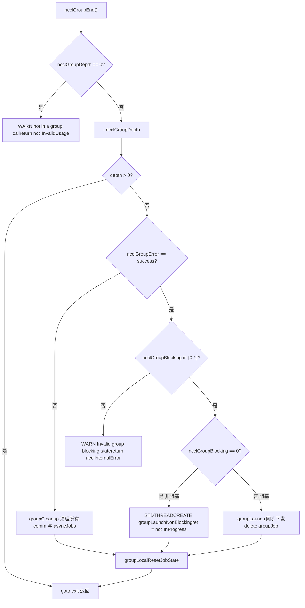

# 제 22 장: 프로덕션 문제 해결과 함정: 흔한 교착 상태, 타임아웃, 버전 불일치 및 해결 방안

# 제22장: 프로덕션 문제 해결과 함정: 흔한 교착 상태, 타임아웃, 버전 불일치 및 해결 방안

이전 장에서 성능 튜닝의 문제 해결 순서와 핵심 노브를 정리했지만, 프로덕션 환경의 NCCL 장애는 성능 미달이 아니라 프로그램이 직접 멈추거나 충돌하는 경우가 많습니다. 이러한 장애의 근원은 보통 특정 함수를 잘못 작성한 것이 아니라 호출 순서, 수명 주기 또는 버전 계약이 깨진 것입니다. 이 장에서는 가장 전형적인 네 가지 함정에 집중합니다: group 의미 오용으로 인한 교착 상태, 파라미터 검증 누락으로 인한 조용한 오류, ABI 버전 불일치, 그리고 타임아웃과 재시도의 경계. 우리는 src/group.cc, src/misc/argcheck.cc, src/include/checks.h, contrib/nccl_ep/nccl_ep.cc 네 가지 단서를 따라 NCCL 내부에서 오류가 발생하기 전에 어떻게 막는지 살펴봅니다.

# Group 의미 오용: 왜 "GroupEnd 하나를 빼먹으면" 멈추는가

## 직관 모델: Group은 "장바구니"이지 "가속 스위치"가 아니다

를`ncclGroupStart()` / `ncclGroupEnd()`온라인 쇼핑의 장바구니라고 상상해 보십시오: 여러 상품(여러 통신 호출)을 장바구니에 넣고 마지막에 한 번에 결제합니다(`ncclGroupEnd`). 넣기만 하고 결제하지 않으면 장바구니는 영원히 공중에 떠 있게 됩니다 — NCCL 내부에서 유지하는`ncclGroupDepth`카운터가 0으로 돌아가지 않아, 이후 모든 통신 호출이 "아직 주문을 모으는 중"이라고 생각하고 영원히 실제로 kernel을 내려보내지 않아, 결국 전체 프로세스가 멈춥니다.

> **[Design Inference & Architectural Trade-offs]**
> 이것은 생산 환경에서 가장 흔한 교착 상태 형태입니다: 코드가 특정 예외 분기에서`return`되어,`ncclGroupEnd`을(를) 건너뛰었고, 그리고`ncclGroupDepth`은(는)`thread_local`이므로 함수가 반환되어도 자동으로 정리되지 않습니다.

## 데이터 구조: thread_local의 group 상태

NCCL은 group 상태를 전부 스레드 로컬 저장소에 둡니다. 이것이 교착 상태를 이해하는 핵심입니다.

[FACT:src/group.cc:34-34]

```cpp
thread_local int ncclGroupDepth = 0; // depth of ncclGroupStart nesting
thread_local ncclResult_t ncclGroupError = ncclSuccess;
thread_local struct ncclComm* ncclGroupCommHead[ncclGroupTaskTypeNum] = {nullptr};
thread_local struct ncclComm* ncclGroupCommPreconnectHead = nullptr;
thread_local struct ncclIntruQueue ncclAsyncJobs;
thread_local int ncclGroupBlocking = -1; /* default mode */
```

필드별 해석:

- `ncclGroupDepth`: 중첩 깊이.`ncclGroupStart`이 증가하고,`ncclGroupEnd`이 감소하며, 0까지 줄어야 실제로 전송이 트리거됩니다. 중첩 지원은 설계상 편의지만, "End 하나를 빠뜨림"이 깊이를 영원히 1에 머물게 한다는 뜻이기도 합니다.
- `ncclGroupError`: 이 스레드에 누적된 group 오류. 한 번 호출이 실패하면 이후`ncclGroupEnd`은(는) 바로 실패 경로로 갑니다.
- `ncclGroupCommHead[]`: 작업 유형(collective / rawTask / mgmtTask / symRegister)별로 그룹화된 통신 도메인 연결 리스트 헤드.
- `ncclAsyncJobs`: 실행 대기 중인 비동기 작업 큐(예: preconnect, symmetric register).
- `ncclGroupBlocking`：`-1`은(는) "아직 어떤 통신 도메인도 만나지 못함"을,`0`은(는) 비차단을,`1`은(는) 차단을 나타냅니다. 이 필드는 뒤에 나오는 "차단과 비차단 혼용" 감지의 핵심입니다.

> **[Design Inference & Architectural Trade-offs]**
> 전역 변수 대신`thread_local`을(를) 사용하는 동기는 직접적입니다: NCCL은 여러 스레드가 각자 독립적인 group 컨텍스트를 보유하고 서로 간섭하지 않도록 허용합니다. 대가는 — 스레드가 종료될 때 이 상태들이 자동으로 정리되지 않으며, 스레드가 group 도중에 종료되면 상태가 누출된다는 점입니다.

## 단계별: GroupEnd 한 번의 전체 검증 체인

시나리오 대입: 애플리케이션이`ncclGroupEnd()`을(를) 호출하고, 이때`ncclGroupDepth`이 1입니다.

첫 번째 단계, 실제로 group 안에 있는지 확인:

[FACT:src/group.cc:1048-1052]

```cpp
  if (ncclGroupDepth == 0) {
    WARN("ncclGroupEnd: not in a group call.");
    ret = ncclInvalidUsage;
    goto exit;
  }
```

사용자가`ncclGroupStart`을(를) 호출하지 않고 바로`ncclGroupEnd`을(를) 하면, 여기서 "not in a group call"을 출력하고`ncclInvalidUsage`을(를) 반환합니다. 이것이 가장 친절한 오류입니다 — 즉시 오류를 내고, 멈추지 않습니다.

두 번째 단계, 깊이를 감소시키고 최외곽인지 판단:

[FACT:src/group.cc:1061-1063]

```cpp
  if ((--ncclGroupDepth) > 0) goto exit;

  if ((ret = ncclGroupError) != ncclSuccess) goto fail;
```

여러 겹 중첩된 경우, 내부의`End`은(는) 깊이만 감소시키고 반환하며 전송을 트리거하지 않습니다. 최외곽만 계속합니다. 동시에 누적 오류를 확인합니다.

세 번째 단계, 차단 모드 일관성 검증. 이것이 "차단과 비차단 혼용" 감지 지점입니다:

[FACT:src/group.cc:1095-1101]

```cpp
  if (hasCommHead || !ncclIntruQueueEmpty(&groupJob->asyncJobs) || ncclGroupCommPreconnectHead != nullptr) {
    /* make sure ncclGroupBlocking has been set. */
    if (ncclGroupBlocking != 0 && ncclGroupBlocking != 1) {
      WARN("Invalid group blocking state %d", ncclGroupBlocking);
      ret = ncclInternalError;
      goto fail;
    }
```

`ncclGroupBlocking`은(는) 반드시`{0, 1}`사이에 있어야 합니다. 만약 여전히`-1`이면, group 안에 통신 도메인도 비동기 작업도 없다는 뜻이며, 논리적으로 여기까지 오면 안 됩니다.

네 번째 단계, 차단 모드에 따라 분기. 비차단은 스레드 비동기 전송으로, 차단은 동기 전송으로:

[FACT:src/group.cc:1102-1134]

```cpp
    if (ncclGroupBlocking == 0) {
      /* nonblocking group */
      if (!ncclIntruQueueEmpty(&groupJob->asyncJobs)) {
        ncclAsyncJob* job = ncclIntruQueueHead(&groupJob->asyncJobs);
        do {
          NCCLCHECKGOTO(ncclCommSetAsyncError(job->comm, ncclInProgress), ret, fail);
          if (job->comm->groupJob == NULL) {
            job->comm->groupJob = groupJob;
            groupJob->groupRefCount++;
          }
          job = job->next;
        } while (job);
      }
      ...
      groupJob->base.func = groupLaunchNonBlocking;
      STDTHREADCREATE_GOTO(groupJob->base.thread, ncclAsyncJobMain, ret, fail, &groupJob->base);
      groupJob->nonBlockingInit = true;
      ret = ncclInProgress;
    }
```

과(와)`groupRefCount++`에 주의:`ret = ncclInProgress`비차단 모드에서,`ncclGroupEnd`은(는) 즉시`ncclInProgress`을(를) 반환하고, 실제 전송은 백그라운드 스레드에서 실행됩니다. 호출자는 이후 반드시`ncclCommGetAsyncError`로 폴링하거나,`ncclGroupJobComplete`로 대기해야 합니다.

## 차단과 비차단 혼용: 왜 금지되는가

로 돌아가서,`ncclAsyncLaunch`혼용 감지를 봅니다:

[FACT:src/group.cc:55-64]

```cpp
    /* check if there are blocking and nonblocking comms at the same time in group. */
    if (comm->destroyFlag) {
      ncclGroupBlocking = 1;
    } else if (ncclGroupBlocking == -1) {
      /* first met communicator */
      ncclGroupBlocking = comm->config.blocking;
    } else if (ncclGroupBlocking != comm->config.blocking) {
      WARN("Blocking and nonblocking communicators are not allowed in the same group.");
      ret = ncclInvalidArgument;
    }
```

> **[Design Inference & Architectural Trade-offs]**
> 왜 혼용을 금지하는가? 차단 통신 도메인의 전송 의미는 "호출이 반환될 때 kernel이 이미 제출됨"이고, 비차단은 "호출이 반환될 때 작업이 큐에 들어갔지만 제출되지 않음"입니다. 둘이 같은 group 안에 있으면,`ncclGroupEnd`통일된 반환 의미를 줄 수 없습니다 — 기다릴 것인가, 기다리지 않을 것인가? NCCL은 그냥 거부하고, 문제를 API 경계에 노출합니다.

## 생산 함정: 세 가지 실제 시나리오

**시나리오 1: 예외 분기에서 GroupEnd를 빠뜨림.**코드가`ncclGroupStart`과(와)`ncclGroupEnd`사이에서 예외를 던지거나 조기에`return`，`ncclGroupDepth`이 1에 멈춥니다. 이후 모든 통신 호출이 "주문 모으기" 상태에 들어가 영원히 전송되지 않습니다. 진단 방법:`ncclGroupEnd`전에`ncclGroupDepth`을(를) 출력하거나,`gdb`로 해당 thread_local 변수를 관찰합니다.

**시나리오 2: 스레드를 넘나들며 같은 comm 사용.**group 상태가`thread_local`이므로, 스레드 A가`ncclGroupStart`을(를) 호출한 뒤 스레드 B가`ncclAllReduce`을(를) 호출해도 A의 group에 들어가지 않습니다. A와 B가 같은 comm을 조작하면 "일부 호출은 group 안, 일부는 group 밖"이라는 혼란이 생깁니다. NCCL은 이런 상황을 감지하지 않습니다. 하나의 comm이 어느 시점에든 한 스레드에 의해서만 조작된다고 가정하기 때문입니다.

**시나리오 3: CUDA graph capture와 group의 상호작용.**`doLaunches`안의 감지를 봅니다:

[FACT:src/group.cc:448-455]

```cpp
    if (capturingYes && capturingNo) {
      // We have entered barriers but are aborting without leaving them. Thus
      // these comms are permanently trashed. We need a good mechanism for
      // tracking and reporting that.
      WARN("Either none or all communicators in a ncclGroup() can be CUDA graph captured.");
      result = ncclInvalidUsage;
      goto failure;
    }
```

주석이 아주 직설적입니다: 일단 barrier에 들어갔다가 중도 포기하면, 이 comm들은 "영구 손상"됩니다. 그래서 규칙은 — 한 group 안의 모든 통신 도메인은 전부 capture 중이거나, 전부 capture 중이 아니어야 합니다. 혼용하면 comm 상태가 불일치하게 되고, NCCL은 현재 좋은 복구 메커니즘이 없습니다.



# 매개변수 검증과 조용한 오류: ArgCheck가 "정상처럼 보이는" 호출을 어떻게 막는가

## 직관 모델: ArgCheck는 "공항 보안 검색"

매개변수 검증은 공항 보안 검색과 같습니다: 더 빨리 날게 해주지는 않지만, "짐처럼 보이지만 실제로는 위험물"인 것들을 막아줍니다. 이것이 없으면, 잘못된 장치 포인터 하나가 GPU kernel이 쓰레기 데이터를 읽게 하거나, 더 나쁘게는 — 조용히 남의 VRAM을 망가뜨립니다.

## 데이터 구조: 검증 모드와 전역 검사 큐

NCCL의 매개변수 검증은 "매번 전부 검사"가 아니라 모드로 나뉩니다. 핵심은`comm->checkMode`：

[FACT:src/misc/argcheck.cc:227-251]

```cpp
  if (info->comm->checkMode != ncclCheckModeDefault) {
    if ((info->coll == ncclFuncSend || info->coll == ncclFuncRecv)) {
      if (info->count > 0) NCCLCHECK(CudaPtrCheck(info->recvbuff, info->comm, "buff", info->opName));
    } else if (info->coll == ncclFuncPutSignal || info->coll == ncclFuncSignal || info->coll == ncclFuncWaitSignal) {
      // One-sided RMA ops specify the remote destination via peerWin, not sendbuff/recvbuff,
      // so the standard CUDA pointer checks do not apply here.
      INFO(NCCL_COLL, "%s : skipping sendbuff/recvbuff pointer check (one-sided RMA uses peerWin)", info->opName);
    } else {
      // Check CUDA device pointers
      if (info->coll != ncclFuncBroadcast || info->comm->rank == info->root) {
        NCCLCHECK(CudaPtrCheck(info->sendbuff, info->comm, "sendbuff", info->opName));
      }
      if (info->coll != ncclFuncReduce || info->comm->rank == info->root) {
        NCCLCHECK(CudaPtrCheck(info->recvbuff, info->comm, "recvbuff", info->opName));
      }
    }

    if (info->comm->checkMode == ncclCheckModeDebugGlobal) {
      struct ncclArgsInfo* argsInfo;
      NCCLCHECK(ncclCalloc(&argsInfo, 1));
      argsInfo->info = *info;
      argsInfo->next = NULL;
      ncclIntruQueueEnqueue(&info->comm->argsInfoQueue, argsInfo);
    }
  }
```

세 가지 모드:

- `ncclCheckModeDefault`: 가장 저렴한 검사만 수행(root 범위, datatype 범위, op 범위), CUDA API는 건드리지 않음.
- 비기본 모드:`CudaPtrCheck`을(를) 호출하며, 이는 실제로`cudaPointerGetAttributes`을(를) 호출하므로 성능 오버헤드가 있음.
- `ncclCheckModeDebugGlobal`: 로컬 검사 외에도`ncclInfo`을(를) 밀어 넣음`argsInfoQueue`, group이 끝날 때 rank 간 전역 일관성 검사를 수행한다.

> **[Design Inference & Architectural Trade-offs]**
> 이 설계는 성능과 정확성의 트레이드오프다:`cudaPointerGetAttributes`는 동기 CUDA 호출이라 핫 패스에서 매 통신마다 호출하면 작은 메시지에서 현저히 느려진다. 그래서 기본 모드에서는 "제로 코스트" 검사만 하고, 비용이 큰 포인터 검증은 디버그 모드에 맡긴다.

## Step-by-Step: CudaPtrCheck의 3중 방어선

시나리오 대입: 사용자가`sendbuff`를 전달하면, NCCL이 디버그 모드에서 이를 검증한다.

첫 번째 계층, 포인터가 유효한지:

[FACT:src/misc/argcheck.cc:12-18]

```cpp
ncclResult_t CudaPtrCheck(const void* pointer, struct ncclComm* comm, const char* ptrname, const char* opname) {
  cudaPointerAttributes attr;
  cudaError_t err = cudaPointerGetAttributes(&attr, pointer);
  if (err != cudaSuccess || attr.devicePointer == NULL) {
    WARN("%s : %s %p is not a valid pointer", opname, ptrname, pointer);
    return ncclInvalidArgument;
  }
```

`cudaPointerGetAttributes`는 유효하지 않은 포인터에 대해 에러를 반환하거나`devicePointer`가 NULL이다. 이는 "호스트 스택 주소를 전달"하거나 "해제된 포인터를 전달"하는 것을 막는다.

두 번째 계층, 디바이스가 일치하는지:

[FACT:src/misc/argcheck.cc:19-26]

```cpp
#if CUDART_VERSION >= 10000
  if (attr.type == cudaMemoryTypeDevice && attr.device != comm->cudaDev) {
#else
  if (attr.memoryType == cudaMemoryTypeDevice && attr.device != comm->cudaDev) {
#endif
    WARN("%s : %s allocated on device %d mismatchs with NCCL device %d", opname, ptrname, attr.device, comm->cudaDev);
    return ncclInvalidArgument;
  }
```

이것이 가장 은밀한 함정이다: 포인터는 유효한 GPU 포인터지만 다른 GPU에 속한다. 다중 GPU 머신에서 사용자가`cudaSetDevice`를 잊으면 잘못 전달하기 쉽다. NCCL은 여기서 명확히 거부한다.

세 번째 계층, 통신 도메인 객체 무결성:

[FACT:src/misc/argcheck.cc:38-45]

```cpp
ncclResult_t CommCheck(struct ncclComm* comm, const char* opname, const char* ptrname) {
  NCCLCHECK(PtrCheck(comm, opname, ptrname));
  if (comm->startMagic != NCCL_MAGIC || comm->endMagic != NCCL_MAGIC) {
    WARN("Error: corrupted comm object detected");
    return ncclInvalidArgument;
  }
  return ncclSuccess;
}
```

`startMagic` / `endMagic`는`ncclComm`구조체의 앞뒤에 배치된 센티넬 값이다. 사용자가 와일드 포인터를 전달하거나 comm이 이미 해제되었다면 magic이 맞지 않는다. 이것은 "메모리 손상 감지"의 고전적 기법이다 — 두 개의 센티넬로 구조체를 감싸서, 어떤 범위 초과 쓰기라도 둘 중 하나를 손상시킬 수 있다.

## 전역 일관성 검사: registrationCheck의 rank 간 검증

이것은 NCCL에서 가장 "무거운" 검증으로,`ncclCheckModeDebugGlobal`에서만 트리거된다. 이것이 검사하는 것은 — 모든 rank의 대칭 메모리 등록 상태가 일치하는지다.

[FACT:src/misc/argcheck.cc:95-111]

```cpp
  NCCLCHECKGOTO(bootstrapAllGather(comm->bootstrap, bufInfo, sizeof(struct symBufInfo) * 2), ret, fail);

  cmpBufInfo[0] = bufInfo[0];
  cmpBufInfo[1] = bufInfo[1];
  for (int r = 1; r nRanks; r++) {
    int infoIdx = r * 2;
    if (cmpBufInfo[0].isSymRegistered != bufInfo[infoIdx].isSymRegistered ||
        cmpBufInfo[1].isSymRegistered != bufInfo[infoIdx + 1].isSymRegistered) {
      if (comm->rank == 0) {
        WARN("Coll %s size %ld symmetric registration check failed on rank %d: sendReg %d recvReg %d mismatch with "
             "rank 0 sendReg %d recvReg %d",
             info->opName, size, r, bufInfo[infoIdx].isSymRegistered, bufInfo[infoIdx + 1].isSymRegistered,
             cmpBufInfo[0].isSymRegistered, cmpBufInfo[1].isSymRegistered);
      }
      ret = ncclInvalidArgument;
      goto fail;
    }
```

이것은 bootstrap의`allGather`를 통해 각 rank의`(isSymRegistered, bigOffset, userOffset)`를 수집한 다음, rank별로 비교한다. 만약 rank 0의 send buffer가 대칭 메모리로 등록되었는데 rank 3은 등록하지 않았다면, 여기서 에러가 발생한다.

> **[Design Inference & Architectural Trade-offs]**
> 왜 이 검사가 중요한가? 대칭 메모리(symmetric memory)는 모든 rank가 동일한 가상 주소 집합으로 버퍼에 접근할 것을 요구한다. 만약 어떤 rank의 buffer가 등록되지 않았다면, kernel에서 계산된 주소가 잘못되어 쓰레기 값을 읽거나 범위를 초과한다. 이런 오류는 런타임에 "결과가 가끔 틀림"으로 나타나며 극히 디버깅하기 어렵다. NCCL은 API 경계에서 allGather 한 번의 비용으로 이를 막기로 선택했다.

## 프로덕션 함정

**함정 1: 기본 모드에서는 포인터 오류가 보고되지 않는다.**사용자가 디버그 모드를 켜지 않고 잘못된 디바이스의 포인터를 전달하면, NCCL은`ArgsCheck`단계에서 에러를 보고하지 않고 kernel 실행 시에야 발견한다 — 이때는 이미 다른 rank의 VRAM을 손상시켰을 수 있다. 개발 단계에서는`NCCL_DEBUG=WARN`와`checkMode`디버그를 사용할 것을 권장한다.

**함정 2:`ncclCheckModeDebugGlobal`의 allGather 오버헤드.**매 통신마다 bootstrap allGather를 수행하면 작은 메시지 고빈도 시나리오에서 병목이 된다. 이 모드는 디버깅에만 적합하며 프로덕션에는 사용할 수 없다.

**함정 3: userRedOp의 생명주기.**이 부분을 보라:

[FACT:src/misc/argcheck.cc:220-225]

```cpp
  int opIx = int(ncclUserRedOpMangle(info->comm, info->op)) - int(ncclNumOps);
  if (ncclNumOps op &&
      (info->comm->userRedOpCapacity comm->userRedOps[opIx].freeNext != -1)) {
    WARN("%s : reduction operation %d unknown to this communicator", info->opName, info->op);
    return ncclInvalidArgument;
  }
```

사용자 정의 reduction op는 comm에 등록된다. 만약 사용자가 "한때 등록되었지만 이미 해제된" op를 전달하면,`freeNext != -1`는 그것이 이미 회수되었음을 감지한다. 이것은 "댕글링 op 핸들"을 방지하는 검사다.

# 에러 전파 매크로: NCCLCHECK 패밀리가 "에러를 잃지 않는" 방법

## 직관적 모델: 에러 전파 매크로는 "바통"

NCCL의 에러 처리는 일련의 매크로 릴레이에 의존한다: 하위 함수가`ncclResult_t`를 반환하면, 상위에서`NCCLCHECK`로 검사하고, 성공이 아니면 즉시 반환한다. 이것은 계주와 같다 — 바통(에러 코드)이 끝까지 전달되어야 하며, 어느 한 구간이라도 놓치면 전체 체인이 끊어진다.

## 데이터 구조: 매크로 패밀리 전체 조망

[FACT:src/include/checks.h:148-166]

```cpp
#define NCCLCHECK(call) \
  do { \
    ncclResult_t RES = call; \
    if (RES != ncclSuccess && RES != ncclInProgress) { \
      /* Print the back trace*/ \
      if (ncclDebugNoWarn == 0) INFO_LOC(NCCL_ALL, "-> %d", RES); \
      return RES; \
    } \
  } while (0)

#define NCCLCHECKGOTO(call, RES, label) \
  do { \
    RES = call; \
    if (RES != ncclSuccess && RES != ncclInProgress) { \
      /* Print the back trace*/ \
      if (ncclDebugNoWarn == 0) INFO_LOC(NCCL_ALL, "-> %d", RES); \
      goto label; \
    } \
  } while (0)
```

핵심 세부사항:`ncclInProgress`는 "에러 아님"으로 간주된다. 이것이 비차단 통신의 핵심이다 —`ncclGroupEnd`가`ncclInProgress`를 반환하면 "작업이 제출되었고 아직 완료되지 않음"을 의미하며, 호출자는 에러로 처리하지 말고 계속 폴링해야 한다.

`NCCLCHECK`는 직접`return`，`NCCLCHECKGOTO`로 점프한다. 후자는 리소스 정리가 필요한 시나리오에 사용된다.`label`정리 경로: NCCLCHECKIGNORE는 첫 번째 에러를 보존

## 복사

[FACT:src/include/checks.h:168-177]

```cpp
// Report failure but continue - useful for cleanup paths where we want to
// attempt all cleanup steps. Preserves the first error in RES.
#define NCCLCHECKIGNORE(call, RES) \
  do { \
    ncclResult_t TMPRES = call; \
    if (TMPRES != ncclSuccess && TMPRES != ncclInProgress) { \
      if (ncclDebugNoWarn == 0) INFO_LOC(NCCL_ALL, "-> %d", TMPRES); \
      if (RES == ncclSuccess) RES = TMPRES; \
    } \
  } while (0)
```

대기와 중단: NCCLWAIT의 abortFlag 검사

## 복사

[FACT:src/include/checks.h:196-205]

```cpp
#define NCCLWAIT(call, cond, abortFlagPtr) \
  do { \
    uint32_t* tmpAbortFlag = (abortFlagPtr); \
    ncclResult_t RES = call; \
    if (RES != ncclSuccess && RES != ncclInProgress) { \
      if (ncclDebugNoWarn == 0) INFO_LOC(NCCL_ALL, "-> %d", RES); \
      return ncclInternalError; \
    } \
    if (COMPILER_ATOMIC_LOAD(tmpAbortFlag, std::memory_order_acquire)) NEQCHECK(*tmpAbortFlag, 0); \
  } while (!(cond))
```

를 호출하여(진행)`call`를 검사하고(충족 여부), 동시에`cond`를 검사한다(중단 여부).`abortFlag`는`abortFlag`로 로드하여 다른 스레드가 쓴 중단 신호를 볼 수 있게 보장한다.`memory_order_acquire`〔설계 추론 및 아키텍처 트레이드오프〕

> **[Design Inference & Architectural Trade-offs]**
> 는 rank 간 중단 신호를 전파하는 메커니즘이다 — 한번 설정되면 모든 대기 루프가 종료된다.`abortFlag`스레드 생성과 메모리 할당의 안전 매크로

## 복사

[FACT:src/include/checks.h:237-256]

```cpp
#define STDTHREADCREATE_IMPL(var, func, error_action, ...) \
  do { \
    try { \
      (var) = std::thread(func, __VA_ARGS__); \
    } catch (const std::exception& e) { \
      WARN("Thread creation failed: %s", e.what()); \
      error_action; \
    } \
  } while (0)

#define STDTHREADCREATE(var, func, ...) STDTHREADCREATE_IMPL(var, func, return ncclSystemError, __VA_ARGS__)

#define STDTHREADCREATE_GOTO(var, func, RES, label, ...) \
  STDTHREADCREATE_IMPL( \
    var, func, \
    do { \
      RES = ncclSystemError; \
      goto label; \
    } while (0), \
    __VA_ARGS__)
```

`std::thread`로 변환하여 예외가 C API 경계를 관통하지 않도록 한다.`ncclSystemError`복사

[FACT:src/include/checks.h:258-275]

```cpp
#define NEW_NOTHROW(var, x) \
  do { \
    (var) = new (std::nothrow) x{}; \
    if (!(var)) { \
      WARN("Allocation failed"); \
      return ncclSystemError; \
    } \
  } while (0)
```

`new (std::nothrow)`프로덕션 함정

## 함정 1:

**가 성공으로 오인됨.`ncclInProgress`일부 사용자 코드는**로 성공을 판단하지만, 비차단 모드에서 반환되는 것은`if (ret == ncclSuccess)`이다. 올바른 방법은`ncclInProgress`이거나`if (ret == ncclSuccess || ret == ncclInProgress)`로 조회하는 것이다.`ncclCommGetAsyncError`함정 2:

**坑二：`NCCLCHECK`소멸자에서 사용한다.**만약 소멸자에서 사용하면`NCCLCHECK`, 오류가 즉시`return`, 이후 정리를 건너뛴다. 사용해야 한다`NCCLCHECKIGNORE`。

# ABI 버전 불일치: nccl_ep의 size-based 설계

## 직관적 모델: ABI는 "소켓 표준"

ABI(애플리케이션 바이너리 인터페이스)는 전원 소켓 표준과 같다: 라이브러리와 호출자가 "구조체가 어떻게 생겼는지"에 대한 이해가 일치하지 않으면, 미국식 플러그를 유럽식 소켓에 꽂는 것과 같다——가벼우면 작동하지 않고, 심하면 타버린다.`contrib/nccl_ep`영리한 설계를 사용했다: 모든 경계를 넘는 구조체는`size`필드로 시작한다.

## 데이터 구조: size + magic 이중 검증

[FACT:contrib/nccl_ep/nccl_ep.cc:70-76]

```cpp
// Size-based ABI versioning: every cross-boundary struct starts with a `size`
// field set by the caller to sizeof(struct). The library checks that against
// its own known size; any mismatch means caller and library are from different
// releases. Strict equality for now — see nccl_ep.h for the planned future
// relaxation (all-zero-trailing-bytes escape hatch).
// Immediately after `size` there is a `magic` field pre-filled by NCCL_EP_*_INIT
// to catch unininitialized structures.
```

설계 요점:

- `size`필드는 호출자가`sizeof(struct)`로 채우고, 라이브러리는 그것이 자신이 인식하는 size와 같은지 확인한다.
- `magic`필드는`NCCL_EP_*_INIT`매크로가 미리 채우며, "초기화되지 않은" 구조체를 잡아내는 데 사용된다.
- 현재는 엄격한 동등 비교이며, 향후 "꼬리가 모두 0이면 더 작은 size를 허용"하는 완화 모드를 지원할 계획이다.

## Step-by-Step: EP_REQUIRE_STRUCT의 검증 흐름

[FACT:contrib/nccl_ep/nccl_ep.cc:77-80]

```cpp
#define EP_REQUIRE_STRUCT(ptr) \
    do { \
        assert( \
            (ptr) != nullptr && (ptr)->size == sizeof(*(ptr)) && \
```

이 매크로는`ncclEpDispatch`、`ncclEpCombine`등의 진입점에서 호출된다:

[FACT:contrib/nccl_ep/nccl_ep.cc:2827-2830]

```cpp
    EP_REQUIRE_STRUCT(inputs);
    EP_REQUIRE_STRUCT(outputs);
    EP_OPTIONAL_LAYOUT_INFO(layout_info);
    EP_OPTIONAL_STRUCT(config);
```

`inputs`과`outputs`는 필수 매개변수이며,`EP_REQUIRE_STRUCT`；`layout_info`과`config`는 선택적 매개변수이고,`EP_OPTIONAL_*`。

## 버전 안전한 필드 읽기: layoutInfoRecvTopkIdxKind

이것이 가장 정교한 부분이다——"호출자의 구조체가 더 작을 수 있는" 상황에서 필드를 안전하게 읽는 방법.

[FACT:contrib/nccl_ep/nccl_ep.cc:139-144]

```cpp
// Safe field reader for ncclEpLayoutInfo_t::recv_topk_idx_kind. Returns AUTO
// when the caller's struct (size) does not cover the field, preserving the
// pre-flag default.
static inline ncclEpExpertIdKind_t layoutInfoRecvTopkIdxKind(const ncclEpLayoutInfo_t* lip) {
    if (lip == nullptr) return NCCL_EP_EXPERT_ID_AUTO;
    constexpr size_t field_end = offsetof(ncclEpLayoutInfo_t, recv_topk_idx_kind) + sizeof(ncclEpExpertIdKind_t);
    if (lip->size recv_topk_idx_kind;
}
```

로직은: 호출자의`size`이 "해당 필드가 끝나는 오프셋"보다 작으면, 호출자가 구버전 구조체를 사용하는 것이므로 이 필드가 존재하지 않아 기본값`AUTO`을 반환한다. 그렇지 않으면 정상적으로 읽는다.

> **[Design Inference & Architectural Trade-offs]**
> 이것은 ABI 호환의 표준 기법이다: 새 필드는 구조체 끝에만 추가할 수 있으며, 읽을 때`size`로 필드 존재 여부를 판단한다. 이렇게 하면 구버전 호출자가 구버전 구조체를 사용해도 새 라이브러리가 올바르게 처리할 수 있다.

## 버전 번호 확인: 소프트 경고이지 하드 거부가 아님

[FACT:contrib/nccl_ep/nccl_ep.cc:1393-1400]

```cpp
    if (in_config->version != NCCL_EP_API_VERSION) {
        fprintf(
            stderr,
            "NCCL EP WARN: ncclEpGroupConfig_t.version=%u, library API_VERSION=%u; "
            "behavior may differ across versions.\n",
            in_config->version,
            (unsigned)NCCL_EP_API_VERSION);
    }
```

여기서 주목할 점은`WARN`이지`return error`가 아니라는 것이다. 버전 번호 불일치는 경고일 뿐인데, 왜냐하면`size`검사가 이미 메모리 레이아웃 안전성을 보장하기 때문이다. 버전 번호는 "동작이 다를 수 있음"에 대한 힌트에 더 가깝다.

## 프로덕션 함정

**함정 1: INIT 매크로로 초기화하는 것을 잊음.**만약 사용자가 수동으로`memset`구조체를 0으로 하면,`magic`이 0이 되고,`EP_REQUIRE_STRUCT`이 실패한다.`NCCL_EP_*_INIT`매크로를 반드시 사용해야 한다.

**함정 2: 버전 간 동적 라이브러리 혼용.**만약 애플리케이션이 새 버전`libnccl_ep.so`에 링크되어 있지만 헤더 파일이 구버전이면,`sizeof(struct)`이 불일치하게 되어,`EP_REQUIRE_STRUCT`이 즉시 오류를 보고한다. 이것은 설계 의도이다——조용한 오류보다 빠른 실패가 낫다.

**함정 3:`EP_OPTIONAL_LAYOUT_INFO`의 범위 검사.**이 부분을 보자:

[FACT:contrib/nccl_ep/nccl_ep.cc:114-123]

```cpp
            if ((ptr)->size size > sizeof(*(ptr))) { \
                fprintf( \
                    stderr, \
                    "NCCL EP: ncclEpLayoutInfo_t size out of supported range: " \
                    "got %u, expected [%zu, %zu]\n", \
                    (ptr)->size, \
                    kNcclEpLayoutInfoMinSize, \
                    sizeof(*(ptr))); \
                return ncclInvalidArgument; \
            } \
```

`layout_info`은 size가`[min, sizeof]`범위 내에 있도록 허용하는데, 이는`EP_REQUIRE_STRUCT`의 엄격한 동등 비교보다 더 완화된 것이다. 그 이유는`layout_info`이 선택적 매개변수이고, 역사적으로 필드가 증감했기 때문이다.

```mermaid
flowchart TD
    entry["ncclEpDispatch(inputs, outputs, layout_info, config)"] --> req_inputs{"EP_REQUIRE_STRUCT(inputs)size == sizeof?"}
    req_inputs -->|否| err_size["assert 失败 / 返回错误"]
    req_inputs -->|是| req_outputs{"EP_REQUIRE_STRUCT(outputs)"}
    req_outputs -->|否| err_size
    req_outputs -->|是| opt_layout{"layout_info != nullptr?"}
    opt_layout -->|否| skip_layout["跳过 layout 校验"]
    opt_layout -->|是| range_check{"size in [min, sizeof]?"}
    range_check -->|否| err_range["fprintf size out of rangereturn ncclInvalidArgument"]
    range_check -->|是| magic_check{"magic == NCCL_EP_MAGIC?"}
    magic_check -->|否| err_magic["fprintf magic mismatchreturn ncclInvalidArgument"]
    magic_check -->|是| read_field["layoutInfoRecvTopkIdxKindsize  read_field
    read_field --> proceed["继续执行 dispatch 逻辑"]
```

# 타임아웃, 재시도 및 중단: NCCLWAIT에서 nccl_ep의 timeout_cycles까지

## 직관적 모델: 타임아웃은 "퓨즈"

분산 통신에서 하나의 rank가 멈추면 모든 rank가 무한 대기하게 된다. 타임아웃 메커니즘은 퓨즈와 같다: 정상 상황에서는 작동하지 않지만, 전류 이상이 발생하면 끊어져 전체 시스템이 타버리는 것을 방지한다.

## 데이터 구조: abortFlag와 timeout_cycles

NCCL 코어는`abortFlag`로 중단 신호를 전파한다.`ncclAsyncLaunch`내부의 전달을 보자:

[FACT:src/group.cc:49-52]

```cpp
    job->abortFlag = comm->abortFlag;
    job->abortFlagDev = comm->abortFlagDev;
    job->childAbortFlag = comm->childAbortFlag;
    job->childAbortFlagDev = comm->childAbortFlagDev;
```

각 job은 comm의 abortFlag 포인터를 보유한다. group이 오류를 감지하면:

[FACT:src/group.cc:118-126]

```cpp
        if (!job->destroyFlag &&
            (COMPILER_ATOMIC_LOAD(groupAbortFlag, std::memory_order_acquire) || errorJobAbortFlag == true)) {
          COMPILER_ATOMIC_STORE(job->abortFlag, uint32_t(1), std::memory_order_release);
          COMPILER_ATOMIC_STORE(job->abortFlagDev, uint32_t(1), std::memory_order_release);
          if (job->childAbortFlag) {
            COMPILER_ATOMIC_STORE(job->childAbortFlag, uint32_t(1), std::memory_order_release);
            COMPILER_ATOMIC_STORE(job->childAbortFlagDev, uint32_t(1), std::memory_order_release);
          }
        }
```

일단`groupAbortFlag`또는`errorJobAbortFlag`가 참이면, 모든 job의 abortFlag가 1로 설정된다.`memory_order_release`은 이전 쓰기 작업이 다른 스레드에 보이도록 보장한다.

## nccl_ep의 타임아웃 설계: GPU 클럭 사이클

`nccl_ep`은 더 정밀한 타임아웃을 사용한다——GPU 클럭 사이클 단위.

[FACT:contrib/nccl_ep/nccl_ep.cc:1558-1591]

```cpp
    // Resolve timeout_cycles: env var > config field > compile-time default
    {
        int dev;
        int clock_khz_int;
        CUDA_CHECK(cudaGetDevice(&dev));
        CUDA_CHECK(cudaDeviceGetAttribute(&clock_khz_int, cudaDevAttrClockRate, dev));
        uint64_t clock_khz = static_cast(clock_khz_int);

        uint64_t resolved = NUM_TIMEOUT_CYCLES;
        const char* source = "compile-time default";
        const uint64_t env_ms = static_cast(ep_group->env.timeout_ms.value.ul);
        // Only a positive timeout overrides the default.
        const bool have_env_ms = ep_group->env.timeout_ms.is_set && env_ms > 0;

        if (have_env_ms) {
            resolved = clock_khz * 1000ULL * env_ms / 1000ULL;
            source = "NCCL_EP_TIMEOUT_MS env var";
            ...
        } else if (ep_group->config.timeout_ns != 0) {
            resolved = clock_khz * 1000ULL * (ep_group->config.timeout_ns / 1000000ULL) / 1000ULL;
            source = "config.timeout_ns";
        }

        ep_group->timeout_cycles = resolved;
```

우선순위는: 환경 변수`NCCL_EP_TIMEOUT_MS`> 구성 필드`timeout_ns`> 컴파일 시 기본값. 변환 공식은`clock_khz * 1000 * ms / 1000`, 즉 밀리초를 클럭 사이클로 변환한다.

> **[Design Inference & Architectural Trade-offs]**
> 왜 밀리초 대신 클럭 사이클을 사용하는가? GPU kernel 내부의 대기 루프는 시스템 시간 API를 호출할 수 없고,`clock64()`레지스터만 읽을 수 있기 때문이다. 클럭 사이클로 타임아웃을 판단하면 kernel 내부에서 직접 비교할 수 있어 host 개입이 필요 없다.

## 비동기 오류 플래그: host-pinned 메모리

[FACT:contrib/nccl_ep/nccl_ep.cc:1767-1778]

```cpp
    // Allocate mask buffer and async error flag for active-mask support
    if (ep_group->config.enable_mask && ep_group->config.algorithm == NCCL_EP_ALGO_LOW_LATENCY) {
        size_t mask_bytes = ep_group->nRanks * sizeof(int);
        CUDA_CHECK(cudaMalloc(reinterpret_cast(&ep_group->mask_buffer), mask_bytes));
        // Initialize all ranks as active (1 = active, 0 = masked/failed)
        std::vector all_active(ep_group->nRanks, 1);
        CUDA_CHECK(
            cudaMemcpyAsync(ep_group->mask_buffer, all_active.data(), mask_bytes, cudaMemcpyHostToDevice, stream));
        CUDA_CHECK(
            cudaHostAlloc(reinterpret_cast(&ep_group->async_error_flag), sizeof(int), cudaHostAllocMapped));
        *ep_group->async_error_flag = 0;
    }
```

`async_error_flag`은`cudaHostAllocMapped`로 할당하는데, 이것은 host-pinned이면서 디바이스 주소 공간에 매핑된 메모리이다. GPU kernel이 쓸 수 있고, host가 읽을 수 있으며, 명시적 복사가 필요 없다.

## 비동기 오류 읽기: 원자적 로드

[FACT:contrib/nccl_ep/nccl_ep.cc:4312-4321]

```cpp
ncclResult_t ncclEpGetAsyncError(ncclEpGroup_t ep_group, int* error_out) {
    EP_HOST_ASSERT(ep_group != nullptr);
    if (!ep_group->config.enable_mask) {
        return ncclInvalidUsage;
    }
    EP_HOST_ASSERT(ep_group->async_error_flag != nullptr && "ncclEpGetAsyncError: enable_mask must be true");
    EP_HOST_ASSERT(error_out != nullptr);
    *error_out = __atomic_load_n(ep_group->async_error_flag, __ATOMIC_ACQUIRE);
    return ncclSuccess;
}
```

과`__atomic_load_n`를 함께 사용하여`__ATOMIC_ACQUIRE`, 캐시된 이전 값이 아닌 GPU가 쓴 최신 값을 읽도록 보장한다.

## 프로덕션 함정

**함정 1: 타임아웃을 너무 짧게 설정하여 오탐 발생.**만약`NCCL_EP_TIMEOUT_MS`이 너무 작게 설정되면, 정상적인 네트워크 지터가 타임아웃으로 오판된다. 실제 네트워크 RTT에 따라 설정할 것을 권장하며, 일반적으로 10초 이상이어야 한다.

**함정 2: abortFlag 설정 후 정리하지 않음.**일단 abortFlag가 1로 설정되면, comm은 "중단" 상태에 들어간다. 사용자가 이 comm을 계속 사용하려면 먼저 abortFlag를 정리해야 한다. NCCL의`ncclCommAbort`이 이 정리를 수행한다.

**함정 3:`ncclEpMaskClean`의 전제 조건.**이 부분을 보자:

[FACT:contrib/nccl_ep/nccl_ep.cc:4262-4266]

```cpp
    EP_HOST_ASSERT(ep_group->config.algorithm == NCCL_EP_ALGO_LOW_LATENCY);
    EP_HOST_ASSERT(
        ep_group->rdma_buffer != nullptr &&
        "ncclEpMaskClean: rdma_buffer not yet allocated; create at least one LL handle first");
    EP_HOST_ASSERT(ep_group->sync_buffer != nullptr && ep_group->sync_window != nullptr);
```

`ncclEpMaskClean`은`rdma_buffer`이 할당되어 있을 것을 요구한다. 만약 사용자가 group을 생성했지만 아직 어떤 LL handle도 생성하지 않았다면,`rdma_buffer`은 nullptr이다(LL은 지연 할당이므로). 여기서 assert가 실패한다.

# 이 장 요약

이 장에서는 네 가지 유형의 프로덕션 함정을 엮었다:

1. **Group 시맨틱 오용**：`ncclGroupDepth`은 thread_local이며, 누락하면`ncclGroupEnd`영구적인 교착 상태를 초래할 수 있습니다. 블로킹과 논블로킹 통신 도메인은 혼용할 수 없으며, CUDA graph capture는 전부 아니면 전무여야 합니다.

2. **매개변수 검증**：`ArgsCheck`모드별 검증으로, 기본 모드에서는 제로 코스트 검사만 수행합니다.`CudaPtrCheck`3계층 방어선이 무효 포인터, 잘못된 디바이스, 손상된 comm을 차단합니다.`registrationCheck`크로스 rank 대칭 메모리 일관성 검사를 수행합니다.

3. **오류 전파**：`NCCLCHECK`패밀리는 오류가 유실되지 않도록 보장합니다.`ncclInProgress`오류가 아닙니다.`NCCLCHECKIGNORE`정리 경로에서 첫 번째 오류를 보존하는 데 사용됩니다.`NCCLWAIT`폴링 중에 abortFlag를 확인합니다.

4. **ABI 버전**：`nccl_ep`size-based 설계를 사용하여, 경계를 넘는 모든 구조체가`size`로 시작하며,`magic`와 함께 초기화되지 않은 상태를 포착합니다. 새 필드는 끝에만 추가할 수 있으며, 읽을 때`size`로 존재 여부를 판단합니다.

5. **타임아웃과 중단**: 코어는`abortFlag`로 중단을 전파합니다.`nccl_ep`GPU 클럭 사이클로 타임아웃을 구현하고,`async_error_flag`host-pinned 메모리로 GPU→host 비동기 알림을 구현합니다.

# 이 장의 생각과 자습

Q1: 만약`ncclGroupEndInternal`에서`if ((--ncclGroupDepth) > 0) goto exit;`（[FACT:src/group.cc:1061])를`if (ncclGroupDepth > 0) goto exit;`(감소하지 않음)로 바꾸면 무슨 일이 발생할까요? 중첩 group 시나리오에서 어떤 결과가 발생할까요?

**참고 해석**：

원래 코드는`--ncclGroupDepth`먼저 감소한 후 판단합니다. 만약 감소하지 않도록 바꾸면:

```cpp
if (ncclGroupDepth > 0) goto exit;  // 错误版本
```

그러면 매번`ncclGroupEnd`깊이가 줄어들지 않습니다. 사용자가 다음과 같이 작성했다고 가정합니다:

```cpp
ncclGroupStart();  // depth = 1
ncclGroupStart();  // depth = 2
ncclAllReduce(...);
ncclGroupEnd();    // 原版: depth = 1, 返回; 错误版: depth = 2, 返回
ncclGroupEnd();    // 原版: depth = 0, 触发下发; 错误版: depth = 2, 返回
```

잘못된 버전에서는 두 번째`ncclGroupEnd`시`ncclGroupDepth`가 여전히 2이고,`> 0`가 성립하여 바로`goto exit`되어, 영원히 발송이 트리거되지 않습니다. 모든 통신 호출이 "주문 모으기" 상태에 머물러 프로세스가 교착 상태에 빠집니다.

더 은밀한 것은:`ncclGroupDepth`는 thread_local이라 함수가 반환되어도 리셋되지 않습니다. 이후 코드가 group API를 더 이상 호출하지 않더라도, 이 스레드의 모든 통신이 무효화됩니다.

이 변경은`ncclGroupStart`의 페어링 의미도 훼손합니다——`ncclGroupStart`는 증가하고,`ncclGroupEnd`는 감소하지 않아 깊이가 늘기만 하고 줄지 않아 결국 오버플로됩니다(비록 int 오버플로는 20억 번 호출이 필요하므로 실제로는 논리적 교착 상태일 가능성이 더 큽니다).

Q2: `CudaPtrCheck`에서`attr.type == cudaMemoryTypeDevice && attr.device != comm->cudaDev`（[FACT:src/misc/argcheck.cc:20]) 이 검사에서, 만약`attr.type == cudaMemoryTypeDevice`라는 조건을 제거하면 어떤 문제가 발생할까요? 어떤 시나리오에서 오탐이 발생할까요?

**참고 답안**：

`cudaPointerAttributes.type`에는 세 가지 가능한 값이 있습니다:`cudaMemoryTypeDevice`(디바이스 메모리),`cudaMemoryTypeHost`(호스트 메모리),`cudaMemoryTypeManaged`(통합 메모리).

만약`attr.type == cudaMemoryTypeDevice`조건을 제거하면, 다음과 같이 됩니다:

```cpp
if (attr.device != comm->cudaDev) {  // 错误版本
```

그러면 host 메모리나 managed 메모리에 대해,`attr.device`가 -1 또는 0일 수 있어`comm->cudaDev`와 일치하지 않아 "디바이스 불일치" 오탐이 발생합니다.

구체적 시나리오: 사용자가`cudaMallocManaged`로 할당된 포인터를 전달합니다. managed 메모리의`attr.device`는 보통 할당 시의 디바이스이지만, 메모리가 다른 디바이스로 마이그레이션되면`attr.device`가 변할 수 있습니다. 더 흔한 것은 host 메모리(예:`cudaHostAlloc`로 할당된 pinned 메모리)로,`attr.device`가 -1이어서 어떤`cudaDev`와도 같지 않아 오탐이 발생합니다.

NCCL은 host 메모리를 통신 버퍼로 허용하므로(`cudaMemcpy`를 통해 중계), "디바이스 메모리이지만 디바이스가 잘못됨"과 "비디바이스 메모리"를 반드시 구분해야 합니다. 전자는 오류이고, 후자는 합법입니다.

Q3: `layoutInfoRecvTopkIdxKind`（[FACT:contrib/nccl_ep/nccl_ep.cc:139-144])는`lip->size < field_end`로 필드 존재 여부를 판단합니다. 만약 새 버전이 구조체 중간에 필드를 삽입하면(끝이 아니라), 이 판단이 어떻게 무효화될까요? 왜 ABI 설계는 새 필드를 끝에만 추가하도록 규정할까요?

**참고 해석**：

원래 구조체가 다음과 같다고 가정합니다:

```c
struct ncclEpLayoutInfo_t {
    unsigned int size;
    unsigned int magic;
    ncclEpExpertIdKind_t recv_topk_idx_kind;  // offset = 8
};
```

`field_end = offsetof(recv_topk_idx_kind) + sizeof(...) = 8 + 4 = 12`。

만약 새 버전이`magic`와`recv_topk_idx_kind`사이에 필드를 삽입하면:

```c
struct ncclEpLayoutInfo_t {
    unsigned int size;
    unsigned int magic;
    unsigned int new_field;                    // 新插入
    ncclEpExpertIdKind_t recv_topk_idx_kind;  // offset 变成 12
};
```

이때`field_end = 12 + 4 = 16`. 구 호출자의`size`는 12(구 구조체 크기)이고,`12 < 16`가 성립하여 함수가`AUTO`를 반환합니다——하지만 구 호출자에게는 실제로`recv_topk_idx_kind`필드가 있고, 단지 오프셋이 다를 뿐입니다. 이로 인해 구 호출자가 설정한`recv_topk_idx_kind`가 무시됩니다.

더 나쁜 것은, 구 호출자가 구 오프셋(8)에 따라`recv_topk_idx_kind`를 썼다면, 새 라이브러리가 새 오프셋(12)에 따라 읽어`new_field`의 값을 읽게 되어 완전히 뒤죽박죽이 됩니다.

그래서 ABI 설계의 철칙은:**새 필드는 구조체 끝에만 추가할 수 있다**입니다. 이렇게 하면 구 호출자의`size`가 새 필드의`field_end`보다 작아 함수가 올바르게 기본값을 반환하고, 새 호출자의`size`가 새 필드를 커버하여 정상적으로 읽습니다. 중간에 필드를 삽입하면 모든`offsetof`기반 버전 판단이 깨집니다.

이 장에서는 프로덕션 환경에서의 네 가지 전형적인 함정과 그 내부 방어 메커니즘을 분석했습니다. 이러한 경계 조건은 NCCL의 안정적인 운영이 핵심 구현뿐만 아니라 주변 생태계의 적응과 확장에도 의존한다는 것을 상기시켜 줍니다. 다음 장에서는 생태계와 확장으로 전환하여, nccl4py, nccl4rust, nccl_ep, nccl_ubx 같은 주변 프로젝트가 어떻게 NCCL의 능력을 더 넓은 사용자에게 전달하는지 살펴보겠습니다.
