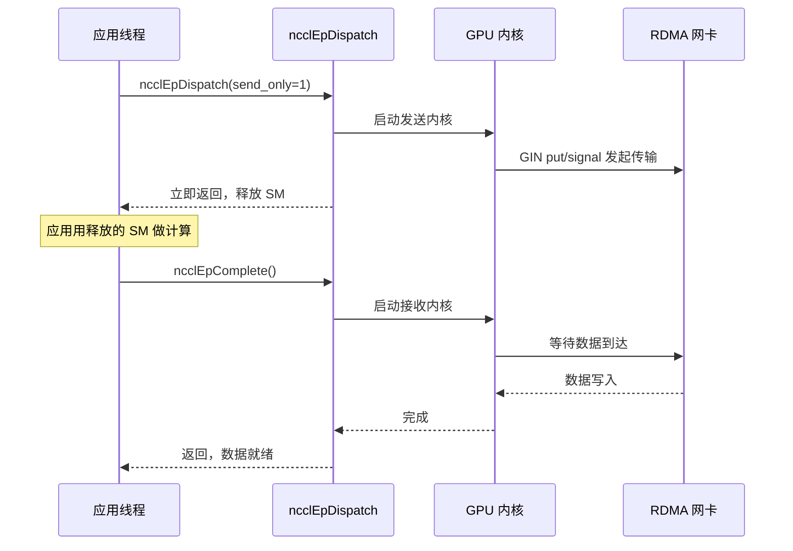
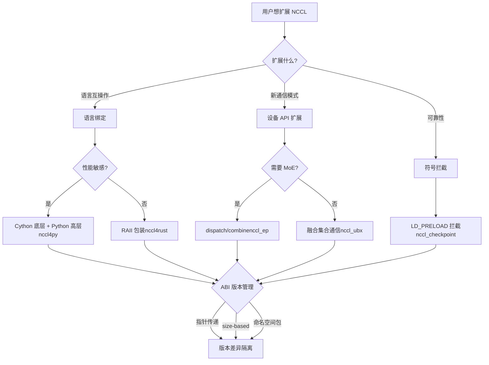

# 제 23 장: 생태계 확장: nccl4py, nccl4rust, nccl_ep, nccl_ubx 등 주변 프로젝트

지난 장에서는 프로덕션 환경에서 발생하는 NCCL의 전형적인 장애—group 시맨틱 오용, rank 수 불일치, stream 상호작용, ABI 버전 충돌, 네트워크 타임아웃—을 살펴보았다. 이러한 문제는 대부분 C ABI를 직접 사용하는 상황에서 발생하지만, 현대 대규모 모델 학습 프레임워크는 C ABI를 직접 호출하지 않고 Python, Rust 등의 언어 바인딩이나 MoE, 초광대역 통신 등의 시나리오를 위한 확장 프로젝트를 통해 NCCL의 기능을 재사용하는 경우가 많다. 이러한 주변 프로젝트는 bindings/와 contrib/ 디렉터리에 위치하며, 실험적이고 커뮤니티에서 유지 관리되는 성격으로 핵심 라이브러리의 릴리스 품질 보증을 계승하지 않는다. 이번 장에서는 nccl4py, nccl4rust, nccl_ep, nccl_ubx, nccl_checkpoint를 하나씩 분석하며, 이들이 언어 바인딩, 디바이스 API 확장, 심볼 인터셉트라는 세 가지 경로를 통해 핵심 외부에 어떻게 풍부한 생태계를 구축하는지 살펴본다.

# nccl4py: Cython 바인딩과 네임스페이스 패키지 설계

## 직관적 모델: C ABI를 Python이 이해할 수 있는 언어로 번역하기

NCCL 코어가 C 언어만 구사하는 외교관이고, Python 학습 스크립트가 Python만 구사하는 인턴이라고 상상해 보자. nccl4py는 바로 그 통역사다—외교관이 하는 말(NCCL의 동작)을 바꾸지 않고, 단지 「`ncclAllReduce(sendbuff, recvbuff, count, ...)`」를 「`nccl.all_reduce(tensor)`」로 번역할 뿐이다. 이러한 번역 계층이 없다면 모든 Python 프레임워크가 자체적으로 ctypes 바인딩을 작성해야 하므로 중복 작업이 발생하고 오류가 발생하기 쉽다.

## 계층 구조: Cython 저수준 + Python 고수준

nccl4py의 설계는 두 계층이다: 저수준은 Cython 바인딩(`nccl/bindings/cynccl.pxd`), 고수준은 Python API(`nccl.core`)이다. README에 이 계층 구조가 명확히 설명되어 있다[FACT:bindings/nccl4py/README.md:4-4]：

> `nccl4py provides low-level Cython bindings and a high-level Python API`

Cython 바인딩은`.pxd`파일 형태로 wheel과 함께 배포되어 다른 Cython 확장이 직접`cimport` [FACT:bindings/nccl4py/README.md:39-43]：

```cython
from nccl.bindings cimport cynccl
```

> **[Design Inference & Architectural Trade-offs]**
> 왜 Python 계층만이 아니라 Cython 계층도 노출하는가? 일부 프레임워크(예: DeepSpeed, Megatron)의 핵심 루프가 Cython에 있어서 매번 호출할 때마다 Python 인터프리터 오버헤드가 너무 크기 때문이다. 직접`cimport cynccl`를 사용하면 Cython 확장이 C에 가까운 제로 오버헤드로 NCCL 함수를 호출할 수 있다. 이는 「계층적 노출」의 전형적인 설계다—고수준은 일반 사용자에게, 저수준은 성능에 민감한 시나리오에 제공한다.

## 네임스페이스 패키지: 여러 배포판이`nccl`접두사를 공유

이것이 nccl4py의 가장 교묘한 설계다.`nccl`는 PEP 420 암시적 네임스페이스 패키지다[FACT:bindings/nccl4py/README.md:50-51]：

> `nccl` is a PEP 420 implicit namespace package. nccl4py provides `nccl.bindings` and `nccl.core`; other NCCL extension distributions can provide additional `nccl.*` subpackages.

> **[Design Inference & Architectural Trade-offs]**
> 전통적인 Python 패키지에서는`nccl/__init__.py`가 전체`nccl`네임스페이스를 「소유」한다. nccl4py와 nccl_ep의 Python 바인딩이 모두`nccl.xxx`를 제공하려고 하면 충돌이 발생한다—먼저 설치한 쪽이 이긴다. PEP 420 네임스페이스 패키지는 이 문제를 해결한다:`__init__.py`가 없으면 여러 배포판이 각자`nccl/`디렉터리에 하위 패키지를 넣을 수 있고, Python 임포트 시스템이 이를 병합한다. 따라서 nccl4py는`nccl.bindings`와`nccl.core`를 제공하고, nccl_ep는`nccl.ep`를 제공하며, 둘은 공존할 수 있다[FACT:contrib/nccl_ep/README.md:80-82]。

이 설계는 생태계 확장에 매우 중요하다: 향후 어떤 제3자가`nccl.monitoring`、`nccl.profiling`를 추가하려 해도 nccl4py의 코드를 수정할 필요가 없다.

## CUDA 버전 선택: extra 메커니즘

설치 시`nccl4py[cu12]`또는`nccl4py[cu13]`로 CUDA 메이저 버전을 선택한다[FACT:bindings/nccl4py/README.md:13-17]. README에서 그 이유를 설명한다: extras는 해당하는 NCCL runtime과 CUDA Python 의존성을 설치한다[FACT:bindings/nccl4py/README.md:19]. 이미 배포된 wheel은`CUDA_HOME`나 로컬 CUDA Toolkit이 필요 없지만, 소스에서 컴파일하려면[FACT:bindings/nccl4py/README.md:20-21]。

> **[Design Inference & Architectural Trade-offs]**
> 〔설계 추론 및 아키텍처 트레이드오프〕

## 이는 Python 생태계에서 CUDA 버전 파편화를 처리하는 표준 방식이다. CUDA 12와 13의 ABI는 호환되지 않아 하나의 wheel로 모두 처리할 수 없다. extra를 사용하면 pip가 사용자 환경에 따라 올바른 바이너리 의존성을 선택하므로, 런타임에야 버전 불일치를 발견하는 상황을 피할 수 있다.

**프로덕션 함정 회피`__init__.py`함정 1: 네임스페이스 패키지와**충돌.`nccl/`어떤 제3자 패키지가`__init__.py`아래에`nccl.core`를 넣으면 PEP 420 네임스페이스 패키지 메커니즘이 깨져`python -c "import nccl; print(nccl.__path__)"`임포트가 실패한다.排查 방법:`AttributeError`, 만약`nccl`가 보고되면

**가 네임스페이스 패키지가 아님을 의미한다.** `cynccl.pxd`함정 2: Cython ABI 버전 드리프트.[FACT:bindings/nccl4py/README.md:32-32]는 실험적 API`.pxd`이며, NCCL 업그레이드 시`cimport cynccl`가 변경될 수 있다.

# 에 의존하는 Cython 확장은 nccl4py 버전과 엄격히 일치해야 하며, 그렇지 않으면 컴파일 시 심볼 해석이 실패한다.

## nccl4rust: RAII 소유권과 디바이스 측 경계

직관적 모델: 컴파일러가 수명 주기를 관리하도록 하기`ncclCommInitRank`C 언어에서는`ncclCommDestroy`로 communicator를 얻고, 사용 후 반드시

nccl4rust의 핵심 가치는 이 소유권 의미론을 NCCL의 C ABI 위에 씌우는 것이다.

## 계층 구조: 다섯 개의 crate가 각자 역할을 담당

README의 Layout 표에는 다섯 개의 crate가 나열되어 있다[FACT:contrib/nccl4rust/README.md:20-28]：

| Path | Purpose |
| --- | --- |
| `crates/nccl-sys` | bindgen이 생성한 원시 host ABI |
| `crates/nccl` | Rust 스타일 host 래핑 + RAII 소유권 |
| `crates/nccl-device-sys` | `no_std`CUDA-Oxide 디바이스 선언 |
| `crates/nccl-device` | 타입화`DevComm`、`Team`、`Window`래핑 |
| `shim/` | 순수 C-ABI 심, 공개 헤더만 사용 |

> **[Design Inference & Architectural Trade-offs]**
> 이 분리는 의도적이다. README에서 동기를 설명한다[FACT:contrib/nccl4rust/README.md:30-32]: host 애플리케이션은`nccl`만 사용할 수 있고 Rust GPU 컴파일러가 필요 없다; CUDA-Oxide 커널은`nccl-device`을 사용한다; 원시 ABI가 필요한 소비자는`-sys`crate를 선택할 수 있다. 이러한 「필요에 따른 계층화」를 통해 각 사용자는 자신에게 필요한 컴파일 비용만 지불한다.

## 핵심 설계: 값이 아닌 포인터로 디바이스 통신자 전달

이것이 nccl4rust에서 가장 배울 만한 설계 결정이다. README의 Host/device ownership boundary 섹션[FACT:contrib/nccl4rust/README.md:211-219]：

> `ncclDevCommCreate` produces a versioned public structure in host memory. The host `DeviceCommunicator` wrapper owns that structure and destroys it before its parent communicator. CUDA-Oxide remains responsible for allocating device memory, copying those bytes, and keeping the copy alive while kernels execute. Kernels construct `nccl_device::DevComm` from a pointer to that device copy. Using a pointer rather than a by-value Rust mirror keeps the versioned C struct layout out of the kernel argument ABI.

> **[Design Inference & Architectural Trade-offs]**
> 왜 Rust 구조체로 C 구조체를 미러링하지 않는가? 왜냐하면`ncclDevComm_t`은 버전화되어 있기 때문이다—NCCL 버전마다 필드가 다를 수 있다. 만약 커널 파라미터를 Rust 미러를 값으로 전달하면, 커널 ABI가 특정 NCCL 버전의 구조체 레이아웃에 묶이게 된다. NCCL이 구조체를 업그레이드하면 컴파일된 모든 커널을 재컴파일해야 한다. 포인터로 전달하면 주소 하나만 전달하고 커널은 포인터를 통해 접근하므로 레이아웃 변화가 ABI에 영향을 주지 않는다. 이는 이전 장에서 설명한`ncclEpLayoutInfo_t`의 size-based ABI와 같은 사상이다—**버전 차이를 포인터 뒤로 격리한다**。

## 안전 경계: 무엇이 unsafe인가

README의 Current API contracts 섹션에는 여섯 가지 계약이 나열되어 있다[FACT:contrib/nccl4rust/README.md:230-249], 그중 핵심 몇 가지:

- 원시`-sys`crate는 C ABI만 미러링하며 소유권이나 수명 검증을 추가하지 않는다[FACT:contrib/nccl4rust/README.md:232-233]
- 현재 집합 통신 및 점대점 래핑은 원시 디바이스 포인터를 받으며`unsafe` [FACT:contrib/nccl4rust/README.md:42-45]
- 로 선언된다. 포인터 변환 메서드는 원시 디바이스 포인터를 반환하며 오프셋 경계, 정렬, peer 멤버십, 별칭 또는 윈도우 수명을 검증할 수 없다[FACT:contrib/nccl4rust/README.md:242-244]

> **[Design Inference & Architectural Trade-offs]**
> 이것이 Rust로 NCCL을 바인딩하는 근본적 어려움이다: NCCL의 많은 API 계약은 「버퍼가 CUDA stream 완료 전까지 유효해야 한다」이지만, Rust의 타입 시스템은 「stream 완료」라는 비동기 이벤트를 표현할 수 없다. 그래서 이 메서드들은`unsafe`일 수밖에 없고, 책임을 호출자에게 돌려준다. README도 개선 방향을 지적한다[FACT:contrib/nccl4rust/README.md:44-45]: stream-aware 버퍼 추상화가 이러한 요구사항을 안전한 API에 인코딩할 수 있다. 이는 향후 작업이다.

## 디바이스 측: CUDA-Oxide와 LTOIR 심

디바이스 측의 핵심 과제는: NCCL의 디바이스 API는 C++ 템플릿인데, Rust 디바이스 코드(CUDA-Oxide)는 C ABI가 필요하다. 해결책은 C++ 심[FACT:contrib/nccl4rust/README.md:26]：

> `shim/` — CUDA C++ C-ABI shim built exclusively from public `nccl.h` and `nccl_device.h`

심은 LTOIR(LLVM 중간 표현)로 컴파일되어 Rust PTX와 함께 cubin으로 링크된다[FACT:contrib/nccl4rust/README.md:165-167]. README에서 빌드 흐름을 설명한다[FACT:contrib/nccl4rust/README.md:158-163]：

```bash
make device \
  NCCL_INCLUDE_DIR="$NCCL_INCLUDE_DIR" \
  CUDA_HOME="$CUDA_HOME" \
  ARCH=90
```

> **[Design Inference & Architectural Trade-offs]**
> LTOIR은 NVIDIA의 링크 타임 최적화 중간 형식이다. LTOIR을 사용하고 직접 cubin으로 컴파일하지 않는 이유는 심과 Rust 커널이 링크 시점에 크로스 언어 최적화—예를 들어 심 함수를 Rust 커널에 인라인—를 할 수 있게 하기 위해서다. 이것이 「C++ 템플릿 + Rust 커널」 혼합 프로그래밍의 핵심 기술이다.

## 프로덕션 함정 회피

**함정 1: NCCL 버전이 정확히 일치해야 한다.**README에서 명확히 요구한다`Matching NCCL 2.31 headers and runtime` [FACT:contrib/nccl4rust/README.md:80-81], 프로토타입이 초기 NCCL 디바이스 API 버전에서 다르게 초기화된 필드를 직접 초기화하기 때문이다. 헤더 파일과`libnccl.so`버전이 일치하지 않으면 디바이스 통신자 필드가 어긋난다.

**함정 2: CUDA graph와 디바이스 통신자.**디바이스 통신자는 host 메모리에 있는 버전화된 구조체로, 디바이스로 복사된 후 커널이 포인터로 접근한다. 만약 CUDA graph 캡처 시 디바이스 포인터를 커널 파라미터에 굽는다면, 이후 통신자를 재생성할 때 graph 내 포인터가 무효화된다. 이는 nccl_ep의 RDMA buffer 재할당 문제와 같은 근원이다.

**함정 3: 안전 초기화를 원시 group과 혼용할 수 없다.**README에서 경고한다[FACT:contrib/nccl4rust/README.md:238-239]: 안전 초기화와 출력을 생성하는 관리 호출은 원시`nccl-sys`group 상태와 혼용할 수 없다, 래핑 계층이 원시 group 상태를 관찰할 수 없기 때문이다. 혼용하면 래핑 계층의 폴링 로직과 원시 group 의미론이 충돌한다.

# nccl_ep: 전문가 병렬 dispatch/combine 프리미티브

## 직관적 모델: MoE의 「분류 센터」

MoE(Mixture of Experts) 모델에서 각 token은 top-k개의 expert로 라우팅되어야 합니다. Expert들은 서로 다른 GPU에 분산되어 있으므로 token은 GPU 간 전송이 필요합니다—이것이 dispatch입니다. Expert가 계산을 마치면 결과는 원래 token이 있던 GPU로 돌아가야 합니다—이것이 combine입니다. nccl_ep는 바로 이 "분류 센터"의 통신 엔진입니다.

이것이 없다면 모든 MoE 프레임워크가 dispatch/combine의 통신 로직을 자체 구현해야 하며, 이는 중복되고 최적화하기 어렵습니다. nccl_ep는 이를 NCCL 생태계의 표준 프리미티브로 만듭니다.

## 두 가지 알고리즘: LL과 HT

README는 두 가지 알고리즘을 설명합니다[FACT:contrib/nccl_ep/README.md:36-40]：

- **Low-Latency (LL)**: 작은 batch, 지연 민감(LLM 추론). 직접적인 point-to-point all-to-all 통신을 사용합니다.
- **High-Throughput (HT)**: 큰 batch 학습 및 추론 prefill. 계층적 통신을 사용합니다—노드 내 NVLink 집계, 노드 간 RDMA. Hopper의 warp-specialized pipeline과 TMA를 활용합니다.

> **[Design Inference & Architectural Trade-offs]**
> 이 두 알고리즘의 분기는 MoE 추론과 학습의 서로 다른 병목을 반영합니다. 추론 시에는 batch가 작아 지연이 주요 모순이므로 LL은 직접적인 point-to-point로 집계 오버헤드를 피합니다. 학습 시에는 batch가 커 대역폭이 주요 모순이므로 HT는 계층적 집계로 노드 간 트래픽을 줄입니다. 이는 전형적인 "워크로드 특성에 따라 알고리즘을 선택하는" 설계입니다.

## 핵심 데이터 구조: ncclEpGroupConfig_t

이것은 EP의 설정 구조체로, 필드가 매우 많습니다[FACT:contrib/nccl_ep/README.md:339-362]. 핵심 필드:

- `size`와`version`: ABI 버전 검사로, 이전 장에서 설명한 size-based ABI와 같은 맥락입니다[FACT:contrib/nccl_ep/README.md:340-341]
- `algorithm`: HT 또는 LL[FACT:contrib/nccl_ep/README.md:342]
- `max_dispatch_tokens_per_rank`: 단일 rank가 최대로 dispatch할 수 있는 token 수[FACT:contrib/nccl_ep/README.md:344]
- `rdma_buffer_size`: LL 모드의 RDMA 버퍼 크기[FACT:contrib/nccl_ep/README.md:356-356]
- `alloc`: 사용자 정의 디바이스 메모리 할당자[FACT:contrib/nccl_ep/README.md:359]

> **[Design Inference & Architectural Trade-offs]**
> `rdma_buffer_size`의`NCCL_EP_AUTO`시맨틱은 깊이 파고들 가치가 있습니다. README는[FACT:contrib/nccl_ep/README.md:396-406]을 설명합니다: AUTO 모드에서 버퍼는`ncclEpCreateGroup`시에 할당되지 않고, 첫 번째`ncclEpInitHandle`시에 실제`(layout, num_topk)`에 따라 할당됩니다. 이후 handle이 더 큰 버퍼를 필요로 하면 집단적으로 재할당됩니다. 이 "지연 할당" 설계는 사용자가 버퍼 크기를 추측하는 것을 피하게 하지만 세 가지 제약을 도입합니다[FACT:contrib/nccl_ep/README.md:396-406]：

1. 모든 rank가 동일한`(layout, num_topk)`으로 동기 호출해야 함`ncclEpInitHandle`

2. 재할당은 이전 버퍼 내용을 버리므로,`send_only`에 임시 저장된 데이터가 손실됨

3. CUDA graph 캡처는 RDMA 기본 주소 포인터를 굽기 때문에, 재할당 후에는 반드시 다시 캡처해야 함

**이것은 이 장에서 가장 중요한 프로덕션 함정 중 하나입니다.**지연 할당은 사용성을 얻는 대신 "언제 재할당할지"의 복잡성을 사용자에게 전가합니다.

## 텐서 디스크립터: 정적 및 동적 두 가지 형태

`ncclEpTensor_t`은 경량 값 타입입니다[FACT:contrib/nccl_ep/README.md:310-332]. README는 두 가지 사용법을 보여줍니다:

**정적 디스크립터**(스택 상,`NCCL_EP_TENSOR_INIT_INLINE`）[FACT:contrib/nccl_ep/README.md:806-809]：

```c
ncclEpTensor_t expert_counters = { NCCL_EP_TENSOR_INIT_INLINE,
                                   .ndim = 1, .datatype = ncclInt32,
                                   .data = expert_counters_data,
                                   .sizes = expert_counters_dims };
```

**동적 디스크립터**(힙 상,`ncclEpTensorAlloc`）[FACT:contrib/nccl_ep/README.md:793-798]：

```c
ncclEpTensor_t* topk_idx = nullptr;
{
    size_t dims[2] = { num_tokens, top_k };
    ncclEpTensorAlloc(&topk_idx, 2, ncclInt64, dims, /*config=*/NULL);
    cudaMalloc(&topk_idx->data, num_tokens * top_k * sizeof(int64_t));
}
```

> **[Design Inference & Architectural Trade-offs]**
> 두 형태의 차이는`sizes`배열의 소유권에 있습니다. 정적 디스크립터의`sizes`은 호출자가 소유한 스택 배열로, 디스크립터보다 오래 살아 있어야 합니다[FACT:contrib/nccl_ep/README.md:325-326]. 동적 디스크립터의`sizes`은 라이브러리가 소유한 힙 복사본으로,`ncclEpTensorDestroy`에 의해 해제됩니다[FACT:contrib/nccl_ep/README.md:514-514]. 공용 구조체는`ncclEpTensor_t*`포인터를 보유하므로 두 형태를 같은 호출에서 혼용할 수 있습니다[FACT:contrib/nccl_ep/README.md:514-514]. 이 설계는 단순한 시나리오에서 힙 할당이 전혀 없고, 복잡한 시나리오에서는 라이브러리 관리의 편의성을 제공합니다.

## 실행 모드: 동기 및 단계별

README의 Execution Modes 섹션은[FACT:contrib/nccl_ep/README.md:701-741]두 가지 모드를 설명합니다:

**동기 모드**(기본): 데이터 수신 대기 시간을 포함하여 전체 작업 기간 동안 GPU 리소스를 점유합니다[FACT:contrib/nccl_ep/README.md:705-709]。

**단계별 모드**(LL 전용): 작업이 send와 receive 두 단계로 분리됩니다[FACT:contrib/nccl_ep/README.md:718-726].`send_only = 1`로 시작하고, 데이터 전송이 시작되면 GPU 리소스를 해제하며, 애플리케이션은 이 리소스로 계산을 수행하고 마지막으로`ncclEpComplete`로 완료합니다[FACT:contrib/nccl_ep/README.md:728-741]。



이 타이밍 다이어그램은 단계별 모드의 핵심 가치를 보여줍니다:`send_only`이 시작 후 즉시 반환하고, SM 리소스가 계산에 해제되며, 애플리케이션이 다른 작업을 마친 후`ncclEpComplete`을 호출하여 수신 완료를 기다립니다. 이것은 "계산-통신 중첩"의 고전적인 패턴입니다.

## 프로덕션 함정 회피

**함정 1:`ncclEpInitHandle`의 조건부 집단성.**AUTO 모드에서,`ncclEpInitHandle`은 조건부 집단 호출입니다[FACT:contrib/nccl_ep/README.md:396-406]. 만약 어떤 rank가 layout 차이로 재할당을 트리거하면, 다른 rank들도 동기적으로 참여해야 합니다. 동기화하지 않으면 교착 상태나 데이터 손상이 발생합니다.

**함정 2: CUDA graph 캡처 중`ncclEpInitHandle`。**금지[FACT:contrib/nccl_ep/README.md:396-406]README는 명확히 경고합니다`cudaStreamBeginCapture`: AUTO 모드에서`cudaStreamEndCapture`과`ncclEpInitHandle`사이에

**을 호출할 수 없습니다. 재할당이 RDMA 기본 주소를 변경하는데, graph 캡처는 이미 이전 포인터를 구웠기 때문입니다.**함정 3: guard 오버헤드.[FACT:contrib/nccl_ep/README.md:299-303]README는 언급합니다`NCCL_EP_DISABLE_GUARD=1`: EP는 기본적으로 내부 통신 버퍼에 guard를 추가하여 인접한 dispatch/combine 호출이 서로 데이터를 파괴하는 것을 방지합니다. 고급 사용자가 연속 작업이 경쟁하지 않음을 이미 보장했다면

# 로 비활성화하여 오버헤드를 회수할 수 있습니다. 하지만 잘못 끄면 데이터가 조용히 손상됩니다.

## nccl_ubx: 집합 통신과 대칭 할당자의 융합

일반적인 집합 통신은 데이터를 옮기는 역할만 한다. 하지만 실제 모델에서는 AllReduce 이전에 잔차 덧셈을 해야 하고, 이후에 RMSNorm을 해야 하는 경우가 많다. 이런 연산을 따로 수행하면 데이터가 VRAM에서 여러 번 오가야 한다. nccl_ubx의 접근 방식은 잔차 덧셈, RMSNorm, mxfp8 양자화를 모두 집합 통신 커널에 융합하는 것이다[FACT:contrib/nccl_ubx/README.md:6-9]. 마치 이삿짐센터가 짐만 옮기는 게 아니라 포장과 해체까지 한 번에 해주는 것과 같다.

## 하드웨어 전제 조건: NVLink 멀티캐스트가 반드시 있어야 함

README는 SM 9.0+ (Hopper/Blackwell)을 명시적으로 요구하며, MC 커널 경로에는 NVLink 멀티캐스트 하드웨어가 필요하다[FACT:contrib/nccl_ubx/README.md:24-24]. SM 8.0 (A100)은 지원되지 않는데, Ampere에는 NVLink 멀티캐스트 하드웨어가 없기 때문이며,`multimem.*`인라인 PTX가 arch 8.0용으로 어셈블될 수 없다[FACT:contrib/nccl_ubx/README.md:24-24]。

> **[Design Inference & Architectural Trade-offs]**
> 이것이 ubx가 "실험적"인 이유를 설명한다——Hopper에서야 도입된 NVLink 멀티캐스트 기능에 의존하기 때문이다.`multimem.*`이 명령은 하나의 GPU가 단일 명령으로 여러 GPU의 대칭 주소에 데이터를 쓸 수 있게 해주며, 이것이 하드웨어 가속 집합 통신의 기초다. 이 하드웨어가 없으면 ubx의 핵심 최적화는 성립하지 않는다.

## 대칭 할당자: PyTorch 텐서를 NCCL 윈도우로 만들기

ubx의 핵심은 사용자 정의 대칭 할당자다[FACT:contrib/nccl_ubx/README.md:11-14]：

> A central piece of the design is a custom symmetric allocator that provides zero-copy collective input/output buffers while remaining easy to plug into existing PyTorch code: tensors are ordinary `torch.Tensor` instances backed by an NCCL-managed symmetric window.

> **[Design Inference & Architectural Trade-offs]**
> 이것이 ubx에서 가장 교묘한 부분이다. NCCL의 대칭 메모리는 모든 rank가 동일한 가상 주소로 버퍼에 접근할 것을 요구한다(14장에서 설명). 하지만 PyTorch 사용자는`torch.Tensor`을 쓰는 데 익숙하다. ubx는`torch.Tensor`의 하위 저장소가 직접 NCCL 대칭 윈도우가 되도록 하여, 사용자 코드는 바꿀 필요가 없지만 집합 통신은 제로 카피가 가능하다——입출력 버퍼가 대칭 메모리 자체이므로 추가 복사가 필요 없다.

## 집합 통신 변형과 자동 선택

README의 Available collectives 표[FACT:contrib/nccl_ubx/README.md:90-90]：

| Op | Variants | Auto-select |
| --- | --- | --- |
| AllReduce | `mc`, `uc`, `lamport`, `auto` | Lamport ≤ 0.25 MB, else MC |
| AllToAll | `uc`, `lamport`, `auto` | Lamport ≤ 0.25 MB, else UC |
| AllGather | `mc` | — |

> **[Design Inference & Architectural Trade-offs]**
> 세 가지 변형의 차이:`mc`은 NVLink 멀티캐스트 하드웨어를 사용하고,`uc`은 일반 유니캐스트를 사용하며,`lamport`은 저지연 알고리즘이다. 자동 선택은 0.25 MB를 기준으로 나뉜다——작은 메시지는 Lamport 저지연, 큰 메시지는 MC/UC 고대역폭. 이 임계값은 NCCL 코어의 튜닝 로직과 유사하지만, ubx는 고정 임계값으로 단순화했다.

## 융합 연산: residual + RMSNorm

README에서 언급[FACT:contrib/nccl_ubx/README.md:103-103]：

> `SymmAllocator.allreduce_mc()` and `allreduce_lamport()` accept optional `gamma`/`residual_in` parameters to fuse residual addition + RMSNorm into the same kernel.

> **[Design Inference & Architectural Trade-offs]**
> 이것이 ubx의 핵심 셀링 포인트다. 전통적인 흐름은 AllReduce → 잔차 덧셈 → RMSNorm으로, 세 번의 VRAM 읽기/쓰기가 필요하다. 융합 후에는 한 번의 커널로 완료되어 VRAM 대역폭이 2/3 절약된다. 대역폭 제한이 있는 대규모 모델 학습에서 이는 실질적인 가속이다.

## MoE 토큰 디스패치 + mxfp8 양자화

README에서 설명`a2av_token_bf16_mxfp8` [FACT:contrib/nccl_ubx/README.md:103-103]：

> a single GPU kernel that routes bf16 tokens to remote ranks while quantizing them to mxfp8 (E8M0 scale per 32 elements) on the fly.

> **[Design Inference & Architectural Trade-offs]**
> 이 커널은 "라우팅 + 양자화"를 융합한다. bf16은 16비트, mxfp8은 8비트로, 양자화 후 데이터량이 절반이 되어 노드 간 전송 대역폭 요구가 절반으로 줄어든다. 전송 전 양자화가 전송 후 양자화보다 우수하다——절약되는 것은 VRAM 대역폭이 아니라 네트워크 대역폭이다. 이것이 MoE 추론의 핵심 최적화다.

## 프로덕션 주의사항

**함정 1:`TORCH_CUDA_ARCH_LIST`반드시`a`접미사를 붙여야 한다.**README에서 강조[FACT:contrib/nccl_ubx/README.md:47-56]:`a`접미사를 사용하여 전체`multimem.*`명령어 세트에 접근할 것을 보장하라. 일부 가속 전용 변형은 일반`9.0`/`10.0`에서 사용할 수 없으며, 향후 커널이 이 변형들을 사용하면 조용히 성능이 저하되거나 어셈블에 실패할 수 있다.

**함정 2:`UBX_BUILD_TIMEOUT`의 런타임 오버헤드.**README 설명[FACT:contrib/nccl_ubx/README.md:47-56]: 1로 설정하면 커널 측에 spinloop 타임아웃이 컴파일되어 런타임 오버헤드가 증가한다(추가`clock64()`검사와 타임아웃 시`printf`). 행(hang) 문제를 디버깅할 때만 활성화하라.

**함정 3:`NCCL_NVLS_ENABLE=0`의 성능 저하.**README에서 이 환경 변수를 나열[FACT:contrib/nccl_ubx/README.md:202]: 0으로 설정하면 NVLink 멀티캐스트 없이 실행할 수 있다. 하지만 MC 커널 경로가 비활성화되어 UC/Lamport 변형만 남아 성능이 크게 저하된다.

# nccl_checkpoint: LD_PRELOAD 인터셉트와 상태 재생

## 직관적 모델: 통신 도메인 스냅샷 찍기

학습 작업이 몇 시간 동안 실행되다가 갑자기 다른 머신으로 마이그레이션해야 하거나, 복구를 위해 상태를 저장해야 할 수 있다. 일반 체크포인트는 모델 가중치와 옵티마이저 상태만 저장하지만, NCCL 통신 도메인의 상태(rank 번호, 연결, 버퍼)는 직접 직렬화할 수 없다. nccl_checkpoint의 접근 방식은 모든 NCCL 호출을 인터셉트하여 초기화 단계를 기록하고, 복구 시 이 단계들을 재생하는 것이다[FACT:contrib/nccl_checkpoint/README.md:3-7]。

마치 가구를 조립하는 모든 단계를 녹화해두고, 이사 후 녹화 영상을 보며 다시 조립하는 것과 같다. 조립된 가구를 통째로 옮기려고 시도하는 것이 아니라.

## 핵심 메커니즘: LD_PRELOAD 심볼 인터셉트

README의 Design 섹션[FACT:contrib/nccl_checkpoint/README.md:17-20]：

> The application is launched with `LD_PRELOAD=/path/to/libnccl-checkpoint-shim.so` in the environment. This allows the library to intercept all calls to NCCL functions to capture all resource initialization steps.

> **[Design Inference & Architectural Trade-offs]**
> `LD_PRELOAD`은 Linux 동적 링커의 메커니즘이다: 애플리케이션이 공유 라이브러리를 정상적으로 로드하기 전에 지정된`.so`을 먼저 로드한다. 이`.so`에 NCCL과 동일한 이름의 심볼(예:`ncclCommInitRank`)이 정의되어 있으면, 동적 링커는`.so`의 버전을 우선 사용한다. 이렇게 하면 shim이 모든 NCCL 호출을 인터셉트하여 매개변수를 기록하고, 복구 시 재생할 수 있다.

## 체크포인트 흐름

README의 Python 예제[FACT:contrib/nccl_checkpoint/README.md:44-58]전체 흐름을 보여줍니다:

```python
nccl_checkpoint.checkpoint_prepare()
drv.cuCheckpointProcessLock(os.getpid(), None)
drv.cuCheckpointProcessCheckpoint(os.getpid(), None)
# CRIU dump happens here.
drv.cuCheckpointProcessRestore(os.getpid(), None)
drv.cuCheckpointProcessUnlock(os.getpid(), None)
nccl_checkpoint.checkpoint_restore()
```

> **[Design Inference & Architectural Trade-offs]**
> 흐름은 네 단계로 나뉩니다:

1. `checkpoint_prepare()`: 모든 communicator를 파괴하여 CUDA Checkpoint와 CRIU가 프로세스 상태를 안전하게 dump할 수 있게 합니다[FACT:contrib/nccl_checkpoint/README.md:25-27]

2. `cuCheckpointProcessLock/Checkpoint`: CUDA 드라이버가 프로세스를 잠그고 체크포인트를 수행합니다

3. CRIU dump: 외부 도구가 프로세스 메모리와 파일 디스크립터를 디스크에 dump합니다

4. `cuCheckpointProcessRestore/Unlock` + `checkpoint_restore()`: 프로세스를 복원하고 NCCL 설정을 재생합니다[FACT:contrib/nccl_checkpoint/README.md:29-31]

## Redis KVS: 머신 간 rendezvous

README에서 Redis가 필요한 이유를 설명합니다[FACT:contrib/nccl_checkpoint/README.md:33-38]：

> Because it is useful to restore on different hardware, IP addresses may have changed. There is no convenient way to directly inform the NCCL Checkpoint library of all peer addresses during the restore process, so the library depends on a temporary Redis Key-Value store to be made available.

> **[Design Inference & Architectural Trade-offs]**
> 복구 시 머신이 바뀔 수 있고 IP가 변경됩니다. NCCL 통신 도메인 재구성에는 모든 peer의 새 주소를 알아야 합니다. 하지만 shim은 이 주소들을 직접 알 수 없으므로 Redis KVS를 rendezvous로 사용합니다——모든 프로세스가 새 주소를 KVS에 쓰고, KVS에서 다른 프로세스의 주소를 읽습니다. 이는 이사 후 모두가 공용 게시판에서 새 주소를 교환하기로 약속하는 것과 같습니다.

README에서 Redis가 복구 부트스트랩 단계에서만 필요하다고 설명합니다[FACT:contrib/nccl_checkpoint/README.md:221-221]，`checkpoint_restore()`가 반환된 후에는 중지할 수 있습니다.

## 제한: 세 가지 미지원

README의 Limitations 섹션[FACT:contrib/nccl_checkpoint/README.md:119-129]에 세 가지 제한이 나열되어 있습니다:

1. `ncclWinGetUserPtr()`이 반환한 포인터는 복구 후 유효하지 않습니다[FACT:contrib/nccl_checkpoint/README.md:125-126]

2. CUDA graph 캡처를 지원하지 않습니다[FACT:contrib/nccl_checkpoint/README.md:136-136]

3. 디바이스 API를 지원하지 않습니다——`ncclDevComm`객체와 디바이스에 보이는`ncclWindow_t`값은 복구할 수 없습니다[FACT:contrib/nccl_checkpoint/README.md:136-136]

> **[Design Inference & Architectural Trade-offs]**
> 세 번째 제한이 가장 심각합니다. 디바이스 API는 NCCL의 새로운 방향(19장에서 다룬 DevComm)이지만 checkpoint가 지원하지 않습니다. 이는 디바이스 API를 사용하는 애플리케이션(예: nccl_ep, nccl_ubx)이 checkpoint로 복구할 수 없음을 의미합니다. 이는 생태계 파편화의 단면입니다——새 기능은 빠르게 나오지만 안정성 도구가 따라가지 못합니다.

## 프로덕션 함정 회피

**함정 1:`NCCL_CHECKPOINT_KVS_PATH`은 체크포인트 전에 설정해야 하며, 복구 시 변경할 수 없습니다.**README 경고[FACT:contrib/nccl_checkpoint/README.md:221-221]: 이 환경 변수는 체크포인트 준비 단계에서는 사용되지 않지만 체크포인트에 캡처되며, 복구 시 쉽게 수정할 수 없습니다. 따라서 반드시 체크포인트 전에 설정해야 하고, 복구 환경에서 Redis 주소가 일치해야 합니다.

**함정 2:`NCCL_CHECKPOINT_KVS_TIMEOUT`은 shim의 Redis rendezvous만 커버합니다.**README 설명[FACT:contrib/nccl_checkpoint/README.md:221-221]: 기본 300초입니다. communicator 재생이 NCCL 전송 설정 단계에 들어가면, 하위 NCCL 전송 호출은 자체 동작을 사용하며 전송별 진단이 필요할 수 있습니다. 즉, 타임아웃은 Redis 단계만 보호하고, 전송 설정 단계에서 멈추면`NCCL_DEBUG`으로 문제를 찾아야 합니다.

**함정 3: NCCL 버전이 일치해야 합니다.**README에서 NCCL 2.31.0 이상을 요구하며[FACT:contrib/nccl_checkpoint/README.md:158], 또한`NCCL_SRC`경로의 NCCL 버전이 런타임 NCCL 라이브러리 버전과 정확히 일치할 것을 권장합니다[FACT:contrib/nccl_checkpoint/README.md:156-158]. 버전이 일치하지 않으면 재생 시 구조체 레이아웃이 어긋납니다.

# 설계 사고: 생태계 확장의 세 가지 모드

이 다섯 프로젝트를 돌아보면 NCCL 생태계 확장의 세 가지 모드를 정리할 수 있습니다:

**모드 1: 언어 바인딩(nccl4py, nccl4rust).**핵심 과제는 소유권과 수명 주기입니다. C의 ABI에는 소유권 의미가 없으므로 바인딩 계층이 직접 보완해야 합니다. nccl4py는 Cython으로 계층화하고, nccl4rust는 RAII +`unsafe`경계를 사용합니다. 공통점은:**버전 차이를 포인터 뒤에 격리**——nccl4rust는 포인터로 DevComm을 전달하고, nccl4py는 네임스페이스 패키지로 버전을 격리합니다.

**모드 2: 디바이스 API 확장(nccl_ep, nccl_ubx).**핵심 과제는 ABI 버전 관리와 리소스 수명 주기입니다. nccl_ep는 size-based ABI(이전 장에서 상세 설명)를 사용하고, nccl_ubx는 대칭 할당자를 사용합니다. 공통점은:**지연 할당 + 집단 재할당**——nccl_ep의 RDMA buffer와 nccl_ubx의 대칭 풀 모두 필요 시 할당하지만, 재할당에는 모든 rank의 동기화가 필요합니다.

**모드 3: 심볼 가로채기(nccl_checkpoint).**핵심 과제는 상태 캡처와 재생입니다.`LD_PRELOAD`으로 모든 NCCL 호출을 가로채고, 초기화 단계를 기록하고, 복구 시 재생합니다. 이 모드는 NCCL 코어를 변경하지 않지만 기존 애플리케이션에 투명하게 체크포인트 기능을 추가할 수 있습니다.

> **[Design Inference & Architectural Trade-offs]**
> 세 모드의 공통 제약은**NCCL 버전 호환성**입니다. 모든 프로젝트가 정확히 일치하는 NCCL 버전을 요구하는데, NCCL의 ABI가 진화하기 때문입니다. 이는 NCCL 생태계의 근본적인 긴장을 반영합니다: 코어는 빠르게 반복되지만 주변 프로젝트는 안정성이 필요합니다. size-based ABI, 포인터 전달, 네임스페이스 패키지는 모두 이 긴장을 완화하는 기술적 수단입니다.



이 결정 다이어그램은 NCCL 확장의 선택 경로를 보여줍니다. 어떤 경로를 가든 결국 ABI 버전 관리라는 핵심 문제에 직면하며, 세 가지 기술적 수단(포인터 전달, size-based ABI, 네임스페이스 패키지)은 모두 버전 차이를 안정적인 인터페이스 뒤에 격리합니다.

# 이 장 요약

이 장에서는 NCCL 생태계의 다섯 주변 프로젝트를 분석했습니다:

- **nccl4py**Cython 계층화 + PEP 420 네임스페이스 패키지를 사용하여 Python 생태계가 충돌 없이 확장할 수 있게 한다`nccl.*`하위 패키지.
- **nccl4rust**RAII 소유권 + 포인터로 디바이스 통신자 전달을 사용하여 버전화된 C 구조체 레이아웃을 커널 ABI 외부로 격리한다.
- **nccl_ep**LL/HT 이중 알고리즘 + 지연 RDMA 버퍼 할당을 사용하여 MoE에 dispatch/combine 프리미티브를 제공하지만, 조건부 집합 호출과 CUDA graph 무효화 제약을 도입한다.
- **nccl_ubx**대칭 할당자 + 커널 융합을 사용하여 잔차 덧셈, RMSNorm, mxfp8 양자화를 집합 통신 커널에 접어넣지만, Hopper+의 NVLink 멀티캐스트 하드웨어에 의존한다.
- **nccl_checkpoint**사용`LD_PRELOAD`심볼 인터셉트 + Redis rendezvous를 사용하여 크로스 머신 통신 도메인 체크포인트를 구현하지만, 디바이스 API와 CUDA graph는 지원하지 않는다.

# 이 장의 생각과 자습

Q1: nccl_ep의`rdma_buffer_size = NCCL_EP_AUTO`모드에서, 만약 rank 0이 먼저`ncclEpInitHandle`를 호출하고 버퍼 재할당을 트리거했는데, rank 1은 layout이 달라서 재할당을 트리거하지 않았다면, 무슨 일이 발생하는가?[FACT:contrib/nccl_ep/README.md:396-406]의 제약을 결합하여 분석하라.

**참고 해석**: README에 명확히 설명되어 있다[FACT:contrib/nccl_ep/README.md:396-406]：`All ranks must call ncclEpInitHandle in lockstep with the same (layout, num_topk)`. AUTO 모드에서`ncclEpInitHandle`는 조건부 집합 호출이다 — 재할당 트리거 여부는 해당 handle의`(layout, num_topk)`가 현재 버퍼보다 더 큰 공간을 필요로 하는지에 달려 있다.

만약 rank 0의 layout이 더 큰 버퍼를 필요로 하여 재할당을 트리거하고, rank 1의 layout은 필요하지 않다면, rank 0은 「deregister window → free → ncclMemAlloc → register」라는 집합 연산을 실행하고[FACT:contrib/nccl_ep/README.md:396-406], rank 1은 실행하지 않는다. 이로 인해 두 가지 문제가 발생한다:

1. **집합 연산 불일치**: NCCL의 window deregister/register는 집합 연산으로, 모든 rank가 참여해야 한다. rank 0이 일방적으로 실행하면 rank 1이 후속 통신에서 이전 window 핸들을 참조하게 되고, rank 0은 이미 새 window로 교체했으므로 통신 실패 또는 데이터 오류가 발생한다.

2. **기본 주소 불일치**: 재할당 후 rank 0의 RDMA 기본 주소가 변경되었고, rank 1은 변경되지 않았다. README에서 「recorded layout offsets on every live handle are pure offsets relative to the group's rdma_buffer and resolve correctly against the new base」라고 말하지만[FACT:contrib/nccl_ep/README.md:396-406], 이는 모든 rank가 재할당했다는 전제 하에서만 성립한다. rank 1의 기본 주소는 변경되지 않았고 rank 0은 변경되었으므로, 크로스 rank 주소 해석이 어긋난다.

올바른 방법은: 모든 rank가 동일한`(layout, num_topk)`을 사용하여 동기적으로`ncclEpInitHandle`를 호출하여 재할당 결정이 일치하도록 보장하는 것이다. 보장할 수 없다면, 명시적`rdma_buffer_size > 0`모드를 사용하여`ncclEpCreateGroup`시 한 번에 충분히 큰 버퍼를 할당하여 런타임 재할당을 피해야 한다[FACT:contrib/nccl_ep/README.md:396-406]。

Q2: nccl4rust는 왜 값이 아닌 포인터로`ncclDevComm_t`를 디바이스 커널에 전달하는가? 만약 값 전달로 변경하면, NCCL이 구조체 레이아웃을 업그레이드한 후 무슨 일이 발생하는가?[FACT:contrib/nccl4rust/README.md:211-219]을 결합하여 분석하라.

**참고 해석**: README에 명확히 설명되어 있다[FACT:contrib/nccl4rust/README.md:217-219]：`Kernels construct nccl_device::DevComm from a pointer to that device copy. Using a pointer rather than a by-value Rust mirror keeps the versioned C struct layout out of the kernel argument ABI.`

`ncclDevComm_t`는 버전화된 공용 구조체로, NCCL 버전에 따라 필드가 다를 수 있다. 만약 값 전달을 사용하면:

1. **커널 ABI가 구조체 레이아웃에 바인딩됨**: 커널 파라미터를 값으로 전달할 때, 컴파일러는 전체 구조체의 바이트 레이아웃을 커널의 호출 규약에 구워 넣는다. NCCL이 구조체를 업그레이드(필드 추가, 필드 순서 변경, 정렬 변경)한 후, 이미 컴파일된 커널은 여전히 이전 레이아웃으로 파라미터를 해석하여 필드가 어긋난다.

2. **모든 커널을 재컴파일해야 함**: NCCL 업그레이드마다 디바이스 통신자를 사용하는 모든 커널을 재컴파일해야 한다. 대량의 머신에 배포된 훈련 작업의 경우 이는 막대한 운영 부담이다.

3. **크로스 버전 비호환**: 만약 host 측에서 새 NCCL로 통신자를 생성하고, 디바이스 측 커널이 이전 NCCL로 컴파일되었다면, 값 전달은 커널이 잘못된 필드를 읽게 만든다.

포인터 전달을 사용하면 8바이트 주소 하나만 전달하고, 커널은 포인터를 통해 구조체에 접근한다. NCCL이 구조체 레이아웃을 업그레이드할 때, host 측에서 새 버전으로 통신자를 생성하고 디바이스로 복사하기만 하면, 커널이 포인터를 통해 접근하는 것은 새 레이아웃이다. 커널 자체는 재컴파일이 필요 없는데, 그 파라미터가 단지 주소이기 때문이다. 이것은 버전 차이를 포인터 뒤에 격리한다 —**포인터는 안정적이고, 포인터가 가리키는 내용은 변할 수 있다**。

이것은 nccl_ep의 size-based ABI와 동일한 설계 철학이다: 한 층의 간접을 통해 변하기 쉬운 버전 세부 사항을 안정적인 인터페이스 뒤에 격리한다.

Q3: nccl_checkpoint는`LD_PRELOAD`을 사용하여 NCCL 호출을 인터셉트하는데, 만약 애플리케이션이 nccl4py와 nccl_checkpoint를 동시에 링크하면, nccl4py의 Cython 바인딩이 직접`libnccl.so`의 심볼을 호출하는데,`LD_PRELOAD`이 인터셉트할 수 있는가? 심볼 해석 순서를 분석하라.

**참고 해석**: 이는 심볼 해석 순서에 달려 있다.`LD_PRELOAD`의 메커니즘은: 동적 링커가 애플리케이션이 정상적으로 의존하는 공유 라이브러리를 로드하기 전에, 먼저`LD_PRELOAD`에 지정된`.so`를 로드한다. 애플리케이션(또는 그것이 의존하는 라이브러리)이 심볼을 참조할 때, 동적 링커는 「먼저 로드된 것이 먼저 해석된다」는 순서로 탐색한다——`LD_PRELOAD`의`.so`가`libnccl.so`。

보다 우선한다. 따라서 이론적으로 nccl4py의 Cython 바인딩이`ncclCommInitRank`를 호출할 때, 동적 링커는 먼저`libnccl-checkpoint-shim.so`에 있는 동일 이름 심볼을 찾아 인터셉트에 성공한다.

하지만 몇 가지 경계 상황이 있다:

1. **직접`dlopen` + `dlsym`**: 만약 nccl4py가`dlopen("libnccl.so")`를 사용한 후`dlsym`로 함수 포인터를 얻는다면,`LD_PRELOAD`는 인터셉트할 수 없다. 왜냐하면`dlsym`는 지정된`.so`에서 직접 심볼을 찾으며, 전역 심볼 테이블을 거치지 않기 때문이다. README에서는 C 애플리케이션이`dlsym`를 사용하여`ncclCheckpointPrepare` [FACT:contrib/nccl_checkpoint/README.md:109-109]를 해석한다고 언급하지만, 그것은 체크포인트 자체의 심볼을 해석하는 것이지 NCCL 심볼이 아니다.

2. **심볼 바인딩 시점**: 만약 nccl4py가`LD_PRELOAD`가生效하기 전에 NCCL 심볼을 바인딩했다면(예를 들어`__attribute__((constructor))`안에서), 인터셉트가 실패할 수 있다. 하지만 정상적인 경우`LD_PRELOAD`는 프로세스 시작 시에生效하며, 어떤 사용자 코드보다도 이르다.

3. **`RTLD_DEEPBIND`**: 만약 nccl4py가`dlopen`를 사용할 때`RTLD_DEEPBIND`를 지정하면, 심볼 탐색은`libnccl.so`내부에서 우선 해석되어`LD_PRELOAD`를 우회한다. 이것은 흔한 함정이다.

4. **정적 링크**: 만약 nccl4py가 NCCL을 정적 링크했다면,`LD_PRELOAD`는 완전히 무효하다. 왜냐하면 심볼이 이미 컴파일 시점에 해석되었기 때문이다.

따라서 결론은:**정상적인 동적 링크 시나리오에서는`LD_PRELOAD`가 nccl4py의 호출을 인터셉트할 수 있다**, 하지만 nccl4py가`dlopen` + `RTLD_DEEPBIND`를 사용하거나 정적 링크를 했다면 인터셉트가 실패한다. 프로덕션 사용 시에는`LD_DEBUG=bindings`로 심볼 바인딩을 검증하여 NCCL 호출이 shim에 의해 인터셉트되는지 확인해야 한다.

다음 장에서는 아키텍처 진화와 미래 방향으로 전환하여, NCCL이 어떻게 집합 통신 라이브러리에서 프로그래밍 가능한 통신 엔진으로 진화하는지 살펴본다.

이러한 주변 프로젝트들은 언어 바인딩, 디바이스 API 확장, 심볼 인터셉트를 통해 NCCL 핵심 능력이 다양한 시나리오에서 재사용되는 방식을 보여준다. 그리고 모든 프로젝트를 관통하는 핵심 제약은 NCCL ABI 버전 호환성이다——size-based ABI, 포인터 전달, 네임스페이스 패키지는 모두 버전 차이를 안정적인 인터페이스 뒤로 격리하는 기술적 수단이다. 이러한 수단을 이해하는 것은 이러한 주변 프로젝트를 안전하게 사용하기 위한 전제 조건이다. 이러한 확장 프로젝트들이 끊임없이 핵심의 경계를 시험할 때, NCCL 자체도 조용히 진화하고 있다: 고정 집합 연산에서 프로그래밍 가능한 통신 엔진으로, host proxy에서 GPU 직접 발송으로, 등록 버퍼에서 대칭 메모리로. 다음 장에서는 소스 코드에 남아 있는 진화의 흔적을 바탕으로, 이러한 변화가 상위 프레임워크의 통신 방식을 어떻게 재편할지 논의한다.
