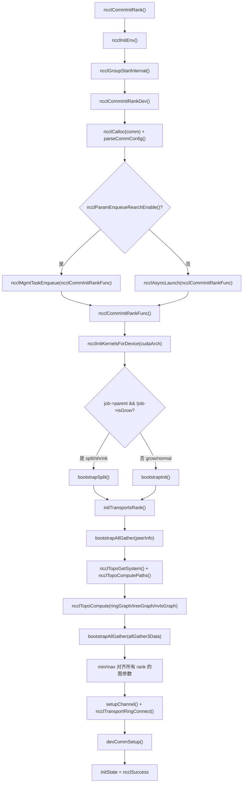
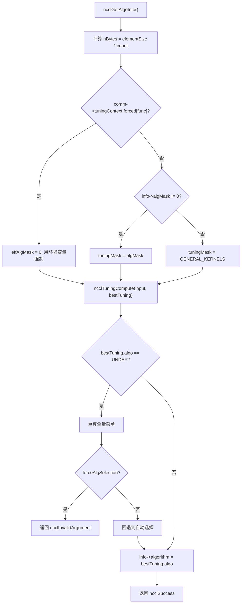
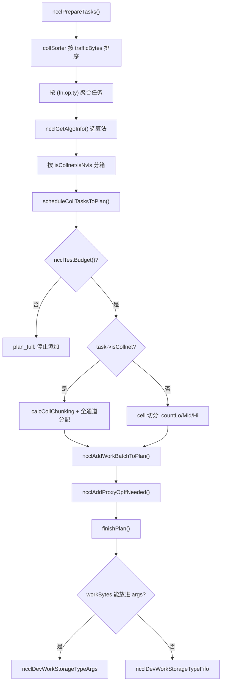

# 제 25 장: 전경 회고와 사고: 하나의 AllReduce 궁극의 여정과 설계 정수

# 제25장: 전경 회고와 사고: 하나의 AllReduce 궁극의 여정과 설계 정수

이전 장에서 우리는 소스 코드 속 진화의 흔적을 바탕으로 NCCL이 고정 집합 연산에서 프로그래밍 가능한 것으로, host proxy에서 GPU 직접 전송으로, 등록 버퍼에서 대칭 메모리로 나아가는 아키텍처 트렌드를 전망했다. 이제 이러한 트렌드를 구체적인 실행 흐름 속에 다시 넣어 검증할 때이다. 이 장은 새로운 코드를 도입하지 않고, 제3장부터 제10장까지의 엔드투엔드 경로를 다시 연결한다—— ncclAllReduce 한 줄 호출에서 시작해 결과가 비디오 메모리에 기록될 때까지. 읽고 나면 당신은 명확히 답할 수 있어야 한다: AllReduce 한 번은 도대체 어떤 함수들을 거치는가? 각 함수는 어느 파일, 어느 줄에 있는가? 문제가 생기면 어느 장을 펼쳐야 하는가?

# 一、초기화: 통신 도메인은 어떻게 "자라나는가"

## 직관적 모델

통신 도메인을 "단체 채팅방"이라고 상상해 보자. 당신이`ncclCommInitRank`을 호출하는 것은 "단체 채팅방 가입 신청"이며, NCCL은 이때 그룹 멤버 명단(peerInfo), 누가 누구와 어느 선으로 연결되는지(토폴로지 그래프), 각 선에 몇 개의 파이프라인(channel)을 열지 전부 확정해야 한다.**만약 이 단계가 틀리면, 이후 모든 통신이 틀린다**——마치 단체 채팅방에 누군가 초대되지 않았다면, 당신이 보낸 메시지는 영원히 한 사람이 덜 받는 것과 같다.

## 데이터 구조와 메모리 레이아웃

통신 도메인의 핵심 구조는`ncclComm`이며, 그 초기화는 두 단계로 나뉜다:`commAlloc`은 "골격 할당"을 담당하고,`initTransportsRank`은 "살점 채우기"를 담당한다.

`commAlloc`에서 가장 주목할 만한 것은**공유 자원 참조 카운트**설계이다. 하위 통신 도메인(split/shrink로 생성)이 부모 통신 도메인 자원을 재사용할 때, 복사본을 만드는 것이 아니라 동일한`ncclSharedResources`을 공유하고 참조 카운트를 증가시킨다:

[FACT:src/init.cc:533-555]

```cpp
if (parent == NULL || !parent->shareResources) {
    struct ncclSharedResources* sharedRes;
    NEW_NOTHROW(sharedRes, ncclSharedResources);
    sharedRes->owner = comm;
    ...
    comm->sharedRes = sharedRes;
    sharedRes->refCount = 1;
    NCCLCHECK(ncclNetInit(comm));
    NCCLCHECK(ncclRmaInit(comm));
    NCCLCHECK(ncclGinInit(comm));
} else {
    comm->sharedRes = parent->sharedRes;
    ncclAtomicRefCountIncrement(&parent->sharedRes->refCount);
    NCCLCHECK(ncclNetInitFromParent(comm, parent));
    NCCLCHECK(ncclRmaInitFromParent(comm, parent));
}
```

이 코드의 의도는 매우 명확하다: 네트워크 플러그인, RMA, GIN 같은 "무거운 자원"은 한 번만 초기화되고, 하위 통신 도메인은 직접 빌려 쓴다.`refCount`은 원자적 연산으로 증가시켜 멀티스레드에서 중복 해제되지 않도록 보장한다.

또 다른 핵심 포인트는`commAlloc`에서의**채널 초기화**이다. 모든 채널은 먼저 "미초기화"(`id = -1`)로 표시되고, 이후`setupChannel`이 되어서야 실제로 내용을 채운다:

[FACT:src/init.cc:607-608]

```cpp
// Mark channels as non initialized.
for (int c = 0; c channels[c].id = -1;
```

이`-1`은 센티넬 값이다. 어떤 코드든 미초기화된 채널을 잘못 사용하면,`id == -1`이 즉시 문제를 드러내며, 무작위 메모리를 읽는 일은 없다.

## Step-by-Step: ncclCommInitRank에서 initTransportsRank까지

사용자가`ncclCommInitRank`을 호출한 후, 실제 실행 흐름은 이렇다:

1. `ncclCommInitRank`은 먼저`ncclInitEnv`을 호출해 환경 플러그인을 로드하고, 그다음`ncclGroupStartInternal`을 호출해 group 시맨틱에 들어간다(이는 "한 번의 group에서 여러 통신 도메인 초기화"를 지원하기 위함이다).

2. 이어서`ncclCommInitRankDev`을 호출하는데, 이는 매개변수 검증,`comm`구조 할당, config 파싱을 수행한 뒤**실제 초기화 작업을 비동기 job에 넘긴다**：

[FACT:src/init.cc:2923-2929]

```cpp
if (ncclParamEnqueueRearchEnable()) {
    NCCLCHECKGOTO(ncclMgmtTaskEnqueue((struct ncclAsyncJob*)job, ncclCommInitRankFunc, ncclCommInitJobFree, comm), res, fail);
} else {
    NCCLCHECKGOTO(ncclAsyncLaunch((struct ncclAsyncJob*)job, ncclCommInitRankFunc, NULL, ncclCommInitJobFree, comm), res, fail);
}
```

여기서`ncclParamEnqueueRearchEnable()`분기를 주목하라——이것은 NCCL이 진행 중인 "enqueue 리팩터링"의 흔적이다. 기본적으로`ncclAsyncLaunch`을 타고, 리팩터링을 켜면`ncclMgmtTaskEnqueue`을 탄다. 두 경로 모두 결국`ncclCommInitRankFunc`。

3. `ncclCommInitRankFunc`을 호출한다.

[FACT:src/init.cc:2119-2127]

```cpp
timers[TIMER_INIT_TOTAL] = clockNano();
CUDACHECKGOTO(cudaSetDevice(cudaDev), res, fail);
CUDACHECKGOTO(cudaDeviceGetAttribute(&maxSharedMem, cudaDevAttrMaxSharedMemoryPerBlockOptin, cudaDev), res, fail);
CUDACHECKGOTO(cudaDeviceGetAttribute(&archMajor, cudaDevAttrComputeCapabilityMajor, cudaDev), res, fail);
CUDACHECKGOTO(cudaDeviceGetAttribute(&archMinor, cudaDevAttrComputeCapabilityMinor, cudaDev), res, fail);
cudaArch = 100 * archMajor + 10 * archMinor;

timers[TIMER_INIT_KERNELS] = clockNano();
NCCLCHECKGOTO(ncclInitKernelsForDevice(cudaArch, maxSharedMem, &maxLocalSizeBytes), res, fail);
```

`cudaArch = 100 * archMajor + 10 * archMinor`복사

4. 그런 다음 일반 초기화인지 split/shrink/grow인지에 따라 다른 bootstrap 경로를 탑니다:

[FACT:src/init.cc:2136-2191]

```cpp
if (job->parent && !job->isGrow) {
    // SPLIT/SHRINK: use bootstrapSplit
    ...
    NCCLCHECKGOTO(bootstrapSplit(comm->commHash, comm, job->parent, job->color, job->key, parentRanks), res, fail);
} else {
    // GROW or NORMAL INIT: use bootstrapInit
    ...
    NCCLCHECKGOTO(bootstrapInit(job->nId, (struct ncclBootstrapHandle*)job->commId, comm, job->parent), res, fail);
}
```

5. 마지막으로`initTransportsRank`를 호출합니다. 이것은 전체 초기화에서 가장 무거운 함수입니다(약 800줄). 내부적으로 두 번의 AllGather를 수행합니다:

- **AllGather1**: 교환합니다`ncclPeerInfo`(각 rank의 디바이스 정보, host hash, pid hash, GPU UUID 등):

[FACT:src/init.cc:1236-1239]

```cpp
NCCLCHECKGOTO(ncclCalloc(&comm->peerInfo, nranks + 1), ret, fail); // Extra rank to represent CollNet root
NCCLCHECKGOTO(fillInfo(comm, comm->peerInfo + rank, comm->commHash), ret, fail);
NCCLCHECKGOTO(bootstrapAllGather(comm->bootstrap, comm->peerInfo, sizeof(struct ncclPeerInfo)), ret, fail);
COMPILER_ATOMIC_STORE(&comm->peerInfoValid, true, std::memory_order_release);
```

주의`nranks + 1`이 할당 — 추가된 한 자리는 CollNet root를 위해 사용됩니다.`peerInfoValid`release 시맨틱으로 저장하여, 다른 스레드가 이 플래그를 볼 때 peerInfo의 내용이 이미 가시적임을 보장합니다.

- **AllGather3**: 토폴로지 계산 결과(각 rank가 계산한 ring/tree 구조, 대역폭, 채널 수 등)를 교환한 후, 모든 rank의**최솟값**으로 정렬합니다:

[FACT:src/init.cc:1687-1703]

```cpp
for (int i = 0; i nChannels = std::min(allGather3Data[i].graphInfo[a].nChannels, graphs[a]->nChannels);
        graphs[a]->sameChannels = std::min(allGather3Data[i].graphInfo[a].sameChannels, graphs[a]->sameChannels);
        graphs[a]->bwIntra = std::min(allGather3Data[i].graphInfo[a].bwIntra, graphs[a]->bwIntra);
        graphs[a]->bwInter = std::min(allGather3Data[i].graphInfo[a].bwInter, graphs[a]->bwInter);
        graphs[a]->typeIntra = std::max(allGather3Data[i].graphInfo[a].typeIntra, graphs[a]->typeIntra);
        graphs[a]->typeInter = std::max(allGather3Data[i].graphInfo[a].typeInter, graphs[a]->typeInter);
        graphs[a]->crossNic = std::max(allGather3Data[i].graphInfo[a].crossNic, graphs[a]->crossNic);
    }
    ...
}
```

대역폭은 min, 타입은 max를 취합니다. 이것은 "목통 원리"입니다: 전체 통신 도메인의 성능은 가장 느린 rank에 의해 결정됩니다. 정렬하지 않으면 다른 rank가 서로 다른 알고리즘을 선택하여 통신 데드락이 발생할 수 있습니다.

## 초기화 흐름도



## 설계 고민과 함정

**왜 초기화를 비동기로 해야 하는가?**멀티 rank 초기화는 프로세스 간 동기화(bootstrap)가 필요하기 때문에, 동기 실행하면 호출 스레드가 블로킹됩니다. 비동기화하면 사용자가 group 내에서 여러 통신 도메인을 동시에 초기화하여 병렬로 진행할 수 있습니다.

**함정 포인트**：`initTransportsRank`끝에 intra-node barrier가 있습니다:

[FACT:src/init.cc:1968-1971]

```cpp
/* Local intra-node barrier */
NCCLCHECKGOTO(bootstrapIntraNodeBarrier(comm->bootstrap, comm->localRankToRank, comm->localRank, comm->localRanks, comm->localRankToRank[0]), ret, fail);
```

이 barrier는 같은 머신의 모든 rank가 리소스 할당을 완료해야 계속 진행하도록 보장합니다. 만약 어떤 rank가`devCommSetup`에서 막히면(예: VRAM 부족), 다른 rank들은 여기서 무한 대기합니다. 프로덕션 환경에서 "초기화 hang"을 만나면, 첫 번째로 확인할 것은 특정 rank의`devCommSetup`실패 여부입니다.

# 2. 태스크 인큐: API 호출에서 내부 태스크 객체까지

## 직관적 모델

사용자가`ncclAllReduce`를 호출하는 것은 식당에서 주문하는 것과 같습니다.`ncclEnqueueCheck`는 서빙 직원으로, 당신의 주문을 주방이 이해할 수 있는 "작업 지시서"(`ncclTaskColl`)로 번역하여`comm->planner`라는 "주문 풀"에 넣습니다.**이 계층이 없으면 NCCL은 여러 호출을 하나의 kernel 실행으로 병합할 수 없습니다**—매번 주문할 때마다 개별적으로 불을 켜는 것처럼 효율이 극히 낮습니다.

## 데이터 구조와 메모리 레이아웃

태스크 인큐의 핵심은`ncclKernelPlanner`이며, 이것은`comm->planner`에 붙어 있습니다. 주요 필드는 다음과 같습니다:

- `collSorter`: 트래픽 크기순으로 정렬된 집합 통신 태스크 큐
- `collTaskQueue`: 최종 정렬된 태스크 큐
- `peers[]`: 각 peer의 send/recv 큐(P2P용)
- `wipPlan`: 구축 중인 kernel plan

태스크 객체`ncclTaskColl`의 주요 필드는`collTaskAppend`에서 채워집니다:

[FACT:src/enqueue/enqueue.cc:2800-2847]

```cpp
struct ncclTaskColl* t = ncclMemoryPoolAlloc(&comm->memPool_ncclTaskColl, &comm->memPermanent);
t->func = info->coll;
t->sendbuff = info->sendbuff;
t->recvbuff = info->recvbuff;
t->count = info->count;
t->root = info->root;
t->datatype = info->datatype;
size_t elementSize = ncclTypeSize(t->datatype);
if (t->func == ncclFuncAllGather || t->func == ncclFuncBroadcast) {
    t->count *= elementSize;
    t->datatype = ncclInt8;
    elementSize = 1;
}
t->trafficBytes = t->count * elementSize * ncclFuncTrafficPerByte(t->func, comm->nRanks);
...
t->aggIsolate = ncclCollConfigNeedAggIsolate(&info->collConfig) || info->collConfig.CTAPolicy != comm->config.CTAPolicy;
NCCL_CONFIG_SET(t, minCTAs, ncclParamMinCTAs(), info->collConfig.minCTAs, comm->config.minCTAs, 1, MAXCHANNELS);
NCCL_CONFIG_SET(t, maxCTAs, ncclParamMaxCTAs(), (std::min(info->collConfig.maxCTAs, comm->config.maxCTAs)), comm->config.maxCTAs, 1, MAXCHANNELS);
...
planner->nTasksColl += 1;
ncclTaskCollSorterInsert(&planner->collSorter, t, t->trafficBytes);
```

몇 가지 세부 사항에 주의:

1. **AllGather/Broadcast의 특수 처리**: count에 요소 크기를 곱하고, datatype을`ncclInt8`로 변경합니다. 이 두 연산의 시맨틱은 "바이트를 운반"하는 것이므로 원래 타입을 신경 쓸 필요가 없기 때문입니다.

2. **`trafficBytes`의 계산**：`ncclFuncTrafficPerByte`은 각 바이트가 몇 번 전송되어야 하는지 반환합니다. AllReduce는 2(reduce + broadcast), AllGather는 nRanks를 반환합니다:

[FACT:src/enqueue/enqueue.cc:123-134]

```cpp
static inline int ncclFuncTrafficPerByte(ncclFunc_t func, int nRanks) {
  switch (func) {
  case ncclFuncAllReduce:
    return 2;
  case ncclFuncAllGather:
    return nRanks;
  case ncclFuncReduceScatter:
    return nRanks;
  default:
    return 1;
  }
}
```

3. **`NCCL_CONFIG_SET`매크로**: 이것은 "env > per-call > comm" 3단계 설정 해석입니다. 환경 변수가 최우선이고, 다음은 단일 호출의 config, 마지막은 통신 도메인 수준의 기본값입니다.

## 단계별: ncclAllReduce의 인큐 경로

1. `ncclEnqueueCheck`먼저 통신 도메인 검증과 group 진입을 합니다:

[FACT:src/enqueue/enqueue.cc:3478-3495]

```cpp
ncclResult_t ncclEnqueueCheck(struct ncclInfo* info) {
  ncclResult_t ret = CommCheck(info->comm, info->opName, "comm");
  if (ret != ncclSuccess) return ncclGroupErrCheck(ret);
  if (info->comm->revokedFlag) {
    WARN("%s: communicator was revoked", info->opName);
    return ncclGroupErrCheck(ncclInvalidUsage);
  }
  ...
  NCCLCHECK(ncclGroupStartInternal());
  ret = ncclSuccess;
  int devOld = -1;
  NCCLCHECKGOTO(ncclCommEnsureReady(info->comm), ret, fail);
```

2. 그런 다음`taskAppend`를 호출하며, 이것은 연산 타입에 따라 분기합니다:

[FACT:src/enqueue/enqueue.cc:3337-3348]

```cpp
static ncclResult_t taskAppend(struct ncclComm* comm, struct ncclInfo* info) {
  ncclFunc_t collAPI = info->coll;
  bool hasLaunchCompletionEvent = ncclInfoHasLaunchCompletionEvent(info);

  if (ncclParamEnqueueRearchEnable()) {
    NCCLCHECK(rawTaskAppend(comm, info));
  } else if (info->coll == ncclFuncSend || info->coll == ncclFuncRecv) {
    NCCLCHECK(p2pTaskAppend(comm, info, info->coll, collAPI, (void*)info->recvbuff, info->count, info->datatype, info->root, true));
  } else if (info->coll == ncclFuncPutSignal || info->coll == ncclFuncSignal || info->coll == ncclFuncWaitSignal) {
    NCCLCHECK(rmaTaskAppend(comm, info));
  } else {
    ...
  }
}
```

AllReduce의 경우 마지막`else`분기를 타며, 최종적으로`collTaskAppend`。

3. `collTaskAppend`를 호출하여 태스크를`collSorter`에 삽입하고,`trafficBytes`로 정렬합니다. 정렬의 목적은 스케줄러가 큰 태스크를 우선 처리하여 작은 태스크가 채널 리소스를 파편화하는 것을 방지하기 위함입니다.

## 태스크 인큐 데이터 흐름

```mermaid
flowchart LR
    api["ncclAllReduce()"] --> info["ncclInfo 填充"]
    info --> enq["ncclEnqueueCheck()"]
    enq --> check["CommCheck + ncclCommEnsureReady()"]
    check --> append["taskAppend()"]
    append --> coll["collTaskAppend()"]
    coll --> task["ncclTaskColl 分配"]
    task --> sorter["ncclTaskCollSorterInsert(collSorter)"]
    sorter --> prepare["ncclPrepareTasks()"]
    prepare --> algo["ncclGetAlgoInfo() 选算法"]
    algo --> schedule["scheduleCollTasksToPlan()"]
    schedule --> plan["ncclKernelPlan"]
```



## 설계 고민과 함정

**왜`ncclMemoryPoolAlloc`대신`malloc`？**를 사용하는가? 태스크 객체의 수명이 짧고 할당이 빈번하기 때문입니다. 메모리 풀은 매번`malloc/free`의 시스템 콜 오버헤드를 방지합니다. 주의:`ncclMemoryPoolAlloc`의 두 번째 인자는`&comm->memPermanent`—이는 태스크 객체가 통신 도메인 소멸 시에 일괄 해제되고, 각 태스크별로 개별 해제되지 않음을 의미합니다.

**함정 포인트**：`ncclPrepareTasks`에는 크기가 비슷한(4배 이내) 태스크를 병합하는 "집계" 로직이 있습니다:

[FACT:src/enqueue/enqueue.cc:506-512]

```cpp
// We aggregate operations that are within 4X size of each other.
while (aggEnd != nullptr && aggEnd->trafficBytes trafficBytes && !aggBeg->aggIsolate && !aggEnd->aggIsolate) {
    agg.count += aggEnd->count;
    agg.trafficBytes += aggEnd->trafficBytes;
    aggEnd = aggEnd->next;
}
```

이 집계는 알고리즘 선택을 더 안정적으로 만들기 위함입니다—각 작은 태스크가 개별적으로 알고리즘을 선택하면 서로 다른 알고리즘들이 나와 kernel이 파편화될 수 있습니다. 하지만`aggIsolate`플래그는 집계를 방지하며, "반드시 개별 스케줄링되어야 하는" 태스크(예: per-call config가 있는 것)에 사용됩니다.

# 3. 알고리즘 선택: 비용 모델이 최적해를 고르는 방법

## 직관적 모델

알고리즘 선택은 내비게이션 소프트웨어가 경로를 고르는 것과 같습니다. NCCL의 "비용 모델"(tuning 모듈)은 주어진 메시지 크기와 토폴로지에서 각 알고리즘/프로토콜 조합의 소요 시간을 추정한 후, 가장 빠른 것을 선택합니다.**비용 모델이 없으면 NCCL은 한 가지 알고리즘만 하드코딩할 수밖에 없어, 작은 메시지에서는 대역폭을 낭비하고 큰 메시지에서는 지연을 낭비합니다**。

## 데이터 구조와 메모리 레이아웃

알고리즘 선택의 진입점은`ncclGetAlgoInfo`：

[FACT:src/enqueue/enqueue.cc:2159-2185]

```cpp
ncclResult_t ncclGetAlgoInfo(struct ncclComm* comm, struct ncclTaskColl* info, int collNetSupport, int nvlsSupport,
                             int numPipeOps, ncclSimInfo_t* simInfo) {
  size_t elementSize = ncclTypeSize(info->datatype);
  size_t nBytes = elementSize * ncclFuncMaxSendRecvCount(info->func, comm->nRanks, info->count);
  info->algorithm = NCCL_ALGO_UNDEF;
  info->protocol = NCCL_PROTO_UNDEF;
  struct ncclTuningInput_t input;
  input.comm = comm;
  input.tuningMask = NCCL_TUNING_MASK_GENERAL_KERNELS;
  uint64_t effAlgMask = comm->tuningContext.forced[info->func] ? 0 : info->algMask;
  if (effAlgMask != 0) {
    input.tuningMask = effAlgMask & NCCL_TUNING_MASK_GENERAL_KERNELS;
  }
  input.CTAPolicy = info->CTAPolicy;
  input.func = info->func;
  input.redOp = info->opHost;
  input.devRedOp = info->opDev.op;
  input.datatype = info->datatype;
  input.nBytes = nBytes;
  input.numPipeOps = numPipeOps;
  input.collNetSupport = collNetSupport;
  input.nvlsSupport = nvlsSupport;
  input.count = info->count;
  NCCLCHECK(ncclGetRegBuff(comm, info, &input.regBuff));
  ...
}
```

주의:`effAlgMask`의 로직—환경 변수가 알고리즘을 강제 지정한 경우(`comm->tuningContext.forced[info->func]`가 비영), 사용자의`algMask`를 무시하고 환경 변수를 사용합니다. 이것이 "env > per-call" 우선순위의 구현입니다.

그런 다음`ncclTuningCompute`를 호출하여 최적 결과를 얻습니다:

[FACT:src/enqueue/enqueue.cc:2213-2224]

```cpp
} else {
    NCCLCHECK(ncclTuningCompute(&input, &bestTuning));
}
INFO(NCCL_TUNING, "Best tuning, algorithm, %s, protocol, %s", ncclAlgoToString(bestTuning.algo), ncclProtoToString(bestTuning.proto));
info->algorithm = bestTuning.algo;
info->protocol = bestTuning.proto;
info->nWarps = bestTuning.nWarps;
if (simInfo) simInfo->estimatedTime = bestTuning.timeUs;
TRACE(NCCL_COLL, "%ld Bytes -> Algo %d proto %d time %f", nBytes, info->algorithm, info->protocol, bestTuning.timeUs);
info->nMaxChannels = bestTuning.maxChannels == 0 ? info->nMaxChannels : bestTuning.maxChannels;
```

## Step-by-Step: 한 번의 AllReduce 알고리즘 선택

8카드 단일 머신, 메시지 크기 1MB, AllReduce를 가정:

1. `nBytes = 1MB`，`numPipeOps`은 현재 plan에 이미 존재하는 작업 수입니다.

2. `collNetSupport`과`nvlsSupport`은`ncclGetCollNetSupport`과`ncclNvlsTransportEnabled`에 의해 결정됩니다.

3. `ncclTuningCompute`사용 가능한 모든 (algo, proto) 조합을 순회하며 비용 모델로 시간을 추정합니다.

4. 1MB 단일 머신 시나리오에서는 일반적으로 NVLS 또는 Tree+LL128이 승리합니다.

5. 결과를 다시 씁니다`info->algorithm`、`info->protocol`、`info->nWarps`。

## 알고리즘 선택 결정 다이어그램



## 설계 고찰과 함정

**왜 알고리즘 선택이 "rank 간 정렬"되어야 하는가?**서로 다른 rank가 다른 알고리즘을 선택하면 통신 패턴이 맞지 않아 교착 상태가 발생합니다. 그래서`initTransportsRank`에서 min/max로 모든 그래프 파라미터를 정렬하여 모든 rank의 비용 모델 입력이 일치하도록 보장합니다.

**함정 포인트**：`ncclGetAlgoInfo`에는 "재계산" 로직이 있습니다——사용자가`algMask`을 지정했지만 일치하는 알고리즘이 없으면, 먼저 조용히 전체 메뉴를 재계산한 후 하드 오류인지 소프트 폴백인지 판단합니다:

[FACT:src/enqueue/enqueue.cc:2192-2208]

```cpp
NOWARN(ncclTuningCompute(&input, &bestTuning), NCCL_TUNING);
if (bestTuning.algo == NCCL_ALGO_UNDEF) {
    input.tuningMask = NCCL_TUNING_MASK_GENERAL_KERNELS;
    bestTuning = NCCL_TUNING_RESULT_INIT;
    bestTuning.maxChannels = 0;
    NCCLCHECK(ncclTuningCompute(&input, &bestTuning));
    if (info->forceAlgSelection) {
        WARN("algSelection: no algorithm in the selected set is available for %s", ncclFuncToString(info->func));
        return ncclInvalidArgument;
    }
    INFO(NCCL_TUNING, "algSelection: selected set unavailable for %s; falling back to automatic selection", ncclFuncToString(info->func));
}
```

`NOWARN`매크로가 일시적으로 경고를 억제합니다. "일치하는 알고리즘 없음"은 정상적인 상황일 수 있기 때문입니다(사용자가 선택한 집합이 실제로 사용 불가능할 수 있음).`forceAlgSelection`이 참일 때만 오류를 보고합니다.

# 4. 작업 스케줄링과 kernel plan 구축

## 직관적 모델

작업 스케줄링은 여러 주문을 몇 개의 생산 라인에 할당하는 것과 같습니다.`scheduleCollTasksToPlan`은 각 작업이 몇 개의 채널을 사용하고 각 채널이 얼마나 많은 데이터를 처리할지 결정하며, 최종적으로`ncclKernelPlan`을 생성합니다——이것이 GPU에 전달할 "작업 지시서"입니다.

## 데이터 구조와 메모리 레이아웃

`ncclKernelPlan`의 핵심 필드:

- `channelMask`: 이 plan이 사용하는 채널(비트맵)
- `workBytes`: 모든 work 구조의 총 바이트 수
- `nWorkBatches`: work batch 수
- `kernelArgs`: kernel 시작 파라미터
- `workStorageType`: work 데이터 저장 위치(args/fifo/persistent)

`finishPlan`은 work 데이터의 저장 위치를 결정합니다:

[FACT:src/enqueue/enqueue.cc:244-255]

```cpp
// If we can fit everything into the kernel args we do so.
if (sizeof(ncclDevKernelArgs) + batchBytes + workBytes workArgsBytes) {
    plan->workStorageType = ncclDevWorkStorageTypeArgs;
}
plan->kernelArgsSize = sizeof(struct ncclDevKernelArgs) + batchBytes;
plan->kernelArgsSize += (plan->workStorageType == ncclDevWorkStorageTypeArgs) ? workBytes : 0;
plan->kernelArgsSize = alignUp(plan->kernelArgsSize, 16);
plan->kernelArgs = (struct ncclDevKernelArgs*)ncclMemoryStackAlloc(&comm->memScoped, plan->kernelArgsSize, /*align=*/16);
plan->kernelArgs->comm = comm->devComm;
plan->kernelArgs->channelMask = plan->channelMask;
plan->kernelArgs->workStorageType = plan->workStorageType;
```

세 가지 저장 유형의 트레이드오프:

- **Args**: 가장 빠르지만 kernel 파라미터 크기가 제한됨(일반적으로 4KB)
- **Fifo**: 링 버퍼, 중간 크기에 적합
- **Persistent**: 독립적인 디바이스 메모리 할당, CUDA Graph 시나리오에 적합

## Step-by-Step: scheduleCollTasksToPlan의 채널 할당

1. 먼저 이 plan이 얼마나 많은 작업을 담을 수 있는지 추정:

[FACT:src/enqueue/enqueue.cc:654-687]

```cpp
do {
    size_t workBytes = 0;
    struct ncclTaskColl* task = ncclIntruQueueHead(&planner->collTaskQueue);
    struct ncclWorkList* workNode = ncclIntruQueueHead(&planner->collWorkQueue);
    while (task != nullptr) {
        int nBatches = divUp(nPlanColls, 4); // Rough guess: 4 colls per batch.
        if (!ncclTestBudget(budget, nBatches, workBytes + workNode->size)) goto plan_full;
        bool taskAggIsolate = task->aggIsolate;
        if (taskAggIsolate && nPlanColls > 0) goto plan_full;
        nPlanColls += 1;
        workBytes += workNode->size;
        int kind = 2 * task->isCollnet + task->isNvls;
        trafficBytes[kind] += std::max(MinTrafficPerChannel, task->trafficBytes);
        ...
    }
plan_full:;
} while (0);
```

2. 그런 다음 트래픽에 따라 채널을 작업에 할당합니다. 비 CollNet 작업의 경우 "cell" 단위로 분할:

[FACT:src/enqueue/enqueue.cc:742-759]

```cpp
int trafficPerByte = ncclFuncTrafficPerByte(task->func, comm->nRanks);
if (task->protocol == NCCL_PROTO_LL) trafficPerByte *= 4;
size_t cellSize = divUp(divUp(MinTrafficPerChannel, (size_t)trafficPerByte), 16) * 16;
int elementsPerCell = cellSize / elementSize;
size_t cells = divUp(task->count * elementSize, cellSize);
size_t trafficPerElement = elementSize * trafficPerByte;
size_t trafficPerCell = cellSize * trafficPerByte;
size_t cellsPerChannel = std::min(cells, divUp(trafficPerChannel, trafficPerCell));
size_t cellsLo;
if (channelId + 1 == nMaxChannels[kind]) {
    cellsLo = cells;
} else {
    cellsLo = std::min(cells, divUp((trafficPerChannel - currentTraffic), trafficPerCell));
}
int nMidChannels = (cells - cellsLo) / cellsPerChannel;
size_t cellsHi = (cells - cellsLo) % cellsPerChannel;
int nChannels = (cellsLo != 0 ? 1 : 0) + nMidChannels + (cellsHi != 0 ? 1 : 0);
```

이 코드는 데이터를 "저/중/고" 세 구간으로 나눕니다:`countLo`、`countMid`、`countHi`. 저 구간과 고 구간은 경계 채널이고, 중 구간은 중간 채널입니다. 이렇게 분할하는 이유는 각 채널이 처리하는 데이터량을 최대한 균등하게 하기 위해서입니다.

3. 마지막으로`calcCollChunking`을 호출하여 각 채널의 chunk 크기를 계산합니다:

[FACT:src/enqueue/enqueue.cc:2228-2275]

```cpp
static ncclResult_t calcCollChunking(struct ncclComm* comm, struct ncclTaskColl* info, int nChannels, size_t nBytes,
                                     uint32_t* outChunkSize, uint32_t* outDirectFlags, struct ncclProxyOp* proxyOp) {
  ncclPattern_t pattern;
  size_t grainSize = ncclProtoGrainSize(info->protocol);
  switch (info->func) {
  case ncclFuncAllReduce:
    pattern = info->algorithm == NCCL_ALGO_NVLS           ? ncclPatternNvls :
              info->algorithm == NCCL_ALGO_NVLS_TREE      ? ncclPatternNvlsTree :
              info->algorithm == NCCL_ALGO_COLLNET_DIRECT ? ncclPatternCollnetDirect :
              info->algorithm == NCCL_ALGO_COLLNET_CHAIN  ? ncclPatternCollnetChain :
              info->algorithm == NCCL_ALGO_TREE           ? ncclPatternTreeUpDown :
                                                            ncclPatternRingTwice;
    break;
  ...
  }
  int stepSize = comm->buffSizes[info->protocol] / NCCL_STEPS;
  int chunkSteps = (info->protocol == NCCL_PROTO_SIMPLE && info->algorithm == NCCL_ALGO_RING) ? info->chunkSteps : 1;
  int sliceSteps = (info->protocol == NCCL_PROTO_SIMPLE && info->algorithm == NCCL_ALGO_RING) ? info->sliceSteps : 1;
  int chunkSize = stepSize * chunkSteps;
  if (info->protocol == NCCL_PROTO_LL) chunkSize /= 2;
  if (info->protocol == NCCL_PROTO_LL128) chunkSize = (chunkSize / NCCL_LL128_LINEELEMS) * NCCL_LL128_DATAELEMS;
  ...
}
```

## 스케줄링 흐름도



## 설계 고찰과 함정

**왜 CollNet 작업을 별도로 처리하는가?**CollNet은 네트워크 스위치로 리덕션을 수행하므로 채널 할당 로직이 일반 ring/tree와 완전히 다릅니다. CollNet 작업은 사용 가능한 모든 채널을 직접 점유하는 반면, 일반 작업은 트래픽에 따라 분할해야 합니다.

**함정 포인트**：`ncclTestBudget`의 추정은 대략적인 공식`nBatches = divUp(nPlanColls, 4)`을 사용합니다——매 4개의 집합 연산마다 하나의 batch가 생성된다고 가정합니다. 이 추정은 부정확할 수 있으므로 이후에 정밀 검사가 있습니다:

[FACT:src/enqueue/enqueue.cc:711-714]

```cpp
// Ensure room for worst case of one new batch per channel
if (!ncclTestBudget(budget, plan->nWorkBatches + nChannels, plan->workBytes + workNode->size)) {
    return ncclSuccess;
}
```

정밀 검사가 실패하면 직접 반환하고(오류 보고 없이), 상위 계층이 새 plan을 열도록 합니다.

# 5. Kernel 시작과 디바이스 측 실행

## 직관적 모델

Kernel 시작은 작업 지시서를 공장에 전달하는 것과 같습니다.`ncclLaunchKernel`이`ncclKernelPlan`을 CUDA kernel 시작 파라미터로 변환한 후`cuLaunchKernelEx`을 호출합니다. 디바이스 측 kernel은 작업 지시서를 받은 후 알고리즘에 따라 데이터 이동을 실행합니다.

## 데이터 구조와 메모리 레이아웃

`ncclLaunchKernel`의 핵심 단계:

[FACT:src/enqueue/enqueue.cc:1886-1909]

```cpp
ncclResult_t ncclLaunchKernel(struct ncclComm* comm, struct ncclKernelPlan* plan) {
  ncclResult_t ret = ncclSuccess;
  struct ncclKernelPlanner* planner = &comm->planner;
  int nChannels = countOneBits(plan->channelMask);
  void* sym = plan->kernelFn;
  dim3 grid = {(unsigned)nChannels, 1, 1};
  dim3 block = {(unsigned)plan->threadPerBlock, 1, 1};
  int smem = plan->isSymColl ? plan->kernelDynSmem : ncclShmemDynamicSize(comm->cudaArch);
  cudaStream_t launchStream = planner->streams->stream;
  ...
  void* extra[] = {CU_LAUNCH_PARAM_BUFFER_POINTER, plan->kernelArgs, CU_LAUNCH_PARAM_BUFFER_SIZE, &plan->kernelArgsSize, CU_LAUNCH_PARAM_END};
  ...
  CUfunction fn;
  CUDACHECKGOTO(cudaGetFuncBySymbol(&fn, sym), ret, do_return);
```

주의`grid.x = nChannels`——각 채널당 하나의 block.`block.x = plan->threadPerBlock`——각 block의 스레드 수는 작업에 의해 결정됩니다.

## Step-by-Step: plan에서 kernel 시작까지

1. 먼저`uploadWork`을 호출하여 work 데이터를 대상 위치(args/fifo/persistent)에 씁니다:

[FACT:src/enqueue/enqueue.cc:1365-1407]

```cpp
static ncclResult_t uploadWork(struct ncclComm* comm, struct ncclKernelPlan* plan) {
  if (plan->isSymColl || plan->isCeColl || plan->isRma) return ncclSuccess;
  size_t workBytes = plan->workBytes;
  size_t batchBytes = plan->nWorkBatches * sizeof(struct ncclDevWorkBatch);
  void* fifoBufHost;
  uint32_t fifoCursor, fifoMask;
  switch (plan->workStorageType) {
  case ncclDevWorkStorageTypeArgs:
    plan->kernelArgs->workBuf = nullptr;
    fifoBufHost = (void*)plan->kernelArgs;
    fifoCursor = sizeof(ncclDevKernelArgs) + batchBytes;
    fifoMask = ~0u;
    break;
  case ncclDevWorkStorageTypeFifo:
    fifoBufHost = comm->workFifoBuf;
    fifoCursor = comm->workFifoProduced;
    fifoMask = comm->workFifoBytes - 1;
    NCCLCHECK(waitWorkFifoAvailable(comm, fifoCursor + workBytes));
    plan->kernelArgs->workBuf = comm->workFifoBufDev;
    break;
  ...
  }
}
```

2. 그런 다음 CUDA launch 속성을 구성합니다. sm90+의 경우 cluster 차원을 설정합니다:

[FACT:src/enqueue/enqueue.cc:1929-1936]

```cpp
if (clusterSize) {
    // Grid dimension must be divisible by clusterSize
    if (grid.x % clusterSize) clusterSize = 1;
    launchAttrs[attrs].id = CU_LAUNCH_ATTRIBUTE_CLUSTER_DIMENSION;
    launchAttrs[attrs++].value.clusterDim = {clusterSize, 1, 1};
    launchAttrs[attrs].id = CU_LAUNCH_ATTRIBUTE_CLUSTER_SCHEDULING_POLICY_PREFERENCE;
    launchAttrs[attrs++].value.clusterSchedulingPolicyPreference = CU_CLUSTER_SCHEDULING_POLICY_SPREAD;
}
```

3. 마지막으로`cuLaunchKernelEx`：

[FACT:src/enqueue/enqueue.cc:1992]

```cpp
CUCHECKGOTO(cuLaunchKernelEx(&launchConfig, fn, nullptr, extra), ret, do_return);
```

## 디바이스 측: runRing의 실행

디바이스 측 kernel은 작업 지시서를 받은 후 알고리즘에 따라 해당`RunWorkColl`특수화를 호출합니다. Ring AllReduce를 예로 들면:

[FACT:src/device/all_reduce.h:14-83]

```cpp
template 
__device__ __forceinline__ void runRing(int tid, int nthreads, struct ncclDevWorkColl* work) {
  ncclRing* ring = &ncclShmem.channel.ring;
  int ringIx = ring->index;
  const int nranks = ncclShmem.comm.nRanks;
  ssize_t gridOffset;
  ssize_t channelCount;
  ssize_t chunkCount;
  ncclCollCbdPart(work, ncclShmem.channelId, Proto::Id, sizeof(T), (ssize_t*)nullptr, &gridOffset, &channelCount, &chunkCount);
  const ssize_t loopCount = nranks * chunkCount;
  ...
  Primitives, 1, Proto, 0> prims(tid, nthreads, &ring->prev, &ring->next, work->sendbuff, work->recvbuff, work->redOpArg, 0, 0, 0, work);

  for (ssize_t elemOffset = 0; elemOffset  int { return r - (r >= nranks ? nranks : 0); };

    // step 0: push data to next GPU
    chunk = modRanks(ringIx + nranks - 1);
    chunkOffset = chunk * chunkCount;
    offset = gridOffset + elemOffset + chunkOffset;
    nelem = (int)min(chunkCount, remCount - chunkOffset);
    prims.directSend(offset, offset, nelem);

    // k-2 steps: reduce and copy to next GPU
    for (int j = 2; j >Plan: ncclLaunchPrepare()
    Plan->>Plan: scheduleCollTasksToPlan()
    Plan->>Plan: finishPlan() 分配 kernelArgs
    Host->>Plan: ncclLaunchKernelBefore_NoUncapturedCuda()
    Plan->>Plan: uploadWork() 写 work 数据
    Host->>CUDA: cuLaunchKernelEx(fn, grid, block, smem)
    CUDA->>Kernel: 启动 nChannels 个 block
    Kernel->>Kernel: runRing() 执行 Ring AllReduce
    Host->>Plan: ncclLaunchKernelAfter_NoCuda()
    Plan->>Proxy: hostStreamPlanTask() + uploadProxyOps()
    Proxy->>Proxy: ncclProxyStart() 推进网络 I/O
    Kernel-->>Host: kernel 完成
    Host->>Plan: ncclLaunchFinish()
    Plan->>Plan: reclaimPlan() 释放资源
```

## 설계 고찰과 함정

**왜`cuLaunchKernelEx`대신`cudaLaunchKernel`？**을 사용하는가? launch 속성(cluster 차원, mem sync domain, launch completion event)을 설정해야 하기 때문입니다. 이러한 속성은 CUDA 12.0+에서만 지원됩니다.

**함정 포인트**：`uploadWork`persistent 모드에 대한 처리는 매우 복잡하다 — 이는 메모리 할당, 데이터 복사, 이벤트 기록을 수행해야 하며, CUDA Graph 캡처 모드에서도 올바르게 동작해야 한다:

[FACT:src/enqueue/enqueue.cc:1445-1478]

```cpp
CUDACHECKGOTO(cudaThreadExchangeStreamCaptureMode(&mode), result, fail);
NCCLCHECKGOTO(ncclStrongStreamAcquire(ncclCudaGraphNone(comm->config.graphUsageMode), &comm->sharedRes->deviceStream, /*concurrent=*/false, &deviceStream), result, fail);
if (comm->memPool) {
    CUDACHECKGOTO(cudaMallocAsync(&fifoBufDev, workBytes, comm->memPool, deviceStream), result, fail);
} else {
    CUDACHECKGOTO(cudaMalloc(&fifoBufDev, workBytes), result, fail);
}
plan->workBufPersistent = fifoBufDev;
plan->kernelArgs->workBuf = fifoBufDev;
CUDACHECKGOTO(cudaMemcpyAsync(fifoBufDev, fifoBufHost, workBytes, cudaMemcpyDefault, deviceStream), result, fail);
cudaEvent_t memcpyDone;
CUDACHECKGOTO(cudaEventCreateWithFlags(&memcpyDone, cudaEventDisableTiming), result, fail);
CUDACHECKGOTO(cudaEventRecord(memcpyDone, deviceStream), result, fail);
```

`cudaThreadExchangeStreamCaptureMode`는 캡처 모드에서 임시로 relaxed 모드로 전환하여 메모리 할당을 허용하기 위한 것이다. 복사가 완료되면 이벤트를 기록하고, 이후`ncclCommPollEventCallbacks`를 통해 회수한다.

# 6. 프로덕션 함정 회피 가이드

## 함정 1: 초기화 hang

**현상**：`ncclCommInitRank`이 멈추고 반환되지 않는다.

**排查**:`NCCL_DEBUG=INFO`로그를 보고, 마지막으로 출력된 rank를 찾는다. 모든 rank가 "Init START"를 출력했지만 "Init COMPLETE"가 없다면,`initTransportsRank`에서 멈춘 것이다.

**일반적인 원인**：

- 특정 rank의`devCommSetup`실패 (메모리 부족, CUDA 오류)
- bootstrap 네트워크 불통 (방화벽, 포트 점유)
- rank마다 NCCL 버전 불일치

**소스 코드 근거**：`initTransportsRank`끝의 intra-node barrier는 모든 로컬 rank를 대기한다:

[FACT:src/init.cc:1968-1971]

```cpp
/* Local intra-node barrier */
NCCLCHECKGOTO(bootstrapIntraNodeBarrier(comm->bootstrap, comm->localRankToRank, comm->localRank, comm->localRanks, comm->localRankToRank[0]), ret, fail);
```

## 함정 2: work FIFO 오버플로

**현상**: kernel 시작 후 hang되거나,`ncclInternalError`。

**을(를) 보고한다**：`waitWorkFifoAvailable`원인

[FACT:src/enqueue/enqueue.cc:1333-1349]

```cpp
static ncclResult_t waitWorkFifoAvailable(struct ncclComm* comm, uint32_t desiredProduced) {
  bool hasRoom = (desiredProduced - comm->workFifoConsumed) workFifoBytes;
  if (!hasRoom) {
    while (true) {
      // Check abort flag to break deadlock when abort is signaled
      if (COMPILER_ATOMIC_LOAD(comm->abortFlag, std::memory_order_acquire)) {
        return ncclInternalError;
      }
      NCCLCHECK(ncclCommPollEventCallbacks(comm, /*waitSome=*/true));
      hasRoom = (desiredProduced - comm->workFifoConsumed) workFifoBytes;
      if (hasRoom) break;
      std::this_thread::yield();
    }
  }
  return ncclSuccess;
}
```

복사

**abort flag 검사를 주의하라 — 이것이 유일한 탈출 경로다. abort도 설정되지 않으면 무한 루프에 빠진다.**회피`NCCL_WORK_FIFO_BYTES`:

## 을(를) 늘리거나, 단일 group 내 작업 수를 줄인다.

**함정 3: CUDA Graph 캡처 실패**현상

**: CUDA Graph 캡처 중 NCCL을 호출하면 "operation not permitted" 오류가 발생한다.**원인`cudaMalloc`: 캡처 모드에서는 특정 CUDA 작업(예:`cudaThreadExchangeStreamCaptureMode`)을 수행할 수 없다. NCCL은

**을(를) 사용하여 임시로 모드를 전환하지만, 모든 작업을 우회할 수 있는 것은 아니다.**：`uploadWork`소스 코드 근거

[FACT:src/enqueue/enqueue.cc:1445]

```cpp
CUDACHECKGOTO(cudaThreadExchangeStreamCaptureMode(&mode), result, fail);
```

**복사**회피`NCCL_GRAPH_MIXING_SUPPORT=1`:

# 로 graph 혼합 모드를 활성화하거나, work buffer를 사전 할당한다.

이 장 요약

1. **이 장에서는 AllReduce 한 번의 전체 경로를 다시 살펴보았다:**：`ncclCommInitRank` → `ncclCommInitRankFunc` → `initTransportsRank`초기화

2. **, 통신 도메인 구축, 토폴로지 탐색, 그래프 파라미터 정렬.**：`ncclEnqueueCheck` → `taskAppend` → `collTaskAppend`작업 큐잉`ncclTaskColl`。

3. **, API 호출을**：`ncclGetAlgoInfo` → `ncclTuningCompute`으로 변환

4. **알고리즘 선택**：`ncclPrepareTasks` → `scheduleCollTasksToPlan` → `finishPlan`, 비용 모델로 최적의 (algo, proto)를 선택.`ncclKernelPlan`。

5. **작업 스케줄링**：`ncclLaunchKernel` → `cuLaunchKernelEx`, 작업을 채널에 할당하고

6. **생성**：`runRing` / `runTreeUpDown` / `runNvls`Kernel 시작

# , plan을 CUDA 시작 파라미터로 변환.

디바이스 측 실행`initTransportsRank`, 알고리즘에 따라 데이터 이동 수행.

**이 장 생각해보기와 자가 점검**Q1: 만약`nChannels`、`bwIntra`、`bwInter`에서 AllGather3 이후의 min/max 정렬 로직(L1690-L1698)을 제거하면, 어떤 시나리오에서 통신 교착이 발생하는가? 왜인가?

참고 해석
