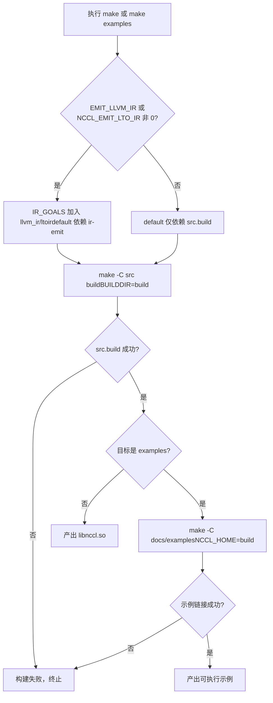
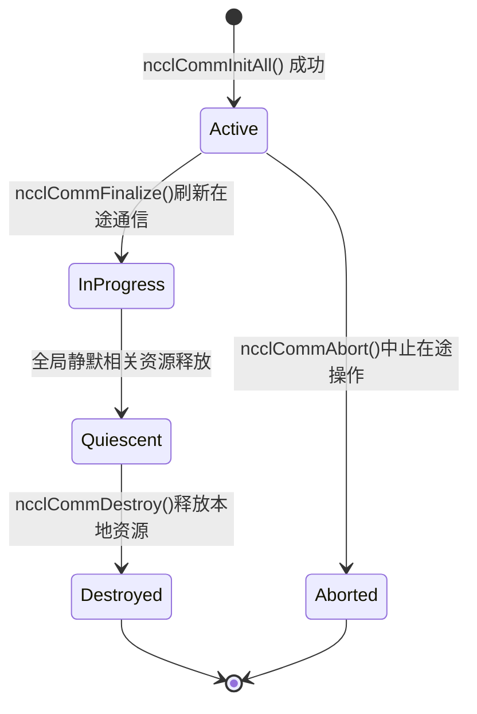

# Capítulo 1: Execução e fenômenos: observando o comportamento externo a partir de um AllReduce

Antes de mergulhar em qualquer código de kernel, vamos primeiro colocar o NCCL em execução e observar o comportamento que ele expõe externamente. Este capítulo não lê o kernel; faz apenas uma coisa: estabelecer um sistema de referência verificável — qualquer análise posterior de mecanismos internos deve, no final, ser capaz de explicar o comportamento externo visto aqui.

# 1.1 Observando a estrutura de engenharia do NCCL a partir do ponto de entrada de build

## Modelo intuitivo

O sistema de build é como a planta de construção de um edifício: ele não decide quem mora nele, mas determina quais salas existem e para onde as portas se abrem. Se o ponto de entrada de build estiver confuso, você não conseguirá nem dar o primeiro passo de "colocar em execução". O NCCL fornece simultaneamente dois pontos de entrada de build, Makefile e CMake; entender suas diferenças é o primeiro passo para compreender a organização de engenharia deste projeto.

## A estrutura dos dois pontos de entrada de build

O nível superior`Makefile`é uma camada de despacho extremamente fina; ele próprio não compila nenhum arquivo-fonte, mas encaminha o trabalho para os Makefiles de cada subdiretório.

[FACT:Makefile:44-45]define`src.%`regras de padrão, encaminhando`src.build`、`src.install`e outros alvos para`src/Makefile`：

```
src.%:
	${MAKE} -C src $* BUILDDIR=${ABSBUILDDIR}
```

[FACT:Makefile:47-48]define`examples`o alvo, que depende de`src.build`e então entra no`docs/examples`diretório para construir os exemplos:

```
examples: src.build
	${MAKE} -C docs/examples NCCL_HOME=${ABSBUILDDIR}
```

Observe a relação de dependência aqui: a construção dos exemplos depende de`src.build`ser concluído primeiro, porque os exemplos precisam linkar a biblioteca NCCL, e a`NCCL_HOME`variável de ambiente passa o diretório de artefatos de build para o Makefile dos exemplos. Esta é a restrição de ordem de build de "primeiro a biblioteca, depois os exemplos".

[FACT:Makefile:29]lista todos os alvos de limpeza possíveis:

```
TARGETS := src pkg nccl4py ir
```

[FACT:Makefile:30]Usando a sintaxe de referência de substituição do GNU Make`${TARGETS:%=%.clean}`para expandir`src pkg nccl4py ir`em`src.clean pkg.clean nccl4py.clean ir.clean`, definindo todos os alvos de limpeza de uma só vez. Esta é uma técnica comum em Makefiles de "regras orientadas por dados" — adicionar um novo módulo requer apenas adicionar uma palavra em`TARGETS`.

## Entrada do CMake: de onde vem o número da versão

A entrada do CMake é muito mais complexa que o Makefile, pois precisa lidar com multiplataforma, detecção de versão do CUDA, seleção de arquitetura, etc. Vamos focar apenas nas partes diretamente relacionadas a "fazer funcionar".

[FACT:CMakeLists.txt:5-11]mostra a origem do número da versão — ele não está codificado diretamente no CMakeLists.txt, mas é lido de`makefiles/version.mk`e extraído com regex:

```cmake
file(READ ${CMAKE_SOURCE_DIR}/makefiles/version.mk VERSION_CONTENT)
string(REGEX REPLACE ".*NCCL_MAJOR[ ]*:=[ ]*([0-9]+).*" "\\1" NCCL_MAJOR "${VERSION_CONTENT}")
...
math(EXPR NCCL_VERSION_CODE "(${NCCL_MAJOR} * 10000) + (${NCCL_MINOR} * 100) + ${NCCL_PATCH}")
```

> **[Design Inference & Architectural Trade-offs]**
> Centralizar o número da versão em`version.mk`permite que os dois sistemas de build, Makefile e CMake, compartilhem a mesma fonte de versão, evitando a armadilha clássica de engenharia de "números de versão inconsistentes entre dois sistemas de build".`NCCL_VERSION_CODE`A fórmula de cálculo de`MAJOR*10000 + MINOR*100 + PATCH`é consistente com a macro`NCCL_VERSION`no arquivo de cabeçalho.

[FACT:CMakeLists.txt:14-20]Injeta esses números de versão através de`add_compile_definitions`em todos os arquivos fonte C++:

```cmake
add_compile_definitions(
    NCCL_USE_CMAKE
    NCCL_MAJOR=${NCCL_MAJOR}
    NCCL_MINOR=${NCCL_MINOR}
    NCCL_PATCH=${NCCL_PATCH}
    NCCL_VERSION_CODE=${NCCL_VERSION_CODE}
)
```

[FACT:CMakeLists.txt:24-25]declara as linguagens do projeto como CUDA, CXX e C:

```cmake
project(NCCL VERSION ${NCCL_MAJOR}.${NCCL_MINOR}.${NCCL_PATCH}
        LANGUAGES CUDA CXX C)
```

## Seleção de arquitetura CUDA: por que o valor padrão é tão complexo

[FACT:CMakeLists.txt:140-171]é um grande bloco de lógica que determina`CMAKE_CUDA_ARCHITECTURES`com base na versão do CUDA. Tomando CUDA 12.8 e superior como exemplo:

```cmake
elseif(${CUDA_MAJOR} EQUAL 12)
    if(${CUDA_MINOR} LESS 8)
        set(CMAKE_CUDA_ARCHITECTURES "50;60;61;70;80;90")
    else()
        set(CMAKE_CUDA_ARCHITECTURES "50;60;61;70;80;90;100;120")
    endif()
```

> **[Design Inference & Architectural Trade-offs]**
> A motivação de design desta lógica é: o PTX de novas arquiteturas (como 100, 120) só é reconhecido por toolchains CUDA mais recentes; se você forçar a especificação de novas arquiteturas em CUDA antigo, a compilação falhará diretamente. Portanto, a lista de arquiteturas padrão deve ser ajustada dinamicamente conforme a versão do CUDA. Para o leitor, isso significa:**Se você não definir explicitamente`CMAKE_CUDA_ARCHITECTURES`, o artefato de compilação incluirá um fatbin com uma longa lista de arquiteturas, e o tempo de compilação aumentará significativamente**. Ambientes de produção geralmente especificam explicitamente a arquitetura alvo para acelerar o build.

## Diagrama de decisão do fluxo de build

A figura abaixo mostra o caminho completo de decisão desde a execução de`make`até a produção de um exemplo executável:



O ponto-chave desta figura é se`IR_GOALS`é não vazio — isso determina se o build padrão aciona adicionalmente a geração de LLVM IR. Para leitores que só querem "fazer funcionar", manter`EMIT_LLVM_IR=0`permite seguir o caminho mais curto.

# 1.2 Pré-requisitos para o programa mínimo executável

## Modelo intuitivo

Escrever um programa NCCL é como organizar uma teleconferência multipartes. Você precisa primeiro confirmar: quantas pessoas participam (número de dispositivos), quem é cada pessoa (rank), e qual linha usar para a chamada (stream). Faltando qualquer um desses, a conferência não acontece. Nesta seção, através do exemplo`01_communicators`, veremos como esses três pré-requisitos aparecem no código.

## Estrutura de dados: três arrays carregam todo o estado

[FACT:docs/examples/01_communicators/01_multiple_devices_single_process/c/main.cc:88-92]define as variáveis centrais do exemplo:

```c
int num_gpus;                 // Number of available CUDA devices
ncclComm_t *comms = NULL;     // Array of NCCL communicators (one per GPU)
cudaStream_t *streams = NULL; // Array of CUDA streams (one per GPU)
int *devices = NULL;          // Array of device IDs to use
```

Aqui se reflete o núcleo do modelo de programação multi-GPU de processo único do NCCL:**um domínio de comunicação, um stream e um número de dispositivo por GPU**. Os três arrays têm comprimento`num_gpus`, e o índice`i`corresponde à`i`-ésima GPU.

`ncclComm_t`é definido no arquivo de cabeçalho como um ponteiro opaco.[FACT:src/nccl.h.in:36]mostra seu tipo real:

```c
typedef struct ncclComm* ncclComm_t;
```

> **[Design Inference & Architectural Trade-offs]**
> "Ponteiro opaco" (opaque pointer) é uma técnica clássica em C para implementar ocultação de informação: o arquivo de cabeçalho expõe apenas o tipo de ponteiro`struct ncclComm*`, o código do usuário não pode acessar os campos internos da estrutura, e todas as operações devem ser feitas através de funções da API. Assim, o NCCL pode modificar livremente o layout interno de`ncclComm`sem quebrar a ABI. Para leitores iniciantes, pode ser entendido como "você recebe um handle de caixa preta, e só pode operá-lo através da interface oficial".

## Passo a passo: da detecção de dispositivos à criação do domínio de comunicação

**Primeiro passo: detectar o número de dispositivos.** [FACT:docs/examples/01_communicators/01_multiple_devices_single_process/c/main.cc:96-104]chama`cudaGetDeviceCount`e verifica se é 0:

```c
CUDACHECK(cudaGetDeviceCount(&num_gpus));

if (num_gpus == 0) {
    fprintf(stderr, "ERROR: No CUDA devices found on this system\n");
    ...
    return 1;
}
```

O que este passo faz: pergunta ao runtime do CUDA "quantas GPUs existem nesta máquina". Se retornar 0, significa que não há dispositivos disponíveis, e o programa sai diretamente — esta é a condição de guarda mais primordial.

**Segundo passo: alocar memória do host e preencher a lista de dispositivos.** [FACT:docs/examples/01_communicators/01_multiple_devices_single_process/c/main.cc:114-121]aloca três arrays e verifica se a alocação foi bem-sucedida:

```c
devices = (int *)malloc(num_gpus * sizeof(int));
comms = (ncclComm_t *)malloc(num_gpus * sizeof(ncclComm_t));
streams = (cudaStream_t *)malloc(num_gpus * sizeof(cudaStream_t));

if (!devices || !comms || !streams) {
    fprintf(stderr, "ERROR: Failed to allocate memory for device arrays\n");
    return 1;
}
```

[FACT:docs/examples/01_communicators/01_multiple_devices_single_process/c/main.cc:126-136]preenche`devices[i] = i`com um loop e imprime as propriedades de cada dispositivo:

```c
for (int i = 0; i >CUDA: cudaGetDeviceCount(&num_gpus)
    CUDA-->>App: num_gpus = N
    loop i in 0..N-1
        App->>CUDA: cudaSetDevice(devices[i])
        App->>CUDA: cudaStreamCreate(&streams[i])
        CUDA-->>App: streams[i]
    end
    App->>NCCL: ncclCommInitAll(comms, N, devices)
    Note over NCCL: 内部为每个设备建立通信域分配 rank 0..N-1
    NCCL-->>App: comms[0..N-1]
    loop i in 0..N-1
        App->>NCCL: ncclCommUserRank(comms[i], &rank)
        NCCL-->>App: rank = i
        App->>NCCL: ncclCommCount(comms[i], &size)
        NCCL-->>App: size = N
    end
```

Este diagrama de sequência revela o ponto-chave:`ncclCommInitAll`é uma**chamada síncrona e bloqueante**, que internamente completa toda a coordenação entre dispositivos, e ao retornar todos os domínios de comunicação já estão prontos.

## Considerações de design: por que ncclCommInitAll é necessário

> **[Design Inference & Architectural Trade-offs]**
> Em cenários multiprocesso, cada processo gerencia apenas uma GPU, usando`ncclCommInitRank`para inicializar individualmente. Mas em cenários de processo único com múltiplas GPUs, se o usuário tiver que chamar manualmente para cada GPU`ncclCommInitRank`, será necessário lidar com "sincronização entre múltiplos ranks" — e em um processo único há apenas uma thread, incapaz de avançar simultaneamente a inicialização de múltiplos ranks, causando deadlock.`ncclCommInitAll`encapsula essa coordenação dentro da biblioteca, usando mecanismos internos (geralmente multithreading ou máquina de estados) para completar a inicialização sincronizada de todos os ranks, expondo ao usuário como uma simples chamada síncrona. Esta é a razão fundamental da existência da "função de conveniência".

# 1.3 Comportamento externo completo de um AllReduce

## Modelo intuitivo

AllReduce é a operação mais comum em comunicação coletiva: cada participante contribui com um dado, e todos recebem a soma de todos os dados. Como calcular a nota total de um trabalho em grupo — cada um informa sua nota, e no final cada um tem em mãos a nota total da turma. Nesta seção rastreamos o`03_collectives/01_allreduce`exemplo, observando o comportamento externo completo de um AllReduce desde a chamada até a verificação do resultado.

## Estruturas de dados: buffers de dados e inicialização

[FACT:docs/examples/03_collectives/01_allreduce/c/main.cc:59-63]define as variáveis principais:

```c
int num_gpus = 0;
ncclComm_t *comms;
cudaStream_t *streams;
float **sendbuff;
float **recvbuff;
```

Observe que`sendbuff`e`recvbuff`são`float**`— ponteiros para arrays de ponteiros. Cada`sendbuff[i]`é o endereço de memória do dispositivo na`i`-ésima GPU.

[FACT:docs/examples/03_collectives/01_allreduce/c/main.cc:99]define a escala dos dados:

```c
const size_t size = 32 * 1024 * 1024; // 32M floats for demonstration
```

32M floats, 4 bytes cada, ou seja, 128 MB de buffer de envio e 128 MB de buffer de recebimento, um de cada por GPU.

[FACT:docs/examples/03_collectives/01_allreduce/c/main.cc:101-120]é o loop de inicialização de cada dispositivo:

```c
for (int i = 0; i  **[Design Inference & Architectural Trade-offs]**
> O conflito central é: a comunicação coletiva exige a participação simultânea de todos os ranks, mas em uma thread única você só pode chamar`ncclAllReduce`um por um. Se a primeira chamada`ncclAllReduce`bloquear esperando os outros ranks, e as chamadas dos outros ranks ainda não foram emitidas, ocorre deadlock. O papel do mecanismo Group é:`ncclGroupStart`todas as chamadas após`ncclGroupEnd`apenas fazem "registro", sem iniciar de fato;

**é quando todas as operações registradas são submetidas juntas, permitindo que avancem concorrentemente. É como pedir comida: primeiro adicionar todos os pratos ao carrinho, e só no final fechar o pedido, em vez de fazer um pedido por prato.** [FACT:docs/examples/03_collectives/01_allreduce/c/main.cc:139-142]：

```c
for (int i = 0; i 首元素=0"]
        r0["recvbuff[0]"]
    end
    subgraph dev1["GPU 1 (rank 1)"]
        s1["sendbuff[1]首元素=1"]
        r1["recvbuff[1]"]
    end
    subgraph dev2["GPU 2 (rank 2)"]
        s2["sendbuff[2]首元素=2"]
        r2["recvbuff[2]"]
    end
    s0 -->|ncclAllReducencclFloat ncclSum| reduce["归约求和0+1+2=3"]
    s1 -->|ncclAllReducencclFloat ncclSum| reduce
    s2 -->|ncclAllReducencclFloat ncclSum| reduce
    reduce -->|广播结果| r0
    reduce -->|广播结果| r1
    reduce -->|广播结果| r2
```

Copiar`recvbuff`Este diagrama mostra as duas fases do AllReduce: primeiro redução (reduce), depois broadcast. O

## de cada rank acaba obtendo o mesmo resultado.

> **[Design Inference & Architectural Trade-offs]**
> 〔Inferência de design e trade-offs arquiteturais〕`ncclGroupStart`/`ncclGroupEnd`Se removermos

```c
for (int i = 0; i  **[Design Inference & Architectural Trade-offs]**
> 〔Inferência de design e trade-offs arquiteturais〕`ncclCommFinalize`Por que a destruição é dividida em duas etapas?**é uma**operação global`ncclCommDestroy`— requer a participação de todos os ranks, garantindo que não haja comunicação em trânsito.**é uma**operação local`ncclCommDestroy`— apenas libera os recursos deste processo, sem bloquear. Este design desacopla "esperar todos os ranks ficarem silenciosos" de "liberar recursos locais": o primeiro pode demorar mais (esperando o par de rede), o segundo é puramente local. Se houvesse apenas um

## , ele teria que assumir ambas as responsabilidades, ou bloqueando demais, ou sem garantir o silêncio global.

[FACT:docs/examples/01_communicators/01_multiple_devices_single_process/c/main.cc:221-249]A cadeia completa da ordem de destruição[FACT:docs/examples/01_communicators/01_multiple_devices_single_process/c/main.cc:218-219]mostra a ordem completa de limpeza, e o comentário

```c
// IMPORTANT: Proper cleanup is critical for NCCL applications
// Resources must be cleaned up in the correct order to avoid issues
```

Copiar

A ordem é:[FACT:docs/examples/01_communicators/01_multiple_devices_single_process/c/main.cc:224-227]）

2. Finalizar + Destruir domínio de comunicação ([FACT:docs/examples/01_communicators/01_multiple_devices_single_process/c/main.cc:233-240]）

3. Destruir CUDA stream ([FACT:docs/examples/01_communicators/01_multiple_devices_single_process/c/main.cc:246-249]）

4. Liberar memória do host ([FACT:docs/examples/01_communicators/01_multiple_devices_single_process/c/main.cc:253-255]）

## Máquina de estados do domínio de comunicação

`ncclCommFinalize`A documentação de menciona explicitamente transições de estado, o que atende aos critérios de admissão para uma máquina de estados:



A transição chave desta máquina de estados é`InProgress -> Quiescent`: ela é acionada pelo evento de "silêncio global", e não diretamente por uma chamada de função. Isso significa que`ncclCommFinalize`após retornar, o domínio de comunicação pode ainda estar no estado`InProgress`, sendo necessário fazer polling em`ncclCommGetAsyncError`para saber quando entra em`Quiescent`。

## Reflexão de design: por que a ordem de destruição não pode ser invertida

> **[Design Inference & Architectural Trade-offs]**
> Se o CUDA stream for destruído antes do domínio de comunicação, que problema ocorreria? O domínio de comunicação pode manter internamente uma referência ao stream (por exemplo, para notificação de conclusão de operações assíncronas). Se o stream for destruído primeiro, o domínio de comunicação acessará um stream já destruído durante o Finalize, causando comportamento indefinido. Da mesma forma, se a memória do host for liberada primeiro (`comms`array) antes de destruir o domínio de comunicação,`ncclCommDestroy`obtém um ponteiro selvagem. É por isso que a ordem deve ser "sincronizar primeiro, depois destruir o domínio de comunicação, depois destruir o stream, e por fim liberar a memória do host" —**as relações de dependência determinam que a ordem de destruição deve ser inversa à ordem de criação**。

# 1.5 Guia de prevenção de armadilhas em produção

## Armadilha 1: esquecer o Group causa deadlock

Esta é a armadilha mais comum para iniciantes. Em cenários de múltiplas GPUs em um único processo, se chamar diretamente em loop`ncclAllReduce`sem adicionar Group, o programa entrará em deadlock na primeira chamada. Os sintomas são: o programa trava, o uso de CPU fica próximo de 0 e não há nenhuma saída.

Método de diagnóstico: usar`gdb`attach ao processo e verificar se a pilha está parada na lógica de espera interna do NCCL. Se estiver, verifique se`ncclGroupStart`/`ncclGroupEnd`。

## Armadilha 2: esquecer de sincronizar o stream antes de ler o resultado

[FACT:src/nccl.h.in:854-856]afirma explicitamente que`ncclGroupEnd`garante apenas o enfileiramento, não a conclusão. Se omitir[FACT:docs/examples/03_collectives/01_allreduce/c/main.cc:139-142]a sincronização de stream e ler diretamente`recvbuff`, lerá dados incompletos.

Os sintomas são: resultados ora corretos, ora errados, ou leitura de tudo 0. Isso ocorre porque`cudaMemcpy`é síncrono por padrão, mas sincroniza**o stream atual**, enquanto o AllReduce pode ser executado em outro stream. Método de diagnóstico: adicionar`cudaStreamSynchronize`antes de ler o resultado; se o problema desaparecer, é esta armadilha.

## Armadilha 3: ordem de destruição incorreta causa segmentation fault

Se antes de`ncclCommDestroy`for feito`cudaFree`em`sendbuff`/`recvbuff`, o domínio de comunicação pode ainda estar acessando esses buffers durante o Finalize, causando segmentation fault ou corrupção de dados.

Os sintomas são: o programa trava na fase de encerramento, ou ocasionalmente lê dados inválidos. Método de diagnóstico: verifique a ordem do código de limpeza, garantindo que a destruição do domínio de comunicação ocorra antes da liberação de todos os recursos CUDA.

## Armadilha 4: confundir número do dispositivo com rank

[FACT:docs/examples/01_communicators/01_multiple_devices_single_process/c/main.cc:198-200]Há uma validação:

```c
if (device != devices[i]) {
    printf(" [WARNING: Expected device %d]", devices[i]);
}
```

> **[Design Inference & Architectural Trade-offs]**
> rank e device são dois conceitos diferentes. rank é o número lógico dentro do domínio de comunicação (0 a nRanks-1), device é o número físico da GPU. No uso padrão de`ncclCommInitAll`,`devices[i] = i`, então rank e device coincidem. Mas se passar um`devlist`personalizado (por exemplo`{2, 0, 1}`), rank 0 corresponderá ao device 2. Confundir esses dois conceitos fará com que os dados sejam enviados para a GPU errada.

# Resumo do capítulo

Neste capítulo concluímos três coisas:

1. **Ponto de entrada de build**: entendemos o mecanismo de encaminhamento do Makefile e a origem do número de versão no CMake, além da lógica de seleção de arquitetura CUDA. A conclusão principal é que`make examples`primeiro compila a biblioteca e depois os exemplos,`NCCL_HOME`passando o diretório de artefatos de build para os exemplos.

2. **Os três elementos de um programa mínimo executável**: número de dispositivos (`cudaGetDeviceCount`), rank (atribuído automaticamente por`ncclCommInitAll`), stream (um por GPU).`ncclCommInitAll`é o ponto de entrada conveniente para múltiplas GPUs em um único processo; ele encapsula a inicialização sincronizada de múltiplos ranks dentro da biblioteca.

3. **O comportamento externo completo de um AllReduce**: de`ncclGroupStart`envolvendo múltiplas`ncclAllReduce`chamadas, até`ncclGroupEnd`submissão, depois`cudaStreamSynchronize`aguardar conclusão, e por fim validar o resultado. O mecanismo de Group é a chave para evitar deadlock em cenários de múltiplas GPUs com uma única thread.

4. **Ciclo de vida do domínio de comunicação**：`ncclCommFinalize`(silêncio global) +`ncclCommDestroy`(liberação local) em duas fases de destruição, e a restrição de ordem "sincronizar primeiro, depois destruir o domínio de comunicação, depois destruir o stream, e por fim liberar a memória do host".

# Reflexões e autoavaliação deste capítulo

Q1: Se remover[FACT:docs/examples/03_collectives/01_allreduce/c/main.cc:130-136]ncclGroupStart/ncclGroupEnd e mudar para chamar ncclAllReduce diretamente em loop, o que acontecerá em cenários de múltiplas GPUs em um único processo? Por quê?

**Análise de referência**: ocorrerá deadlock. O arquivo de cabeçalho[FACT:src/nccl.h.in:844-864]explica o motivo: chamadas de comunicação coletiva podem executar sincronização inter-CPU, exigindo a participação simultânea de todos os ranks. Em uma única thread, na primeira iteração do loop ao chamar`ncclAllReduce(comms[0], ...)`, o NCCL precisa esperar que outros ranks também iniciem o AllReduce para avançar. Mas as chamadas dos outros ranks ainda não foram executadas no loop (porque a thread atual está bloqueada na primeira chamada), então a primeira chamada nunca esperará pelos outros ranks, resultando em deadlock.

O papel do mecanismo de Group é separar "iniciar" e "executar":`ncclGroupStart`após isso, todas as chamadas apenas registram,`ncclGroupEnd`só então submete todas as operações registradas juntas, permitindo que avancem concorrentemente. Isso evita fundamentalmente o deadlock em thread única.

Método de verificação: remover o Group e executar o programa, usar`gdb`attach e observe a pilha, ele irá parar na lógica de espera interna do NCCL, com o uso de CPU próximo de 0.

Q2: [FACT:docs/examples/03_collectives/01_allreduce/c/main.cc:139-142]O cudaStreamSynchronize pode ser substituído por cudaDeviceSynchronize? Qual é a diferença semântica entre os dois? Em quais cenários essa substituição causaria problemas?

**Análise de referência**: Pode-se usar`cudaDeviceSynchronize`como substituto, mas a semântica é diferente.`cudaStreamSynchronize(streams[i])`aguarda apenas a conclusão das operações na stream especificada;`cudaDeviceSynchronize`aguarda a conclusão das operações de**todas**as streams no dispositivo atual.

Em cenários de processo único com múltiplas GPUs,`cudaDeviceSynchronize`sincroniza apenas o dispositivo atual (determinado por`cudaSetDevice`), portanto é necessário usá-lo em conjunto com um loop de`cudaSetDevice(i)`. Se`cudaSetDevice`，`cudaDeviceSynchronize`for omitido, apenas o dispositivo padrão (geralmente device 0) será sincronizado, e o AllReduce de outros dispositivos pode ainda não ter sido concluído.

O cabeçalho[FACT:src/nccl.h.in:854-856]enfatiza que`ncclGroupEnd`garante apenas o enfileiramento, não a conclusão, portanto a sincronização é obrigatória. Usar`cudaStreamSynchronize`é mais preciso, pois aguarda apenas as streams relevantes, sem esperar erroneamente por operações irrelevantes. O problema de usar`cudaDeviceSynchronize`é: se houver outros kernels de longa duração irrelevantes no dispositivo, eles serão aguardados erroneamente, reduzindo o desempenho.

Q3: [FACT:docs/examples/01_communicators/01_multiple_devices_single_process/c/main.cc:233-240]A ordem de destruição de

**é "primeiro Finalize de todos os domínios de comunicação, depois Destroy de todos os domínios de comunicação". Se fosse alterado para "para cada domínio de comunicação, primeiro Finalize e depois Destroy" (ou seja, completar as duas operações em um único loop), quais seriam os problemas?**Análise de referência

```c
ncclGroupStart();
for (i) ncclCommFinalize(comms[i]);
ncclGroupEnd();
for (i) ncclCommDestroy(comms[i]);
```

`ncclCommFinalize`Copiar

```c
for (i) {
    ncclCommFinalize(comms[i]);
    ncclCommDestroy(comms[i]);
}
```

Copiar`ncclCommFinalize(comms[0])`O

da primeira iteração bloquearia aguardando que todos os ranks fiquem silenciosos, mas o Finalize dos outros domínios de comunicação ainda não foi iniciado, causando deadlock — este é o mesmo tipo de problema do deadlock da Q1.[FACT:src/nccl.h.in:309-309]Além disso, o cabeçalho`ncclCommFinalize`indica que`ncclInProgress`ao retornar, o domínio de comunicação pode ainda estar no estado`ncclSuccess`, sendo necessário aguardar o silêncio global para entrar em`ncclCommDestroy`. Se`ncclCommGetAsyncError`for chamado imediatamente em seguida, os recursos locais podem ser liberados antes que o domínio de comunicação esteja completamente silencioso, causando comportamento indefinido. A abordagem correta é, após o Finalize, fazer polling de

para confirmar o estado, e então Destroy.
