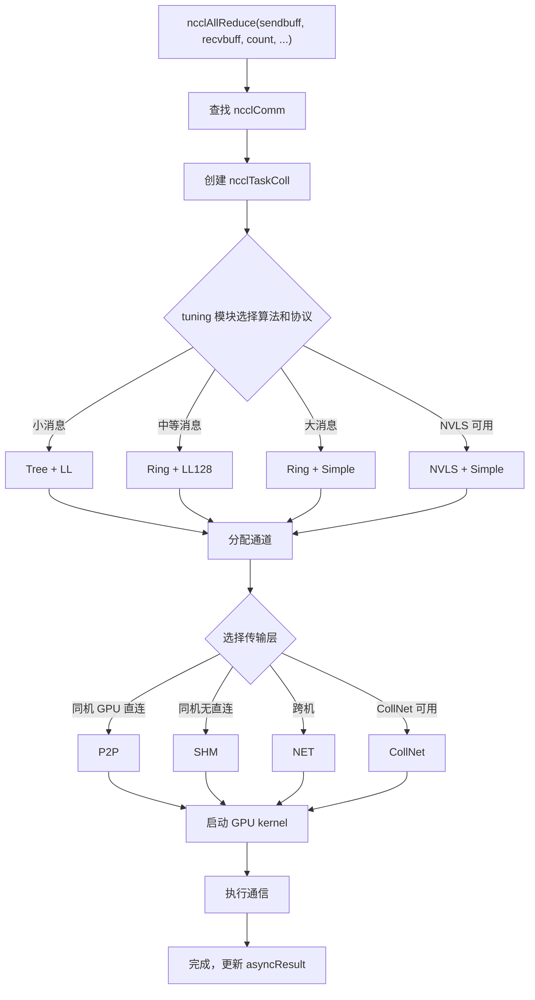

# Próximo capítulo: Capítulo 2 →

# Progresso do livro: Capítulo 2 / 25

Capítulo 2: Modelo de abstração central: operadores de comunicação, topologia, algoritmo, protocolo e camada de transporte

# No capítulo anterior, fizemos o NCCL rodar e observamos o comportamento externo das três APIs ncclCommInitRank, ncclAllReduce e ncclCommDestroy. Mas o comportamento externo é apenas a ponta do iceberg — quando ncclAllReduce retorna, o que exatamente aconteceu na GPU? Por qual caminho os dados passaram? Por que o mesmo AllReduce tem diferenças enormes de desempenho em máquinas diferentes? Para responder a essas perguntas, é necessário primeiro estabelecer o vocabulário comum do NCCL. Este capítulo desmontará um a um os cinco conceitos centrais: domínio de comunicação (ncclComm), canal (channel), algoritmo (algorithm), protocolo (protocol) e camada de transporte (transport). Esses cinco conceitos permeiam todo o livro, e a análise de cada capítulo subsequente os utilizará. Entender as relações entre eles é entender o esqueleto do NCCL.

## 2.1 Domínio de comunicação ncclComm: o contexto de comunicação de um processo

Modelo intuitivo`ncclComm`Imagine`nRanks`como um "grupo de chat": cada processo, ao entrar no grupo, recebe um ID do grupo, e depois todas as mensagens são enviadas nesse grupo. Quantas pessoas há no grupo (`rank`), quem sou eu (`channels`), qual rota seguir (`config`), quais regras usar (

), tudo isso fica registrado nesse objeto de grupo de chat.`ncclComm`Sem

## , o NCCL não saberia "quem se comunica com quem" nem "para onde os dados vão" — cada chamada de API teria que renegociar a lista de ranks e reconstruir conexões, com um custo insuportável.

`ncclComm`Estrutura de dados e layout de memória`src/include/comm.h`é a estrutura mais central de todo o NCCL, definida em

**. Ela é extremamente grande (quase 300 linhas); vamos agrupar os campos-chave por função.**

[FACT:src/include/comm.h:576-580]Identidade e sentinelas de ciclo de vida`startMagic`，[FACT:src/include/comm.h:879-881]define`endMagic`define[FACT:src/include/comm.h:883-885]. Esses dois campos não são chaves de segurança, mas sentinelas de detecção de estouro de memória. Em`static_assert`：

```c
static_assert(offsetof(struct ncclComm, startMagic) == 0, "startMagic must be the first field of ncclComm");
static_assert(offsetof(struct ncclComm, endMagic) == sizeof(struct ncclComm) - sizeof(uint64_t),
              "endMagic must be the last field of ncclComm");
```

> **[Design Inference & Architectural Trade-offs]**
> 〔Inferência de design e trade-offs arquiteturais〕`startMagic`Essas duas asserções forçam em tempo de compilação que`endMagic`esteja no endereço inicial da estrutura e`ncclComm`no final. Em tempo de execução, é possível verificar rapidamente se o ponteiro

**é válido checando se esses dois números mágicos foram adulterados — isso é muito útil para depurar bugs do tipo "ponteiro selvagem acessando domínio de comunicação já destruído" em ambientes multithread.**

[FACT:src/include/comm.h:628-629]Rank e informações de topologia`rank`define`nRanks`e[FACT:src/include/comm.h:644-652]— meu número no domínio de comunicação e o número total de participantes.`node`define os campos relacionados ao nó:`nNodes`(número do nó onde estou),`localRank`(número total de nós),`localRanks`(número dentro do nó),`rankToNode`、`rankToLocalRank`、`localRankToRank`。

> **[Design Inference & Architectural Trade-offs]**
> Essas três tabelas de mapeamento são a base dos algoritmos com reconhecimento de topologia. Por exemplo, o algoritmo Ring precisa saber se "meu próximo rank está no mesmo nó" para decidir se usa NVLink ou a rede. Sem essas tabelas de mapeamento, cada seleção de algoritmo teria que consultar novamente o grafo de topologia, com um custo enorme.

**Canais e buffers**

[FACT:src/include/comm.h:593-593]define`channels[MAXCHANNELS]`— este é o array de todos os canais dentro do domínio de comunicação.[FACT:src/include/comm.h:674-676]define a quantidade de canais:`nChannels`(número de canais de conexão),`collChannels`(número de canais de enfileiramento de comunicação coletiva),`nvlsChannels`(número de canais NVLS).

[FACT:src/include/comm.h:691-693]define o tamanho dos buffers:`buffSizes[NCCL_NUM_PROTOCOLS]`(tamanho do buffer de cada protocolo),`p2pChunkSize`(tamanho do bloco P2P),`nvlsChunkSize`(tamanho do bloco NVLS).

> **[Design Inference & Architectural Trade-offs]**
> `buffSizes`O índice do array é o valor do enum de protocolo (LL/LL128/Simple), o que significa que cada protocolo tem uma configuração independente de tamanho de buffer. O protocolo LL precisa de buffers pequenos para reduzir a latência, e o protocolo Simple precisa de buffers grandes para aumentar a largura de banda — esse array permite que as duas necessidades coexistam.

**Fila de trabalho e FIFO**

[FACT:src/include/comm.h:719-728]define os campos relacionados à FIFO de trabalho:`workFifoBytes`(tamanho da FIFO, potência de 2),`workFifoBuf`(buffer da FIFO no lado do host),`workFifoBufDev`(buffer da FIFO no lado do dispositivo),`workFifoProduced`(bytes produzidos),`workFifoConsumed`(bytes consumidos).

> **[Design Inference & Architectural Trade-offs]**
> Este é um típico buffer circular produtor-consumidor. O lado do host (produtor) escreve descritores de trabalho na FIFO, e o kernel da GPU (consumidor) lê e executa.`workFifoBytes`deve ser uma potência de 2, para que seja possível usar máscara de bits em vez de operação de módulo, acelerando o cálculo de índices.

**Barreira de sincronização intraprocesso**

[FACT:src/include/comm.h:731-731]define o mecanismo de sincronização de múltiplos domínios de comunicação dentro do processo:

```c
struct ncclComm* intraComm0; // leader of intra-process comms (self possible)
struct ncclComm* intraNext; // next of intra-process comms, intraComm0 is head
int intraRank;
int intraRanks;
uint32_t intraBarrierPhase;
char intraPad1[64 - sizeof(uint64_t)];
uint64_t intraBarrierCounter; // only used if this is intraComm0
char intraPad2[64 - sizeof(uint64_t)];
uint64_t intraBarrierGate; // only used if this is intraComm0
```

Observe`intraPad1`e`intraPad2`o tamanho é`64 - sizeof(uint64_t)`, ou seja, 56 bytes. Somando aos campos anteriores`uint64_t`, cada grupo de campos ocupa exatamente 64 bytes — isto é uma linha de cache (Cache Line).

> **[Design Inference & Architectural Trade-offs]**
> Esta é a típica**técnica de preenchimento de linha de cache (Cache Line Padding)**.`intraBarrierCounter`e`intraBarrierGate`são lidos e escritos com alta frequência por várias threads; se compartilharem a mesma linha de cache, isso causará**falso compartilhamento (False Sharing)**: uma thread modifica`intraBarrierCounter`e invalida o cache de`intraBarrierGate`de outra thread, causando queda acentuada de desempenho. Usar 56 bytes de preenchimento para separá-los em linhas de cache diferentes é uma técnica padrão de programação concorrente de alto desempenho.

**Estado de erro assíncrono**

[FACT:src/include/comm.h:705-705]define`asyncResult`— este campo registra o estado das operações assíncronas do domínio de comunicação. No capítulo anterior mencionamos que`ncclCommFinalize`ao retornar, o domínio de comunicação ainda pode estar no estado`ncclInProgress`, e isso é rastreado por meio deste campo.

## Walkthrough orientado por cenário: de ncclCommInitRank ao preenchimento da struct

Quando o usuário chama`ncclCommInitRank(&comm, nranks, commId, rank)`, internamente o NCCL aloca uma`ncclComm`struct e preenche campo por campo. Vamos acompanhar esse fluxo para ver como os campos-chave são definidos:

**Primeiro passo: alocação e zeragem**

O NCCL usa`ncclCalloc`para alocar`ncclComm`, garantindo que todos os campos comecem em 0. Nesse momento,`startMagic`e`endMagic`são definidos como`NCCL_MAGIC`（[FACT:src/include/comm.h:563-569]definido como`0x0280028002800280`, e o comentário diz "Nickel atomic number is 28").

**Segundo passo: preenchimento das informações de identidade**

`rank`、`nRanks`、`cudaDev`obtido a partir dos parâmetros e da API CUDA.`commHash`é obtido por hash de`ncclCommId`, usado para verificação de consistência em comunicações de rede posteriores.

**Terceiro passo: construção do grafo de topologia**

O NCCL chama o módulo de detecção de topologia para enumerar todas as GPUs, placas de rede e switches PCI, construindo o campo`topo`([FACT:src/include/comm.h:595-595]). Esse grafo de topologia determina a seleção posterior de algoritmos e o planejamento de rotas.

**Quarto passo: inicialização dos canais**

`channels[MAXCHANNELS]`O array é inicializado um por um. O`id`de cada canal é definido como o índice do array,`peers`e os ponteiros`devPeers`são alocados.

**Quinto passo: estabelecimento das conexões de transporte**

Com base no grafo de topologia, o NCCL escolhe a camada de transporte (P2P/SHM/NET) para cada par de ranks e chama os callbacks correspondentes`setup`e`connect`. As informações de conexão são armazenadas em`channels[i].peers[j]`.

**Sexto passo: definição do número mágico**

Por fim,`endMagic`é definido como`NCCL_MAGIC`, marcando a conclusão da inicialização da struct.

## Reflexões de design e armadilhas em produção

**Por que`ncclComm`é tão grande?**

> **[Design Inference & Architectural Trade-offs]**
> `ncclComm`contém quase 300 campos, porque carrega todo o estado de um domínio de comunicação. A filosofia de design do NCCL é "inicializar uma vez, reutilizar muitas vezes" — na inicialização, todas as informações que podem ser usadas são calculadas e armazenadas, e em tempo de execução consulta-se diretamente a tabela, evitando recálculo. O custo é um uso de memória relativamente maior (cerca de alguns KB por domínio de comunicação), mas comparado à memória da GPU e à largura de banda de rede, essa memória é insignificante.

**Armadilha 1: compartilhamento de domínio de comunicação entre múltiplas threads**

> **[Design Inference & Architectural Trade-offs]**
> `ncclComm`não é thread-safe. Se duas threads chamarem simultaneamente`ncclComm`no mesmo`ncclAllReduce`，`workFifoProduced`, campos como

**sofrerão disputa, causando corrupção de dados. A prática correta é cada thread usar um domínio de comunicação independente, ou serializar as chamadas com um lock externo.**

`ncclCommDestroy`Armadilha 2: acesso após destruição`startMagic`Depois que`endMagic`libera a memória da struct, se alguma thread ainda mantiver o ponteiro e acessá-lo, lerá memória já liberada.

**e**

podem ajudar a detectar essa situação — se o número mágico não corresponder, significa que o ponteiro já é inválido.`intraBarrierCounter`Armadilha 3: falso compartilhamento de linha de cache`intraBarrierGate`Em cenários com múltiplos processos (um rank por processo), o preenchimento de

# e

## é especialmente importante. Se o preenchimento for omitido, as operações de barreira de vários processos interferirão entre si, fazendo a latência de sincronização subir de nanossegundos para microssegundos.

2.2 Canal channel: dividir uma comunicação em várias pipelines`channel`É a "esteira transportadora" do NCCL — divide os dados de uma comunicação coletiva em várias partes, cada canal transporta uma parte de forma independente, avançando em paralelo para melhorar a utilização da largura de banda.

Sem channels, todos os dados só podem seguir um único caminho, os múltiplos links físicos entre GPUs (múltiplas placas de rede, múltiplos grupos de NVLink) não podem ser utilizados simultaneamente, e a utilização da largura de banda cairia drasticamente.

## Estrutura de dados e layout de memória

`ncclChannel`Definido em[FACT:src/include/comm.h:169-191]：

```c
struct ncclChannel {
  struct ncclChannelPeer** peers;
  struct ncclDevChannelPeer** devPeers;
  /* devPeer pointer array used for host side access */
  struct ncclDevChannelPeer** devPeersHostPtr;
  struct ncclRing ring;
  int* devRingUserRanks;
  struct ncclTree tree;

  struct ncclTree collnetChain;
  struct ncclDirect collnetDirect;

  struct ncclNvls nvls;

  int id; // index of this channel
  uint32_t workFifoProduced; // +1 successor of last used work fifo byte

  /* comm split sharable resources */
  struct ncclChannelPeer* collnetPeers;
  struct ncclDevChannelPeer* collnetDevPeers;
  struct ncclChannelPeer* nvlsPeers;
  struct ncclDevChannelPeer* nvlsDevPeers;
};
```

**Análise dos campos principais**

- `peers` / `devPeers`: aponta para as informações de conexão de todos os ranks dentro desse canal.`peers`é a visão do lado do host,`devPeers`é a visão do lado do dispositivo (acessada diretamente pelo kernel da GPU).
- `ring`: descrição da topologia do algoritmo Ring — o predecessor e o sucessor de cada rank.
- `tree`: descrição da topologia do algoritmo Tree — o nó pai e a lista de nós filhos.
- `collnetChain` / `collnetDirect`: duas variantes de topologia do algoritmo CollNet.
- `nvls`: descrição da topologia do NVLink SHARP.
- `id`: índice do canal, de 0 até`nChannels-1`。
- `workFifoProduced`: ponteiro de produção do FIFO de trabalho desse canal.

> **[Design Inference & Architectural Trade-offs]**
> Observe que`ring`、`tree`、`collnetChain`、`collnetDirect`、`nvls`esses cinco campos são**paralelos**— o mesmo canal pode conter simultaneamente descrições de topologia de múltiplos algoritmos. Em tempo de execução, o campo a ser usado é decidido com base na seleção do algoritmo. Esse design permite que a troca de algoritmo não exija a reconstrução do canal, bastando alternar o campo lido.

**Cálculo do número de canais**

O número de canais é definido em`ncclComm`([FACT:src/include/comm.h:674-676]）：

```c
int nChannels; // connection nChannels
int collChannels; // enqueue nChannels
int nvlsChannels; // enqueue nChannels
```

> **[Design Inference & Architectural Trade-offs]**
> `nChannels`é o número de conexões realmente estabelecidas,`collChannels`é o número de canais usados ao enfileirar a comunicação coletiva,`nvlsChannels`é o número de canais dedicados ao NVLS. Os três podem ser diferentes — por exemplo, alguns canais são usados apenas para P2P e não para comunicação coletiva.

**Escalonamento de canais P2P**

[FACT:src/include/channel.h:21-33]define a`ncclP2pChannelBaseForRound`função, usada para calcular o endereço base do canal usado em cada round na comunicação P2P:

```c
inline uint8_t ncclP2pChannelBaseForRound(struct ncclComm* comm, int p2pRound) {
  int base;
  if (comm->nNodes > 1) {
    int localSize = comm->p2pSchedGroupSize;
    int groupDelta = p2pRound / localSize;
    int localDelta = p2pRound % localSize;
    base = groupDelta * divUp(localSize, NCCL_MAX_DEV_WORK_P2P_PER_BATCH);
    base += localDelta / NCCL_MAX_DEV_WORK_P2P_PER_BATCH;
  } else {
    base = p2pRound;
  }
  return reverseBits(base, log2Up(comm->p2pnChannels));
}
```

> **[Design Inference & Architectural Trade-offs]**
> A lógica dessa função é: em cenários multi-nó, a comunicação P2P é escalonada por "grupos", e os ranks dentro de cada grupo usam canais adjacentes; em cenários de nó único, cada round é mapeado diretamente para um canal.`reverseBits`é uma operação de reversão de bits, usada para dispersar a alocação de canais e evitar concentração de hotspots.

## Walkthrough orientado por cenário: como um AllReduce aloca canais

Suponha 8 ranks e 4 canais, executando um AllReduce. Os dados são divididos em 4 partes, cada parte é de responsabilidade de um canal.

**Primeiro passo: seleção de algoritmo**

O módulo de tuning do NCCL seleciona o algoritmo (por exemplo, Ring) e o protocolo (por exemplo, Simple) com base no tamanho da mensagem e na topologia.

**Segundo passo: alocação de canais**

`ncclTaskColl`A estrutura[FACT:src/include/comm.h:212-273]) é criada, na qual o`nChannels`campo é definido como 4 ([FACT:src/include/comm.h:254-254]）。`channelLo`e`channelHi`campos ([FACT:src/include/comm.h:256-257]) marcam o intervalo de canais usados por essa tarefa.

**Terceiro passo: divisão dos dados**

Cada canal é responsável por`count / nChannels`elementos. O canal 0 processa do elemento 0 até count/4-1, o canal 1 processa de count/4 até count/2-1, e assim por diante.

**Quarto passo: execução paralela**

Os kernels de GPU dos 4 canais são iniciados simultaneamente, cada um executando Ring AllReduce sobre sua própria fatia de dados. Como não há dependência de dados entre os canais, é possível paralelismo total.

**Quinto passo: combinação dos resultados**

Após todos os canais terminarem, o recv buffer de cada rank contém o resultado completo do AllReduce.

## Controle de concorrência e interação com hardware

**Mapeamento entre canais e recursos da GPU**

> **[Design Inference & Architectural Trade-offs]**
> Cada canal geralmente é vinculado a uma CUDA stream independente ou a uma fila de hardware da GPU. Assim, os kernels de canais diferentes podem ser executados concorrentemente na GPU, aproveitando plenamente os recursos de SM (Streaming Multiprocessor).

**Mapeamento entre canais e dispositivos de rede**

Em cenários com múltiplas placas de rede, canais diferentes podem ser vinculados a placas de rede diferentes. Por exemplo, com 4 canais e 2 placas de rede, os canais 0 e 1 usam a placa A, e os canais 2 e 3 usam a placa B. Assim, a largura de banda de ambas as placas pode ser utilizada.

**Escolha do número de canais**

> **[Design Inference & Architectural Trade-offs]**
> O número de canais não é quanto maior, melhor. O aumento do número de canais traz:

- Mais overhead de inicialização de kernels
- Mais overhead de estabelecimento de conexões
- Sincronização mais complexa

O módulo de tuning do NCCL seleciona automaticamente o número ideal de canais com base no tamanho da mensagem. Mensagens pequenas usam poucos canais (reduzindo overhead), mensagens grandes usam muitos canais (aumentando a largura de banda).

## Guia de prevenção de problemas em produção

**Cenário de problema 1: configuração inadequada do número de canais**

> **[Design Inference & Architectural Trade-offs]**
> Se definir manualmente`NCCL_NCHANNELS`como um valor muito grande, em cenários de mensagens pequenas o overhead de inicialização de kernels superará o ganho, e o desempenho cairá. Recomenda-se deixar o NCCL escolher automaticamente, a menos que haja uma necessidade clara de ajuste fino.

**Cenário de problema 2: incompatibilidade entre canais e topologia**

> **[Design Inference & Architectural Trade-offs]**
> Se o número de canais exceder o número de links físicos, parte dos canais compartilhará links, impossibilitando paralelismo real. Por exemplo, 2 placas de rede com 8 canais: na prática, apenas 2 canais podem transmitir simultaneamente, e os outros 6 ficam na fila.

**Cenário de problema 3: conflito de canais P2P**

`ncclP2pChannelBaseForRound`Se a operação`reverseBits`de[FACT:src/include/channel.h:32-32]for implementada incorretamente, vários rounds serão mapeados para o mesmo canal, causando serialização.`reverseBits(base, log2Up(comm->p2pnChannels))`O

# de

## garante alocação uniforme dos canais.

De Pequim a Xangai, pode-se viajar de trem de alta velocidade, avião ou carro, e cada modo é adequado para diferentes distâncias e números de pessoas. Os algoritmos do NCCL são como esses «modos de viagem» — Ring é adequado para largura de banda estável de mensagens grandes, Tree é adequado para baixa latência de mensagens pequenas, CollNet utiliza descarregamento de placa de rede, NVLS utiliza aceleração de hardware NVLink SHARP, PAT é uma variante paralelizada do NVLS.

Sem seleção de algoritmo, o NCCL só poderia comunicar num modo fixo, incapaz de se adaptar a diferentes tamanhos de mensagem e topologias, e o desempenho seria drasticamente reduzido.

## Estruturas de dados e layout de memória

**Algoritmo Ring**

O núcleo do algoritmo Ring é a`ncclRing`estrutura (em`src/include/comm.h`referenciada através de`channels[i].ring`).[FACT:src/include/collectives.h:81-116]define a`RingAlgorithm`classe base:

```c
class RingAlgorithm {
protected:
  int refCount;
  int nRanks;
  int nStepsPerLoop;
  int chunkSteps;
  int sliceSteps;
  ssize_t sliceSize;
  ssize_t loopSize;
  ssize_t channelSize;
  uint8_t* sendbuff;
  uint8_t* recvbuff;
  void* sendMhandle;
  void* recvMhandle;
  void* srecvMhandle;

public:
  virtual void getNextSendAddr(int curStep, uint8_t** sendbuffOut, size_t* sizeOut, void** mhandleOut) = 0;
  virtual void getNextRecvAddr(int curStep, uint8_t** recvbuffOut, size_t* sizeOut, void** mhandleOut) = 0;
  int incRefCount() {
    return (int)COMPILER_ATOMIC_ADD_FETCH(&refCount, 1, std::memory_order_relaxed);
  }
  int decRefCount() {
    return (int)COMPILER_ATOMIC_SUB_FETCH(&refCount, 1, std::memory_order_release);
  }
  RingAlgorithm() {
    refCount = 0;
  }
  virtual ~RingAlgorithm() {};
};
```

**Análise de campos-chave**

- `refCount`: contagem de referências, usada para compartilhar o objeto de algoritmo entre a thread proxy e o kernel da GPU.
- `nRanks`: número de nós no anel.
- `nStepsPerLoop`: número de passos por rodada de loop. AllReduce é`2*(nRanks-1)*chunkSteps`（[FACT:src/include/collectives.h:218-218]）。
- `chunkSteps` / `sliceSteps`: passos de bloco e passos de fatia, controlando a granularidade do pipeline.
- `sliceSize` / `loopSize` / `channelSize`: tamanho da fatia, tamanho do loop, tamanho do canal.
- `sendbuff` / `recvbuff`: ponteiros de buffer de envio e recebimento.
- `sendMhandle` / `recvMhandle` / `srecvMhandle`: handle de memória, usado para registro de rede.

**Operações atômicas de contagem de referências**

[FACT:src/include/collectives.h:106-108]mostra`incRefCount`e`decRefCount`：

```c
int incRefCount() {
  return (int)COMPILER_ATOMIC_ADD_FETCH(&refCount, 1, std::memory_order_relaxed);
}
int decRefCount() {
  return (int)COMPILER_ATOMIC_SUB_FETCH(&refCount, 1, std::memory_order_release);
}
```

> **[Design Inference & Architectural Trade-offs]**
> `incRefCount`usa`memory_order_relaxed`— incrementar a contagem de referências não requer sincronização, basta garantir atomicidade.`decRefCount`usa`memory_order_release`— ao decrementar a contagem de referências, é necessário garantir que as escritas anteriores sejam visíveis para outras threads (pois pode disparar a destruição do objeto).

**RingARAlgorithm: implementação Ring do AllReduce**

[FACT:src/include/collectives.h:118-234]define`RingARAlgorithm`, herdando de`RingAlgorithm`. Os métodos principais são`getNextSendAddr`e`getNextRecvAddr`。

[FACT:src/include/collectives.h:126-167]da`getNextSendAddr`lógica:

```c
void getNextSendAddr(int curStep, uint8_t** sendbuffOut, size_t* sizeOut, void** mhandleOut) {
  int curLoop = curStep / nStepsPerLoop;
  int curLoopStage = (curStep % nStepsPerLoop) / chunkSteps;
  int chunkStage = curLoopStage % nRanks;
  int sliceStage = (curStep % chunkSteps) / sliceSteps;
  ssize_t elemOffset = curLoop * loopSize;
  ssize_t remSize = channelSize - elemOffset;
  // ... 计算 chunkOffset, sliceOffset, curSliceSize ...
  if (remSize  **[Design Inference & Architectural Trade-offs]**
> O núcleo deste trecho de código é**cálculo de endereço**: dado o passo atual`curStep`, calcular qual fatia de qual bloco de dados deve ser enviada.`chunkId`O cálculo de`(ringIndex + nRanks - 1 - chunkStage) % nRanks`implementa a propagação reversa no anel — cada rank recebe dados do predecessor, processa e envia ao sucessor.

**Algoritmo PAT**

PAT (Parallel Aggregated Tree) é uma variante paralelizada do NVLS.[FACT:src/include/collectives.h:416-423]define`ncclPatStep`：

```c
struct ncclPatStep {
  int recvDim, sendDim, recvOffset, sendOffset, stepOffset, postRecv, postSend, nelem, last, flags;
  // PAT algo computation thread step number; -1 while the slot is free.
  int step;
  // This PAT group's offset within the shared NVLS slot.
  int nvlsOffset;
  size_t inpIx, outIx;
};
```

[FACT:src/include/collectives.h:425-435]define`ncclPatPeer`：

```c
struct ncclPatPeer {
  uint64_t step;
  struct ncclConnInfo* conn;
  struct ncclConnFifo* connFifo;
  void* buff;
  uint64_t* headPtr;
  uint64_t* tailPtr;
  uint64_t stepCache;
  long long int accSize;
  int connStepSize;
};
```

> **[Design Inference & Architectural Trade-offs]**
> A ideia central do algoritmo PAT é**agregar múltiplos pequenos passos num grande passo**, reduzindo a sobrecarga de sincronização.`ncclPatStep`descreve as dimensões de envio/recebimento, deslocamento, número de elementos e outras informações de um passo de agregação.`ncclPatPeer`descreve o estado de conexão e ponteiros de buffer de um nó par.

## Walkthrough orientado a cenários: evolução dos passos do Ring AllReduce

Suponha 4 ranks (0, 1, 2, 3), cada rank com 4 elementos, executando Ring AllReduce.

**Fase Reduce-Scatter**

- Passo 0: rank 0 envia o elemento 0 para rank 1, rank 1 envia o elemento 1 para rank 2, rank 2 envia o elemento 2 para rank 3, rank 3 envia o elemento 3 para rank 0.
- Passo 1: cada rank soma o elemento recebido ao elemento local correspondente e então envia ao próximo rank.
- Passo 2: continua a acumulação e transmissão.
- Passo 3: neste ponto, cada rank possui um resultado de redução completo (rank 0 tem o resultado do elemento 3, rank 1 tem o resultado do elemento 0, etc.).

**Fase AllGather**

- Passos 4-6: cada rank propaga pelo anel o resultado de redução que possui, e finalmente todos os ranks possuem o resultado completo.

[FACT:src/include/collectives.h:218-218]O`nStepsPerLoop = 2 * (nRanks - 1) * chunkSteps`de`(nRanks-1)*chunkSteps`corresponde exatamente a este fluxo: Reduce-Scatter requer`(nRanks-1)*chunkSteps`passos, AllGather também requer`2*(nRanks-1)*chunkSteps`passos, totalizando

## passos.

**Reflexões de design e armadilhas em produção**

> **[Design Inference & Architectural Trade-offs]**
> 〔Inferência de design e trade-offs de arquitetura〕

**O algoritmo Ring tem alta utilização de largura de banda (cada link está transmitindo), mas a latência cresce linearmente com o número de ranks. O algoritmo Tree tem latência logarítmica, mas baixa utilização de largura de banda (apenas parte dos links está trabalhando). O NCCL seleciona automaticamente com base no tamanho da mensagem: mensagens pequenas usam Tree (sensível à latência), mensagens grandes usam Ring (sensível à largura de banda).**

> **[Design Inference & Architectural Trade-offs]**
> 〔Inferência de design e trade-offs de arquitetura〕

**Se forçarmos manualmente o uso de Ring para mensagens pequenas, a latência aumentará significativamente. Recomenda-se deixar o módulo de tuning selecionar automaticamente, a menos que haja dados claros de análise de desempenho que suportem intervenção manual.**

Cenário de armadilha dois: hardware NVLS não suportado[FACT:src/include/comm.h:755-755]NVLS requer suporte de hardware específico (NVLink SHARP). Se o hardware não suportar mas o código forçar o uso de NVLS, haverá fallback para Ring ou Tree, mas pode acompanhar jitter de desempenho.`nvlsSupport`O campo

**de**

marca se o hardware suporta NVLS.`aggFactor`Cenário de armadilha três: configuração do fator de agregação do algoritmo PAT[FACT:src/include/collectives.h:537-560]O`aggFactor`do algoritmo PAT

```c
aggFactor = 1;
size_t channelSize = end - offset;
while (stepSize / (channelSize * sizeof(T) * aggFactor) >= 2 && aggFactor  1 && aggFactor  **[Design Inference & Architectural Trade-offs]**
> `aggFactor`:`stepSize`、`channelSize`、`nranks`Copiar

# 〔Inferência de design e trade-offs de arquitetura〕

## Se

O envio de encomendas pode escolher «entrega expressa na mesma cidade», «entrega no dia seguinte» ou «entrega normal», com velocidades e custos diferentes. Os protocolos do NCCL são esses «métodos de envio» — LL (Low Latency) é adequado para transmissão de baixa latência de mensagens pequenas, LL128 é adequado para transmissão alinhada a 128 bytes de mensagens médias, e Simple é adequado para transmissão de alta largura de banda de mensagens grandes.

Se não houvesse seleção de protocolo, o NCCL só poderia usar uma estratégia fixa para mover dados, não conseguindo equilibrar latência e largura de banda.

## Estruturas de dados e layout de memória

**Enumeração de protocolos**

[FACT:src/include/comm.h:55-57]define os limiares de threads relacionados ao protocolo:

```c
#define NCCL_LL_THREAD_THRESHOLD 8
#define NCCL_LL128_THREAD_THRESHOLD 8
#define NCCL_SIMPLE_THREAD_THRESHOLD 64
```

> **[Design Inference & Architectural Trade-offs]**
> Esses limiares determinam quantas threads cada protocolo usa. LL e LL128 usam 8 threads (baixa latência, poucas threads são suficientes), Simple usa 64 threads (alta largura de banda, requer mais threads para movimentação paralela).

**Buffers de protocolo**

[FACT:src/include/comm.h:691-691]define`buffSizes[NCCL_NUM_PROTOCOLS]`——cada protocolo tem um tamanho de buffer independente.

**Estrutura FIFO relacionada ao protocolo**

[FACT:src/include/comm.h:59-83]define`ncclSendMem`e`ncclRecvMem`：

```c
struct ncclSendMem {
  union {
    struct {
      uint64_t head;
      char pad1[CACHE_LINE_SIZE - sizeof(uint64_t)];
      void* ptrExchange;
      uint64_t redOpArgExchange[2];
      char pad2[CACHE_LINE_SIZE - sizeof(void*) - 2 * sizeof(uint64_t)];
      int offsFifo[NCCL_STEPS];
    };
    char pad3[MEM_ALIGN];
  };
};

struct ncclRecvMem {
  union {
    struct {
      uint64_t tail;
      char pad1[CACHE_LINE_SIZE - sizeof(uint64_t)];
      struct ncclConnFifo connFifo[NCCL_STEPS];
      int flush; // For GDRCopy-based flush
    };
    char pad4[MEM_ALIGN];
  };
};
```

> **[Design Inference & Architectural Trade-offs]**
> `ncclSendMem`e`ncclRecvMem`são estruturas de memória compartilhada para envio e recebimento.`head`e`tail`são os ponteiros de leitura e escrita do buffer circular,`pad1`garantindo que estejam em linhas de cache diferentes.`connFifo`O array armazena informações de conexão de cada etapa (modo, offset, tamanho, ponteiro), definido em[FACT:src/include/collectives.h:72-77]：

```c
struct ncclConnFifo {
  int mode;
  ssize_t offset;
  ssize_t size;
  void* ptr;
};
```

**Lógica de seleção de protocolo**

> **[Design Inference & Architectural Trade-offs]**
> A seleção de protocolo é realizada pelo módulo de tuning, considerando fatores como:

- Tamanho da mensagem: mensagens pequenas usam LL, médias usam LL128, grandes usam Simple.
- Topologia: conexões NVLink são adequadas para LL128, conexões de rede são adequadas para Simple.
- Capacidades de hardware: algumas arquiteturas de GPU têm otimizações para protocolos específicos.

## Walkthrough orientado a cenários: movimentação de dados do protocolo LL

Suponha o uso do protocolo LL para transmitir 1KB de dados.

**Primeiro passo: dados são escritos no buffer de envio**

O lado do host escreve os dados em`sendbuff`, em seguida atualiza o`ncclSendMem.head`ponteiro, notificando o kernel da GPU de que há novos dados.

**Segundo passo: o kernel da GPU lê os dados**

O kernel da GPU faz polling do`head`ponteiro, e ao descobrir novos dados, lê os dados de`sendbuff`.

**Terceiro passo: transmissão de dados**

O kernel da GPU envia os dados para o rank de destino através de NVLink ou rede.

**Quarto passo: o rank de destino recebe os dados**

O kernel da GPU do rank de destino escreve os dados em`recvbuff`, em seguida atualiza o`ncclRecvMem.tail`ponteiro.

**Quinto passo: o lado do host lê os dados**

O lado do host faz polling do`tail`ponteiro, e ao descobrir novos dados, lê os dados de`recvbuff`.

## Controle de concorrência e interação com hardware

**Mecanismo de baixa latência do protocolo LL**

> **[Design Inference & Architectural Trade-offs]**
> O protocolo LL usa**Polling**em vez de interrupções para detectar a chegada de dados. O kernel da GPU lê continuamente o`head`ponteiro e, assim que detecta uma mudança, processa imediatamente. Isso tem latência menor que o método de interrupção, mas ocupa recursos de computação da GPU.

**Alinhamento de 128 bytes do protocolo LL128**

> **[Design Inference & Architectural Trade-offs]**
> O protocolo LL128 requer que os dados sejam alinhados a 128 bytes, de modo que cada transmissão preencha exatamente uma linha de cache. As vantagens do alinhamento são:

- Reduzir escritas parciais de linha de cache (Partial Cache Line Write)
- Melhorar a utilização da largura de banda de memória
- Simplificar a lógica de processamento de hardware

**Transmissão em lote do protocolo Simple**

> **[Design Inference & Architectural Trade-offs]**
> O protocolo Simple usa**Transmissão em lote**Modo: acumular uma certa quantidade de dados e enviar de uma vez, reduzindo o número de sincronizações. Isso é adequado para cenários de mensagens grandes, pois a sobrecarga de sincronização é diluída em uma grande quantidade de dados.

## Guia de prevenção de armadilhas em produção

**Cenário de armadilha um: incompatibilidade entre protocolo e tamanho da mensagem**

> **[Design Inference & Architectural Trade-offs]**
> Se for forçado o uso do protocolo LL para transmitir mensagens grandes, o desempenho cairá drasticamente. Porque o objetivo de design do protocolo LL é baixa latência, não alta largura de banda. Mensagens grandes devem usar o protocolo Simple.

**Cenário de armadilha dois: problema de alinhamento do LL128**

> **[Design Inference & Architectural Trade-offs]**
> Se os dados não estiverem alinhados a 128 bytes, o protocolo LL128 fará fallback para LL ou Simple, causando desempenho instável. Recomenda-se garantir que tanto o buffer de envio quanto o buffer de recebimento estejam alinhados a 128 bytes.

**Cenário de armadilha três: sobrecarga de troca de protocolo**

> **[Design Inference & Architectural Trade-offs]**
> Alternar dinamicamente o protocolo em tempo de execução traz sobrecarga adicional. O NCCL determina o protocolo na inicialização e não o altera em tempo de execução. Se for necessário alternar, é preciso reinicializar o domínio de comunicação.

# 2.5 Camada de transporte transport: canais de movimentação de baixo nível P2P/SHM/NET/CollNet

## Modelo intuitivo

Do ponto A ao ponto B, pode-se ir a pé, de bicicleta, de metrô ou de táxi; a camada de transporte do NCCL são esses diferentes «modos de deslocamento». A camada superior não se importa com como se chega lá, apenas se é possível entregar. P2P é «ir a pé» (conexão direta entre GPUs na mesma máquina), SHM é «andar de bicicleta» (memória compartilhada), NET é «andar de metrô» (rede), CollNet é «pegar um táxi» (offload de placa de rede).

Se não houvesse abstração da camada de transporte, os algoritmos da camada superior precisariam escrever códigos diferentes para cada tipo de link físico, impossibilitando a reutilização.

## Estruturas de dados e layout de memória

**Enumeração da camada de transporte**

[FACT:src/include/transport.h:18-23]define os tipos de camada de transporte:

```c
#define NTRANSPORTS 4
#define TRANSPORT_UNDEFINED -1
#define TRANSPORT_P2P 0
#define TRANSPORT_SHM 1
#define TRANSPORT_NET 2
#define TRANSPORT_COLLNET 3
```

**Interface da camada de transporte**

[FACT:src/include/transport.h:129-146]define`ncclTransportComm`——interface de comunicação da camada de transporte:

```c
struct ncclTransportComm {
  ncclResult_t (*setup)(struct ncclComm* comm, struct ncclTopoGraph* graph, struct ncclPeerInfo*, struct ncclPeerInfo*,
                        struct ncclConnect*, struct ncclConnector*, int channelId, int connIndex);
  ncclResult_t (*connect)(struct ncclComm* comm, struct ncclConnect*, int nranks, int rank, struct ncclConnector*);
  ncclResult_t (*free)(struct ncclComm* comm, struct ncclConnector*);
  ncclResult_t (*proxySharedInit)(struct ncclProxyConnection* connection, struct ncclProxyState* proxyState,
                                  int nChannels);
  ncclResult_t (*proxySetup)(struct ncclProxyConnection* connection, struct ncclProxyState* proxyState, void* reqBuff,
                             int reqSize, void* respBuff, int respSize, int* done);
  ncclResult_t (*proxyConnect)(struct ncclProxyConnection* connection, struct ncclProxyState* proxyState, void* reqBuff,
                               int reqSize, void* respBuff, int respSize, int* done);
  ncclResult_t (*proxyFree)(struct ncclProxyConnection* connection, struct ncclProxyState* proxyState);
  ncclResult_t (*proxyProgress)(struct ncclProxyState* proxyState, struct ncclProxyArgs*);
  ncclResult_t (*proxyRegister)(struct ncclProxyConnection* connection, struct ncclProxyState* proxyState,
                                void* reqBuff, int reqSize, void* respBuff, int respSize, int* done);
  ncclResult_t (*proxyDeregister)(struct ncclProxyConnection* connection, struct ncclProxyState* proxyState,
                                  void* reqBuff, int reqSize, int* done);
};
```

**Análise de callbacks principais**

- `setup`: trabalho preparatório antes de estabelecer a conexão, troca de parâmetros de conexão.
- `connect`: estabelece efetivamente a conexão.
- `free`: libera recursos da conexão.
- `proxySharedInit`: Inicializa os recursos compartilhados da thread proxy.
- `proxySetup` / `proxyConnect`: Estabelecimento de conexão no lado da thread proxy.
- `proxyProgress`: A thread proxy avança a transferência de dados.
- `proxyRegister` / `proxyDeregister`: Registro e cancelamento de registro de memória.

**Estrutura da camada de transporte**

[FACT:src/include/transport.h:148-154]define`ncclTransport`：

```c
struct ncclTransport {
  const char name[8];
  ncclResult_t (*canConnect)(int*, struct ncclComm* comm, struct ncclTopoGraph* graph, struct ncclPeerInfo*,
                             struct ncclPeerInfo*);
  struct ncclTransportComm send;
  struct ncclTransportComm recv;
};
```

> **[Design Inference & Architectural Trade-offs]**
> `name`é o nome da camada de transporte (como "P2P", "SHM", "NET"),`canConnect`determina se essa camada de transporte pode ser usada entre dois ranks,`send`e`recv`são as interfaces de comunicação para direções de envio e recebimento, respectivamente.

**Instâncias da camada de transporte**

[FACT:src/include/transport.h:36-36]declara quatro instâncias da camada de transporte:

```c
extern struct ncclTransport p2pTransport;
extern struct ncclTransport shmTransport;
extern struct ncclTransport netTransport;
extern struct ncclTransport collNetTransport;
```

[FACT:src/include/transport.h:36-36]define o array de camadas de transporte:

```c
extern struct ncclTransport* ncclTransports[];
```

**Informações de peer**

[FACT:src/include/transport.h:46-74]define`ncclPeerInfo`——metadados trocados entre ranks:

```c
struct ncclPeerInfo {
  int rank;
  int cudaDev;
  int nvmlDev;
  int gdrSupport;
  uint64_t hostHash;
  uint64_t pidHash;
  dev_t shmDev;
  int64_t busId;
  cudaUUID_t gpuUuid;
  struct ncclComm* comm;
  int cudaCompCap;
  int gpuCftSupport;
  size_t totalGlobalMem;
  // MNNVL support
  nvmlGpuFabricInfoV_t fabricInfo;
  int fabricHandleSupport;
  int cuMemSupport;
  int version;
  uint64_t supportedGinTypeBitMask;
  bool crossNicSupport;
  bool rmaPluginAvailable;
  bool cuMemGdrSupport;
  int mloPart; // MLOPart partition index, or -1 if not an MLOPart GPU
  int cudaDriverVersion;
  bool gpuCftMulticastSupport;
  bool gpuCftCountedSupport;
  uint32_t gitVersionHash;
};
```

> **[Design Inference & Architectural Trade-offs]**
> Esses campos são usados para determinar qual camada de transporte pode ser usada entre dois ranks:

- `hostHash`iguais → mesmo host → P2P ou SHM disponíveis
- `hostHash`diferentes → hosts diferentes → NET obrigatório
- `gdrSupport`→ se GPUDirect RDMA é suportado
- `cudaCompCap`→ capacidade de computação da GPU, influencia a seleção de protocolo

## Walkthrough orientado a cenários: estabelecendo conexão P2P

Suponha que dois ranks estejam no mesmo host, o NCCL seleciona a camada de transporte P2P.

**Primeiro passo: trocar PeerInfo**

Os dois ranks trocam`ncclPeerInfo`pelo canal bootstrap, confirmando que estão no mesmo host e que a GPU suporta P2P.

**Segundo passo: chamar canConnect**

[FACT:src/include/transport.h:148-154]o callback`canConnect`é chamado, verifica o grafo de topologia para confirmar que há conexão NVLink ou PCIe entre as duas GPUs.

**Terceiro passo: chamar setup**

`p2pTransport.send.setup`e`p2pTransport.recv.setup`são chamados, prepara parâmetros de conexão (como handles IPC).

**Quarto passo: chamar connect**

`p2pTransport.send.connect`e`p2pTransport.recv.connect`são chamados, estabelece a conexão efetivamente.

**Quinto passo: registrar memória**

Se RDMA for necessário, chamar`proxyRegister`para registrar os buffers de envio e recebimento.

## Controle de concorrência e interação com hardware

**Camada de transporte P2P**

> **[Design Inference & Architectural Trade-offs]**
> P2P usa o mecanismo CUDA IPC (Inter-Process Communication), permitindo que uma GPU acesse diretamente a memória de vídeo de outra GPU. Isso requer:

- As duas GPUs estão no mesmo domínio PCIe ou domínio NVLink
- O sistema operacional suporta CUDA IPC
- Permissões suficientes

**Camada de transporte SHM**

> **[Design Inference & Architectural Trade-offs]**
> SHM usa memória compartilhada do host como intermediário. Quando não há conexão direta entre duas GPUs, os dados são primeiro copiados para a memória do host e depois para a GPU de destino. Isso é mais lento que P2P, mas tem melhor compatibilidade.

**Camada de transporte NET**

> **[Design Inference & Architectural Trade-offs]**
> NET usa dispositivos de rede (InfiniBand ou RoCE) para transmitir dados. Isso requer:

- Dispositivo de rede suporta GPUDirect RDMA (opcional, mas recomendado)
- Configuração de rede correta (endereço IP, máscara de sub-rede, etc.)
- Largura de banda de rede suficiente

**Camada de transporte CollNet**

> **[Design Inference & Architectural Trade-offs]**
> CollNet utiliza a capacidade de offload de comunicação coletiva da placa de rede (como NVIDIA SHARP). A placa de rede executa operações de redução diretamente, reduzindo a carga computacional da GPU. Isso requer:

- Placa de rede que suporta SHARP
- Configuração SHARP correta

## Guia de prevenção de armadilhas em produção

**Cenário de armadilha um: P2P indisponível**

> **[Design Inference & Architectural Trade-offs]**
> Se não houver NVLink entre duas GPUs e a topologia PCIe não suportar P2P, o NCCL fará fallback para SHM. Isso causará degradação de desempenho. Pode-se usar`NCCL_P2P_DISABLE=1`para forçar a desativação do P2P e observar a mudança de desempenho.

**Cenário de armadilha dois: erro de configuração de rede**

> **[Design Inference & Architectural Trade-offs]**
> Se o endereço IP do dispositivo de rede estiver configurado incorretamente, a camada de transporte NET não conseguirá estabelecer conexão. Erros comuns incluem: máscara de sub-rede incorreta, tabela de rotas ausente, bloqueio por firewall. Recomenda-se usar`ibstat`e`ibping`para verificar a conexão InfiniBand.

**Cenário de armadilha três: GPUDirect RDMA não habilitado**

> **[Design Inference & Architectural Trade-offs]**
> Se`gdrSupport`for 0, a camada de transporte NET fará fallback para o modo "copiar primeiro para a memória do host e depois enviar", aumentando significativamente a latência. Verifique se o módulo`nvidia-peermem`está carregado e se o driver da placa de rede suporta GPUDirect.

# 2.6 Como os cinco componentes se combinam: o ciclo de vida completo de uma comunicação

## Diagrama de relacionamento de composição



## Ciclo de vida completo

**Fase um: chamada de API**

O usuário chama`ncclAllReduce`, passando buffer de envio, buffer de recebimento, número de elementos, tipo de dados, operação de redução, domínio de comunicação, CUDA stream.

**Fase dois: criação de tarefa**

O NCCL cria a estrutura`ncclTaskColl`([FACT:src/include/comm.h:212-273]), preenchendo campos como`func`（AllReduce）、`sendbuff`、`recvbuff`、`count`、`datatype`、`opHost`.

**Fase três: seleção de algoritmo e protocolo**

O módulo Tuning seleciona o algoritmo (Ring/Tree/NVLS) e o protocolo (LL/LL128/Simple) com base no tamanho da mensagem, topologia e capacidade de hardware. O resultado da seleção é escrito nos campos`ncclTaskColl`e`algorithm`de`protocol`([FACT:src/include/comm.h:227-227]）。

**Fase quatro: alocação de canais**

Com base no algoritmo e protocolo, determina-se o número de canais e o intervalo de canais a serem usados.`nChannels`、`channelLo`、`channelHi`O campo[FACT:src/include/comm.h:254-257]）。

**é definido (**

Fase cinco: seleção da camada de transporte`channels[i].peers[j]`Com base no grafo de topologia, seleciona-se a camada de transporte (P2P/SHM/NET/CollNet) para cada par de ranks. As informações de conexão são armazenadas em

**.**

Fase seis: inicialização do Kernel`ncclKernelPlan`（[FACT:src/include/comm.h:357-410]O NCCL constrói

**Fase sete: execução da comunicação**

O kernel da GPU lê a FIFO de trabalho e executa operações de transferência de dados e redução. As threads de proxy avançam assincronamente a E/S de rede.

**Fase oito: conclusão**

Após todos os canais serem concluídos,`asyncResult`é definido como`ncclSuccess`. O usuário pode, por meio de`ncclCommGetAsyncError`consultar o estado.

## Reflexões de design

**Por que o conjunto de cinco peças é necessário?**

> **[Design Inference & Architectural Trade-offs]**
> Essas cinco abstrações resolvem problemas em dimensões diferentes:

- `ncclComm`: resolve o problema de "quem se comunica com quem".
- `channel`: resolve o problema de "como paralelizar".
- `algorithm`: resolve o problema de "qual topologia usar".
- `protocol`: resolve o problema de "qual estratégia usar".
- `transport`: resolve o problema de "qual enlace físico usar".

Elas se combinam de forma ortogonal, permitindo que a NCCL se adapte a diversas configurações de hardware e tamanhos de mensagem, sem precisar escrever código específico para cada combinação.

**Flexibilidade de combinação**

> **[Design Inference & Architectural Trade-offs]**
> O número de combinações do conjunto de cinco peças é:

- Algoritmos: 5 tipos (Tree/Ring/CollNet/NVLS/PAT)
- Protocolos: 3 tipos (LL/LL128/Simple)
- Camadas de transporte: 4 tipos (P2P/SHM/NET/CollNet)

# Reflexões e autoavaliação deste capítulo

Q1: Se[FACT:src/include/comm.h:731-731]em`intraPad1[64 - sizeof(uint64_t)]`for alterado para`intraPad1[0]`(ou seja, removendo o preenchimento de linha de cache), que problema de desempenho surgiria em cenários multiprocesso? Por quê?

**Análise de referência**：

Após remover o preenchimento,`intraBarrierPhase`、`intraBarrierCounter`、`intraBarrierGate`os três campos ficariam dispostos de forma compacta na memória, provavelmente compartilhando a mesma linha de cache (normalmente 64 bytes).

Em cenários multiprocesso, cada processo tem sua própria cópia de`ncclComm`, mas`intraComm0`o`intraBarrierCounter`e o`intraBarrierGate`do domínio de comunicação leader apontado por`ncclCommIntraBarrierIn`são lidos e escritos por todos os processos. Quando o processo A chama`intraBarrierCounter`（[FACT:src/include/comm.h:943-959]para atualizar`intraBarrierGate`), isso faz com que a linha de cache de`ncclCommIntraBarrierOut`do processo B seja invalidada. O processo B, em`intraBarrierGate`（[FACT:src/include/comm.h:962-977], faz polling de

), e a cada invalidação de cache precisa recarregar da memória, elevando a latência de nanossegundos para microssegundos.**Esse é o problema de**pseudo-compartilhamento (False Sharing)

. O preenchimento de 56 bytes garante que cada campo ocupe exclusivamente uma linha de cache, eliminando o pseudo-compartilhamento.[FACT:src/include/collectives.h:106-108]Q2: Se`incRefCount`de`memory_order_relaxed`for alterado de`memory_order_seq_cst`para`relaxed`？

**, qual seria o impacto? Por que o autor escolheu**：

`memory_order_seq_cst`Análise de referência

`incRefCount`forçaria consistência sequencial global, e cada incremento do contador de referências exigiria a inserção de barreiras de memória, causando degradação de desempenho.`memory_order_relaxed`só precisa garantir atomicidade, sem sincronizar outras operações de memória. Isso porque incrementar o contador de referências não dispara a destruição do objeto nem depende de escritas de outras threads.

atende exatamente a essa necessidade — garante apenas atomicidade, sem inserir barreiras.`decRefCount`（[FACT:src/include/collectives.h:109-111]Em comparação,`memory_order_release`) usa

, porque decrementar o contador de referências pode disparar a destruição do objeto e precisa garantir que escritas anteriores sejam visíveis para outras threads.

Esta é uma aplicação clássica do modelo de memória do C++: escolher a ordem de memória mais fraca de acordo com a semântica da operação, maximizando o desempenho sob a premissa de garantir a correção.[FACT:src/include/channel.h:32-32]Q3: Se`reverseBits(base, log2Up(comm->p2pnChannels))`de`base % comm->p2pnChannels`for alterado para retornar diretamente

**, em que cenário isso causaria degradação de desempenho? Por quê?**：

`reverseBits`Análise de referência

é uma operação de reversão de bits, usada para dispersar a alocação de canais. O uso direto do módulo faria a alocação de canais apresentar regularidade: round 0 usa o canal 0, round 1 usa o canal 1, ..., round N usa o canal N%p2pnChannels.

`reverseBits`Em cenários multinó, se as comunicações P2P de vários ranks ocorrerem simultaneamente, a alocação regular de canais causaria concentração de hotspots — alguns canais seriam usados por vários ranks ao mesmo tempo, enquanto outros ficariam ociosos. Isso causaria congestionamento de enlaces e reduziria a utilização da largura de banda total.**dispersa a alocação de canais, fazendo com que diferentes rounds usem canais aparentemente aleatórios e distribuindo a carga uniformemente. Esta é uma técnica clássica de**balanceamento de carga

.`reverseBits`Além disso,

---

é uma operação puramente de bits, mais rápida que a operação de módulo (o módulo requer instrução de divisão, enquanto operações de bits requerem apenas algumas instruções).`ncclCommInitRank`No próximo capítulo, vamos nos aprofundar na implementação interna de`ncclComm`, vendo como a NCCL parte de uma estrutura

vazia, constrói gradualmente o grafo de topologia, inicializa canais, estabelece conexões de transporte e finalmente constrói um domínio de comunicação utilizável. O modelo mental do conjunto de cinco peças estabelecido neste capítulo será implementado um a um no próximo capítulo.
