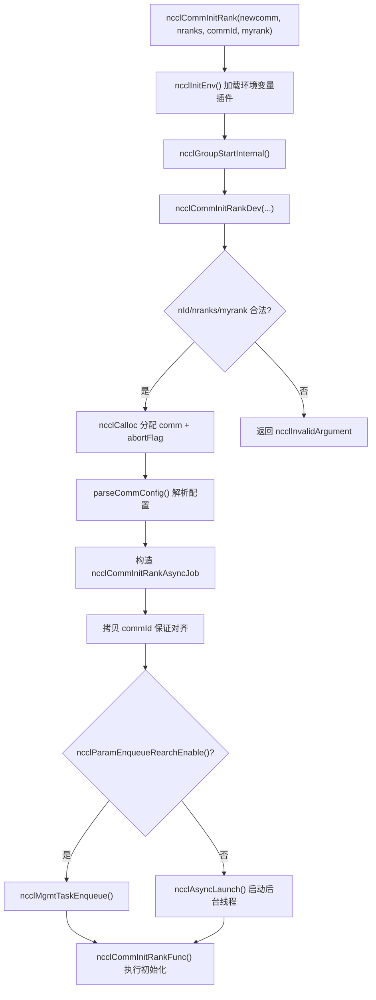
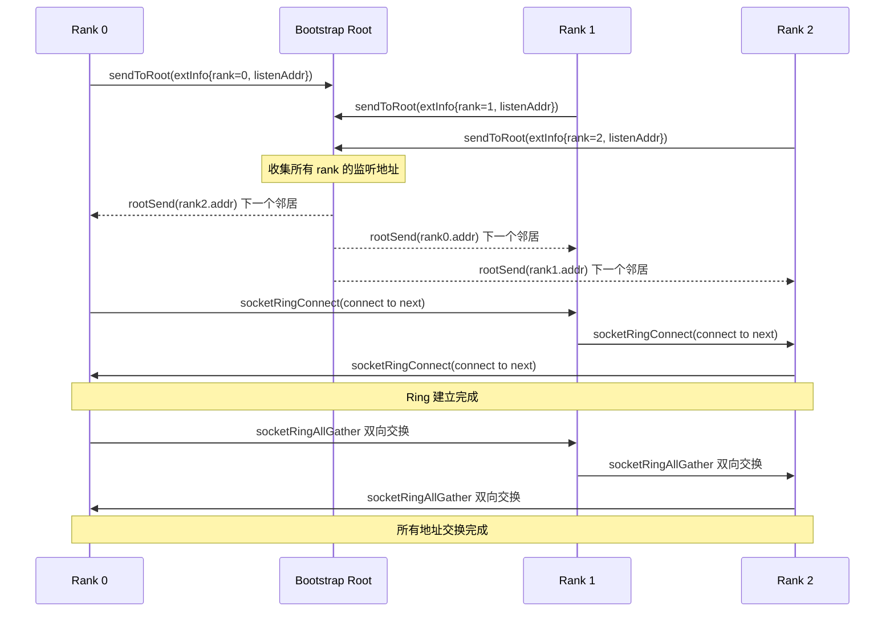
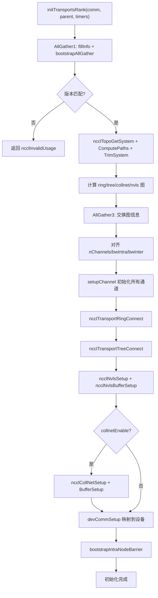

# Próximo capítulo: Capítulo 3 →

# Progresso do livro: Capítulo 3 / 25

No capítulo anterior, estabelecemos as cinco abstrações centrais que percorrem todo o livro: ncclComm, channel, algorithm, protocol e transport, que juntas formam o vocabulário comum de "uma comunicação = vários channels × um algorithm × um protocol × vários transports". Agora, precisamos responder a uma pergunta mais fundamental: como esse objeto ncclComm é construído do zero? Quando você chama ncclCommInitRank, o NCCL precisa completar uma série de operações complexas em algumas centenas de milissegundos: confirmar que todos os ranks chegaram, trocar informações de dispositivos, detectar a topologia da máquina, calcular os caminhos de dados, alocar memória de GPU e memória do host e, finalmente, empacotar tudo isso em um objeto ncclComm. Este capítulo seguirá essa cadeia de chamadas, descendo desde a entrada da API até o último capilar de initTransportsRank.

# 3.1 Entrada da API: a casca síncrona e o núcleo assíncrono de ncclCommInitRank

## Modelo intuitivo

`ncclCommInitRank`Na superfície, é "criar um domínio de comunicação", mas na prática o que ele faz é "iniciar uma tarefa em segundo plano e, por padrão, esperar que ela termine". É como pedir comida em um restaurante: o ato de fazer o pedido (a chamada da API) retorna instantaneamente, mas a cozinha preparando o prato (a inicialização real) acontece em segundo plano. O "modo bloqueante" padrão apenas faz você esperar no balcão até o prato ficar pronto, enquanto o "modo não bloqueante" fornece um número de retirada, permitindo que você faça outras coisas primeiro.

Sem essa camada de design assíncrono, o NCCL não conseguiria cooperar durante a inicialização com cenários como captura de CUDA Graph e inicialização paralela de múltiplos domínios de comunicação — toda inicialização se tornaria uma operação bloqueante serial, incapaz de se sobrepor ao código do usuário.

## Estruturas de dados e layout de memória

Vamos primeiro à própria entrada da API.`ncclCommInitRank`É uma casca síncrona extremamente fina:

[FACT:src/init.cc:2946-2970]

Ela faz quatro coisas: chama`ncclInitEnv()`carrega o plugin de variáveis de ambiente, ativa as marcações de desempenho NVTX, lê o número do dispositivo CUDA atual e então chama`ncclGroupStartInternal()`entra na semântica de group e, por fim, delega o trabalho real a`ncclCommInitRankDev`。

Observe`ncclGroupStartInternal()` / `ncclGroupEndInternal()`esse par de chamadas — mesmo que você inicialize apenas um domínio de comunicação, o NCCL o envolve na semântica de group. Isso serve para tratar de forma unificada o cenário em que "o usuário inicializa múltiplos domínios de comunicação dentro de um group", evitando escrever dois conjuntos de caminhos de código para domínio único e múltiplos domínios.

A validação real de parâmetros e a alocação do objeto ficam em`ncclCommInitRankDev`:

[FACT:src/init.cc:2851-2943]

Essa função é a "mesa central de despacho" de toda a cadeia. Ela primeiro faz a validação de parâmetros (`nId`faixa,`nranks`/`myrank`validade), depois aloca`ncclComm`a própria estrutura e três campos relacionados ao mecanismo de aborto:`abortFlag`(flag atômica no lado do host),`abortFlagDev`(cópia em memória fixa visível no lado do dispositivo),`abortFlagRefCount`(contagem de referências, porque domínios de comunicação filhos criados por split podem compartilhar o abortFlag do domínio pai).

Há um detalhe que vale a pena notar —`comm->startMagic = comm->endMagic = NCCL_MAGIC`：

[FACT:src/init.cc:2886-2886]

esse par de valores mágicos funciona como um "lacre", posicionado no início e no fim da`ncclComm`estrutura. Qualquer escrita fora dos limites ou corrupção da estrutura destruirá esse par de valores mágicos, e operações subsequentes podem detectar violações de memória validando-os. Essa é uma proteção de integridade de memória barata, mas eficaz.

## Step-by-Step Walkthrough

Quando`ncclCommInitRankDev`chega ao fim, ela constrói um`ncclCommInitRankAsyncJob`e inicia a tarefa assíncrona:

[FACT:src/init.cc:2896-2929]

`job`A estrutura carrega todos os parâmetros necessários para a inicialização. Observe que`job->commId`é**copiado**, em vez de referenciar diretamente o`commId`：

[FACT:src/init.cc:2903-2910]

passado pelo usuário. Por que copiar? O comentário no código-fonte dá a resposta:`ncclUniqueId`e`ncclBootstrapHandle`têm requisitos de alinhamento diferentes; o array passado pelo usuário pode não estar corretamente alinhado ao limite exigido por`ncclBootstrapHandle`. Copiar para memória recém-alocada garante o alinhamento. Essa é uma típica "armadilha de compatibilidade de ABI" — o usuário vê`ncclUniqueId`, mas internamente precisa ser usado como`ncclBootstrapHandle`; ambos têm o mesmo tamanho, mas alinhamento diferente.

Por fim, dependendo do valor de`ncclParamEnqueueRearchEnable()`, a tarefa entra na fila de gerenciamento ou é iniciada diretamente via`ncclAsyncLaunch`:

[FACT:src/init.cc:2922-2929]

`ncclAsyncLaunch`cria uma nova thread para executar`ncclCommInitRankFunc`. Se for modo bloqueante (padrão), o chamador espera em`ncclGroupEndInternal()`até essa thread terminar; se for modo não bloqueante, o chamador retorna imediatamente e o usuário posteriormente consulta o estado via`ncclCommGetAsyncError`.

## Reflexão de design

O núcleo do design aqui é "API síncrona + implementação assíncrona". Por que não fazer`ncclCommInitRank`executar diretamente toda a inicialização de forma síncrona? Porque o NCCL precisa suportar o modo não bloqueante de`ncclCommInitRankConfig`, e o modo não bloqueante exige que a inicialização seja executada em uma thread em segundo plano. Se o caminho síncrono e o caminho assíncrono fossem dois conjuntos de código, o custo de manutenção dobraria. Ao unificar tudo no caminho assíncrono, o caminho síncrono é apenas "iniciar e esperar imediatamente", e há apenas uma versão do código.



# 3.2 Bootstrap: o primeiro canal de controle entre os ranks

## Modelo intuitivo

O Bootstrap é o "grupo de mensagens pré-reunião" do NCCL. Antes do início da comunicação formal, todos os ranks precisam primeiro estabelecer um canal de controle para trocar metadados como "quem eu sou, em qual máquina estou, qual é o modelo da minha GPU, qual é o endereço da minha placa de rede". Sem o bootstrap, os ranks seriam um grupo de estranhos que não se conhecem, incapazes de coordenar qualquer comunicação.

Se o bootstrap falhar ou expirar, toda a inicialização do domínio de comunicação ficará travada — essa é uma das causas mais comuns de travamento do NCCL em ambientes de produção.

## Estruturas de dados e layout de memória

O estado central do Bootstrap é mantido na`bootstrapState`estrutura:

[FACT:src/bootstrap.cc:527-546]

Esta estrutura possui alguns campos-chave que merecem ser detalhados:

- `ring`: uma união, que pode ser um handle de dispositivo de rede (`net.sendComm`/`net.recvComm`), ou um par de sockets (`socket.send`/`socket.recv`). Isso corresponde a dois modos de bootstrap: o modo padrão baseado em socket e o modo baseado em dispositivo de rede`NCCL_OOB_NET_ENABLE`.
- `listen`: informações do lado do listener, que também possui duas formas: rede e socket.
- `peerP2pAddresses` / `peerProxyAddresses`: arrays de endereços P2P e endereços proxy de todos os ranks, preenchidos via ring allgather.
- `unexpectedConnections`: uma lista encadeada que armazena em cache conexões "recebidas, mas ainda não correspondidas". Este é um design crucial do protocolo de bootstrap — como o receptor não pode prever quem se conectará primeiro, é necessário armazenar as conexões não correspondidas.
- `asyncSendQueue` + `asyncSendLock` + `asyncSendCond`: fila de envio assíncrono e suas primitivas de sincronização, usadas para envio concorrente no modo de criptografia TLS.

`bootstrapState`A alocação de`bootstrapInit`ocorre no início de

[FACT:src/bootstrap.cc:769-776]

Observe a linha`comm->bootstrap = state`— o estado de bootstrap é anexado ao communication domain, e todas as operações subsequentes de bootstrap são acessadas através de`comm->bootstrap`.

## Step-by-Step Walkthrough

`bootstrapInit`é a função principal do bootstrap. Vamos decompô-la na ordem de execução:

**Primeiro passo: determinar o valor magic.**O magic é o "código secreto" da comunicação de bootstrap; apenas ranks que possuem o mesmo magic podem se conectar entre si.

[FACT:src/bootstrap.cc:778-788]

Se for inicialização normal (`handles != NULL`), o magic vem do primeiro handle; se for split/grow (`parent != NULL`), o magic é derivado através de`hashCombine(parent->magic, parent->childCount)`. Isso garante que cada sub-communication domain tenha um magic único.

**Segundo passo: criar o socket de escuta.**Cada rank precisa de dois endpoints de escuta: um para conexões de vizinhos no ring (`STATE_LISTEN(state, socket)`), e outro para conexões root (`listenSockRoot`）：

[FACT:src/bootstrap.cc:797-831]

Aqui há uma divisão crucial de responsabilidades: o socket de escuta do ring usa`comm->magic`, enquanto o socket de escuta do root usa`BOOTSTRAP_HANDLE(handles, curr_root)->magic`. Por quê? Porque o root é o coordenador global, e todos os ranks precisam se conectar a ele, então ele usa um magic unificado; já os vizinhos no ring são ponto a ponto, então basta usar o magic do próprio communication domain.

**Terceiro passo: conexões escalonadas.**Quando o número de ranks é muito grande, todos os ranks se conectando ao root simultaneamente causaria uma tempestade de conexões. O NCCL usa`NCCL_UID_STAGGER_RATE`e`NCCL_UID_STAGGER_THRESHOLD`para controlar o escalonamento:

[FACT:src/bootstrap.cc:833-843]

Quando o número de ranks sob responsabilidade de um root excede um limiar (padrão 256), cada rank calcula um atraso em microssegundos com base em seu ID local sob aquele root, e então dorme. Este é um mecanismo simples, mas eficaz, de limitação de taxa no estilo "token bucket".

**Quarto passo: enviar suas informações de conexão ao root.**Cada rank envia seu endereço de escuta ao root:

[FACT:src/bootstrap.cc:845-867]

Após o root receber as informações de todos os ranks, ele realiza um "emparelhamento em anel" — envia o endereço do rank i para o rank i-1, e o endereço do rank i+1 para o rank i. Assim, cada rank conhece seus vizinhos anteriores e posteriores no ring.

**Quinto passo: estabelecer conexões do ring.**Cada rank se conecta ao seu vizinho "seguinte", enquanto aceita a conexão do vizinho "anterior":

[FACT:src/bootstrap.cc:885-894]

Aqui`socketRingConnect`usa internamente`bootstrapConcurrent`— no modo de criptografia TLS, connect e accept devem ser executados concorrentemente, caso contrário ocorre deadlock (pois o handshake TLS requer a participação simultânea de ambos os lados). No modo não criptografado, executa-se connect e depois accept de forma serial.

**Sexto passo: AllGather de todos os endereços.**Após o ring ser estabelecido, realiza-se um allgather de todos os endereços P2P, endereços proxy e endereços UDS de todos os ranks através de`ringAllInfo`:

[FACT:src/bootstrap.cc:934-938]

`ringAllInfo`chama internamente`bootstrapAllGather`, que no modo socket usa`socketRingAllGather`— um algoritmo de ring allgather bidirecional, onde N ranks precisam de apenas N/2 passos:

[FACT:src/bootstrap.cc:1363-1412]

Este algoritmo bidirecional é a otimização chave de desempenho do bootstrap. O ring allgather unidirecional tradicional requer N-1 passos; a versão bidirecional reduz o número de passos pela metade. A cada passo, envia e recebe dados simultaneamente em ambas as direções, empacotando 4 operações (2 envios e 2 recebimentos) em uma única chamada de sistema usando`socketDoubleSendRecv`.

## Controle de concorrência e interação de baixo nível

O controle de concorrência do Bootstrap possui vários níveis:

**Primeiro nível: verificação de abort.**Todos os loops bloqueantes verificam periodicamente abortFlag:

[FACT:src/bootstrap.cc:150-159]

`BOOTSTRAP_N_CHECK_ABORT`Definido como 10000, significa que a flag de abort é verificada a cada 10000 iterações do loop. Este número é um compromisso entre desempenho e responsividade — verificar com muita frequência afeta o desempenho, verificar com pouca frequência causa atraso na resposta ao abort.

**Segundo nível: fila de envio assíncrono.**No modo de criptografia TLS,`bootstrapSend`não pode ser executado sincronamente (pois o handshake TLS requer a participação do receptor), então o NCCL coloca as operações de envio em uma thread separada:

[FACT:src/bootstrap.cc:1161-1217]

Aqui há um mecanismo refinado de garantia de ordem.`bootstrapAsyncSendMain`Antes de enviar, verifica-se na fila se há "envios anteriores, destinados ao mesmo (peer, tag)":

[FACT:src/bootstrap.cc:1124-1152]

Por que é necessário garantir a ordem de envio para o mesmo (peer, tag)? Os comentários do código-fonte explicam claramente: o receptor faz correspondência de conexões por (peer, tag), e se duas mensagens enviadas para o mesmo (peer, tag) chegarem em ordem invertida, o receptor irá associá-las incorretamente. Durante a inicialização do NVLS, há múltiplos broadcasts para o mesmo peer usando a mesma tag, portanto essa garantia de ordem é obrigatória.

**Terceira camada: fila de conexões inesperadas.**O receptor não pode prever quem se conectará primeiro, então`socketAccept`armazena conexões não correspondidas em uma`unexpectedConnections`lista encadeada:

[FACT:src/bootstrap.cc:1276-1300]

Este design resolve um problema clássico de sistemas distribuídos: múltiplos ranks podem iniciar conexões simultaneamente para você, mas sua`bootstrapRecv`ordem de chamadas é fixa. Se conexões não correspondidas fossem simplesmente descartadas, o remetente sofreria timeout; se bloqueasse esperando, poderia ocorrer deadlock. Armazenar na fila é a abordagem mais segura.

## Guia de prevenção de armadilhas em produção

**Armadilha 1: timeout do bootstrap causa travamento na inicialização.**Se algum rank não conseguir se conectar ao root por problemas de rede, todos os outros ranks ficarão esperando indefinidamente em`ncclSocketAccept`ou`ncclSocketRecv`. O NCCL não possui mecanismo interno de timeout de bootstrap; a única via de escape é o abortFlag. Em ambientes de produção, recomenda-se configurar`NCCL_UID_STAGGER_RATE`para mitigar tempestades de conexão em clusters de grande escala.

**Armadilha 2:`NCCL_COMM_ID`conflita com múltiplos handles.**Quando o usuário define a`NCCL_COMM_ID`variável de ambiente, o NCCL força a redução de`nId`para 1:

[FACT:src/init.cc:2912-2921]

Isso significa que`ncclCommInitRankScalable`a característica de múltiplos handles será silenciosamente desabilitada. Se você está usando inicialização scalable e também definiu`NCCL_COMM_ID`, o comportamento será diferente do esperado.

**Armadilha 3: deadlock no modo TLS.**No modo de criptografia TLS, se connect e accept não forem executados concorrentemente, ambos os lados ficarão travados no handshake TLS.`bootstrapConcurrent`serve justamente para resolver esse problema:

[FACT:src/bootstrap.cc:648-669]

No modo não criptografado, executa-se serialmente (primeiro send, depois recv); no modo criptografado, inicia-se uma thread para tratar o send, enquanto a thread principal trata o recv.



# 3.3 commAlloc: o esqueleto de memória do objeto de domínio de comunicação

## Modelo intuitivo

`commAlloc`é a "entrega do imóvel bruto" do domínio de comunicação — ele aloca a memória da estrutura, inicializa todos os campos com valores padrão seguros, cria os objetos CUDA necessários e primitivas de sincronização, mas ainda não preenche informações de topologia, configuração de canais, conexões de transporte e outros conteúdos de "acabamento fino". Se compararmos`ncclComm`a um edifício,`commAlloc`é a fundação e a concretagem da estrutura,`initTransportsRank`é a decoração interna.

Sem a inicialização de`commAlloc`, o código subsequente acessando campos não inicializados causaria comportamento imprevisível — por exemplo, se`comm->channels[c].id`for um valor aleatório, a lógica de inicialização de canais julgaria erroneamente o estado do canal.

## Estrutura de dados e layout de memória

`commAlloc`a assinatura e verificação inicial de

[FACT:src/init.cc:512-526]

Ele primeiro valida`ndev`e`rank`a legalidade, depois constrói duas pilhas de memória (`memPermanent`e`memScoped`), define`rank`e`nRanks`. Essas duas pilhas de memória são a infraestrutura de gerenciamento de memória do NCCL —`memPermanent`usada para alocações com ciclo de vida igual ao do domínio de comunicação,`memScoped`usada para alocações temporárias.

Em seguida vem a detecção do dispositivo CUDA:

[FACT:src/init.cc:528-531]

`cudaGetDevice`obtém o número do dispositivo atual,`ncclCudaCompCap`obtém a capacidade de computação. O comentário do código-fonte é bem direto: "Try to create a CUDA object right away. If there is something wrong with the device we're on, better know it early." — expor problemas do dispositivo o mais cedo possível, evitando descobri-los apenas no final da inicialização.

Depois vem a alocação ou herança de recursos compartilhados:

[FACT:src/init.cc:533-555]

Aqui há uma ramificação importante: se`parent == NULL || !parent->shareResources`, cria um novo`ncclSharedResources`; caso contrário, herda os recursos compartilhados do domínio de comunicação pai e incrementa o contador de referências.`ncclSharedResources`inclui streams de dispositivo, streams de host, eventos de lançamento, eventos de scratch, etc. — esses recursos podem ser reutilizados por subdomínios de comunicação em cenários de split, evitando criação duplicada.

Observe`sharedRes->refCount = 1`esta linha — a contagem inicial de referências é 1, incrementada a cada compartilhamento via split, e somente destruída quando a última referência é liberada.

Em seguida vem a inicialização de rede, RMA e GIN:

[FACT:src/init.cc:547-549]

Esses três subsistemas são responsáveis por transporte de rede, acesso remoto à memória e comunicação de rede iniciada pela GPU, respectivamente. A ordem de inicialização deles é importante —`ncclNetInit`deve vir antes de`ncclRmaInit`, pois RMA depende do plugin de rede.

Inicialização do gerenciador de memória:

[FACT:src/init.cc:567-576]

Também possui dois caminhos: compartilhado/novo.`ncclMemManager`é responsável por gerenciar o pool de memória CUDA e o cache de registro.

Marcação de inicialização de canais:

[FACT:src/init.cc:607-608]

Esta linha define o`id`de todos os canais como -1, indicando "não inicializado". O`setupChannel`subsequente verificará esse valor para decidir se é necessária inicialização.

Construção das filas de interrupção:

[FACT:src/init.cc:619-632]

O NCCL usa filas intrusivas (intrusive queue) para gerenciar diversas tarefas. Essas filas são todas construídas vazias na fase de`commAlloc`, e usadas diretamente quando tarefas subsequentes são enfileiradas.

Criação do pool de memória CUDA:

[FACT:src/init.cc:636-652]

Se o dispositivo suportar pool de memória (`cudaDevAttrMemoryPoolsSupported`), cria um pool de memória do tipo pinned e define o limiar de liberação como o valor máximo (`~uint64_t(0)`), significando "nunca liberar automaticamente". Isso evita que o runtime CUDA recupere memória sem o conhecimento do NCCL.

## Step-by-Step Walkthrough

Vamos acompanhar um cenário específico de inicialização: máquina única com 8 GPUs, um rank por processo, inicialização normal.

1. `commAlloc(comm, NULL, 8, rank)`é chamado,`parent == NULL`。

2. Validação passa,`comm->rank = rank`，`comm->nRanks = 8`。

3. `cudaGetDevice`retorna o número do dispositivo atual,`comm->compCap`é definido.

4. Cria um novo`ncclSharedResources`, contagem de referências é 1.

5. `ncclNetInit`Inicializar o plugin de rede (pode ser Socket ou IB).

6. `ncclMemManagerInit`Criar o gerenciador de memória.

7. `getBusId`Obter o ID do barramento PCI,`ncclNvmlDeviceGetHandleByPciBusId`Obter o handle NVML.

8. `dmaBufSupported`Detectar suporte a DMA-BUF.

9. Alocar`connectSend` / `connectRecv`array de bitmap.

10. Todos os canais`id`definidos como -1.

11. Construir todas as filas de interrupção.

12. Criar o pool de memória CUDA.

## Reflexões de design

`commAlloc`O design mais interessante é o princípio de "falhar o mais cedo possível". Ele chama`cudaGetDevice`logo no início da função, em vez de esperar até precisar das informações do dispositivo mais tarde. A vantagem disso é: se o dispositivo tiver problemas (por exemplo, estar exclusivamente ocupado por outro processo), o erro será exposto no início da inicialização, em vez de ser descoberto somente após alocar uma grande quantidade de memória.

Outro design é a inicialização de`preconnectNext`:

[FACT:src/init.cc:598-598]

`reinterpret_cast<struct ncclComm*>(0x1)`é um valor sentinela usado para marcar o estado da "próxima pré-conexão". Essa técnica de usar um valor de ponteiro inválido como marcador de estado é muito comum em programação de sistemas — ela economiza mais memória do que um campo booleano extra, mas é preciso ter cuidado para não desreferenciá-lo.

# 3.4 initTransportsRank: descoberta de topologia e alocação de canais

## Modelo intuitivo

`initTransportsRank`é o "coração" da inicialização. Ele faz três grandes coisas: trocar as informações de dispositivo e topologia de todos os ranks por meio de dois AllGather; com base nessas informações, calcular as estruturas de grafo dos algoritmos ring/tree/collnet/nvls; e, por fim, estabelecer todas as conexões de transporte. Se o domínio de comunicação for comparado ao sistema de transporte de uma cidade,`initTransportsRank`é o processo de planejar todas as estradas, viadutos e linhas de ônibus.

Sem essa etapa, o NCCL não saberia por qual caminho os dados devem seguir — ele poderia fazer os dados darem um desvio, ou simplesmente não encontrar um caminho alcançável.

## Estruturas de dados e layout de memória

`initTransportsRank`tem muitas variáveis locais; vamos olhar as principais:

[FACT:src/init.cc:1163-1179]

Aqui extraímos`comm->graphs`as várias estruturas de grafo do array e criamos aliases.`graphs`O array é indexado por algoritmo; observe que`nvlsGraph`é usado duas vezes (NVLS e NVLSTree compartilham a mesma estrutura de grafo).

Duas estruturas temporárias importantes:

[FACT:src/init.cc:1181-1206]

`graphInfo`armazena as informações de grafo de um único rank para um determinado algoritmo (número de canais, largura de banda, tipo etc.),`allGatherInfo`é a unidade de dados do AllGather, contendo as informações de grafo de todos os algoritmos mais as informações de rank de topologia.

## Step-by-Step Walkthrough

**Fase um: AllGather1 — troca de informações de dispositivo.**

[FACT:src/init.cc:1234-1239]

Cada rank chama`fillInfo`para preencher seu próprio`ncclPeerInfo`, e então troca via`bootstrapAllGather`.`fillInfo`As informações preenchidas por incluem: número do rank, número do dispositivo CUDA, número do dispositivo NVML, versão do NCCL, git hash, host hash, process hash, GPU UUID, ID do barramento, tamanho da memória de vídeo, versão do driver etc.

[FACT:src/init.cc:888-982]

Observe`info->hostHash = getHostHash() + commHash`e`info->pidHash = getPidHash() + commHash`— host hash e pid hash recebem ambos o commHash. Isso serve para distinguir diferentes domínios de comunicação na mesma máquina.

Após o AllGather terminar, cada rank percorre as informações de todos os peers e calcula atributos globais:

[FACT:src/init.cc:1250-1303]

Esse loop faz muitas coisas: detecta incompatibilidade de versão, conta o número de nós, calcula a interseção de`cuMemSupport`, detecta se há vários ranks usando a mesma GPU, calcula a interseção das máscaras de tipo GIN etc. Observe`nNodes`a forma de contagem de — sempre que encontra um hostHash diferente, incrementa, o que pressupõe que os ranks estejam organizados de forma contígua por nó.

**Fase dois: descoberta de topologia.**

[FACT:src/init.cc:1390-1403]

Estas seis etapas são o fluxo central da descoberta de topologia:`ncclTopoGetSystem`enumera os dispositivos do sistema e constrói o grafo de topologia,`ncclTopoComputePaths`calcula os caminhos de GPU para NIC,`ncclTopoTrimSystem`remove dispositivos inalcançáveis, calcula os caminhos novamente,`ncclTopoSearchInit`inicializa o estado de busca e, por fim, imprime a topologia.

**Fase três: cálculo de grafos.**

[FACT:src/init.cc:1421-1468]

Calcula, em sequência, os cinco grafos: ring, tree, collnet chain, collnet direct e nvls. Cada grafo tem pattern e restrições de número de canais diferentes. Observe`treeGraph->minChannels = ringGraph->nChannels`— o número de canais da tree é restringido para ser igual ao da ring, a fim de garantir o alinhamento de canais entre algoritmos diferentes.

**Fase quatro: AllGather3 — troca de informações de grafo.**

[FACT:src/init.cc:1490-1533]

Cada rank preenche suas próprias informações de grafo em`allGather3Data[rank]`, e então`bootstrapAllGather`novamente. As informações trocadas desta vez incluem: pattern/nChannels/bwIntra/bwInter/typeIntra/typeInter/crossNic de cada algoritmo, arquitetura de CPU, número de canais P2P, número de dispositivos de rede, número de dispositivos CollNet etc.

Após o AllGather3 terminar, cada rank percorre as informações de grafo de todos os peers e toma o valor mínimo/máximo para alinhar:

[FACT:src/init.cc:1687-1703]

Observe a estratégia de alinhamento aqui:`nChannels`、`sameChannels`、`bwIntra`、`bwInter`toma o valor mínimo,`typeIntra`、`typeInter`、`crossNic`toma o valor máximo. Por quê? Porque o número de canais e a largura de banda são limitados pelo elo mais fraco, enquanto o tipo e crossNic precisam da união para garantir compatibilidade.

**Fase cinco: estabelecer conexões de transporte.**

[FACT:src/init.cc:1811-1892]

Aqui há dois ramos:`runtimeConn`quando verdadeiro, apenas faz o setup dos canais sem estabelecer conexões (adiando a conexão para o tempo de execução); caso contrário, estabelece todas as conexões imediatamente. A ordem de conexão é: ring → tree → NVLS → PAT → NVLS tree → CollNet.

## Controle de concorrência e interação com hardware

`initTransportsRank`Há vários pontos dignos de nota de concorrência/interação com hardware em

**Configuração de afinidade de CPU:**

[FACT:src/init.cc:1406-1412]

O NCCL vincula a thread atual a um núcleo de CPU próximo da GPU, garantindo que a alocação de memória do host seja do nó NUMA local. Isso reduz a latência de acesso entre NUMA.

**Inicialização do NVLS:**

[FACT:src/init.cc:1419-1419]

`ncclNvlsInit`Detecta suporte a NVLink SHARP. O NVLS permite que o switch execute operações de reduce diretamente, reduzindo drasticamente a latência do AllReduce.

**Criação da thread Proxy:**

[FACT:src/init.cc:1780-1786]

A thread Proxy é responsável por avançar assincronamente o I/O de rede. Ela é criada em`initTransportsRank`e, a partir daí, todas as operações de rede passam pelo proxy.

## Guia de prevenção de problemas em produção

**Problema 1: Número de dispositivos de rede incompatível.**Se o número de placas de rede locais for diferente entre os ranks, o NCCL reportará erro:

[FACT:src/init.cc:1576-1596]

A menos que se defina`NCCL_IGNORE_NET_MISMATCH=1`. Isso é comum em clusters heterogêneos — alguns nós têm 8 placas de rede, outros apenas 4. Ignorar a incompatibilidade pode causar degradação de desempenho, pois o número de canais será limitado pelo nó mais fraco.

**Problema 2: Múltiplos ranks compartilhando a mesma GPU.**Se dois ranks tiverem o mesmo UUID de GPU, o NCCL recusará a inicialização:

[FACT:src/init.cc:1291-1296]

A menos que se defina`NCCL_MULTI_RANK_GPU_ENABLE=1`. Essa verificação previne problemas de desempenho causados por configuração incorreta do usuário.

**Problema 3: Número insuficiente de nós no CollNet.**O CollNet requer pelo menos`NCCL_COLLNET_NODE_THRESHOLD`nós para ser habilitado:

[FACT:src/init.cc:1720-1728]

O limiar padrão é 2. Em ambiente de nó único, o CollNet é automaticamente desabilitado.



# 3.5 NCCL_PARAM: a mágica em tempo de compilação do sistema de variáveis de ambiente

## Modelo intuitivo

`NCCL_PARAM`é a "fábrica de chaves de configuração" do NCCL. Ele usa macros para gerar uma função em tempo de compilação, que na primeira chamada em tempo de execução lê a variável de ambiente e armazena o resultado em cache. É como um interruptor de luz em casa — você o aciona (chama a função), a luz acende (retorna o valor de configuração), e depois o estado do interruptor é memorizado, sem precisar acioná-lo novamente a cada vez.

Sem esse mecanismo, o NCCL precisaria chamar manualmente`getenv`e analisar a string em cada local que usa configuração, tornando o código extremamente verboso e propenso a erros.

## Estrutura de dados e layout de memória

`NCCL_PARAM`Definição da macro:

[FACT:src/include/param.h:22-31]

Essa macro, quando expandida, gera uma função`ncclParam##name()`, com três variáveis estáticas internas:

- `uninitialized = INT64_MIN`: valor sentinela, indicando "ainda não inicializado".
- `noCache`: flag de três estados, -1 indica não inicializado, 0 indica cache, 1 indica sem cache.
- `cache`: o valor em cache, inicialmente`uninitialized`。

A lógica da função é: se`cache`ainda for`uninitialized`, chama`ncclLoadParam`para carregar; caso contrário, retorna diretamente`cache`。`COMPILER_EXPECT(..., false)`informa ao compilador que esse branch raramente é executado, otimizando o caminho quente.

`ncclLoadParam`Implementação de :

[FACT:src/misc/param.cc:78-108]

Ele usa um mutex para proteger todo o processo de carregamento, primeiro verifica a política`noCache`, depois verifica se o cache é válido, então lê a variável de ambiente e faz o parsing. Em caso de falha no parsing, usa o valor padrão e imprime um aviso.

## Step-by-Step Walkthrough

Tomando`NCCL_PARAM(BuffSize, "BUFFSIZE", -2)`como exemplo:

[FACT:src/init.cc:1007-1007]

Após expansão da macro, gera:

```cpp
int64_t ncclParamBuffSize() {
  constexpr int64_t uninitialized = INT64_MIN;
  static int8_t noCache = -1;
  static_assert(-2 != uninitialized, "...");
  static int64_t cache = uninitialized;
  if (COMPILER_EXPECT(COMPILER_ATOMIC_LOAD(&cache, std::memory_order_relaxed) == uninitialized, false)) {
    return ncclLoadParam("NCCL_BUFFSIZE", -2, uninitialized, &cache, &noCache);
  }
  return cache;
}
```

Na primeira chamada,`cache == uninitialized`, entra em`ncclLoadParam`. Ele lê a variável de ambiente`NCCL_BUFFSIZE`, e se não estiver definida, retorna o valor padrão -2. Depois, conforme a política`noCache`, decide se armazena em cache.

`noCache`A política é determinada por`ncclParamIsCacheDisabled`:

[FACT:src/misc/param.cc:74-76]

Se o nome da variável de ambiente corresponder a algum padrão (por exemplo, terminar com`_`), não armazena em cache, relendo a cada vez. Isso permite que o usuário modifique dinamicamente certas configurações em tempo de execução.

## Reflexões de design

A genialidade desse design está na "abstração de custo zero": no caminho quente há apenas um carregamento atômico e uma comparação, sem locks, sem parsing de strings. Apenas o caminho frio (primeiro carregamento) paga o custo completo.`COMPILER_EXPECT`instrui o compilador a colocar o caminho quente no início do cache de instruções, melhorando ainda mais o desempenho.

Outro design é o de três estados de`noCache`. -1 significa "ainda não decidido", 0 significa "cache", 1 significa "sem cache". Essa decisão é tomada apenas uma vez no primeiro carregamento e não muda depois.

## Guia de prevenção de problemas em produção

**Problema 1: Erro de digitação na variável de ambiente.**Se o usuário escrever`NCCL_BUFSIZE`em vez de`NCCL_BUFFSIZE`, o NCCL não reportará erro, apenas usará o valor padrão. Recomenda-se usar`NCCL_DEBUG=ENV`para visualizar todas as variáveis de ambiente reconhecidas.

**Problema 2: Ordem de carregamento de`NCCL_CONF_FILE`.**O NCCL carrega sequencialmente`$NCCL_CONF_FILE`(ou`~/.nccl.conf`) e`/etc/nccl.conf`：

[FACT:src/misc/param.cc:52-67]

Arquivos carregados depois sobrescrevem os carregados antes. Se ambos os arquivos definirem a mesma variável,`/etc/nccl.conf`o valor de

**prevalecerá.`noCache`Problema 3: Thread safety da variável**. O comentário no código-fonte diz "noCache is only load/stored within the mutex, no need for atomic":

[FACT:src/misc/param.cc:74-76]

Isso significa que a leitura e escrita de`noCache`estão sob proteção do mutex, não necessitando de operações atômicas. Mas a leitura de`cache`é lock-free (caminho quente), então usa carregamento atômico.

# 3.6 devCommSetup: mapeando o domínio de comunicação para o dispositivo

## Modelo intuitivo

`devCommSetup`é a "projeção no lado do dispositivo" do domínio de comunicação. O kernel da GPU roda no dispositivo e não pode acessar diretamente a estrutura`ncclComm`na memória do host. Portanto, o NCCL precisa copiar os campos-chave do domínio de comunicação para memória acessível pelo dispositivo, formando`ncclDevComm`. É como copiar a lista de contatos da empresa e colocar na mesa de cada funcionário — o funcionário não precisa ir até a recepção perguntar o telefone do colega a cada vez.

Sem`devCommSetup`, o kernel da GPU não conseguiria saber seu rank, configuração de canais, tamanho de buffer, etc., e o kernel de comunicação coletiva simplesmente não poderia iniciar.

## Estrutura de dados e layout de memória

`devCommSetup`usa uma estrutura temporária`ncclKernelCommAndChannels`para empacotar os dados a serem copiados para o dispositivo:

[FACT:src/init.cc:712-746]

Essa estrutura contém`ncclDevComm`(domínio de comunicação do lado do dispositivo) e o array de canais. A função primeiro preenche os dados do lado do host na estrutura temporária, depois faz um`cudaMemcpyAsync`único para o dispositivo.

Preenchimento dos campos-chave:

[FACT:src/init.cc:734-746]

Note que`comm->devComm = &devCommAndChans->comm`— o`comm->devComm`do lado do host aponta para o`ncclDevComm`na memória do dispositivo. Posteriormente, ao iniciar o kernel,`comm->devComm`será passado como parâmetro.

Preenchimento das informações do canal:

[FACT:src/init.cc:829-843]

Os ponteiros peers, ring, tree, collnetChain, collnetDirect e nvls de cada canal são copiados para o lado do dispositivo. Observação:`ring.userRanks`é necessária uma cópia adicional`cudaMemcpyAsync`, porque é um array.

## Step-by-Step Walkthrough

1. Obter o stream do dispositivo:`ncclStrongStreamAcquire`Obtém um strong stream para garantir que as cópias assíncronas subsequentes sejam executadas em ordem.

2. Alocar memória do dispositivo:`ncclCudaCallocAsync`Alocar`devCommAndChans`。

3. Preencher a estrutura temporária do lado do host: definir rank, nRanks, node, nNodes, abortFlag, buffSizes etc.

4. Alocar e copiar o`rankToLocalRank`array.

5. Calcular`workFifoBytes`: decidido com base no estado de CC (Confidential Computing).

6. Alocar o buffer workFifo: no modo GDR usar`ncclGdrCudaCalloc`, caso contrário usar`ncclCudaHostCalloc`。

7. Alocar os contadores do profiler.

8. Alocar os contadores de progresso (se habilitados).

9. Preencher as informações do canal.

10. Copiar de uma só vez para o dispositivo:`ncclCudaMemcpyAsync(devCommAndChans, &tmpCommAndChans, 1, deviceStream)`。

11. Liberar o strong stream e sincronizar.

## Reflexões de design

`devCommSetup`O design mais notável em é a "cópia em lote". O NCCL não chama`cudaMemcpy`separadamente para cada campo; em vez disso, empacota todos os campos em uma estrutura temporária e usa uma única`cudaMemcpyAsync`para concluir. Isso reduz drasticamente o número de chamadas à API CUDA e a sobrecarga de sincronização.

Outro design é o tratamento de CC em`workFifoBytes`:

[FACT:src/init.cc:750-763]

No modo CC (Confidential Computing),`workFifoBytes`é definido como 0, porque a cópia GDR não está disponível no modo CC. Esta é uma degradação elegante de uma limitação de hardware.

## Guia de armadilhas em produção

**Armadilha 1:`devCommSetup`deve ser chamado antes da barreira.**Os comentários do código-fonte explicam o motivo:

[FACT:src/init.cc:1950-1952]

Se for chamado depois da barreira, pode haver threads que já começaram a iniciar o kernel do NCCL, e nesse momento a memória do dispositivo ainda não foi totalmente alocada, o que pode causar deadlock.

**Armadilha 2:`workFifoBytes`deve ser uma potência de 2.**Se não for, o NCCL emitirá um aviso e usará o valor padrão:

[FACT:src/init.cc:757-762]

# Reflexões e autoavaliação deste capítulo

Q1: Se a lógica em[FACT:src/init.cc:1291-1296]que detecta "múltiplos ranks usando a mesma GPU" for removida, em quais cenários isso causaria problemas? Por que o NCCL rejeita essa configuração por padrão?

**Análise de referência**：

Este trecho de código detecta se os GPU UUIDs de dois ranks no mesmo host são iguais. Se forem iguais e`NCCL_MULTI_RANK_GPU_ENABLE=0`(padrão), retorna`ncclInvalidUsage`。

Após remover essa verificação, múltiplos ranks compartilhariam a mesma GPU. Isso causaria:

1. **Conflito de transferência P2P**: A transferência P2P do NCCL pressupõe que cada rank tenha uma GPU exclusiva. Se dois ranks compartilham uma GPU, eles escreverão dados simultaneamente no mesmo buffer da mesma GPU, causando condições de corrida e resultados incorretos.

2. **Conflito de alocação de canais**：`comm->channels`Os recursos de canal em (buffers, FIFO) são alocados por rank. Ranks que compartilham GPU disputarão os mesmos recursos.

3. **Desastre de desempenho**: Mesmo que não haja problemas de correção, dois ranks compartilhando o poder de computação e a largura de banda de memória de uma GPU terão uma queda acentuada de desempenho.

O NCCL rejeita essa configuração por padrão para "falhar rapidamente" — em vez de deixar o usuário perder horas depurando uma configuração incorreta, é melhor reportar o erro claramente na inicialização.`NCCL_MULTI_RANK_GPU_ENABLE=1`é uma rota de escape preparada para usuários que sabem exatamente o que estão fazendo (por exemplo, cenários com MPS).

Q2: Se a lógica em[FACT:src/bootstrap.cc:1129-1134]que espera por "envios anteriores para o mesmo (peer, tag)" for removida, em quais cenários o receptor faria correspondências incorretas?

**Análise de referência**：

Este trecho de código espera na thread de envio assíncrono até que não haja envios anteriores para o mesmo (peer, tag) na fila.

Após remover essa espera, dois envios para o mesmo (peer, tag) podem ser executados concorrentemente, e a ordem de chegada ao receptor será indeterminada. O`socketAccept`do receptor faz a correspondência de conexões por (peer, tag):

[FACT:src/bootstrap.cc:1291-1292]

Se o remetente A chamar`bootstrapSend`primeiro, mas chegar depois, e o remetente B chamar depois, mas chegar primeiro, o receptor tratará a mensagem de B como a resposta de A. Isso causará desalinhamento de dados — o receptor pensará que recebeu a resposta da primeira requisição, mas na verdade é a da segunda.

Os comentários do código-fonte apontam explicitamente esse cenário: "NVLS setup broadcasts to the same peers with the same tag several times during init". Durante a inicialização do NVLS, há múltiplos broadcasts para o mesmo peer com a mesma tag; se a ordem for invertida, a configuração do NVLS ficará completamente desordenada.

O custo dessa garantia de ordem é: envios para o mesmo (peer, tag) são serializados. Mas envios para (peer, tag) diferentes ainda são concorrentes, então a vazão geral não é afetada.

Q3: Se a estratégia de alinhamento em[FACT:src/init.cc:1691-1697]for alterada de "nChannels usa min, typeIntra usa max" para "todos usam min" ou "todos usam max", quais problemas cada uma causaria?

**Análise de referência**：

A estratégia atual é:`nChannels`、`sameChannels`、`bwIntra`、`bwInter`usa min,`typeIntra`、`typeInter`、`crossNic`usa max.

**Se todos usarem min**：`typeIntra`e`typeInter`取 min 会导致某些 rank 的传输类型被降级。比如 rank A 支持 P2P（typeIntra=P2P），rank B 只支持 SHM（typeIntra=SHM），取 min 后所有 rank 都用 SHM。但 SHM 的枚举值可能比 P2P 小，取 min 会选到错误的类型。实际上`typeIntra`是一个位掩码或枚举，取 max 是为了选择"能力最强"的类型。

**如果全部取 max**：`nChannels`取 max 会导致某些 rank 被分配超过其能力的通道数。比如 rank A 只能支持 4 个通道，rank B 支持 8 个，取 max 后所有 rank 都尝试用 8 个通道，rank A 会失败或性能下降。`bwIntra`取 max 会导致带宽估计过于乐观，tuning 模块可能选择不适合的算法。

这个对齐策略的本质是：**资源约束取交集（min），能力枚举取并集（max）**。通道数和带宽是"上限"约束，必须取最保守的值；传输类型是"能力"枚举，取最大值确保所有 rank 都能找到兼容的传输方式。

下一章我们将深入拓扑发现与图搜索，看 NCCL 如何枚举机器里的 GPU、网卡、PCI 交换机，构建出一张完整的拓扑图，并在这张图上搜索最优的 ring 和 tree 结构。本章建立的 bootstrap 通信、commAlloc 内存骨架、initTransportsRank 主干流程，将在下一章中逐一展开其拓扑细节。

至此，我们已经完整走过了 ncclCommInitRank 的调用链，看清了 ncclComm 对象从零构建的全过程。但初始化过程中有一个关键环节我们只是匆匆掠过：NCCL 是如何探测机器内部的 GPU 和网卡，并据此决定数据该走哪条路的？这正是下一章要深入的主题——拓扑发现与图搜索。我们将拆解 src/graph/topo.cc 如何枚举 PCI/NVLink/网卡设备并构建拓扑图，src/graph/search.cc 如何在该图上搜索最优路径，以及 src/graph/rings.cc 与 trees.cc 如何将搜索结果具体化为 Ring 与 Tree 算法拓扑。理解了这套机制，你就能明白为什么 NCCL 能在不同机器上自动选到合适的算法。
