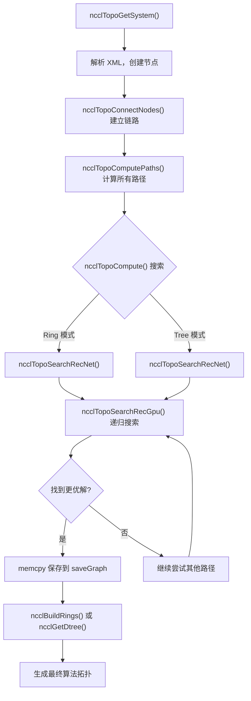
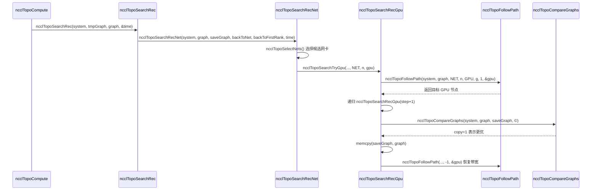

# 第 4 章：第 4 章：拓扑发现与图搜索：NCCL 如何“看清”多 GPU 系统的物理互联

# 第 4 章：拓扑发现与图搜索：NCCL 如何“看清”多 GPU 系统的物理互联

上一章我们沿 ncclCommInitRank 的调用链逐层下钻，看到了 comm->topo 字段被填充的时机，但并未展开它内部的结构。那么，NCCL 究竟是如何“看见”机器里的 GPU 和网卡，并将它们组织成可用的拓扑信息的？本章将拆解这一过程的三个关键环节：topo.cc 负责将物理设备枚举成一张图，search.cc 在这张图上搜索最优路径，rings.cc 和 trees.cc 则把搜索结果具体化为 Ring 与 Tree 两种算法拓扑。理解这三者的配合，才能明白 NCCL 为何能在不同机器上自动选到合适的算法。

# 拓扑图：把机器画成一张"地铁线路图"

## 直觉模型

想象你是一个刚到陌生城市的快递员。你要把包裹从 A 点送到 B 点，但你不知道哪条路最快。你需要一张地图——上面标着所有站点（GPU、网卡、CPU、PCI 交换机）以及站点之间的连接（NVLink、PCIe、网络）。NCCL 的拓扑图就是这张地图。

如果没有这张图，NCCL 只能盲目地假设"所有 GPU 之间带宽相同"，在 8 卡 NVLink 全互联的机器上或许还能凑合，但一旦遇到跨 NUMA、跨 PCI 交换机、混合 NVLink + PCIe 的复杂拓扑，就会选错路径，把本该走 NVLink 的数据塞进慢速 PCIe，性能直接腰斩。

## 数据结构与内存布局

拓扑图的核心是`ncclTopoSystem`，它按节点类型分组存储所有设备。节点类型定义在`topoNodeTypeStr`数组里：

[FACT:src/graph/topo.cc:33-35]

```c
const char* topoNodeTypeStr[] = {"GPU", "PCI", "NVS", "CPU", "NIC", "NET", "GIN", "RMA", "DEV", "CXB"};
const char* topoLinkTypeStr[] = {"LOC", "NVL", "", "C2C", "PCI", "", "", "", "", "SYS", "NET"};
const char* topoPathTypeStr[] = {"LOC", "NVL", "NVB", "C2C", "PIX", "PXB", "P2C", "PXN", "PHB", "SYS", "NET", "DIS"};
```

这三个数组分别定义了节点类型、链路类型和路径类型的字符串表示。注意`topoPathTypeStr`的顺序——它同时充当了路径质量的排序：索引越小，路径越快。`LOC`（本地）最快，`DIS`（断开）最慢。这个顺序在后续搜索中会被反复用来比较路径优劣。

Cada nó é`ncclTopoNode`representado, e ao ser criado, diferentes campos são inicializados de acordo com o tipo. Tomando um nó GPU como exemplo:

[FACT:src/graph/topo.cc:105-141]

```c
ncclResult_t ncclTopoCreateNode(struct ncclTopoSystem* system, struct ncclTopoNode** node, int type, uint64_t id) {
  if (system->nodes[type].count == NCCL_TOPO_MAX_NODES) {
    WARN("Error : tried to create too many nodes of type %d", type);
    return ncclInternalError;
  }
  struct ncclTopoNode* n = system->nodes[type].nodes + system->nodes[type].count;
  system->nodes[type].count++;
  n->type = type;
  n->id = id;
  if (type == GPU) {
    n->gpu.dev = NCCL_TOPO_UNDEF;
    n->gpu.rank = NCCL_TOPO_UNDEF;
    n->gpu.cudaCompCap = NCCL_TOPO_UNDEF;
    n->gpu.mloPart = NCCL_TOPO_UNDEF;
  } else if (type == CPU) {
    ...
```

Aqui há alguns pontos de design cruciais. Primeiro, os nós são armazenados em um array pré-alocado (`system->nodes[type].nodes`), em vez de uma lista encadeada. Isso significa que os nós estão dispostos de forma contígua na memória, o que é amigável para o cache durante a travessia. Segundo,`NCCL_TOPO_MAX_NODES`é um limite máximo rígido, e excedê-lo gera erro — isso é para evitar crescimento infinito em caso de anomalias na topologia. Terceiro, cada nó tem um campo`id`, que é um inteiro de 64 bits, onde os 32 bits superiores são o systemId (identificando qual host) e os 32 bits inferiores são o localId (número do dispositivo dentro do host).

As conexões entre os nós são representadas por`ncclTopoLink`.`ncclTopoConnectNodes`é responsável por estabelecer conexões bidirecionais:

[FACT:src/graph/topo.cc:179-204]

```c
ncclResult_t ncclTopoConnectNodes(struct ncclTopoNode* node, struct ncclTopoNode* remNode, int type, float bw) {
  // Aggregate links into higher bw for NVLink
  struct ncclTopoLink* link;
  for (link = node->links; link - node->links != NCCL_TOPO_MAX_LINKS && link->remNode; link++) {
    if (link->remNode == remNode && link->type == type) break;
  }
  if (link - node->links == NCCL_TOPO_MAX_LINKS) {
    WARN("Error : too many Topo links (max %d)", NCCL_TOPO_MAX_LINKS);
    return ncclInternalError;
  }
  if (link->remNode == NULL) node->nlinks++;
  link->type = type;
  link->remNode = remNode;
  link->bw += bw;

  // Sort links in BW descending order
  struct ncclTopoLink linkSave;
  memcpy(&linkSave, link, sizeof(struct ncclTopoLink));
  while (link != node->links) {
    if ((link - 1)->bw >= linkSave.bw) break;
    memcpy(link, link - 1, sizeof(struct ncclTopoLink));
    link--;
  }
  memcpy(link, &linkSave, sizeof(struct ncclTopoLink));
  return ncclSuccess;
}
```

Esta função faz três coisas. Primeiro, verifica se já existe um link para o mesmo destino e do mesmo tipo — se existir, acumula a largura de banda (`link->bw += bw`). Isso lida com o caso de múltiplos NVLinks conectados à mesma GPU: 4 NVLinks de 25 GB/s cada, agregados resultam em 100 GB/s. Segundo, se não encontrado, adiciona um novo link. Terceiro, após a inserção, ordena em ordem decrescente de largura de banda, para que, ao percorrer subsequentemente, os links de maior largura de banda sejam vistos primeiro.

> **[Design Inference & Architectural Trade-offs]**
> A motivação para ordenar em ordem decrescente de largura de banda é permitir que o algoritmo de busca encontre caminhos de alta largura de banda o mais cedo possível, convergindo mais rapidamente para uma solução melhor. A busca tem um limite de tempo (veremos`NCCL_SEARCH_TIMEOUT`mais adiante), e a ordenação permite que o orçamento de tempo limitado seja gasto em caminhos mais promissores.

## Passo a passo orientado por cenário

Agora, vamos inserir um cenário concreto: um servidor A100 de 8 GPUs, onde cada GPU está totalmente interconectada via NVLink, e há 4 placas de rede Mellanox ConnectX-6 em slots PCIe. Durante a inicialização do NCCL,`ncclTopoGetSystem`é chamado, lendo informações de dispositivos de um arquivo XML (gerado por`nvidia-topologyd`ou pelo próprio NCCL), e então constrói o grafo de topologia.

Primeiro passo, analisar o nó CPU.`ncclTopoAddCpu`lê a arquitetura, fabricante e modelo da CPU do XML, e cria o nó CPU:

[FACT:src/graph/topo.cc:806-875]

```c
ncclResult_t ncclTopoAddCpu(struct ncclXmlNode* xmlCpu, struct ncclTopoSystem* system) {
  int numaId;
  NCCLCHECK(xmlGetAttrInt(xmlCpu, "numaid", &numaId));
  int systemId;
  NCCLCHECK(ncclGetSystemId(system, xmlCpu, &systemId));
  struct ncclTopoNode* cpu;
  NCCLCHECK(ncclTopoCreateNode(system, &cpu, CPU, NCCL_TOPO_ID(systemId, numaId)));
  ...
  for (int s = 0; s nSubs; s++) {
    struct ncclXmlNode* node = xmlCpu->subs[s];
    if (strcmp(node->name, "pci") == 0) NCCLCHECK(ncclTopoAddPci(node, system, cpu, systemId, numaId));
    if (strcmp(node->name, "nic") == 0) {
      ...
    }
  }
  return ncclSuccess;
}
```

O nó CPU é a raiz da árvore de topologia. Sob cada CPU estão penduradas a subárvore PCI e os nós NIC.`ncclTopoAddPci`processa recursivamente a árvore PCI, criando nós GPU ao encontrar GPUs e nós NIC ao encontrar NICs.

Segundo passo, adicionar conexões NVLink. Note que`ncclTopoAddGpu`lê apenas os atributos básicos da GPU, e o comentário afirma explicitamente "Do not go any further, nvlinks will be added in a second pass":

[FACT:src/graph/topo.cc:590-598]

```c
ncclResult_t ncclTopoAddGpu(struct ncclXmlNode* xmlGpu, struct ncclTopoSystem* system, struct ncclTopoNode* gpu) {
  NCCLCHECK(xmlGetAttrInt(xmlGpu, "rank", &gpu->gpu.rank));
  NCCLCHECK(xmlGetAttrInt(xmlGpu, "sm", &gpu->gpu.cudaCompCap));
  NCCLCHECK(xmlGetAttrInt(xmlGpu, "dev", &gpu->gpu.dev));
  NCCLCHECK(xmlGetAttrInt(xmlGpu, "gdr", &gpu->gpu.gdrSupport));
  NCCLCHECK(xmlGetAttrIntDefault(xmlGpu, "mlopart", &gpu->gpu.mlopart, NCCL_TOPO_UNDEF));
  // Do not go any further, nvlinks will be added in a second pass
  return ncclSuccess;
}
```

Por que dividir em duas passagens? Porque NVLink é uma conexão entre GPUs, e ambos os nós GPU precisam existir para estabelecer o link. A primeira passagem cria todos os nós, e a segunda passagem`ncclTopoAddNvLinks`os conecta.

Terceiro passo, processar dispositivos de rede.`ncclTopoAddNic`percorre os nós filhos net/gin/rma sob o NIC, chamando as funções de adição correspondentes. Tomando`ncclTopoAddNet`como exemplo:

[FACT:src/graph/topo.cc:461-503]

```c
static ncclResult_t ncclTopoAddNet(struct ncclXmlNode* xmlNet, struct ncclXmlNode* parent,
                                   struct ncclTopoSystem* system, struct ncclTopoNode* nic, int systemId) {
  int dev;
  NCCLCHECK(xmlGetAttrInt(xmlNet, "dev", &dev));
  int64_t netId = NCCL_TOPO_ID(systemId, dev);
  struct ncclTopoNode* net;
  NCCLCHECK(ncclTopoCreateNode(system, &net, NET, netId));
  net->net.dev = dev;
  int mbps;
  NCCLCHECKNOWARN(xmlGetAttrIntDefault(xmlNet, "speed", &mbps, 0), NCCL_GRAPH);
  if (mbps net.bw = mbps / 8000.0;
  ...
  NCCLCHECK(ncclTopoConnectNodes(nic, net, LINK_NET, net->net.bw));
  NCCLCHECK(ncclTopoConnectNodes(net, nic, LINK_NET, net->net.bw));
  return ncclSuccess;
}
```

Note a conversão`mbps / 8000.0`: mbps é megabits por segundo, dividido por 8000 resulta em GB/s (pois 1 GB/s = 8000 Mbps). Se a placa de rede reportar speed = -1 (algumas placas virtuais fazem isso), assume-se o padrão de 10000 Mbps = 1.25 GB/s.

Quarto passo, finalização.`ncclTopoGetSystemFromXml`Após completar a adição de todos os nós e links, também realiza algumas tarefas de limpeza:

[FACT:src/graph/topo.cc:1080-1088]

```c
  NCCLCHECK(ncclTopoAddNvLinks(topNode, *topoSystem, NULL, 0));
  NCCLCHECK(ncclTopoAddC2c(topNode, *topoSystem, NULL, 0));
  NCCLCHECK(ncclTopoAddPciLinks(topNode, *topoSystem, NULL, 0));

  NCCLCHECK(ncclTopoFlattenBcmSwitches(*topoSystem));
  NCCLCHECK(ncclTopoConnectCpus(*topoSystem));
  NCCLCHECK(ncclTopoSortSystem(*topoSystem));
```

`ncclTopoFlattenBcmSwitches`lida com o caso especial dos switches PCIe Broadcom Gen4 — eles se apresentam como switches de duas camadas, mas na verdade são de largura de banda total, e precisam ser "achatados" para evitar que o algoritmo de busca seja enganado.`ncclTopoConnectCpus`conecta todos os nós CPU entre si (acesso跨 NUMA via link SYS).`ncclTopoSortSystem`ordena os links, colocando os links PCI downstream na frente, para facilitar a travessia.

## Reflexões de design e armadilhas em produção

> **[Design Inference & Architectural Trade-offs]**
> **Por que usar XML como formato intermediário?**Porque a descoberta de topologia precisa ser compartilhada entre processos — cada rank sonda apenas as GPUs que gerencia, depois troca XML via bootstrap, e finalmente funde em uma topologia completa. XML é um formato de texto autodescritivo, fácil de depurar (pode ser dumpado para inspeção) e compatível com versões.

**Armadilha um:`ncclTopoGetNode`não gera erro quando não encontra um nó.**Veja esta função:

[FACT:src/graph/topo.cc:95-103]

```c
ncclResult_t ncclTopoGetNode(struct ncclTopoSystem* system, struct ncclTopoNode** node, int type, uint64_t id) {
  for (int i = 0; i nodes[type].count; i++) {
    if (system->nodes[type].nodes[i].id == id) {
      *node = system->nodes[type].nodes + i;
      return ncclSuccess;
    }
  }
  return ncclSuccess;
}
```

Se não encontrado, retorna`ncclSuccess`mas`*node`permanece inalterado (o chamador geralmente inicializa como NULL). O chamador deve verificar`*node == NULL`por conta própria. Esse design é propenso a falhas de verificação — se o chamador esquecer de verificar, uma desreferência subsequente causará crash.

**Armadilha dois:`ncclTopoConnectNodes`A acumulação de largura de banda em**pode causar overflow.`link->bw += bw`Se houver muitos links entre o mesmo par de nós (como em cenários NVSwitch),

**pode acumular para valores muito grandes. Embora a precisão de float seja suficiente, se o número de links for anormalmente grande, a lógica de ordenação pode apresentar problemas.`ncclTopoRemoveNode`Armadilha três:**Correção de ponteiros em

[FACT:src/graph/topo.cc:143-177]

```c
ncclResult_t ncclTopoRemoveNode(struct ncclTopoSystem* system, int type, int index) {
  struct ncclTopoNode* delNode = system->nodes[type].nodes + index;
  for (int t = 0; t paths[t] != nullptr) {
      WARN("Cannot remove topology node %d/%lx while paths are computed", type, delNode->id);
      return ncclInternalError;
    }
    for (int n = 0; n nodes[t].count; n++) {
      struct ncclTopoNode* node = system->nodes[t].nodes + n;
      if (node == delNode) continue;
      for (int l = 0; l nlinks; l++) {
        while (l nlinks && node->links[l].remNode == delNode) {
          memmove(node->links + l, node->links + l + 1, (node->nlinks - l - 1) * sizeof(struct ncclTopoLink));
          node->nlinks--;
        }
        if (l nlinks && node->links[l].remNode->type == type && node->links[l].remNode >= delNode) {
          node->links[l].remNode--;
        }
      }
    }
  }
  ...
```

Copiar`node->links[l].remNode--`Há uma sutileza aqui:`sizeof(struct ncclTopoNode)`está corrigindo ponteiros. Como os nós são armazenados em um array contíguo, após remover um nó, os endereços dos nós subsequentes avançam uma posição`memmove`Executado antes, a ordem é crucial.

# Busca de caminho: encontrar a "rota ótima" no grafo

## Modelo intuitivo

Ter um mapa não é suficiente, você também precisa de um algoritmo de navegação. A busca de caminho do NCCL é dividida em duas camadas: a primeira camada é o pré-processamento, que calcula o caminho mais curto entre todos os pares de nós (BFS); a segunda camada é a busca no grafo, que tenta diferentes estruturas Ring/Tree sobre os resultados do pré-processamento para encontrar a de maior largura de banda.

Sem a busca de caminho, o NCCL só poderia codificar rigidamente uma ordem fixa como "GPU 0 conecta GPU 1 conecta GPU 2...", o que em topologias não uniformes selecionaria caminhos lentos.

## Estruturas de dados e layout de memória

A estrutura de dados central da busca de caminho é`ncclTopoLinkList`, que armazena o caminho completo de um nó de origem a um nó de destino:

```c
struct ncclTopoLinkList {
  struct ncclTopoLink* list[NCCL_TOPO_MAX_HOPS];  // 路径上的链路
  int count;      // 跳数
  float bw;       // 瓶颈带宽
  int type;       // 路径类型（PATH_LOC, PATH_NVL, ...）
  int capacity;   // list 数组的容量
};
```

Cada nó possui um array`paths[type]`, que armazena os caminhos para todos os nós desse tipo. Por exemplo, o`paths[NET]`de um nó GPU armazena os caminhos para todas as placas de rede.

O cálculo de caminho é realizado por`ncclTopoSetPaths`, que é uma BFS:

[FACT:src/graph/paths.cc:52-147]

```c
static ncclResult_t ncclTopoSetPaths(struct ncclTopoNode* baseNode, struct ncclTopoSystem* system) {
  if (baseNode->paths[baseNode->type] == NULL) {
    NCCLCHECK(ncclCalloc(baseNode->paths + baseNode->type, system->nodes[baseNode->type].count));
    for (int i = 0; i nodes[baseNode->type].count; i++) baseNode->paths[baseNode->type][i].type = PATH_DIS;
  }

  // breadth-first search to set all paths to that node in the system
  struct ncclTopoNodeList nodeList;
  struct ncclTopoNodeList nextNodeList = {{0}, 0};
  nodeList.count = 1;
  nodeList.list[0] = baseNode;
  ...
  while (nodeList.count) {
    nextNodeList.count = 0;
    for (int n = 0; n type, baseNode->id, &path));
      for (int l = 0; l nlinks; l++) {
        struct ncclTopoLink* link = node->links + l;
        struct ncclTopoNode* remNode = link->remNode;
        ...
        float bw = std::min(path->bw, link->bw);
        ...
        // Update if better path type, OR same type with higher bw, OR same type/bw with strickly fewer hops.
        if (newType type || (newType == remPath->type && remPath->bw type && remPath->bw == bw && remPath->count > (path->count + 1))) {
          ...
          remPath->bw = bw;
          remPath->type = newType;
          ...
        }
      }
    }
    memcpy(&nodeList, &nextNodeList, sizeof(nodeList));
  }
  return ncclSuccess;
}
```

A BFS parte de`baseNode`e expande camada por camada. A cada novo nó alcançado, calcula-se a largura de banda de gargalo do caminho (`std::min(path->bw, link->bw)`) e o tipo do caminho. O cálculo do tipo de caminho tem algumas regras especiais:

- Se passar por dois switches PCI, o tipo é elevado para`PATH_PXB`
- Se passar pela CPU, o tipo é elevado para`PATH_PHB`
- Se passar por um nó DEV e for NVLink, o tipo é elevado para`PATH_NVB`

A condição de atualização é "caminho melhor": tipo melhor, ou mesmo tipo mas maior largura de banda, ou mesmo tipo e largura de banda mas menos hops.

## Walkthrough passo a passo orientado por cenários

Agora vejamos a busca da segunda camada.`ncclTopoCompute`é a entrada, que tenta diferentes combinações de parâmetros e chama`ncclTopoSearchRec`para realizar a busca.

O núcleo da busca é a função recursiva`ncclTopoSearchRecGpu`. Ela parte de uma GPU e tenta chegar à próxima GPU, até percorrer todas as GPUs formando um caminho:

[FACT:src/graph/search.cc:639-756]

```c
ncclResult_t ncclTopoSearchRecGpu(struct ncclTopoSystem* system, struct ncclTopoGraph* graph,
                                  struct ncclTopoGraph* saveGraph, struct ncclTopoNode* gpu, int step, int backToNet,
                                  int backToFirstRank, int forcedOrder, int* time) {
  if ((*time) nChannels++;
    NCCLCHECKGOTO(ncclTopoCompareGraphs(system, graph, saveGraph, ©), ret, exit);
    if (copy) {
      memcpy(saveGraph, graph, sizeof(struct ncclTopoGraph));
      if (graph->nChannels == graph->maxChannels) *time = -1;
    }
    if (graph->nChannels maxChannels) {
      NCCLCHECKGOTO(ncclTopoSearchRec(system, graph, saveGraph, time), ret, exit);
    }
    graph->nChannels--;
    ret = ncclSuccess;
    goto exit;
  }
  graph->intra[graph->nChannels * ngpus + step] = gpu->gpu.rank;
  g = gpu - system->nodes[GPU].nodes;
  if (step == backToNet) {
    // first get back to NIC
    ...
  } else if (graph->pattern == NCCL_TOPO_PATTERN_NVLS) {
    ...
  } else if (step nodes[GPU].count - 1) {
    // Go to next GPU
    ...
  } else if (step == backToFirstRank) {
    // Find first GPU and loop back to it
    ...
  } else {
    // Next path
    NCCLCHECKGOTO(ncclTopoSearchRecGpu(system, graph, saveGraph, gpu, ngpus, -1, -1, forcedOrder, time), ret, exit);
  }
  ...
}
```

Esta função tem alguns ramos principais:

1. **`step == ngpus`**: todas as GPUs já foram percorridas, formando um caminho completo. Nesse momento incrementa-se`nChannels`, compara-se o grafo atual com o melhor grafo salvo e, se for melhor, salva-se. Em seguida, chama-se recursivamente`ncclTopoSearchRec`para tentar buscar o próximo channel.

2. **`step == backToNet`**: é necessário voltar à placa de rede. Isso ocorre no modo Ring (a última GPU deve conectar de volta à placa de rede inicial) ou no modo Tree (a primeira GPU deve conectar à placa de rede).

3. **`step < ngpus - 1`**: continua para a próxima GPU. Aqui chama-se`ncclTopoSearchNextGpuSort`para ordenar as GPUs candidatas.

4. **`step == backToFirstRank`**: no modo Ring, a última GPU deve conectar de volta à primeira GPU.

5. **`else`**: o caminho termina e passa-se para a próxima rodada.

`ncclTopoSearchNextGpuSort`determina a ordem de tentativa da próxima GPU:

[FACT:src/graph/search.cc:254-327]

```c
ncclResult_t ncclTopoSearchNextGpuSort(struct ncclTopoSystem* system, struct ncclTopoGraph* graph,
                                       struct ncclTopoNode* gpu, int* next, int* countPtr, int sortNet) {
  const uint64_t flag = 1ULL nChannels);
  int ngpus = system->nodes[GPU].count;
  struct ncclTopoLinkList* paths = gpu->paths[GPU];
  ...
  for (int i = 1; i nodes[GPU].nodes[g].used & flag) continue;
    scores[count].g = g;
    scores[count].startIndex = i;
    scores[count].intraNhops = paths[g].count;
    scores[count].intraBw = paths[g].bw;
    if (netPaths) {
      scores[count].interNhops = netPaths[g].count;
      scores[count].interPciBw = gpuPciBw(system->nodes[GPU].nodes + g);
      scores[count].interBw = netPaths[g].bw;
    }
    count++;
  }

  // Sort GPUs
  qsort(scores, count, sizeof(struct ncclGpuScore), cmpScore);
  ...
}
```

Ela pontua cada GPU candidata e a regra de ordenação é: primeiro compara interBw (largura de banda até a placa de rede), depois interPciBw, depois interNhops, depois intraBw e por fim intraNhops. Essa prioridade reflete o objetivo de otimização do NCCL: a comunicação entre máquinas é o gargalo, então prioriza-se GPUs com maior largura de banda até a placa de rede.

## Reflexões de design e armadilhas em produção

**Por que a busca tem timeout?**Veja estas constantes:

[FACT:src/graph/search.cc:329-330]

```c
#define NCCL_SEARCH_GLOBAL_TIMEOUT (1ULL count, bw, &step));
  if (step count) goto rewind;
  // Enough bandwidth : return destination node.
  graph->nHops += mult * path->count;
  *node = system->nodes[type2].nodes + index2;
  return ncclSuccess;
rewind:
  // Not enough bandwidth : rewind and exit.
  NCCLCHECK(followPath(path, node1, step, -bw, &step));
  return ncclSuccess;
}
```

`followPath`Copiar`bw`modifica o`followPath`de cada link no caminho (deduzindo a largura de banda já utilizada). Se a busca falhar, é necessário chamar`-bw`para restaurar com

**. Esse padrão de "deduzir-restaurar" é muito propenso a erros em busca recursiva — se algum ramo esquecer de restaurar, as buscas subsequentes verão larguras de banda incorretas.`ncclTopoCompareGraphs`Armadilha 2:**A lógica de comparação de`nChannels * bwIntra`é bastante sutil.

[FACT:src/graph/search.cc:446-477]

```c
ncclResult_t ncclTopoCompareGraphs(struct ncclTopoSystem* system, struct ncclTopoGraph* graph,
                                   struct ncclTopoGraph* refGraph, int* copy) {
  // 1. Try to get the same nChannels between Rings and Trees
  if (graph->nChannels minChannels) return ncclSuccess;
  const bool evenReference = refGraph->nChannels > 0 && !(refGraph->nChannels & 1);
  const bool evenReferenceIsBetter = refGraph->nChannels * refGraph->bwIntra >= graph->nChannels * graph->bwIntra;
  // Favor an even number of channels when aggregate bandwidth is equal or better.
  if (graph->pattern != NCCL_TOPO_PATTERN_NVLS && evenReference && (graph->nChannels & 1) &&
      graph->nChannels nodes[NET].count && evenReferenceIsBetter)
    return ncclSuccess;
  ...
```

> **[Design Inference & Architectural Trade-offs]**
> Copiar

# 〔Inferência de design e trade-offs arquiteturais〕

## Por que preferir channels pares? Porque o algoritmo Ring consegue emparelhar melhor com channels pares — cada channel pode ser dividido em duas metades, uma no sentido horário e outra no anti-horário, reduzindo o congestionamento da rede.

Ring e Tree: transformando resultados de busca em topologia de algoritmo

Modelo intuitivo

## O algoritmo de busca encontra um conjunto de caminhos, mas o algoritmo precisa de uma ordem explícita de "quem envia para quem". O Ring encadeia todos os ranks em um anel, onde cada rank recebe do anterior e envia para o próximo. O Tree é uma árvore, onde os dados fluem da raiz para baixo ou convergem das folhas para cima.

Sem esses dois módulos, o algoritmo de busca apenas encontraria um monte de caminhos, sem conseguir dizer ao kernel da GPU como enviar os dados especificamente.`ncclBuildRings`Estruturas de dados e layout de memória

[FACT:src/graph/rings.cc:29-74]

```c
ncclResult_t ncclBuildRings(int nrings, int* rings, int rank, int nranks, int* prev, int* next) {
  ncclResult_t ret = ncclSuccess;
  uint64_t* rankFound;
  int rankFoundSize = DIVUP(nranks, 64);
  NCCLCHECK(ncclCalloc(&rankFound, rankFoundSize));

  for (int r = 0; r  0 so it has to be our child 1, not 0.
    *d1 = nranks > 1 ? bit >> 1 : -1;
    return ncclSuccess;
  }

  up = (rank ^ bit) | (bit = nranks) up = (rank ^ bit);
  *parentChildType = (rank > 1;
  // down0 is always within bounds
  down0 = lowbit == 0 ? -1 : rank - lowbit;

  down1 = lowbit == 0 ? -1 : rank + lowbit;
  // Make sure down1 is within bounds
  while (down1 >= nranks) {
    down1 = lowbit == 0 ? -1 : rank + lowbit;
    lowbit >>= 1;
  }
  *d0 = down0;
  *d1 = down1;

  return ncclSuccess;
}
```

:`bit`Copiar`(rank ^ bit) | (bit << 1)`Esta função constrói uma árvore binária usando operações de bits. A ideia central é: encontrar o bit não nulo mais baixo do rank`rank - (bit >> 1)`, o nó pai é`rank + (bit >> 1)`, o filho esquerdo é

## , o filho direito é

Tomemos como exemplo um Ring com 8 GPUs. Suponha que o resultado da pesquisa forneça para cada rank o`next`ponteiro:

```
rank 0 -> rank 1
rank 1 -> rank 2
...
rank 7 -> rank 0
```

`ncclBuildRings`Partindo do rank 0, visita sequencialmente 1, 2, ..., 7 e finalmente retorna a 0. O`rings[0..7] = {0, 1, 2, 3, 4, 5, 6, 7}`。

Para Tree,`ncclGetBtree`calcula o nó pai e os nós filhos para cada rank. Tomando o rank 1 como exemplo:

- `bit`= 1 (o bit não nulo mais baixo é o bit 0)
- `up = (1 ^ 1) | (1 << 1) = 0 | 2 = 2`
- `up >= nranks`? 2 < 8, então`up = 2`
- `parentChildType = (1 < 2) ? 0 : 1 = 0`(é o primeiro filho do nó pai)
- `lowbit = 0`, então`down0 = -1`
- `down1 = -1`

Portanto, o nó pai do rank 1 é o rank 2, e não tem nós filhos. Isso está de acordo com a estrutura de árvore nos comentários: o rank 1 é uma folha.

## Reflexões de design e armadilhas em produção

> **[Design Inference & Architectural Trade-offs]**
> **Por que Tree usa operações bit a bit em vez de construir a árvore explicitamente?**Porque cada rank só precisa saber seu nó pai e seus nós filhos, não precisa da estrutura global da árvore. As operações bit a bit podem calcular essas informações em tempo O(1), evitando o custo de armazenar e sincronizar a árvore inteira.

**Armadilha 1:`ncclBuildRings`A validação de pode ser ignorada.**Se o`next`array tiver um ciclo (por exemplo, rank 0 -> rank 1 -> rank 0), o loop sairá após`nranks`iterações, mas a`current != rank`verificação irá capturar esse problema. Mas se o comprimento do ciclo for exatamente`nranks`um fator de, e não incluir todos os ranks,`rankFound`a verificação irá capturar.

**Armadilha 2:`ncclGetDtree`O tratamento de ranks ímpares em.**Para um número ímpar de ranks, a segunda árvore é um "deslocamento" em vez de um "espelhamento":

[FACT:src/graph/trees.cc:90-112]

```c
ncclResult_t ncclGetDtree(int nranks, int rank, int* s0, int* d0_0, int* d0_1, int* parentChildType0, int* s1,
                          int* d1_0, int* d1_1, int* parentChildType1) {
  // First tree ... use a btree
  ncclGetBtree(nranks, rank, s0, d0_0, d0_1, parentChildType0);
  // Second tree ... mirror or shift
  if (nranks % 2 == 1) {
    // shift
    int shiftrank = (rank - 1 + nranks) % nranks;
    ...
  } else {
    // mirror
    int u, d0, d1;
    ncclGetBtree(nranks, nranks - 1 - rank, &u, &d0, &d1, parentChildType1);
    *s1 = u == -1 ? -1 : nranks - 1 - u;
    ...
  }
  return ncclSuccess;
}
```

A árvore binária dupla (Double Tree) é a implementação do algoritmo Tree do NCCL — duas árvores trabalham simultaneamente, uma responsável pela primeira metade dos dados e outra pela segunda metade, melhorando a utilização de largura de banda. Com ranks ímpares, o espelhamento causaria um mapeamento de ranks incompleto, por isso usa-se o deslocamento.

# A cooperação dos três: da topologia ao algoritmo

Agora vamos conectar os três módulos. Todo o fluxo pode ser representado por um diagrama:



Este diagrama mostra o fluxo completo desde a descoberta da topologia até a geração do algoritmo. Observe que`ncclTopoSearchRecGpu`é uma função recursiva, que tentará continuamente diferentes ordens de GPU até o timeout ou até encontrar a solução ótima.

Vejamos agora um diagrama de sequência mais granular, mostrando a interação entre os módulos durante o processo de busca:



Este diagrama de sequência mostra o loop central da busca: selecionar a NIC -> tentar a GPU -> busca recursiva -> comparar resultados -> restaurar largura de banda.

# Resumo do capítulo

Este capítulo decompôs as três etapas da percepção de topologia do NCCL:

1. **Descoberta de topologia**（`topo.cc`): lê informações de dispositivos a partir do XML, cria nós GPU/CPU/PCI/NIC, estabelece links NVLink/PCIe/rede, formando um grafo de topologia completo.

2. **Busca de caminho**（`search.cc` + `paths.cc`): primeiro usa BFS para pré-calcular os caminhos mais curtos entre todos os pares de nós, depois usa busca recursiva para tentar diferentes estruturas Ring/Tree, encontrando a solução com maior largura de banda.

3. **Geração de topologia de algoritmo**（`rings.cc` + `trees.cc`): converte os resultados da busca em uma ordem específica de ranks. Ring usa`ncclBuildRings`para gerar o anel, Tree usa`ncclGetBtree`para gerar a árvore binária.

# Reflexões e autoavaliação do capítulo

Q1: Se alterarmos`ncclTopoConnectNodes`a acumulação de largura de banda em`link->bw += bw`para`link->bw = std::max(link->bw, bw)`, em quais cenários isso causaria degradação de desempenho? Por quê?

**Análise de referência**: a acumulação de largura de banda lida com o caso de múltiplos links paralelos. Tomando 4 NVLinks de 25 GB/s cada como exemplo, após a acumulação temos 100 GB/s, mas com max temos apenas 25 GB/s. Em`ncclTopoSetPaths`a largura de banda do caminho é`std::min(path->bw, link->bw)`, se a largura de banda do link for subestimada, toda a largura de banda do caminho será subestimada. Isso fará com que`ncclTopoCompareGraphs`escolha o grafo errado — pode escolher uma solução com mais canais mas menor largura de banda por canal, resultando em desempenho real pior. Cenário específico: 8 GPUs A100 totalmente interconectadas por NVLink, com 4 NVLinks entre cada par de GPUs. A acumulação resulta em 100 GB/s, o max resulta em 25 GB/s. O algoritmo de busca considerará que NVLink e PCIe Gen4 x16 (cerca de 25 GB/s) têm a mesma largura de banda, podendo escolher um caminho via PCIe.

Q2: `ncclTopoSearchRecGpu`Em`(*time)--`é executado na entrada da função. Se a busca atingir timeout (`*time <= 0`), a função retorna diretamente. Em que circunstâncias esse design faria a busca entrar em loop infinito? Como corrigir?

**Análise de referência**：`(*time)--`decrementa na entrada; se`*time`o valor inicial for 0 ou negativo, a função retorna diretamente, sem decrementar. Mas se`*time`for um número positivo muito grande, cada recursão decrementará, eventualmente chegando a 0. O problema é: se a profundidade de recursão de algum ramo for muito grande, mas após cada decremento`*time`ainda for maior que 0, a busca continuará. O verdadeiro risco é`ncclTopoSearchRec`o`goto search`loop em — se`time`não for corretamente reinicializado no loop, pode causar loop infinito. Veja`ncclTopoCompute`o`globalTimeout`lógica em:`globalTimeout -= time`é executado a cada`search`rótulo; se`globalTimeout`se tornar negativo, irá`goto done`. Mas se`time`for reinicializado para`NCCL_SEARCH_TIMEOUT`，`globalTimeout`pode nunca se tornar negativo. A correção é garantir que`globalTimeout`seja decrementado após cada busca, e que haja um limite máximo rígido.

Q3: `ncclTopoFollowPath`é chamado quando a busca falha para`followPath(path, node1, step, -bw, &step)`restaurar a largura de banda. Se algum ramo recursivo retornar antes da restauração (por exemplo,`NCCLCHECKGOTO`salta para`exit`), o que aconteceria? Como detectar esse problema?

**Análise de referência**: se a restauração for ignorada, a largura de banda dos links no caminho permanecerá no estado deduzido. Buscas subsequentes verão larguras de banda incorretas, podendo perder a solução ótima. Método de detecção: em`ncclTopoCompute`Após o término, percorra todos os links e verifique se a largura de banda é consistente com o valor inicial. Se houver inconsistência, significa que houve omissão na restauração. Método de correção: usar um objeto guard no estilo RAII que restaura automaticamente a largura de banda no destrutor. Ou, antes de cada busca, salvar um snapshot da largura de banda de todos os links e restaurar após a busca. A abordagem atual do NCCL é, em cada`ncclTopoFollowPath`ponto de chamada, emparelhar manualmente as chamadas diretas e inversas, o que é propenso a erros. Um design mais robusto é encapsular a dedução e a restauração da largura de banda em uma função, garantindo que apareçam em pares.

No próximo capítulo, vamos nos aprofundar no módulo tuning para ver como o NCCL, com base nos resultados da busca de topologia e no tamanho da mensagem, faz a escolha final entre algoritmos como Ring, Tree, CollNet, etc. O grafo de topologia, os resultados da busca de caminhos e os templates de algoritmos estabelecidos neste capítulo se tornarão as entradas do módulo tuning.

Por meio da construção do grafo em topo.cc, da busca de caminhos em search.cc e da geração de topologias em rings.cc e trees.cc, o NCCL implementa a filosofia de design de descrever qualquer topologia com uma estrutura de grafo genérica, encontrar a solução ótima com algoritmos de busca configuráveis e gerar o algoritmo final com templates simples. Esse mecanismo permite que o NCCL selecione automaticamente o algoritmo adequado em diversas máquinas, de workstations com 2 GPUs a clusters com 10000 GPUs. No entanto, o grafo de topologia apenas fornece caminhos candidatos para o algoritmo; para uma comunicação específica, qual caminho seguir e qual protocolo usar ainda requer decisões mais refinadas. No próximo capítulo, vamos focar no diretório src/tuning para ver como o módulo tuning combina o modelo de custo com estimativas de algoritmos para fazer a escolha final entre Ring/Tree/NVLS/PAT e LL/LL128/Simple.
