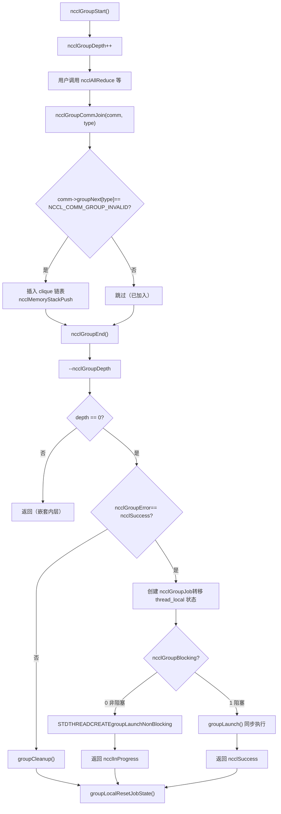
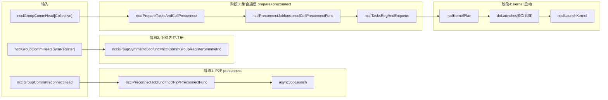

# Capítulo 7: Agendador de tarefas: como task_sched orquestra a ordem de execução de múltiplos channels e kernels

No capítulo anterior, rastreamos ncclAllReduce até ncclTaskColl — o objeto de descrição da tarefa já está em comm->planner. Mas a descrição da tarefa é apenas uma "ordem de serviço", ainda não se tornou o kernel que realmente executa na GPU. Este capítulo responderá três perguntas: como múltiplas chamadas de API são acumuladas e submetidas juntas? Como as tarefas acumuladas são divididas em múltiplos channels? O que garante a ordem e as dependências entre múltiplos kernels? Primeiro, um modelo mental geral. Imagine o NCCL como um restaurante: ncclGroupStart/ncclGroupEnd é o "carrinho de compras", onde o usuário coloca vários pratos (múltiplas chamadas de comunicação coletiva); ncclGroupEnd é "fazer o pedido", e só então a cozinha começa a preparar os pratos conforme o pedido. E doLaunches é o "despachante de pratos", que decide quais pratos saem primeiro e quais podem ser preparados em paralelo. Sem a semântica de group, cada prato é pedido individualmente, e a cozinha precisa reacender o fogo (iniciar o kernel) a cada prato, com custo enorme; sem o escalonamento por rodadas do doLaunches, os kernels de múltiplos channels seriam iniciados fora de ordem, quebrando as dependências de dados.

# I. Estado global da semântica de Group: variáveis thread_local e o modelo de "carrinho de compras"

## Modelo intuitivo

`ncclGroupStart`e`ncclGroupEnd`Todas as chamadas de comunicação entre não iniciam o kernel imediatamente, mas são "acumuladas". Onde? Em variáveis globais**thread_local (locais à thread)**. Por que thread_local? Porque o NCCL assume que chamadas de group dentro da mesma thread são seriais, e threads diferentes têm seus próprios carrinhos de compras independentes, sem interferência mútua. Se esses estados fossem variáveis globais em vez de thread_local, duas threads chamando`ncclGroupStart`simultaneamente causariam conflito, fazendo com que as tarefas de uma thread fossem submetidas pelo`ncclGroupEnd`da outra — isso seria catastrófico.

## Estruturas de dados e layout de memória

Primeiro, vejamos a definição do estado global do group.

[FACT:src/group.cc:34-34]

```cpp
thread_local int ncclGroupDepth = 0; // depth of ncclGroupStart nesting
thread_local ncclResult_t ncclGroupError = ncclSuccess;
thread_local struct ncclComm* ncclGroupCommHead[ncclGroupTaskTypeNum] = {nullptr};
thread_local struct ncclComm* ncclGroupCommPreconnectHead = nullptr;
thread_local struct ncclIntruQueue ncclAsyncJobs;
thread_local int ncclGroupBlocking = -1; /* default mode */
```

Analisando campo por campo:

- **`ncclGroupDepth`**: profundidade de aninhamento.`ncclGroupStart`pode ser chamado de forma aninhada (embora incomum), cada`ncclGroupStart`incrementa em um,`ncclGroupEnd`decrementa em um. Só quando chega a 0 é que realmente submete. É como um carrinho de compras que pode ser aninhado — você abre um subcarrinho dentro de um carrinho, e só no checkout mais externo o pedido é realmente feito.
- **`ncclGroupError`**: se qualquer chamada dentro do group falhar, o erro é registrado aqui, e tratado de forma unificada no`ncclGroupEnd`. Isso evita o estado inconsistente de "após uma chamada falhar, chamadas subsequentes ainda adicionarem coisas ao carrinho".
- **`ncclGroupCommHead[ncclGroupTaskTypeNum]`**: cabeça da lista encadeada de domínios de comunicação agrupados por tipo de tarefa.`ncclGroupTaskTypeNum`é o número de tipos de tarefa (comunicação coletiva, tarefas primitivas, tarefas de gerenciamento, registro simétrico, etc.). Cada tipo tem uma lista encadeada, cujos nós são`ncclComm`, conectados por`comm->groupNext[type]`. Por que agrupar por tipo? Porque diferentes tipos de tarefa têm momentos de submissão e relações de dependência diferentes — tarefas de comunicação coletiva precisam de preconnect primeiro, tarefas de gerenciamento (como destroy) precisam ser executadas por último.
- **`ncclGroupCommPreconnectHead`**: lista encadeada de domínios de comunicação que precisam de pré-conexão. A pré-conexão é "estabelecer as conexões de rede antecipadamente", evitando latência por estabelecer conexões apenas no momento do lançamento do kernel.
- **`ncclAsyncJobs`**: fila de tarefas assíncronas. Algumas tarefas (como`ncclCommInitRank`) são assíncronas, são colocadas nesta fila e iniciadas de forma unificada no`ncclGroupEnd`.
- **`ncclGroupBlocking`**: flag de modo de bloqueio.`-1`indica que ainda não foi determinado,`0`indica não bloqueante,`1`indica bloqueio. Não é permitido misturar domínios de comunicação bloqueantes e não bloqueantes dentro do mesmo group, caso contrário ocorrerá erro.

Aqui há um design crucial:`ncclGroupCommHead`é**array**, cada elemento é uma lista encadeada. Os nós da lista são encadeados através de`comm->groupNext[type]`, em vez de usar uma estrutura de nó de lista independente. Isso significa que`ncclComm`a struct deve reservar o campo`groupNext`array. Esse design de «lista encadeada intrusiva» evita alocação extra de memória, mas o custo é que a`ncclComm`struct se torna maior.

## Walkthrough passo a passo orientado por cenário

**Cenário**: o usuário chama`ncclGroupStart()`, depois chama duas vezes consecutivas`ncclAllReduce`(respectivamente para dois domínios de comunicação diferentes, commA e commB), e por fim chama`ncclGroupEnd()`。

**Primeiro passo:`ncclGroupStart`o que fez?**

[FACT:src/include/group.h:63-66]

```cpp
inline ncclResult_t ncclGroupStartInternal() {
  ncclGroupDepth++;
  return ncclSuccess;
}
```

Extremamente simples: incrementa a profundidade em um. Sem alocação de memória, sem locks, sem chamadas de sistema. É por isso que`ncclGroupStart`tem overhead quase zero.

**Segundo passo:`ncclAllReduce`o que acontece quando é chamado dentro do group?**

`ncclAllReduce`internamente chama`ncclGroupCommJoin(comm, ncclGroupTaskTypeCollective)`, adicionando o domínio de comunicação à lista encadeada do group.

[FACT:src/include/group.h:80-116]

```cpp
inline void ncclGroupCommJoin(struct ncclComm* comm, int type) {
  if (comm->groupNext[type] == reinterpret_cast(NCCL_COMM_GROUP_INVALID)) {
    // Insert comm into ncclGroupCommHead adjacent to sibling comms. This preserves
    // the users program order yet insures siblings occur consecutively. This
    // is required by doLaunches() in "group.cc".
    struct ncclComm** pp = &ncclGroupCommHead[type];
    while (*pp != nullptr && comm->intraComm0 != (*pp)->intraComm0) pp = &(*pp)->groupNext[type];

    // didn't find its clique, we need to insert it with ascending order based on commHash
    if (*pp == nullptr) {
      pp = &ncclGroupCommHead[type];
      while (*pp != nullptr && (*pp)->commHash commHash) pp = &(*pp)->groupNext[type];
    }
    comm->groupNext[type] = *pp;
    *pp = comm;
    // Comms gets a new memory stack scope upon joining. Each task batched for
    // this comm is allocated there.
    if (type == ncclGroupTaskTypeCollective || type == ncclGroupTaskTypeRawTask) {
      // Initialize planner
      ncclMemoryStackPush(&comm->memScoped);
      ncclKernelPlanner::Peer* tmp = comm->planner.peers;
      ncclIntruQueue* tmpRmaQueues = comm->planner.rmaTaskQueues;
      int numRmaCtx = comm->config.numRmaCtx;
      memset(&comm->planner, 0, sizeof(comm->planner));
      comm->planner.peers = tmp;
      comm->planner.bcast_info.minBcastPeer = INT_MAX;
      comm->planner.bcast_info.maxBcastPeer = INT_MIN;
      comm->planner.rmaTaskQueues = tmpRmaQueues;
      if (comm->planner.rmaTaskQueues != NULL) {
        for (int i = 0; i planner.rmaTaskQueues[i]);
        }
      }
    }
  }
  ncclGroupBlocking = comm->config.blocking;
}
```

Este trecho de código tem vários pontos engenhosos:

1. **Verificação de idempotência**：`if (comm->groupNext[type] == NCCL_COMM_GROUP_INVALID)`garante que o mesmo domínio de comunicação seja adicionado apenas uma vez dentro do mesmo group. Se o usuário chamar`ncclAllReduce`duas vezes para o mesmo comm, a segunda vez não adicionará novamente à lista encadeada, mas a tarefa será anexada a`comm->planner`.

2. **Ordenação de clique**：`intraComm0`é o identificador de «entidade global». Se múltiplos domínios de comunicação pertencem à mesma entidade global (por exemplo, divididos através de`ncclCommSplit`), seus`intraComm0`são iguais, sendo chamados de um clique. O código primeiro encontra o clique por`intraComm0`, inserindo o comm ao lado dos nós irmãos do mesmo clique. Se o clique não for encontrado, insere em ordem crescente de`commHash`. Essa ordenação é para que`doLaunches`possa tratar corretamente a sincronização de barrier dentro do clique.

3. **Escopo da pilha de memória**：`ncclMemoryStackPush(&comm->memScoped)`aloca um novo escopo de pilha de memória para este comm dentro do group. Todas as tarefas alocadas para este comm (`ncclTaskColl`etc.) são alocadas a partir desta pilha.`ncclGroupCommLeave`irá`ncclMemoryStackPop`liberar toda a memória das tarefas de uma vez — esta é a otimização clássica de «alocação em lote, liberação em lote», evitando o overhead de`malloc/free`individual para cada tarefa.

4. **Reset do planner**：`memset(&comm->planner, 0, sizeof(comm->planner))`limpa o planner, mas preserva os ponteiros`peers`e`rmaTaskQueues`(primeiro salvos em variáveis temporárias, restaurados após memset). Por que preservar? Porque esses dois são arrays pré-alocados e não precisam ser realocados a cada vez.`bcast_info`os min/max são resetados para`INT_MAX/INT_MIN`, para uso na otimização de fusão de tarefas de broadcast subsequentes.

**Terceiro passo:`ncclGroupEnd`o que fez?**

[FACT:src/group.cc:1039-1164]

`ncclGroupEndInternal`é o núcleo. Análise por trechos:

[FACT:src/group.cc:1048-1061]

```cpp
if (ncclGroupDepth == 0) {
  WARN("ncclGroupEnd: not in a group call.");
  ret = ncclInvalidUsage;
  goto exit;
}
// ...
if ((--ncclGroupDepth) > 0) goto exit;
```

Primeiro verifica a profundidade, depois decrementa em um. Se após o decremento ainda for maior que 0, significa que ainda está dentro de um group aninhado interno, retorna diretamente sem submeter. Só continua quando decrementa até 0.

[FACT:src/group.cc:1063]

```cpp
if ((ret = ncclGroupError) != ncclSuccess) goto fail;
```

Se qualquer chamada dentro do group falhou, pula diretamente para a limpeza de fail.

[FACT:src/group.cc:1084-1093]

```cpp
NEW_NOTHROW_GOTO(groupJob, ncclGroupJob, ret, fail);
ncclIntruQueueConstruct(&groupJob->asyncJobs);
groupJob->groupRefCount = 0;
groupJob->nonBlockingInit = false;
memcpy(groupJob->groupCommHead, ncclGroupCommHead, sizeof(ncclGroupCommHead));
groupJob->groupCommPreconnectHead = ncclGroupCommPreconnectHead;
groupJob->groupError = ncclSuccess;
groupJob->abortFlag = false;
groupJob->joined = false;
ncclIntruQueueTransfer(&groupJob->asyncJobs, &ncclAsyncJobs);
```

Cria um`ncclGroupJob`, «transferindo» o estado do group thread_local para o objeto job.`ncclIntruQueueTransfer`transfere toda a fila`ncclAsyncJobs`para`groupJob->asyncJobs`. Este passo é crucial: o estado thread_local é «temporário», o objeto job é «persistente» e pode ser mantido por threads assíncronas.

[FACT:src/group.cc:1095-1147]

```cpp
if (hasCommHead || !ncclIntruQueueEmpty(&groupJob->asyncJobs) || ncclGroupCommPreconnectHead != nullptr) {
  /* make sure ncclGroupBlocking has been set. */
  if (ncclGroupBlocking != 0 && ncclGroupBlocking != 1) {
    WARN("Invalid group blocking state %d", ncclGroupBlocking);
    ret = ncclInternalError;
    goto fail;
  }
  if (ncclGroupBlocking == 0) {
    /* nonblocking group */
    // ... 设置 async error 为 ncclInProgress，创建线程执行 groupLaunchNonBlocking
    groupJob->base.func = groupLaunchNonBlocking;
    STDTHREADCREATE_GOTO(groupJob->base.thread, ncclAsyncJobMain, ret, fail, &groupJob->base);
    groupJob->nonBlockingInit = true;
    ret = ncclInProgress;
  } else {
    /* blocking group */
    int savedDev;
    CUDACHECKGOTO(cudaGetDevice(&savedDev), ret, fail);
    NCCLCHECKGOTO(groupLaunch(&groupJob->base, internalSimInfoPtr), ret, fail);
    CUDACHECKGOTO(cudaSetDevice(savedDev), ret, fail);
    if (simInfo) memcpy((void*)simInfo, (void*)internalSimInfoPtr, realSize);
    delete groupJob;
  }
} else {
  // Free when not needed (single rank case)
  delete groupJob;
}
```

Modo bloqueante: chama diretamente`groupLaunch`na thread atual, completando sincronamente. Modo não bloqueante: cria uma thread para executar`groupLaunchNonBlocking`, retornando imediatamente`ncclInProgress`. O usuário posteriormente consulta o progresso através de`ncclCommGetAsyncError`.

Atenção ao salvamento e restauração de`cudaGetDevice`/`cudaSetDevice`:`groupLaunch`internamente troca o dispositivo CUDA (porque diferentes comms podem estar em GPUs diferentes), restaurando o dispositivo original do usuário após a execução. Isso evita que «após a troca interna de dispositivo pelo NCCL não voltar» faça com que chamadas CUDA subsequentes do usuário executem no dispositivo errado.

## Reflexões de design e armadilhas em produção

**Armadilha 1: mistura de domínios de comunicação bloqueantes e não bloqueantes**。`ncclAsyncLaunch`há uma verificação:

[FACT:src/group.cc:55-64]

```cpp
/* check if there are blocking and nonblocking comms at the same time in group. */
if (comm->destroyFlag) {
  ncclGroupBlocking = 1;
} else if (ncclGroupBlocking == -1) {
  /* first met communicator */
  ncclGroupBlocking = comm->config.blocking;
} else if (ncclGroupBlocking != comm->config.blocking) {
  WARN("Blocking and nonblocking communicators are not allowed in the same group.");
  ret = ncclInvalidArgument;
}
```

Por que não é permitido misturar? Porque groups bloqueantes executam sincronamente na thread atual, groups não bloqueantes executam assincronamente em thread independente. Se misturados, não é possível determinar se`ncclGroupEnd`deve retornar sincronamente ou retornar`ncclInProgress`. Em ambiente de produção, se o usuário acidentalmente colocar comms bloqueantes e não bloqueantes no mesmo group, receberá`ncclInvalidArgument`, mas nesse momento o estado do group já foi contaminado, sendo necessário`ncclGroupStart`。

**Armadilha 2:`ncclGroupError`propagação de**. Se alguma chamada dentro do group falhar,`ncclGroupError`é definido,`ncclGroupEnd`pulará para o branch fail executando`groupCleanup`。`groupCleanup`percorrerá todos os comms, liberando a memória do plan no planner, resetando o planner, limpando a rawTaskQueue. Se este passo não for feito completamente, na próxima vez que`ncclGroupStart`for chamado, dados antigos residuais no planner causarão submissão duplicada de tarefas ou vazamento de memória.

[FACT:src/group.cc:514-607]

```cpp
static void groupCleanup(struct ncclComm** groupCommHeadPtr,
                         struct ncclIntruQueue* asyncJobsPtr,
                         ncclResult_t error) {
  struct ncclComm* comm;
  for (int type = 0; type groupNext[type];
      (void)ncclGroupCommLeave(comm, type);
      // We don't know if preconnect succeeded or happened at all, so clear
      // the flags that let `taskAppend()` skip over checking if preconnect
      // is needed.
      if (type == ncclGroupTaskTypeCollective || type == ncclGroupTaskTypeRawTask) {
        comm->preconnectNext = reinterpret_cast(0x1);
        for (int i = 0; i nRanks; i++) {
          comm->connectSend[i] = 0UL;
          comm->connectRecv[i] = 0UL;
        }
        // Reclaim abandoned kernel plan memory.
        while (!ncclIntruQueueEmpty(&comm->planner.planQueue)) {
          struct ncclKernelPlan* plan = ncclIntruQueueDequeue(&comm->planner.planQueue);
          if (!plan->persistent) {
            while (!ncclIntruQueueEmpty(&plan->proxyOpQueue)) {
              struct ncclProxyOp* pxop = ncclIntruQueueDequeue(&plan->proxyOpQueue);
              ncclMemoryPoolFree(&comm->memPool_ncclProxyOp, pxop);
            }
            ncclMemoryPoolFree(&comm->memPool_ncclKernelPlan, plan);
          }
        }
        // Reset comm->planner to empty.
        // ...
      }
      // ...
    }
  }
  // ...
}
```

Atenção à linha`comm->preconnectNext = reinterpret_cast<struct ncclComm*>(0x1)`. Este é um «valor sentinela», indicando que «este comm precisa reconectar preconnect». Por quê? Porque durante o cleanup não se sabe se o preconnect foi bem-sucedido, então força-se a reverificação na próxima vez.`0x1`este valor é muito engenhoso — não é um ponteiro válido, mas pode ser usado como marcador de «não inicializado».`ncclGroupCommPreconnect`verifica`if (comm->preconnectNext == reinterpret_cast<struct ncclComm*>(0x1))`para determinar se precisa adicionar à lista encadeada de preconnect.

---

# Dois, preparação de tarefas:`ncclPrepareTasks`como transformar descrições de tarefas em unidades agendáveis

## Modelo intuitivo

`ncclPrepareTasks`É a etapa de "preparação dos ingredientes". Os ingredientes no carrinho de compras (descrição da tarefa) ainda estão crus e precisam ser lavados, cortados e preparados (determinar algoritmo, protocolo, divisão de channel) antes de ir para a panela (iniciar o kernel). Se pular essa etapa e iniciar o kernel diretamente, o kernel não saberá como dividir os dados nem qual caminho seguir, e irá travar imediatamente.

## Walkthrough Step-by-Step orientado por cenários

`ncclPrepareTasks`Em`groupLaunchLegacy`é chamado:

[FACT:src/group.cc:705-746]

```cpp
static ncclResult_t ncclPrepareTasksAndCollPreconnect(
  struct ncclComm* comm, ncclSimInfo_t* simInfo,
  struct ncclIntruQueue* asyncCollJobs) {
  if (ncclParamSingleProcMemRegEnable()) {
    // 单进程内存注册模式：把 prepare 和 preconnect 合并成一个异步 job
    struct ncclPrepareTasksAndCollPreconnectJob* job;
    NEW_NOTHROW(job, ncclPrepareTasksAndCollPreconnectJob);
    job->base.func = ncclPrepareTasksAndCollPreconnectFunc;
    // ...
    ncclIntruQueueEnqueue(asyncCollJobs, &job->base);
  } else {
    bool needConnect = false;
    bool algoNeedConnect[NCCL_NUM_ALGORITHMS];
    memset(algoNeedConnect, 0, sizeof(bool) * NCCL_NUM_ALGORITHMS);

    CUDACHECK(cudaSetDevice(comm->cudaDev));
    NCCLCHECK(ncclPrepareTasks(comm, algoNeedConnect, &needConnect, simInfo));

    if (comm->cuMemSupport && needConnect) {
      // 创建 preconnect job
      struct ncclPreconnectJob* job;
      NEW_NOTHROW(job, ncclPreconnectJob);
      job->base.func = ncclCollPreconnectFunc;
      // ...
      ncclIntruQueueEnqueue(asyncCollJobs, &job->base);
    }
  }
  return ncclSuccess;
}
```

`ncclPrepareTasks`A saída de são duas coisas:`algoNeedConnect`array (quais algoritmos precisam estabelecer conexão) e`needConnect`flag (se a conexão é necessária). Se`needConnect`for verdadeiro e cuMem for suportado, cria um preconnect job para execução assíncrona.

`ncclPrepareTasks`O que é feito internamente? Ele percorre`comm->planner`as tarefas em , determina o algoritmo e o protocolo para cada tarefa, e então chama`taskAppend`para anexar a tarefa ao plan do planner. Essa lógica já foi detalhada no capítulo anterior e não será repetida aqui.

Pontos-chave:`ncclPrepareTasks`é**chamado comm por comm**, mas o preconnect é**executado em lote por clique**. Por quê? Veja`groupLaunchLegacy`os comentários em :

[FACT:src/group.cc:818-834]

```cpp
do {
  // We need to preconnect connections for collectives clique by clique to avoid
  // race condition for split shared comms which can connect the same connections
  // at the same time.
  comm = cliqueHead;
  do {
    NCCLCHECKGOTO(ncclPrepareTasksAndCollPreconnect(comm, simInfo, &asyncCollJobs), ret, fail);
    comm = comm->groupNext[ncclGroupTaskTypeCollective];
  } while (comm != nullptr && comm->intraComm0 == cliqueHead->intraComm0);
  // connect
  NCCLCHECKGOTO(asyncJobLaunch(&asyncCollJobs, groupAbortFlag), ret, fail);
  // ...
  cliqueHead = comm;
} while (cliqueHead != nullptr);
```

O comentário deixa claro:**Executar preconnect clique por clique, evitando que split shared comms conecte o mesmo grupo de conexões simultaneamente e cause race condition**. Se dois comms foram divididos a partir do mesmo comm pai, eles podem compartilhar algumas conexões. Se o preconnect for paralelo, duas threads podem tentar estabelecer a mesma conexão ao mesmo tempo, causando conexões duplicadas ou estado de conexão inconsistente. A execução serial por clique garante que apenas um clique esteja estabelecendo conexões por vez.

## Controle de concorrência e interação de baixo nível

`asyncJobLaunch`é o núcleo da inicialização de tarefas assíncronas:

[FACT:src/group.cc:609-678]

```cpp
static ncclResult_t asyncJobLaunch(struct ncclIntruQueue* asyncJobsMain,
                                   volatile bool* groupAbortFlag) {
  ncclResult_t ret = ncclSuccess;
  bool jobsDone = false;
  bool errorJobAbortFlag = false;

  if (!ncclIntruQueueEmpty(asyncJobsMain)) {
    struct ncclAsyncJob* job = ncclIntruQueueHead(asyncJobsMain);
    if (job->next == nullptr) {
      // 只有一个 job，直接在当前线程执行，避免线程创建开销
      job->isThreadMain = true;
      ncclAsyncJobMain(job);
      job->state = ncclGroupJobJoined;
      return job->result;
    }
    // 多个 job，每个创建一个线程
    do {
      STDTHREADCREATE(job->thread, ncclAsyncJobMain, job);
      job = job->next;
    } while (job != nullptr);

    do {
      jobsDone = true;
      job = ncclIntruQueueHead(asyncJobsMain);
      do {
        ncclGroupJobState_t state = COMPILER_ATOMIC_LOAD(&job->state, std::memory_order_acquire);
        if (state == ncclGroupJobRunning) {
          jobsDone = false;
        } else if (state == ncclGroupJobDone) {
          int err;
          if ((err = ncclThreadJoin(job->thread)) != ncclSuccess) {
            WARN("asyncJobLaunch: failed to join thread for job");
            ret = ncclSystemError;
          }
          job->state = ncclGroupJobJoined;
          if (job->result != ncclSuccess && ret == ncclSuccess) {
            ret = job->result;
            errorJobAbortFlag = true;
          }
        } else {
          // safety check
          if (state != ncclGroupJobJoined) {
            WARN("Async job state is %d, expected %d", state, ncclGroupJobJoined);
            if (ret == ncclSuccess) ret = ncclInternalError;
            errorJobAbortFlag = true;
          }
        }

        if (!job->destroyFlag &&
            (COMPILER_ATOMIC_LOAD(groupAbortFlag, std::memory_order_acquire) || errorJobAbortFlag == true)) {
          COMPILER_ATOMIC_STORE(job->abortFlag, uint32_t(1), std::memory_order_release);
          COMPILER_ATOMIC_STORE(job->abortFlagDev, uint32_t(1), std::memory_order_release);
          if (job->childAbortFlag) {
            COMPILER_ATOMIC_STORE(job->childAbortFlag, uint32_t(1), std::memory_order_release);
            COMPILER_ATOMIC_STORE(job->childAbortFlagDev, uint32_t(1), std::memory_order_release);
          }
        }

        job = job->next;
      } while (job != nullptr);
      // Let preconnect threads progress.
      if (jobsDone == false) std::this_thread::sleep_for(std::chrono::microseconds(1));
    } while (jobsDone == false);

    if (ret != ncclSuccess) goto fail;
  }

exit:
  return ret;
fail:
  goto exit;
}
```

Este trecho de código tem alguns designs-chave:

1. **Otimização de job único**: Se houver apenas um job na fila, não cria thread e executa diretamente na thread atual. Isso evita o overhead de criação e join de thread. Para um group de comm único, este é o caso comum.

2. **Máquina de estados atômica**：`job->state`é uma variável atômica com três estados:`ncclGroupJobRunning`、`ncclGroupJobDone`、`ncclGroupJobJoined`. Após a execução, a thread de trabalho usa`COMPILER_ATOMIC_STORE(..., std::memory_order_release)`para definir como`Done`; a thread principal usa`COMPILER_ATOMIC_LOAD(..., std::memory_order_acquire)`para ler. O pareamento release/acquire garante que todas as escritas de memória da thread de trabalho sejam visíveis para a thread principal.

3. **Busy-wait + micro-sleep**: A thread principal faz polling do estado de todos os jobs; se ainda houver jobs em execução,`sleep_for(1us)`continua o polling após . Por que usar 1 microssegundo em vez de variável de condição? Porque o preconnect é uma tarefa curta (geralmente de dezenas de microssegundos a poucos milissegundos), e o overhead de acordar uma variável de condição pode ser maior que o busy-wait. O sleep de 1 microssegundo evita o desperdício de CPU causado por spin puro.

4. **Propagação de erro e abort**: Se qualquer job falhar,`errorJobAbortFlag`é definido, e o`abortFlag`de todos os jobs subsequentes é atomicamente definido como 1. A thread de trabalho verifica`abortFlag`durante a execução e, se detectar abort, sai antecipadamente. Este é o mecanismo de "fail-fast", evitando que após um job falhar os outros jobs continuem executando inutilmente.

## Diagrama Mermaid: fluxo de controle de submissão de group



---

# Três,`doLaunches`: escalonamento de rodadas com múltiplos channels e múltiplos kernels

## Modelo intuitivo

`doLaunches`é o "despachante de pratos". A cozinha (GPU) tem vários fogões (channels), e cada prato (kernel plan) precisa ser servido em ordem. Mas pratos de comms diferentes podem ser servidos em paralelo, enquanto pratos do mesmo comm devem ser servidos em ordem. O despachante deve garantir: comms dentro do mesmo clique avançam sincronizadamente (usando barrier), e cliques diferentes podem avançar independentemente.

## Estrutura de dados e layout de memória

`doLaunches`As estruturas de dados centrais de são`ncclKernelPlan`e`comm->planner.unlaunchedPlansHead`。

[FACT:src/group.cc:427-503]

```cpp
ncclResult_t doLaunches(struct ncclComm* head, int taskType) {
  ncclResult_t result = ncclSuccess;
  struct ncclComm* cliqueHead = head;
  struct ncclComm* cliqueNextHead;
  bool useBarrier = ncclParamLaunchMode == ncclLaunchModeGroup;
  // This outer loop iterates over cliques of comms which are siblings of the
  // same global entity. We calculate a clique as all comms which have the same
  // `intraComm0` value.
  do {
    struct ncclComm* comm = cliqueHead;
    bool capturingYes = false, capturingNo = false;
    do {
      (ncclCudaGraphValid(comm->planner.capturingGraph) ? capturingYes : capturingNo) = true;
      CUDACHECKGOTO(cudaSetDevice(comm->cudaDev), result, failure);
      NCCLCHECKGOTO(ncclLaunchPrepare(comm), result, failure);
      if (useBarrier) ncclCommIntraBarrierIn(comm, 1);
      comm = comm->groupNext[taskType];
    } while (comm != nullptr && comm != reinterpret_cast(NCCL_COMM_GROUP_INVALID) &&
             comm->intraComm0 == cliqueHead->intraComm0);
    cliqueNextHead = comm;

    if (capturingYes && capturingNo) {
      // We have entered barriers but are aborting without leaving them. Thus
      // these comms are permanently trashed. We need a good mechanism for
      // tracking and reporting that.
      WARN("Either none or all communicators in a ncclGroup() can be CUDA graph captured.");
      result = ncclInvalidUsage;
      goto failure;
    }

    while (true) {
      // Iterate rounds of launches for clique.
      bool moreRounds = false;
      comm = cliqueHead;
      do {
        // Iterate clique members.
        struct ncclComm* next = comm->groupNext[taskType];
        if (useBarrier) {
          // Barrier reduction result tells us if this was the final round.
          moreRounds = 0 != ncclCommIntraBarrierOut(comm);
        } else {
          moreRounds |= comm->planner.unlaunchedPlansHead != nullptr;
        }
        if (moreRounds) {
          // Pop next unlaunched kernel
          struct ncclKernelPlan* plan = comm->planner.unlaunchedPlansHead;
          if (plan != nullptr) {
            comm->planner.unlaunchedPlansHead = plan->next;
            CUDACHECKGOTO(cudaSetDevice(comm->cudaDev), result, failure);
            NCCLCHECKGOTO(ncclLaunchKernelBefore_NoUncapturedCuda(comm, plan), result, failure);
            if (plan->isCeColl) {
              NCCLCHECKGOTO(ncclLaunchCeColl(comm, plan), result, failure);
            } else if (plan->isRma) {
              NCCLCHECKGOTO(ncclLaunchRma(comm, plan), result, failure);
            } else {
              NCCLCHECKGOTO(ncclLaunchKernel(comm, plan), result, failure);
            }
          }
          // Barrier reduction input indicates if we require further rounds.
          if (useBarrier) ncclCommIntraBarrierIn(comm, comm->planner.unlaunchedPlansHead != nullptr ? 1 : 0);
          if (plan != nullptr) {
            NCCLCHECKGOTO(ncclLaunchKernelAfter_NoCuda(comm, plan), result, failure);
          }
        } else {
          // Final round.
          CUDACHECKGOTO(cudaSetDevice(comm->cudaDev), result, failure);
          NCCLCHECKGOTO(ncclLaunchFinish(comm), result, failure);
        }
        comm = next;
      } while (comm != reinterpret_cast(NCCL_COMM_GROUP_INVALID) && comm != cliqueNextHead);
      if (!moreRounds) break;
    }
    cliqueHead = cliqueNextHead;
  } while (cliqueHead != nullptr && cliqueHead != reinterpret_cast(NCCL_COMM_GROUP_INVALID));
failure:
  return result;
}
```

## Walkthrough Step-by-Step orientado por cenários

**Cenário**: dois comms (commA e commB) pertencem ao mesmo clique (`intraComm0`iguais), cada comm tem 3 kernel plans a iniciar.

**Primeiro nível de loop: percorrer cliques**

O`do-while`externo percorre todos os cliques.`cliqueHead`é o primeiro comm do clique atual. O`do-while`interno percorre todos os comms dentro do clique (`comm->intraComm0 == cliqueHead->intraComm0`）。

Para cada comm:

- `cudaSetDevice(comm->cudaDev)`: muda para a GPU correspondente a esse comm.
- `ncclLaunchPrepare(comm)`: prepara para iniciar, incluindo configurar o stream CUDA, verificar recursos, etc.
- `ncclCommIntraBarrierIn(comm, 1)`: entra na barrier, com valor inicial 1.

**Segundo nível de loop: escalonamento de rodadas**

`while (true)`O loop executa "rodadas". Em cada rodada, cada comm dentro do clique inicia um kernel plan.

O ponto-chave está no`moreRounds`cálculo de :

- **Modo com barrier**（`useBarrier == true`）：`moreRounds = 0 != ncclCommIntraBarrierOut(comm)`。`ncclCommIntraBarrierOut`é uma**operação de redução barrier entre comms**. Ela espera que todos os comms dentro do clique chamem`ncclCommIntraBarrierIn`, e então retorna o resultado da redução de todos os valores de entrada (aqui, OR lógico). Se qualquer comm ainda tiver plans não iniciados, o resultado da redução é 1,`moreRounds`é true, continua para a próxima rodada. Se todos os comms não tiverem mais plans não iniciados, o resultado da redução é 0,`moreRounds`é false, entra na final round.
- **Modo sem barrier**：`moreRounds |= comm->planner.unlaunchedPlansHead != nullptr`. Verifica diretamente se cada comm ainda tem planos não iniciados. Nota que aqui é usado`|=`, desde que um comm ainda tenha planos,`moreRounds`é true.

Por que é necessário o barrier? Porque os comms dentro do clique são "irmãos", podem partilhar recursos de GPU ou ligações de rede. Se um comm iniciou 3 kernels e outro iniciou apenas 1, o comm que terminar primeiro entra em`ncclLaunchFinish`, liberta recursos, enquanto o outro comm ainda está a usar esses recursos, causando use-after-free. O barrier garante que todos os comms dentro do clique avançam sincronizadamente: ou todos iniciam a ronda N, ou todos entram na final round.

**Ramo de lançamento de kernel**

[FACT:src/group.cc:477-483]

```cpp
if (plan->isCeColl) {
  NCCLCHECKGOTO(ncclLaunchCeColl(comm, plan), result, failure);
} else if (plan->isRma) {
  NCCLCHECKGOTO(ncclLaunchRma(comm, plan), result, failure);
} else {
  NCCLCHECKGOTO(ncclLaunchKernel(comm, plan), result, failure);
}
```

Três tipos de plan:

- `isCeColl`: comunicação coletiva CollNet (usar offload de NIC para comunicação coletiva).
- `isRma`: tarefas RMA (Remote Memory Access).
- Predefinido: kernel GPU normal.

Cada tipo tem uma função de lançamento diferente, mas todas seguem o padrão "Before -> Launch -> After":

- `ncclLaunchKernelBefore_NoUncapturedCuda`: preparação antes do lançamento (definir parâmetros do kernel, carregar para o dispositivo, etc.).
- `ncclLaunchKernel`: lançamento efetivo do kernel (`cudaLaunchKernel`）。
- `ncclLaunchKernelAfter_NoCuda`: limpeza após o lançamento (atualizar estado, libertar recursos temporários).

**Final round**

Quando`moreRounds`é false, executa`ncclLaunchFinish(comm)`. Este passo faz a limpeza final: libertar memória do plan, atualizar estado do comm, notificar a thread proxy, etc.

## Controlo de concorrência e interação com hardware

`ncclCommIntraBarrierIn/Out`é a primitiva de sincronização dos comms dentro do clique. A sua implementação envolve operações atómicas e espera em spin.`In`escreve o valor na memória partilhada,`Out`espera que todos os comms escrevam e depois lê o resultado da redução. Este barrier é**entre processos**(se os comms estiverem em processos diferentes), a camada inferior pode usar memória partilhada ou rede.

Por que usar barrier em vez de simplesmente "verificar se todos os comms ainda têm planos"? Porque "verificar" não é atómico: quando commA verifica, commB ainda tem planos, commA decide continuar; mas commB, imediatamente após a verificação de commA, inicia o último plan e entra na final round. commA ainda está a lançar kernels, commB já libertou recursos partilhados. O barrier transforma "verificar" e "decidir" numa operação atómica, eliminando esta race condition.

## Guia de armadilhas em produção

**Armadilha 1: mistura de CUDA graph capture**。

[FACT:src/group.cc:448-455]

```cpp
if (capturingYes && capturingNo) {
  // We have entered barriers but are aborting without leaving them. Thus
  // these comms are permanently trashed. We need a good mechanism for
  // tracking and reporting that.
  WARN("Either none or all communicators in a ncclGroup() can be CUDA graph captured.");
  result = ncclInvalidUsage;
  goto failure;
}
```

Se parte dos comms dentro do clique estiver em modo CUDA graph capture e outra parte não, dá erro imediato. O comentário diz "these comms are permanently trashed" — porque já entraram no barrier mas não saíram, o estado do barrier destes comms fica permanentemente inconsistente, não podendo ser usados novamente. Isto é um**erro irrecuperável**, o utilizador tem de reconstruir o domínio de comunicação. Em produção, se o utilizador misturar comms com graph capture e sem capture, receberá`ncclInvalidUsage`, mas mais grave é que o comm já está corrompido.

**Armadilha 2:`useBarrier`dependência de configuração de**。`useBarrier = ncclParamLaunchMode == ncclLaunchModeGroup`. Se o utilizador definir`NCCL_LAUNCH_MODE=GROUP`, segue o caminho com barrier; caso contrário, segue o caminho sem barrier. No caminho sem barrier,`moreRounds`usa`|=`para acumular, mas cada comm decide independentemente. Se commA ainda tem planos e commB não, commB entra na final round e executa`ncclLaunchFinish`, enquanto commA ainda está a lançar kernels. Isto é seguro em alguns cenários (sem recursos partilhados entre comms), mas se partilharem threads proxy ou ligações de rede, pode causar problemas. Por isso, recomenda-se o modo barrier por predefinição.

---

# Quatro,`groupLaunchLegacy`cadeia de execução completa de

## Walkthrough passo a passo orientado a cenários

`groupLaunchLegacy`é o fluxo completo de submissão em modo bloqueante. Executa por ordem:

**Fase 1: P2P preconnect**

[FACT:src/group.cc:756-774]

```cpp
if (!simInfo && groupCommPreconnectHeadMain != nullptr) {
  struct ncclComm* comm = groupCommPreconnectHeadMain;
  do {
    struct ncclPreconnectJob* job;
    NEW_NOTHROW_GOTO(job, ncclPreconnectJob, ret, fail);
    job->base.func = ncclP2PPreconnectFunc;
    // ...
    ncclIntruQueueEnqueue(asyncJobsMain, (struct ncclAsyncJob*)job);
    struct ncclComm* next = comm->preconnectNext;
    comm->preconnectNext = reinterpret_cast(0x1);
    comm = next;
  } while (comm != nullptr);
}
NCCLCHECKGOTO(asyncJobLaunch(asyncJobsMain, groupAbortFlag), ret, fail);
```

Para cada comm que necessite de preconnect, cria um`ncclP2PPreconnectFunc`job, depois lança em lote.`ncclP2PPreconnectFunc`chama internamente`ncclTransportP2pSetup`para estabelecer ligação P2P.

**Fase 2: registo de memória simétrica**

[FACT:src/group.cc:778-808]

```cpp
// only loop through sym alloc and register tasks
for (int type = ncclGroupTaskTypeSymRegister; type destroyFlag && job->comm && !job->comm->config.blocking &&
      groupCommHeadMain[ncclGroupTaskTypeCollective] == nullptr) {
    (void)ncclCommSetAsyncError(job->comm, ret);
  }
  if (job->destructor) job->destructor((void*)job);
}

for (int type = 0; type groupNext[type];
    // Poll for callbacks sent to us from other threads.
    if (comm->reclaimSteps == GROUP_MAX_RECLAIM_STEPS) {
      NCCLCHECKGOTO(ncclCommPollCallbacks(comm, /*waitSome=*/false), ret, fail);
      comm->reclaimSteps = 0;
    } else {
      comm->reclaimSteps++;
    }
    (void)ncclGroupCommLeave(comm, type);
    if (!comm->config.blocking) {
      (void)ncclCommSetAsyncError(comm, ret);
    }
    groupCommHeadMain[type] = next;
  }
}
```

Limpar jobs assíncronos, depois percorrer todos os comms e chamar`ncclGroupCommLeave`. Nota a contagem de`reclaimSteps`: a cada`GROUP_MAX_RECLAIM_STEPS`(10) chamadas de group, faz polling de callbacks uma vez. Isso evita o overhead de fazer polling de callbacks a cada group, ao mesmo tempo que garante que os callbacks não se acumulem indefinidamente.

## Diagrama Mermaid:`groupLaunchLegacy`fluxo de dados de



---

# Cinco,`groupLaunchEnqueueRearch`: o agendador da nova arquitetura

## Modelo intuitivo

`groupLaunchEnqueueRearch`é a nova arquitetura de agendamento em desenvolvimento no NCCL. Ela divide a preparação de tarefas, o agendamento e a inicialização em fases mais refinadas, gerenciadas por uma fila assíncrona de jobs. Atualmente, os módulos de agendador e inicializador "ainda não foram implementados", com fallback para o legacy`doLaunches`。

[FACT:src/group.cc:991-996]

```cpp
// Schedule and launch tasks. Scheduler and launcher module of the enqueue framework
// is not yet implemented and falls back to the legacy launcher: a single phased
// doLaunches over the clique, run here on the user's thread.
if (!simInfo && groupCommHeadMain[ncclGroupTaskTypeRawTask] != nullptr) {
  NCCLCHECKGOTO(doLaunches(groupCommHeadMain[ncclGroupTaskTypeRawTask], ncclGroupTaskTypeRawTask), ret, fail);
}
```

Fluxo de execução da nova arquitetura:

1. **Gerenciar tarefas**：`ncclMgmtTaskJobFunc`Processa`mgmtTaskQueue`tarefas em (como destroy).

2. **Preparação de tarefas**：`ncclTaskPrepareJobFunc`Chama`ncclTaskPrepare`。

3. **Agendamento e inicialização**: fallback para`doLaunches`。

A nova arquitetura usa`ncclGroupJobLaunch`em vez de`asyncJobLaunch`, adicionando verificações de estado mais rigorosas:

[FACT:src/group.cc:113-116]

```cpp
} else {
  /* safety check */
  assert(state == ncclGroupJobJoined);
}
```

A versão legacy usa`WARN`em vez de`assert`, a nova arquitetura usa`assert`. Isso mostra que a nova arquitetura exige maior correção da máquina de estados.

## Reflexão de design

A motivação da nova arquitetura é**desacoplamento**: o`groupLaunchLegacy`do legacy mistura todas as fases em uma única função, difícil de manter e estender. A nova arquitetura divide cada fase em tipos de job independentes, encadeados por filas. Mas atualmente o agendador e o inicializador ainda não foram implementados, então é apenas "framework primeiro".

`ncclParamEnqueueRearchEnable()`controla se usa a nova arquitetura ou o legacy:

[FACT:src/group.cc:1031-1033]

```cpp
static ncclResult_t groupLaunch(struct ncclAsyncJob* job_, ncclSimInfo_t* simInfo = NULL) {
  return ncclParamEnqueueRearchEnable() ? groupLaunchEnqueueRearch(job_, simInfo) : groupLaunchLegacy(job_, simInfo);
}
```

O usuário pode alternar via variável de ambiente`NCCL_ENQUEUE_REARCH_ENABLE`. Em produção, recomenda-se manter o padrão (legacy), pois a nova arquitetura ainda está em desenvolvimento.

---

# Seis, group não bloqueante e tratamento assíncrono de erros

## Step-by-Step Walkthrough orientado a cenários

O núcleo do group não bloqueante é`ncclGroupJobComplete`e`ncclGroupJobAbort`：

[FACT:src/group.cc:1166-1190]

```cpp
ncclResult_t ncclGroupJobComplete(struct ncclGroupJob* groupJob) {
  ncclResult_t ret = ncclSuccess;
  if (groupJob && groupJob->nonBlockingInit) {
    if (!COMPILER_ATOMIC_EXCHANGE(&groupJob->joined, true, std::memory_order_acq_rel)) {
      ret = ncclAsyncJobComplete(&groupJob->base);
    }
    if (ncclAtomicRefCountDecrement(&groupJob->groupRefCount) == 0) {
      delete groupJob;
    }
  }
  return ret;
}

ncclResult_t ncclGroupJobAbort(struct ncclGroupJob* groupJob) {
  if (groupJob && groupJob->nonBlockingInit) {
    if (!COMPILER_ATOMIC_EXCHANGE(&groupJob->joined, true, std::memory_order_acq_rel)) {
      COMPILER_ATOMIC_STORE(&groupJob->abortFlag, true, std::memory_order_relaxed);
      ncclAsyncJobComplete(&groupJob->base);
    }
    if (ncclAtomicRefCountDecrement(&groupJob->groupRefCount) == 0) {
      delete groupJob;
    }
  }
  return ncclSuccess;
}
```

Design chave:

1. **`joined`Flag atômica**: usa`COMPILER_ATOMIC_EXCHANGE`para garantir que apenas uma thread possa executar a lógica de join. Se duas threads chamarem`ncclGroupJobComplete`ao mesmo tempo, apenas uma realmente fará o join, a outra simplesmente pula. Isso evita double-join.

2. **Contagem de referências**：`groupRefCount`registra quantos comms estão associados a este group job. Cada comm incrementa a contagem de referências em`ncclGroupEndInternal`:

[FACT:src/group.cc:1108-1111]

```cpp
if (job->comm->groupJob == NULL) {
  job->comm->groupJob = groupJob;
  groupJob->groupRefCount++;
}
```

Somente quando todos os comms chamarem`ncclGroupJobComplete`ou`ncclGroupJobAbort`, e a contagem de referências chegar a 0, o group job é deletado. Isso garante que o ciclo de vida do group job cubra todos os comms associados.

3. **Semântica de abort**：`ncclGroupJobAbort`primeiro define`abortFlag`, depois faz join. A thread de trabalho verifica`abortFlag`durante a execução; se detectar abort, sai antecipadamente. Isso é "cancelamento cooperativo" — não mata a thread à força, mas deixa a thread verificar o flag e sair por conta própria.

## Guia de armadilhas em produção

**Armadilha 3: consulta de erros em group não bloqueante**. O group não bloqueante retorna`ncclInProgress`, o usuário precisa consultar o progresso via`ncclCommGetAsyncError`. Se o usuário esquecer de consultar e chamar a próxima comunicação diretamente, pode encontrar o erro`ncclInProgress`. Mais grave ainda, se o group job ainda estiver em execução e o usuário chamar`ncclCommDestroy`, causará use-after-free. O NCCL previne isso através do ponteiro`comm->groupJob`e da contagem de referências:`ncclCommDestroy`primeiro verifica`comm->groupJob`, se houver group job não concluído, espera ou reporta erro.

**Armadilha 4:`ncclGroupJobComplete`valor de retorno de**. Se o group job falhar na execução,`ncclAsyncJobComplete`retorna código de erro. Mas`ncclGroupJobComplete`só retorna esse código de erro na primeira chamada, chamadas subsequentes retornam`ncclSuccess`(porque`joined`já é true). O usuário deve verificar o valor de retorno na primeira chamada, caso contrário perderá a informação de erro.

---

# Resumo do capítulo

Neste capítulo, desmontamos a cadeia completa de agendamento do NCCL, de "descrição de tarefa" até "inicialização de kernel":

1. **Semântica de Group**：`ncclGroupStart/ncclGroupEnd`acumula tarefas via variável thread_local,`ncclGroupEnd`submete tudo de uma vez. O modo bloqueante executa sincronamente, o modo não bloqueante cria threads para execução assíncrona.

2. **Preparação de tarefas**：`ncclPrepareTasks`determina algoritmo/protocolo,`ncclPrepareTasksAndCollPreconnect`faz preconnect clique por clique, evitando a race condition de split comms.

3. **Agendamento por rodadas**：`doLaunches`agrupa por clique, sincroniza comms dentro do clique com barrier, inicia um kernel plan por rodada, até que todos os plans sejam iniciados.

4. **Tarefas assíncronas**：`asyncJobLaunch`gerencia jobs assíncronos com máquina de estados atômica e busy-wait, suportando falha rápida e abort.

5. **Nova arquitetura**：`groupLaunchEnqueueRearch`é o novo framework de agendamento em desenvolvimento, atualmente com fallback para o legacy`doLaunches`。

O próximo capítulo entrará no último trecho da inicialização de kernel:`ncclLaunchKernel`como transformar`ncclKernelPlan`em um kernel realmente executado na GPU, e como o lado do dispositivo lê`DevComm`metadados.

# Reflexões e autoavaliação deste capítulo

Q1: Se removermos`ncclGroupCommJoin`de`ncclMemoryStackPush(&comm->memScoped)`, o que acontecerá? Em quais cenários isso causaria vazamento de memória ou corrupção de dados?

**Análise de referência**：`ncclMemoryStackPush`para comm no group

Até aqui, a descrição da tarefa já se tornou um plano de lançamento executável: a semântica de group combina múltiplas chamadas de API em uma única submissão, a divisão de channel distribui a tarefa entre múltiplos fluxos de execução, e o escalonamento de rodadas do doLaunches garante a ordem e as dependências entre kernels. Mas um plano ainda é apenas um plano: como a descrição da tarefa no lado host se transforma em um grid na GPU? No próximo capítulo vamos nos aprofundar em ncclLaunchKernel, ver a preparação de parâmetros, a seleção de variantes de kernel e a chamada cudaLaunchKernel, completando o salto final do host para o device.
