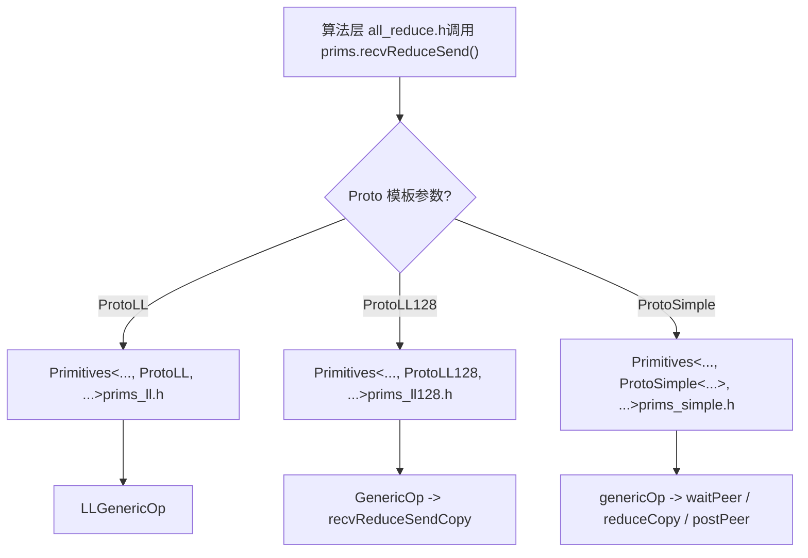
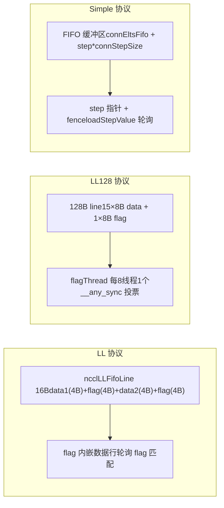

# verificação de versão.

# Voltar ao topo ↑

No capítulo anterior, rastreamos como o lado host traduz um AllReduce em um kernel __global__ e vimos que a entrada do lado do dispositivo, ncclKernelMain, realiza o despacho com base no algoritmo e protocolo. Mas o despacho apenas seleciona as ferramentas; o que realmente determina o desempenho é como essas ferramentas executam a movimentação de dados. Este capítulo aprofunda as três primitivas de movimentação em src/device: LL, LL128 e Simple, analisando uma a uma suas implementações de movimentação de dados, para entender os trade-offs entre latência e largura de banda dos diferentes protocolos.

# Por que o mesmo AllReduce precisa de três primitivas de movimentação

Vamos primeiro construir um modelo intuitivo. Imagine uma fábrica em linha de montagem: a matéria-prima (dados do usuário) entra por uma extremidade, o produto acabado sai pela outra, e no meio há várias estações (ranks) que precisam trocar produtos semiacabados entre si. Há três formas de movimentar os produtos semiacabados:

- **LL（Low Latency）**: como duas pessoas passando bilhetes frente a frente; no momento em que o bilhete é entregue, o outro já sabe "isto é para você", com custo de handshake praticamente zero. Mas o bilhete é muito pequeno, comportando apenas 8 bytes de dados úteis por vez. Adequado para mensagens pequenas.
- **LL128**: troca-se o bilhete por uma nota adesiva de 128 bytes, entregando 120 bytes de dados úteis por vez, mas exige que a nota adesiva seja posicionada com alinhamento de 16 bytes, caso contrário é preciso "reformatar" na memória compartilhada. Adequado para mensagens médias.
- **Simple**: como um armário de encomendas; primeiro coloca-se o pacote no armário (buffer FIFO), depois envia-se uma notificação "o compartimento N tem mercadoria". O custo de handshake é alto, mas é possível movimentar muito de uma vez. Adequado para mensagens grandes.

> **[Design Inference & Architectural Trade-offs]**
> O que aconteceria se houvesse apenas uma primitiva? Usando apenas LL, mensagens grandes sufocariam a largura de banda porque "cada mensagem precisa esperar a confirmação de flag do outro lado"; usando apenas Simple, mensagens pequenas teriam latência explodida devido ao custo fixo de "escrever no FIFO + enviar notificação + esperar notificação". É exatamente aqui que reside a raiz dos pontos de inflexão evidentes na curva de desempenho do NCCL próximos de 8KB e 128KB.

As três primitivas compartilham o mesmo esqueleto de template`Primitives<T, RedOp, Fan, Direct, Proto, P2p, isNetOffload>`, especializando três versões através do parâmetro de template`Proto`As três estruturas carregam cada uma constantes e métodos de cálculo relacionados ao protocolo[FACT:src/device/primitives.h:117-117]。`ProtoLL`、`ProtoLL128`、`ProtoSimple`, e o código do algoritmo apenas chama[FACT:src/device/primitives.h:25-75]interfaces unificadas como esta, sem se importar com qual protocolo está por baixo.`prims.send()`、`prims.recvReduceSend()`Copiar



três especializações de`Primitives`LL: movimentação com zero handshake usando flag embutida na linha de dados

# Modelo intuitivo

## A ideia central do LL é:

enfiar "os dados" e a marcação de "os dados estão prontos" na mesma unidade de leitura/escrita de 16 bytes**. O receptor não precisa de uma "mensagem de notificação" adicional; basta fazer polling do campo flag na linha de dados; se a flag corresponder, os dados chegaram. É como imprimir a "assinatura do destinatário" diretamente no envelope ao enviar uma carta: o carteiro, ao ver a assinatura, já sabe se deve entregar, sem precisar enviar um recibo separado.**Sem esse design, o receptor teria que primeiro esperar uma notificação de "dados gravados" e depois voltar para ler os dados, duas idas e voltas à memória, dobrando a latência.

Estrutura de dados e layout de memória

## A unidade de movimentação do LL é

, e a partir da montagem de`union ncclLLFifoLine`pode-se ver seu layout`storeLL`Copiar[FACT:src/device/prims_ll.h:154-158]：

```
st.volatile.global.v4.u32 [%0], {%1,%2,%3,%4};
// 写入 4 个 u32：data1, flag, data2, flag
```

tem 16 bytes, dispostos como`ncclLLFifoLine`. Os dados úteis são apenas 8 bytes (data1 + data2), e os outros 8 bytes são todos flag. É por isso que`[data1(4B) | flag(4B) | data2(4B) | flag(4B)]`retorna`ProtoLL::calcBytePerGrain()`— "One 16-byte line has 8-bytes of data"`sizeof(uint64_t)`Campos-chave (especialização LL de[FACT:src/device/primitives.h:55-57]。

)`Primitives`Campo[FACT:src/device/prims_ll.h:20-42]：

| Tipo | Função | Contador de passos de cada peer, determina o offset do buffer e o valor da flag |
| --- | --- | --- |
| `recvStep[i]` / `sendStep[i]` | `uint64_t[MaxRecv/MaxSend]` | Aponta para o endereço base do buffer FIFO de cada peer |
| `recvBuff[i]` / `sendBuff[i]` | `ncclLLFifoLine*` | Ponteiro global do lado receptor para "até que passo já consumi" |
| `recvConnHeadPtr` | `volatile uint64_t*` | Ponteiro global do lado emissor para "até que passo o par já consumiu" |
| `sendConnHeadPtr` | `volatile uint64_t*` | Armazena em cache o último valor de head lido, evitando ler a memória global toda vez |
| `sendConnHeadCache` | `uint64_t` | O offset do buffer é calculado por |

`recvOffset(i) = (recvStep[i] % NCCL_STEPS) * stepLines`é o número de slots do buffer circular,[FACT:src/device/prims_ll.h:44-46]，`NCCL_STEPS`é o número de linhas por slot. O valor da flag é calculado por`stepLines``recvFlag(i) = NCCL_LL_FLAG(recvStep[i] + 1)`, note que[FACT:src/device/prims_ll.h:56-58]— porque o valor inicial da flag é 0, a flag do primeiro passo deve ser 1 para se distinguir de "não gravado".`+1`Walkthrough orientado a cenário: um recvReduceSend

## Suponha que o rank 0, em um Ring AllReduce, execute

: receber dados do rank anterior, fazer reduce com os dados locais e enviar para o próximo rank. A cadeia de chamadas é`recvReduceSend`Primeiro passo: esperar que o buffer de envio esteja disponível.`recvReduceSend(inpIx, eltN)` → `LLGenericOp<1, 1, Input, -1>(inpIx, -1, eltN, false)` [FACT:src/device/prims_ll.h:403-405]。

**verifica** `waitSend`. O significado é: se o progresso de consumo do par (head) está muito atrás de mim, isso indica que o buffer circular está quase cheio e é preciso esperar.`sendConnHeadCache + NCCL_STEPS < sendConnHead + 1` [FACT:src/device/prims_ll.h:73-89]é o número total de slots do buffer,`NCCL_STEPS`é o slot que estou prestes a ocupar. Durante a espera, faz polling de`sendConnHead + 1`para atualizar o cache e periodicamente chama`*sendConnHeadPtr`para verificar se houve abort`checkAbort`Segundo passo: carregar os dados locais.[FACT:src/device/prims_ll.h:73-89]。

**trata o problema de alinhamento** `DataLoader::loadBegin`. Quando[FACT:src/device/prims_ll.h:200-216](por exemplo half ou int8), o endereço de origem pode não estar alinhado a 4 bytes, então primeiro lê-se`sizeof(T) <= 2`alinhado a 4 bytes, registra-se`u4[0..2]`, e depois em`misalign`usa-se`loadFinish`para fazer deslocamento em nível de byte e montar o valor de 64 bits correto`__funnelshift_r`. Esta é uma técnica típica de "leitura alinhada + remontagem por deslocamento", que evita a penalidade de desempenho de acessos não alinhados.[FACT:src/device/prims_ll.h:218-225]Terceiro passo: ler os dados do par e esperar a flag.

**é o núcleo** `readLL`Copiar[FACT:src/device/prims_ll.h:108-122]：

```cpp
do {
  asm volatile("ld.volatile.global.v4.u32 {%0,%1,%2,%3}, [%4];" ...);
  if (checkAbort(abort, 1, spins)) break;
} while ((flag1 != flag) || (flag2 != flag));
```

它用 `ld.volatile.global.v4.u32`Ler 16 bytes de uma vez (4 u32), depois verificar se ambos os campos flag são iguais aos valores esperados.`volatile`A palavra-chave garante que o compilador não otimize ou armazene em cache esta leitura em registradores — porque o par pode escrever novos dados a qualquer momento. Ambos os flags devem corresponder, porque o escritor`storeLL`escreve 4 u32 de uma vez, teoricamente pode ser dividido em duas escritas de 8 bytes, ambos os flags devem corresponder para garantir que os 16 bytes estejam completos.

**Quarto passo: reduce e enviar.**Após receber peerData,`applyReduce(redOp, peerData, data)`fazer a redução[FACT:src/device/prims_ll.h:279]. Depois`storeLL(sendPtr(i) + offset, data, sendFlag(i))`escrever o resultado no buffer de envio[FACT:src/device/prims_ll.h:295-296]. Atenção à ordem de envio: enviar primeiro`i=1..MaxSend`(geralmente o peer de rede), por último enviar`i=0`(geralmente o peer local)[FACT:src/device/prims_ll.h:291-297]. O comentário está bem claro: «Send : inter-node, then intra-node, then local» — enviar primeiro o lento (rede), deixá-lo voar em segundo plano, depois enviar o rápido (local), assim o peer local não espera pela rede.

**Quinto passo: avançar o step e post.** `incRecv(i)`Incrementar o passo de recepção[FACT:src/device/prims_ll.h:91-93]，`postRecv()`escrever`recvConnHead`de volta ao ponteiro global[FACT:src/device/prims_ll.h:94-97], notificar o par «já consumi este passo». No lado do envio`incSend`há uma lógica especial[FACT:src/device/prims_ll.h:99-106]：

```cpp
if ((sendStep[i] & NCCL_LL_CLEAN_MASK) == NCCL_LL_CLEAN_MASK) {
  for (int o = offset; o  *head) { ... }
}
```

No modo DirectRead do sendrecv, o remetente deve aguardar o destinatário terminar de ler os dados para retornar. Se o destinatário, por algum motivo, não avançar o tail, o remetente entrará em deadlock. Essa espera deve ser feita após`barrier()`, caso contrário pode haver competição com a thread post.

**Armadilha 3:`roundUp`causado pelo salto de step.** `loadRecvConn`e`loadSendConn`ambos contêm`step = roundUp(step, SlicePerChunk * StepPerSlice)` [FACT:src/device/prims_simple.h:486, 533]. Isso alinha o step à fronteira do slice, mas se o step anterior não estiver alinhado, os slots pulados não serão inicializados corretamente. O código adiciona em`loadRecvConn`uma linha`*connStepPtr = step`para devolver o credit[FACT:src/device/prims_simple.h:489]。

# Comparação e seleção das três primitivas



| Dimensão | LL | LL128 | Simple |
| --- | --- | --- | --- |
| Taxa de payload útil | 50% | 93.75% | ~100% |
| Método de sincronização | flag embutida, polling | flagThread + votação warp | ponteiro step + fence |
| Requisito de alinhamento | Nenhum (com reorganização por deslocamento) | 16 bytes | Nenhum |
| Tamanho de mensagem aplicável | Pequeno (< 8KB) | Médio (8KB ~ 128KB) | Grande (> 128KB) |
| Layout do buffer | `ncclLLFifoLine[]` | `uint64_t[]`por linha de 128B | `T[]` FIFO |
| Suporte a Direct | Nenhum (`PrimitivesWithoutDirect`degradado) | Nenhum (igual ao anterior) | Suporte completo |

LL e LL128 herdam ambos`PrimitivesWithoutDirect` [FACT:src/device/prims_ll.h:9-10, src/device/prims_ll128.h:13-14], pois seus layouts de buffer não suportam leitura/escrita direta na memória do par. Simple, por sua vez, implementa completamente o modo Direct, com suporte a P2P direto e NVLS.

# Reflexões de design

> **[Design Inference & Architectural Trade-offs]**
> **Por que a flag do LL é repetida duas vezes?**Porque escritas na memória global da GPU não garantem atomicidade.`storeLL`Ao escrever 16 bytes, o hardware pode dividir em duas escritas de 8 bytes. Se houver apenas uma flag, o destinatário pode considerar os dados prontos quando apenas metade foi escrita. As duas flags ficam na primeira e na segunda metade dos 16 bytes; somente quando ambas as escritas terminarem, as duas flags corresponderão.

**Por que o Simple reserva um warp?** [FACT:src/device/prims_simple.h:625-626]O comentário diz "For send operations, we need an extra warp to overlap the threadfence and the copy".`fence_acq_rel_sys()`é uma operação custosa; se todas as threads esperarem o fence terminar para continuar, muito tempo será desperdiçado. Reserva-se um warp dedicado ao fence, enquanto os outros warps podem continuar transportando o próximo lote de dados.

> **[Design Inference & Architectural Trade-offs]**
> **Por que o avanço do step do LL128 ocorre no final do GenericOp e não dentro do recvReduceSendCopy?**Porque o transporte do LL128 é em nível de warp, e múltiplos warps podem processar slices diferentes em paralelo. Se o step fosse avançado dentro de`recvReduceSendCopy`, cada warp avançaria uma vez, fazendo o step avançar múltiplas vezes. Colocá-lo no final de`GenericOp`garante avanço unificado, assegurando que cada slice avance apenas uma vez.

# Resumo do capítulo

Este capítulo aprofundou a implementação das três primitivas de transporte:

1. **LL**: usa`ncclLLFifoLine`de 16 bytes para embutir a flag na linha de dados; o destinatário só precisa fazer polling da flag correspondente para confirmar que os dados estão prontos. Payload de 50%, adequado para mensagens pequenas. O núcleo é`readLL`de`ld.volatile.global.v4.u32`e`storeLL`de`st.volatile.global.v4.u32`。

2. **LL128**: concentra a flag nos últimos 8 bytes de cada 128 bytes, elevando o payload para 93.75%. Usa`flagThread`(1 a cada 8 threads) para verificar a flag,`__any_sync`faz votação warp. Em caso de desalinhamento, faz reorganização via memória compartilhada.

3. **Simple**: usa buffer FIFO + notificação por ponteiro step para alto throughput em mensagens grandes.`flags`codifica o papel com flags de bits,`waitPeer`faz polling do step,`postPeer`atualiza o step e faz fence. Suporte completo ao modo Direct.

As três primitivas compartilham o mesmo esqueleto de template, especializado via parâmetros de template`Proto`. A camada de algoritmo chama apenas a interface unificada, sem se preocupar com o protocolo subjacente. Essa é a resposta para "por que a mesma lógica de AllReduce precisa de três primitivas de transporte": tamanhos de mensagem diferentes exigem estratégias de sincronização e layouts de buffer diferentes, e as três primitivas são otimizadas para mensagens pequenas, médias e grandes, respectivamente.

# Reflexões e autoavaliação do capítulo

Q1: Se removermos a lógica de cleanup em`incSend`([FACT:src/device/prims_ll.h:99-106]), em quais cenários ocorreria corrupção de dados? Por quê?

**Análise de referência**: a lógica de cleanup, em`sendStep[i] & NCCL_LL_CLEAN_MASK == NCCL_LL_CLEAN_MASK`, escreve todas as linhas do slice inteiro com a flag atual (preenchendo dados com 0). Se removida, quando o step der a volta na fronteira de`NCCL_LL_CLEAN_MASK`, a flag de algumas linhas pode ainda ser o valor da rodada anterior. Se a flag da rodada anterior coincidir exatamente com a flag esperada pelo destinatário nesta rodada, o destinatário pensará erroneamente que os dados estão prontos e lerá dados residuais da rodada anterior. Este é um problema clássico de ABA. A condição de disparo é execução prolongada (step ultrapassando`NCCL_LL_CLEAN_MASK`ciclos) e a flag coincidir exatamente ao dar a volta para o mesmo valor. Esse tipo de bug é extremamente difícil de reproduzir, pois exige alinhamento preciso do step.

P2: No destrutor do protocolo Simple, a espera no modo NetRegMode ([FACT:src/device/prims_simple.h:794-804]) e a espera no modo DirectRead ([FACT:src/device/prims_simple.h:814-824]) estão prevenindo o quê, respectivamente? Se uma delas for removida, o que aconteceria em cenários de alta concorrência?

**Análise de referência**: O NetRegMode aguarda a thread proxy definir`connFifo[prevStep].size`como -1, indicando que a placa de rede concluiu o envio. Se isso for removido, o próximo kernel pode sobrescrever o buffer de envio que está sendo lido pela placa de rede via DMA, fazendo com que a placa de rede leia dados corrompidos. O DirectRead aguarda o receptor avançar o tail (`*tail > *head`), indicando que o receptor terminou de ler o buffer direto. Se isso for removido, o emissor pode sobrescrever o buffer antes que o receptor termine de lê-lo, fazendo com que o receptor leia dados novos em vez dos antigos. Em cenários de alta concorrência, ambas as esperas são obrigatórias; remover qualquer uma delas causará condição de corrida. A diferença é que o NetRegMode previne "leitura pela placa de rede", enquanto o DirectRead previne "leitura pela GPU remota".

P3: O`loadRegsBegin`do LL128, quando não alinhado, passa por reempacotamento na memória compartilhada ([FACT:src/device/prims_ll128.h:115-141]). Quanto mais lento é esse caminho em relação ao caminho alinhado? Por que o NCCL não exige diretamente que o buffer do usuário seja alinhado em 16 bytes?

**Análise de referência**: O caminho não alinhado adiciona três etapas: escrever na memória compartilhada,`__syncwarp()`, ler da memória compartilhada. Embora a largura de banda da memória compartilhada seja alta,`__syncwarp()`é um ponto de sincronização que bloqueia a warp até que todas as threads concluam a escrita. Uma estimativa aproximada é que o caminho não alinhado seja 20-40% mais lento que o alinhado, dependendo da situação de conflitos de bank da memória compartilhada. O NCCL não força o alinhamento porque o usuário pode passar buffers com deslocamentos arbitrários (por exemplo, fatias de tensor), e forçar o alinhamento limitaria a flexibilidade da API. A estratégia do NCCL é "caminho rápido quando alinhado, caminho lento mas com correção garantida quando não alinhado". Em produção, recomenda-se que o usuário aloque buffers alinhados em 16 bytes sempre que possível, para usar o caminho rápido.

Até aqui, dominamos os mecanismos de movimentação de dados das três primitivas LL, LL128 e Simple, que fornecem meios flexíveis de ajuste de desempenho para os algoritmos de nível superior. O próximo capítulo aprofundará o kernel dos algoritmos de comunicação coletiva, vendo como AllReduce, AllGather, ReduceScatter e outros chamam essas primitivas, e como algoritmos como Ring, Tree e CollNet organizam o fluxo de dados, completando finalmente a comunicação coletiva ponta a ponta.
