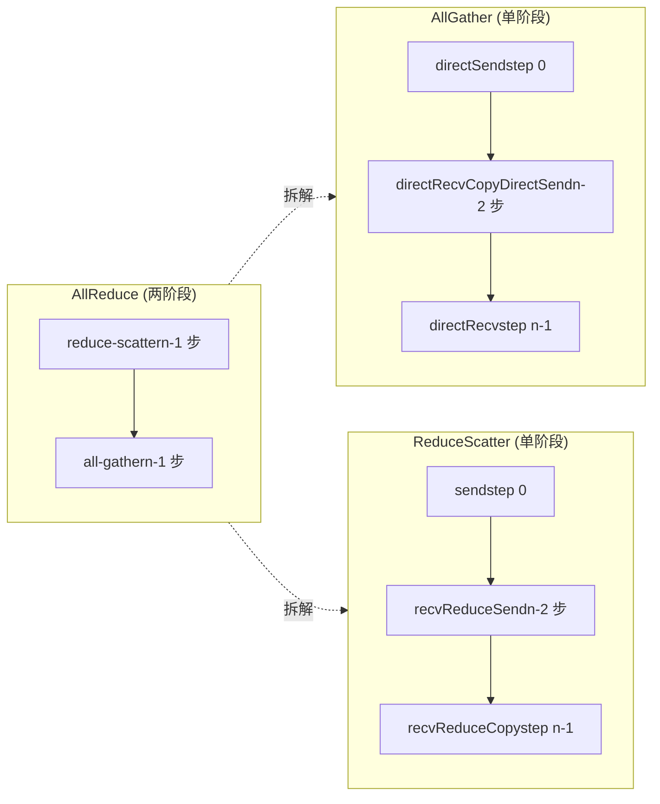
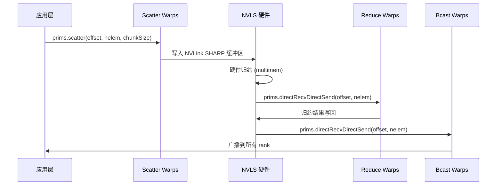

# Capítulo 10: Kernel dos algoritmos de comunicação coletiva: implementação no dispositivo de AllReduce, AllGather, ReduceScatter

O capítulo anterior desmontou as três primitivas de protocolo LL, LL128 e Simple; elas são os "motores" da movimentação de dados, mas o motor em si não sabe o que mover, para onde mover, nem em que ordem. O conjunto de arquivos de kernel de algoritmo em src/device que este capítulo examina é a "caixa de câmbio" — eles traduzem semânticas de comunicação coletiva como AllReduce, AllGather e ReduceScatter em uma sequência de chamadas de primitivas como prims.directSend e prims.directRecvReduceDirectSend. Em uma frase, o conflito central deste capítulo: por que o mesmo AllReduce precisa de quatro implementações no lado do dispositivo completamente diferentes — Ring, Tree, CollNet e NVLS? A resposta está no casamento entre "topologia do fluxo de dados" e "capacidade de hardware". O Ring usa a menor largura de banda de rede para fazer pipeline em dois estágios, o Tree usa redução em árvore para comprimir a latência a log(n), e CollNet/NVLS descarregam a redução para a placa de rede ou para o switch NVLink. Este capítulo desmonta cada um deles.

# 10.1 Ring AllReduce: como o pipeline em dois estágios se concretiza dentro do kernel

## Modelo intuitivo: "corrida de revezamento" em uma linha de montagem circular

Imagine n trabalhadores em círculo, cada um com uma caixa de matéria-prima. O objetivo do AllReduce é que cada um termine com o "produto final misturado de todas as matérias-primas". O algoritmo Ring faz isso em dois estágios: no primeiro estágio (reduce-scatter), cada um passa sua caixa ao longo do círculo, misturando sua própria matéria-prima a cada estação; após n-1 estações, cada um tem exatamente uma porção "completamente misturada" do produto final, mas apenas 1/n da fração; no segundo estágio (all-gather), essas frações do produto final circulam novamente pelo anel, e cada um completa todas as frações.

Sem o Ring, a abordagem mais ingênua seria cada rank enviar os dados ao root, o root reduzir e depois fazer broadcast — a largura de banda de rede do root se torna o gargalo, e quanto maior n, mais lento. A elegância do Ring está em:**O volume de envio e receção de cada rank é 2(n-1)/n vezes o volume de dados, distribuído uniformemente por todos os links independentemente de n**。

## Estrutura de dados e layout de memória

O estado central do algoritmo Ring está em`ncclRing`estrutura (definida em device.h, não abordada neste capítulo),`runRing`apenas dois campos são extraídos:

- `ring->index`: a posição lógica deste rank no anel, usada para calcular «qual chunk processar no passo j».
- `ring->prev` / `ring->next`: os números dos ranks predecessor e sucessor, usados como parâmetros recv/send peer do construtor`Primitives`.

Os parâmetros-chave de particionamento são calculados por`ncclCollCbdPart`([FACT:src/device/all_reduce.h:21-22]）：

```
ncclCollCbdPart(work, ncclShmem.channelId, Proto::Id, sizeof(T), (ssize_t*)nullptr, &gridOffset, &channelCount, &chunkCount);
```

Esta função divide os dados de todo o domínio de comunicação por channel, produzindo três valores:`gridOffset`(o deslocamento inicial dos dados sob responsabilidade deste channel em todo o buffer),`channelCount`(o número total de elementos sob responsabilidade deste channel),`chunkCount`(o número de elementos do chunk atribuído a cada rank).`chunkCount`é a granularidade do algoritmo Ring — um chunk é transferido a cada passo.

`loopCount = nranks * chunkCount`（[FACT:src/device/all_reduce.h:23]) representa o volume de dados processado numa «volta completa». O loop externo`for (elemOffset = 0; elemOffset < channelCount; elemOffset += loopCount)`（[FACT:src/device/all_reduce.h:34]) significa: se o volume de dados do channel exceder o que uma volta consegue processar, executa-se em múltiplas voltas.

## Step-by-Step Walkthrough: o fluxo completo de chamadas de um Ring AllReduce

Cenário: 4 ranks (nranks=4), o`ringIx=0`，`chunkCount=100`，`channelCount=400`deste rank (exatamente uma volta).

**Passo 0: enviar «o próprio chunk» para a próxima GPU**（[FACT:src/device/all_reduce.h:42-47]）

```
chunk = modRanks(ringIx + nranks - 1);   // = 3
chunkOffset = chunk * chunkCount;         // = 300
offset = gridOffset + elemOffset + chunkOffset;
nelem = min(chunkCount, remCount - chunkOffset);
prims.directSend(offset, offset, nelem);
```

`modRanks`é uma lambda que faz subtração módulo nranks ([FACT:src/device/all_reduce.h:40]）。`ringIx + nranks - 1`representa «o número do chunk anterior deste rank». Porque o passo 0 envia o chunk 3? Porque na fase reduce-scatter do Ring, cada rank primeiro envia a parte de dados que «não deve reter» (ou seja, o chunk do rank predecessor).`directSend`apenas envia sem receber, pois neste momento ainda não recebeu nenhum dado.

**Passos 1 a nranks-2: receber, reduzir e reencaminhar**（[FACT:src/device/all_reduce.h:50-56]）

```
for (int j = 2; j 计算 chunkCount/loopCount"] --> loop{"elemOffset |否| done["返回"]
    loop -->|是| s0["step 0: directSendchunk = ringIx-1"]
    s0 --> mid{"j 从 2 到 nranks-1?"}
    mid -->|是| s1["directRecvReduceDirectSendchunk = ringIx-j"]
    s1 --> mid
    mid -->|否| s2["step nranks-1directRecvReduceCopyDirectSendpostOp=true"]
    s2 --> ag{"j 从 1 到 nranks-2?"}
    ag -->|是| s3["directRecvCopyDirectSend纯转发"]
    s3 --> ag
    ag -->|否| s4["directRecv收最后一块"]
    s4 --> loop
```

## Reflexão de design: porque a ordem dos chunks do Ring é «ao contrário»

Note o padrão da numeração dos chunks: o passo 0 envia`ringIx-1`, o passo j processa`ringIx-j`, o último passo processa`ringIx+0`. Isto é**anti-horário**. Porquê? Porque cada rank do Ring retém apenas «o chunk pelo qual é responsável pela redução» (ou seja,`ringIx+0`), e os restantes chunks estão apenas de passagem. O avanço anti-horário garante: quando um chunk completa uma volta e regressa ao ponto de partida, completou exatamente nranks reduções, produzindo o resultado final. Se avançasse no sentido horário, o chunk completaria a redução no rank errado.

## Armadilhas em produção:`remCount < loopCount`armadilha de alinhamento quando

[FACT:src/device/all_reduce.h:38]há uma linha de código fácil de ignorar:

```
if (remCount = 256) nthreadsSplit += 64;
} else {
  nthreadsSplit = (nthreads * 7 / (10 * WARP_SIZE)) * WARP_SIZE;
}
```

divide as threads em dois grupos (

copiar`tid < nthreadsSplit`O protocolo Simple divide ao meio; os protocolos LL/LL128 dividem na proporção 7:3, porque "receber dados de 3 fontes para fazer redução" é mais intensivo em computação do que "enviar para 3 destinos", então o grupo de redução recebe mais threads.[FACT:src/device/all_reduce.h:175-202]Então as threads de[FACT:src/device/all_reduce.h:203-224]fazem a subida de redução (`Proto::MaxGroupWidth`), e as demais threads fazem a descida de broadcast ([FACT:src/device/all_reduce.h:189]). Os dois grupos se distinguem pelo offset`0 * Proto::MaxGroupWidth`para identificar seus respectivos grupos de comunicação ([FACT:src/device/all_reduce.h:210]de`1 * Proto::MaxGroupWidth`）。

## e

de`directRecvReduceDirectSend`Considerações de design: por que o nó raiz da Tree precisa de tratamento especial`tree->up`O nó raiz da redução em árvore é o "ponto de convergência", seu volume de recebimento é múltiplo do número de nós filhos, e o volume de envio é zero (fase de redução). Se o nó raiz também usasse o`if (tree->up == -1)`genérico, tentaria enviar para`tree->down[0] == -1`(-1), causando estouro de limites. Por isso é obrigatório tratar separadamente com o ramo

## . Da mesma forma, a verificação

do nó folha.**Armadilhas em produção: o problema do "nó raiz quente" no algoritmo Tree**O nó raiz da Tree assume todo o tráfego de redução; se a GPU onde está o nó raiz for justamente um nó lento (por exemplo, com largura de banda PCIe limitada), todo o AllReduce será prejudicado. A resposta do NCCL é:`runTreeSplit`escolher um nó raiz diferente para cada channel`FanSymmetric<NCCL_MAX_TREE_ARITY_TOP>`（[FACT:src/device/all_reduce.h:168], distribuindo a carga do nó raiz entre vários ranks. É por isso que

# no ramo do nó raiz usa

## ) — ele precisa processar simultaneamente a redução de vários nós filhos. Em ambiente de produção, se for observado desempenho desigual no Tree AllReduce, verifique se a distribuição dos nós raiz dos channels está uniforme.

10.3 AllGather e ReduceScatter: as variantes de "meio caminho" do Ring

Modelo intuitivo: AllReduce dividido em duas metades

## AllGather e ReduceScatter são essencialmente as duas fases do AllReduce transformadas em APIs independentes. AllGather faz apenas a "coleta" — cada rank contribui com um pedaço de dados, e no final todos recebem todos os dados. ReduceScatter faz apenas a "redução + dispersão" — todos contribuem com dados, e após a redução cada um recebe uma parte.

`all_gather.h`Sem essas duas APIs independentes, quando o usuário quisesse fazer "primeiro reduzir e depois coletar" ou "primeiro coletar e depois reduzir", só poderia chamar AllReduce e fatiar manualmente, desperdiçando metade da largura de banda.`runRing`（[FACT:src/device/all_gather.h:14-88]Implementação Ring do AllGather

**O**（[FACT:src/device/all_gather.h:51-60]）

```
rankDest = ringRanks[0];
offset = dataOffset + rankDest * count;
if ((inputBuf + dataOffset == outputBuf + offset) || isNetOffload) {
  prims.directSend(dataOffset, offset, nelem);
} else {
  prims.directCopySend(dataOffset, offset, nelem);
}
```

) é mais simples que o AllReduce: não há redução, apenas cópia e encaminhamento.`inputBuf + dataOffset == outputBuf + offset`Passo 0: enviar seus próprios dados para a próxima GPU`directSend`copiar`directCopySend`Aqui há uma verificação de in-place: se

**, significa que entrada e saída são o mesmo bloco de memória (AllGather in-place), então diretamente**（[FACT:src/device/all_gather.h:62-67]）

```
prims.directRecvCopyDirectSend(offset, offset, nelem);
```

**(copiar primeiro para a saída e depois enviar).**（[FACT:src/device/all_gather.h:69-74]）

```
prims.directRecv(offset, nelem);
```

## copiar

[FACT:src/device/all_gather.h:28-36]Último passo: receber o último bloco

```
if (isNetOffload) {
  workNthreads = WARP_SIZE;
  chunkCount = NCCL_MAX_NET_SIZE;
} else {
  workNthreads = nthreads;
}
```

isNetOffload: um único warp conduz a rede + múltiplos warps copiam em paralelo`isNetOffload=true`Há um ramo especial em[FACT:src/device/all_gather.h:76-82]:

copiar`barrier_sync(14, nthreads)`（[FACT:src/device/all_gather.h:87]Quando`__syncthreads()`。

## (modo single RPN + registro de rede), apenas 1 warp conduz a comunicação Ring, e os demais warps fazem em paralelo a "cópia dos dados de origem para o buffer de destino" (

`reduce_scatter.h`). Isso serve para, em AllGather não in-place, sobrepor o custo de cópia com o custo de comunicação.`runRing`（[FACT:src/device/reduce_scatter.h:14-56]No final há um

**), e o comentário explica claramente: é preciso esperar todos os warps terminarem, caso contrário o próximo work pode reutilizar outputBuf e causar condição de corrida. Usa-se barrier 14 para evitar a barrier do próprio prims e**（[FACT:src/device/reduce_scatter.h:39-42]）

```
rankDest = ringRanks[nranks - 1];
offset = dataOffset + rankDest * count;
prims.send(offset, nelem);
```

**O**（[FACT:src/device/reduce_scatter.h:44-49]）

```
prims.recvReduceSend(offset, nelem);
```

**) é a fase reduce-scatter do AllReduce extraída separadamente:**（[FACT:src/device/reduce_scatter.h:61-64]）

```
prims.recvReduceCopy(offset, dataOffset, nelem, /*postOp=*/true);
```

Observe que na última etapa, o`recvReduceCopy`tem dois offsets:`offset`(origem de recepção) e`dataOffset`(entrada local), o resultado da redução é escrito em`dataOffset`。

## Diagrama comparativo do fluxo de dados



## Armadilhas em produção: os limites da verificação de in-place

[FACT:src/device/all_gather.h:55]A verificação de in-place de`inputBuf + dataOffset == outputBuf + offset`depende de igualdade exata de ponteiros. Se o sendbuff e o recvbuff passados pelo usuário tiverem offsets mas forem logicamente o mesmo bloco de memória, essa verificação falha, levando ao caminho`directCopySend`— correto, porém com uma cópia extra. Em produção, recomenda-se garantir que sendbuff e recvbuff sejam completamente idênticos ao usar in-place AllGather.

# 10.4 CollNet e NVLS: descarregando a redução para o hardware

## Modelo intuitivo: deixar o "switch" ajudar no cálculo

Tanto Ring quanto Tree fazem com que "a própria GPU calcule a redução". CollNet e NVLS adotam uma abordagem diferente: descarregam a operação de redução para a placa de rede (CollNet) ou para o switch NVLink (NVLS). A GPU só se encarrega de enviar os dados, e o hardware realiza a redução e depois faz o broadcast de volta. É como passar de "cada trabalhador mistura sua própria matéria-prima" para "enviar a matéria-prima para um misturador central, que mistura e depois distribui".

Sem o descarregamento por hardware, a operação de redução ocuparia os recursos de SM da GPU, e a latência da redução não poderia ser ocultada.

## Divisão de threads do CollNet Direct

`RunWorkColl<ncclFuncAllReduce, ..., NCCL_ALGO_COLLNET_DIRECT, ...>`O`run`（[FACT:src/device/all_reduce.h:249-386]) divide as threads em quatro grupos:

```
const int nThreadsScatter = WARP_SIZE + ((hasUp && hasDn) ? COLLNET_COPY_THREADS : ...);
const int nThreadsGather = ((hasUp && hasDn) ? COLLNET_COPY_THREADS : ...);
const int nThreadsBcast = WARP_SIZE + ((hasUp && hasDn) ? COLLNET_COPY_THREADS : ...);
const int nThreadsReduce = work->nWarps * WARP_SIZE - nThreadsScatter - nThreadsGather - nThreadsBcast;
```

Os quatro grupos de threads são responsáveis respectivamente por: Scatter (distribuir os dados entre os rails), Reduce (enviar para a rede após a redução), Gather (coletar de cada rail), Bcast (fazer broadcast após receber da rede).`COLLNET_COPY_THREADS = 96`（[FACT:src/device/all_reduce.h:250]) é o número fixo de threads de cópia.

## netRegUsed: layout de buffer no modo de registro de rede

[FACT:src/device/all_reduce.h:280-288]Há um branch crítico:

```
if (work->netRegUsed) {
  offsetBase = bid * chunkSize;
  maxNelems = size;
  peerOffset = nChannels * chunkSize;
} else {
  offsetBase = bid * direct->nHeads * chunkSize;
  maxNelems = direct->nHeads * chunkSize;
  peerOffset = chunkSize;
}
```

`netRegUsed`No modo`bid * chunkSize`, os buffers são organizados de forma contígua por channel (`nChannels * chunkSize`), e o offset de peer é`bid * nHeads * chunkSize`; no modo não registrado, são organizados por head (`chunkSize`), e o offset de peer é

## . Essa diferença decorre do fato de que o modo de registro de rede exige buffers contíguos, para permitir DMA pela placa de rede.

`RunWorkColl<ncclFuncAllReduce, ..., NCCL_ALGO_NVLS, ...>`Alocação de warps do NVLS`run`（[FACT:src/device/all_reduce.h:391-523]O

```
const int bcastWarps = hasOut ? (work->regUsed ? ((totalWarps - 2) >> 1) - 1 : 2) : 0;
const int reduceWarps = work->regUsed ? (totalWarps - bcastWarps - 2) : (hasOut ? 3 : nranks regUsed ? 1 : (totalWarps - reduceWarps - bcastWarps + 1) >> 1;
const int gatherWarps = work->regUsed ? 1 : (totalWarps - reduceWarps - bcastWarps) >> 1;
```

`regUsed`Copiar

## No modo



## Diagrama de interação temporal`direct->out == -1`Copiar

[FACT:src/device/reduce_scatter.h:521]Armadilhas em produção: a armadilha de

```
if (direct->out == -1) __trap();
```

Há uma linha:`__trap()`Copiar

# Se a conexão out do CollNet não estiver estabelecida (-1),

## diretamente faz o kernel travar. Isso é programação defensiva — o CollNet depende da placa de rede; se a inicialização da placa de rede falhar, out será -1, e continuar a execução nesse caso causaria comportamento indefinido. Em produção, se você vir um kernel trap, verifique se a placa de rede do CollNet foi inicializada corretamente.

`broadcast.h`10.5 Broadcast e Reduce: as duas operações coletivas mais simples`runRing`（[FACT:src/device/broadcast.h:14-64]Broadcast: fan-out a partir do root

```
if (rank == root) {
  if (inputBuf == outputBuf || isNetOffload) {
    prims.directSend(offset, offset, nelem);
  } else {
    prims.directCopySend(offset, offset, nelem);
  }
} else if (nextRank == root) {
  prims.directRecv(offset, nelem);
} else {
  prims.directRecvCopyDirectSend(offset, offset, nelem);
}
```

) é bem direto: o nó root envia os dados, os outros nós repassam, e o último nó apenas recebe.`nextRank == root`Copiar

## Três branches: root envia, o predecessor do root recebe, nós intermediários repassam. Observe que

`reduce.h`verifica se "o próximo deste nó é o root", ou seja, se este nó é o último do anel — ele apenas recebe e não envia.`runRing`（[FACT:src/device/reduce.h:14-53]Reduce: convergência para o root

```
if (prevRank == root) {
  prims.send(offset, nelem);
} else if (rank == root) {
  prims.recvReduceCopy(offset, offset, nelem, /*postOp=*/true);
} else {
  prims.recvReduceSend(offset, nelem);
}
```

`prevRank == root`) é a operação inversa do Broadcast:

## Copiar

O nó**apenas envia (é o predecessor do root), o root apenas recebe e reduz, e os nós intermediários recebem, reduzem e repassam ao mesmo tempo.**Reflexão de design: por que Broadcast/Reduce também usam Ring

## Broadcast e Reduce teoricamente poderiam usar Tree para obter menor latência, mas a NCCL escolhe Ring porque:

o volume de dados dessas duas operações geralmente é pequeno, a implementação com Ring é mais simples e pode reutilizar o caminho de código Ring do AllReduce**. A complexidade do Tree (seleção do nó raiz, divisão de threads) não traz ganhos significativos em cenários de mensagens pequenas.**Armadilhas em produção: gargalo de banda no nó root do Broadcast`work->root`O nó root do Broadcast precisa enviar todos os dados; se o root for um nó lento, todo o Broadcast é atrasado. A resposta da NCCL é:

# o Broadcast também suporta múltiplos channels, e o root de cada channel pode ser diferente

. Mas atenção:`RunWorkColl`é global, todos os channels compartilham o mesmo root — isso é determinado pela semântica do Broadcast (há apenas uma fonte). Em produção, se o Broadcast estiver lento, verifique a largura de banda de rede do nó root.[FACT:src/device/all_reduce.h:228-788]10.6 Matriz de seleção de algoritmos: especialização de template do RunWorkColl

| Todos os kernels de algoritmo são registrados via especialização de template | ( | ). Cada especialização corresponde a uma combinação de "função × algoritmo × protocolo": | Função |
| --- | --- | --- | --- |
| AllReduce | RING | SIMPLE | [FACT:src/device/all_reduce.h:230-233] |
| AllReduce | TREE | SIMPLE | [FACT:src/device/all_reduce.h:238-244] |
| AllReduce | COLLNET_DIRECT | SIMPLE | [FACT:src/device/all_reduce.h:249-386] |
| AllReduce | NVLS | SIMPLE | [FACT:src/device/all_reduce.h:391-523] |
| AllReduce | NVLS_TREE | SIMPLE | [FACT:src/device/all_reduce.h:528-634] |
| AllReduce | COLLNET_CHAIN | SIMPLE | [FACT:src/device/all_reduce.h:639-759] |
| AllReduce | RING | LL | [FACT:src/device/all_reduce.h:764-766] |
| AllReduce | TREE | LL | [FACT:src/device/all_reduce.h:771-773] |
| AllReduce | RING | LL128 | [FACT:src/device/all_reduce.h:778-780] |
| AllReduce | TREE | LL128 | [FACT:src/device/all_reduce.h:785-787] |

Algoritmo**CollNet e NVLS suportam apenas o protocolo SIMPLE**. Isso ocorre porque esses dois algoritmos dependem de offload de hardware, e o mecanismo de sincronização de baixa latência do LL/LL128 é incompatível com o offload de hardware — a latência da redução por hardware é muito maior que o polling de flag do LL, e usar LL acaba aumentando o overhead.

## Lógica interna da seleção de protocolo

- **LL**: mensagens pequenas (< 8KB), prioridade para baixa latência. Tanto Ring quanto Tree suportam.
- **LL128**: mensagens médias (8KB - 1MB), alinhamento de 128 bytes. Tanto Ring quanto Tree suportam.
- **SIMPLE**: mensagens grandes (> 1MB), prioridade para largura de banda. Todos os algoritmos suportam.

## Armadilhas em produção: restrições de combinação entre protocolo e algoritmo

Se o usuário forçar a especificação de`NCCL_PROTO=LL`mas o algoritmo for CollNet, o NCCL fará fallback para SIMPLE na fase de tuning. Em ambiente de produção, se descobrir que a configuração de protocolo não tem efeito, verifique se o algoritmo suporta esse protocolo.

# Reflexão de design: por que a mesma lógica de AllReduce precisa de tantas implementações

Revisando este capítulo, o AllReduce possui seis implementações de algoritmos: Ring, Tree, CollNet Direct, CollNet Chain, NVLS e NVLS Tree. Isso não é redundância, mas sim**soluções ótimas para diferentes topologias de hardware e tamanhos de mensagem**：

- **Ring**: genérico, adequado para mensagens grandes, maior utilização de largura de banda.
- **Tree**: adequado para clusters de grande escala, latência O(log n).
- **CollNet**: adequado para clusters com placas de rede que suportam redução, descarrega a computação da GPU.
- **NVLS**: adequado para conexão completa NVLink em nó único, redução por multicast de hardware.

O módulo de tuning do NCCL (Capítulo 5) seleciona automaticamente com base no tamanho da mensagem, número de ranks e topologia. A implementação no lado do dispositivo só precisa garantir que "cada combinação esteja correta"; a lógica de seleção fica no lado do host.

# Resumo do capítulo

Este capítulo detalhou`src/device`os seis arquivos de kernel de algoritmo sob

1. **Ring AllReduce**（[FACT:src/device/all_reduce.h:14-83]): pipeline de dois estágios, reduce-scatter + all-gather, cada estágio com n-1 passos.

2. **Tree AllReduce**（[FACT:src/device/all_reduce.h:86-225]): redução em árvore, latência O(log n),`runTreeSplit`usa divisão de threads para implementar o pipeline de redução-broadcast.

3. **AllGather**（[FACT:src/device/all_gather.h:14-88]): Ring de estágio único, suporta in-place e netOffload.

4. **ReduceScatter**（[FACT:src/device/reduce_scatter.h:14-56]): Ring de estágio único, é a fase de reduce-scatter do AllReduce.

5. **Broadcast/Reduce**（[FACT:src/device/broadcast.h:14-64]、[FACT:src/device/reduce.h:14-53]): a variante mais simples de Ring.

6. **CollNet/NVLS**（[FACT:src/device/all_reduce.h:247-635]): offload de hardware, suporta apenas o protocolo SIMPLE.

# Reflexões e autoavaliação do capítulo

Q1: Na fase de reduce-scatter do Ring AllReduce, o passo 0 usa`directSend`, os passos intermediários usam`directRecvReduceDirectSend`, e o último passo usa`directRecvReduceCopyDirectSend`. Se removermos o`postOp=true`do último passo, em quais cenários ocorreriam resultados incorretos?

**Análise de referência**：`postOp=true`dispara operações pós-processamento (como a divisão ao calcular a média). Tomando`ncclAvg`como exemplo, a redução é uma soma, e o postOp é dividir por nranks. Se removermos`postOp`, o último passo apenas faz a redução sem a divisão, e o recvbuff armazena a "soma" em vez da "média". Na fase de reduce-scatter, cada rank mantém apenas o resultado final de um chunk, e esse chunk é exatamente`ringIx+0`（[FACT:src/device/all_reduce.h:60]). Se o postOp estiver ausente, a soma desse chunk não será dividida por nranks, e a fase subsequente de all-gather propagará essa "soma" incorreta para todos os ranks. Observação: apenas o último passo precisa do postOp, pois somente ele produz o resultado de "redução completa"; as reduções dos passos intermediários são somas parciais e não precisam de postOp. Em ambiente de produção, se descobrir que o resultado do AllReduce está nranks vezes maior, verifique se o postOp está sendo passado corretamente.

Q2: `runTreeSplit`No protocolo LL/LL128, as threads são divididas na proporção 7:3 ([FACT:src/device/all_reduce.h:163]), enquanto no protocolo Simple são divididas 1:1 ([FACT:src/device/all_reduce.h:157]). Se forçarmos o protocolo LL a também usar 1:1, o que aconteceria?

**Análise de referência**: o grupo de redução do LL/LL128 precisa receber dados de até 3 nós filhos e realizar a redução ([FACT:src/device/all_reduce.h:187]do`FanAsymmetric<NCCL_MAX_TREE_ARITY, 1>`), sendo intensivo em computação; o grupo de broadcast apenas faz cópia e encaminhamento ([FACT:src/device/all_reduce.h:208]do`FanAsymmetric<1, NCCL_MAX_TREE_ARITY>`), sendo leve em computação. A divisão 7:3 dá ao grupo de redução threads suficientes para processar a redução de 3 vias, e o grupo de broadcast tem menos threads, mas o suficiente. Se mudarmos para 1:1, o grupo de redução terá threads insuficientes, tornando a redução um gargalo; o grupo de broadcast terá threads em excesso, desperdiçando recursos. Pior ainda, o polling de flag do protocolo LL é busy-wait, e mais threads aumentam a contenção de flag. Em ambiente de produção, se descobrir que o Tree AllReduce tem desempenho anômalo sob o protocolo LL, verifique se o cálculo de`nthreadsSplit`foi modificado.

Q3: No modo`isNetOffload`do AllGather, apenas 1 warp impulsiona a comunicação Ring ([FACT:src/device/all_gather.h:32]), e os demais warps fazem cópia em paralelo ([FACT:src/device/all_gather.h:76-82]). Se removermos o`barrier_sync(14, nthreads)`（[FACT:src/device/all_gather.h:87]final, em quais cenários ocorreriam condições de corrida de dados?

**Análise de referência**：`barrier_sync`Garante que todos os warps (incluindo warp de comunicação e warp de cópia) concluam este work antes de passar para o próximo work. Se isso for removido, o warp de comunicação pode iniciar a comunicação do próximo work antes que o warp de cópia termine de escrever no outputBuf, e o próximo work pode reutilizar o mesmo outputBuf. Cenário específico: dois AllGather consecutivos, o warp de cópia do primeiro ainda está escrevendo no final do outputBuf, enquanto o warp de comunicação do segundo já começou a escrever novos dados no outputBuf, fazendo com que os dados do primeiro sejam sobrescritos. O comentário deixa isso bem claro: «otherwise, we can have contention if next work will use the outputBuf in this work». Usar a barrier 14 em vez da barrier padrão é para evitar as barriers internas dos prims e`__syncthreads()`, prevenindo deadlock. Em ambiente de produção, se resultados de AllGather apresentarem erros intermitentes, verifique se a barrier do caminho`isNetOffload`foi otimizada e removida.

Até aqui, vimos como os kernels de algoritmo do lado do dispositivo organizam o fluxo de dados. Cada algoritmo chama as primitivas do capítulo anterior através de`Primitives`, e a camada de algoritmo só se preocupa com «quem envia para quem, qual chunk enviar, redução ou cópia». O próximo capítulo aprofundará a abstração da camada de transporte, vendo como P2P, SHM, NET e NVLS são unificados em um conjunto de interfaces, e como as threads proxy do lado host colaboram com os kernels do lado do dispositivo para completar a comunicação entre máquinas.

Padrão central: todos os algoritmos chamam primitivas através da classe template Primitives; o algoritmo é responsável apenas pela «topologia do fluxo de dados», e as primitivas pela «movimentação de dados». Essa separação em camadas permite que novos algoritmos implementem apenas a lógica de topologia, sem se preocupar com a sincronização de baixo nível. Mas independentemente de como a topologia mude, os dados eventualmente precisam ser transmitidos pelo link físico. O próximo capítulo aprofundará o diretório src/transport, vendo como o NCCL usa uma interface transport unificada para ocultar as diferenças entre P2P, SHM, NET e NVLS, e a semântica de setup/connect/send/recv de cada transport. Esta é a base para entender a comunicação entre máquinas.
