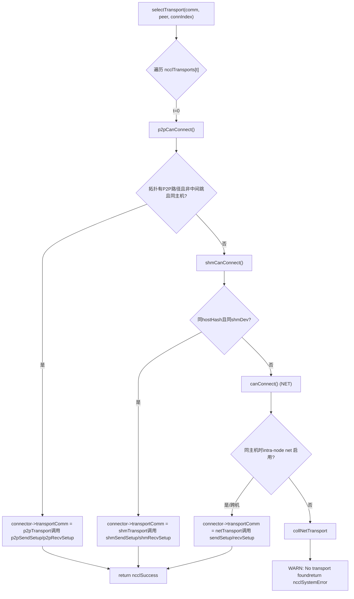
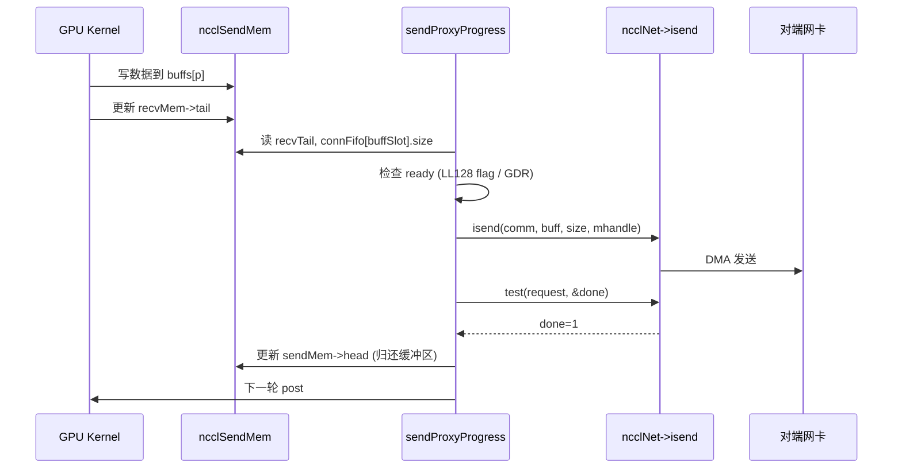

# Capítulo 11: Abstração da camada de transporte: como P2P, SHM, NET e NVLS são unificados sob o mesmo conjunto de interfaces

No capítulo anterior, mergulhamos nos kernels de algoritmo e vimos como o Ring AllReduce divide os dados e faz a redução em duas fases, e como o Tree AllReduce usa uma estrutura em árvore para reduzir a latência — mas esses algoritmos definem apenas a visão lógica de «quem envia para quem, qual chunk enviar». Os dados, no final, precisam atravessar links físicos reais: NVLink, PCIe, memória compartilhada ou placa de rede. Este capítulo disseca o diretório src/transport, vendo como o NCCL usa uma interface unificada ncclTransport para mascarar os quatro canais físicos P2P, SHM, NET e NVLS sob a mesma face, completando a última milha da topologia do algoritmo até a transmissão física.

# I. Interface unificada: como ncclTransport mascara os quatro canais físicos

## Modelo intuitivo

Imagine uma empresa de logística: não importa se o cliente envia uma entrega local (P2P), uma transferência dentro do prédio (SHM), um transporte entre províncias (NET) ou uma linha dedicada direta (NVLS), o balcão preenche apenas uma «nota de transporte». Essa nota de transporte é a`ncclTransport`estrutura — ela define que cada modalidade de transporte deve fornecer`canConnect`、`setup`、`connect`、`free`e outras ações fixas. Sem essa camada de abstração, os algoritmos superiores teriam que escrever quatro conjuntos de`if-else`para determinar qual link seguir, e adicionar um novo hardware exigiria alterar todos os algoritmos.

## Estruturas de dados e layout de memória

O NCCL usa um array global para registrar todos os transports, e a ordem é a prioridade:

[FACT:src/transport.cc:15-20]

```c
struct ncclTransport* ncclTransports[NTRANSPORTS] = {
  &p2pTransport,
  &shmTransport,
  &netTransport,
  &collNetTransport,
};
```

A ordem do array determina a ordem de seleção: P2P primeiro, depois SHM, em seguida NET, e por fim CollNet. Cada transport é descrito pela`ncclTransport`estrutura, que contém um`canConnect`ponteiro de função e dois`ncclTransportComm`(um para send e um para recv). Tomando P2P como exemplo:

[FACT:src/transport/p2p.cc:1493-1498]

```c
struct ncclTransport p2pTransport = {"P2P",
                                     p2pCanConnect,
                                     {p2pSendSetup, p2pSendConnect, p2pSendFree, NULL, p2pSendProxySetup, NULL,
                                      p2pSendProxyFree, NULL, p2pProxyRegister, p2pProxyDeregister},
                                     {p2pRecvSetup, p2pRecvConnect, p2pRecvFree, NULL, p2pRecvProxySetup, NULL,
                                      p2pRecvProxyFree, NULL, p2pProxyRegister, p2pProxyDeregister}};
```

`ncclTransportComm`A ordem dos campos de`setup`é fixa, como «slots de ciclo de vida»:`connect`(preparar recursos),`free`(trocar informações de conexão),`proxySharedInit`(liberar),`proxySetup`、`proxyConnect`、`proxyFree`、`proxyProgress`、`proxyRegister`、`proxyDeregister`(inicialização compartilhada do proxy),`proxyProgress`. Note que o slot`NULL`do P2P é`proxyProgress`— porque o P2P usa acesso direto da GPU à memória do peer, sem necessidade de threads proxy do host para mover dados; já o`sendProxyProgress`/`recvProxyProgress`do NET é

## , porque o I/O da placa de rede precisa ser conduzido por threads do host.

Walkthrough orientado a cenário: como uma conexão seleciona o transport`selectTransport`：

[FACT:src/transport.cc:23-44]

```c
template 
static ncclResult_t selectTransport(struct ncclComm* comm, struct ncclTopoGraph* graph, struct ncclConnect* connect,
                                    int channelId, int peer, int connIndex, int* transportType) {
  struct ncclPeerInfo* myInfo = comm->peerInfo + comm->rank;
  struct ncclPeerInfo* peerInfo = comm->peerInfo + peer;
  struct ncclConnector* connector = (type == 1) ? comm->channels[channelId].peers[peer]->send + connIndex :
                                                  comm->channels[channelId].peers[peer]->recv + connIndex;
  for (int t = 0; t send : &transport->recv;
    int ret = 0;
    NCCLCHECK(transport->canConnect(&ret, comm, graph, myInfo, peerInfo));
    if (ret) {
      connector->transportComm = transportComm;
      NCCLCHECK(transportComm->setup(comm, graph, myInfo, peerInfo, connect, connector, channelId, connIndex));
      if (transportType) *transportType = t;
      return ncclSuccess;
    }
  }
  WARN("No transport found for rank %d[%lx] -> rank %d[%lx]", myInfo->rank, myInfo->busId, peerInfo->rank,
       peerInfo->busId);
  return ncclSystemError;
}
```

`type==1`indica a direção send,`type==0`indica a direção recv. O loop pergunta sequencialmente a cada transport o`canConnect`: retorna`ret=1`significa "eu consigo fazer este trabalho", imediatamente aponta`connector->transportComm`para a direção correspondente desse transport e chama o seu`setup`. Se todos os transports retornarem 0, imprime um aviso e retorna`ncclSystemError`。

`canConnect`A lógica de decisão reflete as "fronteiras de território" de cada transport. Tomando P2P como exemplo:

[FACT:src/transport/p2p.cc:129-157]

```c
ncclResult_t p2pCanConnect(int* ret, struct ncclComm* comm, struct ncclTopoGraph* graph, struct ncclPeerInfo* info1,
                           struct ncclPeerInfo* info2) {
  initCeOperation();
  int intermediateRank;
  int isCrossClique;
  NCCLCHECK(ncclTopoCheckP2p(comm, comm->topo, info1->rank, info2->rank, ret, NULL, &intermediateRank, NULL,
                             &isCrossClique));
  if (*ret == 0) return ncclSuccess;
  if (intermediateRank != -1) {
    if (useMemcpy) *ret = 0;
    return ncclSuccess;
  }
  if (!isCrossClique) {
    int useNet = 0;
    NCCLCHECK(ncclTopoCheckNet(comm->topo, info1->rank, info2->rank, &useNet));
    if (useNet) {
      *ret = 0;
      return ncclSuccess;
    }
  }
  if (info1->hostHash != comm->peerInfo[comm->rank].hostHash || info1->hostHash != info2->hostHash) {
    return ncclSuccess;
  }
  ...
```

Cadeia de decisão do P2P: primeiro pergunta à topologia "existe um caminho P2P entre os dois ranks"; se houver saltos intermediários (`intermediateRank != -1`) e o CE memcpy estiver habilitado, então abandona o P2P e cede para SHM/NET; se a topologia sugerir usar a rede (`useNet`), também abandona; por fim verifica se estão no mesmo host. A decisão do SHM é mais simples:

[FACT:src/transport/shm.cc:61-83]

```c
static ncclResult_t shmCanConnect(int* ret, struct ncclComm* comm, struct ncclTopoGraph* graph,
                                  struct ncclPeerInfo* info1, struct ncclPeerInfo* info2) {
  *ret = 0;
  initShmLocality();
  if (ncclParamShmDisable() == 1) return ncclSuccess;
  int useNet = 0;
  NCCLCHECK(ncclTopoCheckNet(comm->topo, info1->rank, info2->rank, &useNet));
  if (useNet) return ncclSuccess;
  if (info1->hostHash != info2->hostHash) return ncclSuccess;
  if (info1->shmDev != info2->shmDev) return ncclSuccess;
  *ret = 1;
  return ncclSuccess;
}
```

O SHM exige mesmo host (`hostHash`iguais) e compartilhar o mesmo bloco`/dev/shm`（`shmDev`iguais, usado para comunicação entre contêineres). O NET quase sempre retorna 1, verificando apenas se o intra-node net está desabilitado quando no mesmo host:

[FACT:src/transport/net.cc:160-168]

```c
static ncclResult_t canConnect(int* ret, struct ncclComm* comm, struct ncclTopoGraph* graph, struct ncclPeerInfo* info1,
                               struct ncclPeerInfo* info2) {
  *ret = 1;
  if (info1->hostHash == info2->hostHash) {
    NCCLCHECK(ncclTopoCheckNet(comm->topo, info1->rank, info2->rank, ret));
  }
  return ncclSuccess;
}
```

O NET é o "fallback" — desde que ninguém antes o assuma, ele assume. O`canConnect`do NVLS retorna diretamente 0:

[FACT:src/transport/nvls.cc:21-26]

```c
ncclResult_t nvlsCanConnect(int* ret, struct ncclComm* comm, struct ncclTopoGraph* graph, struct ncclPeerInfo* info1,
                            struct ncclPeerInfo* info2) {
  // This transport cannot be used for p2p
  *ret = 0;
  return ncclSuccess;
}
```

O NVLS não segue o caminho convencional de conexão peer-to-peer, ele estabelece um grupo multicast separadamente através de`ncclNvlsSetup`, portanto`canConnect`sempre retorna 0.



## Reflexão de design

> **[Design Inference & Architectural Trade-offs]**
> Por que usar "ordem de array + votação canConnect" em vez de uma tabela de roteamento explícita? Porque a topologia é dinâmica: a mesma máquina pode, devido a`NCCL_P2P_DISABLE`, isolamento de contêineres, disponibilidade de CUDA IPC e outros fatores, tornar o P2P indisponível, e nesse caso degradar automaticamente para SHM ou NET. O mecanismo de votação permite que cada transport julgue por si mesmo "se consigo fazer isso"; adicionar um novo transport requer apenas adicionar um item ao array, sem alterar a lógica de seleção. Isso é exatamente o princípio aberto-fechado manifestado na programação de sistemas.

# Dois, P2P: as quatro formas de conexão direta entre GPUs na mesma máquina

## Modelo intuitivo

P2P é "passar coisas diretamente entre vizinhos" — a GPU 0 lê e escreve diretamente na memória da GPU 1, sem passar pela CPU ou placa de rede. Sem P2P, a comunicação multi-GPU na mesma máquina teria que desviar pela memória do host, dobrando a latência e cortando a largura de banda pela metade.

## Estrutura de dados e layout de memória

Internamente o P2P tem quatro formas, distinguidas por`enum p2pType`:

[FACT:src/transport/p2p.cc:19-24]

```c
enum p2pType {
  P2P_DIRECT,
  P2P_INTERMEDIATE,
  P2P_IPC,
  P2P_CUMEM
};
```

- `P2P_DIRECT`: GPUs diferentes no mesmo processo, acesso direto via ponteiro (o mais rápido).
- `P2P_INTERMEDIATE`: não há conexão direta entre as duas GPUs, é necessário encaminhar através de uma GPU intermediária.
- `P2P_IPC`: entre processos, usa o tradicional`cudaIpcOpenMemHandle`para importar a memória do par.
- `P2P_CUMEM`: entre processos, usa a API cuMem (`cuMemExportToShareableHandle`) para importar, suportando gerenciamento de memória mais granular.

Estrutura central de recursos:

[FACT:src/transport/p2p.cc:79-94]

```c
struct p2pResources {
  enum p2pType type;
  union {
    struct ncclSendMem* sendDevMem;
    struct ncclRecvMem* recvDevMem;
  };
  void* sendMemIpc;
  int sendMemSameProc;
  void* recvMemIpc;
  int recvMemSameProc;
  // CE memcpy support
  struct p2pShmProxyInfo proxyInfo;
  struct p2pShm* shm;
  struct p2pShm* devShm;
  ncclShmIpcDesc_t desc;
};
```

`sendDevMem`/`recvDevMem`é uma union — o remetente só se importa com`sendDevMem`, o destinatário só se importa com`recvDevMem`, compartilhando um bloco de memória.`sendMemIpc`/`recvMemIpc`armazena o handle de memória importada do par,`sendMemSameProc`/`recvMemSameProc`marca se é do mesmo processo (determina se ao liberar usa`ncclCuMemFreeAddr`ou`cudaIpcCloseMemHandle`）。

Estrutura de informação de conexão`p2pConnectInfo`trocada via bootstrap:

[FACT:src/transport/p2p.cc:38-44]

```c
struct p2pConnectInfo {
  int rank;
  int read;
  struct ncclP2pBuff p2pBuff;
  // Used by CE memcpy
  ncclShmIpcDesc_t desc;
};
static_assert(sizeof(struct p2pConnectInfo) transportResources = resources;
  int useRead, intermediateRank;
  NCCLCHECK(p2pGetInfo(comm, myInfo, peerInfo, &useRead, &intermediateRank));
  if (useMemcpy) useRead = 0;
  ...
  int sendSize = sizeof(struct ncclSendMem);
  if (info->read) sendSize += comm->buffSizes[NCCL_PROTO_SIMPLE];
  ALIGN_SIZE(sendSize, CUDA_IPC_MIN);
  ...
```

Pontos-chave:`sendSize`No modo P2P Read é necessário adicionar extra o tamanho do buffer do protocolo SIMPLE — porque no modo de leitura o buffer SIMPLE do remetente é lido diretamente pelo destinatário, devendo ser alocado junto com`ncclSendMem`no mesmo bloco de memória compartilhável.`ALIGN_SIZE(sendSize, CUDA_IPC_MIN)`Garante que o tamanho esteja alinhado à granularidade mínima do CUDA IPC.

Em seguida, com base em`intermediateRank`e na relação de processos, escolhe a forma:

[FACT:src/transport/p2p.cc:416-437]

```c
  if (intermediateRank == -1) {
    info->rank = myInfo->rank;
    if (P2P_SAME_PID(myInfo, peerInfo) && ncclParamP2pDirectDisable() == 0 && useMemcpy == 0) {
      resources->type = P2P_DIRECT;
      ...
    } else {
      if (ncclCuMemEnable()) {
        resources->type = P2P_CUMEM;
        ...
      } else {
        resources->type = P2P_IPC;
        ...
      }
    }
    send->conn.flags |= info->read ? NCCL_P2P_READ : NCCL_P2P_WRITE;
  } else {
    resources->type = P2P_INTERMEDIATE;
    info->rank = intermediateRank;
    ...
  }
```

`P2P_SAME_PID`Macro determina mesmo host e mesmo processo:

[FACT:src/transport/p2p.cc:334-335]

```c
#define P2P_SAME_PID(MYINFO, PEERINFO) \
  ((MYINFO->hostHash == PEERINFO->hostHash) && (MYINFO->pidHash == PEERINFO->pidHash))
```

Mesmo processo, sem desabilitar direct e sem habilitar memcpy, é o mais rápido`P2P_DIRECT`— pega diretamente o ponteiro do par. Caso contrário, usa IPC/CUMEM.

Depois, através da thread proxy, aloca um buffer compartilhável:

[FACT:src/transport/p2p.cc:457-468]

```c
  NCCLCHECK(ncclProxyConnect(comm, TRANSPORT_P2P, 1, info->rank, &send->proxyConn));
  if (useMemcpy) {
    NCCLCHECK(ncclProxyCallBlocking(comm, &send->proxyConn, ncclProxyMsgSetup, NULL, 0, &resources->proxyInfo,
                                    sizeof(struct p2pShmProxyInfo)));
    memcpy(&info->desc, &resources->proxyInfo.desc, sizeof(ncclShmIpcDesc_t));
  } else {
    NCCLCHECK(ncclProxyCallBlocking(comm, &send->proxyConn, ncclProxyMsgSetup, &req, sizeof(struct ncclP2pRequest),
                                    &info->p2pBuff, sizeof(struct ncclP2pBuff)));
    NCCLCHECK(p2pMap(comm, &send->proxyConn, myInfo, comm->peerInfo + info->rank, &info->p2pBuff,
                     (void**)&resources->sendDevMem, &resources->sendMemIpc));
    resources->sendMemSameProc = P2P_SAME_PID(myInfo, (comm->peerInfo + info->rank));
  }
```

`ncclProxyCallBlocking`é um RPC síncrono: a thread host envia mensagem para a thread proxy, a thread proxy chama`p2pSendProxySetup`para alocar um buffer compartilhável, retornando`ncclP2pBuff`(contendo o handle IPC). Então`p2pMap`mapeia o buffer do par para o espaço de endereçamento local.

`p2pMap`é a função central de mapeamento:

[FACT:src/transport/p2p.cc:349-390]

```c
static ncclResult_t p2pMap(struct ncclComm* comm, struct ncclProxyConnector* proxyConn, struct ncclPeerInfo* myInfo,
                           struct ncclPeerInfo* peerInfo, struct ncclP2pBuff* p2pBuff, void** devMem, void** ipcPtr) {
  if (P2P_SAME_PID(myInfo, peerInfo)) {
    if (peerInfo->cudaDev != myInfo->cudaDev) {
      cudaError_t err = cudaDeviceEnablePeerAccess(peerInfo->cudaDev, 0);
      ...
      if (ncclCuMemEnable()) {
        NCCLCHECK(ncclCuMemAllocAddr(devMem, &p2pBuff->ipcDesc.memHandle, p2pBuff->size));
        CUCHECK(cuMemRelease(p2pBuff->ipcDesc.memHandle));
        *ipcPtr = *devMem;
        ...
      } else {
        *devMem = p2pBuff->directPtr;
        *ipcPtr = NULL;
      }
    } else {
      *devMem = p2pBuff->directPtr;
      *ipcPtr = NULL;
    }
  } else {
    NCCLCHECK(ncclP2pImportShareableBuffer(comm, peerInfo->rank, p2pBuff->size, &p2pBuff->ipcDesc, devMem,
                                           p2pBuff->directPtr, ncclMemOffload));
    *ipcPtr = *devMem;
  }
  return ncclSuccess;
}
```

Mesmo processo, GPUs diferentes: primeiro`cudaDeviceEnablePeerAccess`abre o canal P2P, depois usa diretamente`directPtr`(porque o espaço de endereçamento é compartilhado no mesmo processo). Entre processos: chama`ncclP2pImportShareableBuffer`para importar o handle de memória do par.

## Controle de concorrência e interação com hardware

A sincronização do P2P depende do`ncclSendMem`/`ncclRecvMem`em`head`/`tail`ponteiro. O remetente escreve`head`para dizer ao destinatário "até onde escrevi", o destinatário escreve`tail`para dizer ao remetente "até onde li". Este é o típico produtor-consumidor sem lock:

[FACT:src/transport/p2p.cc:571-576]

```c
  } else {
    send->conn.tail = &remDevMem->tail;
    send->conn.head = &resources->sendDevMem->head;
    send->conn.ptrExchange = &resources->sendDevMem->ptrExchange;
    send->conn.redOpArgExchange = resources->sendDevMem->redOpArgExchange;
  }
```

`head`aponta para o local`sendDevMem`，`tail`aponta para o par`remDevMem`. O kernel da GPU realiza sincronização entre GPUs lendo e escrevendo esses dois ponteiros, sem intervenção da CPU.

## Guia de armadilhas em produção

**Armadilha 1: P2P Read e memcpy são mutuamente exclusivos.**Veja`p2pSendConnect`：

[FACT:src/transport/p2p.cc:551-559]

```c
  for (int p = 0; p read && p == NCCL_PROTO_SIMPLE) {
      /* For P2P Read the SIMPLE buffer is local (ncclSendMem) */
      if (resources->sendDevMem == NULL) return ncclInternalError; // We should not use read + memcpy
      send->conn.buffs[p] = (char*)(resources->sendDevMem + 1);
    } else {
      send->conn.buffs[p] = buff;
      buff += comm->buffSizes[p];
    }
  }
```

Se`read=1`mas`sendDevMem==NULL`, retorna diretamente`ncclInternalError`. Em ambiente de produção, se vir este erro, verifique se foram definidos simultaneamente`NCCL_P2P_READ_ENABLE=1`e`NCCL_P2P_USE_CUDA_MEMCPY=1`— os dois têm semântica conflitante.

**Armadilha 2: ordem de liberação entre processos.** `p2pSendFree`Com base em`sendMemSameProc`decide o modo de liberação:

[FACT:src/transport/p2p.cc:624-651]

```c
ncclResult_t p2pSendFree(struct ncclComm* comm, struct ncclConnector* send) {
  struct p2pResources* resources = (struct p2pResources*)send->transportResources;
  if (resources) {
    if (ncclCuMemEnable()) {
      if (resources->sendMemIpc) {
        if (resources->sendMemSameProc) {
          NCCLCHECK(ncclCuMemFreeAddr(resources->sendMemIpc, comm->memManager));
        } else {
          NCCLCHECK(ncclCudaFree(resources->sendMemIpc, comm->memManager));
        }
      }
      ...
```

Mesmo processo usa`ncclCuMemFreeAddr`(libera apenas o mapeamento de endereço, não a memória física), entre processos usa`ncclCudaFree`(libera memória física). Inverter isso causa vazamento de memória ou use-after-free.

# III. SHM: a disputa de "quem hospeda a memória" na memória compartilhada

## Modelo intuitivo

SHM é "dois processos compartilhando um quadro branco" — o remetente escreve, o destinatário lê. Mas onde fica o quadro branco? Na casa do remetente (sender-side), e o destinatário vai até lá para ler; ou na casa do destinatário (receiver-side), e o remetente vai até lá para escrever? É isso que o parâmetro`NCCL_SHM_LOCALITY`resolve.

## Estrutura de dados e layout de memória

[FACT:src/transport/shm.cc:28-34]

```c
struct shmSendResources {
  struct ncclRecvMem* remHostMem;
  struct ncclRecvMem* devRemHostMem;
  ncclShmIpcDesc_t remDesc;
  struct ncclSendMem* hostMem;
  struct ncclSendMem* devHostMem;
};

struct shmRecvResources {
  struct ncclSendMem* remHostMem;
  struct ncclSendMem* devRemHostMem;
  ncclShmIpcDesc_t remDesc;
  struct ncclRecvMem* hostMem;
  struct ncclRecvMem* devHostMem;
};
```

Atenção`hostMem`e`devHostMem`aparecem em pares:`hostMem`é o ponteiro do lado host,`devHostMem`é o ponteiro do lado do dispositivo (mapeado via UVA ou cuMem).`remHostMem`/`devRemHostMem`é o mapeamento local da memória compartilhada do par.

## Walkthrough orientado a cenários: escolha de locality do SHM

`shmSendSetup`Com base na locality, decide quanto de memória alocar:

[FACT:src/transport/shm.cc:88-119]

```c
static ncclResult_t shmSendSetup(struct ncclComm* comm, struct ncclTopoGraph* graph, struct ncclPeerInfo* myInfo,
                                 struct ncclPeerInfo* peerInfo, struct ncclConnect* connectInfo,
                                 struct ncclConnector* send, int channelId, int connIndex) {
  struct shmSendResources* resources;
  struct shmConnectInfo* info = (struct shmConnectInfo*)connectInfo;
  size_t shmSize = sizeof(struct ncclSendMem);
  struct shmRequest req;

  NCCLCHECK(ncclCalloc(&resources, 1));
  send->transportResources = resources;

  if (shmLocality == SHM_SEND_SIDE) {
    for (int p = 0; p buffSizes[p];
  }
  req.size = shmSize;
  if (myInfo->hostHash == peerInfo->hostHash && myInfo->pidHash == peerInfo->pidHash) req.legacy = true;
  else req.legacy = false;

  NCCLCHECK(ncclProxyConnect(comm, TRANSPORT_SHM, 1, myInfo->rank, &send->proxyConn));
  NCCLCHECK(ncclProxyCallBlocking(comm, &send->proxyConn, ncclProxyMsgSetup, (void*)&req, sizeof(struct shmRequest),
                                  (void*)info, sizeof(struct shmConnectInfo)));

  info->rank = comm->rank;
  resources->hostMem = (struct ncclSendMem*)info->buf.hptr;
  resources->devHostMem = (struct ncclSendMem*)info->buf.dptr;
  ...
```

`shmLocality == SHM_SEND_SIDE`, o remetente aloca o buffer de dados (`shmSize`mais todos os buffers de protocolo); caso contrário, aloca apenas`ncclSendMem`a estrutura de controle.`req.legacy`Marca se é o mesmo processo — no mesmo processo pode-se usar o tradicional`mmap`, entre processos é necessário cuMem ou`/dev/shm`arquivo.

`shmSendConnect`Com base na locality, decide se`buffs`aponta para local ou para o par:

[FACT:src/transport/shm.cc:153-176]

```c
static ncclResult_t shmSendConnect(struct ncclComm* comm, struct ncclConnect* connectInfo, int nranks, int rank,
                                   struct ncclConnector* send) {
  struct shmConnectInfo* info = (struct shmConnectInfo*)connectInfo;
  struct shmSendResources* resources = (struct shmSendResources*)send->transportResources;
  char* buff;

  NCCLCHECK(ncclShmImportShareableBuffer(comm, info->rank, &info->desc, (void**)&resources->remHostMem,
                                         (void**)&resources->devRemHostMem, &resources->remDesc));

  buff = shmLocality == SHM_SEND_SIDE ? (char*)(resources->devHostMem + 1) : (char*)(resources->devRemHostMem + 1);
  for (int p = 0; p conn.buffs[p] = buff;
    buff += comm->buffSizes[p];
  }
  send->conn.tail = &resources->devRemHostMem->tail;
  send->conn.head = &resources->devHostMem->head;
  send->conn.stepSize = comm->buffSizes[NCCL_PROTO_SIMPLE] / NCCL_STEPS;
  ...
```

`SHM_SEND_SIDE`：`buffs`aponta para o local`devHostMem`(o remetente escreve na própria memória);`SHM_RECV_SIDE`：`buffs`aponta para o par`devRemHostMem`(o remetente escreve na memória do destinatário).`head`sempre aponta para local,`tail`sempre aponta para o par — porque o remetente atualiza`head`, o destinatário atualiza`tail`。

## Reflexões de design

> **[Design Inference & Architectural Trade-offs]**
> Por que o padrão é`SHM_RECV_SIDE`? Porque o destinatário geralmente precisa copiar os dados da memória compartilhada para a própria memória da GPU; se a memória compartilhada estiver local ao destinatário, o caminho de cópia é mais curto (memória local → GPU local), evitando acesso cross-NUMA. Embora o remetente escreva em memória remota com uma escrita cross-node adicional, o remetente geralmente é uma GPU com carga computacional intensa, e a operação de escrita pode ser assíncrona.

## Guia de armadilhas em produção

**Armadilha:`/dev/shm`entre contêineres não é compartilhado.** `shmCanConnect`Verifique`info1->shmDev != info2->shmDev`：

[FACT:src/transport/shm.cc:76-78]

```c
  TRACE(NCCL_INIT | NCCL_SHM, "peer1 shmDev %lx peer2 shmDev %lx", info1->shmDev, info2->shmDev);
  if (info1->shmDev != info2->shmDev) return ncclSuccess;
```

Se dois contêineres montam`/dev/shm`，`shmDev`diferentes, o SHM degrada automaticamente para NET. Em produção, se comunicação no mesmo host estiver passando pela rede, verifique se as montagens de`/dev/shm`dos contêineres são consistentes.

# IV. NET: tabela de mapeamento e progresso do proxy na transmissão de rede

## Modelo intuitivo

NET é "entrega expressa entre cidades" — os dados são empacotados e entregues à placa de rede, que os envia pela fibra até o par. Mas a placa de rede não reconhece endereços de memória da GPU; é necessária uma "tabela de mapeamento de endereços" para traduzir endereços virtuais da GPU em endereços físicos que a placa de rede entende. Essa tabela é`connectMap`。

## Estrutura de dados e layout de memória

[FACT:src/transport/net.cc:73-86]

```c
struct connectMapMem {
  char* gpuPtr;
  char* cpuPtr;
  ssize_t size;
  ncclIpcDesc ipcDesc;
  ncclShmIpcDesc_t attachDesc;
  ncclShmIpcDesc_t createDesc;
};

struct connectMap {
  int sameProcess;
  int shared;
  int cudaDev;
  // First 3 bits of offsets determine the mem bank. 001 is host mem, 011 is dev mem, 101 is shared host mem and 111
  // is shared dev mem.
  struct connectMapMem mems[NCCL_NET_MAP_MEMS];
  // Offsets. 3 MSBs indicate mem bank, 111 indicates NULL.
  struct {
    uint32_t sendMem;
    uint32_t recvMem;
    uint32_t buffs[NCCL_NUM_PROTOCOLS];
  } offsets;
};
```

`connectMap`é um sistema de "banco de memória":`mems`O array tem 5 slots (`NCCL_NET_MAP_MEMS=5`), correspondendo a host mem, dev mem, shared host mem, shared dev mem, GDC mem.`offsets`Cada campo em

é um inteiro de 32 bits; os 3 bits superiores codificam "qual banco", os 29 bits inferiores codificam "offset dentro do banco".

[FACT:src/transport/net.cc:36-46]

```c
#define NCCL_NET_MAP_OFFSET_BANK(mapStruct, offsetName) ((mapStruct)->offsets.offsetName >> 30)

#define NCCL_NET_MAP_OFFSET_NULL(mapStruct, offsetName) (((mapStruct)->offsets.offsetName >> 29) == 0)

#define NCCL_NET_MAP_GET_POINTER(mapStruct, cpuOrGpu, offsetName) \
  (NCCL_NET_MAP_OFFSET_NULL(mapStruct, offsetName) ? \
     NULL : \
     (mapStruct)->mems[NCCL_NET_MAP_OFFSET_BANK(mapStruct, offsetName)].cpuOrGpu##Ptr + \
       ((mapStruct)->offsets.offsetName & NCCL_NET_MAP_MASK_OFFSET))

#define NCCL_NET_MAP_DEV_MEM(mapStruct, offsetName) (((mapStruct)->offsets.offsetName & NCCL_NET_MAP_MASK_DEVMEM) != 0)
```

`NCCL_NET_MAP_GET_POINTER(map, gpu, sendMem)`Copiar`offsets.sendMem`Após expansão: pega`mems[bank].gpuPtr`os 2 bits superiores como índice de bank, a partir de`connectMap`soma o offset de 29 bits, obtendo o ponteiro real. Essa codificação comprime "qual região de memória + offset na região" em um inteiro de 32 bits, economizando

## o tamanho de transmissão.

`sendProxyConnect`Walkthrough orientado a cenários: estabelecimento de mapeamento em sendProxyConnect

[FACT:src/transport/net.cc:858-1041]

```c
static ncclResult_t sendProxyConnect(struct ncclProxyConnection* connection, struct ncclProxyState* proxyState,
                                     void* reqBuff, int reqSize, void* respBuff, int respSize, int* done) {
  struct sendNetResources* resources = (struct sendNetResources*)(connection->transportResources);
  ...
  if (resources->shared) {
    // Shared buffers
    ...
    if (resources->maxRecvs > 1 && ncclParamNetSharedComms()) {
      // Connect or reuse connection for a netdev/remote rank.
      ...
      if (comms->sendComm[resources->channelId] == NULL &&
          comms->activeConnect[resources->channelId] == (resources->tpLocalRank + 1)) {
        ret = proxyState->ncclNet->connect(proxyState->netContext, resources->netDev, req->handle,
                                           comms->sendComm + resources->channelId, &resources->netDeviceHandle);
      }
      ...
```

`maxRecvs > 1`Copiar`activeConnect`habilita "conexão compartilhada": múltiplos channels reutilizam a mesma conexão de placa de rede, reduzindo o número de conexões.

O array garante que apenas um local rank inicie a conexão, evitando duplicação.

[FACT:src/transport/net.cc:933-956]

```c
  if (resources->shared == 0) {
    // Only allocate dedicated buffers for ring/tree, not for p2p
    for (int p = 0; p useGdr ? 1 : 0, proxyState->buffSizes[p],
                               buffs[p]);
      resources->buffSizes[p] = proxyState->buffSizes[p];
    }
  } else {
    // Get shared buffers
    int bank = resources->useGdr ? NCCL_NET_MAP_SHARED_DEVMEM : NCCL_NET_MAP_SHARED_HOSTMEM;
    struct connectMapMem* mapMem = map->mems + bank;
    NCCLCHECK(sharedNetBuffersInit(proxyState, resources->useGdr, resources->tpLocalRank, 0, map->sameProcess,
                                   proxyState->p2pnChannels, &mapMem->gpuPtr, &mapMem->cpuPtr, &mapMem->size,
                                   &mapMem->ipcDesc));
    resources->buffSizes[NCCL_PROTO_SIMPLE] = mapMem->size;
    ...
```

`NCCL_NET_MAP_ADD_POINTER`Copiar`connectMap`：

[FACT:src/transport/net.cc:48-62]

```c
#define NCCL_NET_MAP_ADD_POINTER(mapStruct, shared, dev, memSize, offsetName) \
  do { \
    int bank = NCCL_NET_MAP_MASK_USED + (dev) * NCCL_NET_MAP_MASK_DEVMEM + (shared) * NCCL_NET_MAP_MASK_SHARED; \
    if ((shared) == 0) { \
      if (dev) { \
        (mapStruct)->offsets.offsetName = bank + (mapStruct)->mems[NCCL_NET_MAP_DEVMEM].size; \
        (mapStruct)->mems[NCCL_NET_MAP_DEVMEM].size += memSize; \
      } else { \
        (mapStruct)->offsets.offsetName = bank + (mapStruct)->mems[NCCL_NET_MAP_HOSTMEM].size; \
        (mapStruct)->mems[NCCL_NET_MAP_HOSTMEM].size += memSize; \
      } \
    } else { \
      (mapStruct)->offsets.offsetName = bank; \
    } \
  } while (0);
```

Copiar`size`Buffer não compartilhado: escreve o`offsets`do bank atual como offset em`size += memSize`, então

— este é o bump allocator. Buffer compartilhado: escreve diretamente o número do bank, offset 0 (porque o buffer compartilhado inteiro é um bank).

[FACT:src/transport/net.cc:1004-1035]

```c
  for (int p = 0; p buffers[p] = NCCL_NET_MAP_GET_POINTER(map, cpu, buffs[p]);
    if (resources->buffers[p]) {
#if CUDA_VERSION >= 11070
      int type = NCCL_NET_MAP_DEV_MEM(map, buffs[p]) ? NCCL_PTR_CUDA : NCCL_PTR_HOST;
      if (type == NCCL_PTR_CUDA && resources->useDmaBuf) {
        int dmabuf_fd;
        size_t dmaBufSize = resources->buffSizes[p];
        ALIGN_SIZE(dmaBufSize, ncclOsGetPageSize());
        CUCHECK(cuMemGetHandleForAddressRange((void*)&dmabuf_fd, (CUdeviceptr)resources->buffers[p], dmaBufSize,
                                              CU_MEM_RANGE_HANDLE_TYPE_DMA_BUF_FD,
                                              getHandleForAddressRangeFlags(resources->useGdr)));
        NCCLCHECK(proxyState->ncclNet->regMrDmaBuf(resources->netSendComm, resources->buffers[p],
                                                   resources->buffSizes[p], type, 0ULL, dmabuf_fd,
                                                   &resources->mhandles[p]));
        (void)close(dmabuf_fd);
      } else
#endif
      {
        NCCLCHECK(proxyState->ncclNet->regMr(resources->netSendComm, resources->buffers[p], resources->buffSizes[p],
                                             NCCL_NET_MAP_DEV_MEM(map, buffs[p]) ? NCCL_PTR_CUDA : NCCL_PTR_HOST,
                                             &resources->mhandles[p]));
      }
      ...
```

Copiar`cuMemGetHandleForAddressRange`Prioriza o caminho DMA-BUF (`regMr`obtém o fd, passa para o plugin da placa de rede); em caso de falha, faz fallback para

## (GDR tradicional via nv_peermem).

`sendProxyProgress`Controle de concorrência e interação com hardware: pipeline de três estágios do sendProxyProgress

[FACT:src/transport/net.cc:1324-1491]

```c
static ncclResult_t sendProxyProgress(struct ncclProxyState* proxyState, struct ncclProxyArgs* args) {
  ...
  if (args->state == ncclProxyOpProgress) {
    int p = args->protocol;
    int maxDepth = std::min(NCCL_STEPS, NCCL_SHARED_STEPS / args->nsubs);
    for (int s = 0; s nsubs; s++) {
      struct ncclProxySubArgs* sub = args->subs + s;
      ...
      // Post buffers to the GPU
      if (sub->posted nsteps && sub->posted done + maxDepth) {
        ...
        if (resources->shared) {
          ...
          volatile uint64_t* sendHead = resources->gdcSync ? resources->gdcSync : &resources->sendMem->head;
          sub->posted += args->sliceSteps;
          *sendHead = sub->base + sub->posted - NCCL_STEPS;
          if (resources->gdcSync) wc_store_fence(); // Flush out WC write
        } else {
          sub->posted += args->sliceSteps;
        }
        ...
        continue;
      }
      // Check whether we received data from the GPU and send it to the network
      if (sub->transmitted posted && sub->transmitted done + NCCL_STEPS) {
        ...
        if (connFifo[buffSlot].size != -1 && (*recvTail > tail || p == NCCL_PROTO_LL)) {
          ...
          if (ready) {
            ...
            NCCLCHECK(proxyState->ncclNet->isend(resources->netSendComm, buff, size, resources->tpRank,
                                                 sub->sendMhandle, phandle, sub->requests + buffSlot));
            ...
```

- **post**Copiar`sendMem->head`: a thread proxy atualiza
- **transmit**, avisando à GPU "o buffer está pronto, pode escrever dados".`recvMem->tail`: verifica se`connFifo[buffSlot].size != -1`avançou (a GPU terminou de escrever), verifica`ncclNet->isend`(o tamanho dos dados foi preenchido), então chama
- **done**para iniciar o envio assíncrono.`ncclNet->test`: chama`sendMem->head`para verificar a conclusão do envio, atualiza

`wc_store_fence()`e devolve o buffer.`gdcSync`é uma barreira de write-combining — no cenário GDRCopy, após a CPU escrever

## é obrigatório fazer flush do buffer de write-combining, caso contrário a GPU não vê a atualização.

**Guia de armadilhas em produção**Armadilha 1: validação de flag do protocolo LL128.

[FACT:src/transport/net.cc:1388-1403]

```c
          if (p == NCCL_PROTO_LL128) {
            ready = resources->useGdr;
            if (!ready) {
              uint64_t flag = sub->base + sub->transmitted + 1;
              int nFifoLines = DIVUP(connFifo[buffSlot].size, sizeof(uint64_t) * NCCL_LL128_LINEELEMS);
              volatile uint64_t* lines = (volatile uint64_t*)buff;
              ready = 1;
              for (int i = 0; i  0 && p == NCCL_PROTO_SIMPLE && needFlush) {
            struct recvNetResources* resources = (struct recvNetResources*)(subGroup->connection->transportResources);
            if (resources->gdcFlush) {
#if defined(__x86_64__)
              asm volatile("mfence" ::: "memory");
              asm volatile("mov (%0), %%eax" ::"l"(resources->gdcFlush) : "%eax", "memory");
#else
              std::atomic_thread_fence(std::memory_order_seq_cst);
              uint64_t dummy;
              NCCLCHECK(ncclGdrCudaRead(resources->gdrDesc, &dummy, resources->gdcFlush, sizeof(dummy)));
#endif
            }
```

`mfence`Garante que a leitura do poll do CQE não seja reordenada antes da leitura do flush;`mov (%0), %%eax`Força a emissão de uma leitura PCIe, fazendo a CPU pausar até que todas as escritas PCIe posted anteriores (incluindo o DMA da placa de rede) sejam submetidas. Esta é a chave, no cenário GDRCopy, para evitar que «a placa de rede diga que terminou de escrever, mas os dados ainda estejam no buffer PCIe». Removendo este trecho, o receptor pode ler dados antigos.



# Cinco, NVLS: grupos multicast e vinculação de memória UC/MC

## Modelo intuitivo

NVLS é uma «estação de rádio» — um rank escreve dados no grupo multicast, e o hardware os copia automaticamente para todos os assinantes. O AllReduce tradicional requer N-1 transmissões ponto a ponto; o NVLS precisa apenas de 1 escrita multicast + 1 leitura multicast. Sem NVLS, a latência do AllReduce em larga escala cresce linearmente com o número de ranks.

## Estruturas de dados e layout de memória

O núcleo do NVLS é a vinculação entre «memória UC (unicast)» e «memória MC (multicast)».`nvlsAllocBindUc`Alocar memória UC e vinculá-la ao grupo MC:

[FACT:src/transport/nvls.cc:225-277]

```c
static ncclResult_t nvlsAllocBindUc(struct ncclComm* comm, const struct ncclMcPartition* partition, size_t size,
                                    struct ncclNvlsUcSegment* outUc) {
  CUmemAllocationProp ucprop;
  ...
  ucprop.type = CU_MEM_ALLOCATION_TYPE_PINNED;
  ucprop.location.type = CU_MEM_LOCATION_TYPE_DEVICE;
  ucprop.location.id = comm->cudaDev;
  ucprop.requestedHandleTypes = ncclCuMemHandleType;
  CUCHECKGOTO(cuMemGetAllocationGranularity(&ucgran, &ucprop, CU_MEM_ALLOC_GRANULARITY_RECOMMENDED), ret, fail);
  ALIGN_SIZE(ucsize, ucgran);
  CUCHECKGOTO(cuMemAddressReserve((CUdeviceptr*)&ucptr, ucsize, ucgran, 0U, 0), ret, fail);
  CUCHECKGOTO(cuMemCreate(&ucHandle, ucsize, &ucprop, 0), ret, fail1);
  CUCHECKGOTO(cuMemMap((CUdeviceptr)ucptr, ucsize, 0, ucHandle, 0), ret, fail2);
  CUCHECKGOTO(cuMemSetAccess((CUdeviceptr)ucptr, ucsize, &comm->nvlsResources->accessDesc, 1), ret, fail3);
  CUDACHECKGOTO(cudaMemset(ucptr, 0, ucsize), ret, fail3);
  NCCLCHECKGOTO(ncclMemTrack(comm->memManager, ucptr, ucsize, ucHandle, ncclCuMemHandleType, ncclMemPersist), ret,
                fail3);
  NCCLCHECKGOTO(bootstrapIntraNodeBarrier(comm->bootstrap, comm->localRankToRank, comm->localRank, comm->localRanks,
                                          comm->localRankToRank[0]),
                ret, fail3);
  NCCLCHECKGOTO(ncclMcPartitionBindMem(partition, 0 /*offsetInPartition*/, ucHandle, 0 /*memOffset*/, ucsize), ret,
                fail3);
  ...
```

Fluxo:`cuMemCreate`Alocar memória física →`cuMemMap`Mapear para endereço virtual →`cuMemSetAccess`Definir permissões de acesso da GPU →`ncclMcPartitionBindMem`Vincular a memória física UC ao offset especificado do grupo MC. Após a vinculação, qualquer rank que escreva no endereço MC fará o hardware copiar os dados para todas as memórias UC vinculadas.

Atenção`bootstrapIntraNodeBarrier`antes de`cuMulticastBindMem`— o comentário diz que isso serve para «mitigate the possible hang in cuMulticastBindMem during abort». Esta é uma defesa em nível de hardware: se algum rank abortar durante a vinculação, outros ranks podem ficar suspensos em`cuMulticastBindMem`.

## Walkthrough orientado a cenários: o layout de buffers de ncclNvlsBufferSetup

[FACT:src/transport/nvls.cc:279-368]

```c
ncclResult_t ncclNvlsBufferSetup(struct ncclComm* comm) {
  ...
  nvlsStepSize = comm->nvlsChunkSize;
  buffSize = nvlsStepSize * NCCL_STEPS;
  nvlsPerRankSize = nChannels * 2 * buffSize;
  nvlsTotalSize = nvlsPerRankSize * nHeads;
  ...
  if (resources->dataUc.ptr == NULL) {
    NCCLCHECKGOTO(nvlsAllocBindUc(comm, &resources->dataPartition, nvlsTotalSize, &resources->dataUc), res, fail);
  }
  ...
  for (int h = 0; h nRanks + 1 + h;
    for (int c = 0; c channels + c;
      struct ncclChannelPeer* peer = channel->peers[nvlsPeer];

      // Reduce UC -> MC
      peer->send[1].conn.buffs[NCCL_PROTO_SIMPLE] = (char*)resources->dataUc.ptr + (h * 2 * nChannels + c) * buffSize;
      peer->recv[0].conn.buffs[NCCL_PROTO_SIMPLE] =
        (char*)resources->dataPartition.ptr + (h * 2 * nChannels + c) * buffSize;

      // Broadcast MC -> UC
      peer->recv[1].conn.buffs[NCCL_PROTO_SIMPLE] =
        (char*)resources->dataUc.ptr + ((h * 2 + 1) * nChannels + c) * buffSize;
      peer->send[0].conn.buffs[NCCL_PROTO_SIMPLE] =
        (char*)resources->dataPartition.ptr + ((h * 2 + 1) * nChannels + c) * buffSize;
      ...
```

Layout de buffers: cada head tem`2 * nChannels`buffers (metade para reduce, metade para broadcast).`send[1]`e`recv[0]`são a direção reduce (UC → MC),`recv[1]`e`send[0]`são a direção broadcast (MC → UC).`dataUc.ptr`é a memória UC local,`dataPartition.ptr`é o endereço mapeado do grupo MC.

## Reflexões de design

> **[Design Inference & Architectural Trade-offs]**
> Por que o`canConnect`do NVLS retorna 0? Porque o NVLS não é uma transmissão ponto a ponto — é um modelo multicast «um para muitos».`selectTransport`O loop de`ncclNvlsSetup`é projetado para conexões ponto a ponto; o estabelecimento de conexão do NVLS segue um caminho independente via`ncclTransports`. Colocar o NVLS no array`free`serve apenas para unificar a interface`nvlsSendFree`/`nvlsRecvFree`(

## ), mas a lógica de conexão real é completamente independente.

**Guia de armadilhas em produção**Armadilha: MNNVL não suporta registro de buffer NVLS.`ncclNvlsSetup`：

Veja
