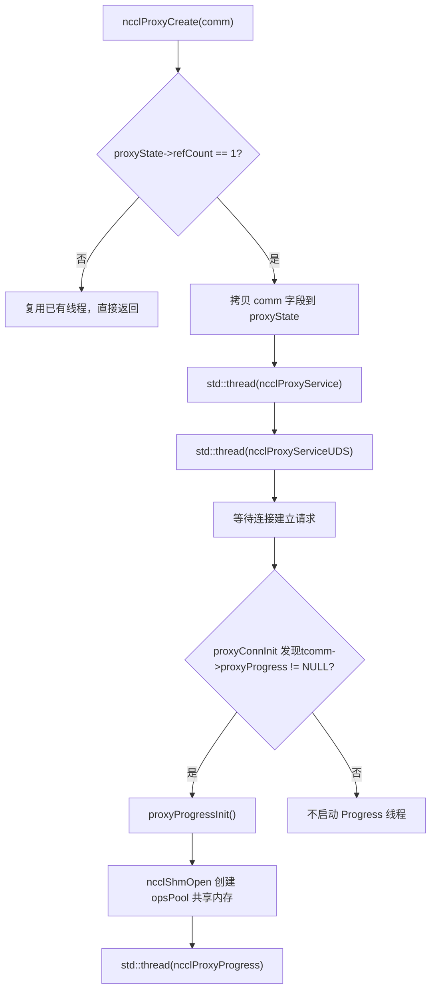
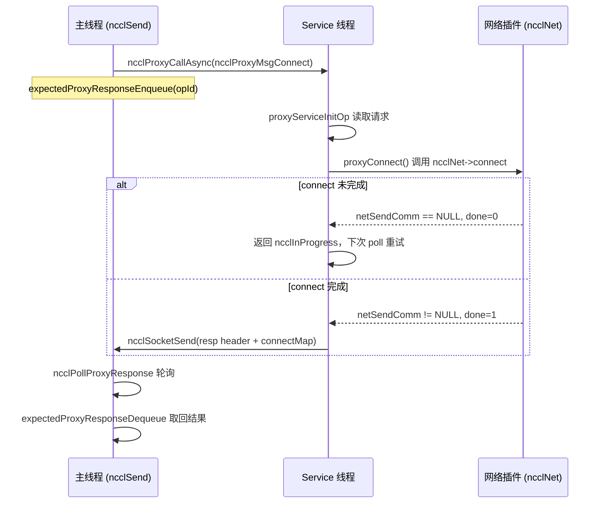
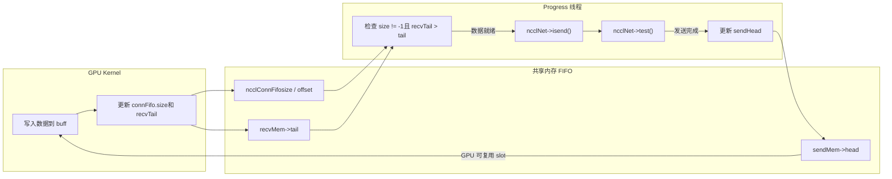

# Próximo capítulo: Capítulo 12 →

# Progresso do livro: Capítulo 12 / 25

Capítulo 12: Agendamento assíncrono da thread proxy: como proxy.cc desacopla I/O da execução do kernel`src/proxy.cc`O capítulo anterior desmontou a camada de abstração transport, mostrando como o NCCL usa uma interface unificada para ocultar as diferenças entre P2P/SHM/NET/NVLS. Mas a camada de transporte só respondeu «por qual canal os dados passam», ainda não respondeu «como os dados são conduzidos de forma assíncrona». Se o kernel da GPU bloquear diretamente à espera da rede, as unidades de computação serão arrastadas até a morte pelo I/O. Este capítulo foca em`src/include/proxy.h`e

# , para ver como o NCCL usa threads host independentes para separar o I/O de rede do caminho de execução do kernel, formando uma relação produtor-consumidor com a GPU.

## 12.1 Por que são necessárias threads proxy: começando por «quem espera pela rede»

Imagine um restaurante: a cozinha (GPU kernel) só é responsável por preparar os pratos, e o garçom (proxy thread) é responsável por entregar os pratos aos clientes (par remoto da rede). Se o chef tivesse que entregar os pratos pessoalmente, ele teria que parar de cozinhar a cada entrega, e a velocidade de saída dos pratos despencaria. O proxy do NCCL é exatamente esse garçom dedicado — o kernel apenas escreve dados no buffer compartilhado e lê dados do buffer, enquanto todo o trabalho pesado de envio e recebimento pela rede é delegado às proxy threads do lado host.

> **[Design Inference & Architectural Trade-offs]**
> Sem o proxy, que desastre o sistema enfrentaria? O GPU kernel é massivamente paralelo no modelo SIMT; um warp bloqueado em polling de rede desperdiçaria todo o poder computacional de uma SM; mais fatal ainda, o envio e recebimento pela rede envolvem chamadas de sistema de socket, polling de verbs, submissão de descritores DMA, e essas operações simplesmente não podem ser executadas em código de device. Portanto, o NCCL precisa mover o I/O de rede para o host, fazendo o kernel e o proxy trocarem sinais de "dados prontos" através de uma FIFO em memória compartilhada.

## A divisão de trabalho entre os dois tipos de threads

O NCCL inicia dois tipos de proxy threads no lado host, com responsabilidades completamente distintas:

- **Thread Service**（`ncclProxyService`): trata requisições do plano de controle — estabelecimento de conexão, registro de memória, consulta de FD. Ela escuta um socket, recebe requisições RPC do rank local e avança assincronamente operações como setup/connect.
- **Thread Progress**（`ncclProxyProgress`): trata o plano de dados — realmente impulsiona o envio e recebimento pela rede. Ela retira proxy ops do pool de memória compartilhada, chama o callback`proxyProgress`do transport para avançar a movimentação de dados.

[FACT:src/include/proxy.h:343-345]exibe`ncclProxyState`ao mesmo tempo mantém`thread`(Service) e`threadUDS`(serviço UDS), enquanto o handle da thread Progress está escondido em`progressState.thread`dentro de[FACT:src/include/proxy.h:261-261]。

## Estabelecimento da relação produtor-consumidor

[FACT:src/proxy.cc:2130-2166]O`ncclProxyCreate`é onde a thread nasce: quando`refCount == 1`(criação do primeiro comm), ele copia os campos-chave do comm para`proxyState`e então inicia a thread Service e a thread UDS. Note que a thread Progress não é iniciada aqui — ela é iniciada de forma lazy por`proxyProgressInit`somente quando a primeira conexão que precisa de proxy progress é estabelecida[FACT:src/proxy.cc:1523-1524]。



Este diagrama ancora o ramo real de inicialização da thread: somente quando`tcomm->proxyProgress`é não nulo (ou seja, aquele transport precisa de avanço no plano de dados) a thread Progress é criada.

# 12.2 Estruturas de dados e layout de memória: pool de memória compartilhada e pool de ops

## Panorama dos structs centrais

O modelo de concorrência do proxy é construído sobre dois blocos de memória compartilhada; entender o layout de memória deles é o pré-requisito para entender todo o mecanismo.

**Primeiro bloco:`ncclProxyOpsPool`**（[FACT:src/include/proxy.h:218-226]). Esta é a "caixa de entrega de tarefas" entre a thread principal e a thread Progress, compartilhada entre processos via`/dev/shm`Campo

| Tipo | Função | Array de ops pré-alocado, tamanho |
| --- | --- | --- |
| `ops[]` | `ncclProxyOp[]` | Índice da cabeça da lista encadeada de ops pendentes, -1 indica vazio`MAX_OPS_PER_PEER * NCCL_MAX_LOCAL_RANKS` |
| `nextOps` | `volatile int` | Índice da cauda da lista encadeada de ops pendentes |
| `nextOpsEnd` | `volatile int` | Cabeça da lista encadeada de ops livres de cada local rank |
| `freeOps[]` | `volatile int[]` | Marca se mutex/cond já foram inicializados |
| `syncObjectsInitialized` | `int` | Primitivas de sincronização entre processos |
| `mutex` / `cond` | `std::mutex` / `std::condition_variable` | A definição de |

`MAX_OPS_PER_PEER`é[FACT:src/include/proxy.h:218-226]. O comentário explica por que é 2 vezes: cada p2p work contém um send e um recv proxy op, então precisa multiplicar por 2; multiplicar por 2 novamente é para poder armazenar duas rodadas completas de operações, caso contrário não seria possível "entregar metade, liberar metade".`2 * MAXCHANNELS * 2 * NCCL_MAX_DEV_WORK_P2P_PER_BATCH`Segundo bloco:

**). Esta é a "descrição de op em tempo de execução" usada internamente pela thread Progress, alocada de`ncclProxyArgs`**（[FACT:src/include/proxy.h:174-209]e não compartilhada entre processos.`ncclProxyPool`Campos-chave:

: array de suboperações,

- `subs[NCCL_PROXY_MAX_SUBS]`. Operações do mesmo tipo de múltiplos channels são agregadas em múltiplos subs de um args.`NCCL_PROXY_MAX_SUBS = MAXCHANNELS` [FACT:src/include/proxy.h:55-55]: ponteiro de função, apontando para o callback
- `progress`do transport`proxyProgress`: três ponteiros de lista encadeada, formando uma relação complexa de organização de ops.[FACT:src/include/proxy.h:176-176]。
- `next` / `nextPeer` / `proxyAppendPtr`Três estados
- `state`：`ncclProxyOpNone` / `ncclProxyOpReady` / `ncclProxyOpProgress`Design em camadas do pool de memória[FACT:src/include/proxy.h:48-52]。

## é uma unidade de alocação em lote, cada pool contém

`ncclProxyPool` [FACT:src/proxy.cc:50-53](ou seja,`PROXYARGS_ALLOCATE_SIZE`) de`NCCL_MAX_OPS`A lógica de alocação de`ncclProxyArgs`。`allocateArgs` [FACT:src/proxy.cc:207-231]merece uma análise mais detalhada:

```c
if (state->pool == NULL) {
    struct ncclProxyPool* newPool;
    NCCLCHECK(ncclCalloc(&newPool, 1));
    struct ncclProxyArgs* newElems = newPool->elems;
    for (int i = 0; i pool = newElems;
    newPool->next = state->pools;
    state->pools = newPool;
}
elem = state->pool;
state->pool = state->pool->next;
```

[FACT:src/proxy.cc:207-231]

> **[Design Inference & Architectural Trade-offs]**
> A motivação de design aqui é:`ncclProxyArgs`O struct`subs[MAXCHANNELS]`é muito grande (contém`requests[NCCL_STEPS]`array, e cada sub ainda tem

## ), se cada op fosse malloc individualmente, causaria fragmentação de memória severa e overhead de alocação. Alocação em lote + reutilização de lista encadeada de livres dilui o custo de alocação para quase zero. O comentário "Make sure we allocate the memory close to the network thread" sugere que isso é para afinidade NUMA — o pool é criado na primeira alocação da thread Progress, naturalmente próximo da CPU onde essa thread executa.

`ncclProxyOpsPool`Falso compartilhamento e variáveis atômicas`nextOps`、`nextOpsEnd`、`freeOps[]`dentro de`volatile int`são todos

. Eles são lidos e escritos simultaneamente pela thread principal e pela thread Progress, mas o NCCL não usa locks para proteger todos os acessos — em vez disso, usa operações atômicas + ordenação de memória para garantir a correção.`ncclLocalOpAppend`Veja[FACT:src/proxy.cc:503-513]：

```c
int freeOp = -1;
while (freeOp == -1) {
  freeOp = COMPILER_ATOMIC_EXCHANGE(&pool->freeOps[tpLocalRank], -1, std::memory_order_acquire);
  if (freeOp == -1) std::this_thread::yield();
}
```

copiar`atomic_exchange`A thread principal usa`freeOps[tpLocalRank]`Definido como -1 e recupera o valor antigo — isto é uma "aquisição preemptiva": quem conseguir fazer exchange primeiro obtém toda a lista livre. Quando a thread Progress devolve um op, usa um ciclo CAS[FACT:src/proxy.cc:898-907]：

```c
oldFree = COMPILER_ATOMIC_LOAD(&pool->freeOps[i], std::memory_order_acquire);
do {
  pool->ops[freeOpEnd[i]].next = oldFree;
} while (!COMPILER_ATOMIC_COMPARE_EXCHANGE(&pool->freeOps[i], &oldFree, newFree,
                                           std::memory_order_release,
                                           std::memory_order_acquire));
```

> **[Design Inference & Architectural Trade-offs]**
> Aqui usa-se acquire/release em vez de seq_cst porque só é necessário garantir que "a escrita do ponteiro next do nó da lista" seja visível para o lado que adquire, não sendo necessária uma ordem global.`freeOps[]`Cada elemento do array corresponde a um local rank, naturalmente dispersos perto de diferentes linhas de cache, reduzindo o false sharing.

# 12.3 Plano de controlo: estabelecimento de ligações e mecanismo RPC

## Modelo intuitivo

> **[Design Inference & Architectural Trade-offs]**
> A thread Service é como um "rececionista de front office": quando um rank local precisa de estabelecer uma ligação de rede, não se liga diretamente, mas envia um pedido RPC à thread Service, que executa setup/connect em seu nome. Porquê? Porque o estabelecimento de ligações de rede (especialmente a criação de QP em verbs e o registo de memória) pode bloquear, e alguns recursos (como o listen socket) têm de ser detidos por uma única thread. Centralizar o plano de controlo na thread Service permite que a thread principal continue de forma não bloqueante a fazer outras coisas.

## Codificação de pedidos RPC

`ncclProxyCallAsync` [FACT:src/proxy.cc:1369-1394]É o lado emissor do RPC. Envia sequencialmente através do socket: type, ponteiro connection, reqSize, respSize, reqBuff, opId.

```c
NCCLCHECKGOTO(ncclSocketSend(sock, &type, sizeof(int)), ret, error);
NCCLCHECKGOTO(ncclSocketSend(sock, &proxyConn->connection, sizeof(void*)), ret, error);
NCCLCHECKGOTO(ncclSocketSend(sock, &reqSize, sizeof(int)), ret, error);
NCCLCHECKGOTO(ncclSocketSend(sock, &respSize, sizeof(int)), ret, error);
if (reqSize) NCCLCHECKGOTO(ncclSocketSend(sock, reqBuff, reqSize), ret, error);
NCCLCHECKGOTO(ncclSocketSend(sock, &opId, sizeof(opId)), ret, error);
NCCLCHECK(expectedProxyResponseEnqueue(sharedProxyState, opId, respSize));
```

[FACT:src/proxy.cc:1369-1394]

Atenção ao último passo: após enviar o pedido, regista imediatamente o opId na`expectedResponses`fila. Esta é a chave do RPC assíncrono — o chamador não espera pela resposta, mas regista primeiro "espero a resposta deste opId", e depois usa`ncclPollProxyResponse`polling.

## Implementação em lista ligada da fila de respostas

`expectedProxyResponseEnqueue` [FACT:src/proxy.cc:97-117]Usa uma lista simplesmente ligada para armazenar os op à espera de resposta.`expectedProxyResponseStore` [FACT:src/proxy.cc:67-95]Ao receber a resposta, faz correspondência por opId, copia os dados da resposta com memcpy para o`respBuff`pré-alocado, marca`done = true`。`expectedProxyResponseDequeue` [FACT:src/proxy.cc:119-141]No polling, procura respostas concluídas e remove-as.

Há aqui um detalhe:`expectedProxyResponseStore`Verifica se`respSize`corresponde a[FACT:src/proxy.cc:72-75], se não corresponder reporta`ncclInternalError`. Isto é programação defensiva — se o requerente e o respondedor tiverem entendimentos diferentes sobre o tamanho da resposta, isso indica desalinhamento do protocolo, devendo falhar imediatamente em vez de continuar silenciosamente.

## Ciclo principal da thread Service

`ncclProxyService` [FACT:src/proxy.cc:1789-2016]O núcleo é um ciclo poll. Usa`pollfds`um array para gerir todas as ligações, incluindo o listen socket e o socket de cada peer.

```c
while (stop == PROXY_RUNNING || npeers > 0) {
    if (COMPILER_ATOMIC_LOAD(proxyState->abortFlag, std::memory_order_acquire) != 0) stop = PROXY_ABORT;
    int ret = 0;
    const int timeout = asyncOpCount ? 0 : 500;
    ...
    ret = poll(activePollfds, nfds_to_poll, timeout);
```

[FACT:src/proxy.cc:1842-1863]

`timeout`A escolha de é criteriosa: se houver ops assíncronos em progresso (`asyncOpCount > 0`), o timeout é definido para 0 (polling não bloqueante), porque é necessário chamar frequentemente`proxyProgressAsync`para os impulsionar; caso contrário, define-se 500ms para evitar consumo de CPU em vazio. O comentário "never let proxy service thread blocks in poll, or it cannot receive abortFlag"[FACT:src/proxy.cc:1847-1847]esclarece porque não se pode bloquear indefinidamente — é necessário acordar periodicamente para verificar abortFlag.

## Impulsionamento de ops assíncronos

`proxyProgressAsync` [FACT:src/proxy.cc:1626-1700]É o núcleo do impulsionamento de operações assíncronas pela thread Service. Distribui para diferentes callbacks de transport conforme o tipo de op:

```c
if (op->type == ncclProxyMsgSetup) {
    res = op->connection->tcomm->proxySetup(op->connection, proxyState, op->reqBuff, op->reqSize, op->respBuff,
                                            op->respSize, &done);
} else if (op->type == ncclProxyMsgConnect) {
    res = op->connection->tcomm->proxyConnect(...);
} else if (op->type == ncclProxyMsgInit) {
    res = proxyConnInit(peer, connectionPool, proxyState, ...);
}
```

[FACT:src/proxy.cc:1631-1664]

Cada callback traz um`done`parâmetro de saída. Se`done == 0`, significa que a operação ainda não terminou (por exemplo, a ligação de rede ainda está no three-way handshake), retorna`ncclInProgress`, e o próximo ciclo continua a impulsionar. Se`done == 1`, então envia o cabeçalho de resposta + corpo da resposta ao requerente[FACT:src/proxy.cc:1681-1689]。



Este diagrama de sequência ancora`sendProxyConnect`em`*done = 0; return ncclInProgress`o ramo real de[FACT:src/transport/net.cc:913-916]。

# 12.4 Plano de dados: como a thread Progress impulsiona o envio e receção de rede

## Modelo intuitivo

A thread Progress é o "operador da passadeira": vigia a FIFO no buffer partilhado e, assim que a GPU escreve os dados (size != -1 na FIFO), chama imediatamente`isend`para enviar os dados; assim que a rede termina a receção dos dados, atualiza recvTail para notificar a GPU de que pode ler. Todo o processo sincroniza-se entre a GPU e o proxy através dos ponteiros head/tail na FIFO, sem necessidade de qualquer lock.

## Entrega de op: da thread principal para a thread Progress

A thread principal, em`ncclProxySaveOp` [FACT:src/proxy.cc:591-761], decide quais proxy ops são necessários conforme o pattern, e depois através de`SaveProxy` → `ncclLocalOpAppend`escreve o op no pool de memória partilhada.

`ncclLocalOpAppend` [FACT:src/proxy.cc:488-554]O fluxo de :

1. De`proxyOps->freeOp`ou`pool->freeOps[tpLocalRank]`obtém um slot de op livre.

2. `memcpy(op, proxyOp, sizeof(struct ncclProxyOp))`Copia o conteúdo do op para a memória partilhada[FACT:src/proxy.cc:515-515]。

3. Pendura o op no`proxyOps->nextOps`fim da lista ligada.

4. Se o número acumulado de ops atingir`MAX_OPS_PER_PEER`, dispara uma entrega em lote[FACT:src/proxy.cc:525-551]。

A lógica da entrega em lote é subtil: não pode simplesmente enviar todos os ops, porque "vários ops com o mesmo opCount têm de ser entregues juntos, caso contrário quebra-se a agregação sub de proxyArgs". Por isso encontra a última fronteira onde opCount muda, e só entrega até aí[FACT:src/proxy.cc:529-548]。

A entrega é feita através de`ncclProxyPost` [FACT:src/proxy.cc:476-486], que adquire o lock, atualiza`pool->nextOps`、`notify_one`e acorda a thread Progress.

## Ciclo principal da thread Progress

`ncclProxyProgress` [FACT:src/proxy.cc:951-1011]A estrutura de :

```c
do {
    int idle = 1;
    ncclResult_t ret = progressOps(proxyState, state, state->active, &idle);
    ...
    if (idle || !state->active || (++proxyOpAppendCounter == ncclParamProgressAppendOpFreq())) {
      int added = 0;
      proxyOpAppendCounter = 0;
      ret = ncclProxyGetPostedOps(proxyState, &added);
      ...
    }
    lastIdle = idle;
    stopv = state->stop.load(std::memory_order_acquire);
} while ((stopv == 0 || (stopv == 1 && state->active)) &&
         COMPILER_ATOMIC_LOAD(proxyState->abortFlag, std::memory_order_acquire) == 0);
```

[FACT:src/proxy.cc:976-1009]

Há aqui uma otimização de desempenho que vale a pena notar:`proxyOpAppendCounter`O contador[FACT:src/proxy.cc:974-974]. O comentário explica[FACT:src/proxy.cc:969-973]: chamar demasiadas vezes`ncclProxyGetPostedOps`causa regressão de desempenho na comunicação de mensagens pequenas, por isso a cada avanço de`ProgressAppendOpFreq`(padrão 8) vezes antes de buscar um novo op.

## Agregação de op: ProxyAppend

`ProxyAppend` [FACT:src/proxy.cc:437-474]Decide se um op é "anexado ao sub de args existente" ou "cria um novo args". O critério é`connection->shared && args->opCount == op->opCount` [FACT:src/proxy.cc:443-443]——múltiplas operações de channel na mesma conexão e mesmo opCount são agregadas.

> **[Design Inference & Architectural Trade-offs]**
> Valor da agregação: operações do mesmo tipo de múltiplos channels são combinadas em um único args, a thread Progress avança todos os channels em uma única iteração, reduzindo overhead de chamadas de função e invalidação de cache.`ncclProxyOpToArgs` [FACT:src/proxy.cc:368-435]Ao anexar sub, valida-se`sliceSteps`、`chunkSteps`、`protocol`、`dtype`、`redOp`、`coll`se são consistentes[FACT:src/proxy.cc:401-406], se inconsistentes, gera erro——esta é a linha de defesa contra agregação incorreta.

## sendProxyProgress: máquina de estados de quatro fases do lado de envio

`sendProxyProgress` [FACT:src/transport/net.cc:1324-1491]É o núcleo do lado de envio. Avança sub a sub, cada sub tem quatro contadores:`posted`、`transmitted`、`done`。

**Fase um: Inicialização Ready** [FACT:src/transport/net.cc:1326-1339]

```c
sub->base = ROUNDUP(resources->step, args->chunkSteps);
resources->step = sub->base + sub->nsteps;
sub->posted = sub->transmitted = sub->done = 0;
```

`base`É o número inicial do step,`ROUNDUP`garante alinhamento a`chunkSteps`。`resources->step`acumula, reservando espaço para o próximo op.

**Fase dois: Post do buffer para a GPU** [FACT:src/transport/net.cc:1355-1376]

```c
if (sub->posted nsteps && sub->posted done + maxDepth) {
    int buffSlot = (sub->base + sub->posted) % NCCL_STEPS;
    if (resources->shared) {
        ...
        *sendHead = sub->base + sub->posted - NCCL_STEPS;
    } else {
        sub->posted += args->sliceSteps;
    }
}
```

`maxDepth`É a profundidade do pipeline[FACT:src/transport/net.cc:1343-1343], limita o número de steps simultaneamente in-flight. No modo shared, o proxy atualiza`sendHead`para informar à GPU "este slot pode ser escrito".

**Fase três: Verifica se a GPU escreveu, inicia isend** [FACT:src/transport/net.cc:1378-1452]

```c
if (sub->transmitted posted && sub->transmitted done + NCCL_STEPS) {
    int buffSlot = (sub->base + sub->transmitted) % NCCL_STEPS;
    volatile uint64_t* recvTail = &resources->recvMem->tail;
    uint64_t tail = sub->base + sub->transmitted;
    if (connFifo[buffSlot].size != -1 && (*recvTail > tail || p == NCCL_PROTO_LL)) {
        int size = connFifo[buffSlot].size;
        ...
        NCCLCHECK(proxyState->ncclNet->isend(resources->netSendComm, buff, size, resources->tpRank,
                                             sub->sendMhandle, phandle, sub->requests + buffSlot));
        if (sub->requests[buffSlot] != NULL) {
            sub->transmitted += args->sliceSteps;
        }
    }
}
```

A verificação chave aqui é`connFifo[buffSlot].size != -1 && *recvTail > tail`——após a GPU escrever os dados, atualiza o size e recvTail do FIFO, o proxy só inicia o isend quando ambas as condições são satisfeitas. Para o protocolo LL, por ter semântica de "zero-copy", não precisa esperar pelo recvTail.

**Fase quatro: Verifica conclusão do envio, atualiza sendHead** [FACT:src/transport/net.cc:1455-1481]

```c
if (sub->done transmitted) {
    int buffSlot = (sub->base + sub->done) % NCCL_STEPS;
    NCCLCHECK(proxyState->ncclNet->test(sub->requests[buffSlot], &done, &size));
    if (done) {
        connFifo[buffSlot].size = -1;
        std::atomic_thread_fence(std::memory_order_seq_cst);
        sub->done += args->sliceSteps;
        if (resources->shared == 0) {
            volatile uint64_t* sendHead = resources->gdcSync ? resources->gdcSync : &resources->sendMem->head;
            *sendHead = sub->base + sub->done;
        }
    }
}
```

`test`Após retornar done, primeiro reseta o FIFO size para -1, insere um seq_cst fence, depois atualiza sendHead notificando a GPU "este slot pode ser reutilizado". A função do fence é impedir a reordenação do reset de size e da atualização de head——se head for atualizado primeiro, a GPU pode começar a escrever enquanto size ainda tem valor antigo.

## recvProxyProgress: quatro fases do lado de recepção

`recvProxyProgress` [FACT:src/transport/net.cc:1493-1788]É mais complexo, pois envolve agrupamento de sub (usa multirecv quando múltiplos subs compartilham o mesmo recvComm).

**Fase um: Agrupamento por recvComm no Ready** [FACT:src/transport/net.cc:1495-1538]

```c
for (int s = 0; s nsubs; s++) {
    ...
    if (groupSize == maxRecvs) {
        groupSize = 0;
    } else if (s > 0) {
        int next;
        for (next = s; next nsubs; next++) {
            struct recvNetResources* nextRes = ...;
            if (nextRes->netRecvComm == recvComm) break;
        }
        if (next == args->nsubs) {
            groupSize = 0;
        } else if (s != next) {
            // swap subs
        }
    }
    groupSize++;
    ...
    for (int i = 0; i  **[Design Inference & Architectural Trade-offs]**
> Este trecho de código agrupa subs que usam o mesmo`recvComm`e registra`groupSize`. Por que agrupar? Porque`irecv`suporta receber múltiplos buffers de uma vez (multirecv), combinar requisições do mesmo comm em uma única chamada reduz significativamente o overhead do plugin.

**Fase dois: Inicia irecv** [FACT:src/transport/net.cc:1543-1631]

```c
if (subCount) {
    uint64_t step = subGroup->posted;
    void** requestPtr = subGroup->requests + (step % NCCL_STEPS);
    bool ignoreCompletion = ncclParamNetOptionalRecvCompletion() &&
                            ((args->protocol == NCCL_PROTO_LL128) || (args->protocol == NCCL_PROTO_LL)) &&
                            (subCount == 1);
    if (ignoreCompletion) *requestPtr = (void*)NCCL_NET_OPTIONAL_RECV_COMPLETION;
    NCCLCHECK(proxyState->ncclNet->irecv(resources->netRecvComm, subCount, ptrs, sizes, tags, mhandles, phandles,
                                         requestPtr));
    if (*requestPtr) {
        subGroup->recvRequestsCache[step % NCCL_STEPS] = *requestPtr;
        subGroup->recvRequestsSubCount = subCount;
        for (int i = 0; i groupSize; i++) {
            sub->posted += args->sliceSteps;
        }
    }
}
```

`ignoreCompletion`Otimização[FACT:src/transport/net.cc:1608-1610]: para recepção de buffer único nos protocolos LL/LL128, a notificação de conclusão é opcional (pois os dados já carregam flag), pode-se pular a verificação de completion.

**Fase três: Verifica conclusão da recepção, atualiza recvTail** [FACT:src/transport/net.cc:1634-1743]

```c
NCCLCHECK(proxyState->ncclNet->test(subGroup->requests[step % NCCL_STEPS], &done, sizes));
if (done) {
    for (int i = 0; i groupSize; i++) {
        struct ncclProxySubArgs* sub = subGroup + i;
        int buffSlot = (sub->base + sub->received) % NCCL_STEPS;
        connFifo[buffSlot].size = -1;
        sub->received += args->sliceSteps;
    }
    ...
}
```

Após a recepção completar, reseta o FIFO size, depois entra na fase de flush (cenários GDRDMA precisam de flush para garantir visibilidade dos dados).

**Fase quatro: Aguarda consumo pela GPU, atualiza done** [FACT:src/transport/net.cc:1745-1779]

```c
if (sub->transmitted > sub->done) {
    volatile uint64_t* sendHead = &resources->sendMem->head;
    uint64_t done = *sendHead;
    while (done > sub->base + sub->done && sub->transmitted > sub->done) {
        if (subGroup->recvRequestsCache[sub->done % NCCL_STEPS]) {
            if (proxyState->ncclNet->irecvConsumed) {
                NCCLCHECK(proxyState->ncclNet->irecvConsumed(resources->netRecvComm, subGroup->recvRequestsSubCount,
                                                             subGroup->recvRequestsCache[sub->done % NCCL_STEPS]));
            }
            subGroup->recvRequestsCache[sub->done % NCCL_STEPS] = NULL;
        }
        sub->done += args->sliceSteps;
    }
}
```

Aqui, lê-se`sendHead`para determinar se a GPU já consumiu os dados.`irecvConsumed`É o callback para o plugin, informando "o buffer desta requisição de recepção já foi consumido, pode ser reutilizado".

## Panorama do fluxo de dados



Este diagrama de fluxo de dados mostra o ciclo fechado formado pela GPU e o proxy através do FIFO e ponteiros head/tail: GPU escreve dados → atualiza tail → proxy detecta e inicia isend → test confirma conclusão → atualiza head → GPU reutiliza slot.

# 12.5 Controle de concorrência, barreiras de memória e interação com hardware

## Ordem de memória do FIFO lock-free

A sincronização entre proxy e GPU depende inteiramente de`ncclConnFifo`e ponteiros head/tail, sem nenhum lock. Isso exige controle de ordem de memória extremamente cuidadoso.

No lado de envio, o proxy após`test`retornar done[FACT:src/transport/net.cc:1460-1473]：

```c
connFifo[buffSlot].size = -1;
std::atomic_thread_fence(std::memory_order_seq_cst);
...
*sendHead = sub->base + sub->done;
```

O seq_cst fence garante que após o reset de size ser visível à GPU, a atualização de head só então se torna visível. Se a ordem fosse invertida, a GPU poderia ver o novo head mas o size antigo, pensando erroneamente que há dados no slot.

No lado de recepção, o proxy antes de atualizar recvTail[FACT:src/transport/net.cc:1731-1736]：

```c
if (step nsteps) {
    std::atomic_thread_fence(std::memory_order_seq_cst);
    volatile uint64_t* recvTail = resources->gdcSync ? resources->gdcSync : &resources->recvMem->tail;
    *recvTail = sub->base + sub->transmitted;
}
```

Mesma lógica: primeiro fence garante visibilidade da escrita de dados, depois atualiza tail notificando a GPU que pode ler.

## Mecanismo de flush do GDRCOPY

Ao usar GDRDMA, a NIC escreve diretamente na memória da GPU, mas a operação de escrita pode ainda estar não confirmada no barramento PCIe. O proxy precisa fazer flush ativo para garantir visibilidade dos dados. Veja`recvProxyProgress`a lógica de flush em[FACT:src/transport/net.cc:1664-1709]：

```c
if (totalSize > 0 && p == NCCL_PROTO_SIMPLE && needFlush) {
    if (resources->gdcFlush) {
#if defined(__x86_64__)
        asm volatile("mfence" ::: "memory");
        asm volatile("mov (%0), %%eax" ::"l"(resources->gdcFlush) : "%eax", "memory");
#else
        std::atomic_thread_fence(std::memory_order_seq_cst);
        uint64_t dummy;
        NCCLCHECK(ncclGdrCudaRead(resources->gdrDesc, &dummy, resources->gdcFlush, sizeof(dummy)));
#endif
    } else {
        // iflush 路径
        NCCLCHECK(proxyState->ncclNet->iflush(resources->netRecvComm, subCount, ptrs, sizes, mhandles,
                                              subGroup->requests + (step % NCCL_STEPS)));
    }
}
```

O comentário do caminho x86 é excelente[FACT:src/transport/net.cc:1668-1674]：`mfence`Impede que o load do CQE-poll seja reordenado antes do flush load;`mov (%0), %%eax`Força uma leitura PCIe, fazendo a CPU parar até que todos os posted writes PCIe anteriores (incluindo DMA da NIC) sejam confirmados no endpoint. Este é um controle de ordenação de memória em nível de hardware, mais robusto que qualquer fence de software.

## Coordenação entre variáveis atômicas e stop/abort

Condição de saída da thread Progress[FACT:src/proxy.cc:1007-1009]：

```c
stopv = state->stop.load(std::memory_order_acquire);
} while ((stopv == 0 || (stopv == 1 && state->active)) &&
         COMPILER_ATOMIC_LOAD(proxyState->abortFlag, std::memory_order_acquire) == 0);
```

`stop == 1`Mas`state->active != NULL`continua em execução — isso é para "parada graciosa": as ops já submetidas devem ser concluídas, caso contrário a GPU nunca receberá os dados. Apenas`stop == 2`(abort) ou`abortFlag != 0`forçam a saída.

`ncclProxyProgressDestroy` [FACT:src/proxy.cc:1039-1065]Fluxo de parada de

```c
std::lock_guard lock(state->opsPool->mutex);
state->stop.store(1, std::memory_order_release);
state->opsPool->cond.notify_one();
state->thread.join();
```

Primeiro adquire o lock, depois armazena stop, e então notifica — este é o padrão para evitar lost wakeup. A thread Progress, em`pool->cond.wait`, mantém o lock e verifica o predicado[FACT:src/proxy.cc:850-851], garantindo que não perderá o wakeup.

# 12.6 Guia de prevenção de armadilhas em produção e cadeia de recuperação de falhas

## Armadilha 1: Vazamento de conexão impede a thread Service de sair

`ncclProxyService`A condição do loop principal de`stop == PROXY_RUNNING || npeers > 0` [FACT:src/proxy.cc:1842-1842]é[FACT:src/proxy.cc:1843-1845]. O comentário explica

**: mesmo que o comm local seja abortado, enquanto houver conexões peer, a thread proxy não pode sair, caso contrário pode ocorrer segmentation fault.**Cenário de diagnóstico`npeers > 0`: se um rank falhar sem notificar o par, a thread Service do par ficará presa no loop de`abortFlag`. Nesse caso, é necessário depender de`ncclProxyService`ou de um mecanismo de timeout. Em produção, se um processo estiver travado em

## , verifique primeiro se algum rank par falhou de forma anormal.

`expectedProxyResponseStore`Armadilha 2: Incompatibilidade na fila de respostas causa vazamento de memória`ncclInternalError` [FACT:src/proxy.cc:93-94]retorna`respBuff`quando o opId não corresponde. Mas se a resposta chegar quando o solicitante já desistiu (por exemplo, por timeout), essa resposta permanecerá na fila para sempre,

**vazamento.**：`expectedProxyResponseFree` [FACT:src/proxy.cc:55-65]Medidas de defesa`ncclProxyDestroy`limpa toda a fila[FACT:src/proxy.cc:2226-2226]em

## . Mas isso é apenas o último recurso; em operação normal não deve haver resíduos.

`sendProxyConnect`Armadilha 3: head inicializado com valor negativo no modo shared[FACT:src/transport/net.cc:999-1000]：

```c
// Don't give credits yet in shared mode.
(resources->gdcSync ? *resources->gdcSync : resources->sendMem->head) = (map->shared ? -NCCL_STEPS : 0);
```

Cópia`-NCCL_STEPS`No modo shared, head é inicializado como

## , o que significa que a GPU não tem credit para escrever inicialmente. O proxy precisa aumentar gradualmente o head na fase de post para "conceder credit". Se essa inicialização for esquecida, a GPU pensará erroneamente que tem credit e escreverá em slots não prontos, causando corrupção de dados.

`sendProxyProgress`Armadilha 4: Verificação de flag do protocolo LL128[FACT:src/transport/net.cc:1388-1403]：

```c
if (p == NCCL_PROTO_LL128) {
    ready = resources->useGdr;
    if (!ready) {
        uint64_t flag = sub->base + sub->transmitted + 1;
        int nFifoLines = DIVUP(connFifo[buffSlot].size, sizeof(uint64_t) * NCCL_LL128_LINEELEMS);
        volatile uint64_t* lines = (volatile uint64_t*)buff;
        ready = 1;
        for (int i = 0; i Q1: Se removermos de`sendProxyProgress`a lógica de atualizar`sub->done == sub->nsteps`em`sendHead`(ou seja, não notificar a GPU que o slot foi liberado), em qual cenário ocorreria deadlock? Por quê?

**Análise de referência**：`sendHead`é a única base para a GPU determinar "quais slots podem ser reutilizados". Veja[FACT:src/transport/net.cc:1469-1473]：

```c
if (resources->shared == 0) {
    volatile uint64_t* sendHead = resources->gdcSync ? resources->gdcSync : &resources->sendMem->head;
    *sendHead = sub->base + sub->done;
}
```

Se isso for removido, o head da GPU permanecerá no valor inicial (no modo shared é`-NCCL_STEPS`, no modo não-shared é 0). O kernel da GPU, em`waitSend`, verifica`head + NCCL_STEPS > step`para considerar que há credit para escrever. Se o head não avançar, a GPU, após preencher`NCCL_STEPS`slots, ficará bloqueada para sempre esperando credit, enquanto o proxy espera que a GPU escreva novos dados para poder fazer isend — um deadlock clássico de produtor-consumidor. No modo shared é ainda pior, pois o head inicial é negativo, e a GPU não tem credit desde o início.

Q2: `ncclLocalOpAppend`Quando o op acumulado atinge`MAX_OPS_PER_PEER`, o envio em lote é acionado, mas o código deliberadamente "não envia todos os ops do último opCount". Se fosse alterado para simplesmente enviar todos os ops, qual mecanismo seria quebrado?

**Análise de referência**: Veja[FACT:src/proxy.cc:525-548]os comentários e a lógica de

```c
// Do not post last operations as we could have more coming with the same opCount, and posting
// them in different batches would break proxyArgs aggregation with subs.
uint64_t lastOpCount = pool->ops[proxyOps->nextOpsEnd].opCount;
int lastOp = -1;
...
for (int op = proxyOps->nextOps; op != proxyOps->nextOpsEnd; op = pool->ops[op].next) {
    ops++;
    if (pool->ops[op].opCount != lastOpCount) {
        lastOp = op;
        toSend = ops;
    }
}
```

`ProxyAppend`A lógica de agregação de[FACT:src/proxy.cc:443-443]depende de`args->opCount == op->opCount`para determinar se um sub deve ser anexado. Se múltiplos channel ops do mesmo opCount forem divididos em dois lotes de envio, o primeiro lote criará um args, e quando o segundo lote chegar,`args->opCount`já não será igual ao opCount do novo op (porque args pode já ter avançado), fazendo com que subs que deveriam ser agregados sejam divididos em args independentes. Isso não só reduz o desempenho, como também pode quebrar`ncclProxyOpToArgs`a lógica de`nChannels`/`nPeers`de obter o mínimo em[FACT:src/proxy.cc:399-400], causando cálculo incorreto do número de canais.

Q3: `recvProxyProgress`A fase Ready de`recvComm`reordena e agrupa os subs por`irecv`. Se essa lógica de agrupamento for removida, fazendo cada sub chamar`maxRecvs > 1`independentemente, quais seriam as consequências na placa de rede de

**Análise de referência**: Veja[FACT:src/transport/net.cc:1495-1538]a lógica de agrupamento de[FACT:src/transport/net.cc:1613-1614]e a chamada multirecv de

```c
NCCLCHECK(proxyState->ncclNet->irecv(resources->netRecvComm, subCount, ptrs, sizes, tags, mhandles, phandles,
                                     requestPtr));
```

`maxRecvs`é o "número máximo de buffers que um único irecv pode receber" declarado pelo plugin da placa de rede[FACT:src/transport/net.cc:1525-1525]. Quando`maxRecvs > 1`, o plugin (como IB) suporta um WQE recebendo múltiplos buffers, o que reduz significativamente a sobrecarga de doorbell e o custo de processamento de CQE. Se o agrupamento for removido, cada sub faz irecv individualmente,`subCount`será sempre 1, o plugin degenera para o modo de buffer único, e a taxa de transferência diminuirá. Mais criticamente,`recvRequestsCache`e`irecvConsumed`o mecanismo[FACT:src/transport/net.cc:1616-1617]é projetado para multirecv — no modo de buffer único, essas lógicas de cache se tornam ineficazes, podendo causar vazamento de requisições.

Até aqui, entendemos como a thread proxy desacopla o I/O de rede da execução do kernel, permitindo que a computação da GPU e a comunicação sejam verdadeiramente paralelas. Mas o proxy é apenas o motorista; a implementação concreta da transmissão de rede subjacente ainda precisa ser revelada. No próximo capítulo, vamos nos aprofundar em`net_ib`, vendo como o NCCL encapsula a API verbs para implementar a transmissão InfiniBand, e como o GPUDirect RDMA permite que a placa de rede leia e escreva diretamente na memória da GPU.
