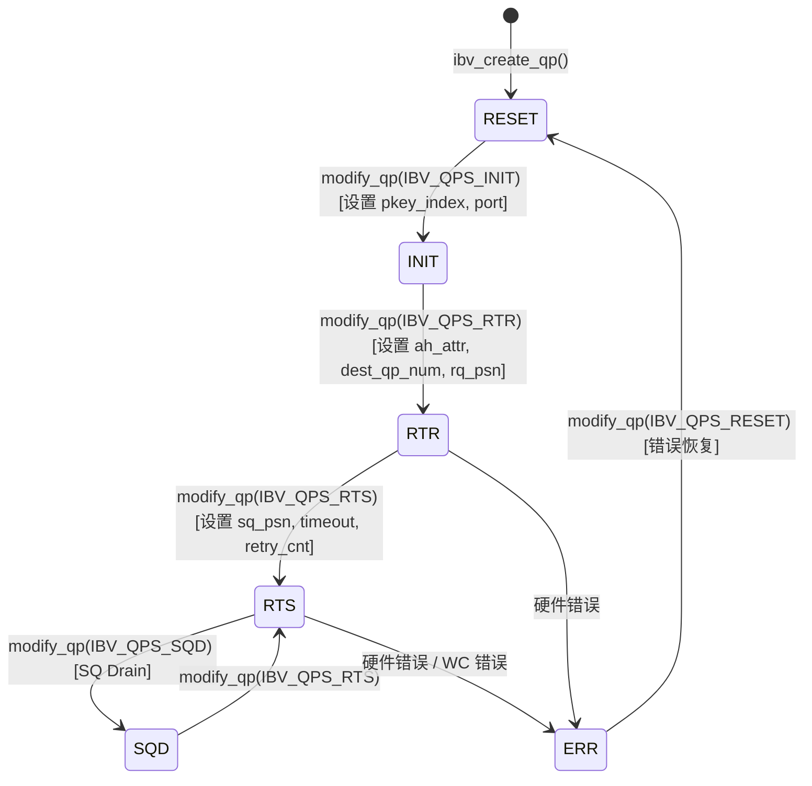

# Capítulo 13: Transmissão de rede InfiniBand: como net_ib encapsula verbs e GPUDirect RDMA

No capítulo anterior, vimos como a thread proxy separa o I/O de rede do kernel da GPU, permitindo que computação e comunicação sejam verdadeiramente paralelas. Mas o proxy é apenas um "motorista" — ele chama as interfaces abstratas ncclNet->isend/irecv, mas não sabe se por baixo é TCP, InfiniBand ou outra coisa. Neste capítulo, levantamos essa camada de abstração, entrando em src/transport/net_ib e src/misc/ibvwrap.cc, para ver como o NCCL encapsula a biblioteca C libibverbs em uma tabela de símbolos plugável, como estabelece Queue Pairs (QP), e como o GPUDirect RDMA permite que a placa de rede contorne a memória do host e leia/escreva diretamente na memória da GPU.

# 13.1 Por que o NCCL não chama libibverbs diretamente

## Modelo intuitivo: a tabela de símbolos é como uma "tomada elétrica plugável"

Imagine que você comprou um eletrodoméstico importado, e o formato do plugue não corresponde à tomada da sua casa. Você tem duas opções: ou desmonta o eletrodoméstico e troca a fiação (linkar diretamente`#include <infiniband/verbs.h>`e`-libverbs`), ou compra um adaptador universal (carregar símbolos dinamicamente em tempo de execução). O NCCL escolheu a segunda opção.

> **[Design Inference & Architectural Trade-offs]**
> A motivação central dessa escolha é**flexibilidade de implantação**: o NCCL, como biblioteca carregada por frameworks de alto nível como PyTorch e TensorFlow, não pode assumir que o ambiente de execução tenha`libibverbs.so`instalado. Se houvesse linkagem estática em tempo de compilação, então em máquinas sem driver InfiniBand, toda a biblioteca NCCL não poderia ser carregada — mesmo que você só quisesse usar NVLink para comunicação em uma única máquina. Através de`dlopen`em tempo de execução + resolução de símbolos, o NCCL pode degradar graciosamente em máquinas sem IB.

Se essa camada de encapsulamento faltasse, o desastre que o sistema enfrentaria seria:**uma tarefa de treinamento em máquina única puramente NVLink travaria diretamente porque a máquina não tem driver IB instalado**. Isso é extremamente comum em ambientes de nuvem e máquinas de desenvolvimento.

## Estrutura de dados e layout de memória: contêiner da tabela de símbolos

A estrutura de dados central é`ncclIbvSymbols`, definida em`ibvsymbols.h`(este capítulo não inclui esse arquivo, mas sua estrutura pode ser inferida pelo modo de uso). É um contêiner puro de ponteiros de função, cada campo correspondendo a uma função libibverbs:

```c
struct ncclIbvSymbols {
  int (*ibv_internal_fork_init)(void);
  struct ibv_device** (*ibv_internal_get_device_list)(int* num_devices);
  int (*ibv_internal_modify_qp)(struct ibv_qp*, struct ibv_qp_attr*, int);
  // ... 数十个函数指针
};
```

Há apenas uma instância global, com`std::once_flag`garantindo inicialização thread-safe:

[FACT:src/misc/ibvwrap.cc:26-29]

```c
static std::once_flag initOnceFlag;
static ncclResult_t initResult;
struct ncclIbvSymbols ibvSymbols;
```

O design aqui é muito contido:`initOnceFlag`é`std::once_flag`，`initResult`Resultado da inicialização do cache,`ibvSymbols`é a tabela de símbolos global. Os três têm tempo de armazenamento estático, com ciclo de vida que abrange todo o processo.

> **[Design Inference & Architectural Trade-offs]**
> Por que usar`std::once_flag`em vez de`pthread_once`? Porque o código C++ do NCCL já depende de`<mutex>`e`<thread>`, usar a biblioteca padrão é mais consistente.`call_once`A semântica de é: não importa quantas threads chamem`wrap_ibv_symbols()`simultaneamente, a lambda é executada apenas uma vez, as demais threads bloqueiam e esperam, e então todas obtêm o mesmo`initResult`. Isso é muito mais seguro do que escrever manualmente um double-checked locking (DCLP) — o DCLP tem armadilhas famosas de reordenação sob o modelo de memória do C++.

## Passo a Passo: O fluxo completo de resolução de símbolos

Quando o NCCL precisa de transporte IB pela primeira vez, ele chama`wrap_ibv_symbols()`：

[FACT:src/misc/ibvwrap.cc:26-29]

```c
ncclResult_t wrap_ibv_symbols(void) {
  std::call_once(initOnceFlag, []() { initResult = buildIbvSymbols(&ibvSymbols); });
  return initResult;
}
```

`buildIbvSymbols`definido em`ibvsymbols.cc`(não incluído neste capítulo), seu trabalho é usar`dlopen("libibverbs.so")`para abrir a biblioteca, e então para cada nome de função chamar`dlsym`para preencher o ponteiro. Se algum símbolo não for encontrado, o campo correspondente permanece NULL.

Este design de "permitir NULL" permeia toda a camada de encapsulamento. Veja`CHECK_NOT_NULL`macro:

[FACT:src/misc/ibvwrap.cc:26-29]

```c
#define CHECK_NOT_NULL(container, internal_name) \
  if (container.internal_name == NULL) { \
    WARN("lib wrapper not initialized."); \
    return ncclInternalError; \
  }
```

Cada função de encapsulamento verifica se o símbolo correspondente é não nulo antes de chamar. Isso significa:**Se alguma versão antiga do libibverbs não tiver alguma função nova, o NCCL não travará no carregamento, mas reportará erro apenas quando a função for realmente usada**. Esta é a chave para a degradação gradual.

## Reflexão de design: As três responsabilidades do encapsulamento por macro

`ibvwrap.cc`define 7 macros, que não são simples açúcar sintático, mas assumem três responsabilidades:

1. **Proteção contra ponteiro nulo**：`CHECK_NOT_NULL`intercepta não inicializado

2. **Normalização de códigos de erro**: traduz as diversas convenções de erro do libibverbs (retornar -1, retornar errno, retornar ponteiro NULL) uniformemente para`ncclResult_t`

3. **Pontos de log**: em caso de falha`WARN`imprime o nome da função e errno

Veja`IBV_PTR_CHECK_ERRNO`a macro mais complexa:

[FACT:src/misc/ibvwrap.cc:38-45]

```c
#define IBV_PTR_CHECK_ERRNO(container, internal_name, call, retval, error_retval, name) \
  CHECK_NOT_NULL(container, internal_name); \
  retval = container.call; \
  if (retval == error_retval) { \
    WARN("Call to " name " failed with error %s", strerror(errno)); \
    return ncclSystemError; \
  } \
  return ncclSuccess;
```

Após expansão, ela faz quatro coisas: verifica se o símbolo é não nulo, executa a chamada, escreve o valor de retorno em`retval`(geralmente retornado via parâmetro ponteiro`ibv_pd*`etc.), verifica se é igual ao valor de erro. Note`strerror(errno)`— as funções do libibverbs que retornam ponteiro (como`ibv_alloc_pd`) retornam NULL em caso de falha e definem`errno`, então ler`errno`aqui está correto.

Já`IBV_INT_CHECK`é usado para funções que retornam int:

[FACT:src/misc/ibvwrap.cc:84-91]

```c
#define IBV_INT_CHECK(container, internal_name, call, error_retval, name) \
  CHECK_NOT_NULL(container, internal_name); \
  int ret = container.call; \
  if (ret == error_retval) { \
    WARN("Call to " name " failed"); \
    return ncclSystemError; \
  } \
  return ncclSuccess;
```

Aqui não se lê`errno`, porque tais funções (como`ibv_fork_init`) retornam diretamente -1 indicando falha, e a informação de erro já foi perdida.

> **[Design Inference & Architectural Trade-offs]**
> Esta abordagem de "usar macro diferente para cada função" parece trabalhosa, mas é necessária: as convenções de erro da API do libibverbs são extremamente inconsistentes, algumas retornam 0/-1, outras retornam valor errno, outras retornam ponteiro. Se forçarmos uma unificação, perderíamos informações de erro. O NCCL escolhe "traduzir fielmente", mantendo a complexidade na camada de encapsulamento, deixando a camada superior`net_ib.cc`apenas verificar`ncclSuccess`。

# 13.2 ibvcore.h: Contrato ABI sem dependência de arquivos de cabeçalho

## Modelo intuitivo: Tradutor com dicionário próprio

`ibvcore.h`é um arquivo peculiar — ele redefine as estruturas, enums e constantes principais do libibverbs**.**. Por quê? Porque o NCCL precisa usar esses tipos sem`#include <infiniband/verbs.h>`.

> **[Design Inference & Architectural Trade-offs]**
> Isso resolve um problema real de engenharia:`infiniband/verbs.h`tem conteúdo diferente em diferentes distribuições e versões de driver. Se o NCCL o incluísse diretamente, ficaria vinculado a uma versão em tempo de compilação. Ao definir seu próprio "subconjunto mínimo necessário", o NCCL pode não precisar de arquivos de cabeçalho IB em tempo de compilação, e carregar qualquer versão da biblioteca em tempo de execução via`dlopen`.

Se faltasse essa camada, o desastre seria:**Não seria possível compilar o NCCL em máquinas sem`libibverbs-dev`.**. Enquanto na prática, em tempo de execução, talvez`rdma-core`forneça o arquivo da biblioteca.

## Layout de memória das estruturas-chave

Vamos analisar algumas estruturas mais críticas para entender RDMA.

**`ibv_gid`: Identificador global**

[FACT:src/include/ibvcore.h:58-64]

```c
union ibv_gid {
	uint8_t			raw[16];
	struct {
		uint64_t	subnet_prefix;
		uint64_t	interface_id;
	} global;
};
```

GID é o "endereço IP" do InfiniBand, 16 bytes. Pode ser acessado tanto como array de 16 bytes quanto como dois inteiros de 64 bits. No cenário RoCE (RDMA over Converged Ethernet), o GID é na verdade um endereço IPv6 — por isso`ibvGetGidStr`usa`inet_ntop(AF_INET6, ...)`para formatar:

[FACT:src/include/ibvwrap.h:102-108]

```c
static inline const char* ibvGetGidStr(union ibv_gid* gid, char* gidStr, size_t strLen) {
  static_assert(sizeof(union ibv_gid) == sizeof(struct in6_addr),
                "the sizeof struct ibv_gid must be the size of struct in6_addr");
  return inet_ntop(AF_INET6, gid->raw, gidStr, strLen);
}
```

`static_assert`garante em tempo de compilação que`ibv_gid`e`in6_addr`tenham o mesmo tamanho, para que`inet_ntop`possa interpretar corretamente esses 16 bytes.

**`ibv_mr`: Handle de registro de memória**

[FACT:src/include/ibvcore.h:402-410]

```c
struct ibv_mr {
	struct ibv_context     *context;
	struct ibv_pd	       *pd;
	void		       *addr;
	size_t			length;
	uint32_t		handle;
	uint32_t		lkey;
	uint32_t		rkey;
};
```

Este é o núcleo do GPUDirect RDMA.`addr`é o endereço inicial da memória registrada (pode ser memória host, ou endereço de memória GPU mapeado para host),`length`é o comprimento.`lkey`(local key) e`rkey`(remote key) são as "chaves" usadas pela placa de rede para verificar permissões de acesso — o remetente inclui`lkey`no WQE, o destinatário usa`rkey`para validar.

> **[Design Inference & Architectural Trade-offs]**
> Por que é necessário registrar? Porque a placa de rede usa endereços físicos ao fazer DMA, enquanto`addr`é um endereço virtual. O processo de registro faz o driver "fixar" (pin) a tabela de páginas desse endereço virtual, estabelecer o mapeamento IOMMU, e retornar`lkey/rkey`como handle para referências subsequentes. O registro é caro (envolve travessia de tabela de páginas e programação IOMMU), então o NCCL faz cache de MRs, evitando registrar a cada transferência.

**`ibv_send_wr`: Work request de envio**

[FACT:src/include/ibvcore.h:704-738]

```c
struct ibv_send_wr {
	uint64_t		wr_id;
	struct ibv_send_wr     *next;
	struct ibv_sge	       *sg_list;
	int			num_sge;
	enum ibv_wr_opcode	opcode;
	int			send_flags;
	uint32_t		imm_data;
	union {
		struct {
			uint64_t	remote_addr;
			uint32_t	rkey;
		} rdma;
		// ...
	} wr;
};
```

Esta é a descrição de "o que eu quero que a placa de rede faça".`wr_id`é uma tag definida pelo usuário (retornada como está na conclusão),`sg_list`é a scatter-gather list,`opcode`determina o tipo de operação (RDMA_WRITE, SEND, etc.),`wr.rdma.remote_addr`e`wr.rdma.rkey`Especificam o endereço de destino e a chave de acesso do par remoto.

`ibv_sge`Descreve um segmento de memória local:

[FACT:src/include/ibvcore.h:698-702]

```c
struct ibv_sge {
	uint64_t		addr;
	uint32_t		length;
	uint32_t		lkey;
};
```

Nota`addr`é`uint64_t`e não um ponteiro — porque o WQE é lido pelo hardware da placa de rede, deve ser um formato fixo de 64 bits.

## Funções inline: o caminho rápido que contorna a tabela de símbolos

Algumas funções a NCCL opta por implementar inline, em vez de passar pela tabela de símbolos. Por exemplo`ibv_post_send`：

[FACT:src/include/ibvcore.h:1099-1101]

```c
static inline int ibv_post_send(struct ibv_qp *qp, struct ibv_send_wr *wr, struct ibv_send_wr **bad_wr) {
  return qp->context->ops.post_send(qp, wr, bad_wr);
}
```

Ele chama diretamente através do`qp->context->ops.post_send`ponteiro de função. Este é o design clássico da libibverbs:`ibv_context`Dentro de há uma`ops`estrutura, contendo todos os ponteiros de funções de operação, preenchida pelo driver específico.

> **[Design Inference & Architectural Trade-offs]**
> Por que`post_send`passa por`ops`e não pela tabela de símbolos? Porque`post_send`é**caminho de dados**uma função quente, chamada a cada envio. Se passasse pela`dlsym`tabela global de símbolos resolvida, haveria um endereçamento indireto adicional. Já através do`qp->context->ops`o compilador pode fazer otimizações melhores, e este ponteiro é fixado no momento da criação do QP. Em contrapartida,`ibv_modify_qp`é uma função de caminho de controle, com baixa frequência de chamada, passar pela tabela de símbolos não faz diferença.

O encapsulamento da NCCL`wrap_ibv_post_send`também é inline:

[FACT:src/include/ibvwrap.h:77-85]

```c
static inline ncclResult_t wrap_ibv_post_send(struct ibv_qp* qp, struct ibv_send_wr* wr, struct ibv_send_wr** bad_wr) {
  int ret = qp->context->ops.post_send(
    qp, wr, bad_wr);
  if (ret != IBV_SUCCESS) {
    WARN("ibv_post_send() failed with error %s, Bad WR %p, First WR %p", strerror(ret), wr, *bad_wr);
    return ncclSystemError;
  }
  return ncclSuccess;
}
```

Nota`IBV_SUCCESS`definido como 0:

[FACT:src/include/ibvwrap.h:23-25]

```c
typedef enum ibv_return_enum {
  IBV_SUCCESS = 0,
} ibv_return_t;
```

## Reflexão de design: "detecção de versão" para compatibilidade ABI

`ibvcore.h`Há um trecho engenhoso de código de detecção de versão ABI:

[FACT:src/include/ibvcore.h:81]

```c
static void *__VERBS_ABI_IS_EXTENDED = ((uint8_t *)NULL) - 1;
```

Este é um "ponteiro mágico" — o valor é`(uint8_t*)0 - 1`ou seja`0xFFFFFFFFFFFFFFFF`Ele é usado como valor marcador do campo`ibv_context.abi_compat`:

[FACT:src/include/ibvcore.h:1072-1081]

```c
static inline struct verbs_context *verbs_get_ctx(struct ibv_context *ctx)
{
	if (ctx->abi_compat != __VERBS_ABI_IS_EXTENDED)
		return NULL;
	return (struct verbs_context *)(((uintptr_t)ctx) -
					offsetof(struct verbs_context,
						 context));
}
```

Se`abi_compat`for igual a este valor mágico, indica que a biblioteca subjacente suporta ABI estendida, e neste caso pode-se através da`container_of`técnica deduzir a partir do`ibv_context`o último campo do`verbs_context`。`verbs_context`externo é`ibv_context`：

[FACT:src/include/ibvcore.h:1068-1069]

```c
	size_t   sz;			/* Must be immediately before struct ibv_context */
	struct ibv_context context;	/* Must be last field in the struct */
```

> **[Design Inference & Architectural Trade-offs]**
> Esta é a técnica clássica de implementar "herança" em linguagem C:`verbs_context`"herda"`ibv_context`colocando a classe base no final, pode-se usar`container_of`para deduzir o ponteiro da classe derivada a partir do ponteiro da classe base.`sz`O campo registra o tamanho da estrutura, usado para compatibilidade de versão — versões novas da biblioteca podem estender a estrutura, e código antigo verifica através do`sz`se um determinado campo existe.

`verbs_get_ctx_op`A macro encapsula ainda mais esta verificação:

[FACT:src/include/ibvcore.h:1083-1086]

```c
#define verbs_get_ctx_op(ctx, op) ({ \
	struct verbs_context *__vctx = verbs_get_ctx(ctx); \
	(!__vctx || (__vctx->sz op) ? NULL : __vctx; })
```

Ela verifica três coisas: se é ABI estendida, se a estrutura é grande o suficiente para conter o campo, e se o campo não é nulo. Só retorna um ponteiro válido se todas forem satisfeitas. Esta é a base para`ibv_query_port_ex`poder ser chamado com segurança:

[FACT:src/include/ibvcore.h:1121-1132]

```c
static inline int ibv_query_port_ex(struct ibv_context *context,
				    uint8_t port_num,
				    struct ibv_port_attr *port_attr)
{
	struct verbs_context *vctx = verbs_get_ctx_op(context, query_port);
        if (vctx) {
          return vctx->query_port(context, port_num, port_attr, sizeof(*port_attr));
        }
        return -1;
}
```

Se a biblioteca subjacente não suportar`query_port`estendida, retorna -1, e o chamador`wrap_ibv_query_port`fará fallback para a API antiga:

[FACT:src/misc/ibvwrap.cc:156-171]

```c
ncclResult_t wrap_ibv_query_port(struct ibv_context* context, uint8_t port_num, struct ibv_port_attr* port_attr) {
#ifndef NCCL_BUILD_RDMA_CORE
  // First try and query the extended port attributes (e.g. active_speed_ex)
  if (ibv_query_port_ex(context, port_num, port_attr) != 0) {
    // Fall back to the original attribute API call, but zero all members first
    memset(port_attr, 0, sizeof(*port_attr));
    IBV_INT_CHECK_RET_ERRNO(ibvSymbols, ibv_internal_query_port, ibv_internal_query_port(context, port_num, port_attr),
                            0, "ibv_query_port");
  }
#else
  IBV_INT_CHECK_RET_ERRNO(ibvSymbols, ibv_internal_query_port, ibv_internal_query_port(context, port_num, port_attr), 0,
                          "ibv_query_port");
#endif
  return ncclSuccess;
}
```

Nota`memset(port_attr, 0, sizeof(*port_attr))`— limpar antes do fallback, porque a API antiga não preenche`active_speed_ex`e outros campos novos; se não limpar, lerá valores de lixo da pilha.

# 13.3 Máquina de estados do QP e a arte de retry do modify_qp

## Modelo intuitivo: QP é o fluxo completo de "fazer uma ligação telefônica"

Queue Pair (QP) é a unidade básica de comunicação RDMA, contendo a fila de envio (SQ) e a fila de recebimento (RQ). Estabelecer um QP é como fazer uma ligação: primeiro discar (RESET→INIT), esperar o outro atender (INIT→RTR), confirmar que ambos podem se ouvir (RTR→RTS), e só então conversar.

Se a máquina de estados do QP falhar, o desastre é:**a placa de rede não consegue estabelecer conexão, toda comunicação entre máquinas falha, a tarefa de treinamento trava ou quebra**. E a transição de estado do QP é justamente onde é mais fácil surgirem problemas — oscilação de rede, mudança de GID, erros de conexão entre rails podem causar`ibv_modify_qp`falha.

## Enumeração de estados e transições

[FACT:src/include/ibvcore.h:636-645]

```c
enum ibv_qp_state {
	IBV_QPS_RESET,
	IBV_QPS_INIT,
	IBV_QPS_RTR,
	IBV_QPS_RTS,
	IBV_QPS_SQD,
	IBV_QPS_SQE,
	IBV_QPS_ERR,
	IBV_QPS_UNKNOWN
};
```

Esta é a máquina de estados padrão do QP RDMA. O`ibvQpStateName`da NCCL traduz a enumeração em strings legíveis para logs:

[FACT:src/misc/ibvwrap.cc:263-293]

```c
static void ibvQpStateName(enum ibv_qp_state state, char* msg, const size_t len) {
  switch (state) {
  case (IBV_QPS_RESET):
    snprintf(msg, len, "RESET");
    break;
  case (IBV_QPS_INIT):
    snprintf(msg, len, "INIT");
    break;
  // ...
  }
}
```

O diagrama de estados abaixo corresponde precisamente à semântica de enumeração e transição no código-fonte:



> **[Design Inference & Architectural Trade-offs]**
> Nota`IBV_QPS_SQD`(SQ Drained) e`IBV_QPS_SQE`(SQ Error) estes dois estados. SQD é usado para encerramento gracioso — drena a fila de envio antes de transicionar. SQE indica erro na fila de envio. A NCCL não entra ativamente nestes dois estados no caminho normal, mas precisa reconhecê-los no tratamento de erros.

## Passo a passo: a lógica de retry do modify_qp

`wrap_ibv_modify_qp`é a função mais complexa deste capítulo, implementando um mecanismo completo de retry:

[FACT:src/misc/ibvwrap.cc:360-385]

```c
ncclResult_t wrap_ibv_modify_qp(struct ibv_qp* qp, struct ibv_qp_attr* attr, int attr_mask) {
  char qpMsg[1024];
  int ret = 0, attempts = 0;
  int maxCnt = (int)ncclParamIbMQpRetryCnt() + 1; // number of attempts = number of retry + 1
  int timeOut = (int)ncclParamIbMQpRetryTimeout();
  CHECK_NOT_NULL(ibvSymbols, ibv_internal_modify_qp);
  do {
    if (attempts > 0) {
      unsigned int sleepTime = timeOut * attempts;
      ibvModifyQpLog(qp, attr->qp_state, attr, attr_mask, qpMsg, sizeof(qpMsg));
      INFO(NCCL_NET, "Call to ibv_modify_qp failed with %d %s, %s, retrying %d/%d after %u msec of sleep", ret,
           strerror(ret), qpMsg, attempts, maxCnt, sleepTime);
      // sleep before retrying
      std::this_thread::sleep_for(std::chrono::milliseconds(sleepTime));
    }
    ret = ibvSymbols.ibv_internal_modify_qp(qp, attr, attr_mask);
    attempts++;
  } while (IBV_MQP_RETRY_ERRNO_ALL(ret) && attempts qp_state, attr, attr_mask, qpMsg, sizeof(qpMsg));
    WARN("Call to ibv_modify_qp failed with %d %s, %s", ret, strerror(ret), qpMsg);
    printIbModifyQpHint(ret);
    return ncclSystemError;
  }
  return ncclSuccess;
}
```

Desmontando passo a passo:

**Primeiro passo: ler parâmetros**。`maxCnt = IbMQpRetryCnt() + 1`, o padrão é retry 34 vezes, então no máximo 35 tentativas.`timeOut`O padrão é 100 milissegundos.

**Segundo passo: entrar no loop de retry**. Na primeira`attempts == 0`, não faz sleep, chama diretamente. Depois, a cada falha,`sleepTime = timeOut * attempts`— este é o**backoff linear**, a 1ª retry espera 100ms, a 2ª espera 200ms, a 34ª espera 3400ms.

**Terceiro passo: decidir se faz retry**。`IBV_MQP_RETRY_ERRNO_ALL(ret)`decide se continua:

[FACT:src/misc/ibvwrap.cc:107-109]

```c
#define IBV_ERR_EQ(e, code) (e == code || e == (-code))
#define IBV_MQP_RETRY_ERRNO(e) (IBV_ERR_EQ(e, ETIMEDOUT))
#define IBV_MQP_RETRY_ERRNO_ALL(e) (ncclParamIbMQpRetryAll() ? (e != 0) : IBV_MQP_RETRY_ERRNO(e))
```

Por padrão só faz retry para`ETIMEDOUT`.`IBV_ERR_EQ`corresponde tanto a valores positivos quanto negativos, porque drivers diferentes podem retornar`ETIMEDOUT`ou`-ETIMEDOUT`. Se`NCCL_IB_MQP_RETRY_ALL=1`estiver definido, faz retry para qualquer erro não nulo.

**Quarto passo: imprimir informações de diagnóstico em caso de falha**。`ibvModifyQpLog`coleta nome do dispositivo, número da porta, estado atual, estado alvo, GID local/remoto:

[FACT:src/misc/ibvwrap.cc:297-339]

```c
static void ibvModifyQpLog(struct ibv_qp* qp, enum ibv_qp_state qpState, struct ibv_qp_attr* userAttr, int userFlag,
                           char* msg, size_t msgLen) {
  // ...
  char nextState[32], currState[32];
  ibvQpStateName(qp->state, currState, sizeof(currState));
  ibvQpStateName(qpState, nextState, sizeof(nextState));
  char devName[IBV_SYSFS_NAME_MAX] = "";
  snprintf(devName, sizeof(devName), "%s",
           (qp->pd->context) ? wrap_ibv_get_device_name(qp->pd->context->device) : "N/A");
  // ...
}
```

Nota`QP_ATTR`o design engenhoso da macro:

[FACT:src/misc/ibvwrap.cc:295]

```c
#define QP_ATTR(attr, userAttr, userFlag, mask) ((userFlag & mask) ? (userAttr) : (attr))
```

Ela prioriza os atributos passados pelo usuário (se o bit correspondente estiver definido em`attr_mask`), caso contrário faz fallback para os atributos atuais obtidos por`query_qp`. Assim, mesmo que`query_qp`falhe, ainda é possível obter parte das informações dos parâmetros do usuário.

**Quinto passo: dar dicas em caso de falha**。`printIbModifyQpHint`dá sugestões de troubleshooting para códigos de erro comuns:

[FACT:src/misc/ibvwrap.cc:341-358]

```c
static void printIbModifyQpHint(int status) {
  switch (status) {
  case ETIMEDOUT:
    INFO(NCCL_NET, "HINT: In many cases this error indicates that the NICs are not cross-rail connected.");
    INFO(NCCL_NET, "HINT: To confirm, set NCCL_CROSS_NIC=0 to disable cross-rail communication ...");
    return;
  case EINVAL:
    INFO(NCCL_NET, "HINT: In many cases this error indicates that an incorrect GID index is forced by "
                   "NCCL_IB_GID_INDEX, or that a NIC's GID changed mid-run.");
    // ...
  }
}
```

> **[Design Inference & Architectural Trade-offs]**
> Estas dicas são a cristalização da experiência de produção.`ETIMEDOUT`A causa mais comum de é problema de conexão entre rails — em redes multi-rail, se a NIC 0 do rank A tenta conectar à NIC 1 do rank B, e elas não estão no mesmo rail, ocorrerá timeout.`EINVAL`Geralmente é configuração errada do índice GID, ou mudança de GID durante a execução (por exemplo, reset da placa de rede).

## Controle de concorrência e interação com hardware

`wrap_ibv_modify_qp`em si não possui bloqueio — ele assume que o chamador garante que o mesmo QP não será modificado simultaneamente por múltiplas threads. Isso se aplica no NCCL: o estabelecimento do QP ocorre na fase de inicialização, realizado por uma única thread.

> **[Design Inference & Architectural Trade-offs]**
> Mas no loop de retentativa, o`std::this_thread::sleep_for`merece atenção. Ele cede a CPU, mas não libera nenhum bloqueio (já que nenhum bloqueio foi adquirido). Ao chamar essa função na thread proxy, o sleep bloqueará o avanço do progresso do proxy — se o estabelecimento do QP travar, toda a comunicação ficará estagnada. É por isso que o número padrão de retentativas é 34, com tempo total de aproximadamente 60 segundos — suficiente para cobrir breves oscilações de rede, mas sem espera infinita.

# 13.4 Registro de memória: a porta de entrada do GPUDirect RDMA

## Modelo intuitivo: emitir um "cartão de acesso" para a placa de rede

Para que a placa de rede leia e escreva diretamente na memória, ela precisa primeiro "conhecer" esse bloco de memória. O registro de memória (`ibv_reg_mr`) é justamente emitir um cartão de acesso para a placa de rede — informando o intervalo de endereços físicos dessa memória e retornando um`lkey`(chave local) e um`rkey`(chave remota). Depois, quando a placa de rede realiza DMA, ela acessa usando essa chave.

Se faltar o registro de memória, o desastre é:**A placa de rede não consegue acessar nenhuma memória, e o RDMA simplesmente não funciona**. O problema mais sutil é: se registrar memória host mas quiser acessar memória da GPU, a placa de rede lerá dados incorretos ou acionará erros de proteção.

## Três caminhos de registro

O NCCL encapsula três funções de registro de memória, correspondendo a diferentes cenários de uso:

**Caminho um: registro comum**

[FACT:src/misc/ibvwrap.cc:198-201]

```c
ncclResult_t wrap_ibv_reg_mr(struct ibv_mr** ret, struct ibv_pd* pd, void* addr, size_t length, int access) {
  IBV_PTR_CHECK_ERRNO(ibvSymbols, ibv_internal_reg_mr, ibv_internal_reg_mr(pd, addr, length, access), *ret, NULL,
                      "ibv_reg_mr");
}
```

Este é o caminho padrão,`addr`é o endereço virtual,`access`são os flags de permissão de acesso (`IBV_ACCESS_LOCAL_WRITE | IBV_ACCESS_REMOTE_WRITE`etc.).

**Caminho dois: registro com IOVA especificado**

[FACT:src/misc/ibvwrap.cc:211-219]

```c
ncclResult_t wrap_ibv_reg_mr_iova2(struct ibv_mr** ret, struct ibv_pd* pd, void* addr, size_t length, uint64_t iova,
                                   int access) {
  if (ibvSymbols.ibv_internal_reg_mr_iova2 == NULL) {
    return ncclInternalError;
  }
  if (ret == NULL) return ncclSuccess; // Assume dummy call
  IBV_PTR_CHECK_ERRNO(ibvSymbols, ibv_internal_reg_mr_iova2, ibv_internal_reg_mr_iova2(pd, addr, length, iova, access),
                      *ret, NULL, "ibv_reg_mr_iova2");
}
```

`iova`(I/O Virtual Address) permite especificar o endereço visto pela placa de rede. Isso é útil em cenários que exigem mapeamento de endereço fixo. Note que`ret == NULL`retorna sucesso diretamente — esta é uma "chamada de sondagem", que apenas verifica se a função existe, sem realmente registrar.

**Caminho três: registro DMA-BUF (o ponto crucial do GPUDirect RDMA)**

[FACT:src/misc/ibvwrap.cc:222-227]

```c
ncclResult_t wrap_ibv_reg_dmabuf_mr(struct ibv_mr** ret, struct ibv_pd* pd, uint64_t offset, size_t length,
                                    uint64_t iova, int fd, int access) {
  IBV_PTR_CHECK_ERRNO(ibvSymbols, ibv_internal_reg_dmabuf_mr,
                      ibv_internal_reg_dmabuf_mr(pd, offset, length, iova, fd, access), *ret, NULL,
                      "ibv_reg_dmabuf_mr");
}
```

Este é o núcleo do GPUDirect RDMA.`fd`é um descritor de arquivo DMA-BUF — ele representa um bloco de memória da GPU. O NCCL obtém esse fd através de`cuMemGetHandleForAddressRange`ou APIs CUDA similares, e então o passa para`ibv_reg_dmabuf_mr`. O driver da placa de rede mapeia diretamente a memória da GPU através do mecanismo DMA-BUF, sem necessidade de cópia via memória host.

> **[Design Inference & Architectural Trade-offs]**
> DMA-BUF é o framework de compartilhamento de buffers do kernel Linux. O driver da GPU (como o nvidia.ko da NVIDIA) exporta a memória de vídeo como DMA-BUF, o driver da placa de rede (como o mlx5) o importa, estabelecendo o mapeamento IOMMU. Todo o processo é concluído no kernel, e o espaço de usuário apenas transmite um fd. Esse é o mecanismo subjacente de "a placa de rede lê e escreve diretamente na memória da GPU".

## Registro direto vs registro encapsulado

Note que existem duas versões "direct":

[FACT:src/misc/ibvwrap.cc:203-209]

```c
struct ibv_mr* wrap_direct_ibv_reg_mr(struct ibv_pd* pd, void* addr, size_t length, int access) {
  if (ibvSymbols.ibv_internal_reg_mr == NULL) {
    WARN("lib wrapper not initialized.");
    return NULL;
  }
  return ibvSymbols.ibv_internal_reg_mr(pd, addr, length, access);
}
```

[FACT:src/misc/ibvwrap.cc:229-236]

```c
struct ibv_mr* wrap_direct_ibv_reg_dmabuf_mr(struct ibv_pd* pd, uint64_t offset, size_t length, uint64_t iova, int fd,
                                             int access) {
  if (ibvSymbols.ibv_internal_reg_dmabuf_mr == NULL) {
    errno = EOPNOTSUPP; // ncclIbDmaBufSupport() requires this errno being set
    return NULL;
  }
  return ibvSymbols.ibv_internal_reg_dmabuf_mr(pd, offset, length, iova, fd, access);
}
```

Elas retornam diretamente`ibv_mr*`em vez de`ncclResult_t`, e não imprimem logs WARN. Por quê?

> **[Design Inference & Architectural Trade-offs]**
> Porque essas duas funções são usadas para**sondagem de capacidade**。`ncclIbDmaBufSupport()`chamará`wrap_direct_ibv_reg_dmabuf_mr`para testar se a placa de rede suporta DMA-BUF. Se falhar, espera-se obter`errno == EOPNOTSUPP`para determinar "não suportado" em vez de "erro". Se um WARN fosse impresso aqui, encheria a tela em máquinas sem suporte a DMA-BUF. Por isso a versão direct delega a responsabilidade do tratamento de erros ao chamador.

## Flags de permissão de acesso

[FACT:src/include/ibvcore.h:365-372]

```c
enum ibv_access_flags {
	IBV_ACCESS_LOCAL_WRITE		= 1,
	IBV_ACCESS_REMOTE_WRITE		= (1(device ptr)"]
    end
    subgraph Host["Host 进程"]
        dmabuf["DMA-BUF fd(cuMemGetHandleForAddressRange)"]
        mr["ibv_mr{addr, lkey, rkey}"]
        wr["ibv_send_wr{opcode=RDMA_WRITE,sg_list, wr.rdma.remote_addr, rkey}"]
    end
    subgraph NIC["网卡 mlx5"]
        qp["ibv_qp(SQ + RQ)"]
        wqe["WQE(硬件工作队列元素)"]
    end
    buf -->|导出| dmabuf
    dmabuf -->|ibv_reg_dmabuf_mr| mr
    mr -->|填充 sge.lkey| wr
    wr -->|ibv_post_send| qp
    qp -->|DMA 读取| wqe
    wqe -->|PCIe P2P| buf
    wqe -->|网络| remote["对端 GPU 显存(remote_addr + rkey)"]
```

Cada nó na figura corresponde a um tipo real no código-fonte:`ibv_mr`vem de[FACT:src/include/ibvcore.h:402-410]，`ibv_send_wr`vem de[FACT:src/include/ibvcore.h:704-738]，`ibv_qp`vem de[FACT:src/include/ibvcore.h:787-802]。

# 13.5 Conclusão de trabalho e diagnóstico de erros

## Modelo intuitivo: recibo de entrega

O RDMA é assíncrono — após você`post_send`, não saberá o resultado imediatamente. Quando a placa de rede conclui a operação, coloca um Work Completion (WC) na Completion Queue (CQ), como o entregador colocando o recibo na sua caixa de correio. Você precisa ativamente`poll_cq`para retirá-lo.

Se faltar o diagnóstico de WC, o desastre é:**Quando a comunicação falha, você só sabe que "falhou", não "por que falhou"**. Os códigos de erro de RDMA têm mais de 20 tipos, cada um correspondendo a uma causa raiz diferente.

## Estrutura WC

[FACT:src/include/ibvcore.h:349-363]

```c
struct ibv_wc {
	uint64_t		wr_id;
	enum ibv_wc_status	status;
	enum ibv_wc_opcode	opcode;
	uint32_t		vendor_err;
	uint32_t		byte_len;
	uint32_t		imm_data;	/* in network byte order */
	uint32_t		qp_num;
	uint32_t		src_qp;
	int			wc_flags;
	uint16_t		pkey_index;
	uint16_t		slid;
	uint8_t			sl;
	uint8_t			dlid_path_bits;
};
```

`wr_id`é a etiqueta que você preencheu ao postar,`status`é o status de conclusão,`opcode`é o tipo de operação,`byte_len`é o número real de bytes transferidos.`qp_num`e`src_qp`são usados para identificar qual QP concluiu em cenários com múltiplos QPs.

## Tradução de códigos de status

`ibvWcStatusStr`traduz a enumeração de status para string:

[FACT:src/misc/ibvwrap.cc:415-464]

```c
const char* ibvWcStatusStr(enum ibv_wc_status status) {
  switch (status) {
  case IBV_WC_SUCCESS:
    return "IBV_WC_SUCCESS";
  case IBV_WC_LOC_LEN_ERR:
    return "IBV_WC_LOC_LEN_ERR";
  // ... 20 多个 case
  default:
    return "UNKNOWN_STATUS";
  }
}
```

O significado desses códigos de status:

| Código de status | Significado | Causa raiz comum |
| --- | --- | --- |
| `IBV_WC_SUCCESS` | Sucesso | — |
| `IBV_WC_LOC_LEN_ERR` | Erro de comprimento local | Comprimento do SGE excede o intervalo do MR |
| `IBV_WC_LOC_ACCESS_ERR` | Erro de acesso local | lkey inválida ou permissão insuficiente |
| `IBV_WC_REM_ACCESS_ERR` | Erro de acesso remoto | rkey inválida ou MR do par já foi desregistrado |
| `IBV_WC_RETRY_EXC_ERR` | Retentativas esgotadas | Rede inacessível ou QP do par não está pronto |
| `IBV_WC_RNR_RETRY_EXC_ERR` | Retentativas RNR esgotadas | O par não tem post recv |
| `IBV_WC_RESP_TIMEOUT_ERR` | Tempo limite de resposta | O par não responde |

> **[Design Inference & Architectural Trade-offs]**
> `IBV_WC_RNR_RETRY_EXC_ERR`（Receiver Not Ready）é um dos problemas mais comuns em ambientes de produção. Significa que o remetente enviou dados, mas o destinatário não postou buffers recv suficientes antecipadamente. No NCCL, isso geralmente ocorre na fase de estabelecimento de conexão — os estados QP de ambos os lados estão dessincronizados, um lado já começou a enviar e o outro ainda não está pronto para receber.

## Tradução de opcode

`ibvWcOpcodeStr`e`ibvWrOpcodeStr`traduzem respectivamente o opcode de conclusão e o opcode de solicitação:

[FACT:src/misc/ibvwrap.cc:467-488]

```c
const char* ibvWcOpcodeStr(enum ibv_wc_opcode opcode) {
  switch (opcode) {
  case IBV_WC_SEND:
    return "IBV_WC_SEND";
  case IBV_WC_RDMA_WRITE:
    return "IBV_WC_RDMA_WRITE";
  case IBV_WC_RDMA_READ:
    return "IBV_WC_RDMA_READ";
  // ...
  }
}
```

Observe que`IBV_WC_RECV`o valor é`1 << 7`：

[FACT:src/include/ibvcore.h:329-342]

```c
enum ibv_wc_opcode {
	IBV_WC_SEND,
	IBV_WC_RDMA_WRITE,
	IBV_WC_RDMA_READ,
	IBV_WC_COMP_SWAP,
	IBV_WC_FETCH_ADD,
	IBV_WC_BIND_MW,
	IBV_WC_RECV			= 1  **[Design Inference & Architectural Trade-offs]**
> Por que`IBV_WC_RECV`é`1 << 7`e não um valor sequencial? Porque conclusão de recebimento e conclusão de envio são dois tipos diferentes de operação, e usar o bit alto para distingui-los permite que o código use`opcode & IBV_WC_RECV`para determinar rapidamente "se isto é uma conclusão de recebimento". Esta é uma convenção de design da API do libibverbs.

## Polling do CQ

`wrap_ibv_poll_cq`é inline:

[FACT:src/include/ibvwrap.h:60-69]

```c
static inline ncclResult_t wrap_ibv_poll_cq(struct ibv_cq* cq, int num_entries, struct ibv_wc* wc, int* num_done) {
  int done = cq->context->ops.poll_cq(cq, num_entries,
                                      wc);
  if (done  **[Design Inference & Architectural Trade-offs]**
> `poll_cq`é**busy polling**— ele não bloqueia e retorna imediatamente. A thread proxy do NCCL o chama repetidamente em um loop até obter um evento de conclusão. Esta é a chave para baixa latência: em comparação com o modo orientado a interrupções, o busy polling evita o custo de troca de contexto de interrupção. O custo é alto uso de CPU, mas em cenários de computação de alto desempenho isso é aceitável.

# 13.6 Guia de armadilhas em produção

## Armadilha 1: Tempo limite de conexão entre rails

**Sintoma**：`ibv_modify_qp`retorna`ETIMEDOUT`, falhando após 34 tentativas.

**Causa raiz**: Em uma rede multi-rail, cada GPU geralmente é vinculada a uma NIC específica. Se a GPU 0 do rank A estiver vinculada à NIC 0, a GPU 0 do rank B estiver vinculada à NIC 1, e a NIC 0 e a NIC 1 não estiverem no mesmo rail (ou seja, conectadas a switches diferentes), o estabelecimento do QP expirará.

**Diagnóstico**: O código-fonte já fornece uma dica:

[FACT:src/misc/ibvwrap.cc:343-347]

```c
  case ETIMEDOUT:
    INFO(NCCL_NET, "HINT: In many cases this error indicates that the NICs are not cross-rail connected.");
    INFO(NCCL_NET, "HINT: To confirm, set NCCL_CROSS_NIC=0 to disable cross-rail communication ...");
    return;
```

Definir`NCCL_CROSS_NIC=0`pode forçar a comunicação no mesmo rail. Se isso resolver, confirma que é realmente um problema entre rails.

**Cadeia de recuperação**: O mecanismo de retentativa do NCCL (34 tentativas, backoff linear) dá à rede tempo suficiente para se recuperar. Mas se a causa raiz for um erro de configuração de topologia, a retentativa é inútil e é necessário corrigir a configuração de`NCCL_IB_HCA`ou`NCCL_CROSS_NIC`.

## Armadilha 2: Índice GID incorreto

**Sintoma**：`ibv_modify_qp`retorna`EINVAL`。

**Causa raiz**：`NCCL_IB_GID_INDEX`foi forçado a especificar um índice GID inexistente, ou o GID da placa de rede mudou durante a execução (por exemplo, a placa RoCE obteve um novo IP).

**Diagnóstico**：

[FACT:src/misc/ibvwrap.cc:341-358]

```c
  case EINVAL:
    INFO(NCCL_NET, "HINT: In many cases this error indicates an incorrect GID index is forced by "
                   "NCCL_IB_GID_INDEX, or that a NIC's GID changed mid-run.");
    INFO(NCCL_NET, "HINT: To confirm, set NCCL_IB_GID_INDEX=-1 to enable automatic detection and check "
                   "'dmesg | grep -i gid' for GID changes ...");
    return;
```

Definir`NCCL_IB_GID_INDEX=-1`para habilitar a detecção automática. Ao mesmo tempo, verifique se há eventos de mudança de GID em`dmesg`.

## Armadilha 3: Falta de suporte a DMA-BUF causando fallback para cópia no host

**Sintoma**: GPUDirect RDMA não entrou em vigor, desempenho abaixo do esperado.

**Causa raiz**: O driver da placa de rede ou o kernel não suporta DMA-BUF,`wrap_direct_ibv_reg_dmabuf_mr`retorna NULL e define`errno = EOPNOTSUPP`：

[FACT:src/misc/ibvwrap.cc:229-236]

```c
struct ibv_mr* wrap_direct_ibv_reg_dmabuf_mr(struct ibv_pd* pd, uint64_t offset, size_t length, uint64_t iova, int fd,
                                             int access) {
  if (ibvSymbols.ibv_internal_reg_dmabuf_mr == NULL) {
    errno = EOPNOTSUPP; // ncclIbDmaBufSupport() requires this errno being set
    return NULL;
  }
  return ibvSymbols.ibv_internal_reg_dmabuf_mr(pd, offset, length, iova, fd, access);
}
```

Observe o comentário:`ncclIbDmaBufSupport()`depende deste`errno`para determinar se há suporte. Se`EOPNOTSUPP`não for definido aqui, a camada superior interpretará erroneamente como "erro" em vez de "não suportado".

**Diagnóstico**: Verifique a versão do kernel (requer 5.12+), a versão do driver da placa de rede e se o módulo`nvidia-peermem`está carregado. Se realmente não houver suporte, o NCCL fará fallback para memória do host como intermediária; o desempenho cairá, mas a funcionalidade permanecerá normal.

## Armadilha 4: Cache de MR e vazamento de memória

> **[Design Inference & Architectural Trade-offs]**
> O registro de memória é uma operação cara (envolve programação de IOMMU), e o NCCL armazena em cache`ibv_mr`. Mas se a estratégia de cache for inadequada, isso causará dois problemas: primeiro, vazamento de memória (o MR nunca é desregistrado); segundo, invalidação de cache (a memória é liberada, mas o MR ainda aponta para o endereço antigo).

`wrap_ibv_dereg_mr`é o ponto de entrada para desregistro:

[FACT:src/misc/ibvwrap.cc:238-241]

```c
ncclResult_t wrap_ibv_dereg_mr(
  struct ibv_mr* mr) {
  IBV_INT_CHECK_RET_ERRNO(ibvSymbols, ibv_internal_dereg_mr, ibv_internal_dereg_mr(mr), 0, "ibv_dereg_mr");
}
```

> **[Design Inference & Architectural Trade-offs]**
> Em ambientes de produção, se as tarefas de treinamento criarem/destruírem domínios de comunicação com frequência e os MRs não forem desregistrados corretamente, a tabela de mapeamento da IOMMU crescerá, eventualmente causando falha em`ibv_reg_mr`(retornando`ENOMEM`). O método de diagnóstico é monitorar a quantidade de mapeamentos em`/sys/kernel/debug/iommu`.

# Reflexão de design: por que a camada de encapsulamento é tão "espessa"

Revisando este capítulo,`ibvwrap.cc`tem 509 linhas,`ibvcore.h`tem 1134 linhas. Para uma camada de encapsulamento que "apenas chama libibverbs", esse volume é considerável. Por quê?

> **[Design Inference & Architectural Trade-offs]**
> Três razões:

**Primeiro, a complexidade do tratamento de erros**. As convenções de erro da API do libibverbs são extremamente inconsistentes, e o NCCL precisa escrever uma macro para cada convenção e usá-la corretamente em cada função. Isso não é design excessivo, mas o custo necessário de "traduzir fielmente".

**Segundo, o fardo da compatibilidade de ABI**。`ibvcore.h`redefine todas as estruturas e ainda lida com a detecção de versão de`verbs_context`. Isso é para não depender dos cabeçalhos de IB em tempo de compilação e ser compatível com qualquer versão em tempo de execução.

**Terceiro, o valor das informações de diagnóstico**。`ibvModifyQpLog`、`printIbModifyQpHint`、`ibvWcStatusStr`essas funções não são chamadas no caminho normal, mas têm enorme valor na solução de problemas. O NCCL opta por "pré-embutir" informações de diagnóstico na camada de encapsulamento, em vez de coletá-las temporariamente quando ocorre um erro.

O custo desse "encapsulamento espesso" é o grande volume de código e o alto custo de manutenção. Mas o benefício é: a camada superior`net_ib.cc`pode ser escrita com uma interface unificada`ncclResult_t`, sem precisar se preocupar com as várias peculiaridades do libibverbs. Este é um design típico de "isolamento de complexidade".

# Resumo deste capítulo

Neste capítulo, aprofundamo-nos na camada de encapsulamento de transporte InfiniBand do NCCL. Pontos principais:

1. **Encapsulamento da tabela de símbolos**：`ncclIbvSymbols`Através de`dlopen` + `dlsym`carregamento em tempo de execução de libibverbs, em conjunto com`std::once_flag`garante inicialização thread-safe. Isto permite que o NCCL carregue mesmo em máquinas sem driver IB.

2. **Contrato ABI**：`ibvcore.h`Redefiniu os tipos centrais de libibverbs, através de`__VERBS_ABI_IS_EXTENDED`ponteiros mágicos e`verbs_context`do`container_of`técnica para deteção de versão.

3. **Máquina de estados QP**：`wrap_ibv_modify_qp`Implementou 34 tentativas de retrocesso linear, para`ETIMEDOUT`e`EINVAL`fornecendo dicas de diagnóstico.

4. **GPUDirect RDMA**：`wrap_ibv_reg_dmabuf_mr`Através do mecanismo DMA-BUF permite que a placa de rede mapeie diretamente a memória da GPU,`wrap_direct_ibv_reg_dmabuf_mr`usado para sondagem de capacidades.

5. **Diagnóstico de erros**：`ibvWcStatusStr`、`ibvWcOpcodeStr`、`ibvWrOpcodeStr`Traduzir códigos de erro de hardware em strings legíveis é uma ferramenta crucial para resolução de problemas em produção.

# Reflexão e autoavaliação deste capítulo

Q1: Se substituirmos`wrap_ibv_symbols`em`std::call_once`por um comum`if (initResult == ncclSuccess) return initResult;`double-checked locking, em que cenários de concorrência surgiriam problemas?

**Análise de referência**: Ver[FACT:src/misc/ibvwrap.cc:26-29]：

```c
ncclResult_t wrap_ibv_symbols(void) {
  std::call_once(initOnceFlag, []() { initResult = buildIbvSymbols(&ibvSymbols); });
  return initResult;
}
```

Se substituirmos por double-checked locking ingénuo, o problema reside na**reordenação de memória**。`buildIbvSymbols`irá preencher`ibvSymbols`os vários campos de`initResult`. Sem barreiras de memória, a CPU ou o compilador podem reordenar`initResult = ncclSuccess`para `

Até aqui, vimos claramente como o NCCL encapsula libibverbs através de net_ib como uma camada de transporte plugável, e utiliza GPUDirect RDMA para permitir que a placa de rede aceda diretamente à memória da GPU. Este mecanismo resolve o gargalo de latência e largura de banda na comunicação entre máquinas. Mas a comunicação intra-máquina é igualmente crucial — no próximo capítulo entraremos na memória simétrica e NVLS, para ver como o NCCL utiliza o multicast NVLink para implementar comunicação coletiva acelerada por hardware. Nessa altura descobrirá que o mecanismo RDMA deste capítulo e o NVLS são complementares: o primeiro responsável pela comunicação entre máquinas, o segundo pela comunicação intra-máquina.
