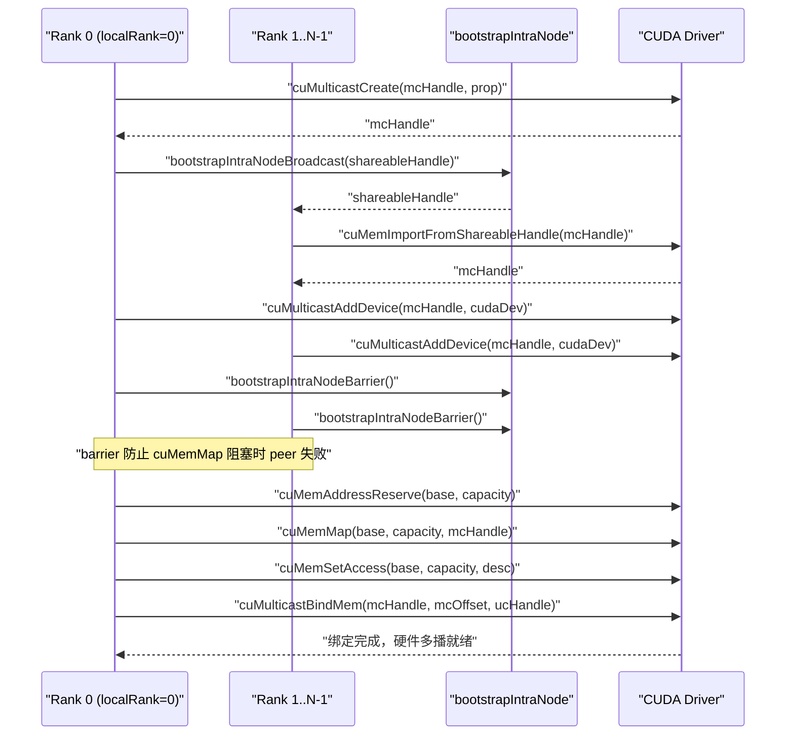
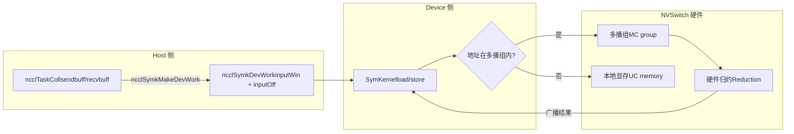

# Capítulo 14: Memória Simétrica e NVLS: Aceleração por Multicast e Endereçamento Direto no Lado do Dispositivo LSA

No capítulo anterior seguimos um AllReduce entre máquinas, vendo como os dados viajam da memória da GPU através da placa de rede até à GPU remota — esse caminho resolve a comunicação entre máquinas. Mas nos clusters de IA modernos, o volume de comunicação entre GPUs dentro da mesma máquina ou até do mesmo domínio NVLink é igualmente enorme — a sincronização de gradientes no treino com paralelismo de dados, a troca de valores de ativação no paralelismo tensorial, a grande maioria ocorre dentro da máquina. Se a comunicação intra-máquina ainda percorresse o fluxo entre máquinas GPU→memória→placa de rede→placa de rede remota→memória→GPU, seria como enviar uma encomenda local por via aérea, desperdiçando latência desnecessariamente. Este capítulo vai dissecar precisamente as duas ferramentas que o NCCL preparou para a comunicação intra-máquina: memória simétrica e NVLS. A primeira permite que cada rank aceda aos buffers de todos os ranks usando o mesmo conjunto de endereços virtuais; a segunda utiliza a capacidade de multicast do hardware NVSwitch para fazer redução. Combinadas, conseguem comprimir a latência de comunicação coletiva de mensagens pequenas até perto do limite do hardware.

# 14.1 Memória Simétrica: fazer com que "3ª fila, 5º lugar" aponte para o mesmo local na casa de todos

## Modelo intuitivo

Imagine uma turma que precisa trocar cadernos de trabalhos. A abordagem tradicional é: cada um numera os seus cadernos e depois grita "Zhang San, o meu 5º caderno é para ti; Li Si, o meu 8º caderno é para ti" — cada pessoa tem de memorizar "quem tem o caderno de quem, e qual o número". Isto é a comunicação normal: os endereços são**relativos e privados**, para aceder aos dados do par, é preciso primeiro conhecer o mapeamento de endereços do par.

A memória simétrica adota uma abordagem diferente: toda a turma acorda que a coordenada "3ª fila, 5º lugar" aponta para o mesmo local físico na casa de cada um. Assim, quando Zhang San quer o 5º caderno de Li Si, basta dizer "casa do Li Si, 3ª fila, 5º lugar", sem necessidade de qualquer tradução de endereços. Este é o núcleo da memória simétrica:**o buffer de cada rank é mapeado para o mesmo endereço virtual no espaço de endereçamento de todos os ranks**。

> **[Design Inference & Architectural Trade-offs]**
> Se não existisse memória simétrica, que desastre enfrentaria a comunicação coletiva intra-máquina? Cada rank, ao aceder ao buffer do par, teria de passar por uma "tradução de endereços" — consultar tabelas, calcular deslocamentos, e possivelmente comunicação entre processos para confirmar relações de mapeamento. Para mensagens pequenas (alguns KB), o custo desta tradução pode ser maior que a própria transmissão dos dados. A memória simétrica elimina completamente este custo, e é precisamente esta a razão fundamental pela qual "reduz significativamente a latência de mensagens pequenas".

## Estruturas de dados e layout de memória

O tipo de registo da memória simétrica é descrito por`ncclSymRegType_t`,`ncclGetSymRegType`com base em se as janelas send/recv têm a flag`NCCL_WIN_COLL_SYMMETRIC`, divide o estado de registo em quatro categorias.

[FACT:src/sym_kernels.cc:395-412]

```c
ncclResult_t ncclGetSymRegType(struct ncclDevrWindow* sendWin, struct ncclDevrWindow* recvWin,
                               ncclSymRegType_t* winRegType) {
  bool isSendSymmReg = false;
  bool isRecvSymmReg = false;
  if (sendWin && (sendWin->winFlags & NCCL_WIN_COLL_SYMMETRIC)) isSendSymmReg = true;
  if (recvWin && (recvWin->winFlags & NCCL_WIN_COLL_SYMMETRIC)) isRecvSymmReg = true;
  // determine the registration type
  if (!isSendSymmReg && !isRecvSymmReg) {
    *winRegType = ncclSymSendNonregRecvNonreg;
  } else if (isSendSymmReg && !isRecvSymmReg) {
    *winRegType = ncclSymSendRegRecvNonreg;
  } else if (!isSendSymmReg && isRecvSymmReg) {
    *winRegType = ncclSymSendNonregRecvReg;
  } else if (isSendSymmReg && is isRecvSymmReg) {
    *winRegType = ncclSymSendRegRecvReg;
  }
  return ncclSuccess;
}
```

Estes quatro estados determinam qual caminho o kernel subsequente seguirá: registo totalmente simétrico (`SendRegRecvReg`) segue o caminho LSA mais rápido, totalmente não registado (`SendNonregRecvNonreg`) segue o caminho normal, estados mistos requerem tratamento especial.`winFlags`em`NCCL_WIN_COLL_SYMMETRIC`o bit

é precisamente a marca de "se esta janela já fez registo simétrico".`ncclSymkInitOnce`A entrada de inicialização da memória simétrica é`hasLsaMultimem`）。

[FACT:src/sym_kernels.cc:185-196]

```c
ncclResult_t ncclSymkInitOnce(struct ncclComm* comm) {
  // ncclTeamLsa() below calls this internally but drops the error code so we do it here.
  NCCLCHECK(ncclDevrInitOnce(comm));

  struct ncclSymkState* symk = &comm->symkState;
  if (!symk->initialized) {
    symk->initialized = true;
    struct ncclDevCommRequirements reqs = NCCL_DEV_COMM_REQUIREMENTS_INITIALIZER;
    // Disable LSA multicast for cross-clique since NVLS isn't available across cliques
    symk->hasLsaMultimem =
      ncclNvlsSymmetricMultimemEnabled(comm) && ncclTeamLsa(comm).nRanks > 2 && !comm->p2pCrossClique;
    reqs.lsaMultimem = symk->hasLsaMultimem;
```

`hasLsaMultimem`Três condições indispensáveis: o multicast simétrico NVLS está habilitado, o número de ranks da equipe LSA é maior que 2 (dois ranks ponto a ponto direto são mais rápidos, não precisam de multicast), e não cruza clique (ao cruzar clique, o multicast NVSwitch fica indisponível). Essa avaliação determina diretamente se`reqs.lsaMultimem`é definido, afetando assim a alocação de recursos do comunicador no lado do dispositivo.

## Passo a passo orientado por cenário

Suponha que iniciamos um AllReduce, tamanho de mensagem 4KB, 8 ranks no mesmo domínio NVLink.`ncclSymkMask`determinará quais kernels estão disponíveis.

[FACT:src/sym_kernels.cc:304-352]

```c
uint32_t ncclSymkMask(struct ncclComm* comm, ncclFunc_t coll, int /*ncclDevRedOp_t*/ red, ncclDataType_t ty,
                      size_t nElts, bool symAligned16B) {
  uint32_t kmask = kernelMask_coll(coll);

  bool hasSTMC = comm->symkState.hasLsaMultimem;
  bool hasLDMC = false;
  if (comm->symkState.hasLsaMultimem) {
    switch (ty) {
    case ncclInt32:
    ...
      hasLDMC = red == ncclDevSum || red == ncclDevMinMax || red == ncclDevSumPostDiv;
      break;
    ...
    }
  }
  if (!hasSTMC) kmask &= ~kernelMask_STMC;
  if (!hasLDMC) kmask &= ~kernelMask_LDMC;
```

Primeiro passo:`kernelMask_coll`Com base no tipo de coletiva (AllReduce), obtém-se o conjunto de kernels candidatos`kernelMask_AR`. Segundo passo: verificar`hasLsaMultimem`, se o multicast for suportado, então verifica-se adicionalmente se o tipo de dados e a operação de redução suportam LDMC (Load-Multicast). Terceiro passo: usar máscara de bits para remover recursos não suportados —`kmask &= ~kernelMask_STMC`remove todos os kernels que não suportam STMC.

Em seguida, as restrições de tamanho:

[FACT:src/sym_kernels.cc:336-342]

```c
  size_t nBytes = alignUp(nElts * ncclTypeSize(ty), NCCL_SYM_KERNEL_CELL_SIZE);
  size_t nBusBytes = (coll == ncclFuncAllReduce ? 1 : comm->nRanks) * nBytes;
  // LL kernels use 32-bit ints to track element counts and indices.
  if (nBusBytes >= (size_t(2) = 32 * (size_t(2) nRanks;
  kmask &= needGin ? kernelMask_Gin : ~kernelMask_Gin;
  return kmask;
```

TMA requer capacidade de SMEM adequada (`ncclSymkTmaAvailable`verifica`maxSharedMemOptin`) e alinhamento de 16 bytes. GIN só é necessário quando "o número de ranks da equipe LSA é menor que o número total de ranks" — ou seja, GIN só faz sentido quando o domínio de comunicação cruza a fronteira LSA (precisa passar pela rede). Se todo o domínio de comunicação estiver dentro da LSA, os kernels GIN são removidos.

## Controle de concorrência e interação com hardware

A resolução de endereços de memória simétrica finalmente chega ao lado do dispositivo.`ncclSymkMakeDevWork`traduz a descrição de tarefa do lado host em itens de trabalho legíveis pelo lado do dispositivo.

[FACT:src/sym_kernels.cc:380-393]

```c
ncclResult_t ncclSymkMakeDevWork(struct ncclComm* comm, struct ncclTaskColl* task, struct ncclSymkDevWork* outDevWork) {
  outDevWork->rootRank = task->root;
  outDevWork->redOpArg = task->opDev.scalarArg;
  outDevWork->nElts = task->count;
  outDevWork->inputWin = task->sendWin ? task->sendWin->vidmem : nullptr;
  outDevWork->inputOff =
    task->sendWin ? (uint8_t*)task->sendbuff - (uint8_t*)task->sendWin->userPtr : (size_t)task->sendbuff;
  outDevWork->outputWin = task->recvWin ? task->recvWin->vidmem : nullptr;
  outDevWork->outputOff =
    task->recvWin ? (uint8_t*)task->recvbuff - (uint8_t*)task->recvWin->userPtr : (size_t)task->recvbuff;
  outDevWork->sChannelId = 0xffff;
  outDevWork->nChannels = 0;
  return ncclSuccess;
}
```

Observe o cálculo de`inputOff`: se sendWin existe (janela de registro simétrico), o deslocamento é`sendbuff - sendWin->userPtr`— este é o**deslocamento dentro da janela**, o lado do dispositivo obtém`inputWin`(endereço base da janela) mais`inputOff`para calcular o endereço real. Se sendWin não existe, o deslocamento é diretamente o endereço absoluto de`sendbuff`. Esse design permite que o kernel do lado do dispositivo use a mesma lógica para lidar com buffers registrados e não registrados.

`ncclSymkInitOnce`também inicializa os requisitos de recursos relacionados ao GIN, incluindo inbox, outbox, buffer de acumulação e rail signal.

[FACT:src/sym_kernels.cc:208-251]

```c
    struct ncclDevResourceRequirements ginInboxRailReq = {};
    struct ncclDevResourceRequirements ginOutboxReq = {};
    struct ncclDevResourceRequirements rsGinAccumReq = {};
    struct ncclDevResourceRequirements railSignalReq = {};
    if (ncclParamSymGinKernelsEnable() && ncclTeamLsa(comm).nRanks nRanks) {
      int maxBlocks;
      size_t bufSize;
      getRequirements_gin(comm, &maxBlocks, &bufSize);

      maxBlocks = std::max(maxBlocks, comm->config.minCTAs);
      maxBlocks = std::min(maxBlocks, comm->config.maxCTAs);
      if (ncclParamSymCTAs() >= 1) maxBlocks = ncclParamSymCTAs();
      maxBlocks = std::min(maxBlocks, ncclSymkMaxBlocks);
      symk->maxGinInboxBlocks = maxBlocks;
      symk->kcomm.rsGinAccumBytesPerBlock = ncclSymkRsGinAccumBytesPerBlock();

      rsGinAccumReq.bufferSize = (size_t)maxBlocks * symk->kcomm.rsGinAccumBytesPerBlock;
      rsGinAccumReq.bufferAlign = 128;
      rsGinAccumReq.outBufferHandle = &symk->kcomm.rsGinAccumBuf;
      ...
      uint32_t railSignalCount = ncclTeamRail(comm).nRanks * ncclSymkMaxBlocks;
      ...
      reqs.barrierCount = ncclSymkMaxBlocks;
      reqs.ginConnectionType = NCCL_GIN_CONNECTION_RAIL;
      reqs.ginStrongSignalsRequired = true;
      reqs.ginVaSignalsRequired = true;
    }
```

`getRequirements_gin`usa o modelo de ajuste para calcular o número necessário de blocos e o tamanho do buffer, então é limitado ao intervalo de`[minCTAs, maxCTAs]`.`rsGinAccumBytesPerBlock`é o tamanho do buffer de acumulação por bloco, alinhado a 128 bytes — este é o tamanho da linha de cache, para evitar pseudo-compartilhamento.

```mermaid
flowchart TD
    start["ncclSymkMask(comm, coll, red, ty, nElts)"] --> coll{"集合类型?"}
    coll -->|AllGather| mask_ag["kmask = kernelMask_AG"]
    coll -->|AllReduce| mask_ar["kmask = kernelMask_AR"]
    coll -->|ReduceScatter| mask_rs["kmask = kernelMask_RS"]
    mask_ag --> check_stmc{"hasLsaMultimem?"}
    mask_ar --> check_stmc
    mask_rs --> check_stmc
    check_stmc -->|否| clear_stmc["kmask &= ~kernelMask_STMC"]
    check_stmc -->|是| check_ldmc{"数据类型+归约支持LDMC?"}
    clear_stmc --> size_check
    check_ldmc -->|否| clear_ldmc["kmask &= ~kernelMask_LDMC"]
    check_ldmc -->|是| size_check
    clear_ldmc --> size_check
    size_check{"nBusBytes >= 2GB?"} -->|是| clear_ll["kmask &= ~kernelMask_LL"]
    size_check -->|否| tma_check
    clear_ll --> tma_check{"TMA可用且16B对齐?"}
    tma_check -->|否| clear_tma["kmask &= ~kernelMask_Tma"]
    tma_check -->|是| gin_check
    clear_tma --> gin_check{"需要GIN? LSA rank |否| clear_gin["kmask &= ~kernelMask_Gin"]
    gin_check -->|是| done
    clear_gin --> done["返回 kmask"]
```

Esta figura descreve completamente a cadeia de decisão de`ncclSymkMask`: partindo do tipo de coletiva, passando sequencialmente por cinco filtros — suporte a multicast, tipo de dados, limites de tamanho, disponibilidade de TMA, necessidade de GIN — e finalmente retornando uma máscara de bits. Cada filtro pode remover um lote de kernels, o que reflete exatamente o "selecionar o melhor kernel por cenário" do NCCL.

## Guia de prevenção de armadilhas em produção

**Armadilha 1: multicast falha silenciosamente ao cruzar clique.** `hasLsaMultimem`A terceira condição de`!comm->p2pCrossClique`é`ncclNvlsSymmetricMultimemEnabled`. Se seu cluster está configurado com MNNVL (Multi-Node NVLink), mas alguns ranks cruzam clique, o multicast será desabilitado e o desempenho degradará silenciosamente para o caminho normal. Ao investigar, verifique a saída de log de

**Armadilha 2: requisito implícito de alinhamento de 16 bytes.** `ncclSymkMask`Em`if (!symAligned16B) kmask &= ~kernelMask_Tma;`— se o buffer do usuário não estiver alinhado a 16 bytes, o kernel TMA é removido. TMA é o mecanismo de cópia mais rápido em Hopper/Blackwell, perdê-lo significa queda de desempenho. Em ambiente de produção, o buffer passado pelo usuário geralmente vem de`cudaMalloc`, naturalmente alinhado; mas se vier de um allocator personalizado ou de um slice, pode cair na armadilha.

**Armadilha 3: limite de 2GB.**O kernel LL usa índices de 32 bits, e quando o número de bytes no barramento excede 2GB, é removido. Para treinamento de grandes modelos, o gradiente de um único AllReduce pode exceder esse valor, e nesse caso o NCCL muda automaticamente para o protocolo STMC ou Simple. Isso não é um bug, mas se você especificou manualmente o protocolo LL, obterá`ncclInvalidArgument`。

---

# 14.2 NVLS: deixe o hardware NVSwitch fazer a redução para você

## Modelo intuitivo

O AllReduce tradicional é "redução por software": cada GPU envia dados para o vizinho, o vizinho faz a adição e repassa — os dados vão e voltam entre as GPUs, e a adição é executada na SM. É como 8 pessoas passando bilhetes para calcular a soma, cada uma precisa ler, somar e repassar.

NVLS adota uma abordagem diferente: o chip NVSwitch tem embutida**capacidade de multicast e redução**Você escreve os dados no endereço multicast, e o NVSwitch automaticamente os transmite a todos os membros e realiza a adição no hardware. É como se 8 pessoas escrevessem números no mesmo quadro branco, e o quadro branco exibisse automaticamente a soma — a GPU escreve uma vez e lê uma vez, e toda a movimentação e adição intermediárias são feitas pelo hardware do switch.

Sem o NVLS, a largura de banda do AllReduce intra-nó seria limitada pelos enlaces ponto a ponto entre as GPUs, e os SMs gastariam uma grande quantidade de ciclos fazendo adições. O NVLS descarrega ambas as tarefas para o hardware, permitindo que os SMs façam outros cálculos.

## Estrutura de dados e layout de memória

O núcleo do NVLS é**grupo multicast (MC group)**。`ncclMcGroup`A estrutura descreve todo o estado de um grupo multicast.

[FACT:src/transport/multicast.cc:72-77]

```c
struct ncclMcGroup {
  CUmemGenericAllocationHandle handle;  // the MC object
  char* base;                          // mapped MC VA base
  size_t capacity;                      // total mapped VA size
  int dev;                           // local device, for unbind
};
```

Quatro campos:`handle`é o handle do objeto multicast do CUDA,`base`é o endereço base virtual multicast,`capacity`é o tamanho total do mapeamento,`dev`é o número do dispositivo local (usado para desvincular). Observe que não há lock aqui — a criação e destruição do grupo multicast ocorrem nas fases de inicialização/destruição, não no caminho crítico.

O grupo multicast é dividido em múltiplos**partições (partition)**, cada partição é uma fatia imutável.`ncclMcPartition`Descreve uma partição.

[FACT:src/transport/multicast.cc:162-170]

```c
  // A partition is self-sufficient for binds: it carries the group's handle, device and
  // bind granularity alongside its own extent.
  for (int i = 0; i base + outPartitions[i].offset;
    outPartitions[i].mcHandle = mcHandle;
    outPartitions[i].minGranularity = minGran;
    outPartitions[i].dev = comm->cudaDev;
  }
```

Cada partição carrega seu próprio`offset`、`size`、`ptr`, bem como o`mcHandle`、`minGranularity`、`dev`do grupo ao qual pertence. Esse design "autossuficiente" permite que as partições sejam passadas independentemente para as funções de vinculação, sem precisar consultar as informações do grupo.

## Passo a passo orientado por cenário

Suponha que 8 ranks queiram estabelecer um domínio NVLS.`ncclMcGroupBuildPartitions`É responsável por criar o grupo multicast e dividir as partições.

[FACT:src/transport/multicast.cc:79-121]

```c
ncclResult_t ncclMcGroupBuildPartitions(struct ncclComm* comm, const struct ncclMcRequest* requests, int nRequests,
                                        struct ncclMcGroup** outGroup, struct ncclMcPartition* outPartitions) {
  ...
  mcprop.numDevices = comm->localRanks;
  mcprop.handleTypes = ncclCuMemHandleType;
  mcprop.flags = 0;
  mcprop.size = 0;
  for (int i = 0; i  recGran ? requests[i].alignment : recGran;
    ALIGN_SIZE(capacity, align);
    size_t slice = requests[i].size;
    ALIGN_SIZE(slice, recGran);
    outPartitions[i].offset = capacity;
    outPartitions[i].size = slice;
    capacity += slice;
  }
```

Primeiro passo: acumular os tamanhos de todas as requisições para obter o tamanho total do grupo multicast. Segundo passo: consultar a granularidade recomendada e a granularidade mínima do CUDA — esta é uma restrição de hardware, o endereço e o tamanho do objeto multicast devem ser múltiplos inteiros da granularidade. Terceiro passo: alocação bump — cada requisição recebe um bloco, com offset e tamanho alinhados à granularidade recomendada.`ALIGN_SIZE(capacity, align)`Garante que o offset inicial de cada fatia seja um offset de vinculação válido.

Em seguida vem a criação e importação entre ranks:

[FACT:src/transport/multicast.cc:125-146]

```c
  if (comm->localRank == 0) {
    NCCLCHECKGOTO(ncclMcCreate(comm, &mcprop, comm->localRank, comm->localRanks, &mcHandle, shareableHandle), ret,
                  fail);
    mcCreated = 1;
    NCCLCHECKGOTO(bootstrapIntraNodeBroadcast(comm->bootstrap, comm->localRankToRank, comm->localRank, comm->localRanks,
                                              0, shareableHandle, NVLS_HANDLE_SIZE),
                  ret, fail);
  } else {
    NCCLCHECKGOTO(bootstrapIntraNodeBroadcast(comm->bootstrap, comm->localRankToRank, comm->localRank, comm->localRanks,
                                              0, shareableHandle, NVLS_HANDLE_SIZE),
                  ret, fail);
    NCCLCHECKGOTO(ncclMcImport(comm, shareableHandle, comm->localRankToRank[0], &mcHandle), ret, fail);
    mcCreated = 1;
  }
  CUCHECKGOTO(cuMulticastAddDevice(mcHandle, comm->cudaDev), ret, fail);

  // cuMemMap of an MC object blocks until every device has been added. This
  // abort-aware barrier makes a peer failing before cuMulticastAddDevice trip the
  // abort flag here instead of stranding survivors in the blocking cuMemMap.
  NCCLCHECKGOTO(bootstrapIntraNodeBarrier(comm->bootstrap, comm->localRankToRank, comm->localRank, comm->localRanks,
                                          comm->localRankToRank[0]),
                ret, fail);
```

O localRank 0 cria o objeto multicast e, em seguida, transmite o shareable handle via bootstrap; os outros ranks recebem o handle e o importam.`cuMulticastAddDevice`Adiciona o dispositivo local ao grupo multicast. Observe aquela barrier — o comentário deixa bem claro:`cuMemMap`Bloqueia até que todos os dispositivos tenham se juntado; se algum peer falhar antes de`cuMulticastAddDevice`, os sobreviventes ficarão travados em`cuMemMap`. Essa barrier faz com que a falha seja capturada pelo flag de abort antes do bloqueio.

Por fim, o mapeamento e a configuração das permissões de acesso:

[FACT:src/transport/multicast.cc:148-155]

```c
  // Reserve and map the whole MC VA once; each consumer slice is a view into it.
  CUCHECKGOTO(cuMemAddressReserve(&base, capacity, recGran, 0U, 0), ret, fail);
  CUCHECKGOTO(cuMemMap(base, capacity, 0, mcHandle, 0), ret, fail);
  mapped = 1;
  desc.flags = CU_MEM_ACCESS_FLAGS_PROT_READWRITE;
  desc.location.type = CU_MEM_LOCATION_TYPE_DEVICE;
  desc.location.id = comm->cudaDev;
  CUCHECKGOTO(cuMemSetAccess(base, capacity, &desc, 1), ret, fail);
```

Todo o VA multicast é reservado e mapeado apenas uma vez, e cada fatia de consumidor é uma visão desse VA. Esse é o design de "mapear uma vez, fatiar várias vezes" — economiza recursos em comparação a criar um objeto multicast separado para cada consumidor.

## Controle de concorrência e interação com o hardware

A vinculação é a operação mais crítica do NVLS.`ncclMcPartitionBindMem`Vincula um handle de memória UC (unicast) a um determinado offset do grupo multicast.

[FACT:src/transport/multicast.cc:200-225]

```c
ncclResult_t ncclMcPartitionBindMem(const struct ncclMcPartition* partition, size_t offsetInPartition,
                                    CUmemGenericAllocationHandle mem, size_t memOffset, size_t bindSize) {
  // A bind overrunning its partition would corrupt the next consumer's partition; fail
  // cleanly instead (possible when UC rounding exceeds the MC-rounded partition).
  if (offsetInPartition + bindSize > partition->size) {
    WARN("NVLS MC bind of size %zu at slice offset %zu exceeds slice size %zu (UC/MC granularity mismatch)", bindSize,
         offsetInPartition, partition->size);
    return ncclInternalError;
  }
  size_t mcOffset = partition->offset + offsetInPartition;
  ...
  CUresult err = CUPFN(cuMulticastBindMem(partition->mcHandle, mcOffset, mem, memOffset, bindSize, 0 /*flags*/));
  if (err != CUDA_SUCCESS) {
    ...
    WARN("Failed to bind NVLink SHARP (NVLS) Multicast memory of size %zu at MC group %llx offset %zu : CUDA error %d "
         "'%s'.\nThis is usually caused by a system or configuration error in the Fabric Manager or NVSwitches.\n"
         "Disable NVLS (NCCL_NVLS_ENABLE=0) if you wish to avoid this error in the future.",
         bindSize, partition->mcHandle, mcOffset, err, errStr);
    return ncclUnhandledCudaError;
  }
  return ncclSuccess;
}
```

A primeira linha de defesa é a verificação de limites:`offsetInPartition + bindSize > partition->size`e reporta erro. O comentário explica o motivo — a granularidade da memória UC pode ser maior que a da partição MC; se o alinhamento da UC ultrapassar o limite da partição MC, invadirá a partição do próximo consumidor. Essa é a típica armadilha de "incompatibilidade entre duas granularidades".

`cuMulticastBindMem`É uma chamada de hardware; o comentário diz que ela "blocks until all ranks have been added to the group" — este é o ponto mais propenso a problemas no NVLS. Se o Fabric Manager estiver mal configurado ou o firmware do NVSwitch tiver problemas, aqui ocorrerá travamento ou retorno de erro. A mensagem de erro sugere diretamente ao usuário`NCCL_NVLS_ENABLE=0`, que é a saída de emergência padrão em ambientes de produção.

Há também uma variante de "tentativa de vinculação", usada para registro de buffers do usuário:

[FACT:src/transport/multicast.cc:237-268]

```c
ncclResult_t ncclMcPartitionTryBindAddr(const struct ncclMcPartition* partition, size_t offsetInPartition,
                                        CUdeviceptr address, size_t bindSize, enum ncclMcBindStatus* outStatus) {
  const char* errStr = NULL;

  *outStatus = ncclMcBindStatusTransient;
  if (offsetInPartition + bindSize > partition->size) {
    ...
    return ncclInternalError;
  }
  size_t mcOffset = partition->offset + offsetInPartition;
  CUresult err = CUPFN(cuMulticastBindAddr(partition->mcHandle, mcOffset, address, bindSize, 0 /*flags*/));
  if (err == CUDA_SUCCESS) {
    *outStatus = ncclMcBindStatusOk;
    return ncclSuccess;
  }

  (void)pfn_cuGetErrorString(err, &errStr);
  // Only an outright rejection of the input is a property of the buffer. Anything else,
  // notably OUT_OF_MEMORY, may succeed later, so it must not be reported as permanent.
  if (err == CUDA_ERROR_INVALID_VALUE || err == CUDA_ERROR_NOT_SUPPORTED || err == CUDA_ERROR_NOT_PERMITTED) {
    *outStatus = ncclMcBindStatusNoSupport;
    ...
  } else {
    WARN("NVLS Multicast bind of size %zu at MC group %llx offset %zu dev %d failed transiently: CUDA error %d '%s'.\n"
         "The buffer is left unregistered for this operation and will be retried; repeated occurrences indicate "
         "sustained resource pressure.",
         bindSize, partition->mcHandle, mcOffset, partition->dev, err, errStr);
  }
  return ncclSuccess;
}
```

Aqui há uma classificação de erros engenhosa:`CUDA_ERROR_INVALID_VALUE`、`NOT_SUPPORTED`、`NOT_PERMITTED`é classificado como`ncclMcBindStatusNoSupport`— esta é uma**falha permanente**, indicando que o próprio buffer não suporta vinculação multicast. Já outros erros (especialmente`OUT_OF_MEMORY`) são classificados como`ncclMcBindStatusTransient`— esta é uma**falha temporária**, que pode ser repetida. Essa distinção é crucial: se OOM for tratado como falha permanente, um registro que poderia ter sucesso será erroneamente abandonado; se erro de parâmetro for tratado como falha temporária, haverá repetição infinita.

## Guia de prevenção de armadilhas em produção

**Armadilha 1: configuração incorreta do Fabric Manager causa`cuMulticastBindMem`travamento.**Esta é a falha de produção mais clássica do NVLS. A mensagem de erro aponta claramente para o Fabric Manager ou o NVSwitch. Passos de diagnóstico: primeiro`NCCL_NVLS_ENABLE=0`confirme que o problema desapareceu, depois verifique os logs do Fabric Manager e a versão de firmware do NVSwitch.

**Armadilha 2: incompatibilidade de granularidade UC/MC.** `ncclMcPartitionBindMem`A verificação de limites de

**captura esse problema, mas se você vir o aviso "UC/MC granularity mismatch", significa que o tamanho UC de alguma requisição, após alinhamento, ultrapassou a partição MC. Isso geralmente ocorre quando o tamanho da requisição está próximo do limite de granularidade.** `ncclMcGroupBuildPartitions`Armadilha 3: vazamento de recursos após falha na criação do grupo multicast.`CUCALL`O caminho de falha de`CUCHECK`：

[FACT:src/transport/multicast.cc:179-184]

```c
fail:
  // Best-effort (CUCALL) so a failing cleanup op cannot skip releasing the MC handle.
  if (mapped) CUCALL(cuMemUnmap(base, capacity));
  if (base) CUCALL(cuMemAddressFree(base, capacity));
  if (mcCreated) CUCALL(cuMemRelease(mcHandle));
  return ret;
```

O comentário explica o motivo: se a própria operação de cleanup falhar, não se pode, por isso, pular a liberação do MC handle — o slot MC é um recurso escasso, e vazamentos causarão falhas em criações subsequentes. Este é um design típico de "o caminho de limpeza deve fazer o possível".



Este diagrama de sequência descreve o fluxo completo do grupo multicast desde a criação até o binding. O ponto-chave é aquela barrier — ela desacopla "falha do peer" de "bloqueio do cuMemMap", evitando que os sobreviventes fiquem travados.

---

# 14.3 A fusão de memória simétrica e NVLS: como os ponteiros LSA são resolvidos no lado do dispositivo

## Modelo intuitivo

A memória simétrica resolve o problema de "consistência de endereços", e o NVLS resolve o problema de "redução em hardware". Mas para que os dois realmente cooperem, ainda é necessário um mecanismo-chave:**Como o lado do dispositivo sabe que um determinado endereço é simétrico e pode seguir o caminho multicast?**

A resposta está no ponteiro LSA (Load-Store Accessible). LSA é a abreviação de "acessível por load-store", significando que a memória apontada por este ponteiro pode ser acessada diretamente pela GPU com instruções comuns de load/store — independentemente de estar fisicamente local ou remota. Se o endereço cair dentro do grupo multicast, o load/store será interceptado pelo hardware NVSwitch e transmitido em broadcast.

## Estruturas de dados e layout de memória

`ncclSymkDevWork`é o descritor de trabalho do lado do dispositivo, que carrega as informações-chave da memória simétrica.

[FACT:src/sym_kernels.cc:380-393]

```c
ncclResult_t ncclSymkMakeDevWork(struct ncclComm* comm, struct ncclTaskColl* task, struct ncclSymkDevWork* outDevWork) {
  outDevWork->rootRank = task->root;
  outDevWork->redOpArg = task->opDev.scalarArg;
  outDevWork->nElts = task->count;
  outDevWork->inputWin = task->sendWin ? task->sendWin->vidmem : nullptr;
  outDevWork->inputOff =
    task->sendWin ? (uint8_t*)task->sendbuff - (uint8_t*)task->sendWin->userPtr : (size_t)task->sendbuff;
  outDevWork->outputWin = task->recvWin ? task->recvWin->vidmem : nullptr;
  outDevWork->outputOff =
    task->recvWin ? (uint8_t*)task->recvbuff - (uint8_t*)task->recvWin->userPtr : (size_t)task->recvbuff;
  outDevWork->sChannelId = 0xffff;
  outDevWork->nChannels = 0;
  return ncclSuccess;
}
```

`inputWin`é o endereço virtual do lado do dispositivo da janela (`vidmem`），`inputOff`é o offset do buffer dentro da janela. Depois que o kernel do lado do dispositivo obtém esses dois valores, calcula`inputWin + inputOff`e obtém o endereço real. Se este endereço cair dentro do grupo multicast, o hardware tratará o broadcast automaticamente.

`ncclSymkInitOnce`também configura a barrier LSA e os recursos LLA2A (Low-Latency All-to-All).

[FACT:src/sym_kernels.cc:197-206]

```c
    reqs.lsaBarrierCount = ncclSymkMaxBlocks;
    reqs.ginStrongSignalsRequired = false;
    reqs.ginVaSignalsRequired = false;

    struct ncclDevResourceRequirements lla2aReq;
    ncclLLA2ACreateRequirement(ncclSymkMaxBlocks,
                               ncclLLA2ACalcSlots(ncclTeamLsa(comm).nRanks * ncclSymkMaxThreads, ncclSymkLLMaxEltSize),
                               &symk->kcomm.lsaLLA2A, &lla2aReq);
    lla2aReq.next = reqs.resourceRequirementsList;
    reqs.resourceRequirementsList = &lla2aReq;
```

`lsaBarrierCount`definido como`ncclSymkMaxBlocks`——um slot de barrier por block. LLA2A é a abreviação de all-to-all de baixa latência, usado para troca rápida de dados dentro do domínio LSA.`ncclLLA2ACalcSlots`calcula o número de slots necessários com base no número de ranks, número de threads e tamanho máximo de elemento.

## Walkthrough passo a passo orientado por cenário

Suponha que um AllReduce use`AllReduce_AGxLLMC_R`kernel (AllGather + LL + MC + Reduce). O fluxo de trabalho deste kernel é:

1. **Fase AllGather**: cada rank escreve seus próprios dados no grupo multicast, e o hardware NVSwitch faz broadcast para todos os ranks.

2. **Fase Reduce**: cada rank lê os dados de todos os ranks do grupo multicast e faz a redução localmente.

`ncclSymkMask`verifica se este kernel está disponível.`kernelMask_LL`contém`AllReduce_AGxLLMC_R`, mas somente se`hasLsaMultimem`for verdadeiro (caso contrário`kernelMask_STMC`é removido, e`AllReduce_AGxLLMC_R`pertence ao conjunto STMC).

Espera, há um detalhe aqui:`kernelMask_STMC`contém`AllReduce_AGxLLMC_R`? Veja o código-fonte:

[FACT:src/sym_kernels.cc:17-21]

```c
constexpr uint32_t kernelMask_STMC =
  1 nvlsChannels;
    size_t creditSize = nChannels * 2 * memSize * nHeads;
    int nvlsStepSize = comm->nvlsChunkSize;

    NCCLCHECKGOTO(ncclCalloc(&comm->nvlsResources, 1), res, fail);
    comm->nvlsResources->inited = false;
    comm->nvlsResources->refCount = 1;
    comm->nvlsResources->nChannels = nChannels;
    comm->nvlsResources->nHeads = nHeads;
    comm->nvlsResources->chunkSize = comm->nvlsChunkSize;
    comm->nvlsResources->treeMaxChunkSize = comm->nvlsTreeMaxChunkSize;
    resources = comm->nvlsResources;

    for (int c = 0; c accessDesc, 0, sizeof(resources->accessDesc));
    resources->accessDesc.flags = CU_MEM_ACCESS_FLAGS_PROT_READWRITE;
    resources->accessDesc.location.type = CU_MEM_LOCATION_TYPE_DEVICE;
    resources->accessDesc.location.id = comm->cudaDev;
    resources->dev = comm->cudaDev;

    // Build the single shared MC group for this NVLS domain. The data slice is
    // reserved here but bound later by ncclNvlsBufferSetup.
    {
      size_t buffSize = nvlsStepSize * NCCL_STEPS;
      size_t dataSize = nChannels * 2 * buffSize * nHeads;
      size_t ubSize = ncclNvlsUbSize(comm);
      struct ncclMcRequest requests[3] = {{creditSize, 0}, {dataSize, 0}, {ubSize, 0}};
      struct ncclMcPartition partitions[3];
      NCCLCHECKGOTO(ncclMcGroupBuildPartitions(comm, requests, 3, &resources->mcGroup, partitions), res, fail);
      resources->creditPartition = partitions[0];
      resources->dataPartition = partitions[1];
      if (ubSize) {
        resources->ubPartition = partitions[2];
        NCCLCHECKGOTO(ncclMcArenaInit(comm, &resources->ubArena, &resources->ubPartition), res, fail);
        resources->ubEnabled = true;
      }
      NCCLCHECKGOTO(nvlsAllocBindUc(comm, &resources->creditPartition, creditSize, &resources->creditUc), res, fail);
    }
```

O grupo multicast é dividido em três partições:`creditPartition`(credit),`dataPartition`(data),`ubPartition`(user buffer). A partição de credit é usada para sincronização — cada channel tem ponteiros head/tail independentes, compartilhados através do grupo multicast.

A inicialização do credit está no loop posterior:

[FACT:src/transport/nvls.cc:456-491]

```c
    for (int h = 0; h nRanks + 1 + h;
      for (int c = 0; c channels + c;
        char* mem = NULL;
        struct ncclChannelPeer* peer = channel->peers[nvlsPeer];

        // Reduce UC -> MC
        mem = (char*)resources->creditUc.ptr + (h * 2 * nChannels + c) * memSize;
        peer->send[1].transportComm = &nvlsTransport.send;
        peer->send[1].conn.buffs[NCCL_PROTO_SIMPLE] = NULL;
        peer->send[1].conn.head = (uint64_t*)mem;
        peer->send[1].conn.tail = (uint64_t*)(mem + memSize / 2);
        peer->send[1].conn.stepSize = nvlsStepSize;
        mem = (char*)resources->creditPartition.ptr + (h * 2 * nChannels + c) * memSize;
        peer->recv[0].transportComm = &nvlsTransport.recv;
        peer->recv[0].conn.buffs[NCCL_PROTO_SIMPLE] = NULL;
        peer->recv[0].conn.head = (uint64_t*)mem;
        peer->recv[0].conn.tail = (uint64_t*)(mem + memSize / 2);
        peer->recv[0].conn.stepSize = nvlsStepSize;
        peer->recv[0].conn.flags |= NCCL_NVLS_MIN_POLL;
```

Cada combinação de head e channel tem uma região de credit independente.`head`e`tail`são ponteiros de 64 bits,`memSize`é 64 bytes (`size_t memSize = 64;`), então head e tail ocupam 32 bytes cada — exatamente meia cache line.`NCCL_NVLS_MIN_POLL`O flag faz o receptor usar modo de polling mínimo, reduzindo a sobrecarga de CPU.

## Guia de prevenção de armadilhas em produção

**Armadilha 1: competição de head/tail na partição de credit.**Vários channels compartilham o mesmo grupo multicast, mas cada channel tem uma região de credit independente. Se o número de channels for configurado incorretamente (por exemplo,`nvlsCTAs`definido muito grande), a região de credit inflará, ocupando espaço valioso de endereço multicast.`ncclNvlsChannels`ajusta automaticamente o número de channels com base na arquitetura da GPU e no número de nós:

[FACT:src/transport/nvls.cc:100-133]

```c
  if (comm->config.nvlsCTAs != NCCL_CONFIG_UNDEF_INT) {
    channels = comm->config.nvlsCTAs;
  } else if (channels == 0 && comm->compCap >= 100) {
    // Use a reduced number of channels for single node/MNNVL domain on Blackwell and above.
    // comm->nNodes is not yet initialized at this point so we need to use local information.
    bool multiNode = false;
    if (comm->MNNVL) {
      multiNode = (comm->clique.size nRanks);
    } else {
      int i;
      for (i = 1; i nRanks; i++) {
        if (comm->peerInfo[i].hostHash != comm->peerInfo[0].hostHash) break;
      }
      multiNode = (i nRanks);
    }
    if (multiNode) {
      channels = RUBIN_AND_LATER(comm->compCap) ? /*RUBIN=*/64 : /*SM100=*/32;
    } else {
      channels = RUBIN_AND_LATER(comm->compCap) ? /*RUBIN=*/48 : /*SM100=*/24;
    }
  } else if (channels == 0) {
    channels = /*SM90=*/16;
  }
```

Note que`comm->nNodes`ainda não foi inicializado nesta fase, então o código usa`peerInfo[i].hostHash`para determinar manualmente se é multi-nó. Esta é uma armadilha clássica de ordem de inicialização — você não pode depender de um campo que ainda não foi calculado.

**Armadilha 2: MNNVL não suporta registro de buffer NVLS.** [FACT:src/transport/nvls.cc:516-517]

```c
  // MNNVL does not support NVLS buffer registration
  if (!comm->MNNVL && comm->nvlsResources->nvlsShmemHandle == NULL) {
```

Em ambiente MNNVL (Multi-Node NVLink), o registro do buffer do usuário é ignorado. Se o seu cluster for MNNVL e depender do registro UB para melhorar o desempenho, você descobrirá que o registro não teve efeito. Esta é uma limitação de hardware, não um bug.

**Armadilha 3: contagem de referências de recursos compartilhados.** `ncclNvlsSetup`Suporta compartilhamento de recursos NVLS entre domínios de comunicação pai e filho:

[FACT:src/transport/nvls.cc:380-392]

```c
  if (nvlsShare) {
    /* reuse NVLS resources */
    comm->nvlsChannels = std::min(comm->nvlsChannels, parent->nvlsResources->nChannels);
    /* Inherit chunk sizes from the shared resource since we're reusing the parent's
     * NVLS buffers, which were allocated and laid out based on these values. */
    comm->nvlsChunkSize = parent->nvlsResources->chunkSize;
    comm->nvlsTreeMaxChunkSize = parent->nvlsResources->treeMaxChunkSize;
    for (int c = 0; c nvlsChannels; c++) {
      NCCLCHECKGOTO(initNvlsChannel(comm, c, parent, true), res, fail);
    }

    comm->nvlsResources = parent->nvlsResources;
    ncclAtomicRefCountIncrement(&parent->nvlsResources->refCount);
  }
```

O domínio de comunicação filho reutiliza os recursos do domínio de comunicação pai, incrementando a contagem de referências em um.`ncclNvlsFree`A liberação real só ocorre quando a contagem de referências dentro de  chega a zero. Se o gerenciamento da contagem de referências falhar, pode causar liberação antecipada ou vazamento de recursos. Atenção`nvlsChunkSize`e`nvlsTreeMaxChunkSize`devem herdar os valores do domínio de comunicação pai — porque os buffers são dispostos de acordo com esses valores, alterá-los causaria erros no cálculo de endereços.



Este diagrama de fluxo de dados mostra a cadeia completa desde tarefas no lado host até a execução no lado dispositivo. O ramo crítico é`lsa{"地址在多播组内?"}`— se sim, usa multicast e redução por hardware NVSwitch; se não, usa memória local da GPU. Essa decisão é feita automaticamente pelo hardware com base no intervalo de endereços, sem necessidade de intervenção de software.

---

# 14.4 Reflexão de design: por que a memória simétrica reduz a latência de mensagens pequenas

Voltando à questão central do início deste capítulo: por que a memória simétrica reduz significativamente a latência de mensagens pequenas?

**Primeiro, elimina a sobrecarga de tradução de endereços.**Na comunicação tradicional, cada rank precisa consultar tabelas e calcular deslocamentos para acessar buffers do par. A memória simétrica permite que todos os ranks usem o mesmo conjunto de endereços, e o kernel no lado do dispositivo calcula diretamente`base + offset`. Para mensagens pequenas, a sobrecarga dessa tradução é proporcionalmente alta.

**Segundo, elimina a ida e volta de mensagens de controle.**A comunicação tradicional requer troca de informações de controle como "em qual buffer seu eu vou escrever". Com memória simétrica, os endereços são previamente acordados, sem necessidade de negociação em tempo de execução.

**Terceiro, torna possível o multicast por hardware.**Somente quando os endereços são simétricos o NVSwitch pode usar o mesmo conjunto de endereços para multicast. Se cada rank tiver endereços diferentes, o hardware não consegue saber para onde transmitir.

**Quarto, reduz a carga de redução nos SMs.**O NVLS descarrega a adição para o NVSwitch, e o SM só precisa iniciar uma escrita e uma leitura. Para mensagens pequenas, a sobrecarga de instruções do SM é a principal fonte de latência.

Esses quatro fatores combinados reduzem a latência de mensagens pequenas de "nível de microssegundos" para "nível sub-microssegundo".

> **[Design Inference & Architectural Trade-offs]**
> Do ponto de vista de engenharia, o design da memória simétrica reflete uma filosofia central do NCCL:**empurrar a complexidade para a fase de inicialização, mantendo o caminho crítico o mais simples possível**. A negociação de endereços, criação de grupos de multicast e alocação de créditos são concluídas na inicialização, e o kernel em tempo de execução só precisa fazer o cálculo de endereço mais simples e load/store. Esse design de "inicialização pesada, execução leve" é um padrão comum em bibliotecas de comunicação de alto desempenho.

---

# Resumo do capítulo

Este capítulo desmontou os dois pilares da comunicação intra-nó do NCCL:

1. **Memória simétrica**: através de`ncclSymkInitOnce`e`ncclSymkMask`estabelece buffers com endereços consistentes, permitindo que cada rank acesse os dados de todos os ranks com o mesmo conjunto de endereços.`ncclSymkMakeDevWork`traduz tarefas do lado host em itens de trabalho no lado dispositivo,`inputWin + inputOff`é a fórmula central da resolução de endereços.

2. **Multicast NVLS**: através de`ncclMcGroupBuildPartitions`cria grupos de multicast,`ncclMcPartitionBindMem`vincula memória UC ao grupo de multicast,`cuMulticastBindMem`é a chamada de hardware. O grupo de multicast é dividido em três partições: credit, data e ub, usadas respectivamente para sincronização, transferência de dados e registro de buffers do usuário.

3. **Resolução de ponteiros LSA**: o lado do dispositivo determina automaticamente se deve usar o caminho de multicast com base no intervalo de endereços, sem necessidade de tradução por software.`NCCL_NVLS_MIN_POLL`sinaliza otimização da sobrecarga de polling.

4. **Tratamento de erros**：`ncclMcPartitionTryBindAddr`distingue falhas permanentes de falhas temporárias,`ncclMcGroupBuildPartitions`o caminho de falha de`CUCALL`usa

# para garantir a liberação de recursos.

Reflexões e autoavaliação do capítulo`ncclMcPartitionBindMem`Q1: Se removermos a verificação de limites`if (offsetInPartition + bindSize > partition->size)`em

**, em quais cenários ocorreria acesso fora dos limites de memória? Por que essa verificação não pode ser substituída por "UC e MC têm a mesma granularidade"?**Análise de referência[FACT:src/transport/multicast.cc:200-208]：
