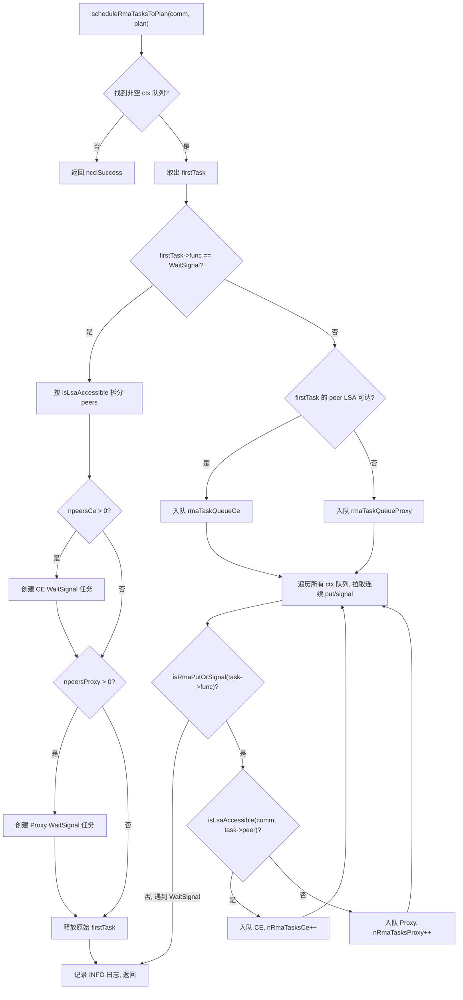
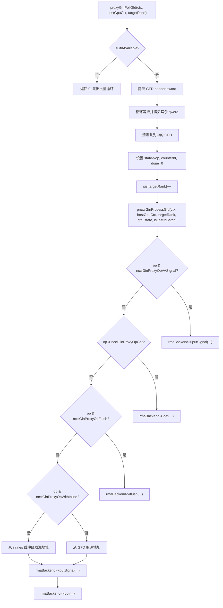

# Próximo capítulo: Capítulo 15 →

# Progresso do livro: Capítulo 15 / 25

Capítulo 15: RMA e GIN: evolução do acesso remoto à memória e comunicação direta entre GPUs

# No capítulo anterior, vimos que a memória simétrica permite que cada rank acesse os buffers de todos os ranks com o mesmo conjunto de endereços, e o NVLS leva a redução acelerada por hardware ao extremo com o poder de multicast do NVSwitch. Mas a comunicação coletiva não é tudo — quando a aplicação precisa de operações ponto a ponto de memória remota, ou deseja que o kernel da GPU inicie requisições de rede diretamente, entram em cena o RMA e o GIN. O RMA fornece acesso remoto à memória com semântica put/get, e o GIN permite que a GPU interaja diretamente com a rede, contornando a thread de proxy do host. Este capítulo segue a ordem "primeiro RMA, depois GIN", desmontando camada por camada as estruturas de dados, lógica de escalonamento, controle de concorrência e armadilhas de produção desses dois mecanismos.

## O modelo de dois canais do RMA: divisão de trabalho entre CE e Proxy

Imagine um sistema de entrega internacional: entregas locais (ranks acessíveis via LSA) podem ser entregues diretamente por veículos de entrega locais, enquanto entregas intermunicipais (ranks não acessíveis via LSA) devem ser entregues a agentes de carga aérea. O RMA do NCCL é exatamente esse modelo — a mesma operação put, dependendo se o rank de destino está dentro do grupo LSA (Load-Store Accessible), é roteada para dois caminhos de execução completamente diferentes: o caminho CE (Copy Engine) e o caminho Proxy (thread de proxy).

Sem esse mecanismo de divisão, todas as operações RMA passariam pela thread de proxy, fazendo com que puts intra-máquina também precisassem passar por uma thread host como intermediária, adicionando desnecessariamente uma latência de ida e volta host-device. Por outro lado, se todas as operações usassem CE, operações entre máquinas não poderiam aproveitar a capacidade assíncrona do plugin de rede.

## Estruturas de dados e layout de memória

A estrutura central de agendamento do RMA é`ncclRmaArgs`, que registra o resultado da divisão de tarefas RMA em um plan. Os campos principais incluem:

| Campo | Significado |
| --- | --- |
| `func` | Tipo de operação (PutSignal / Signal / WaitSignal) |
| `nRmaTasks` | Número total de tarefas |
| `nRmaTasksProxy` | Número de tarefas que usam o caminho proxy |
| `nRmaTasksCe` | Número de tarefas que usam o caminho CE |

Cada plan mantém internamente duas filas intrusivas:`rmaTaskQueueCe`e`rmaTaskQueueProxy`, que armazenam respectivamente as tarefas dos dois caminhos.[FACT:src/rma/rma.cc:166-171]

A lógica para determinar se um rank é acessível via LSA é bem direta — percorrer o`lsaRankList`array fazendo uma busca linear.[FACT:src/rma/rma.cc:34-41]Essa busca é executada uma vez para cada peer durante o agendamento de tarefas, com complexidade O(lsaSize), e para equipes LSA típicas de pequeno porte (geralmente 2-8 ranks) o custo é desprezível.

## Fluxo de agendamento passo a passo

Quando a aplicação chama uma operação RMA put, a tarefa entra em`planner->rmaTaskQueues[ctx]`。`scheduleRmaTasksToPlan`, responsável por distribuir as tarefas da fila para os plans.[FACT:src/rma/rma.cc:141-296]

Primeiro passo: encontrar a primeira fila de context não vazia. O NCCL suporta múltiplos contexts RMA (configurados por`numRmaCtx`), cada context tendo sua própria fila.[FACT:src/rma/rma.cc:148-155]

Segundo passo: retirar a primeira tarefa e determinar o tipo de operação. Se for WaitSignal, segue a lógica especial de divisão; se for Put/Signal, segue a lógica de fusão em lote.[FACT:src/rma/rma.cc:163-168]

Para tarefas WaitSignal, o agendador precisa dividir a lista de peers em dois grupos com base na acessibilidade LSA: grupo CE e grupo Proxy.[FACT:src/rma/rma.cc:187-204]Após a divisão, são criadas duas novas estruturas`ncclTaskRma`, cada uma contendo o array de peers do grupo correspondente.[FACT:src/rma/rma.cc:207-246]A tarefa original é liberada.[FACT:src/rma/rma.cc:251]

Para tarefas Put/Signal, a lógica é mais complexa — o agendador percorre as filas de todos os contexts, puxando todas as tarefas put/signal consecutivas para o mesmo plan, parando apenas ao encontrar um WaitSignal.[FACT:src/rma/rma.cc:279-295]O propósito desse design está claramente descrito nos comentários: fazer com que um único kernel launch cubra os put/signal de todos os contexts, permitindo que o proxy inicie todas as requisições assíncronas de uma vez antes de qualquer operação bloqueante, enquanto o caminho CE submete em lote as cópias e sinais de todos os contexts.[FACT:src/rma/rma.cc:270-278]

## Execução paralela e sincronização de streams

Após o agendamento,`ncclLaunchRma`com base no campo`func`, distribui para`ncclRmaPut`ou`ncclRmaWaitSignal`。[FACT:src/rma/rma.cc:109-131]

Tomando`ncclRmaPut`como exemplo, quando existem simultaneamente tarefas proxy e CE em um plan, os dois caminhos precisam ser executados em paralelo. A abordagem do NCCL é: registrar um event no stream de entrada, fazer o stream CE esperar por esse event, então iniciar as operações em ambos os streams simultaneamente, e finalmente registrar outro event no stream CE, fazendo o stream de entrada esperar por ele.[FACT:src/rma/rma.cc:80-96]Essa cadeia de events garante que: operações CE não comecem antes que as dependências do stream de entrada estejam prontas, e operações subsequentes do stream de entrada não comecem antes que o CE termine.

Se houver apenas tarefas proxy ou apenas tarefas CE, a operação correspondente é iniciada diretamente no stream de entrada, sem necessidade de sincronização adicional de streams.[FACT:src/rma/rma.cc:97-101]

## Considerações de design e armadilhas em produção

**Armadilha 1: Estaticidade da determinação de acessibilidade LSA.** `isLsaAccessible`No momento do agendamento, consulta-se`comm->devrState.lsaRankList`, e essa lista não muda após a inicialização do domínio de comunicação. Se a topologia mudar durante a execução (por exemplo, degradação por falha de NVLink), a lista LSA não será atualizada automaticamente, podendo fazer com que operações que deveriam usar proxy ainda usem o caminho CE, disparando erros irrecuperáveis.

**Armadilha 2: Garantia FIFO da fusão em lote.**A lógica de fusão em lote só puxa tarefas put/signal consecutivas, parando ao encontrar um WaitSignal.[FACT:src/rma/rma.cc:283]Isso garante a ordem FIFO dentro de cada context, mas tarefas de contexts diferentes podem ser fundidas no mesmo plan. Se a aplicação depende da ordem de operações entre contexts, é necessário usar explicitamente WaitSignal para estabelecer uma barreira.

**Armadilha 3: Caminho de vazamento de memória.**No branch WaitSignal, se`npeersProxy == 0`, o código libera os`peersProxy`、`nsignalsProxy`、`signalIdxsProxy`três arrays.[FACT:src/rma/rma.cc:239-244]Mas se`npeersCe == 0`e`npeersProxy > 0`，`peersCe`e outros arrays forem alocados via`ncclMemoryStackAlloc`, não é necessário liberá-los manualmente (o alocador de pilha os recupera uniformemente).[FACT:src/rma/rma.cc:176-178]Essa assimetria pode facilmente confundir o leitor, mas na verdade está correta — a memória alocada na pilha é gerenciada uniformemente por`comm->memScoped`.

# Contexto do RMA Proxy: sinais, filas e buffer circular sem bloqueio

## Modelo intuitivo

O contexto do Proxy é como um "centro de triagem de correios": a GPU coloca os pacotes a enviar (requisições put) na caixa de entrada (buffer circular), a thread do proxy retira os pacotes da caixa de entrada e os entrega à empresa de entrega (plugin de rede), e a empresa de entrega, após a entrega, carimba o recibo (sinal). Durante todo o processo, a GPU e a thread do proxy se comunicam através de estruturas de dados sem bloqueio, evitando a dispendiosa competição por locks.

## Estruturas de dados e layout de memória

`ncclRmaProxyCtx`É a estrutura hospedeira do contexto do proxy, cujos campos principais incluem:

**Área de sinais (signalsDev)**: um bloco de memória alocado na GPU, de tamanho`nRanks * numRmaSig * sizeof(uint64_t)`。[FACT:src/rma/rma_proxy.cc:120-123]Cada rank possui`numRmaSig`slots de sinal, usados para receber sinais desse rank. Quando este bloco de memória é registrado no plugin de rede, ele carrega as flags`NCCL_NET_MR_FLAG_FORCE_SO`(ordenação forte obrigatória) e`NCCL_NET_MR_FLAG_SIGNAL_NEVER_RESET`(sinal nunca é resetado).[FACT:src/rma/rma_proxy.cc:125-127]A flag de ordenação forte garante a relação de ordem entre put e signal — se o put for emitido antes do signal, a rede deve garantir que o signal só seja escrito após os dados do put chegarem.

**Área de números de sequência (opSeqs/readySeqs/doneSeqs)**: um conjunto por rank, alocado através de`allocMemCPUAccessible`, podendo ser memória GDR (GPU Direct RDMA) ou memória host comum.[FACT:src/rma/rma_proxy.cc:132-137]Esses três números de sequência rastreiam respectivamente: o número de sequência das operações submetidas, o número de sequência das operações prontas e o número de sequência das operações concluídas.

**Buffer circular sem bloqueio (circularBuffers)**: um array de ponteiros de tamanho`nRanks * queueSize`, com uma fila circular independente por rank.[FACT:src/rma/rma_proxy.cc:163-164]Os arrays correspondentes de`pis`(Producer Index) e`cis`(Consumer Index) têm cada um`nRanks`elementos.[FACT:src/rma/rma_proxy.cc:165-166]O tamanho da fila deve ser uma potência de 2, para que o retorno do índice possa usar a operação bit a bit`& (queueSize - 1)`em vez do módulo.[FACT:src/rma/rma_proxy.cc:156-160]

**Fila InProgress**: uma lista encadeada intrusiva por peer, armazenando descritores já submetidos ao plugin de rede mas ainda não concluídos.[FACT:src/rma/rma_proxy.cc:170-175]Esta é uma fila de consumidor único, acessada apenas pela thread do proxy, sem necessidade de operações atômicas.

## Passo a Passo: da criação do contexto ao avanço do progresso

**Criação do contexto**：`ncclRmaProxyCreateContext`Primeiro, cria-se o contexto de rede através do plugin RMA.[FACT:src/rma/rma_proxy.cc:229]Em seguida, chama-se`ncclRmaProxyCtxAlloc`para alocar recursos como sinais, números de sequência e buffers circulares.[FACT:src/rma/rma_proxy.cc:231]Depois, chama-se`ncclRmaProxyCtxAllocGraph`para alocar os recursos necessários ao modo de captura de grafo — sinais acessíveis pela CPU, buffers de flush e filas persistentes.[FACT:src/rma/rma_proxy.cc:232]

O modo de captura de grafo existe porque o CUDA Graph exige que todas as operações sejam reproduzíveis. No modo normal, os sinais estão na memória da GPU e o proxy os lê via GDR; no modo de captura de grafo, os sinais estão na memória acessível pela CPU e o proxy pode ler e escrever diretamente, evitando a imprevisibilidade do GDR.[FACT:src/rma/rma_proxy.cc:184-190]

**Thread de progresso**：`ncclRmaProxyProgressThread`É o loop principal do proxy.[FACT:src/rma/rma_proxy.cc:354-389]Ele decide o comportamento com base na palavra de estado`rmaProgress`:

- `rmaProgress == 1`: modo de avanço normal, percorrendo todos os contextos de proxy e chamando`ncclRmaProxyProgress`。[FACT:src/rma/rma_proxy.cc:361-372]
- `rmaProgress == 2`: modo de pausa, usado para recuperação de recursos. Após confirmar a pausa, a thread aguarda na variável de condição.[FACT:src/rma/rma_proxy.cc:373-378]
- `rmaProgress == -1`: sinal de saída, a thread retorna.[FACT:src/rma/rma_proxy.cc:379-380]
- `rmaProgress == 0`: espera ociosa.[FACT:src/rma/rma_proxy.cc:381-382]

Se`ncclRmaProxyProgress`retornar erro, a thread escreve o código de erro em`asyncResult`, define`rmaProgress = -2`e então sai.[FACT:src/rma/rma_proxy.cc:365-369]Esse código de erro será lido pela thread principal em chamadas subsequentes de`ncclCommGetAsyncError`.

## Controle de concorrência e ordenação de memória

O modelo de concorrência do RMA proxy é "produtor único - consumidor único": o kernel da GPU é o produtor, a thread do proxy é o consumidor. O PI do buffer circular é atualizado pela GPU, o CI pelo proxy. Por ser produtor único e consumidor único, não são necessárias operações CAS, apenas a ordenação de memória correta.

A flag de ordenação forte da área de sinais`NCCL_NET_MR_FLAG_FORCE_SO`é fundamental.[FACT:src/rma/rma_proxy.cc:127]Sem essa flag, o plugin de rede pode reordenar put e signal, fazendo com que o receptor veja o sinal antes da chegada dos dados e leia dados sujos.

`NCCL_NET_MR_FLAG_SIGNAL_NEVER_RESET`A flag informa ao plugin de rede: uma vez que o sinal é escrito, ele não será resetado.[FACT:src/rma/rma_proxy.cc:127]Isso permite que o plugin otimize o caminho de escrita do sinal — não é necessário zerar antes de cada escrita.

## Armadilhas de produção

**Armadilha 1: o tamanho da fila não é uma potência de 2.**Se o usuário definir através de`NCCL_RMA_PROXY_QUEUE_SIZE`um valor que não seja potência de 2, o código recorre ao valor padrão e imprime um log INFO.[FACT:src/rma/rma_proxy.cc:156-159]Essa reversão é silenciosa (apenas nível INFO), sendo facilmente ignorada em ambiente de produção. Se o usuário espera uma fila maior para absorver picos de tráfego, mas na prática usa o valor padrão, pode ocorrer backpressure.

**Armadilha 2: cadeia de fallback em caso de falha no registro de DMA-BUF.** `ncclRmaProxyRegMrSym`O registro de memória CUDA tem três níveis de fallback: primeiro tenta DMA-BUF no modo DataDirect, em caso de falha tenta DMA-BUF não-DataDirect, e só em caso de nova falha recorre ao`regMrSym`。[FACT:src/rma/rma_proxy.cc:76-108]comum. Os comentários alertam especialmente: se um MR entrar no caminho não-DataDirect, todos os outros MRs também devem fazê-lo, pois o uso misto quebraria a garantia de ordem do GIN.[FACT:src/gin/gin_host_proxy.cc:429-430]Essa restrição não é verificada explicitamente no caminho RMA, sendo um risco potencial.

**Armadilha 3: atraso na propagação de erros da thread de progresso.**Quando`ncclRmaProxyProgress`retorna erro, a thread define`asyncResult`e sai.[FACT:src/rma/rma_proxy.cc:366-369]Mas a thread principal pode estar executando um kernel de longa duração e não verificará imediatamente`asyncResult`. Durante esse período, as operações RMA subsequentes continuarão sendo enfileiradas, mas não serão processadas, até que a thread principal detecte o erro. Este é o atraso inerente à propagação assíncrona de erros; a aplicação precisa chamar periodicamente`ncclCommGetAsyncError`para reduzir essa janela.

# Arquitetura GIN: a GPU inicia requisições de rede diretamente

## Modelo intuitivo

No modo tradicional, para a GPU enviar dados de rede, é necessário passar pelo caminho "GPU → memória do host → thread proxy → placa de rede". O objetivo do GIN (GPU-Initiated Networking) é permitir que a GPU escreva diretamente na fila de transmissão da placa de rede, assim como a CPU escreve diretamente nos registradores MMIO da placa de rede. Isso requer que a placa de rede suporte escritas de doorbell iniciadas pela GPU, além de um protocolo de comunicação entre a GPU e as threads proxy.

## Estruturas de dados e layout de memória

A estrutura de dados central do GIN é`ginProxyHostGpuCtx`, que representa um contexto de comunicação GPU-host:

| Campo | Tipo | Significado |
| --- | --- | --- |
| `queues` | `ncclGinProxyGfd_t*` | Fila GFD, tamanho`nRanks * queueSize` |
| `pis` | `uint32_t*` | Índice do produtor (escrito pela GPU) |
| `cis` | `uint32_t*` | Índice do consumidor (escrito pelo proxy) |
| `cisShadow` | `uint32_t*` | Cópia sombra do CI (local do proxy) |
| `sis` | `uint32_t*` | Índice visto (local do proxy) |
| `states` | `ginProxyGfdState*` | Estado de cada slot GFD |
| `inlines` | `uint64_t*` | Buffer de dados inline |

O GFD (GIN Forwarding Descriptor) é o descritor de requisição que a GPU escreve para o proxy. Cada GFD é composto por múltiplos qwords, contendo tipo de operação, endereço de origem, endereço de destino, tamanho, informações de sinal, etc.[FACT:src/gin/gin_host_proxy.cc:158-163]

`queues`A alocação de memória do array tem um detalhe crucial: ele é alocado via`allocMemCPUAccessible`, mas com o parâmetro`forceHost=true`passado.[FACT:src/gin/gin_host_proxy.cc:564]Isso significa que a própria fila está na memória do host, e a GPU escreve através do PCIe. Já o array`cis`é alocado em memória acessível pela GPU (possivelmente GDR), pois o proxy precisa atualizá-lo com frequência.[FACT:src/gin/gin_host_proxy.cc:565-566]

`cisShadow`e`sis`são cópias locais da thread proxy, evitando ler a cada vez o`cis`。[FACT:src/gin/gin_host_proxy.cc:44-47]que pode estar na memória da GPU. Somente quando`cisShadow`avança é que`cis`。

## Step-by-Step: polling e processamento do GFD

`ncclGinProxyProgress`é o loop principal do proxy GIN.[FACT:src/gin/gin_host_proxy.cc:648-669]

Primeiro passo: para cada contexto, chamar primeiro`proxyGinPollCompletions`para verificar o estado de conclusão das requisições já submetidas.[FACT:src/gin/gin_host_proxy.cc:653]

Segundo passo: para cada target rank, fazer polling em lote dos GFDs.`pollBatch`controla quantos GFDs são processados no máximo por vez.[FACT:src/gin/gin_host_proxy.cc:654-655]

Terceiro passo:`proxyGinPollGfd`verifica se há um novo GFD no início da fila. O critério é se o bit de flag no cabeçalho do GFD é diferente de zero.[FACT:src/gin/gin_host_proxy.cc:176-182]Se houver, primeiro copia o primeiro qword (cabeçalho), depois aguarda os demais qwords ficarem prontos.[FACT:src/gin/gin_host_proxy.cc:194-202]Após a cópia, zera o GFD na fila para evitar processamento duplicado.[FACT:src/gin/gin_host_proxy.cc:206-208]

Quarto passo:`proxyGinProcessGfd`distribui para diferentes caminhos de processamento de acordo com o tipo de operação.[FACT:src/gin/gin_host_proxy.cc:246-340]

## Conclusão do polling e atualização dos contadores

`proxyGinPollCompletions`é responsável por verificar o estado de conclusão das requisições já submetidas.[FACT:src/gin/gin_host_proxy.cc:113-156]

Para cada target rank, de`cisShadow`até`sis`percorre todos os estados de GFD vistos mas não consumidos.[FACT:src/gin/gin_host_proxy.cc:117]Se o estado não estiver concluído, chama`rmaBackend->test`para verificar.[FACT:src/gin/gin_host_proxy.cc:122]Se estiver concluído e a operação tiver flag de contador, atualiza o valor do contador.[FACT:src/gin/gin_host_proxy.cc:132-141]

A atualização do contador usa carga atômica e armazenamento atômico, mas o comentário explica por que não é necessária adição atômica: o kernel da GPU não permite redefinir o contador enquanto houver operações pendentes, portanto não há corrida.[FACT:src/gin/gin_host_proxy.cc:133-135]

A atualização do CI tem um mecanismo de "permitir lacunas": somente quando`state->done && i == cisShadow[targetRank]`é que o CI avança.[FACT:src/gin/gin_host_proxy.cc:145-151]Isso garante que o CI seja monotonicamente crescente, e mesmo que alguns GFDs sejam concluídos primeiro, não pulará GFDs não concluídos.

## Controle de concorrência e barreiras de memória

O modelo de concorrência do proxy GIN é mais complexo que o do proxy RMA, pois existem múltiplas threads proxy (controladas por`GIN_PROXY_NTHREADS`).[FACT:src/gin/gin_host.cc:90]

`ncclGinProgress`Em[FACT:src/gin/gin_host.cc:72], cada thread é responsável por um conjunto de conexões: a thread t processa as conexões t, t+proxyNthreads, t+2*proxyNthreads, ....

Essa forma de distribuição garante que cada conexão seja processada por apenas uma thread, evitando concorrência em nível de conexão.`ginProgressWriteLock`A modificação da lista encadeada devComms requer proteção por write lock.`writePending`Primeiro define a flag[FACT:src/gin/gin_host.cc:43-47], depois adquire o write lock.`writePending`A thread de progresso verifica[FACT:src/gin/gin_host.cc:63-66]no início de cada iteração do loop; se for verdadeiro, cede a CPU.

`writePending`Esse design evita que a thread de progresso seja bloqueada pelo write lock enquanto mantém o read lock.`std::atomic<bool>`Usa[FACT:src/gin/gin_host.cc:43-47], mas o comentário observa que essa lógica assume que há apenas um escritor.

## No cenário de uso do NCCL, apenas a thread principal modifica a lista encadeada devComms, então essa suposição é válida.

**Armadilhas em produção** `queues`Armadilha 1: localização de memória da fila GFD.`forceHost=true`），[FACT:src/gin/gin_host_proxy.cc:564]é forçadamente alocado na memória do host (`cis`Isso significa que a GPU escrever no GFD precisa passar pelo barramento PCIe. Se a frequência de escrita no GFD for muito alta (cenário de mensagens pequenas), a largura de banda do PCIe pode se tornar um gargalo. Em comparação,[FACT:src/gin/gin_host_proxy.cc:565-566]

**é alocado em memória acessível pela GPU, pois o proxy precisa atualizá-lo com frequência.**Armadilha 2: reconstrução de dados inline.[FACT:src/gin/gin_host_proxy.cc:298-305]A lógica de reconstrução decide quais qwords ler com base no size: size ≤ 4 lê apenas os 32 bits inferiores, size > 4 lê os 64 bits inferiores, size > 6 lê adicionalmente os 16 bits superiores. Esta lógica de segmentação deve corresponder estritamente à lógica de escrita do lado da GPU; qualquer inconsistência causará corrupção de dados.

**Armadilha três: progresso multithread e alocação de conexões.**Se diferentes ranks definirem valores diferentes de`GIN_PROXY_NTHREADS`, após o AllGather obter o valor mínimo, algumas threads podem não ter nenhuma conexão alocada.[FACT:src/gin/gin_host.cc:181-183]Os comentários indicam que essas threads ficarão em espera ocupada no loop de stride, o que não causa problemas de correção, mas desperdiça recursos de CPU.

# Seleção de backend GIN e compatibilidade de versão

## Modelo intuitivo

O GIN suporta múltiplos backends: Proxy (simulação de software baseada no plugin RMA), GDAKI (GPU Direct Async Kernel Initiated), GPI (GPU-Initiated), EFA GDA (GPU Direct Async do AWS EFA). É como se a mesma API pudesse ter múltiplas implementações — a versão de simulação de software tem a melhor compatibilidade mas desempenho mediano, a versão com offload de hardware tem o melhor desempenho mas requer suporte de placas de rede específicas.

## Matriz de versões de backend

Cada backend possui um array de compatibilidade de versões, cujo índice é o número da versão do backend e cujo valor é a versão mínima do NCCL exigida por essa versão.[FACT:src/gin/gin_host.cc:27-33]

| Backend | Versão 0 | Versão 1 | Versão 2 | Versão 3 |
| --- | --- | --- | --- | --- |
| Proxy | 0 | 2.30.3 | 2.30.5 | 2.32.0 |
| GDAKI | 0 | 2.30.3 | 2.30.5 | - |
| GPI | 0 | 2.30.5 | - | - |
| EFA GDA | 0 | 2.31.0 | 2.32.0 | - |

Lógica de seleção de versão: percorrer o array de versões, encontrar a primeira entrada cuja versão exigida seja superior à versão atual do código do dispositivo; a versão anterior é a versão disponível.[FACT:src/gin/gin_host.cc:300-304]

## Fluxo de seleção de backend

`ncclGinDevCommSetup`Percorrer todos os backends ativos, tentando criar um DevComm com cada backend.[FACT:src/gin/gin_host.cc:427-442]As condições de seleção incluem: o tipo de GIN solicitado corresponde (ou não foi especificado), a capacidade de sinal atende aos requisitos.[FACT:src/gin/gin_host.cc:430-435]

`ncclGinValidateSignalRequest`Verificar duas capacidades: sinal forte (`supportsStrongSignals`) e sinal VA (`supportsVASignals`）。[FACT:src/gin/gin_host.cc:230-243]Se a solicitação exigir sinal forte mas o backend não suportar, pular esse backend.

## Estabelecimento de conexão e cálculo de stride

`ncclGinConnectOnce`Estabelecer conexão GIN.[FACT:src/gin/gin_host.cc:92-228]

O tipo de conexão determina o stride: no modo FULL o stride é 1 (conecta todos os ranks), no modo RAIL o stride é`contiguousRanksPerHost`(conecta apenas ranks do mesmo rail).[FACT:src/gin/gin_host.cc:139-145]

Em`ginDevCommSetupWithBackend`, a lógica de validação do stride é bastante rigorosa:

- O stride solicitado não pode ser 0.[FACT:src/gin/gin_host.cc:318-323]
- O stride solicitado não pode ser maior que o stride do rail team.[FACT:src/gin/gin_host.cc:324-330]
- O stride solicitado deve ser múltiplo do stride já conectado.[FACT:src/gin/gin_host.cc:331-337]

A motivação dessas restrições é: a barreira hierárquica assume que o GIN está pelo menos conectado em RAIL.[FACT:src/gin/gin_host.cc:325]Se o stride não satisfizer essas condições, o caminho de comunicação entre alguns ranks pode não existir.

## Armadilhas em produção

**Armadilha um: incompatibilidade de versão de backend.**Se a versão do código do dispositivo for inferior à versão mínima exigida pelo backend,`backendVersion`permanecerá em um valor mais baixo.[FACT:src/gin/gin_host.cc:301-303]Isso pode fazer com que alguns recursos novos fiquem indisponíveis (por exemplo, sinais que nunca são resetados), mas não causará erros. No entanto, se a versão do código do dispositivo for superior a todas as versões conhecidas,`backendVersion`assumirá o valor máximo, o que pode desencadear comportamento indefinido.

**Armadilha dois: limites da validação de stride.**Se`requestedStride % connectedStride != 0`, a criação falha.[FACT:src/gin/gin_host.cc:331-337]Esta verificação assume que connectedStride é uma potência de 2 (1 no modo FULL,`contiguousRanksPerHost`no modo RAIL). Se`contiguousRanksPerHost`não for uma potência de 2 (por exemplo, 3), a verificação de múltiplo pode rejeitar strides legítimos.

# Reflexões e autoavaliação deste capítulo

Q1: Em`scheduleRmaTasksToPlan`no branch WaitSignal, se removermos`plan->rmaArgs->nRmaTasks = (npeersCe > 0 ? 1 : 0) + (npeersProxy > 0 ? 1 : 0)`esta linha e a substituirmos diretamente por 1, em que cenário isso causaria problemas?

**Análise de referência**: Veja[FACT:src/rma/rma.cc:248]。`nRmaTasks`registra o número real de tarefas enfileiradas. Se todos os peers forem alcançáveis via LSA (`npeersProxy == 0`), na prática apenas 1 tarefa CE é enfileirada,`nRmaTasks`deveria ser 1. Se todos os peers forem inalcançáveis (`npeersCe == 0`), na prática apenas 1 tarefa Proxy é enfileirada,`nRmaTasks`também deveria ser 1. Mas se os peers estiverem distribuídos de forma mista, ambas as tarefas são enfileiradas,`nRmaTasks`deveria ser 2.

Se esta linha for alterada para`plan->rmaArgs->nRmaTasks = 1`, em cenários de distribuição mista,`nRmaTasks`subestimará o número real de tarefas. Posteriormente,`ncclRmaWaitSignal`em`plan->rmaArgs->nRmaTasksProxy > 0 && plan->rmaArgs->nRmaTasksCe > 0`a verificação`nRmaTasksProxy`ainda funcionará corretamente (porque usa`nRmaTasksCe`），[FACT:src/rma/rma.cc:47]e`nRmaTasks`), mas qualquer código que dependa de`nRmaTasks`para estimativa de recursos ou estatísticas de log obterá resultados incorretos. Mais grave ainda, se o código subsequente usar

para alocar arrays ou calcular o número de iterações, pode causar estouro de buffer ou omissão de tarefas.`proxyGinPollGfd`Q2: Em`hostGpuCtx->sis[targetRank]++`, se movermos`proxyGinProcessGfd`para depois da chamada de

**, em que cenário de concorrência isso causaria processamento duplicado de GFD?**Análise de referência[FACT:src/gin/gin_host_proxy.cc:228]。`sis`: Veja`proxyGinPollGfd`é o "índice já visto", indicando quantos GFDs o proxy já viu e começou a processar.`sis`incrementa imediatamente`ncclGinProxyProgress`após copiar o GFD, e então retorna 1 indicando sucesso. O chamador`proxyGinPollGfd`chama[FACT:src/gin/gin_host_proxy.cc:648-669]

em um loop; se retornar 1, continua processando o próximo GFD.`sis++`Se movermos`proxyGinProcessGfd`para depois de`proxyGinProcessGfd`, então durante a execução de`sis`(que pode envolver chamadas assíncronas de plugins de rede),`pis`ainda aponta para o GFD atual. Se nesse momento a GPU escrever um novo GFD no mesmo slot (porque a fila é circular,`proxyGinPollGfd`pode já ter dado a volta),`sis`verá novamente este slot, mas

não avançou, causando processamento duplicado do mesmo slot.`proxyGinPollGfd`Após copiar o GFD, a fila de GFD é zerada.[FACT:src/gin/gin_host_proxy.cc:206-208]Se`sis`não avançar, a próxima sondagem verá o GFD zerado (flag igual a 0),`isGfdAvailable`retornará false, causando a perda do GFD. Isso fará com que o lado da GPU espere por uma requisição que nunca será processada, resultando em deadlock.

Q3: Em`ncclRmaProxyProgressThread`, se`rmaProgress == 2`o branch esquecer de chamar`rmaProxyState->cond.notify_one()`, em qual cenário isso causará bloqueio permanente da thread principal?

**Análise de referência**: Veja[FACT:src/rma/rma_proxy.cc:373-378]。`rmaProgress == 2`está no estado de "solicitação de pausa", usado para recuperação de recursos. Após a thread principal definir`rmaProgress = 2`, ela aguardará a confirmação de pausa da thread de progresso. A thread de progresso aguarda em`cond.wait(lock)`, e a thread principal precisa chamar`cond.notify_one()`para acordá-la.[FACT:src/rma/rma_proxy.cc:377]

Se a thread de progresso, após definir`rmaProgress = 0`, esquecer`notify_one()`, a thread principal ficará esperando indefinidamente pela variável de condição. Mas mais crítico ainda é que, enquanto a thread de progresso aguarda em`cond.wait(lock)`, a thread principal precisa primeiro adquirir o lock para definir`rmaProgress = 2`. Se a thread de progresso não liberar o lock antes de`wait`, a thread principal não conseguirá adquiri-lo, formando um deadlock.

A ordem correta é: a thread de progresso define`rmaProgress = 0`, chama`notify_one()`para acordar a thread principal, depois chama`cond.wait(lock)`para liberar o lock e aguardar. Após ser acordada, a thread principal adquire o lock, define`rmaProgress = 2`, chama`notify_one()`para acordar a thread de progresso, e então aguarda a confirmação da thread de progresso. Após ser acordada, a thread de progresso define`rmaProgress = 0`, chama novamente`notify_one()`, e então`wait`. A ausência de`notify_one()`em qualquer passo desse protocolo de handshake causará bloqueio permanente.

Da semântica put/get de RMA à comunicação de rede iniciada pela GPU no GIN, percorremos um passo fundamental na evolução do NCCL em direção a um mecanismo genérico de acesso remoto à memória. Mas por mais engenhoso que seja o mecanismo, ele precisa, em última análise, se conectar a backends de rede externos, estratégias de tuning e coletores de desempenho por meio do sistema de plugins. O próximo capítulo adentra o mundo dos plugins, mostrando como o NCCL carrega dinamicamente extensões como net, tuner, profiler e env sem modificar o código central, e revela os pontos-chave da implementação da extensibilidade do ecossistema usando google-fastsocket e google-CoMMA como exemplos.
