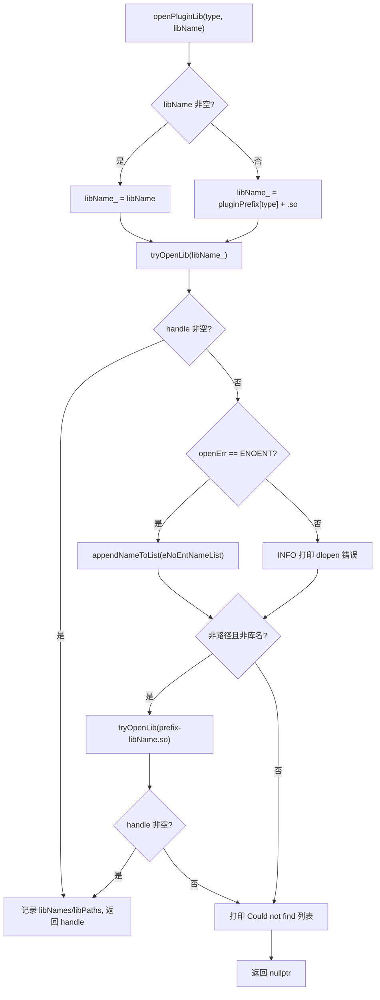
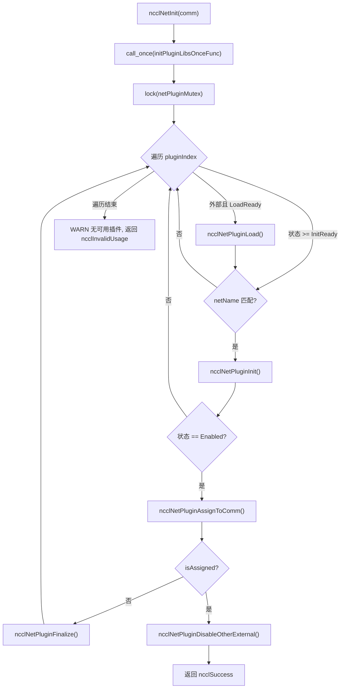
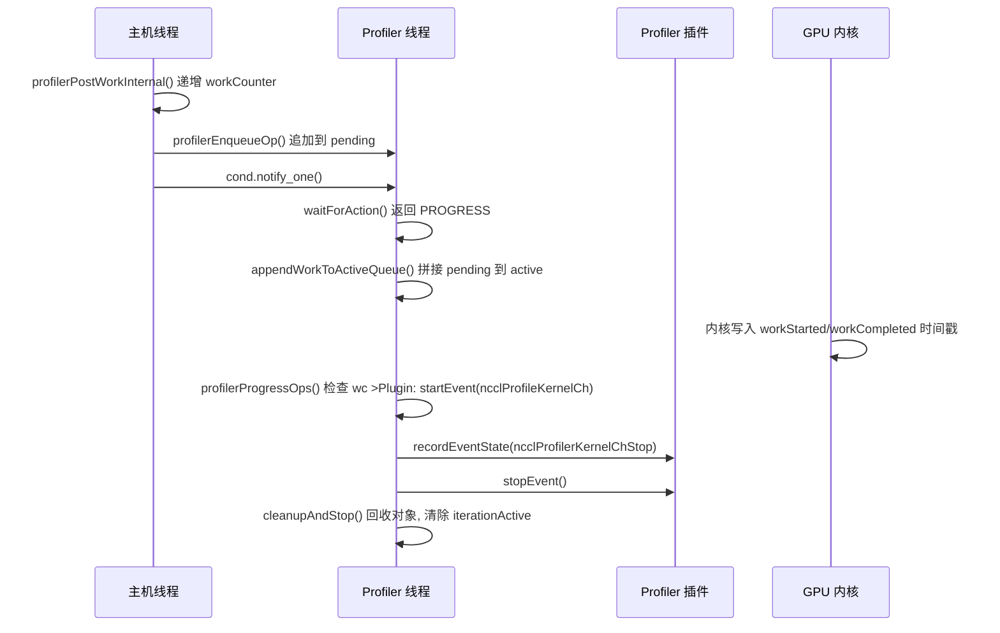

# Capítulo 16: Ecossistema de plugins e variáveis de ambiente: como net, tuner, profiler e env estendem o comportamento do NCCL

No capítulo anterior, vimos como o NCCL estende suas capacidades de comunicação de operações coletivas para acesso remoto ponto a ponto por meio de RMA e GIN, permitindo até que a GPU inicie requisições de rede diretamente. Essa evolução em direção a novos hardwares e cenários de baixa latência impõe exigências maiores à flexibilidade do motor de comunicação: se cada adaptação a uma nova rede, nova estratégia de tuning ou nova ferramenta de coleta exigisse recompilar o código central, o NCCL dificilmente acompanharia as mudanças do ecossistema. Este capítulo disseca os diretórios src/plugin e plugins, respondendo a uma questão central: como o NCCL substitui backends de rede, estratégias de tuning, coletores de desempenho e fontes de configuração sem recompilar o código central.

# 16.1 Carregador de plugins: como plugin_open.cc transforma um .so em um backend utilizável

## Modelo intuitivo

Imagine`plugin_open.cc`como a "agência de recrutamento" do NCCL: ela tem uma lista de vagas (NET, GIN, RMA, TUNER, PROFILER, ENV), cada vaga correspondendo a um nome de biblioteca candidata. Quando o NCCL precisa de alguém para uma vaga, a agência vai ao mercado de talentos (linker dinâmico) em uma ordem fixa procurar a pessoa, e se encontrar, assina o contrato (`dlopen`); se não encontrar, registra que "essa pessoa não existe", e por fim devolve um handle. Sem essa camada de intermediação, o NCCL só poderia embutir o backend de rede no binário, e qualquer fabricante de placa de rede que quisesse se integrar teria que modificar o código-fonte do NCCL — exatamente o desastre que o sistema de plugins visa eliminar.

## Estruturas de dados e layout de memória

Todo o estado do carregador consiste em seis arrays paralelos, cujo índice é o enum de tipo de plugin:

```
static char* libNames[NUM_LIBS];              // 已加载库的名字
char* ncclPluginLibPaths[NUM_LIBS];           // 库的绝对路径
static void* libHandles[NUM_LIBS];            // dlopen 返回的句柄
static const char* pluginNames[NUM_LIBS];     // 日志用的人类可读名
static const char* pluginPrefix[NUM_LIBS];    // 库名前缀
static const char* pluginFallback[NUM_LIBS];  // 找不到时的提示
static unsigned long subsys[NUM_LIBS];        // 日志子系统位掩码
```

Os índices desses sete arrays devem estar estritamente alinhados,`pluginNames[type]`、`pluginPrefix[type]`、`subsys[type]`descreve o mesmo tipo de plugin.[FACT:src/plugin/plugin_open.cc:18-29]define`NUM_LIBS = 6`, a ordem dos tipos é`{"NET", "GIN", "RMA", "TUNER", "PROFILER", "ENV"}`, o prefixo é`{"libnccl-net", "libnccl-gin", "libnccl-rma", "libnccl-tuner", "libnccl-profiler", "libnccl-env"}`。

> **[Design Inference & Architectural Trade-offs]**
> Aqui se usam arrays paralelos em vez de um array de structs para que`openPluginLib`essa única função possa servir seis tipos de plugins simultaneamente — o tipo serve apenas como índice, e a lógica é totalmente reutilizada. O custo é que, ao adicionar um novo tipo de plugin, é preciso modificar os seis arrays em sincronia, e o compilador não pode ajudar a verificar omissões.

`subsys`O array determina a qual log pertence: NET/GIN/RMA todos usam`NCCL_INIT | NCCL_NET`, TUNER usa`NCCL_INIT | NCCL_TUNING`, PROFILER usa apenas`NCCL_INIT`, ENV usa`NCCL_INIT | NCCL_ENV`。[FACT:src/plugin/plugin_open.cc:26-29]Assim,`NCCL_DEBUG_SUBSYS=NET`só se verão os logs de plugins de rede, sem se afogar em logs de tuning.

## Passo a passo: a jornada completa de um`ncclOpenNetPluginLib("mlx5")`

Suponha que o usuário defina`NCCL_NET_PLUGIN=mlx5`, o NCCL chama`ncclOpenNetPluginLib("mlx5")`na inicialização, que encaminha diretamente para`openPluginLib(ncclPluginTypeNet, "mlx5")`。[FACT:src/plugin/plugin_open.cc:132-134]

**Primeiro passo: construir o nome da biblioteca candidata.**Como foi passado um`libName`não vazio, segue o branch`snprintf(libName_, MAX_STR_LEN, "%s", libName)`,`libName_`se torna`"mlx5"`。[FACT:src/plugin/plugin_open.cc:85-89]Note que neste momento ainda não é um nome de arquivo de biblioteca válido — não tem prefixo nem`.so`sufixo.

**Segundo passo: primeira tentativa de abertura.** `tryOpenLib("mlx5", ...)`é chamado.[FACT:src/plugin/plugin_open.cc:91]Após entrar em`tryOpenLib`, primeiro verifica se`name`é vazio ou tem comprimento zero, depois há um branch especial: se o nome começar com`STATIC_PLUGIN`, então define`name`como`nullptr`。[FACT:src/plugin/plugin_open.cc:37-39]Este é o sentinela usado para plugins vinculados estaticamente ao NCCL——`dlopen(nullptr)`No Linux, retorna o handle do programa principal, permitindo que`dlsym`consiga encontrar os símbolos do plugin na tabela de símbolos do programa principal.

Em seguida, chama`ncclOsDlopen(name)`。[FACT:src/plugin/plugin_open.cc:41]porque`"mlx5"`não é nem um caminho nem um nome de biblioteca válido,`dlopen`irá falhar. Após a falha, o código obtém`ncclOsDlerror()`a string de erro, e faz uma verificação refinada: se a string de erro contiver simultaneamente`name`e`"No such file or directory"`, então define`*err`como`ENOENT`。[FACT:src/plugin/plugin_open.cc:42-55]O significado dessa verificação é distinguir entre "o arquivo simplesmente não existe" e "o arquivo existe mas falhou ao carregar" — o primeiro caso significa apenas que o nome candidato está errado, e deve-se tentar silenciosamente o próximo candidato; o segundo é um erro real, e deve-se registrar no log.

**Terceiro passo: tratamento após a primeira falha.**Retorna a`openPluginLib`，`libHandles[type]`vazio, e`openErr == ENOENT`, então adiciona`"mlx5"`a`eNoEntNameList`。[FACT:src/plugin/plugin_open.cc:97-101]Essa lista eventualmente formará um log do tipo "Could not find: mlx5 libnccl-net-mlx5.so".

**Quarto passo: segunda tentativa — adicionar prefixo.**O código verifica se`libName`não é um caminho (não contém`/`) nem um nome de biblioteca (não começa com`lib`, não termina com`.so`).[FACT:src/plugin/plugin_open.cc:105-107] `"mlx5"`A condição é satisfeita, então monta`"libnccl-net-mlx5.so"`e tenta novamente.[FACT:src/plugin/plugin_open.cc:108]Desta vez`dlopen`tem sucesso,`libHandles[type]`é atribuído,`libNames[type]`registra o nome da biblioteca,`ncclPluginLibPaths[type]`através de`getLibPath`obtém o caminho absoluto, e a função retorna o handle.[FACT:src/plugin/plugin_open.cc:110-115]

**Quinto passo: obter o caminho absoluto.** `getLibPath`No Linux, usa`dlinfo(handle, RTLD_DI_LINKMAP, &lm)`para extrair`link_map`, depois`strdup(lm->l_name)`。[FACT:src/plugin/plugin_open.cc:65-69]Esse caminho aparecerá em todos os logs subsequentes, permitindo ao usuário ver de imediato qual arquivo foi carregado — ao investigar em produção "por que um plugin errado foi carregado", esta linha de log é a cena primária.

O fluxo de decisão completo é o seguinte:



## Reflexões de design e armadilhas em produção

> **[Design Inference & Architectural Trade-offs]**
> **A ordem dos nomes candidatos é a prioridade.**Primeiro tenta o nome bruto fornecido pelo usuário, depois o nome com prefixo. Isso significa que se o diretório atual tiver um arquivo chamado`mlx5`, ele será carregado prioritariamente — esta é uma superfície de segurança potencial; em produção, deve-se evitar colocar em`LD_LIBRARY_PATH`executáveis com o mesmo nome do plugin.

**`STATIC_PLUGIN`A semântica de**Quando`NCCL_NET_PLUGIN=STATIC_PLUGIN`,`tryOpenLib`define o nome como vazio,`dlopen(nullptr)`abre o programa principal,`dlsym`busca na tabela de símbolos do programa principal por`ncclNet_v12`e outros símbolos.[FACT:src/plugin/plugin_open.cc:37-39]Isso permite vincular estaticamente o plugin ao binário do NCCL, eliminando a necessidade de implantar`.so`, ao custo de perder a capacidade de substituição em tempo de execução.

**Contagem de referências e descarregamento.** `ncclClosePluginLib`Apenas quando`libHandles[type] == handle`é que realmente`dlclose`, e limpa o caminho e o nome.[FACT:src/plugin/plugin_open.cc:176-186]Essa comparação de igualdade evita fechar erroneamente um handle que já foi substituído. Os plugins GIN e RMA reutilizam o handle da biblioteca NET através de`ncclGetGinPluginLib`/`ncclGetNetPluginLib`, implementado ao chamar novamente`dlopen`o mesmo nome de biblioteca para incrementar a contagem de referências.[FACT:src/plugin/plugin_open.cc:156-164]Esta é a semântica de contagem de referências de`dlopen`— a mesma biblioteca aberta duas vezes requer`dlclose`duas vezes para realmente descarregar.

# 16.2 net.cc: máquina de estados e ciclo de vida do plugin de rede

## Modelo intuitivo

`net.cc`é o "centro de despacho" do plugin de rede. Ele mantém um array de bibliotecas de plugins, cada uma com seu próprio estado (não carregado, falha ao carregar, aguardando carregamento, aguardando inicialização, habilitado). Quando um novo domínio de comunicação (communicator) nasce, o centro de despacho percorre todos os plugins candidatos, tentando inicializá-los um a um; o primeiro que tiver sucesso é "atribuído" a esse domínio de comunicação, e todos os demais plugins externos são desabilitados. Sem essa camada de máquina de estados, o NCCL não conseguiria lidar com problemas reais como "o plugin carregou mas o dispositivo não está disponível", "qual escolher quando múltiplos plugins coexistem", "como descarregar com segurança quando o domínio de comunicação é destruído".

## Estruturas de dados e layout de memória

A estrutura central é`netPluginLib_t`：

| Campo | Tipo | Significado |
| --- | --- | --- |
| `name` | `char[255]` | Nome da biblioteca do plugin |
| `dlHandle` | `void*` | Handle do dlopen |
| `ncclNet` | `ncclNet_t*` | Tabela de funções de rede |
| `ncclNetVer` | `int` | Número de versão da API de rede |
| `ncclCollNet` | `ncclCollNet_t*` | Tabela de funções de offload de comunicação coletiva |
| `ncclNetPluginState` | Enum | Estado do plugin de rede |
| `ncclCollNetPluginState` | Enum | Estado do plugin CollNet |
| `ncclNetPluginRefCount` | `int` | Contagem de referências |
| `netPhysDevs`/`netVirtDevs` | `int` | Número de dispositivos físicos/virtuais |
| `collNetPhysDevs`/`collNetVirtDevs` | `int` | Número de dispositivos CollNet |

[FACT:src/plugin/net.cc:63-76]define esses campos. Note que`ncclNet`e`ncclCollNet`são duas tabelas de funções separadas, e os estados também são dois enums separados — um plugin pode fornecer funcionalidade de rede sem fornecer offload CollNet.

O enum de estado tem cinco valores:`Disabled = -2`(falha na inicialização),`LoadFailed = -1`(falha ao carregar),`LoadReady = 0`(aguardando carregamento),`InitReady = 1`(carregado aguardando inicialização),`Enabled = 2`(habilitado).[FACT:src/plugin/net.cc:54-60]usa números negativos para representar estados de falha, fazendo com que comparações como "estado >= InitReady" expressem naturalmente "pelo menos carregado".

O estado global consiste em três variáveis:`pluginCount`registra o número total de plugins,`netPluginLibs[NCCL_NET_MAX_PLUGINS]`é o array de plugins,`netPluginMutex`protege o acesso concorrente,`initPluginLibsOnceFlag`garante que a inicialização seja feita apenas uma vez.[FACT:src/plugin/net.cc:78-81]

## Step-by-Step Walkthrough: a jornada completa de um`ncclNetInit(comm)`Primeiro passo: inicialização única.

**garante que a lista de plugins seja construída apenas uma vez.** `std::call_once(initPluginLibsOnceFlag, initPluginLibsOnceFunc)`Lê a variável de ambiente[FACT:src/plugin/net.cc:360] `initPluginLibsOnceFunc`, e se não estiver definida, adiciona por padrão`NCCL_NET_PLUGIN`, depois registra dois plugins internos`"libnccl-net.so"`e`ncclNetIb`A análise da variável de ambiente usa`ncclNetSocket`。[FACT:src/plugin/net.cc:288-340]

para dividir por vírgula, suportando múltiplos nomes de plugins.`strtok_r`Há uma verificação de capacidade: o número de plugins externos não pode exceder[FACT:src/plugin/net.cc:303-324], o excedente é ignorado e registrado no log.`NCCL_NET_MAX_PLUGINS - NCCL_NET_NUM_INTERNAL_PLUGINS`Os plugins internos são fixos em 2 (IB e Socket), então os plugins externos são no máximo[FACT:src/plugin/net.cc:307-311].`NCCL_NET_MAX_PLUGINS - 2`Segundo passo: travamento e iteração.

**protege todo o processo de iteração.** `std::lock_guard<std::mutex> lock(netPluginMutex)`Para cada índice de plugin, primeiro verifica se é um plugin externo e está no estado[FACT:src/plugin/net.cc:361], e se sim, chama`LoadReady`Terceiro passo: carregar o plugin.`ncclNetPluginLoad`。[FACT:src/plugin/net.cc:364-367]

**chama** `ncclNetPluginLoad`para obter o handle, depois tenta de versão mais alta para mais baixa`ncclOpenNetPluginLib`até`getNcclNet_v12`, e a primeira versão que retornar não-vazio é adotada.`getNcclNet_v6`O array de versões[FACT:src/plugin/net.cc:103-112]e o array de ponteiros de função`ncclNetVersion`estão em ordem decrescente, garantindo o uso prioritário da API mais recente.`getNcclNet`Se todas as versões falharem em obter[FACT:src/plugin/net.cc:41-43]

, significa que esta biblioteca não é um plugin de rede válido. Nesse momento, verifica se`ncclNet`foi definido explicitamente: se definido, usa o nível`NCCL_NET_PLUGIN`para alertar (o usuário solicitou explicitamente mas falhou); se não definido, usa`ATTN` 级别告警（用户明确要求却失败）；若没设置，用 `INFO`nível (apenas uma tentativa padrão que falhou).[FACT:src/plugin/net.cc:115-125]Essa distinção é importante — uma falha de configuração explícita do usuário deve ser visível para ele.

**Quarto passo: inicializar o plugin.**Voltar para`ncclNetInit`, para o estado`>= InitReady`e nome correspondente`comm->config.netName`chamar o plugin`ncclNetPluginInit`。[FACT:src/plugin/net.cc:369-372] `ncclNetPluginInit`fazer duas coisas: chamar a função`init`do plugin para estabelecer o contexto do domínio de comunicação, e na primeira inicialização chamar`devices`para detectar o número de dispositivos.[FACT:src/plugin/net.cc:186-236]

Atenção à condição de chamada de`init`:`pluginLib->ncclNetPluginState >= ncclNetPluginStateInitReady`。[FACT:src/plugin/net.cc:190]O comentário afirma explicitamente que "cada novo domínio de comunicação deve chamar init para definir o contexto correto".[FACT:src/plugin/net.cc:189]Mas a detecção de dispositivos só é feita uma vez em`== InitReady`.[FACT:src/plugin/net.cc:201]Essa distinção de "init chamado sempre, devices apenas uma vez" é uma otimização de desempenho — a detecção de dispositivos pode ser lenta, mas o contexto deve ser independente para cada domínio de comunicação.

**Quinto passo: alocação e desativação.**Após a inicialização bem-sucedida, chamar`ncclNetPluginAssignToComm`, que atribui o`ncclNet`do plugin a`comm->ncclNet`, incrementa a contagem de referências, define`comm->netPluginIndex`。[FACT:src/plugin/net.cc:238-255]Após a alocação bem-sucedida, chamar imediatamente`ncclNetPluginDisableOtherExternal`para desativar todos os outros plugins externos.[FACT:src/plugin/net.cc:377-380]

> **[Design Inference & Architectural Trade-offs]**
> A lógica de desativação tem um critério crucial: só desativa outros plugins externos quando o plugin alocado é um plugin externo (`pluginIndex >= pluginCount - NCCL_NET_NUM_INTERNAL_PLUGINS`).[FACT:src/plugin/net.cc:257-259]Se o alocado for o plugin IB interno, os plugins externos permanecem como estão — isso deixa espaço de escolha para domínios de comunicação subsequentes.



## Controle de concorrência e interação com hardware

`netPluginMutex`Protege todas as leituras e escritas em`netPluginLibs`.`ncclNetInit`、`ncclNetFinalize`Todos adicionam lock.[FACT:src/plugin/net.cc:361][FACT:src/plugin/net.cc:411-416]Mas`ncclNetGetDevCount`e outras funções comentam que "não precisa de lock, porque o chamador já está dentro do lock de`ncclTopoGetSystem`".[FACT:src/plugin/net.cc:418-429]Essa é uma convenção de "lock mantido pela camada superior", que reduz o custo de locks aninhados, ao preço de o chamador ter que seguir a convenção.

`ncclGpuGdrSupport`Mostra a interação direta do plugin com o hardware: ele aloca um buffer de 2MB na GPU, estabelece uma conexão loopback através do`listen`/`connect`/`accept`do plugin, e então tenta`regMr`registrar memória da GPU.[FACT:src/plugin/net.cc:464-535]Se o registro for bem-sucedido, significa que a placa de rede suporta GPUDirect RDMA. Esse resultado de detecção é armazenado em cache em`gdrSupportMatrix[32]`, indexado pelo número do dispositivo CUDA.[FACT:src/plugin/net.cc:478-480]

> **[Design Inference & Architectural Trade-offs]**
> Atenção:`gdrSupportMatrix`é`static`de[FACT:src/plugin/net.cc:478], compartilhado entre domínios de comunicação.

## Isso significa que múltiplos domínios de comunicação no mesmo processo reutilizarão o resultado da detecção, evitando detecções caras repetidas. Mas o tamanho do array é fixado em 32, e máquinas com mais de 32 GPUs sofrerão estouro — essa é uma suposição implícita de limite superior.

**Guia de armadilhas em produção** `ncclNetPluginInit`Armadilha 1: plugin carregado com sucesso, mas número de dispositivos é zero.`devices(&ndev) != ncclSuccess || ndev <= 0`Verificar[FACT:src/plugin/net.cc:202]e salta para o ramo de falha.`finalize`Após a falha, chamar`NCCL_UNDEF_DEV_COUNT`para limpar o contexto já estabelecido, redefinir o número de dispositivos para`Disabled`。[FACT:src/plugin/net.cc:229-234], definir o estado como

> **[Design Inference & Architectural Trade-offs]**
> **〔Inferência de design e trade-offs arquiteturais〕`init`Armadilha 2:`devices`bem-sucedido, mas**falhou.`initCompleted`O código usa a flag`init`para rastrear se[FACT:src/plugin/net.cc:178-184][FACT:src/plugin/net.cc:198]foi bem-sucedido.`initCompleted`No ramo de falha, só chama`finalize`。[FACT:src/plugin/net.cc:230]se`finalize`for verdadeiro.`finalize`Isso evita chamar

**em um contexto não inicializado — muitos plugins** `ncclNetPluginFinalize`não verificam ponteiros nulos, e uma chamada indevida causará crash.`finalize`Armadilha 3: contagem de referências na destruição do domínio de comunicação.[FACT:src/plugin/net.cc:342-355] `ncclNetPluginUnload`Primeiro chamar o`dlHandle`do plugin, depois decrementar a contagem de referências, e por fim, quando a contagem de referências chegar a zero e for um plugin externo, descarregar a biblioteca.`dlclose`。[FACT:src/plugin/net.cc:84-101]Verificar`name`não nulo e contagem de referências zero para realmente[FACT:src/plugin/net.cc:84-101]

# Após o descarregamento, redefinir os campos, mas manter

## , para reutilização ao recarregar.

16.3 tuner.cc e profiler.cc: contratos diferentes entre plugins de estratégia e plugins de observação

## Modelo intuitivo

O plugin Tuner é como "configuração de preferência de rota de um aplicativo de navegação" — ele não muda como o carro dirige, apenas muda qual caminho escolher. O plugin Profiler é como "câmera de painel de carro" — ele não interfere na condução, apenas registra o que aconteceu. O ponto em comum entre os dois é que ambos se conectam através de tabelas de funções; a diferença é que o Tuner é um objeto de estratégia leve de "uma instância por domínio de comunicação", enquanto o Profiler precisa de uma thread independente para consumir assincronamente os eventos gerados pela GPU.[FACT:src/plugin/tuner.cc:24-37]tuner.cc: singleton global minimalista

`ncclTunerPluginLoad`O estado do Tuner é extremamente simples: um mutex, uma contagem de referências, um handle de biblioteca, um ponteiro de símbolo, uma variável de estado.`LoadSuccess`Não há array de plugins, não há coexistência de múltiplos plugins — globalmente há apenas um tuner.`comm->tuner`A lógica é "carregar na primeira vez, reutilizar depois": se o estado for[FACT:src/plugin/tuner.cc:53-57], atribuir diretamente o símbolo a`NCCL_TUNER_PLUGIN`e incrementar a contagem de referências.`"none"`Caso contrário, ler a variável de ambiente[FACT:src/plugin/tuner.cc:59-63]

> **[Design Inference & Architectural Trade-offs]**
> , falhar diretamente.[FACT:src/plugin/tuner.cc:75-87]〔Inferência de design e trade-offs arquiteturais〕

> **[Design Inference & Architectural Trade-offs]**
> Atenção: não há v1 aqui — a API do tuner só tem uma estrutura estável de tabela de funções a partir da v2.`ncclOpenTunerPluginLib`〔Inferência de design e trade-offs arquiteturais〕`ncclGetNetPluginLib(ncclPluginTypeTuner)`。[FACT:src/plugin/tuner.cc:65-70]Um detalhe interessante: se`.so`retornar vazio, o código tenta

## Isso significa que o tuner pode ser empacotado na biblioteca do plugin net — isso reduz a complexidade de implantação, um

fornece simultaneamente funcionalidades de rede e ajuste.`ncclProfilerThread`：

| profiler.cc: thread de consumo assíncrono de eventos | O Profiler é o plugin mais complexo deste capítulo, porque precisa lidar com eventos gerados assincronamente pela GPU. A estrutura central é | campo |
| --- | --- | --- |
| `thread` | `std::thread` | tipo |
| `mutex` | `std::mutex` | função |
| `cond` | `condition_variable` | thread de consumo |
| `condIterationInactive` | `condition_variable` | protege a fila |
| `stop` | `int` | acorda quando há novo trabalho |
| `refCount` | `int` | espera o fim da iteração |
| `cudaDev` | `int` | flag de parada |
| `abortFlag` | `volatile uint32_t*` | contagem de referências do domínio de comunicação |
| `iterationActive` | `bool` | dispositivo CUDA vinculado |
| `pending`/`pendingTail` | flag de aborto | se está em iteração |
| `active`/`activeTail` | lista encadeada | trabalho pendente |
| `opStack`/`opPool` | lista encadeada | trabalho em processamento |
| `inflight`/`maxInflightSeen`/`maxInflight` | `size_t` | pool de memória |
| `droppedOps` | `uint64_t` | alocação de objetos de trabalho |

[FACT:src/plugin/profiler.cc:38-69]observação de backpressure`pending`contagem de falhas de alocação`active`define essa estrutura. Atenção:`pending`e`pending`são duas listas encadeadas independentes: o produtor acrescenta a`active`, a thread de consumo, dentro do lock, concatena`active`。[FACT:src/plugin/profiler.cc:56-59]

`iterationActive`em`true`, e então, fora do lock, percorre`false`para desmontar o estado do domínio de comunicação.[FACT:src/plugin/profiler.cc:52-55]

## Passo a passo: geração e consumo de um evento KernelCh

**Primeiro passo: enfileiramento no lado do host.**Quando o kernel plan é submetido,`ncclProfilerPostPlanWork`percorre as tarefas coletivas do plano e, para cada tarefa com`ncclProfileKernelCh`habilitado, chama`profilerPostWorkInternal`。[FACT:src/plugin/profiler.cc:1315-1331]

`profilerPostWorkInternal`por intervalo de canal, primeiro incrementa`comm->profiler.workCounter[channelId]`, depois chama`profilerEnqueueOp`。[FACT:src/plugin/profiler.cc:1259-1266]O comentário enfatiza que esse incremento deve ocorrer "exatamente uma vez por chamada, mesmo se a alocação falhar", para manter a sincronização com o kernel do dispositivo.[FACT:src/plugin/profiler.cc:1259-1266]

**Segundo passo: alocar o objeto de trabalho.** `profilerEnqueueOp`Dentro do lock, aloca do pool de memória`ncclProfilerWorkOp`, preenchendo campos como número do canal, contador de trabalho, máscara de ativação, handle de evento da tarefa, contexto do domínio de comunicação, etc.[FACT:src/plugin/profiler.cc:1199-1223]Em caso de falha na alocação, incrementa`droppedOps`e registra log, mas**não**faz rollback de`workCounter`— isso é essencial para manter a sincronização com o dispositivo.[FACT:src/plugin/profiler.cc:1202-1207]

Após alocação bem-sucedida, anexa o objeto ao final da lista encadeada`pending`, incrementa`inflight`, atualiza`maxInflightSeen`, acorda a thread consumidora.[FACT:src/plugin/profiler.cc:1225-1239]

**Terceiro passo: a thread consumidora aguarda.** `ncclProfilerThreadFunc`Chama em loop`waitForAction`。[FACT:src/plugin/profiler.cc:1074-1077] `waitForAction`aguardando a variável de condição dentro do lock, até que`pending`ou`active`não estejam vazios, ou até receber sinal de parada/aborto.[FACT:src/plugin/profiler.cc:1017-1031]

Ao ser acordada, chama`appendWorkToActiveQueue`para concatenar`pending`ao final de`active`, define`iterationActive = true`, retorna`NCCL_PROFILER_THREAD_PROGRESS`。[FACT:src/plugin/profiler.cc:1017-1031]

**Quarto passo: processar o trabalho.** `profilerProgressOps`Fora**do lock**percorre a lista encadeada`active`.[FACT:src/plugin/profiler.cc:958-999]Para cada objeto de trabalho, verifica se o dispositivo já escreveu o timestamp de início:`wc <= op->workStarted[ch].data[slot].counter`。[FACT:src/plugin/profiler.cc:972]Observe que usa`<=`em vez de`==`, porque o dispositivo dá wrap-around em`MAX_PROFILER_EVENTS_PER_CHANNEL`slots, e se o host estiver atrasado o dispositivo pode já ter sobrescrito esse slot.[FACT:src/plugin/profiler.cc:969-971]

Se a condição de início for satisfeita, chama`ncclProfilerStartKernelChEvent`para notificar o plugin.[FACT:src/plugin/profiler.cc:973]Em seguida verifica a condição de conclusão; se satisfeita, dispara primeiro o evento de fase e depois chama`ncclProfilerStopKernelChEvent`。[FACT:src/plugin/profiler.cc:978-985]

Os objetos de trabalho concluídos são removidos da lista e coletados na lista`recycled`.[FACT:src/plugin/profiler.cc:987-991]

**Quinto passo: reciclagem e publicação.** `cleanupAndStop`Dentro do lock, recicla a lista`recycled`, publica o novo`activeTail`, limpa`iterationActive`e notifica os waiters.[FACT:src/plugin/profiler.cc:1036-1050]



## Controle de concorrência e backpressure

`NCCL_PROFILER_DEFAULT_MAX_INFLIGHT`definido como`MAXCHANNELS * MAX_PROFILER_EVENTS_PER_CHANNEL * 4`。[FACT:src/plugin/profiler.cc:32-32]Este é um "limite suave" — ultrapassá-lo não impede o enfileiramento, apenas gera log.[FACT:src/plugin/profiler.cc:1233-1238]O comentário explica que manter o enfileiramento serve para parear o evento KernelCh com seu evento de tarefa pai.[FACT:src/plugin/profiler.cc:32-32]

O log é disparado em potências de 2:`(pt->inflight & (pt->inflight - 1)) == 0`。[FACT:src/plugin/profiler.cc:1233]Isso garante que o log só seja emitido quando inflight for 1, 2, 4, 8..., evitando spam.

A estratégia de backoff da thread consumidora está em`updateProgressInterval`: se houver progresso, tenta novamente imediatamente; se não houver, dobra o intervalo a partir de 1 microssegundo, com limite de 10 microssegundos.[FACT:src/plugin/profiler.cc:1054-1057]Esse design equilibra latência e uso de CPU.

## Guia de armadilhas em produção

**Armadilha 1: vazamento de trabalho na destruição.** `ncclProfilerThreadDestroy`Primeiro aguarda`iterationActive`tornar-se falso, depois chama`profilerPurgeByContext`para limpar todo trabalho pendente que referencia esse contexto de domínio de comunicação.[FACT:src/plugin/profiler.cc:1162-1169]Se essa limpeza não for feita, o callback do plugin receberá um ponteiro de contexto já destruído, causando use-after-free.

**Armadilha 2: drenagem na parada.**Quando um sinal de parada é recebido mas`active`não está vazio, retorna`NCCL_PROFILER_THREAD_CLEANUP_AND_STOP`，`cleanupAndStop`com o parâmetro`drainStuck`verdadeiro, reciclando diretamente todo o trabalho restante.[FACT:src/plugin/profiler.cc:1029][FACT:src/plugin/profiler.cc:1036-1050]O comentário diz que o kernel desses trabalhos nunca será executado, então podem ser descartados diretamente.[FACT:src/plugin/profiler.cc:1034-1035]

**Armadilha 3: vinculação ao dispositivo CUDA.**Ao iniciar, a thread consumidora chama`cudaSetDevice(pt->cudaDev)`。[FACT:src/plugin/profiler.cc:1054-1057]O comentário explica: a thread em si só lê memória fixada do host, mas o plugin pode fazer chamadas de driver dependentes de contexto, então a vinculação é defensiva.[FACT:src/plugin/profiler.cc:1054-1057]Falha na vinculação apenas gera log, sem abortar, pois a thread em si não depende de CUDA.[FACT:src/plugin/profiler.cc:1065-1070]

# 16.4 Exemplos oficiais: pontos de implementação do google-fastsocket e google-CoMMA

## Modelo intuitivo

Os exemplos oficiais são a "implementação de referência" da API de plugins.`google-fastsocket`Mostra como substituir o TCP do kernel por uma pilha de rede em espaço de usuário;`google-CoMMA`Mostra como implementar um plugin profiler para coletar desempenho de comunicação. A existência deles prova que a API de plugins é expressiva o suficiente para necessidades reais.

## google-fastsocket: substituir o backend de rede

> **[Design Inference & Architectural Trade-offs]**
> FastSocket é a pilha de rede em espaço de usuário open source do Google, que contorna a pilha TCP/IP do kernel através da família de endereços`AF_FABRIC`. Como plugin net do NCCL, ele precisa implementar`ncclNet_t`todas as funções:`init`、`devices`、`getProperties`、`listen`、`connect`、`accept`、`regMr`、`isend`、`irecv`、`test`、`closeSend`etc.

O ponto-chave de implementação está em`getProperties`retornado por`ptrSupport`: se o FastSocket suportar GPUDirect RDMA, deve ser definido como`NCCL_PTR_HOST|NCCL_PTR_CUDA`; caso contrário, só pode ser definido como`NCCL_PTR_HOST`, e o NCCL copiará os dados da GPU para a memória do host antes de enviar.[FACT:plugins/net/README.md:245-245]

`connect`e`accept`O contrato de "não bloqueante" de`sendComm`/`recvComm`é o principal desafio da implementação do plugin: eles devem retornar imediatamente, definindo`NULL`como[FACT:plugins/net/README.md:299-311], para que o NCCL chame repetidamente até ter sucesso.

## Isso exige que o plugin mantenha internamente uma máquina de estados de conexão, colocando o handshake demorado em segundo plano.

> **[Design Inference & Architectural Trade-offs]**
> 〔Inferência de design e trade-offs arquiteturais〕`ncclProfiler_t`CoMMA (Collective Memory Monitoring Agent) é o coletor de desempenho de comunicação do Google. Como plugin profiler, ele implementa a tabela de funções`init`、`finalize`、`startEvent`、`stopEvent`、`recordEventState`。

`init`:`ncclProfilerEventMask`recebe o ponteiro[FACT:src/plugin/profiler.cc:341], e o plugin escolhe quais eventos assinar escrevendo nessa máscara.[FACT:src/plugin/profiler.cc:285-307]

`startEvent`Os tipos de evento suportados pelo NCCL incluem Group, Coll, P2p, ProxyOp, ProxyStep, ProxyCtrl, KernelCh, KernelPhase, NetPlugin, etc.`stopEvent`Retorna um handle de evento; subsequentemente`recordEventState`e[FACT:src/plugin/profiler.cc:392][FACT:src/plugin/profiler.cc:400-407]usam esse handle para associar eventos.

## O plugin pode usar o handle para armazenar seu próprio estado, implementando pareamento de eventos e estatísticas de duração.

**Reflexões de design**Como a API net envolve código do lado do dispositivo (`ncclNetDeviceHandle`), uma incompatibilidade de versão causará uma falha no kernel; já o tuner/profiler é puramente do lado do host, e uma incompatibilidade de versão no máximo resulta em funcionalidade ausente.[FACT:src/plugin/net.cc:153-176]mostra como`ncclNetCheckDeviceVersion`verificar o tipo e a versão do dispositivo, retornando em caso de incompatibilidade`ncclInternalError`。

**Por que o profiler precisa de uma thread independente?**Porque o callback do profiler pode bloquear (por exemplo, escrever arquivos, enviar requisições de rede); se for chamado na thread do host, atrasará a comunicação.[FACT:src/plugin/profiler.cc:950-952]O comentário afirma explicitamente que "o callback do plugin pode bloquear, portanto não pode ser chamado enquanto se mantém o lock".

# 16.5 Guia de prevenção de armadilhas em produção e cadeia de recuperação de falhas

## Armadilha 1: Incompatibilidade de versão do plugin causa falha no kernel

`ncclNetCheckDeviceVersion`Verifica`props.netDeviceType`e`props.netDeviceVersion`。[FACT:src/plugin/net.cc:153-176]Se a versão de`NCCL_NET_DEVICE_UNPACK`reportada pelo plugin for inconsistente com a versão de`NCCL_NET_DEVICE_UNPACK_VERSION`usada na compilação do NCCL, retorna`ncclInternalError`e emite um alerta.[FACT:src/plugin/net.cc:153-176]Esta verificação é chamada em`ncclNetPluginAssignToComm`; em caso de falha, o plugin não será atribuído ao domínio de comunicação.[FACT:src/plugin/net.cc:241]

**Cadeia de recuperação**: incompatibilidade de versão →`ncclNetCheckDeviceVersion`retorna erro →`ncclNetPluginAssignToComm`retorna`isAssigned = false` → `ncclNetInit`continua tentando o próximo plugin → eventualmente pode recorrer ao plugin Socket interno.

## Armadilha 2: A thread do profiler não consegue sair

Se o plugin do profiler bloquear em`stopEvent`, a thread consumidora ficará presa em`profilerProgressOps`,`iterationActive`será sempre verdadeiro,`ncclProfilerThreadDestroy`esperará permanentemente.[FACT:src/plugin/profiler.cc:1166]Este é um risco real de deadlock.

> **[Design Inference & Architectural Trade-offs]**
> **Cadeia de recuperação**：`comm->abortFlag`é definido →`waitForAction`detecta o aborto → retorna`CLEANUP_AND_STOP` → `cleanupAndStop`esvazia a fila.[FACT:src/plugin/profiler.cc:1017-1031]Mas se a thread já estiver presa no callback do plugin, o flag de aborto não consegue interrompê-la — esta é a responsabilidade do implementador do plugin; o callback deve ter timeout.

## Armadilha 3: Vazamento de contagem de referência do plugin tuner

`ncclTunerPluginLoad`Incrementa em caso de sucesso`tunerPluginRefCount`。[FACT:src/plugin/tuner.cc:98] `ncclTunerPluginUnload`Decrementa quando`comm->tunerPluginLoaded`for verdadeiro.[FACT:src/plugin/tuner.cc:111-123]Se algum domínio de comunicação carregou o tuner mas na destruição`tunerPluginLoaded`for zerado acidentalmente, a contagem de referência nunca chegará a zero e a biblioteca do plugin nunca será descarregada.

# Reflexões e autoavaliação deste capítulo

Q1: Se em`ncclNetPluginLoad`o loop de "tentar da versão mais alta para a mais baixa" for alterado para "tentar apenas a versão mais alta", em qual cenário um plugin originalmente utilizável deixaria de carregar?

**Análise de referência**: Veja[FACT:src/plugin/net.cc:108-112]. O loop percorre`NCCL_NET_VERSION_COUNT`versões, de v12 até v6, e a primeira que retornar não vazio é adotada. Se apenas v12 for tentada, um plugin antigo que implementa somente v11 falhará ao carregar.

> **[Design Inference & Architectural Trade-offs]**
> Este design visa compatibilidade retroativa: após o núcleo do NCCL ser atualizado para suportar v12, ele ainda consegue carregar plugins que oferecem apenas v11. Autores de plugins são encorajados a fornecer símbolos de múltiplas versões (veja[FACT:plugins/net/README.md:35-37]), de modo que o mesmo`.so`possa servir múltiplas versões do NCCL.

Se a tentativa de downgrade for removida, após o usuário atualizar o NCCL o plugin antigo ficará subitamente indisponível, restando apenas recorrer ao plugin Socket interno, com queda acentuada de desempenho. É exatamente para isso que existe a negociação de versão.

Q2: Em`profilerProgressOps`, se`wc <= op->workStarted[ch].data[slot].counter`for alterado para`wc == op->workStarted[ch].data[slot].counter`, em qual cenário de alta concorrência o evento nunca será disparado?

**Análise de referência**: Veja[FACT:src/plugin/profiler.cc:969-972]. O comentário explica explicitamente que o dispositivo dá a volta em`MAX_PROFILER_EVENTS_PER_CHANNEL`slots. Se a velocidade de consumo do host ficar atrás da velocidade de produção do dispositivo, o dispositivo pode já ter sobrescrito o slot`wc + N`com o contador`wc % MAX_PROFILER_EVENTS_PER_CHANNEL`。

Nesse momento, o valor de`op->workStarted[ch].data[slot].counter`é`wc + N`, enquanto`op->workCounter`é`wc`. Usar`==`para julgar falhará, o evento nunca será disparado, o objeto de trabalho permanecerá para sempre na lista encadeada`active`,`inflight`só aumenta e nunca diminui, esgotando por fim o pool de memória.

Usar`<=`consegue tratar corretamente essa situação: desde que o contador escrito pelo dispositivo não seja menor que o valor esperado, considera-se que o evento está pronto. Esta é uma condição de correção típica de "buffer circular produtor-consumidor".

Q3: Se em`ncclProfilerThreadDestroy`for removido o loop de espera até`iterationActive`tornar-se falso, em qual sequência temporal o plugin do profiler acessaria um contexto de domínio de comunicação já liberado?

**Análise de referência**: Veja[FACT:src/plugin/profiler.cc:1162-1166]. O comentário explica que`ncclProfilerPluginFinalize`destruirá imediatamente o domínio de comunicação após`ncclProfilerThreadDestroy`retornar`profilerContext`。

Quando a thread consumidora chama o callback do plugin em`profilerProgressOps`, o que é passado é`op->profilerContext`。[FACT:src/plugin/profiler.cc:938]Se a thread de destruição não esperar`iterationActive`tornar-se falso antes de retornar,`ncclProfilerPluginFinalize`liberará o contexto, enquanto a thread consumidora pode estar usando esse contexto para chamar o plugin — use-after-free.

`iterationActive`O protocolo de handshake de`true`é: a thread consumidora, sob o lock, define como`false`。[FACT:src/plugin/profiler.cc:1028][FACT:src/plugin/profiler.cc:1054-1057]e então libera o lock para chamar o plugin; a thread de destruição espera sob o lock até que volte a

Este protocolo garante que o contexto permaneça válido durante o callback do plugin.

O sistema de plugins faz o NCCL passar de fechado para aberto: backend de rede, estratégias de tuning, coletores de desempenho e fontes de configuração podem todos ser substituídos sem alterar o código do núcleo. Mas os plugins também introduzem novas superfícies de falha — incompatibilidade de versão, corridas de ciclo de vida, vazamento de contagem de referência. No próximo capítulo entraremos no subsistema de RAS e diagnóstico, para ver como o NCCL detecta falhas, monitora o progresso e alcança autocura em tarefas de treinamento de longa duração.

O sistema de plugins traça uma fronteira clara entre o caminho de comunicação central do NCCL e os componentes substituíveis; os quatro tipos de plugins net, tuner, profiler e env intervêm com segurança no comportamento em tempo de execução por meio de mecanismos de registro e contagem de referência. Mas um motor de comunicação extensível não deve apenas substituir componentes com flexibilidade, mas também operar de forma estável em treinamentos de longa duração — quando a placa de rede ou a GPU falham, como o NCCL detecta, monitora e dispara a recuperação? No próximo capítulo entraremos nos mecanismos de RAS e diagnóstico, para ver como a confiabilidade em ambiente de produção é sistematicamente garantida.
