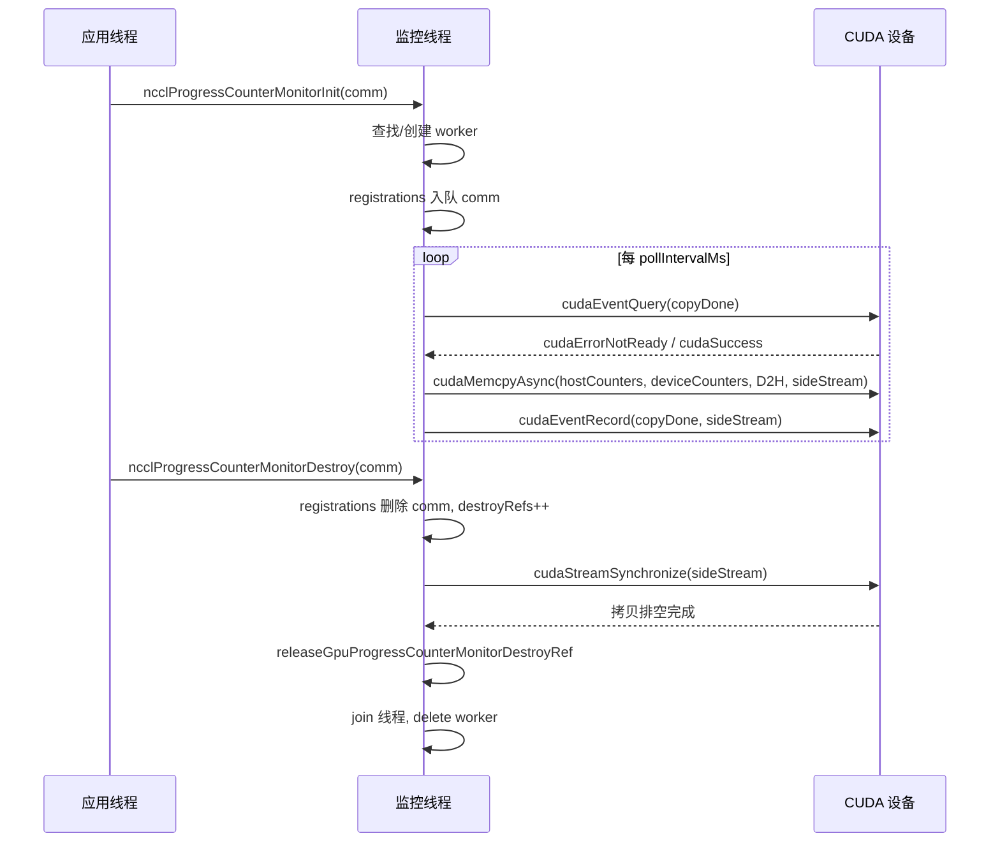
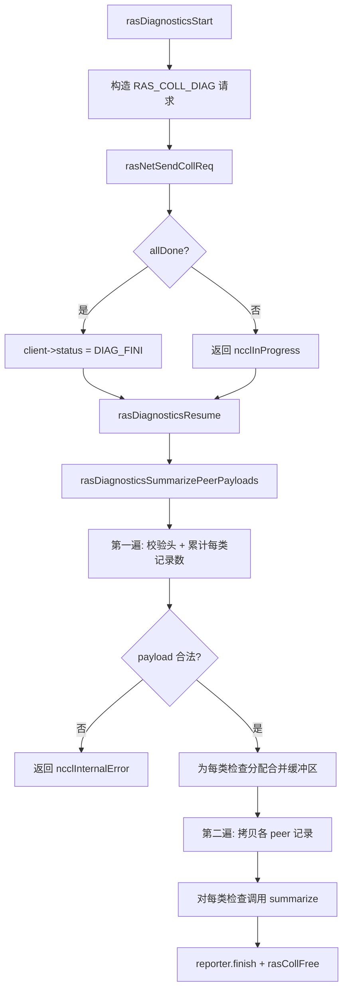

# Capítulo 17: Mecanismo RAS e Tolerância a Falhas: Detecção de Falhas de Link, Heartbeat e Degradação Graciosa

No capítulo anterior, vimos como o sistema de plugins permite delimitar a fronteira entre o caminho de comunicação central e os componentes substituíveis, possibilitando a troca de backends de rede, estratégias de ajuste e coletores de desempenho sem modificar o código central. Mas a extensibilidade é apenas uma dimensão da prontidão para produção; outra questão igualmente crítica é: quando um AllReduce já está rodando há 72 horas e a placa de rede de uma máquina falha silenciosamente, como o NCCL consegue detectar, isolar e continuar? O subsistema RAS é precisamente o divisor de águas que leva o NCCL de "funciona" para "pronto para produção". Este capítulo desvendará o design por trás da detecção de falhas, monitoramento de progresso e mecanismos de autocura.

# 17.1 Controle Geral do RAS: Um Coordenador Global com Uma Thread RAS por Processo

## Modelo Intuitivo

Imagine o RAS como a "sala de plantão" de todo o job. Cada processo NCCL (cada rank) abre uma sala de plantão na inicialização, com uma thread dedicada dentro. Todas as criações, destruições e solicitações de diagnóstico de domínios de comunicação (communicator) precisam primeiro se registrar na sala de plantão; as salas de plantão se comunicam entre si através de uma rede RAS independente para informar "quem ainda está vivo, quem já morreu".

Sem essa sala de plantão, o NCCL só poderia perceber falhas através de timeouts no próprio caminho de comunicação — e timeouts no caminho de comunicação são lentos e propensos a falsos positivos (uma oscilação de rede pode ser interpretada como morte de nó). O RAS separa a "percepção de falhas" do plano de dados para o plano de controle, usando heartbeats leves independentes e canais de diagnóstico para determinar o estado de saúde.

## Estruturas de Dados e Layout de Memória

O estado central do RAS está disperso nas variáveis globais de`ras.cc`, que vamos destrinchar uma a uma:

| Variável | Tipo | Função |
| --- | --- | --- |
| `rasInitMutex` | `std::mutex` | Protege a inicialização do singleton RAS |
| `rasInitialized` | `bool` | Se já foi inicializado |
| `rasInitRefCount` | `int` | Contador de referências, igual ao número de comms ativos |
| `rasNetListeningSocket` | `struct ncclSocket` | Socket de escuta da rede RAS |
| `rasNotificationPipe[2]` | `ncclSocketPairDescriptor` | Pipe de notificação da thread local → thread RAS |
| `rasPfds` | `struct pollfd*` | Array de poll do loop de eventos principal |
| `ncclComms` | `struct ncclComm**` | Array de ponteiros de todos os domínios de comunicação |

[FACT:src/ras/ras.cc:49-61]define esses estados globais. Note que`rasInitRefCount`usa`ncclAtomicRefCountIncrement`para incrementar/decrementar[FACT:src/ras/ras.cc:129], enquanto`rasInitialized`usa um bool simples com double-checked locking para proteger[FACT:src/ras/ras.cc:103-105]— este é o padrão típico de "inicializa uma vez, depois somente leitura".

`ncclComms`A estratégia de alocação do array`RAS_INCREMENT * 8`merece atenção: ele não cresce sob demanda, mas expande[FACT:src/ras/ras.cc:139-140]de cada vez (ou seja, 32 slots)`nullptr`. O array permite[FACT:src/ras/ras.cc:135-137]。

## buracos (preenchidos com nulo quando um comm é destruído), e novos comms reutilizam o primeiro buraco

**Walkthrough Orientado a Cenários: Da Inicialização do Comm à Partida da Thread RAS`ncclRasCommInit`Primeiro passo:**é chamado.[FACT:src/ras/ras.cc:101]Esta é a primeira função RAS chamada na inicialização de cada comm`rasInitialized`. Ela primeiro verifica

, e se não inicializado, entra na seção crítica:`rasNetListeningSocket`1. Inicializa[FACT:src/ras/ras.cc:108-109]

com o endereço da interface de rede bootstrap, com porta definida como 0 para o kernel alocar aleatoriamente[FACT:src/ras/ras.cc:113]

2. Escuta nesse socket[FACT:src/ras/ras.cc:118]

3. Cria o pipe de notificação local[FACT:src/ras/ras.cc:120]

4. Inicializa o subsistema de diagnóstico`rasThreadMain`5. Inicia a thread[FACT:src/ras/ras.cc:121]

6. Registra`atexit(rasTerminate)`para garantir limpeza na saída do processo[FACT:src/ras/ras.cc:126]

**Segundo passo: registrar o comm.**Independentemente de ser a primeira inicialização ou não,`comm`escreve o ponteiro`ncclComms`no array[FACT:src/ras/ras.cc:142], e define`ncclCommsSorted`como false[FACT:src/ras/ras.cc:143]— porque a ordem do array mudou, a ordenação anterior é invalidada.

**Terceiro passo: preencher a porta.**A função`rasNetListeningSocket.addr`finalmente copia`myRank->addr` [FACT:src/ras/ras.cc:146](incluindo a porta alocada pelo kernel) de volta para

## , para que o chamador saiba em qual porta a rede RAS está escutando.

`rasThreadMain`Loop de Eventos Principal: Multiplexação Orientada a poll[FACT:src/ras/ras.cc:633]é o coração da thread RAS[FACT:src/ras/ras.cc:641-652]. Ele primeiro registra três fds fixos: o pipe de notificação, o socket de escuta da rede RAS, o socket de escuta do cliente

```
for (int64_t nextWakeup = 0;;) {
  // 计算超时
  timeoutMs = min(..., 1000);
  nEvents = poll(rasPfds, nRasPfds, timeoutMs);
  // 处理事件
  for (pollIdx...) { ... }
  // 处理各类超时
  rasSocksHandleTimeouts(now, &nextWakeup);
  rasConnsHandleTimeouts(now, &nextWakeup);
  rasNetHandleTimeouts(now, &nextWakeup);
  rasCollsHandleTimeouts(now, &nextWakeup);
}
```

[FACT:src/ras/ras.cc:655-728]Copiar`timeoutMs`mostra este loop. Note que[FACT:src/ras/ras.cc:664]é rigidamente limitado a 1000ms`nextWakeup`— mesmo que

esteja distante, ele acorda a cada segundo para garantir a pontualidade da verificação de timeout.[FACT:src/ras/ras.cc:684-715]A lógica de despacho de eventos usa o valor do fd para roteamento`rasLocalHandle`: se for o pipe de notificação, chama`rasSocketsHead`; se for o socket de escuta, faz accept; caso contrário, percorre as listas`rasClientsHead`e

## para encontrar o socket correspondente e processar.

Mecanismo de Notificação Local: Pipe + Estrutura de Tamanho Fixo`rasNotification`A thread NCCL local e a thread RAS se comunicam através de um socketpair. A estrutura de notificação[FACT:src/ras/ras.cc:35-46]é de tamanho fixo`static_assert`, e usa`PIPE_BUF` [FACT:src/ras/ras.cc:47]para garantir que não exceda

— isso é para assegurar a atomicidade da escrita (POSIX garante que escritas menores que PIPE_BUF são atômicas).`rasLocalNotify`O lado emissor`rasNotificationMutex`usa[FACT:src/ras/ras.cc:224-237]para serializar as escritas de múltiplas threads de usuário[FACT:src/ras/ras.cc:224-237], e então escreve em loop até completar`rasLocalHandle`. O lado receptor[FACT:src/ras/ras.cc:247-256]também lê em loop até preencher toda a estrutura`ncclSystemError` [FACT:src/ras/ras.cc:251-253]。

, retornando`RAS_ADD_RANKS`ao ler EOF`RAS_RUN_DIAG`Três tipos de notificação:`RAS_TERMINATE`(novo rank entrou),[FACT:src/ras/ras.cc:28-32]。

## (executar diagnóstico),

(terminar)[FACT:src/ras/ras_internal.h:110-117]Envio e Recebimento de Mensagens: Prefixo de Comprimento + Progresso Incremental`rasConnSendMsg`O formato de linha das mensagens RAS é "4 bytes de comprimento + corpo da mensagem"[FACT:src/ras/ras.cc:362-390]. Ao enviar,`meta->offset`envia primeiro o comprimento e depois o corpo da mensagem`rasMsgRecv`, usando[FACT:src/ras/ras.cc:393-412]。

para registrar o progresso, suportando envio parcial e continuação na próxima vez. Ao receber,`rasMsgAlloc`primeiro recebe o comprimento, aloca o buffer de acordo com o comprimento, e então recebe o corpo da mensagem`rasMsgMeta`Há um detalhe aqui:`msg`aloca a estrutura`offsetof`,[FACT:src/ras/ras.cc:313-319]o campo está no final da estrutura, calculado via[FACT:src/ras/ras.cc:323-328]Esse layout de "metadados na frente" permite que a mensagem carregue informações locais como progresso de envio e horário de entrada na fila, sem ocupar o formato de rede.

## Reflexões de design

> **[Design Inference & Architectural Trade-offs]**
> **Por que usar poll em vez de epoll?**A complexidade O(n) do poll é aceitável no cenário RAS — o número de conexões RAS é muito menor que o de conexões do plano de dados, e a thread RAS em si não está no caminho crítico de desempenho. O poll também tem melhor portabilidade entre plataformas (compatibilidade com Windows).

> **[Design Inference & Architectural Trade-offs]**
> **Por que usar pipe em vez de variável de condição para notificação?**O pipe pode ser integrado perfeitamente ao loop de poll, permitindo que a thread RAS use um mecanismo unificado para`poll`aguardar todas as fontes de eventos. Se fosse usada uma variável de condição, seria necessário um mecanismo extra para acordar o poll.

```mermaid
flowchart TD
    start["rasThreadMain 启动"] --> reg_pipe["注册通知管道 fd"]
    reg_pipe --> reg_net["注册 RAS 网络监听 fd"]
    reg_net --> reg_client["注册客户端监听 fd"]
    reg_client --> poll["poll(rasPfds, timeout check{"nEvents == -1?"}
    check -->|"是且非 EINTR"| log_err["记录 poll 错误并继续"]
    check -->|"否"| dispatch["遍历 revents 分发事件"]
    log_err --> dispatch
    dispatch --> is_pipe{"fd == 通知管道?"}
    is_pipe -->|"是"| local_handle["rasLocalHandle()"]
    is_pipe -->|"否"| is_net{"fd == RAS 监听?"}
    is_net -->|"是"| accept_net["rasNetAcceptNewSocket()"]
    is_net -->|"否"| is_client{"fd == 客户端监听?"}
    is_client -->|"是"| accept_client["rasClientAcceptNewSocket()"]
    is_client -->|"否"| find_sock["遍历 rasSocketsHead 找匹配 socket"]
    find_sock --> sock_loop["rasSockEventLoop(sock, pollIdx)"]
    local_handle --> terminate{"terminate?"}
    terminate -->|"是"| cleanup["rasThreadCleanup() 并退出"]
    terminate -->|"否"| timeouts
    sock_loop --> timeouts["rasSocksHandleTimeouts / rasConnsHandleTimeouts / rasNetHandleTimeouts / rasCollsHandleTimeouts"]
    accept_net --> timeouts
    accept_client --> timeouts
    timeouts --> poll
```

# 17.2 Monitoramento de progresso: usar DMA para mover contadores da GPU para o host

## Modelo intuitivo

O monitoramento de progresso é como o "conta-giros" no painel de um carro. Ele não participa da condução (não participa da comunicação), mas copia continuamente os contadores de progresso internos da GPU para a memória do host, permitindo que o host determine se um domínio de comunicação travou. Sem ele, quando um AllReduce trava, você só vê que "o programa não retorna", sem saber se a GPU está calculando, esperando a rede ou completamente em deadlock.

## Estruturas de dados e layout de memória

Cada dispositivo CUDA corresponde a um`ncclGpuProgressCounterMonitor`thread de trabalho[FACT:src/ras/progress_monitor.cc:35-52]：

| Campo | Tipo | Função |
| --- | --- | --- |
| `cudaDev` | `int` | Número do dispositivo CUDA vinculado |
| `thread` | `std::thread` | Thread de trabalho |
| `mutex` / `cv` | `std::mutex` / `condition_variable` | Protege estado mutável e acorda |
| `running` / `shouldStop` | `bool` | Flag de ciclo de vida da thread |
| `copyInFlight` | `bool` | Se há uma cópia DMA em andamento |
| `copyStallWarned` | `bool` | Se já foi emitido alerta para esta travada |
| `copyStartNs` | `uint64_t` | Horário de início desta cópia |
| `sideStream` | `cudaStream_t` | Stream não bloqueante dedicado |
| `copyDone` | `cudaEvent_t` | Evento de conclusão da cópia |
| `warningMutex` | `std::mutex` | Protege o timestamp de alerta |
| `lastStaleWarnNs` / `lastErrorWarnNs` | `uint64_t` | Timestamp de limitação de taxa |
| `destroyRefs` | `int` | Contador de referências para destruição |
| `registrations` | Fila intrusiva | Lista de comms registrados neste dispositivo |

[FACT:src/ras/progress_monitor.cc:59-62]Define a ordem de locks:`gpuProgressCounterMonitorsMu`antes de`ncclGpuProgressCounterMonitor::mutex`Essa é a convenção chave para evitar deadlock.

Array global`gpuProgressCounterMonitors[kRasMaxCudaDevices]`indexado pelo número do dispositivo[FACT:src/ras/progress_monitor.cc:59-62]。

## Walkthrough orientado a cenário: uma cópia de contador

**Primeiro passo: registro.** `ncclProgressCounterMonitorInit`é chamado[FACT:src/ras/progress_monitor.cc:319]Se`deviceCountersBlock`for vazio, retorna diretamente (esse comm não participa do monitoramento)[FACT:src/ras/progress_monitor.cc:323]Caso contrário, sob o lock global, procura ou cria o worker desse dispositivo[FACT:src/ras/progress_monitor.cc:328-335]e então enfileira o comm em`registrations` [FACT:src/ras/progress_monitor.cc:339]。

**Segundo passo: inicialização da thread de trabalho.** `createGpuProgressCounterMonitor`cria o worker, define`cudaSetDevice`cria`sideStream`（`cudaStreamNonBlocking`e`copyDone`evento[FACT:src/ras/progress_monitor.cc:280-282]inicia a thread e espera no máximo 2000ms para confirmar que`running`se torna true[FACT:src/ras/progress_monitor.cc:287-303]。

**Terceiro passo: loop de cópia.** `progressCounterMonitorLoop`Primeiro vincula o dispositivo, define o modo de captura de stream relaxed (para evitar interferir no graph capture da aplicação)[FACT:src/ras/progress_monitor.cc:97-121]e então entra no loop principal:

1. Espera`pollIntervalMs`(padrão 1000ms)[FACT:src/ras/progress_monitor.cc:132-136]

2. Se a última cópia ainda estiver em andamento, usa`cudaEventQuery`para verificar[FACT:src/ras/progress_monitor.cc:140]Se`cudaErrorNotReady`e exceder o limite stale (padrão 5000ms), emite alerta com limitação de taxa[FACT:src/ras/progress_monitor.cc:141-154]

3. Percorre todos os comms registrados e, para cada um, chama`cudaMemcpyAsync`para copiar`deviceCountersBlock`para`hostCountersBlock` [FACT:src/ras/progress_monitor.cc:170-185]

4. Se alguma cópia tiver sucesso, registra o`copyDone`evento e define`copyInFlight` [FACT:src/ras/progress_monitor.cc:194-202]

## Controle de concorrência e limitação de taxa

A limitação de alertas é implementada por`progressCounterMonitorShouldWarn`[FACT:src/ras/progress_monitor.cc:78-87]: sob proteção de`warningMutex`verifica se passou de`warnIntervalNs`desde o último alerta; só então atualiza e retorna true. O padrão de`staleWarnSec`é 600 segundos[FACT:src/ras/progress_monitor.cc:27]ou seja, no máximo um alerta do mesmo tipo a cada 10 minutos.

Parâmetros têm limite inferior: intervalo de poll mínimo de 50ms[FACT:src/ras/progress_monitor.cc:29]limiar stale mínimo de 1000ms[FACT:src/ras/progress_monitor.cc:30]Isso evita que configurações agressivas do usuário causem CPU em busy-wait.

## Destruição: contagem de referências + sincronização de stream

`ncclProgressCounterMonitorDestroy`A lógica de destruição de[FACT:src/ras/progress_monitor.cc:352-354]：

é um dos designs de concorrência mais refinados deste capítulo`registrations`1. Sob o lock global + lock do worker, remove o comm de[FACT:src/ras/progress_monitor.cc:368]

2. Se a remoção for bem-sucedida,`destroyRefs++`e define`haveDestroyRef` [FACT:src/ras/progress_monitor.cc:371-372]

3. Se a lista de registros ficar vazia, remove do array global e define`shouldStop` [FACT:src/ras/progress_monitor.cc:373-376]

4. Após liberar o lock,`cudaStreamSynchronize(g->sideStream)`drena cópias que ainda possam referenciar o buffer desse comm[FACT:src/ras/progress_monitor.cc:393]

5. Por fim`releaseGpuProgressCounterMonitorDestroyRef`decrementa o contador de referências; quando chega a zero e a fila está vazia, faz join da thread e deleta[FACT:src/ras/progress_monitor.cc:219-246]

> **[Design Inference & Architectural Trade-offs]**
> **Por que é necessário`destroyRefs`？**Porque`cudaStreamSynchronize`é executado fora do lock, e durante esse período outra thread pode estar destruindo o mesmo worker. A contagem de referências garante que apenas o último destruidor realmente faça join e delete.



## Evitando armadilhas em produção

**Armadilha 1:`cudaSetDevice`falha faz o monitoramento falhar silenciosamente.**Se`cudaSetDevice`falhar quando a thread inicia, o worker define`shouldStop`e sai[FACT:src/ras/progress_monitor.cc:97-107]mas o comm que o registrou ainda acha que o monitoramento está rodando. Nesse caso, o espelho do contador permanecerá obsoleto até que a falha seja exposta na fase de Init. Ao investigar, verifique se há "progress-counter mirrors will remain stale" no log de`NCCL_RAS`

**Armadilha 2: conflito com graph capture.**Se a thread de monitoramento chamar a API CUDA enquanto a aplicação estiver fazendo stream capture, isso poluirá o grafo capturado. O código usa`cudaThreadExchangeStreamCaptureMode(cudaStreamCaptureModeRelaxed)`para evitar[FACT:src/ras/progress_monitor.cc:110-111]essa é uma proteção obrigatória.

# 17.3 Framework de diagnóstico: despacho de verificações orientado por tabela

## Modelo intuitivo

O framework de diagnóstico é como um "pacote de check-up" de hospital. Cada item de verificação (modelo da GPU, status ECC, saúde do NVLink, erros XID etc.) é um "departamento de exame" independente, e o framework coleta os resultados de cada rank e os resume em um relatório. Sem ele, a operação só poderia contar com`nvidia-smi`inspeção manual máquina por máquina, o que é totalmente inviável em clusters com milhares de GPUs.

## Estrutura de dados: tabela de despacho de verificações

O núcleo é uma tabela de despacho estática`rasDiagnosticsChecks` [FACT:src/ras/diagnostics.cc:63-77]em que cada entrada vincula um ID de verificação e dois callbacks:`collectLocal`(coleta local) e`summarize`(agregação). Total de 11 verificações: modelo de GPU, versão do driver CUDA, ECC, NVLink, ambiente NCCL, topologia RDMA, modo IOMMU, ATS, XID/SXID, versão do driver NVIDIA, caminho.

`rasDiagnosticsGetCheck`faz uma verificação tripla: intervalo de ID, correspondência de ID da entrada da tabela, callback não nulo[FACT:src/ras/diagnostics.cc:104-128]. Isto é programação defensiva — evita que entradas da tabela sejam modificadas incorretamente, causando chamada de ponteiro nulo.

## Walkthrough orientado a cenários: o ciclo de vida completo de um diagnóstico

**Primeiro passo: construir o payload local.** `rasDiagnosticsCollectLocalPeerPayload`Primeiro escreve o cabeçalho de peer[FACT:src/ras/diagnostics.cc:226-227], depois percorre a tabela de despacho, chamando para cada item`rasDiagnosticsAppendCheckPayload` [FACT:src/ras/diagnostics.cc:229-231]。

`rasDiagnosticsAppendCheckPayload`chama`collectLocal`obtém`rasDiagnosticsLocalData`, usa`ncclUniquePtr`assume a propriedade de records[FACT:src/ras/diagnostics.cc:191-192], valida os metadados[FACT:src/ras/diagnostics.cc:193], se o número de registros for 0, pula[FACT:src/ras/diagnostics.cc:194], caso contrário escreve o cabeçalho de verificação + dados dos registros[FACT:src/ras/diagnostics.cc:196-201]。

**Segundo passo: iniciar a comunicação coletiva.** `rasDiagnosticsStart`constrói`RAS_COLL_DIAG`requisição[FACT:src/ras/diagnostics.cc:532-537], através de`rasNetSendCollReq`envia[FACT:src/ras/diagnostics.cc:539], o estado do cliente é definido como`RAS_CLIENT_DIAG_FINI` [FACT:src/ras/diagnostics.cc:541]。

**Terceiro passo: mesclar as respostas.** `rasCollDiagMerge`anexa o payload de cada peer ao buffer coletivo[FACT:src/ras/diagnostics.cc:310-337]. Note que ele faz muitas verificações de overflow: limite do número de peers[FACT:src/ras/diagnostics.cc:320-324], limite do tamanho total[FACT:src/ras/diagnostics.cc:325-328]。

**Quarto passo: agregação.** `rasDiagnosticsSummarizePeerPayloads`é uma varredura em duas passagens[FACT:src/ras/diagnostics.cc:399]：

- Primeira passagem: valida cada cabeçalho de peer e cabeçalho de verificação, acumula o número de registros e bytes de cada tipo de verificação[FACT:src/ras/diagnostics.cc:418-470]
- aloca o buffer de mesclagem para cada tipo de verificação[FACT:src/ras/diagnostics.cc:472-476]
- Segunda passagem: copia os registros de cada peer para o buffer correspondente[FACT:src/ras/diagnostics.cc:479-497]
- Por fim, para cada tipo de verificação chama`summarize` [FACT:src/ras/diagnostics.cc:499-506]

## Estado do cliente e cancelamento

O estado do diagnóstico fica em`rasDiagnosticsClientState`dentro de[FACT:src/ras/diagnostics.cc:242-245], anexado a`rasClient->diagnostics`.`rasDiagnosticsCancelTarget`substitui o reporter por noop quando o socket do cliente é fechado[FACT:src/ras/diagnostics.cc:286-293], evitando que o diagnóstico assíncrono escreva em um socket já fechado após a conclusão[FACT:src/ras/diagnostics.cc:48-52]。

## Reflexões de design

> **[Design Inference & Architectural Trade-offs]**
> **Por que usar varredura em duas passagens?**Porque o payload é de tamanho variável; somente na primeira passagem é possível calcular quanto buffer cada tipo de verificação precisa. Uma única passagem exigiria crescimento dinâmico (múltiplos realloc) ou pré-alocação excessiva. A varredura em duas passagens troca uma alocação precisa por determinismo.

**Por que o cabeçalho de verificação inclui`recordStride`？** [FACT:src/ras/diagnostics.cc:197]Porque os registros de diferentes verificações têm tamanhos de estrutura diferentes; na agregação é preciso saber o passo para copiar e validar corretamente.`rasDiagnosticsAccountCheckRecords`força que o stride da mesma verificação seja consistente[FACT:src/ras/diagnostics.cc:381-385]。



# 17.4 Gerenciamento de peers: array ordenado + sincronização por hash

## Modelo intuitivo

`peers.cc`O que é mantido é a "lista de toda a turma". Cada thread RAS guarda uma cópia completamente idêntica da lista, registrando o endereço, PID e GPUs gerenciadas de cada processo NCCL. Quando um novo colega entra ou alguém "perde contato", a mudança é transmitida pela rede RAS. A lista usa um valor de hash como número de versão, evitando sincronização completa a cada vez.

## Estruturas de dados e layout de memória

Dois arrays principais:

- `rasPeers`: todos os peers conhecidos, ordenados por endereço[FACT:src/ras/peers.cc:18-19]. Inclui peers mortos.
- `rasDeadPeers`: endereços de peers mortos, armazenados separadamente[FACT:src/ras/peers.cc:37-38]。

**Por que armazenar peers mortos separadamente?** [FACT:src/ras/peers.cc:25-28]O comentário em explica isso claramente:`rasPeers`em larga escala é basicamente estático e muito grande, enquanto`rasDeadPeers`é dinâmico e muito menor. Armazenar separadamente evita transmitir o enorme array`rasPeers`a cada sincronização.

`rasPeerInfo`Estrutura[FACT:src/ras/ras_internal.h:110-117]：

| Campo | Tipo | Descrição |
| --- | --- | --- |
| `addr` | `ncclSocketAddress` | Endereço de rede (chave de ordenação) |
| `pid` | `ncclPid_t` | ID do processo |
| `cudaDevs` | `uint64_t` | Máscara de bits de dispositivos CUDA (afetada por CUDA_VISIBLE_DEVICES) |
| `nvmlDevs` | `uint64_t` | Máscara de bits de dispositivos NVML (não afetada) |
| `hostHash` / `pidHash` | `uint64_t` | Extraído de comm, subtraindo commHash para torná-lo independente do domínio de comunicação |

Dois hashes`rasPeersHash`e`rasDeadPeersHash`são o núcleo da sincronização[FACT:src/ras/peers.cc:21][FACT:src/ras/peers.cc:37-38]。

## Walkthrough orientado a cenários: novo rank entra

**Primeiro passo: conversão.** `rasRanksConvertToPeers`converte o array`rasRankInit`em`rasPeerInfo` [FACT:src/ras/peers.cc:104]. Primeiro ordena por endereço + cudaDev[FACT:src/ras/peers.cc:114], pula endereços vazios[FACT:src/ras/peers.cc:127-130], mescla processos multi-GPU do mesmo endereço (OR das máscaras de bits)[FACT:src/ras/peers.cc:134-139]。

**Segundo passo: atualizar o array local.** `rasPeersUpdate`é o algoritmo de mesclagem mais complexo deste capítulo[FACT:src/ras/peers.cc:197]. Ele primeiro calcula o tamanho do novo array[FACT:src/ras/peers.cc:202-229], depois faz a intercalação de dois arrays ordenados[FACT:src/ras/peers.cc:244-361]. Ponto-chave: durante a mesclagem,`rankPeers`é transformado em "diferença" — mantendo apenas os bits de GPU realmente novos[FACT:src/ras/peers.cc:301-308], e por fim remove entradas sem contribuição[FACT:src/ras/peers.cc:393-402]. Assim, o volume de dados transmitidos é mínimo.

**Terceiro passo: propagação.** `rasNetUpdatePeers`propaga nas duas direções`rasNextLink`e`rasPrevLink`[FACT:src/ras/peers.cc:430-450], depois reconstrói as conexões[FACT:src/ras/peers.cc:443-444]。

**Quarto passo: enviar atualização.** `rasConnSendPeersUpdate`primeiro verifica o hash[FACT:src/ras/peers.cc:500-508]: se o par já conhece o hash atual, pula. A mensagem carrega`peersHash`e`deadPeersHash` [FACT:src/ras/peers.cc:521-524], e se após a mesclagem no receptor o hash ainda não corresponder, ele reenvia[FACT:src/ras/peers.cc:608-653]。

## Declaração e propagação de peers mortos

`rasPeerDeclareDead`adiciona o endereço a`rasDeadPeers`, reordena e recalcula o hash[FACT:src/ras/peers.cc:793-812]。`rasMsgHandleBCDeadPeer`trata mensagens de peers mortos recebidas por broadcast[FACT:src/ras/ras.cc:578-591]: se desconhecido localmente, desconecta e declara morto; caso contrário, marca`*pDone = true`e para de reenviar.

`rasDeadPeersUpdate`usa merge sort para mesclar as listas antiga e nova de peers mortos[FACT:src/ras/peers.cc:838-893]. Note que ele usa`memmove`em vez de`memcpy` [FACT:src/ras/peers.cc:855], porque origem e destino podem se sobrepor.

## Reconstrução de conexões: evitar corrida de conexões duplicadas

`rasLinkReinitConns`reconstrói as conexões de link após atualização de peers[FACT:src/ras/peers.cc:680]. Estratégia central: iniciar a conexão a partir do lado com endereço menor[FACT:src/ras/peers.cc:706-711], evitando que ambos os lados iniciem ao mesmo tempo e causem duplicação.

`rasLinkCalculatePeer`calcula o próximo índice de peer, pulando peers mortos[FACT:src/ras/peers.cc:743-785]. Para fallback há uma otimização adicional: pular peers no mesmo nó que o fallback anterior[FACT:src/ras/peers.cc:743-785], evitando esperar um por um quando um nó inteiro cai.

## Evitando armadilhas em produção

**Armadilha 1: a pegadinha da ordem de bytes na comparação de endereços.** `ncclSocketsCompare`ordena por família de endereços → endereço → porta[FACT:src/ras/peers.cc:960-990]. O comentário aponta que não se pode simplesmente`memcmp`a estrutura inteira, porque a ordem do layout de memória é diferente da ordem de ordenação esperada[FACT:src/ras/peers.cc:957-959]. Endereços IPv4 e portas podem ser comparados byte a byte em ordem de bytes de rede, mas o campo de família de endereços não.

**Armadilha 2:`myPeerIdx`falha.**Quando o array cresce`myPeerIdx`muda[FACT:src/ras/peers.cc:22-23]。`rasPeersUpdate`atualizá-lo sincronizadamente durante o processo de merge[FACT:src/ras/peers.cc:312][FACT:src/ras/peers.cc:358], se a atualização falhar, recorrer à busca binária[FACT:src/ras/peers.cc:374-388]。

> **[Design Inference & Architectural Trade-offs]**
> **Armadilha 3: colisão de hash causa omissão de sincronização.**O hash é usado apenas para julgar "se é necessário sincronizar", não para correção. Mesmo que uma colisão de hash cause a omissão da sincronização, as trocas subsequentes de keep-alive ainda carregarão o hash, convergindo eventualmente.

```mermaid
flowchart LR
    subgraph 输入
        ranks["rasRankInit[]"]
    end
    subgraph 转换
        convert["rasRanksConvertToPeers: 排序+合并同地址"]
        rankPeers["rasPeerInfo[] (rankPeers)"]
    end
    subgraph 合并
        update["rasPeersUpdate: 归并到 rasPeers"]
        diff["rankPeers 改造为差异"]
        hash["重算 rasPeersHash"]
    end
    subgraph 传播
        send["rasConnSendPeersUpdate: 带哈希"]
        recv["rasMsgHandlePeersUpdate: 合并+回发"]
        reinit["rasLinkReinitConns: 重建连接"]
    end
    ranks --> convert --> rankPeers --> update
    update --> diff --> hash
    hash --> send --> recv --> reinit
```



# 17.5 Reflexão de design: a fronteira entre RAS e o caminho de comunicação principal

A decisão de design mais central do subsistema RAS é**estar completamente desacoplado do plano de dados**. A thread RAS não participa de nenhuma movimentação de dados de comunicação coletiva; ela faz apenas três coisas: manter a lista de peers, detectar a saúde da conexão e executar diagnósticos. Esse desacoplamento traz vários benefícios:

1. **Isolamento de falhas**: o crash da thread RAS não causa diretamente falha de comunicação (embora perca a capacidade de percepção de falhas)

2. **Sem perda de desempenho**: o tráfego de heartbeat e sincronização do RAS usa uma rede independente, não ocupando largura de banda do plano de dados

3. **Observabilidade**: diagnósticos e monitoramento podem ser executados em paralelo enquanto a comunicação ocorre

O custo é**consistência de estado**como desafio: o estado de comm visto pelo RAS pode estar defasado em relação ao plano de dados.`ncclRasCommInit`e`ncclRasCommFini`através de`ncclCommsMutex`protegem[FACT:src/ras/ras.cc:77-77], mas a thread RAS faz apenas um snapshot ao ler, sem garantia de consistência forte.

Outro design-chave é**camadas de timeout**。`ras_internal.h`define um conjunto completo de constantes de timeout[FACT:src/ras/ras_internal.h:214-249]: intervalo de keep-alive de 1 segundo, limiar de aviso de 5 segundos, limiar de erro de 20 segundos, limiar de morte de peer de 60 segundos. Esse escalonamento permite que o sistema tome ações diferentes em níveis distintos de severidade — primeiro avisar, depois tentar conexões alternativas, e só por último declarar morte.

# 17.6 Resumo do capítulo

Este capítulo decompôs os quatro módulos centrais do subsistema NCCL RAS:

- **`ras.cc`**: thread RAS singleton + loop de eventos poll, recebendo notificações locais via pipe e trocando mensagens com outros ranks via rede independente
- **`progress_monitor.cc`**: uma thread de trabalho por dispositivo, usando DMA para mover contadores de progresso da GPU para o host, com alertas de throttling e destruição por contagem de referências
- **`diagnostics.cc`**: framework de despacho de verificações orientado por tabela, com duas passagens de varredura agregando os payloads de diagnóstico de cada rank
- **`peers.cc`**: gerenciamento de lista de peers com array ordenado + sincronização por hash, com peers mortos armazenados separadamente para economizar largura de banda

# Reflexões e autoavaliação deste capítulo

Q1：`rasLocalNotify`usa`rasNotificationMutex`para serializar escritas, mas`rasLocalHandle`não há lock correspondente na leitura. Por que isso é seguro? Se`static_assert(sizeof(struct rasNotification) <= PIPE_BUF)`for removido, em quais cenários surgiriam problemas?

**Análise de referência**: a segurança vem da garantia POSIX de atomicidade de escrita em pipe — escritas menores que`PIPE_BUF`são atômicas[FACT:src/ras/ras.cc:47]。`rasLocalNotify`a escrita em loop de[FACT:src/ras/ras.cc:224-237]não se intercala com outras escritas quando consegue completar em uma única operação.`rasLocalHandle`a leitura em loop de[FACT:src/ras/ras.cc:247-256]pode ler dados parciais, mas como a escrita é atômica, o que for lido será necessariamente um prefixo da mensagem completa, bastando completar na próxima leitura.

Após remover`static_assert`, se`rasNotification`exceder`PIPE_BUF`, a escrita pode ser dividida em múltiplas operações não atômicas. Com duas threads escrevendo concorrentemente, seus bytes podem se intercalar, fazendo a thread RAS ler dados malformados com duas notificações concatenadas.`msg.type`pode vir da thread A enquanto`msg.addRanks.ranks`vem da thread B, disparando`rasLocalHandle`o branch de tipo desconhecido[FACT:src/ras/ras.cc:267-269]ou pior, desreferência de ponteiro selvagem.

Q2：`ncclProgressCounterMonitorDestroy`executa`cudaStreamSynchronize` [FACT:src/ras/progress_monitor.cc:381-400]somente após liberar o lock. Se durante a sincronização outra thread também chamar Destroy para destruir o mesmo comm, o que aconteceria?`destroyRefs`Como

**previne o problema?**：`destroyRefs`Análise de referência`destroyRefs++` [FACT:src/ras/progress_monitor.cc:371]é a contagem de referências que impede que o worker seja deletado prematuramente. Após a primeira thread deletar o comm,`haveDestroyRef = true`, neste momento`ncclIntruQueueDelete`. Quando a segunda thread tenta deletar o mesmo comm,`haveDestroyRef`retorna nullptr (já deletado),[FACT:src/ras/progress_monitor.cc:368]permanece false

, pulando diretamente a sincronização e a liberação.`cudaStreamSynchronize`Após a primeira thread completar`releaseGpuProgressCounterMonitorDestroyRef` [FACT:src/ras/progress_monitor.cc:402]chama`destroyRefs`, decrementando[FACT:src/ras/progress_monitor.cc:225]。

até 0, e somente com a fila de registro vazia, realmente faz join na thread e delete`destroyRefs`Se não houvesse`delete g`, a primeira thread poderia ter o worker liberado pela`releaseGpuProgressCounterMonitorDestroyRef`da segunda thread durante a sincronização, causando use-after-free. Note que[FACT:src/ras/progress_monitor.cc:222-225]decrementa`registrations`dentro do lock global + lock do worker, garantindo a atomicidade da verificação de`destroyRefs == 0`vazio e

Q3：`rasDiagnosticsSummarizePeerPayloads`Na primeira passagem de varredura, valida`checkHeader->payloadBytes != checkHeader->nRecords * checkHeader->recordStride` [FACT:src/ras/diagnostics.cc:451-454]. Se algum peer malicioso ou corrompido enviar`recordStride = 0`e`nRecords = 0`, essa validação passaria? O que aconteceria depois?

**Análise de referência**：`recordStride <= 0`seria interceptado pela primeira condição[FACT:src/ras/diagnostics.cc:451], retornando`ncclInternalError`. Portanto`recordStride = 0`não passaria.

Mas se`recordStride > 0`e`nRecords = 0`, então`payloadBytes = 0`, a validação passa.`rasDiagnosticsAccountCheckRecords`para`nRecords == 0`retorna sucesso diretamente[FACT:src/ras/diagnostics.cc:378], sem atualizar`combined`. Na alocação subsequente`recordsBytes == 0`não aloca[FACT:src/ras/diagnostics.cc:473], na cópia`payloadBytes > 0`é falso e pula[FACT:src/ras/diagnostics.cc:490]. No final`summarize`recebe`records = nullptr, recordsBytes = 0`, e as implementações de summarize de cada verificação precisam lidar com entrada vazia.

O risco real está na verificação de`nRecords > INT_MAX / recordStride`— isso previne[FACT:src/ras/diagnostics.cc:453]que overflow de inteiro contorne a validação de igualdade. Se essa verificação for removida, um atacante pode construir`nRecords * recordStride`, o produto transborda para 0, igual a`nRecords = 2^31, recordStride = 2`, e após passar na validação`payloadBytes = 0`acumularia um enorme`rasDiagnosticsAccountCheckRecords`, causando estouro de limites em alocações ou cópias subsequentes.`nRecords`O RAS dá ao NCCL capacidade de percepção de falhas e auto-recuperação em treinamentos de longa duração, mas depende de uma rede de controle independente do plano de dados. No próximo capítulo entraremos no subsistema de gerenciamento de memória, para ver como o NCCL otimiza a alocação de memória de vídeo e o custo de registro RDMA através de allocator, cache de registro e registro de buffers de usuário — este é o terceiro pilar além de desempenho e confiabilidade.

RAS 让 NCCL 在长时间训练中具备了故障感知与自愈能力，但它依赖的是一套独立于数据面的控制网络。下一章我们将进入内存管理子系统，看 NCCL 如何通过 allocator、注册缓存和用户缓冲区注册来优化显存分配与 RDMA 注册开销——这是性能与可靠性之外的第三个支柱。

O princípio de design que permeia todo o capítulo é: desacoplamento entre plano de controle e plano de dados, versionamento de estado por hash, tratamento de timeout em camadas e proteção do ciclo de vida com contagem de referências na concorrência. Esses princípios permitem que o RAS realize detecção de falhas e autocura sem prejudicar o desempenho de comunicação. E outro ponto de suporte crucial para o desempenho de comunicação — o gerenciamento de memória — também exige compensações de engenharia refinadas: por que é necessário registrar memória antes da comunicação NCCL? Como o cache de registro afeta o desempenho? No próximo capítulo, vamos nos aprofundar no allocator, no cache de registro e no registro de buffers do usuário para revelar as respostas a essas perguntas.
